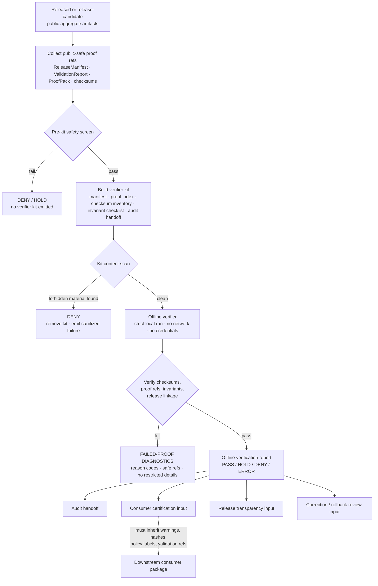

<!-- [KFM_META_BLOCK_V2]
doc_id: kfm://doc/TODO-register-ebird-independent-verification-uuid
title: eBird Layer 32 Independent Verification
type: standard
version: v1
status: draft
owners: TODO(fauna-domain-stewards)
created: TODO(verify-original-created-date-or-set-on-first-commit)
updated: 2026-05-07
policy_label: TODO(verify-public-or-restricted)
related: ["../../README.md", "../../SOURCE_ROLES.md", "../../GEOPRIVACY.md", "../../VALIDATION.md", "EBIRD_ARCHITECTURE.md", "EBIRD_CONFORMANCE.md", "EBIRD_ANALYTICS.md", "EBIRD_CONSUMER_INTEGRATION.md", "EBIRD_CONSUMER_CERTIFICATION.md", "EBIRD_CONSUMER_CHANGE_MANAGEMENT.md", "../../../../../policy/fauna/ebird.rego"]
tags: [kfm, fauna, ebird, independent-verification, verifier-kit, offline-audit, public-aggregate, geoprivacy]
notes: [Revises the existing short Layer 32 note into a repo-ready independent verification guide; doc_id, owners, created date, policy_label, executable paths, schema homes, and CI enforcement remain TODO or NEEDS VERIFICATION until registry, steward, and checkout evidence confirm them.]
[/KFM_META_BLOCK_V2] -->

<a id="top"></a>

# eBird Layer 32 Independent Verification

Offline, local-only verifier-kit guidance for independently checking public-safe eBird aggregate artifacts without exposing raw rows, credentials, restricted observations, exact coordinates, or boundary geometries.

<p>
  
  
  
  
  
  
  
</p>

> [!IMPORTANT]
> **Impact block**
>
> | Field | Value |
> |---|---|
> | Status | `draft` |
> | Target path | `docs/domains/fauna/sources/ebird/EBIRD_INDEPENDENT_VERIFICATION.md` |
> | Layer | `32` |
> | Primary purpose | Build and verify public-safe eBird verifier kits for independent offline review |
> | Verification mode | Local-only; no network calls; no credentials; no source fetch |
> | Public geometry posture | Exact points remain restricted; verifier bundles must not include exact coordinates or boundary geometries |
> | Data posture | No real eBird rows, restricted observations, quarantine records, suppression internals, raw source files, or private source material |
> | What verification proves | Governance/public-safety artifact integrity for the tested release scope |
> | What verification does not prove | Live source activation, source terms currency, legal status, abundance, occupancy, true absence, population trend, causal effect, or complete census |
> | Quick jumps | [Scope](#scope) · [Repo fit](#repo-fit) · [Inputs](#inputs) · [Exclusions](#exclusions) · [Verification model](#verification-model) · [Layer 32 flow](#layer-32-flow) · [Verifier kit](#verifier-kit) · [Deterministic IDs](#deterministic-ids) · [Workflow commands](#workflow-commands) · [Gate matrix](#gate-matrix) · [Report contract](#report-contract) · [Review checklist](#review-checklist) · [Open verification](#open-verification) |

---

## Scope

Layer 32 defines how KFM produces and verifies an **independent verifier kit** for eBird-derived public aggregate artifacts.

The verifier kit is a local-only, public-safe packet that lets a reviewer, downstream consumer, steward, or audit process confirm that the release-facing eBird artifacts satisfy the declared governance and public-safety invariants. It is not a live connector, not a source downloader, and not a hidden copy of raw eBird data.

### Layer 32 is allowed to

- build a public-safe verifier kit from already-produced release, proof, checksum, validation, and conformance artifacts;
- verify kit contents offline in strict mode;
- confirm checksum and manifest consistency;
- confirm that public artifact field allowlists do not expose coordinate or geometry fields;
- confirm that the tested release remains aggregate-only and suppression-aware;
- confirm that exact points are restricted;
- confirm that proof and validation references are present;
- emit an offline verification report for review, consumer handoff, and audit response;
- emit failed-proof diagnostics that do **not** leak restricted details.

### Layer 32 is not allowed to

- download eBird data;
- call eBird APIs;
- require or validate credentials, API keys, cookies, tokens, or private URLs;
- package real eBird rows;
- package raw source files;
- package exact coordinates;
- package boundary geometries;
- package restricted observations;
- package quarantine records;
- package suppression receipts, suppressed-group hashes, or suppressed-group details;
- certify live source terms, source activation, legal status, abundance, occupancy, true absence, population trend, causal effect, or complete census;
- let public verification bypass policy, evidence, release, correction, or rollback controls.

> [!WARNING]
> A successful Layer 32 verification means “this verifier kit and its referenced public-safe artifacts satisfied the declared offline checks for the tested scope.” It does **not** mean the external source is currently approved, live source rights are current, ecological inference is valid, or production publication is authorized outside the referenced release.

[Back to top](#top)

---

## Repo fit

This file is a human-facing source-layer document under `docs/`. It explains verifier-kit behavior and review expectations. It does not own raw data, executable policy, machine schemas, generated reports, proof storage, release decisions, or credentials.

| Relationship | Status | Path / surface | Role |
|---|---:|---|---|
| This document | CONFIRMED target | `docs/domains/fauna/sources/ebird/EBIRD_INDEPENDENT_VERIFICATION.md` | Layer 32 independent verification guide |
| eBird architecture | CONFIRMED adjacent | [`EBIRD_ARCHITECTURE.md`](EBIRD_ARCHITECTURE.md) | Source-family architecture and trust-boundary guidance |
| Layer 10 conformance | CONFIRMED adjacent | [`EBIRD_CONFORMANCE.md`](EBIRD_CONFORMANCE.md) | Public aggregate conformance and acceptance rules |
| Layer 13 analytics | CONFIRMED adjacent | [`EBIRD_ANALYTICS.md`](EBIRD_ANALYTICS.md) | Public aggregate descriptive analytics rules |
| Consumer integration | CONFIRMED adjacent | [`EBIRD_CONSUMER_INTEGRATION.md`](EBIRD_CONSUMER_INTEGRATION.md) | Downstream consumer handoff posture |
| Consumer certification | CONFIRMED adjacent | [`EBIRD_CONSUMER_CERTIFICATION.md`](EBIRD_CONSUMER_CERTIFICATION.md) | Consumer-facing certification packet posture |
| Consumer change management | CONFIRMED adjacent | [`EBIRD_CONSUMER_CHANGE_MANAGEMENT.md`](EBIRD_CONSUMER_CHANGE_MANAGEMENT.md) | Downstream change and compatibility handling |
| Fauna domain landing page | NEEDS VERIFICATION | [`../../README.md`](../../README.md) | Domain overview, lifecycle, public-safety posture |
| Source-role rules | NEEDS VERIFICATION | [`../../SOURCE_ROLES.md`](../../SOURCE_ROLES.md) | Source role and claim compatibility |
| Geoprivacy rules | NEEDS VERIFICATION | [`../../GEOPRIVACY.md`](../../GEOPRIVACY.md) | Exact-location, redaction, and public geometry rules |
| Validation rules | NEEDS VERIFICATION | [`../../VALIDATION.md`](../../VALIDATION.md) | Validation and fixture expectations |
| eBird policy gate | NEEDS VERIFICATION | [`../../../../../policy/fauna/ebird.rego`](../../../../../policy/fauna/ebird.rego) | Public aggregate and exact-point denial rules |
| Verifier schemas | NEEDS VERIFICATION | `schemas/contracts/v1/...` or repo-accepted equivalent | Machine-checkable shape for verifier kits and reports |
| Verifier artifacts | NEEDS VERIFICATION | `data/proofs/`, `release/`, `data/published/`, or repo-accepted equivalent | Proof, release, and public-safe artifact homes |
| CLI executables | NEEDS VERIFICATION | repo-native package/entrypoint path | Build and run verifier-kit commands |

### Directory Rules basis

`docs/domains/fauna/sources/ebird/` is appropriate because this file is **human-facing domain/source documentation**. The eBird source family must not become a root-level topic folder. Machine schemas, policies, tests, fixtures, generated artifacts, receipts, proofs, releases, and published derivatives belong under their responsibility roots.

[Back to top](#top)

---

## Inputs

Layer 32 accepts only local, public-safe verifier inputs. The verifier may reference proof and release artifacts by digest or identifier, but it must not embed restricted evidence.

| Input | Accepted? | Required posture |
|---|---:|---|
| Verifier manifest | ✅ | Describes kit identity, scope, aggregate target, release refs, proof refs, checksum refs, adapter version, and verification rules |
| Proof index | ✅ | References public-safe proof records by ID/hash; no restricted row content |
| Checksum inventory | ✅ | Lists hashes for kit members and referenced public-safe outputs |
| Invariant checklist | ✅ | Machine-readable list of expected public-safety invariants |
| Audit handoff | ✅ | Human-readable review packet; no credentials, exact points, raw rows, quarantine details, or suppression internals |
| Offline verification report | ✅ | Output of strict offline verification |
| Failed-proof diagnostics | ✅ | Sanitized reason codes and artifact refs only |
| Public aggregate release refs | ✅ | References only; public-safe county/HUC12 or approved aggregate artifacts |
| Validation reports | ✅ | Public-safe or review-safe summaries; no restricted records |
| Release manifest / promotion refs | ✅ | Public-safe release identity and rollback refs |
| EvidenceBundle refs | ✅ | Public-safe references; do not embed restricted evidence |
| Synthetic fixture kits | ✅ | Preferred for tests and red-team checks |
| Real eBird source rows | ❌ | Excluded from verifier kits |
| Boundary geometries | ❌ | Excluded to prevent reverse-engineering or false precision |
| Exact coordinates | ❌ | Excluded from all public verifier material |
| Credentials or private source links | ❌ | Excluded from all docs, kits, logs, reports, examples, and diagnostics |

### Minimum accepted public verification assertions

| Assertion | Required value |
|---|---|
| `verification_mode` | `offline` |
| `network_required` | `false` |
| `credentials_required` | `false` |
| `contains_real_ebird_rows` | `false` |
| `contains_exact_coordinates` | `false` |
| `contains_boundary_geometries` | `false` |
| `contains_restricted_observations` | `false` |
| `contains_quarantine_records` | `false` |
| `contains_suppression_internals` | `false` |
| `exact_points` | `restricted` |
| `policy_label` | `public_aggregate` or stricter |
| `aggregate` | `county`, `huc12`, or explicitly approved public-safe aggregate |
| `suppression_min_n` | `>= 10` when validating public aggregate rows |
| `kfm:spec_hash` | present and valid where expected |
| `verifier_kit_id` | deterministic and reproducible |
| `verification_id` | deterministic and reproducible for the checked kit/proof/checksum scope |

[Back to top](#top)

---

## Exclusions

| Excluded material | Required handling | Why |
|---|---|---|
| Network calls | Deny | Independent verification must be reproducible offline |
| Credentials, API keys, tokens, cookies, private URLs | Deny | Secrets never belong in verifier kits, docs, logs, or reports |
| Real eBird rows | Deny | The kit verifies public-safe artifacts, not raw source rows |
| Exact coordinates | Deny | Exact public points are restricted |
| Boundary geometries | Deny | Boundary geometry can enable reverse-engineering or imply false precision |
| Restricted observations | Deny | Public verifier kits cannot carry restricted records |
| Quarantine records | Deny | Quarantine is not public evidence |
| Suppression receipts and suppressed-group details | Deny | Suppression internals can leak low-count or sensitive patterns |
| Raw source files | Deny | Source-native payloads remain in governed lifecycle homes only |
| Legal-status claims | Deny unless supported elsewhere | eBird is occurrence support, not legal-status authority |
| Abundance, occupancy, true absence, population trend, causal, or census claims | Deny or hold | Public aggregate verification does not support those claims |
| AI-written verification without artifact checks | Deny | Verification is checksum/proof/invariant based, not model-prose based |
| Silent overwrite of prior verification | Deny | Supersession, correction, and rollback lineage must remain visible |

[Back to top](#top)

---

## Verification model

Layer 32 uses a **two-step independent verification model**:

1. **Build kit** — produce a public-safe verifier kit from release/proof/checksum artifacts.
2. **Verify offline** — run a strict local verifier against the kit and emit a report.

The reviewer does not need raw source access. The reviewer does not need network access. The reviewer does not need credentials. The reviewer verifies integrity, declared public-safety invariants, proof references, checksum consistency, and handoff completeness for the tested scope.

### What the verifier can prove

| Verification target | Proves |
|---|---|
| Kit manifest consistency | The kit identifies its scope, inputs, outputs, aggregate target, adapter version, and expected checks |
| Checksum inventory | Kit files and referenced public-safe artifacts match expected digests |
| Public-safety invariant checklist | The tested artifacts declare and preserve required no-leak conditions |
| Proof index | Referenced proof objects are listed, hashed, and linked for review |
| Release linkage | The kit is tied to a release or release candidate identity |
| Audit handoff | A reviewer can inspect status, warnings, failures, and open obligations without restricted data |
| Failed-proof diagnostics | Failures are explainable through reason codes without leaking protected content |

### What the verifier cannot prove

| Misread | Correct interpretation |
|---|---|
| “eBird is activated as a live source.” | Source activation is separate and remains governed by SourceDescriptor and SourceActivationDecision. |
| “External source terms are current.” | Terms, citation, redistribution, and allowed use require fresh source review. |
| “The source data is complete.” | Public aggregate artifacts are not complete source evidence. |
| “The species is present or absent.” | Public aggregate verification is not an occurrence truth engine. |
| “Counts show abundance or trend.” | Counts describe the released aggregate artifact only. |
| “The verifier can recover exact observations.” | That would be a failure; exact coordinates and raw rows are excluded. |
| “The kit replaces EvidenceBundle resolution.” | The kit references proof/evidence objects; it does not become sovereign truth. |

[Back to top](#top)

---

## Layer 32 flow



### Flow rules

1. A verifier kit is built only from public-safe release/proof/checksum surfaces.
2. The verifier kit must fail if it contains raw rows, restricted observations, exact coordinates, boundary geometries, credentials, quarantine records, or suppression internals.
3. Offline verification must not call source services, map services, AI services, or remote schemas.
4. A failed verification emits reason-coded diagnostics without leaking restricted payloads.
5. Passing verification can support audit, transparency, and consumer handoff, but does not automatically publish anything.
6. Superseded verification reports must remain linked through correction or release lineage.

[Back to top](#top)

---

## Verifier kit

A verifier kit is a compact packet. It should be easy to copy, inspect, archive, compare, and rerun.

### Required kit members

| Kit member | Required? | Purpose | Must not contain |
|---|---:|---|---|
| `verifier_manifest.json` | ✅ | Declares kit identity, aggregate targets, release refs, input hashes, bundle refs, adapter version, and expected checks | Credentials, raw rows, exact coordinates, boundary geometries |
| `proof_index.json` | ✅ | Lists proof, validation, release, catalog, and evidence refs by ID/hash | Restricted evidence payloads or private source fields |
| `checksum_inventory.json` | ✅ | Lists kit file hashes and public artifact hashes | Secret-derived values or private source payload hashes that reveal protected detail |
| `invariant_checklist.json` | ✅ | Machine-readable public-safety invariant list | Free-form unreviewed claims |
| `audit_handoff.md` | ✅ | Human-readable review and handoff summary | Restricted rows, exact locations, suppression internals |
| `offline_verification_report.json` | Output | Result emitted by the verifier | Raw rows or forbidden content |
| `failed_proof_diagnostics.json` | Conditional output | Safe reason-coded failure report | Raw failing payloads or sensitive geometry |
| `README.md` | Recommended | Kit orientation for reviewers | Secrets, endpoints requiring credentials, or source-fetch instructions |
| `SIGNATURES_OR_ATTESTATIONS.md` | Optional / NEEDS VERIFICATION | Notes on signatures/attestations if repo release tooling supports them | Claims of signing enforcement without toolchain evidence |

### Kit directory shape

```text
ebird-layer32-verifier-kit/
├── README.md
├── verifier_manifest.json
├── proof_index.json
├── checksum_inventory.json
├── invariant_checklist.json
├── audit_handoff.md
├── reports/
│   ├── offline_verification_report.json
│   └── failed_proof_diagnostics.json
└── OPTIONAL_SIGNATURES_OR_ATTESTATIONS.md
```

> [!NOTE]
> This directory shape is a documentation contract, not confirmed generated output. The final artifact path must follow the repo’s accepted build/release conventions after checkout verification.

[Back to top](#top)

---

## Deterministic IDs

Layer 32 keeps deterministic IDs so independent verification can be reproduced and compared.

### `verifier_kit_id`

`verifier_kit_id` is derived from the kit recipe:

```text
verifier_kit_id =
  sha256(canonical_json({
    aggregate_targets,
    input_hashes,
    release_refs,
    proof_index_hash,
    checksum_inventory_hash,
    invariant_checklist_hash,
    bundle_ref,
    adapter_name,
    adapter_version,
    verifier_contract_version
  }))
```

### `verification_id`

`verification_id` is derived from the offline verification run scope:

```text
verification_id =
  sha256(canonical_json({
    verifier_kit_id,
    kit_manifest_hash,
    proof_index_hash,
    checksum_inventory_hash,
    invariant_checklist_hash,
    strict,
    verifier_adapter_name,
    verifier_adapter_version,
    verification_contract_version
  }))
```

### Canonicalization rules

| Rule | Required behavior |
|---|---|
| Canonical JSON | Use repo-approved canonical JSON serialization once confirmed |
| Stable order | Sort object keys and list entries where semantics allow |
| Volatile fields | Exclude run-local volatile fields from content IDs only when the contract explicitly allows exclusion |
| Hash format | Use `sha256:<64 lowercase hex characters>` where policy expects hash strings |
| Scope clarity | Do not use the same hash for source payloads, kit content, proof packs, verification reports, and releases |
| Failure | Missing or mismatched ID/hash blocks verification pass |

### Fields that must not be excluded casually

- `aggregate_targets`
- `input_hashes`
- `release_refs`
- `proof_index_hash`
- `checksum_inventory_hash`
- `invariant_checklist_hash`
- `bundle_ref`
- `adapter_version`
- `strict`
- `policy_label`
- `exact_points`
- `public_safe`
- `suppression_min_n`
- `allowlist_fields`
- correction or supersession refs

[Back to top](#top)

---

## Workflow commands

The existing Layer 32 note names two command families. Treat these as **documented command contracts** until executable locations, package scripts, and CI invocation are verified in a checked-out repo.

### Build kit

```bash
# PROPOSED/NEEDS VERIFICATION — verify executable path before use.
kfm-ebird-verifier-kit \
  --mode build \
  --release-ref TODO \
  --aggregate both \
  --out build/fauna/ebird/layer32/verifier-kit
```

### Verify offline

```bash
# PROPOSED/NEEDS VERIFICATION — verify executable path before use.
kfm-ebird-verify-offline \
  --mode run \
  --kit build/fauna/ebird/layer32/verifier-kit \
  --strict \
  --json \
  --out build/fauna/ebird/layer32/verification/offline_verification_report.json
```

### Required command behavior

| Command | Required posture |
|---|---|
| `kfm-ebird-verifier-kit --mode build` | Builds only from local release/proof/checksum inputs |
| `kfm-ebird-verifier-kit --mode build` | Fails if inputs require network, credentials, raw source rows, exact coordinates, boundary geometries, restricted records, quarantine records, or suppression internals |
| `kfm-ebird-verify-offline --mode run --strict` | Runs without network, credentials, remote schema lookup, live source calls, or model calls |
| `kfm-ebird-verify-offline --mode run --strict` | Emits `PASS`, `HOLD`, `DENY`, or `ERROR` with stable reason codes |
| both | Do not print secrets, exact coordinates, raw rows, restricted payloads, or suppressed-group details |
| both | Emit machine-readable reports suitable for CI/review once repo execution is confirmed |

[Back to top](#top)

---

## Gate matrix

| Gate | Outcome on failure | Required check |
|---|---:|---|
| Local-only gate | `DENY` / `ERROR` | No network calls, downloads, source API calls, remote schema lookup, or model calls |
| Credential gate | `DENY` | No credentials, tokens, cookies, API keys, private URLs, or secret-looking values |
| Raw-row gate | `DENY` | No real eBird rows or source-native records |
| Exact-coordinate gate | `DENY` | No latitude, longitude, point, coordinate, or exact geometry fields |
| Boundary-geometry gate | `DENY` | No county/HUC/boundary geometries packaged in verifier kit |
| Restricted-observation gate | `DENY` | No restricted observations or restricted record identifiers that reveal sensitive detail |
| Quarantine gate | `DENY` | No quarantine records, quarantine paths, or unresolved blocked payloads |
| Suppression-internal gate | `DENY` | No suppression receipts, suppressed group hashes, or suppressed group details |
| Aggregate gate | `DENY` | Public artifact scope is `county`, `huc12`, or explicitly approved public-safe aggregate |
| Suppression threshold gate | `DENY` | Public aggregate checks preserve `suppression_min_n >= 10` where applicable |
| Exact-points posture gate | `DENY` | Public artifacts and kit metadata keep `exact_points=restricted` |
| Policy-label gate | `DENY` | Public aggregate artifacts use `policy_label=public_aggregate` or stricter |
| Spec-hash gate | `DENY` | `kfm:spec_hash` exists and matches expected format where required |
| Proof index gate | `HOLD` / `DENY` | Proof refs and hashes are present and consistent |
| Checksum inventory gate | `DENY` / `ERROR` | Kit members and referenced artifacts match checksum inventory |
| Invariant checklist gate | `DENY` | Required invariants are present and pass |
| Evidence handoff gate | `HOLD` / `ABSTAIN` | Claim-bearing refs are traceable to public-safe proof or EvidenceBundle refs |
| Release linkage gate | `HOLD` | Kit references a release or release candidate identity |
| Correction lineage gate | `HOLD` | Superseded kits/reports keep prior/current references |
| Diagnostics safety gate | `DENY` | Failed-proof diagnostics do not embed forbidden material |

### Negative states

| State | Use |
|---|---|
| `PASS` | Kit and referenced public-safe artifacts satisfy the checked Layer 32 scope |
| `HOLD` | Verification needs maintainer, steward, source-rights, or release review |
| `DENY` | Verification found policy, safety, leakage, source-role, or release-state blocker |
| `ERROR` | Tooling, schema, checksum, missing-file, or runtime failure prevents reliable verification |
| `ABSTAIN` | Claim-bearing verification cannot support requested interpretation from available proof |

[Back to top](#top)

---

## Report contract

> [!NOTE]
> Field names below are a documentation contract for maintainers. Machine schemas and executable validators must live in accepted schema/validator homes after repo verification.

### Offline verification report fields

| Field | Status | Purpose |
|---|---:|---|
| `object_type` | PROPOSED | Suggested value: `EbirdIndependentVerificationReport` |
| `layer` | CONFIRMED | Suggested value: `32` |
| `source_family` | CONFIRMED | Suggested value: `ebird` |
| `verification_id` | CONFIRMED contract | Deterministic ID for this offline verification scope |
| `verifier_kit_id` | CONFIRMED contract | Deterministic ID for the verifier kit |
| `mode` | CONFIRMED | `offline` |
| `strict` | CONFIRMED | Boolean strict-mode flag |
| `status` | PROPOSED | `PASS`, `HOLD`, `DENY`, `ERROR`, or `ABSTAIN` where applicable |
| `aggregate_targets` | CONFIRMED contract | County, HUC12, both, or approved aggregate target |
| `release_refs` | PROPOSED | Release or release-candidate refs checked |
| `proof_refs` | PROPOSED | Proof index refs checked |
| `checksum_inventory_hash` | CONFIRMED contract | Hash of checksum inventory |
| `invariant_checklist_hash` | CONFIRMED contract | Hash of invariant checklist |
| `adapter_name` | PROPOSED | Verifier adapter name |
| `adapter_version` | CONFIRMED contract | Verifier adapter version |
| `forbidden_content_scan` | PROPOSED | Summary of no-network/no-credentials/no-raw/no-exact/no-boundary checks |
| `gate_results` | PROPOSED | Per-gate result and reason codes |
| `blocking_failures` | PROPOSED | Safe failure list |
| `warnings` | PROPOSED | Non-blocking caveats |
| `open_obligations` | PROPOSED | Verification or review tasks still unresolved |
| `evidence_refs` | PROPOSED | Public-safe evidence/proof/release refs |
| `correction_lineage` | PROPOSED | Supersession, correction, withdrawal, or rollback refs |
| `generated_at` | PROPOSED | Report generation time; do not use as content ID input unless contract requires |
| `kfm:spec_hash` | PROPOSED | Report content hash or linked public artifact hash, depending accepted schema |

### Illustrative report

```json
{
  "object_type": "EbirdIndependentVerificationReport",
  "layer": 32,
  "source_family": "ebird",
  "mode": "offline",
  "strict": true,
  "status": "HOLD",
  "verifier_kit_id": "sha256:TODO",
  "verification_id": "sha256:TODO",
  "aggregate_targets": ["county", "huc12"],
  "release_refs": ["TODO"],
  "proof_refs": ["TODO"],
  "checksum_inventory_hash": "sha256:TODO",
  "invariant_checklist_hash": "sha256:TODO",
  "adapter_name": "kfm-ebird-offline-verifier",
  "adapter_version": "TODO",
  "forbidden_content_scan": {
    "network_required": false,
    "credentials_found": false,
    "real_ebird_rows_found": false,
    "exact_coordinates_found": false,
    "boundary_geometries_found": false,
    "restricted_observations_found": false,
    "quarantine_records_found": false,
    "suppression_internals_found": false
  },
  "gate_results": [
    {
      "gate": "local_only",
      "result": "PASS",
      "reason_codes": []
    },
    {
      "gate": "source_terms_current",
      "result": "HOLD",
      "reason_codes": ["source_terms.needs_verification"]
    }
  ],
  "blocking_failures": [],
  "warnings": [
    "External eBird source terms and live source activation remain separate governed decisions."
  ],
  "open_obligations": [
    "Verify current source descriptor, source terms, and steward approval before live activation."
  ],
  "evidence_refs": ["TODO"],
  "correction_lineage": [],
  "kfm:spec_hash": "sha256:TODO"
}
```

[Back to top](#top)

---

## Failed-proof diagnostics

Failed diagnostics are useful only when they are safe to share with maintainers and reviewers.

| Diagnostic requirement | Required behavior |
|---|---|
| Reason codes | Use stable codes such as `credentials.found`, `coordinates.public_leak`, `kit.boundary_geometry_found` |
| Artifact refs | Reference file/path IDs, object IDs, or hashes without embedding restricted payloads |
| Snippets | Avoid snippets from raw rows, exact coordinates, private URLs, or suppressed groups |
| Severity | Use `critical`, `high`, `medium`, `low`, or repo-approved equivalent |
| Remediation | State the smallest safe fix |
| Public-safe summary | Provide a reviewer-safe explanation |
| Exit condition | State what must change for the gate to pass |
| Audit link | Reference validation, policy, release, or correction records where available |

### Suggested reason codes

| Reason code | Meaning |
|---|---|
| `network.forbidden` | Verification attempted or required network access |
| `credentials.found` | Credential-like value appeared in kit, report, log, or diagnostic |
| `source_row.found` | Real eBird-like raw/source row appeared in verifier material |
| `coordinates.public_leak` | Exact coordinate or geometry field appeared |
| `boundary_geometry.found` | Boundary geometry appeared in verifier kit |
| `restricted_observation.found` | Restricted observation material appeared |
| `quarantine.found` | Quarantine record/path appeared |
| `suppression_internal.found` | Suppression receipt, suppressed group hash, or suppressed details appeared |
| `aggregate.unsupported` | Aggregate target is not allowed |
| `suppression.too_low` | Suppression threshold is below required minimum |
| `spec_hash.invalid` | Hash missing, malformed, or mismatched |
| `proof_index.incomplete` | Required proof refs or hashes missing |
| `checksum.mismatch` | File or artifact checksum mismatch |
| `release_ref.missing` | Release or release-candidate ref missing |
| `lineage.missing` | Supersession/correction/rollback lineage missing |
| `source_terms.needs_verification` | Source terms/citation/activation remain unresolved |

[Back to top](#top)

---

## Downstream handoff

Layer 32 supports review and handoff. It does not replace release approval or source activation.

| Downstream surface | Receives | Must preserve |
|---|---|---|
| Audit response | Offline verification report, failed-proof diagnostics, audit handoff | Reason codes, safe refs, open obligations, no restricted details |
| Consumer certification | PASS/HOLD verification summary and kit refs | Warnings, hashes, policy labels, validation refs, correction lineage |
| Portal/download transparency | Public-safe verification summary | No raw rows, exact points, credentials, suppression internals, or boundary geometries |
| Release review | Verification report as one piece of the release dossier | Release refs, proof refs, rollback/correction context |
| Correction review | Prior/current verification reports | Supersession and correction lineage |
| Evidence Drawer / Focus Mode | Public-safe release/proof refs only | Finite outcomes and citations; no raw verifier internals as proof |

[Back to top](#top)

---

## Review checklist

Before approving Layer 32 changes, verify:

- [ ] Metadata block TODOs remain intentional or are replaced with registry-confirmed values.
- [ ] Related links are valid from this file or clearly marked `NEEDS VERIFICATION`.
- [ ] The document keeps Layer 32 local-only.
- [ ] No example command performs a live source download.
- [ ] No example requires credentials.
- [ ] No example prints, validates, or stores credentials.
- [ ] No verifier kit member includes real eBird rows.
- [ ] No verifier kit member includes exact coordinates.
- [ ] No verifier kit member includes boundary geometries.
- [ ] No verifier kit member includes restricted observations.
- [ ] No verifier kit member includes quarantine records.
- [ ] No verifier kit member includes suppression receipts, suppressed group hashes, or suppressed group details.
- [ ] Deterministic ID recipes include aggregate targets, input hashes, bundle/proof/checksum hashes, strict mode where relevant, and adapter version.
- [ ] Hash examples use `sha256:<64 lowercase hex characters>` where required.
- [ ] Failed-proof diagnostics are sanitized.
- [ ] Public aggregate verification still preserves `exact_points=restricted`.
- [ ] Public aggregate verification still preserves `suppression_min_n >= 10` where public aggregate rows are checked.
- [ ] Public aggregate verification does not claim abundance, occupancy, true absence, trend, causal effect, legal status, or complete census.
- [ ] Verification reports preserve release/proof/evidence refs.
- [ ] Superseded verifier kits and reports keep correction or release lineage.
- [ ] Downstream consumer/audit handoff inherits warnings, hashes, policy labels, and validation refs.
- [ ] Any executable path or CI claim remains `NEEDS VERIFICATION` until verified in a checkout.

[Back to top](#top)

---

## Open verification

| Item | Status | Needed proof |
|---|---:|---|
| Registered `doc_id` | TODO | Document registry entry |
| Owners | TODO | CODEOWNERS, steward assignment, or governance registry |
| Created date | TODO | Git history or steward-approved first-commit date |
| Policy label | TODO | Repo policy classification |
| Source descriptor | NEEDS VERIFICATION | eBird SourceDescriptor with source role, rights, citation, access, cadence, and sensitivity |
| Source activation | BLOCKED / NEEDS VERIFICATION | SourceActivationDecision before live source use |
| CLI executable path | NEEDS VERIFICATION | Actual package entrypoints or scripts for `kfm-ebird-verifier-kit` and `kfm-ebird-verify-offline` |
| Package manager / test runner | UNKNOWN | Repo-native scripts, Make targets, Python tooling, Node tooling, or CI workflow |
| Verifier kit schema | PROPOSED | JSON Schema or repo-native machine-checkable contract |
| Verification report schema | PROPOSED | JSON Schema or repo-native machine-checkable contract |
| Hash canonicalization implementation | NEEDS VERIFICATION | Repo-approved canonical JSON implementation and tests |
| Policy runner | NEEDS VERIFICATION | OPA/Conftest/Rego or repo-native policy tooling |
| Release/proof homes | NEEDS VERIFICATION | Accepted paths for verifier kits, reports, release refs, proof refs, and audit handoff |
| CI enforcement | UNKNOWN | Workflow evidence and check results |
| eBird terms/citation review | NEEDS VERIFICATION | Fresh source-rights and terms review before any live activation |
| Consumer inheritance checks | NEEDS VERIFICATION | Tests proving warnings, hashes, validation refs, policy labels, and correction refs propagate |
| Red-team fixtures | NEEDS VERIFICATION | Synthetic-only tests for forbidden content, no real rows, no credentials, no exact coordinates |
| Signing/attestation | NEEDS VERIFICATION | Repo-approved release signing or attestation toolchain before claiming enforcement |

[Back to top](#top)

---

## Appendix

<details>
<summary>Negative fixture ideas</summary>

| Fixture | Expected result |
|---|---|
| `verifier_kit_network_required.json` | `DENY` |
| `verifier_kit_credentials_found.json` | `DENY` |
| `verifier_kit_private_url_found.json` | `DENY` |
| `verifier_kit_real_ebird_row_found.json` | `DENY` |
| `verifier_kit_latitude_field_found.json` | `DENY` |
| `verifier_kit_longitude_field_found.json` | `DENY` |
| `verifier_kit_geometry_field_found.json` | `DENY` |
| `verifier_kit_boundary_geojson_found.json` | `DENY` |
| `verifier_kit_restricted_observation_found.json` | `DENY` |
| `verifier_kit_quarantine_path_found.json` | `DENY` |
| `verifier_kit_suppression_receipt_found.json` | `DENY` |
| `verifier_kit_suppressed_group_hash_found.json` | `DENY` |
| `verifier_kit_missing_proof_index.json` | `HOLD` or `DENY` |
| `verifier_kit_checksum_mismatch.json` | `DENY` |
| `verifier_kit_missing_release_ref.json` | `HOLD` |
| `verifier_kit_suppression_min_5.json` | `DENY` |
| `verifier_kit_bad_spec_hash.json` | `DENY` |
| `verifier_report_claims_population_trend.md` | `HOLD` |
| `verifier_report_claims_true_absence.md` | `ABSTAIN` or `HOLD` |
| `verifier_report_claims_legal_status_from_ebird.md` | `DENY` |

</details>

<details>
<summary>Safe wording snippets</summary>

Use these snippets in audit handoffs, verification summaries, and consumer-facing documentation.

- “This kit verifies public-safe eBird aggregate artifact integrity for the declared release scope.”
- “This verification is offline and local-only.”
- “The verifier kit does not contain raw eBird rows.”
- “The verifier kit does not contain exact coordinates or boundary geometries.”
- “No credentials, tokens, cookies, private URLs, restricted observations, quarantine records, or suppression internals are included.”
- “Counts describe released public aggregate artifacts only.”
- “This report must not be interpreted as abundance, occupancy, true absence, population trend, causal effect, legal status, or complete census.”
- “External source activation, source terms, citation requirements, and production release remain separate governed decisions.”

</details>

<details>
<summary>Maintainer update triggers</summary>

Update this file when any of the following changes:

- Layer 32 command names;
- verifier kit member names;
- verifier kit schema;
- offline verification report schema;
- deterministic ID recipe;
- hash canonicalization implementation;
- proof index format;
- checksum inventory format;
- invariant checklist format;
- release/proof/correction homes;
- public aggregate policy fields;
- exact-point or coordinate-field rules;
- boundary-geometry exclusion rules;
- suppression threshold;
- source activation workflow;
- consumer certification handoff;
- audit response packet shape;
- failed-proof diagnostics shape;
- red-team fixtures;
- CI enforcement path;
- signing or attestation tooling;
- Evidence Drawer or Focus Mode use of verification outputs.

</details>

---

<p align="right"><a href="#top">Back to top ↑</a></p>
