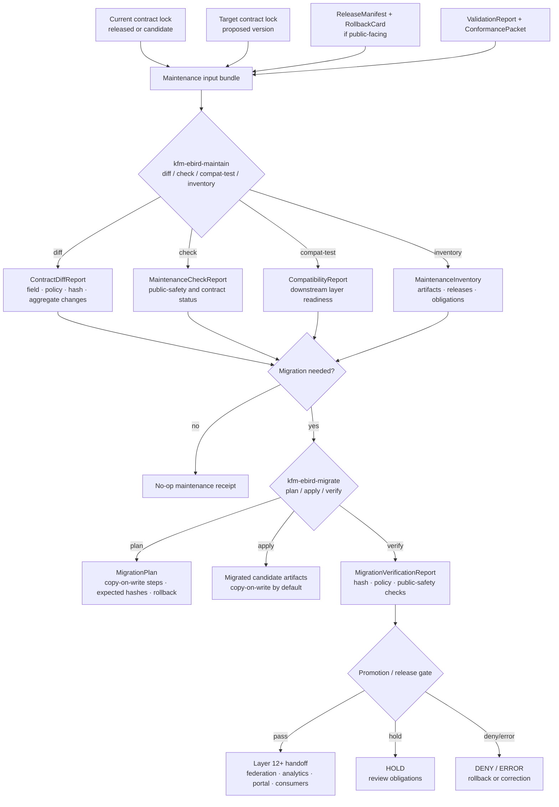

<!-- [KFM_META_BLOCK_V2]
doc_id: kfm://doc/TODO-register-ebird-maintenance-uuid
title: eBird Maintenance
type: standard
version: v1
status: draft
owners: TODO(fauna-source-stewards)
created: TODO(verify-original-created-date-or-set-on-first-commit)
updated: 2026-05-07
policy_label: TODO(verify-public-or-restricted)
related: ["../../README.md", "../../INGEST_EBIRD.md", "../../SOURCE_ROLES.md", "../../GEOPRIVACY.md", "../../VALIDATION.md", "EBIRD_ARCHITECTURE.md", "EBIRD_CONTRACTS.md", "EBIRD_CONFORMANCE.md", "EBIRD_FEDERATION.md", "EBIRD_ANALYTICS.md", "EBIRD_PORTAL.md", "EBIRD_QUALITY_AND_TRIAGE.md", "EBIRD_CONSUMER_CHANGE_MANAGEMENT.md", "../../../../runbooks/fauna/EBIRD_OPERATIONS.md", "../../../../../policy/fauna/ebird.rego", "../../../../../tests/connectors/fauna/test_kfm_ebird_layer11.py"]
tags: [kfm, fauna, ebird, maintenance, migration, compatibility, public-safety, layer-11]
notes: [Revises an existing short Layer 11 eBird maintenance note; doc_id, owners, created date, and policy_label require registry/steward verification; target file and adjacent eBird documentation were inspected through the GitHub connector on main; local workspace was not a mounted checkout.]
[/KFM_META_BLOCK_V2] -->

<a id="top"></a>

# eBird Maintenance

Layer 11 maintenance, compatibility, migration, inventory, deprecation, and public-safety governance for KFM’s public aggregate eBird lane.

<p>
  
  
  
  
  
  
  
</p>

> [!IMPORTANT]
> **Impact block**
>
> | Field | Value |
> |---|---|
> | Status | `draft` |
> | Target path | `docs/domains/fauna/sources/ebird/EBIRD_MAINTENANCE.md` |
> | Primary role | Layer 11 eBird maintenance control document |
> | Source role | eBird remains occurrence support, not legal-status authority |
> | Public geometry posture | No public exact coordinates; public eBird outputs remain aggregate/generalized |
> | Migration posture | Copy-on-write by default; destructive or in-place changes require explicit force, review, receipts, and rollback |
> | Command posture | `kfm-ebird-maintain` and `kfm-ebird-migrate` are documented/test-referenced command contracts; executable path and CI enforcement remain **NEEDS VERIFICATION** until checked in a live checkout |
> | Quick jumps | [Scope](#scope) · [Repo fit](#repo-fit) · [Inputs](#inputs) · [Exclusions](#exclusions) · [Maintenance flow](#maintenance-flow) · [Mode matrix](#mode-matrix) · [Migration contract](#migration-contract) · [Public safety](#public-safety) · [Inventory and reporting](#inventory-and-reporting) · [Validation gates](#validation-gates) · [Review checklist](#review-checklist) · [Open verification](#open-verification) |

---

## Scope

Layer 11 exists to keep the eBird lane maintainable after the first public-safe aggregate contract exists. It covers contract drift, compatibility checks, deprecation handling, maintenance reporting, inventory, public-safety scans, and migration planning.

The original note established the core Layer 11 contract:

- `kfm-ebird-maintain --mode diff|check|compat-test|deprecate|maintenance-report|inventory|public-safety-scan`
- `kfm-ebird-migrate --mode plan|apply|verify`
- migrations are copy-on-write by default
- exact coordinates must never be published
- Layer 12 federation/export is the downstream handoff after safe maintenance

This revision preserves that substance and expands it into a reviewable maintainer document.

### Layer 11 governs

| Surface | Purpose |
|---|---|
| Contract diff | Compare current and target eBird contract locks, policy summaries, public field lists, aggregate modes, and hash recipes. |
| Contract check | Verify a single contract or artifact family still satisfies Layer 10 and policy obligations. |
| Compatibility testing | Prove downstream Layer 12+ consumers can still read public-safe aggregate outputs without weakening safety. |
| Deprecation | Mark old contract versions, fields, modes, routes, or output layouts as deprecated without deleting lineage. |
| Maintenance reporting | Produce human-reviewable local reports for stewards, release reviewers, and downstream maintainers. |
| Inventory | List eBird public-safe artifacts, contract locks, release refs, validation refs, and known maintenance obligations. |
| Public-safety scan | Detect exact-coordinate leakage, suppressed detail leakage, unsafe claim language, credential leakage, and policy drift. |
| Migration plan/apply/verify | Move from one public-safe contract version to another using copy-on-write migration and explicit verification. |

### Layer 11 does not govern

| Not governed here | Owning surface |
|---|---|
| Source admission and live eBird activation | Source registry and activation decision |
| Raw eBird ingestion/productization | [`../../INGEST_EBIRD.md`](../../INGEST_EBIRD.md) |
| Contract semantics | [`EBIRD_CONTRACTS.md`](EBIRD_CONTRACTS.md) |
| Local conformance acceptance | [`EBIRD_CONFORMANCE.md`](EBIRD_CONFORMANCE.md) |
| Public federation/export | [`EBIRD_FEDERATION.md`](EBIRD_FEDERATION.md) |
| Analytics claim boundary | [`EBIRD_ANALYTICS.md`](EBIRD_ANALYTICS.md) |
| Portal/download publication | [`EBIRD_PORTAL.md`](EBIRD_PORTAL.md) |
| Operational QA and triage | [`EBIRD_QUALITY_AND_TRIAGE.md`](EBIRD_QUALITY_AND_TRIAGE.md) |
| Executable policy | [`../../../../../policy/fauna/ebird.rego`](../../../../../policy/fauna/ebird.rego) |
| Raw data, work products, quarantine material, receipts, proofs, and release decisions | `data/` and `release/` responsibility roots |

[Back to top](#top)

---

## Repo fit

This file is a human-facing documentation/control-plane file. It belongs under the fauna source documentation lane because it explains how maintainers should operate the eBird maintenance layer.

| Relationship | Status | Path / surface | Role |
|---|---:|---|---|
| This file | CONFIRMED target | `docs/domains/fauna/sources/ebird/EBIRD_MAINTENANCE.md` | Layer 11 maintenance guidance |
| Fauna overview | CONFIRMED | [`../../README.md`](../../README.md) | Domain context, lifecycle, public safety, and source-role posture |
| eBird ingest hub | CONFIRMED | [`../../INGEST_EBIRD.md`](../../INGEST_EBIRD.md) | Layer 10 ingest/productization and public aggregate contract |
| Source-role doctrine | CONFIRMED | [`../../SOURCE_ROLES.md`](../../SOURCE_ROLES.md) | Role/claim compatibility |
| Geoprivacy | CONFIRMED | [`../../GEOPRIVACY.md`](../../GEOPRIVACY.md) | Exact-location and public geometry rules |
| Validation | CONFIRMED / NEEDS VERIFICATION for current enforcement | [`../../VALIDATION.md`](../../VALIDATION.md) | Validation vocabulary and fixture-first posture |
| eBird architecture | CONFIRMED | [`EBIRD_ARCHITECTURE.md`](EBIRD_ARCHITECTURE.md) | Source-family architecture and trust boundary |
| eBird contracts | CONFIRMED | [`EBIRD_CONTRACTS.md`](EBIRD_CONTRACTS.md) | Contract, hash, policy, and public aggregate rules |
| Layer 10 conformance | CONFIRMED | [`EBIRD_CONFORMANCE.md`](EBIRD_CONFORMANCE.md) | Local-only acceptance and conformance checks |
| Layer 12 federation/export | CONFIRMED | [`EBIRD_FEDERATION.md`](EBIRD_FEDERATION.md) | Downstream public-safe export and discovery |
| Layer 13 analytics | CONFIRMED | [`EBIRD_ANALYTICS.md`](EBIRD_ANALYTICS.md) | Descriptive public aggregate analytics |
| Layer 14 portal/downloads | CONFIRMED | [`EBIRD_PORTAL.md`](EBIRD_PORTAL.md) | Static portal and download bundle manifests |
| Layer 21 quality/triage | CONFIRMED | [`EBIRD_QUALITY_AND_TRIAGE.md`](EBIRD_QUALITY_AND_TRIAGE.md) | Operational QA and triage |
| Consumer change management | CONFIRMED | [`EBIRD_CONSUMER_CHANGE_MANAGEMENT.md`](EBIRD_CONSUMER_CHANGE_MANAGEMENT.md) | Downstream impact and upgrade-pack governance |
| Operations runbook | CONFIRMED | [`../../../../runbooks/fauna/EBIRD_OPERATIONS.md`](../../../../runbooks/fauna/EBIRD_OPERATIONS.md) | Scan, trend, attest, evidence-pack, and incident workflows |
| Policy gate | CONFIRMED | [`../../../../../policy/fauna/ebird.rego`](../../../../../policy/fauna/ebird.rego) | Public aggregate deny rules |
| Layer 11 test | CONFIRMED | [`../../../../../tests/connectors/fauna/test_kfm_ebird_layer11.py`](../../../../../tests/connectors/fauna/test_kfm_ebird_layer11.py) | Test references help/version, deterministic diff, and force-required apply behavior |
| Command executable path | TEST-REFERENCED / NEEDS VERIFICATION | `../../../../../tools/connectors/fauna/kfm-ebird-ingest/` | Tests reference this path; executable files and package wiring must be checked before claiming implementation |

### Directory Rules basis

`docs/domains/fauna/sources/ebird/` is the correct responsibility-root placement for a human-facing eBird maintenance document. It keeps domain/source guidance under `docs/` rather than creating a root-level `ebird/` or `fauna/` topic folder. Machine schemas, executable policy, validators, tests, lifecycle data, receipts, proofs, published artifacts, and release decisions belong under their own responsibility roots.

[Back to top](#top)

---

## Inputs

Layer 11 accepts only reviewable, local, public-safe, or steward-approved maintenance inputs.

| Input | Accepted? | Required posture |
|---|---:|---|
| Contract lock file | ✅ | Public-safe contract summary; no credentials, raw rows, exact coordinates, or restricted fields. |
| Current contract hash | ✅ | Stable `sha256:<64 lowercase hex>` or repo-approved equivalent. |
| Target contract hash | ✅ | Used for diff, migration plan, compatibility, and upgrade impact. |
| Public aggregate artifact manifest | ✅ | Must be released or explicitly marked candidate; no exact coordinates. |
| Layer 10 conformance packet | ✅ | Used as maintenance proof; must not contain restricted details. |
| Validation report | ✅ | Maintenance cannot treat `fail` as acceptable for public outputs. |
| Release manifest reference | ✅ | Required for release-aware inventory and migration. |
| Rollback reference | ✅ | Required before migration apply or public alias switch. |
| Deprecated field/mode list | ✅ | Must preserve old meaning, first/last supported versions, and replacement. |
| Synthetic fixtures | ✅ | Preferred for compatibility and migration proof. |
| Real raw eBird rows | ❌ | Must remain in governed lifecycle storage and never enter Layer 11 docs/reports. |
| Credentials, tokens, cookies, private URLs | ❌ | Must never appear in docs, fixtures, reports, migrations, or public bundles. |
| Exact coordinates or public point geometry | ❌ | Deny from public maintenance artifacts and downstream outputs. |

### Minimum maintenance input bundle

```json
{
  "object_type": "KfmEbirdMaintenanceInputBundle",
  "schema_version": "kfm.ebird.maintenance.input_bundle.v1",
  "source_family": "ebird",
  "layer": 11,
  "current_contract_lock_ref": "kfm://fauna/ebird/contract-lock/NEEDS_VERIFICATION",
  "target_contract_lock_ref": "kfm://fauna/ebird/contract-lock/NEEDS_VERIFICATION",
  "release_manifest_ref": "kfm://release/NEEDS_VERIFICATION",
  "validation_report_ref": "kfm://validation/NEEDS_VERIFICATION",
  "rollback_ref": "kfm://rollback/NEEDS_VERIFICATION",
  "public_output_mode": "aggregate_only",
  "exact_points": "restricted",
  "network_allowed": false,
  "credentials_allowed": false
}
```

[Back to top](#top)

---

## Exclusions

Layer 11 maintenance must not become a hidden source connector, a raw-data repair lane, or a public release shortcut.

| Excluded material | Required handling | Why |
|---|---|---|
| eBird API keys, EBD credentials, cookies, auth headers, tokens, private URLs | **DENY / QUARANTINE** | Secrets do not belong in docs, reports, fixtures, public outputs, migration packs, or Focus context. |
| Live eBird API calls | **DENY** for Layer 11 | Maintenance is local-first; live source activation belongs upstream. |
| Raw EBD exports or raw API captures | Governed lifecycle roots only | RAW data is not a maintenance report or public artifact. |
| Exact coordinates, point geometry, `lat`, `lon`, `geometry`, `geom`, `point` fields | **DENY** in public maintenance outputs | Public eBird products remain aggregate/generalized. |
| Restricted observations | **DENY** from public maintenance artifacts | Prevent sensitive-location and source-term leakage. |
| Suppression receipts and suppressed-group details | Restricted proof/receipt homes only | Suppression internals can leak low-count or sensitive patterns. |
| Quarantine paths in public reports | **DENY** | Quarantine is not published evidence. |
| Legal-status claims from eBird | **DENY** unless separate authority evidence supports the claim | eBird is occurrence support in this lane. |
| Occupancy, abundance, true absence, census, causal, or population-trend claims | **ABSTAIN / DENY / HOLD** unless separately governed evidence supports them | Maintenance reports cannot inflate aggregate support into ecological inference. |
| Silent in-place mutation | **DENY** | Migrations are copy-on-write by default and must preserve rollback. |
| Deleting old contract lineage | **DENY** | Deprecation and migration preserve history; they do not erase it. |

[Back to top](#top)

---

## Maintenance flow



### Flow rules

1. Maintenance starts from local contract, release, validation, and inventory inputs.
2. `diff` and `check` must be deterministic for the same inputs.
3. `compat-test` must test downstream public aggregate compatibility without exposing restricted fields.
4. `inventory` and `maintenance-report` must not contain raw rows, exact coordinates, quarantine paths, or credentials.
5. Migration `plan` must precede `apply`.
6. Migration `apply` must be copy-on-write by default and require explicit force or equivalent confirmation for mutation.
7. Migration `verify` must prove public-safety and hash expectations before downstream handoff.
8. Layer 12 federation/export consumes only public-safe release candidates or released artifacts.

[Back to top](#top)

---

## Mode matrix

### `kfm-ebird-maintain`

| Mode | Purpose | Required inputs | Required outputs | Hard failures |
|---|---|---|---|---|
| `diff` | Compare two contract locks or contract-like summaries. | `from_contract_lock`, `to_contract_lock` | `contract_diff_report.json` | Missing hash, malformed contract, coordinate allowlist expansion without review, incompatible policy weakening. |
| `check` | Validate one contract/artifact bundle against maintenance invariants. | Contract lock, validation refs, optional release refs | `maintenance_check_report.json` | Public exact fields, suppression weakening, invalid `kfm:spec_hash`, failed validation report. |
| `compat-test` | Verify downstream Layer 12+ consumers can still read public aggregate outputs safely. | Current/target locks, sample public aggregate fixture, consumer expectations | `compatibility_report.json` | Field removal without migration path, unsafe new field, unsupported aggregate, missing warning propagation. |
| `deprecate` | Mark a mode, field, contract, route, or artifact version as deprecated without deleting lineage. | Deprecation request, replacement, effective version/date | `deprecation_notice.json` | Deprecated item lacks replacement or final support window; public users not warned. |
| `maintenance-report` | Produce a human-readable steward report over current maintenance state. | Inventory, validation reports, release refs, open findings | `maintenance_report.md` and/or `.json` | Report includes credentials, exact coordinates, restricted rows, suppression internals, or quarantine paths. |
| `inventory` | List known eBird contract locks, artifacts, release refs, public field allowlists, and maintenance obligations. | Artifact root or registry refs | `maintenance_inventory.json` | Inventory includes raw/work/quarantine paths in public mode or omits release/hash refs. |
| `public-safety-scan` | Scan public-facing artifacts and reports for safety regressions. | Public candidate artifacts, reports, manifests | `public_safety_scan_report.json` | Exact coordinates, geometry leakage, secrets, unsafe inference language, suppression leakage, restricted rows. |

### `kfm-ebird-migrate`

| Mode | Purpose | Required inputs | Required outputs | Hard failures |
|---|---|---|---|---|
| `plan` | Build a migration plan before touching candidate outputs. | Current version, target version, current lock, target lock, inventory | `migration_plan.json` | Missing rollback target, unknown target version, public-safety weakening, no copy-on-write path. |
| `apply` | Apply migration into a new candidate artifact tree. | Approved plan, artifact root, target version, explicit force/confirmation for apply | Migrated candidate tree + `migration_apply_receipt.json` | Apply without explicit confirmation, in-place mutation, coordinate leakage, unrecorded transform. |
| `verify` | Verify migrated candidate before downstream handoff. | Migration plan, migrated candidate tree, validation/policy tools | `migration_verification_report.json` | Hash mismatch, policy failure, failed validation, missing release refs, unsafe field addition. |

> [!CAUTION]
> `apply` is not a release. A successfully applied migration is still a candidate until validation, policy, review, release manifest, correction path, and rollback target are complete.

[Back to top](#top)

---

## Command contracts

The command names below are documented and test-referenced. Treat exact executable availability, packaging, and CI enforcement as **NEEDS VERIFICATION** until a checked-out repo proves them.

### Help and version

```bash
tools/connectors/fauna/kfm-ebird-ingest/kfm-ebird-maintain --help
tools/connectors/fauna/kfm-ebird-ingest/kfm-ebird-maintain --version

tools/connectors/fauna/kfm-ebird-ingest/kfm-ebird-migrate --help
tools/connectors/fauna/kfm-ebird-ingest/kfm-ebird-migrate --version
```

Expected version posture:

```json
{
  "adapter": "kfm-ebird",
  "layer": 11,
  "status": "NEEDS_VERIFICATION"
}
```

### Contract diff

```bash
tools/connectors/fauna/kfm-ebird-ingest/kfm-ebird-maintain \
  --mode diff \
  --from-contract-lock tools/connectors/fauna/kfm-ebird-ingest/contract_lock.json \
  --to-contract-lock tools/connectors/fauna/kfm-ebird-ingest/contract_lock.json \
  --out-dir /tmp/kfm-ebird-maintenance/diff
```

Expected posture:

- deterministic report for identical inputs;
- no network;
- no credentials;
- no raw eBird data;
- no exact coordinates;
- stable report shape suitable for regression comparison.

### Public-safety scan

```bash
tools/connectors/fauna/kfm-ebird-ingest/kfm-ebird-maintain \
  --mode public-safety-scan \
  --artifact-root data/published/fauna/ebird_NEEDS_VERIFICATION \
  --out-dir /tmp/kfm-ebird-maintenance/public-safety-scan
```

Expected posture:

- scan public-facing candidate artifacts only;
- fail on exact coordinates and geometry leakage;
- fail on credential-like strings;
- fail on restricted records or suppression internals;
- flag unsafe inference language.

### Migration plan

```bash
tools/connectors/fauna/kfm-ebird-ingest/kfm-ebird-migrate \
  --mode plan \
  --from-version 1.0.0 \
  --to-version 1.1.0 \
  --artifact-root data/published/fauna/ebird_NEEDS_VERIFICATION \
  --out-dir /tmp/kfm-ebird-maintenance/migration-plan
```

### Migration apply

```bash
tools/connectors/fauna/kfm-ebird-ingest/kfm-ebird-migrate \
  --mode apply \
  --to-version 1.1.0 \
  --artifact-root data/published/fauna/ebird_NEEDS_VERIFICATION \
  --out-dir /tmp/kfm-ebird-maintenance/migrated-candidate \
  --force
```

> [!WARNING]
> `--force` is shown as the intended explicit confirmation flag. If the executable uses another confirmation mechanism, update this example and the tests together. Applying without force or equivalent confirmation should fail.

### Migration verify

```bash
tools/connectors/fauna/kfm-ebird-ingest/kfm-ebird-migrate \
  --mode verify \
  --artifact-root /tmp/kfm-ebird-maintenance/migrated-candidate \
  --out-dir /tmp/kfm-ebird-maintenance/migration-verify
```

### Test hook

```bash
python -m pytest tests/connectors/fauna/test_kfm_ebird_layer11.py
```

[Back to top](#top)

---

## Migration contract

Layer 11 migrations are compatibility operations over public-safe eBird aggregate artifacts and contracts. They are not raw source rewrites.

### Required migration properties

| Property | Requirement |
|---|---|
| Copy-on-write | New candidate artifact tree is created; source/released artifacts are not overwritten. |
| Explicit apply confirmation | `apply` requires `--force` or repo-approved equivalent. |
| Release awareness | Public alias changes require release manifest, proof/citation closure, correction path, and rollback target. |
| Hash continuity | Current and migrated artifacts record old/new hashes and transformation reason. |
| Field safety | Public field allowlist cannot grow unsafe coordinate/geometry/secret/suppression fields. |
| Suppression continuity | `suppression_min_n >= 10` remains enforced. |
| Exact-point posture | `exact_points=restricted` remains preserved. |
| Warning propagation | Descriptive-only warning remains in reports, portals, downloads, consumers, and Focus context. |
| Deprecation visibility | Removed or replaced fields/modes get deprecation notices rather than silent disappearance. |
| Verification before handoff | Migration verification must pass before Layer 12 federation/export or consumer upgrade handoff. |

### Migration dossier

A migration that affects public outputs should produce a compact dossier.

| Dossier part | Purpose |
|---|---|
| `migration_plan.json` | Steps, inputs, outputs, expected hashes, public-safety obligations, rollback target. |
| `migration_apply_receipt.json` | Proof that apply ran, where outputs were written, what changed, and whether force was used. |
| `migration_verification_report.json` | Hash, schema, policy, field allowlist, exact-point, suppression, warning, and release checks. |
| `deprecation_notice.json` | Deprecated fields/modes/routes/versions and replacements. |
| `compatibility_report.json` | Downstream compatibility result for Layer 12+ consumers. |
| `rollback_notes.md` | How to revert alias or artifact use without deleting lineage. |
| `correction_notice_candidate.md` | Public-facing correction candidate if previously published materials are affected. |

[Back to top](#top)

---

## Deprecation contract

Deprecation is a governed compatibility state, not deletion.

| Deprecation item | Required fields |
|---|---|
| Field | Field name, old meaning, replacement, first deprecated version, final supported version, safety impact, consumer impact. |
| Mode | Mode name, old behavior, replacement mode, removal window, test coverage. |
| Artifact layout | Old layout ID/hash, new layout ID/hash, migration path, rollback target. |
| Public aggregate vocabulary | Old value, new value, interpretation warning, policy impact. |
| Route or command option | Old option, new option, transition behavior, failing version, compatibility note. |
| Warning text | Old wording, new wording, claim-boundary impact, downstream propagation list. |

### Deprecation notice shape

```json
{
  "object_type": "KfmEbirdDeprecationNotice",
  "schema_version": "kfm.ebird.deprecation_notice.v1",
  "deprecation_id": "ebird_deprecation_NEEDS_VERIFICATION",
  "item_type": "field",
  "item_name": "NEEDS_VERIFICATION",
  "old_meaning": "NEEDS_VERIFICATION",
  "replacement": "NEEDS_VERIFICATION",
  "first_deprecated_version": "1.1.0",
  "final_supported_version": "NEEDS_VERIFICATION",
  "public_safety_impact": "none|low|medium|high|critical",
  "consumer_impact": "none|compatible|upgrade_recommended|upgrade_required|blocking",
  "migration_ref": "kfm://fauna/ebird/migration/NEEDS_VERIFICATION",
  "rollback_ref": "kfm://rollback/NEEDS_VERIFICATION"
}
```

[Back to top](#top)

---

## Public safety

Layer 11 must preserve the eBird lane’s public-safety invariants even when changing contracts or outputs.

### Non-negotiable checks

| Check | Required result |
|---|---|
| Exact coordinates | Denied from public maintenance reports, inventories, migrated artifacts, and downstream public bundles. |
| Geometry fields | Denied unless generalized public-safe geometry is explicitly allowed by policy and documented by transform receipt. |
| Credentials | Denied everywhere in Layer 11 inputs/outputs. |
| Suppression internals | Denied from public reports and public bundles. |
| Restricted observations | Denied from public maintenance artifacts. |
| Quarantine paths | Denied from public reports and outputs. |
| Source role | eBird remains occurrence support. |
| Legal/status claims | Denied unless separate authority source supports them. |
| Abundance/occupancy/absence/trend/census claims | Abstain/deny/hold unless separately governed evidence supports them. |
| Public aggregate policy | `policy_label=public_aggregate`, `exact_points=restricted`, and `suppression_min_n >= 10` remain intact. |
| `kfm:spec_hash` | Required for public aggregate outputs and migrated candidates. |
| Rollback | Required before release-facing migration or alias switch. |

### Public-safety reason codes

| Reason code | Meaning |
|---|---|
| `coordinates.public_leak` | Public output includes latitude, longitude, point, geometry, or equivalent exact-location field. |
| `credentials.leak` | Token, key, cookie, private URL, or secret-like value detected. |
| `suppression.internals_public` | Suppression receipts or suppressed-group details appear in public-facing material. |
| `quarantine.path_public` | Public-facing material references quarantine path or restricted internal lifecycle path. |
| `role.legal_status_overreach` | eBird support is used as legal/status authority. |
| `claim.ecological_overreach` | Public aggregate report implies abundance, occupancy, absence, trend, causality, or census. |
| `migration.in_place_mutation` | Migration attempts to overwrite source or released artifact in place. |
| `rollback.missing` | Release-facing migration lacks rollback target. |
| `hash.invalid` | Required spec/contract hash is missing, malformed, or mismatched. |
| `validation.failed` | Validation report fails for public candidate. |

[Back to top](#top)

---

## Inventory and reporting

Layer 11 inventory should make maintenance obligations visible without exposing sensitive data.

### Inventory should include

| Inventory field | Purpose |
|---|---|
| `artifact_id` | Stable public-safe artifact or candidate ID. |
| `artifact_type` | Contract lock, aggregate artifact, public view, report, portal bundle, export, consumer packet. |
| `release_manifest_ref` | Links artifact to release state. |
| `contract_hash` | Detects contract drift. |
| `kfm:spec_hash` | Public aggregate artifact identity. |
| `policy_label` | Should remain `public_aggregate` for public aggregate rows. |
| `aggregate` | County, HUC12, or approved public-safe aggregate unit. |
| `exact_points` | Must remain `restricted` for public eBird outputs. |
| `suppression_min_n` | Must be at least 10. |
| `validation_report_ref` | Shows latest validation status. |
| `deprecation_state` | Current, deprecated, superseded, withdrawn. |
| `maintenance_obligations` | Required migration, compatibility, consumer, or review work. |
| `rollback_ref` | Required for release-facing changes. |

### Inventory must exclude

| Excluded inventory content | Reason |
|---|---|
| raw eBird rows | Not public-safe and not a maintenance summary. |
| exact coordinates | Public eBird lane uses aggregate/generalized products only. |
| restricted observations | Prevent sensitive leakage. |
| credentials/tokens/private URLs | Secrets must never be inventoried in docs/reports. |
| quarantine paths in public mode | Quarantine is review-only. |
| suppression receipts/details in public mode | Suppression internals can leak sensitive groups. |

### Maintenance report sections

A good `maintenance-report` should include:

1. Executive status.
2. Current contract lock hash.
3. Target contract lock hash if a migration is pending.
4. Diff summary.
5. Public-safety scan summary.
6. Compatibility status.
7. Deprecation notices.
8. Migration status.
9. Open blocking findings.
10. Release and rollback impact.
11. Consumer impact handoff.
12. Recommended next action.

[Back to top](#top)

---

## Validation gates

| Gate | Failure outcome | What it checks |
|---|---:|---|
| Local-only gate | `DENY` / `ERROR` | Maintenance does not fetch eBird, call external APIs, or require credentials. |
| Secret hygiene gate | `DENY` | No credentials, tokens, cookies, auth headers, private URLs, or secret-like strings. |
| Contract-lock gate | `ERROR` | Contract locks parse and contain required version/hash/public-safety fields. |
| Deterministic diff gate | `ERROR` | Same diff inputs produce same `contract_diff_report.json`. |
| Public field allowlist gate | `DENY` | Public fields exclude exact coordinate/geometry/secret/suppression fields. |
| Exact-points gate | `DENY` | Public outputs keep `exact_points=restricted`. |
| Suppression gate | `DENY` | `suppression_min_n >= 10` remains true. |
| Policy-label gate | `DENY` | Public aggregate products keep `policy_label=public_aggregate`. |
| Spec-hash gate | `DENY` | `kfm:spec_hash` exists and matches expected format. |
| Validation report gate | `DENY` | Failed validation cannot be promoted or used for public handoff. |
| Compatibility gate | `HOLD` / `DENY` | Layer 12+ consumers can still consume required public-safe fields. |
| Migration-plan gate | `HOLD` | Plan exists before apply; expected outputs and rollback are declared. |
| Migration-apply confirmation gate | `DENY` | Apply without explicit force/confirmation fails. |
| Copy-on-write gate | `DENY` | Apply writes to candidate output tree and does not overwrite released/source artifacts. |
| Migration-verify gate | `DENY` | Migrated candidate must pass hash, schema, policy, field, and public-safety checks. |
| Deprecation lineage gate | `HOLD` | Deprecated items retain old meaning, replacement, support window, and consumer impact. |
| Release-impact gate | `HOLD` / `ERROR` | Release-facing change has release manifest, correction path, and rollback target. |

[Back to top](#top)

---

## Downstream handoff

Layer 11 sits between Layer 10 conformance and Layer 12+ downstream consumption.

| Downstream surface | Handoff from Layer 11 | Required preservation |
|---|---|---|
| [`EBIRD_FEDERATION.md`](EBIRD_FEDERATION.md) | Current public aggregate contract, migrated artifact refs, compatibility report | Public-safe county/HUC12 aggregate only; no exact points. |
| [`EBIRD_ANALYTICS.md`](EBIRD_ANALYTICS.md) | Maintenance report and warning changes | Descriptive-only analytics; no overclaiming. |
| [`EBIRD_PORTAL.md`](EBIRD_PORTAL.md) | Public bundle candidate after migration verify | Local assets only; no credentials, exact points, restricted rows, or suppression internals. |
| [`EBIRD_QUALITY_AND_TRIAGE.md`](EBIRD_QUALITY_AND_TRIAGE.md) | Maintenance findings and public-safety scan failures | Triage-only posture; no real raw rows in public reports. |
| [`EBIRD_CONSUMER_CHANGE_MANAGEMENT.md`](EBIRD_CONSUMER_CHANGE_MANAGEMENT.md) | Contract diffs, compatibility results, deprecations, and migration warnings | Consumer impact and upgrade packs remain local-only until reviewed. |
| Evidence Drawer / Focus Mode | Updated release/evidence refs after reviewed migration | Finite outcomes, source role, limitations, correction state, and rollback lineage. |

[Back to top](#top)

---

## Review checklist

Before approving Layer 11 changes or running release-facing maintenance:

- [ ] KFM Meta Block V2 remains present and reviewable.
- [ ] `doc_id`, owners, created date, and policy label are confirmed or clearly marked TODO.
- [ ] Command examples remain no-network unless a separate source activation doc says otherwise.
- [ ] No example includes real credentials, tokens, cookies, API keys, private URLs, or exact coordinates.
- [ ] eBird remains described as occurrence support, not legal-status authority.
- [ ] Public eBird outputs remain aggregate/generalized.
- [ ] `suppression_min_n >= 10` remains required.
- [ ] `exact_points=restricted` remains required.
- [ ] Public field allowlists deny coordinate and geometry fields.
- [ ] Contract diffs are deterministic.
- [ ] Migration plan precedes migration apply.
- [ ] Apply requires explicit force/confirmation.
- [ ] Migration is copy-on-write by default.
- [ ] Migration verify passes before federation/export or consumer handoff.
- [ ] Deprecation notices preserve lineage and replacement paths.
- [ ] Release-facing changes include ReleaseManifest, correction path, and rollback target.
- [ ] Maintenance reports exclude raw rows, restricted observations, suppression internals, quarantine paths, and credentials.
- [ ] Downstream docs are updated when contract shape, warning text, public fields, aggregate modes, or policy posture change.
- [ ] Any unsupported ecological, legal/status, or exact-location claim is rewritten, denied, or abstained.
- [ ] Tests and CI evidence are updated before marking behavior implemented.

[Back to top](#top)

---

## FAQ

### Does Layer 11 fetch eBird data?

No. Layer 11 maintenance is local-first. It works over contract locks, public-safe artifacts, validation outputs, release refs, and synthetic or already-approved fixtures.

### Does a successful migration publish new public artifacts?

No. Migration `apply` creates candidate outputs. Public release still requires validation, policy, review, release manifest, correction path, rollback target, and downstream handoff checks.

### Can a migration change public field allowlists?

Only with review, compatibility testing, public-safety scan, and policy alignment. A field allowlist that admits latitude, longitude, point geometry, raw geometry, secrets, suppression internals, or quarantine paths must fail.

### Can Layer 11 delete old contract versions?

No. Old contract versions may be deprecated, superseded, withdrawn, or migrated from, but lineage must remain inspectable.

### Is copy-on-write optional?

Copy-on-write is the default. In-place mutation is unsafe for release/correction/rollback integrity and should fail unless a future ADR and tests explicitly define an exceptional safe path.

### What happens when compatibility fails?

Return `HOLD` or `DENY` with reason codes. Then produce deprecation, migration, consumer impact, or remediation artifacts as appropriate. Do not silently publish.

[Back to top](#top)

---

## Open verification

| Item | Status | Needed proof |
|---|---:|---|
| Registered `doc_id` | TODO | Document registry entry. |
| Owners | TODO | CODEOWNERS, steward register, or fauna source owner assignment. |
| Created date | TODO | Git history or steward-approved first commit date. |
| Policy label | TODO | Repo policy classification. |
| CLI executable path | NEEDS VERIFICATION | Direct checkout proof that `kfm-ebird-maintain` and `kfm-ebird-migrate` exist and are executable. |
| CLI package wiring | NEEDS VERIFICATION | Package scripts, entrypoints, or install docs. |
| Layer 11 CI enforcement | UNKNOWN | Workflow evidence and passing test output. |
| Contract lock schema | NEEDS VERIFICATION | Accepted schema or contract file for `contract_lock.json`. |
| Migration plan schema | PROPOSED / NEEDS VERIFICATION | Accepted machine schema and validator. |
| Migration verification schema | PROPOSED / NEEDS VERIFICATION | Accepted machine schema and validator. |
| Deprecation notice schema | PROPOSED / NEEDS VERIFICATION | Accepted schema and fixture coverage. |
| Policy runner | NEEDS VERIFICATION | OPA/Conftest/Rego or repo-native policy runner command. |
| Release object family | NEEDS VERIFICATION | Confirm ReleaseManifest, ProofPack, CorrectionNotice, and RollbackCard conventions. |
| Public artifact inventory root | NEEDS VERIFICATION | Repo-approved published artifact and inventory location. |
| Source terms/citation review | NEEDS VERIFICATION | Current eBird terms, attribution, redistribution, and downstream-use review before live activation or release. |
| Downstream compatibility tests | NEEDS VERIFICATION | Tests proving Layer 12/13/14/consumer handoff after migration. |

[Back to top](#top)

---

## Appendix

<details>
<summary>Negative fixture ideas</summary>

| Fixture | Expected result |
|---|---|
| `maintenance_diff_nondeterministic.json` | `ERROR` |
| `maintenance_contract_lock_missing_hash.json` | `ERROR` |
| `maintenance_contract_lock_bad_hash.json` | `DENY` |
| `maintenance_public_field_allowlist_contains_latitude.json` | `DENY` |
| `maintenance_public_field_allowlist_contains_geometry.json` | `DENY` |
| `maintenance_public_report_contains_token.txt` | `DENY` |
| `maintenance_public_report_contains_quarantine_path.md` | `DENY` |
| `maintenance_public_report_contains_suppression_receipt.json` | `DENY` |
| `maintenance_suppression_min_5.json` | `DENY` |
| `maintenance_exact_points_public.json` | `DENY` |
| `maintenance_policy_label_public_not_public_aggregate.json` | `DENY` |
| `maintenance_migration_apply_without_force.json` | `DENY` |
| `maintenance_migration_in_place_mutation.json` | `DENY` |
| `maintenance_migration_missing_rollback.json` | `HOLD` or `ERROR` |
| `maintenance_deprecation_missing_replacement.json` | `HOLD` |
| `maintenance_compat_removed_required_field_no_migration.json` | `HOLD` |
| `maintenance_analytics_population_trend_wording.md` | `HOLD` or `ABSTAIN` |
| `maintenance_ebird_as_legal_status_authority.md` | `DENY` |

</details>

<details>
<summary>Illustrative `contract_diff_report.json` shape</summary>

```json
{
  "object_type": "KfmEbirdContractDiffReport",
  "schema_version": "kfm.ebird.contract_diff_report.v1",
  "source_family": "ebird",
  "layer": 11,
  "from_contract_hash": "sha256:NEEDS_VERIFICATION",
  "to_contract_hash": "sha256:NEEDS_VERIFICATION",
  "result": "no_change|compatible|compatible_with_warnings|migration_required|incompatible|error",
  "public_safe": true,
  "exact_points": "restricted",
  "changes": [
    {
      "change_type": "field_added|field_removed|policy_changed|hash_recipe_changed|warning_changed",
      "path": "$.public_fields[0]",
      "severity": "low|medium|high|critical",
      "public_safety_impact": "none|review_required|blocking",
      "migration_required": false,
      "reason_codes": []
    }
  ],
  "blocking_findings": [],
  "generated_at": "2026-05-07T00:00:00Z"
}
```

</details>

<details>
<summary>Illustrative `migration_plan.json` shape</summary>

```json
{
  "object_type": "KfmEbirdMigrationPlan",
  "schema_version": "kfm.ebird.migration_plan.v1",
  "migration_id": "ebird_migration_NEEDS_VERIFICATION",
  "from_version": "1.0.0",
  "to_version": "1.1.0",
  "copy_on_write": true,
  "in_place_mutation_allowed": false,
  "source_artifact_refs": [
    "kfm://fauna/ebird/artifact/NEEDS_VERIFICATION"
  ],
  "candidate_output_root": "data/work/fauna/ebird/migrations/NEEDS_VERIFICATION",
  "expected_public_safety": {
    "public_output_mode": "aggregate_only",
    "exact_points": "restricted",
    "suppression_min_n": 10,
    "coordinate_fields_allowed": false
  },
  "steps": [
    {
      "step_id": "step_001",
      "action": "copy_artifact_tree",
      "from_ref": "kfm://fauna/ebird/artifact/NEEDS_VERIFICATION",
      "to_ref": "kfm://fauna/ebird/artifact-candidate/NEEDS_VERIFICATION"
    }
  ],
  "rollback_ref": "kfm://rollback/NEEDS_VERIFICATION",
  "requires_force_for_apply": true
}
```

</details>

<details>
<summary>Safe maintenance report wording</summary>

Use these phrases for Layer 11 public-safe reports:

- “This report summarizes public aggregate eBird maintenance state.”
- “No raw eBird observations are included.”
- “No exact coordinates are included.”
- “Counts and compatibility findings describe released or candidate aggregate artifacts only.”
- “This report does not certify abundance, occupancy, true absence, population trend, causal effect, legal status, or complete census.”
- “Migration candidates remain unreleased until validation, policy, review, release manifest, correction path, and rollback target are complete.”

Avoid these phrases unless separately governed evidence supports them:

- “Species presence is confirmed.”
- “The bird is absent.”
- “Population increased.”
- “This is a legal-status source.”
- “Exact locations are available in the public artifact.”
- “Migration is published.”

</details>

<details>
<summary>Maintainer update triggers</summary>

Update this file when any of the following changes:

- `kfm-ebird-maintain` mode vocabulary;
- `kfm-ebird-migrate` mode vocabulary;
- contract lock format;
- contract hash recipe;
- `kfm:spec_hash` format;
- public field allowlist;
- denied field patterns;
- aggregate mode vocabulary;
- suppression threshold;
- exact-point policy;
- migration confirmation behavior;
- copy-on-write behavior;
- deprecation notice shape;
- maintenance report shape;
- public-safety scan reason codes;
- Layer 12 federation/export input expectations;
- Layer 13 analytics warning requirements;
- Layer 14 portal/download contract;
- consumer change-management handoff;
- release, correction, or rollback object conventions;
- tests that reference Layer 11 command behavior.

</details>

---

<p align="right"><a href="#top">Back to top ↑</a></p>
