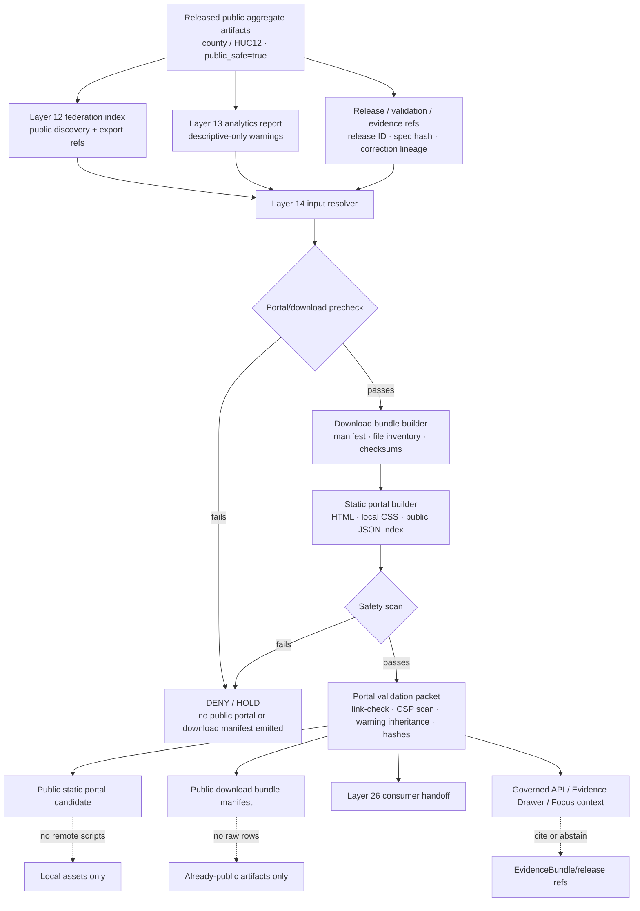

<!-- [KFM_META_BLOCK_V2]
doc_id: kfm://doc/TODO-register-ebird-portal-uuid
title: eBird Layer 14 Portal and Downloads
type: standard
version: v1
status: draft
owners: TODO(fauna-source-stewards)
created: TODO(verify-original-created-date-or-set-on-first-commit)
updated: 2026-05-07
policy_label: TODO(verify-public-or-restricted)
related: ["../../README.md", "../../INGEST_EBIRD.md", "../../SOURCE_ROLES.md", "../../GEOPRIVACY.md", "../../VALIDATION.md", "EBIRD_ARCHITECTURE.md", "EBIRD_CONTRACTS.md", "EBIRD_CONFORMANCE.md", "EBIRD_FEDERATION.md", "EBIRD_ANALYTICS.md", "EBIRD_CONSUMER_INTEGRATION.md", "EBIRD_QUALITY_AND_TRIAGE.md", "EBIRD_REDTEAM.md", "EBIRD_MAINTENANCE.md", "../../../../runbooks/fauna/EBIRD_OPERATIONS.md", "../../../../../policy/fauna/ebird.rego", "../../../../../tests/connectors/fauna/test_kfm_ebird_layer10.py"]
tags: [kfm, fauna, ebird, portal, downloads, public-aggregate, static-site, geoprivacy, evidence, layer-14]
notes: [Revises the existing short Layer 14 eBird portal/download note into a governed repo-ready source document; doc_id, owners, created date, and policy_label remain TODO until registry/steward verification; executable paths, generated output homes, and CI wiring remain NEEDS VERIFICATION in an active checkout.]
[/KFM_META_BLOCK_V2] -->

<a id="top"></a>

# eBird Layer 14 Portal and Downloads

Static portal and public download-bundle guidance for already-published, public-safe eBird aggregate artifacts in the KFM fauna lane.

<p>
  
  
  
  
  
  
  
  
</p>

> [!IMPORTANT]
> **Impact block**
>
> | Field | Value |
> |---|---|
> | Status | `draft` |
> | Target path | `docs/domains/fauna/sources/ebird/EBIRD_PORTAL.md` |
> | Layer | `14` — static portal and public download bundle manifests |
> | Primary role | Package already-public eBird aggregate artifacts into a local/static, public-safe portal and download-bundle surface |
> | Source role | eBird remains occurrence support; not legal-status authority |
> | Public geometry posture | Aggregate/generalized only; public exact coordinates remain denied |
> | Runtime posture | Static files and local assets only; no source downloads, no live eBird API calls, no trackers, no remote scripts |
> | Evidence posture | Portal cards and downloads point back to release, validation, evidence, warning, correction, and rollback references |
> | Quick jumps | [Scope](#scope) · [Repo fit](#repo-fit) · [Inputs](#inputs) · [Exclusions](#exclusions) · [Portal flow](#portal-flow) · [Layer 14 contracts](#layer-14-contracts) · [Security model](#security-model) · [CLI contract](#cli-contract) · [Build workflow](#build-workflow) · [Validation gates](#validation-gates) · [Runtime handoff](#runtime-handoff) · [Review checklist](#review-checklist) · [FAQ](#faq) · [Open verification](#open-verification) |

---

## Scope

Layer 14 builds a **static, public-safe portal** and **public download-bundle manifests** from eBird artifacts that have already passed upstream KFM gates.

This file preserves the original short Layer 14 rules:

- no eBird downloads;
- no credentials or API keys;
- no network calls, trackers, or remote scripts;
- no exact coordinates, restricted observations, quarantines, suppression receipts, or suppressed-group details;
- portal HTML uses restrictive Content Security Policy and local assets only;
- `download_bundle_id` is a SHA-256 digest over canonical bundle inputs;
- `portal_id` is a SHA-256 digest over canonical portal inputs.

Layer 14 is downstream of eBird productization, conformance, federation/export, analytics, and quality review. It does not activate sources, does not fetch live data, does not decide truth, does not replace release objects, and does not authorize stronger ecological claims than the published aggregate evidence supports.

### Layer 14 is allowed to

- build static HTML/JSON/Markdown portal pages from already-public eBird aggregate artifacts;
- build public download-bundle manifests for released aggregate files;
- link public artifacts to release IDs, validation refs, EvidenceBundle refs, warnings, and correction lineage;
- package local assets such as CSS, icons, and static JSON indexes;
- run no-network link checks over local files and relative links;
- run safety scans for remote scripts, trackers, credential-like strings, coordinate fields, restricted rows, and suppression internals;
- emit build/validation/report/diff summaries for review and release dry-run;
- support downstream consumer handoff, governed API documentation, Evidence Drawer copy, and Focus Mode warning language.

### Layer 14 is not allowed to

- call eBird APIs or download eBird data;
- request, store, render, or package credentials, API keys, tokens, cookies, private URLs, or source-access instructions;
- read RAW, WORK, QUARANTINE, restricted stores, unpublished candidate data, suppression receipts, or source-native observation rows;
- expose exact latitude/longitude, point geometry, route geometry, station geometry, private localities, hidden join keys, or reverse-engineerable fields;
- use external scripts, analytics trackers, fonts, pixels, embeds, iframes, beacons, remote CSS, or remote JavaScript;
- imply occupancy, abundance, true absence, population trend, causal effect, legal status, or complete census status;
- become release authority, proof authority, policy authority, or source authority.

> [!WARNING]
> A static portal is a downstream presentation surface. It is not a release decision, not a proof pack, not raw evidence, and not a public loophole around geoprivacy or source terms.

[Back to top](#top)

---

## Repo fit

This file is a human-facing source-layer document under `docs/`. It explains how KFM should build and validate eBird portal/download surfaces. It should not own raw data, schemas, policy code, generated bundles, release manifests, proof packs, credentials, or runtime implementation.

| Relationship | Status | Path / surface | Role |
|---|---:|---|---|
| This document | draft target | `docs/domains/fauna/sources/ebird/EBIRD_PORTAL.md` | Layer 14 portal/download guidance |
| Fauna domain landing page | linked | [`../../README.md`](../../README.md) | Fauna lane scope, lifecycle, source roles, public safety, and review posture |
| eBird ingest hub | linked | [`../../INGEST_EBIRD.md`](../../INGEST_EBIRD.md) | Ingest, governed filter, productization, policy, and command posture |
| Source-role doctrine | linked | [`../../SOURCE_ROLES.md`](../../SOURCE_ROLES.md) | Claim/source compatibility; eBird as occurrence support |
| Geoprivacy posture | linked | [`../../GEOPRIVACY.md`](../../GEOPRIVACY.md) | Public geometry classes, redaction receipts, exact-location denial |
| Validation posture | linked | [`../../VALIDATION.md`](../../VALIDATION.md) | Fail-closed gates, fixture matrix, runtime outcomes, release dry-run |
| Layer 10 contracts | linked | [`EBIRD_CONTRACTS.md`](EBIRD_CONTRACTS.md) | Productization contracts, governed filter, contract hash, smoke commands |
| Layer 10 conformance | linked | [`EBIRD_CONFORMANCE.md`](EBIRD_CONFORMANCE.md) | Local acceptance and public aggregate conformance |
| Layer 12 federation/export | linked | [`EBIRD_FEDERATION.md`](EBIRD_FEDERATION.md) | Public federation index, discovery docs, graph/export surfaces |
| Layer 13 analytics | linked | [`EBIRD_ANALYTICS.md`](EBIRD_ANALYTICS.md) | Public aggregate analytics and warning inheritance |
| Layer 26 consumer integration | linked | [`EBIRD_CONSUMER_INTEGRATION.md`](EBIRD_CONSUMER_INTEGRATION.md) | Local-only consumer pack handoff using Layer 14 manifests |
| Layer 21 quality/triage | needs verification | [`EBIRD_QUALITY_AND_TRIAGE.md`](EBIRD_QUALITY_AND_TRIAGE.md) | Operational QA and triage-only posture |
| Layer 18 red-team | needs verification | [`EBIRD_REDTEAM.md`](EBIRD_REDTEAM.md) | Synthetic adversarial checks for portal/download leakage |
| Operations runbook | needs verification | [`../../../../runbooks/fauna/EBIRD_OPERATIONS.md`](../../../../runbooks/fauna/EBIRD_OPERATIONS.md) | Scan, trend, attest, evidence pack, incident workflows |
| eBird policy gate | needs verification | [`../../../../../policy/fauna/ebird.rego`](../../../../../policy/fauna/ebird.rego) | Executable public aggregate safety policy |
| Connector/conformance tests | needs verification | [`../../../../../tests/connectors/fauna/test_kfm_ebird_layer10.py`](../../../../../tests/connectors/fauna/test_kfm_ebird_layer10.py) | Smoke and deterministic hash behavior |
| Portal implementation | needs verification | repo-native tool/package home | Physical executable path, package scripts, and CI wiring must be verified |
| Generated portal/download artifacts | proposed / needs verification | repo-native build or release artifact home | Must not replace `data/receipts/`, `data/proofs/`, `release/`, or `data/published/` trust objects |

### Directory Rules basis

`docs/domains/fauna/sources/ebird/` is the correct responsibility-root location for this file because it is **human-facing domain/source documentation**. eBird must not become a root-level folder. Machine schemas, executable policy, validators, tests, generated artifacts, data lifecycle products, receipts, proofs, and release decisions belong under their own responsibility roots.

[Back to top](#top)

---

## Inputs

Layer 14 accepts only public-safe, downstream-ready artifacts and metadata.

| Input | Accepted? | Required posture |
|---|---:|---|
| Released county aggregate artifact | Yes | `public_safe=true`, `exact_points=restricted`, `policy_label=public_aggregate`, valid `kfm:spec_hash`, suppression applied |
| Released HUC12 aggregate artifact | Yes | Same as county aggregate; no exact geometry or coordinate leakage |
| Layer 10 conformance summary | Yes | Local-only acceptance result; no credentials, network calls, exact public fields, or restricted rows |
| Layer 12 federation index | Yes | Public-safe discovery/export index only; no restricted rows, quarantine paths, or suppression internals |
| Layer 13 analytics report | Yes | Descriptive-only output with warnings, validation refs, and no unsafe inference |
| Release manifest reference | Yes | Public-safe release identity and rollback target |
| Validation report reference | Yes | Must be safe to expose or summarized safely |
| EvidenceBundle or public evidence refs | Yes | Public-safe evidence support for portal cards and download descriptions |
| Correction / supersession / withdrawal references | Yes | Required when any public artifact is replaced, corrected, or withdrawn |
| Static local CSS/assets | Yes | Local assets only; no remote fonts, scripts, trackers, pixels, embeds, or external CSS |
| Synthetic fixtures | Yes | Useful for portal tests and safety scans; must be clearly fixture-only |
| Raw eBird data | No | Excluded from Layer 14 |
| Live source access | No | Excluded from Layer 14 |

### Minimum input assertions

A portal/download build should refuse an input set unless these assertions can be established:

| Assertion | Required value |
|---|---|
| `public_safe` | `true` |
| `exact_points` | `restricted` |
| `policy_label` | `public_aggregate` |
| `aggregate` | `county` or `huc12` |
| `suppression_min_n` | `>= 10` |
| `kfm:spec_hash` | present and valid |
| coordinate fields | absent from public rows, descriptors, fixtures, downloads, indexes, portal cards, and allowlists |
| restricted rows | absent |
| quarantine paths | absent |
| suppression receipts | absent from public portal/download surfaces |
| remote scripts / trackers | absent |
| interpretation warning | present |
| validation refs | present |
| release refs | present |
| correction lineage | present when superseded, withdrawn, replaced, corrected, or rolled back |

[Back to top](#top)

---

## Exclusions

| Excluded material | Required handling | Why |
|---|---|---|
| eBird API calls | Deny in Layer 14 | Portal/downloads are built from already-public KFM artifacts |
| eBird credentials, API keys, cookies, tokens, private URLs | Never commit, render, link, or package | Secrets do not belong in docs, fixtures, portals, bundles, logs, or Focus context |
| Raw EBD files or raw API captures | Governed lifecycle homes only | RAW source material is not a portal/download input |
| Exact latitude/longitude, point, route, station, or private locality fields | Deny from public pages and bundles | Public eBird outputs remain aggregate/generalized |
| Restricted observations | Deny from public portal/downloads | Avoid sensitive-location and source-term leakage |
| Quarantine paths | Deny | Quarantine is not published evidence |
| Suppression receipts or suppressed-group details | Deny from public portal/downloads | Suppression internals can leak low-count or sensitive patterns |
| Hidden rejoin keys to exact observations | Deny | Public downloads must not enable reconstruction of restricted records |
| Remote JavaScript, remote CSS, remote fonts, trackers, pixels, iframes, embeds, beacons | Deny | Static portal must be local, inspectable, and no-network |
| Occupancy, abundance, true absence, population trend, causal, legal-status, or census language | Deny or rewrite | Public aggregates do not support those claims by themselves |
| Direct model context or AI-generated claims as evidence | Deny | AI is interpretive only |
| Release proof replacement | Deny | Portal bundles do not replace receipts, proof packs, release manifests, or EvidenceBundles |

[Back to top](#top)

---

## Portal flow



### Flow rules

1. Layer 14 starts from **released public aggregate artifacts**, not raw source data.
2. Portal/download builders must preserve release identity, input hashes, validation refs, evidence refs, warnings, correction lineage, and rollback targets.
3. The static portal must not initiate network calls.
4. Every downloadable file must be listed in a manifest with digest, public-safety posture, source role, warning refs, and release refs.
5. A failed safety scan emits no public portal and no public download bundle.
6. Downstream consumer, API, Evidence Drawer, and Focus Mode surfaces inherit Layer 14 warnings and validation references.

[Back to top](#top)

---

## Layer 14 contracts

> [!NOTE]
> Field names below are a documentation contract for maintainers. Machine schemas and executable validators must live in the accepted schema/validator homes after repo verification.

### Download bundle manifest

| Field | Status | Purpose |
|---|---:|---|
| `object_type` | proposed | Suggested value: `EbirdPublicDownloadBundleManifest` |
| `layer` | documented | Suggested value: `14` |
| `source_family` | documented | Suggested value: `ebird` |
| `download_bundle_id` | documented | SHA-256 over canonical bundle inputs |
| `bundle_version` | proposed | Version of bundle contract or builder |
| `public_safe` | required | Must be `true` |
| `exact_points` | required | Must be `restricted` |
| `policy_label` | required | Must be `public_aggregate` |
| `aggregate_targets` | required | `county`, `huc12`, or both |
| `suppression_min_n` | required | Must be `>= 10` |
| `input_release_refs` | required | Release IDs or refs for all source public artifacts |
| `input_spec_hashes` | required | Hashes for all input public artifacts |
| `files` | required | Public-safe downloadable file entries |
| `warning_manifest_ref` | required | Public interpretation warning location |
| `validation_refs` | required | Validation and safety-scan refs |
| `evidence_refs` | required when claim-bearing | Public-safe evidence or release/proof refs |
| `correction_lineage` | required when applicable | Supersession, correction, withdrawal, or rollback refs |
| `generated_at` | proposed | Generation timestamp; excluded from stable content hash unless schema says otherwise |
| `kfm:spec_hash` | required | Valid public aggregate spec hash or accepted content hash |

### Static portal manifest

| Field | Status | Purpose |
|---|---:|---|
| `object_type` | proposed | Suggested value: `EbirdStaticPortalManifest` |
| `portal_id` | documented | SHA-256 over canonical portal inputs |
| `download_bundle_refs` | required | Bundle manifests exposed by the portal |
| `pages` | required | Static page inventory |
| `assets` | required | Local asset inventory |
| `csp` | required | Restrictive Content Security Policy |
| `link_check_ref` | required | No-network local link-check report |
| `safety_scan_ref` | required | Remote-script/tracker/credential/coordinate scan report |
| `warning_manifest_ref` | required | Portal-wide interpretation warning |
| `release_refs` | required | Release identity for surfaced artifacts |
| `validation_refs` | required | Validation and conformance references |
| `correction_lineage` | required when applicable | Current/superseded/withdrawn/corrected state |
| `rollback_ref` | required when release-bound | Public rollback or withdrawal target |

### Illustrative download bundle manifest

```json
{
  "object_type": "EbirdPublicDownloadBundleManifest",
  "layer": 14,
  "source_family": "ebird",
  "download_bundle_id": "sha256:TODO",
  "bundle_version": "v1",
  "public_safe": true,
  "exact_points": "restricted",
  "policy_label": "public_aggregate",
  "aggregate_targets": ["county", "huc12"],
  "suppression_min_n": 10,
  "input_release_refs": ["TODO_RELEASE_REF"],
  "input_spec_hashes": ["sha256:TODO"],
  "files": [
    {
      "path": "downloads/ebird_public_county_aggregate.jsonl",
      "media_type": "application/jsonl",
      "sha256": "TODO",
      "public_safe": true,
      "exact_points": "restricted",
      "contains_credentials": false,
      "contains_exact_coordinates": false,
      "contains_restricted_rows": false,
      "contains_suppression_receipts": false
    }
  ],
  "interpretation_warnings": [
    "Descriptive public aggregate reporting only.",
    "Do not interpret as occupancy, abundance, true absence, population trend, causal effect, legal status, or complete census."
  ],
  "warning_manifest_ref": "warnings/ebird_public_aggregate_warnings.json",
  "validation_refs": ["TODO_VALIDATION_REF"],
  "evidence_refs": ["TODO_EVIDENCE_OR_RELEASE_REF"],
  "correction_lineage": [],
  "kfm:spec_hash": "sha256:TODO"
}
```

[Back to top](#top)

---

## Deterministic IDs

Layer 14 uses deterministic IDs so portal and download changes can be diffed, audited, superseded, and rolled back.

| ID | Recipe | Required inputs |
|---|---|---|
| `download_bundle_id` | `sha256` over canonical bundle inputs | file inventory, file hashes, input release refs, input spec hashes, aggregate targets, suppression policy, warning refs, validation refs, builder version |
| `portal_id` | `sha256` over canonical portal inputs | portal page inventory, bundle refs, asset hashes, CSP, warning refs, release refs, validation refs, builder version |
| `contract_hash` | `sha256(canonical_json(contract_payload_without_generated_at_or_contract_hash))` | inherited Layer 10 recipe |
| `portal_asset_hash` | `sha256` over local asset bytes | CSS, image, JSON, Markdown, or static data files |
| `portal_safety_scan_id` | `sha256` over canonical scan inputs and checked file hashes | scanned files, denylist version, scanner version |

### Hashing rules

- Exclude volatile generation timestamps from stable content hashes unless the schema explicitly says otherwise.
- Exclude the target hash field from its own hash input.
- Include input release refs and input spec hashes.
- Include builder/tool version where builder behavior affects output.
- Include warning text/version when warning language affects public interpretation.
- Do not include hidden restricted details in public identifiers.
- Do not let a deterministic portal or bundle ID replace ReleaseManifest, PromotionDecision, ProofPack, EvidenceBundle, CorrectionNotice, or RollbackCard objects.

[Back to top](#top)

---

## Security model

Layer 14 should produce a static, no-network portal that is inspectable and easy to host without hidden behavior.

### Static portal rules

| Rule | Required behavior |
|---|---|
| JavaScript | Prefer none. If a future steward-approved script is required, it must be local-only, reviewed, hash-pinned, and safety-scanned. |
| CSS | Local CSS only. Remote fonts, remote frameworks, and CDN CSS are denied by default. |
| Images/icons | Local or data URI only when safe; no remote pixels or trackers. |
| Network requests | Denied. No `fetch`, XHR, WebSocket, EventSource, remote image beacons, remote scripts, or third-party embeds. |
| Forms | No credential, source-access, or private-location forms. |
| Links | Relative links preferred. External links require explicit review and must not be used for hidden script/style/image loading. |
| Analytics | Denied. No trackers, analytics scripts, pixels, referrer beacons, or third-party measurement. |
| Download files | Already-public artifacts only; all listed in manifest with checksums and warnings. |
| CSP | Restrictive policy required in every portal page or server header configuration. |
| Secrets | Secret-like strings fail the safety scan. |

### Suggested CSP baseline

Use a stricter CSP whenever possible. This baseline is intentionally static and no-network.

```html
<meta http-equiv="Content-Security-Policy" content="
  default-src 'self';
  script-src 'none';
  connect-src 'none';
  object-src 'none';
  frame-src 'none';
  child-src 'none';
  worker-src 'none';
  base-uri 'self';
  form-action 'none';
  img-src 'self' data:;
  font-src 'self';
  style-src 'self';
  manifest-src 'self';
  media-src 'self';
  upgrade-insecure-requests
">
```

> [!CAUTION]
> `style-src 'unsafe-inline'` should not be added casually. Prefer local CSS files. If inline style is unavoidable for a generated static page, record the exception and add a safety scan rule.

### Portal page requirements

Every public portal page should include:

- page title and release identity;
- source role: eBird occurrence support;
- aggregate unit: county, HUC12, or approved public-safe unit;
- public-safety statement: no exact coordinates, no restricted rows;
- suppression statement;
- interpretation warning;
- download manifest link;
- validation report or validation summary link;
- release / evidence / correction links where public-safe;
- stale, superseded, withdrawn, or corrected state when applicable.

[Back to top](#top)

---

## CLI contract

The original Layer 14 note names two CLI families. Treat them as **documented command contracts** until executable paths, package scripts, and CI invocation are verified in the active checkout.

| CLI | Modes | Intended role |
|---|---|---|
| `kfm-ebird-downloads` | `build`, `validate`, `report`, `diff` | Build and validate public download bundle manifests from already-public artifacts |
| `kfm-ebird-portal` | `build`, `validate`, `link-check`, `safety-scan`, `report`, `diff` | Build and validate a static portal using local assets and public-safe manifests |

### Suggested local command modes

```bash
# PROPOSED — verify actual executable path before use.
kfm-ebird-downloads build \
  --input-release TODO_RELEASE_ID \
  --federation-index build/fauna/ebird/federation/public_federation_index.json \
  --analytics-report build/fauna/ebird/analytics/public_analytics_report.json \
  --out-dir build/fauna/ebird/portal/TODO/downloads
```

```bash
# PROPOSED — local-only validation.
kfm-ebird-downloads validate \
  --bundle build/fauna/ebird/portal/TODO/downloads/public_download_bundle_manifest.json \
  --strict \
  --json
```

```bash
# PROPOSED — verify actual executable path before use.
kfm-ebird-portal build \
  --bundle build/fauna/ebird/portal/TODO/downloads/public_download_bundle_manifest.json \
  --language en-US \
  --out-dir build/fauna/ebird/portal/TODO/site
```

```bash
# PROPOSED — no-network local link check.
kfm-ebird-portal link-check \
  --site build/fauna/ebird/portal/TODO/site \
  --local-only \
  --json
```

```bash
# PROPOSED — public-safety scan.
kfm-ebird-portal safety-scan \
  --site build/fauna/ebird/portal/TODO/site \
  --deny-remote-scripts \
  --deny-trackers \
  --deny-credentials \
  --deny-exact-coordinates \
  --deny-suppression-internals \
  --json
```

> [!NOTE]
> These command examples are repo-shaped and intentionally local. They must not be wired to live eBird source access, credentials, raw rows, remote scripts, or public exact-coordinate output.

[Back to top](#top)

---

## Build workflow

### Build sequence

1. Resolve released public aggregate inputs.
2. Verify Layer 10 conformance and Layer 12/13 handoff refs.
3. Build the download bundle manifest.
4. Validate bundle files, field allowlist, warnings, hashes, and release refs.
5. Build the static portal from the validated bundle manifest.
6. Run local link check.
7. Run portal safety scan.
8. Emit Layer 14 validation packet.
9. Hand off only validated public-safe outputs to consumer/API/UI/Focus surfaces.
10. Record correction, supersession, or rollback refs if outputs replace a prior portal/bundle.

### Directory tree for generated portal candidates

The exact generated output home is **NEEDS VERIFICATION** against repo convention. The shape below is an illustrative candidate for a build artifact, not a claimed current tree.

```text
build/fauna/ebird/portal/<portal_id>/
├── downloads/
│   ├── public_download_bundle_manifest.json
│   ├── ebird_public_county_aggregate.jsonl
│   ├── ebird_public_huc12_aggregate.jsonl
│   └── CHECKSUMS.sha256
├── site/
│   ├── index.html
│   ├── releases.html
│   ├── downloads.html
│   ├── limitations.html
│   ├── corrections.html
│   ├── assets/
│   │   ├── kfm-ebird.css
│   │   └── icons/
│   └── data/
│       ├── portal_index.json
│       └── warning_manifest.json
└── validation/
    ├── portal_link_check.json
    ├── portal_safety_scan.json
    ├── download_bundle_validation.json
    └── portal_validation_summary.json
```

### Generated artifacts versus trust objects

| Surface | Owns |
|---|---|
| Build output | Static portal candidate and download bundle candidate |
| `data/published/` | Released public-safe artifacts, if admitted by repo convention |
| `data/receipts/` | Process memory and run receipts |
| `data/proofs/` | Evidence/proof/validation support |
| `release/` | Release decision, release manifest, correction, withdrawal, rollback |
| `docs/` | Human-facing guidance; not generated truth |
| `policy/` | Executable allow/deny/restrict/abstain rules |
| `schemas/` | Machine-checkable object shape |
| `contracts/` | Human-readable object meaning and invariants |

[Back to top](#top)

---

## Public artifact field allowlist

Public portal/download payloads should expose only fields needed for public-safe interpretation.

| Field family | Public posture |
|---|---|
| Aggregate identifier | Allowed: county, HUC12, or approved public-safe summary ID |
| Aggregate type | Allowed |
| Time bucket/window | Allowed when it does not reveal restricted observation precision |
| Public checklist count | Allowed after suppression |
| Reported public taxon count | Allowed with caveats |
| Release ID | Allowed and recommended |
| `kfm:spec_hash` | Required |
| Public content hash | Allowed and recommended |
| Evidence/release refs | Allowed when public-safe |
| Validation refs | Allowed when public-safe |
| Interpretation warnings | Required |
| Correction/supersession state | Required when applicable |
| Exact latitude/longitude | Denied |
| Raw point/geometry fields | Denied |
| Route/transect/station precision fields | Denied unless separately reviewed and public-safe |
| Private locality/observer-sensitive fields | Denied |
| Quarantine paths | Denied |
| Suppression receipt contents | Denied |
| Suppressed-group details | Denied |
| Credentials/tokens/private URLs | Denied |
| Hidden row rejoin keys | Denied |

[Back to top](#top)

---

## Claim boundary

Layer 14 presents public aggregate artifacts. It must not make downstream readers believe the portal is stronger than the evidence.

| Safe portal/download statement | Unsafe portal/download statement |
|---|---|
| “This portal lists released public aggregate eBird artifacts.” | “This portal lists all bird observations.” |
| “The download bundle contains public-safe county/HUC12 aggregate outputs.” | “The download bundle contains exact eBird observation data.” |
| “Counts are descriptive and suppression-gated.” | “Counts prove abundance.” |
| “Coverage is sparse for this HUC12/time window.” | “The species is absent from this HUC12.” |
| “Release A and release B differ.” | “The population increased or declined.” |
| “eBird is occurrence support.” | “eBird is legal-status authority.” |
| “No exact observations or restricted records are included.” | “Suppressed details are available in the public bundle.” |
| “The portal is static and local-asset-only.” | “The portal can fetch fresh eBird data.” |

### Required interpretation warning

Every portal page, download manifest, README, portal card, static data index, consumer pack handoff, and Focus-facing summary should carry this warning or a steward-approved equivalent:

> This eBird output is descriptive public aggregate reporting only. It does not show exact observations, does not include restricted records, and must not be interpreted as occupancy, abundance, true absence, population trend, causal effect, legal status, or a complete species census.

[Back to top](#top)

---

## Validation gates

| Gate | Outcome on failure | Check |
|---|---:|---|
| Input release gate | HOLD | Inputs must be released public aggregate artifacts, not raw, work, quarantine, restricted, or unpublished records |
| Local-only gate | DENY | Portal/download builders must not require network calls |
| Credential gate | DENY | No API keys, tokens, cookies, private URLs, credentials, or secret-like fields |
| Remote script gate | DENY | No external JS, CSS, fonts, iframes, embeds, trackers, pixels, or beacons |
| CSP gate | HOLD / DENY | Every HTML page has a restrictive CSP or server-side equivalent |
| Aggregate unit gate | DENY | `aggregate` must be `county` or `huc12` unless policy/docs deliberately change |
| Suppression gate | DENY | `suppression_min_n >= 10`; public rows must not fall below threshold |
| Exact-points gate | DENY | Public portal/download surfaces must keep `exact_points=restricted` |
| Coordinate allowlist gate | DENY | Public descriptors, pages, indexes, downloads, and fixtures must not include exact coordinate or geometry fields |
| Policy label gate | DENY | Public aggregate rows require `policy_label=public_aggregate` |
| Spec hash gate | DENY | Public aggregate outputs require valid `kfm:spec_hash` |
| Download manifest gate | DENY | Every public file has digest, media type, release ref, and public-safety assertions |
| Warning inheritance gate | HOLD | Portal and bundle must include interpretation warnings |
| Validation refs gate | HOLD | Portal and bundle must reference validation and release evidence |
| Restricted data gate | DENY | No restricted observations, quarantine paths, suppression receipts, or suppressed-group details |
| Claim-boundary gate | HOLD | Unsafe inference wording must be rewritten or removed |
| Link-check gate | HOLD | Local links must resolve; broken safety-critical references block release |
| Source terms gate | HOLD / DENY | Public download distribution cannot proceed while source-term posture is unresolved |
| Correction lineage gate | HOLD | Superseded inputs must update correction/supersession notes |
| Rollback gate | ERROR | Public portal/download output lacks rollback or withdrawal target |

### Negative states

| State | Use |
|---|---|
| `ANSWER` | Released aggregate evidence supports a public-safe descriptive portal/API/Focus response |
| `ABSTAIN` | Evidence is insufficient, stale, ambiguous, or outside the supported claim boundary |
| `DENY` | Policy, rights, sensitivity, exact-location, source-role, release-state, source-term, or static-security rules forbid output |
| `HOLD` | Maintainer or steward review is required before portal/download release |
| `ERROR` | Tooling, schema, integrity, resolver, link, or release-state failure prevents a reliable result |

[Back to top](#top)

---

## Runtime handoff

### Governed API

Layer 14 may support public-facing API documentation and static examples, but the actual API must remain downstream of release and evidence.

| Request condition | Required outcome |
|---|---|
| Released aggregate evidence supports a public-safe descriptive response | `ANSWER` |
| Evidence is insufficient, stale, ambiguous, or outside claim boundary | `ABSTAIN` |
| Rights, sensitivity, exact-location, source-role, static-security, or release-state rules forbid response | `DENY` |
| Schema, resolver, integrity, link, or runtime failure prevents reliable response | `ERROR` |

### Evidence Drawer

Portal/download pages should preserve the minimum trust context needed for the Evidence Drawer:

| Field family | Requirement |
|---|---|
| Source role | eBird shown as occurrence support |
| Aggregate unit | County, HUC12, or approved public-safe unit |
| Release state | Release ID, current/superseded/withdrawn state where applicable |
| Filter/suppression | Governed filter and `suppression_min_n` visible where relevant |
| Evidence support | EvidenceBundle or release/proof references |
| Public geometry | `exact_points=restricted`; no exact-coordinate fields |
| Policy posture | `public_aggregate`, rights/citation state, validation state |
| Limitations | Not legal status, not complete census, not true absence, not trend/causality |
| Correction lineage | Correction, rollback, supersession, or withdrawal refs when applicable |

### Focus Mode

Layer 14 may provide Focus-compatible public context only when:

- input evidence is already public-safe and released;
- EvidenceBundle or release/proof references are available;
- no exact coordinates, hidden geometry, restricted rows, or source-private fields are present;
- interpretation warning language is included;
- unsupported claims return `ABSTAIN`;
- policy-blocked claims return `DENY`;
- every factual response remains descriptive and citation-bound.

[Back to top](#top)

---

## Review checklist

Before changing this file or approving Layer 14 portal/download behavior, verify:

- [ ] Metadata block placeholders remain intentional or are replaced with registry-confirmed values.
- [ ] New relative links exist or are marked `NEEDS VERIFICATION`.
- [ ] Layer 14 remains downstream of released public aggregate artifacts.
- [ ] No command, descriptor, static page, fixture, or download bundle requires network calls.
- [ ] No eBird API key, token, credential, cookie, private URL, or secret-like field appears.
- [ ] No remote JavaScript, remote CSS, remote fonts, trackers, pixels, embeds, iframes, or beacons appear.
- [ ] Every HTML page has restrictive CSP or a documented equivalent server-side header requirement.
- [ ] Inputs are released public aggregate artifacts, not raw, work, quarantine, or restricted records.
- [ ] Public outputs keep `public_safe=true`.
- [ ] Public outputs keep `exact_points=restricted`.
- [ ] Public aggregate rows use `policy_label=public_aggregate`.
- [ ] Public aggregate rows include valid `kfm:spec_hash`.
- [ ] Suppression minimum remains `>= 10`.
- [ ] `aggregate` remains `county` or `huc12` unless policy and docs deliberately change.
- [ ] Public field allowlists exclude exact coordinate and geometry fields.
- [ ] Restricted rows, quarantine paths, suppression receipts, and suppressed-group details are absent.
- [ ] Every portal page, card, bundle manifest, and static data index carries descriptive-only interpretation warnings.
- [ ] Occupancy, abundance, true absence, population trend, causal, legal-status, and census language is absent or denied.
- [ ] Download manifests include file digests, public-safety assertions, release refs, validation refs, and warning refs.
- [ ] Consumer handoff inherits warnings, hashes, validation refs, and policy labels.
- [ ] Source terms, citation, attribution, redistribution, and commercial-use posture are reviewed before public distribution.
- [ ] Rollback/correction notes exist when portal or bundle artifacts supersede prior public outputs.

[Back to top](#top)

---

## FAQ

### Does Layer 14 download eBird data?

No. Layer 14 builds portal and download-bundle surfaces from already-public KFM artifacts only. Live source access belongs to governed source activation and ingestion workflows, not portal generation.

### Can the portal include JavaScript?

Default answer: no. A static, no-script portal is preferred. If a future script is steward-approved, it must be local-only, reviewed, hash-pinned, safety-scanned, and documented as an exception.

### Can the portal link to external websites?

External links may be allowed as ordinary links after review, but they must not load remote scripts, fonts, CSS, images, pixels, iframes, embeds, or tracking resources. Prefer relative links for KFM artifacts.

### Can the portal show exact eBird observation points?

No. Public eBird portal/download products must remain aggregate/generalized and keep `exact_points=restricted`.

### Is a portal bundle a release manifest?

No. A portal bundle is a presentation/download surface. Release authority remains in release objects such as ReleaseManifest, PromotionDecision, correction/withdrawal notices, and rollback records.

### Can a missing public aggregate prove absence?

No. Missing or sparse public aggregate coverage is not evidence of absence. Portal language must remain descriptive and warning-bearing.

### Can Focus Mode use the portal files as evidence?

Focus Mode may use released public-safe context and evidence/release references surfaced by the portal, but it must resolve adequate evidence before answering and must return `ABSTAIN` or `DENY` for unsupported or policy-blocked claims.

[Back to top](#top)

---

## Open verification

| Item | Status | Needed proof |
|---|---:|---|
| Registered `doc_id` | TODO | Document registry entry |
| Owners | TODO | CODEOWNERS, steward assignment, or governance registry |
| Created date | TODO | Git history or steward-approved first-commit date |
| Policy label | TODO | Repo policy classification |
| CLI executable paths | NEEDS VERIFICATION | Actual package entrypoints or scripts for `kfm-ebird-downloads` and `kfm-ebird-portal` |
| Physical output location | NEEDS VERIFICATION | Repo-native generated artifact/build directory convention |
| Machine schema home | NEEDS VERIFICATION | Accepted schema path and object naming convention |
| Download bundle schema | PROPOSED | JSON Schema or equivalent machine-checkable contract |
| Portal manifest schema | PROPOSED | JSON Schema or equivalent machine-checkable contract |
| CSP checker | NEEDS VERIFICATION | Repo-native validator or safety-scan command |
| Link checker | NEEDS VERIFICATION | Local-only link-check command and CI behavior |
| Remote/tracker detector | NEEDS VERIFICATION | Safety-scan rule set and negative fixtures |
| Source-term review | NEEDS VERIFICATION | Current eBird API, data, product, citation, redistribution, and commercial-use terms |
| Public release object family | NEEDS VERIFICATION | ReleaseManifest / PromotionReceipt / ProofPack conventions in current repo |
| Portal/download inheritance check | NEEDS VERIFICATION | Tests proving warnings, hashes, validation refs, release refs, and policy labels propagate |
| Focus Mode fixture check | NEEDS VERIFICATION | Tests proving unsupported claims abstain and policy-blocked claims deny |

[Back to top](#top)

---

## Appendix

<details>
<summary>Negative fixture ideas</summary>

| Fixture | Expected result |
|---|---|
| `portal_input_raw_ebd_path.json` | `DENY` |
| `portal_input_quarantine_path.json` | `DENY` |
| `portal_requires_network.json` | `DENY` |
| `portal_contains_api_key.html` | `DENY` |
| `portal_remote_script.html` | `DENY` |
| `portal_remote_css.html` | `DENY` |
| `portal_remote_font.html` | `DENY` |
| `portal_tracker_pixel.html` | `DENY` |
| `portal_iframe_embed.html` | `DENY` |
| `portal_missing_csp.html` | `HOLD` or `DENY` depending release mode |
| `portal_weak_csp_allows_scripts.html` | `DENY` |
| `download_manifest_contains_latitude.json` | `DENY` |
| `download_manifest_contains_geometry.json` | `DENY` |
| `download_file_contains_exact_coordinates.jsonl` | `DENY` |
| `download_bundle_contains_suppression_receipt.json` | `DENY` |
| `download_bundle_suppression_min_5.json` | `DENY` |
| `download_bundle_missing_spec_hash.json` | `DENY` |
| `download_bundle_missing_warning.json` | `HOLD` |
| `download_bundle_missing_validation_refs.json` | `HOLD` |
| `portal_claims_population_trend.md` | `HOLD` |
| `portal_claims_true_absence.md` | `ABSTAIN` or `HOLD` |
| `portal_ebird_as_legal_authority.md` | `DENY` |
| `portal_missing_correction_lineage.json` | `HOLD` when superseding a prior portal |

</details>

<details>
<summary>Reason-code suggestions</summary>

| Reason code | Meaning |
|---|---|
| `portal.network.forbidden` | Portal build or page requires network access. |
| `portal.remote_script.forbidden` | Remote JavaScript or script-like resource detected. |
| `portal.tracker.forbidden` | Tracker, pixel, beacon, analytics script, or remote measurement detected. |
| `portal.csp.missing` | HTML page lacks CSP or approved CSP header plan. |
| `portal.csp.unsafe` | CSP allows unsafe script/connect/embed behavior. |
| `portal.credentials.forbidden` | Credential-like string, token, cookie, API key, or private URL detected. |
| `portal.coordinates.public_leak` | Public page, index, manifest, or download contains exact coordinate/geometry fields. |
| `portal.suppression_internal_leak` | Suppression receipt or suppressed-group detail detected in public output. |
| `portal.quarantine_path_leak` | RAW/WORK/QUARANTINE path detected in public output. |
| `portal.warning.missing` | Required descriptive-only interpretation warning missing. |
| `portal.link.broken` | Required local link does not resolve. |
| `portal.source_terms.unverified` | Source terms or redistribution posture not verified for public distribution. |
| `download.hash.missing` | Downloadable file missing digest. |
| `download.hash.mismatch` | Downloadable file digest does not match manifest. |
| `download.manifest.invalid` | Download bundle manifest fails schema or contract validation. |
| `claim.overreach` | Portal/download language exceeds public aggregate evidence support. |
| `release.rollback.missing` | Public portal/bundle lacks rollback or withdrawal target. |

</details>

<details>
<summary>Safe wording snippets</summary>

Use these snippets in portal pages, download manifests, README cards, consumer packs, and Focus-facing summaries.

- “This portal lists released public aggregate eBird artifacts.”
- “Downloads contain public aggregate data only.”
- “No exact observations or restricted records are included.”
- “Counts are descriptive and suppression-gated.”
- “Coverage gaps are not evidence of absence.”
- “A release-to-release change may reflect source updates, filtering, taxonomy, suppression, or processing differences.”
- “This output must not be interpreted as occupancy, abundance, true absence, population trend, causal effect, legal status, or complete census.”
- “eBird-derived artifacts in this lane support occurrence-derived public aggregate reporting only.”

</details>

<details>
<summary>Maintainer update triggers</summary>

Update this file when any of the following changes:

- portal command names;
- download bundle command names;
- portal or bundle manifest schema;
- generated output home;
- CSP baseline;
- local asset policy;
- tracker/remote-resource denylist;
- public field allowlist;
- `download_bundle_id` recipe;
- `portal_id` recipe;
- `kfm:spec_hash` format;
- suppression threshold;
- aggregate unit vocabulary;
- public warning language;
- Layer 12 federation/export contract;
- Layer 13 analytics contract;
- Layer 26 consumer handoff contract;
- eBird public-safety policy;
- source-term/citation/redistribution posture;
- link-check or safety-scan implementation;
- release/correction/rollback procedure for public portals and bundles.

</details>

---

<p align="right"><a href="#top">Back to top ↑</a></p>
