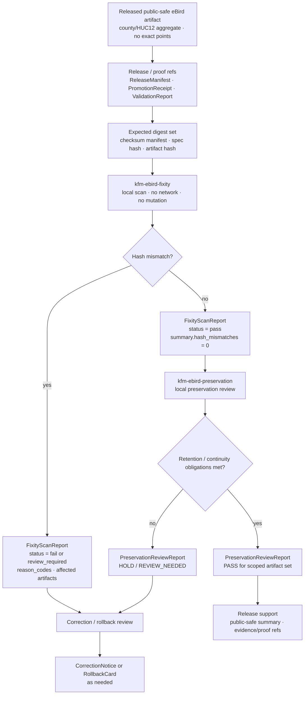

<!-- [KFM_META_BLOCK_V2]
doc_id: kfm://doc/TODO-register-ebird-preservation-fixity-uuid
title: eBird Preservation and Fixity
type: standard
version: v1
status: draft
owners: TODO(fauna-source-stewards)
created: TODO(verify-original-created-date-or-set-on-first-commit)
updated: 2026-05-07
policy_label: TODO(verify-public-or-restricted)
related: ["../../README.md", "../../INGEST_EBIRD.md", "../../SOURCE_ROLES.md", "../../GEOPRIVACY.md", "EBIRD_ARCHITECTURE.md", "EBIRD_CONTRACTS.md", "EBIRD_FEDERATION.md", "EBIRD_PORTAL.md", "EBIRD_CONSUMER_CERTIFICATION.md", "../../../../runbooks/fauna/EBIRD_OPERATIONS.md", "../../../../../policy/fauna/ebird.rego", "../../../../../configs/fauna/ebird/preservation_retention_policy.json", "../../../../../tools/validators/fauna/validate_ebird_fixity.ts", "../../../../../tests/connectors/fauna/test_kfm_ebird_layer40_cli.py"]
tags: [kfm, fauna, ebird, preservation, fixity, layer-40, public-aggregate, geoprivacy, rollback]
notes: [Revises the existing short Layer 40 note into a governed preservation/fixity reference; doc_id, owners, created date, and policy_label remain TODO until registry/steward verification; target file and related repo surfaces were inspected through the GitHub connector, while local workspace was not a mounted checkout.]
[/KFM_META_BLOCK_V2] -->

<a id="top"></a>

# eBird Preservation and Fixity

Layer 40 governance for local-only fixity scans, preservation review, retention cadence, continuity drills, and public-safe archive assurance for KFM’s eBird occurrence-support lane.

<p>
  
  
  
  
  
  
  
  
</p>

> [!IMPORTANT]
> **Impact block**
>
> | Field | Value |
> |---|---|
> | Status | `draft` |
> | Target path | `docs/domains/fauna/sources/ebird/EBIRD_PRESERVATION_AND_FIXITY.md` |
> | Layer | `40` |
> | Primary role | Preservation and fixity governance for released/public-safe eBird aggregate derivatives |
> | Source role | eBird remains **occurrence support**, not legal-status authority |
> | Geometry posture | `exact_points=restricted`; public preservation summaries must not expose exact coordinates |
> | Runtime posture | Local-only, no-network, synthetic-safe by default |
> | Prohibited behavior | No external archive API calls, no external signing/notarization calls, no eBird downloads, no mutation of archived originals |
> | CLI families | `kfm-ebird-fixity`, `kfm-ebird-preservation` |
> | Quick jumps | [Scope](#scope) · [Repo fit](#repo-fit) · [Inputs](#inputs) · [Exclusions](#exclusions) · [Layer 40 flow](#layer-40-flow) · [Fixity contract](#fixity-contract) · [Preservation contract](#preservation-contract) · [Retention policy](#retention-policy) · [Commands](#command-contracts) · [Validation](#validation-and-gates) · [Artifacts](#artifact-and-field-boundary) · [Review](#review-checklist) · [Open verification](#open-verification) |

---

## Scope

Layer 40 protects the long-term integrity and reviewability of eBird-derived KFM public aggregate artifacts.

It does **not** harvest eBird data, make new biological claims, certify legal status, publish hidden exact points, notarize artifacts externally, or replace the release system. It checks and documents whether already-created local artifacts still match their expected digests, retention expectations, public-safety posture, and continuity obligations.

### Layer 40 governs

| Surface | Purpose |
|---|---|
| Fixity scans | Compare expected and observed hashes for local release/preservation artifacts. |
| Preservation review | Check whether archived/public-safe artifacts remain complete, reviewable, and restorable. |
| Retention cadence | Keep scan, drill, checkpoint, and renewal intervals visible. |
| Continuity drills | Prove that public-safe archive packages can be re-read and checked without external services. |
| Public-safe summaries | Emit summaries that expose state, not restricted records. |
| Release support | Help reviewers decide whether a public artifact remains safe, current enough, and rollback-capable. |
| Correction support | Flag drift, missing artifacts, or hash mismatch so correction or rollback can proceed. |

### Layer 40 does not govern

| Out of scope | Owning surface |
|---|---|
| eBird source admission, rights, and source activation | Source registry and source activation workflow |
| eBird ingest and aggregate creation | [`../../INGEST_EBIRD.md`](../../INGEST_EBIRD.md) |
| Layer 10 contract semantics | [`EBIRD_CONTRACTS.md`](EBIRD_CONTRACTS.md) |
| Public federation/discovery/export | [`EBIRD_FEDERATION.md`](EBIRD_FEDERATION.md) |
| Portal and download manifests | [`EBIRD_PORTAL.md`](EBIRD_PORTAL.md) |
| Consumer certification | [`EBIRD_CONSUMER_CERTIFICATION.md`](EBIRD_CONSUMER_CERTIFICATION.md) |
| Executable public-safety policy | [`../../../../../policy/fauna/ebird.rego`](../../../../../policy/fauna/ebird.rego) |
| Machine schemas | Accepted schema home after ADR/repo convention verification |
| Release approval | Release manifest, proof pack, promotion decision, reviewer approval, and rollback card |

> [!WARNING]
> A fixity pass proves local artifact integrity for a scoped artifact set. It does not prove source rights, biological truth, legal status, absence, abundance, population trend, or public-release eligibility by itself.

[Back to top](#top)

---

## Repo fit

This file is a human-facing documentation and review guide under the fauna eBird source documentation lane.

| Relationship | Status | Path / surface | Role |
|---|---:|---|---|
| This file | CONFIRMED target | `docs/domains/fauna/sources/ebird/EBIRD_PRESERVATION_AND_FIXITY.md` | Layer 40 preservation/fixity documentation |
| Current short note | CONFIRMED prior content | Same path | Existing Layer 40 seed text being expanded |
| eBird architecture | CONFIRMED | [`EBIRD_ARCHITECTURE.md`](EBIRD_ARCHITECTURE.md) | Source-family architecture and trust boundary |
| eBird contracts | CONFIRMED | [`EBIRD_CONTRACTS.md`](EBIRD_CONTRACTS.md) | Layer 10 public aggregate contract rules |
| eBird ingest hub | CONFIRMED | [`../../INGEST_EBIRD.md`](../../INGEST_EBIRD.md) | Ingest/productization and governed filter |
| Fauna domain overview | CONFIRMED | [`../../README.md`](../../README.md) | Fauna lifecycle, public safety, and source-role posture |
| Source-role doctrine | CONFIRMED | [`../../SOURCE_ROLES.md`](../../SOURCE_ROLES.md) | Claim/source compatibility |
| Geoprivacy doctrine | CONFIRMED | [`../../GEOPRIVACY.md`](../../GEOPRIVACY.md) | Sensitive geometry and public-safe derivative rules |
| Operations runbook | NEEDS VERIFICATION | [`../../../../runbooks/fauna/EBIRD_OPERATIONS.md`](../../../../runbooks/fauna/EBIRD_OPERATIONS.md) | Scan, trend, attest, evidence-pack, and incident workflows |
| eBird policy | CONFIRMED | [`../../../../../policy/fauna/ebird.rego`](../../../../../policy/fauna/ebird.rego) | Public aggregate denial rules |
| Retention policy config | CONFIRMED | [`../../../../../configs/fauna/ebird/preservation_retention_policy.json`](../../../../../configs/fauna/ebird/preservation_retention_policy.json) | Layer 40 cadence and prohibition defaults |
| Fixity validator | CONFIRMED | [`../../../../../tools/validators/fauna/validate_ebird_fixity.ts`](../../../../../tools/validators/fauna/validate_ebird_fixity.ts) | Guard against “pass” status with hash mismatches |
| CLI smoke tests | CONFIRMED | [`../../../../../tests/connectors/fauna/test_kfm_ebird_layer40_cli.py`](../../../../../tests/connectors/fauna/test_kfm_ebird_layer40_cli.py) | Help/version and deterministic fixity run ID checks |
| CLI executable files | NEEDS VERIFICATION | `../../../../../tools/connectors/fauna/kfm-ebird-ingest/kfm-ebird-fixity`, `../../../../../tools/connectors/fauna/kfm-ebird-ingest/kfm-ebird-preservation` | Test-referenced entrypoints; physical file presence needs checkout verification |
| Release/proof homes | NEEDS VERIFICATION | `release/`, `data/proofs/`, `data/receipts/`, `data/published/` or repo-accepted equivalent | Preservation inputs/outputs must align to repo release conventions |

### Directory Rules basis

`docs/domains/fauna/sources/ebird/` is the correct documentation home because this is a source-specific, human-facing domain document under `docs/`. It must not become a root-level `ebird/` folder. Machine schemas, executable policy, validators, fixtures, lifecycle data, receipts, proof objects, release manifests, and published artifacts belong under their responsibility roots.

[Back to top](#top)

---

## Inputs

Layer 40 accepts only local, reviewable, already-governed inputs. It does not fetch upstream source data.

| Input | Accepted? | Required posture |
|---|---:|---|
| Synthetic eBird-like aggregate fixtures | ✅ | Preferred first proof path; no network; no credentials; no exact coordinates |
| Released public aggregate manifests | ✅ | Must already be public-safe and release-linked |
| Local public-safe aggregate artifacts | ✅ | County/HUC12 or other approved public-safe units only |
| Local hash/checksum manifests | ✅ | Used for fixity comparison and drift detection |
| ReleaseManifest / PromotionReceipt / ProofPack refs | ✅ | Required for release-grade interpretation |
| ValidationReport refs | ✅ | Used to ensure preservation status does not hide policy failure |
| Redaction/generalization receipts | ✅ | Required when public artifact is derived from restricted geometry |
| Retention policy JSON | ✅ | Non-secret config controlling scan and review cadence |
| Public-safe portal/download manifests | ✅ | May be checked only as local released artifacts |
| RAW eBird source snapshots | ❌ | Not accepted by this doc or Layer 40 public summaries |
| eBird API responses | ❌ | Layer 40 does not download or call eBird |
| EBD credentials or request secrets | ❌ | Never accepted |
| Suppression receipts with sensitive internals | CONDITIONAL | Restricted audit/proof review only; not public summary output |

[Back to top](#top)

---

## Exclusions

| Excluded material | Required handling | Why |
|---|---|---|
| eBird API keys, EBD credentials, cookies, tokens, private URLs | Secret manager / ignored local environment only | Secrets do not belong in docs, fixtures, public bundles, logs, or Focus context |
| Live eBird downloads | Source activation and ingest workflow only | Preservation/fixity is local-only |
| External archive API calls | Prohibited by Layer 40 posture | Avoids unreviewed custody side effects |
| External signing/notarization calls | Prohibited by Layer 40 posture | Avoids claiming external attestation maturity not admitted by policy/tooling |
| Mutating archived originals | Deny | Fixity scans must observe and report, not rewrite evidence |
| Public exact coordinates | Deny | Public eBird derivatives remain aggregate/generalized |
| Restricted observations | Deny from public summaries | Prevents sensitive-location/source-term leakage |
| Quarantine paths | Deny from public summaries | Quarantine is not published evidence |
| Suppressed-group details | Deny from public summaries | Can leak low-count or sensitive information |
| Legal-status claims | Deny unless separate legal/status authority supports them | eBird is occurrence support only |
| Population trend, abundance, true absence, occupancy, causal, or complete-census claims | Abstain or deny unless separately governed evidence/model supports them | Fixity cannot upgrade biological claim strength |
| AI-generated preservation conclusions without evidence refs | Deny | AI is not the preservation authority |

[Back to top](#top)

---

## Layer 40 flow



### Flow rules

1. **Scan local artifacts only.** Layer 40 must not download eBird data or call external custody services.
2. **Do not mutate archived originals.** Fixity compares and reports; it does not repair source artifacts in place.
3. **A pass cannot hide mismatches.** A pass status with hash mismatches is invalid.
4. **Public summaries are field-limited.** Summaries can expose counts, status, refs, and reason codes; they must not expose restricted rows.
5. **Mismatches trigger review.** Hash drift is a release-quality event, not a cosmetic warning.
6. **Preservation is not publication.** Preservation reports support release review; they do not approve publication alone.

[Back to top](#top)

---

## Fixity contract

Fixity is the local comparison of expected and observed artifact identity.

| Contract rule | Required behavior | Failure outcome |
|---|---|---|
| Local-only operation | No network, no eBird fetch, no external archive API, no external signing | `ERROR` or `DENY` |
| Non-mutating scan | Archived originals and released artifacts are read, not modified | `ERROR` if mutation is attempted |
| Expected digest required | Every scanned artifact should have an expected digest or explicit reason for missing digest | `HOLD` |
| Observed digest recorded | Scan records observed digest, size, and identity where safe | `PASS`, `FAIL`, or `REVIEW_NEEDED` |
| Hash mismatch visible | Any mismatch increments mismatch count and lists affected public-safe artifact refs | `FAIL` or `REVIEW_NEEDED` |
| Pass with mismatch denied | `status=pass` is invalid when `summary.hash_mismatches > 0` | validator failure |
| Public-safe summary | Public output excludes exact coordinates, raw rows, secrets, quarantine paths, and suppression internals | `DENY` |
| Deterministic run identity | Equivalent scoped scan should produce stable `fixity_run_id` | regression failure |
| Evidence/release refs | Report links to release/proof/evidence refs where available | `HOLD` if claim-bearing and unresolved |
| Correction path | Mismatch report points to correction or rollback review | `HOLD` until triaged |

### Fixity report minimum

| Field | Requirement |
|---|---|
| `schema_version` | Versioned report shape |
| `object_type` | `KfmEbirdFixityScanReport` or repo-accepted equivalent |
| `fixity_run_id` | Stable deterministic ID for same scoped scan |
| `adapter` | `kfm-ebird` |
| `mode` | `scan` or accepted local mode |
| `aggregate` | `county`, `huc12`, or `both` where applicable |
| `source_refs` | Public-safe source/release refs only |
| `release_refs` | ReleaseManifest or equivalent refs |
| `artifact_count` | Total artifacts checked |
| `summary.hash_mismatches` | Count of mismatch findings |
| `status` | `pass`, `fail`, `review_required`, or `error` |
| `reason_codes` | Stable machine-readable reasons |
| `created_at` | Run/report time |
| `limitations` | Boundaries, exclusions, and public-safety notes |

[Back to top](#top)

---

## Preservation contract

Preservation checks whether released/local public-safe eBird artifacts remain restorable, reviewable, and governed over time.

| Contract family | Required behavior |
|---|---|
| Retention cadence | Cadence comes from non-secret retention policy config or accepted repo policy. |
| Archive renewal review | Long-lived artifacts require periodic renewal review. |
| Cold-start drill | Periodically prove a fresh local process can read and validate the preserved package. |
| Continuity drill | Periodically prove release/proof/rollback/correction refs still connect. |
| Checkpoint ledger verification | Periodically verify local checkpoint ledger/digest continuity. |
| Public-safety scan on renewal | Renewal must re-check public-safe posture, not only file existence. |
| Verifier check on renewal | Renewal must include verifier/public-safety review where policy requires it. |
| No restricted public archive | Public archive packages must not contain restricted rows or exact coordinates. |
| Prohibit delete | Preservation policy should avoid destructive cleanup of governed artifacts unless explicit correction/withdrawal process exists. |
| No external custody side effects | External archive API/signing/notarization is prohibited unless separately admitted through governance. |

### Preservation report minimum

| Field | Requirement |
|---|---|
| `schema_version` | Versioned report shape |
| `object_type` | `KfmEbirdPreservationReviewReport` or repo-accepted equivalent |
| `preservation_run_id` | Stable scoped run identity |
| `adapter` | `kfm-ebird` |
| `policy_ref` | Retention policy ref or digest |
| `release_refs` | ReleaseManifest refs checked |
| `fixity_report_refs` | Fixity scan reports used |
| `cadence_state` | On-time, overdue, unknown, or review-needed |
| `public_safety_state` | Pass, fail, review-needed, or unknown |
| `continuity_state` | Pass, fail, review-needed, or unknown |
| `restricted_public_archive_findings` | Count and safe reason-code summary |
| `status` | `pass`, `hold`, `review_required`, `fail`, or `error` |
| `rollback_refs` | RollbackCard refs where applicable |
| `correction_notice_refs` | CorrectionNotice refs where applicable |
| `limitations` | What was not checked |

[Back to top](#top)

---

## Retention policy

Layer 40 has a non-secret retention policy config under `configs/fauna/ebird/`.

| Policy field | Current documented value / posture |
|---|---|
| `object_type` | `KfmEbirdPreservationRetentionPolicy` |
| `policy_label` | `preservation` |
| `exact_points` | `restricted` |
| `public_safe_final_outputs` | `true` |
| `fixity_scan_cadence_days` | `90` |
| `coldstart_drill_cadence_days` | `180` |
| `continuity_drill_cadence_days` | `180` |
| `archive_renewal_review_cadence_days` | `365` |
| `checkpoint_ledger_verify_cadence_days` | `90` |
| `require_public_safety_scan_on_renewal` | `true` |
| `require_verifier_check_on_renewal` | `true` |
| `require_no_restricted_public_archive` | `true` |
| `prohibit_delete` | `true` |
| `prohibit_external_archive_api` | `true` |
| `prohibit_external_signing` | `true` |

> [!CAUTION]
> Retention policy values are documentation inputs for review. They do not prove a scheduled automation exists. Cadence enforcement remains **NEEDS VERIFICATION** until workflow, scheduler, or CI evidence is inspected.

[Back to top](#top)

---

## Command contracts

The original Layer 40 note names two CLI families:

- `kfm-ebird-fixity`
- `kfm-ebird-preservation`

Both are expected to be offline, synthetic-safe, and to produce public-safe summaries only.

### Confirmed test-referenced behavior

The Layer 40 test file references:

- `kfm-ebird-fixity --help`
- `kfm-ebird-preservation --help`
- `kfm-ebird-fixity --version`
- `kfm-ebird-preservation --version`
- `kfm-ebird-fixity --mode scan --aggregate both --out-dir ... --public-out-dir ...`

It also expects both version commands to return JSON with `adapter: kfm-ebird`, and it checks deterministic `fixity_run_id` stability across equivalent scan runs.

### Smoke commands

Run these from a verified checkout where the executable paths exist.

```bash
tools/connectors/fauna/kfm-ebird-ingest/kfm-ebird-fixity \
  --help
```

```bash
tools/connectors/fauna/kfm-ebird-ingest/kfm-ebird-preservation \
  --help
```

```bash
tools/connectors/fauna/kfm-ebird-ingest/kfm-ebird-fixity \
  --version
```

```bash
tools/connectors/fauna/kfm-ebird-ingest/kfm-ebird-preservation \
  --version
```

```bash
tools/connectors/fauna/kfm-ebird-ingest/kfm-ebird-fixity \
  --mode scan \
  --aggregate both \
  --out-dir /tmp/kfm-ebird-fixity-a \
  --public-out-dir /tmp/kfm-ebird-public-a
```

> [!NOTE]
> The test references the command paths and expected behavior. Physical executable presence and package installation remain **NEEDS VERIFICATION** because the local workspace for this authoring pass was not a mounted checkout.

### Expected command posture

| Check | Required result |
|---|---|
| Help | Exits successfully and does not require network/secrets |
| Version | Emits JSON with `adapter: kfm-ebird` |
| Fixity scan | Emits deterministic scoped `fixity_run_id` |
| Network | No eBird API calls, no external archive API, no external signing |
| Output | Public-safe JSON/JSONL summaries only |
| Failure | Emits finite status and reason codes rather than silent success |
| Safety | No exact coordinates, raw rows, credentials, quarantine paths, or suppression internals in public output |

[Back to top](#top)

---

## Validation and gates

### Existing fixity validator signal

The current fixity validator denies a `KfmEbirdFixityScanReport` that claims `status=pass` while `summary.hash_mismatches > 0`.

| Gate | Expected behavior |
|---|---|
| `status=pass` and `hash_mismatches=0` | Allowed by this specific validator |
| `status=pass` and `hash_mismatches>0` | Validator throws / fails |
| `status=fail` and `hash_mismatches>0` | Allowed for downstream triage |
| Missing summary | NEEDS VERIFICATION in schema/validator expansion |
| Unknown object type | NEEDS VERIFICATION in schema/validator expansion |

### Layer 40 gate matrix

| Gate | Outcome on failure | Check |
|---|---:|---|
| Local-only gate | `ERROR` / `DENY` | No external fetch, external archive API, or external signing |
| Non-mutation gate | `ERROR` | Archived originals are not rewritten |
| Expected digest gate | `HOLD` | Expected digests exist or missing digest reason is recorded |
| Observed digest gate | `ERROR` | Observed digest can be computed and recorded |
| Mismatch gate | `FAIL` / `REVIEW_NEEDED` | Mismatch count and affected artifact refs are visible |
| Pass-with-mismatch gate | validator failure | `pass` cannot coexist with hash mismatch |
| Public-field gate | `DENY` | No exact coordinate, geometry, raw row, credential, suppression internals, or quarantine path |
| Release-ref gate | `HOLD` | Report can link to release/proof refs for claim-bearing use |
| Retention cadence gate | `REVIEW_NEEDED` | Scan/review/drill cadences not overdue or unknown |
| Public-safety renewal gate | `HOLD` / `DENY` | Renewal includes public-safety scan and verifier check |
| Restricted archive gate | `DENY` | Public archive contains no restricted rows/exact points |
| Rollback gate | `ERROR` | Release support includes rollback target where publication is affected |

### Negative fixture backlog

| Fixture | Expected outcome |
|---|---|
| `ebird_fixity_pass_with_hash_mismatch.json` | validator failure |
| `ebird_fixity_missing_expected_digest.json` | `HOLD` |
| `ebird_fixity_public_summary_contains_latitude.json` | `DENY` |
| `ebird_fixity_public_summary_contains_geometry.json` | `DENY` |
| `ebird_fixity_public_summary_contains_raw_path.json` | `DENY` |
| `ebird_preservation_external_archive_api_enabled.json` | `DENY` |
| `ebird_preservation_external_signing_enabled.json` | `DENY` |
| `ebird_preservation_delete_allowed.json` | `DENY` |
| `ebird_preservation_overdue_checkpoint_ledger.json` | `REVIEW_NEEDED` |
| `ebird_preservation_public_archive_contains_restricted_record.json` | `DENY` |
| `ebird_preservation_missing_rollback_ref.json` | `ERROR` for release support |
| `ebird_preservation_no_public_safety_scan_on_renewal.json` | `HOLD` / `DENY` |

[Back to top](#top)

---

## Artifact and field boundary

Layer 40 outputs should be useful to maintainers without leaking restricted source data.

### Public-safe output may include

| Field family | Public posture |
|---|---|
| Run ID | Allowed |
| Adapter | Allowed |
| Mode | Allowed |
| Aggregate unit | Allowed |
| Artifact count | Allowed |
| Hash mismatch count | Allowed |
| Safe artifact refs | Allowed when they point to public-safe released artifacts |
| Release refs | Allowed when public-safe |
| Validation status | Allowed |
| Reason codes | Allowed |
| Retention cadence state | Allowed |
| Public-safety summary | Allowed |
| Correction/rollback refs | Allowed when public-safe |
| Limitations | Required where output could be overread |

### Public-safe output must not include

| Field family | Reason |
|---|---|
| Exact latitude/longitude | Exact coordinate leakage |
| Raw geometry/point fields | Sensitive geometry leakage |
| RAW/WORK/QUARANTINE paths | Lifecycle leakage |
| Restricted record identifiers | Sensitive source leakage |
| Private locality fields | Sensitive locality leakage |
| Suppression receipts or suppressed-group details | Low-count/sensitive-pattern leakage |
| Credentials/tokens/private URLs | Secret leakage |
| Raw eBird records or source payloads | Source-rights and geoprivacy risk |
| Observer-sensitive fields | Privacy/source-term risk |
| Internal model prompts or direct AI context | AI boundary risk |

[Back to top](#top)

---

## Preservation and correction behavior

Fixity or preservation failures should lead to governed correction review, not silent repair.

| Finding | Required response |
|---|---|
| Hash mismatch | Mark report `fail` or `review_required`; open correction/rollback review |
| Missing artifact | Mark `fail` or `review_required`; identify release/artifact refs |
| Missing expected digest | Hold until digest provenance is established or corrected |
| Public-safe field leak | Deny public output; withdraw affected artifact if already released |
| Restricted public archive finding | Deny renewal and trigger correction review |
| Cadence overdue | Mark `review_required`; schedule scan/drill/renewal |
| Broken rollback ref | Block release support until rollback path is repaired |
| Broken release/proof ref | Hold preservation status; repair catalog/proof linkage |
| External custody side effect | Treat as policy/security finding unless explicitly admitted |
| Mutation of archived original | Treat as critical integrity incident |

### Correction path

1. Freeze affected public alias or preservation status.
2. Preserve mismatch/failure report.
3. Identify affected ReleaseManifest, ProofPack, LayerManifest, portal/download bundle, and consumer handoff refs.
4. Run public-safety and policy checks.
5. Issue CorrectionNotice or RollbackCard action where publication was affected.
6. Rebuild public-safe artifact only through governed pipeline/release flow.
7. Re-run fixity scan and preservation review.
8. Keep prior and corrected states auditable.

[Back to top](#top)

---

## API, UI, and Focus boundary

Layer 40 reports can support UI trust state, but they are not raw evidence displays.

| Surface | Required behavior |
|---|---|
| Governed API | Returns preservation/fixity state only for public-safe release refs |
| MapLibre layer | May show stale/fixity/correction badges from released metadata; never reads raw fixity files as truth |
| Evidence Drawer | Shows preservation state, release refs, hash status summary, limitations, correction/rollback links |
| Focus Mode | May summarize preservation state only from public-safe EvidenceBundle/release refs |
| Portal/download page | May show last fixity/preservation check state without leaking restricted internals |
| Review console | May inspect richer fixity reports under role-gated access |
| Consumer handoff | Must inherit preservation state, hash refs, correction lineage, and limitations |

### Focus Mode outcomes

| Outcome | Use |
|---|---|
| `ANSWER` | Released public-safe preservation/fixity evidence supports a bounded statement |
| `ABSTAIN` | Evidence refs, release refs, or preservation reports are missing/ambiguous |
| `DENY` | Requested answer would reveal restricted data, secrets, exact coordinates, or non-public reports |
| `ERROR` | Tooling, schema, resolver, or integrity failure prevents reliable response |

[Back to top](#top)

---

## Review checklist

Before merging a change to Layer 40 docs, policy, validators, config, tests, or command behavior, verify:

- [ ] The metadata block placeholders are still intentional or replaced with registry-confirmed values.
- [ ] eBird remains described as occurrence support, not legal-status authority.
- [ ] No text implies fixity proves biological truth, absence, abundance, occupancy, or trend.
- [ ] No example includes real credentials, API keys, cookies, tokens, or private URLs.
- [ ] No example includes exact sensitive coordinates.
- [ ] No command example downloads eBird data.
- [ ] No command example calls external archive, signing, or notarization APIs.
- [ ] Archived originals are described as non-mutated by Layer 40 scans.
- [ ] Public summaries exclude exact coordinates, raw rows, quarantine paths, suppression internals, and secrets.
- [ ] Retention cadence values match the current config or are clearly marked as needing update.
- [ ] Fixity pass cannot hide hash mismatches.
- [ ] Preservation renewal includes public-safety and verifier checks.
- [ ] Mismatch behavior leads to correction/rollback review.
- [ ] Release refs, proof refs, rollback refs, and correction refs remain visible where claim-bearing.
- [ ] Related docs are updated when command names, retention policy, validation behavior, or release support changes.
- [ ] Negative fixtures cover hash mismatch, restricted output leak, external custody side effects, and missing rollback refs.

[Back to top](#top)

---

## Open verification

| Item | Status | Needed proof |
|---|---:|---|
| Registered `doc_id` | TODO | Document registry entry |
| Owners | TODO | CODEOWNERS, steward register, or source-lane owner assignment |
| Created date | TODO | Git history or steward-approved original date |
| Policy label | TODO | Repo policy classification |
| CLI executable file presence | NEEDS VERIFICATION | Checkout inspection for both command files |
| CLI packaging / install path | NEEDS VERIFICATION | Package script, executable mode, or installed entrypoint evidence |
| Scheduled cadence enforcement | NEEDS VERIFICATION | CI workflow, cron, scheduler, or runbook evidence |
| Machine schema for fixity report | NEEDS VERIFICATION | Accepted schema home and schema file |
| Machine schema for preservation report | NEEDS VERIFICATION | Accepted schema home and schema file |
| Full validator coverage | NEEDS VERIFICATION | Tests for missing summary, public field leaks, overdue cadences, restricted archive findings |
| Retention policy review owner | TODO | Steward or release-manager assignment |
| External custody prohibition enforcement | NEEDS VERIFICATION | Validator/policy test proving no external archive/signing mode |
| Release/proof/correction object homes | NEEDS VERIFICATION | Repo-confirmed release/proof/receipt conventions |
| Public UI propagation | NEEDS VERIFICATION | Evidence Drawer / portal / consumer tests showing preservation state |
| Rollback drill | NEEDS VERIFICATION | Dry-run rollback artifact or test fixture |
| Source terms/citation renewal effect | NEEDS VERIFICATION | Source review confirms whether preservation summaries need updated attribution wording |

[Back to top](#top)

---

## Appendix

<details>
<summary>Layer 40 minimal review packet</summary>

A preservation/fixity review packet should include:

| Artifact | Required? | Notes |
|---|---:|---|
| `KfmEbirdFixityScanReport` | ✅ | Local digest comparison summary |
| `KfmEbirdPreservationReviewReport` | ✅ | Retention and continuity status |
| Retention policy ref/digest | ✅ | Shows cadence and prohibitions |
| ReleaseManifest refs | ✅ | Shows release identity |
| ProofPack / ValidationReport refs | ✅ | Shows release support |
| RollbackCard refs | ✅ | Required when release is claim-bearing/public |
| CorrectionNotice refs | Conditional | Required when a public defect or supersession exists |
| Public-safety validator output | ✅ | Renewal must not rely on digest alone |
| Verifier review note | Conditional | Required where retention policy or public-safety posture demands it |
| Limitations | ✅ | Shows what was not checked |

</details>

<details>
<summary>Maintainer update triggers</summary>

Update this file when any of the following changes:

- `kfm-ebird-fixity` command name, path, flags, or output shape;
- `kfm-ebird-preservation` command name, path, flags, or output shape;
- retention policy JSON fields or cadence values;
- exact-points posture;
- public-safe field allowlist;
- fixity report object type;
- preservation report object type;
- validator behavior for pass/mismatch handling;
- release/proof/correction object home;
- public portal/download preservation state;
- consumer certification preservation state;
- external archive/signing prohibition status;
- rollback or correction workflow;
- Evidence Drawer payload contract;
- Focus Mode preservation answer contract.

</details>

<details>
<summary>Illustrative public-safe fixity summary</summary>

```json
{
  "schema_version": "v1",
  "object_type": "KfmEbirdFixityScanReport",
  "adapter": "kfm-ebird",
  "mode": "scan",
  "aggregate": "both",
  "status": "pass",
  "summary": {
    "artifact_count": 2,
    "hash_mismatches": 0
  },
  "public_safe": true,
  "exact_points": "restricted",
  "release_refs": [
    "TODO-release-ref"
  ],
  "limitations": [
    "This report checks local artifact fixity only.",
    "This report does not certify legal status, population trend, true absence, abundance, occupancy, or source rights."
  ]
}
```

</details>

[Back to top](#top)
