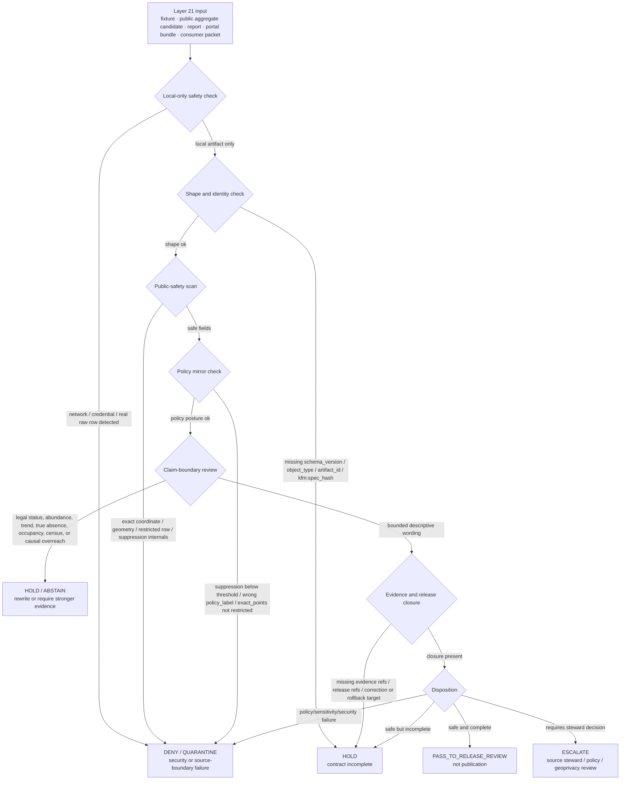

<!-- [KFM_META_BLOCK_V2]
doc_id: kfm://doc/TODO-register-ebird-quality-triage-uuid
title: eBird Quality and Triage
type: standard
version: v1
status: draft
owners: TODO(fauna-source-stewards)
created: TODO(verify-original-created-date-or-set-on-first-commit)
updated: 2026-05-07
policy_label: TODO(verify-public-or-restricted)
related: ["../../README.md", "../../INGEST_EBIRD.md", "../../SOURCE_ROLES.md", "../../GEOPRIVACY.md", "../../VALIDATION.md", "EBIRD_ARCHITECTURE.md", "EBIRD_CONTRACTS.md", "EBIRD_CONFORMANCE.md", "EBIRD_FEDERATION.md", "EBIRD_ANALYTICS.md", "EBIRD_PORTAL.md", "EBIRD_MAINTENANCE.md", "../../../../runbooks/fauna/EBIRD_OPERATIONS.md", "../../../../../policy/fauna/ebird.rego"]
tags: [kfm, fauna, ebird, quality, triage, occurrence-support, geoprivacy, public-aggregate, layer-21]
notes: [Revises the existing short Layer 21 eBird quality and triage note; doc_id, owners, created date, policy_label, executable validator paths, and CI enforcement remain TODO or NEEDS VERIFICATION until registry/steward/repo verification; this document is operational QA and triage guidance only.]
[/KFM_META_BLOCK_V2] -->

<a id="top"></a>

# eBird Quality and Triage

Operational QA and triage guidance for KFM’s governed eBird public-aggregate lane.

<p>
  
  
  
  
  
  
  
</p>

> [!IMPORTANT]
> **Impact block**
>
> | Field | Value |
> |---|---|
> | Status | `draft` |
> | Target path | `docs/domains/fauna/sources/ebird/EBIRD_QUALITY_AND_TRIAGE.md` |
> | Primary role | Layer 21 operational QA and triage guide for eBird public-aggregate artifacts |
> | Source role | eBird remains occurrence support, not legal-status authority |
> | Public geometry posture | No public exact coordinates; public outputs remain aggregate/generalized |
> | Triage posture | No network, no credentials, no real eBird rows, no live source fetch, no public exact coordinates |
> | Release posture | Triage can recommend `PASS`, `HOLD`, `DENY`, `QUARANTINE`, or `ESCALATE`; it does not publish |
> | Command posture | Validator/CLI names are documented as contract targets; executable paths and CI enforcement are **NEEDS VERIFICATION** |
> | Quick jumps | [Scope](#scope) · [Repo fit](#repo-fit) · [Inputs](#inputs) · [Exclusions](#exclusions) · [Triage flow](#triage-flow) · [Disposition model](#disposition-model) · [Quality gates](#quality-gates) · [Reason codes](#reason-codes) · [Triage record](#triage-record-shape) · [Commands](#command-contracts) · [Review checklist](#review-checklist) · [Open verification](#open-verification) |

---

## Scope

This file expands the existing Layer 21 note:

> Operational QA and triage only. No network, no credentials, no real eBird data, and no exact coordinates in public artifacts.

Layer 21 exists to review **KFM eBird public-aggregate artifacts and synthetic fixtures** before they are allowed to move toward downstream federation, analytics, portal/download, consumer handoff, Evidence Drawer, or Focus Mode surfaces.

It is not an eBird source connector, not an eBird reviewer workflow, not a legal-status authority, not a raw-data repair lane, not a public publication gate by itself, and not a way to override source terms, policy, geoprivacy, release, correction, or rollback.

### Layer 21 governs

| Surface | Quality / triage responsibility |
|---|---|
| Public aggregate candidates | Confirm county/HUC12 aggregate posture, suppression, field allowlist, hashes, evidence refs, release refs, warnings, and no exact coordinates. |
| Synthetic fixtures | Confirm fixture intent, expected pass/fail outcome, and no real eBird rows or sensitive coordinates. |
| Public reports and analytics | Catch unsafe inference language such as occupancy, abundance, true absence, population trend, causality, complete census, or legal status. |
| Portal/download bundles | Confirm bundles are built from already-public artifacts only and inherit warnings, hashes, validation refs, and policy labels. |
| Consumer handoff packets | Confirm downstream consumers receive source role, limitations, release identity, correction state, and rollback links. |
| Evidence Drawer payloads | Confirm public-safe source role, aggregate unit, suppression, evidence refs, policy posture, and limitations are visible. |
| Focus Mode inputs/outputs | Confirm Focus receives released EvidenceBundles only and returns `ANSWER`, `ABSTAIN`, `DENY`, or `ERROR` with citations or reason codes. |

### Layer 21 does not govern

| Not governed here | Owning surface |
|---|---|
| Source admission and live eBird activation | Source registry and source activation decision |
| Ingest/productization contract | [`../../INGEST_EBIRD.md`](../../INGEST_EBIRD.md) |
| eBird architecture and trust boundary | [`EBIRD_ARCHITECTURE.md`](EBIRD_ARCHITECTURE.md) |
| Contract hash, public aggregate contract, and field allowlist | [`EBIRD_CONTRACTS.md`](EBIRD_CONTRACTS.md) |
| Conformance acceptance | [`EBIRD_CONFORMANCE.md`](EBIRD_CONFORMANCE.md) |
| Maintenance and migration | [`EBIRD_MAINTENANCE.md`](EBIRD_MAINTENANCE.md) |
| Executable policy | [`../../../../../policy/fauna/ebird.rego`](../../../../../policy/fauna/ebird.rego) |
| Raw, work, quarantine, receipts, proofs, releases, and published data | `data/` and `release/` responsibility roots |
| Publication authority | Release manifest, proof pack, promotion decision, steward review, correction path, and rollback target |

[Back to top](#top)

---

## Repo fit

This is a human-facing source-family documentation file under the fauna documentation lane.

| Relationship | Status | Path / surface | Role |
|---|---:|---|---|
| This file | CONFIRMED target | `docs/domains/fauna/sources/ebird/EBIRD_QUALITY_AND_TRIAGE.md` | Layer 21 quality and triage guidance |
| Fauna overview | CONFIRMED | [`../../README.md`](../../README.md) | Domain scope, source roles, sensitivity, public-safety posture |
| eBird ingest hub | CONFIRMED | [`../../INGEST_EBIRD.md`](../../INGEST_EBIRD.md) | Ingest/productization and public aggregate posture |
| Source-role doctrine | CONFIRMED | [`../../SOURCE_ROLES.md`](../../SOURCE_ROLES.md) | Claim compatibility and authority boundaries |
| Geoprivacy guidance | CONFIRMED / NEEDS VERIFICATION for current enforcement | [`../../GEOPRIVACY.md`](../../GEOPRIVACY.md) | Exact-location, generalization, redaction, and public geometry rules |
| Validation guidance | CONFIRMED / NEEDS VERIFICATION for current enforcement | [`../../VALIDATION.md`](../../VALIDATION.md) | Validator expectations and fail-closed posture |
| eBird architecture | CONFIRMED | [`EBIRD_ARCHITECTURE.md`](EBIRD_ARCHITECTURE.md) | Source-family architecture and trust boundary |
| eBird contracts | CONFIRMED | [`EBIRD_CONTRACTS.md`](EBIRD_CONTRACTS.md) | Contract, hash, policy, and public-safety rules |
| eBird conformance | CONFIRMED | [`EBIRD_CONFORMANCE.md`](EBIRD_CONFORMANCE.md) | Local-only acceptance and conformance checks |
| eBird maintenance | CONFIRMED | [`EBIRD_MAINTENANCE.md`](EBIRD_MAINTENANCE.md) | Compatibility, migration, inventory, and public-safety scan |
| eBird federation/export | CONFIRMED | [`EBIRD_FEDERATION.md`](EBIRD_FEDERATION.md) | Public-safe discovery, federation, and exports |
| eBird analytics | CONFIRMED | [`EBIRD_ANALYTICS.md`](EBIRD_ANALYTICS.md) | Descriptive public aggregate analytics |
| eBird portal/downloads | CONFIRMED | [`EBIRD_PORTAL.md`](EBIRD_PORTAL.md) | Static portal and download bundle manifests |
| Operations runbook | CONFIRMED | [`../../../../runbooks/fauna/EBIRD_OPERATIONS.md`](../../../../runbooks/fauna/EBIRD_OPERATIONS.md) | Scan, trend, attest, evidence-pack, incident workflows |
| Executable policy | CONFIRMED target / NEEDS VERIFICATION for current behavior | [`../../../../../policy/fauna/ebird.rego`](../../../../../policy/fauna/ebird.rego) | Public aggregate deny rules |
| Quality validator | PROPOSED / NEEDS VERIFICATION | `../../../../../tools/validators/fauna/validate_ebird_quality.*` | Executable quality checks if/when present |
| Triage validator | PROPOSED / NEEDS VERIFICATION | `../../../../../tools/validators/fauna/validate_ebird_triage.*` | Executable triage checks if/when present |
| Layer 21 tests | PROPOSED / NEEDS VERIFICATION | `../../../../../tests/connectors/fauna/test_kfm_ebird_layer21.*` or repo-native equivalent | Regression proof for this layer |

### Directory Rules basis

`docs/domains/fauna/sources/ebird/` is the correct home because this file is **human-facing domain/source documentation** under `docs/`. eBird must not become a root-level `ebird/` or `fauna/` folder. Machine schemas, executable policy, validators, tests, lifecycle data, receipts, proofs, published artifacts, release decisions, and rollback cards belong under their own responsibility roots.

[Back to top](#top)

---

## Inputs

Layer 21 accepts only reviewable, local, synthetic, public-safe, or release-candidate artifacts. It should not need network access.

| Input | Accepted? | Required posture |
|---|---:|---|
| Synthetic valid fixture | ✅ | Explicitly marked synthetic; no real eBird row; no exact coordinates; expected result declared. |
| Synthetic invalid fixture | ✅ | Explicitly marked synthetic; designed to trigger a known denial, hold, abstain, or error. |
| Public aggregate candidate | ✅ | County/HUC12 or approved public-safe aggregate unit; no coordinate fields; suppression metadata present. |
| Public aggregate validation report | ✅ | Machine-readable result with pass/fail/hold, reason codes, and artifact refs. |
| Conformance packet | ✅ | Local-only acceptance evidence; no source fetch, no credentials, no exact points. |
| Maintenance/public-safety scan report | ✅ | Used to triage drift and unsafe fields/language. |
| Portal/download bundle manifest | ✅ | Already-public artifacts only; warnings and hashes inherited. |
| Consumer handoff packet | ✅ | Public-safe only; source role, warnings, release refs, validation refs, correction state. |
| Evidence Drawer payload fixture | ✅ | Public-safe source role, aggregate unit, evidence refs, policy labels, limitations. |
| Focus Mode request/response fixture | ✅ | Released EvidenceBundle refs only; finite outcome; no raw rows or exact coordinates. |
| Real raw eBird row | ❌ | Must remain in governed lifecycle storage, not Layer 21 docs or fixtures. |
| Live eBird API/EBD download | ❌ | Source activation and connector operation live upstream; not quality/triage documentation. |
| API token, key, cookie, private URL, credential | ❌ | Never allowed in this file, fixtures, reports, public bundles, or Focus context. |
| Exact coordinate or point geometry | ❌ | Denied in public artifacts and examples; exact public point exposure is not a Layer 21 default. |

[Back to top](#top)

---

## Exclusions

| Excluded material | Required handling | Reason |
|---|---|---|
| eBird API keys, EBD credentials, cookies, auth headers, tokens, private URLs | **DENY / QUARANTINE** | Secrets cannot appear in docs, fixtures, reports, portals, consumer packets, or Focus context. |
| Network calls or live eBird fetches | **DENY** for Layer 21 | Quality/triage is local-first and artifact-based. |
| Raw EBD exports or live API captures | Governed lifecycle roots only | RAW is source-native capture, not public QA documentation. |
| Exact public coordinates, `lat`, `lon`, `latitude`, `longitude`, `geometry`, `geom`, `point` | **DENY** | Public eBird artifacts remain aggregate/generalized. |
| Restricted observations | **DENY** from public artifacts | Prevent sensitive-location and source-term leakage. |
| Suppression receipts or suppressed-group details in public outputs | Restricted receipts/proofs only | Suppression internals can reveal low-count or sensitive patterns. |
| Quarantine paths in public reports | **DENY** | Quarantine is review-only, not public release support. |
| Legal-status claims from eBird | **DENY** unless separate legal/status authority evidence supports the claim | eBird is occurrence support in this lane. |
| Occupancy, abundance, true absence, complete census, population trend, or causal claims | **ABSTAIN / DENY / HOLD** unless separately governed evidence/model supports them | Public aggregates alone do not carry these claims. |
| Silent publication after triage pass | **DENY** | Triage does not publish; release requires promotion, proof, review, manifest, correction path, and rollback target. |
| Treating upstream eBird accepted/reviewed status as KFM release | **DENY** | Upstream review quality is useful context, not KFM release authority. |

[Back to top](#top)

---

## Triage flow



### Flow rules

1. Layer 21 is **local-only** by default.
2. Triage operates on artifacts, reports, and fixtures, not live source data.
3. A `PASS` means “eligible for the next review gate,” not “published.”
4. Exact-coordinate leakage, credential leakage, raw-row leakage, restricted-row leakage, and suppression-internal leakage are hard failures.
5. Unsupported inference language should be held or rewritten before release review.
6. Evidence and release closure must remain visible in public-facing outputs.
7. Corrections and rollback are required for anything that can reach public release.

[Back to top](#top)

---

## Disposition model

Layer 21 triage should produce a finite disposition. Use the narrowest truthful outcome.

| Disposition | Meaning | Next step |
|---|---|---|
| `PASS_TO_RELEASE_REVIEW` | Artifact appears public-safe and complete enough for the next governed release/review step. | Forward to release review; do not publish directly. |
| `HOLD_FOR_COMPLETENESS` | Artifact is not unsafe, but missing metadata, hash, evidence, release, validation, warning, or rollback detail. | Fix artifact or dossier and rerun triage. |
| `HOLD_FOR_CLAIM_REWRITE` | Artifact wording overstates what public aggregate eBird support can claim. | Rewrite claims and rerun triage. |
| `DENY_PUBLIC_OUTPUT` | Artifact violates public-safety, policy, source-role, sensitivity, exact-location, credential, or suppression rules. | Block public path; quarantine or repair with receipt. |
| `QUARANTINE_REVIEW` | Rights, source role, sensitivity, provenance, taxonomy, or geometry status is unresolved. | Route to steward/source/policy review. |
| `ESCALATE_STEWARD_REVIEW` | Artifact needs source steward, policy, geoprivacy, release, or consumer-impact decision. | Open review item with evidence and reason codes. |
| `ABSTAIN_EVIDENCE_INSUFFICIENT` | Requested public claim is unsupported by released evidence. | Return/record abstention; do not invent support. |
| `ERROR_TOOLING_OR_SCHEMA` | Triage could not complete due to malformed input or tool failure. | Fix tooling/input; no public use. |

### Severity classes

| Severity | Meaning | Typical action |
|---|---|---|
| `P0_BLOCKER` | Public harm or major trust break likely: credential leak, exact restricted location, raw row, restricted row, source-term conflict. | DENY, quarantine, incident review. |
| `P1_RELEASE_BLOCKER` | Artifact cannot move forward: missing evidence closure, invalid spec hash, failed validation, missing release/rollback, wrong policy label. | HOLD or DENY before release review. |
| `P2_STEWARD_REVIEW` | Needs human judgment: ambiguous taxonomy, source-role conflict, unexpected count shift, uncertain terms, public wording risk. | Escalate with triage record. |
| `P3_REPAIRABLE` | Formatting, link, warning propagation, metadata, or report-completeness issue. | Fix and rerun triage. |
| `P4_NOTE` | Non-blocking observation useful for maintenance. | Record in triage notes or maintenance backlog. |

[Back to top](#top)

---

## Quality gates

### Gate 1 — Local-only boundary

| Check | Required result | Failure disposition |
|---|---|---|
| Network access | `false` for Layer 21 checks | `DENY_PUBLIC_OUTPUT` or `ERROR_TOOLING_OR_SCHEMA` |
| Credentials present | `false` | `DENY_PUBLIC_OUTPUT` |
| Real raw eBird row present | `false` | `QUARANTINE_REVIEW` |
| Source URL with private token | `false` | `DENY_PUBLIC_OUTPUT` |
| Fixture intent declared | `true` for fixtures | `HOLD_FOR_COMPLETENESS` |

### Gate 2 — Public aggregate contract

| Check | Required result | Failure disposition |
|---|---|---|
| `policy_label` | `public_aggregate` for public aggregate artifacts | `DENY_PUBLIC_OUTPUT` |
| `exact_points` | `restricted` | `DENY_PUBLIC_OUTPUT` |
| `suppression_min_n` | `>= 10` | `DENY_PUBLIC_OUTPUT` |
| `aggregate` | `county`, `huc12`, or explicitly approved public-safe unit | `DENY_PUBLIC_OUTPUT` |
| `kfm:spec_hash` | `sha256:<64 lowercase hex>` or repo-accepted equivalent | `HOLD_FOR_COMPLETENESS` or `DENY_PUBLIC_OUTPUT` |
| coordinate fields | absent from public rows and public allowlists | `DENY_PUBLIC_OUTPUT` |
| restricted observations | absent from public rows | `DENY_PUBLIC_OUTPUT` |
| suppression internals | absent from public rows, downloads, portal bundles, and consumer packets | `DENY_PUBLIC_OUTPUT` |

### Gate 3 — Governed eBird filter posture

The Layer 10 governed checklist filter is preserved here as a quality context:

```sql
complete = TRUE
AND protocol_type != 'Incidental'
AND duration_min >= 5
AND distance_km <= 5
AND number_observers <= 10
```

> [!CAUTION]
> Passing this filter is not a publication decision. It only helps identify checklist support that may enter a governed aggregate candidate. Rights, sensitivity, public field allowlists, suppression, evidence closure, review, release, correction, and rollback still apply.

| Filter item | Triage concern |
|---|---|
| `complete = TRUE` | Incomplete or partial checklist support should not be silently promoted into aggregate support. |
| `protocol_type != 'Incidental'` | Incidental observations should not drive the governed public aggregate candidate by default. |
| `duration_min >= 5` | Very short effort may be held for quality review. |
| `distance_km <= 5` | Long-distance checklists weaken spatial support and can cause precision problems. |
| `number_observers <= 10` | Large groups may skew support and should be held or reviewed. |

### Gate 4 — Taxonomy and temporal consistency

| Check | Required result | Failure disposition |
|---|---|---|
| Taxon key | Stable under current taxonomy/version context | `HOLD_FOR_COMPLETENESS` |
| Taxonomy version | Recorded where taxon names/codes matter | `HOLD_FOR_COMPLETENESS` |
| Ambiguous taxon | Not silently merged | `ESCALATE_STEWARD_REVIEW` |
| Event date / time bucket | Present and public-safe | `HOLD_FOR_COMPLETENESS` |
| Source retrieval/update date | Present for source-derived artifacts | `HOLD_FOR_COMPLETENESS` |
| Release date | Present for public-facing artifacts | `HOLD_FOR_COMPLETENESS` |
| Stale source indicator | Visible when material | `HOLD_FOR_COMPLETENESS` |

### Gate 5 — Claim-boundary wording

| Unsafe wording pattern | Required disposition |
|---|---|
| “This species is absent from…” based only on no public aggregate record | `ABSTAIN_EVIDENCE_INSUFFICIENT` |
| “Population increased/decreased” from aggregate counts alone | `HOLD_FOR_CLAIM_REWRITE` |
| “Abundance is…” from checklist support alone | `HOLD_FOR_CLAIM_REWRITE` |
| “Occupies this area” without occupancy model/evidence | `HOLD_FOR_CLAIM_REWRITE` |
| “Legal status is…” sourced only from eBird | `DENY_PUBLIC_OUTPUT` |
| “Complete bird census” language | `HOLD_FOR_CLAIM_REWRITE` |
| “Exact location” request or display | `DENY_PUBLIC_OUTPUT` |
| “Sensitive details available in bundle” | `DENY_PUBLIC_OUTPUT` |

### Gate 6 — Evidence, release, correction, rollback

| Check | Required result | Failure disposition |
|---|---|---|
| Evidence refs | Present for claim-bearing public artifacts | `HOLD_FOR_COMPLETENESS` |
| EvidenceBundle / proof refs | Resolvable or explicitly pending | `HOLD_FOR_COMPLETENESS` |
| Validation report | Present and not failed for public candidate | `DENY_PUBLIC_OUTPUT` |
| Policy decision | Present for release candidate | `HOLD_FOR_COMPLETENESS` |
| Release manifest ref | Present before public release | `HOLD_FOR_COMPLETENESS` |
| Correction path | Present for public-facing artifacts | `HOLD_FOR_COMPLETENESS` |
| Rollback target | Present before public release | `HOLD_FOR_COMPLETENESS` |
| Prior release impact | Recorded when a candidate supersedes prior artifacts | `ESCALATE_STEWARD_REVIEW` |

[Back to top](#top)

---

## Reason codes

Use stable reason codes so triage reports can be compared across runs.

| Reason code | Severity | Meaning |
|---|---:|---|
| `layer21.network.detected` | `P0_BLOCKER` | A Layer 21 process attempted or required network access. |
| `layer21.credentials.detected` | `P0_BLOCKER` | Credential-like material was found. |
| `layer21.raw_ebird_row.detected` | `P0_BLOCKER` | Real/raw eBird row appears in a doc, fixture, report, or public artifact. |
| `layer21.exact_coordinates.public` | `P0_BLOCKER` | Public-facing material includes exact coordinates or raw point geometry. |
| `layer21.restricted_observation.public` | `P0_BLOCKER` | Restricted observation data appears in a public output. |
| `layer21.suppression_internals.public` | `P0_BLOCKER` | Suppression receipts or suppressed-group details appear in public-facing output. |
| `layer21.quarantine_path.public` | `P0_BLOCKER` | Public-facing material exposes a quarantine/internal lifecycle path. |
| `layer21.policy_label.invalid` | `P1_RELEASE_BLOCKER` | Public aggregate label is missing or not `public_aggregate`. |
| `layer21.suppression.threshold_too_low` | `P1_RELEASE_BLOCKER` | `suppression_min_n` is below 10. |
| `layer21.spec_hash.missing_or_invalid` | `P1_RELEASE_BLOCKER` | Required `kfm:spec_hash` is missing or malformed. |
| `layer21.evidence_refs.unresolved` | `P1_RELEASE_BLOCKER` | Claim-bearing output lacks resolvable evidence support. |
| `layer21.release_ref.missing` | `P1_RELEASE_BLOCKER` | Candidate lacks release manifest or release identity where needed. |
| `layer21.rollback_ref.missing` | `P1_RELEASE_BLOCKER` | Public-facing candidate lacks rollback target. |
| `layer21.validation.failed` | `P1_RELEASE_BLOCKER` | Validation report is failed or absent for release candidate. |
| `layer21.source_role.overreach` | `P1_RELEASE_BLOCKER` | eBird is used as legal/status authority or stronger source class than allowed. |
| `layer21.claim.absence_overreach` | `P2_STEWARD_REVIEW` | Output implies true absence from lack of public aggregate signal. |
| `layer21.claim.trend_overreach` | `P2_STEWARD_REVIEW` | Output implies population trend from descriptive aggregate counts. |
| `layer21.claim.abundance_overreach` | `P2_STEWARD_REVIEW` | Output implies abundance from checklist support alone. |
| `layer21.taxonomy.ambiguous` | `P2_STEWARD_REVIEW` | Taxon identity or taxonomy version is ambiguous. |
| `layer21.warning.missing` | `P3_REPAIRABLE` | Required descriptive-use warning is missing. |
| `layer21.consumer_handoff.incomplete` | `P3_REPAIRABLE` | Consumer packet lacks hashes, policy labels, validation refs, source role, or correction state. |
| `layer21.portal.remote_asset` | `P1_RELEASE_BLOCKER` | Portal/download bundle depends on unapproved remote scripts/assets. |
| `layer21.focus.unsupported_answer` | `P1_RELEASE_BLOCKER` | Focus output answers beyond evidence or policy support. |

[Back to top](#top)

---

## Triage record shape

The object below is illustrative until machine schema home and validator implementation are confirmed.

```json
{
  "object_type": "KfmEbirdQualityTriageRecord",
  "schema_version": "kfm.ebird.quality_triage.v1",
  "source_family": "ebird",
  "layer": 21,
  "triage_id": "ebird_triage_NEEDS_VERIFICATION",
  "artifact_ref": "kfm://artifact/fauna/ebird/NEEDS_VERIFICATION",
  "artifact_kind": "public_aggregate_candidate",
  "network_allowed": false,
  "credentials_allowed": false,
  "real_ebird_data_allowed": false,
  "exact_public_coordinates_allowed": false,
  "checks": [
    {
      "check_id": "public_exact_coordinates",
      "status": "pass",
      "reason_code": null
    },
    {
      "check_id": "suppression_min_n",
      "status": "pass",
      "observed": 10
    }
  ],
  "disposition": "HOLD_FOR_COMPLETENESS",
  "severity": "P1_RELEASE_BLOCKER",
  "reason_codes": [
    "layer21.release_ref.missing",
    "layer21.rollback_ref.missing"
  ],
  "required_actions": [
    "attach_release_manifest_ref",
    "attach_rollback_ref",
    "rerun_layer21_triage"
  ],
  "evidence_refs": [
    "kfm://evidence/NEEDS_VERIFICATION"
  ],
  "validation_report_ref": "kfm://validation/NEEDS_VERIFICATION",
  "policy_decision_ref": "kfm://policy-decision/NEEDS_VERIFICATION",
  "created_by": "TODO(steward-or-tool-id)",
  "created_at": "TODO(timestamp-generated-by-tool)",
  "notes": [
    "Illustrative shape only; confirm schema and actual emitted fields before treating as implementation."
  ]
}
```

### Required public warning

Use this warning, or a steward-approved equivalent, in public reports, portals, downloads, consumer handoffs, chart captions, and Focus-facing summaries:

> This eBird output is descriptive public aggregate reporting only. It does not show exact observations, does not include restricted records, and must not be interpreted as occupancy, abundance, true absence, population trend, causal effect, legal status, or a complete species census.

[Back to top](#top)

---

## Command contracts

The commands below are **PROPOSED / NEEDS VERIFICATION** until executable paths, package scripts, test files, and CI wiring are confirmed in the active checkout.

### Quality scan

```bash
tools/validators/fauna/validate_ebird_quality \
  --input /tmp/kfm-ebird/public-aggregate-candidate.json \
  --strict \
  --json
```

Expected behavior:

| Check | Expected result |
|---|---|
| Network | No network access. |
| Credentials | No credential loading. |
| Data | Synthetic/public-safe artifacts only. |
| Geometry | No exact coordinates in public rows or allowlists. |
| Output | Machine-readable report with finite disposition and reason codes. |

### Triage scan

```bash
tools/validators/fauna/validate_ebird_triage \
  --input /tmp/kfm-ebird/triage-input.json \
  --policy-label public_aggregate \
  --strict \
  --json
```

Expected behavior:

| Check | Expected result |
|---|---|
| Hard failures | Return `DENY_PUBLIC_OUTPUT` with reason codes. |
| Missing release/evidence details | Return `HOLD_FOR_COMPLETENESS`. |
| Unsupported claim language | Return `HOLD_FOR_CLAIM_REWRITE` or `ABSTAIN_EVIDENCE_INSUFFICIENT`. |
| Tool/schema failure | Return `ERROR_TOOLING_OR_SCHEMA`. |

### Public-safety scan

```bash
tools/connectors/fauna/kfm-ebird-ingest/kfm-ebird-maintain \
  --mode public-safety-scan \
  --artifact-root /tmp/kfm-ebird/public-candidate \
  --out-dir /tmp/kfm-ebird/layer21-public-safety
```

Expected behavior:

- no live source fetch;
- no credentials;
- no raw eBird rows;
- no exact public coordinates;
- deny coordinate/geometry field leakage;
- deny suppression-internal leakage;
- flag unsafe inference language;
- emit a report suitable for steward review.

### Test hook

```bash
python -m pytest tests/connectors/fauna/test_kfm_ebird_layer21.py
```

> [!NOTE]
> The test path above is a proposed repo-native target. If the active repo uses a different test language, path, or package manager, keep this document aligned to the verified convention and record the change in the open verification table.

[Back to top](#top)

---

## Review checklist

Before merging this file or changing Layer 21 behavior, verify:

- [ ] Metadata block placeholders remain intentional or are replaced with registry-confirmed values.
- [ ] eBird remains described as occurrence support, not legal-status authority.
- [ ] No examples include real API keys, EBD credentials, cookies, tokens, private URLs, or live request parameters.
- [ ] No examples include real eBird rows.
- [ ] No examples include exact public coordinates.
- [ ] Layer 21 remains local-only and no-network by default.
- [ ] Public aggregates remain county/HUC12 or explicitly approved public-safe units.
- [ ] `suppression_min_n >= 10` remains required.
- [ ] Public outputs keep `exact_points=restricted`.
- [ ] Public field allowlists deny coordinate and geometry fields.
- [ ] `kfm:spec_hash` remains required for public aggregate candidates.
- [ ] Public artifacts include descriptive-use warnings.
- [ ] Evidence refs, validation refs, policy decisions, release refs, correction path, and rollback target stay visible for release candidates.
- [ ] Focus Mode examples return `ABSTAIN` or `DENY` for unsupported or policy-blocked claims.
- [ ] Portal/download/consumer handoff outputs inherit warnings, hashes, source role, policy labels, validation refs, release refs, and correction state.
- [ ] Critical public-safety findings block public promotion.
- [ ] Any executable path, validator name, CLI name, or test path is marked `NEEDS VERIFICATION` unless directly verified in the active checkout.

[Back to top](#top)

---

## Definition of done

A Layer 21 quality/triage implementation is ready for review when:

- [ ] This document is linked from `INGEST_EBIRD.md`, `EBIRD_ARCHITECTURE.md`, `EBIRD_CONTRACTS.md`, `EBIRD_MAINTENANCE.md`, and the operations runbook where appropriate.
- [ ] A valid synthetic pass fixture exists.
- [ ] A synthetic exact-coordinate leak fixture fails.
- [ ] A synthetic credential leak fixture fails.
- [ ] A synthetic raw-row/public-output fixture fails.
- [ ] A low suppression threshold fixture fails.
- [ ] A missing `kfm:spec_hash` fixture fails.
- [ ] An unsupported true-absence claim fixture returns `ABSTAIN` or `HOLD_FOR_CLAIM_REWRITE`.
- [ ] A legal-status-from-eBird fixture fails.
- [ ] A portal/download missing-warning fixture fails.
- [ ] A consumer handoff missing release/hash/validation refs fixture fails.
- [ ] Triage emits a machine-readable record with finite disposition and reason codes.
- [ ] Release review cannot proceed on a failed or unresolved Layer 21 triage record.
- [ ] Rollback and correction references are required before public-facing release.
- [ ] CI or repo-native validation wiring is verified and documented.

[Back to top](#top)

---

## FAQ

### Does Layer 21 decide whether an eBird observation is true?

No. Layer 21 does not replace eBird review, field expertise, or source stewardship. It checks whether KFM artifacts derived from eBird support are safe, bounded, evidence-aware, and release-ready.

### Can Layer 21 use live eBird data?

No by default. Layer 21 is local-only and no-network. Live source work belongs upstream in a governed source activation and connector flow.

### Does a `PASS_TO_RELEASE_REVIEW` disposition publish an artifact?

No. It only means the artifact can move to the next governed review/release step. Publication still requires validation, policy, evidence/proof closure, review, release manifest, correction path, and rollback target.

### Can public eBird outputs include exact coordinates?

No by default. Public outputs are aggregate/generalized and must not expose exact coordinate or geometry fields.

### Can public aggregate counts be interpreted as abundance?

No. Public aggregate counts are descriptive occurrence-support counts after filtering and suppression. They are not abundance, occupancy, complete census, true absence, population trend, causal effect, or legal status.

### What should happen if the artifact is safe but incomplete?

Use `HOLD_FOR_COMPLETENESS`, list missing items, and rerun triage after repair.

[Back to top](#top)

---

## Open verification

| Item | Status | Needed proof |
|---|---:|---|
| Registered `doc_id` | TODO | Document registry entry. |
| Owners | TODO | CODEOWNERS, steward register, or source-lane owner assignment. |
| Created date | TODO | Git history or steward-approved first-commit date. |
| Policy label | TODO | Repo policy classification. |
| Actual executable quality validator | NEEDS VERIFICATION | Checked-in validator file, package script, or command entrypoint. |
| Actual executable triage validator | NEEDS VERIFICATION | Checked-in validator file, package script, or command entrypoint. |
| Layer 21 test path | NEEDS VERIFICATION | Confirm repo-native test path and runner. |
| CI enforcement | UNKNOWN | Workflow or required-check evidence. |
| Policy runner | NEEDS VERIFICATION | OPA/Conftest/Rego or repo-native policy runner command and version. |
| Schema home for triage record | NEEDS VERIFICATION | Accepted ADR or repo convention. |
| eBird source descriptor | NEEDS VERIFICATION | Registry entry with source role, rights, citation, cadence, sensitivity, access class, and allowed uses. |
| eBird terms/citation review | NEEDS VERIFICATION | Current source terms, citation instructions, redistribution limits, and downstream-use limits. |
| Portal/download inheritance checks | NEEDS VERIFICATION | Tests proving warnings, hashes, validation refs, source role, policy labels, and correction state propagate. |
| Consumer handoff checks | NEEDS VERIFICATION | Tests proving downstream packets cannot drop warnings, release refs, or limitations. |
| Focus Mode checks | NEEDS VERIFICATION | Tests proving exact-location requests deny and unsupported inference abstains. |
| Release/promotion linkage | NEEDS VERIFICATION | ReleaseManifest, PromotionReceipt, ProofPack, CorrectionNotice, and RollbackPlan conventions. |

[Back to top](#top)

---

## Appendix

<details>
<summary>Negative fixture backlog</summary>

| Fixture | Expected disposition |
|---|---|
| `ebird_layer21_public_row_contains_latitude.json` | `DENY_PUBLIC_OUTPUT` |
| `ebird_layer21_public_row_contains_longitude.json` | `DENY_PUBLIC_OUTPUT` |
| `ebird_layer21_public_row_contains_geometry.json` | `DENY_PUBLIC_OUTPUT` |
| `ebird_layer21_public_allowlist_contains_geom.json` | `DENY_PUBLIC_OUTPUT` |
| `ebird_layer21_credentials_detected.json` | `DENY_PUBLIC_OUTPUT` |
| `ebird_layer21_private_url_detected.json` | `DENY_PUBLIC_OUTPUT` |
| `ebird_layer21_real_raw_row_in_fixture.json` | `QUARANTINE_REVIEW` |
| `ebird_layer21_suppression_min_5.json` | `DENY_PUBLIC_OUTPUT` |
| `ebird_layer21_missing_spec_hash.json` | `HOLD_FOR_COMPLETENESS` |
| `ebird_layer21_bad_spec_hash.json` | `DENY_PUBLIC_OUTPUT` |
| `ebird_layer21_wrong_policy_label.json` | `DENY_PUBLIC_OUTPUT` |
| `ebird_layer21_below_threshold_count.json` | `DENY_PUBLIC_OUTPUT` |
| `ebird_layer21_occurrence_support_as_legal_authority.json` | `DENY_PUBLIC_OUTPUT` |
| `ebird_layer21_absence_claim_from_missing_signal.md` | `ABSTAIN_EVIDENCE_INSUFFICIENT` |
| `ebird_layer21_population_trend_wording.md` | `HOLD_FOR_CLAIM_REWRITE` |
| `ebird_layer21_abundance_wording.md` | `HOLD_FOR_CLAIM_REWRITE` |
| `ebird_layer21_portal_remote_script.html` | `DENY_PUBLIC_OUTPUT` |
| `ebird_layer21_public_bundle_includes_suppression_receipt.json` | `DENY_PUBLIC_OUTPUT` |
| `ebird_layer21_missing_public_warning.md` | `HOLD_FOR_COMPLETENESS` |
| `ebird_layer21_missing_rollback_ref.json` | `HOLD_FOR_COMPLETENESS` |

</details>

<details>
<summary>Maintainer update triggers</summary>

Update this file when any of the following changes:

- eBird source role;
- eBird source terms, citation posture, or redistribution posture;
- governed filter;
- suppression threshold;
- aggregate unit vocabulary;
- public field allowlist;
- public geometry class;
- quality/triage disposition vocabulary;
- reason-code registry;
- validator command name or path;
- policy file behavior;
- validation runner behavior;
- portal/download contract;
- analytics claim-boundary wording;
- consumer handoff contract;
- Focus Mode response contract;
- source activation workflow;
- release/rollback/correction procedure;
- Evidence Drawer payload contract.

</details>

[Back to top](#top)
