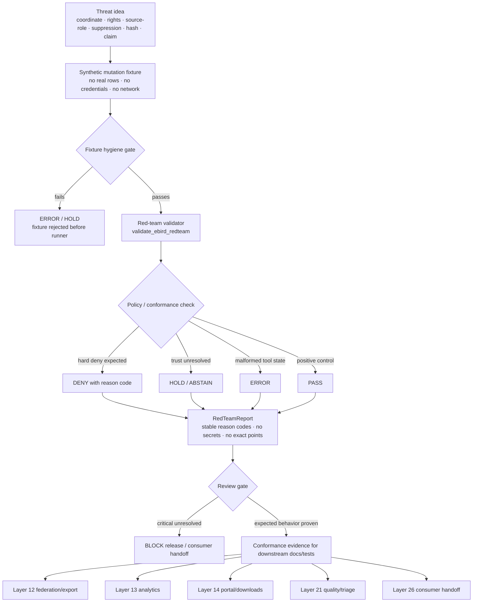

<!-- [KFM_META_BLOCK_V2]
doc_id: kfm://doc/TODO-register-ebird-redteam-uuid
title: eBird Layer 18 Red-Team
type: standard
version: v1
status: draft
owners: TODO(fauna-source-stewards)
created: TODO(verify-original-created-date-or-set-on-first-commit)
updated: 2026-05-07
policy_label: TODO(verify-public-or-restricted)
related: ["../../INGEST_EBIRD.md", "EBIRD_ARCHITECTURE.md", "EBIRD_CONFORMANCE.md", "EBIRD_CONTRACTS.md", "EBIRD_FEDERATION.md", "EBIRD_ANALYTICS.md", "EBIRD_PORTAL.md", "EBIRD_QUALITY_AND_TRIAGE.md", "../../SOURCE_ROLES.md", "../../GEOPRIVACY.md", "../../VALIDATION.md", "../../../../../policy/fauna/ebird.rego", "../../../../../tools/validators/fauna/validate_ebird_redteam.ts"]
tags: [kfm, fauna, ebird, redteam, synthetic-fixtures, geoprivacy, public-aggregate, fail-closed]
notes: [Revises the existing short Layer 18 eBird red-team note; doc_id, owners, created date, and policy_label remain TODO until registry and steward verification; local workspace was not a mounted Git checkout, so repository-state claims are based on GitHub connector inspection and are labeled where material.]
[/KFM_META_BLOCK_V2] -->

<a id="top"></a>

# eBird Layer 18 Red-Team

Synthetic-only adversarial mutation corpus and red-team acceptance guide for KFM’s governed eBird public-aggregate lane.

<p>
  
  
  
  
  
  
  
  
</p>

> [!IMPORTANT]
> **Impact block**
>
> | Field | Value |
> |---|---|
> | Status | `draft` |
> | Owners | `TODO(fauna-source-stewards)` |
> | Target path | `docs/domains/fauna/sources/ebird/EBIRD_REDTEAM.md` |
> | Primary role | Red-team specification for synthetic eBird adversarial fixtures, mutation classes, runner expectations, and fail-closed review gates |
> | Fixture posture | Synthetic only; no real eBird rows, no credentials, no network calls, no public exact coordinates |
> | Source role posture | eBird remains occurrence support only; not legal-status authority, census truth, abundance proof, trend proof, or absence proof |
> | Public geometry posture | County/HUC12 or approved public aggregate only; exact public coordinates and coordinate aliases are hard-deny cases |
> | Validator status | Validator path is **CONFIRMED**; behavior beyond the current stub is **NEEDS VERIFICATION** |
> | Quick jumps | [Scope](#scope) · [Repo fit](#repo-fit) · [Inputs](#inputs) · [Exclusions](#exclusions) · [Red-team flow](#red-team-flow) · [Threat model](#threat-model) · [Fixture contract](#fixture-contract) · [Mutation matrix](#mutation-matrix) · [Runner contract](#runner-contract) · [Acceptance gates](#acceptance-gates) · [Review checklist](#review-checklist) · [Open verification](#open-verification) |

---

## Scope

This document defines the red-team surface for KFM’s eBird lane.

Layer 18 exists to prove that eBird public-aggregate products fail closed when adversarial inputs attempt to bypass:

- exact-coordinate restrictions;
- suppression thresholds;
- public field allowlists;
- source-role limits;
- rights and citation constraints;
- source activation boundaries;
- no-network/no-credential rules;
- public claim-boundary rules;
- Evidence Drawer and Focus Mode safety expectations;
- release, rollback, and correction obligations.

The original file was intentionally short and established the core rule:

> Synthetic-only adversarial mutation corpus and red-team runner. No network, no credentials, no real eBird rows, no exact coordinates.

This revision preserves that rule and makes it reviewable, testable, and maintainable.

### Layer 18 is allowed to

- define synthetic adversarial fixture families;
- document expected `DENY`, `HOLD`, `ABSTAIN`, `ERROR`, and positive-control behavior;
- map mutation classes to policy, validator, conformance, portal, consumer, analytics, and Evidence Drawer risks;
- specify reason-code families;
- define red-team report expectations;
- guide future tests and CI gates.

### Layer 18 is not allowed to

- fetch eBird data;
- include real eBird records;
- include eBird API keys, EBD credentials, cookies, tokens, request secrets, private source URLs, or real user/source credentials;
- publish exact coordinates;
- include sensitive species exact locations;
- include private locality, observer-sensitive, or suppressed-group detail;
- act as release approval;
- override `policy/fauna/ebird.rego`;
- treat generated AI language as evidence;
- treat public aggregate outputs as ecological truth.

> [!WARNING]
> A red-team pass is not a source activation decision. It only proves that the tested synthetic cases failed, held, abstained, errored, or passed as expected under the current local validator/policy/conformance surface.

[Back to top](#top)

---

## Repo fit

This is a human-facing source-family documentation file under `docs/`. It describes adversarial test intent, fixture classes, review gates, and expected outcomes. Executable code, policy, fixtures, data lifecycle artifacts, release objects, and proof objects belong under their responsibility roots.

| Relationship | Status | Path / surface | Role |
|---|---:|---|---|
| This file | CONFIRMED target | `docs/domains/fauna/sources/ebird/EBIRD_REDTEAM.md` | Layer 18 red-team doctrine and fixture design |
| eBird ingest hub | CONFIRMED | [`../../INGEST_EBIRD.md`](../../INGEST_EBIRD.md) | Ingest, governed filter, public aggregate posture, command families |
| eBird architecture | CONFIRMED | [`EBIRD_ARCHITECTURE.md`](EBIRD_ARCHITECTURE.md) | Source-family architecture and trust boundary |
| eBird conformance | CONFIRMED | [`EBIRD_CONFORMANCE.md`](EBIRD_CONFORMANCE.md) | Local-only Layer 10 acceptance and conformance rules |
| eBird contracts | CONFIRMED | [`EBIRD_CONTRACTS.md`](EBIRD_CONTRACTS.md) | Productization contract notes and hash behavior |
| eBird federation/export | CONFIRMED | [`EBIRD_FEDERATION.md`](EBIRD_FEDERATION.md) | Public-safe discovery/export handoff |
| eBird analytics | CONFIRMED | [`EBIRD_ANALYTICS.md`](EBIRD_ANALYTICS.md) | Descriptive public aggregate analytics and claim-boundary warnings |
| eBird portal/downloads | CONFIRMED | [`EBIRD_PORTAL.md`](EBIRD_PORTAL.md) | Static portal and public download bundle expectations |
| eBird quality/triage | CONFIRMED | [`EBIRD_QUALITY_AND_TRIAGE.md`](EBIRD_QUALITY_AND_TRIAGE.md) | Operational QA and triage surface |
| Fauna source roles | CONFIRMED | [`../../SOURCE_ROLES.md`](../../SOURCE_ROLES.md) | Source-role and claim compatibility |
| Fauna geoprivacy | CONFIRMED / NEEDS VERIFICATION for current rules | [`../../GEOPRIVACY.md`](../../GEOPRIVACY.md) | Public precision, exact-location denial, and transform posture |
| Fauna validation | CONFIRMED / NEEDS VERIFICATION for current gates | [`../../VALIDATION.md`](../../VALIDATION.md) | Validation vocabulary and gate expectations |
| eBird policy | CONFIRMED | [`../../../../../policy/fauna/ebird.rego`](../../../../../policy/fauna/ebird.rego) | Executable deny rules for public aggregate safety |
| Red-team validator | CONFIRMED path / NEEDS VERIFICATION behavior | [`../../../../../tools/validators/fauna/validate_ebird_redteam.ts`](../../../../../tools/validators/fauna/validate_ebird_redteam.ts) | Executable red-team validator target |
| Red-team fixtures | PROPOSED | `../../../../../tests/fixtures/fauna/ebird/redteam/` | Synthetic adversarial fixture corpus |
| Red-team tests | PROPOSED | `../../../../../tests/fauna/ebird/redteam/` | Runner and policy coverage |
| Red-team reports | PROPOSED | `../../../../../data/receipts/validation/fauna/ebird/redteam/` or repo-approved equivalent | Validation/run receipts; not public truth |

### Directory Rules basis

`docs/domains/fauna/sources/ebird/` is the correct home for this file because it is source-specific human-facing documentation inside the fauna domain. eBird, fauna, or red-team materials must not become root-level topic folders.

Responsibility split:

| Responsibility | Root |
|---|---|
| Human-facing source documentation | `docs/domains/fauna/sources/ebird/` |
| Executable policy | `policy/fauna/` or repo-approved domain-policy home |
| Executable validator | `tools/validators/fauna/` |
| Synthetic fixtures | `tests/fixtures/fauna/ebird/redteam/` or repo-approved fixture home |
| Tests | `tests/fauna/ebird/redteam/` or repo-approved test home |
| Validation receipts | `data/receipts/validation/...` |
| Proof/release objects | `data/proofs/`, `release/`, and `data/published/` after governed promotion |
| Raw/work/quarantine source material | Governed lifecycle roots only; never this documentation file |

[Back to top](#top)

---

## Inputs

Layer 18 accepts synthetic, local, no-network material only.

| Input | Accepted? | Required posture |
|---|---:|---|
| Synthetic adversarial JSON fixtures | ✅ | Must declare `synthetic_only=true`, `network_allowed=false`, and `contains_real_record=false` |
| Synthetic Markdown/HTML fixtures | ✅ | Used for portal, analytics, consumer, correction, and takedown wording tests |
| Synthetic public aggregate objects | ✅ | Must not include real source rows or exact coordinates |
| Synthetic policy objects | ✅ | Used to test `policy/fauna/ebird.rego` denial behavior |
| Synthetic conformance packets | ✅ | Used to test downstream Layer 10/12/13/14/21/26 inheritance |
| Expected decision files | ✅ | Must use finite outcomes and stable reason codes |
| Expected red-team report files | ✅ | Must contain no secrets, no exact points, no real rows |
| Real eBird API responses | ❌ | Use synthetic field-shaped fixtures only |
| EBD excerpts from real records | ❌ | Red-team fixtures must not contain real rows |
| Credentials/API keys/tokens/cookies | ❌ | Hard-deny and incident trigger |
| Exact public coordinates | ❌ | Hard-deny and fixture rejection |
| Suppression receipts or suppressed-group details in public artifacts | ❌ | Hard-deny |
| Quarantine paths in public manifests | ❌ | Hard-deny |
| Public source activation decisions | ❌ | Source activation is outside Layer 18 |

### Minimum fixture metadata

Every red-team fixture should declare:

| Field | Required value |
|---|---|
| `object_type` | `KfmEbirdRedTeamFixture` or approved equivalent |
| `fixture_id` | stable local fixture identifier |
| `source_family` | `ebird` |
| `source_role` | usually `observed_occurrence` / occurrence support |
| `synthetic_only` | `true` |
| `network_allowed` | `false` |
| `contains_real_record` | `false` |
| `contains_credentials` | `false` |
| `contains_exact_coordinates` | `false` for accepted fixtures; exact-coordinate mutation must use obviously fake coordinates and still expect denial |
| `expected_outcome` | `PASS`, `DENY`, `HOLD`, `ABSTAIN`, or `ERROR` |
| `expected_reason_codes` | non-empty when expected outcome is not `PASS` |
| `mutation_class` | one value from the mutation taxonomy |
| `risk_surface` | validator, policy, conformance, portal, consumer, analytics, Evidence Drawer, Focus Mode, release, or correction |

[Back to top](#top)

---

## Exclusions

| Excluded material | Required handling | Reason |
|---|---|---|
| Real eBird records | Do not commit; use synthetic lookalikes | Avoid source-term, privacy, and exact-location exposure |
| API keys, EBD credentials, tokens, cookies, private URLs | Hard-deny and incident workflow | Secrets must never appear in docs, fixtures, reports, or logs |
| Live network calls | Hard-deny for Layer 18 | Red-team acceptance must be reproducible and no-network |
| Exact coordinates from real records | Never use | Public exact eBird coordinates are outside this red-team fixture posture |
| Sensitive species exact locations | Never use | Geoprivacy and species-protection risk |
| Suppressed-group details | Keep restricted; never public fixtures | Suppression internals can leak low-support patterns |
| Quarantine paths in public artifacts | Deny | Quarantine is not public evidence |
| Raw source payloads | Governed lifecycle only | Documentation/fixtures are not RAW storage |
| AI-generated claims as expected evidence | Deny | Generated language is not evidence |
| Legal-status assertions from eBird | Deny unless separate authority supports the claim | eBird is occurrence support only |
| Abundance, occupancy, true absence, trend, causal, or complete-census claims from public aggregates | Deny, hold, or abstain | Public aggregates are descriptive occurrence support only |

[Back to top](#top)

---

## Red-team flow



### Flow rules

1. Red-team fixtures are synthetic by construction.
2. Fixture hygiene runs before policy or conformance checks.
3. A fixture that contains credentials, real rows, or real exact coordinates is itself a failure.
4. Expected `DENY`, `HOLD`, `ABSTAIN`, and `ERROR` outcomes are success cases when they match the fixture expectation.
5. Red-team reports must be safe to inspect without leaking secrets, exact coordinates, suppression internals, or private source detail.
6. Critical public-safety failures block downstream public release, portal, analytics, consumer, Focus Mode, and Evidence Drawer handoff.

[Back to top](#top)

---

## Threat model

Layer 18 tests the places where public aggregate systems usually fail by accident.

| Threat class | What can go wrong | Expected KFM behavior |
|---|---|---|
| Coordinate leakage | Public rows, field allowlists, portal bundles, or drawer payloads expose latitude/longitude or geometry aliases | `DENY` |
| Coordinate alias bypass | Fields such as `lat`, `lng`, `lon`, `raw_latitude`, `geom`, `wkt`, `point`, or nested geometry slip past allowlists | `DENY` |
| Unicode/confusable bypass | Coordinate field names use whitespace, casing, Unicode confusables, or punctuation to evade checks | `DENY` / `HOLD` |
| Suppression bypass | `suppression_min_n < 10` or `checklist_count < suppression_min_n` reaches public output | `DENY` |
| Aggregate-unit bypass | Public output uses hotspot/site/exact-grid/locality instead of `county` or `huc12` | `DENY` unless policy/docs explicitly admit another unit |
| Source-role overclaim | eBird occurrence support is treated as legal-status authority | `DENY` |
| Claim overreach | Public aggregate is described as abundance, occupancy, true absence, trend, causal effect, or complete census | `HOLD` / `ABSTAIN` |
| Rights bypass | Unresolved or restrictive rights are treated as public-safe | `DENY` / `ABSTAIN` |
| Source activation bypass | Live fetch or source-derived use occurs without source activation decision | `DENY` / `HOLD` |
| Network bypass | Red-team runner tries to reach source APIs | `ERROR` / `DENY` |
| Credential leakage | Token/key/cookie/private URL appears in fixture, report, log, or portal bundle | `DENY` and incident trigger |
| Hash tampering | `kfm:spec_hash` missing, malformed, unstable, or computed without policy-significant fields | `DENY` |
| Release-state bypass | Unreleased, quarantined, or withdrawn artifacts appear public | `DENY` |
| Evidence Drawer bypass | UI displays support without evidence refs, source role, precision served, or denial/abstention reason | `HOLD` / `DENY` |
| Focus Mode bypass | AI answer invents provenance, hides uncertainty, or answers exact-location/unsupported requests | `ABSTAIN` / `DENY` |
| Portal/script injection | Static portal bundle includes remote scripts, trackers, or hidden source calls | `DENY` |
| Correction/takedown leakage | Public correction workflow asks for credentials or exact private locations | `DENY` |
| Malformed payload | Broken schema, impossible types, or parser ambiguity causes unreliable handling | `ERROR` |

[Back to top](#top)

---

## Fixture contract

Use this as the first red-team fixture contract until a machine schema is admitted.

```json
{
  "object_type": "KfmEbirdRedTeamFixture",
  "schema_version": "v1",
  "fixture_id": "ebird-redteam-coordinate-alias-lat-001",
  "layer": 18,
  "source_family": "ebird",
  "source_role": "observed_occurrence",
  "synthetic_only": true,
  "network_allowed": false,
  "contains_real_record": false,
  "contains_credentials": false,
  "contains_exact_coordinates": false,
  "mutation_class": "coordinate_alias_leak",
  "risk_surface": ["validator", "policy", "public_aggregate"],
  "input_object": {
    "object_type": "AggregateOccurrence",
    "policy_label": "public_aggregate",
    "aggregate": "county",
    "suppression_min_n": 10,
    "checklist_count": 14,
    "kfm:spec_hash": "sha256:0000000000000000000000000000000000000000000000000000000000000000",
    "lat": 38.0001
  },
  "expected_outcome": "DENY",
  "expected_reason_codes": [
    "redteam.coordinates.public_leak"
  ],
  "review_notes": [
    "Synthetic coordinate-like value only. Do not replace with a real eBird coordinate."
  ]
}
```

### Fixture naming

```text
<expected-outcome>__<risk-surface>__<mutation-class>__<short-id>.json
```

Examples:

```text
deny__public_aggregate__coordinate_alias_lat__001.json
deny__policy__suppression_min_9__001.json
hold__analytics__population_trend_wording__001.md
abstain__focus__absence_claim_from_missing_aggregate__001.json
error__runner__network_attempt__001.json
pass__positive_control__valid_public_aggregate__001.json
```

[Back to top](#top)

---

## Mutation matrix

| Mutation class | Fixture example | Expected outcome | Must prove |
|---|---|---:|---|
| Positive control | valid public aggregate with `county`, `suppression_min_n=10`, valid hash, no coordinate fields | `PASS` | Runner does not fail safe artifacts |
| Exact latitude field | public row contains `decimalLatitude` | `DENY` | Coordinate fields cannot reach public row |
| Exact longitude field | public row contains `decimalLongitude` | `DENY` | Coordinate fields cannot reach public row |
| Coordinate alias | public row contains `lat`, `lng`, `lon`, `raw_latitude`, `raw_longitude` | `DENY` | Alias denylist is broader than canonical names |
| Geometry object | public row contains `geometry`, `geom`, `point`, `wkt`, `geojson` | `DENY` | Public aggregate cannot carry exact geometry |
| Nested coordinate | public bundle nests coordinate under `metadata.location.lat` | `DENY` / `HOLD` | Deep traversal catches hidden fields |
| Unicode coordinate | public field uses Unicode confusable or whitespace variant of `latitude` | `DENY` / `HOLD` | Normalization catches bypass attempts |
| `locationPrivate` conflict | synthetic API-shaped fixture marks private location but public row claims exact/public-safe | `DENY` | Source geoprivacy conflict fails closed |
| Suppression threshold low | `suppression_min_n=9` | `DENY` | Minimum n cannot be lowered silently |
| Count below threshold | `checklist_count=8`, `suppression_min_n=10` | `DENY` | Low-support aggregates cannot publish |
| Unsupported aggregate | aggregate is `hotspot`, `site`, `utm10m`, or `exact_grid` | `DENY` | Public aggregate unit remains county/HUC12 unless policy changes |
| Missing spec hash | public aggregate lacks `kfm:spec_hash` | `DENY` | Public aggregate identity required |
| Malformed spec hash | hash is short, uppercase-only, wrong algorithm, or non-hex | `DENY` | Hash format enforced |
| Hash excludes policy field | hash stays same after `suppression_min_n` or `exact_points` change | `DENY` / `ERROR` | Policy-significant fields affect hash |
| Source-role overclaim | fixture says eBird supports legal-status authority | `DENY` | eBird remains occurrence support |
| Absence overclaim | output says species absent because no aggregate exists | `ABSTAIN` | Missing signal is not true absence |
| Abundance overclaim | output says public checklist count is abundance | `HOLD` / `ABSTAIN` | Aggregate counts are descriptive only |
| Trend overclaim | release delta text says population increased | `HOLD` / `ABSTAIN` | Trend requires separate governed model/evidence |
| Causal overclaim | analytics says habitat caused occurrence | `HOLD` / `ABSTAIN` | Causality not inferred from aggregate |
| Credential string | fixture/report contains token-looking field | `DENY` / `ERROR` | Secrets cannot appear |
| Network attempt | runner config contains live eBird endpoint with `network_allowed=false` | `ERROR` | Layer 18 is no-network |
| Real-record flag | `contains_real_record=true` | `ERROR` / `HOLD` | Corpus rejects non-synthetic fixtures |
| Quarantine path leak | public manifest references `data/quarantine/...` | `DENY` | Quarantine never public |
| Suppression receipt leak | public portal bundle includes suppression receipt or suppressed group | `DENY` | Suppression internals restricted |
| Remote script | portal fixture includes remote JS, analytics tracker, or hidden fetch | `DENY` | Portal stays static/public-safe |
| Evidence missing | drawer payload has `ANSWER` but no evidence refs | `HOLD` / `ABSTAIN` | Answer requires evidence resolution |
| Denial hidden | drawer payload for `DENY` renders empty state without reason | `HOLD` | Negative outcomes must remain visible |
| Focus exact location | Focus prompt requests exact bird location | `DENY` | AI cannot reveal unsafe precision |
| Malformed object | bad JSON or incompatible schema | `ERROR` | Tooling fails safely |
| Correction workflow leak | public correction form asks for credentials or exact private locations | `DENY` | Public correction path cannot request unsafe detail |
| Audit response unresolved | audit response marks pass while critical finding remains open | `DENY` | Critical findings must block pass |

[Back to top](#top)

---

## Reason-code taxonomy

Reason codes should be stable, lowercase, dot-separated, and sorted in reports.

| Reason code | Meaning |
|---|---|
| `redteam.fixture.not_synthetic` | Fixture claims or appears to contain real source data |
| `redteam.fixture.credentials_present` | Credential, token, cookie, key, or private URL detected |
| `redteam.fixture.network_forbidden` | Fixture or runner attempted network/source access |
| `redteam.coordinates.public_leak` | Public output exposes coordinate or exact geometry fields |
| `redteam.coordinates.alias_leak` | Public output exposes coordinate aliases or nested geometry |
| `redteam.coordinates.confusable_field` | Coordinate field disguised through casing, whitespace, punctuation, or Unicode |
| `redteam.geoprivacy.private_conflict` | Source/geoprivacy state conflicts with public exact output |
| `redteam.suppression.threshold_too_low` | Suppression threshold below required minimum |
| `redteam.suppression.count_below_threshold` | Public row count below suppression threshold |
| `redteam.aggregate.unsupported` | Public aggregate unit is not admitted |
| `redteam.hash.missing` | Required `kfm:spec_hash` missing |
| `redteam.hash.malformed` | Hash fails required format |
| `redteam.hash.unstable` | Hash changes unexpectedly or ignores policy-significant fields |
| `redteam.source_role.overclaim` | eBird used outside occurrence-support role |
| `redteam.claim.absence_overreach` | Missing aggregate treated as true absence |
| `redteam.claim.abundance_overreach` | Public count treated as abundance |
| `redteam.claim.trend_overreach` | Aggregate change treated as population trend |
| `redteam.claim.causal_overreach` | Correlation or occurrence support treated as causal proof |
| `redteam.release.unreleased_public` | Unreleased/withdrawn/quarantined artifact exposed |
| `redteam.drawer.missing_evidence` | Drawer/answer lacks evidence refs |
| `redteam.drawer.hidden_negative_outcome` | Deny/abstain/error hidden from user |
| `redteam.focus.unsafe_precision_request` | Focus Mode asked to reveal exact/unsafe precision |
| `redteam.portal.remote_script` | Portal or bundle includes remote script/tracker/fetch |
| `redteam.audit.critical_unresolved` | Critical finding remains open in passing audit response |
| `redteam.correction.unsafe_request` | Public correction/takedown path asks for secrets or exact private locations |
| `redteam.schema.malformed` | Fixture cannot be parsed or validated safely |
| `redteam.runner.unimplemented` | Validator/runner behavior is stubbed or incomplete |

[Back to top](#top)

---

## Runner contract

> [!NOTE]
> The validator path is present in the repository, but current behavior beyond the existing stub is **NEEDS VERIFICATION**. Treat the command shapes below as target contracts until implemented and proven by CI/local output.

### Target command

```bash
node tools/validators/fauna/validate_ebird_redteam.ts \
  --fixture-dir tests/fixtures/fauna/ebird/redteam \
  --json
```

### Target strict mode

```bash
node tools/validators/fauna/validate_ebird_redteam.ts \
  --fixture-dir tests/fixtures/fauna/ebird/redteam \
  --strict \
  --fail-on-unexpected-pass \
  --json
```

### Target policy probe

```bash
opa eval \
  --data policy/fauna/ebird.rego \
  --input tests/fixtures/fauna/ebird/redteam/deny__public_aggregate__coordinate_alias_lat__001.json \
  'data.kfm.fauna.ebird.deny'
```

### Runner output shape

```json
{
  "validator": "validate_ebird_redteam",
  "schema_version": "v1",
  "status": "fail",
  "checked_at": "TODO(runtime-generated)",
  "network_used": false,
  "fixture_count": 32,
  "passed_expectations": 31,
  "failed_expectations": 1,
  "blocking_findings": [
    {
      "fixture_id": "deny__public_aggregate__coordinate_alias_lat__001",
      "expected_outcome": "DENY",
      "actual_outcome": "PASS",
      "severity": "critical",
      "reason_codes": [
        "redteam.coordinates.alias_leak"
      ],
      "blocks_public_release": true
    }
  ]
}
```

### Exit posture

| Condition | Target exit |
|---|---:|
| All expected outcomes match | `0` |
| Unexpected pass on a deny/hold/abstain/error fixture | non-zero |
| Fixture contains credentials, real row marker, exact real coordinates, or network attempt | non-zero |
| Runner cannot parse fixture | non-zero |
| Runner is stubbed or skipped | non-zero in strict CI mode |
| Positive-control fixture fails | non-zero |

[Back to top](#top)

---

## Acceptance gates

Layer 18 should not be considered acceptable until these gates pass.

| Gate | Required proof | Failure outcome |
|---|---|---:|
| Synthetic-only gate | Every fixture declares and passes synthetic-only checks | `ERROR` / `HOLD` |
| No-network gate | Runner proves no external source/API/network calls | `ERROR` |
| Secret hygiene gate | Fixtures/reports contain no tokens, keys, cookies, credentials, private URLs | `DENY` |
| Exact-point gate | Public artifacts reject coordinates, geometry, and aliases | `DENY` |
| Deep field gate | Nested coordinate/geometry fields rejected | `DENY` / `HOLD` |
| Confusable field gate | Unicode/casing/whitespace variants do not bypass allowlist | `DENY` / `HOLD` |
| Suppression gate | `suppression_min_n >= 10` and public count threshold enforced | `DENY` |
| Aggregate gate | Public aggregate unit limited to county/HUC12 unless policy changes | `DENY` |
| Spec-hash gate | Missing/malformed/unstable hash blocked | `DENY` |
| Source-role gate | eBird cannot be promoted to legal-status authority | `DENY` |
| Claim-boundary gate | Absence, abundance, trend, causal, or census overclaims blocked | `HOLD` / `ABSTAIN` |
| Release-state gate | Unreleased, withdrawn, or quarantined artifacts cannot become public | `DENY` |
| Drawer gate | Evidence Drawer preserves source role, precision served, evidence refs, and negative outcomes | `HOLD` |
| Focus Mode gate | Unsupported/unsafe prompts resolve to `ABSTAIN` or `DENY` | `ABSTAIN` / `DENY` |
| Portal gate | Static portal/download bundles contain no remote scripts, trackers, raw rows, coordinates, suppression internals | `DENY` |
| Audit gate | Critical findings block pass/transparency/release | `DENY` |
| Correction gate | Public correction/takedown paths do not request unsafe details | `DENY` |
| Positive-control gate | Known-safe synthetic public aggregate passes | `ERROR` if safe case fails |
| Report hygiene gate | Red-team report itself is public-safe to inspect | `HOLD` / `DENY` |
| CI gate | Runner is implemented, invoked, and fails on unexpected pass | `ERROR` if missing or stubbed |

[Back to top](#top)

---

## Public-safe wording rules

Red-team analytics and review reports should flag or reject unsafe phrasing.

| Unsafe wording | Safer wording |
|---|---|
| “The species is absent from this county.” | “No released public aggregate support is available for this county and time window.” |
| “Population increased.” | “The released public aggregate count changed between releases; trend interpretation requires separately governed evidence.” |
| “There are `N` birds.” | “The released public aggregate includes `N` checklist/record supports after filtering and suppression.” |
| “eBird proves legal status.” | “eBird provides occurrence support; legal/conservation status requires a compatible authority source.” |
| “Exact site shown.” | “Public-safe aggregate precision is served; exact coordinates are restricted or withheld.” |
| “All records passed.” | “All tested synthetic fixtures matched expected outcomes under the current runner/policy surface.” |
| “No risk found.” | “No blocking finding was detected in the tested synthetic scope.” |

[Back to top](#top)

---

## CI and downstream handoff

### Recommended CI sequence

1. Secret scan red-team fixtures and report outputs.
2. Run fixture hygiene checks.
3. Run red-team validator in strict no-network mode.
4. Run policy probes for key negative objects.
5. Run conformance inheritance checks.
6. Confirm positive-control fixture still passes.
7. Confirm expected `DENY`, `HOLD`, `ABSTAIN`, and `ERROR` fixtures do not accidentally pass.
8. Emit machine-readable `RedTeamReport`.
9. Block release if any critical finding remains unresolved.

### Downstream consumers

| Downstream layer | Red-team responsibility |
|---|---|
| Layer 10 conformance | Must inherit red-team gate failures as blocking where public safety is affected |
| Layer 12 federation/export | Must not export coordinate leaks, unsupported aggregate units, or source-role overclaims |
| Layer 13 analytics | Must not publish absence/abundance/trend/causal/census overclaims |
| Layer 14 portal/downloads | Must not package remote scripts, raw rows, exact points, suppression internals, or hidden source calls |
| Layer 21 quality/triage | Must route findings without publicizing unsafe detail |
| Layer 26 consumer integration | Must propagate warnings, policy labels, hashes, validation refs, and correction state |
| Evidence Drawer | Must preserve negative outcomes, served precision, source role, and evidence refs |
| Focus Mode | Must cite or abstain; must deny unsafe precision and unsupported claims |

[Back to top](#top)

---

## Review checklist

Before approving changes to this file, red-team fixtures, red-team validator, eBird policy, public artifacts, portal bundles, analytics reports, Evidence Drawer payloads, or Focus Mode handoff, verify:

- [ ] Metadata block placeholders are intentional or replaced with registry-confirmed values.
- [ ] No fixture includes real eBird records.
- [ ] No fixture includes real exact coordinates.
- [ ] No fixture includes API keys, tokens, cookies, EBD credentials, private URLs, or secret-like strings.
- [ ] Fixtures declare `synthetic_only=true`.
- [ ] Fixtures declare `network_allowed=false`.
- [ ] Red-team runner does not perform network calls.
- [ ] Public coordinate fields and aliases are hard-deny cases.
- [ ] Nested geometry and Unicode/confusable coordinate fields are covered.
- [ ] `suppression_min_n >= 10` remains enforced.
- [ ] Public aggregate unit remains county/HUC12 unless policy/docs/tests deliberately change.
- [ ] `kfm:spec_hash` missing/malformed cases are denied.
- [ ] Hash tampering fixtures cover policy-significant fields.
- [ ] eBird remains occurrence support only.
- [ ] Legal-status, absence, abundance, trend, causal, and complete-census overclaims are denied, held, or abstained.
- [ ] Portal/download fixtures reject remote scripts, trackers, hidden fetches, raw rows, and suppression internals.
- [ ] Evidence Drawer fixtures show negative outcomes explicitly.
- [ ] Focus Mode fixtures deny exact-location requests and abstain on unsupported claims.
- [ ] Critical public-safety findings block pass/transparency/release.
- [ ] Correction/takedown workflows do not ask for credentials or exact private locations.
- [ ] Positive-control safe fixture still passes.
- [ ] Report output is safe to inspect and does not expose restricted detail.
- [ ] Changes update related docs where behavior changes: `EBIRD_CONFORMANCE.md`, `EBIRD_ARCHITECTURE.md`, `EBIRD_PORTAL.md`, `EBIRD_ANALYTICS.md`, `EBIRD_QUALITY_AND_TRIAGE.md`, and `../../INGEST_EBIRD.md`.

[Back to top](#top)

---

## Open verification

| Item | Status | Needed proof |
|---|---:|---|
| Registered `doc_id` | TODO | Document registry entry |
| Owners | TODO | CODEOWNERS, steward register, or fauna-source owner assignment |
| Created date | TODO | Git history or steward-approved first commit date |
| Policy label | TODO | Repo policy classification |
| Red-team validator behavior | NEEDS VERIFICATION | Current validator implementation beyond stub, local output, and CI invocation |
| Red-team fixture home | PROPOSED | Accepted fixture path and README |
| Red-team test home | PROPOSED | Accepted test path and CI workflow |
| Red-team report schema | PROPOSED | Machine schema or contract for `RedTeamReport` |
| Reason-code registry | PROPOSED | Whether reason codes remain local or move to a shared registry |
| Policy runner | NEEDS VERIFICATION | OPA/Conftest/Rego or repo-native runner in current CI |
| Secret scanner | NEEDS VERIFICATION | Repo-approved scanner and blocking behavior |
| Source activation review | NEEDS VERIFICATION | Current eBird source terms, API terms, citation requirements, data-product limits, and steward decision |
| Sensitive species handling | NEEDS VERIFICATION | Current eBird sensitive species guidance and KFM geoprivacy policy alignment |
| API field-shape watch | NEEDS VERIFICATION | Current API response fields that must stay out of public aggregate output |
| Portal inheritance | NEEDS VERIFICATION | Tests proving portal/download bundles inherit red-team warnings and policy labels |
| Consumer inheritance | NEEDS VERIFICATION | Tests proving consumer handoffs inherit warnings, hashes, validation refs, and correction state |
| Evidence Drawer inheritance | NEEDS VERIFICATION | Fixture or UI test proving negative outcomes and evidence refs render correctly |
| Focus Mode inheritance | NEEDS VERIFICATION | Runtime proof that unsafe prompts return `DENY` or `ABSTAIN` |

[Back to top](#top)

---

## Appendix

<details>
<summary>Recommended first fixture inventory</summary>

| File | Expected outcome |
|---|---:|
| `pass__positive_control__valid_public_aggregate__001.json` | `PASS` |
| `deny__public_aggregate__decimalLatitude__001.json` | `DENY` |
| `deny__public_aggregate__decimalLongitude__001.json` | `DENY` |
| `deny__public_aggregate__coordinate_alias_lat__001.json` | `DENY` |
| `deny__public_aggregate__coordinate_alias_lng__001.json` | `DENY` |
| `deny__public_aggregate__raw_latitude__001.json` | `DENY` |
| `deny__public_aggregate__geometry_object__001.json` | `DENY` |
| `deny__public_aggregate__nested_geometry__001.json` | `DENY` |
| `hold__public_aggregate__unicode_latitude_confusable__001.json` | `HOLD` |
| `deny__policy__suppression_min_9__001.json` | `DENY` |
| `deny__policy__checklist_count_9__001.json` | `DENY` |
| `deny__policy__unsupported_aggregate_hotspot__001.json` | `DENY` |
| `deny__policy__missing_spec_hash__001.json` | `DENY` |
| `deny__policy__malformed_spec_hash__001.json` | `DENY` |
| `deny__policy__hash_tamper_exact_points__001.json` | `DENY` / `ERROR` |
| `deny__source_role__ebird_legal_authority__001.json` | `DENY` |
| `abstain__focus__absence_from_missing_aggregate__001.json` | `ABSTAIN` |
| `hold__analytics__population_trend_wording__001.md` | `HOLD` |
| `hold__analytics__abundance_wording__001.md` | `HOLD` |
| `deny__runner__credential_token_present__001.json` | `DENY` / `ERROR` |
| `error__runner__network_attempt__001.json` | `ERROR` |
| `error__fixture__real_record_marker__001.json` | `ERROR` |
| `deny__release__quarantine_path_public__001.json` | `DENY` |
| `deny__portal__suppression_receipt_public__001.json` | `DENY` |
| `deny__portal__remote_script__001.html` | `DENY` |
| `hold__drawer__answer_without_evidence_refs__001.json` | `HOLD` |
| `hold__drawer__deny_hidden_empty_state__001.json` | `HOLD` |
| `deny__focus__exact_location_request__001.json` | `DENY` |
| `error__schema__malformed_object__001.json` | `ERROR` |
| `deny__correction__requests_credentials__001.md` | `DENY` |
| `deny__audit__critical_unresolved_pass__001.json` | `DENY` |

</details>

<details>
<summary>Safe report wording snippets</summary>

Use these in red-team reports and downstream QA summaries.

- “Layer 18 red-team checks use synthetic fixtures only.”
- “No real eBird rows were used.”
- “No credentials or network calls are allowed in this acceptance surface.”
- “No exact public coordinates are allowed.”
- “This result proves tested fixture behavior only; it does not activate the live source.”
- “A `DENY`, `HOLD`, `ABSTAIN`, or `ERROR` outcome can be the expected successful behavior.”
- “Public aggregate counts are descriptive support only, not abundance, occupancy, absence, trend, causal effect, or complete census.”
- “Critical public-safety findings block release until resolved.”

</details>

<details>
<summary>Maintainer update triggers</summary>

Update this file when any of the following changes:

- eBird source role;
- public aggregate unit vocabulary;
- governed filter;
- suppression threshold;
- coordinate/geometry field allowlist or denylist;
- `kfm:spec_hash` format;
- contract hash recipe;
- `policy/fauna/ebird.rego`;
- red-team validator path or command;
- red-team fixture schema;
- reason-code registry;
- portal/download contract;
- analytics claim-boundary wording;
- Evidence Drawer payload contract;
- Focus Mode response contract;
- source activation workflow;
- release, rollback, correction, or audit workflow;
- eBird API/Data Access/Sensitive Species terms or KFM source descriptor obligations.

</details>

---

<p align="right"><a href="#top">Back to top ↑</a></p>
