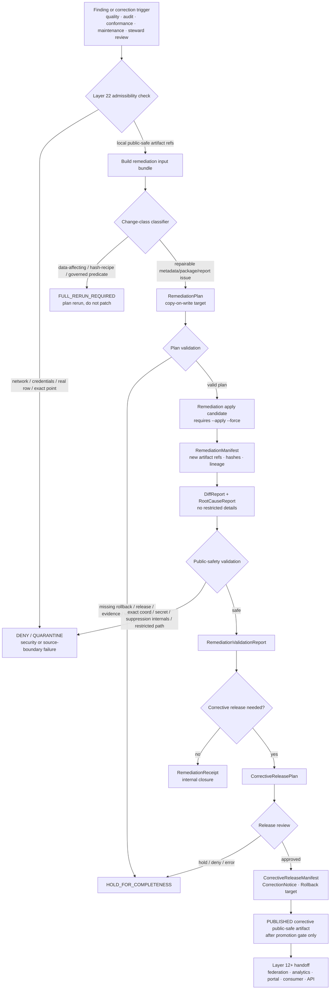

<!-- [KFM_META_BLOCK_V2]
doc_id: kfm://doc/TODO-register-ebird-remediation-uuid
title: eBird Remediation
type: standard
version: v1
status: draft
owners: TODO(fauna-source-stewards)
created: TODO(verify-original-created-date-or-set-on-first-commit)
updated: 2026-05-07
policy_label: TODO(verify-public-or-restricted)
related: ["../../README.md", "../../INGEST_EBIRD.md", "../../SOURCE_ROLES.md", "../../GEOPRIVACY.md", "../../VALIDATION.md", "EBIRD_ARCHITECTURE.md", "EBIRD_CONTRACTS.md", "EBIRD_CONFORMANCE.md", "EBIRD_MAINTENANCE.md", "EBIRD_QUALITY_AND_TRIAGE.md", "EBIRD_AUDIT_RESPONSE.md", "../../../../runbooks/fauna/EBIRD_OPERATIONS.md", "../../../../../policy/fauna/ebird.rego"]
tags: [kfm, fauna, ebird, remediation, corrective-release, copy-on-write, public-aggregate, geoprivacy, layer-22]
notes: [Revises the existing short Layer 22 eBird remediation note; doc_id, owners, created date, policy_label, CLI implementation paths, schema home, tests, validators, and CI enforcement remain TODO or NEEDS VERIFICATION until registry/steward/repo verification; GitHub connector inspection confirmed this target file and adjacent eBird docs on main, while the local workspace was not a mounted Git checkout.]
[/KFM_META_BLOCK_V2] -->

<a id="top"></a>

# eBird Remediation

Copy-on-write corrective remediation governance for public-safe KFM eBird aggregate artifacts.

<p>
  
  
  
  
  
  
  
  
</p>

> [!IMPORTANT]
> **Impact block**
>
> | Field | Value |
> |---|---|
> | Status | `draft` |
> | Target path | `docs/domains/fauna/sources/ebird/EBIRD_REMEDIATION.md` |
> | Primary role | Layer 22 remediation and corrective-release guide for public-safe eBird aggregate artifacts |
> | Source role | eBird remains occurrence support, not legal-status authority |
> | Remediation posture | Copy-on-write by default; no silent overwrite of released artifacts |
> | Apply posture | Apply mode requires `--apply --force` or repo-approved equivalent |
> | Public geometry posture | Public outputs keep `exact_points=restricted`; no public exact coordinates |
> | Public aggregate posture | `public_safe=true`, `policy_label=public_aggregate`, and `suppression_min_n >= 10` remain mandatory |
> | Command posture | `kfm-ebird-remediate` and `kfm-ebird-corrective-release` are documented command contracts; executable paths, package wiring, and CI enforcement are **NEEDS VERIFICATION** |
> | Quick jumps | [Scope](#scope) · [Repo fit](#repo-fit) · [Inputs](#inputs) · [Exclusions](#exclusions) · [Remediation principles](#remediation-principles) · [Flow](#remediation-flow) · [Change classes](#change-class-matrix) · [Artifacts](#artifact-contracts) · [IDs](#deterministic-ids) · [Commands](#command-contracts) · [Validation](#validation-gates) · [Reason codes](#reason-codes) · [Review](#review-checklist) · [Open verification](#open-verification) |

---

## Scope

Layer 22 exists to remediate already-built **public-safe eBird aggregate artifacts** without weakening KFM’s evidence, policy, release, correction, rollback, and geoprivacy rules.

The existing Layer 22 note established the core contract:

- Layer 22 adds **copy-on-write corrective remediation governance** for public-safe eBird aggregates.
- The documented CLIs are `kfm-ebird-remediate` and `kfm-ebird-corrective-release`.
- No network calls, credentials, or real eBird data are allowed in the remediation lane.
- Apply mode requires `--apply --force`.
- Remediation defaults to copy-on-write.
- Public outputs must keep `public_safe=true`, `exact_points=restricted`, and `suppression_min_n >= 10`.
- Data-affecting, hash-recipe, and governed-predicate changes require full rerun planning.
- Public artifacts must never include exact coordinates, restricted paths, suppression receipt details, suppressed-group hashes, raw row numbers, or secrets.

This revision preserves those rules and expands them into a maintainer-facing remediation playbook.

### Layer 22 governs

| Surface | Remediation responsibility |
|---|---|
| Public aggregate artifacts | Repair public-safe metadata, warnings, references, manifests, or derived packaging without exposing restricted data. |
| Corrective release candidates | Prepare a new release candidate when a published aggregate requires a correction, supersession, withdrawal, or public notice. |
| Remediation plans | Explain what will change, why it is safe, what remains unchanged, and what rollback target exists. |
| Remediation manifests | Bind input artifact refs, output artifact refs, hashes, validation results, policy posture, and correction lineage. |
| Diff reports | Show before/after changes without leaking exact coordinates, raw rows, suppression internals, quarantine paths, or secrets. |
| Root-cause reports | Explain the cause class without overclaiming biological meaning or exposing restricted source material. |
| Validation reports | Prove public-safety invariants still hold after remediation. |
| Corrective release approval receipts | Record steward/release-manager review for public-facing corrective release. |

### Layer 22 does not govern

| Not governed here | Owning surface |
|---|---|
| Source admission and live eBird activation | Source registry and activation decision |
| Raw eBird ingestion/productization | [`../../INGEST_EBIRD.md`](../../INGEST_EBIRD.md) |
| Source-family architecture | [`EBIRD_ARCHITECTURE.md`](EBIRD_ARCHITECTURE.md) |
| Contract semantics and public aggregate contract | [`EBIRD_CONTRACTS.md`](EBIRD_CONTRACTS.md) |
| Routine compatibility and migration | [`EBIRD_MAINTENANCE.md`](EBIRD_MAINTENANCE.md) |
| Operational QA and triage | [`EBIRD_QUALITY_AND_TRIAGE.md`](EBIRD_QUALITY_AND_TRIAGE.md) |
| Offline audit intake/response | [`EBIRD_AUDIT_RESPONSE.md`](EBIRD_AUDIT_RESPONSE.md) |
| Executable policy | [`../../../../../policy/fauna/ebird.rego`](../../../../../policy/fauna/ebird.rego) |
| Release authority | `release/` responsibility root or repo-equivalent release lane |
| Raw, work, quarantine, receipts, proofs, and published artifacts | `data/` responsibility roots |
| UI/Focus answers | Governed API, Evidence Drawer, Focus Mode, and runtime response envelopes |

> [!WARNING]
> Remediation is not a shortcut around full reruns. If a change affects source data, governed predicates, hash recipes, suppression logic, aggregate units, public field allowlists, or policy meaning, Layer 22 must produce a rerun plan rather than silently patching the public artifact.

[Back to top](#top)

---

## Repo fit

This document is a human-facing source-family remediation guide under the fauna documentation lane.

| Relationship | Status | Path / surface | Role |
|---|---:|---|---|
| This file | CONFIRMED target | `docs/domains/fauna/sources/ebird/EBIRD_REMEDIATION.md` | Layer 22 remediation guidance |
| Fauna overview | CONFIRMED | [`../../README.md`](../../README.md) | Domain context, lifecycle, source-role, geoprivacy, and public-safety posture |
| eBird ingest hub | CONFIRMED | [`../../INGEST_EBIRD.md`](../../INGEST_EBIRD.md) | Ingest/productization and governed filter posture |
| Source-role doctrine | CONFIRMED | [`../../SOURCE_ROLES.md`](../../SOURCE_ROLES.md) | Role/claim compatibility |
| Geoprivacy guidance | CONFIRMED / NEEDS VERIFICATION for current enforcement | [`../../GEOPRIVACY.md`](../../GEOPRIVACY.md) | Exact-location, generalization, and public geometry rules |
| Validation guidance | NEEDS VERIFICATION | [`../../VALIDATION.md`](../../VALIDATION.md) | Human-readable validator and gate expectations |
| eBird architecture | CONFIRMED | [`EBIRD_ARCHITECTURE.md`](EBIRD_ARCHITECTURE.md) | Source-family architecture and trust boundary |
| eBird contracts | CONFIRMED | [`EBIRD_CONTRACTS.md`](EBIRD_CONTRACTS.md) | Contract, hash, policy, and public aggregate rules |
| eBird conformance | CONFIRMED | [`EBIRD_CONFORMANCE.md`](EBIRD_CONFORMANCE.md) | Local-only acceptance and conformance checks |
| eBird maintenance | CONFIRMED | [`EBIRD_MAINTENANCE.md`](EBIRD_MAINTENANCE.md) | Compatibility, migration, inventory, and public-safety scans |
| eBird quality/triage | CONFIRMED | [`EBIRD_QUALITY_AND_TRIAGE.md`](EBIRD_QUALITY_AND_TRIAGE.md) | Operational QA and triage |
| eBird audit response | CONFIRMED | [`EBIRD_AUDIT_RESPONSE.md`](EBIRD_AUDIT_RESPONSE.md) | Offline audit intake/response and public-safe status updates |
| Operations runbook | CONFIRMED | [`../../../../runbooks/fauna/EBIRD_OPERATIONS.md`](../../../../runbooks/fauna/EBIRD_OPERATIONS.md) | Scan, trend, attest, evidence-pack, and incident workflows |
| Policy gate | CONFIRMED | [`../../../../../policy/fauna/ebird.rego`](../../../../../policy/fauna/ebird.rego) | Public aggregate deny rules |
| Remediation CLI | DOCUMENTED / NEEDS VERIFICATION | `kfm-ebird-remediate` | Plan/apply copy-on-write remediation |
| Corrective release CLI | DOCUMENTED / NEEDS VERIFICATION | `kfm-ebird-corrective-release` | Plan/approve corrective release artifacts |
| Remediation validator | PROPOSED / NEEDS VERIFICATION | `../../../../../tools/validators/fauna/validate_ebird_remediation.*` | Executable remediation report validation if/when added |
| Layer 22 tests | PROPOSED / NEEDS VERIFICATION | `../../../../../tests/connectors/fauna/test_kfm_ebird_layer22.*` or repo-native equivalent | Regression proof for remediation behavior |

### Directory Rules basis

`docs/domains/fauna/sources/ebird/` is the correct responsibility-root placement because this file is **human-facing domain/source documentation** under `docs/`. eBird must not become a root-level `ebird/` or `fauna/` folder. Machine schemas, executable policy, validators, tests, lifecycle data, receipts, proofs, published artifacts, release manifests, correction notices, and rollback cards belong under their own responsibility roots.

[Back to top](#top)

---

## Inputs

Layer 22 accepts only local, reviewable, public-safe, or release-candidate remediation inputs.

| Input | Accepted? | Required posture |
|---|---:|---|
| Synthetic remediation fixture | ✅ | Explicitly synthetic; no real eBird rows, exact coordinates, credentials, or restricted details. |
| Public aggregate artifact | ✅ | Already public-safe or release-candidate public-safe; `exact_points=restricted`; aggregate-only. |
| Public aggregate manifest | ✅ | Must carry release, hash, validation, policy, and artifact refs where available. |
| Validation report | ✅ | Used to identify failure, hold, or correction needs; failed validation cannot be ignored. |
| Quality/triage record | ✅ | May trigger remediation planning, but does not publish by itself. |
| Audit finding packet | ✅ | Must be local/offline and public-safe; no real observations, no exact points, no credentials. |
| Maintenance diff report | ✅ | Can identify contract drift or compatibility issue requiring remediation. |
| Conformance packet | ✅ | Local-only acceptance evidence; no source fetch, credentials, exact points, or restricted rows. |
| Release manifest reference | ✅ | Required before corrective public release. |
| Rollback reference | ✅ | Required before apply or corrective release approval. |
| Corrective release approval metadata | ✅ | Steward/release-manager decision input. |
| Real raw eBird row | ❌ | Must remain in governed lifecycle storage; never in remediation docs, fixtures, or public reports. |
| Raw EBD/API capture | ❌ | Source-native material belongs upstream under governed lifecycle controls. |
| Credentials, tokens, cookies, private URLs | ❌ | Must never enter remediation artifacts or reports. |
| Exact coordinates or raw point geometry | ❌ | Public eBird lane remains aggregate/generalized. |

### Minimum remediation input bundle

```json
{
  "object_type": "KfmEbirdRemediationInputBundle",
  "schema_version": "kfm.ebird.remediation.input_bundle.v1",
  "source_family": "ebird",
  "layer": 22,
  "finding_ref": "kfm://finding/fauna/ebird/NEEDS_VERIFICATION",
  "artifact_ref": "kfm://artifact/fauna/ebird/public-aggregate/NEEDS_VERIFICATION",
  "release_manifest_ref": "kfm://release/NEEDS_VERIFICATION",
  "validation_report_ref": "kfm://validation/NEEDS_VERIFICATION",
  "rollback_ref": "kfm://rollback/NEEDS_VERIFICATION",
  "public_output_mode": "aggregate_only",
  "public_safe": true,
  "exact_points": "restricted",
  "suppression_min_n": 10,
  "network_allowed": false,
  "credentials_allowed": false,
  "real_ebird_data_allowed": false
}
```

[Back to top](#top)

---

## Exclusions

Layer 22 must not become a hidden data repair lane, a source connector, or a silent release override.

| Excluded material | Required handling | Why |
|---|---|---|
| eBird API keys, EBD credentials, cookies, auth headers, tokens, private URLs | **DENY / QUARANTINE** | Secrets do not belong in remediation inputs, outputs, reports, public bundles, or Focus context. |
| Network calls or live eBird fetches | **DENY** for Layer 22 | Remediation is local artifact governance, not source activation. |
| Raw EBD exports or API captures | Governed lifecycle roots only | RAW data is not a remediation report. |
| Exact coordinates, point geometry, `lat`, `lon`, `latitude`, `longitude`, `geometry`, `geom`, `point` | **DENY** in public remediation artifacts | Public eBird products remain aggregate/generalized. |
| Restricted observations | **DENY** from public remediation artifacts | Prevent sensitive-location and source-term leakage. |
| Suppression receipt details | Restricted proof/receipt homes only | Suppression internals can reveal low-count or sensitive patterns. |
| Suppressed group hashes | Restricted proof/receipt homes only | Hashes can become correlation handles. |
| Raw row numbers | **DENY** from public reports | Row references can leak source structure or reverse-engineering hints. |
| Restricted paths | **DENY** from public reports | Internal lifecycle and restricted storage must not leak. |
| Quarantine paths | **DENY** from public reports | Quarantine is review-only. |
| Legal-status claims from eBird | **DENY** unless separate authority evidence supports the claim | eBird is occurrence support in this lane. |
| Occupancy, abundance, true absence, census, causal, or population-trend claims | **ABSTAIN / DENY / HOLD** unless separately governed evidence supports them | Remediation reports cannot inflate aggregate support into ecological inference. |
| Silent in-place mutation | **DENY** | Remediation is copy-on-write by default and must preserve rollback. |
| Corrective release without release review | **DENY** | Corrective release is a governed state transition, not a file copy. |

[Back to top](#top)

---

## Remediation principles

| Principle | Required behavior | Failure outcome |
|---|---|---|
| Local-only | No network calls, source fetches, or live eBird access. | `DENY_REMEDIATION` or `ERROR_TOOLING_OR_SCHEMA` |
| No credentials | Credentials and secret-like values are rejected or quarantined. | `DENY_REMEDIATION` |
| No real eBird data | Remediation docs, fixtures, and reports cannot contain real raw rows or exact observation detail. | `QUARANTINE_REVIEW` |
| Copy-on-write | New candidate artifacts are written; released artifacts are not mutated in place. | `DENY_REMEDIATION` |
| Plan before apply | A remediation plan must exist before apply. | `HOLD_FOR_PLAN` |
| Explicit apply confirmation | Apply requires `--apply --force` or repo-approved equivalent. | `DENY_APPLY` |
| Public-safe continuity | `public_safe=true`, `policy_label=public_aggregate`, `exact_points=restricted`, and `suppression_min_n >= 10` remain intact. | `DENY_PUBLIC_OUTPUT` |
| Hash continuity | Remediation IDs and corrective release IDs are deterministic and timestamp-free. | `ERROR_ID_MISMATCH` |
| No blocked-class patching | Data-affecting, hash-recipe, or governed-predicate changes route to full rerun planning. | `FULL_RERUN_REQUIRED` |
| Release-aware correction | Corrective release requires validation, policy, review, release refs, correction path, and rollback target. | `HOLD_FOR_RELEASE_REVIEW` |
| Citation/evidence integrity | Claim-bearing outputs keep evidence/proof/release references visible. | `ABSTAIN_EVIDENCE_INSUFFICIENT` or `HOLD_FOR_COMPLETENESS` |
| Lineage preservation | Superseded artifacts are not deleted silently. | `ERROR_LINEAGE_LOSS` |

> [!CAUTION]
> A remediation `PASS` is not a publication decision. It means the remediation candidate is eligible for the next governed review/release step.

[Back to top](#top)

---

## Remediation flow



### Flow rules

1. A correction trigger does not imply a patch is allowed.
2. Layer 22 first classifies whether the issue is repairable or requires a full rerun.
3. Remediation candidates are copy-on-write.
4. Apply requires explicit confirmation.
5. Remediation outputs remain candidates until policy, validation, review, release, correction, and rollback obligations are satisfied.
6. Corrective release must never leak restricted data, exact coordinates, suppression internals, raw row numbers, restricted paths, or secrets.
7. Public user-facing notices must describe governance status and corrective action, not ecological inference.

[Back to top](#top)

---

## Disposition model

Layer 22 produces finite remediation dispositions. Use the narrowest truthful result.

| Disposition | Meaning | Next step |
|---|---|---|
| `PASS_TO_RELEASE_REVIEW` | Remediation candidate appears public-safe and complete enough for the next governed release review. | Forward to release manager/steward review. |
| `NO_PUBLIC_CHANGE_REQUIRED` | Issue was internal, non-public, or already corrected without public artifact change. | Emit remediation receipt and close. |
| `HOLD_FOR_PLAN` | Remediation trigger is valid, but no complete plan exists. | Create or repair `RemediationPlan`. |
| `HOLD_FOR_COMPLETENESS` | Candidate is not unsafe, but missing metadata, evidence, release, validation, correction, or rollback support. | Complete dossier and rerun validation. |
| `HOLD_FOR_CLAIM_REWRITE` | Public wording overstates what eBird public aggregates can claim. | Rewrite claims and rerun remediation validation. |
| `FULL_RERUN_REQUIRED` | Change affects data, hash recipe, governed predicate, suppression, aggregate unit, or source-role meaning. | Route to full rerun planning. |
| `DENY_REMEDIATION` | Candidate violates public-safety, policy, source-role, sensitivity, secret, exact-location, or lineage rules. | Block public path; quarantine or open incident. |
| `DENY_APPLY` | Apply was attempted without explicit `--apply --force` or equivalent confirmation. | Stop; create reviewable apply request. |
| `QUARANTINE_REVIEW` | Rights, sensitivity, source role, exact-location, provenance, or restricted data posture is unresolved. | Route to steward/source/policy review. |
| `ABSTAIN_EVIDENCE_INSUFFICIENT` | Requested corrective public claim lacks released evidence support. | Record abstention; do not invent support. |
| `ERROR_TOOLING_OR_SCHEMA` | Remediation tool or input could not be parsed, validated, or verified. | Fix tooling/input; no public use. |

[Back to top](#top)

---

## Change-class matrix

Remediation is allowed only for changes that do not alter the evidentiary basis, source meaning, public-safety predicate, or hash recipe of the released aggregate.

### Repairable by Layer 22

| Change class | Examples | Required handling |
|---|---|---|
| Metadata completion | Missing release ref, validation ref, correction ref, or rollback ref in a non-public candidate package. | Copy-on-write manifest update, validation rerun. |
| Warning propagation | Public descriptive-use warning missing from portal, download, consumer handoff, or chart caption. | Add warning, rerun public-safety scan. |
| Link/reference repair | Broken public-safe doc link, stale manifest pointer, missing consumer handoff ref. | Copy-on-write package update, link validation. |
| Report wording correction | Unsafe wording such as “absence” or “trend” in report prose without data changes. | Rewrite claim, preserve prior text in correction lineage. |
| Public package layout repair | Missing local asset, incomplete manifest, invalid checksum index, duplicated file entry. | Rebuild package from already-public inputs. |
| Validation dossier completion | Validation report missing from candidate but artifact content unchanged. | Attach validation report and rerun Layer 22 checks. |
| Public notice update | Correction notice or status index needs governance-language update. | Produce corrective release plan and review. |
| Consumer handoff repair | Missing policy label, warning, validation ref, or release ref in consumer handoff. | Copy-on-write handoff update and compatibility scan. |

### Blocked without full rerun planning

| Blocked class | Why it is blocked | Required handling |
|---|---|---|
| Data-affecting changes | They alter aggregate evidence, counts, rows, or source support. | Full rerun plan. |
| Hash recipe changes | They alter artifact identity and reproducibility. | Schema/contract review and full rerun plan. |
| Governed predicate changes | They alter accepted checklist support or public-safety meaning. | Policy/contract review and full rerun plan. |
| Suppression threshold changes | They affect public privacy/sensitivity posture. | Policy review and full rerun plan. |
| Aggregate unit changes | County/HUC12 semantics change output meaning. | Contract/policy review and full rerun plan. |
| Public field allowlist expansion | Could leak exact coordinates, geometry, or restricted fields. | Policy/public-safety review and full rerun plan. |
| `exact_points` weakening | Public exact points are denied. | Deny or steward-restricted redesign. |
| Source-role changes | eBird cannot silently become legal-status authority or stronger source role. | Source-role review and full rerun plan. |
| Rights/citation changes | Source terms and downstream permissions may change. | Source steward review before activation/release. |
| Taxonomy merge/split changes | Alters taxon meaning and aggregate interpretation. | Taxonomy review and full rerun plan. |
| Credential/raw-row/exact-point leak | Public-safety breach. | Incident/quarantine; corrective release only after safe remediation plan. |
| Failed validation in promoted/public run | Public release cannot rely on failed validation. | Deny release; rerun/fix upstream. |

[Back to top](#top)

---

## Artifact contracts

Layer 22 writes two related artifact families: remediation artifacts and corrective-release artifacts.

### Remediation artifacts

| Artifact | Producer | Visibility | Required content | Must not contain |
|---|---|---|---|---|
| `RemediationPlan` | `kfm-ebird-remediate --mode plan` | Internal/review | Trigger, input refs, change class, allowed/blocked decision, copy-on-write target, expected outputs, rollback refs. | Raw eBird rows, exact coordinates, credentials, suppression internals. |
| `RemediationManifest` | `kfm-ebird-remediate --mode apply` | Internal/review; selected public-safe refs allowed | Input refs, output refs, old/new hashes, transformation summary, validation refs, correction lineage. | Restricted paths in public mode, raw row numbers, suppressed group hashes. |
| `RemediationDiffReport` | `kfm-ebird-remediate --mode diff` or apply | Internal/review; public-safe summary optional | Before/after field/package/report differences, public-safety classification, hash impact. | Exact coordinates, restricted rows, credentials, suppression details. |
| `RootCauseReport` | `kfm-ebird-remediate` | Internal/review; public-safe summary optional | Cause class, evidence refs, impacted artifacts, prevention action. | Ecological inference or restricted source values. |
| `RemediationValidationReport` | Validator/remediation CLI | Internal/review | Public-safety, policy, hash, field allowlist, warning, release, rollback checks. | Source-native rows or secret values. |
| `RemediationReceipt` | Remediation CLI | Internal/proof | Execution record, actor/tool, plan ref, manifest ref, validation refs, disposition. | Secrets, exact coordinates, restricted paths in public mode. |

### Corrective release artifacts

| Artifact | Producer | Visibility | Required content | Must not contain |
|---|---|---|---|---|
| `CorrectiveReleasePlan` | `kfm-ebird-corrective-release --mode plan` | Internal/review | Remediation refs, release refs, correction notice candidate, public impact, rollback target. | Raw eBird rows or exact locations. |
| `CorrectiveReleaseManifest` | Corrective release CLI | Release/review; public-safe summary optional | Corrected artifact refs, checksums, validation refs, release decision refs, correction lineage. | Restricted data or suppression internals. |
| `CorrectiveReleaseValidationReport` | Validator/corrective release CLI | Internal/review | Public-safety and release-readiness checks. | Sensitive details. |
| `CorrectiveReleaseApprovalReceipt` | Release manager/steward workflow | Internal/proof | Approval decision, reviewer role, obligations, release target, rollback target. | Credentials or restricted source material. |
| `CorrectionNotice` candidate | Corrective release workflow | Public-safe if promoted | Human-facing summary of what changed and why, bounded to governance status. | Exact coordinates, raw rows, ecological inference, private paths. |
| `RollbackCard` update | Release workflow | Internal/proof; selected public-safe refs allowed | Restore target, affected artifacts, cache/alias actions, validation requirements. | Secrets or restricted geometry. |

### Illustrative remediation plan

```json
{
  "object_type": "KfmEbirdRemediationPlan",
  "schema_version": "kfm.ebird.remediation_plan.v1",
  "layer": 22,
  "remediation_id": "ebird_remediation_TODO16HEX",
  "trigger_ref": "kfm://finding/fauna/ebird/NEEDS_VERIFICATION",
  "artifact_ref": "kfm://artifact/fauna/ebird/public-aggregate/NEEDS_VERIFICATION",
  "release_manifest_ref": "kfm://release/NEEDS_VERIFICATION",
  "change_class": "warning_propagation",
  "blocked_class": false,
  "copy_on_write": true,
  "apply_requires_force": true,
  "public_safe_required": true,
  "exact_points_required": "restricted",
  "suppression_min_n_required": 10,
  "expected_outputs": [
    "remediation_manifest",
    "remediation_diff_report",
    "root_cause_report",
    "remediation_validation_report",
    "optional_remediation_receipt"
  ],
  "rollback_ref": "kfm://rollback/NEEDS_VERIFICATION",
  "notes": [
    "Illustrative shape only; confirm schema home and emitted fields before treating as implementation."
  ]
}
```

### Illustrative corrective release plan

```json
{
  "object_type": "KfmEbirdCorrectiveReleasePlan",
  "schema_version": "kfm.ebird.corrective_release_plan.v1",
  "layer": 22,
  "corrective_release_id": "ebird_corrective_release_TODO16HEX",
  "remediation_manifest_ref": "kfm://fauna/ebird/remediation/manifest/NEEDS_VERIFICATION",
  "release_manifest_ref": "kfm://release/NEEDS_VERIFICATION",
  "correction_notice_ref": "kfm://correction/fauna/ebird/NEEDS_VERIFICATION",
  "public_output_mode": "aggregate_only",
  "public_safe": true,
  "exact_points": "restricted",
  "suppression_min_n": 10,
  "release_decision_required": true,
  "rollback_ref": "kfm://rollback/NEEDS_VERIFICATION",
  "disposition": "HOLD_FOR_RELEASE_REVIEW",
  "notes": [
    "Corrective release cannot publish until validation, policy, review, release, correction, and rollback checks pass."
  ]
}
```

[Back to top](#top)

---

## Deterministic IDs

The existing Layer 22 rule uses deterministic SHA-256 prefixes:

- `remediation_id`: SHA-256 over canonical remediation inputs, excluding timestamps, first 16 hex.
- `corrective_release_id`: SHA-256 over canonical corrective release inputs, excluding timestamps, first 16 hex.

### Remediation ID recipe

```text
remediation_id =
  "ebird_remediation_" +
  sha256(canonical_json({
    "kind": "kfm.ebird.remediation.v1",
    "trigger_ref": "...",
    "artifact_ref": "...",
    "release_manifest_ref": "...",
    "change_class": "...",
    "blocked_class": false,
    "copy_on_write": true,
    "expected_public_safety": {
      "public_safe": true,
      "exact_points": "restricted",
      "suppression_min_n": 10
    },
    "planned_outputs": [...]
  }))[0:16]
```

### Corrective release ID recipe

```text
corrective_release_id =
  "ebird_corrective_release_" +
  sha256(canonical_json({
    "kind": "kfm.ebird.corrective_release.v1",
    "remediation_manifest_ref": "...",
    "release_manifest_ref": "...",
    "corrected_artifact_refs": [...],
    "correction_notice_ref": "...",
    "rollback_ref": "...",
    "public_output_mode": "aggregate_only",
    "public_safety": {
      "public_safe": true,
      "exact_points": "restricted",
      "suppression_min_n": 10
    }
  }))[0:16]
```

### ID rules

| Rule | Required behavior |
|---|---|
| Canonical JSON | Stable key ordering, stable primitive representation, UTF-8 encoding. |
| Timestamp exclusion | Exclude `generated_at`, `created_at`, `updated_at`, wall-clock labels, and transient run paths unless the repo-wide ID policy explicitly requires them. |
| Self-reference exclusion | Exclude `remediation_id`, `corrective_release_id`, and computed hash fields from their own hash input. |
| Local temp exclusion | Exclude `/tmp` paths, local machine paths, and transient output directories from ID material. |
| Semantic sensitivity | Trigger refs, artifact refs, release refs, change class, public-safety requirements, output refs, and rollback refs are hash-sensitive where they affect meaning. |
| Prefix length | First 16 hex is the current Layer 22 rule; changing it requires contract/schema review and migration notes. |
| Rerun trigger | Data-affecting, hash-recipe, or governed-predicate changes must not be hidden behind the same remediation ID. |

[Back to top](#top)

---

## Command contracts

The commands below are documented command contracts. Exact executable paths, package entry points, flags, test hooks, and CI wiring are **NEEDS VERIFICATION** until confirmed in the active checkout.

### Remediation plan

```bash
kfm-ebird-remediate \
  --mode plan \
  --finding-packet ./fixtures/fauna/ebird/remediation/finding.safe.json \
  --artifact-root ./data/published/fauna/ebird/NEEDS_VERIFICATION \
  --release-manifest ./release/manifests/fauna/ebird/NEEDS_VERIFICATION.json \
  --rollback-ref kfm://rollback/NEEDS_VERIFICATION \
  --out-dir /tmp/kfm-ebird-remediation/plan \
  --offline \
  --no-network
```

Expected behavior:

| Check | Required result |
|---|---|
| Network | No network access. |
| Credentials | No credential loading or secret lookup. |
| Raw data | No real eBird rows. |
| Classification | Repairable vs blocked class recorded. |
| Output | `RemediationPlan` with deterministic `remediation_id`. |
| Failure mode | Finite disposition with stable reason codes. |

### Remediation apply

```bash
kfm-ebird-remediate \
  --mode apply \
  --plan /tmp/kfm-ebird-remediation/plan/remediation_plan.json \
  --out-dir /tmp/kfm-ebird-remediation/apply \
  --apply \
  --force \
  --offline \
  --no-network
```

Expected behavior:

| Check | Required result |
|---|---|
| Apply confirmation | Fails without `--apply --force` or repo-approved equivalent. |
| Copy-on-write | Writes new candidate artifacts; does not mutate released originals. |
| Public safety | Rechecks exact-points, suppression, field allowlist, secrets, and restricted paths. |
| Output | Manifest, diff report, root-cause report, validation report, optional receipt. |
| Blocked class | Fails or routes to full rerun planning. |

### Corrective release plan

```bash
kfm-ebird-corrective-release \
  --mode plan \
  --remediation-manifest /tmp/kfm-ebird-remediation/apply/remediation_manifest.json \
  --release-manifest ./release/manifests/fauna/ebird/NEEDS_VERIFICATION.json \
  --rollback-ref kfm://rollback/NEEDS_VERIFICATION \
  --out-dir /tmp/kfm-ebird-corrective-release/plan \
  --offline \
  --no-network
```

### Corrective release approval

```bash
kfm-ebird-corrective-release \
  --mode approve \
  --plan /tmp/kfm-ebird-corrective-release/plan/corrective_release_plan.json \
  --approval ./fixtures/fauna/ebird/remediation/release_approval.safe.json \
  --out-dir /tmp/kfm-ebird-corrective-release/approved \
  --offline \
  --no-network
```

### Test hook

```bash
python -m pytest tests/connectors/fauna/test_kfm_ebird_layer22.py
```

> [!NOTE]
> The pytest hook is a proposed repo-native target. If the active repo uses a different test language, path, or package manager, update this document and related tests together.

[Back to top](#top)

---

## Validation gates

### Gate 1 — Local-only and safety boundary

| Check | Required result | Failure disposition |
|---|---|---|
| Network access | `false` | `DENY_REMEDIATION` |
| Credential access | `false` | `DENY_REMEDIATION` |
| Real eBird data present | `false` | `QUARANTINE_REVIEW` |
| Exact coordinates present | `false` in public/candidate outputs | `DENY_PUBLIC_OUTPUT` |
| Restricted paths present in public reports | `false` | `DENY_PUBLIC_OUTPUT` |
| Suppression receipt details present in public reports | `false` | `DENY_PUBLIC_OUTPUT` |
| Suppressed group hashes present in public reports | `false` | `DENY_PUBLIC_OUTPUT` |
| Raw row numbers present in public reports | `false` | `DENY_PUBLIC_OUTPUT` |
| Secret-like strings present | `false` | `DENY_REMEDIATION` |

### Gate 2 — Public aggregate continuity

| Check | Required result | Failure disposition |
|---|---|---|
| `public_safe` | `true` | `DENY_PUBLIC_OUTPUT` |
| `policy_label` | `public_aggregate` | `DENY_PUBLIC_OUTPUT` |
| `exact_points` | `restricted` | `DENY_PUBLIC_OUTPUT` |
| `suppression_min_n` | `>= 10` | `DENY_PUBLIC_OUTPUT` |
| Aggregate unit | `county`, `huc12`, or explicitly approved public-safe unit | `DENY_PUBLIC_OUTPUT` |
| `kfm:spec_hash` | `sha256:<64 lowercase hex>` or repo-approved equivalent | `DENY_PUBLIC_OUTPUT` |
| Public fields | No coordinate, geometry, secret, restricted, suppression-internal, or raw-row fields | `DENY_PUBLIC_OUTPUT` |
| Validation report | Not failed for public/corrective release candidate | `DENY_PUBLIC_OUTPUT` |

### Gate 3 — Change-class and rerun decision

| Check | Required result | Failure disposition |
|---|---|---|
| Change class identified | `true` | `HOLD_FOR_PLAN` |
| Blocked class | Routed to full rerun plan | `FULL_RERUN_REQUIRED` |
| Repairable class | Copy-on-write remediation plan exists | `HOLD_FOR_PLAN` |
| Hash impact declared | `true` | `HOLD_FOR_COMPLETENESS` |
| Public artifact impact declared | `true` | `HOLD_FOR_COMPLETENESS` |
| Consumer impact declared | `true` when downstream outputs exist | `HOLD_FOR_COMPLETENESS` |
| Rerun plan exists for blocked changes | `true` | `FULL_RERUN_REQUIRED` |

### Gate 4 — Release, correction, and rollback

| Check | Required result | Failure disposition |
|---|---|---|
| Release manifest ref | Present before corrective public release | `HOLD_FOR_RELEASE_REVIEW` |
| Correction notice candidate | Present when public output changes | `HOLD_FOR_COMPLETENESS` |
| Rollback target | Present before apply/corrective release | `HOLD_FOR_COMPLETENESS` |
| Promotion/release decision | Present before publication | `HOLD_FOR_RELEASE_REVIEW` |
| Evidence/proof refs | Present for claim-bearing outputs | `ABSTAIN_EVIDENCE_INSUFFICIENT` |
| Prior artifact lineage | Preserved | `ERROR_LINEAGE_LOSS` |
| Corrective release approval | Present before public status/alias switch | `HOLD_FOR_RELEASE_REVIEW` |

### Gate 5 — Claim-boundary wording

| Unsafe wording pattern | Required disposition |
|---|---|
| “This species is absent from…” based only on public aggregate change | `ABSTAIN_EVIDENCE_INSUFFICIENT` |
| “Population increased/decreased” from aggregate remediation | `HOLD_FOR_CLAIM_REWRITE` |
| “Abundance changed” from checklist support alone | `HOLD_FOR_CLAIM_REWRITE` |
| “Occupancy is confirmed” without occupancy model/evidence | `HOLD_FOR_CLAIM_REWRITE` |
| “Legal status changed” sourced only from eBird aggregate remediation | `DENY_PUBLIC_OUTPUT` |
| “Complete census corrected” language | `HOLD_FOR_CLAIM_REWRITE` |
| Any exact-location wording | `DENY_PUBLIC_OUTPUT` |

[Back to top](#top)

---

## Reason codes

Use stable reason codes so remediation reports can be compared across runs.

| Reason code | Severity | Meaning |
|---|---:|---|
| `layer22.network.detected` | `P0_BLOCKER` | Remediation required or attempted network access. |
| `layer22.credentials.detected` | `P0_BLOCKER` | Credential-like material was found. |
| `layer22.real_ebird_data.detected` | `P0_BLOCKER` | Real/raw eBird row or observation detail appears in remediation input/output. |
| `layer22.exact_coordinates.public` | `P0_BLOCKER` | Public-facing remediation artifact contains exact coordinates or point geometry. |
| `layer22.restricted_path.public` | `P0_BLOCKER` | Public-facing remediation report exposes restricted/internal lifecycle path. |
| `layer22.suppression_receipt.public` | `P0_BLOCKER` | Suppression receipt details appear in public-facing output. |
| `layer22.suppressed_group_hash.public` | `P0_BLOCKER` | Suppressed group hashes appear in public-facing output. |
| `layer22.raw_row_number.public` | `P0_BLOCKER` | Raw row number appears in public-facing output. |
| `layer22.apply_without_force` | `P1_RELEASE_BLOCKER` | Apply was attempted without explicit `--apply --force` or equivalent. |
| `layer22.in_place_mutation` | `P1_RELEASE_BLOCKER` | Remediation attempted to mutate released artifacts in place. |
| `layer22.blocked_change_class` | `P1_RELEASE_BLOCKER` | Change class requires full rerun planning. |
| `layer22.rerun_plan.missing` | `P1_RELEASE_BLOCKER` | Blocked class lacks full rerun plan. |
| `layer22.spec_hash.missing_or_invalid` | `P1_RELEASE_BLOCKER` | Required `kfm:spec_hash` is missing or malformed. |
| `layer22.public_safe.false` | `P1_RELEASE_BLOCKER` | Public candidate does not keep `public_safe=true`. |
| `layer22.exact_points.not_restricted` | `P1_RELEASE_BLOCKER` | Public candidate weakens exact-point posture. |
| `layer22.suppression.threshold_too_low` | `P1_RELEASE_BLOCKER` | Suppression threshold is below 10. |
| `layer22.validation.failed` | `P1_RELEASE_BLOCKER` | Validation report failed for public/corrective candidate. |
| `layer22.release_ref.missing` | `P1_RELEASE_BLOCKER` | Corrective public release lacks release manifest ref. |
| `layer22.rollback_ref.missing` | `P1_RELEASE_BLOCKER` | Candidate lacks rollback target. |
| `layer22.correction_notice.missing` | `P2_STEWARD_REVIEW` | Public-facing correction lacks correction notice candidate. |
| `layer22.claim.absence_overreach` | `P2_STEWARD_REVIEW` | Output implies true absence from aggregate change. |
| `layer22.claim.trend_overreach` | `P2_STEWARD_REVIEW` | Output implies population trend from aggregate remediation. |
| `layer22.claim.legal_status_overreach` | `P1_RELEASE_BLOCKER` | Output uses eBird remediation as legal/status authority. |
| `layer22.consumer_handoff.incomplete` | `P3_REPAIRABLE` | Consumer handoff lacks warning, hash, validation ref, policy label, or correction state. |
| `layer22.warning.missing` | `P3_REPAIRABLE` | Required descriptive-use warning is missing. |
| `layer22.lineage.loss_risk` | `P1_RELEASE_BLOCKER` | Superseded artifact lineage would be lost. |

[Back to top](#top)

---

## Public response rules

Layer 22 public-facing outputs are correction and governance statements only. They must not become ecological analysis.

### Allowed language

- “A public aggregate artifact was corrected through a copy-on-write remediation.”
- “The corrective release updates public-safe metadata and preserves exact-point restrictions.”
- “The release remains aggregate-only and suppression-gated.”
- “The previous artifact was superseded; rollback and correction references are recorded.”
- “A full rerun is required before this change can be released.”
- “The remediation was denied because it would expose restricted data or weaken public-safety posture.”

### Disallowed language

- “The species occurs at this exact location.”
- “The population increased because of this correction.”
- “The species is absent from this HUC12.”
- “This release proves abundance.”
- “This remediation changed legal status.”
- “Suppressed groups can be reconstructed from the public report.”
- “Raw row numbers identify the corrected observations.”
- “The public user can request credentials or exact private locations.”

### Required warning

Use this warning, or a steward-approved equivalent, in public correction notices, corrective release summaries, portal/download updates, consumer handoffs, and Focus-facing summaries:

> This eBird output is descriptive public aggregate reporting only. It does not show exact observations, does not include restricted records, and must not be interpreted as occupancy, abundance, true absence, population trend, causal effect, legal status, or a complete species census.

[Back to top](#top)

---

## Review checklist

Before merging this file or changing Layer 22 behavior, verify:

- [ ] Metadata block placeholders remain intentional or are replaced with registry-confirmed values.
- [ ] eBird remains described as occurrence support, not legal-status authority.
- [ ] The current short Layer 22 rules remain preserved: no network, no credentials, no real eBird data, copy-on-write, `--apply --force`, public-safe outputs, deterministic IDs, and public artifact safety exclusions.
- [ ] Command examples are marked `NEEDS VERIFICATION` until executable entry points are confirmed.
- [ ] Remediation cannot silently patch data-affecting, hash-recipe, or governed-predicate changes.
- [ ] Full rerun planning is required for blocked change classes.
- [ ] Public outputs keep `public_safe=true`.
- [ ] Public outputs keep `policy_label=public_aggregate`.
- [ ] Public outputs keep `exact_points=restricted`.
- [ ] Public outputs keep `suppression_min_n >= 10`.
- [ ] Public output field allowlists deny coordinate and geometry fields.
- [ ] Public-facing reports deny exact coordinates, restricted paths, suppression receipt details, suppressed group hashes, raw row numbers, and secrets.
- [ ] Remediation IDs and corrective release IDs are deterministic and exclude timestamps.
- [ ] Remediation apply is copy-on-write and requires explicit force.
- [ ] Corrective release requires validation, policy, review, release manifest, correction notice, and rollback target.
- [ ] Evidence/proof/release refs remain visible for claim-bearing outputs.
- [ ] Public wording avoids occupancy, abundance, true absence, trend, causal, census, and legal-status overreach.
- [ ] Prior artifact lineage is preserved when a corrective release supersedes a public artifact.
- [ ] Consumer handoff inherits warnings, hashes, validation refs, policy labels, release refs, and correction state.
- [ ] Focus Mode examples return `ABSTAIN` or `DENY` for unsupported or policy-blocked claims.
- [ ] Any new path proposal is checked against Directory Rules and adjacent repo convention.
- [ ] Any schema, validator, policy, fixture, test, release, or workflow change updates companion docs and registries.

[Back to top](#top)

---

## Open verification

| Item | Status | Needed proof |
|---|---:|---|
| Registered `doc_id` | TODO | Document registry entry. |
| Owners | TODO | CODEOWNERS, steward register, or source-lane owner assignment. |
| Created date | TODO | Git history or steward-approved first-commit date. |
| Policy label | TODO | Repo policy classification. |
| `kfm-ebird-remediate` executable | NEEDS VERIFICATION | Actual CLI file, package entry point, script, or installed command. |
| `kfm-ebird-corrective-release` executable | NEEDS VERIFICATION | Actual CLI file, package entry point, script, or installed command. |
| CLI flags and modes | NEEDS VERIFICATION | Help output, tests, or command implementation. |
| `--apply --force` enforcement | NEEDS VERIFICATION | Test proving apply fails without explicit confirmation. |
| Remediation schema home | NEEDS VERIFICATION | Accepted schema-home ADR or repo convention. |
| `RemediationPlan` schema | PROPOSED / NEEDS VERIFICATION | Machine schema and valid/invalid fixtures. |
| `CorrectiveReleasePlan` schema | PROPOSED / NEEDS VERIFICATION | Machine schema and valid/invalid fixtures. |
| Remediation validator | PROPOSED / NEEDS VERIFICATION | `tools/validators/fauna/validate_ebird_remediation.*` or repo-native equivalent. |
| Layer 22 tests | PROPOSED / NEEDS VERIFICATION | Test file and CI evidence. |
| Policy runner | NEEDS VERIFICATION | OPA/Conftest/Rego or repo-native policy command. |
| Release object conventions | NEEDS VERIFICATION | ReleaseManifest, CorrectionNotice, RollbackCard, and proof-pack conventions in active repo. |
| Source rights/citation review | NEEDS VERIFICATION | Current eBird source terms, citation instructions, redistribution posture, and allowed public aggregate use. |
| Consumer handoff update path | NEEDS VERIFICATION | Actual consumer integration/update docs and tests. |
| Public correction notice path | NEEDS VERIFICATION | Repo-accepted correction notice location and release workflow. |
| CI enforcement | UNKNOWN | Workflow files and latest run evidence. |

[Back to top](#top)

---

## Appendix

<details>
<summary>Negative fixture ideas</summary>

| Fixture | Expected outcome |
|---|---|
| `ebird_remediation_network_attempt.json` | `DENY_REMEDIATION` |
| `ebird_remediation_credentials_detected.json` | `DENY_REMEDIATION` |
| `ebird_remediation_real_raw_row_detected.json` | `QUARANTINE_REVIEW` |
| `ebird_remediation_exact_coordinate_public.json` | `DENY_PUBLIC_OUTPUT` |
| `ebird_remediation_restricted_path_public.json` | `DENY_PUBLIC_OUTPUT` |
| `ebird_remediation_suppression_receipt_public.json` | `DENY_PUBLIC_OUTPUT` |
| `ebird_remediation_suppressed_group_hash_public.json` | `DENY_PUBLIC_OUTPUT` |
| `ebird_remediation_raw_row_number_public.json` | `DENY_PUBLIC_OUTPUT` |
| `ebird_remediation_apply_without_force.json` | `DENY_APPLY` |
| `ebird_remediation_in_place_mutation.json` | `DENY_REMEDIATION` |
| `ebird_remediation_data_affecting_patch.json` | `FULL_RERUN_REQUIRED` |
| `ebird_remediation_hash_recipe_change.json` | `FULL_RERUN_REQUIRED` |
| `ebird_remediation_governed_predicate_change.json` | `FULL_RERUN_REQUIRED` |
| `ebird_remediation_suppression_min_5.json` | `DENY_PUBLIC_OUTPUT` |
| `ebird_remediation_exact_points_public.json` | `DENY_PUBLIC_OUTPUT` |
| `ebird_remediation_missing_rollback_ref.json` | `HOLD_FOR_COMPLETENESS` |
| `ebird_remediation_missing_release_ref.json` | `HOLD_FOR_RELEASE_REVIEW` |
| `ebird_remediation_missing_correction_notice.json` | `HOLD_FOR_COMPLETENESS` |
| `ebird_corrective_release_failed_validation.json` | `DENY_PUBLIC_OUTPUT` |
| `ebird_corrective_release_trend_language.md` | `HOLD_FOR_CLAIM_REWRITE` |
| `ebird_corrective_release_absence_claim.md` | `ABSTAIN_EVIDENCE_INSUFFICIENT` |
| `ebird_corrective_release_legal_status_claim.md` | `DENY_PUBLIC_OUTPUT` |
| `ebird_corrective_release_lineage_loss.json` | `ERROR_LINEAGE_LOSS` |

</details>

<details>
<summary>Maintainer update triggers</summary>

Update this document when any of the following changes:

- Layer 22 CLI names, flags, modes, or executable paths;
- remediation or corrective-release schema names;
- deterministic ID recipe or prefix length;
- copy-on-write behavior;
- apply confirmation behavior;
- blocked change-class taxonomy;
- public aggregate policy label;
- suppression threshold;
- exact-point posture;
- public field allowlist;
- public artifact safety exclusions;
- remediation output artifact set;
- corrective release output artifact set;
- correction notice format;
- rollback requirement;
- release manifest convention;
- policy file behavior;
- validation runner behavior;
- consumer handoff contract;
- portal/download correction behavior;
- Evidence Drawer correction payload;
- Focus Mode correction/abstention behavior;
- source terms or citation posture;
- steward/release-manager review process;
- incident workflow for public-safety leakage.

</details>

<details>
<summary>Minimal corrective release dossier</summary>

A corrective release dossier should include:

1. `remediation_plan.json`
2. `remediation_manifest.json`
3. `remediation_diff_report.json`
4. `root_cause_report.json`
5. `remediation_validation_report.json`
6. `remediation_receipt.json` when emitted
7. `corrective_release_plan.json`
8. `corrective_release_manifest.json`
9. `corrective_release_validation_report.json`
10. `corrective_release_approval_receipt.json` when approved
11. `correction_notice_candidate.md`
12. `rollback_card_ref`
13. consumer-impact note
14. public-safety scan summary
15. evidence/proof/release refs

</details>
