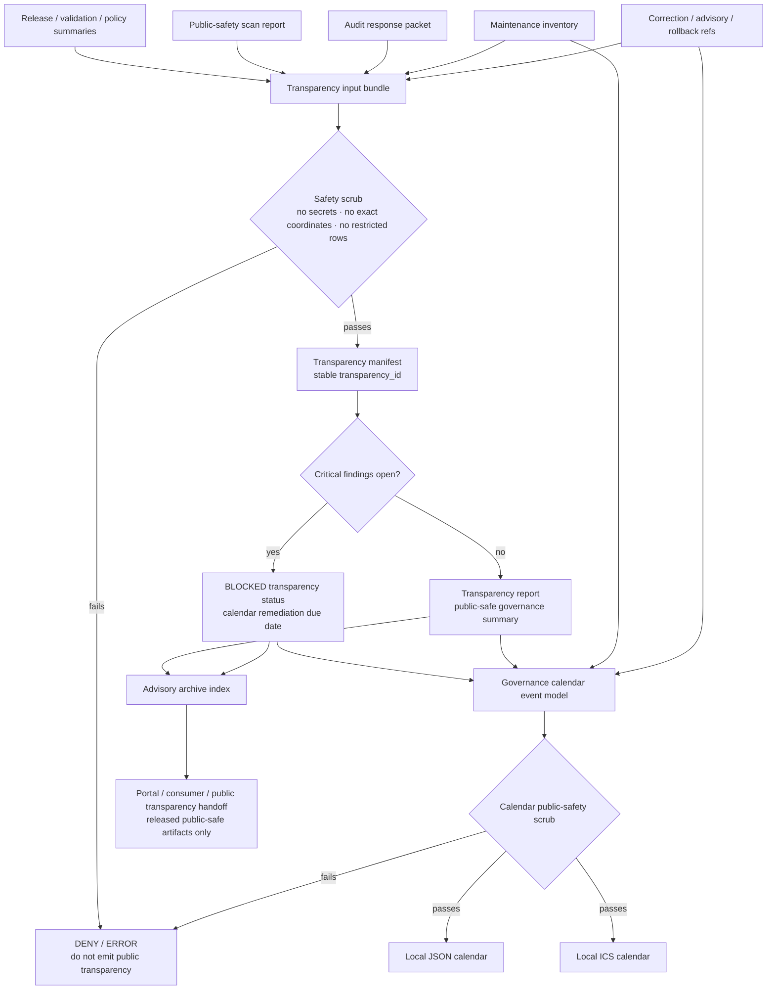

<!-- [KFM_META_BLOCK_V2]
doc_id: kfm://doc/TODO-register-ebird-transparency-governance-calendar-uuid
title: eBird Transparency and Governance Calendar
type: standard
version: v1
status: draft
owners: TODO(fauna-source-stewards)
created: TODO(verify-original-created-date-or-set-on-first-commit)
updated: 2026-05-07
policy_label: TODO(verify-public-or-restricted)
related: ["../../README.md", "../../INGEST_EBIRD.md", "../../SOURCE_ROLES.md", "../../GEOPRIVACY.md", "../../VALIDATION.md", "EBIRD_ARCHITECTURE.md", "EBIRD_CONTRACTS.md", "EBIRD_CONFORMANCE.md", "EBIRD_FEDERATION.md", "EBIRD_ANALYTICS.md", "EBIRD_PORTAL.md", "EBIRD_MAINTENANCE.md", "EBIRD_CONSUMER_CHANGE_MANAGEMENT.md", "EBIRD_PRESERVATION_AND_FIXITY.md", "../../../../runbooks/fauna/EBIRD_OPERATIONS.md", "../../../../../policy/fauna/ebird.rego", "../../../../../tools/tests/test_kfm_ebird_layer31_cli.py"]
tags: [kfm, fauna, ebird, transparency, governance-calendar, public-safety, layer-31]
notes: [Revises the existing short Layer 31 eBird transparency/calendar note; doc_id, owners, created date, and policy_label require registry/steward verification; target file, adjacent eBird docs, policy, and Layer 31 test references were inspected through the GitHub connector; local workspace was not a mounted checkout; command scripts are test-referenced but executable presence and CI wiring remain NEEDS VERIFICATION.]
[/KFM_META_BLOCK_V2] -->

<a id="top"></a>

# eBird Transparency and Governance Calendar

Local-only transparency reporting and governance-calendar guidance for KFM’s public-safe eBird aggregate lane.

<p>
  
  
  
  
  
  
  
  
</p>

> [!IMPORTANT]
> **Impact block**
>
> | Field | Value |
> |---|---|
> | Status | `draft` |
> | Target path | `docs/domains/fauna/sources/ebird/EBIRD_TRANSPARENCY_AND_GOVERNANCE_CALENDAR.md` |
> | Layer | `31` — transparency reporting and governance calendar |
> | Primary role | Explain local-only transparency artifacts, advisory/archive indexes, governance calendar JSON, and governance calendar ICS output |
> | Source role | eBird remains occurrence support, not legal-status authority |
> | Public geometry posture | No public exact coordinates; public eBird products remain aggregate/generalized |
> | Network posture | No external calendar APIs, notifications, webhooks, trackers, or network services |
> | Calendar meaning | Governance and public-safety schedule only; not ecological correctness, species timing, abundance, occupancy, or presence/absence |
> | Command posture | Layer 31 scripts are test-referenced; executable presence, packaging, and CI enforcement remain **NEEDS VERIFICATION** |
> | Quick jumps | [Scope](#scope) · [Repo fit](#repo-fit) · [Inputs](#inputs) · [Exclusions](#exclusions) · [Transparency flow](#transparency-flow) · [Output contract](#output-contract) · [Calendar model](#calendar-model) · [Command contracts](#command-contracts) · [Public safety](#public-safety) · [Validation gates](#validation-gates) · [Review checklist](#review-checklist) · [Open verification](#open-verification) |

---

## Scope

Layer 31 publishes **local, public-safe governance transparency** for the eBird lane. It exists to help maintainers, reviewers, downstream consumers, and public readers understand the status of eBird-derived public aggregate releases without exposing raw observations, restricted data, exact coordinates, suppression internals, credentials, or private review material.

The original Layer 31 note established five rules:

- generate a public-safe transparency report, dashboard, and advisory archive index;
- generate local JSON and ICS governance calendars;
- never publish exact coordinates or restricted observations;
- never call external calendar APIs, notifications, or network services;
- treat transparency/calendar status as governance and public-safety status only, not ecological correctness.

This revision preserves those rules and expands them into a maintainer-facing documentation contract.

### What Layer 31 governs

| Surface | Purpose |
|---|---|
| Transparency manifest | Stable local identity for a transparency/report generation run. |
| Transparency report | Human-readable governance status summary for the eBird public aggregate lane. |
| Public transparency summary | Public-safe JSON summary suitable for portal/download/consumer handoff. |
| Advisory archive index | Public-safe index of advisories, correction notices, transparency updates, release notes, and public-safety notices. |
| Governance calendar JSON | Machine-readable local calendar of governance events, due dates, review windows, and public-safety obligations. |
| Governance calendar ICS | Portable local calendar file generated from the same public-safe event model. |
| Calendar event taxonomy | A controlled vocabulary for source review, policy review, conformance, release windows, audit response, correction, rollback, fixity, and consumer change events. |
| Transparency blockers | Critical public-safety findings, unresolved audit packets, failed validation, missing release state, or unsafe field exposure that must block transparency pass. |

### What Layer 31 does not govern

| Not governed here | Owning surface |
|---|---|
| Raw eBird source admission | Source registry and activation decision |
| eBird ingest/productization | [`../../INGEST_EBIRD.md`](../../INGEST_EBIRD.md) |
| eBird source-family architecture | [`EBIRD_ARCHITECTURE.md`](EBIRD_ARCHITECTURE.md) |
| Productization contracts | [`EBIRD_CONTRACTS.md`](EBIRD_CONTRACTS.md) |
| Local conformance acceptance | [`EBIRD_CONFORMANCE.md`](EBIRD_CONFORMANCE.md) |
| Public federation/export | [`EBIRD_FEDERATION.md`](EBIRD_FEDERATION.md) |
| Analytics interpretation | [`EBIRD_ANALYTICS.md`](EBIRD_ANALYTICS.md) |
| Portal/download bundles | [`EBIRD_PORTAL.md`](EBIRD_PORTAL.md) |
| Maintenance and migration | [`EBIRD_MAINTENANCE.md`](EBIRD_MAINTENANCE.md) |
| Preservation and fixity | [`EBIRD_PRESERVATION_AND_FIXITY.md`](EBIRD_PRESERVATION_AND_FIXITY.md) |
| Executable policy | [`../../../../../policy/fauna/ebird.rego`](../../../../../policy/fauna/ebird.rego) |
| Release decisions and rollback cards | `release/` responsibility root or repo-confirmed equivalent |
| Raw, work, quarantine, receipts, proofs, and published data | `data/` lifecycle roots or repo-confirmed equivalent |
| External calendar publishing | Out of scope; explicitly denied for Layer 31 |

[Back to top](#top)

---

## Repo fit

This file is a human-facing documentation/control-plane file under `docs/`. It explains how transparency and calendar artifacts should behave; it does not own raw data, executable policy, release decisions, machine schemas, generated outputs, CI workflow truth, or credentials.

| Relationship | Status | Path / surface | Role |
|---|---:|---|---|
| This file | CONFIRMED target | `docs/domains/fauna/sources/ebird/EBIRD_TRANSPARENCY_AND_GOVERNANCE_CALENDAR.md` | Layer 31 transparency and governance calendar guide |
| Fauna overview | CONFIRMED / NEEDS VERIFICATION for current content | [`../../README.md`](../../README.md) | Fauna domain context, lifecycle, source roles, public safety |
| eBird ingest hub | CONFIRMED | [`../../INGEST_EBIRD.md`](../../INGEST_EBIRD.md) | Ingest, productization, public-safe aggregate contract |
| Source-role doctrine | NEEDS VERIFICATION | [`../../SOURCE_ROLES.md`](../../SOURCE_ROLES.md) | Role/claim compatibility |
| Geoprivacy | NEEDS VERIFICATION | [`../../GEOPRIVACY.md`](../../GEOPRIVACY.md) | Exact-location and public geometry rules |
| Validation | NEEDS VERIFICATION | [`../../VALIDATION.md`](../../VALIDATION.md) | Validation vocabulary and fixture-first posture |
| eBird architecture | CONFIRMED | [`EBIRD_ARCHITECTURE.md`](EBIRD_ARCHITECTURE.md) | Source-family architecture and trust boundary |
| eBird contracts | CONFIRMED | [`EBIRD_CONTRACTS.md`](EBIRD_CONTRACTS.md) | Contract, hash, policy, and public aggregate rules |
| Layer 10 conformance | CONFIRMED | [`EBIRD_CONFORMANCE.md`](EBIRD_CONFORMANCE.md) | Local-only acceptance and conformance checks |
| Layer 12 federation/export | CONFIRMED | [`EBIRD_FEDERATION.md`](EBIRD_FEDERATION.md) | Downstream public-safe export and discovery |
| Layer 13 analytics | CONFIRMED | [`EBIRD_ANALYTICS.md`](EBIRD_ANALYTICS.md) | Descriptive public aggregate analytics |
| Layer 14 portal/downloads | CONFIRMED | [`EBIRD_PORTAL.md`](EBIRD_PORTAL.md) | Static portal and download bundle manifests |
| Layer 11 maintenance | CONFIRMED | [`EBIRD_MAINTENANCE.md`](EBIRD_MAINTENANCE.md) | Compatibility, migration, inventory, public-safety scan |
| Consumer change management | CONFIRMED | [`EBIRD_CONSUMER_CHANGE_MANAGEMENT.md`](EBIRD_CONSUMER_CHANGE_MANAGEMENT.md) | Downstream impact and upgrade-pack governance |
| Preservation/fixity | CONFIRMED | [`EBIRD_PRESERVATION_AND_FIXITY.md`](EBIRD_PRESERVATION_AND_FIXITY.md) | Retention, hashes, preservation review |
| Operations runbook | NEEDS VERIFICATION | [`../../../../runbooks/fauna/EBIRD_OPERATIONS.md`](../../../../runbooks/fauna/EBIRD_OPERATIONS.md) | Scan, trend, attest, evidence-pack, incident workflows |
| Policy gate | CONFIRMED | [`../../../../../policy/fauna/ebird.rego`](../../../../../policy/fauna/ebird.rego) | Public aggregate, critical-finding, and audit-response denial rules |
| Layer 31 test | CONFIRMED | [`../../../../../tools/tests/test_kfm_ebird_layer31_cli.py`](../../../../../tools/tests/test_kfm_ebird_layer31_cli.py) | Test references transparency/calendar script paths and deterministic IDs/ICS |
| Transparency script | TEST-REFERENCED / NEEDS VERIFICATION | `tools/connectors/fauna/kfm-ebird-ingest/kfm_ebird_transparency.py` | Local transparency report/manifest generator |
| Calendar script | TEST-REFERENCED / NEEDS VERIFICATION | `tools/connectors/fauna/kfm-ebird-ingest/kfm_ebird_governance_calendar.py` | Local JSON/ICS governance calendar generator |
| Generated output homes | PROPOSED / NEEDS VERIFICATION | `data/published/fauna/ebird/...`, `data/receipts/fauna/ebird/...`, `release/fauna/ebird/...` or repo-approved equivalents | Must follow lifecycle/release responsibility roots |

### Directory Rules basis

`docs/domains/fauna/sources/ebird/` is the correct responsibility-root placement for a human-facing eBird source document. It keeps eBird guidance inside the `docs/` control plane and the `fauna` domain lane, rather than creating a root-level `ebird/` or `fauna/` folder. Generated artifacts, lifecycle data, proofs, receipts, policies, tests, validators, and release decisions belong under their own responsibility roots.

[Back to top](#top)

---

## Inputs

Layer 31 accepts **summaries, manifests, reports, decisions, and public-safe status records**. It must not accept source-native observation rows or sensitive operational material.

| Input | Accepted? | Required posture |
|---|---:|---|
| `PromotionReceipt` / promotion decision summary | ✅ | Public-safe summary only; no raw rows or restricted details. |
| `ReleaseManifest` reference | ✅ | Needed to bind transparency/calendar events to release state. |
| `RollbackCard` reference | ✅ | Needed when a release-facing event has rollback implications. |
| `ValidationReport` summary | ✅ | Public-facing transparency cannot treat `fail` as acceptable. |
| `KfmEbirdVerifierFindingQueueItem` summary | ✅ | Critical public-safety findings must block transparency pass until resolved. |
| `KfmEbirdAuditResponsePacket` summary | ✅ | Cannot pass while critical findings remain unresolved. |
| Maintenance inventory | ✅ | Must exclude raw/work/quarantine paths in public mode. |
| Conformance report | ✅ | Used to schedule refresh/review events and transparency status. |
| Public-safety scan report | ✅ | Used to generate blocker status and calendar obligations. |
| Consumer change packet | ✅ | Used to schedule downstream communication and review windows. |
| Preservation/fixity report | ✅ | Used to schedule fixity checks and retention reviews. |
| Correction notice / takedown notice summary | ✅ | Public-safe status only; no exact private locations. |
| Advisory note | ✅ | Public-safe advisory, correction, release, or governance note. |
| Raw eBird rows | ❌ | Must stay in governed lifecycle storage. |
| Exact coordinates or point geometry | ❌ | Denied from public transparency and calendar artifacts. |
| Restricted observations | ❌ | Denied from public transparency and calendar artifacts. |
| Suppression receipts and suppressed-group details | ❌ | Restricted proof/receipt homes only. |
| Credentials, tokens, cookies, private URLs | ❌ | Never allowed. |
| External calendar account IDs or notification endpoints | ❌ | Layer 31 is local-only. |

### Minimum input bundle

```json
{
  "object_type": "KfmEbirdTransparencyInputBundle",
  "schema_version": "kfm.ebird.transparency.input_bundle.v1",
  "source_family": "ebird",
  "layer": 31,
  "release_manifest_ref": "kfm://release/NEEDS_VERIFICATION",
  "validation_report_ref": "kfm://validation/NEEDS_VERIFICATION",
  "policy_decision_ref": "kfm://policy-decision/NEEDS_VERIFICATION",
  "public_safety_scan_ref": "kfm://fauna/ebird/public-safety-scan/NEEDS_VERIFICATION",
  "audit_response_ref": "kfm://fauna/ebird/audit-response/NEEDS_VERIFICATION",
  "rollback_ref": "kfm://rollback/NEEDS_VERIFICATION",
  "network_allowed": false,
  "external_calendar_api_allowed": false,
  "notifications_allowed": false,
  "credentials_allowed": false,
  "exact_points": "restricted",
  "public_output_mode": "governance_status_only"
}
```

[Back to top](#top)

---

## Exclusions

Layer 31 must not become a publication shortcut, a hidden notification service, or a place to leak review-sensitive details.

| Excluded material | Required handling | Why |
|---|---|---|
| eBird API keys, EBD credentials, cookies, tokens, auth headers, private URLs | **DENY / QUARANTINE** | Secrets must never appear in docs, reports, ICS files, JSON calendars, or public transparency summaries. |
| External calendar API calls | **DENY** | Layer 31 generates local files only. |
| Email/SMS/push/webhook notification delivery | **DENY** | Governance calendars are artifacts, not a notification service. |
| Raw eBird observations | Governed lifecycle roots only | Transparency reports summarize governance state, not source-native records. |
| Exact coordinates, point geometry, `lat`, `lon`, `geometry`, `geom`, `point` fields | **DENY** | Public eBird products remain aggregate/generalized. |
| Restricted observations | **DENY** from public transparency and calendar outputs | Prevent sensitive-location and source-term leakage. |
| Suppression receipts and suppressed-group details | Restricted receipts/proof homes only | Suppression internals can reveal low-count or sensitive patterns. |
| Quarantine paths in public mode | **DENY** | Quarantine is not published evidence. |
| Legal-status claims from eBird | **DENY** unless separate legal-status authority evidence supports the claim | eBird is occurrence support in this lane. |
| Occupancy, abundance, true absence, census, causal, or population-trend claims | **ABSTAIN / DENY / HOLD** unless separately governed evidence supports them | Transparency status is not ecological correctness. |
| Calendar language implying ecological schedule | **HOLD** until rewritten | Governance dates are review/release dates, not bird migration or phenology events. |
| Public dashboard widgets that fetch live source data | **DENY** | Public transparency consumes released governance artifacts only. |
| Silent removal of old advisory/correction entries | **DENY** | Advisory archives preserve lineage and correction history. |

[Back to top](#top)

---

## Transparency flow



### Flow rules

1. Transparency starts from released or candidate governance summaries, not raw eBird data.
2. Every public-facing transparency artifact must pass a safety scrub before emission.
3. Critical public-safety findings block a public transparency pass until they are resolved or explicitly held behind a restricted review path.
4. Calendar events describe governance obligations, not ecological claims.
5. JSON and ICS calendar outputs must be deterministic for the same input model.
6. Local file generation does not publish to external calendar providers.
7. Advisory archive indexes preserve lineage; they do not overwrite history silently.

[Back to top](#top)

---

## Output contract

Layer 31 outputs are divided into **internal review-support artifacts** and **public-safe artifacts**. Internal review support may contain more operational detail, but it must still exclude secrets, exact coordinates, and raw restricted observations unless a stricter restricted storage path is explicitly approved.

### Test-referenced outputs

| Output | Status | Location | Purpose |
|---|---:|---|---|
| `transparency_manifest.json` | TEST-REFERENCED / NEEDS VERIFICATION | `--out-dir` | Local manifest containing deterministic `transparency_id`. |
| `public_governance_calendar.json` | TEST-REFERENCED / NEEDS VERIFICATION | `--public-out-dir` | Public-safe JSON governance calendar containing deterministic `calendar_id`. |
| `public_governance_calendar.ics` | TEST-REFERENCED / NEEDS VERIFICATION | `--public-out-dir` | Public-safe local ICS governance calendar; same inputs should produce identical text. |

### Recommended output families

| Output family | Status | Public? | Required fields / notes |
|---|---:|---:|---|
| `transparency_manifest.json` | TEST-REFERENCED | No by default | `transparency_id`, input refs, generated object refs, status, blocked gates, hashes. |
| `transparency_report.md` | PROPOSED | Conditional | Human-readable local report; public-safe version must exclude restricted details. |
| `transparency_report.json` | PROPOSED | Conditional | Machine-readable local status summary. |
| `public_transparency_summary.json` | PROPOSED | Yes | Public-safe summary for portals/consumers; no exact coordinates, restricted rows, secrets, or suppression internals. |
| `public_transparency_report.md` | PROPOSED | Yes | Human-readable public status report with claim-boundary warnings. |
| `advisory_archive_index.json` | PROPOSED | Conditional | Index of advisories/corrections/releases; public version must be scrubbed. |
| `public_advisory_archive_index.json` | PROPOSED | Yes | Public-safe advisory and correction archive index. |
| `governance_calendar_manifest.json` | PROPOSED | No by default | Calendar generation manifest, input refs, date range, event count, hashes. |
| `public_governance_calendar.json` | TEST-REFERENCED | Yes | Public-safe event list and `calendar_id`. |
| `public_governance_calendar.ics` | TEST-REFERENCED | Yes | Portable local ICS with safe summaries and descriptions only. |
| `calendar_validation_report.json` | PROPOSED | Conditional | Determinism, safety scrub, event taxonomy, date-range, and ICS validation results. |

### Output placement guidance

| Placement | Status | Use |
|---|---:|---|
| `data/published/fauna/ebird/transparency/<release_or_run_id>/` | PROPOSED / NEEDS VERIFICATION | Public-safe transparency reports and calendar artifacts after release review. |
| `data/receipts/fauna/ebird/transparency/<run_id>/` | PROPOSED / NEEDS VERIFICATION | Local generation receipts and validation summaries. |
| `data/proofs/fauna/ebird/transparency/<run_id>/` | PROPOSED / NEEDS VERIFICATION | Proof/support artifacts when transparency becomes release-bearing. |
| `release/fauna/ebird/<release_id>/` | PROPOSED / NEEDS VERIFICATION | Release decision, rollback, correction, and publication state. |
| `/tmp/kfm-ebird-transparency/...` | PROPOSED local scratch | Development/run scratch only; not canonical proof. |

> [!CAUTION]
> A generated local file is not automatically published. Public release still requires validation, policy, review, release manifest, correction path, and rollback target.

[Back to top](#top)

---

## Calendar model

The governance calendar is a **controlled status artifact**. It should help reviewers and consumers understand when review, validation, release, correction, rollback, or public-safety obligations occur.

It is not a scheduling integration, not a subscription system, and not an ecological calendar.

### Calendar object

```json
{
  "object_type": "KfmEbirdGovernanceCalendar",
  "schema_version": "kfm.ebird.governance_calendar.v1",
  "calendar_id": "sha256:NEEDS_VERIFICATION",
  "source_family": "ebird",
  "layer": 31,
  "date_range": {
    "start_date": "2026-01-01",
    "end_date": "2026-12-31"
  },
  "public_safe": true,
  "exact_points": "restricted",
  "network_allowed": false,
  "external_calendar_api_allowed": false,
  "notifications_allowed": false,
  "events": []
}
```

### Event object

```json
{
  "event_id": "sha256:NEEDS_VERIFICATION",
  "event_type": "public_safety_scan",
  "status": "scheduled",
  "summary": "eBird public-safety scan review",
  "date": "2026-03-15",
  "due_date": "2026-03-20",
  "visibility": "public_safe",
  "severity": "normal",
  "source_family": "ebird",
  "layer": 31,
  "related_refs": [
    "kfm://release/NEEDS_VERIFICATION",
    "kfm://validation/NEEDS_VERIFICATION"
  ],
  "public_description": "Review public-safe eBird aggregate artifacts for coordinate, credential, suppression, and unsafe-claim leakage.",
  "private_notes_allowed": false
}
```

### Event taxonomy

| Event type | Purpose | Public-safe wording rule |
|---|---|---|
| `source_terms_review` | Review eBird source terms, citation, redistribution, and access posture. | Mention terms review only; do not expose credential or request details. |
| `source_descriptor_review` | Review source role, cadence, citation, sensitivity, and allowed use. | eBird remains occurrence support. |
| `policy_regression_review` | Review policy behavior and negative-path fixtures. | Mention policy gate status, not internal restricted examples. |
| `conformance_refresh` | Re-run local conformance and deterministic-output checks. | Summarize pass/hold/deny/error only. |
| `public_safety_scan` | Scan public artifacts for exact coordinates, secrets, restricted rows, unsafe claims, and suppression leakage. | Never include leaked values in public calendar text. |
| `critical_finding_due` | Deadline/remediation window for critical public-safety finding. | Public summary may say blocked; details may remain restricted. |
| `audit_response_due` | Due date for audit response packet review. | Public state only; no restricted evidence excerpts. |
| `release_review_window` | Planned release review period. | Release state and public-safe scope only. |
| `transparency_publication` | Public transparency report/update target date. | Governance status only. |
| `correction_review` | Correction/takedown review window. | No exact private locations or reporter-sensitive details. |
| `rollback_drill` | Scheduled rollback drill or rollback-card verification. | Public-safe summary only. |
| `fixity_check` | Preservation/fixity/checksum review. | Hash/status summary; no restricted storage paths in public output. |
| `consumer_change_window` | Downstream consumer change-management/release window. | Include public version and warnings, not internal suppressed data. |
| `portal_bundle_refresh` | Refresh public portal/download bundle manifests. | Public-safe artifact refs only. |
| `advisory_archive_refresh` | Refresh public advisory/correction archive index. | Preserve lineage; no suppressed internals. |

### ICS constraints

| ICS field | Rule |
|---|---|
| `UID` | Deterministic from safe event identity inputs. |
| `SUMMARY` | Public-safe governance wording only. |
| `DESCRIPTION` | Public-safe description; no exact coordinates, restricted rows, credentials, or suppression internals. |
| `DTSTART` / `DTEND` | Derived from event date or due window. |
| `URL` | Optional public-safe relative or approved public URL only; no private links. |
| `CATEGORIES` | Controlled event taxonomy values. |
| `LOCATION` | Avoid physical/sensitive locations; use generic values such as `KFM governance review`. |
| `ATTENDEE` / alarms | Omit by default; no notifications or external calendar integration. |

[Back to top](#top)

---

## Transparency report model

The transparency report is a governance status document. It should be readable by humans and traceable by maintainers.

### Required report sections

| Section | Purpose |
|---|---|
| Executive status | Current `PASS`, `HOLD`, `BLOCKED`, `DENY`, or `ERROR` posture. |
| Release scope | Release/public artifact refs, aggregate units, date range, and public-safe scope. |
| Source-role posture | eBird as occurrence support only. |
| Public-safety status | Coordinate, credential, restricted row, suppression, and unsafe-claim checks. |
| Validation summary | Validation pass/hold/fail state and report refs. |
| Policy summary | Policy gate state and deny/hold reason families. |
| Audit response summary | Open/resolved critical findings and response status. |
| Calendar summary | Upcoming governance windows and blocked/overdue obligations. |
| Advisory archive summary | Current public advisories, corrections, withdrawals, supersessions, and release notes. |
| Limitations | Not ecological correctness; not legal status; not abundance/occupancy/absence/trend/census. |
| Correction and rollback | Public correction path and rollback state without restricted details. |

### Report status vocabulary

| Status | Meaning |
|---|---|
| `PASS` | Public-safe transparency summary can be emitted for the scoped release/artifact set. |
| `HOLD` | Missing review, source/rights update, validation refresh, or non-critical obligation blocks final transparency publication. |
| `BLOCKED` | Critical public-safety finding, unresolved audit response, or policy-denied condition blocks public transparency. |
| `DENY` | The requested transparency artifact would expose prohibited information or violate policy/source terms. |
| `ERROR` | Tooling, schema, resolver, hash, calendar, or filesystem failure prevents reliable output. |

### Required public warning

Use this warning, or a steward-approved equivalent, in public transparency reports and calendar descriptions:

> This eBird transparency/calendar artifact describes governance, release, review, validation, correction, and public-safety status only. It does not show exact observations, does not include restricted records, and must not be interpreted as ecological correctness, legal status, occupancy, abundance, true absence, population trend, causal effect, or a complete species census.

[Back to top](#top)

---

## Advisory archive index

The advisory archive index keeps public-facing governance notices searchable without turning them into raw proof or unrestricted review material.

### Advisory types

| Advisory type | Use |
|---|---|
| `release_note` | Public-safe description of a released aggregate artifact. |
| `transparency_update` | Public-safe governance status update. |
| `correction_notice` | Public correction notice, no restricted details. |
| `withdrawal_notice` | Public withdrawal notice and safe reason family. |
| `supersession_notice` | Public pointer from older artifact/version to newer artifact/version. |
| `public_safety_advisory` | Public-safe advisory when a finding affects interpretation or availability. |
| `consumer_change_notice` | Public-safe downstream impact/upgrade notice. |
| `calendar_refresh_notice` | Public-safe notice that governance calendar has been refreshed. |

### Archive item shape

```json
{
  "object_type": "KfmEbirdAdvisoryArchiveItem",
  "schema_version": "kfm.ebird.advisory_archive_item.v1",
  "advisory_id": "sha256:NEEDS_VERIFICATION",
  "advisory_type": "transparency_update",
  "status": "current",
  "public_safe": true,
  "issued_date": "2026-05-07",
  "summary": "eBird transparency status refreshed.",
  "related_release_ref": "kfm://release/NEEDS_VERIFICATION",
  "related_calendar_event_ref": "kfm://fauna/ebird/calendar-event/NEEDS_VERIFICATION",
  "supersedes": [],
  "superseded_by": [],
  "correction_ref": null,
  "rollback_ref": "kfm://rollback/NEEDS_VERIFICATION"
}
```

### Archive rules

1. Advisory archive items are append/supersede by default.
2. Do not silently delete prior notices.
3. Public archive items must not include exact coordinates, restricted observations, credentials, quarantine paths, suppression internals, or private reviewer details.
4. Supersession must preserve old-to-new pointers.
5. Withdrawals must explain safe reason families without leaking restricted content.
6. Every public advisory should identify correction path and rollback state when applicable.

[Back to top](#top)

---

## Command contracts

The Layer 31 test references two Python script paths:

- `tools/connectors/fauna/kfm-ebird-ingest/kfm_ebird_transparency.py`
- `tools/connectors/fauna/kfm-ebird-ingest/kfm_ebird_governance_calendar.py`

Treat these as **test-referenced command contracts** until executable files, packaging, and CI invocation are verified in a checked-out repo.

### Help and version

```bash
python tools/connectors/fauna/kfm-ebird-ingest/kfm_ebird_transparency.py --help
python tools/connectors/fauna/kfm-ebird-ingest/kfm_ebird_transparency.py --version

python tools/connectors/fauna/kfm-ebird-ingest/kfm_ebird_governance_calendar.py --help
python tools/connectors/fauna/kfm-ebird-ingest/kfm_ebird_governance_calendar.py --version
```

### Transparency run

```bash
python tools/connectors/fauna/kfm-ebird-ingest/kfm_ebird_transparency.py \
  --out-dir /tmp/kfm-ebird-layer31/transparency/internal \
  --public-out-dir /tmp/kfm-ebird-layer31/transparency/public
```

Expected test-referenced behavior:

- exits successfully in local smoke mode;
- emits `transparency_manifest.json` in `--out-dir`;
- produces a deterministic `transparency_id` for the same effective inputs;
- performs no network calls;
- requires no credentials;
- emits no exact coordinates or restricted observations.

### Governance calendar run

```bash
python tools/connectors/fauna/kfm-ebird-ingest/kfm_ebird_governance_calendar.py \
  --out-dir /tmp/kfm-ebird-layer31/calendar/internal \
  --public-out-dir /tmp/kfm-ebird-layer31/calendar/public \
  --start-date 2026-01-01 \
  --end-date 2026-12-31
```

Expected test-referenced behavior:

- emits `public_governance_calendar.json` in `--public-out-dir`;
- emits `public_governance_calendar.ics` in `--public-out-dir`;
- produces a deterministic `calendar_id` for the same date range and effective inputs;
- produces deterministic ICS text for the same inputs;
- performs no external calendar API calls;
- sends no notifications.

### Test hook

```bash
python -m pytest tools/tests/test_kfm_ebird_layer31_cli.py
```

> [!WARNING]
> Do not relabel the scripts as CONFIRMED implementation until the executable files are present in the active checkout and the tests pass in the repo’s accepted test environment.

[Back to top](#top)

---

## Public safety

Layer 31 is a public-safety transparency layer. Its strongest value is showing what is safe, blocked, unresolved, corrected, superseded, or due for review without leaking the thing it is protecting.

### Non-negotiable checks

| Check | Required result |
|---|---|
| Exact coordinates | Denied from reports, summaries, calendar JSON, ICS, advisory indexes, and dashboard data. |
| Geometry fields | Denied unless generalized public-safe geometry is explicitly allowed by policy and transform receipt. |
| Credentials | Denied everywhere in Layer 31 inputs and outputs. |
| External calendar API calls | Denied. |
| Notifications | Denied. |
| Restricted observations | Denied from public transparency/calendar artifacts. |
| Suppression internals | Denied from public transparency/calendar artifacts. |
| Quarantine paths | Denied from public transparency/calendar artifacts. |
| Source role | eBird remains occurrence support. |
| Legal/status claims | Denied unless separate authority source supports them. |
| Abundance/occupancy/absence/trend/census claims | Abstain/deny/hold unless separately governed evidence supports them. |
| Critical findings | Must block public transparency pass until resolved or explicitly held for restricted review. |
| Open critical audit findings | Cannot pass public audit response. |
| Correction/rollback | Must remain visible at safe reason-family level. |

### Public-safety reason codes

| Reason code | Meaning |
|---|---|
| `coordinates.public_leak` | Public artifact includes latitude, longitude, point, geometry, or equivalent exact-location field. |
| `credentials.leak` | Token, key, cookie, private URL, auth header, or secret-like value detected. |
| `suppression.internals_public` | Suppression receipts or suppressed-group details appear in public-facing material. |
| `quarantine.path_public` | Public-facing material references quarantine path or restricted internal lifecycle path. |
| `role.legal_status_overreach` | eBird support is used as legal/status authority. |
| `claim.ecological_overreach` | Public transparency/calendar/report text implies abundance, occupancy, absence, trend, causality, correctness, or census. |
| `calendar.external_api` | Calendar generation attempts external calendar API integration. |
| `notification.external_delivery` | Calendar or transparency job attempts email/SMS/push/webhook delivery. |
| `critical_finding.not_blocking` | Critical public-safety finding does not block transparency pass. |
| `audit.critical_unresolved` | Audit response claims pass while critical findings remain open. |
| `hash.invalid` | Required transparency/calendar/spec hash is missing, malformed, or mismatched. |
| `validation.failed` | Validation report fails for public candidate. |

[Back to top](#top)

---

## Validation gates

| Gate | Failure outcome | What it checks |
|---|---:|---|
| Local-only gate | `DENY` / `ERROR` | Transparency/calendar generation does not fetch eBird, call external APIs, notify users, or require credentials. |
| Secret hygiene gate | `DENY` | No credentials, tokens, cookies, auth headers, private URLs, or secret-like strings. |
| Public coordinate gate | `DENY` | Public reports, summaries, JSON, ICS, archive indexes, and dashboard data exclude exact coordinate fields. |
| Restricted-observation gate | `DENY` | Public outputs do not include restricted observations or source-sensitive details. |
| Suppression-internal gate | `DENY` | Public outputs do not include suppression receipts or suppressed-group details. |
| Quarantine-path gate | `DENY` | Public outputs do not reference quarantine/internal hold paths. |
| Source-role gate | `DENY` | eBird is not represented as legal-status authority. |
| Claim-boundary gate | `HOLD` / `DENY` | Text does not imply ecological correctness, abundance, occupancy, absence, trend, causality, or complete census. |
| Critical-finding gate | `BLOCKED` / `DENY` | Critical public-safety findings block transparency pass. |
| Audit-response gate | `BLOCKED` / `DENY` | Audit packet cannot pass while critical findings remain unresolved. |
| Deterministic transparency ID gate | `ERROR` | Same effective inputs yield same `transparency_id`. |
| Deterministic calendar ID gate | `ERROR` | Same date range/effective inputs yield same `calendar_id`. |
| Deterministic ICS gate | `ERROR` | Same date range/effective inputs yield identical `.ics` text. |
| Event taxonomy gate | `HOLD` | Calendar events use approved governance event types. |
| Date-range gate | `ERROR` | `start-date` and `end-date` are valid and ordered. |
| Release-state gate | `HOLD` | Public transparency identifies release state or explicitly marks candidate/unreleased. |
| Correction/rollback gate | `HOLD` | Public notices preserve correction and rollback visibility where relevant. |

[Back to top](#top)

---

## Dashboard and portal handoff

A public transparency dashboard or portal component may display Layer 31 outputs only after the artifacts are public-safe and release-approved.

### Allowed dashboard facts

| Display item | Allowed? | Notes |
|---|---:|---|
| Current transparency status | ✅ | `PASS`, `HOLD`, `BLOCKED`, `DENY`, `ERROR`. |
| Last generated date | ✅ | No source-sensitive internals. |
| Release reference | ✅ | Public-safe release ID/ref only. |
| Validation summary | ✅ | Public-safe status and report ref. |
| Policy status | ✅ | Safe reason families only. |
| Critical finding count | CONDITIONAL | Counts/status allowed; restricted details excluded. |
| Calendar event list | ✅ | Public-safe event types and dates. |
| Advisory archive | ✅ | Public-safe notices only. |
| Correction/withdrawal/supersession state | ✅ | Safe reason-family wording. |
| Exact coordinates | ❌ | Denied. |
| Restricted observation detail | ❌ | Denied. |
| Suppression internals | ❌ | Denied. |
| Credentials/private links | ❌ | Denied. |
| Raw data paths | ❌ | Denied. |

### Portal inheritance

Layer 31 public artifacts should be inherited by the portal/download surface as immutable or versioned public-safe files. Do not make the portal regenerate transparency state by reading raw/work/quarantine/internal stores.

[Back to top](#top)

---

## Focus Mode boundary

Focus Mode may summarize Layer 31 transparency/calendar status only when it can use released, public-safe governance artifacts.

| Request | Required outcome |
|---|---|
| “What is the current eBird transparency status?” | `ANSWER` if public-safe transparency artifact and release state are available. |
| “When is the next eBird public-safety scan?” | `ANSWER` from governance calendar if event exists and is public-safe. |
| “Why is the eBird release blocked?” | `ANSWER` with safe reason family, or `DENY` if details are restricted. |
| “Show exact records that caused the blocker.” | `DENY`. |
| “Email me when the calendar changes.” | `DENY` from Layer 31; external notifications are out of scope. |
| “Does the calendar prove migration timing or bird abundance?” | `ABSTAIN`; governance calendar is not ecological evidence. |
| “Can I rely on this as legal species status?” | `ABSTAIN` or `DENY`; eBird is occurrence support, not legal-status authority. |

### Runtime outcomes

| Outcome | Meaning |
|---|---|
| `ANSWER` | Public-safe transparency/calendar evidence supports a bounded governance-status response. |
| `ABSTAIN` | Evidence is missing, stale, ambiguous, unsupported, or outside the governance-status claim boundary. |
| `DENY` | Policy, rights, sensitivity, exact-location, source-role, release-state, or no-network rules forbid response. |
| `ERROR` | Tooling, schema, resolver, calendar, hash, or runtime failure prevents a reliable answer. |

[Back to top](#top)

---

## Review checklist

Before changing this file, Layer 31 scripts, Layer 31 tests, public transparency outputs, calendar outputs, or advisory archive logic, verify:

- [ ] Metadata block placeholders remain intentional or are replaced with registry-confirmed values.
- [ ] Any new relative link exists or is marked `NEEDS VERIFICATION`.
- [ ] eBird is described as occurrence support, not legal-status authority.
- [ ] Transparency/calendar status is described as governance/public-safety status only.
- [ ] No wording implies ecological correctness, abundance, occupancy, absence, trend, causality, or complete census.
- [ ] No example includes real credentials, API keys, cookies, tokens, private URLs, or secret-like values.
- [ ] No example includes exact sensitive coordinates.
- [ ] No public artifact includes restricted observations.
- [ ] No public artifact includes suppression receipts or suppressed-group details.
- [ ] No public artifact includes quarantine/internal lifecycle paths.
- [ ] Calendar JSON and ICS remain local files only.
- [ ] No external calendar API, email, SMS, push, or webhook notification behavior is introduced.
- [ ] Critical public-safety findings block public transparency pass.
- [ ] Audit response packets cannot pass while critical findings remain unresolved.
- [ ] Same inputs produce stable transparency IDs, calendar IDs, and ICS content.
- [ ] Calendar event types stay within the approved governance taxonomy or the taxonomy is updated with review.
- [ ] Public reports include the required interpretation warning.
- [ ] Advisory archive updates preserve lineage, supersession, correction, withdrawal, and rollback pointers.
- [ ] Portal/download/consumer outputs inherit warnings, hashes, policy labels, validation refs, and correction state.
- [ ] Focus Mode returns `ABSTAIN` or `DENY` for unsupported or policy-blocked requests.
- [ ] Tests are updated when output filenames, event taxonomy, script names, or safety gates change.

[Back to top](#top)

---

## Open verification

| Item | Status | Needed proof |
|---|---:|---|
| Registered `doc_id` | TODO | Document registry entry. |
| Owners | TODO | CODEOWNERS, steward register, or source-lane owner assignment. |
| Created date | TODO | Git history or steward-approved first-commit date. |
| Policy label | TODO | Repo policy classification. |
| Layer 31 script files | NEEDS VERIFICATION | Active checkout confirms `kfm_ebird_transparency.py` and `kfm_ebird_governance_calendar.py` exist at test-referenced paths. |
| Layer 31 script packaging | NEEDS VERIFICATION | Package scripts, executable bits, entrypoints, or invocation docs. |
| Layer 31 CI enforcement | UNKNOWN | Workflow evidence and passing check results. |
| Layer 31 generated artifact schemas | NEEDS VERIFICATION | Accepted schema home and machine-checkable shape. |
| Public output home | NEEDS VERIFICATION | Repo-approved public artifact location and release handoff. |
| Release object integration | NEEDS VERIFICATION | ReleaseManifest / PromotionReceipt / RollbackCard conventions. |
| Policy runner | NEEDS VERIFICATION | OPA/Conftest/Rego or repo-native policy runner command. |
| Advisory archive schema | NEEDS VERIFICATION | Schema, fixture, and validator for advisory archive index. |
| Governance calendar schema | NEEDS VERIFICATION | Schema, fixture, and validator for JSON calendar and ICS generation. |
| Deterministic hashing recipe | NEEDS VERIFICATION | Canonical input field set for `transparency_id`, `calendar_id`, event IDs, and ICS stability. |
| Portal integration | NEEDS VERIFICATION | Portal consumes public-safe transparency/calendar artifacts without regenerating from private stores. |
| Consumer handoff | NEEDS VERIFICATION | Consumer docs/tests inherit warnings, hashes, validation refs, policy labels, and correction state. |
| Current eBird terms/citation review | NEEDS VERIFICATION | Source terms, citation instructions, redistribution posture, downstream-use constraints. |

[Back to top](#top)

---

## Appendix

<details>
<summary>Negative fixture ideas</summary>

| Fixture | Expected result |
|---|---|
| `layer31_public_calendar_contains_latitude.json` | `DENY` |
| `layer31_public_calendar_contains_geometry.json` | `DENY` |
| `layer31_transparency_report_contains_token.md` | `DENY` |
| `layer31_transparency_report_contains_private_url.md` | `DENY` |
| `layer31_public_summary_mentions_quarantine_path.json` | `DENY` |
| `layer31_public_summary_includes_suppression_receipt.json` | `DENY` |
| `layer31_public_summary_includes_restricted_observation.json` | `DENY` |
| `layer31_calendar_event_type_ecological_migration.json` | `HOLD` |
| `layer31_calendar_event_implies_population_trend.json` | `HOLD` |
| `layer31_critical_finding_not_blocking_transparency.json` | `DENY` |
| `layer31_audit_packet_pass_with_open_critical.json` | `DENY` |
| `layer31_external_calendar_api_enabled.json` | `DENY` |
| `layer31_notification_webhook_configured.json` | `DENY` |
| `layer31_calendar_invalid_date_range.json` | `ERROR` |
| `layer31_calendar_nondeterministic_uid.json` | `ERROR` |
| `layer31_ics_contains_attendee_alarm.json` | `HOLD` or `DENY` |
| `layer31_public_warning_missing.md` | `HOLD` |

</details>

<details>
<summary>Illustrative safe ICS event</summary>

```text
BEGIN:VEVENT
UID:sha256-NEEDS-VERIFICATION@example.kfm.local
DTSTAMP:20260507T000000Z
DTSTART;VALUE=DATE:20260601
SUMMARY:eBird public-safety scan review
DESCRIPTION:Review public-safe eBird aggregate transparency status. This governance event does not imply ecological correctness, abundance, occupancy, true absence, population trend, or complete census.
CATEGORIES:KFM,eBird,governance,public-safety-scan
LOCATION:KFM governance review
END:VEVENT
```

</details>

<details>
<summary>Maintainer update triggers</summary>

Update this document when any of the following changes:

- Layer 31 script names or paths;
- output filenames;
- transparency ID recipe;
- calendar ID recipe;
- ICS generation rules;
- governance event taxonomy;
- advisory archive object shape;
- public transparency warning text;
- public-safety reason codes;
- policy behavior for critical findings or audit packets;
- public output placement;
- release/rollback/correction conventions;
- portal/download handoff behavior;
- consumer change-management handoff behavior;
- Focus Mode response behavior;
- test fixture locations;
- CI enforcement;
- source terms/citation posture;
- eBird source role;
- public field allowlist;
- suppression or exact-coordinate policy;
- document registry metadata.

</details>

[Back to top](#top)
