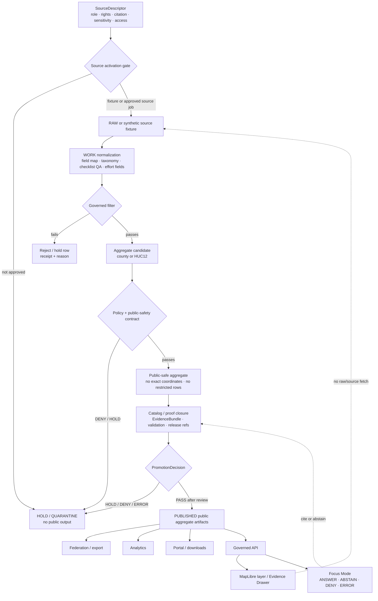

<!-- [KFM_META_BLOCK_V2]
doc_id: kfm://doc/TODO-register-ebird-source-readme-uuid
title: eBird Source Directory README
type: standard
version: v1
status: draft
owners: TODO(fauna-source-stewards)
created: TODO(verify-original-created-date-or-set-on-first-meaningful-commit)
updated: 2026-05-07
policy_label: TODO(verify-public-or-restricted)
related: ["../../README.md", "../../INGEST_EBIRD.md", "../../SOURCE_ROLES.md", "../../GEOPRIVACY.md", "../../VALIDATION.md", "EBIRD_ARCHITECTURE.md", "EBIRD_CONTRACTS.md", "EBIRD_CONFORMANCE.md", "EBIRD_FEDERATION.md", "EBIRD_ANALYTICS.md", "EBIRD_PORTAL.md", "EBIRD_QUALITY_AND_TRIAGE.md", "../../../../runbooks/fauna/EBIRD_OPERATIONS.md", "../../../../../policy/fauna/ebird.rego", "../../../../../configs/fauna/ebird/README.md", "../../../../../data/registry/fauna/README.md"]
tags: [kfm, fauna, ebird, source-directory, occurrence-support, geoprivacy, public-aggregate]
notes: [First substantive source-directory README pass; target file was inspected through GitHub connector and appeared blank before this revision; doc_id, owners, created date, and policy_label remain TODO until registry/steward verification.]
[/KFM_META_BLOCK_V2] -->

<a id="top"></a>

# eBird Source Directory

Governed index and source-family landing page for KFM’s eBird occurrence-support documentation, public-safe aggregate contracts, triage rules, portal/download guidance, and release-facing review checks.

<p>
  
  
  
  
  = 10" src="https://img.shields.io/badge/suppression-n_%3E%3D_10-b60205?style=flat-square">
  
  
</p>

> [!IMPORTANT]
> **Impact block**
>
> | Field | Value |
> |---|---|
> | Status | `experimental` documentation index; metadata remains `draft` until steward review |
> | Target path | `docs/domains/fauna/sources/ebird/README.md` |
> | Owners | `TODO(fauna-source-stewards)` |
> | Primary role | Directory README for eBird source-family documentation and review navigation |
> | Source role | eBird is occurrence support, not legal-status authority |
> | Public geometry posture | Public exact coordinates are denied by default; public products are aggregate/generalized |
> | Public aggregate posture | County/HUC12 aggregate products only unless policy and docs are deliberately changed |
> | Minimum suppression | `suppression_min_n >= 10` |
> | Runtime posture | Public clients consume released KFM artifacts through governed APIs; no browser-to-eBird source fetch |
> | Quick jumps | [Scope](#scope) · [Repo fit](#repo-fit) · [Inputs](#inputs) · [Exclusions](#exclusions) · [Directory map](#directory-map) · [Trust flow](#trust-flow) · [Non-negotiables](#non-negotiables) · [Quickstart](#quickstart) · [Review gates](#review-gates) · [Open verification](#open-verification) |

---

## Scope

This directory is the human-facing control surface for KFM’s eBird source family inside the fauna lane.

It does **not** make eBird canonical truth. It organizes the documentation needed to admit, filter, aggregate, validate, explain, publish, correct, and roll back **public-safe occurrence-support derivatives** derived from eBird-style inputs.

### This directory governs

| Surface | Directory responsibility |
|---|---|
| Source-family orientation | Explain what eBird can and cannot support inside KFM. |
| Contract navigation | Point maintainers to the eBird architecture, contracts, conformance, federation, analytics, portal, quality, red-team, maintenance, and consumer docs. |
| Source-role safety | Keep eBird scoped as occurrence support, not legal or conservation-status authority. |
| Public aggregate safety | Preserve county/HUC12 aggregation, `suppression_min_n >= 10`, valid `kfm:spec_hash`, coordinate-field denial, and `exact_points=restricted`. |
| Claim boundaries | Prevent descriptive public aggregates from being inflated into abundance, occupancy, true absence, population trend, causal effect, legal status, or complete census claims. |
| Runtime boundary | Keep public UI, API, portal/downloads, Evidence Drawer, and Focus Mode downstream of released artifacts and EvidenceBundles. |
| Review navigation | Make the right source, policy, validation, operations, and release docs easy to find. |

### This directory does not govern

| Not governed here | Owning surface |
|---|---|
| Fauna-wide lifecycle and public safety | [`../../README.md`](../../README.md) |
| eBird ingest and productization hub | [`../../INGEST_EBIRD.md`](../../INGEST_EBIRD.md) |
| Fauna source-role taxonomy | [`../../SOURCE_ROLES.md`](../../SOURCE_ROLES.md) |
| Sensitive-location and public geometry policy | [`../../GEOPRIVACY.md`](../../GEOPRIVACY.md) |
| Executable policy | [`../../../../../policy/fauna/ebird.rego`](../../../../../policy/fauna/ebird.rego) |
| Source configuration | [`../../../../../configs/fauna/ebird/README.md`](../../../../../configs/fauna/ebird/README.md) |
| Source descriptors and registry posture | [`../../../../../data/registry/fauna/README.md`](../../../../../data/registry/fauna/README.md) |
| Validator implementation | `../../../../../tools/validators/fauna/validate_ebird_*.ts` |
| Raw, work, quarantine, processed, proof, receipt, release, and published data | `data/` and `release/` responsibility roots |

[Back to top](#top)

---

## Repo fit

`docs/domains/fauna/sources/ebird/README.md` is a README-like source directory landing page under `docs/`, the human-facing control plane.

| Relationship | Status | Path / surface | Role |
|---|---:|---|---|
| This file | CONFIRMED target | `docs/domains/fauna/sources/ebird/README.md` | Source-directory index and maintainer navigation |
| Fauna domain README | CONFIRMED | [`../../README.md`](../../README.md) | Domain lifecycle, source roles, public safety, API/UI/AI boundary |
| eBird ingest hub | CONFIRMED | [`../../INGEST_EBIRD.md`](../../INGEST_EBIRD.md) | Source-specific ingest, aggregation, policy, release handoff |
| Source-role doctrine | CONFIRMED | [`../../SOURCE_ROLES.md`](../../SOURCE_ROLES.md) | Role compatibility and source-authority discipline |
| Fauna geoprivacy | CONFIRMED | [`../../GEOPRIVACY.md`](../../GEOPRIVACY.md) | Exact-location denial, redaction receipts, public geometry classes |
| Validation guidance | NEEDS VERIFICATION | `../../VALIDATION.md` | Fauna validation and release gate guidance |
| Operations runbook | CONFIRMED | [`../../../../runbooks/fauna/EBIRD_OPERATIONS.md`](../../../../runbooks/fauna/EBIRD_OPERATIONS.md) | Scan, trend, attest, evidence-pack, and incident workflows |
| eBird policy gate | CONFIRMED | [`../../../../../policy/fauna/ebird.rego`](../../../../../policy/fauna/ebird.rego) | Executable public aggregate denial rules |
| eBird config | CONFIRMED | [`../../../../../configs/fauna/ebird/README.md`](../../../../../configs/fauna/ebird/README.md) | Non-secret source configuration posture |
| Fauna registry | CONFIRMED | [`../../../../../data/registry/fauna/README.md`](../../../../../data/registry/fauna/README.md) | Source descriptors, source roles, rights, sensitivity, verification backlog |
| eBird validators | CONFIRMED by repo search / NEEDS VERIFICATION for command wiring | `../../../../../tools/validators/fauna/validate_ebird_*.ts` | Executable checks for quality, triage, red-team, preservation, fixity, audit, root-of-trust |
| eBird connector smoke tests | CONFIRMED by repo search / NEEDS VERIFICATION for current CI | `../../../../../tests/connectors/fauna/test_kfm_ebird_layer10.py` | Layer 10 smoke/hash behavior |
| Live source activation | NEEDS VERIFICATION | Source registry / source activation decision | Required before live eBird source jobs |

### Directory Rules basis

This path follows the responsibility-root rule: eBird is a **domain/source documentation directory** under `docs/domains/fauna/sources/`, not a root-level `ebird/` folder. Machine schemas, executable policy, validators, tests, lifecycle data, receipts, proofs, release decisions, and runtime code remain in their own responsibility roots.

[Back to top](#top)

---

## Inputs

### Accepted inputs for this directory

| Input | Accepted here? | Conditions |
|---|---:|---|
| Source-family architecture notes | ✅ | Must preserve eBird as occurrence support and link to evidence/policy surfaces. |
| Human-readable contract guidance | ✅ | Must stay aligned with executable policy and validator expectations. |
| Public aggregate safety rules | ✅ | Must preserve county/HUC12 aggregation, suppression, field allowlist, and exact-point restriction. |
| Conformance and smoke guidance | ✅ | Must be no-network unless deliberately marked otherwise and reviewed. |
| Federation/export guidance | ✅ | Must describe public-safe discovery/export only. |
| Analytics guidance | ✅ | Must remain descriptive and avoid unsupported biological inferences. |
| Portal/download guidance | ✅ | Must use already-public artifacts, local assets, restrictive CSP, no trackers, no live source calls. |
| Quality/triage guidance | ✅ | Must use finite dispositions and not publish by itself. |
| Red-team and negative fixture guidance | ✅ | Must be synthetic-only and avoid real eBird rows, credentials, and exact coordinates. |
| Consumer handoff guidance | ✅ | Must propagate source role, warnings, hashes, validation refs, release refs, and correction state. |
| Audit, remediation, maintenance, preservation, and fixity guidance | ✅ | Must keep receipts, evidence, correction, and rollback distinct. |

### Accepted source/product classes

| Source or product class | Default posture |
|---|---|
| Synthetic eBird-like fixtures | Preferred first proof path; safe for no-network validation and red-team tests. |
| Live eBird API or EBD-style source material | CONDITIONAL; requires source descriptor, rights review, source activation, source role, sensitivity review, and receipts. |
| Public county aggregate artifact | CONDITIONAL; allowed only after filtering, suppression, validation, policy, evidence closure, release, and rollback. |
| Public HUC12 aggregate artifact | CONDITIONAL; same requirements as county aggregate. |
| Public federation/export index | Allowed only when built from released public-safe artifacts. |
| Static portal/download bundle | Allowed only when built from already-public artifacts and local assets. |
| Focus Mode context | Allowed only from released public-safe EvidenceBundles. |

[Back to top](#top)

---

## Exclusions

| Does not belong here | Correct handling | Reason |
|---|---|---|
| eBird API keys, EBD credentials, cookies, tokens, private URLs | Secret manager or ignored local environment | Secrets never belong in docs, fixtures, portals, downloads, public artifacts, logs, or Focus context. |
| Raw eBird files or live API captures | `data/raw/fauna/ebird/...` or repo-confirmed lifecycle home | RAW source material is not documentation. |
| Work-in-progress normalized records | `data/work/fauna/ebird/...` | WORK products are not public docs. |
| Rights-conflicted or sensitive records | `data/quarantine/fauna/ebird/...` | Quarantine data must not leak into GitHub docs. |
| Exact public coordinates or point geometry | Deny from public docs/artifacts | Public eBird products remain aggregate/generalized by default. |
| Restricted observations | Restricted lifecycle/proof/review surfaces only | Prevent sensitive-location and source-term leakage. |
| Suppression receipts and suppressed-group details | Restricted receipts/proof homes only | Suppression internals can expose low-count or sensitive patterns. |
| Hidden rejoin keys to exact observations | Deny from public products | Prevent reverse engineering of restricted records. |
| Legal-status claims sourced only from eBird | Deny | eBird is occurrence support, not legal-status authority. |
| Occupancy, abundance, true absence, complete census, population trend, or causal claims from public aggregates alone | Abstain, deny, or hold for stronger evidence | Public aggregates do not support those claims by themselves. |
| Browser-to-eBird public source fetch | Deny | Public runtime consumes released KFM artifacts through governed APIs. |
| Direct model access to eBird source data | Deny | AI is interpretive and evidence-bounded. |
| Generated release/proof objects | `data/receipts/`, `data/proofs/`, `release/`, or repo-confirmed homes | Docs explain; trust objects prove. |

[Back to top](#top)

---

## Directory map

Use this directory as a source-family library. Each file should have a clear responsibility and should not silently duplicate another layer’s authority.

| File | Layer / role | Primary responsibility |
|---|---:|---|
| `README.md` | Directory landing page | Index this source-family directory and summarize eBird invariants. |
| [`EBIRD_ARCHITECTURE.md`](EBIRD_ARCHITECTURE.md) | Layer 10 architecture | Source-family trust boundary, source activation, flow, runtime, claim boundary. |
| [`EBIRD_CONTRACTS.md`](EBIRD_CONTRACTS.md) | Layer 10 contracts | Contract hash, governed filter, public aggregate rules, field allowlist, policy mirror. |
| [`EBIRD_CONFORMANCE.md`](EBIRD_CONFORMANCE.md) | Conformance | Local acceptance and conformance checks for public aggregate behavior. |
| [`EBIRD_FEDERATION.md`](EBIRD_FEDERATION.md) | Layer 12 federation/export | Public-safe discovery, federation index, semantic graph/export posture. |
| [`EBIRD_ANALYTICS.md`](EBIRD_ANALYTICS.md) | Layer 13 analytics | Descriptive public aggregate analytics with interpretation limits. |
| [`EBIRD_PORTAL.md`](EBIRD_PORTAL.md) | Layer 14 portal/downloads | Static local portal and public download manifests from already-public artifacts. |
| [`EBIRD_QUALITY_AND_TRIAGE.md`](EBIRD_QUALITY_AND_TRIAGE.md) | Layer 21 quality/triage | Operational QA, finite dispositions, local-only triage, and reason codes. |
| [`EBIRD_REDTEAM.md`](EBIRD_REDTEAM.md) | Red team | Synthetic adversarial mutation corpus and leakage checks. |
| [`EBIRD_MAINTENANCE.md`](EBIRD_MAINTENANCE.md) | Maintenance | Compatibility, migration, drift, public-safety scan, and upkeep guidance. |
| [`EBIRD_REMEDIATION.md`](EBIRD_REMEDIATION.md) | Remediation | Repair paths for public-safety, policy, validation, or release defects. |
| [`EBIRD_AUDIT_RESPONSE.md`](EBIRD_AUDIT_RESPONSE.md) | Audit response | Response packet expectations for findings and critical unresolved issues. |
| [`EBIRD_CHECKPOINT_RESTORE_AND_CONTINUITY.md`](EBIRD_CHECKPOINT_RESTORE_AND_CONTINUITY.md) | Continuity | Checkpoint/restore and continuity posture. |
| [`EBIRD_PRESERVATION_AND_FIXITY.md`](EBIRD_PRESERVATION_AND_FIXITY.md) | Preservation/fixity | Fixity, preservation, hash, and retention guidance. |
| [`EBIRD_INDEPENDENT_VERIFICATION.md`](EBIRD_INDEPENDENT_VERIFICATION.md) | Independent verification | External/independent review posture and finding workflow. |
| [`EBIRD_TRANSPARENCY_AND_GOVERNANCE_CALENDAR.md`](EBIRD_TRANSPARENCY_AND_GOVERNANCE_CALENDAR.md) | Governance calendar | Review cadence and transparency scheduling. |
| [`EBIRD_DEVELOPER_GUIDE.md`](EBIRD_DEVELOPER_GUIDE.md) | Developer guide | Maintainer/developer onboarding for the eBird source family. |
| [`EBIRD_CONSUMER_INTEGRATION.md`](EBIRD_CONSUMER_INTEGRATION.md) | Consumer handoff | Public aggregate consumer integration and warning propagation. |
| [`EBIRD_CONSUMER_CERTIFICATION.md`](EBIRD_CONSUMER_CERTIFICATION.md) | Consumer certification | Consumer-readiness and certification expectations. |
| [`EBIRD_CONSUMER_CHANGE_MANAGEMENT.md`](EBIRD_CONSUMER_CHANGE_MANAGEMENT.md) | Consumer change | Downstream change management and compatibility. |

> [!NOTE]
> If a listed file is renamed, deprecated, or superseded, update this index, the target file’s metadata block, and any registry or continuity map that points to it.

[Back to top](#top)

---

## Trust flow

The eBird source family follows the KFM lifecycle. Public outputs are released derivatives, not raw source records.



### Trust-flow rules

1. **Source admission precedes live use.** Source role, rights, citation, access class, cadence, sensitivity, and allowed use must be recorded before activation.
2. **Fixture-first is the safe first slice.** Synthetic fixtures should prove filters, policy, validation, public-safety, and runtime outcomes before any live source work.
3. **The governed filter is not publication.** Passing quality/effort filters does not bypass rights, sensitivity, suppression, evidence closure, policy, review, release, correction, or rollback.
4. **Public artifacts are aggregate/generalized.** eBird public products use approved aggregate units such as county or HUC12 unless policy and docs deliberately change.
5. **Evidence resolves before claims.** Public claims, Evidence Drawer payloads, Focus answers, exports, and reports must resolve supporting evidence or abstain.
6. **Rollback is part of publication.** A release without correction and rollback targets is not a complete public release.

[Back to top](#top)

---

## Non-negotiables

| Rule | Required behavior | Failure outcome |
|---|---|---|
| Source role | eBird is occurrence support. | `DENY` legal/status-authority use unless separate compatible authority evidence exists. |
| Public exact coordinates | Public eBird exact coordinates are denied by default. | `DENY_PUBLIC_OUTPUT` |
| Aggregate unit | Public aggregate outputs use `county` or `huc12` under current eBird policy. | `DENY` |
| Suppression | `suppression_min_n >= 10`. | `DENY` |
| Exact-points flag | Public artifacts keep `exact_points=restricted`. | `DENY` |
| Public field allowlist | No latitude, longitude, point, geometry, raw geometry, private locality, quarantine path, credential, or suppression-internal fields. | `DENY` |
| Spec hash | Required public artifacts include valid `kfm:spec_hash`. | `DENY` or `HOLD` |
| Local docs/smoke posture | No eBird downloads, credentials, network calls, real sensitive rows, or exact public coordinates. | `DENY` / `QUARANTINE` |
| Portal/downloads | Static/local assets only; no trackers, remote scripts, raw rows, or credentials. | `DENY` |
| Claim boundary | Public aggregates are descriptive occurrence support only. | `ABSTAIN`, `HOLD`, or `DENY` for overclaims |
| Focus Mode | Uses released public-safe EvidenceBundles only. | `ABSTAIN`, `DENY`, or `ERROR` |
| Release | Requires validation, policy, evidence/proof, review, release manifest, correction path, and rollback target. | `HOLD` or `ERROR` |

### Required public warning

Use this warning, or a steward-approved equivalent, in public reports, portals, downloads, consumer handoffs, chart captions, and Focus-facing summaries:

> This eBird output is descriptive public aggregate reporting only. It does not show exact observations, does not include restricted records, and must not be interpreted as occupancy, abundance, true absence, population trend, causal effect, legal status, or a complete species census.

[Back to top](#top)

---

## Governed filter

The Layer 10 eBird checklist filter is:

```sql
complete = TRUE
AND protocol_type != 'Incidental'
AND duration_min >= 5
AND distance_km <= 5
AND number_observers <= 10
```

| Filter | Why it exists | Failure outcome |
|---|---|---|
| `complete = TRUE` | Prefer complete checklist support over ambiguous partial support. | Exclude or hold. |
| `protocol_type != 'Incidental'` | Avoid weak protocol/effort support. | Exclude from governed aggregate candidate. |
| `duration_min >= 5` | Require minimum effort signal. | Exclude or hold. |
| `distance_km <= 5` | Keep checklist effort spatially bounded. | Exclude from public aggregate candidate. |
| `number_observers <= 10` | Avoid unusually large observer groups skewing support. | Exclude or triage. |

> [!CAUTION]
> Passing this filter does **not** authorize publication. Public release still requires source rights, source-role compatibility, geoprivacy, coordinate-field removal, suppression, catalog/proof closure, policy decision, review state, release manifest, correction path, and rollback target.

[Back to top](#top)

---

## Quickstart

Run these only from a verified checkout. Keep this sequence local and no-network by default.

### 1. Inventory this source directory

```bash
rg --files docs/domains/fauna/sources/ebird | sort
```

Expected result: this README and the eBird `EBIRD_*.md` source-family docs are visible.

### 2. Check the core invariants in docs and policy

```bash
rg -n \
  "occurrence support|exact_points|suppression_min_n|public_aggregate|kfm:spec_hash|county|huc12|ABSTAIN|DENY" \
  docs/domains/fauna \
  policy/fauna/ebird.rego \
  configs/fauna/ebird \
  data/registry/fauna
```

Expected result: source role, aggregate limits, suppression, exact-point denial, and finite outcomes remain visible across docs and policy.

### 3. Run policy or validator checks with repo-native tooling

```bash
# NEEDS VERIFICATION: adapt to the repo's accepted policy/validator command.
opa test policy/fauna tests/policy/fauna
```

```bash
# NEEDS VERIFICATION: command names are contract targets until executable wiring is verified.
tools/validators/fauna/validate_ebird_quality \
  --input tests/fixtures/fauna/ebird/public_aggregate_candidate.valid.json \
  --strict \
  --json
```

### 4. Smoke the eBird command contract only after executable paths are verified

```bash
# NEEDS VERIFICATION: run only when this executable exists in the active checkout.
tools/connectors/fauna/kfm-ebird-ingest/kfm-ebird-doctor \
  --strict \
  --json
```

```bash
# NEEDS VERIFICATION: local conformance only; no live source fetch.
tools/connectors/fauna/kfm-ebird-ingest/kfm-ebird-conformance \
  --aggregate both \
  --format jsonl \
  --json
```

[Back to top](#top)

---

## Runtime and UI handoff

| Surface | eBird directory obligation |
|---|---|
| Governed API | Serve released public aggregate artifacts and public-safe evidence payloads only. |
| MapLibre layer | Render released layer manifests/public tiles only; never raw eBird rows or credentials. |
| Evidence Drawer | Show source role, aggregate unit, release ID, filter/suppression, public geometry class, policy state, evidence refs, limitations, correction state. |
| Focus Mode | Use released public-safe EvidenceBundles; return `ANSWER`, `ABSTAIN`, `DENY`, or `ERROR`. |
| Portal/downloads | Build from already-public artifacts only; no trackers, remote scripts, credentials, exact coordinates, restricted observations, quarantine paths, or suppression receipts. |
| Consumer handoff | Inherit warnings, hashes, policy labels, validation refs, source role, release refs, and correction lineage. |
| Review/QA | Inspect validation and audit artifacts without exposing restricted rows in public outputs. |

### Evidence Drawer minimum display

| Field family | Required public-safe meaning |
|---|---|
| Source role | eBird displayed as occurrence support. |
| Aggregate unit | County, HUC12, or approved public-safe unit. |
| Filter/suppression | Governed filter and `suppression_min_n` visible. |
| Evidence support | EvidenceBundle or release/proof references. |
| Public geometry | `exact_points=restricted`; no exact-coordinate fields. |
| Policy posture | `public_aggregate`, rights/citation state, validation state. |
| Limitations | Not legal status, not complete census, not true absence, not trend/causality. |
| Correction lineage | Current, superseded, corrected, withdrawn, or rollback state when applicable. |

[Back to top](#top)

---

## Review gates

Before merging changes in this directory or source family, reviewers should verify:

- [ ] Metadata placeholders are either resolved from registry/steward evidence or intentionally left as TODO.
- [ ] eBird remains scoped as occurrence support.
- [ ] No file implies eBird is legal-status, conservation-status, complete-census, abundance, occupancy, true-absence, population-trend, or causal authority.
- [ ] No example includes real credentials, API keys, cookies, tokens, private URLs, live source secrets, or exact sensitive coordinates.
- [ ] No public artifact example contains latitude, longitude, point, geometry, raw geometry, private locality, quarantine path, or suppression-internal fields.
- [ ] The governed filter remains consistent across ingest, architecture, contracts, conformance, quality, policy, and tests.
- [ ] `suppression_min_n >= 10` remains visible and enforced.
- [ ] Public outputs keep `exact_points=restricted`.
- [ ] Public aggregate rows use `policy_label=public_aggregate`.
- [ ] Valid `kfm:spec_hash` remains required for public artifacts.
- [ ] Public warnings propagate to analytics, portal/downloads, consumer handoff, and Focus summaries.
- [ ] Focus Mode examples return `ABSTAIN` or `DENY` for unsupported, unreleased, restricted, or exact-location requests.
- [ ] Critical public-safety findings block approval and transparency/pass workflows.
- [ ] Correction, withdrawal, supersession, and rollback paths remain visible.
- [ ] Any new path follows responsibility-root placement rather than creating a root-level eBird or fauna authority.

[Back to top](#top)

---

## Definition of done

This README is ready to merge when:

| Area | Done means |
|---|---|
| Metadata | `doc_id`, owners, created date, and policy label are resolved or explicitly accepted as TODO placeholders. |
| Directory index | All linked eBird docs either exist or are marked `NEEDS VERIFICATION`. |
| Repo fit | Directory Rules basis is recorded; no root-level source/domain folder is proposed. |
| Source role | eBird is consistently described as occurrence support. |
| Public safety | Exact public coordinates, restricted observations, raw source rows, credentials, and suppression internals are denied. |
| Contract alignment | Suppression, aggregate unit, public field allowlist, `exact_points`, `policy_label`, and `kfm:spec_hash` match contract and policy docs. |
| Runtime boundary | API, map, Evidence Drawer, Focus Mode, portal/downloads, and consumer handoff stay downstream of released public-safe artifacts. |
| Reviewability | Open verification items are visible, actionable, and not hidden in prose. |

[Back to top](#top)

---

## Open verification

| Item | Status | Needed proof |
|---|---:|---|
| Registered `doc_id` | TODO | Document registry entry. |
| Owners | TODO | CODEOWNERS, steward register, or source-lane owner assignment. |
| Created date | TODO | Git history or steward-approved first meaningful commit date. |
| Policy label | TODO | Repo policy classification. |
| `../../VALIDATION.md` link | NEEDS VERIFICATION | Confirm adjacent file exists and path is stable. |
| Full source descriptor | NEEDS VERIFICATION | Registry entry with source role, rights, citation, access class, cadence, sensitivity, and allowed uses. |
| Live source activation | NEEDS VERIFICATION | SourceActivationDecision or equivalent. |
| eBird terms/citation review | NEEDS VERIFICATION | Current terms, citation instructions, redistribution limits, downstream-use limits. |
| CLI executable paths | NEEDS VERIFICATION | Actual executable files, package scripts, or installed entrypoints. |
| CLI packaging | NEEDS VERIFICATION | Confirm installation and invocation from CI/local checkout. |
| Policy runner | NEEDS VERIFICATION | OPA/Conftest/Rego or repo-native policy runner command. |
| CI enforcement | UNKNOWN | Workflow evidence and check results. |
| Schema home | NEEDS VERIFICATION | Accepted ADR or repo convention for machine schemas. |
| Release object family | NEEDS VERIFICATION | ReleaseManifest, PromotionReceipt, ProofPack, CorrectionNotice, RollbackCard conventions. |
| Portal/consumer inheritance checks | NEEDS VERIFICATION | Tests proving warnings, hashes, validation refs, source role, policy labels, release refs, and correction state propagate. |
| Red-team corpus status | NEEDS VERIFICATION | Synthetic-only mutation corpus with no real rows, no credentials, and no exact coordinates. |

[Back to top](#top)

---

## FAQ

### Is eBird a legal-status authority in KFM?

No. This source family treats eBird as occurrence support. Legal, conservation, threatened/endangered, regulatory, or protected-status claims require separate compatible authority evidence.

### Can public eBird outputs show exact points?

No by default. Public eBird products must use aggregate/generalized outputs and deny exact coordinate/geometry fields unless a future reviewed source descriptor, rights posture, sensitivity policy, and release gate explicitly allow a narrower case.

### Does passing the governed filter make a row publishable?

No. The governed filter is only one quality/effort gate. Public release also requires rights, source-role compatibility, sensitivity/geoprivacy checks, suppression, catalog/proof closure, policy decision, review, release manifest, correction path, and rollback.

### Can Focus Mode answer “where was this bird seen?”

Only at the released public-safe aggregate level. It must not expose exact coordinates or infer private/sensitive locations from aggregate artifacts.

### Can a missing public aggregate signal prove absence?

No. A public aggregate is occurrence support with limitations. Lack of a released public signal is not proof of absence.

### Can the API fetch eBird live during a public request?

No for normal public runtime. Live fetches, if ever approved, belong in governed source jobs with source descriptors, receipts, policy gates, and review. Public clients consume released artifacts through governed APIs.

[Back to top](#top)

---

## Appendix

<details>
<summary>Suggested negative fixture families</summary>

| Fixture family | Expected outcome |
|---|---|
| Public row contains latitude/longitude | `DENY` |
| Public row contains geometry/point field | `DENY` |
| Public field allowlist contains coordinate field | `DENY` |
| `suppression_min_n` below 10 | `DENY` |
| Missing or malformed `kfm:spec_hash` | `DENY` |
| Public aggregate uses wrong `policy_label` | `DENY` |
| Checklist count below suppression threshold | `DENY` |
| Live fetch without source activation | `DENY` or `HOLD` |
| eBird used as legal-status authority | `DENY` |
| Focus request asks for exact location | `DENY` |
| Focus answer infers absence from missing public aggregate | `ABSTAIN` |
| Analytics text implies population trend from aggregate counts alone | `HOLD` |
| Portal includes remote script, tracker, or credential-like string | `DENY` |
| Public bundle includes suppression receipt or suppressed-group detail | `DENY` |

</details>

<details>
<summary>Maintainer update triggers</summary>

Update this README when any of the following changes:

- source role for eBird;
- official eBird terms/citation or redistribution posture;
- source activation workflow;
- governed filter;
- suppression threshold;
- aggregate unit vocabulary;
- public field allowlist;
- public geometry class;
- contract hash recipe;
- `kfm:spec_hash` rules;
- public aggregate object type;
- CLI command names or executable paths;
- policy file behavior;
- validator behavior;
- portal/download contract;
- analytics claim-boundary wording;
- consumer handoff contract;
- red-team fixture families;
- release, rollback, correction, or audit procedure;
- Evidence Drawer payload contract;
- Focus Mode response contract.

</details>

<details>
<summary>Pre-publish checklist for this README</summary>

- [x] KFM Meta Block V2 present.
- [x] One H1 only.
- [x] One-line purpose directly below title.
- [x] Top impact block present.
- [x] Shields.io badges present.
- [x] Owners present as TODO.
- [x] Status present.
- [x] Quick jump links present.
- [x] Repo fit included.
- [x] Accepted inputs included.
- [x] Exclusions included.
- [x] Directory map included.
- [x] Mermaid diagram included.
- [x] Quickstart snippets are language-tagged and no-network by default.
- [x] Review gates included.
- [x] Open verification items retained.
- [x] Long appendix wrapped in `<details>`.
- [x] No API token, credential, exact sensitive coordinate, or raw eBird row included.
- [x] Public aggregate claim limits are visible.
- [x] Rollback and correction posture remain visible.

</details>

[Back to top](#top)
