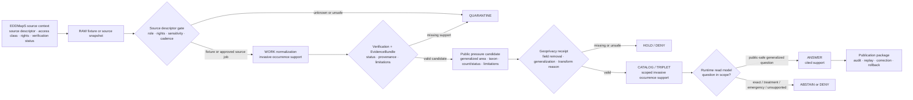

<!-- [KFM_META_BLOCK_V2]
doc_id: kfm://doc/TODO-register-eddmaps-source-readme-uuid
title: EDDMapS Source README
type: standard
version: v1
status: draft
owners: TODO(fauna-source-stewards)
created: TODO(verify-original-created-date-or-set-on-first-meaningful-commit)
updated: 2026-05-07
policy_label: TODO(verify-public-or-restricted)
related: ["../../README.md", "../../SOURCE_ROLES.md", "../../GEOPRIVACY.md", "../../VALIDATION.md", "../../../../../data/registry/fauna/README.md"]
tags: [kfm, fauna, eddmaps, invasive-species, pest-distribution, source-readme, occurrence-support, geoprivacy, evidencebundle]
notes: [Target file existed but was blank when inspected through GitHub connector; doc_id, owners, created date, and policy_label require registry or steward verification; this README is a documentation and source-family orientation layer only and does not activate live EDDMapS fetching.]
[/KFM_META_BLOCK_V2] -->

<a id="top"></a>

# EDDMapS Source README

Governed source-family landing page for EDDMapS invasive-species and pest occurrence support in KFM, keeping rapid-response records downstream of source roles, verification status, rights, geoprivacy, review, and release state.

<p>
  
  
  
  
  
  
  
</p>

> [!IMPORTANT]
> **Impact block**
>
> | Field | Value |
> |---|---|
> | Status | `draft` source-family README; operational maturity remains `NEEDS VERIFICATION` |
> | Owners | `TODO(fauna-source-stewards)` |
> | Target path | `docs/domains/fauna/sources/eddmaps/README.md` |
> | Directory role | Human-facing source-family landing page for EDDMapS within the KFM fauna source documentation lane |
> | Source posture | EDDMapS is treated as invasive-species / pest occurrence support, not legal-status authority, emergency alerting, treatment instruction, or canonical truth |
> | Public-safety posture | Public exact sensitive geometry is denied by default; public use requires source descriptor, rights review, verification-status handling, geoprivacy transform, evidence closure, policy decision, release state, correction path, and rollback target |
> | Connector posture | This README does **not** enable live source fetching, browser-to-source requests, public alerts, source mirroring, or public publication |
> | Runtime posture | Cite-or-abstain; finite outcomes only: `ANSWER`, `ABSTAIN`, `DENY`, `ERROR` |
> | Quick jumps | [Scope](#scope) · [Repo fit](#repo-fit) · [Accepted inputs](#accepted-inputs) · [Exclusions](#exclusions) · [Directory tree](#directory-tree) · [Lifecycle](#lifecycle) · [EDDMapS operating rules](#eddmaps-operating-rules) · [Claim boundaries](#claim-boundaries) · [Quickstart](#quickstart) · [Usage](#usage) · [Validation gates](#validation-gates) · [Review gates](#review-gates) · [Open verification](#open-verification) · [FAQ](#faq) · [Appendix](#appendix) |

---

## Scope

This directory documents how KFM should handle **EDDMapS-mediated invasive-species and pest occurrence support** inside the fauna lane.

EDDMapS-like records can be useful for early detection, invasive-species pressure, pest-distribution context, management review, and public-safe generalized situational awareness. They must not be silently promoted into legal status, emergency warning, treatment instruction, complete distribution truth, population trend, or exact public geometry.

### This README governs

| Surface | Role |
|---|---|
| Source-family orientation | Explains what EDDMapS can and cannot support inside KFM. |
| Source-role discipline | Keeps invasive occurrence support separate from legal status, habitat context, modeled range, steward-restricted records, and public release authority. |
| Verification-status handling | Requires source verification or review status to remain visible through normalization, validation, catalog, API, Evidence Drawer, and Focus Mode. |
| Public-safety posture | Summarizes exact-coordinate denial, management-sensitive detail handling, generalized public outputs, and geoprivacy receipt expectations. |
| Review expectations | Gives maintainers a checklist before changing source descriptors, examples, schemas, policies, validators, source activation, or public publication flow. |
| Contributor onboarding | Gives a no-network-first path for future EDDMapS source work. |

### This README does not govern

| Not governed here | Owning surface |
|---|---|
| Fauna-wide lifecycle and public safety | [Fauna Domain README](../../README.md) |
| Fauna-wide source-role definitions | [Fauna Source Roles](../../SOURCE_ROLES.md) |
| Fauna-wide geoprivacy classes and sensitive-location rules | [Fauna Geoprivacy](../../GEOPRIVACY.md) |
| Fauna-wide validation expectations | [Fauna Validation](../../VALIDATION.md) |
| Fauna source registry and activation records | [Fauna Registry](../../../../../data/registry/fauna/README.md) |
| Machine schemas | Accepted schema home after ADR / repo verification |
| Executable policy | `policy/fauna/...` or repo-confirmed policy home |
| Validators and source jobs | `tools/`, `connectors/`, `pipelines/`, `packages/`, or repo-confirmed implementation homes |
| Receipts, proof packs, release manifests, rollback cards | `data/receipts/`, `data/proofs/`, `release/`, or repo-confirmed homes |
| Public map/API/UI runtime | Governed API and released public-safe artifacts only |

[Back to top](#top)

---

## Repo fit

`docs/domains/fauna/sources/eddmaps/README.md` is a **source-family README** inside the human-facing fauna documentation lane.

Directory Rules basis: `docs/` is the human-facing control plane. Domain source docs belong under the appropriate domain documentation root, not as root-level `eddmaps/`, `invasives/`, or `fauna/` authority buckets.

### Path context

```text
docs/domains/fauna/
└── sources/
    └── eddmaps/
        └── README.md
```

### Upstream and downstream relationships

| Direction | Surface | Status | Role |
|---|---|---:|---|
| Upstream domain | [../../README.md](../../README.md) | CONFIRMED adjacent doc path pattern | Fauna lane scope, lifecycle, object families, public-safety posture. |
| Upstream source roles | [../../SOURCE_ROLES.md](../../SOURCE_ROLES.md) | NEEDS VERIFICATION | Source-role taxonomy and claim-compatibility rules. |
| Upstream geoprivacy | [../../GEOPRIVACY.md](../../GEOPRIVACY.md) | NEEDS VERIFICATION | Exact-location denial, sensitivity classes, redaction receipts, public geometry rules. |
| Upstream validation | [../../VALIDATION.md](../../VALIDATION.md) | NEEDS VERIFICATION | Fauna validation and release gate guidance. |
| Upstream registry | [../../../../../data/registry/fauna/README.md](../../../../../data/registry/fauna/README.md) | CONFIRMED adjacent registry pattern | Source descriptor and activation registry posture. |
| Same directory | `EDDMAPS_OCCURRENCE_INGESTION.md` | PROPOSED / NEEDS VERIFICATION | Future fixture-backed RAW → WORK/QUARANTINE normalization guidance. |
| Same directory | `EDDMAPS_PUBLIC_PRESSURE.md` | PROPOSED / NEEDS VERIFICATION | Future public-safe invasive pressure / generalized reporting guidance. |
| Same directory | `EDDMAPS_CATALOG_TRIPLET_READMODEL.md` | PROPOSED / NEEDS VERIFICATION | Future catalog, triplet, and read-model claim language. |
| Same directory | `EDDMAPS_PUBLICATION_OPERATIONS.md` | PROPOSED / NEEDS VERIFICATION | Future publication, audit, replay, correction, withdrawal, and rollback operations. |
| Downstream schemas | `schemas/...` | NEEDS VERIFICATION | Active schema home must be resolved before machine-shape claims. |
| Downstream policy | `policy/fauna/...` | NEEDS VERIFICATION | Policy path and runner must be verified before enforcement is claimed. |
| Downstream tools | `tools/...`, `connectors/...`, `pipelines/...`, `packages/...` | NEEDS VERIFICATION | Normalizer, validator, registry, and publication commands require direct repo inspection. |
| Downstream runtime | governed API, Evidence Drawer, Focus Mode | PROPOSED / NEEDS VERIFICATION | Must consume released public-safe artifacts only. |

> [!NOTE]
> This README can safely exist before every downstream tool is active. It is a navigation and governance surface, not proof that a live connector, schema registry, policy runner, release system, or runtime endpoint is production-ready.

[Back to top](#top)

---

## Accepted inputs

Only reviewable, source-family documentation and control-plane references belong in this directory.

| Input family | Accepted here? | Conditions |
|---|---:|---|
| EDDMapS source-family overview | ✅ | Must preserve invasive occurrence-support posture and public-safety caveats. |
| EDDMapS ingestion documentation | ✅ | Must remain fixture-first unless live source activation is explicitly approved elsewhere. |
| Public pressure / generalized reporting documentation | ✅ | Must require generalized public geometry, source verification status, limitations, and geoprivacy receipt linkage. |
| Catalog/triplet/read-model documentation | ✅ | Must keep claim language scoped and abstain from exact-coordinate, emergency, treatment, or complete-distribution claims. |
| Publication operations documentation | ✅ | Must require package integrity, audit ledger, replay verification, correction, withdrawal, and rollback. |
| Official EDDMapS reference links | ✅ | Must be treated as source-operation references, not automatic connector activation. |
| CLI examples | ✅ | Must be labeled fixture-first, proposed, or repo-verified as appropriate. |
| Validation expectations | ✅ | Human-readable expectations belong here; executable validators belong in `tools/` or repo-native tool homes. |
| Negative-path examples | ✅ | Preferred, especially for coordinate leakage, unknown rights, missing EvidenceBundle, missing verification status, and management overclaiming. |
| Source activation notes | ✅ | Must point to registry/state records and remain truth-labeled. |

### Accepted source maturity states

| State | Meaning | Public release allowed? |
|---|---|---:|
| `IDEA_ONLY` | Source family is named but not described. | No |
| `DESCRIPTOR_DRAFT` | Source descriptor is being drafted. | No |
| `RIGHTS_REVIEW` | Source terms, license, redistribution, attribution, API access, or record-level rights are unresolved. | No |
| `SENSITIVITY_REVIEW` | Source may include sensitive species, management-sensitive records, precise infestations, private-land details, or controlled reports. | No |
| `FIXTURE_ONLY` | Synthetic or no-network fixture path exists. | No production release |
| `INTERNAL_RESTRICTED` | Internal/steward review only. | No public release |
| `RELEASE_CANDIDATE` | Public-safe candidate assembled but not promoted. | Not yet |
| `PUBLISHED_PUBLIC_SAFE` | Governed release approved for a specific public scope. | Yes, within release scope |
| `SUSPENDED` | Source or derivative paused due to risk, defect, source-term change, or steward decision. | No new promotion |
| `WITHDRAWN` | Public release withdrawn or superseded. | No |

[Back to top](#top)

---

## Exclusions

These items must not be stored in this documentation directory.

| Excluded item | Correct home or handling | Why |
|---|---|---|
| Raw EDDMapS downloads, exports, API captures, or scraped pages | `data/raw/fauna/...` after source descriptor and receipt handling | Docs must not contain source payloads. |
| Work-stage normalized records | `data/work/fauna/...` | WORK artifacts are mutable and not public documentation. |
| Quarantined records | `data/quarantine/fauna/...` | Quarantined records may contain rights, sensitivity, role, geometry, or verification problems. |
| Exact sensitive occurrence coordinates | Restricted internal store only | Public docs, examples, screenshots, and map properties must not leak precision. |
| Private landowner, reporter, reviewer, or management notes | Restricted steward review packet | Public source docs must not expose personal or operational detail. |
| Source credentials, API keys, tokens, cookies, private URLs | Secret manager / local ignored environment | Never commit credentials to docs. |
| Machine schemas | Accepted schema home after ADR/repo verification | Schemas own shape; docs explain intent. |
| Policy-as-code | `policy/fauna/...` or repo-confirmed policy home | Policy must be executable and tested. |
| Validator implementation | `tools/...` or repo-confirmed tool/package home | Code should not be embedded in source-family README prose. |
| Release manifests, receipts, proof packs | `release/`, `data/receipts/`, `data/proofs/`, or repo-confirmed homes | Trust objects must remain auditable and separate from docs. |
| Direct AI answers | Nowhere as evidence | AI may interpret released evidence; it cannot become source truth. |
| Public emergency or treatment directives | Official source/steward systems only | KFM is not an emergency alerting or pest-treatment instruction system. |

[Back to top](#top)

---

## Directory tree

Current EDDMapS source documentation set:

```text
docs/domains/fauna/sources/eddmaps/
└── README.md
    └── Source-family landing page, governance summary, public-safety posture, and review checklist.
```

Proposed future companion docs:

```text
docs/domains/fauna/sources/eddmaps/
├── README.md
├── EDDMAPS_OCCURRENCE_INGESTION.md
│   └── Fixture-backed occurrence normalization, verification-status carry-through, and quarantine rules.
├── EDDMAPS_PUBLIC_PRESSURE.md
│   └── Public-safe invasive pressure / generalized reporting products, limitations, and geoprivacy receipts.
├── EDDMAPS_CATALOG_TRIPLET_READMODEL.md
│   └── Catalog, triplet, read-model, and aggregate-only runtime wording.
└── EDDMAPS_PUBLICATION_OPERATIONS.md
    └── Publication package, audit ledger, replay verification, correction, withdrawal, and rollback operations.
```

> [!TIP]
> Add future EDDMapS docs here only when they explain a source-family concern. Put executable code, schemas, policies, fixtures, receipts, proof packs, and released artifacts under their responsibility roots.

[Back to top](#top)

---

## Lifecycle

EDDMapS-derived evidence must follow the KFM lifecycle. The normal public path moves from source-native capture to governed publication; it does not jump from source rows to map popups, alerts, or AI answers.



### Lifecycle boundaries

| Boundary | Required behavior |
|---|---|
| RAW → WORK | Normalize fixture-backed or verified source records into occurrence-support candidates, not species truth or management orders. |
| WORK → QUARANTINE | Unknown rights, missing source role, unresolved sensitivity, missing verification status, malformed coordinates, or missing evidence support fail closed. |
| WORK → PROCESSED | EvidenceBundle support and required source metadata must be present. |
| PROCESSED → CATALOG/TRIPLET | Claim language must remain scoped, evidence-bound, and public-safe. |
| CATALOG/TRIPLET → PUBLISHED | Promotion requires validation, policy, review, release manifest, correction path, rollback target, and audit trail. |
| PUBLISHED → UI/AI | Public clients consume governed API payloads and released artifacts only. |

[Back to top](#top)

---

## EDDMapS operating rules

### 1. EDDMapS is invasive occurrence support, not sovereign truth

EDDMapS-mediated records may support invasive-species or pest occurrence evidence after source-role, rights, quality, verification, geoprivacy, and evidence checks. They must not be silently upgraded into legal status, emergency alert, treatment directive, complete census, population trend, causal explanation, or exact-location permission.

| Claim | EDDMapS-derived evidence may support? | Required outcome |
|---|---:|---|
| “EDDMapS-derived invasive occurrence support exists for this generalized area.” | ✅ | `ANSWER` only if EvidenceBundle, geoprivacy receipt, policy, review, and release support resolve. |
| “This invasive species is confirmed at this exact point.” | ❌ by default | `ABSTAIN` or `DENY`. |
| “This record means treatment is required here.” | ❌ | `ABSTAIN`; point users to official steward guidance when appropriate. |
| “This species is legally listed or regulated in Kansas.” | ❌ | Use compatible legal/regulatory authority source. |
| “This public pressure layer is safe to display.” | Conditional | Requires rights, sensitivity, source verification, generalization, evidence closure, policy, review, release, and rollback. |

### 2. Verification status must remain visible

EDDMapS-style workflows may include review or verification signals. KFM must preserve those signals rather than flattening records into generic “presence” rows.

Required carry-through fields should include, where available:

- source record ID;
- source dataset or project ID;
- verification status;
- reviewer / validator status if public-safe and permitted;
- event date and source update date;
- source retrieval time;
- rights and attribution posture;
- source geoprivacy or location-quality flags;
- KFM validation outcome;
- limitations and caveats.

### 3. Public outputs should be generalized pressure/context by default

Public EDDMapS products should favor generalized reporting surfaces such as county, grid, watershed, management region, or other approved public-safe aggregate units.

Public artifacts must not expose:

- exact sensitive coordinates;
- private landowner or reporter details;
- management-sensitive operational notes;
- hidden rejoin keys to exact occurrences;
- source credentials or private source URLs;
- quarantine paths or suppressed-group internals.

### 4. KFM does not become the official alerting or treatment surface

KFM may publish evidence-bound generalized context when release gates pass. It must not replace official invasive-species reporting, alerting, verification, treatment, quarantine, or regulatory systems.

> [!WARNING]
> If a user asks for exact locations, immediate control instructions, emergency guidance, or regulatory determinations, the safe response is `ABSTAIN` or `DENY` unless KFM has a reviewed, cited, jurisdiction-scoped, public-safe release that supports the exact claim.

[Back to top](#top)

---

## Claim boundaries

EDDMapS-derived outputs should use careful language.

### Allowed public framing

> “EDDMapS-derived invasive occurrence support is available for this generalized area.”

> “This public-safe layer summarizes released invasive-species reporting support. It does not display exact sensitive reports.”

### Disallowed public framing

- “confirmed infestation at this exact point”
- “known population boundary”
- “treatment required here”
- “official regulatory status”
- “complete distribution”
- “no records means absence”
- “real-time emergency alert”
- “all reports have been verified by KFM”
- “exact location available”

### Source-role compatibility matrix

| Source role | Can support | Must not silently support |
|---|---|---|
| `observed_occurrence` | Source-recorded invasive or pest occurrence support with event/source time and provenance. | Legal status, treatment order, complete distribution, exact public location. |
| `verification_context` | Source-side review or verification state, when available and rights-safe. | KFM release approval or steward endorsement. |
| `management_context` | Public-safe management context when explicitly sourced and reviewed. | Site-specific treatment instruction or emergency order. |
| `regulatory_context` | Legal/regulatory source only if separate compatible authority supports it. | Observation proof or broad occurrence truth. |
| `derived_pressure_surface` | Generalized public pressure/risk summaries from released evidence. | Atomic observation truth or exact geometry. |
| `corroborative_context` | Secondary contextual support. | Primary proof without compatible evidence. |

[Back to top](#top)

---

## Quickstart

Use this sequence after mounting the real repository. Commands below are review aids; adapt them to repo-native scripts once verified.

### 1. Confirm repo and source-directory state

```bash
git status --short
git branch --show-current

find docs/domains/fauna/sources/eddmaps -maxdepth 1 -type f | sort
```

Expected result: this README is visible and not confused with generated output or source data.

### 2. Inspect source-family references

```bash
rg -n --no-heading \
  "EDDMapS|eddmaps|EvidenceBundle|verification_status|geoprivacy|invasive|aggregate|ABSTAIN|DENY|exact coordinate" \
  docs/domains/fauna data/registry/fauna policy tools schemas tests 2>/dev/null
```

Expected result: source-role, geoprivacy, verification-status, evidence, catalog/triplet, policy, and validation references can be reviewed together.

### 3. Run fixture-backed occurrence normalization

```bash
# PROPOSED / NEEDS VERIFICATION: adapt to repo-native tool path after inspection.
python tools/normalizers/fauna/kfm_eddmaps_normalize.py \
  --input tests/fixtures/fauna/eddmaps/valid/simple_invasive_occurrences.csv \
  --source-descriptor data/registry/fauna/sources.yml \
  --output /tmp/eddmaps_evidencebundle.json
```

Expected result: WORK/QUARANTINE-ready EvidenceBundle output. This does **not** publish.

### 4. Build public pressure candidates

```bash
# PROPOSED / NEEDS VERIFICATION: adapt to repo-native tool path after inspection.
python tools/publishers/fauna/kfm_eddmaps_public_pressure.py \
  --input tests/fixtures/fauna/eddmaps/valid/evidencebundle.json \
  --aggregation-unit county \
  --output /tmp/eddmaps_public_pressure.json \
  --receipt-output /tmp/eddmaps_geoprivacy_receipt.json
```

Expected result: public-safe generalized pressure candidates plus geoprivacy receipt. This still does **not** publish.

### 5. Validate pressure output and receipt

```bash
# PROPOSED / NEEDS VERIFICATION: adapt to repo-native validator after inspection.
python tools/validators/fauna/eddmaps_public_pressure_validator.py \
  --pressure /tmp/eddmaps_public_pressure.json \
  --receipt /tmp/eddmaps_geoprivacy_receipt.json
```

Expected result: pass only when public output is generalized, evidence-linked, rights/sensitivity-compatible, verification-status-aware, and free of exact-coordinate leakage.

> [!WARNING]
> Do not convert these examples into live EDDMapS fetching until source activation, rights, terms, access method, quotas, source role, citation, geoprivacy, steward-review obligations, and rollback requirements are verified.

[Back to top](#top)

---

## Usage

### Add an EDDMapS source-family change

1. Update the relevant source descriptor in the fauna registry.
2. Confirm the source role remains invasive occurrence / pressure support unless a separate authority source supports another role.
3. Confirm rights, citation, attribution, and redistribution requirements.
4. Preserve source verification-status fields.
5. Preserve source geoprivacy or location-quality signals.
6. Add or update no-network fixtures.
7. Run source-role, rights, verification-status, geoprivacy, EvidenceBundle, aggregate/pressure, policy, and read-model negative tests.
8. Update this README only when directory-level behavior, navigation, or public-safety posture changes.

### Add a new EDDMapS ingestion behavior

Create or update `EDDMAPS_OCCURRENCE_INGESTION.md` when the behavior is large enough to deserve its own doc.

Preserve these boundaries:

- fixture-first;
- no live network calls in baseline tests;
- output is WORK/QUARANTINE-ready;
- occurrence support is not legal truth, emergency alerting, or treatment instruction;
- public release is a later governed transition.

### Add a public invasive-pressure behavior

Create or update `EDDMAPS_PUBLIC_PRESSURE.md`.

Preserve these boundaries:

- no exact coordinate fields in public output;
- `geometry_role=generalized_public_area`;
- source verification status preserved or summarized safely;
- geoprivacy receipt required;
- limitations visible;
- public wording remains generalized support / pressure context only.

### Add catalog, triplet, or read-model behavior

Create or update `EDDMAPS_CATALOG_TRIPLET_READMODEL.md`.

Preserve these carry-through fields:

| Field | Why it matters |
|---|---|
| `source_evidence_bundle_id` | Allows EvidenceBundle resolution. |
| `source_record_id` | Preserves source traceability. |
| `source_dataset_id` | Binds output to source scope. |
| `verification_status` | Prevents unreviewed records from being overstated. |
| `geoprivacy_receipt_ref` | Proves public transform support. |
| `kfm:spec_hash` | Anchors rebuild and validation posture. |
| rights posture | Blocks unknown or incompatible public output. |
| sensitivity posture | Blocks exact/sensitive leakage. |
| limitations | Prevents overclaiming. |

### Add publication, correction, or rollback behavior

Create or update `EDDMAPS_PUBLICATION_OPERATIONS.md`.

Preserve this chain:

```text
EvidenceBundle
  -> Public Pressure / Generalized Occurrence Support
  -> Geoprivacy Receipt
  -> Catalog Entry
  -> Triplet Claim
  -> Runtime Answer
  -> UI DTO / Map
  -> Answer Receipt
  -> Publication Package
  -> Audit Ledger
  -> Replay Verification
  -> Correction / Withdrawal / Rollback
```

[Back to top](#top)

---

## Validation gates

| Gate | Required check | Blocks when |
|---|---|---|
| Source-role gate | EDDMapS source descriptor declares scoped invasive occurrence / pressure support and does not claim legal/status or emergency authority. | Role missing, unknown, or overclaimed. |
| Rights gate | License, attribution, record-level rights, access terms, and redistribution posture are explicit. | Rights unknown, incompatible, malformed, or not public-safe. |
| Verification-status gate | Source verification/review fields are preserved or safely summarized. | Verification state is erased, unknown, or overstated. |
| Evidence gate | EvidenceRefs resolve to EvidenceBundles with source, retrieval, limitations, and support. | EvidenceBundle missing, stale, unresolved, or mismatched. |
| Geoprivacy gate | Exact coordinates and restricted geometry are removed from public outputs; receipt exists. | Exact fields, point geometry, restricted refs, missing receipt, or source geoprivacy ignored. |
| Public pressure gate | Public outputs use generalized geometry and scoped language. | Public artifact implies exact infestation, emergency alert, complete distribution, or treatment requirement. |
| Catalog/triplet gate | Catalog and triplet records preserve scoped support meaning. | Claim language implies legal status, exactness, population proof, or management order. |
| Runtime gate | Read model returns `ANSWER`, `ABSTAIN`, `DENY`, or `ERROR`. | Runtime gives uncited or over-scoped answers. |
| UI gate | Map/Evidence Drawer/Focus payloads expose only public-safe released fields. | Hidden exact fields, overly strong labels, or direct RAW/WORK/QUARANTINE access. |
| Release gate | Publication package, audit ledger, replay verification, correction path, and rollback target exist. | Package cannot be audited, replayed, corrected, withdrawn, or rolled back. |

### Minimum negative fixtures

| Fixture idea | Expected outcome |
|---|---|
| EDDMapS record used as Kansas legal-status authority | `DENY` |
| EDDMapS record used as emergency alert or treatment instruction | `DENY` / `ABSTAIN` |
| Unknown license promoted as public | `DENY` or `QUARANTINE` |
| Exact coordinate field appears in public pressure layer | `DENY` |
| Missing verification status where required | `HOLD` / `QUARANTINE` |
| Missing geoprivacy receipt | `DENY` |
| Missing EvidenceBundle reference | `ABSTAIN` |
| Exact-coordinate request | `ABSTAIN` or `DENY` |
| Public wording includes “confirmed infestation at exact point” | `DENY` |
| Public wording implies complete distribution | `DENY` |
| Replay digest mismatch | `ERROR` or `DENY` |
| Withdrawal lacks rollback target | `ERROR` |

[Back to top](#top)

---

## Review gates

Before merging changes in this directory or source family, reviewers should verify:

- [ ] Metadata placeholders are either resolved from registry/steward evidence or intentionally left as TODO.
- [ ] EDDMapS remains scoped as invasive occurrence / pressure support unless a separate authority source supports another role.
- [ ] No file implies EDDMapS is legal-status, emergency-alert, treatment-order, complete-distribution, abundance, occupancy, true-absence, population-trend, or causal authority.
- [ ] No example includes real credentials, API keys, cookies, tokens, private URLs, live source secrets, private reporter information, or exact sensitive coordinates.
- [ ] No public artifact example contains latitude, longitude, point, exact geometry, raw geometry, private locality, quarantine path, or suppression-internal fields.
- [ ] Verification status is preserved or intentionally handled.
- [ ] Public outputs keep generalized/public-safe geometry.
- [ ] Public aggregate or pressure rows include source role, evidence refs, limitations, and policy label.
- [ ] Public warnings propagate to analytics, portal/downloads, consumer handoff, and Focus summaries.
- [ ] Focus Mode examples return `ABSTAIN` or `DENY` for unsupported, unreleased, restricted, exact-location, emergency, or treatment requests.
- [ ] Critical public-safety findings block approval and transparency/pass workflows.
- [ ] Correction, withdrawal, supersession, and rollback paths remain visible.
- [ ] Any new path follows responsibility-root placement rather than creating a root-level EDDMapS, invasive, pest, or fauna authority folder.

[Back to top](#top)

---

## Definition of done

This README is ready to merge when:

| Area | Done means |
|---|---|
| Metadata | `doc_id`, owners, created date, and policy label are resolved or explicitly accepted as TODO placeholders. |
| Repo fit | Directory Rules basis is recorded; no root-level source/domain folder is proposed. |
| Source role | EDDMapS is consistently described as invasive occurrence / pressure support. |
| Public safety | Exact public coordinates, restricted reports, raw source rows, credentials, private notes, and management-sensitive details are denied. |
| Verification handling | Verification-status handling is explicit and not erased during normalization or public rendering. |
| Runtime boundary | API, map, Evidence Drawer, Focus Mode, portal/downloads, and consumer handoff stay downstream of released public-safe artifacts. |
| Reviewability | Open verification items are visible, actionable, and not hidden in prose. |
| No live activation | The README does not imply a source connector, public publication, or runtime route is active. |

[Back to top](#top)

---

## Open verification

| Item | Status | Needed proof |
|---|---:|---|
| Registered `doc_id` | TODO | Document registry entry. |
| Owners | TODO | CODEOWNERS, steward register, or source-lane owner assignment. |
| Created date | TODO | Git history or steward-approved first meaningful commit date. |
| Policy label | TODO | Repo policy classification. |
| Full source descriptor | NEEDS VERIFICATION | Registry entry with source role, rights, citation, access class, cadence, sensitivity, verification-status handling, and allowed uses. |
| Live source activation | NEEDS VERIFICATION | SourceActivationDecision or equivalent. |
| EDDMapS terms/citation review | NEEDS VERIFICATION | Current terms, citation instructions, redistribution limits, downstream-use limits, access method, and attribution. |
| API / download method | NEEDS VERIFICATION | Current official source access mechanism and allowed automation posture. |
| CLI executable paths | NEEDS VERIFICATION | Actual executable files, package scripts, or installed entrypoints. |
| Policy runner | NEEDS VERIFICATION | OPA/Conftest/Rego or repo-native policy runner command. |
| CI enforcement | UNKNOWN | Workflow evidence and check results. |
| Schema home | NEEDS VERIFICATION | Accepted ADR or repo convention for machine schemas. |
| Release object family | NEEDS VERIFICATION | ReleaseManifest, PromotionDecision, ProofPack, CorrectionNotice, RollbackCard conventions. |
| Portal/consumer inheritance checks | NEEDS VERIFICATION | Tests proving warnings, hashes, validation refs, source role, policy labels, release refs, and correction state propagate. |
| Red-team corpus status | NEEDS VERIFICATION | Synthetic-only mutation corpus with no real rows, no credentials, and no exact coordinates. |
| Public map/API route status | UNKNOWN | Direct route tree and layer registry inspection. |
| Steward-sensitive source rules | NEEDS VERIFICATION | Invasive/pest management, private-land, exact-report, and public-release rules. |

[Back to top](#top)

---

## FAQ

### Is EDDMapS a legal-status authority in KFM?

No by default. This source family treats EDDMapS as invasive occurrence / pest-distribution support unless a separate reviewed source descriptor explicitly supports another role. Legal, regulatory, or conservation-status claims require compatible authority evidence.

### Can public EDDMapS outputs show exact points?

No by default. Public EDDMapS products should use generalized support such as county, grid, watershed, management region, bounding box, or approved aggregate geometry. Exact public geometry requires separate review and must never expose sensitive or rights-restricted records.

### Does an EDDMapS public pressure layer prove an infestation boundary?

No. A public pressure or generalized occurrence layer can support a statement that EDDMapS-derived occurrence support exists for a generalized area. It does not by itself prove exact boundaries, complete distribution, treatment requirement, or absence elsewhere.

### Can Focus Mode answer questions from EDDMapS data?

Only over released, public-safe, EvidenceBundle-backed artifacts. Focus Mode must return `ABSTAIN` or `DENY` when users ask for exact coordinates, site-level reports, treatment instructions, emergency guidance, legal-status claims, or unsupported inference.

### Can this README activate a live EDDMapS connector?

No. Live source activation requires source descriptor review, official terms and access verification, rights and citation handling, credential handling, no-network fixtures, validators, policy gates, and steward approval.

### What happens when verification status is missing?

Missing or unclear verification status should produce `HOLD`, `QUARANTINE`, `ABSTAIN`, or `DENY` depending on the requested use. KFM must not silently convert unknown verification into public truth.

[Back to top](#top)

---

## Appendix

<details>
<summary>Official EDDMapS references to re-check before live use</summary>

These links are reference points only. Re-check them during connector activation, source descriptor review, or publication policy updates.

| Reference | Use |
|---|---|
| [EDDMapS About][eddmaps-about] | Source identity, scope, origin, and general operating description. |
| [EDDMapS citation guidance][eddmaps-citation] | Citation wording and access date guidance for EDDMapS-derived products. |
| [Center for Invasive Species and Ecosystem Health][bugwood-center] | Institutional context for EDDMapS and related invasive-species information systems. |
| [Bugwood programs and services][bugwood-programs] | Program and partnership context for invasive-species data infrastructure. |
| [USDA Climate Hubs EDDMapS summary][usda-climatehubs-eddmaps] | Secondary official description of observation submission and interactive query use. |

</details>

<details>
<summary>Public payload denylist seed</summary>

Use this as a minimum seed list for validators and language-lint tests. Keep the executable denylist in the repo-native validator/policy home.

```yaml
forbidden_exact_coordinate_keys:
  - decimalLatitude
  - decimalLongitude
  - verbatimLatitude
  - verbatimLongitude
  - verbatimCoordinates
  - latitude
  - longitude
  - lat
  - lon
  - lng
  - coordinateX
  - coordinateY
  - point
  - point_wkt
  - wkt
  - exact_point_geometry
  - restricted_geometry_ref
  - private_location
  - reporter_location
  - management_sensitive_geometry

forbidden_public_phrase_patterns:
  - confirmed infestation at this exact point
  - treatment required here
  - official regulatory status
  - complete distribution
  - known infestation boundary
  - exact location
  - site-level report
  - precise occurrence point
  - no records means absent
  - real-time alert
  - emergency alert
```

</details>

<details>
<summary>Maintainer update triggers</summary>

Update this README when any of the following changes:

- EDDMapS companion document names or paths change;
- source descriptor or source-role vocabulary changes;
- rights, citation, attribution, access, API, download, or license handling changes;
- verification-status fields or interpretation rules change;
- geoprivacy classes, thresholds, or public geometry rules change;
- public pressure / generalized reporting output shape changes;
- required carry-through fields change;
- catalog/triplet/read-model output shape changes;
- runtime finite outcome behavior changes;
- publication package, audit ledger, replay, correction, withdrawal, or rollback behavior changes;
- CI badges or validation commands become confirmed;
- source connector activation posture changes.

</details>

[eddmaps-about]: https://www.eddmaps.org/about/index.cfm
[eddmaps-citation]: https://www.eddmaps.org/ipm/distribution/concensus.cfm
[bugwood-center]: https://www.bugwood.org/
[bugwood-programs]: https://www.bugwood.org/programs_services.cfm
[usda-climatehubs-eddmaps]: https://www.climatehubs.usda.gov/hubs/southeast/tools/eddmaps-early-detection-and-distribution-mapping-system

<p align="right"><a href="#top">Back to top ↑</a></p>
