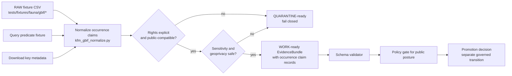

<!-- [KFM_META_BLOCK_V2]
doc_id: kfm://doc/TODO-assign-uuid
title: Fauna GBIF Occurrence Ingestion
type: standard
version: v1
status: draft
owners: TODO-fauna-data-governance-owner
created: 2026-05-01
updated: 2026-05-01
policy_label: TODO-public-or-restricted
related: [docs/domains/fauna/README.md, tools/normalize/fauna/kfm_gbif_normalize.py, tools/validators/fauna/gbif_evidencebundle_validator.py, policy/fauna/gbif_publication.rego, tests/fixtures/fauna/gbif/]
tags: [kfm, fauna, gbif, occurrence, evidencebundle, geoprivacy]
notes: [doc_id owner policy_label and final schema-home convention need repository/steward verification]
[/KFM_META_BLOCK_V2] -->

# Fauna GBIF Occurrence Ingestion

Normalize fixture-backed GBIF occurrence CSV records into governed, WORK/QUARANTINE-ready EvidenceBundle artifacts without asserting species truth or bypassing rights, sensitivity, and geoprivacy gates.


**Status:** implementation slice · **Owners:** `TODO-fauna-data-governance-owner` · **Target path:** `docs/domains/fauna/gbif_occurrence_ingestion.md` **(PROPOSED)**

**Quick jumps:** [Scope](#scope) · [Repo fit](#repo-fit) · [Lifecycle](#lifecycle) · [Field mapping](#field-mapping) · [Rights and sensitivity](#rights-and-sensitivity) · [CLI](#cli) · [Validation](#validation-and-policy-gates) · [Promotion checklist](#promotion-checklist) · [Open verification](#open-verification-backlog)

> [!IMPORTANT]
> This slice normalizes occurrence **claims**. It does not prove species identity, distribution truth, conservation status, habitat suitability, or public-release eligibility. Promotion remains a governed policy transition, not a normalizer side effect.

## Scope

This document governs the GBIF occurrence normalization slice for the KFM fauna lane.

| Item | Status | Boundary |
|---|---:|---|
| Domain | CONFIRMED | `fauna` |
| Slice | CONFIRMED | GBIF occurrence ingestion |
| Input posture | CONFIRMED | RAW fixture CSV records under `tests/fixtures/fauna/gbif/*` |
| Output posture | CONFIRMED | WORK/QUARANTINE-ready EvidenceBundle artifacts |
| Network posture | CONFIRMED | No live GBIF calls in tests |
| Publication posture | CONFIRMED | Public release requires later validation, policy, and promotion gates |
| Schema home | NEEDS VERIFICATION | Final fauna GBIF schema-home convention is not resolved here |

### Accepted inputs

The normalizer accepts only controlled GBIF-style fixture inputs for this slice:

- CSV occurrence fixture records from `tests/fixtures/fauna/gbif/*`.
- A query predicate JSON fixture that records the intended GBIF query context.
- A download key supplied as metadata for provenance and deterministic identity support.
- Darwin Core / GBIF fields listed in [Field mapping](#field-mapping).

### Exclusions

The following do **not** belong in this slice:

| Excluded item | Why | Where it belongs instead |
|---|---|---|
| Live GBIF network calls | Tests are intentionally no-network and fixture-backed. | A later verified connector slice after source terms, rights, quota, and steward review. |
| Public publication | This slice emits WORK/QUARANTINE-ready artifacts only. | Promotion gate and release workflow. |
| Species truth assertions | GBIF records are treated as unreviewed occurrence claims. | Taxonomy/steward review, source-role registry, and evidence review. |
| Exact public sensitive coordinates | Public exact sensitive coordinates are denied. | Restricted internal storage or public-safe generalized derivatives with receipts. |
| Habitat assignment | Occurrence normalization is separate from point-to-raster habitat derivation. | Habitat + fauna derivation slice. |

[Back to top](#fauna-gbif-occurrence-ingestion)

## Repo fit

**Target file path:** `docs/domains/fauna/gbif_occurrence_ingestion.md` **(PROPOSED)**

The mounted repository was not available in this session, so path existence, adjacent README style, CI workflow names, package manager, and schema registry location remain **UNKNOWN**. The path above is inferred from the fauna-domain documentation pattern visible in the KFM corpus, not confirmed from a checked-out repo.

### Upstream and downstream surfaces

| Surface | Role | Status |
|---|---|---:|
| `tests/fixtures/fauna/gbif/valid/simple_occurrences.csv` | RAW input fixture | Request-confirmed path; file existence NEEDS VERIFICATION |
| `tests/fixtures/fauna/gbif/query_predicate.json` | Query context fixture | Request-confirmed path; file existence NEEDS VERIFICATION |
| `tools/normalize/fauna/kfm_gbif_normalize.py` | Normalization CLI | Request-confirmed path; file existence NEEDS VERIFICATION |
| `tools/validators/fauna/gbif_evidencebundle_validator.py` | EvidenceBundle schema validation | Request-confirmed path; file existence NEEDS VERIFICATION |
| `policy/fauna/gbif_publication.rego` | Public-publication policy gate | Request-confirmed path; file existence NEEDS VERIFICATION |
| `docs/adr/ADR-fauna-schema-home.md` | Schema-home decision record | PROPOSED because schema-home convention remains unresolved |

> [!NOTE]
> Request-confirmed means the current implementation slice names the path. It does **not** prove the file exists in the active repository.

[Back to top](#fauna-gbif-occurrence-ingestion)

## Lifecycle

GBIF occurrence normalization occupies the early pipeline. It reads RAW fixture records and emits artifacts ready for WORK or QUARANTINE review. It does not publish.



KFM lifecycle placement:

```text
RAW -> WORK/QUARANTINE -> PROCESSED -> CATALOG/TRIPLET -> PUBLISHED
```

For this slice, the normalizer is responsible only for the `RAW -> WORK/QUARANTINE` edge. Later processing, catalog closure, triplet/catalog publication, public map rendering, and Focus Mode answers must resolve through governed artifacts and policy decisions.

[Back to top](#fauna-gbif-occurrence-ingestion)

## Field mapping

The mapping below is source-grounded from the implementation slice request.

| Darwin Core / GBIF field | KFM field | Notes |
|---|---|---|
| `eventDate` | `occurrenceDate` | Event date is occurrence-time support, not ingest time. |
| `decimalLatitude` + `decimalLongitude` | `geopoint` | Public output may be rounded, generalized, suppressed, or denied by geoprivacy policy. |
| `datasetKey` | `kfm:dataset_key` | Supports dataset-level provenance and source lineage. |
| `basisOfRecord` | `basisOfRecord` | Preserved for source interpretation; not a quality guarantee by itself. |
| `coordinateUncertaintyInMeters` | `geospatialPrecision` | Used in public-safety and precision reasoning. |
| `individualCount` | `abundance` | Treat as occurrence record support; do not overstate population abundance. |

### Minimum interpretation rule

A normalized record is an **unreviewed occurrence claim** with evidence support. It is not a final species determination, public biodiversity fact, population estimate, or habitat conclusion.

[Back to top](#fauna-gbif-occurrence-ingestion)

## Rights and sensitivity

This slice is fail-closed. Unknown rights or unresolved sensitivity prevent public posture.

### License posture

| License posture | Public candidate? | Required behavior |
|---|---:|---|
| `CC0` | Yes | Candidate only after provenance, sensitivity, geoprivacy, and validation gates pass. |
| `CC-BY` | Yes | Candidate only after attribution metadata and all gates pass. |
| `CC-BY-NC` | Restricted by default | Public release denied unless an explicit override flag and review record exist. Exact override flag name is **NEEDS VERIFICATION**. |
| Unknown / missing | No | QUARANTINE / fail closed. |
| Other / malformed | No by default | QUARANTINE until source rights review resolves posture. |

### Geoprivacy posture

| Situation | Public behavior | Receipt expectation |
|---|---|---|
| Non-sensitive record with public-compatible rights | Exact geometry may be eligible | Evidence and rights metadata still required. |
| Sensitive record with exact coordinates | DENY public exact coordinates | Public output must not expose exact point. |
| Public mode serving sensitive or precision-risk record | Round, generalize, aggregate, suppress, or deny | Emit geoprivacy receipt metadata. |
| Aggregate/public summary | Suppress groups below default threshold | Default public aggregate threshold: `n >= 10`. |
| Missing sensitivity or precision context | QUARANTINE / HOLD | Fail closed until resolved. |

> [!CAUTION]
> Public mode coordinate rounding is not a publication waiver. The output still needs rights closure, sensitivity closure, provenance closure, and a geoprivacy receipt.

### Geoprivacy receipt metadata

The slice requires geoprivacy receipt metadata for public-mode transforms. Until the final schema is verified, a receipt should at minimum describe:

| Receipt field | Status | Purpose |
|---|---:|---|
| `transform_class` | PROPOSED | `round`, `generalize`, `aggregate`, `suppress`, or `deny`. |
| `precision_served` | PROPOSED | Public precision actually served. |
| `reason` | PROPOSED | Rights, sensitivity, precision, source policy, or steward rule. |
| `policy_version` | PROPOSED | Version of geoprivacy/publication policy used. |
| `source_record_ref` | PROPOSED | Link back to normalized occurrence claim without exposing restricted fields. |
| `before_hash` / `after_hash` | PROPOSED | Transform integrity support when schema permits. |

[Back to top](#fauna-gbif-occurrence-ingestion)

## EvidenceBundle output obligations

A valid normalized output should be inspectable before any public release decision.

| Obligation | Required posture |
|---|---|
| EvidenceBundle exists | Required before downstream validation or promotion review. |
| `kfm:spec_hash` present | Required and deterministic. |
| Source context present | Include dataset key, query predicate, download key metadata, and fixture/run context where available. |
| Rights posture explicit | Missing or unknown rights force quarantine. |
| Sensitivity posture explicit | Missing or unresolved sensitivity force quarantine or HOLD. |
| Public geometry safe | No exact sensitive coordinates in public outputs. |
| Species truth bounded | Output wording must preserve “unreviewed occurrence claim” posture. |
| Promotion separate | Normalization must not publish or silently promote. |

### Deterministic identity note

`kfm:spec_hash` should be deterministic over stable inputs such as source snapshot/fixture content, query predicate, schema version, transform version, policy version, and selected runtime parameters. It should not depend on row order, temporary file paths, wall-clock execution noise, or incidental logging state.

[Back to top](#fauna-gbif-occurrence-ingestion)

## CLI

The request-confirmed CLI example is:

```bash
python tools/normalize/fauna/kfm_gbif_normalize.py \
  --input tests/fixtures/fauna/gbif/valid/simple_occurrences.csv \
  --query-predicate tests/fixtures/fauna/gbif/query_predicate.json \
  --download-key TEST_DOWNLOAD_KEY \
  --output /tmp/gbif_evidencebundle.json
```

### CLI contract

| Argument | Required? | Meaning |
|---|---:|---|
| `--input` | Yes | RAW fixture CSV path. |
| `--query-predicate` | Yes | Fixture describing the query predicate used to obtain or represent the source slice. |
| `--download-key` | Yes | Download key metadata used for provenance and deterministic identity support. |
| `--output` | Yes | Output EvidenceBundle artifact path. |

> [!IMPORTANT]
> This command is a fixture-backed normalization example. It must not be rewritten into a live GBIF fetch in tests.

[Back to top](#fauna-gbif-occurrence-ingestion)

## Validation and policy gates

| Gate | Path | Responsibility | Failure posture |
|---|---|---|---|
| Schema validator | `tools/validators/fauna/gbif_evidencebundle_validator.py` | Validate EvidenceBundle shape and required fields. | Fail validation; do not promote. |
| Public-publication policy | `policy/fauna/gbif_publication.rego` | Deny unsafe public publication postures. | DENY/HOLD; do not publish. |
| Rights gate | Policy + validator | Allow only explicit public-compatible licenses unless override is reviewed. | QUARANTINE / DENY public. |
| Sensitivity gate | Policy + geoprivacy receipt | Prevent exact sensitive public coordinates. | DENY public exact; require transform or quarantine. |
| Aggregate threshold | Policy | Public aggregate suppression default `n >= 10`. | Suppress or deny insufficient groups. |
| No-network test gate | Test runner | Ensure fixture-backed tests do not call live GBIF. | Fail tests. |

### Expected negative fixtures

The test suite should include negative cases that prove fail-closed behavior:

- missing license -> QUARANTINE
- unknown license -> QUARANTINE
- `CC-BY-NC` without explicit override -> restricted / DENY public
- sensitive taxon with exact public coordinates -> DENY public exact
- missing coordinate uncertainty where precision is required -> HOLD or QUARANTINE
- malformed coordinates -> validation failure
- missing `datasetKey` where provenance closure requires it -> validation failure or HOLD
- public aggregate with `n < 10` -> suppress / DENY public aggregate

[Back to top](#fauna-gbif-occurrence-ingestion)

## No-network testing posture

All tests for this implementation slice use fixture files under:

```text
tests/fixtures/fauna/gbif/*
```

### Test posture matrix

| Test class | Network? | Goal |
|---|---:|---|
| Valid fixture normalization | No | Produce a schema-valid EvidenceBundle from controlled GBIF-style CSV. |
| License fail-closed fixtures | No | Confirm unknown/missing/non-public licenses do not become public candidates. |
| Geoprivacy fixtures | No | Confirm public mode rounds/generalizes/suppresses/denies and emits receipt metadata. |
| Determinism fixtures | No | Confirm repeated runs produce stable `kfm:spec_hash`. |
| Policy denial fixtures | No | Confirm unsafe public postures are denied. |
| CLI smoke test | No | Confirm the request-confirmed command writes an output bundle. |

[Back to top](#fauna-gbif-occurrence-ingestion)

## Promotion checklist

A GBIF occurrence EvidenceBundle may be considered for later promotion only when all applicable checks pass.

- [ ] EvidenceBundle artifact is present.
- [ ] EvidenceBundle validates against the accepted schema.
- [ ] `kfm:spec_hash` is present and deterministic.
- [ ] Rights posture is explicit.
- [ ] Unknown/missing license records are quarantined or denied public release.
- [ ] `CC-BY-NC` records remain restricted unless explicit override and review are present.
- [ ] Sensitivity posture is explicit.
- [ ] No exact sensitive coordinates appear in public outputs.
- [ ] Public mode coordinate rounding/generalization/suppression emits geoprivacy receipt metadata.
- [ ] Public aggregate output respects default suppression threshold `n >= 10`.
- [ ] Species truth is not asserted; occurrence records remain labeled as unreviewed occurrence claims.
- [ ] Promotion is performed by a governed policy transition, not by moving or writing a file into a public directory.

[Back to top](#fauna-gbif-occurrence-ingestion)

## Maintainer review notes

### What this slice should prove

This slice should prove that a GBIF-style occurrence fixture can be normalized into an inspectable, schema-valid, rights-aware, sensitivity-aware EvidenceBundle without any live source dependency.

### What this slice should not prove

This slice should not try to prove full fauna ingestion, live GBIF connector readiness, public publication, map tile readiness, habitat joins, taxonomy authority, or Focus Mode runtime behavior.

### Neighboring docs that should link here

| Suggested neighbor | Status | Link purpose |
|---|---:|---|
| `docs/domains/fauna/README.md` | PROPOSED / NEEDS VERIFICATION | Fauna lane landing page should point to this implementation slice. |
| `docs/adr/ADR-fauna-schema-home.md` | PROPOSED | Resolve final schema-home convention. |
| `docs/runbooks/fauna/gbif_occurrence_ingestion.md` | PROPOSED | Operational runbook if normalizer becomes a recurring job. |
| `tests/fixtures/fauna/gbif/README.md` | PROPOSED | Fixture contract and no-network testing rules. |

[Back to top](#fauna-gbif-occurrence-ingestion)

## Open verification backlog

| Item | Status | Why it matters |
|---|---:|---|
| Final schema-home convention for fauna GBIF schemas | NEEDS VERIFICATION | Prevents duplicate authority between `contracts/`, `schemas/`, and `schemas/contracts/v1/`. |
| Actual repo path for this document | UNKNOWN | No mounted repository was available to confirm local docs layout. |
| Owners / steward group | UNKNOWN | Needed for Meta Block and review routing. |
| `doc_id` UUID | UNKNOWN | Must be assigned by the repo/document registry. |
| `policy_label` | UNKNOWN | Document visibility classification needs steward confirmation. |
| Exact EvidenceBundle schema fields | NEEDS VERIFICATION | This doc preserves obligations but does not invent final schema. |
| Override flag name for `CC-BY-NC` | NEEDS VERIFICATION | Request confirms an explicit override flag exists conceptually, not its final CLI/API name. |
| Public coordinate rounding precision | NEEDS VERIFICATION | Public mode requires rounding, but exact precision policy must be verified. |
| Sensitivity authority and steward rules | NEEDS VERIFICATION | Protected species/public geoprivacy rules need official steward review. |
| OPA/Rego execution command | UNKNOWN | Policy file is named, but CI/tooling command is not verified. |
| Fixture inventory | UNKNOWN | Requested fixture paths are known; actual files were not visible in a mounted repo. |

[Back to top](#fauna-gbif-occurrence-ingestion)
