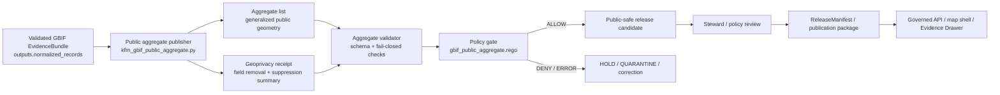

<!-- [KFM_META_BLOCK_V2]
doc_id: kfm://doc/fauna/gbif-public-aggregates
title: GBIF Public Aggregates
type: standard
version: v1
status: draft
owners: fauna-platform
created: TODO-YYYY-MM-DD
updated: 2026-05-07
policy_label: TODO-public-or-restricted
related: [docs/domains/fauna/README.md, docs/domains/fauna/GEOPRIVACY.md, docs/domains/fauna/SOURCE_ROLES.md, docs/domains/fauna/sources/gbif/GBIF_OCCURRENCE_INGESTION.md, docs/domains/fauna/sources/gbif/GBIF_PUBLICATION_OPERATIONS.md, schemas/fauna/gbif_public_aggregate.schema.json, schemas/receipts/geoprivacy_receipt.schema.json, policy/fauna/gbif_public_aggregate.rego, tools/publishers/fauna/kfm_gbif_public_aggregate.py, tools/validators/fauna/gbif_public_aggregate_validator.py, tests/fauna/test_gbif_public_aggregate.py, tests/fauna/test_gbif_public_aggregate_validator.py, tests/policy/fauna/gbif_public_aggregate_test.rego]
tags: [kfm, fauna, gbif, public-aggregate, geoprivacy, evidencebundle, release-gate]
notes: [Existing doc_id and owner are preserved from the prior file; created date and policy_label require document-registry or steward verification; updated date reflects this generated draft and should be reconciled with commit metadata before publication.]
[/KFM_META_BLOCK_V2] -->

<a id="top"></a>

# GBIF Public Aggregates

Define how KFM builds, validates, and prepares **GBIF-derived public-safe occurrence aggregates** from validated EvidenceBundles without exposing exact coordinates or overclaiming species presence.

<p>
  
  
  
  
  
  =10" src="https://img.shields.io/badge/public_aggregate_n-%3E%3D10-purple">
</p>

> [!IMPORTANT]
> GBIF public aggregates are **public-safe occurrence-evidence derivatives**. They are not legal-status authority, not steward-reviewed population proof, not habitat proof, and not permission to expose precise occurrence records. Public use still requires evidence closure, geoprivacy receipt linkage, policy approval, review posture, release state, and rollback/correction readiness.

**Target path:** `docs/domains/fauna/sources/gbif/GBIF_PUBLIC_AGGREGATES.md`  
**Lifecycle placement:** `PROCESSED -> public-safe aggregate candidate -> validation/policy/review -> PUBLISHED only through governed promotion`  
**Quick jumps:** [Scope](#scope) · [Repo fit](#repo-fit) · [Lifecycle](#lifecycle) · [Accepted inputs](#accepted-inputs) · [Exclusions](#exclusions) · [Aggregate contract](#aggregate-contract) · [Geoprivacy rules](#geoprivacy-transform-rules) · [CLI](#cli) · [Validation gates](#validation-and-policy-gates) · [Public wording](#public-wording-and-map-behavior) · [Promotion checklist](#promotion-checklist) · [Open verification](#open-verification-backlog)

---

## Scope

This document governs the **publication-candidate aggregate step** for GBIF-derived fauna occurrence evidence.

| Item | Status | Boundary |
|---|---:|---|
| Domain | CONFIRMED | `fauna` |
| Source family | CONFIRMED | GBIF-derived occurrence evidence |
| Output type | CONFIRMED | Public-safe aggregate objects plus geoprivacy receipt |
| Source posture | CONFIRMED | Aggregator/occurrence evidence; not legal or stewardship authority |
| Public geometry posture | CONFIRMED | `geometry_role=generalized_public_area` |
| Suppression posture | CONFIRMED | Suppress public groups where `observation_count < 10` |
| Promotion posture | CONFIRMED | Aggregate generation does not equal publication |
| Schema-home posture | NEEDS VERIFICATION | Active file uses `schemas/fauna/`; long-term KFM doctrine may prefer `schemas/contracts/v1/domains/fauna/` after ADR |

### What this file is

A maintainer-facing control document for:

- generating fixture-backed public aggregate candidates from a validated GBIF EvidenceBundle;
- removing exact public coordinates from derived output;
- emitting a geoprivacy receipt for the public transform;
- validating aggregate and receipt shape;
- enforcing fail-closed public policy gates;
- preserving the limitation that aggregates are observational signals, not confirmed species-presence claims.

### What this file is not

This file is not:

- a live GBIF connector guide;
- a public-release approval;
- a legal-status authority note;
- a stewardship review decision;
- a population estimate contract;
- a habitat suitability contract;
- a replacement for GBIF occurrence ingestion or GBIF publication operations.

<p align="right"><a href="#top">Back to top ↑</a></p>

---

## Repo fit

This file sits inside the fauna GBIF source documentation lane and is downstream of occurrence normalization but upstream of publication packaging.

```text
docs/domains/fauna/sources/gbif/
├── GBIF_OCCURRENCE_INGESTION.md
├── GBIF_PUBLIC_AGGREGATES.md
└── GBIF_PUBLICATION_OPERATIONS.md
```

### Neighboring surfaces

| Surface | Relative link | Role |
|---|---|---|
| Fauna lane overview | [../../README.md](../../README.md) | Domain scope, public-safety posture, and lane-level orientation |
| Fauna geoprivacy | [../../GEOPRIVACY.md](../../GEOPRIVACY.md) | Public geometry rules, redaction receipts, sensitive-location controls |
| Fauna source roles | [../../SOURCE_ROLES.md](../../SOURCE_ROLES.md) | Aggregator/source-role compatibility rules |
| GBIF occurrence ingestion | [./GBIF_OCCURRENCE_INGESTION.md](./GBIF_OCCURRENCE_INGESTION.md) | Upstream EvidenceBundle production |
| GBIF publication operations | [./GBIF_PUBLICATION_OPERATIONS.md](./GBIF_PUBLICATION_OPERATIONS.md) | Downstream runtime/UI/package/audit chain |
| Aggregate schema | [../../../../../schemas/fauna/gbif_public_aggregate.schema.json](../../../../../schemas/fauna/gbif_public_aggregate.schema.json) | Machine-checkable aggregate shape |
| Geoprivacy receipt schema | [../../../../../schemas/receipts/geoprivacy_receipt.schema.json](../../../../../schemas/receipts/geoprivacy_receipt.schema.json) | Machine-checkable receipt shape |
| Aggregate publisher | [../../../../../tools/publishers/fauna/kfm_gbif_public_aggregate.py](../../../../../tools/publishers/fauna/kfm_gbif_public_aggregate.py) | Fixture-backed aggregate builder |
| Aggregate validator | [../../../../../tools/validators/fauna/gbif_public_aggregate_validator.py](../../../../../tools/validators/fauna/gbif_public_aggregate_validator.py) | Schema and public-safety validator |
| Public aggregate policy | [../../../../../policy/fauna/gbif_public_aggregate.rego](../../../../../policy/fauna/gbif_public_aggregate.rego) | Policy-as-code gate |
| Aggregate tests | [../../../../../tests/fauna/test_gbif_public_aggregate.py](../../../../../tests/fauna/test_gbif_public_aggregate.py) | Publisher behavior tests |
| Validator tests | [../../../../../tests/fauna/test_gbif_public_aggregate_validator.py](../../../../../tests/fauna/test_gbif_public_aggregate_validator.py) | Validator negative-path tests |
| Policy tests | [../../../../../tests/policy/fauna/gbif_public_aggregate_test.rego](../../../../../tests/policy/fauna/gbif_public_aggregate_test.rego) | Rego allow/deny tests |

> [!NOTE]
> The active implementation currently uses `schemas/fauna/gbif_public_aggregate.schema.json`. KFM doctrine also records an unresolved schema-home convention between direct lane schemas and `schemas/contracts/v1/...`. Do not create a second competing schema home for this aggregate without an ADR or migration note.

<p align="right"><a href="#top">Back to top ↑</a></p>

---

## Lifecycle

Public aggregates are downstream of normalized GBIF occurrence evidence and upstream of release. They are public-safe candidates, not automatic published truth.



KFM lifecycle posture:

```text
RAW -> WORK / QUARANTINE -> PROCESSED -> CATALOG / TRIPLET -> PUBLISHED
```

For this document:

| Step | Responsibility |
|---|---|
| Input | Read an already-normalized GBIF EvidenceBundle. |
| Transform | Aggregate occurrence records by taxon and requested public support unit. |
| Geoprivacy | Remove exact coordinate fields from public output and generalize geometry. |
| Suppression | Suppress groups with `observation_count < 10`. |
| Validation | Validate aggregate and receipt shape; fail closed on unsafe public posture. |
| Policy | Deny exact coordinate leakage, missing evidence refs, missing receipts, insufficient count, restricted rights, restricted sensitivity, or wrong geometry role. |
| Promotion | Separate governed release action; not performed by the publisher. |

<p align="right"><a href="#top">Back to top ↑</a></p>

---

## Accepted inputs

The aggregate publisher should only receive evidence that has already passed the upstream normalization and EvidenceBundle checks.

| Input | Required posture | Notes |
|---|---|---|
| GBIF EvidenceBundle JSON | Required | Must include `evidence_bundle_id`, `download_key`, `query_predicate`, and `outputs.normalized_records`. |
| Normalized records | Required | Expected under `outputs.normalized_records`. |
| Aggregation unit | Required | One of `county`, `huc12`, or `grid`. |
| Suppression threshold | Required / defaulted | Default threshold is `10`. |
| Rights posture | Required | Determines whether aggregate can become `public_allowed`, `restricted`, or `quarantine`. |
| Sensitivity posture | Required | Restricted sensitivity blocks public aggregate promotion. |
| Output path | Required | Aggregate JSON list. |
| Receipt output path | Required | Geoprivacy receipt JSON. |

### Expected source context carried forward

A generated aggregate must preserve enough provenance for downstream inspection:

- source system: `GBIF`;
- source EvidenceBundle reference;
- GBIF download key;
- query predicate hash;
- taxon key and scientific name;
- date range;
- record/observation count;
- public geometry class;
- rights posture;
- sensitivity posture;
- geoprivacy receipt reference;
- `kfm:spec_hash`;
- limitations.

<p align="right"><a href="#top">Back to top ↑</a></p>

---

## Exclusions

The following must not be introduced into GBIF public aggregates.

| Excluded item | Failure posture | Correct handling |
|---|---|---|
| `decimalLatitude` / `decimalLongitude` | DENY | Keep exact coordinates in restricted upstream evidence only; public aggregate uses generalized geometry. |
| Source-native point geometry | DENY | Replace with approved public support geometry. |
| Sensitive exact geometry | DENY | Generalize, suppress, delay, or hold for steward review. |
| Raw GBIF rows | DENY public output | Public aggregate must be derived from validated EvidenceBundle records. |
| Unknown or restricted rights promoted as public | DENY | Quarantine or hold until rights posture is resolved. |
| Aggregates with `observation_count < 10` | SUPPRESS / DENY public aggregate | Preserve suppression count in receipt. |
| Legal-status claims | DENY as unsupported by this source role | Use legal-status authority sources. |
| Habitat or population claims | ABSTAIN / DENY | Use habitat/model/steward-reviewed evidence with compatible support. |
| AI-generated occurrence certainty | ABSTAIN / DENY | Focus Mode may summarize only released, cited, policy-safe evidence. |
| Silent overwrite after correction | ERROR | Emit correction, withdrawal, rollback, or supersession records. |

<p align="right"><a href="#top">Back to top ↑</a></p>

---

## Aggregate contract

The active aggregate schema requires these field families.

| Field | Required | Public meaning |
|---|---:|---|
| `aggregate_id` | Yes | Stable aggregate identifier. |
| `source_system` | Yes | Must be `GBIF`. |
| `source_evidence_bundle_id` | Yes | EvidenceBundle support reference. |
| `download_key` | Yes | GBIF download/provenance key carried from upstream bundle. |
| `query_predicate_hash` | Yes | Hash of the query predicate used to define the source slice. |
| `aggregation_unit` | Yes | `county`, `huc12`, or `grid`. |
| `taxon_key` | Yes | Taxon key as carried through the normalized records. |
| `scientific_name` | Yes | Scientific name for the aggregate group. |
| `observation_count` | Yes | Count used for suppression and public support. |
| `record_count` | Yes | Count of records in aggregate group. |
| `date_range.start` / `date_range.end` | Yes | Public temporal support window. |
| `geometry` | Yes | Generalized public Polygon or MultiPolygon. |
| `geometry_role` | Yes | Must be `generalized_public_area`. |
| `kfm:spec_hash` | Yes | Deterministic integrity/specification hash. |
| `rights_posture` | Yes | `public_allowed`, `restricted`, or `quarantine`. |
| `sensitivity_posture` | Yes | `public_generalized` or `restricted`. |
| `geoprivacy_receipt_ref` | Yes | Receipt reference for the transform. |
| `limitations` | Yes | Required caveat and interpretation notes. |

### Minimum valid public interpretation

A valid aggregate supports this kind of public statement:

> “GBIF-derived occurrence evidence has been aggregated for this public support area after geoprivacy transformation.”

It does **not** support this kind of public statement by itself:

> “This species is confirmed present at this exact location.”

<p align="right"><a href="#top">Back to top ↑</a></p>

---

## Geoprivacy transform rules

The aggregate transform must preserve public utility while preventing exact-coordinate exposure.

| Rule | Required behavior |
|---|---|
| Exact coordinate removal | Remove `decimalLatitude` and `decimalLongitude` from public aggregate outputs. |
| Public geometry role | Use `geometry_role=generalized_public_area`. |
| Receipt emission | Emit one geoprivacy receipt per aggregate run. |
| Suppression accounting | Record suppressed group count in the receipt. |
| Transform name | Use `kfm_gbif_public_aggregate` or a versioned successor. |
| Removed fields | Receipt should record coordinate fields removed from public outputs. |
| Reviewer flag | Receipt should preserve whether reviewer action is required. |
| Deterministic hash | Aggregate and receipt should carry `kfm:spec_hash` where schema supports it. |

### Receipt obligations

The receipt should make the public transform inspectable.

| Receipt field family | Purpose |
|---|---|
| `receipt_id` | Stable receipt identity. |
| `source_evidence_bundle_id` | Links receipt to upstream evidence. |
| `transform_name` / `transform_version` | Names the public transform. |
| `input_record_count` | Records source evidence volume. |
| `output_aggregate_count` | Records public aggregate volume. |
| `suppressed_count` | Records under-threshold groups. |
| `suppression_threshold` | Records the threshold used. |
| `removed_fields` | Records fields removed from public output. |
| `generalized_geometry` | Confirms geometry is generalized. |
| `reviewer_required` | Signals review burden. |
| `created_at` | Records receipt creation time. |
| `kfm:spec_hash` | Provides deterministic integrity support where implemented. |

> [!CAUTION]
> Generalized geometry is still a governed public output. It requires evidence support, policy permission, review/release state, and rollback/correction readiness.

<p align="right"><a href="#top">Back to top ↑</a></p>

---

## Suppression and rights rules

The aggregate step must fail closed when public-safety conditions are not satisfied.

| Condition | Required result |
|---|---|
| `observation_count < 10` | Suppress from public aggregate output. |
| `rights_posture != public_allowed` | Deny public aggregate promotion. |
| `sensitivity_posture == restricted` | Deny public aggregate promotion. |
| Missing `source_evidence_bundle_id` | Deny. |
| Missing `download_key` | Deny. |
| Missing `kfm:spec_hash` | Deny. |
| Missing `geoprivacy_receipt_ref` | Deny. |
| Exact coordinate field present | Deny. |
| `geometry_role != generalized_public_area` | Deny. |

### Rights posture note

The upstream bundle may map source rights into aggregate-level `rights_posture`. Public aggregates must not use loose or unknown rights as public permission. If rights are unresolved, the aggregate stays restricted, quarantined, or blocked from public promotion.

<p align="right"><a href="#top">Back to top ↑</a></p>

---

## CLI

### Build public aggregates

```bash
python tools/publishers/fauna/kfm_gbif_public_aggregate.py \
  --input tests/fixtures/fauna/gbif/valid/evidencebundle.json \
  --aggregation-unit county \
  --suppression-threshold 10 \
  --output /tmp/gbif_public_aggregates.json \
  --receipt-output /tmp/gbif_geoprivacy_receipt.json
```

### Validate aggregate and receipt

```bash
python tools/validators/fauna/gbif_public_aggregate_validator.py \
  --aggregate /tmp/gbif_public_aggregates.json \
  --receipt /tmp/gbif_geoprivacy_receipt.json
```

### Policy gate

Use the repo-native policy runner for:

```text
policy/fauna/gbif_public_aggregate.rego
tests/policy/fauna/gbif_public_aggregate_test.rego
```

> [!NOTE]
> Exact policy command names are repo/toolchain dependent. Do not hard-code a CI claim here unless the workflow command has been verified in the active branch.

<p align="right"><a href="#top">Back to top ↑</a></p>

---

## Validation and policy gates

| Gate | Confirmed file | What it proves | Fail-closed result |
|---|---|---|---|
| Schema validation | `schemas/fauna/gbif_public_aggregate.schema.json` | Aggregate shape and required field families. | DENY / validation failure |
| Receipt validation | `schemas/receipts/geoprivacy_receipt.schema.json` | Receipt shape where supplied to validator. | DENY / validation failure |
| Aggregate validator | `tools/validators/fauna/gbif_public_aggregate_validator.py` | Rejects coordinate leaks, low counts, restricted rights/sensitivity, missing refs, missing receipt. | DENY |
| Policy gate | `policy/fauna/gbif_public_aggregate.rego` | Denies unsafe public aggregate posture. | DENY |
| Publisher test | `tests/fauna/test_gbif_public_aggregate.py` | Valid aggregate/receipt emission, sparse suppression, stable hash behavior. | Test failure |
| Validator test | `tests/fauna/test_gbif_public_aggregate_validator.py` | Coordinate leak, missing receipt, restricted rights/sensitivity, and missing refs fail. | Test failure |
| Policy test | `tests/policy/fauna/gbif_public_aggregate_test.rego` | Base allowed; exact coordinates, missing refs, and low count denied. | Test failure |
| Promotion review | Release process | Confirms aggregate may become public only through governed release state. | HOLD / DENY |

### Minimum negative-path coverage

- [ ] exact coordinate fields present -> DENY;
- [ ] missing EvidenceBundle reference -> DENY;
- [ ] missing download key -> DENY;
- [ ] missing `kfm:spec_hash` -> DENY;
- [ ] missing geoprivacy receipt reference -> DENY;
- [ ] `observation_count < 10` -> suppress / DENY;
- [ ] restricted rights -> DENY;
- [ ] restricted sensitivity -> DENY;
- [ ] wrong `geometry_role` -> DENY;
- [ ] public wording claims confirmed presence -> DENY or require correction.

<p align="right"><a href="#top">Back to top ↑</a></p>

---

## Public wording and map behavior

### Allowed public framing

Use wording that keeps the source role and support level visible.

| Allowed pattern | Example |
|---|---|
| Evidence-bound | “GBIF-derived occurrence evidence is available for this generalized area.” |
| Aggregate-bound | “This public aggregate summarizes reported occurrence records after geoprivacy transformation.” |
| Scope-bound | “The support applies to the displayed aggregate area, not to a precise source occurrence point.” |
| Caveat-visible | “Occurrence aggregates are observational signals and require review before interpretation as species presence.” |

### Forbidden public framing

Avoid wording that turns an aggregate into stronger proof.

| Forbidden pattern | Why blocked |
|---|---|
| “Confirmed present at this location” | Implies exact and reviewed occurrence truth. |
| “Known population exists here” | Implies population proof. |
| “Exact location” | Contradicts public geoprivacy transform. |
| “Legal status proven by GBIF” | Uses an occurrence aggregator as legal authority. |
| “Habitat confirmed by aggregate” | Collapses occurrence evidence and habitat context. |

### Map shell rule

A public map layer may render generalized support areas, counts, caveats, and Evidence Drawer links. It must not expose exact source occurrence coordinates through feature properties, hidden metadata, vector tile attributes, popups, export payloads, screenshots, or Focus Mode context.

<p align="right"><a href="#top">Back to top ↑</a></p>

---

## Promotion checklist

Before any GBIF public aggregate is promoted, maintainers should confirm:

- [ ] Aggregate artifact exists and is a JSON list.
- [ ] Aggregate validates against the active aggregate schema.
- [ ] Geoprivacy receipt exists and validates against the active receipt schema.
- [ ] Every public aggregate has `source_evidence_bundle_id`.
- [ ] Every public aggregate has `download_key`.
- [ ] Every public aggregate has `query_predicate_hash`.
- [ ] Every public aggregate has `kfm:spec_hash`.
- [ ] `geometry_role` is `generalized_public_area`.
- [ ] No exact coordinate fields appear in public aggregate output.
- [ ] `rights_posture` is `public_allowed`.
- [ ] `sensitivity_posture` is not `restricted`.
- [ ] `observation_count >= 10`.
- [ ] Suppressed group count is recorded in the receipt.
- [ ] Limitations state that aggregates are observational signals, not confirmed species presence.
- [ ] Public language avoids legal-status, population, exact-location, and habitat-proof overclaims.
- [ ] Policy test suite passes in the active repo/toolchain.
- [ ] Release review, ReleaseManifest, audit trail, correction path, and rollback target are ready.
- [ ] Downstream publication operations can package, audit, replay, correct, or withdraw the output.

<p align="right"><a href="#top">Back to top ↑</a></p>

---

## Rollback and correction notes

A public aggregate can become unsafe after release if evidence changes, rights change, sensitivity posture changes, source corrections arrive, a coordinate leak is detected, a policy test changes, or public wording overclaims support.

Rollback and correction should preserve lineage.

| Scenario | Required action |
|---|---|
| Exact coordinate leak | Withdraw affected output, invalidate caches, issue withdrawal/correction receipt, restore prior safe release or empty public state. |
| Rights posture changes | Re-run policy; withdraw or restrict affected aggregates if public use is no longer supported. |
| Sensitivity posture changes | Suppress, generalize further, delay, or withdraw affected aggregates. |
| Suppression threshold changes | Rebuild aggregates, emit new receipt, supersede prior release with visible correction. |
| EvidenceBundle no longer resolves | ABSTAIN or withdraw affected public answer until evidence closure is restored. |
| Public wording overclaims presence | Issue correction receipt and update runtime/UI wording. |
| Schema/policy drift | Hold promotion until aggregate, receipt, policy, and tests are reconciled. |

Rollback is not deletion. It is a governed state transition with an auditable reason, prior target, replacement target, and public consequence.

<p align="right"><a href="#top">Back to top ↑</a></p>

---

## Open verification backlog

| Item | Status | Why it remains open |
|---|---:|---|
| `created` date | NEEDS VERIFICATION | Prior file did not carry a created date. Document registry or commit history should supply it. |
| `policy_label` | NEEDS VERIFICATION | This draft likely can be public, but the correct repo policy label has not been confirmed here. |
| Schema-home convention | NEEDS VERIFICATION | Active files use `schemas/fauna/`; KFM doctrine also points toward `schemas/contracts/v1/domains/fauna/` after ADR. |
| Receipt schema centralization | NEEDS VERIFICATION | Existing validator loads `schemas/receipts/geoprivacy_receipt.schema.json`; confirm long-term receipt home. |
| Catalog linkage fields | NEEDS VERIFICATION | Existing aggregate schema permits additional properties; final catalog/release linkage requirements may need explicit fields. |
| GBIF attribution and DOI handling | NEEDS VERIFICATION | Publication packages may need stronger DOI/download/dataset attribution fields. |
| Public geometry support unit | NEEDS VERIFICATION | Current aggregate supports `county`, `huc12`, and `grid`; each unit needs review-specific geometry and scale rules. |
| Production release state | UNKNOWN | This document describes candidate promotion rules but does not confirm a production release. |
| CI command names | UNKNOWN | Test files exist, but exact workflow command names should be verified before adding badges that claim enforcement. |
| Steward review role | NEEDS VERIFICATION | Owner field preserves `fauna-platform`; reviewer/approver roles should be confirmed in control-plane or CODEOWNERS evidence. |

<p align="right"><a href="#top">Back to top ↑</a></p>

---

## Appendix

<details>
<summary>Illustrative aggregate shape</summary>

```json
{
  "aggregate_id": "gbif-agg-test_download_key-12345",
  "source_system": "GBIF",
  "source_evidence_bundle_id": "gbif-evidencebundle-example",
  "download_key": "TEST_DOWNLOAD_KEY",
  "query_predicate_hash": "sha256:aaaaaaaaaaaaaaaaaaaaaaaaaaaaaaaaaaaaaaaaaaaaaaaaaaaaaaaaaaaaaaaa",
  "aggregation_unit": "county",
  "taxon_key": "12345",
  "scientific_name": "Example species",
  "observation_count": 10,
  "record_count": 10,
  "date_range": {
    "start": "2020-01-01",
    "end": "2020-12-31"
  },
  "geometry": {
    "type": "Polygon",
    "coordinates": []
  },
  "geometry_role": "generalized_public_area",
  "kfm:spec_hash": "sha256:bbbbbbbbbbbbbbbbbbbbbbbbbbbbbbbbbbbbbbbbbbbbbbbbbbbbbbbbbbbbbbbb",
  "rights_posture": "public_allowed",
  "sensitivity_posture": "public_generalized",
  "geoprivacy_receipt_ref": "geoprivacy-test_download_key",
  "limitations": [
    "GBIF occurrence aggregates are observational signals, not confirmed species presence without review posture."
  ]
}
```

</details>

<details>
<summary>Illustrative geoprivacy receipt shape</summary>

```json
{
  "receipt_id": "geoprivacy-test_download_key",
  "source_evidence_bundle_id": "gbif-evidencebundle-example",
  "transform_name": "kfm_gbif_public_aggregate",
  "transform_version": "v1",
  "input_record_count": 25,
  "output_aggregate_count": 1,
  "suppressed_count": 2,
  "suppression_threshold": 10,
  "removed_fields": [
    "decimalLatitude",
    "decimalLongitude"
  ],
  "generalized_geometry": true,
  "reviewer_required": true,
  "created_at": "2026-05-07T00:00:00Z",
  "kfm:spec_hash": "sha256:cccccccccccccccccccccccccccccccccccccccccccccccccccccccccccccccc"
}
```

</details>

<details>
<summary>Maintainer update triggers</summary>

Update this document when any of the following changes:

- aggregate schema required fields;
- receipt schema required fields;
- `aggregation_unit` enum;
- suppression threshold policy;
- rights posture vocabulary;
- sensitivity posture vocabulary;
- geoprivacy geometry role;
- publisher CLI arguments;
- validator CLI arguments;
- policy deny rules;
- fixture paths;
- release/correction/rollback packaging rules;
- GBIF citation, download, dataset-key, or derived-dataset requirements;
- schema-home ADR or migration note.

</details>

<p align="right"><a href="#top">Back to top ↑</a></p>
