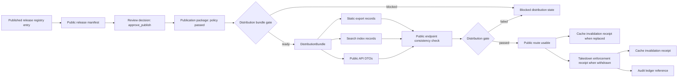

<!-- [KFM_META_BLOCK_V2]
doc_id: kfm://doc/TODO-register-gbif-public-distribution-search-monitoring
title: GBIF Public Distribution, Search, and Monitoring
type: standard
version: v1
status: draft
owners: TODO(fauna-domain-stewards)
created: TODO(verify-original-created-date)
updated: 2026-05-07
policy_label: TODO(verify-public-or-restricted)
related: [
  "../../README.md",
  "../README.md",
  "README.md",
  "../../../../../tools/distribution/fauna/kfm_gbif_distribution_bundle.py",
  "../../../../../tools/distribution/fauna/kfm_gbif_static_export.py",
  "../../../../../tools/search/fauna/kfm_gbif_search_index.py",
  "../../../../../tools/api/fauna/kfm_gbif_public_api_dto.py",
  "../../../../../tools/monitoring/fauna/kfm_gbif_public_endpoint_check.py",
  "../../../../../tools/cache/fauna/kfm_gbif_cache_invalidation.py",
  "../../../../../tools/takedown/fauna/kfm_gbif_takedown_enforce.py",
  "../../../../../tools/ci/fauna/kfm_gbif_distribution_gate.py",
  "../../../../../tools/validators/fauna/gbif_distribution_validator.py",
  "../../../../../policy/fauna/gbif_distribution.rego",
  "../../../../../tests/fauna/test_gbif_distribution_layer.py",
  "../../../../../tests/fauna/test_gbif_distribution_validator.py",
  "../../../../../tests/policy/fauna/gbif_distribution_test.rego"
]
tags: [kfm, fauna, gbif, public-distribution, search, monitoring, geoprivacy, takedown, evidence]
notes: [
  "This file governs fixture-backed public distribution of approved GBIF-derived fauna occurrence aggregates.",
  "doc_id, owners, created date, and policy_label require repository control-plane verification.",
  "GBIF occurrence evidence is treated as reported occurrence support, not confirmed presence or legal-status authority.",
  "Live GBIF source activation, API route registration, search-index registration, and production endpoint monitoring remain NEEDS VERIFICATION."
]
[/KFM_META_BLOCK_V2] -->

# GBIF Public Distribution, Search, and Monitoring

Governed operating note for promoting approved GBIF-derived fauna occurrence aggregates into public search records, static exports, public API DTOs, route checks, cache invalidation receipts, and takedown enforcement without exposing exact sensitive occurrence data.

<a id="top"></a>

<p>
  
  
  
  
  
  
  
</p>

> [!IMPORTANT]
> **Status:** experimental / fixture-backed  
> **Owners:** TODO(fauna-domain-stewards)  
> **Primary safety rule:** GBIF-mediated occurrence aggregates may support public discovery only after release, citation, rights, sensitivity, geoprivacy, review, cache, and takedown controls pass.  
> **Quick jumps:** [Scope](#scope) · [Repo fit](#repo-fit) · [Inputs](#inputs) · [Exclusions](#exclusions) · [Distribution flow](#distribution-flow) · [Tooling map](#tooling-map) · [Validators and policy](#validators-and-policy) · [Monitoring and takedown](#monitoring-and-takedown) · [Quickstart](#quickstart) · [Checklist](#pre-publish-checklist)

---

## Scope

This document defines the **public distribution layer** for GBIF-derived fauna occurrence aggregates inside Kansas Frontier Matrix.

It covers the handoff from an already-governed GBIF release package into:

- a `DistributionBundle`;
- public-safe static export records;
- search index records;
- public API DTOs;
- public endpoint consistency checks;
- cache invalidation receipts;
- distribution gate results;
- takedown enforcement receipts.

It does **not** define live GBIF ingestion, raw GBIF source capture, taxonomic normalization, occurrence normalization, rare-species sensitivity policy, or source-rights review. Those remain upstream responsibilities.

### KFM posture

GBIF data is valuable occurrence evidence, but in KFM it must remain bounded:

| Claim type | KFM posture |
|---|---|
| “GBIF has reported occurrence evidence for this taxon and public geography.” | Allowed only with citation, release, public-safe geometry, and limitations. |
| “This species is confirmed present here.” | Denied by this distribution lane. |
| “This species has legal status in Kansas.” | Requires the proper legal/status authority, not GBIF alone. |
| “Exact coordinates may be public.” | Denied unless a separate, reviewed policy class explicitly allows it. |
| “Public search/API output can reuse raw GBIF coordinate fields.” | Denied. |

The required public-facing presence posture is:

```text
reported_occurrence_not_confirmed_presence
```

[Back to top](#top)

---

## Repo fit

| Item | Status | Path / relationship |
|---|---:|---|
| Target document | CONFIRMED | `docs/domains/fauna/sources/gbif/GBIF_PUBLIC_DISTRIBUTION_SEARCH_MONITORING.md` |
| Domain README | CONFIRMED | `docs/domains/fauna/README.md` |
| Parent source README | CONFIRMED but thin | `docs/domains/fauna/sources/README.md` |
| GBIF source README | CONFIRMED but blank/thin | `docs/domains/fauna/sources/gbif/README.md` |
| Distribution bundle tool | CONFIRMED | `tools/distribution/fauna/kfm_gbif_distribution_bundle.py` |
| Static export tool | CONFIRMED | `tools/distribution/fauna/kfm_gbif_static_export.py` |
| Search index tool | CONFIRMED | `tools/search/fauna/kfm_gbif_search_index.py` |
| Public API DTO tool | CONFIRMED | `tools/api/fauna/kfm_gbif_public_api_dto.py` |
| Endpoint check tool | CONFIRMED | `tools/monitoring/fauna/kfm_gbif_public_endpoint_check.py` |
| Cache invalidation tool | CONFIRMED | `tools/cache/fauna/kfm_gbif_cache_invalidation.py` |
| Takedown tool | CONFIRMED | `tools/takedown/fauna/kfm_gbif_takedown_enforce.py` |
| Distribution gate tool | CONFIRMED | `tools/ci/fauna/kfm_gbif_distribution_gate.py` |
| Validator | CONFIRMED | `tools/validators/fauna/gbif_distribution_validator.py` |
| Rego policy | CONFIRMED | `policy/fauna/gbif_distribution.rego` |
| E2E test | CONFIRMED | `tests/fauna/test_gbif_distribution_layer.py` |
| Validator test | CONFIRMED | `tests/fauna/test_gbif_distribution_validator.py` |
| Policy test | CONFIRMED | `tests/policy/fauna/gbif_distribution_test.rego` |
| Schema home | NEEDS VERIFICATION | Existing doc references schema families, but canonical schema placement must be verified before claiming enforcement. |
| Production API route registration | NEEDS VERIFICATION | The fixture DTO uses `/api/fauna/gbif/occurrence-aggregates`; production router source-of-truth still needs verification. |
| Production search index | NEEDS VERIFICATION | Fixture index name is `fauna_public_gbif_occurrence_aggregates`; production search backend registration still needs verification. |
| Live endpoint monitoring | NEEDS VERIFICATION | Current check is a static consistency check over generated records, not a confirmed live HTTP uptime monitor. |

> [!NOTE]
> This file lives under `docs/` because it is human-facing source and distribution documentation. Executable tooling remains under `tools/`, policy under `policy/`, tests under `tests/`, and fixture/source data under lifecycle roots.

[Back to top](#top)

---

## Inputs

This distribution document accepts only **approved, public-safe, release-stage GBIF distribution inputs**.

| Input | Required status | Why it matters |
|---|---:|---|
| `release_registry_entry.json` | Published release | Blocks distribution when the release is not published. |
| `public_release_manifest.json` | Has citation index and redactions | Binds public output to cited evidence and redaction posture. |
| `review_decision_receipt.json` | `approve_publish` | Prevents public distribution before review. |
| `publication_package.json` | Policy passed | Prevents publication when package policy failed. |
| `runtime_answer.json` | Public-safe answer/data payload | Feeds public API DTO generation. |
| `ui_cards.json` | Public-safe UI cards | Feeds public search and static export generation. |
| `map_layers.json` | Generalized public areas only | Blocks point-layer export in the current static export tool. |
| `withdrawal_receipt.json` | Required for takedown | Supports auditable public withdrawal. |

### Required posture fields

The release registry entry must carry:

```json
{
  "release_state": "published",
  "rights_posture": "public_allowed",
  "sensitivity_posture": "public_generalized",
  "presence_posture": "reported_occurrence_not_confirmed_presence"
}
```

### Required manifest support

The public release manifest must carry:

- `manifest_id`;
- `citation_index`;
- `redactions`;
- published package, answer, UI-card, or layer identifiers as applicable;
- evidence and receipt references inside the citation index.

[Back to top](#top)

---

## Exclusions

| Does not belong in this distribution lane | Correct home or posture | Reason |
|---|---|---|
| Live GBIF connector activation | `connectors/gbif/` or confirmed connector home after review | Live fetch/source activation must be governed separately. |
| Raw GBIF occurrence records | `data/raw/fauna/gbif/...` after lifecycle verification | Raw source records are never public distribution objects. |
| WORK or QUARANTINE data | `data/work/fauna/...` / `data/quarantine/fauna/...` | Public distribution must not read unpublished candidates. |
| Exact coordinate fields | Denied in public payloads | `decimalLatitude`, `decimalLongitude`, and equivalent fields are forbidden. |
| Site-level sensitive locations | Denied in public payloads | Prevents leakage of nests, dens, roosts, hibernacula, spawning sites, or private/steward locations. |
| Legal-status authority claims | Separate legal/status source lane | GBIF occurrence aggregation is not Kansas or federal legal status authority. |
| Confirmed-presence language | Denied | GBIF public outputs must use reported-occurrence posture. |
| Uncited search/API/static output | Denied | Every public artifact must carry citation references. |
| Takedown without withdrawal/correction reference | Denied | Withdrawal must be auditable. |
| Cache invalidation without reason | Denied | Public route state changes require receipts and reason codes. |

[Back to top](#top)

---

## Distribution flow



### Evidence-to-distribution chain

```text
EvidenceBundle
  -> Public Aggregate
  -> Geoprivacy Receipt
  -> Catalog Entry
  -> Triplet Claim
  -> Runtime Answer
  -> UI DTO / Map
  -> Answer Receipt
  -> Publication Package
  -> Audit Ledger
  -> Replay Verification
  -> Steward Review
  -> Release Registry
  -> Public Manifest
  -> Distribution Bundle
  -> Search / Static Export / API DTO / Endpoint Check
  -> Cache Invalidation / Takedown when superseded or withdrawn
```

> [!IMPORTANT]
> The public distribution lane starts after evidence, review, release, and geoprivacy obligations have been satisfied. It does not make raw source data publishable by itself.

[Back to top](#top)

---

## Tooling map

| Stage | Tool | Primary inputs | Primary output | Confirmed behavior |
|---|---|---|---|---|
| Distribution bundle | `tools/distribution/fauna/kfm_gbif_distribution_bundle.py` | release registry, manifest, review decision, publication package | distribution bundle JSON | Produces `ready` only when release, review, citation, redaction, policy, rights, sensitivity, and presence posture pass. |
| Static export | `tools/distribution/fauna/kfm_gbif_static_export.py` | distribution bundle, runtime answer, UI cards, map layers | static export records | Blocks map layers unless `geometry_kind == generalized_public_area`. |
| Search index | `tools/search/fauna/kfm_gbif_search_index.py` | distribution bundle, UI cards | search index records | Emits `fauna_public_gbif_occurrence_aggregates` records with badges and citation refs. |
| API DTO | `tools/api/fauna/kfm_gbif_public_api_dto.py` | distribution bundle, runtime answer | public API response DTO | Emits `/api/fauna/gbif/occurrence-aggregates` response shape with citations, limitations, and redactions. |
| Endpoint check | `tools/monitoring/fauna/kfm_gbif_public_endpoint_check.py` | distribution bundle, static exports, API responses, search records | endpoint check records | Checks route registration, citation presence, coordinate safety, presence posture, and content hash expectations. |
| Cache invalidation | `tools/cache/fauna/kfm_gbif_cache_invalidation.py` | distribution bundle, reason | cache invalidation receipt | Emits affected cache keys, public paths, and artifact IDs. |
| Takedown enforcement | `tools/takedown/fauna/kfm_gbif_takedown_enforce.py` | distribution bundle, withdrawal receipt, reason | takedown receipt + cache receipt | Requires withdrawal receipt for `withdrawal_applied` and sets `public_use_allowed=false`. |
| Distribution gate | `tools/ci/fauna/kfm_gbif_distribution_gate.py` | distribution bundle, static exports, search records, API responses, endpoint checks | gate result | Fails when release, manifest, citation, public-safety, endpoint, or withdrawn-artifact checks fail. |
| Shape/safety validator | `tools/validators/fauna/gbif_distribution_validator.py` | generated JSON + kind | validator output | Fails on missing `kfm:spec_hash`, non-public-safe outputs, restricted sensitivity, citation gaps, posture mismatch, and invalid takedown state. |

[Back to top](#top)

---

## Contracts and generated object families

The current repository has confirmed generator, validator, policy, and test files for the GBIF public distribution chain. The canonical schema home for the generated objects remains **NEEDS VERIFICATION**.

| Object family | Current role | Key fields / obligations |
|---|---|---|
| `DistributionBundle` | Release-to-public distribution handoff | `distribution_bundle_id`, `distribution_state`, `release_registry_entry_id`, `manifest_id`, `citation_index`, `public_routes`, `rights_posture`, `sensitivity_posture`, `presence_posture`, `limitations`, `kfm:spec_hash`. |
| `SearchIndexRecord` | Public search discovery | `search_index_record_id`, `index_name`, `public_url_path`, `title`, `summary`, `taxon_key`, `geography_id`, `badges`, `citation_refs`, `public_safe`. |
| `StaticExportRecord` | Public static JSON/export record | `static_export_record_id`, `artifact_id`, `public_url_path`, `relative_output_path`, `content_hash`, `citation_refs`, `public_safe`. |
| `ApiResponse` | Public API DTO | `api_response_id`, `api_version`, `request_shape`, `data`, `citations`, `limitations`, `redactions`, `public_safe`. |
| `PublicEndpointCheck` | Route consistency check | `public_endpoint_check_id`, `public_url_path`, `expected_artifact_id`, `expected_content_hash`, `check_posture`, `checks`, `failed_checks`, `kfm:spec_hash`. |
| `CacheInvalidationReceipt` | Cache state-change receipt | `cache_invalidation_receipt_id`, `reason`, `cache_keys`, `public_url_paths`, `affected_artifact_ids`, `invalidation_state`. |
| `TakedownEnforcementReceipt` | Public withdrawal/takedown proof | `takedown_enforcement_receipt_id`, `takedown_reason`, `withdrawal_receipt_ref`, `removed_public_url_paths`, `removed_cache_keys`, `public_use_allowed=false`. |
| `DistributionGateResult` | CI/release gate summary | `distribution_gate_result_id`, `gate_name`, `gate_version`, `gate_posture`, `checks`, `failed_checks`, `kfm:spec_hash`. |

### Schema-home note

The prior document named schema families under `schemas/distribution`, `schemas/search`, `schemas/api`, `schemas/monitoring`, `schemas/ci`, and `schemas/receipts`. Those paths are not asserted here as confirmed schema homes. Before expanding schema enforcement, verify the current `schemas/` vs. `contracts/` split and update this document with the accepted schema authority.

[Back to top](#top)

---

## Safe distribution rules

### Ready bundle rules

A distribution bundle may be `ready` only when all of the following are true:

- `release_state == published`;
- review decision is `approve_publish`;
- manifest has `citation_index`;
- manifest has `redactions`;
- publication package policy passed;
- `rights_posture == public_allowed`;
- `sensitivity_posture != restricted`;
- `presence_posture == reported_occurrence_not_confirmed_presence`;
- superseded release has a successor if supersession is involved.

### Forbidden field rule

Public payloads must recursively deny fields including:

```text
decimalLatitude
decimalLongitude
occurrenceLatitude
occurrenceLongitude
exact_coordinate
exactCoordinates
raw_occurrence_point
rawGbifCoordinate
site_level_location
precise_location
private_geometry
raw_point_geometry
```

### Forbidden language rule

Public payloads must reject language implying stronger presence certainty or precision than the release supports, including phrases such as:

```text
confirmed present
verified present
known population
exact location
site-level record
precise coordinates
occurrence point
raw gbif location
raw point location
```

> [!WARNING]
> This rule protects against semantic leakage as much as coordinate leakage. A generalized public artifact can still be misleading if its label implies confirmed presence or site-level precision.

[Back to top](#top)

---

## Validators and policy

### Python validator

`tools/validators/fauna/gbif_distribution_validator.py` validates generated documents by `kind`.

| Kind | Checks |
|---|---|
| `search` | `public_safe`, `public_url_path`, `citation_refs`, posture, no forbidden fields/language. |
| `api` | `public_safe`, `citations`, posture, no forbidden fields/language. |
| `static` | `public_safe`, `content_hash`, `citation_refs`, no forbidden fields/language. |
| `endpoint` | `check_posture` cannot be `passed` when child checks failed. |
| `gate` | `gate_posture` cannot be `passed` when child checks failed. |
| `takedown` | Requires withdrawal/correction ref and `public_use_allowed=false`. |

### Rego policy

`policy/fauna/gbif_distribution.rego` enforces a smaller policy mirror:

- distribution bundle must have `kfm:spec_hash`;
- ready bundle must not contradict release state;
- static/search/API outputs must carry citations;
- cache invalidation must have a reason;
- takedown for withdrawal must have `withdrawal_receipt_ref`;
- takedown must set `public_use_allowed=false`.

### Policy gaps to keep visible

| Gap | Status | Reason |
|---|---:|---|
| Canonical Rego input envelope for all generated object kinds | NEEDS VERIFICATION | Current Rego expects `input.kind` and `input.doc`. |
| Full schema-backed validation for every generated object | NEEDS VERIFICATION | Generator and validator exist; schema home needs confirmation. |
| Live production search-index registration policy | NEEDS VERIFICATION | Fixture generator names an index, but production registration source-of-truth is not confirmed. |
| Live HTTP endpoint monitoring policy | NEEDS VERIFICATION | Current endpoint check is static consistency validation. |

[Back to top](#top)

---

## Monitoring and takedown

### Endpoint monitoring posture

The current endpoint-check tool validates public route consistency using generated artifacts. It does not prove live availability of a deployed endpoint.

It checks:

- route is registered in the distribution bundle;
- citations exist;
- exact coordinate fields/language are absent from static/API/search outputs;
- safe presence posture is maintained;
- content hash expectations are present.

Production monitoring still needs a verified target system, for example:

- deployed route registry;
- CDN or static-host manifest;
- API router manifest;
- search backend index health;
- cache layer audit target;
- alerting destination;
- retention policy for endpoint check receipts.

### Cache invalidation posture

Cache invalidation is receipt-first. A cache invalidation receipt records:

- distribution bundle;
- release registry entry;
- reason;
- cache keys;
- public URL paths;
- affected artifact IDs;
- invalidation state;
- replacement bundle when known.

### Takedown posture

Takedown enforcement is not silent deletion. It must:

1. require a withdrawal or correction receipt;
2. remove public URL paths from public use;
3. remove affected cache keys;
4. mark `public_use_allowed=false`;
5. emit a takedown enforcement receipt;
6. emit a cache invalidation receipt;
7. link to an audit ledger entry;
8. preserve rollback/correction lineage.

[Back to top](#top)

---

## Quickstart

> [!CAUTION]
> Commands below are repo-local examples. Run them from the repository root after confirming the branch, working tree, and toolchain.

### 1. Confirm repository state

```bash
git status --short
git branch --show-current
```

### 2. Run the current GBIF distribution tests

```bash
python -m pytest \
  tests/fauna/test_gbif_distribution_layer.py \
  tests/fauna/test_gbif_distribution_validator.py
```

### 3. Generate a fixture-backed public distribution chain

```bash
mkdir -p build/fauna/gbif/distribution

python tools/distribution/fauna/kfm_gbif_distribution_bundle.py \
  --release-registry tests/fixtures/fauna/gbif/valid/distribution/release_registry_entry.json \
  --manifest tests/fixtures/fauna/gbif/valid/distribution/public_release_manifest.json \
  --review-decision tests/fixtures/fauna/gbif/valid/distribution/review_decision_receipt.json \
  --package tests/fixtures/fauna/gbif/valid/distribution/publication_package.json \
  --output build/fauna/gbif/distribution/distribution_bundle.json

python tools/distribution/fauna/kfm_gbif_static_export.py \
  --distribution-bundle build/fauna/gbif/distribution/distribution_bundle.json \
  --runtime-answer tests/fixtures/fauna/gbif/valid/distribution/runtime_answer.json \
  --ui-cards tests/fixtures/fauna/gbif/valid/distribution/ui_cards.json \
  --map-layers tests/fixtures/fauna/gbif/valid/distribution/map_layers.json \
  --output build/fauna/gbif/distribution/static_exports.json

python tools/search/fauna/kfm_gbif_search_index.py \
  --distribution-bundle build/fauna/gbif/distribution/distribution_bundle.json \
  --ui-cards tests/fixtures/fauna/gbif/valid/distribution/ui_cards.json \
  --output build/fauna/gbif/distribution/search_records.json

python tools/api/fauna/kfm_gbif_public_api_dto.py \
  --distribution-bundle build/fauna/gbif/distribution/distribution_bundle.json \
  --runtime-answer tests/fixtures/fauna/gbif/valid/distribution/runtime_answer.json \
  --output build/fauna/gbif/distribution/api_responses.json

python tools/monitoring/fauna/kfm_gbif_public_endpoint_check.py \
  --distribution-bundle build/fauna/gbif/distribution/distribution_bundle.json \
  --static-exports build/fauna/gbif/distribution/static_exports.json \
  --api-responses build/fauna/gbif/distribution/api_responses.json \
  --search-records build/fauna/gbif/distribution/search_records.json \
  --output build/fauna/gbif/distribution/endpoint_checks.json

python tools/ci/fauna/kfm_gbif_distribution_gate.py \
  --distribution-bundle build/fauna/gbif/distribution/distribution_bundle.json \
  --static-exports build/fauna/gbif/distribution/static_exports.json \
  --search-records build/fauna/gbif/distribution/search_records.json \
  --api-responses build/fauna/gbif/distribution/api_responses.json \
  --endpoint-checks build/fauna/gbif/distribution/endpoint_checks.json \
  --output build/fauna/gbif/distribution/distribution_gate_result.json
```

### 4. Validate generated public objects

```bash
python tools/validators/fauna/gbif_distribution_validator.py \
  --kind search \
  --input build/fauna/gbif/distribution/search_records.json

python tools/validators/fauna/gbif_distribution_validator.py \
  --kind api \
  --input build/fauna/gbif/distribution/api_responses.json

python tools/validators/fauna/gbif_distribution_validator.py \
  --kind static \
  --input build/fauna/gbif/distribution/static_exports.json

python tools/validators/fauna/gbif_distribution_validator.py \
  --kind gate \
  --input build/fauna/gbif/distribution/distribution_gate_result.json
```

### 5. Run Rego policy checks when the policy toolchain is available

```bash
opa test \
  policy/fauna/gbif_distribution.rego \
  tests/policy/fauna/gbif_distribution_test.rego
```

### 6. Emit cache invalidation and takedown receipts

```bash
python tools/cache/fauna/kfm_gbif_cache_invalidation.py \
  --distribution-bundle build/fauna/gbif/distribution/distribution_bundle.json \
  --reason new_public_release \
  --output build/fauna/gbif/distribution/cache_invalidation_receipt.json

python tools/takedown/fauna/kfm_gbif_takedown_enforce.py \
  --distribution-bundle build/fauna/gbif/distribution/distribution_bundle.json \
  --withdrawal-receipt tests/fixtures/fauna/gbif/valid/distribution/withdrawal_receipt.json \
  --reason withdrawal_applied \
  --output build/fauna/gbif/distribution/takedown_enforcement_receipt.json \
  --cache-receipt-output build/fauna/gbif/distribution/takedown_cache_receipt.json
```

[Back to top](#top)

---

## Public API contract notes

The generated fixture DTO uses:

```text
/api/fauna/gbif/occurrence-aggregates
```

The production router remains **NEEDS VERIFICATION**. Do not expose this route publicly until the actual governed API routing convention, access controls, cache behavior, and release manifest source-of-truth are verified.

### Required public DTO semantics

Public DTOs must include:

- citations;
- limitations;
- redactions;
- `public_safe: true`;
- `rights_posture: public_allowed`;
- `sensitivity_posture: public_generalized`;
- `presence_posture: reported_occurrence_not_confirmed_presence`.

Public DTOs must exclude:

- exact coordinate fields;
- raw source coordinate values;
- restricted geometry references;
- site-level sensitive details;
- unreviewed legal-status claims;
- confirmed-presence wording.

[Back to top](#top)

---

## Search-index contract notes

The fixture search tool emits records for:

```text
fauna_public_gbif_occurrence_aggregates
```

Production search backend behavior remains **NEEDS VERIFICATION**.

### Required search semantics

Search records should be discoverable, but not overclaiming. At minimum they should carry:

- taxon key;
- scientific name;
- public geography ID and display name;
- aggregation unit;
- public URL path;
- citation refs;
- public-safe badges:
  - `reported occurrence`;
  - `public generalized`;
  - `not confirmed presence`.

Search records must not contain raw coordinates, exact point language, or “confirmed present” labels.

[Back to top](#top)

---

## Failure modes

| Failure | Expected state | Required fix |
|---|---:|---|
| Release not published | `blocked` | Publish through governed release flow or stop. |
| Review decision not approved | `blocked` | Obtain approved review decision. |
| Manifest missing citation index | `blocked` / policy deny | Add citation index tied to evidence/download key. |
| Manifest missing redactions | `blocked` | Add redaction record or geoprivacy receipt reference. |
| Package policy failed | `blocked` | Resolve policy obligations. |
| Rights not `public_allowed` | `blocked` | Resolve rights or deny public release. |
| Sensitivity restricted | `blocked` | Generalize, redact, embargo, or deny. |
| Presence posture mismatch | validator failure | Restore `reported_occurrence_not_confirmed_presence`. |
| Public route missing citation | validator/policy failure | Add citation refs before distribution. |
| Static export missing content hash | validator failure | Emit content hash from the export process. |
| Endpoint check child failure | endpoint/gate failure | Fix child check before marking passed. |
| Takedown missing withdrawal/correction ref | validator/policy failure | Provide withdrawal or correction receipt. |
| Takedown `public_use_allowed` not false | validator/policy failure | Force public-use denial during withdrawal. |

[Back to top](#top)

---

## Pre-publish checklist

- [ ] Repository branch and working tree checked before edits.
- [ ] `doc_id`, owners, created date, and policy label verified or registered.
- [ ] Parent source README and GBIF README updated or linked as follow-up work.
- [ ] Public distribution bundle generated from published release registry entry.
- [ ] Review decision is `approve_publish`.
- [ ] Manifest includes citation index and redactions.
- [ ] Publication package policy passed.
- [ ] `rights_posture == public_allowed`.
- [ ] `sensitivity_posture != restricted`.
- [ ] `presence_posture == reported_occurrence_not_confirmed_presence`.
- [ ] No raw coordinate fields appear in public static/search/API/endpoint outputs.
- [ ] No forbidden presence or exact-location language appears in public output.
- [ ] Static exports have `content_hash`.
- [ ] Search records have `citation_refs`.
- [ ] API DTOs have `citations`, `limitations`, and `redactions`.
- [ ] Endpoint checks pass only when child checks pass.
- [ ] Distribution gate passes only when search/API/static/endpoint checks pass.
- [ ] Cache invalidation receipts include reason, cache keys, public paths, and affected artifacts.
- [ ] Takedown receipts include withdrawal/correction reference and `public_use_allowed=false`.
- [ ] Production search index registration source-of-truth verified before live deployment.
- [ ] Production API route registration source-of-truth verified before live deployment.
- [ ] Production endpoint monitoring target verified before live deployment.
- [ ] GBIF DOI/citation obligations preserved for any real download-backed release.
- [ ] No live GBIF connector is implied by this public distribution fixture chain.

[Back to top](#top)

---

## FAQ

### Does this document make GBIF a legal-status authority?

No. GBIF-derived records may support occurrence evidence and discovery. Kansas legal status, federal legal status, or conservation status requires the proper authority source and review path.

### Does this prove a species is present?

No. The required posture is `reported_occurrence_not_confirmed_presence`.

### Does the current chain call live GBIF APIs?

No. The confirmed tooling is fixture-backed distribution/search/API/monitoring/takedown support. Live GBIF source activation remains a separate, gated source-intake problem.

### Can exact coordinates appear in public search or API output?

No. Exact coordinate and equivalent raw/site-level fields are denied recursively.

### Is current endpoint monitoring a live production monitor?

No. The current endpoint check validates generated public route consistency. Production live HTTP monitoring remains **NEEDS VERIFICATION**.

### Can a withdrawn bundle remain searchable?

No. Takedown enforcement removes public URL paths, cache keys, and search index record IDs from public use and emits auditable receipts.

[Back to top](#top)

---

## Appendix A — Official GBIF reference links

Use these as source-review starting points, not as proof that a KFM live connector is active.

| Reference | Purpose |
|---|---|
| [GBIF API Reference][gbif-api-reference] | API sections, occurrence API, rate limits, authentication, enumerations, and version posture. |
| [GBIF API Downloads][gbif-api-downloads] | Predicate-based occurrence download request, download key, formats, and DOI-ready download workflow. |
| [GBIF Occurrence Download Formats][gbif-download-formats] | SIMPLE_CSV, DWCA, SPECIES_LIST, Cube, interpreted/verbatim terms. |
| [GBIF Citation][gbif-citation] | DOI citation requirement for downloaded GBIF data. |
| [GBIF Terms of Use][gbif-terms] | Data accuracy disclaimer, data user agreement, license classes, attribution and non-commercial licensing notes. |

[gbif-api-reference]: https://techdocs.gbif.org/en/openapi/
[gbif-api-downloads]: https://techdocs.gbif.org/en/data-use/api-downloads
[gbif-download-formats]: https://techdocs.gbif.org/en/data-use/download-formats
[gbif-citation]: https://techdocs.gbif.org/en/data-use/citation
[gbif-terms]: https://www.gbif.org/terms

---

## Appendix B — Minimal public-safe fixture shape

<details>
<summary>Release registry entry</summary>

```json
{
  "release_registry_entry_id": "gbif_release_TEST_001",
  "release_state": "published",
  "rights_posture": "public_allowed",
  "sensitivity_posture": "public_generalized",
  "presence_posture": "reported_occurrence_not_confirmed_presence"
}
```

</details>

<details>
<summary>Runtime answer data posture</summary>

```json
{
  "query": {
    "taxon_key": "TEST_TAXON_KEY",
    "geography_id": "KS-DOUGLAS",
    "aggregation_unit": "county"
  },
  "data": {
    "title": "Testus exampleus — Douglas County",
    "subtitle": "GBIF-reported public occurrence aggregate",
    "summary": "GBIF-reported public occurrence aggregate evidence exists.",
    "presence_posture": "reported_occurrence_not_confirmed_presence",
    "observation_count": 12,
    "record_count": 12,
    "date_range": {
      "start": "2020-01-01",
      "end": "2025-12-31"
    },
    "public_url_path": "/fauna/gbif/cards/gbif_card_TEST_001"
  }
}
```

</details>

---

## Appendix C — Maintainer notes

<details>
<summary>Known verification backlog</summary>

| Item | Status | Review action |
|---|---:|---|
| Canonical schema home for generated GBIF public distribution objects | NEEDS VERIFICATION | Inspect `schemas/`, `contracts/`, ADRs, and existing schema tests. |
| Production cache key namespace | NEEDS VERIFICATION | Confirm edge/cache implementation and key invalidation behavior. |
| Production search index registration | NEEDS VERIFICATION | Confirm search backend, index aliasing, and deletion/takedown behavior. |
| Production API route registration | NEEDS VERIFICATION | Confirm governed API route table and access controls. |
| Production endpoint monitoring integration | NEEDS VERIFICATION | Confirm whether endpoint checks become CI artifacts, runtime probes, or dashboard checks. |
| GBIF data download DOI capture | NEEDS VERIFICATION | Required before real GBIF-download-backed public release. |
| Record-level license handling | NEEDS VERIFICATION | Required before real data release, especially for CC BY / CC BY-NC / media differences. |
| Sensitive species/steward policy integration | NEEDS VERIFICATION | Required before any exact or near-exact occurrence release. |
| Parent source docs | NEEDS VERIFICATION | `docs/domains/fauna/sources/README.md` and `docs/domains/fauna/sources/gbif/README.md` need real source orientation. |

</details>

<details>
<summary>Suggested next documentation updates</summary>

1. Expand `docs/domains/fauna/sources/gbif/README.md` into a source landing page.
2. Replace `docs/domains/fauna/sources/README.md` placeholder content with a source-family index.
3. Add or update a schema-home ADR for GBIF public distribution generated objects.
4. Link this document from `docs/domains/fauna/README.md`.
5. Add a production deployment note once route/search/cache/monitoring systems are verified.

</details>

[Back to top](#top)
