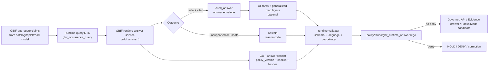

<!-- [KFM_META_BLOCK_V2]
doc_id: kfm://doc/TODO-NEEDS-UUID-gbif-runtime-answer-service
title: GBIF Runtime Answer Service
type: standard
version: v1
status: draft
owners: NEEDS_VERIFICATION-fauna-runtime-owner
created: NEEDS_VERIFICATION-YYYY-MM-DD
updated: 2026-05-07
policy_label: NEEDS_VERIFICATION-public-or-restricted
related: [docs/domains/fauna/README.md, docs/domains/fauna/GEOPRIVACY.md, docs/domains/fauna/SOURCE_ROLES.md, docs/domains/fauna/sources/gbif/GBIF_PUBLIC_AGGREGATES.md, docs/domains/fauna/sources/gbif/GBIF_CATALOG_TRIPLET_READMODEL.md, schemas/runtime/fauna/gbif_occurrence_query.schema.json, schemas/runtime/fauna/gbif_occurrence_answer_envelope.schema.json, schemas/ui/fauna/gbif_occurrence_card.schema.json, schemas/receipts/fauna/gbif_answer_receipt.schema.json, tools/runtime/fauna/kfm_gbif_answer_service.py, tools/runtime/fauna/kfm_gbif_answer_cli.py, tools/runtime/fauna/kfm_gbif_ui_dto.py, tools/validators/fauna/gbif_runtime_answer_validator.py, policy/fauna/gbif_runtime_answer.rego, tests/fauna/test_gbif_answer_service.py, tests/fauna/test_gbif_ui_dto.py]
tags: [kfm, fauna, gbif, runtime, answer-service, governed-api, evidencebundle, geoprivacy, cite-or-abstain]
notes: [Replaces a thin outline with a repo-ready standard doc; doc_id, owner, created date, policy_label, governed API registration, MCP/tool registration, and CI command names remain NEEDS_VERIFICATION.]
[/KFM_META_BLOCK_V2] -->

<a id="top"></a>

# GBIF Runtime Answer Service

Fixture-backed governed runtime answering for **GBIF-reported public occurrence aggregates**, with cited answers only when the request, claim, citations, geoprivacy, rights, sensitivity, and receipt checks remain public-safe.

<p>
  
  
  
  
  
  
  
</p>

> [!IMPORTANT]
> This service answers only **public-safe aggregate questions** over generalized GBIF-derived occurrence evidence. It does **not** confirm species presence, expose exact occurrence coordinates, provide legal or conservation status, estimate populations, infer habitat, or perform live GBIF network access.

> [!NOTE]
> **Status:** draft  
> **Owners:** `NEEDS_VERIFICATION-fauna-runtime-owner`  
> **Target path:** `docs/domains/fauna/sources/gbif/GBIF_RUNTIME_ANSWER_SERVICE.md`  
> **Runtime posture:** confirmed as library + CLI surface; governed API registration remains **NEEDS_VERIFICATION**  
> **Quick jumps:** [Scope](#scope) · [Repo fit](#repo-fit) · [Lifecycle](#lifecycle-placement) · [Inputs](#accepted-inputs) · [Exclusions](#exclusions) · [Runtime contract](#runtime-contract) · [Citation rules](#citation-evidence-and-geoprivacy-rules) · [Abstention](#claim-language-and-abstention-rules) · [CLI](#cli) · [Validation](#validation-and-policy-gates) · [Promotion](#promotion-checklist) · [Rollback](#rollback-and-correction-notes) · [Open verification](#open-verification-backlog)

---

## Scope

This document governs the request-time service that converts validated, public-safe GBIF aggregate claim inputs into either:

1. a cited runtime answer over generalized public aggregate evidence, or
2. an abstention with an enumerated reason.

| Item | Status | Boundary |
|---|---:|---|
| Domain | **CONFIRMED** | `fauna` |
| Source family | **CONFIRMED** | GBIF-derived occurrence aggregate evidence |
| Runtime component | **CONFIRMED** | `tools/runtime/fauna/kfm_gbif_answer_service.py` |
| CLI component | **CONFIRMED** | `tools/runtime/fauna/kfm_gbif_answer_cli.py` |
| UI DTO helper | **CONFIRMED** | `tools/runtime/fauna/kfm_gbif_ui_dto.py` |
| Output postures | **CONFIRMED** | `cited_answer` or `abstain` |
| Public geometry posture | **CONFIRMED** | generalized public area only |
| Live GBIF access | **CONFIRMED absent from this service** | fixture/input-driven runtime answering only |
| Governed API registration | **NEEDS VERIFICATION** | implementation currently documented as library + CLI only |
| MCP/tool registration | **NEEDS VERIFICATION** | intentionally left unclaimed |

### What this file is

A maintainer-facing standard document for:

- runtime answer service behavior;
- safe query types;
- cited-answer requirements;
- abstention behavior;
- UI card and generalized map layer DTO requirements;
- answer receipt expectations;
- validation and policy gates;
- public wording restrictions;
- promotion, rollback, and correction obligations.

### What this file is not

This file is not:

- a GBIF source connector guide;
- a live GBIF download or ingestion guide;
- a release approval;
- a legal-status or conservation-status authority;
- a population model;
- a habitat model;
- a direct public API registration proof;
- an AI model answer contract;
- a publication manifest.

<p align="right"><a href="#top">Back to top ↑</a></p>

---

## Repo fit

This document sits in the GBIF source-documentation lane for the fauna domain.

```text
docs/domains/fauna/sources/gbif/
├── GBIF_OCCURRENCE_INGESTION.md
├── GBIF_PUBLIC_AGGREGATES.md
├── GBIF_CATALOG_TRIPLET_READMODEL.md
├── GBIF_STEWARD_REVIEW_RELEASE_REGISTRY.md
└── GBIF_RUNTIME_ANSWER_SERVICE.md
```

Directory responsibility is intentionally split:

| Responsibility | Home | Runtime-answer relation |
|---|---|---|
| Human-facing domain/source documentation | `docs/domains/fauna/sources/gbif/` | This file explains behavior and review burden. |
| Runtime implementation | `tools/runtime/fauna/` | Service, CLI, and UI DTO builder live here. |
| Machine-checkable shape | `schemas/runtime/fauna/`, `schemas/ui/fauna/`, `schemas/receipts/fauna/` | Query, answer, UI card, and answer receipt schemas live here. |
| Policy-as-code | `policy/fauna/` | Runtime answer admissibility rules live here. |
| Validators | `tools/validators/fauna/` | Schema, banned-field, forbidden-language, receipt, and UI checks live here. |
| Tests | `tests/fauna/` | Fixture-backed behavior tests live here. |
| Release and publication | `release/`, `data/published/`, or repo-native successor | Promotion remains a separate governed transition. |

### Neighboring surfaces

| Surface | Relative link | Role |
|---|---|---|
| Fauna overview | [../../README.md](../../README.md) | Domain posture, sensitivity, and public-safety orientation |
| Fauna geoprivacy | [../../GEOPRIVACY.md](../../GEOPRIVACY.md) | Exact-location, redaction, generalization, and public geometry rules |
| Fauna source roles | [../../SOURCE_ROLES.md](../../SOURCE_ROLES.md) | Source-role boundaries and authority limits |
| GBIF public aggregates | [./GBIF_PUBLIC_AGGREGATES.md](./GBIF_PUBLIC_AGGREGATES.md) | Upstream public-safe aggregate generation and geoprivacy receipt posture |
| GBIF catalog/triplet/read model | [./GBIF_CATALOG_TRIPLET_READMODEL.md](./GBIF_CATALOG_TRIPLET_READMODEL.md) | Aggregate-only catalog, triplet, and read-model posture |
| Runtime service | [../../../../../tools/runtime/fauna/kfm_gbif_answer_service.py](../../../../../tools/runtime/fauna/kfm_gbif_answer_service.py) | Builds answer envelope and answer receipt |
| CLI | [../../../../../tools/runtime/fauna/kfm_gbif_answer_cli.py](../../../../../tools/runtime/fauna/kfm_gbif_answer_cli.py) | Fixture-query and direct-argument invocation |
| UI DTO helper | [../../../../../tools/runtime/fauna/kfm_gbif_ui_dto.py](../../../../../tools/runtime/fauna/kfm_gbif_ui_dto.py) | Builds Evidence Drawer-style cards and generalized map layer DTOs |
| Query schema | [../../../../../schemas/runtime/fauna/gbif_occurrence_query.schema.json](../../../../../schemas/runtime/fauna/gbif_occurrence_query.schema.json) | Runtime query shape |
| Answer schema | [../../../../../schemas/runtime/fauna/gbif_occurrence_answer_envelope.schema.json](../../../../../schemas/runtime/fauna/gbif_occurrence_answer_envelope.schema.json) | Runtime answer envelope shape |
| UI card schema | [../../../../../schemas/ui/fauna/gbif_occurrence_card.schema.json](../../../../../schemas/ui/fauna/gbif_occurrence_card.schema.json) | UI card shape |
| Answer receipt schema | [../../../../../schemas/receipts/fauna/gbif_answer_receipt.schema.json](../../../../../schemas/receipts/fauna/gbif_answer_receipt.schema.json) | Answer receipt shape |
| Runtime validator | [../../../../../tools/validators/fauna/gbif_runtime_answer_validator.py](../../../../../tools/validators/fauna/gbif_runtime_answer_validator.py) | Shape, banned-field, forbidden-language, and receipt checks |
| Runtime policy | [../../../../../policy/fauna/gbif_runtime_answer.rego](../../../../../policy/fauna/gbif_runtime_answer.rego) | Rego deny rules for unsafe runtime answers |
| Service tests | [../../../../../tests/fauna/test_gbif_answer_service.py](../../../../../tests/fauna/test_gbif_answer_service.py) | Fixture-backed answer and abstention behavior |
| UI DTO tests | [../../../../../tests/fauna/test_gbif_ui_dto.py](../../../../../tests/fauna/test_gbif_ui_dto.py) | UI card and generalized map layer behavior |

> [!CAUTION]
> The active repo currently uses direct homes such as `schemas/runtime/fauna/` and `schemas/ui/fauna/`. Broader KFM doctrine also records schema-home pressure around `schemas/contracts/v1/...`. Do not duplicate this contract into a parallel schema home without an ADR or migration note.

<p align="right"><a href="#top">Back to top ↑</a></p>

---

## Lifecycle placement

Runtime answers are downstream of catalog/triplet/read-model work and upstream of public UI/API DTOs. The runtime answer service is not an ingestion step, publication step, or canonical truth store.

```text
TRIPLET -> RUNTIME_READ_MODEL -> GOVERNED_ANSWER_SERVICE -> PUBLIC_UI_DTO/API_DTO -> ANSWER_RECEIPT
```



Lifecycle rules:

| Rule | Required behavior |
|---|---|
| Runtime is downstream | It consumes claim fixtures/read-model output; it does not fetch GBIF. |
| Runtime is bounded | It returns only `cited_answer` or `abstain` in the current service shape. |
| Runtime is cited | A cited answer must include citations and answer receipt reference. |
| Runtime is geoprivacy-aware | Exact occurrence coordinate fields must not appear in public answers, UI cards, or map layers. |
| Runtime is not release | A cited answer is not automatically published. |
| Runtime is not canonical | Runtime outputs must not back-write into canonical source, catalog, triplet, or release records. |
| Runtime emits process memory | It emits an answer receipt with checks, counts, hashes, and policy version. |

<p align="right"><a href="#top">Back to top ↑</a></p>

---

## Accepted inputs

The service accepts already-prepared claim objects and a runtime query object.

### Claim input

Claims must be public-safe aggregate claim objects, not raw GBIF occurrence records.

Required claim-side posture:

| Requirement | Why it matters |
|---|---|
| `rights_posture == public_allowed` | Blocks restricted or unknown-rights public answers. |
| `sensitivity_posture != restricted` | Blocks sensitive public exposure. |
| `presence_posture == reported_occurrence_not_confirmed_presence` | Prevents aggregate records from becoming confirmed-presence claims. |
| citations exist | Enforces cite-or-abstain. |
| citation has `source_evidence_bundle_id` | Preserves evidence resolution. |
| citation has `download_key` | Preserves GBIF download/provenance identity. |
| citation has `geoprivacy_receipt_ref` | Preserves public transform evidence. |
| claim and citation carry `kfm:spec_hash` | Preserves deterministic integrity posture. |

### Query input

The runtime query schema supports these query families:

| Query type | Runtime posture | Public interpretation |
|---|---|---|
| `taxa_in_geography` | safe query type | Ask which GBIF-reported public aggregates match a generalized geography. |
| `geographies_for_taxon` | safe query type | Ask where a taxon has generalized public aggregate support. |
| `evidence_for_taxon_geography` | safe query type | Ask for cited aggregate evidence for a taxon/geography pair. |
| `exact_coordinates` | must abstain | Exact coordinate requests are outside public runtime authority. |
| `confirmed_presence` | must abstain | Confirmed-presence requests exceed aggregate evidence support. |

Supported aggregation units:

```text
county
huc12
grid
```

Optional query flags:

| Flag | Behavior |
|---|---|
| `include_ui_cards` | Adds UI card DTOs when the answer is cited. |
| `include_geometry` | Adds generalized map layer DTOs when the answer is cited and citations support it. |

<p align="right"><a href="#top">Back to top ↑</a></p>

---

## Exclusions

The runtime answer service must not accept, produce, or imply these outputs.

| Excluded item | Failure posture | Correct handling |
|---|---|---|
| Live GBIF network fetch | Out of scope | Use ingestion/public aggregate pipeline surfaces. |
| Raw GBIF rows | DENY public runtime | Use validated aggregate claims/read-model output. |
| Exact coordinates | ABSTAIN / DENY depending on policy context | Use generalized public aggregate geography only. |
| `decimalLatitude` / `decimalLongitude` | DENY | Keep exact fields out of runtime public outputs. |
| Confirmed species presence | ABSTAIN | Use steward-reviewed occurrence evidence if a future lane supports it. |
| Legal or conservation status | ABSTAIN | Use legal-status authority sources, not GBIF aggregate runtime. |
| Population size, viability, or trend | ABSTAIN | Use compatible monitoring/model/steward-reviewed evidence. |
| Habitat proof | ABSTAIN | Use habitat lane evidence and habitat-fauna join gates. |
| AI-only explanation | DENY / ABSTAIN | Focus Mode may summarize only released, cited, policy-safe evidence. |
| Publication decision | Out of scope | Use governed release/promotion surfaces. |
| Silent correction | ERROR | Emit correction, supersession, withdrawal, or rollback records. |

<p align="right"><a href="#top">Back to top ↑</a></p>

---

## Runtime contract

### Service surface

The service exposes a `build_answer(claims, query)` behavior that returns:

```text
(answer, receipt)
```

| Output | Required role |
|---|---|
| `answer` | Runtime answer envelope with `answer_posture`, claims, limitations, UI cards, map layers, abstention reason, answer receipt ref, and `kfm:spec_hash`. |
| `receipt` | Runtime process-memory receipt with query id, answer id, policy version, checked flags, counts, hashes, and `kfm:spec_hash`. |

### Answer postures

| Posture | Meaning | Public behavior |
|---|---|---|
| `cited_answer` | A safe query matched at least one public-safe, cited aggregate claim. | May proceed to validator/policy/release review. |
| `abstain` | The request is unsupported, unsafe, or missing required evidence/citation/safety posture. | Returns no factual summary and includes `abstain_reason`. |

> [!NOTE]
> Broader KFM runtime doctrine uses finite outcomes such as `ANSWER`, `ABSTAIN`, `DENY`, and `ERROR`. This specific service currently emits `cited_answer` and `abstain`; mapping those into a repo-wide runtime envelope remains a governed API integration task and is **NEEDS VERIFICATION**.

### Required answer fields

| Field | Required | Purpose |
|---|---:|---|
| `answer_id` | Yes | Stable answer identifier for this runtime output. |
| `query_id` | Yes | Links answer to request. |
| `source_system` | Yes | Must be `GBIF`. |
| `answer_posture` | Yes | `cited_answer` or `abstain`. |
| `summary` | Conditional | Present only when cited and safe. |
| `claims` | Yes | Claim excerpts carried into answer; empty for abstention. |
| `ui_cards` | Yes | Optional public UI card DTOs. |
| `map_layers` | Yes | Optional generalized public map layer DTOs. |
| `limitations` | Conditional | Required for cited answers. |
| `abstain_reason` | Conditional | Required when answer abstains. |
| `answer_receipt_ref` | Yes | Links to runtime answer receipt. |
| `kfm:spec_hash` | Yes | Deterministic integrity/specification hash. |
| `created_at` | Yes | Runtime creation timestamp. |

### Required receipt fields

| Field | Required | Purpose |
|---|---:|---|
| `receipt_id` | Yes | Stable answer receipt identifier. |
| `query_id` | Yes | Links receipt to query. |
| `answer_id` | Yes | Links receipt to answer. |
| `source_system` | Yes | Must be `GBIF`. |
| `runtime_component` | Yes | Identifies runtime service. |
| `policy_version` | Yes | Expected runtime policy version, such as `gbif_runtime_answer.v1`. |
| `input_claim_count` | Yes | Records total input claim volume. |
| `matched_claim_count` | Yes | Records matched claim volume. |
| `citation_count` | Yes | Records citation count included in cited answer. |
| `ui_card_count` | Yes | Records UI card DTO count. |
| `map_layer_count` | Yes | Records map layer DTO count. |
| `redactions` | Yes | Records exact-coordinate non-emission posture. |
| `rights_posture_checked` | Yes | Must be `true`. |
| `sensitivity_posture_checked` | Yes | Must be `true`. |
| `geoprivacy_checked` | Yes | Must be `true`. |
| `input_claim_hashes` | Yes | Supports reproducibility and audit. |
| `output_answer_hash` | Yes | Supports output integrity. |
| `kfm:spec_hash` | Yes | Supports deterministic rebuild posture. |

<p align="right"><a href="#top">Back to top ↑</a></p>

---

## Citation, evidence, and geoprivacy rules

A cited answer requires all of the following.

| Rule | Required behavior | Failure result |
|---|---|---|
| Claim citations exist | Every cited answer must include citations. | `missing_citation` |
| Evidence reference exists | First citation must include `source_evidence_bundle_id`. | `missing_evidence_reference` |
| GBIF download key exists | First citation must include `download_key`. | `missing_download_key` |
| Geoprivacy receipt exists | First citation must include `geoprivacy_receipt_ref`. | `missing_geoprivacy_receipt` |
| Claim spec hash exists | Claim must include `kfm:spec_hash`. | `invalid_claim_input` |
| Citation spec hash exists | Citation must include `kfm:spec_hash`. | `invalid_claim_input` |
| Rights are public-safe | Claim must have `rights_posture=public_allowed`. | `restricted_rights` |
| Sensitivity is public-safe | Claim must not have `sensitivity_posture=restricted`. | `restricted_sensitivity` |
| Presence posture stays aggregate-only | Claim must have `presence_posture=reported_occurrence_not_confirmed_presence`. | `invalid_claim_input` |
| Exact coordinate fields absent | Banned coordinate fields must not appear in answer, card, layer, or receipt output. | validator `DENY` |

### Banned public fields

The validator blocks exact or raw coordinate-style fields including:

```text
decimalLatitude
decimalLongitude
occurrenceLatitude
occurrenceLongitude
exact_coordinate
exactCoordinates
raw_occurrence_point
```

### Map layer rule

A runtime-generated map layer DTO is allowed only as a generalized public aggregate surface.

| Field | Required value |
|---|---|
| `layer_type` | `generalized_public_occurrence_area` |
| `geometry_role` | `generalized_public_area` |
| `geoprivacy_receipt_ref` | Required |
| exact coordinate properties | Forbidden |

<p align="right"><a href="#top">Back to top ↑</a></p>

---

## Claim language and abstention rules

The runtime answer service must preserve aggregate-only language.

### Allowed public wording

Use wording that keeps the source role and support level visible.

| Allowed pattern | Example |
|---|---|
| Aggregate-bound | “GBIF-reported public occurrence aggregate evidence exists for this taxon/geography request.” |
| Evidence-bound | “This answer cites GBIF-derived public aggregate evidence and its geoprivacy receipt.” |
| Scope-bound | “The answer applies to generalized public geography, not exact occurrence coordinates.” |
| Caveat-visible | “Reported occurrence evidence is not a confirmed species-presence determination.” |

### Forbidden public wording

The validator blocks or should block wording that turns aggregate evidence into stronger proof.

| Forbidden phrase | Why blocked |
|---|---|
| `confirmed present` | Converts aggregate evidence into confirmation. |
| `verified present` | Implies independent KFM verification. |
| `known population` | Converts occurrence evidence into population knowledge. |
| `exact location` | Conflicts with geoprivacy and generalized public geometry. |
| `site-level record` | Exceeds aggregate-only public posture. |
| `precise coordinates` | Implies exact public coordinate exposure. |
| `occurrence point` | Implies point-level public output. |
| `raw gbif location` | Implies raw source coordinate exposure. |

### Abstention reason codes

| Reason code | Trigger |
|---|---|
| `exact_coordinates_requested` | Query asks for exact coordinates. |
| `confirmed_presence_requested` | Query asks to confirm species presence. |
| `invalid_query` | Query type is not supported. |
| `no_matching_cited_claim` | Safe query has no matching cited claim. |
| `restricted_rights` | Matching claim is not public-rights safe. |
| `restricted_sensitivity` | Matching claim is sensitivity-restricted. |
| `invalid_claim_input` | Claim posture or spec-hash requirements fail. |
| `missing_citation` | Claim lacks citations. |
| `missing_evidence_reference` | Citation lacks source EvidenceBundle reference. |
| `missing_download_key` | Citation lacks GBIF download key. |
| `missing_geoprivacy_receipt` | Citation lacks geoprivacy receipt reference. |

### Standard abstention copy

```text
I can’t answer that as an exact-coordinate, site-level, or confirmed-presence claim. This runtime lane only returns cited GBIF-reported public occurrence aggregate answers over generalized geography.
```

<p align="right"><a href="#top">Back to top ↑</a></p>

---

## CLI

### Answer from a query fixture

```bash
python tools/runtime/fauna/kfm_gbif_answer_cli.py \
  --claims tests/fixtures/fauna/gbif/valid/gbif_occurrence_claims.json \
  --query tests/fixtures/fauna/gbif/valid/runtime_query_taxa_in_county.json \
  --output /tmp/gbif_answer.json \
  --receipt-output /tmp/gbif_answer_receipt.json
```

### Answer from direct arguments

```bash
python tools/runtime/fauna/kfm_gbif_answer_cli.py \
  --claims tests/fixtures/fauna/gbif/valid/gbif_occurrence_claims.json \
  --query-type taxa_in_geography \
  --query-id query_cli_001 \
  --taxon-key "12345" \
  --scientific-name "Example species" \
  --geography-id "county:example" \
  --aggregation-unit county \
  --include-ui-cards \
  --include-geometry \
  --output /tmp/gbif_answer.json \
  --receipt-output /tmp/gbif_answer_receipt.json
```

### Validate runtime answer outputs

```bash
python tools/validators/fauna/gbif_runtime_answer_validator.py \
  --kind answer \
  --input /tmp/gbif_answer.json
```

```bash
python tools/validators/fauna/gbif_runtime_answer_validator.py \
  --kind receipt \
  --input /tmp/gbif_answer_receipt.json
```

### Validate optional UI card or map layer DTOs

```bash
python tools/validators/fauna/gbif_runtime_answer_validator.py \
  --kind card \
  --input /tmp/gbif_occurrence_card.json
```

```bash
python tools/validators/fauna/gbif_runtime_answer_validator.py \
  --kind layer \
  --input /tmp/gbif_map_layer.json
```

### Policy gate

The policy surface is:

```text
policy/fauna/gbif_runtime_answer.rego
```

> [!NOTE]
> Exact Rego/OPA/CI command names are **NEEDS VERIFICATION** in the active branch. Keep this document toolchain-neutral until the repo workflow or policy runner is directly verified.

<p align="right"><a href="#top">Back to top ↑</a></p>

---

## Validation and policy gates

| Gate | Confirmed surface | What it checks | Fail-closed result |
|---|---|---|---|
| Query schema | `schemas/runtime/fauna/gbif_occurrence_query.schema.json` | Query shape, query type enum, public flags, aggregation unit, spec hash. | Validation failure |
| Answer schema | `schemas/runtime/fauna/gbif_occurrence_answer_envelope.schema.json` | Answer envelope required fields and answer posture enum. | Validation failure |
| UI card schema | `schemas/ui/fauna/gbif_occurrence_card.schema.json` | Card type, claim refs, citations, spec hash. | Validation failure |
| Answer receipt schema | `schemas/receipts/fauna/gbif_answer_receipt.schema.json` | Receipt identity, policy version, checked flags, spec hash. | Validation failure |
| Runtime service checks | `tools/runtime/fauna/kfm_gbif_answer_service.py` | Safe query types, rights, sensitivity, presence posture, citations, evidence refs, download key, geoprivacy receipt. | `abstain` |
| UI DTO helper | `tools/runtime/fauna/kfm_gbif_ui_dto.py` | Public card badges, citations, generalized map layer DTOs. | No safe UI/map output |
| Runtime validator | `tools/validators/fauna/gbif_runtime_answer_validator.py` | Banned coordinate fields, forbidden language, cited-answer completeness, receipt checks, layer geoprivacy. | `DENY` / exit failure |
| Runtime policy | `policy/fauna/gbif_runtime_answer.rego` | Missing spec hash, missing claims/citations, unsafe rights/sensitivity, invalid presence posture, exact/confirmed query behavior, missing receipt checks. | `deny` |
| Service tests | `tests/fauna/test_gbif_answer_service.py` | Cited answers and abstention reason behavior. | Test failure |
| UI DTO tests | `tests/fauna/test_gbif_ui_dto.py` | UI card badges, citations, coordinate absence, generalized map layer role. | Test failure |

### Minimum negative-path coverage

- [ ] exact-coordinate request -> `abstain`;
- [ ] confirmed-presence request -> `abstain`;
- [ ] unsupported query type -> `abstain`;
- [ ] no matching cited claim -> `abstain`;
- [ ] restricted rights -> `abstain`;
- [ ] restricted sensitivity -> `abstain`;
- [ ] missing citations -> `abstain`;
- [ ] missing EvidenceBundle reference -> `abstain`;
- [ ] missing GBIF download key -> `abstain`;
- [ ] missing geoprivacy receipt -> `abstain`;
- [ ] missing `kfm:spec_hash` -> validator/policy failure;
- [ ] exact coordinate field appears anywhere -> validator/policy failure;
- [ ] forbidden public language appears -> validator/policy failure;
- [ ] map layer lacks `geometry_role=generalized_public_area` -> validator failure;
- [ ] receipt lacks `policy_version` or geoprivacy check -> validator/policy failure.

<p align="right"><a href="#top">Back to top ↑</a></p>

---

## Testing posture

The runtime answer lane is fixture-backed. Tests can prove service behavior and DTO behavior, but a passing test file is not itself a production release.

| Test target | Confirmed behavior scope |
|---|---|
| `tests/fauna/test_gbif_answer_service.py` | Valid runtime queries produce `cited_answer`; no-match, exact-coordinate, confirmed-presence, restricted-rights, restricted-sensitivity, and missing-citation cases abstain with expected reason codes. |
| `tests/fauna/test_gbif_ui_dto.py` | UI cards preserve “not confirmed presence” posture, include citations, do not include `decimalLatitude`, and generate generalized public map layers when requested. |
| `tests/fauna/test_gbif_runtime_answer_validator.py` | **NEEDS VERIFICATION** before detailed claims here; verify file content and expected cases before treating it as validator coverage. |

### Definition of done

A runtime-answer change is reviewable when:

- [ ] query, answer, card, layer, and receipt examples validate;
- [ ] exact coordinate requests abstain;
- [ ] confirmed-presence requests abstain;
- [ ] restricted rights and restricted sensitivity abstain;
- [ ] missing citation/evidence/download/geoprivacy/spec-hash cases fail closed;
- [ ] UI cards include citations and aggregate-only badges;
- [ ] map layer DTOs use `geometry_role=generalized_public_area`;
- [ ] public wording avoids forbidden phrases;
- [ ] answer receipts include policy version, checked flags, input/output hashes, and spec hash;
- [ ] policy deny rules are reconciled with runtime reason codes;
- [ ] governed API registration remains either verified or clearly marked `NEEDS_VERIFICATION`.

<p align="right"><a href="#top">Back to top ↑</a></p>

---

## Promotion checklist

Before any runtime answer output is exposed through a public or semi-public surface, maintainers should confirm:

- [ ] The source claim set derives from a released or release-candidate aggregate/read-model surface.
- [ ] The answer is produced by `build_answer()` or a verified successor.
- [ ] The query validates against the runtime query schema.
- [ ] The answer validates against the answer schema.
- [ ] The receipt validates against the answer receipt schema.
- [ ] Optional UI cards validate against the UI card schema.
- [ ] Optional map layers pass runtime validator layer checks.
- [ ] No exact coordinate fields are emitted.
- [ ] No forbidden public language is emitted.
- [ ] Every cited answer has citations.
- [ ] Every citation carries evidence bundle reference, download key, geoprivacy receipt ref, and spec hash.
- [ ] Rights and sensitivity checks are true and public-safe.
- [ ] Presence posture remains `reported_occurrence_not_confirmed_presence`.
- [ ] The answer receipt records `policy_version`.
- [ ] Rego policy denies no unsafe condition.
- [ ] Release, correction, and rollback paths are known before public exposure.
- [ ] Governed API registration is verified before claiming route availability.
- [ ] MCP/tool registration is verified before claiming tool availability.

<p align="right"><a href="#top">Back to top ↑</a></p>

---

## Rollback and correction notes

Runtime answer rollback is not silent deletion. It is a governed correction path when public output is affected.

| Scenario | Required action |
|---|---|
| Exact coordinate leak | Withdraw affected answer/card/layer output, invalidate caches, issue correction or withdrawal notice, and block promotion until validator/policy coverage is repaired. |
| Public wording overclaims presence | Issue correction notice, update claim text or runtime summary generation, and re-run forbidden-language validation. |
| Rights posture changes | Re-run policy and withdraw or restrict affected runtime answers. |
| Sensitivity posture changes | Suppress, generalize further, or withdraw affected runtime outputs. |
| EvidenceBundle no longer resolves | Runtime must abstain until evidence closure is restored. |
| Geoprivacy receipt is missing or invalid | Deny public map/UI output and rebuild from safe aggregate source. |
| Runtime spec hash changes | Rebuild answer and receipt, preserve old output hash, and supersede old fixture/output references. |
| Policy version changes | Re-run answer, receipt, validator, and Rego tests before public exposure. |
| Governed API registration changes | Update this document and adjacent API docs together; do not leave CLI-only and API-registered behavior ambiguous. |

Rollback should identify:

- affected `query_id`;
- affected `answer_id`;
- affected `answer_receipt_ref`;
- source `download_key`;
- source `source_evidence_bundle_id`;
- source `geoprivacy_receipt_ref`;
- old and new `kfm:spec_hash`;
- old and new output answer hashes;
- public route or UI surface affected, if any;
- correction or withdrawal notice reference.

<p align="right"><a href="#top">Back to top ↑</a></p>

---

## Open verification backlog

| Item | Status | Why it remains open |
|---|---:|---|
| `doc_id` | NEEDS VERIFICATION | Existing file did not provide a KFM UUID-style doc id. |
| `owners` | NEEDS VERIFICATION | Fauna runtime owner/steward role was not confirmed in this pass. |
| `created` date | NEEDS VERIFICATION | Existing file did not provide a creation date. |
| `policy_label` | NEEDS VERIFICATION | Public/restricted label should be confirmed against repo policy conventions. |
| Governed API registration | NEEDS VERIFICATION | Existing doc explicitly left `apps/governed_api` registration unchanged and library + CLI only. |
| MCP/tool registration | NEEDS VERIFICATION | Existing doc explicitly left MCP tool registration unchanged. |
| Runtime response envelope mapping | NEEDS VERIFICATION | Service emits `cited_answer` / `abstain`; repo-wide runtime envelope mapping should be confirmed before public API claims. |
| Rego/OPA command names | NEEDS VERIFICATION | Policy file exists, but exact active workflow command is not asserted here. |
| Validator test content | NEEDS VERIFICATION | Confirm `tests/fauna/test_gbif_runtime_answer_validator.py` expectations before stronger coverage claims. |
| Release state | UNKNOWN | This document does not prove any runtime answer output is published. |
| CI enforcement | UNKNOWN | Tests and policy files are documented, but workflow enforcement was not verified here. |
| Steward review registry linkage | NEEDS VERIFICATION | Confirm whether this runtime lane must link to the GBIF steward review/release registry before promotion. |

<p align="right"><a href="#top">Back to top ↑</a></p>

---

## Appendix

<details>
<summary>Illustrative cited answer shape</summary>

```json
{
  "answer_id": "answer_query_cli_001",
  "query_id": "query_cli_001",
  "source_system": "GBIF",
  "answer_posture": "cited_answer",
  "summary": "GBIF-reported public occurrence aggregate evidence exists for Example species in county:example.",
  "claims": [
    {
      "claim_id": "gbif_claim_example",
      "claim_text": "GBIF-reported public occurrence aggregate evidence exists for Example species in county:example.",
      "presence_posture": "reported_occurrence_not_confirmed_presence",
      "observation_count": 10,
      "record_count": 10,
      "date_range": {
        "start": "2020-01-01",
        "end": "2020-12-31"
      },
      "citations": [
        {
          "source_system": "GBIF",
          "source_evidence_bundle_id": "gbif-evidencebundle-example",
          "download_key": "TEST_DOWNLOAD_KEY",
          "source_aggregate_id": "gbif-agg-example",
          "geoprivacy_receipt_ref": "geoprivacy-test_download_key",
          "kfm:spec_hash": "sha256:aaaaaaaaaaaaaaaaaaaaaaaaaaaaaaaaaaaaaaaaaaaaaaaaaaaaaaaaaaaaaaaa"
        }
      ]
    }
  ],
  "ui_cards": [],
  "map_layers": [],
  "limitations": [
    "GBIF occurrence aggregates are reported occurrence evidence, not confirmed species-presence determinations.",
    "Public output is generalized and does not expose exact occurrence coordinates."
  ],
  "abstain_reason": null,
  "answer_receipt_ref": "answer_receipt_query_cli_001",
  "kfm:spec_hash": "sha256:bbbbbbbbbbbbbbbbbbbbbbbbbbbbbbbbbbbbbbbbbbbbbbbbbbbbbbbbbbbbbbbb",
  "created_at": "2026-05-07T00:00:00Z"
}
```

</details>

<details>
<summary>Illustrative abstention shape</summary>

```json
{
  "answer_id": "answer_query_exact_coordinates",
  "query_id": "query_exact_coordinates",
  "source_system": "GBIF",
  "answer_posture": "abstain",
  "summary": null,
  "claims": [],
  "ui_cards": [],
  "map_layers": [],
  "limitations": [],
  "abstain_reason": "exact_coordinates_requested",
  "answer_receipt_ref": "answer_receipt_query_exact_coordinates",
  "kfm:spec_hash": "sha256:cccccccccccccccccccccccccccccccccccccccccccccccccccccccccccccccc",
  "created_at": "2026-05-07T00:00:00Z"
}
```

</details>

<details>
<summary>Maintainer update triggers</summary>

Update this document when any of the following changes:

- runtime query type enum;
- answer envelope schema;
- UI card schema;
- map layer DTO shape;
- answer receipt schema;
- runtime service reason codes;
- banned coordinate field list;
- forbidden public language list;
- citation carry-through fields;
- geoprivacy receipt behavior;
- `presence_posture` vocabulary;
- rights or sensitivity posture vocabulary;
- policy package or `policy_version`;
- CLI arguments;
- validator arguments;
- test fixture path;
- governed API registration;
- MCP/tool registration;
- release/correction/rollback procedure;
- schema-home ADR or migration note.

</details>

<p align="right"><a href="#top">Back to top ↑</a></p>
