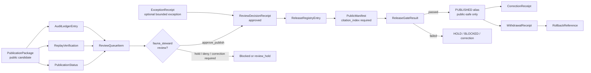
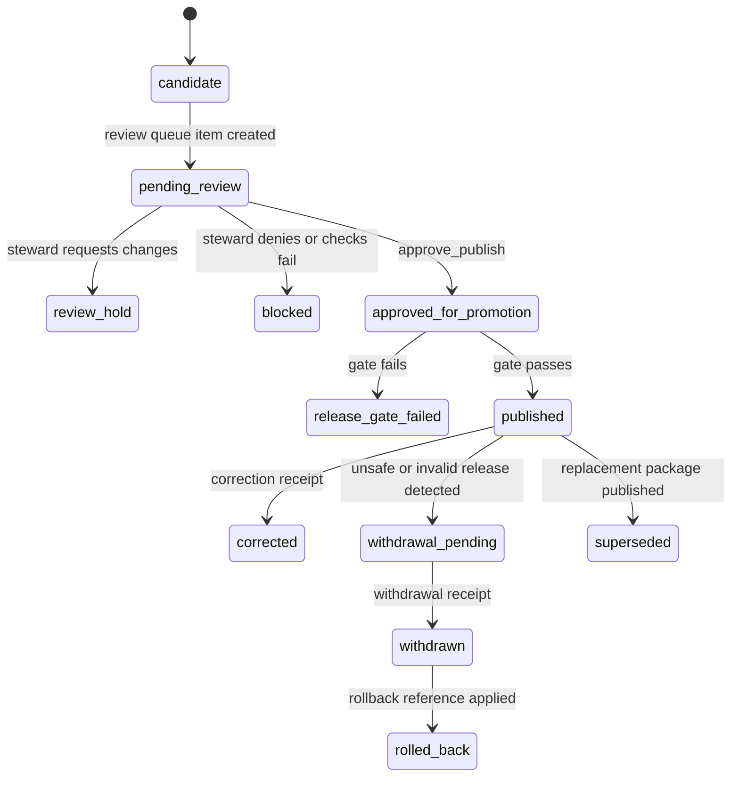

<!-- [KFM_META_BLOCK_V2]
doc_id: kfm://doc/TODO-assign-uuid-NEEDS-VERIFICATION
title: GBIF Steward Review Release Registry
type: standard
version: v1
status: draft
owners: NEEDS_VERIFICATION
created: NEEDS_VERIFICATION
updated: 2026-05-07
policy_label: NEEDS_VERIFICATION
related: [docs/domains/fauna/README.md, docs/domains/fauna/GEOPRIVACY.md, docs/domains/fauna/SOURCE_ROLES.md, docs/domains/fauna/sources/gbif/GBIF_OCCURRENCE_INGESTION.md, docs/domains/fauna/sources/gbif/GBIF_PUBLIC_AGGREGATES.md, docs/domains/fauna/sources/gbif/GBIF_PUBLICATION_OPERATIONS.md, policy/fauna/gbif_review_release.rego, tools/validators/fauna/gbif_review_release_validator.py, tools/review/fauna/kfm_gbif_review_queue.py, tools/review/fauna/kfm_gbif_review_decision.py, tools/review/fauna/kfm_gbif_exception_receipt.py, tools/release/fauna/kfm_gbif_release_registry.py, tools/ci/fauna/kfm_gbif_release_gate.py]
tags: [kfm, fauna, gbif, steward-review, release-registry, geoprivacy, evidencebundle]
notes: [Revises the prior minimal registry stub; doc_id owners created date and policy_label require document-registry or steward verification; CC-BY-NC exception doctrine remains NEEDS_VERIFICATION.]
[/KFM_META_BLOCK_V2] -->

<a id="top"></a>

# GBIF Steward Review Release Registry

Steward-facing registry rules for moving GBIF-derived fauna publication packages from review queue to blocked or published release state without losing evidence, geoprivacy, rights, citation, correction, or rollback accountability.

<p>
  
  
  
  
  
  
  
</p>

> [!IMPORTANT]
> A GBIF-derived public release is not approved by file creation, map rendering, model wording, or a successful package build. It is approved only when the release candidate has a review queue item, steward decision receipt, release registry entry, public manifest, release gate result, audit trail, correction path, and rollback target.

| Field | Value |
|---|---|
| **Target path** | `docs/domains/fauna/sources/gbif/GBIF_STEWARD_REVIEW_RELEASE_REGISTRY.md` |
| **Status** | `draft` |
| **Owners** | `NEEDS_VERIFICATION` |
| **Registry role** | Steward review, exception, release-state, public-manifest, and release-gate coordination |
| **Upstream** | EvidenceBundle → public aggregate → geoprivacy receipt → catalog/triplet → runtime answer → UI DTO → answer receipt → publication package |
| **Downstream** | release registry entry → public manifest → release gate result → published alias or blocked disposition |
| **Quick jumps** | [Scope](#scope) · [Repo fit](#repo-fit) · [Accepted inputs](#accepted-inputs) · [Exclusions](#exclusions) · [Review flow](#review-flow) · [Registry objects](#registry-objects) · [Rights exceptions](#rights-exceptions-and-cc-by-nc) · [Commands](#commands) · [Validation gates](#validation-and-policy-gates) · [Promotion checklist](#promotion-checklist) · [Open verification](#open-verification-backlog) |

---

## Scope

This registry governs the **steward review and release-state surface** for GBIF-derived fauna publication packages.

It connects publication-package evidence to human review, documented exceptions, registry state, public manifests, and release-gate results.

| Item | Status | Boundary |
|---|---:|---|
| Domain | CONFIRMED | `fauna` |
| Source system | CONFIRMED | `GBIF` |
| Review queue type | CONFIRMED | `public_publication_review` |
| Required reviewer role | CONFIRMED | `fauna_steward` for `approve_publish` |
| Presence posture | CONFIRMED | `reported_occurrence_not_confirmed_presence` |
| Public exact coordinates | CONFIRMED | Denied by validator/public-safety posture |
| Release states | CONFIRMED / IMPLEMENTATION-OBSERVED | `published` when steward decision is `approve_publish`; otherwise `blocked` |
| CC-BY-NC doctrine | NEEDS VERIFICATION | Existing stub flagged this as unresolved; see [Rights exceptions](#rights-exceptions-and-cc-by-nc). |

### What this registry controls

- steward review queue records;
- steward decision receipts;
- documented exception receipts;
- release registry entries;
- public manifest expectations;
- release gate result expectations;
- correction, withdrawal, supersession, and rollback linkage;
- minimum public-safe publication checklist for GBIF-derived occurrence answers.

### What this registry does not control

- live GBIF harvesting;
- upstream occurrence normalization;
- public aggregate generation;
- geoprivacy transform logic;
- raw EvidenceBundle shape;
- public API runtime response generation;
- UI component rendering;
- final schema-home authority.

Those surfaces are linked in [Repo fit](#repo-fit).

<p align="right"><a href="#top">Back to top ↑</a></p>

---

## Repo fit

This file sits in the GBIF source documentation lane, downstream of public aggregate and publication package construction.

```text
docs/domains/fauna/sources/gbif/
├── GBIF_OCCURRENCE_INGESTION.md
├── GBIF_PUBLIC_AGGREGATES.md
├── GBIF_PUBLICATION_OPERATIONS.md
└── GBIF_STEWARD_REVIEW_RELEASE_REGISTRY.md
```

### Neighboring docs and implementation surfaces

| Surface | Relative link | Role |
|---|---|---|
| Fauna lane overview | [../../README.md](../../README.md) | Domain orientation and fauna-lane trust posture |
| Fauna geoprivacy | [../../GEOPRIVACY.md](../../GEOPRIVACY.md) | Public geometry, sensitive-location, and transform receipt rules |
| Fauna source roles | [../../SOURCE_ROLES.md](../../SOURCE_ROLES.md) | Source-role compatibility rules for occurrence, status, habitat, model, and legal claims |
| GBIF occurrence ingestion | [./GBIF_OCCURRENCE_INGESTION.md](./GBIF_OCCURRENCE_INGESTION.md) | Fixture-backed occurrence normalization and EvidenceBundle production |
| GBIF public aggregates | [./GBIF_PUBLIC_AGGREGATES.md](./GBIF_PUBLIC_AGGREGATES.md) | Public-safe occurrence aggregate and geoprivacy receipt generation |
| GBIF publication operations | [./GBIF_PUBLICATION_OPERATIONS.md](./GBIF_PUBLICATION_OPERATIONS.md) | Publication package, audit, replay, correction, withdrawal, and rollback architecture |
| Review/release policy | [../../../../../policy/fauna/gbif_review_release.rego](../../../../../policy/fauna/gbif_review_release.rego) | Narrow policy gate for review items |
| Review/release validator | [../../../../../tools/validators/fauna/gbif_review_release_validator.py](../../../../../tools/validators/fauna/gbif_review_release_validator.py) | Field/language denylist and object-specific review/release validation |
| Review queue builder | [../../../../../tools/review/fauna/kfm_gbif_review_queue.py](../../../../../tools/review/fauna/kfm_gbif_review_queue.py) | Builds steward review queue items from package, status, replay, and audit inputs |
| Review decision builder | [../../../../../tools/review/fauna/kfm_gbif_review_decision.py](../../../../../tools/review/fauna/kfm_gbif_review_decision.py) | Emits steward review decision receipts |
| Exception receipt builder | [../../../../../tools/review/fauna/kfm_gbif_exception_receipt.py](../../../../../tools/review/fauna/kfm_gbif_exception_receipt.py) | Records bounded reviewed exceptions |
| Release registry builder | [../../../../../tools/release/fauna/kfm_gbif_release_registry.py](../../../../../tools/release/fauna/kfm_gbif_release_registry.py) | Creates release registry entries |
| Release gate | [../../../../../tools/ci/fauna/kfm_gbif_release_gate.py](../../../../../tools/ci/fauna/kfm_gbif_release_gate.py) | Combines steward approval, policy, replay, manifest safety, and citations |
| Validator test | [../../../../../tests/fauna/test_gbif_review_release_validator.py](../../../../../tests/fauna/test_gbif_review_release_validator.py) | Fixture-backed validator smoke coverage |
| Rego test | [../../../../../tests/policy/fauna/gbif_review_release_test.rego](../../../../../tests/policy/fauna/gbif_review_release_test.rego) | Policy behavior for review-release gate |

> [!NOTE]
> The script and policy paths above are repo-observed on the inspected branch. Local execution, CI workflow wiring, branch protection, production release state, and steward assignments still require verification before this document is upgraded from `draft`.

<p align="right"><a href="#top">Back to top ↑</a></p>

---

## Operating rule

The registry exists to prevent five release failures:

1. a public GBIF answer releases without a steward decision;
2. a rights or license exception becomes invisible;
3. exact coordinates or exact-location language leak through review surfaces;
4. a public manifest is emitted without citations;
5. a release can be published without replay, correction, withdrawal, and rollback linkage.

### Minimum release invariant

```text
PublicationPackage
  -> ReviewQueueItem
  -> ReviewDecisionReceipt
  -> ReleaseRegistryEntry
  -> PublicManifest
  -> ReleaseGateResult
  -> PUBLISHED or BLOCKED
```

A candidate that cannot move through that chain must remain blocked, held, quarantined, corrected, withdrawn, or abstained from public release.

<p align="right"><a href="#top">Back to top ↑</a></p>

---

## Accepted inputs

Only already-built, public-candidate GBIF publication objects belong in this registry step.

| Input | Required posture | Why it belongs here |
|---|---|---|
| `publication_package.json` | Built from public-safe evidence, aggregate, geoprivacy receipt, catalog/triplet, runtime answer, UI DTO, and answer receipt | Root candidate for steward review |
| `publication_status.json` | Current package state and transition context | Prevents untracked state changes |
| `replay_verification.json` | `verification_posture=verified` for approval path | Prevents unreplayable public output |
| `audit_ledger_entry.json` | Append-recorded package/audit metadata | Preserves evidence of the release decision chain |
| steward reviewer identity | Required for `approve_publish` | Prevents anonymous approval |
| steward reviewer role | Must include `fauna_steward` for `approve_publish` | Prevents unqualified approval |
| exception receipt | Optional, bounded, reviewed, and non-overriding | Documents rights or policy exceptions without bypassing hard denies |
| public manifest | Must include a citation index | Keeps public release cite-or-abstain compliant |

### Required posture carried forward from upstream

| Posture | Required value or behavior |
|---|---|
| `rights_posture` | `public_allowed` for public release |
| `sensitivity_posture` | must not be `restricted` for public release |
| `presence_posture` | `reported_occurrence_not_confirmed_presence` |
| public geometry | generalized support only; no exact public point geometry |
| forbidden fields | absent everywhere in public-facing objects |
| forbidden language | absent everywhere in public-facing wording |
| geoprivacy receipt | present when public output is transformed, generalized, suppressed, or stripped |
| citation index | present in public manifest |

<p align="right"><a href="#top">Back to top ↑</a></p>

---

## Exclusions

The following must not enter the steward review release registry as public-release material.

| Excluded item | Failure posture | Correct handling |
|---|---|---|
| Raw GBIF occurrence rows | DENY public release | Keep upstream in controlled evidence/lifecycle surfaces |
| Exact coordinates or exact source point geometry | DENY | Use public aggregate/generalized geometry with receipt |
| `decimalLatitude`, `decimalLongitude`, or exact-location aliases | DENY | Remove from public payloads before review |
| “Confirmed present” or equivalent public certainty language | DENY | Reword to reported occurrence evidence posture |
| Missing EvidenceBundle references | ABSTAIN / DENY | Return to upstream package construction |
| Missing geoprivacy receipt | DENY | Rebuild transform and receipt before review |
| Missing answer receipt | DENY | Rebuild runtime answer package |
| Restricted sensitivity | DENY public release | Keep restricted or derive safer public output |
| Unknown or unresolved rights | DENY / HOLD | Quarantine or route to source-rights review |
| Unbounded CC-BY-NC use | HOLD / NEEDS VERIFICATION | Require explicit exception doctrine and steward receipt |
| Direct UI/API publication without release registry | ERROR | Route through governed release chain |
| Silent correction, withdrawal, or rollback | ERROR | Emit correction/withdrawal/rollback receipts |

<p align="right"><a href="#top">Back to top ↑</a></p>

---

## Review flow



### Decision rule

| Decision | Required reviewer state | Resulting registry posture |
|---|---|---|
| `approve_publish` | `reviewer.actor_id` present and `reviewer.roles` includes `fauna_steward`; all review checks pass | candidate may become `published` if release gate also passes |
| any non-approval decision | reviewer still recommended; reason required | release registry should remain `blocked`, `review_hold`, or correction/withdrawal path |
| missing reviewer | cannot approve | blocked |
| missing `fauna_steward` role | cannot approve | blocked |
| failed review check | cannot approve | blocked |

<p align="right"><a href="#top">Back to top ↑</a></p>

---

## Registry objects

### Review queue item

A review queue item bundles the evidence needed by a fauna steward before a decision.

| Field family | Required? | Meaning |
|---|---:|---|
| `review_queue_item_id` | Yes | Stable queue item identity |
| `domain` | Yes | Must be `fauna` |
| `source_system` | Yes | Must be `GBIF` |
| `queue_type` | Yes | `public_publication_review` |
| `review_state` | Yes | Initial state such as `pending_review` |
| `publication_package_id` | Yes | Candidate package under review |
| `publication_status_id` | Yes | Current status ref |
| `replay_verification_id` | Yes | Replay support ref |
| `audit_ledger_entry_refs` | Yes | Audit refs used in review |
| `source_evidence_bundle_ids` | Yes | EvidenceBundle support refs |
| `download_keys` | Yes | GBIF download/provenance keys |
| `rights_posture` | Yes | Rights state carried into review |
| `sensitivity_posture` | Yes | Sensitivity state carried into review |
| `presence_posture` | Yes | Must stay occurrence-evidence bounded |
| `policy_results` | Yes | Upstream policy results |
| `replay_posture` | Yes | Expected `verified` for approval |
| `required_reviewer_roles` | Yes | Expected to include `fauna_steward` |
| `blocking_findings` | Yes | Any release blockers found before review |
| `kfm:spec_hash` | Yes | Deterministic review item hash |

### Review decision receipt

A decision receipt is the steward’s auditable answer to the review queue item.

| Field family | Required? | Meaning |
|---|---:|---|
| `review_decision_receipt_id` | Yes | Stable decision identity |
| `review_queue_item_id` | Yes | Queue item reviewed |
| `publication_package_id` | Yes | Candidate package decided |
| `decision` | Yes | `approve_publish`, hold, deny, correction-required, or other repo-defined decision |
| `decision_reason` | Yes | Human-readable decision rationale |
| `reviewer.actor_id` | Yes for approval | Steward identity |
| `reviewer.roles` | Yes for approval | Must include `fauna_steward` |
| `review_checks` | Yes | Policy, replay, citation, geoprivacy, no-exact-coordinate, and presence-posture checks |
| `exception_receipt_refs` | Conditional | Any allowed exception receipts |
| `resulting_release_posture` | Yes | `published` for approval, otherwise blocked-style posture |
| `audit_ledger_entry_ref` | Yes | Audit event for decision |
| `limitations_acknowledged` | Yes | Steward acknowledgement of occurrence-evidence limits |
| `kfm:spec_hash` | Yes | Deterministic receipt hash |

### Release registry entry

The release registry entry is the outward release-state object created after review.

| Field family | Required? | Meaning |
|---|---:|---|
| `release_registry_entry_id` | Yes | Stable release-registry identity |
| `domain` | Yes | `fauna` |
| `source_system` | Yes | `GBIF` |
| `release_channel` | Yes | Public channel or repo-defined release lane |
| `release_state` | Yes | `published` or `blocked` from review decision |
| `publication_package_id` | Yes | Released or blocked package |
| `publication_status_id` | Yes | Status object ref |
| `review_decision_receipt_id` | Yes | Steward decision ref |
| `exception_receipt_refs` | Required array | Any bounded exceptions applied |
| `source_evidence_bundle_ids` | Yes | Evidence refs supporting the package |
| `download_keys` | Yes | GBIF provenance keys |
| `query_predicate_hashes` | Yes | Query predicate support |
| `public_aggregate_ids` | Yes | Public aggregate refs |
| `geoprivacy_receipt_refs` | Yes | Transform receipt refs |
| `catalog_entry_ids` | Yes | Catalog closure refs |
| `claim_ids` | Yes | Triplet/claim refs |
| `answer_ids` | Yes | Runtime answer refs |
| `answer_receipt_refs` | Yes | Answer receipt refs |
| `ui_card_ids` | Yes | Public UI DTO refs |
| `map_layer_ids` | Required array | Released public map support refs, if any |
| `artifact_hashes` | Yes | Package, decision, manifest, and related artifact hashes |
| `rights_posture` | Yes | Must be `public_allowed` for public release |
| `sensitivity_posture` | Yes | Must not be `restricted` for public release |
| `presence_posture` | Yes | Must be `reported_occurrence_not_confirmed_presence` |
| `public_url_paths` | Required array | Public paths created or expected |
| `supersedes` / `superseded_by` | Required | Release lineage and successor tracking |
| `withdrawal_receipt_refs` | Required array | Withdrawal history |
| `correction_receipt_refs` | Required array | Correction history |
| `kfm:spec_hash` | Yes | Deterministic registry entry hash |

<p align="right"><a href="#top">Back to top ↑</a></p>

---

## Rights exceptions and CC-BY-NC

The prior target file explicitly flagged **CC-BY-NC rights exception doctrine** as unresolved. This draft preserves that unresolved status rather than pretending the exception policy is settled.

> [!WARNING]
> `CC-BY-NC` must not silently become public-release permission. A public release involving `CC-BY-NC` or any non-standard rights posture requires a documented exception receipt, steward approval, attribution review, and downstream publication-policy verification.

### Exception receipt rule

An exception receipt may document a bounded exception, but it must not override hard safety failures.

| Exception field | Required behavior |
|---|---|
| `exception_type` | Must identify the exception class, such as rights posture, attribution handling, or release-channel limitation |
| `allowed_effect` | Must describe the exact effect allowed; broad “publish anyway” wording is not acceptable |
| `exception_reason` | Must explain why the exception is being considered |
| `scope` | Must limit affected artifact IDs, dataset keys, taxon keys, geography IDs, and expiration |
| `reviewer_required` | Must be `true` |
| `reviewer.actor_id` | Required |
| `reviewer.roles` | Should include appropriate steward/reviewer role |
| `approval_basis` | Must cite documented steward review |
| `kfm:spec_hash` | Required |

### Exception cannot override

| Non-overridable blocker | Required result |
|---|---|
| exact coordinate leak | DENY / correction required |
| missing citation | DENY / correction required |
| missing geoprivacy receipt | DENY / rebuild required |
| restricted sensitivity | DENY public release |
| confirmed-presence language | DENY / wording correction required |

### CC-BY-NC verification checklist

- [ ] Confirm whether the target public release channel permits non-commercial material.
- [ ] Confirm attribution and derivative-work obligations.
- [ ] Confirm whether public API, tiles, static export, screenshots, or downstream reuse violate non-commercial conditions.
- [ ] Confirm whether package terms require restricted access, non-public release, or separate derivative object.
- [ ] Record a reviewed exception receipt if and only if policy permits a bounded use.
- [ ] Keep exception expiry and scope visible in the release registry.
- [ ] Block promotion if rights posture cannot be reconciled.

<p align="right"><a href="#top">Back to top ↑</a></p>

---

## Commands

The command shapes below are grounded in repo-observed script entry points. Execution remains **NEEDS_VERIFICATION** in the active local checkout and CI environment.

### Build review queue item

```bash
python tools/review/fauna/kfm_gbif_review_queue.py \
  --package tests/fixtures/fauna/gbif/valid/review_release/publication_package.json \
  --status tests/fixtures/fauna/gbif/valid/review_release/publication_status.json \
  --replay-verification tests/fixtures/fauna/gbif/valid/review_release/replay_verification.json \
  --audit-ledger-entry tests/fixtures/fauna/gbif/valid/review_release/audit_ledger_entry.json \
  --output /tmp/gbif_review_queue_item.json
```

### Validate review queue item

```bash
python tools/validators/fauna/gbif_review_release_validator.py \
  --kind review_queue_item \
  --input /tmp/gbif_review_queue_item.json
```

### Emit steward review decision

```bash
python tools/review/fauna/kfm_gbif_review_decision.py \
  --review-item /tmp/gbif_review_queue_item.json \
  --decision approve_publish \
  --decision-reason "steward reviewed public-safe GBIF occurrence aggregate package" \
  --reviewer NEEDS_VERIFICATION_STEWARD_ID \
  --reviewer-role fauna_steward \
  --output /tmp/gbif_review_decision_receipt.json
```

### Emit bounded exception receipt

```bash
python tools/review/fauna/kfm_gbif_exception_receipt.py \
  --package tests/fixtures/fauna/gbif/valid/review_release/publication_package.json \
  --exception-type NEEDS_VERIFICATION_RIGHTS_EXCEPTION_TYPE \
  --allowed-effect NEEDS_VERIFICATION_ALLOWED_EFFECT \
  --reason "NEEDS_VERIFICATION: reviewed rights exception rationale" \
  --reviewer NEEDS_VERIFICATION_STEWARD_ID \
  --reviewer-role fauna_steward \
  --output /tmp/gbif_exception_receipt.json
```

### Build release registry entry

```bash
python tools/release/fauna/kfm_gbif_release_registry.py \
  --package tests/fixtures/fauna/gbif/valid/review_release/publication_package.json \
  --status tests/fixtures/fauna/gbif/valid/review_release/publication_status.json \
  --review-decision /tmp/gbif_review_decision_receipt.json \
  --release-channel public \
  --output /tmp/gbif_release_registry_entry.json
```

### Run release gate

```bash
python tools/ci/fauna/kfm_gbif_release_gate.py \
  --package tests/fixtures/fauna/gbif/valid/review_release/publication_package.json \
  --review-item /tmp/gbif_review_queue_item.json \
  --review-decision /tmp/gbif_review_decision_receipt.json \
  --release-registry /tmp/gbif_release_registry_entry.json \
  --manifest NEEDS_VERIFICATION_PUBLIC_MANIFEST_PATH \
  --output /tmp/gbif_release_gate_result.json
```

<p align="right"><a href="#top">Back to top ↑</a></p>

---

## Validation and policy gates

| Gate | Observed surface | Required result | Blocks when |
|---|---|---|---|
| Field/language denylist | `gbif_review_release_validator.py` | No exact-coordinate fields and no overclaiming public wording | coordinate fields or forbidden phrases appear |
| Review item completeness | `gbif_review_release_validator.py` | review queue items include `source_evidence_bundle_ids` and `download_keys` | evidence or download provenance missing |
| Release registry completeness | `gbif_review_release_validator.py` | release entries include query predicate, geoprivacy, and answer receipt refs | closure refs missing |
| Steward approval | `kfm_gbif_review_decision.py` | approval has reviewer and `fauna_steward` role | reviewer missing, role missing, check failed |
| Public release posture | `gbif_review_release_validator.py` | `rights_posture=public_allowed`, sensitivity not restricted, presence posture bounded | rights/sensitivity/presence posture invalid |
| Manifest citations | `gbif_review_release_validator.py` and release gate | public manifest has `citation_index` | citations absent |
| Release gate | `kfm_gbif_release_gate.py` | steward approved, policy passed, replay verified, manifest safe, citations present | any check fails |
| Rego policy | `gbif_review_release.rego` | review item includes `publication_package_id` | package id missing |
| Fixture smoke | `test_gbif_review_release_validator.py` | review queue builder output validates | command or validation failure |

> [!CAUTION]
> The current review-release Rego policy is narrow. The validator and release-gate scripts carry much of the current public-safety logic for review/release objects. Broader policy-as-code parity should be treated as **NEEDS_VERIFICATION** before relying on Rego alone.

<p align="right"><a href="#top">Back to top ↑</a></p>

---

## State model

The registry keeps release state explicit instead of burying it in output paths.



### State transition requirements

| Transition | Required objects |
|---|---|
| `candidate -> pending_review` | publication package, status, replay verification, audit ledger, review queue item |
| `pending_review -> approved_for_promotion` | steward decision receipt with `fauna_steward` role and passing checks |
| `approved_for_promotion -> published` | release registry entry, public manifest, release gate result |
| `published -> corrected` | correction receipt and replacement/supersession refs |
| `published -> withdrawn` | withdrawal receipt, depublication refs, public notice, rollback target |
| `withdrawn -> rolled_back` | rollback reference and cache/static export invalidation plan |

<p align="right"><a href="#top">Back to top ↑</a></p>

---

## Public release wording

Allowed public release wording should stay within occurrence-evidence support.

| Allowed pattern | Example |
|---|---|
| reported evidence | “GBIF-derived reported occurrence evidence is available for this generalized area.” |
| aggregate support | “This release summarizes public-safe occurrence aggregates after geoprivacy review.” |
| uncertainty-aware | “This release does not confirm presence at an exact location.” |
| source-role-aware | “GBIF is used here as occurrence evidence, not legal status authority.” |

Forbidden wording must be blocked or corrected before release.

| Forbidden pattern | Why blocked |
|---|---|
| “confirmed present” | Overstates GBIF aggregate support |
| “verified present” | Implies steward-confirmed species presence |
| “known population” | Implies population proof |
| “exact location” | Contradicts public geoprivacy posture |
| “occurrence point” | Suggests exact public point disclosure |
| “raw GBIF location” | Indicates source-native coordinates or locality leakage |

<p align="right"><a href="#top">Back to top ↑</a></p>

---

## Promotion checklist

A GBIF publication package may be released only when all required review-registry checks are satisfied.

- [ ] Publication package exists and is public-candidate only.
- [ ] Package includes source EvidenceBundle refs.
- [ ] Package includes GBIF download keys.
- [ ] Package includes query predicate hashes.
- [ ] Package includes public aggregate refs.
- [ ] Package includes geoprivacy receipt refs.
- [ ] Package includes catalog, claim, answer, UI card, and answer receipt refs.
- [ ] Rights posture is `public_allowed`.
- [ ] Sensitivity posture is not `restricted`.
- [ ] Presence posture is `reported_occurrence_not_confirmed_presence`.
- [ ] No forbidden exact-coordinate field appears in package, review item, manifest, UI DTO, or registry entry.
- [ ] No forbidden public certainty language appears in public-facing text.
- [ ] Replay verification posture is `verified`.
- [ ] Policy results pass.
- [ ] Review queue item is created and validates.
- [ ] Steward decision receipt exists.
- [ ] Approval reviewer has `fauna_steward` role.
- [ ] Any exception receipt is scoped, reviewed, expiring, and unable to override hard denies.
- [ ] Release registry entry validates.
- [ ] Public manifest contains `citation_index`.
- [ ] Release gate result is `passed`.
- [ ] Correction, withdrawal, supersession, and rollback targets are documented before publication widens.

<p align="right"><a href="#top">Back to top ↑</a></p>

---

## Correction, withdrawal, and rollback

A public GBIF release must remain correctable and withdrawable.

| Scenario | Required registry action |
|---|---|
| Exact coordinate leak discovered | Withdraw affected package, invalidate public aliases/caches/exports, emit withdrawal receipt, rollback to prior safe target |
| Forbidden presence wording discovered | Issue correction receipt, regenerate public manifest/UI text, supersede affected registry entry |
| Rights posture changes | Re-run rights and release gates; block, correct, or withdraw affected package |
| Sensitivity posture changes | Suppress, generalize further, restrict, withdraw, or rollback |
| Replay verification later fails | Hold public widening, issue correction or withdrawal depending on public consequence |
| Citation index missing or broken | Block release or issue correction if already published |
| Geoprivacy receipt missing or invalid | Withdraw or block public release until transform support is restored |
| Steward decision found invalid | Mark release registry as blocked or withdrawn and require re-review |

Rollback is not deletion. It is a governed state transition that records affected package, safe target, reason, policy basis, public notice, cache invalidation, and audit linkage.

<p align="right"><a href="#top">Back to top ↑</a></p>

---

## Open verification backlog

| Item | Status | Why it remains open |
|---|---:|---|
| Document `doc_id` | NEEDS VERIFICATION | Requires document registry assignment |
| Owners | NEEDS VERIFICATION | Fauna steward/team ownership was not confirmed in this file |
| Created date | NEEDS VERIFICATION | Prior stub lacked Meta Block V2 and creation metadata |
| Policy label | NEEDS VERIFICATION | Visibility classification must be confirmed |
| CC-BY-NC exception doctrine | NEEDS VERIFICATION | Prior stub explicitly flagged rights exception doctrine as unresolved |
| Exact exception type enum | NEEDS VERIFICATION | Script accepts free-form exception type; final enum should be schema/policy governed |
| Exact `allowed_effect` vocabulary | NEEDS VERIFICATION | Script accepts free-form value; release policy should constrain it |
| Public manifest path and required fields | NEEDS VERIFICATION | Release gate expects manifest and `citation_index`; final manifest schema should be verified |
| Rego/validator parity | NEEDS VERIFICATION | Current Rego policy is narrower than validator/release-gate logic |
| CI workflow enforcement | UNKNOWN | Scripts and tests were inspected, but workflow wiring was not verified here |
| Branch protection / required checks | UNKNOWN | Repository settings were not inspected |
| Fixture completeness | NEEDS VERIFICATION | Valid fixture smoke test exists; broader negative-path fixtures should be verified or added |
| Audit ledger storage | NEEDS VERIFICATION | Review/release tools reference audit ledger fields; durable storage convention must be confirmed |
| Correction and withdrawal object homes | NEEDS VERIFICATION | Publication operations define the need; final artifact homes should be verified |
| Release channel vocabulary | NEEDS VERIFICATION | `--release-channel` accepts caller input; canonical allowed channels should be governed |
| Steward identity source | NEEDS VERIFICATION | Reviewer actor IDs should resolve to a steward registry or CODEOWNERS-backed process |

<p align="right"><a href="#top">Back to top ↑</a></p>

---

## Appendix

<details>
<summary>Illustrative review queue item shape</summary>

```json
{
  "review_queue_item_id": "gbif_review_item_TEST_001",
  "domain": "fauna",
  "source_system": "GBIF",
  "queue_type": "public_publication_review",
  "review_state": "pending_review",
  "publication_package_id": "gbif_pubpkg_TEST_001",
  "publication_status_id": "gbif_status_TEST_001",
  "replay_verification_id": "gbif_replay_TEST_001",
  "audit_ledger_entry_refs": ["gbif_audit_TEST_001"],
  "source_evidence_bundle_ids": ["gbif-evidencebundle-example"],
  "download_keys": ["TEST_DOWNLOAD_KEY"],
  "answer_ids": ["gbif_answer_TEST_001"],
  "ui_card_ids": ["gbif_ui_card_TEST_001"],
  "claim_ids": ["gbif_claim_TEST_001"],
  "rights_posture": "public_allowed",
  "sensitivity_posture": "public_generalized",
  "presence_posture": "reported_occurrence_not_confirmed_presence",
  "policy_results": {
    "passed": true,
    "deny_count": 0,
    "denies": []
  },
  "replay_posture": "verified",
  "review_required": true,
  "required_reviewer_roles": ["fauna_steward"],
  "blocking_findings": [],
  "review_notes": [],
  "kfm:spec_hash": "sha256:NEEDS_VERIFICATION"
}
```

</details>

<details>
<summary>Illustrative release registry entry shape</summary>

```json
{
  "release_registry_entry_id": "gbif_release_TEST_001",
  "domain": "fauna",
  "source_system": "GBIF",
  "release_channel": "public",
  "release_state": "published",
  "publication_package_id": "gbif_pubpkg_TEST_001",
  "publication_status_id": "gbif_status_TEST_001",
  "review_decision_receipt_id": "gbif_review_decision_TEST_001",
  "exception_receipt_refs": [],
  "source_evidence_bundle_ids": ["gbif-evidencebundle-example"],
  "download_keys": ["TEST_DOWNLOAD_KEY"],
  "query_predicate_hashes": ["sha256:NEEDS_VERIFICATION"],
  "public_aggregate_ids": ["gbif-agg-test"],
  "geoprivacy_receipt_refs": ["geoprivacy-test"],
  "catalog_entry_ids": ["gbif-catalog-test"],
  "claim_ids": ["gbif-claim-test"],
  "answer_ids": ["gbif-answer-test"],
  "answer_receipt_refs": ["gbif-answer-receipt-test"],
  "ui_card_ids": ["gbif-ui-card-test"],
  "map_layer_ids": [],
  "artifact_hashes": {
    "publication_package": "sha256:NEEDS_VERIFICATION",
    "review_decision_receipt": "sha256:NEEDS_VERIFICATION",
    "public_manifest": "sha256:NEEDS_VERIFICATION"
  },
  "rights_posture": "public_allowed",
  "sensitivity_posture": "public_generalized",
  "presence_posture": "reported_occurrence_not_confirmed_presence",
  "public_url_paths": [
    "/fauna/gbif/occurrence-aggregates/gbif_pubpkg_TEST_001"
  ],
  "supersedes": [],
  "superseded_by": null,
  "withdrawal_receipt_refs": [],
  "correction_receipt_refs": [],
  "kfm:spec_hash": "sha256:NEEDS_VERIFICATION"
}
```

</details>

<details>
<summary>Maintainer update triggers</summary>

Update this registry when any of the following changes:

- review queue item fields;
- review decision receipt fields;
- exception receipt fields;
- release registry entry fields;
- public manifest schema;
- release gate checks;
- reviewer role vocabulary;
- rights posture vocabulary;
- CC-BY-NC exception doctrine;
- forbidden coordinate field list;
- forbidden public phrase list;
- release channel vocabulary;
- correction/withdrawal/rollback homes;
- CI workflow enforcement;
- Rego policy parity with validator logic;
- steward ownership or CODEOWNERS mapping.

</details>

<p align="right"><a href="#top">Back to top ↑</a></p>
