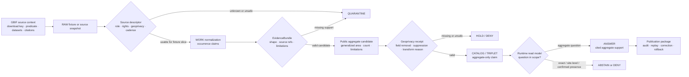

<!-- [KFM_META_BLOCK_V2]
doc_id: kfm://doc/TODO-gbif-source-readme-NEEDS-VERIFICATION
title: GBIF Source README
type: standard
version: v1
status: draft
owners: TODO(fauna-platform|fauna-domain-stewards)
created: TODO(verify-original-created-date-or-set-on-first-meaningful-commit)
updated: 2026-05-07
policy_label: TODO(public-or-restricted-NEEDS-VERIFICATION)
related: ["../../README.md", "../../SOURCE_ROLES.md", "../../GEOPRIVACY.md", "./GBIF_OCCURRENCE_INGESTION.md", "./GBIF_PUBLIC_AGGREGATES.md", "./GBIF_CATALOG_TRIPLET_READMODEL.md", "./GBIF_PUBLICATION_OPERATIONS.md", "../../../../../data/registry/fauna/README.md"]
tags: [kfm, fauna, gbif, occurrence, source-readme, geoprivacy, evidencebundle, public-aggregate]
notes: [Target file existed but was blank when inspected; doc_id, owners, created date, and policy_label require registry or steward verification; this README is an orientation layer and does not activate live GBIF fetching.]
[/KFM_META_BLOCK_V2] -->

<a id="top"></a>

# GBIF Source README

Orientation hub for GBIF-mediated fauna occurrence evidence in KFM, keeping aggregator records, public aggregates, runtime answers, and map views downstream of evidence, rights, geoprivacy, review, and release.

<p>
  
  
  
  
  
  
</p>

> [!IMPORTANT]
> **Impact block**
>
> | Field | Value |
> |---|---|
> | README status | `experimental` until owners, policy label, schema home, validator commands, and source activation are verified |
> | Metadata status | `draft` in KFM Meta Block V2 |
> | Owners | `TODO(fauna-platform\|fauna-domain-stewards)` |
> | Target path | `docs/domains/fauna/sources/gbif/README.md` |
> | Directory role | Human-facing source-family landing page for GBIF inside the fauna domain |
> | Public posture | Public exact coordinates are denied by default; public aggregates require geoprivacy receipts, evidence closure, policy review, and release state |
> | Runtime posture | Cite-or-abstain; finite outcomes only: `ANSWER`, `ABSTAIN`, `DENY`, `ERROR` |
> | Connector posture | No live GBIF fetching is authorized by this README |
>
> **Quick jumps:** [Scope](#scope) · [Repo fit](#repo-fit) · [Accepted inputs](#accepted-inputs) · [Exclusions](#exclusions) · [Directory tree](#directory-tree) · [Lifecycle](#lifecycle) · [GBIF operating rules](#gbif-operating-rules) · [Quickstart](#quickstart) · [Usage](#usage) · [Validation gates](#validation-gates) · [Definition of done](#definition-of-done) · [FAQ](#faq) · [Appendix](#appendix)

---

## Scope

This directory documents how KFM handles **GBIF-mediated fauna occurrence evidence**.

GBIF can be a useful discovery and occurrence-evidence source family, but KFM must not treat a GBIF-mediated record as legal status authority, steward-reviewed population proof, habitat proof, or permission to expose precise wildlife locations. This source lane exists to preserve that boundary.

### This README governs

| Surface | Role |
|---|---|
| Source-family orientation | Explains what GBIF is allowed to support inside the fauna lane. |
| Companion doc navigation | Points maintainers to ingestion, aggregate, catalog/triplet/read-model, and publication-operation docs. |
| Public-safety posture | Summarizes exact-coordinate denial, aggregate-only public output, suppression, and geoprivacy receipt requirements. |
| Review expectations | Gives maintainers a checklist before changing GBIF source behavior, examples, schemas, policies, validators, or publication flow. |
| Contributor onboarding | Gives a safe no-network first path for future GBIF work. |

### This README does not govern

| Not governed here | Owning surface |
|---|---|
| Fauna-wide source-role definitions | [Fauna Source Roles](../../SOURCE_ROLES.md) |
| Fauna-wide geoprivacy classes and sensitive-location rules | [Fauna Geoprivacy](../../GEOPRIVACY.md) |
| GBIF occurrence normalization details | [GBIF Occurrence Ingestion](./GBIF_OCCURRENCE_INGESTION.md) |
| GBIF public aggregate shape and suppression behavior | [GBIF Public Aggregates](./GBIF_PUBLIC_AGGREGATES.md) |
| Catalog, triplet, and runtime read-model behavior | [GBIF Catalog + Triplet + Read Model](./GBIF_CATALOG_TRIPLET_READMODEL.md) |
| Publication packages, audit ledger, replay, correction, withdrawal, rollback | [GBIF Publication Operations](./GBIF_PUBLICATION_OPERATIONS.md) |
| Fauna source registry and activation records | [Fauna Registry](../../../../../data/registry/fauna/README.md) |
| Machine schemas, policy-as-code, executable validators, CI workflows | Responsibility roots after repo verification |

[Back to top](#top)

---

## Repo fit

`docs/domains/fauna/sources/gbif/README.md` is a **source-family README** inside the human-facing fauna documentation lane.

Directory Rules basis: `docs/` is the human-facing control plane; domain source docs belong under the appropriate domain documentation root, not at repo root.

### Path context

```text
docs/domains/fauna/
└── sources/
    └── gbif/
        ├── README.md
        ├── GBIF_OCCURRENCE_INGESTION.md
        ├── GBIF_PUBLIC_AGGREGATES.md
        ├── GBIF_CATALOG_TRIPLET_READMODEL.md
        └── GBIF_PUBLICATION_OPERATIONS.md
```

### Upstream and downstream relationships

| Direction | Surface | Status | Role |
|---|---|---:|---|
| Upstream domain | [../../README.md](../../README.md) | CONFIRMED | Fauna lane scope, lifecycle, object families, public-safety posture. |
| Upstream source roles | [../../SOURCE_ROLES.md](../../SOURCE_ROLES.md) | CONFIRMED | Source-role taxonomy and claim-compatibility rules. |
| Upstream geoprivacy | [../../GEOPRIVACY.md](../../GEOPRIVACY.md) | CONFIRMED | Exact-location denial, sensitivity classes, redaction receipts, public geometry rules. |
| Upstream registry | [../../../../../data/registry/fauna/README.md](../../../../../data/registry/fauna/README.md) | CONFIRMED | Source descriptor and activation registry posture. |
| Same directory | [./GBIF_OCCURRENCE_INGESTION.md](./GBIF_OCCURRENCE_INGESTION.md) | CONFIRMED | Fixture-backed RAW → WORK/QUARANTINE EvidenceBundle normalization. |
| Same directory | [./GBIF_PUBLIC_AGGREGATES.md](./GBIF_PUBLIC_AGGREGATES.md) | CONFIRMED | Public-safe aggregate generation, suppression, and geoprivacy receipt behavior. |
| Same directory | [./GBIF_CATALOG_TRIPLET_READMODEL.md](./GBIF_CATALOG_TRIPLET_READMODEL.md) | CONFIRMED | Catalog, triplet, read-model, aggregate-only answer posture. |
| Same directory | [./GBIF_PUBLICATION_OPERATIONS.md](./GBIF_PUBLICATION_OPERATIONS.md) | CONFIRMED | Publication package, audit, replay, correction, withdrawal, rollback planning. |
| Downstream schemas | `schemas/...` | NEEDS VERIFICATION | Active GBIF docs reference schema files; final schema home still needs repo/ADR verification. |
| Downstream policy | `policy/fauna/...` | NEEDS VERIFICATION | Policy path and runner must be verified before claiming enforcement. |
| Downstream tools | `tools/...` | NEEDS VERIFICATION | Normalizer, publisher, catalog, triplet, read-model, and validator commands require direct tool inspection. |
| Downstream runtime | governed API, Evidence Drawer, Focus Mode | PROPOSED / NEEDS VERIFICATION | Must consume released public-safe artifacts only. |

> [!NOTE]
> This README can safely exist before every downstream tool is active. It is a navigation and governance surface, not proof that a live connector, schema registry, policy runner, release system, or runtime endpoint is production-ready.

[Back to top](#top)

---

## Accepted inputs

Only reviewable, source-family documentation and control-plane references belong in this directory.

| Input family | Accepted here? | Conditions |
|---|---:|---|
| GBIF source-family overview | ✅ | Must preserve aggregator/occurrence-support posture. |
| GBIF ingestion documentation | ✅ | Must stay fixture-first unless live source activation is explicitly approved elsewhere. |
| Public aggregate documentation | ✅ | Must require generalized public geometry, suppression, limitations, and geoprivacy receipt linkage. |
| Catalog/triplet/read-model documentation | ✅ | Must keep aggregate-only language and abstain from exact-coordinate or confirmed-presence answers. |
| Publication operations documentation | ✅ | Must require package integrity, audit ledger, replay, correction, withdrawal, and rollback. |
| Official GBIF reference links | ✅ | Must be treated as source-operation references, not automatic connector activation. |
| CLI examples | ✅ | Must be labeled fixture-first, proposed, or repo-verified as appropriate. |
| Validation expectations | ✅ | Human-readable expectations belong here; executable validators belong in `tools/` or repo-native tool homes. |
| Negative-path examples | ✅ | Preferred, especially for coordinate leakage, unknown rights, missing EvidenceBundle, and overclaiming language. |

[Back to top](#top)

---

## Exclusions

These items must not be stored in this documentation directory.

| Excluded item | Correct home or handling | Why |
|---|---|---|
| Raw GBIF downloads | `data/raw/fauna/...` or source-run home after activation | Docs must not contain source payloads. |
| Work-stage normalized records | `data/work/fauna/...` | WORK artifacts are not documentation. |
| Quarantined records | `data/quarantine/fauna/...` | Quarantined records may contain rights/sensitivity problems. |
| Exact sensitive coordinates | Restricted internal store only | Public docs, examples, screenshots, and map properties must not leak precision. |
| Source credentials or API secrets | Secret manager / environment-specific config | Never commit credentials to docs. |
| Machine schemas | Accepted schema home after ADR/repo verification | Schemas own shape; docs explain intent. |
| Policy-as-code | `policy/fauna/...` or repo-confirmed policy home | Policy must be executable and tested. |
| Validator implementation | `tools/...` or repo-confirmed tool/package home | Code should not be embedded in source-family README prose. |
| Release manifests, receipts, proof packs | `release/`, `data/receipts/`, `data/proofs/`, or repo-confirmed homes | Trust objects must remain auditable and separate from docs. |
| Direct AI answers | Nowhere as evidence | AI may interpret released evidence; it cannot become source truth. |

[Back to top](#top)

---

## Directory tree

Current GBIF source documentation set:

```text
docs/domains/fauna/sources/gbif/
├── README.md
│   └── Source-family landing page, navigation hub, and review checklist.
├── GBIF_OCCURRENCE_INGESTION.md
│   └── Fixture-backed GBIF occurrence normalization into WORK/QUARANTINE-ready EvidenceBundle artifacts.
├── GBIF_PUBLIC_AGGREGATES.md
│   └── Public-safe aggregate generation, generalized geometry, suppression threshold, and geoprivacy receipt rules.
├── GBIF_CATALOG_TRIPLET_READMODEL.md
│   └── Catalog registration, aggregate-only triplet claims, and runtime read-model abstention behavior.
└── GBIF_PUBLICATION_OPERATIONS.md
    └── Publication package, audit ledger, replay verification, correction, withdrawal, and rollback operations.
```

> [!TIP]
> Add future GBIF docs here only when they explain a source-family concern. Put executable code, schemas, policies, fixtures, receipts, proof packs, and released artifacts under their responsibility roots.

[Back to top](#top)

---

## Lifecycle

GBIF-derived evidence must follow the KFM lifecycle. The normal public path moves from source-native capture to governed publication; it does not jump from GBIF rows to map popups or AI answers.



### Lifecycle boundaries

| Boundary | Required behavior |
|---|---|
| RAW → WORK | Normalize fixture-backed or verified source records into occurrence **claims**, not species truth. |
| WORK → QUARANTINE | Unknown rights, missing source role, unresolved sensitivity, malformed coordinates, or missing evidence support fail closed. |
| WORK → PROCESSED | EvidenceBundle support and required source metadata must be present. |
| PROCESSED → CATALOG/TRIPLET | Public claim language must remain aggregate-only and evidence-bound. |
| CATALOG/TRIPLET → PUBLISHED | Promotion requires validation, policy, review, release manifest, correction path, rollback target, and audit trail. |
| PUBLISHED → UI/AI | Public clients consume governed API payloads and released artifacts only. |

[Back to top](#top)

---

## GBIF operating rules

### 1. GBIF is treated as occurrence support, not sovereign truth

GBIF-mediated records may support occurrence evidence after source-role, rights, quality, geoprivacy, and evidence checks. They must not be silently upgraded into legal status, stewardship authority, confirmed species presence, population size, habitat suitability, or exact-location permission.

| Claim | GBIF-derived evidence may support? | Required outcome |
|---|---:|---|
| “GBIF-derived occurrence evidence exists for this generalized area.” | ✅ | `ANSWER` if EvidenceBundle, aggregate, receipt, policy, and release support resolve. |
| “This species is confirmed present at this exact point.” | ❌ | `ABSTAIN` or `DENY`. |
| “This species is legally listed in Kansas.” | ❌ | Use a legal-status authority source. |
| “This habitat is confirmed occupied.” | ❌ | Use compatible habitat and occurrence evidence; do not overclaim. |
| “This public aggregate is safe to display.” | Conditional | Requires suppression, geoprivacy receipt, rights, sensitivity, policy, review, and release state. |

### 2. Public aggregates are generalized evidence carriers

GBIF public aggregates should use generalized public support such as county, grid, watershed, bounding box, or approved aggregate geometry. Exact coordinate fields must not reach public payloads.

Default aggregate rule:

```text
observation_count < 10 -> suppress / deny public aggregate
observation_count >= 10 -> candidate only, still requiring all gates
```

### 3. Runtime answers must use aggregate-only language

Allowed public framing:

> “GBIF-derived occurrence evidence is available for this generalized area.”

Required aggregate-read-model phrase:

```text
GBIF-reported public occurrence aggregate
```

Disallowed public phrasing includes:

- “confirmed present”
- “verified present”
- “known population”
- “exact location”
- “site-level record”
- “precise occurrence point”

### 4. Source details must remain inspectable

A GBIF-derived public artifact should preserve references to:

- GBIF download key or source-snapshot identity;
- query predicate or predicate hash;
- dataset key(s), citation, DOI, and contributing datasets where applicable;
- license and rights posture;
- geoprivacy fields such as `informationWithheld` and `dataGeneralizations` where present;
- EvidenceBundle reference;
- geoprivacy receipt reference;
- `kfm:spec_hash`;
- limitations and source-bias notes.

[Back to top](#top)

---

## Quickstart

Use this sequence after mounting the real repository. Commands below are review aids; adapt them to repo-native scripts once verified.

### 1. Confirm repo and source-directory state

```bash
git status --short
git branch --show-current

find docs/domains/fauna/sources/gbif -maxdepth 1 -type f | sort
```

Expected result: the GBIF source docs are visible, and this README is not confused with generated output or source data.

### 2. Inspect source-family references

```bash
rg -n --no-heading \
  "GBIF|EvidenceBundle|download_key|query_predicate|geoprivacy|aggregate|ABSTAIN|DENY|exact coordinate" \
  docs/domains/fauna data/registry/fauna policy tools schemas tests 2>/dev/null
```

Expected result: source-role, geoprivacy, aggregate, catalog/triplet, policy, and validation references can be reviewed together.

### 3. Run fixture-backed occurrence normalization

```bash
python tools/normalizers/fauna/kfm_gbif_normalize.py \
  --input tests/fixtures/fauna/gbif/valid/simple_occurrences.csv \
  --query-predicate tests/fixtures/fauna/gbif/query_predicate.json \
  --download-key TEST_DOWNLOAD_KEY \
  --output /tmp/gbif_evidencebundle.json
```

Expected result: WORK/QUARANTINE-ready EvidenceBundle output. This does **not** publish.

### 4. Build public aggregate candidates

```bash
python tools/publishers/fauna/kfm_gbif_public_aggregate.py \
  --input tests/fixtures/fauna/gbif/valid/evidencebundle.json \
  --aggregation-unit county \
  --suppression-threshold 10 \
  --output /tmp/gbif_public_aggregates.json \
  --receipt-output /tmp/gbif_geoprivacy_receipt.json
```

Expected result: public-safe aggregate candidates plus geoprivacy receipt. This still does **not** publish.

### 5. Validate aggregate and receipt

```bash
python tools/validators/fauna/gbif_public_aggregate_validator.py \
  --aggregate /tmp/gbif_public_aggregates.json \
  --receipt /tmp/gbif_geoprivacy_receipt.json
```

Expected result: pass only when public output is generalized, count-threshold-safe, evidence-linked, rights/sensitivity-compatible, and free of exact-coordinate leakage.

> [!WARNING]
> Do not convert these examples into live GBIF fetching until source activation, rights, terms, credentials, quotas, source role, citation, geoprivacy, and steward-review obligations are verified.

[Back to top](#top)

---

## Usage

### Add a GBIF source-family change

1. Update the relevant source descriptor in the fauna registry.
2. Confirm GBIF role remains `occurrence_aggregator` or equivalent occurrence-support role.
3. Confirm rights and citation requirements.
4. Confirm source geoprivacy fields are preserved.
5. Add or update fixtures.
6. Run source-role, rights, geoprivacy, EvidenceBundle, aggregate, policy, and read-model negative tests.
7. Update this README only when directory-level behavior or navigation changes.

### Add a new GBIF ingestion behavior

Use [GBIF Occurrence Ingestion](./GBIF_OCCURRENCE_INGESTION.md) as the controlling doc. Preserve these boundaries:

- fixture-first;
- no live network calls in baseline tests;
- output is WORK/QUARANTINE-ready;
- occurrence claims are not species truth;
- public release is a later governed transition.

### Add a new public aggregate behavior

Use [GBIF Public Aggregates](./GBIF_PUBLIC_AGGREGATES.md) as the controlling doc. Preserve these boundaries:

- no exact coordinate fields in public aggregate output;
- `geometry_role=generalized_public_area`;
- `observation_count < 10` suppressed;
- geoprivacy receipt required;
- limitations visible;
- public wording remains aggregate-only.

### Add catalog, triplet, or read-model behavior

Use [GBIF Catalog + Triplet + Read Model](./GBIF_CATALOG_TRIPLET_READMODEL.md). Preserve these carry-through fields:

| Field | Why it matters |
|---|---|
| `source_evidence_bundle_id` | Allows EvidenceBundle resolution. |
| `download_key` | Preserves GBIF download/source identity. |
| `query_predicate_hash` | Binds output to source query scope. |
| `geoprivacy_receipt_ref` | Proves public transform support. |
| `kfm:spec_hash` | Anchors rebuild and validation posture. |
| rights posture | Blocks unknown or incompatible public output. |
| sensitivity posture | Blocks exact/sensitive leakage. |
| limitations | Prevents overclaiming. |

### Add publication, correction, or rollback behavior

Use [GBIF Publication Operations](./GBIF_PUBLICATION_OPERATIONS.md). Preserve this chain:

```text
EvidenceBundle
  -> Public Aggregate
  -> Geoprivacy Receipt
  -> Catalog Entry
  -> Triplet Claim
  -> Runtime Answer
  -> UI DTO / Map
  -> Answer Receipt
  -> Publication Package
  -> Audit Ledger
  -> Replay Verification
  -> Correction / Withdrawal / Rollback
```

[Back to top](#top)

---

## Validation gates

| Gate | Required check | Blocks when |
|---|---|---|
| Source-role gate | GBIF source descriptor declares occurrence-support role and does not claim legal/status authority. | Role missing, unknown, or overclaimed. |
| Rights gate | License, attribution, DOI/citation, record-level rights, and redistribution posture are explicit. | Rights unknown, incompatible, malformed, or not public-safe. |
| Evidence gate | EvidenceRefs resolve to EvidenceBundles with source, query, download, limitations, and support. | EvidenceBundle missing, stale, unresolved, or mismatched. |
| Geoprivacy gate | Exact coordinates and restricted geometry are removed from public outputs; receipt exists. | Exact fields, point geometry, restricted refs, missing receipt, or source geoprivacy ignored. |
| Aggregate gate | Public aggregates use generalized geometry and suppression threshold. | `observation_count < 10`, wrong geometry role, or missing count support. |
| Catalog/triplet gate | Catalog and triplet records preserve aggregate-only meaning. | Claim language implies confirmed presence, exactness, population proof, or legal status. |
| Runtime gate | Read model returns `ANSWER`, `ABSTAIN`, `DENY`, or `ERROR`. | Runtime gives uncited or over-scoped answers. |
| UI gate | Map/Evidence Drawer/Focus payloads expose only public-safe released fields. | Hidden exact fields, overly strong labels, or direct RAW/WORK/QUARANTINE access. |
| Release gate | Publication package, audit ledger, replay verification, correction path, and rollback target exist. | Package cannot be audited, replayed, corrected, withdrawn, or rolled back. |

### Minimum negative fixtures

| Fixture idea | Expected outcome |
|---|---|
| GBIF record used as Kansas legal-status authority | `DENY` |
| Unknown license promoted as public | `DENY` or `QUARANTINE` |
| `CC-BY-NC` promoted without explicit reviewed override | `DENY` |
| Exact coordinate field appears in public aggregate | `DENY` |
| Missing geoprivacy receipt | `DENY` |
| `observation_count < 10` public aggregate | `SUPPRESS` / `DENY` |
| Missing EvidenceBundle reference | `ABSTAIN` |
| Confirmed-presence question over aggregate source | `ABSTAIN` |
| Exact-coordinate request | `ABSTAIN` or `DENY` |
| Public wording includes “known population” | `DENY` |
| Replay digest mismatch | `ERROR` or `DENY` |
| Withdrawal lacks rollback target | `ERROR` |

[Back to top](#top)

---

## Definition of done

Before this README or the GBIF source lane is upgraded beyond `draft` / `experimental`, maintainers should confirm:

- [ ] `doc_id` is registered in the KFM document registry.
- [ ] Owners and review teams are confirmed.
- [ ] `policy_label` is confirmed.
- [ ] Source-directory links resolve from `docs/domains/fauna/sources/gbif/`.
- [ ] GBIF source descriptor exists in the fauna registry.
- [ ] Source-role classification is explicit and compatible with occurrence-support only.
- [ ] Official GBIF terms, citation, license, download, and attribution expectations are reviewed.
- [ ] No-network fixture path passes before any live-source connector activation.
- [ ] EvidenceBundle output is deterministic and validates.
- [ ] Public aggregate output contains no exact-coordinate fields.
- [ ] Geoprivacy receipt is emitted for public transforms.
- [ ] Aggregate suppression threshold is enforced.
- [ ] Catalog/triplet/read-model outputs preserve required carry-through fields.
- [ ] Runtime read model abstains on exact-coordinate, site-level, and confirmed-presence requests.
- [ ] Publication package, audit ledger, replay verification, correction, withdrawal, and rollback paths are defined before public widening.
- [ ] CI or repo-native validation commands are verified before badges claim enforcement.

[Back to top](#top)

---

## FAQ

### Is GBIF a legal-status authority for KFM fauna claims?

No. GBIF-derived records are treated as occurrence evidence or aggregator-mediated occurrence support. Legal or conservation status claims require compatible legal/status authority sources.

### Can public GBIF layers show exact occurrence points?

Not by default. Public GBIF derivatives should use generalized support such as county, grid, watershed, bounding box, or approved aggregate geometry. Exact public geometry requires a separate gate and must never expose sensitive or rights-restricted records.

### Does a GBIF public aggregate prove a species is present?

No. A public aggregate can support a statement that GBIF-reported occurrence evidence exists for a generalized area. It does not by itself prove confirmed presence, population status, or habitat occupancy.

### Can Focus Mode answer questions from GBIF data?

Only over released, public-safe, EvidenceBundle-backed GBIF aggregate artifacts. Focus Mode must return `ABSTAIN` or `DENY` when users ask for exact coordinates, confirmed presence, site-level records, or unsupported legal/status claims.

### Can this README activate a live GBIF connector?

No. Live source activation requires source descriptor review, official terms and quota verification, rights and citation handling, credential handling, no-network fixtures, validators, policy gates, and steward approval.

[Back to top](#top)

---

## Appendix

<details>
<summary>Official GBIF references to re-check before live use</summary>

These links are reference points only. Re-check them during connector activation, source descriptor review, or publication policy updates.

| Reference | Use |
|---|---|
| [GBIF Occurrence Download API][gbif-api-downloads] | Download creation, predicates, authentication, asynchronous download workflow. |
| [GBIF Download Formats][gbif-download-formats] | Simple CSV/Parquet, Darwin Core Archive, Species List, Cube, citations, verbatim data, multimedia, and extension behavior. |
| [GBIF Citation Guidelines][gbif-citation-guidelines] | DOI and citation expectations for downloaded or derived GBIF-mediated data. |
| [GBIF Data Licences][gbif-data-licences] | CC0, CC BY, CC BY-NC, attribution, noncommercial limits, and user obligations. |

</details>

<details>
<summary>Public payload denylist seed</summary>

Use this as a minimum seed list for validators and language-lint tests. Keep the executable denylist in the repo-native validator/policy home.

```yaml
forbidden_exact_coordinate_keys:
  - decimalLatitude
  - decimalLongitude
  - verbatimLatitude
  - verbatimLongitude
  - verbatimCoordinates
  - latitude
  - longitude
  - lat
  - lon
  - lng
  - coordinateX
  - coordinateY
  - point
  - point_wkt
  - wkt
  - exact_point_geometry
  - restricted_geometry_ref

forbidden_public_phrase_patterns:
  - confirmed present
  - verified present
  - known population
  - exact location
  - species is present at
  - population exists at
  - precise occurrence point
  - site-level record
```

</details>

<details>
<summary>Maintainer update triggers</summary>

Update this README when any of the following changes:

- GBIF companion document names or paths change;
- source descriptor or source-role vocabulary changes;
- rights, citation, DOI, or license handling changes;
- geoprivacy classes, thresholds, or public geometry rules change;
- aggregate suppression threshold changes;
- required carry-through fields change;
- catalog/triplet/read-model output shape changes;
- runtime finite outcome behavior changes;
- publication package, audit ledger, replay, correction, withdrawal, or rollback behavior changes;
- CI badges or validation commands become confirmed;
- source connector activation posture changes.

</details>

[gbif-api-downloads]: https://techdocs.gbif.org/en/data-use/api-downloads
[gbif-download-formats]: https://techdocs.gbif.org/en/data-use/download-formats
[gbif-citation-guidelines]: https://www.gbif.org/citation-guidelines
[gbif-data-licences]: https://www.gbif.org/en/terms/licences/data-sharing

<p align="right"><a href="#top">Back to top ↑</a></p>
