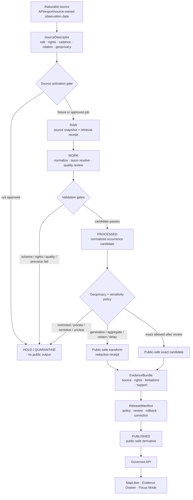

<!-- [KFM_META_BLOCK_V2]
doc_id: TODO: assign kfm://doc/<uuid>
title: iNaturalist Fauna Source README
type: standard
version: v1
status: draft
owners: TODO: assign fauna/source steward
created: TODO: verify original creation date
updated: 2026-05-07
policy_label: TODO: verify public|restricted label
related: [../README.md, ../../README.md, ../../GEOPRIVACY.md]
tags: [kfm, fauna, source, inaturalist, community-science, occurrence, geoprivacy]
notes: [Current target file was inspected through the GitHub connector before revision. doc_id, owners, created date, and policy_label remain placeholders until registry/steward verification.]
[/KFM_META_BLOCK_V2] -->

<a id="top"></a>

# iNaturalist Source

iNaturalist is a community-science occurrence source for KFM fauna that may support evidence-bound, public-safe wildlife observations only after rights, quality, taxonomy, geoprivacy, sensitivity, and release gates pass.

<p>
  
  
  
  
  
  
</p>

> [!IMPORTANT]
> **Impact block**
>
> | Field | Value |
> |---|---|
> | Status | `draft` source README revision |
> | Target path | `docs/domains/fauna/sources/inaturalist/README.md` |
> | Owners | `TODO: assign fauna/source steward` |
> | Source role | `community_science_occurrence` |
> | Authority scope | Occurrence evidence/corroboration only; not legal status, conservation status, abundance, true absence, or canonical KFM taxonomy |
> | Default public posture | Fail closed until source descriptor, rights, license, geoprivacy, sensitivity, evidence, validation, review, and release gates pass |
> | Public geometry | Exact public locations are denied by default for sensitive taxa, restricted geoprivacy, unclear rights, or missing review |
> | Runtime boundary | Public UI, Evidence Drawer, Focus Mode, exports, and API responses consume released KFM artifacts only |
> | Quick jumps | [Scope](#scope) · [Repo fit](#repo-fit) · [Accepted inputs](#accepted-inputs) · [Exclusions](#exclusions) · [Source-role contract](#source-role-contract) · [Lifecycle](#lifecycle) · [Default filters](#default-filters) · [Validation gates](#validation-gates) · [Quickstart](#quickstart) · [Review checklist](#review-checklist) · [Open verification](#open-verification) |

---

## Scope

This directory documents how iNaturalist-style observation data may be used inside the KFM fauna lane.

It preserves the existing project stance: iNaturalist can support fauna occurrence evidence only when observation quality, license, attribution, geoprivacy, taxon geoprivacy, coordinate precision, sensitivity, and source-role limits are explicit and reviewable.

### This README governs

| Surface | Responsibility |
|---|---|
| Source orientation | Explain what iNaturalist can and cannot support in KFM. |
| Source-role limits | Keep iNaturalist scoped as community-science occurrence support, not legal-status authority. |
| Intake posture | Require source descriptors and rights/geoprivacy review before live activation. |
| Public-safety posture | Deny precise public locations when sensitivity, rights, source geoprivacy, or steward review is unresolved. |
| Quality posture | Treat quality grade, location accuracy, coordinate obscuration, taxon identity, dates, media, and observer attribution as review inputs, not automatic truth. |
| Runtime posture | Keep public clients downstream of governed APIs, released artifacts, EvidenceBundles, release manifests, and correction lineage. |

### This README does not govern

| Not governed here | Owning surface |
|---|---|
| Fauna-wide domain architecture | [`../../README.md`](../../README.md) |
| Fauna source-role taxonomy | [`../README.md`](../README.md) and fauna source registry |
| Sensitive-location rules | [`../../GEOPRIVACY.md`](../../GEOPRIVACY.md) |
| Executable source validation | `tools/validators/fauna/` or repo-confirmed validator home |
| Executable policy | `policy/fauna/` or repo-confirmed policy home |
| Live connector implementation | `connectors/`, `packages/`, or repo-confirmed connector/package home |
| Lifecycle data | `data/raw/`, `data/work/`, `data/quarantine/`, `data/processed/`, `data/published/`, and release/proof homes |
| Public release decisions | `release/`, `data/proofs/`, `data/receipts/`, or repo-confirmed release/proof homes |

[Back to top](#top)

---

## Repo fit

`docs/domains/fauna/sources/inaturalist/README.md` is a source-directory README under the human-facing documentation control plane.

| Relationship | Status | Path / surface | Role |
|---|---:|---|---|
| This file | CONFIRMED target path | `docs/domains/fauna/sources/inaturalist/README.md` | iNaturalist source-family landing page |
| Source directory index | CONFIRMED adjacent file | [`../README.md`](../README.md) | Fauna source groups and source-role requirements |
| Fauna domain README | CONFIRMED adjacent domain file | [`../../README.md`](../../README.md) | Fauna boundary and domain reading order |
| Fauna geoprivacy | CONFIRMED adjacent domain file | [`../../GEOPRIVACY.md`](../../GEOPRIVACY.md) | Public-safe geometry and sensitive-location defaults |
| Source descriptor registry | NEEDS VERIFICATION | `data/registry/fauna/sources.yml` or repo-confirmed equivalent | Source role, authority scope, rights, cadence, use restrictions |
| Sensitivity registry | NEEDS VERIFICATION | `data/registry/fauna/sensitivity_policies.yml` or repo-confirmed equivalent | Taxon/source/steward geoprivacy triggers |
| Policy gates | NEEDS VERIFICATION | `policy/fauna/` or repo-confirmed equivalent | Deny/allow/abstain rules |
| Validators | NEEDS VERIFICATION | `tools/validators/fauna/` or repo-confirmed equivalent | Fail-closed source, license, geoprivacy, and public-safety checks |
| Release artifacts | NEEDS VERIFICATION | `release/`, `data/proofs/`, `data/published/` or repo-confirmed homes | Release manifest, proof pack, correction, rollback |

> [!NOTE]
> Directory Rules basis: iNaturalist is a **source family inside the fauna domain**, so its documentation belongs under `docs/domains/fauna/sources/`. It should not become a root-level `inaturalist/` or `fauna/` authority folder. Machine schemas, executable policy, validators, lifecycle data, and release artifacts stay in their own responsibility roots.

### Checked local source context

This is a checked-file context, not an exhaustive directory listing.

```text
docs/domains/fauna/
├── README.md                         # CONFIRMED adjacent domain README
├── GEOPRIVACY.md                     # CONFIRMED adjacent geoprivacy doc
└── sources/
    ├── README.md                     # CONFIRMED source directory index
    ├── ebird/README.md               # CONFIRMED peer source README checked for style/context
    └── inaturalist/README.md         # CONFIRMED target file
```

[Back to top](#top)

---

## Accepted inputs

Accepted inputs must remain source-role-scoped and release-gated.

| Input | Accepted? | Conditions |
|---|---:|---|
| Public iNaturalist observation metadata | ✅ Conditional | Source descriptor exists; license, geoprivacy, taxon geoprivacy, positional accuracy, observed time, taxon fields, quality grade, and attribution fields are retained where permitted. |
| Research Grade observations | ✅ Conditional | Useful quality signal, but not automatic KFM truth or public-release approval. |
| Needs ID observations | ✅ Conditional | May support discovery, triage, or review queues; public use requires stronger review and labeling. |
| Casual observations | ⚠️ Restricted | Default to discovery or quarantine unless a specific KFM review path allows them. |
| Observation photos/sounds | ✅ Conditional | Only when media license and attribution are compatible with intended KFM output. |
| Observation license fields | ✅ Required | Required for rights review and public-release eligibility. |
| Taxon metadata from iNaturalist | ✅ Conditional | Preserve as source taxonomy; resolve against KFM taxonomy before canonical taxon claims. |
| Coordinate accuracy / positional accuracy | ✅ Required for spatial claims | Missing, weak, or unsafe precision blocks exact public output. |
| `geoprivacy` and `taxon_geoprivacy` values | ✅ Required | Any restricted, obscured, private, or unresolved geoprivacy fails closed for public exact geometry. |
| `coordinates_obscured` indicators | ✅ Required | Obscured coordinates remain insufficient for exact public release by default. |
| API query parameters and retrieval metadata | ✅ Required for live connector work | Store query scope, time, filters, source version, retrieval time, response hash, and spec hash. |
| Public-safe derived aggregates | ✅ Conditional | Allowed only after evidence closure, geoprivacy transform, validation, policy, review, release manifest, correction path, and rollback target. |

### Candidate public-use evidence fields

These are candidate fields to preserve during source review. Final field names must match the actual source/API/export and repo schemas.

| Field family | Examples | Why it matters |
|---|---|---|
| Observation identity | `id`, source URL, source record ID | Deterministic linkage and correction handling |
| Taxon identity | `taxon_id`, `taxon.name`, `preferred_common_name`, rank | Taxonomy resolution and ambiguity handling |
| Time | `observed_on`, `time_observed_at`, `created_at`, `updated_at` | Temporal support and stale-state checks |
| Location | `geo`, coordinates, place ID, positional accuracy, obscuration flags | Spatial support and geoprivacy decisions |
| Quality | `quality_grade`, DQA-derived indicators | Review and admissibility gates |
| Rights | observation license, photo/sound license, attribution | Public-release eligibility |
| Geoprivacy | `geoprivacy`, `taxon_geoprivacy`, `coordinates_obscured` | Public exact-location denial and transform rules |
| Attribution | observer/user attribution, media attribution | License compliance and citation support |
| Evidence refs | source descriptor, retrieval receipt, validation report | EvidenceBundle closure |

[Back to top](#top)

---

## Exclusions

| Does not belong in public iNaturalist outputs | Handling | Reason |
|---|---|---|
| Private coordinates | DENY public use; restricted review only if source terms allow | Private/source-protected coordinates are not public KFM material. |
| Trusted-project-only coordinates | DENY public use unless explicit steward/legal/source review approves a restricted workflow | Trusted access does not imply public release. |
| Exact sensitive species locations | DENY by default | Avoid exposing rare, protected, nesting, denning, roosting, hibernacula, spawning, cave, colony, or steward-controlled locations. |
| Obscured coordinates treated as exact | DENY | Obscuration is a warning signal, not a public precision guarantee. |
| Unlicensed or incompatible media | DENY public reuse; hold or omit media | Public release needs compatible media rights and attribution. |
| iNaturalist taxonomy as canonical KFM taxonomy | HOLD until resolved | Source taxonomy is evidence input, not canonical KFM taxon identity. |
| iNaturalist as legal-status authority | DENY | Community-science observations are not Kansas or federal legal-status authority. |
| Abundance claims from individual observations | ABSTAIN or hold for stronger evidence | Observations alone do not prove abundance. |
| True absence claims from missing observations | ABSTAIN | Lack of public observations is not absence evidence. |
| Population trend claims from casual observation counts alone | ABSTAIN or hold for modeled/reviewed analysis | Observation volume is affected by observer effort and platform bias. |
| Raw API payloads in docs | DENY | Source data belongs in governed lifecycle paths, not Markdown. |
| Browser-to-iNaturalist public fetch | DENY | Public runtime uses governed KFM APIs and released artifacts only. |
| Direct AI/model access to source data | DENY | AI may summarize released EvidenceBundles only. |
| Secrets, API tokens, private URLs, cookies | DENY; store out-of-band | Secrets never belong in docs, fixtures, public bundles, logs, or prompts. |

[Back to top](#top)

---

## Source-role contract

| Decision area | KFM posture |
|---|---|
| Source family | `iNaturalist` |
| Source class | `community_science_observation` |
| Allowed role | Occurrence evidence, corroboration, discovery, triage, and public-safe derived occurrence support after review |
| Denied role | Legal-status authority, conservation-status authority, canonical taxonomy authority, abundance authority, true-absence authority, population-trend authority by itself |
| Default geometry class | Restricted until geoprivacy, sensitivity, precision, rights, and release gates pass |
| Public exact geometry | Denied by default; allowed only for non-sensitive, rights-compatible, source-geoprivacy-compatible, evidence-complete, reviewed records |
| Public aggregate/generalized geometry | Conditional; requires redaction/generalization receipt and release manifest |
| Taxonomy behavior | Preserve iNaturalist taxon fields as source evidence; resolve to KFM taxon model before canonical claims |
| Media behavior | Preserve license and attribution; do not publish incompatible media |
| Runtime behavior | Released KFM artifacts only; no public source API reads |
| Correction behavior | Source updates, ID changes, license changes, geoprivacy changes, deleted observations, or taxon revisions must be able to supersede public derivatives |

[Back to top](#top)

---

## Lifecycle

iNaturalist data follows the same KFM lifecycle as other fauna sources. Public outputs are released derivatives, not raw community-science records.



### Lifecycle rules

1. **Source activation comes before live intake.** A live iNaturalist connector must not run as a public-release source without a SourceDescriptor and source-activation decision.
2. **RAW is not public.** Raw API/export payloads remain internal lifecycle material.
3. **WORK is not proof.** Normalization and filtering create candidates, not public truth.
4. **Quarantine is normal.** Rights gaps, geoprivacy restrictions, missing precision, unresolved taxonomy, unsupported quality, or sensitivity concerns should hold records rather than force publication.
5. **Processed is still not public.** Public release requires evidence closure, policy, review, release manifest, correction path, and rollback.
6. **Public derivatives must be reversible.** Generalized, redacted, aggregated, or delayed outputs require transform receipts and rollback targets.

[Back to top](#top)

---

## Default filters

> [!CAUTION]
> These filters are a proposed KFM source-screening posture, not proof that a connector currently exists. They must be implemented only after repo-native schemas, validators, policies, source terms, and source descriptor conventions are verified.

### Candidate review filters

| Filter family | Default posture | Notes |
|---|---|---|
| Jurisdiction / scope | Kansas or KFM-defined area of interest | Use source descriptor query scope and spatial bounds. |
| Quality grade | Prefer `research`; allow `needs_id` only for triage or explicitly labeled review | Research Grade is not automatic KFM proof. |
| Captive / cultivated | Exclude or hold unless the claim explicitly concerns captivity/cultivation | Fauna occurrence claims should not silently include captive records. |
| Coordinates present | Required for spatial occurrence claims | Missing coordinates can still support non-spatial triage. |
| Positional accuracy | Required and thresholded for exact or fine-scale support | Threshold must be set in policy/registry. |
| Geoprivacy | Exact public release requires compatible source geoprivacy and KFM policy | Obscured/private/taxon-obscured values fail closed for exact public use. |
| License | Required for public release | Observation and media licenses must be compatible with intended use. |
| Media license | Required if media is reused | Observation license does not automatically authorize all media uses. |
| Taxon resolution | Required before canonical taxon claims | Ambiguous or changing taxa require receipts or review. |
| Sensitive taxa | Deny exact public geometry by default | Use KFM geoprivacy transform and steward review. |

### Example source query intent

```text
PROPOSED source-screening intent:
- limit to Kansas or approved KFM area of interest
- prefer Research Grade observations for first public-safe derivatives
- require georeferenced records where spatial support is needed
- require compatible observation/media licenses for public outputs
- exclude or hold private, obscured, taxon-obscured, low-precision, or sensitive-location records for exact public output
- preserve source quality, license, geoprivacy, positional accuracy, observer attribution, media attribution, and taxon metadata
```

[Back to top](#top)

---

## Validation gates

| Gate | Required behavior | Blocking failure |
|---|---|---|
| Source descriptor | iNaturalist source role, authority scope, rights, citation, cadence, access mode, query scope, and geoprivacy behavior recorded | Unknown source role or rights |
| Source activation | Live connector approved before live source jobs | No activation decision |
| License check | Observation and media licenses compatible with output | Unlicensed/incompatible public reuse |
| Attribution check | Observer and media attribution retained where required | Missing attribution for public reuse |
| Quality check | Quality grade and DQA-relevant fields preserved and reviewed | Unsupported quality for public claim |
| Geometry check | Coordinates, precision, CRS/coordinate system, and obscuration status resolved | Missing precision for exact/fine-scale spatial claim |
| Geoprivacy check | `geoprivacy`, `taxon_geoprivacy`, and `coordinates_obscured` honored | Restricted/obscured/private data in public exact output |
| Taxonomy check | iNaturalist taxon identity resolved or held | Silent merge into canonical KFM taxonomy |
| Sensitivity check | Sensitive taxa and sensitive places fail closed | Exact sensitive public geometry |
| Evidence check | EvidenceRef resolves to EvidenceBundle | Unresolved source/evidence |
| Release check | ReleaseManifest, proof, correction path, and rollback target present | Publication by file copy or ad hoc export |
| Runtime check | API/Evidence Drawer/Focus Mode use released public-safe artifacts only | Public direct source fetch or model-source bypass |

### Negative fixtures to require

| Fixture | Expected outcome |
|---|---|
| Observation has private geoprivacy | `DENY_PUBLIC_EXACT` |
| Observation has taxon geoprivacy obscured/private | `DENY_PUBLIC_EXACT` |
| Coordinates are obscured | `DENY_PUBLIC_EXACT` unless transformed/aggregated and receipted |
| Missing positional accuracy | `HOLD` or `ABSTAIN` for fine-scale claim |
| License is missing/incompatible | `DENY_PUBLIC_RELEASE` |
| Media license incompatible with output | `DENY_MEDIA_PUBLICATION` |
| iNaturalist used as legal-status authority | `DENY_SOURCE_ROLE` |
| Taxon resolution ambiguous | `HOLD` or `ABSTAIN` |
| Sensitive species exact point requested by public UI | `DENY` |
| Focus Mode asks for exact restricted location | `DENY` |
| Public aggregate lacks EvidenceBundle | `ABSTAIN` or `ERROR`, depending on failure class |
| Release bundle lacks rollback target | `ERROR` |

[Back to top](#top)

---

## Runtime handoff

| Runtime surface | iNaturalist-specific obligation |
|---|---|
| Governed API | Return only released public-safe derivatives with finite outcomes. |
| MapLibre layers | Render released layer manifests only; no raw source rows and no browser-to-iNaturalist fetch. |
| Evidence Drawer | Show source role, quality grade, license posture, geoprivacy posture, spatial support class, EvidenceBundle, release ID, caveats, correction state. |
| Focus Mode | Use released EvidenceBundles only; cite or abstain; deny exact sensitive-location questions. |
| Search/index | Index public-safe released derivatives only; no hidden exact coordinates. |
| Exports/reports | Include source role, license/attribution, quality caveats, spatial generalization, and correction path. |
| Review console | May inspect candidates subject to role/access controls; public artifacts stay separate. |

### Runtime outcome language

| Outcome | Use when |
|---|---|
| `ANSWER` | Released public-safe derivative exists, EvidenceBundle resolves, and policy allows the answer. |
| `ABSTAIN` | Evidence is missing, ambiguous, stale, unresolved, or too weak for the requested claim. |
| `DENY` | Rights, source terms, geoprivacy, sensitivity, access policy, or source role forbids the requested output. |
| `ERROR` | System/schema/runtime failure prevents reliable response. |

[Back to top](#top)

---

## Quickstart

Run these only from a verified checkout. Commands are intentionally local/no-network unless a source activation decision explicitly allows live access.

### 1. Inspect the source docs

```bash
rg -n "iNaturalist|community-science|geoprivacy|license|quality_grade|source role" \
  docs/domains/fauna \
  data/registry/fauna \
  policy/fauna \
  tools/validators/fauna
```

Expected result: iNaturalist remains scoped as occurrence evidence, not legal-status authority.

### 2. Validate the source descriptor

```bash
# PROPOSED: adapt to the repo-native validator command after tool paths are verified.
python tools/validators/fauna/validate_sources.py \
  --source inaturalist \
  --require-role community_science_occurrence \
  --fail-on-unknown-rights \
  --json
```

Expected result: source role, rights, cadence, citation, geoprivacy, and authority scope are explicit.

### 3. Validate geoprivacy before any public output

```bash
# PROPOSED: adapt to the repo-native validator command after tool paths are verified.
python tools/validators/fauna/validate_geoprivacy.py \
  --source inaturalist \
  --public-release-check \
  --deny-sensitive-exact \
  --json
```

Expected result: private/obscured/taxon-obscured/sensitive exact locations are denied or transformed with receipts.

### 4. Run release dry-run before publication

```bash
# PROPOSED: dry-run only; do not publish.
python tools/validators/fauna/run_all.py \
  --source inaturalist \
  --mode release-dry-run \
  --no-network \
  --json
```

Expected result: `ANSWER`, `ABSTAIN`, `DENY`, and `ERROR` cases are visible, and public release remains blocked unless all evidence/policy/release gates pass.

[Back to top](#top)

---

## Review checklist

Before merging iNaturalist source-doc or source-pipeline changes, verify:

- [ ] `doc_id`, owners, created date, and policy label are resolved or intentionally left as TODO placeholders.
- [ ] iNaturalist is described as community-science occurrence support only.
- [ ] The document does not imply iNaturalist is legal-status, conservation-status, abundance, true-absence, population-trend, or canonical taxonomy authority.
- [ ] Source descriptor, rights, citation, cadence, and source-role fields are required before live activation.
- [ ] Observation license and media license handling are both visible.
- [ ] Geoprivacy, taxon geoprivacy, coordinate obscuration, and positional accuracy are treated as blocking public-safety fields.
- [ ] Sensitive exact public geometry is denied by default.
- [ ] Public outputs are released derivatives, not raw API payloads.
- [ ] Public API, map, Evidence Drawer, Focus Mode, search, exports, and reports do not read directly from RAW, WORK, QUARANTINE, source APIs, or model runtime.
- [ ] Negative fixtures cover private/obscured coordinates, missing license, incompatible media, ambiguous taxonomy, source-role overclaim, sensitive exact point, and missing rollback.
- [ ] Release requires EvidenceBundle, policy decision, validation report, release manifest, correction path, and rollback target.
- [ ] Any new path follows responsibility-root placement and does not create a new root-level source/domain authority.

[Back to top](#top)

---

## Open verification

| Item | Status | Needed proof |
|---|---:|---|
| Registered `doc_id` | TODO | Document registry entry. |
| Owners | TODO | CODEOWNERS, steward register, or domain owner assignment. |
| Created date | TODO | Git history or maintainer-approved first meaningful commit date. |
| Policy label | TODO | Repo policy classification for this source README. |
| Source descriptor home | NEEDS VERIFICATION | Confirm exact source registry path and schema. |
| iNaturalist source terms | NEEDS VERIFICATION | Current terms, API usage rules, licensing, attribution, redistribution, and downstream-use constraints. |
| Observation/media license policy | NEEDS VERIFICATION | Which licenses KFM permits for public outputs and which outputs are noncommercial/public/steward-only. |
| Geoprivacy thresholds | NEEDS VERIFICATION | Approved precision thresholds, generalization classes, aggregation units, embargo windows, and withheld-count behavior. |
| Live connector path | UNKNOWN | Confirm whether connector code exists and where it belongs. |
| Validator path and command names | PROPOSED | Confirm repo-native validator implementation. |
| Policy toolchain | NEEDS VERIFICATION | Confirm OPA/Conftest/Rego or repo-native policy runner. |
| CI enforcement | UNKNOWN | Workflow evidence and check results. |
| Release/proof object names | NEEDS VERIFICATION | ReleaseManifest, ProofPack, EvidenceBundle, CorrectionNotice, RollbackCard conventions. |
| Existing source-directory peers | NEEDS VERIFICATION | Exhaustive source directory listing, because only target and selected adjacent files were checked. |

[Back to top](#top)

---

## FAQ

### Can KFM use iNaturalist observations?

Yes, conditionally. iNaturalist may support occurrence evidence or discovery after source-role, rights, license, quality, taxonomy, geoprivacy, sensitivity, and release checks pass.

### Is iNaturalist a legal-status authority?

No. Legal and conservation status require separate compatible authority evidence.

### Can public maps show iNaturalist exact points?

Not by default. Public exact geometry requires non-sensitive status, compatible rights, open geoprivacy/taxon geoprivacy, safe positional accuracy, evidence closure, policy approval, review, release, correction path, and rollback. Sensitive or unclear cases deny exact public exposure.

### Does Research Grade mean KFM can publish the record?

No. Research Grade is a useful quality signal, not a release decision. KFM still requires license, geoprivacy, sensitivity, taxonomy, evidence, policy, review, and release gates.

### Can KFM reuse iNaturalist photos?

Only when the media license and attribution requirements are compatible with the intended KFM output. Observation and media licensing must be checked separately.

### Can Focus Mode answer where an iNaturalist observation occurred?

Only at the released public-safe spatial support level. It must not reveal private, obscured, sensitive, or unreleased exact locations.

[Back to top](#top)

---

## Appendix

<details>
<summary>Suggested source descriptor sketch</summary>

```yaml
source_id: inaturalist
source_name: iNaturalist
source_family: community_science_observation
domain: fauna
status: TODO: verify source activation status
source_role: community_science_occurrence
authority_scope:
  allowed:
    - occurrence_evidence
    - discovery_queue
    - corroboration
    - public_safe_derived_occurrence_support
  denied:
    - legal_status_authority
    - conservation_status_authority
    - canonical_taxonomy_authority
    - abundance_authority
    - true_absence_authority
rights_status: TODO: verify current observation/media license handling
access_class: public_api_or_export_TODO_VERIFY
geoprivacy_fields:
  - geoprivacy
  - taxon_geoprivacy
  - coordinates_obscured
  - positional_accuracy
public_exact_geometry_default: deny
public_release_requires:
  - source_descriptor
  - rights_review
  - observation_license_review
  - media_license_review_if_media_used
  - geoprivacy_review
  - sensitivity_review
  - taxonomy_resolution
  - evidence_bundle
  - validation_report
  - policy_decision
  - release_manifest
  - correction_path
  - rollback_target
notes:
  - iNaturalist data may support occurrence evidence only after KFM gates pass.
  - Do not ingest private coordinates into public outputs.
  - Do not use iNaturalist as legal-status authority.
```

</details>

<details>
<summary>Maintainer update triggers</summary>

Update this README when any of the following changes:

- iNaturalist API usage or source terms change.
- KFM changes accepted observation/media license classes.
- KFM changes geoprivacy thresholds, aggregation units, embargo rules, or sensitivity policy.
- Source descriptor schema changes.
- Validator or policy paths change.
- Live connector activation state changes.
- Public layer, API, Evidence Drawer, Focus Mode, export, or search behavior changes.
- Correction or rollback conventions change.
- A source-role or taxonomy-resolution ADR supersedes the current posture.

</details>

<p align="right"><a href="#top">Back to top ↑</a></p>
