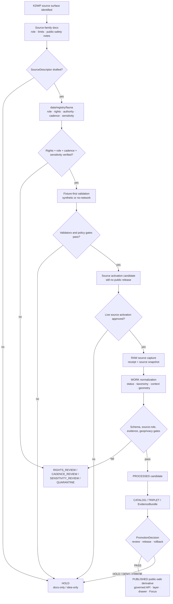

<!-- [KFM_META_BLOCK_V2]
doc_id: kfm://doc/TODO-register-kdwp-source-readme-uuid
title: KDWP Source Directory README
type: standard
version: v1
status: draft
owners: TODO(fauna-source-stewards)
created: TODO(verify-original-created-date-or-set-on-first-meaningful-commit)
updated: 2026-05-07
policy_label: TODO(verify-public-or-restricted)
related: ["../README.md", "../../README.md", "../../SOURCE_ROLES.md", "../../GEOPRIVACY.md", "../../VALIDATION.md", "../../CONTROL_PLANE.md", "../../../../../data/registry/fauna/README.md"]
tags: [kfm, fauna, kdwp, kansas, source-directory, legal-status-authority, stewardship, geoprivacy, public-safety]
notes: [Revises existing short KDWP source notes; connector remains disabled; owners, doc_id, created date, policy_label, official source URLs, source terms, source descriptor, cadence, rights, and steward-sensitive release rules require verification.]
[/KFM_META_BLOCK_V2] -->

<a id="top"></a>

# KDWP Source Directory

Governed source-family landing page for the `kdwp` fauna source family before any Kansas status, stewardship, occurrence, range, habitat-context, or public-safe derivative can rely on it.

<p>
  
  
  
  
  
  
</p>

> [!IMPORTANT]
> **Impact block**
>
> | Field | Value |
> |---|---|
> | Status | `experimental` source-family documentation; metadata remains `draft` until steward review |
> | Target path | `docs/domains/fauna/sources/kdwp/README.md` |
> | Owners | `TODO(fauna-source-stewards)` |
> | Connector posture | `disabled` until source descriptor, rights, cadence, geoprivacy, fixtures, release review, and rollback path are verified |
> | Primary source-role posture | `NEEDS VERIFICATION`; likely roles may include `legal_status_authority`, `conservation_status_authority`, `steward_restricted_source`, `occurrence_source`, `habitat_context`, or `documentary_source` depending on the exact KDWP source surface |
> | Public geometry posture | Public exact sensitive geometry is denied by default |
> | Public claim posture | KDWP source claims are scoped inputs, not automatic canonical legal truth, occurrence truth, range truth, habitat truth, or public-release permission |
> | Runtime posture | Public clients, MapLibre, Evidence Drawer, exports, and Focus Mode consume released KFM artifacts through governed APIs only |
> | Quick jumps | [Scope](#scope) · [Repo fit](#repo-fit) · [Accepted inputs](#accepted-inputs) · [Exclusions](#exclusions) · [Source-role posture](#source-role-posture) · [Activation flow](#activation-flow) · [Public-safety rules](#public-safety-rules) · [Quickstart](#quickstart) · [Review gates](#review-gates) · [Open verification](#open-verification) |

---

## Scope

This directory documents the KDWP source family for the KFM fauna lane. It explains what KDWP-related source material may support, what it must not be used for, and what verification must happen before the source family is used in source registries, validators, release bundles, public map layers, Evidence Drawer payloads, Focus Mode, or governed API responses.

The existing KDWP note already established the safest baseline:

- `PROPOSED / NEEDS VERIFICATION`;
- connector disabled;
- public exact sensitive geometry denied by default;
- source descriptor required before activation;
- rights and redistribution review required;
- geoprivacy controls required;
- fixture-based validation required;
- release review and rollback required.

This README keeps that posture and expands it into a reviewable, repo-ready source-directory document.

### This directory governs

| Surface | KDWP source-directory responsibility |
|---|---|
| Source-family orientation | Explain how the `kdwp` source family fits KFM fauna governance. |
| Source-role review | Keep legal/status, conservation, occurrence, steward-restricted, habitat-context, and documentary roles distinct. |
| Rights and redistribution posture | Require verification before public use, downloads, exports, source descriptors, or derived artifacts. |
| Geoprivacy posture | Deny public exact sensitive geometry unless a verified policy exception exists. |
| Public claim boundaries | Prevent KDWP source material from being overused as occurrence proof, legal truth, habitat proof, range proof, or release permission without compatible evidence. |
| Connector readiness | Keep live connector activation blocked until source descriptor, rights, cadence, steward review, fixtures, policy checks, release review, and rollback path exist. |
| Review navigation | Point contributors to fauna domain docs, source-role docs, geoprivacy docs, validation docs, and registry docs. |

### This directory does not govern

| Not governed here | Owning surface |
|---|---|
| Whole fauna lane scope | [`../../README.md`](../../README.md) |
| Source-family index | [`../README.md`](../README.md) |
| Fauna source-role taxonomy | [`../../SOURCE_ROLES.md`](../../SOURCE_ROLES.md) |
| Sensitive-location and public geometry rules | [`../../GEOPRIVACY.md`](../../GEOPRIVACY.md) |
| Validation gates and fixture expectations | [`../../VALIDATION.md`](../../VALIDATION.md) |
| Domain ownership, cadence, and active risk register | [`../../CONTROL_PLANE.md`](../../CONTROL_PLANE.md) |
| Source descriptors and registry backlog | [`../../../../../data/registry/fauna/README.md`](../../../../../data/registry/fauna/README.md) |
| Machine schemas | Accepted schema home after ADR / repo verification |
| Policy-as-code | `policy/fauna/` or repo-confirmed policy home |
| Validator implementation | `tools/validators/fauna/` or repo-confirmed validator home |
| Raw, work, quarantine, processed, proof, receipt, release, and published data | `data/` and `release/` responsibility roots |

<p align="right"><a href="#top">Back to top ↑</a></p>

---

## Repo fit

`docs/domains/fauna/sources/kdwp/README.md` is a README-like source-family document under `docs/`, the human-facing KFM control plane.

```text
docs/domains/fauna/
├── README.md
├── CONTROL_PLANE.md
├── SOURCE_ROLES.md
├── GEOPRIVACY.md
├── VALIDATION.md
├── MIGRATION_AND_CONTINUITY.md
└── sources/
    ├── README.md
    ├── ebird/
    │   └── README.md
    ├── gbif/
    │   └── README.md
    └── kdwp/
        └── README.md                  # this file
```

### Directory Rules basis

This path follows the KFM responsibility-root rule:

| Concern | Correct responsibility root | KDWP source-directory rule |
|---|---|---|
| Human-readable source documentation | `docs/domains/fauna/sources/kdwp/` | Explain role, status, limits, review needs, and activation blockers. |
| Source descriptor and verification backlog | `data/registry/fauna/` | Store role, rights, authority scope, cadence, access class, sensitivity posture, and verification state. |
| RAW source capture | `data/raw/fauna/kdwp/` | Never store source payloads in docs. |
| WORK / QUARANTINE records | `data/work/fauna/kdwp/`, `data/quarantine/fauna/kdwp/` | Keep unresolved source material out of public docs and public runtime. |
| Machine schemas | `schemas/` or ADR-accepted schema home | Shape validation belongs outside prose. |
| Executable policy | `policy/fauna/` | Policy owns allow, deny, restrict, abstain, redaction, and promotion obligations. |
| Validators and tests | `tools/`, `tests/`, `fixtures/`, or repo-confirmed homes | Executable checks prove the rules. |
| Receipts, proofs, and release | `data/receipts/`, `data/proofs/`, `release/` | Process memory, proof support, release decisions, correction, and rollback stay separate. |
| Runtime / UI | `apps/`, `packages/`, or repo-confirmed runtime homes | Public clients use governed APIs and released public-safe artifacts. |

> [!CAUTION]
> Do not create a root-level `kdwp/`, `fauna/`, `wildlife/`, or `species/` folder to solve a source-family problem. Place files by responsibility root.

<p align="right"><a href="#top">Back to top ↑</a></p>

---

## Accepted inputs

This directory accepts source-family documentation and review guidance only.

| Input | Accepted here? | Conditions |
|---|---:|---|
| KDWP source-family overview | ✅ | Must preserve `PROPOSED / NEEDS VERIFICATION` until source descriptor and rights are verified. |
| Source-role notes | ✅ | Must distinguish legal/status, conservation, occurrence, steward-restricted, habitat-context, derived-model, and documentary support. |
| Rights and redistribution notes | ✅ | Must not claim public reuse until source terms are verified. |
| Cadence and version notes | ✅ | Must identify source date/version/update cadence when known; otherwise mark `NEEDS VERIFICATION`. |
| Kansas status or county-summary documentation | ✅ | Must avoid implying exact occurrence or presence unless compatible occurrence evidence exists. |
| Steward-sensitive review notes | ✅ | Must not expose restricted details; public docs can state obligation classes. |
| Geoprivacy guidance | ✅ | Must align with [`../../GEOPRIVACY.md`](../../GEOPRIVACY.md). |
| Validation expectations | ✅ | Must align with [`../../VALIDATION.md`](../../VALIDATION.md) and remain fixture-first until live activation is approved. |
| Negative examples | ✅ | Preferred when they demonstrate `DENY`, `ABSTAIN`, `HOLD`, `QUARANTINE`, or `ERROR`. |
| Source activation blockers | ✅ | Must be explicit, reviewable, and traceable to registry or policy obligations. |

### Accepted source maturity states

| State | Meaning | Public release allowed? |
|---|---|---:|
| `IDEA_ONLY` | KDWP source surface is named but not yet described. | No |
| `DESCRIPTOR_DRAFT` | Source descriptor is being drafted. | No |
| `RIGHTS_REVIEW` | Source terms, license, redistribution, attribution, or record-level rights are unresolved. | No |
| `CADENCE_REVIEW` | Update timing, effective dates, or source versioning are unresolved. | No |
| `SENSITIVITY_REVIEW` | Source may include protected taxa, exact locations, project-review materials, or steward-controlled details. | No |
| `FIXTURE_ONLY` | Synthetic or no-network fixture path exists. | No production release |
| `INTERNAL_RESTRICTED` | Steward or internal review only. | No public release |
| `RELEASE_CANDIDATE` | Public-safe candidate assembled but not promoted. | Not yet |
| `PUBLISHED_PUBLIC_SAFE` | Governed release approved for a specific scope. | Yes, within release scope |
| `SUSPENDED` | Source or derivative paused due to risk, defect, rights issue, or source drift. | No new promotion |
| `WITHDRAWN` | Public release withdrawn or superseded. | No |

<p align="right"><a href="#top">Back to top ↑</a></p>

---

## Exclusions

These items must not be committed under `docs/domains/fauna/sources/kdwp/`.

| Excluded item | Correct handling | Why |
|---|---|---|
| Raw KDWP downloads, source exports, scraped pages, API captures, or PDF extracts | `data/raw/fauna/kdwp/` after source descriptor and receipt handling | Docs are not lifecycle storage. |
| Work-stage normalized records | `data/work/fauna/kdwp/` | WORK products are mutable and not public documentation. |
| Quarantined records | `data/quarantine/fauna/kdwp/` | May contain unresolved rights, source-role, taxonomy, or sensitivity defects. |
| Exact sensitive coordinates | Restricted internal store only | Public docs must not leak protected locations. |
| Protected nest, den, roost, hibernacula, lek, spawning, cave, colony, nursery, telemetry, or steward-controlled precise locations | Restricted store or steward review packet only | These are high-risk public-safety surfaces. |
| Source credentials, tokens, private URLs, cookies, or access keys | Secret manager / ignored local environment | Secrets never belong in docs. |
| Machine schemas | Accepted schema home after ADR / repo verification | Schemas own machine-checkable shape. |
| Policy-as-code | `policy/fauna/` or repo-confirmed policy home | Policy must be executable and tested. |
| Validator implementation | `tools/validators/fauna/` or repo-confirmed validator home | Validators must emit reports and run in CI/tooling. |
| Generated validation reports | Build artifacts, receipts, or proof homes | Reports must be reproducible and separated. |
| Release manifests, proof packs, correction notices, rollback cards | `release/`, `data/proofs/`, `data/receipts/`, or repo-confirmed homes | Release decisions and proof objects are trust records, not prose. |
| Direct AI answers or model traces | Nowhere as evidence | AI is interpretive and evidence-bounded; EvidenceBundle and policy outrank generated language. |

<p align="right"><a href="#top">Back to top ↑</a></p>

---

## Source-role posture

KDWP-related sources must be split by source surface. A single agency/source family can contain several different evidence roles, and each role has different public-claim limits.

| Candidate source role | Can support after verification | Must not imply | Required proof before use |
|---|---|---|---|
| `legal_status_authority` | Kansas legal or regulatory species status within declared jurisdiction, date/version, and source scope. | Occurrence truth, abundance, habitat suitability, exact-location release permission, or federal status outside scope. | Source descriptor, official source reference, effective date/version, jurisdiction, rights, cadence, citation policy, EvidenceRefs. |
| `conservation_status_authority` | Conservation or concern status when the source surface explicitly supports that role. | Legal protection, occurrence truth, or public exact geometry permission unless separately supported. | Authority scope, status vocabulary, review date, limitations, citation, EvidenceRefs. |
| `steward_restricted_source` | Controlled-access or review-sensitive records, obligations, project-review context, or sensitive stewardship information. | Public exact geometry or unrestricted public payload. | Access class, steward review, public geometry class, redaction policy, restricted-field denial, rollback plan. |
| `occurrence_source` | Reviewed occurrence evidence only if the source surface actually provides occurrence records under verified terms. | Legal status authority, complete census, true absence, trend, abundance, or public exact location permission. | Event time, spatial support, coordinate uncertainty, source refs, rights, sensitivity class, EvidenceBundle policy. |
| `habitat_context` | Critical habitat, range context, county context, or environmental support when the source surface supports it. | Proof that a species was observed at a point. | Context layer/source, method, spatial/temporal extent, limitations, source role, rights, EvidenceRefs. |
| `derived_model` | Suitability, range, summary, or modeled support if derived products are created from verified inputs. | Canonical occurrence, legal status, raw evidence, or exact location truth. | Model version, inputs, method, uncertainty, rebuild path, evidence bundle, release manifest. |
| `documentary_source` | Cited reports, notices, public pages, research, forms, or narrative evidence. | Precise geometry, current occurrence, legal status, or public release unless scope supports it. | Citation, date, source role, confidence, review state, spatial interpretation, EvidenceRefs. |
| `data_mirror_or_cache` | Technical mirroring, digest comparison, reproducibility, and availability checks. | Independent evidence authority. | Upstream source ID, sync time, digest, mirror scope, integrity policy. |

> [!WARNING]
> Missing `source_role`, unknown rights, unclear authority scope, or unresolved sensitivity must block public promotion. The safe state is `HOLD`, `QUARANTINE`, `ABSTAIN`, or `DENY`.

### Claim compatibility

| Claim | Minimum compatible role | Required behavior |
|---|---|---|
| “Species X has Kansas status Y as of date Z.” | `legal_status_authority` | Include jurisdiction, effective date/version, status code, citation, EvidenceBundle, and review state. |
| “Species X is known from County Y.” | Depends on source surface | County status/context is not automatically exact occurrence. Use cautious language and cite compatible source support. |
| “Species X was observed at Location Y.” | `occurrence_source` or compatible `monitoring_source` | Requires event time, spatial support, uncertainty, rights, sensitivity, and evidence. |
| “This area is habitat or review context for Species X.” | `habitat_context` or compatible `derived_model` | Label as context/model/support, not observed occurrence. |
| “This public layer can show exact points.” | Role alone is insufficient | Requires rights, sensitivity, geoprivacy, public geometry class, evidence, review, release, and rollback. |
| “Focus Mode can answer this KDWP-based question.” | Compatible role plus EvidenceBundle | Return `ANSWER`, `ABSTAIN`, `DENY`, or `ERROR`; never reveal restricted locations. |

<p align="right"><a href="#top">Back to top ↑</a></p>

---

## Activation flow

A KDWP source-family README is early in the trust path. It documents intent and obligations; it does not publish or activate ingestion.



### Flow rules

1. A KDWP source-family doc is **not** a source activation decision.
2. Source descriptor, rights, sensitivity, cadence, access class, and authority scope are required before live use.
3. Synthetic/no-network fixtures should prove behavior before live source work.
4. Public derivatives require geoprivacy transforms, receipts, EvidenceBundles, catalog closure, policy decisions, release state, correction path, and rollback target.
5. Public clients and Focus Mode consume governed public-safe release surfaces only.

<p align="right"><a href="#top">Back to top ↑</a></p>

---

## Public-safety rules

### Non-negotiables

| Rule | Required behavior | Failure outcome |
|---|---|---|
| Connector disabled until verified | Do not activate live KDWP ingestion from docs alone. | `HOLD` |
| Source descriptor required | Declare source role, authority scope, rights, cadence, access class, attribution, and sensitivity posture. | `QUARANTINE` / `HOLD` |
| Rights and redistribution required | Unknown or incompatible rights block public release. | `DENY` |
| Geoprivacy required | Exact sensitive public geometry is denied by default. | `DENY` |
| Fixture-first validation required | No live source connector should bypass no-network fixtures. | `HOLD` |
| Legal/status is not occurrence | A status list or county context does not prove a site-level occurrence. | `ABSTAIN` |
| Habitat/context is not occurrence | Range, critical habitat, or review context does not prove observation by itself. | `ABSTAIN` |
| Steward-restricted records stay restricted | Controlled-access details do not enter public API/layers/exports/Focus. | `DENY` |
| EvidenceBundle required | Public claims and Focus answers must resolve supporting evidence. | `ABSTAIN` / `DENY` |
| Release and rollback required | Public artifacts require review, release manifest, correction path, and rollback target. | `HOLD` / `ERROR` |

### Public payload deny list

Public KDWP-derived payloads must not include:

- restricted exact coordinates;
- `restricted_geometry_ref` contents;
- source-native private locality descriptions;
- nest, den, roost, hibernacula, lek, cave, colony, spawning, nursery, breeding-site, monitoring-station, telemetry, or steward-controlled exact geometry;
- private landowner or project-specific sensitive details;
- reviewer, steward, landowner, collector, or observer details when sensitive or not release-cleared;
- source credentials, access tokens, cookies, private URLs, or hidden query strings;
- raw source payloads;
- suppressed-group details or hidden rejoin keys;
- AI prompt context containing restricted geometry.

### Required public warning pattern

Use this warning, or a steward-approved equivalent, for public KDWP-derived summaries:

> This KDWP-derived KFM output is a public-safe, evidence-bound summary for the released scope only. It does not expose exact sensitive locations, does not include restricted records, and must not be interpreted as site-level occurrence, abundance, true absence, population trend, complete census, habitat proof, or legal advice unless separately supported by compatible released evidence.

<p align="right"><a href="#top">Back to top ↑</a></p>

---

## Quickstart

Run these checks only from a verified repository checkout.

### 1. Confirm repository and target path

```bash
git status --short
git branch --show-current

find docs/domains/fauna/sources/kdwp -maxdepth 2 -type f | sort
```

Expected result: this README is visible, and Git commands do not return fatal repository errors.

### 2. Inspect KDWP-related references

```bash
rg -n --no-heading \
  "KDWP|kdwp|Threatened|Endangered|SINC|county|legal_status|source_role|geoprivacy|EvidenceBundle|DENY|ABSTAIN" \
  docs data/registry policy tools tests schemas contracts 2>/dev/null
```

Expected result: KDWP-related docs, registry entries, policy rules, validators, or fixtures are visible without implying activation.

### 3. Verify source descriptor before live use

```bash
# PROPOSED: replace with repo-native validator when confirmed.
python tools/validators/fauna/validate_sources.py \
  --registry data/registry/fauna \
  --source-id kfm://source/fauna/kdwp \
  --reports build/fauna/reports
```

Expected result: missing source role, unknown rights, missing cadence, missing authority scope, unresolved sensitivity, or missing evidence policy blocks activation.

### 4. Run fixture-first validation

```bash
# PROPOSED: adapt to the repository's accepted test layout and command runner.
python tools/validators/fauna/run_all.py \
  --fixtures tests/fixtures/fauna \
  --registry data/registry/fauna \
  --reports build/fauna/reports

conftest test \
  --policy policy/fauna \
  tests/fixtures/fauna
```

Expected result: fixture-only validation proves `PASS`, `HOLD`, `DENY`, `ABSTAIN`, `QUARANTINE`, and `ERROR` behavior before live KDWP ingestion.

> [!WARNING]
> Do not add live KDWP fetching to quickstart commands. Live source access requires source descriptor approval, rights review, sensitivity review, steward review, receipts, validation reports, and release gating.

<p align="right"><a href="#top">Back to top ↑</a></p>

---

## Usage

### Add a KDWP legal/status source surface

1. Draft or update a source descriptor in the accepted fauna registry home.
2. Set candidate `source_role: legal_status_authority`.
3. Record jurisdiction, status vocabulary, effective date/version, update cadence, source URL or locator, citation policy, rights, and redistribution posture.
4. Add source-role negative fixtures proving the status source cannot be used as occurrence proof.
5. Add public-warning language to any downstream summary.
6. Keep connector activation blocked until validation and review pass.

### Add a KDWP county/status summary

1. Confirm the source surface supports county-level status or context.
2. Preserve the distinction between county context and exact occurrence.
3. Use generalized public geometry only.
4. Require EvidenceBundle support and citation validation.
5. Add warning text stating that county context is not a complete census, exact location, abundance estimate, true absence, or site-level occurrence.
6. Route public output through release manifest and rollback path.

### Add a steward-restricted KDWP source surface

1. Set candidate `source_role: steward_restricted_source`.
2. Mark public exact geometry as denied.
3. Define access class and review obligations.
4. Keep restricted fields out of public docs, fixtures, API snapshots, map layers, search, graph projections, screenshots, exports, and Focus Mode.
5. Require redaction/generalization receipt for public derivatives.
6. Require rollback and correction workflow before release.

### Use KDWP support in Focus Mode

1. Use only released, public-safe EvidenceBundles.
2. Include source role and authority scope in context.
3. Deny requests for restricted exact locations.
4. Abstain when evidence is insufficient, source role is incompatible, or citations cannot be validated.
5. Return finite outcome: `ANSWER`, `ABSTAIN`, `DENY`, or `ERROR`.

<p align="right"><a href="#top">Back to top ↑</a></p>

---

## Review gates

Before merging changes in this directory or activating KDWP source work, reviewers should verify:

- [ ] Metadata placeholders are either resolved from registry/steward evidence or intentionally left as TODO.
- [ ] KDWP connector remains disabled unless source activation has explicit approval.
- [ ] Source descriptor exists or the source is clearly marked docs-only / draft.
- [ ] Source role is explicit and scoped.
- [ ] Legal/status support is not used as occurrence support.
- [ ] County/context support is not used as exact location support.
- [ ] Steward-restricted material is denied from public exact exposure.
- [ ] Rights, redistribution, attribution, and record-level use are verified or explicitly blocking.
- [ ] Source cadence, effective date, and versioning are verified or explicitly blocking.
- [ ] Geoprivacy controls align with [`../../GEOPRIVACY.md`](../../GEOPRIVACY.md).
- [ ] Unknown rights, unknown source role, unresolved taxonomy, or unclear sensitivity blocks public promotion.
- [ ] Public payload examples contain no exact restricted coordinates, private locality, credentials, hidden rejoin keys, or restricted fields.
- [ ] EvidenceRefs resolve to EvidenceBundles before claims are exposed.
- [ ] Focus Mode examples include `ABSTAIN` and `DENY`, not only successful answers.
- [ ] Release review, correction path, and rollback target are documented before publication.
- [ ] Any behavior change updates source docs, registry docs, validators, fixtures, policy, runbooks, and release notes as needed.

<p align="right"><a href="#top">Back to top ↑</a></p>

---

## Definition of done

This README is ready to merge when:

| Area | Done means |
|---|---|
| Metadata | `doc_id`, owners, created date, updated date, and policy label are resolved or intentionally left as TODO placeholders. |
| Target replacement | The short placeholder KDWP note is replaced by this complete source-family README. |
| Repo fit | Relative links are valid from `docs/domains/fauna/sources/kdwp/`. |
| Source role | KDWP source surfaces are treated as role-scoped and not globally authoritative. |
| Connector posture | Live source activation remains blocked unless source descriptor, rights, cadence, sensitivity, fixtures, and review are complete. |
| Public safety | Public exact sensitive geometry is denied by default. |
| Evidence posture | EvidenceBundle support is required for public claims and Focus Mode. |
| Release posture | Public release requires validation, policy, review, release manifest, correction path, and rollback target. |
| Unknowns | Remaining unknowns are explicit and not hidden in confident prose. |

<p align="right"><a href="#top">Back to top ↑</a></p>

---

## Open verification

| Item | Status | Needed proof |
|---|---:|---|
| Registered `doc_id` | TODO | Document registry entry. |
| Owners | TODO | CODEOWNERS, steward register, or source-lane owner assignment. |
| Created date | TODO | Git history or steward-approved first meaningful commit date. |
| Policy label | TODO | Repo policy classification. |
| Current official KDWP source URLs | NEEDS VERIFICATION | Official source pages or source descriptors for the exact KDWP surfaces KFM will use. |
| Source descriptor | NEEDS VERIFICATION | `data/registry/fauna` entry with source role, authority scope, rights, cadence, citation, sensitivity, and activation state. |
| Rights and redistribution | NEEDS VERIFICATION | Current terms, license, attribution, redistribution, and record-level use rules. |
| Cadence and versioning | NEEDS VERIFICATION | Effective dates, update cadence, source version, retrieval cadence, and stale-state handling. |
| Steward review rules | NEEDS VERIFICATION | Protected species, exact-location, monitoring, review-sensitive, and restricted-record handling. |
| Schema home | NEEDS VERIFICATION | Accepted ADR or repo convention for fauna source descriptors and downstream schemas. |
| Policy runner | NEEDS VERIFICATION | OPA/Conftest/Rego or repo-native policy runner command. |
| Validator commands | NEEDS VERIFICATION | Actual validator entrypoints and report formats. |
| Fixture suite | NEEDS VERIFICATION | Valid and invalid KDWP fixture coverage. |
| CI enforcement | UNKNOWN | Workflow evidence and check history. |
| Public API/UI routes | UNKNOWN | Governed API route tree, MapLibre layer registry, Evidence Drawer payload, and Focus Mode implementation evidence. |
| Release objects | NEEDS VERIFICATION | ReleaseManifest, PromotionDecision, EvidenceBundle, CorrectionNotice, RollbackCard, receipts, and proof-pack conventions. |
| Live connector activation | BLOCKED BY DEFAULT | SourceActivationDecision or equivalent approval. |

<p align="right"><a href="#top">Back to top ↑</a></p>

---

## FAQ

### Does this README activate KDWP ingestion?

No. This README is documentation only. It does not activate a connector, create a source descriptor, fetch live source data, publish a layer, or approve public release.

### Can KDWP legal/status material prove exact occurrence?

No. Legal/status material can support scoped status claims after verification. Exact occurrence requires compatible occurrence evidence, rights, sensitivity review, evidence closure, and release approval.

### Can public KDWP-derived layers show exact sensitive points?

No by default. Public exact sensitive geometry is denied. Public products should use approved generalized, aggregate, county, watershed, range, or other public-safe support with receipts where needed.

### Can KDWP county context prove absence?

No. A county context or list does not prove true absence outside the released claim scope and supporting evidence. Unsupported absence claims should return `ABSTAIN`.

### What happens when source rights are unknown?

Unknown or incompatible rights block public promotion. The correct outcome is `HOLD`, `DENY`, or `QUARANTINE` until rights are resolved.

### Can Focus Mode answer KDWP-based questions?

Yes, but only over released, public-safe EvidenceBundles. Focus Mode must abstain when evidence is insufficient and deny requests that would expose restricted locations or violate policy.

<p align="right"><a href="#top">Back to top ↑</a></p>

---

## Appendix

<details>
<summary>Minimum KDWP source descriptor packet</summary>

Illustrative only. Align field names with the accepted source descriptor schema before merge.

```yaml
source_id: kfm://source/fauna/kdwp
source_family: kdwp
publisher: TODO-VERIFY
title: TODO-VERIFY
source_surface: TODO-VERIFY
source_role: TODO-VERIFY
authority_scope:
  jurisdiction: Kansas
  can_support:
    - TODO-VERIFY
  cannot_support:
    - exact_occurrence_without_compatible_occurrence_evidence
    - public_exact_sensitive_geometry
    - abundance_or_trend_without_compatible_study_design
rights:
  status: TODO-VERIFY(public|open|restricted|unknown|noassertion)
  redistribution: TODO-VERIFY
  attribution_required: TODO-VERIFY
cadence:
  update_cadence: TODO-VERIFY
  effective_date_policy: TODO-VERIFY
  stale_after: TODO-VERIFY
sensitivity:
  default_class: steward_review_required
  public_exact_geometry_allowed: false
  source_geoprivacy_applies: TODO-VERIFY
  steward_review_required: true
evidence_policy:
  evidence_ref_required: true
  evidence_bundle_required_for_public_claims: true
activation:
  connector_enabled: false
  activation_state: RIGHTS_REVIEW
  blockers:
    - verify_official_source_url
    - verify_rights_and_redistribution
    - verify_cadence_and_effective_dates
    - verify_geoprivacy_and_steward_rules
    - add_fixture_tests
    - document_release_and_rollback_path
```

</details>

<details>
<summary>Negative fixture ideas</summary>

| Fixture | Expected outcome |
|---|---|
| `kdwp_unknown_source_role.json` | `QUARANTINE` |
| `kdwp_unknown_rights_public_release.json` | `DENY` |
| `kdwp_missing_cadence_or_effective_date.json` | `HOLD` |
| `kdwp_status_used_as_occurrence.json` | `ABSTAIN` |
| `kdwp_county_context_used_as_exact_location.json` | `ABSTAIN` / `DENY` |
| `kdwp_sensitive_exact_public_layer.json` | `DENY` |
| `kdwp_steward_restricted_field_in_public_api.json` | `DENY` |
| `kdwp_missing_evidence_bundle_public_claim.json` | `ABSTAIN` |
| `kdwp_focus_reveals_restricted_location.json` | `DENY` |
| `kdwp_release_without_rollback_target.json` | `ERROR` |

</details>

<details>
<summary>Maintainer update triggers</summary>

Update this README when:

- the KDWP source descriptor is created, changed, suspended, or withdrawn;
- official KDWP source URLs, terms, licensing, status lists, or cadence change;
- source role vocabulary changes;
- steward review or sensitive-location policy changes;
- public geometry rules change;
- a KDWP-derived public layer, export, API payload, Evidence Drawer payload, or Focus behavior changes;
- a validator or fixture is added for KDWP source material;
- a release or correction identifies KDWP source-role misuse;
- a rollback or withdrawal affects KDWP-derived artifacts.

</details>

<p align="right"><a href="#top">Back to top ↑</a></p>
