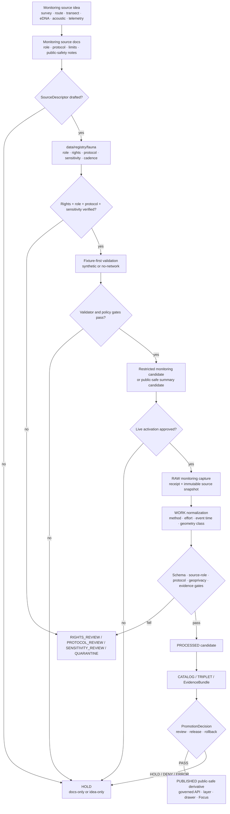

<!-- [KFM_META_BLOCK_V2]
doc_id: kfm://doc/TODO-register-fauna-monitoring-source-readme-uuid
title: Fauna Monitoring Source Notes
type: standard
version: v1
status: draft
owners: TODO(fauna-source-stewards)
created: TODO(verify-original-created-date-or-set-on-first-meaningful-commit)
updated: 2026-05-07
policy_label: TODO(verify-public-or-restricted)
related: ["../README.md", "../../README.md", "../../CONTROL_PLANE.md", "../../SOURCE_ROLES.md", "../../GEOPRIVACY.md", "../../VALIDATION.md", "../../MIGRATION_AND_CONTINUITY.md", "../../runbooks/release-dry-run.md", "../../runbooks/rollback.md", "../../../../../data/registry/fauna/README.md"]
tags: [kfm, fauna, monitoring, sources, source-roles, geoprivacy, evidence, public-safety]
notes: [Existing target was a thin monitoring source note before this revision; doc_id, owners, created date, and policy_label require steward or document-registry verification; this README is documentation only and does not activate live monitoring connectors.]
[/KFM_META_BLOCK_V2] -->

<a id="top"></a>

# Fauna Monitoring Source Notes

Documentation boundary for protocol-bound fauna monitoring sources before survey, station, transect, route, eDNA, acoustic, telemetry, mortality, disease, invasive, or steward-controlled records can support governed KFM claims.

<p>
  
  
  
  
  
  
</p>

> [!IMPORTANT]
> **Impact block**
>
> | Field | Value |
> |---|---|
> | Status | `draft` source-family README |
> | Owners | `TODO(fauna-source-stewards)` |
> | Target path | `docs/domains/fauna/sources/monitoring/README.md` |
> | Source family | Monitoring, survey, route, transect, station, eDNA, acoustic, telemetry, camera/trap, mortality, disease/pathogen, invasive, and steward-reviewed field evidence |
> | Connector posture | Disabled until source descriptor, rights, sensitivity, protocol, fixture validation, steward review, release review, and rollback path are verified |
> | Public-safety posture | Exact monitoring locations are restricted by default; public products must be generalized, aggregated, delayed, suppressed, or explicitly review-cleared |
> | Runtime posture | Public clients use released artifacts and governed APIs only; no public RAW, WORK, QUARANTINE, restricted-store, direct-source, or direct-model access |
> | Quick jumps | [Scope](#scope) · [Repo fit](#repo-fit) · [Accepted inputs](#accepted-inputs) · [Exclusions](#exclusions) · [Directory map](#directory-map) · [Monitoring admission flow](#monitoring-admission-flow) · [Source families](#source-families) · [Claim boundaries](#claim-boundaries) · [Public safety](#public-safety) · [Quickstart](#quickstart) · [Usage](#usage) · [Review gates](#review-gates) · [Definition of done](#definition-of-done) · [Open verification](#open-verification) |

---

## Scope

This README documents the **monitoring source family** for the KFM fauna domain. Monitoring evidence is powerful because it can carry protocol, effort, method, repeated observation, detection, non-detection, and temporal coverage. It is also risky because it can reveal sensitive station locations, survey routes, nests, dens, roosts, hibernacula, spawning areas, telemetry patterns, controlled-access steward records, and private-land context.

This file should help maintainers decide whether a monitoring source is:

- only an idea;
- documentation-only;
- ready for descriptor drafting;
- blocked by rights or sensitivity review;
- fixture-only;
- internal/steward-restricted;
- eligible for a public-safe derivative;
- suspended, withdrawn, or superseded.

It does **not** activate ingestion. It does **not** make monitoring records public. It does **not** authorize exact public geometry. It does **not** make monitoring output canonical truth outside the declared protocol, effort, geography, time, source role, and review scope.

### Monitoring evidence can support

| Evidence type | Can support | Required caution |
|---|---|---|
| Survey effort | Where, when, how, and for what taxa a survey was conducted | Effort is not occurrence proof unless paired with detection evidence |
| Detection record | A scoped observation or detection under a method/protocol | Must carry event time, method, evidence, rights, sensitivity, and geometry class |
| Non-detection | Protocol-bound absence of detection within stated effort and conditions | Must not be generalized into broad absence |
| Monitoring coverage | Public-safe coverage, effort, or survey-area summaries | Must not imply species presence or absence by itself |
| Repeated monitoring | Temporal comparison within comparable methods and scopes | Must not imply trend unless design supports trend inference |
| Steward-reviewed summary | Public-safe release after human or steward review | Must preserve restrictions and review state |

<p align="right"><a href="#top">Back to top ↑</a></p>

---

## Repo fit

`docs/domains/fauna/sources/monitoring/README.md` is a README-like source-family document under `docs/`, the human-facing KFM control plane.

```text
docs/domains/fauna/
├── README.md
├── CONTROL_PLANE.md
├── SOURCE_ROLES.md
├── GEOPRIVACY.md
├── VALIDATION.md
├── MIGRATION_AND_CONTINUITY.md
├── runbooks/
└── sources/
    ├── README.md
    ├── ebird/
    ├── gbif/
    └── monitoring/
        └── README.md              # this file
```

### Responsibility-root basis

Monitoring is a fauna domain source family, not a root-level repository responsibility. Its human-facing documentation belongs under `docs/domains/fauna/sources/monitoring/`. Machine schemas, executable policy, validators, fixtures, raw data, receipts, proofs, releases, and public artifacts belong in their own responsibility roots.

| Concern | Correct responsibility root | Monitoring README rule |
|---|---|---|
| Source-family documentation | `docs/domains/fauna/sources/monitoring/` | Explain source role, protocol requirements, public-safety posture, and review gates |
| Source descriptors | `data/registry/fauna/` or accepted registry home | Store role, rights, authority scope, cadence, sensitivity, and activation state |
| RAW monitoring captures | `data/raw/fauna/...` | Never store source payloads in docs |
| WORK normalization | `data/work/fauna/...` | Never expose as public documentation |
| Quarantine | `data/quarantine/fauna/...` | Hold unresolved rights, sensitivity, source role, taxonomy, or geometry |
| Machine schemas | Accepted schema home after ADR/repo verification | Docs explain; schemas validate |
| Policy-as-code | `policy/fauna/...` or repo-confirmed policy home | Policy decides allow, deny, abstain, restrict, and promote obligations |
| Validators | `tools/validators/fauna/...` or repo-confirmed validator home | Validators emit machine-readable reports |
| Fixtures/tests | `tests/`, `fixtures/`, or repo-confirmed test home | Prove positive and negative monitoring behavior |
| Receipts/proofs/release | `data/receipts/`, `data/proofs/`, `release/`, or accepted homes | Keep process memory, proof support, and release decisions separate |
| Runtime/API/UI | `apps/`, `packages/`, or accepted runtime homes | Consume governed public-safe releases only |

> [!CAUTION]
> Do not create root-level `monitoring/`, `surveys/`, `wildlife-monitoring/`, or `telemetry/` folders to solve a fauna source-family problem. Place each file under the responsibility root that owns its function.

<p align="right"><a href="#top">Back to top ↑</a></p>

---

## Accepted inputs

This directory accepts source-family documentation and review guidance only.

| Input | Accepted here? | Conditions |
|---|---:|---|
| Monitoring source overview | ✅ | Must state protocol scope, source role, allowed claim types, sensitivity posture, and connector state |
| Protocol summaries | ✅ | Must be descriptive and non-sensitive; no restricted station/route details |
| Public-safe method notes | ✅ | Must avoid exposing exact protected sites or private field details |
| Source descriptor guidance | ✅ | Must point to registry home; descriptor itself belongs in registry |
| Monitoring validation expectations | ✅ | Must remain human-readable and link to executable validator homes when verified |
| Synthetic examples | ✅ | Must be clearly fixture-only and public-safe |
| Negative examples | ✅ | Preferred for showing `DENY`, `ABSTAIN`, `HOLD`, `QUARANTINE`, and `ERROR` behavior |
| Steward-review checklist | ✅ | Must avoid naming restricted sites or disclosing controlled-access details |
| Public summary guidance | ✅ | Must distinguish monitoring coverage, detection support, non-detection, and trend claims |
| Release/rollback notes | ✅ | Must point to release and rollback homes, not replace them |

### Accepted source maturity states

| State | Meaning | Public release allowed? |
|---|---|---:|
| `IDEA_ONLY` | Source family or monitoring program is named but not described | No |
| `DESCRIPTOR_DRAFT` | Source descriptor is being drafted | No |
| `RIGHTS_REVIEW` | License, redistribution, attribution, or record-level rights unresolved | No |
| `SENSITIVITY_REVIEW` | Source may contain protected or precise monitoring locations | No |
| `PROTOCOL_REVIEW` | Method, effort, detection limits, or non-detection meaning unresolved | No |
| `FIXTURE_ONLY` | Synthetic/no-network fixture exists | No production release |
| `INTERNAL_RESTRICTED` | Internal or steward-only monitoring use | No public release |
| `RELEASE_CANDIDATE` | Public-safe derivative assembled but not promoted | Not yet |
| `PUBLISHED_PUBLIC_SAFE` | Governed release approved for a defined public scope | Yes, within release scope |
| `SUSPENDED` | Source paused due to rights, sensitivity, quality, protocol, or source defect | No new promotion |
| `WITHDRAWN` | Public release withdrawn or superseded | No |

<p align="right"><a href="#top">Back to top ↑</a></p>

---

## Exclusions

These items must not be committed under `docs/domains/fauna/sources/monitoring/`.

| Excluded item | Correct handling | Why |
|---|---|---|
| Raw survey sheets, exports, API captures, telemetry files, acoustic files, eDNA lab outputs, camera/trap dumps | `data/raw/fauna/...` after descriptor and receipt handling | Docs are not lifecycle storage |
| Work-stage normalized records | `data/work/fauna/...` | WORK is mutable and not public documentation |
| Quarantined monitoring records | `data/quarantine/fauna/...` | May contain unresolved rights, protocol defects, or sensitive locations |
| Exact station, route, transect, nest, den, roost, hibernacula, lek, cave, colony, spawning, nursery, or telemetry geometry | Restricted internal store only | Public docs must not leak protected locations |
| Source credentials, keys, tokens, cookies, private URLs | Secret manager / local ignored environment | Secrets never belong in docs |
| Observer, collector, landowner, steward, or private access details | Restricted review packet or canonical restricted store | Public docs must avoid personal or controlled-access leakage |
| Machine JSON Schemas | Accepted schema home after ADR/repo verification | Schemas own machine-checkable shape |
| Policy-as-code | `policy/fauna/...` or repo-confirmed policy home | Policy must be executable and tested |
| Validator implementation | `tools/validators/fauna/...` or repo-confirmed validator home | Validator code belongs outside prose |
| Generated validation reports | Build/report/receipt/proof homes | Generated evidence should be reproducible and separated |
| Release manifests, proof packs, rollback cards | `release/`, `data/proofs/`, `data/receipts/`, or accepted homes | Release decisions and proof support are trust objects, not prose |
| Direct AI answers or model traces | Nowhere as evidence | AI is interpretive; EvidenceBundle and policy outrank generated language |

<p align="right"><a href="#top">Back to top ↑</a></p>

---

## Directory map

Current target plus proposed local expansion.

| Path | Status | Purpose |
|---|---:|---|
| `README.md` | **CONFIRMED target** | Monitoring source-family landing page |
| `protocols/README.md` | **PROPOSED / NEEDS VERIFICATION** | Public-safe protocol summaries and method taxonomy |
| `station-summary/README.md` | **PROPOSED / NEEDS VERIFICATION** | Public-safe station or route summary guidance, no exact coordinates |
| `edna/README.md` | **PROPOSED / NEEDS VERIFICATION** | eDNA monitoring source notes, lab/method caveats, contamination/false-positive/false-negative cautions |
| `acoustic/README.md` | **PROPOSED / NEEDS VERIFICATION** | Acoustic detector source notes, model/classifier uncertainty, site sensitivity |
| `telemetry/README.md` | **PROPOSED / RESTRICTED BY DEFAULT** | Telemetry source notes; public summaries only, no tracks or repeatable exact locations |
| `camera-trap/README.md` | **PROPOSED / NEEDS VERIFICATION** | Camera/trap source notes, private land and location sensitivity |
| `mortality-disease/README.md` | **PROPOSED / NEEDS VERIFICATION** | Mortality, disease, pathogen, incident monitoring notes |
| `steward-restricted/README.md` | **PROPOSED / RESTRICTED BY DEFAULT** | Steward-controlled monitoring record handling and public-safe derivative rules |

> [!NOTE]
> `CONFIRMED target` means this README path exists or was explicitly requested. It does not mean any live monitoring connector, source descriptor, CI gate, runtime route, or release artifact is active.

<p align="right"><a href="#top">Back to top ↑</a></p>

---

## Monitoring admission flow

A monitoring source-family README is early in the trust path. It documents intent and constraints; it does not publish.



### Flow rules

1. A monitoring source doc is **not** a connector activation decision.
2. Monitoring source use requires source role, rights, protocol, method, effort, cadence, sensitivity, evidence policy, and public geometry class.
3. Non-detection is scoped by protocol and effort. It must not become broad absence.
4. Exact monitoring geometry is restricted by default.
5. Public derivatives require geoprivacy transforms, receipts, EvidenceBundles, catalog closure, policy decisions, release state, correction path, and rollback target.
6. Public clients and Focus Mode consume governed public-safe release surfaces only.

<p align="right"><a href="#top">Back to top ↑</a></p>

---

## Source families

### Monitoring source-family matrix

| Source family | Candidate source role | Can support | Default public posture | Verification needed |
|---|---|---|---|---|
| Agency survey records | `monitoring_source` or `steward_restricted_source` | Detection/non-detection under declared protocol, effort, date, and place | Restricted by default; public summaries only after review | Source terms, steward rules, protocol, effort fields, sensitive-location policy |
| Station or transect monitoring | `monitoring_source` | Effort, survey coverage, repeated observations, detection context | Generalized station/route summaries only | Station sensitivity, route precision, public geometry class |
| eDNA monitoring | `monitoring_source` | Detection support under sample/lab/method scope | Public summaries only; exact sample sites restricted by default | Lab method, contamination controls, false positive/negative caveats, rights |
| Acoustic monitoring | `monitoring_source` | Detection support with classifier/model/protocol uncertainty | Generalized only unless exact site cleared | Classifier version, review state, sensitive roost/nest/site controls |
| Telemetry or tracking | `steward_restricted_source` | Movement support under strict controlled access | Public aggregate/generalized only; tracks denied | Steward authorization, de-identification, repeat-location risk, embargo rules |
| Camera/trap monitoring | `monitoring_source` | Detection support, effort, event time | Public summaries only when private location and sensitive taxa are protected | Private land, camera location sensitivity, media rights |
| Mortality or disease monitoring | `occurrence_source` or `monitoring_source` | Mortality, incident, disease/pathogen evidence under method scope | Public summaries only after review | Health/public-risk wording, private details, precise site sensitivity |
| Invasive monitoring | `monitoring_source` or `occurrence_source` | Detection/reporting context and verification state | Public if terms and sensitivity allow | Verification state, rights, data fields, citation |
| Volunteer survey programs | `monitoring_source` with community source caveats | Effort and detection support when protocol and quality are known | Aggregate/generalized public summaries | Program terms, participant privacy, data quality, geoprivacy |
| Steward-restricted monitoring | `steward_restricted_source` | Controlled-access evidence and internal review | No public exact geometry | Steward review, access class, allowed derivative scope |

<p align="right"><a href="#top">Back to top ↑</a></p>

---

## Claim boundaries

Monitoring data is not automatically occurrence truth, absence truth, population trend, or abundance. Each claim must match the monitoring design.

### Claim-to-support matrix

| Claim type | Minimum support | Extra conditions | Fail-closed outcome |
|---|---|---|---|
| “Survey effort occurred here/then.” | `monitoring_source` | Protocol, effort, time, public geometry class, rights, sensitivity | `ABSTAIN` if effort/protocol missing |
| “Taxon was detected.” | Detection evidence | Method, event time, taxon resolution, evidence refs, sensitivity, rights | `ABSTAIN` if evidence unresolved; `DENY` if public exposure unsafe |
| “Taxon was not detected.” | Non-detection record | Protocol, target taxa, effort, detection limits, time window, spatial scope | `ABSTAIN` if interpreted as broad absence |
| “Taxon is absent.” | Strong study design and review | Usually out of scope for raw monitoring docs | `ABSTAIN` by default |
| “Population is increasing/decreasing.” | Comparable repeated monitoring and analytic method | Trend method, uncertainty, time span, source consistency, review | `ABSTAIN` if counts are treated as trend without design |
| “This is a public monitoring coverage layer.” | Public-safe derivative | Generalized/aggregate geometry, withheld counts, evidence bundle, release manifest | `DENY` if exact restricted geometry leaks |
| “This supports habitat or range reasoning.” | Monitoring evidence plus habitat/range context | Keep monitoring record and derived relation separate | `ABSTAIN` if habitat/model is used as occurrence proof |
| “This can be used in Focus Mode.” | Released EvidenceBundle and policy-safe context | Citation validation, no restricted fields, finite runtime outcome | `DENY` if restricted fields or uncited claims appear |

### Anti-collapse rules

- Monitoring effort is not occurrence.
- Non-detection is not broad absence.
- Count is not abundance unless the design supports abundance inference.
- Repeated detections are not trend unless the method supports trend inference.
- Monitoring station coverage is not species presence.
- Telemetry tracks are not public geometry.
- eDNA detection is not site-level certainty without method and review context.
- Acoustic classifier output is not confirmed occurrence without classifier/method/review support.
- Public monitoring layer is a released derivative, not canonical truth.
- AI output is not evidence.

<p align="right"><a href="#top">Back to top ↑</a></p>

---

## Public safety

Monitoring records can reveal sensitive places and repeated-use patterns. The public boundary is conservative.

### Public geometry classes

| Class | Public behavior for monitoring |
|---|---|
| `public_exact_allowed` | Rare. Exact geometry may publish only when non-sensitive, rights-cleared, source geoprivacy allows it, and review state permits it |
| `public_generalized` | Preferred public path: county, grid, watershed, bounding box, public route class, density cell, coverage summary, or other approved derivative |
| `restricted_precise` | Default for station/transect/telemetry/nest/den/roost/hibernacula/spawning/steward-controlled precision |
| `embargoed` | Delay public release for recent or seasonally sensitive monitoring |
| `steward_review_required` | HOLD until steward decides release class |
| `quarantine` | Hold when rights, sensitivity, protocol, taxonomy, source role, or geometry is unresolved |

### Public derivatives allowed after review

| Public-safe derivative | What it can show | What it must not show |
|---|---|---|
| Monitoring coverage summary | Survey effort by county/grid/watershed/time window | Exact stations or routes when sensitive |
| Detection summary | Public-safe detections by generalized area/time | Exact protected detection coordinates |
| Non-detection summary | Protocol-bound no-detection summary | Broad absence claim |
| Seasonal monitoring support | Public-safe timing and generalized support | Exact nests, dens, roosts, spawning sites, telemetry paths |
| Monitoring data quality layer | Coverage, source bias, freshness, effort class | Hidden rejoin keys or restricted localities |
| Invasive monitoring public summary | Verified public-safe invasive reports where terms allow | Private site details or restricted source fields |

### Required warning pattern

Use this warning, or a steward-approved equivalent, for public monitoring products:

> This monitoring output is a public-safe derivative of protocol-bound evidence. It may describe survey effort, reviewed detections, generalized coverage, or scoped non-detection summaries. It does not expose exact sensitive monitoring locations, does not include restricted records, and must not be interpreted as complete species absence, population trend, abundance, legal status, or exact site-level presence unless separately supported by compatible evidence.

<p align="right"><a href="#top">Back to top ↑</a></p>

---

## Minimum monitoring packet

A monitoring source descriptor or fixture should be reviewable without opening source code.

```yaml
# illustrative only — align to the accepted fauna schema before merge
source_id: TODO
source_title: TODO
source_role: monitoring_source
activation_state: DESCRIPTOR_DRAFT

authority_scope:
  can_support:
    - protocol_bound_monitoring_evidence
    - survey_effort
    - scoped_detection_or_non_detection
  cannot_support:
    - legal_status_authority
    - broad_absence
    - exact_public_geometry_without_review
    - population_trend_without_design

protocol:
  protocol_id: TODO
  method: TODO(survey|edna|acoustic|telemetry|camera_trap|transect|route|station|other)
  effort_fields_required: true
  detection_limits_documented: TODO
  target_taxa_scope: TODO

rights:
  status: TODO(public|open|restricted|unknown|noassertion)
  redistribution: TODO
  attribution_required: TODO
  record_level_rights: TODO

sensitivity:
  default_class: steward_review_required
  exact_public_allowed: false
  source_geoprivacy_applies: TODO
  steward_review_required: true

public_release:
  allowed_derivatives:
    - generalized_coverage_summary
    - public_safe_detection_summary
    - public_safe_non_detection_summary_if_protocol_supports_it
  forbidden_derivatives:
    - exact_sensitive_station_points
    - telemetry_tracks
    - protected_site_coordinates

evidence_policy:
  evidence_ref_required: true
  evidence_bundle_required_for_public_claims: true
  redaction_receipt_required_for_public_geometry_transform: true

verification:
  last_verified: TODO
  next_review: TODO
  blockers:
    - TODO
```

<p align="right"><a href="#top">Back to top ↑</a></p>

---

## Validation expectations

Monitoring validation must prove shape, protocol meaning, source role, rights, geoprivacy, evidence closure, public payload safety, and release readiness.

| Gate | Expected check | Blocks when |
|---|---|---|
| Source registry | `source_role`, rights, authority scope, access class, cadence, and evidence policy exist | Unknown source role or rights |
| Protocol | Method, effort, target taxa, detection limits, and survey scope are explicit | Non-detection or trend claim lacks design support |
| Monitoring record | Timestamp, method, station/transect/route class, taxon resolution, result type, CRS/geometry class, evidence refs | Missing event time, CRS, precision, evidence, or result semantics |
| Geoprivacy | Restricted geometry absent from public output; redaction/generalization receipts present | Exact sensitive monitoring geometry leaks |
| Public summary | Field allowlist and withheld-count/public geometry rules pass | Public API/layer/search/graph exposes restricted fields |
| Evidence closure | EvidenceRef resolves to EvidenceBundle | Focus/API/map claim lacks evidence support |
| Catalog/proof/release | STAC/DCAT/PROV, release manifest, promotion decision, rollback target exist for public candidates | Public derivative lacks rollback/correction path |
| Runtime/Focus | Finite `ANSWER`, `ABSTAIN`, `DENY`, `ERROR` outcomes; citations map to EvidenceRefs | Uncited monitoring claim or restricted field in prompt/output |

### Negative fixtures required

| Fixture | Expected outcome |
|---|---|
| `monitoring_unknown_rights_public_release.json` | `DENY` |
| `monitoring_unknown_protocol.json` | `HOLD` |
| `monitoring_nondetection_as_absence.json` | `ABSTAIN` |
| `monitoring_count_as_trend_without_design.json` | `ABSTAIN` |
| `telemetry_track_public_payload.json` | `DENY` |
| `sensitive_station_exact_public_layer.json` | `DENY` |
| `edna_detection_without_method_context.json` | `HOLD` or `ABSTAIN` |
| `acoustic_classifier_uncited_claim.json` | `ABSTAIN` or `DENY` |
| `monitoring_public_summary_without_redaction_receipt.json` | `DENY` |
| `monitoring_focus_contains_restricted_location.json` | `DENY` |
| `monitoring_release_without_rollback_target.json` | `ERROR` |

<p align="right"><a href="#top">Back to top ↑</a></p>

---

## Quickstart

Run from a verified checkout. Commands below are inspection and proposed validation aids; adapt them to repo-native scripts after toolchain verification.

### 1. Confirm repository and target path

```bash
git status --short
git branch --show-current

find docs/domains/fauna/sources/monitoring -maxdepth 2 -type f | sort
```

Expected result: the monitoring README is visible in the active branch, and any local subdocs are known before editing.

### 2. Inspect monitoring language across fauna docs

```bash
rg -n --no-heading \
  "monitoring|survey|protocol|effort|non-detection|nondetection|transect|station|telemetry|eDNA|acoustic|geoprivacy|EvidenceBundle|ABSTAIN|DENY" \
  docs/domains/fauna data/registry/fauna policy tools tests 2>/dev/null
```

Expected result: monitoring source-role, protocol, geoprivacy, evidence, and finite-outcome language is consistent across docs, registry, policy, validators, and fixtures.

### 3. Validate monitoring registry entries

```bash
# PROPOSED: replace with repo-native validator after verification.
python tools/validators/fauna/validate_monitoring.py \
  --registry data/registry/fauna \
  --fixtures tests/fixtures/fauna \
  --reports build/fauna/reports
```

Expected result: unknown rights, missing protocol, missing effort, exact sensitive public geometry, or missing EvidenceBundle blocks activation or public release.

### 4. Run no-network fixture checks

```bash
# PROPOSED: adapt to repo-native test layout.
pytest -q tests/fauna tests/e2e/runtime_proof/fauna
```

Expected result: fixture-only tests prove monitoring behavior without live fetches or public publication.

> [!WARNING]
> Do not add live monitoring source fetches to quickstart commands. Live monitoring connectors require source descriptor approval, rights review, protocol review, sensitivity review, steward review, receipts, validation reports, and release gating.

<p align="right"><a href="#top">Back to top ↑</a></p>

---

## Usage

### Add a monitoring source-family note

1. Keep the source under `docs/domains/fauna/sources/monitoring/` only if it is documentation.
2. State source role, monitoring method, protocol scope, effort requirements, sensitivity posture, and connector status.
3. State allowed and forbidden claim types.
4. Link to [Fauna Source Roles](../../SOURCE_ROLES.md), [Fauna Geoprivacy](../../GEOPRIVACY.md), [Fauna Validation and Gates](../../VALIDATION.md), and [Fauna Registry](../../../../../data/registry/fauna/README.md).
5. Add negative examples for source-role misuse, broad absence, trend overclaim, public exact geometry, and missing EvidenceBundle.
6. Update this README’s [Directory map](#directory-map) when adding new subdocs.

### Move monitoring from docs-only to registry review

1. Draft a source descriptor in the accepted registry home.
2. Record role, rights, access class, authority scope, cadence, protocol, method, effort, sensitivity, public geometry class, and evidence policy.
3. Add verification backlog items for unresolved source terms, protocol meaning, steward review, or public-summary thresholds.
4. Add no-network fixtures before live source jobs.
5. Run source-role, monitoring, geoprivacy, EvidenceBundle, public payload, and runtime negative tests.
6. Keep activation blocked until review clears.

### Create a public-safe monitoring summary

1. Start from validated monitoring evidence.
2. Classify sensitivity and rights.
3. Derive an allowed public geometry class.
4. Remove restricted station/route/transect/telemetry details.
5. Emit redaction/generalization receipt.
6. Link public summary to EvidenceBundle.
7. Add catalog/provenance closure.
8. Publish only through release manifest and governed API.
9. Preserve rollback target and correction path.

### Use monitoring in Focus Mode

1. Use released, policy-safe EvidenceBundles only.
2. Bound the question to protocol, time, geography, method, and source role.
3. Return `ANSWER` only when evidence supports the claim.
4. Return `ABSTAIN` when evidence is insufficient, overbroad, stale, ambiguous, or incompatible.
5. Return `DENY` when the requested answer would expose restricted monitoring information.
6. Preserve citation validation and response receipt.

<p align="right"><a href="#top">Back to top ↑</a></p>

---

## Review gates

Before merging changes in this directory, reviewers should verify:

- [ ] Target path sits under the correct responsibility root.
- [ ] KFM Meta Block V2 exists and placeholders are intentional.
- [ ] Owners, doc ID, created date, and policy label are verified or explicitly TODO.
- [ ] Monitoring source role is stated and compatible with the described claims.
- [ ] Protocol, method, effort, target taxa, and non-detection limits are documented or marked `NEEDS VERIFICATION`.
- [ ] Source rights and record-level licensing are verified or marked `NEEDS VERIFICATION`.
- [ ] Sensitive-location and public-geometry posture is explicit.
- [ ] Exact monitoring locations are restricted by default.
- [ ] Live connector activation is not implied by documentation.
- [ ] Public outputs are described as released derivatives, not canonical truth.
- [ ] Non-detection is not described as broad absence.
- [ ] Counts are not described as abundance or trend unless the monitoring design supports that claim.
- [ ] EvidenceRefs and EvidenceBundles are required for public claims and Focus Mode answers.
- [ ] Negative examples include `ABSTAIN`, `DENY`, `HOLD`, `QUARANTINE`, and `ERROR` cases.
- [ ] New behavior updates companion docs, validators, fixtures, policy, registry docs, release notes, or rollback docs as needed.
- [ ] Public release claims include rollback and correction posture.

<p align="right"><a href="#top">Back to top ↑</a></p>

---

## Definition of done

This README is ready to merge when:

| Area | Done means |
|---|---|
| Metadata | `doc_id`, owners, created date, updated date, and policy label are resolved or intentionally left as TODO placeholders |
| Target replacement | The thin placeholder monitoring note is replaced by this complete source-family README |
| Repo fit | Upstream and downstream links are correct from `docs/domains/fauna/sources/monitoring/` |
| Monitoring scope | Survey, protocol, effort, detection, non-detection, telemetry, eDNA, acoustic, public summary, and steward review boundaries are clear |
| Guardrails | Source-role, rights, protocol, geoprivacy, evidence, release, and runtime boundaries are visible |
| Diagram | Monitoring admission flow shows docs → registry → validation → lifecycle → release |
| Review checklist | Maintainers can review docs-only changes and source activation changes separately |
| Unknowns | Remaining unknowns are listed and not hidden in confident prose |

<p align="right"><a href="#top">Back to top ↑</a></p>

---

## Open verification

| Item | Status | Needed proof |
|---|---:|---|
| Registered `doc_id` | TODO | Document registry entry for this README |
| Owners | TODO | CODEOWNERS, steward register, source-lane owner assignment, or governance registry |
| Created date | TODO | Git history or steward-approved first meaningful commit date |
| Policy label | TODO | Repo policy classification decision |
| Target path content before merge | CONFIRMED thin placeholder | Review diff from placeholder to full README |
| Monitoring source descriptors | NEEDS VERIFICATION | Confirm `data/registry/fauna` entries for monitoring source families |
| Monitoring schemas | NEEDS VERIFICATION | Accepted schema home and monitoring-event schema |
| Policy runner | NEEDS VERIFICATION | OPA/Conftest/Rego or repo-native policy runner and command |
| Validator commands | NEEDS VERIFICATION | Actual files, package scripts, CI commands, or accepted validator entrypoints |
| CI enforcement | UNKNOWN | Workflow evidence and passing/failing check history |
| Source rights | NEEDS VERIFICATION | Current source terms, licenses, attribution, redistribution, and record-level rights |
| Protocol thresholds | NEEDS VERIFICATION | Detection limits, non-detection rules, minimum effort, trend/abundance admissibility, and public-summary thresholds |
| Steward-sensitive source rules | NEEDS VERIFICATION | Protected species, exact-location, telemetry, monitoring, route/station, private-land, and controlled-access release rules |
| Release object conventions | NEEDS VERIFICATION | ReleaseManifest, PromotionDecision, ProofPack, CorrectionNotice, RollbackCard homes and schemas |
| Public API/UI routes | UNKNOWN | Governed API route tree, MapLibre layer registry, Evidence Drawer payload, and Focus Mode implementation evidence |
| Live connector status | UNKNOWN / BLOCKED BY DEFAULT | SourceActivationDecision or equivalent source-run approval |

<p align="right"><a href="#top">Back to top ↑</a></p>

---

## FAQ

### Does this README activate monitoring ingestion?

No. This is documentation and source-family navigation only. Live monitoring activation requires source descriptors, rights review, protocol review, sensitivity review, steward review, fixtures, validators, receipts, and release gating.

### Can monitoring source docs include station or transect coordinates?

No public docs should include exact sensitive station, route, transect, telemetry, nest, den, roost, hibernacula, spawning, private-land, or steward-restricted geometry. Use synthetic or generalized examples only.

### Does a non-detection prove absence?

No. Non-detection is scoped by protocol, method, effort, target taxa, time, and place. It should produce `ABSTAIN` when used as broad absence without compatible study design.

### Can survey counts be used as abundance or population trend?

Only when the monitoring design, effort normalization, method comparability, time span, and review support that claim. Otherwise, KFM should abstain from abundance or trend claims.

### Can telemetry tracks be published?

Not as public exact geometry by default. Telemetry is restricted by default because repeated locations and tracks can reveal sensitive use areas. Public outputs should be aggregate/generalized and steward-reviewed.

### Can Focus Mode summarize monitoring records?

Yes, but only from released, public-safe EvidenceBundles through governed APIs. It must cite evidence, preserve protocol limitations, and return `ABSTAIN` or `DENY` when evidence or policy requires it.

<p align="right"><a href="#top">Back to top ↑</a></p>

---

## Appendix

<details>
<summary>Monitoring source review packet</summary>

A monitoring source review packet should answer:

| Question | Required answer |
|---|---|
| What monitoring program/source is being admitted? | `source_id`, source title, publisher, access class |
| What source role applies? | `monitoring_source`, `steward_restricted_source`, or another canonical role |
| What method is used? | Survey, route, transect, station, eDNA, acoustic, telemetry, camera/trap, mortality, disease, invasive, or other |
| What is the protocol? | Method, effort, target taxa, time window, detection limits |
| What can it support? | Effort, detection, scoped non-detection, coverage, reviewed summary, or other claim |
| What can it not support? | Legal status, broad absence, trend, abundance, exact public geometry, or other overclaim |
| What rights apply? | License, attribution, redistribution, record-level rights |
| What sensitivity applies? | Public geometry class, steward review, embargo, restricted fields |
| What evidence closure is required? | EvidenceRef, EvidenceBundle, redaction receipt, validation report |
| What blocks activation? | Open rights, sensitivity, protocol, steward, schema, validator, or release item |

</details>

<details>
<summary>Monitoring public payload allowlist starter</summary>

Public monitoring payloads should start with a strict allowlist.

```yaml
allowed_public_fields:
  - public_summary_id
  - taxon_public_id
  - public_taxon_label
  - monitoring_source_family
  - monitoring_method
  - public_time_window
  - public_geometry_class
  - generalized_area_label
  - effort_summary_public
  - detection_summary_public
  - non_detection_scope_note
  - source_role
  - rights_status
  - sensitivity_summary
  - evidence_bundle_ref
  - redaction_receipt_ref
  - release_id
  - correction_state

forbidden_public_fields:
  - exact_station_coordinates
  - exact_route_geometry
  - exact_transect_geometry
  - telemetry_track
  - restricted_geometry_ref_contents
  - private_locality_description
  - private_landowner_details
  - observer_private_details
  - steward_controlled_notes
  - raw_source_payload
  - source_credentials
  - hidden_rejoin_keys
```

</details>

<details>
<summary>Negative fixture ideas</summary>

| Fixture | Expected outcome |
|---|---|
| `monitoring_unknown_source_role.json` | `QUARANTINE` |
| `monitoring_unknown_rights_public_release.json` | `DENY` |
| `monitoring_protocol_missing.json` | `HOLD` |
| `monitoring_nondetection_as_absence.json` | `ABSTAIN` |
| `monitoring_count_as_population_trend.json` | `ABSTAIN` |
| `monitoring_sensitive_station_exact_public.json` | `DENY` |
| `monitoring_telemetry_track_public.json` | `DENY` |
| `monitoring_edna_without_method_context.json` | `HOLD` or `ABSTAIN` |
| `monitoring_acoustic_classifier_without_review.json` | `HOLD` or `ABSTAIN` |
| `monitoring_missing_evidence_bundle.json` | `ABSTAIN` |
| `monitoring_missing_redaction_receipt.json` | `DENY` |
| `monitoring_release_without_rollback.json` | `ERROR` |

</details>

<details>
<summary>Maintainer update triggers</summary>

Update this README when any of the following changes:

- monitoring source-role enum or alias;
- monitoring source descriptor schema;
- monitoring-event schema;
- geoprivacy class behavior;
- public geometry threshold;
- steward-review rule;
- embargo rule;
- eDNA/acoustic/telemetry method policy;
- public monitoring layer manifest;
- Evidence Drawer monitoring payload;
- Focus Mode monitoring prompt or response shape;
- release gate or rollback rule;
- correction notice involving monitoring evidence.

</details>

<p align="right"><a href="#top">Back to top ↑</a></p>
