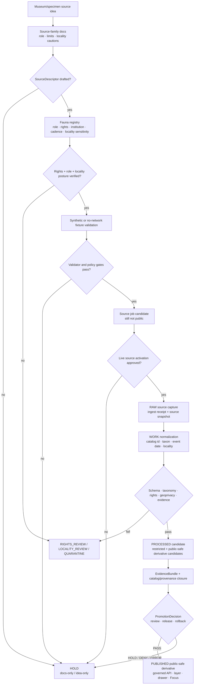

<!-- [KFM_META_BLOCK_V2]
doc_id: kfm://doc/TODO-register-museum-specimens-source-readme-uuid
title: Museum Specimens Source README
type: standard
version: v1
status: draft
owners: TODO(fauna-source-stewards)
created: TODO(verify-original-created-date-or-set-on-first-meaningful-commit)
updated: 2026-05-07
policy_label: TODO(verify-public-or-restricted)
related: ["../README.md", "../../README.md", "../../SOURCE_ROLES.md", "../../GEOPRIVACY.md", "../../VALIDATION.md", "../../MIGRATION_AND_CONTINUITY.md", "../../../../../data/registry/fauna/README.md"]
tags: [kfm, fauna, museum-specimens, specimens, source-directory, occurrence-evidence, geoprivacy, public-safety]
notes: [Target file existed with thin source notes before this revision; doc_id, owners, created date, and policy_label require document-registry or steward verification; this README is source-family documentation and does not activate museum, collection, aggregator, or live occurrence connectors.]
[/KFM_META_BLOCK_V2] -->

<a id="top"></a>

# Museum Specimens Source README

Source-family landing page for museum and collection specimen evidence in the KFM fauna lane, preserving specimen context, locality restrictions, rights, taxonomic uncertainty, evidence closure, and public-safe release boundaries.

<p>
  
  
  
  
  
  
</p>

> [!IMPORTANT]
> **Impact block**
>
> | Field | Value |
> |---|---|
> | Status | `draft` source-family README |
> | Owners | `TODO(fauna-source-stewards)` |
> | Target path | `docs/domains/fauna/sources/museum-specimens/README.md` |
> | Directory role | Human-facing source-family documentation for museum and collection specimen evidence |
> | Primary source role | `occurrence_source` / specimen evidence, with source-specific caveats |
> | Connector posture | Disabled until source descriptor, rights, locality sensitivity, and validation fixtures are verified |
> | Public geometry posture | Public exact sensitive localities are denied by default; public derivatives require generalization, suppression, or redaction receipts |
> | Claim posture | Specimens can support historical occurrence evidence; they do not automatically prove current presence, legal status, population abundance, or complete species absence |
> | Runtime posture | Released artifacts and governed APIs only; no public RAW, WORK, QUARANTINE, restricted-store, direct-source, or direct-model access |
> | Quick jumps | [Scope](#scope) · [Repo fit](#repo-fit) · [Accepted inputs](#accepted-inputs) · [Exclusions](#exclusions) · [Directory map](#directory-map) · [Evidence model](#evidence-model) · [Source-role boundaries](#source-role-boundaries) · [Geoprivacy](#geoprivacy) · [Admission flow](#admission-flow) · [Validation gates](#validation-gates) · [Quickstart](#quickstart) · [Review gates](#review-gates) · [Open verification](#open-verification) |

---

## Scope

This directory documents how Kansas Frontier Matrix treats **museum, collection, and preserved-specimen fauna records** as governed evidence.

Museum specimens are valuable because they can provide voucher-backed records, collection dates, locality descriptions, catalog identifiers, taxonomic determinations, collection-event context, and links to institutional evidence. They are also high-risk because locality data can be vague, historically georeferenced, restricted by institution policy, sensitive for protected taxa, or too easily overinterpreted as current presence.

This README governs source-family documentation for:

- preserved specimens and voucher records;
- specimen catalog records and collection-event metadata;
- collection-locality notes and georeferenced localities;
- specimen-backed occurrence evidence;
- taxonomic determination history attached to specimens;
- collection media and label/field-note references when rights allow;
- museum records surfaced directly by institutions or indirectly through aggregators;
- public-safe specimen-derived summaries and catalog/proof handoff notes.

This README does **not** activate a connector, publish any source data, assert that a specific museum source is approved, or authorize exact public locality exposure.

### What this source family can support

| Can support | Conditions |
|---|---|
| Historical occurrence evidence | Collection event, specimen identity, locality support, event date, and evidence refs must be preserved. |
| Voucher-backed observation context | The specimen record must be linkable to an institution/catalog source and source rights must allow the intended use. |
| Taxonomic determination context | Determination authority, date, basis, and uncertainty must be preserved; do not treat the specimen catalog as a universal taxonomic authority by default. |
| Generalized public occurrence summaries | Only after rights, sensitivity, geoprivacy, evidence closure, validation, review, and release gates pass. |
| Evidence Drawer support | Only through EvidenceBundle-backed, public-safe payloads. |
| Focus Mode answers | Only over released, public-safe EvidenceBundles with finite `ANSWER`, `ABSTAIN`, `DENY`, or `ERROR` outcomes. |

### What this source family must not imply

| Must not imply | Why |
|---|---|
| Current population presence | A specimen event can be old, relocated, misidentified, or georeferenced later. |
| Legal or conservation status | Specimen records are occurrence support, not legal-status authority. |
| Complete inventory or absence | Museum holdings are biased by collection effort, geography, time, taxa, curation, and digitization. |
| Public exact-location permission | Locality rights and sensitivity must be reviewed independently. |
| Habitat occupancy | Habitat context needs separate evidence and modeling boundaries. |
| Automatic publication rights | Catalog visibility does not equal redistribution or public-release permission. |

<p align="right"><a href="#top">Back to top ↑</a></p>

---

## Repo fit

`docs/domains/fauna/sources/museum-specimens/README.md` is a README-like source-family page under `docs/`, KFM’s human-facing control plane.

```text
docs/domains/fauna/
├── README.md
├── SOURCE_ROLES.md
├── GEOPRIVACY.md
├── VALIDATION.md
├── MIGRATION_AND_CONTINUITY.md
└── sources/
    ├── README.md
    ├── ebird/
    │   └── README.md
    ├── gbif/
    │   └── README.md
    └── museum-specimens/
        └── README.md              # this file
```

### Directory Rules basis

This file belongs under `docs/domains/fauna/sources/` because it explains a domain source family. It does not own source payloads, machine schemas, executable policy, validators, tests, receipts, proofs, runtime code, or release objects.

| Concern | Correct responsibility root | Rule for this source family |
|---|---|---|
| Source-family documentation | `docs/domains/fauna/sources/museum-specimens/` | Explain source role, limits, readiness, and review posture. |
| Source descriptors | `data/registry/fauna/` or accepted registry home | Store source role, authority scope, rights, cadence, sensitivity, and verification state. |
| RAW specimen exports or API captures | `data/raw/fauna/...` | Never store source payloads in docs. |
| Quarantined or rights-conflicted records | `data/quarantine/fauna/...` | Keep unresolved or unsafe records out of documentation and public paths. |
| Machine schemas | Accepted schema home after ADR/repo verification | Machine shape belongs outside prose. |
| Policy-as-code | `policy/fauna/...` or repo-confirmed policy home | Policy must be executable and tested. |
| Validator implementation | `tools/validators/fauna/...` or repo-confirmed tool home | Validator code emits reports. |
| Fixtures and negative tests | `tests/` / `fixtures/` or repo-confirmed test homes | Prove rights, geoprivacy, source-role, and runtime behavior. |
| Receipts and proofs | `data/receipts/`, `data/proofs/`, or accepted homes | Process memory and evidence support stay separate. |
| Release decisions | `release/` or repo-confirmed release home | Promotion, correction, and rollback are governed state records. |
| Runtime/UI | `apps/`, `packages/`, or repo-confirmed runtime homes | Consume released public-safe artifacts only. |

> [!CAUTION]
> Do not create a root-level `museum-specimens/`, `specimens/`, `collections/`, or `fauna/` directory for this source family. Place files by responsibility root, not topic name.

<p align="right"><a href="#top">Back to top ↑</a></p>

---

## Accepted inputs

This directory accepts source-family documentation and review guidance only.

| Input | Accepted here? | Conditions |
|---|---:|---|
| Source-family README content | ✅ | Must state source role, allowed uses, forbidden uses, connector status, rights posture, and open verification items. |
| Specimen evidence guidance | ✅ | Must preserve collection-event, catalog, locality, taxonomic, and evidence limitations. |
| Human-readable descriptor guidance | ✅ | Must point to registry files rather than embedding live source data. |
| Locality sensitivity guidance | ✅ | Must align with fauna geoprivacy and fail-closed public release rules. |
| Validation expectations | ✅ | Must be fixture-first unless live source activation is separately approved. |
| Negative examples | ✅ | Should cover source-role misuse, current-presence overclaiming, exact locality leakage, unknown rights, and missing EvidenceBundle support. |
| Institutional source notes | ✅ | Must be scoped, truth-labeled, and not treated as activation. |
| Public warning text | ✅ | Must be safe, conservative, and carried into public derivatives where relevant. |
| Links to external catalog pages | ✅ | As review aids only; links do not establish source activation or redistribution rights. |
| Review checklists | ✅ | Must separate documentation readiness from source activation readiness. |

### Accepted source maturity states

| State | Meaning | Public release allowed? |
|---|---|---:|
| `IDEA_ONLY` | Museum/specimen source family named but not described. | No |
| `DESCRIPTOR_DRAFT` | Source descriptor is being drafted. | No |
| `RIGHTS_REVIEW` | Institution, record-level license, citation, media rights, or redistribution posture is unresolved. | No |
| `LOCALITY_REVIEW` | Locality precision, coordinates, georeferencing, or sensitive locality handling is unresolved. | No |
| `SENSITIVITY_REVIEW` | Taxon, site, steward, or collection policy may require restriction. | No |
| `FIXTURE_ONLY` | Synthetic/no-network fixture path exists. | No production release |
| `INTERNAL_RESTRICTED` | Records may be used only in restricted review or internal evidence flow. | No public release |
| `RELEASE_CANDIDATE` | Public-safe derivative assembled but not promoted. | Not yet |
| `PUBLISHED_PUBLIC_SAFE` | Governed release approved for a defined public-safe scope. | Yes, within release scope |
| `SUSPENDED` | Source or derivative paused because of rights, sensitivity, quality, or lineage risk. | No new promotion |
| `WITHDRAWN` | Release withdrawn or superseded. | No |

<p align="right"><a href="#top">Back to top ↑</a></p>

---

## Exclusions

These items must not be committed under `docs/domains/fauna/sources/museum-specimens/`.

| Excluded item | Correct handling | Why |
|---|---|---|
| Raw museum catalog exports | `data/raw/fauna/...` after descriptor and receipt handling | Docs are not source payload storage. |
| Work-stage normalized specimen records | `data/work/fauna/...` | WORK is mutable and not public documentation. |
| Quarantined specimen records | `data/quarantine/fauna/...` | May contain unresolved rights, taxonomy, locality, or sensitivity issues. |
| Exact sensitive coordinates or locality descriptions | Restricted internal store only | Public docs must not leak protected locations. |
| Private locality labels, collector notes, landowner details, or access instructions | Restricted store or steward review packet | These can reveal sensitive or private locations. |
| Collection credentials, API keys, download tokens, cookies, private URLs | Secret manager / local ignored environment | Secrets never belong in docs. |
| Specimen images/media files | Lifecycle data or media artifact homes after rights review | Media rights and identifiable locality cues require review. |
| Machine schemas | Accepted schema home after ADR/repo verification | Schemas own machine-checkable shape. |
| Policy-as-code | `policy/fauna/...` or repo-confirmed policy home | Policy must be executable and tested. |
| Validator implementation | `tools/validators/fauna/...` or repo-confirmed validator home | Validators must run outside prose. |
| Generated validation reports | Build/report/receipt/proof homes | Generated evidence should be reproducible and separated. |
| Release manifests, proofs, rollback cards | `release/`, `data/proofs/`, `data/receipts/`, or accepted homes | Release/proof objects are trust records, not source-family prose. |
| Direct AI answers or prompt traces | Nowhere as evidence | AI is interpretive; EvidenceBundle and policy outrank generated language. |

<p align="right"><a href="#top">Back to top ↑</a></p>

---

## Directory map

Current source-family directory:

| Path | Status | Purpose |
|---|---:|---|
| `README.md` | `draft` | This source-family landing page for museum/specimen evidence. |

Proposed future companion files, only if the source family grows enough to justify them:

| Future path | Status | Purpose |
|---|---:|---|
| `MUSEUM_SPECIMEN_DESCRIPTOR.md` | `PROPOSED / NEEDS VERIFICATION` | Human-readable source descriptor guidance for institution/catalog sources. |
| `MUSEUM_SPECIMEN_LOCALITY_REVIEW.md` | `PROPOSED / NEEDS VERIFICATION` | Locality sensitivity, georeferencing, and public geometry review workflow. |
| `MUSEUM_SPECIMEN_PUBLIC_AGGREGATES.md` | `PROPOSED / NEEDS VERIFICATION` | Public-safe aggregate/specimen summary rules. |
| `MUSEUM_SPECIMEN_CATALOG_PROOF.md` | `PROPOSED / NEEDS VERIFICATION` | Catalog, provenance, EvidenceBundle, and release handoff guidance. |

> [!NOTE]
> Keep this directory small until source activation and real registry entries justify additional files. Prefer one strong README over a cluster of speculative documents.

<p align="right"><a href="#top">Back to top ↑</a></p>

---

## Evidence model

Museum specimens are evidence records with event, object, locality, taxonomic, institutional, and rights dimensions. KFM should preserve those dimensions rather than flattening them into a simple “species point.”

### Minimum evidence concepts

| Concept | Meaning | KFM handling |
|---|---|---|
| Specimen / voucher | Physical or preserved evidence object or institutional catalog record. | Preserve catalog identity and institution/source reference. |
| Collection event | Event in which the organism/material was collected, observed, or prepared. | Preserve event date, collector/source where public-safe, and event locality support. |
| Catalog identifier | Institution/catalog accession or record identifier. | Keep as source-native identity; do not expose private IDs if restricted. |
| Taxonomic determination | Identification attached to specimen, possibly revised over time. | Preserve determination history where available; treat ambiguity as `HOLD` / `ABSTAIN`. |
| Locality label | Human-readable locality from specimen label or catalog. | Review for precision, private-location clues, and georeferencing uncertainty. |
| Coordinates / georeference | Coordinates or derived spatial interpretation of locality. | Public exact exposure denied by default for sensitive or uncertain records. |
| Coordinate uncertainty | Radius, confidence, or uncertainty of georeferencing. | Required for public spatial interpretation. |
| Rights / license / terms | Institution, record, media, and downstream-use constraints. | Unknown or incompatible rights block public promotion. |
| Evidence refs | KFM references connecting claim to support. | Must resolve to EvidenceBundle before public claims. |
| Limitations | Known gaps, bias, collection history, taxonomic uncertainty, date uncertainty, locality uncertainty. | Must be visible in public-facing evidence support. |

### Specimen-backed claim types

| Claim type | Specimen evidence can support? | Required framing |
|---|---:|---|
| Historical collection evidence exists for taxon and generalized place/time | ✅ | Use event/date and locality uncertainty. |
| A voucher exists for a taxon determination | ✅ | Preserve institution/catalog support and determination caveats. |
| Species currently occurs at exact locality | ❌ by default | Requires separate current compatible evidence; otherwise `ABSTAIN`. |
| Species is legally listed or protected | ❌ | Requires legal/status authority source. |
| Species was absent from an area | ❌ | Museum holdings do not prove absence. |
| Population abundance or trend | ❌ by default | Requires compatible monitoring/statistical evidence. |
| Habitat occupancy | ❌ by default | Requires compatible occurrence + habitat support; specimen alone is not habitat proof. |
| Public exact sensitive locality | ❌ by default | Requires rights, sensitivity, source geoprivacy, review, and public exact allowance; most sensitive cases deny. |

<p align="right"><a href="#top">Back to top ↑</a></p>

---

## Source-role boundaries

Primary role for direct museum/specimen records:

```text
source_role: occurrence_source
basis_or_subrole: preserved_specimen | museum_specimen | voucher_record
```

When specimen records are mediated through an aggregator, preserve both roles:

```text
source_role: occurrence_aggregator
upstream_source_role: occurrence_source
basis_or_subrole: preserved_specimen
```

### Role compatibility table

| Source surface | Compatible KFM role | Allowed use | Must not be used as |
|---|---|---|---|
| Direct institutional specimen catalog | `occurrence_source` | Specimen-backed occurrence support with locality/date/taxon caveats. | Legal status, complete survey, current population proof. |
| Aggregator-mediated specimen record | `occurrence_aggregator` + upstream `occurrence_source` | Discovery and occurrence support with upstream lineage and record-level rights. | Sovereign source truth or legal authority. |
| Specimen taxonomic determination | `taxonomic_context` or supporting field under `occurrence_source` | Identification context and history. | Global taxonomic authority unless separately designated. |
| Label text / field notes | `documentary_source` or specimen support | Historical locality and collection context. | Precise geometry without georeferencing review. |
| Type/voucher status | `occurrence_source` with specimen subtype | Supports existence of specimen evidence and taxonomic context. | Current distribution or population status. |
| Collection image/media | Supporting artifact after rights review | Public display only if media rights and locality cues allow. | Automatic public release or locality proof. |
| Internal restricted collection record | `steward_restricted_source` | Restricted review, internal evidence support, public-safe derivative candidate. | Public exact-location payload. |

> [!WARNING]
> Source-role errors are release-quality defects. A specimen record used as legal status, current presence, or exact public-location authority must produce `DENY`, `HOLD`, or `ABSTAIN` depending on context.

<p align="right"><a href="#top">Back to top ↑</a></p>

---

## Geoprivacy

Specimen localities require conservative handling because old labels, collector notes, cave/locality descriptions, private property references, rare species localities, and georeferenced coordinates can expose sensitive places.

### Public locality classes

| Public locality class | Behavior |
|---|---|
| `public_exact_allowed` | Exact geometry may publish only when source terms, taxon sensitivity, georeferencing uncertainty, collection policy, and review state allow it. |
| `public_generalized` | Publish at county, grid, watershed, bounding box, generalized point, range support, or other approved public support. |
| `restricted_precise` | Do not publish exact locality or coordinates to public API, map, search, graph, export, screenshot, Evidence Drawer, or Focus Mode. |
| `locality_text_restricted` | Suppress or paraphrase locality text that reveals precise sensitive or private location. |
| `embargoed` | Delay public release until embargo or institution/steward restriction clears. |
| `steward_review_required` | HOLD until authorized review assigns release class. |
| `quarantine` | Rights, locality, taxon, georeference, or source role unresolved; not public. |

### Locality leak vectors

Public validators should check for:

- exact coordinates;
- high-precision locality descriptions;
- cave, den, roost, nest, hibernacula, lek, spawning, nursery, colony, or breeding-site language;
- private landowner, ranch, farm, address, parcel, or access-route references;
- collector notes that identify a sensitive place;
- specimen image metadata containing location clues;
- georeferencing remarks that reveal original exact locality;
- hidden IDs that can rejoin public summaries to restricted records;
- labels, popups, search indexes, or graph edges that leak restricted geometry;
- Focus Mode context containing restricted localities.

### Required transform receipt

Any public-safe transform from precise or label-level locality to public support must emit a redaction/generalization receipt.

```yaml
# illustrative only — align to accepted schema before use
redaction_receipt_id: TODO
source_record_ref: TODO
before_hash: TODO
after_hash: TODO
transform_class: county_generalization
reason_codes:
  - locality.sensitive_or_uncertain
  - public_exact_not_allowed
policy_version: TODO
validation_report_ref: TODO
rollback_ref: TODO
```

<p align="right"><a href="#top">Back to top ↑</a></p>

---

## Admission flow

A museum specimen README is an early control-plane object. It documents source-family rules; it does not publish.



### Admission rules

1. A source-family README is not a source activation decision.
2. Museum specimen sources need source descriptors before live use.
3. Source descriptors must capture institution/source identity, rights, locality restrictions, collection cadence/update posture, and allowed claim roles.
4. No-network fixtures should prove specimen parsing, locality generalization, rights denial, and current-presence abstention before any live source job.
5. Public release requires EvidenceBundle, redaction receipt when applicable, catalog/proof closure, policy decision, review state, release manifest, correction path, and rollback target.

<p align="right"><a href="#top">Back to top ↑</a></p>

---

## Descriptor checklist

A museum specimen source descriptor should be reviewable before connector code exists.

| Field family | Required content |
|---|---|
| Source identity | Institution, collection, catalog/source title, source URL or access path, source ID, contact/maintainer if public. |
| Source role | `occurrence_source` or `occurrence_aggregator` with upstream specimen role preserved. |
| Authority scope | Specimen occurrence support, voucher support, taxonomic determination support, documentary support, or restricted steward support. |
| Rights | Record license, redistribution posture, media rights, attribution/citation, downstream-use restrictions, unknown-rights handling. |
| Access class | Public, restricted, steward-only, internal review, or fixture-only. |
| Cadence | Static snapshot, periodic update, API, dataset release, or manual review cycle. |
| Event fields | Collection date/event date, collector/source, basis of record, catalog number, preparation/preservation type where relevant. |
| Taxonomy | Determination, identifier, determination date, synonym/crosswalk handling, ambiguity policy. |
| Locality | Locality text, georeference source, coordinate uncertainty, precision class, georeference remarks, locality restrictions. |
| Sensitivity | Sensitive taxon triggers, collection restrictions, source geoprivacy, public geometry class, embargo/steward review. |
| Evidence policy | EvidenceRef required, EvidenceBundle required for public claims, limitations required in public outputs. |
| Validation | Fixture path, negative fixtures, last verified date, open blockers. |
| Release | Allowed public derivative classes, release scope, rollback target requirement. |

### Illustrative descriptor fragment

```yaml
# illustrative only — align to accepted fauna source schema before use
source_id: kfm://source/fauna/museum-specimens/example
source_family: museum_specimens
publisher: TODO
collection_name: TODO
source_role: occurrence_source
basis_or_subrole: preserved_specimen
authority_scope:
  can_support:
    - specimen_backed_occurrence_evidence
    - collection_event_context
    - taxonomic_determination_context
  cannot_support:
    - legal_status
    - current_presence_without_additional_evidence
    - abundance_or_population_trend
rights:
  status: TODO(public|restricted|unknown|noassertion)
  redistribution: TODO
  attribution_required: TODO
locality:
  precision_class: TODO(exact|generalized|withheld|unknown)
  coordinate_uncertainty_required: true
  locality_text_public_allowed: TODO
sensitivity:
  default_public_geometry: public_generalized
  steward_review_required: true
evidence_policy:
  evidence_ref_required: true
  evidence_bundle_required_for_public_claims: true
activation_state: DESCRIPTOR_DRAFT
```

<p align="right"><a href="#top">Back to top ↑</a></p>

---

## Validation gates

Museum specimen validation should fail closed. Exact command names remain `NEEDS VERIFICATION` until repo-native tooling is confirmed.

| Gate | Required check | Blocks when |
|---|---|---|
| Source descriptor | Source identity, source role, rights, access class, cadence, locality posture, citation policy. | Missing source role, unknown rights promoted, no locality policy. |
| Rights and redistribution | Institution terms, record-level license, media rights, citation, downstream use. | Unknown or incompatible rights for public derivative. |
| Specimen identity | Catalog number, institution/source ID, basis/subrole, source-native identity. | Missing catalog/source identity or unstable key. |
| Collection event | Event date, locality support, collector/source where public-safe, preservation context. | Missing event date support for temporal claims. |
| Taxonomic determination | Name, determination history if available, ambiguity handling, authority/crosswalk. | Ambiguous taxon silently merged; determination overclaimed. |
| Locality/georeference | CRS, precision, coordinate uncertainty, locality text restrictions, georeference method. | Exact sensitive geometry, unknown precision, or private locality in public payload. |
| Evidence closure | EvidenceRef resolves to EvidenceBundle with source, rights, sensitivity, limitations. | Missing or unresolved EvidenceBundle for public claim. |
| Public payload | Field allowlist, no restricted locality, no private notes, no reverse-engineering keys. | Restricted fields in API, layer, graph, search, export, drawer, screenshot, or Focus payload. |
| Claim language | Public text stays specimen-evidence scoped. | “Current presence,” “known population,” “legal status,” or “absence” overclaims. |
| Release | Validation reports, policy decision, review state, release manifest, correction path, rollback target. | Missing proof, rollback, correction, or review state. |

### Minimum negative fixtures

| Fixture idea | Expected outcome |
|---|---|
| Specimen source with unknown rights promoted publicly | `DENY` |
| Specimen locality contains exact sensitive coordinates | `DENY` public exact output |
| Specimen locality text reveals cave/nest/roost/private property | `DENY` or `HOLD` |
| Museum record used as legal-status authority | `DENY` |
| Historic specimen used as current-presence proof | `ABSTAIN` |
| Specimen record missing event date for time-scoped claim | `ABSTAIN` or `HOLD` |
| Ambiguous taxonomic determination silently merged | `HOLD` |
| Public payload includes original locality remarks | `DENY` |
| Public aggregate lacks redaction/generalization receipt | `DENY` |
| Focus Mode answer exposes exact locality | `DENY` |
| Evidence Drawer omits source role or limitations | `HOLD` |
| Release candidate lacks rollback target | `ERROR` |

<p align="right"><a href="#top">Back to top ↑</a></p>

---

## Quickstart

Run these from a verified checkout. Keep the sequence no-network until source descriptors, rights, sensitivity, and validator entrypoints are confirmed.

### 1. Confirm repository and source-family file

```bash
git status --short
git branch --show-current

find docs/domains/fauna/sources/museum-specimens -maxdepth 2 -type f | sort
```

Expected result: this README is visible, and the checkout is a real repository.

### 2. Inspect adjacent fauna source doctrine

```bash
rg -n --no-heading \
  "museum|specimen|voucher|source_role|occurrence_source|geoprivacy|locality|EvidenceBundle|ABSTAIN|DENY" \
  docs/domains/fauna data/registry/fauna policy tools tests 2>/dev/null
```

Expected result: source-role, geoprivacy, evidence, registry, and validation language can be reviewed together.

### 3. Check source descriptor readiness

```bash
# PROPOSED: replace with repo-native validator once confirmed.
python tools/validators/fauna/validate_sources.py \
  --registry data/registry/fauna \
  --source-family museum_specimens \
  --reports build/fauna/reports
```

Expected result: unknown role, unknown rights, missing locality posture, or missing evidence policy blocks activation.

### 4. Run no-network fixture checks

```bash
# PROPOSED: adapt to repo-native test layout.
pytest -q tests/fauna tests/e2e/runtime_proof/fauna \
  -k "museum or specimen or geoprivacy or source_role"
```

Expected result: fixture-only tests prove current-presence abstention, legal-status denial, rights denial, and locality redaction before any live source work.

> [!WARNING]
> Do not add live museum, aggregator, or collection fetch commands here. Live source jobs require descriptor approval, rights review, locality review, steward review, receipts, validation reports, and release gating.

<p align="right"><a href="#top">Back to top ↑</a></p>

---

## Usage

### Add a museum/specimen source family or institution

1. Draft or update the source descriptor in the accepted fauna registry home.
2. Declare whether the source is direct institutional catalog, aggregator-mediated specimen record, restricted collection record, or fixture-only source.
3. Declare `source_role`, basis/subrole, authority scope, rights, access class, citation, cadence, locality posture, sensitivity posture, and evidence policy.
4. Add no-network valid and invalid fixtures.
5. Add negative fixtures for current-presence overclaiming, legal-status misuse, unknown rights, exact sensitive locality, missing evidence, and ambiguous taxonomy.
6. Keep live fetching disabled until source activation is approved.

### Add a public specimen-derived aggregate

1. Resolve source descriptor and source role.
2. Validate rights and locality sensitivity.
3. Normalize collection event, catalog identity, taxonomic determination, event date, and spatial support.
4. Derive public geometry or suppress locality.
5. Emit redaction/generalization receipt.
6. Link public derivative to EvidenceBundle.
7. Emit catalog/provenance closure.
8. Publish only through release manifest and governed API.

### Add Evidence Drawer support

The drawer should show:

| Field family | Required public-safe display |
|---|---|
| Source family | Museum/specimen source or aggregator-mediated specimen source. |
| Source role | `occurrence_source`, `occurrence_aggregator`, or restricted/steward role as applicable. |
| Basis/subrole | Preserved specimen, voucher record, catalog record, label/documentary support. |
| Event time | Collection event date or time uncertainty. |
| Spatial support | Public geometry class and coordinate/locality uncertainty summary. |
| Rights | Public, restricted, unknown, noassertion, or source-specific posture. |
| Sensitivity | Public generalized, restricted precise, steward review, embargo, or quarantine. |
| Evidence | EvidenceBundle refs and source/catalog refs. |
| Limitations | Not current presence, not legal status, not abundance, not absence. |
| Release state | Release ID, correction state, and rollback target when published. |

### Add Focus Mode support

Focus Mode may answer only within released public-safe evidence support.

| User asks | Correct posture |
|---|---|
| “Is there specimen evidence for this species in this generalized area?” | `ANSWER` only if released EvidenceBundle supports it. |
| “Where exactly was this rare specimen collected?” | `DENY` if exact locality is restricted or unsafe. |
| “Does this historic specimen prove the species is still there?” | `ABSTAIN` unless compatible current evidence exists. |
| “Is this species legally protected?” | `ABSTAIN` or route to legal-status authority evidence; specimen source is insufficient. |
| “Can I download all specimen coordinates?” | `DENY` unless a reviewed public-safe derivative exists and rights allow it. |

<p align="right"><a href="#top">Back to top ↑</a></p>

---

## Public warning text

Use this warning, or a steward-approved equivalent, for public specimen-derived summaries:

> Museum specimen outputs are evidence-backed historical or collection-event support. They may be generalized, redacted, or incomplete. They do not show exact sensitive localities, do not include restricted records, and must not be interpreted as current presence, legal status, population abundance, complete inventory, true absence, habitat occupancy, or safe-to-visit location guidance unless separately supported by compatible released evidence.

<p align="right"><a href="#top">Back to top ↑</a></p>

---

## Review gates

Before merging changes in this directory, reviewers should verify:

- [ ] Target path remains under the correct responsibility root.
- [ ] KFM Meta Block V2 exists and unresolved values are intentional TODOs.
- [ ] Source role is explicit and specimen-scoped.
- [ ] Direct institutional sources and aggregator-mediated specimen records are distinguished.
- [ ] Source rights, media rights, locality restrictions, and citation needs are either verified or clearly marked `NEEDS VERIFICATION`.
- [ ] No exact sensitive coordinates, locality labels, private landowner notes, access routes, or restricted collector/steward details appear in public docs or examples.
- [ ] Historic specimen records are not overclaimed as current presence.
- [ ] Museum records are not overclaimed as legal-status or conservation-status authority.
- [ ] Public derivatives require EvidenceBundle support and redaction/generalization receipts.
- [ ] Validation fixtures include current-presence abstention, exact-locality denial, unknown-rights denial, and taxonomy ambiguity hold/abstain.
- [ ] Public warning text is preserved where public aggregate or derivative behavior is discussed.
- [ ] Any new behavior updates source registry docs, source-role docs, geoprivacy docs, validation docs, fixtures, policy, and release/rollback docs where applicable.
- [ ] No live source activation is implied by documentation changes.

<p align="right"><a href="#top">Back to top ↑</a></p>

---

## Definition of done

This README is ready to merge when:

| Area | Done means |
|---|---|
| Metadata | `doc_id`, owners, created date, updated date, and policy label are resolved or intentionally left as TODO placeholders. |
| Target replacement | The thin source-notes README is replaced by a complete source-family README. |
| Repo fit | Upstream/downstream relationships are correct relative paths from `docs/domains/fauna/sources/museum-specimens/`. |
| Source role | Museum/specimen records are scoped as occurrence evidence, not legal status or current-presence proof. |
| Public safety | Exact sensitive localities, private locality notes, source credentials, and restricted collection details are excluded. |
| Evidence posture | EvidenceBundle, source role, rights, sensitivity, and limitations are required for public claims. |
| Diagram | Admission flow shows docs → registry → validation → lifecycle → release path. |
| Reviewability | Open verification items are listed and not hidden in confident prose. |
| Non-activation | README states that it does not enable live source connectors or public release. |

<p align="right"><a href="#top">Back to top ↑</a></p>

---

## Open verification

| Item | Status | Needed proof |
|---|---:|---|
| Registered `doc_id` | TODO | Document registry entry for this README. |
| Owners | TODO | CODEOWNERS, steward registry, or source-lane owner assignment. |
| Created date | TODO | Git history or steward-approved first meaningful commit date. |
| Policy label | TODO | Repo policy classification decision. |
| Current file history | NEEDS VERIFICATION | Confirm first commit/date and whether the thin README has downstream references. |
| Museum source descriptors | NEEDS VERIFICATION | Registry entries with source role, rights, locality posture, citation, and sensitivity policy. |
| Source terms | NEEDS VERIFICATION | Institution/source terms, license, attribution, media rights, and redistribution limits. |
| Record-level locality restrictions | NEEDS VERIFICATION | Collection/source rules for locality withholding, generalization, and sensitive taxa. |
| Taxonomy handling | NEEDS VERIFICATION | Accepted authority/crosswalk behavior for specimen determinations and synonym changes. |
| Schema home | NEEDS VERIFICATION | Accepted ADR or repo convention for machine schemas. |
| Validator commands | NEEDS VERIFICATION | Actual validator files, package scripts, CI commands, or accepted entrypoints. |
| Policy runner | NEEDS VERIFICATION | OPA/Conftest/Rego or repo-native policy runner and command. |
| CI enforcement | UNKNOWN | Workflow evidence and passing/failing check history. |
| Live connector status | UNKNOWN / BLOCKED BY DEFAULT | SourceActivationDecision or equivalent source-run approval. |
| Release object conventions | NEEDS VERIFICATION | ReleaseManifest, PromotionDecision, ProofPack, CorrectionNotice, RollbackCard homes and schemas. |
| Public API/UI routes | UNKNOWN | Governed API route tree, MapLibre layer registry, Evidence Drawer payload, and Focus Mode implementation evidence. |

<p align="right"><a href="#top">Back to top ↑</a></p>

---

## FAQ

### Does this README activate museum/specimen ingestion?

No. This README is documentation and source-family navigation only. Live source activation requires source descriptors, rights review, locality review, sensitivity review, steward review, validation fixtures, receipts, policy gates, and release controls.

### Can museum specimens support occurrence claims?

Yes, carefully. They can support specimen-backed historical occurrence evidence when event date, locality support, taxonomic determination, source identity, rights, and evidence refs are preserved. They do not automatically prove current presence.

### Can specimen localities be shown exactly?

Not by default. Exact public locality exposure requires rights, non-sensitive status, source permission, known precision/uncertainty, evidence closure, review, release, and rollback support. Sensitive or uncertain localities should be generalized, suppressed, embargoed, or denied.

### Are museum records legal-status authority?

No. A museum specimen source can support occurrence evidence and taxonomic context. Legal or conservation status requires compatible legal/status authority evidence.

### Can public users download specimen coordinates?

Only if a reviewed, public-safe, rights-compatible derivative exists. Public downloads must not expose restricted exact coordinates, private locality notes, hidden rejoin keys, or sensitive locality clues.

### Can Focus Mode summarize museum specimen evidence?

Yes, only from released public-safe EvidenceBundles. Focus Mode must abstain or deny when evidence is insufficient, rights are unresolved, exact locality is restricted, or the user asks for unsupported current-presence/legal-status claims.

<p align="right"><a href="#top">Back to top ↑</a></p>

---

## Appendix

<details>
<summary>Suggested negative fixture families</summary>

| Fixture family | Expected outcome |
|---|---|
| `unknown_rights_public_specimen.json` | `DENY` |
| `exact_sensitive_specimen_locality_public.json` | `DENY` |
| `private_locality_text_public_payload.json` | `DENY` |
| `museum_record_as_legal_status.json` | `DENY` |
| `historic_specimen_as_current_presence.json` | `ABSTAIN` |
| `missing_collection_event_date.json` | `HOLD` or `ABSTAIN` |
| `ambiguous_taxon_determination.json` | `HOLD` |
| `public_aggregate_without_redaction_receipt.json` | `DENY` |
| `focus_exact_locality_request.json` | `DENY` |
| `drawer_missing_limitations.json` | `HOLD` |
| `release_without_rollback_target.json` | `ERROR` |

</details>

<details>
<summary>Public payload denylist seed</summary>

```yaml
forbidden_public_fields:
  - decimalLatitude
  - decimalLongitude
  - verbatimLatitude
  - verbatimLongitude
  - verbatimCoordinates
  - exact_point_geometry
  - restricted_geometry_ref
  - privateLocality
  - localityRemarks
  - georeferenceRemarks
  - accessInstructions
  - landowner
  - privateCollectorNotes
  - sourceCredential
  - apiToken
  - hiddenJoinKey

forbidden_public_phrase_patterns:
  - exact collection site
  - current population
  - confirmed still present
  - legal status from specimen
  - known population
  - precise occurrence point
  - safe to visit
```

</details>

<details>
<summary>Maintainer update triggers</summary>

Update this README when any of the following changes:

- source descriptor schema adds or renames museum/specimen fields;
- source-role vocabulary changes;
- geoprivacy/locality rules change;
- record-level rights or media-rights handling changes;
- public geometry class thresholds change;
- Evidence Drawer specimen payload fields change;
- Focus Mode outcome handling changes;
- source activation posture changes;
- a release, correction, or rollback affects museum/specimen-derived outputs;
- companion source-family docs are added, renamed, or deprecated.

</details>

<p align="right"><a href="#top">Back to top ↑</a></p>
