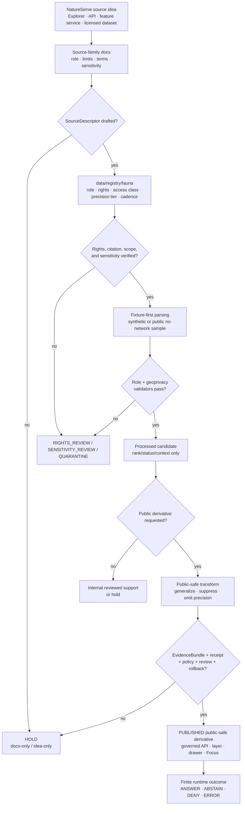

<!-- [KFM_META_BLOCK_V2]
doc_id: kfm://doc/TODO-register-natureserve-source-readme-uuid
title: NatureServe Source README
type: standard
version: v1
status: draft
owners: TODO(fauna-source-stewards)
created: TODO(verify-original-created-date-or-set-on-first-meaningful-commit)
updated: 2026-05-07
policy_label: TODO(verify-public-or-restricted)
related: ["../README.md", "../../README.md", "../../SOURCE_ROLES.md", "../../GEOPRIVACY.md", "../../VALIDATION.md", "../../CONTROL_PLANE.md", "../../../../../data/registry/fauna/README.md"]
tags: [kfm, fauna, natureserve, conservation-status, source-readme, geoprivacy, rights-review, evidencebundle]
notes: [Replaces a sparse source-note placeholder; doc_id, owners, created date, and policy_label require steward or document-registry verification; this README does not activate NatureServe ingestion, API use, licensed data access, or public release.]
[/KFM_META_BLOCK_V2] -->

<a id="top"></a>

# NatureServe Source README

Source-family landing page for using NatureServe conservation-status, taxon-context, data-sensitivity, model/context, and public-resolution biodiversity information in KFM without treating it as legal-status, occurrence, or exact-location authority.

<p>
  
  
  
  
  
  
  
</p>

> [!IMPORTANT]
> **Impact block**
>
> | Field | Value |
> |---|---|
> | Status | `draft` source-family README |
> | Target path | `docs/domains/fauna/sources/natureserve/README.md` |
> | Owners | `TODO(fauna-source-stewards)` |
> | Current source posture | `PROPOSED / NEEDS VERIFICATION` |
> | Connector posture | Disabled until source descriptor, rights, sensitivity, fixtures, validation, release review, and rollback are verified |
> | Primary source role | `conservation_status_authority` for conservation-rank/status context within verified scope |
> | Conditional companion roles | `derived_model`, `habitat_context`, or `taxonomic_authority` only when a source descriptor verifies the specific product and authority scope |
> | Public exact geometry | Denied by default, especially for sensitive, licensed, high-precision, documented, predicted, or steward-controlled records |
> | Public runtime posture | Public clients consume released KFM artifacts through governed APIs; no browser-to-NatureServe source fetch |
> | Quick jumps | [Scope](#scope) · [Repo fit](#repo-fit) · [Accepted inputs](#accepted-inputs) · [Exclusions](#exclusions) · [Directory tree](#directory-tree) · [NatureServe role model](#natureserve-role-model) · [Source admission flow](#source-admission-flow) · [Operating rules](#operating-rules) · [Quickstart](#quickstart) · [Validation gates](#validation-gates) · [Review gates](#review-gates) · [Open verification](#open-verification) · [FAQ](#faq) |

---

## Scope

This directory documents the **NatureServe source family** for the KFM fauna lane. It explains how NatureServe-derived conservation status, rank, taxonomy/context, data sensitivity, public-scale maps, model context, feature-service context, and licensed high-precision data must be handled before any KFM claim, layer, Evidence Drawer payload, Focus Mode answer, export, or public release can depend on them.

NatureServe can be valuable to KFM, but only when its role is narrow, visible, and reviewed. A NatureServe conservation rank is not automatically Kansas legal status. A modeled or predicted location is not an observed occurrence. Licensed high-precision data is not public-safe by default. Public-resolution information is not permission to expose sensitive exact geometry.

### This README governs

| Surface | Directory responsibility |
|---|---|
| Source-family orientation | Explain what NatureServe can and cannot support inside the fauna lane. |
| Source-role discipline | Keep conservation rank, legal status, occurrence evidence, taxon context, model context, and exact-location authority separate. |
| Rights posture | Require current terms, citation, license, commercial-use, redistribution, and high-precision-data review before use. |
| Sensitivity posture | Preserve `dataSensitive`, source-applied precision controls, public/licensed precision differences, and steward-review requirements. |
| Public-output posture | Require public-safe derivatives, EvidenceBundle support, geoprivacy receipts, release review, and rollback before public use. |
| Connector posture | Make clear that this documentation does not activate NatureServe API, Explorer Pro, InSite, licensed data, or live feature-service use. |

### This README does not govern

| Not governed here | Owning surface |
|---|---|
| Fauna-wide domain scope | [`../../README.md`](../../README.md) |
| Fauna source-role taxonomy | [`../../SOURCE_ROLES.md`](../../SOURCE_ROLES.md) |
| Fauna geoprivacy policy | [`../../GEOPRIVACY.md`](../../GEOPRIVACY.md) |
| Fauna validation expectations | [`../../VALIDATION.md`](../../VALIDATION.md) |
| Domain ownership and active risks | [`../../CONTROL_PLANE.md`](../../CONTROL_PLANE.md) |
| Source descriptors and activation records | [`../../../../../data/registry/fauna/README.md`](../../../../../data/registry/fauna/README.md) |
| Machine schemas | Accepted schema home after ADR / repo verification |
| Policy-as-code | `../../../../../policy/fauna/` or repo-confirmed policy home |
| Validator implementation | `../../../../../tools/validators/fauna/` or repo-confirmed validator home |
| RAW, WORK, QUARANTINE, PROCESSED, CATALOG, TRIPLET, receipts, proofs, release, and published artifacts | `data/`, `release/`, or repo-confirmed lifecycle roots |

<p align="right"><a href="#top">Back to top ↑</a></p>

---

## Repo fit

`docs/domains/fauna/sources/natureserve/README.md` is a README-like source-family document under `docs/`, the human-facing control plane.

```text
docs/domains/fauna/
├── README.md
├── SOURCE_ROLES.md
├── GEOPRIVACY.md
├── VALIDATION.md
├── CONTROL_PLANE.md
└── sources/
    ├── README.md
    ├── ebird/
    │   └── README.md
    ├── gbif/
    │   └── README.md
    └── natureserve/
        └── README.md        # this file
```

### Directory Rules basis

This path follows KFM’s responsibility-root discipline:

| Concern | Correct responsibility root | NatureServe rule |
|---|---|---|
| Human-facing source-family guidance | `docs/domains/fauna/sources/natureserve/` | Explain role, limits, rights, sensitivity, and review posture. |
| Source descriptor and activation state | `data/registry/fauna/` or accepted registry home | Store source role, rights, authority scope, access class, cadence, precision tier, and verification state. |
| Raw NatureServe/API/licensed captures | `data/raw/fauna/natureserve/` after activation | Never store source payloads in docs. |
| Quarantine | `data/quarantine/fauna/natureserve/` | Hold unresolved rights, precision, source-role, sensitivity, or citation defects. |
| Machine shape | `schemas/` or ADR-accepted schema home | Schemas validate shape; docs explain intent. |
| Policy decisions | `policy/` | Policy owns allow, deny, restrict, abstain, redaction, promotion, and public release. |
| Tests and fixtures | `tests/`, `fixtures/`, or repo-native test home | Prove source-role and public-safety behavior. |
| Receipts, proofs, releases | `data/receipts/`, `data/proofs/`, `release/` | Keep process memory and release support separate from prose. |

> [!CAUTION]
> Do not create a root-level `natureserve/`, `species/`, `biodiversity/`, or `fauna/` folder for this source. Put each file under the responsibility root that owns its function.

<p align="right"><a href="#top">Back to top ↑</a></p>

---

## Accepted inputs

This directory accepts reviewable, human-facing source-family documentation. It should not contain source data or generated release artifacts.

| Input | Accepted here? | Conditions |
|---|---:|---|
| NatureServe source-family overview | ✅ | Must state allowed role, prohibited uses, rights posture, and sensitivity posture. |
| Conservation-rank field notes | ✅ | Must distinguish global, national, and subnational rank scope; do not turn ranks into legal status. |
| API field-mapping notes | ✅ | Must be fixture-first and clearly separate public API metadata from live connector activation. |
| Data-sensitivity notes | ✅ | Must preserve sensitivity flags, precision class, restricted categories, and public/licensed precision differences. |
| Public-use and citation guidance | ✅ | Must require current terms, citation templates, attribution, and license review before release. |
| Negative examples | ✅ | Preferred when they show `DENY`, `ABSTAIN`, `HOLD`, `QUARANTINE`, or `ERROR`. |
| Source descriptor draft notes | ✅ | Must point to registry home and remain `NEEDS VERIFICATION` until reviewed. |
| Fixture plans | ✅ | Must be synthetic or no-network unless live source activation is separately approved. |
| Steward-review notes | ✅ | Must not expose restricted, licensed, high-precision, or site-specific details. |
| Public warning language | ✅ | Must preserve conservation-status and exact-location limitations. |

### Source maturity states

| State | Meaning | Public release allowed? |
|---|---|---:|
| `IDEA_ONLY` | NatureServe is named as a candidate source family. | No |
| `DESCRIPTOR_DRAFT` | Source descriptor is being drafted. | No |
| `RIGHTS_REVIEW` | Terms, citation, license, redistribution, commercial use, or access tier is unresolved. | No |
| `SENSITIVITY_REVIEW` | Precision, `dataSensitive`, steward, or exact-location exposure is unresolved. | No |
| `FIXTURE_ONLY` | Synthetic/no-network fixtures exist. | No production release |
| `INTERNAL_RESTRICTED` | Licensed, stewarded, or high-precision information is restricted to internal review. | No public release |
| `RELEASE_CANDIDATE` | Public-safe candidate exists but is not promoted. | Not yet |
| `PUBLISHED_PUBLIC_SAFE` | Governed release approved for a defined public scope. | Yes, within release scope |
| `SUSPENDED` | Source use paused due to terms, sensitivity, defect, or drift. | No new promotion |
| `WITHDRAWN` | Public derivative withdrawn or superseded. | No |

<p align="right"><a href="#top">Back to top ↑</a></p>

---

## Exclusions

These items must not be committed under `docs/domains/fauna/sources/natureserve/`.

| Excluded item | Correct handling | Why |
|---|---|---|
| Raw NatureServe API responses | `data/raw/fauna/natureserve/` after activation | Docs are not lifecycle storage. |
| Explorer Pro, InSite, or licensed high-precision datasets | Restricted lifecycle and license-controlled stores only | Public docs must not leak controlled data. |
| Documented or predicted high-precision at-risk species locations | Restricted/steward-controlled store only | Public exact locations deny by default. |
| Site-specific due-diligence outputs | Restricted review packet or governed report surface | Such outputs may carry licensing and site-review obligations. |
| API credentials, access tokens, private URLs, account details | Secret manager / ignored local environment | Secrets never belong in docs. |
| Quarantined records | `data/quarantine/fauna/natureserve/` | Quarantine may contain rights, sensitivity, or source-role defects. |
| Public payload examples with exact sensitive coordinates | Deny from public docs | Prevent reverse engineering protected locations. |
| Machine JSON Schemas | Accepted schema home after ADR / repo verification | Schemas own machine-checkable shape. |
| Policy-as-code | `policy/fauna/...` or repo-confirmed policy home | Policy must be executable and tested. |
| Validator implementation | `tools/validators/fauna/...` or repo-confirmed validator home | Validator code belongs outside prose. |
| Release manifests, proof packs, rollback cards | `release/`, `data/proofs/`, `data/receipts/`, or accepted homes | Trust objects must remain auditable and separate. |
| Direct AI answers or model traces | Nowhere as evidence | AI may interpret released evidence; it cannot become source truth. |

<p align="right"><a href="#top">Back to top ↑</a></p>

---

## Directory tree

### Current confirmed documentation surface

```text
docs/domains/fauna/sources/natureserve/
└── README.md
```

### Proposed growth shape

The files below are **PROPOSED / NEEDS VERIFICATION**. Add them only when the active branch has a real need, a clear owner, and companion registry/schema/policy/test updates.

```text
docs/domains/fauna/sources/natureserve/
├── README.md
├── NATURESERVE_SOURCE_DESCRIPTOR.md          # PROPOSED: descriptor fields, activation states, rights and citation checklist
├── NATURESERVE_RANK_FIELDS.md                # PROPOSED: G/N/S rank mapping, rounded ranks, uncertainty, status vocabulary
├── NATURESERVE_API_FIXTURE_PLAN.md           # PROPOSED: no-network fixtures and field-mapping examples
├── NATURESERVE_GEOPRIVACY_AND_PRECISION.md   # PROPOSED: dataSensitive, public/licensed precision, transform rules
└── NATURESERVE_PUBLIC_USE.md                 # PROPOSED: public derivative warnings, citation, release, and rollback notes
```

> [!TIP]
> Keep the directory narrow until a real source descriptor and fixture path exist. A truthful one-file source-family README is better than a broad directory of speculative docs.

<p align="right"><a href="#top">Back to top ↑</a></p>

---

## NatureServe role model

NatureServe material should enter KFM through explicit source roles. The final role names must match the accepted fauna source descriptor schema.

| NatureServe surface | KFM role posture | Can support | Must not imply |
|---|---|---|---|
| Conservation status ranks | `conservation_status_authority` | Conservation rank/status context within verified global, national, or subnational scope. | Legal protection, Kansas legal status, occurrence proof, abundance, or exact public location permission. |
| NatureServe Network subnational ranks | `conservation_status_authority` with scoped jurisdiction | Subnational conservation-rank context when authority scope, date, and source are clear. | Federal or Kansas legal status unless separately supported by legal authority evidence. |
| NatureServe Explorer public taxon pages | `conservation_status_authority` and possibly taxon context after descriptor review | Rank/status/context references, citations, and public-scale information. | Canonical taxonomy, occurrence proof, or public exact-location authority without additional review. |
| NatureServe API public fields | `data_mirror_or_cache` plus applicable source role | Structured public fields for fixture-backed parsing, field mapping, and public-scale support. | Live connector activation, licensed-data entitlement, or public release by itself. |
| Feature services / mapped data | `derived_model`, `habitat_context`, or restricted source context depending on product | Public-scale map/model context when terms and precision allow. | Observed occurrence proof or exact location proof. |
| High-precision documented or predicted locations | `steward_restricted_source` / restricted precision context | Internal/steward review only when license, access class, and sensitivity allow. | Public exact geometry. |
| InSite or site-specific review outputs | Restricted review-support material | Site-specific due diligence after license and review obligations are recorded. | Public, general-purpose species map data. |

### Non-negotiable role boundaries

| Rule | Required behavior | Failure outcome |
|---|---|---|
| NatureServe ranks are conservation status, not legal status | Use legal/status authority sources for legal claims. | `DENY` or `ABSTAIN` |
| Conservation rank is not occurrence evidence | Do not say a species was observed somewhere because it has a rank. | `ABSTAIN` |
| Modeled or predicted location is not observed occurrence | Label model/context support clearly. | `ABSTAIN` if used as observation proof |
| Licensed/high-precision data is restricted by default | Do not publish exact locations without explicit verified license and steward approval. | `DENY` |
| Public terms and citation must be current | Re-check terms before connector activation or public release. | `HOLD` |
| `dataSensitive` and precision controls must be preserved | Do not downgrade sensitivity fields into display-only notes. | `DENY` / `QUARANTINE` |
| Source scope must be visible | Global, national, subnational, public, licensed, and site-specific scopes must not be collapsed. | `HOLD` |

<p align="right"><a href="#top">Back to top ↑</a></p>

---

## Source admission flow

A NatureServe source-family README is early in the trust path. It documents intent and constraints; it does not publish.



### Flow rules

1. Source documentation is not source activation.
2. Live API, feature-service, Explorer Pro, InSite, or licensed data access requires source descriptor review.
3. Synthetic/no-network fixtures should prove behavior before live source work.
4. Public products must not expose restricted exact geometry, licensed high-precision locations, or site-specific review details.
5. EvidenceRefs must resolve to EvidenceBundles before public claims, Evidence Drawer content, Focus Mode answers, exports, or release artifacts.
6. Public release requires correction and rollback posture.

<p align="right"><a href="#top">Back to top ↑</a></p>

---

## Operating rules

### 1. Conservation rank is scoped evidence

Allowed public framing:

> “NatureServe-derived conservation-rank context is available for this taxon within the stated scope.”

Disallowed framing unless separately supported:

- “This species is legally protected in Kansas.”
- “This species occurs here.”
- “This is a confirmed population.”
- “This is an exact known location.”
- “This site has no sensitive species.”
- “This model proves occupancy.”

### 2. Public and licensed precision must stay separate

| Precision / access tier | KFM default behavior |
|---|---|
| Public Explorer-scale rank/status context | Candidate for public derivative after terms, citation, evidence, and review checks. |
| Public API metadata | Candidate for fixture-backed parsing and public-scale support. |
| Public feature-service geometry | Candidate only after field, precision, rights, and sensitivity review. |
| Explorer Pro or licensed public-level data | `RIGHTS_REVIEW` until license, access class, and permitted public use are recorded. |
| High-precision documented/predicted locations | `INTERNAL_RESTRICTED` by default; no public exact geometry. |
| Site-specific InSite/due-diligence outputs | Restricted review-support material unless a release decision explicitly approves a public-safe derivative. |

### 3. Source sensitivity fields are gate inputs

NatureServe fields or concepts such as `dataSensitive`, sensitivity category, public/licensed precision tier, restricted location, or withheld location are not display decoration. They are gate inputs for policy, validators, public payload filtering, and release review.

### 4. Public warnings must travel with derivatives

Use this warning, or a steward-approved equivalent, for public NatureServe-derived outputs:

> NatureServe-derived KFM output is conservation-status or model/context support within the stated source scope. It is not legal-status advice, site clearance, exact-location disclosure, confirmed occurrence proof, complete species inventory, absence evidence, or a substitute for official agency or NatureServe Network review.

<p align="right"><a href="#top">Back to top ↑</a></p>

---

## Public payload posture

Public NatureServe-derived payloads must be field-allowlisted. The field list below is a starting posture, not a substitute for schema and policy review.

### Candidate public-safe field families

| Field family | Conditions |
|---|---|
| Taxon display name | Allowed when taxon concept and source date are visible. |
| Conservation rank summary | Allowed when rank scope, source, date/version, and limitations are included. |
| Rounded or generalized rank | Allowed when rank uncertainty and scope are visible. |
| Public citation | Required for public products. |
| Source URL or source reference | Allowed when stable and public-safe. |
| EvidenceBundle reference | Required for consequential public claims. |
| Rights/license summary | Required for release. |
| Sensitivity summary | Allowed as public-safe badge such as `public_safe`, `generalized_public_safe`, `withheld`, `not_resolved`, or `denied`. |
| Public generalized geometry | Allowed only when transform receipt and policy allow. |

### Default public denylist

Public payloads must not contain:

- exact high-precision documented or predicted at-risk species locations;
- licensed coordinates or site-specific review geometry;
- hidden restricted geometry references;
- source-native precise locality text;
- private reviewer, steward, landowner, client, or account details;
- credentials, tokens, private URLs, account IDs, or access keys;
- proprietary/licensed payload fields that are not cleared for public release;
- fields that allow reverse engineering of a sensitive location;
- AI prompt context containing restricted geometry or licensed details.

<p align="right"><a href="#top">Back to top ↑</a></p>

---

## Quickstart

Run these only from a verified checkout. They are inspection aids until repo-native commands are confirmed.

### 1. Confirm repository and target file state

```bash
git status --short
git branch --show-current

find docs/domains/fauna/sources/natureserve -maxdepth 2 -type f | sort
```

Expected result: this README is visible, and no source payloads are committed under the docs directory.

### 2. Inspect NatureServe references across the fauna lane

```bash
rg -n --no-heading \
  "NatureServe|natureserve|conservation_status_authority|dataSensitive|gRank|sRank|nRank|roundedGRank|licensed|high-precision|geoprivacy|EvidenceBundle|ABSTAIN|DENY" \
  docs/domains/fauna data/registry/fauna policy tools tests 2>/dev/null
```

Expected result: NatureServe references preserve source role, rights, precision, sensitivity, evidence, and finite-outcome language.

### 3. Validate source descriptor readiness

```bash
# NEEDS VERIFICATION: replace with repo-native validator once confirmed.
python tools/validators/fauna/validate_sources.py \
  --registry data/registry/fauna \
  --source-family natureserve \
  --reports build/fauna/reports
```

Expected result: missing source role, unknown rights, missing citation, ambiguous precision tier, or unresolved sensitivity blocks activation.

### 4. Run fixture-only source tests

```bash
# NEEDS VERIFICATION: adapt to repo-native test layout.
pytest -q tests/fauna tests/e2e/runtime_proof/fauna
```

Expected result: no-network tests prove NatureServe rank/status/context handling, public field filtering, and negative outcomes without live API calls.

> [!WARNING]
> Do not add live NatureServe API, Explorer Pro, InSite, licensed-data, or feature-service fetching to quickstart commands. Live connectors require source descriptor approval, current terms review, access-class review, receipts, validation reports, release gating, and rollback.

<p align="right"><a href="#top">Back to top ↑</a></p>

---

## Usage

### Add a NatureServe source descriptor

1. Create or update the source descriptor in the accepted fauna registry home.
2. Declare source role, authority scope, access class, rank scope, citation policy, license, redistribution posture, commercial-use posture, precision tier, and sensitivity fields.
3. Record whether the source is public Explorer, public API, feature service, Explorer Pro, InSite, licensed high-precision data, or site-specific review material.
4. Add valid and invalid fixtures.
5. Run source-role, rights, sensitivity, EvidenceBundle, public payload, policy, and release negative tests.
6. Keep live activation blocked until review clears.

### Add NatureServe rank/status parsing

1. Preserve global, national, and subnational rank scope.
2. Preserve rank uncertainty and rounded-rank behavior where present.
3. Do not collapse conservation rank into legal status.
4. Do not imply occurrence, abundance, occupancy, or absence.
5. Link parsed output to EvidenceBundle support.
6. Require citation and terms review before public use.

### Add NatureServe model or feature-service context

1. Classify the product as `derived_model`, `habitat_context`, `conservation_status_authority`, or restricted precision context.
2. Identify whether geometry is public-scale, generalized, licensed, or high precision.
3. Emit a transform receipt for public generalization or suppression.
4. Prohibit exact sensitive public geometry.
5. Keep model/context labels visible in layer titles, legends, Evidence Drawer, Focus Mode, downloads, and exports.

### Add Focus Mode support

1. Use released, public-safe EvidenceBundles only.
2. Require NatureServe source role and rank/precision scope in the prompt context.
3. Return `ANSWER`, `ABSTAIN`, `DENY`, or `ERROR`.
4. Deny exact-location or licensed-data disclosure requests.
5. Abstain on legal-status, occurrence, abundance, occupancy, true-absence, or site-clearance claims unless separately supported.

<p align="right"><a href="#top">Back to top ↑</a></p>

---

## Validation gates

| Gate | Required check | Blocks when |
|---|---|---|
| Source descriptor gate | `source_id`, role, access class, rank scope, citation, license, cadence, sensitivity, and authority scope exist. | Descriptor missing, incomplete, or stale. |
| Role gate | NatureServe use is compatible with `conservation_status_authority`, `derived_model`, `habitat_context`, `taxonomic_authority`, or restricted context. | Rank is used as legal status, occurrence proof, or exact-location authority. |
| Rights gate | Public, noncommercial, commercial, licensed, redistribution, attribution, and citation rules are recorded. | Rights unknown, incompatible, or not reviewed. |
| Precision gate | Public, licensed, documented/predicted high precision, and site-specific precision tiers are separated. | High-precision or licensed location reaches public payload. |
| Sensitivity gate | `dataSensitive`, sensitivity category, public/licensed precision, and steward flags are preserved. | Sensitivity ignored or downgraded. |
| Evidence gate | EvidenceRefs resolve to EvidenceBundles with rank/source limitations and citation support. | Missing, stale, unresolved, or mismatched evidence. |
| Public payload gate | Field allowlist removes restricted location, licensed precision, source credentials, and sensitive localities. | Any denied field appears in public API, layer, export, graph, search, or Focus output. |
| Runtime gate | Public runtime emits finite `ANSWER`, `ABSTAIN`, `DENY`, or `ERROR`. | Runtime gives uncited or over-scoped answer. |
| Release gate | Release manifest, validation report, policy decision, review state, correction path, and rollback target exist. | Public release cannot be audited or reversed. |

### Minimum negative fixtures

| Fixture idea | Expected outcome |
|---|---|
| NatureServe rank used as Kansas legal status | `DENY` |
| NatureServe global rank used as federal ESA status | `DENY` |
| NatureServe rank used as occurrence proof | `ABSTAIN` |
| Modeled location used as observed occurrence | `ABSTAIN` |
| High-precision licensed location in public payload | `DENY` |
| `dataSensitive` record requested as exact public point | `DENY` |
| Unknown NatureServe data use terms | `HOLD` / `RIGHTS_REVIEW` |
| Missing citation for public output | `HOLD` |
| Source payload lacks EvidenceBundle reference | `ABSTAIN` |
| Focus request asks for exact sensitive location | `DENY` |
| Public layer label says “confirmed population” | `DENY` |
| Release lacks rollback target | `ERROR` |

<p align="right"><a href="#top">Back to top ↑</a></p>

---

## Review gates

Before merging changes in this directory, reviewers should verify:

- [ ] KFM Meta Block V2 exists and unresolved values are explicit TODOs.
- [ ] NatureServe is not described as legal-status authority unless a separate verified legal-status source supports that claim.
- [ ] Conservation-rank, taxon-context, model-context, and occurrence claims remain separate.
- [ ] Public and licensed/high-precision precision tiers are separated.
- [ ] `dataSensitive` or equivalent sensitivity indicators are treated as policy inputs.
- [ ] No example includes licensed high-precision coordinates, exact sensitive coordinates, credentials, private URLs, or site-specific review details.
- [ ] Source descriptor requirements include rights, citation, access class, authority scope, cadence, and sensitivity posture.
- [ ] Public outputs require EvidenceBundle support, geoprivacy transforms, validation, policy, release, correction, and rollback.
- [ ] Focus Mode examples deny exact-location disclosure and abstain on unsupported occurrence or legal-status claims.
- [ ] Any new source-family doc updates this README, the parent source README, registry docs, validators, fixtures, policy, release notes, or rollback docs as needed.
- [ ] No live connector activation is implied by documentation-only changes.

<p align="right"><a href="#top">Back to top ↑</a></p>

---

## Definition of done

This README is ready to merge when:

| Area | Done means |
|---|---|
| Metadata | `doc_id`, owners, created date, and policy label are resolved or intentionally left as TODO placeholders. |
| Target replacement | The sparse source-note placeholder is replaced by this complete source-family README. |
| Repo fit | Upstream and downstream relationships are correct relative links from `docs/domains/fauna/sources/natureserve/`. |
| Source role | NatureServe is consistently described as conservation-status/model/context support within verified scope, not legal-status or occurrence authority. |
| Rights posture | Current terms, citation, licensing, commercial-use, redistribution, and high-precision restrictions are listed as activation blockers. |
| Geoprivacy | Public exact sensitive geometry is denied by default and high-precision/licensed locations remain restricted. |
| Runtime boundary | API, map, Evidence Drawer, Focus Mode, exports, and downloads stay downstream of released public-safe artifacts. |
| Reviewability | Open verification items are visible, actionable, and not hidden in confident prose. |

<p align="right"><a href="#top">Back to top ↑</a></p>

---

## Open verification

| Item | Status | Needed proof |
|---|---:|---|
| Registered `doc_id` | TODO | Document registry entry. |
| Owners | TODO | CODEOWNERS, steward register, source-lane owner assignment, or governance registry. |
| Created date | TODO | Git history or steward-approved first meaningful commit date. |
| Policy label | TODO | Repo policy classification decision. |
| Source descriptor | NEEDS VERIFICATION | `data/registry/fauna` entry with source role, rights, citation, access class, cadence, precision tier, sensitivity, and allowed uses. |
| Source role enum | NEEDS VERIFICATION | Accepted fauna source descriptor schema and validator behavior. |
| NatureServe API use | NEEDS VERIFICATION | Current API docs, terms, citation obligations, rate/access constraints, and allowed fields. |
| NatureServe Explorer public use | NEEDS VERIFICATION | Current citation, license, attribution, and redistribution requirements. |
| Explorer Pro / licensed data | NEEDS VERIFICATION | License agreement, permitted use, public-release class, and high-precision restrictions. |
| InSite or site-specific outputs | NEEDS VERIFICATION | Access terms, review obligations, and allowed public derivative scope. |
| Public/licensed precision split | NEEDS VERIFICATION | Field-level mapping and sensitivity policy. |
| Schema home | NEEDS VERIFICATION | Accepted ADR or repo convention for fauna schemas. |
| Policy runner | NEEDS VERIFICATION | OPA/Conftest/Rego or repo-native policy command. |
| Validator commands | NEEDS VERIFICATION | Actual files, package scripts, CI commands, or accepted validator entrypoints. |
| CI enforcement | UNKNOWN | Workflow evidence and check results. |
| Release objects | NEEDS VERIFICATION | ReleaseManifest, PromotionDecision, ProofPack, CorrectionNotice, RollbackCard homes and schemas. |
| Public API/UI routes | UNKNOWN | Governed API route tree, MapLibre layer registry, Evidence Drawer payload, and Focus Mode implementation evidence. |
| Live connector status | UNKNOWN / BLOCKED BY DEFAULT | SourceActivationDecision or equivalent source-run approval. |

<p align="right"><a href="#top">Back to top ↑</a></p>

---

## FAQ

### Does this README activate NatureServe ingestion?

No. This README is documentation and source-family navigation only. Live source activation requires registry records, source descriptors, current terms review, rights review, sensitivity review, fixtures, validation, receipts, release gating, and rollback.

### Is NatureServe legal-status authority for Kansas?

Not by default. NatureServe conservation ranks and legal designations are different evidence families. Kansas legal-status claims require a compatible legal-status authority source.

### Can NatureServe prove a species occurred at a location?

No, not by itself. A conservation rank, model, map, or predicted location does not prove observed occurrence. Occurrence claims require compatible occurrence evidence and EvidenceBundle support.

### Can public KFM expose high-precision NatureServe locations?

No by default. High-precision documented or predicted at-risk species locations require license/access review and steward approval, and public exact geometry is denied unless every public-exact gate passes.

### Can Focus Mode answer questions using NatureServe?

Yes, only over released, public-safe, EvidenceBundle-backed NatureServe-derived support. Focus Mode must abstain or deny when users ask for unsupported legal status, exact locations, site clearance, confirmed occurrence, true absence, or licensed details.

### Can a NatureServe rank be shown in a map popup?

Yes, if the public release includes source scope, citation, rights posture, sensitivity posture, limitations, EvidenceBundle support, and correction/release state. The popup must not imply legal status or occurrence proof unless separately supported.

<p align="right"><a href="#top">Back to top ↑</a></p>

---

## Appendix

<details>
<summary>Official NatureServe references to re-check before activation</summary>

These links are review aids only. Re-check them during source descriptor review, connector activation, publication, or policy updates.

| Reference | Use |
|---|---|
| [NatureServe Conservation Status Categories][natureserve-status-categories] | Rank meanings, global/national/subnational rank scope, rank uncertainty, and legal-status distinction. |
| [NatureServe Conservation Status Assessment][natureserve-conservation-status-assessment] | Assessment method and purpose of conservation status ranks. |
| [NatureServe Data Use Terms and Citations][natureserve-data-use-terms] | Citation, license, public use, noncommercial/commercial, and high-precision/licensed-data obligations. |
| [NatureServe Explorer API Documentation][natureserve-api-docs] | Public API shape, data sensitivity fields, taxon endpoints, feature-service references, and Terms of Use reminder. |

</details>

<details>
<summary>Suggested public payload denylist seed</summary>

Keep executable denylist rules in policy/validator homes. This is documentation guidance only.

```yaml
forbidden_public_location_fields:
  - decimalLatitude
  - decimalLongitude
  - latitude
  - longitude
  - lat
  - lon
  - lng
  - point
  - point_wkt
  - exact_point_geometry
  - documented_location
  - predicted_location
  - high_precision_location
  - restricted_geometry_ref
  - private_locality
  - site_specific_report
  - in_site_report_geometry
  - licensed_location_geometry

sensitivity_fields_requiring_review:
  - dataSensitive
  - dataSensitiveCategory
  - publicPrivate
  - public_precision
  - licensed_precision
  - informationWithheld
  - dataGeneralizations
  - stewardReviewRequired

forbidden_public_phrase_patterns:
  - confirmed present
  - verified present
  - known population
  - exact location
  - site cleared
  - no sensitive species
  - legal status from NatureServe rank
  - occurrence proven by rank
```

</details>

<details>
<summary>Maintainer update triggers</summary>

Update this README when any of the following changes:

- NatureServe source descriptor is added, changed, suspended, or withdrawn;
- official NatureServe terms, citation, API, Explorer, Explorer Pro, InSite, or license obligations change;
- source-role enum or alias handling changes;
- public/licensed precision mapping changes;
- `dataSensitive` handling changes;
- public field allowlist or denylist changes;
- geoprivacy thresholds, receipts, or release obligations change;
- Focus Mode, Evidence Drawer, API, map layer, export, or public download behavior changes;
- a correction identifies overclaiming, location leakage, license misuse, or citation failure;
- live connector activation is proposed.

</details>

[natureserve-status-categories]: https://www.natureserve.org/nsexplorer/about-the-data/statuses/conservation-status-categories
[natureserve-conservation-status-assessment]: https://www.natureserve.org/conservation-status-assessment
[natureserve-data-use-terms]: https://www.natureserve.org/data-use-terms-citation
[natureserve-api-docs]: https://explorer.natureserve.org/api-docs/index.html

<p align="right"><a href="#top">Back to top ↑</a></p>
