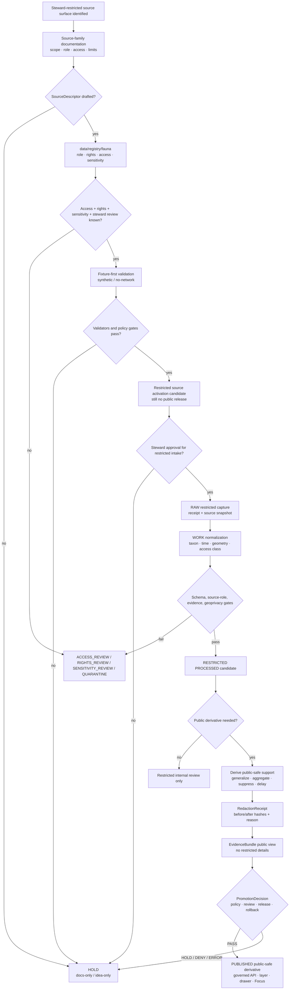

<!-- [KFM_META_BLOCK_V2]
doc_id: kfm://doc/TODO-register-steward-restricted-source-readme-uuid
title: Steward-Restricted Fauna Source Directory
type: standard
version: v1
status: draft
owners: TODO(fauna-source-stewards)
created: TODO(verify-original-created-date-or-set-on-first-meaningful-commit)
updated: 2026-05-07
policy_label: TODO(verify-public-or-restricted)
related: ["../README.md", "../../README.md", "../../SOURCE_ROLES.md", "../../GEOPRIVACY.md", "../../VALIDATION.md", "../../CONTROL_PLANE.md", "../../MIGRATION_AND_CONTINUITY.md", "../../../../../data/registry/fauna/README.md"]
tags: [kfm, fauna, source-directory, steward-restricted, geoprivacy, restricted-records, public-safety]
notes: [Revises the steward-restricted fauna source README into a full source-family control document; doc_id, owners, created date, policy_label, source descriptors, access rules, official steward terms, and validator wiring require verification before publication.]
[/KFM_META_BLOCK_V2] -->

<a id="top"></a>

# Steward-Restricted Fauna Source Directory

Governed documentation for controlled-access wildlife records, stewardship-sensitive source surfaces, and public-safe derivatives in the KFM fauna lane.

<p>
  
  
  
  
  
  
</p>

> [!IMPORTANT]
> **Impact block**
>
> | Field | Value |
> |---|---|
> | Status | `draft` source-family documentation |
> | Target path | `docs/domains/fauna/sources/steward-restricted/README.md` |
> | Owners | `TODO(fauna-source-stewards)` |
> | Access posture | Steward-restricted by default; public release requires a public-safe derivative and explicit release gate |
> | Connector posture | Blocked until source descriptor, rights, access class, sensitivity class, fixtures, review, receipts, and rollback path exist |
> | Public geometry posture | Public exact sensitive geometry is denied by default |
> | Runtime posture | Governed API, MapLibre, Evidence Drawer, exports, and Focus Mode consume released public-safe artifacts only |
> | Quick jumps | [Scope](#scope) · [Repo fit](#repo-fit) · [Accepted inputs](#accepted-inputs) · [Exclusions](#exclusions) · [Source-role posture](#source-role-posture) · [Activation flow](#activation-flow) · [Public-safety rules](#public-safety-rules) · [Quickstart](#quickstart) · [Review gates](#review-gates) · [Definition of done](#definition-of-done) · [Open verification](#open-verification) |

---

## Scope

This directory documents the `steward-restricted` fauna source family.

It is the source-family home for records and source surfaces that may contain, imply, or enable reconstruction of sensitive wildlife locations or stewardship-controlled knowledge. It is intentionally conservative. Its purpose is to describe how KFM should classify, hold, review, transform, cite, publish, correct, or deny use of steward-restricted source material.

### This directory governs

| Surface | Steward-restricted responsibility |
|---|---|
| Source-family orientation | Explain what controlled-access fauna source material is and how it fits the fauna lane. |
| Source-role discipline | Keep `steward_restricted_source`, `occurrence_source`, `monitoring_source`, `documentary_source`, and derived-public roles separate. |
| Access posture | Require explicit access class, steward review, release class, and public geometry class before use. |
| Geoprivacy posture | Deny exact public locations unless a verified non-sensitive exception exists. |
| Public-safe transformation | Require generalization, aggregation, suppression, delay, or redaction receipts before public derivatives. |
| Evidence posture | Require EvidenceRef → EvidenceBundle closure before public claims, drawers, exports, Focus answers, or release decisions. |
| Release posture | Keep public release gated by policy, review, proof, release manifest, correction path, and rollback target. |

### This directory does not govern

| Not governed here | Owning surface |
|---|---|
| Whole fauna lane scope | [`../../README.md`](../../README.md) |
| Source-family index | [`../README.md`](../README.md) |
| Source-role taxonomy | [`../../SOURCE_ROLES.md`](../../SOURCE_ROLES.md) |
| Geoprivacy and public geometry classes | [`../../GEOPRIVACY.md`](../../GEOPRIVACY.md) |
| Validation gates and fixture expectations | [`../../VALIDATION.md`](../../VALIDATION.md) |
| Domain ownership and active risk register | [`../../CONTROL_PLANE.md`](../../CONTROL_PLANE.md) |
| Prior-gain preservation and migration mapping | [`../../MIGRATION_AND_CONTINUITY.md`](../../MIGRATION_AND_CONTINUITY.md) |
| Source descriptors and registry backlog | [`../../../../../data/registry/fauna/README.md`](../../../../../data/registry/fauna/README.md) |
| Machine schemas | Accepted schema home after ADR / repo verification |
| Policy-as-code | `policy/fauna/` or repo-confirmed policy home |
| Validator implementation | `tools/validators/fauna/` or repo-confirmed validator home |
| Restricted data custody | Governed lifecycle roots and restricted stores, not public docs |

<p align="right"><a href="#top">Back to top ↑</a></p>

---

## Repo fit

`docs/domains/fauna/sources/steward-restricted/README.md` is a README-like source-family document under `docs/`, the human-facing KFM control plane.

```text
docs/domains/fauna/
├── README.md
├── CONTROL_PLANE.md
├── SOURCE_ROLES.md
├── GEOPRIVACY.md
├── VALIDATION.md
├── MIGRATION_AND_CONTINUITY.md
└── sources/
    ├── README.md
    ├── ebird/
    ├── gbif/
    ├── kdwp/
    ├── monitoring/
    ├── museum-specimens/
    ├── natureserve/
    ├── usfws/
    └── steward-restricted/
        └── README.md                  # this file
```

### Directory Rules basis

This path follows KFM responsibility-root placement:

| Concern | Correct responsibility root | Steward-restricted rule |
|---|---|---|
| Human-readable source documentation | `docs/domains/fauna/sources/steward-restricted/` | Explain source role, access posture, release limits, and activation blockers. |
| Source descriptors and verification backlog | `data/registry/fauna/` | Store source role, authority scope, access class, rights, cadence, sensitivity, and verification state. |
| RAW source capture | `data/raw/fauna/<source_id>/` | Never store source payloads in docs. |
| WORK / QUARANTINE records | `data/work/fauna/`, `data/quarantine/fauna/` | Keep unresolved source material out of public docs and runtime surfaces. |
| Restricted precise records | Restricted canonical store or governed internal lifecycle path | Never expose through public README, public API, public tiles, or examples. |
| Machine schemas | `schemas/` or ADR-accepted schema home | Shape validation belongs outside prose. |
| Executable policy | `policy/fauna/` | Policy owns allow, deny, restrict, abstain, redaction, and promotion obligations. |
| Validators and tests | `tools/`, `tests/`, `fixtures/`, or repo-confirmed homes | Executable checks prove the rules. |
| Receipts, proofs, and release | `data/receipts/`, `data/proofs/`, `release/` | Process memory, proof support, release decisions, correction, and rollback stay separate. |

> [!CAUTION]
> Do not create root-level `steward-restricted/`, `fauna/`, `wildlife/`, `species/`, or `sensitive-records/` folders. Place files by responsibility root, not topic convenience.

<p align="right"><a href="#top">Back to top ↑</a></p>

---

## Accepted inputs

This directory accepts source-family documentation and review guidance only.

| Input | Accepted here? | Conditions |
|---|---:|---|
| Steward-restricted source-family overview | ✅ | Must preserve restricted-by-default posture. |
| Access-class notes | ✅ | Must not reveal restricted details; use class names and obligations. |
| Source-role notes | ✅ | Must distinguish steward-restricted source material from public occurrence, legal/status, monitoring, habitat, model, or documentary roles. |
| Public-safe derivative guidance | ✅ | Must require transformation receipts and release gates. |
| Geoprivacy notes | ✅ | Must align with [`../../GEOPRIVACY.md`](../../GEOPRIVACY.md). |
| Validation expectations | ✅ | Must align with [`../../VALIDATION.md`](../../VALIDATION.md). |
| Negative examples | ✅ | Preferred when they show `DENY`, `HOLD`, `ABSTAIN`, `QUARANTINE`, or `ERROR`. |
| Source activation blockers | ✅ | Must be explicit, reviewable, and traceable to registry or policy obligations. |
| Public-warning language | ✅ | Must be general enough to avoid leaking restricted source details. |

### Accepted maturity states

| State | Meaning | Public release allowed? |
|---|---|---:|
| `IDEA_ONLY` | Steward-restricted source family named but not described. | No |
| `DESCRIPTOR_DRAFT` | Source descriptor is being drafted. | No |
| `ACCESS_REVIEW` | Access class, steward role, or permitted use is unresolved. | No |
| `RIGHTS_REVIEW` | Rights, terms, redistribution, or attribution remain unresolved. | No |
| `SENSITIVITY_REVIEW` | Taxon, geometry, time, site type, or source-level sensitivity remains unresolved. | No |
| `FIXTURE_ONLY` | Synthetic or no-network fixture path exists. | No production release |
| `INTERNAL_RESTRICTED` | Material may be used only in steward or internal review workflows. | No public release |
| `PUBLIC_SAFE_DERIVATIVE_CANDIDATE` | Candidate derivative exists after generalization, suppression, aggregation, or delay. | Not yet |
| `RELEASE_CANDIDATE` | Public-safe candidate is assembled but not promoted. | Not yet |
| `PUBLISHED_PUBLIC_SAFE` | Governed release approved for a specific scope. | Yes, within release scope |
| `SUSPENDED` | Source or derivative paused due to risk, defect, rights issue, or source drift. | No new promotion |
| `WITHDRAWN` | Public release withdrawn or superseded. | No |

<p align="right"><a href="#top">Back to top ↑</a></p>

---

## Exclusions

These items must not be committed under `docs/domains/fauna/sources/steward-restricted/`.

| Excluded item | Correct handling | Why |
|---|---|---|
| Raw steward records, exports, field forms, survey sheets, or source extracts | `data/raw/fauna/<source_id>/` after descriptor and receipt handling | Docs are not lifecycle storage. |
| Work-stage normalized records | `data/work/fauna/` | WORK products are mutable and not public documentation. |
| Quarantined records | `data/quarantine/fauna/` | May contain unresolved rights, source-role, taxonomy, or sensitivity defects. |
| Exact sensitive coordinates | Restricted canonical store only | Public docs must not leak protected locations. |
| Nest, den, roost, hibernacula, lek, cave, colony, spawning, nursery, breeding, telemetry, or steward-controlled exact locations | Restricted store or steward review packet only | These are high-risk public-safety surfaces. |
| Private locality descriptions or reverse-engineering hints | Restricted store or redacted steward note | Text can leak location even when coordinates are removed. |
| Private landowner, collector, observer, reviewer, or steward identity when not release-cleared | Restricted store or internal review system | Identifying information may create privacy, safety, or stewardship risk. |
| Source credentials, tokens, private URLs, cookies, or access keys | Secret manager / ignored local environment | Secrets never belong in docs. |
| Machine schemas | Accepted schema home after ADR / repo verification | Schemas own machine-checkable shape. |
| Policy-as-code | `policy/fauna/` or repo-confirmed policy home | Policy must be executable and tested. |
| Validator implementation | `tools/validators/fauna/` or repo-confirmed validator home | Validators must emit reports and run in CI/tooling. |
| Generated validation reports | Build artifacts, receipts, or proof homes | Reports must be reproducible and separated. |
| Release manifests, proof packs, correction notices, rollback cards | `release/`, `data/proofs/`, `data/receipts/`, or repo-confirmed homes | Release decisions and proof objects are trust records, not prose. |
| Direct AI answers or model traces | Nowhere as evidence | AI is interpretive and evidence-bounded; EvidenceBundle and policy outrank generated language. |

<p align="right"><a href="#top">Back to top ↑</a></p>

---

## Source-role posture

The canonical role for this source family is `steward_restricted_source`.

A steward-restricted source may also support narrower roles after verification, but those roles must not erase the restricted custody posture.

| Candidate role | Can support after verification | Must not imply | Required proof before use |
|---|---|---|---|
| `steward_restricted_source` | Controlled-access records, protected locations, stewardship obligations, review-sensitive source material, or restricted source surfaces. | Public exact geometry, unrestricted public API output, or automatic public derivative permission. | Access class, steward review, sensitivity class, public geometry class, release class, redaction policy, rollback path. |
| `occurrence_source` | Reviewed occurrence evidence where the source surface actually supports occurrence claims. | Legal/status authority, complete census, true absence, public exact location permission. | Event time, spatial support, precision/uncertainty, rights, sensitivity, EvidenceRefs. |
| `monitoring_source` | Protocol-bound survey, route, transect, station, telemetry, eDNA, acoustic, or field-record support. | Broad absence, unrestricted exact station/route exposure, legal status. | Protocol, effort, method, target taxa, survey window, station/route release class, EvidenceRefs. |
| `documentary_source` | Cited report, memo, form, narrative, photo, or historical support after review. | Precise geometry or current occurrence unless separately supported. | Citation, date, confidence, spatial interpretation, review state, EvidenceRefs. |
| `habitat_context` | Steward-reviewed habitat or review context. | Proof that a species occurred at a point. | Context method, spatial/temporal extent, limitations, rights, EvidenceRefs. |
| `derived_model` | Public-safe suitability, range, density, richness, or risk derivative. | Canonical observation, raw evidence, legal status, or exact occurrence. | Model version, input sources, uncertainty, rebuild path, public-safe output class. |
| `data_mirror_or_cache` | Technical snapshot, digest comparison, or availability support. | Independent evidence authority. | Upstream source ID, sync time, digest, mirror scope, integrity policy. |

> [!WARNING]
> A steward-restricted source can be useful evidence without being publishable evidence. Missing `source_role`, unknown access class, unknown rights, unclear sensitivity, or absent steward review blocks public promotion.

### Claim compatibility

| Claim | Minimum compatible role | Required behavior |
|---|---|---|
| “A restricted record exists for Taxon X in area Y.” | `steward_restricted_source` | Public output must generalize, suppress, or deny precise support; EvidenceBundle public view must not reveal restricted details. |
| “Taxon X was observed at exact Location Y.” | `occurrence_source` plus release-cleared public geometry class | Exact public output requires rare explicit allowance; otherwise DENY or provide public-safe derivative only. |
| “This survey did not detect Taxon X.” | `monitoring_source` | Must include protocol, effort, time window, and detection limits; broad absence claims require ABSTAIN. |
| “This public layer can show exact points.” | Role alone is insufficient | Requires rights, sensitivity, geoprivacy, public geometry class, evidence, review, release, and rollback. |
| “Focus Mode can answer this question.” | Compatible role plus EvidenceBundle | Return `ANSWER`, `ABSTAIN`, `DENY`, or `ERROR`; never reveal restricted locations. |

<p align="right"><a href="#top">Back to top ↑</a></p>

---

## Activation flow

A source-family README is early in the trust path. It documents posture and obligations; it does not activate ingestion or publication.



### Flow rules

1. This README is not a source activation decision.
2. Source descriptor, access class, rights, sensitivity, cadence, and steward review are required before live restricted intake.
3. Synthetic/no-network fixtures must prove behavior before any live source work.
4. Restricted precise source records remain internal or steward-facing unless a public-safe derivative is created.
5. Every public-safe derivative requires a transform reason, receipt, EvidenceBundle, policy decision, release state, correction path, and rollback target.
6. Public clients and Focus Mode consume governed public-safe release surfaces only.

<p align="right"><a href="#top">Back to top ↑</a></p>

---

## Public-safety rules

### Non-negotiables

| Rule | Required behavior | Failure outcome |
|---|---|---|
| Connector blocked until verified | Do not activate live steward-restricted ingestion from docs alone. | `HOLD` |
| Access class required | Define who may inspect source-native material and who may approve derivatives. | `HOLD` / `QUARANTINE` |
| Source descriptor required | Declare source role, authority scope, rights, cadence, access class, attribution, and sensitivity posture. | `QUARANTINE` / `HOLD` |
| Steward review required | Restricted-source release class must be reviewed before any public derivative. | `HOLD` |
| Exact public geometry denied by default | No exact sensitive location in public payloads. | `DENY` |
| Text leakage denied | Private locality, station IDs, route names, repeated observations, or rare-place hints must not reconstruct restricted locations. | `DENY` |
| Redaction/generalization receipt required | Public derivatives must document transformation class, reason, policy version, before/after hashes, and rollback reference. | `DENY` |
| EvidenceBundle required | Public claims and Focus answers must resolve supporting evidence without exposing restricted details. | `ABSTAIN` / `DENY` |
| Release and rollback required | Public artifacts require review, release manifest, correction path, and rollback target. | `HOLD` / `ERROR` |

### Public payload deny list

Public steward-restricted derivatives must not include:

- restricted exact coordinates;
- `restricted_geometry_ref` contents;
- source-native locality descriptions;
- nest, den, roost, hibernacula, lek, cave, colony, spawning, nursery, breeding-site, monitoring-station, telemetry, or steward-controlled exact geometry;
- repeated-observation patterns that reconstruct precise sites;
- private landowner, collector, observer, reviewer, or steward identity when not release-cleared;
- hidden rejoin keys that could restore restricted geometry;
- source credentials, access tokens, cookies, private URLs, or hidden query strings;
- raw source payloads;
- suppressed-group details that reveal the reason for withholding when that reason is itself sensitive;
- AI prompt context containing restricted geometry or private locality text.

### Required public warning pattern

Use this warning, or a steward-approved equivalent, for public derivatives:

> This KFM fauna output is a public-safe derivative for the released scope only. It intentionally withholds or generalizes steward-restricted locations and must not be interpreted as exact occurrence, abundance, true absence, population trend, complete survey coverage, or unrestricted access to restricted source records unless separately supported by compatible released evidence.

<p align="right"><a href="#top">Back to top ↑</a></p>

---

## Required receipts and proof objects

| Object | Required when | Minimum contents |
|---|---|---|
| `SourceIntakeReceipt` | Restricted source material is admitted to RAW. | Source ID, access class, retrieval/acquisition method, actor/run, timestamp, digest, source descriptor ref, restriction reason. |
| `ValidationReport` | Source descriptor, occurrence, monitoring, taxonomy, public derivative, or release candidate is validated. | Gate outcomes, reason codes, blockers, report refs, fixture/source scope. |
| `RedactionReceipt` | Geometry, text, timing, or fields are generalized, suppressed, delayed, or redacted. | Before/after hashes, transform class, parameters ref, reason codes, policy version, actor/run, rollback ref. |
| `EvidenceBundle` | A public claim, drawer, export, Focus answer, or release candidate references evidence. | Public-safe support, citations, source roles, rights summary, sensitivity summary, limitations, review/release state. |
| `ReleaseManifest` | Public-safe derivative is promoted. | Release ID, artifacts, digests, field allowlist, public geometry class, policy results, review state, rollback target. |
| `CorrectionNotice` | Released output is corrected, withdrawn, superseded, or clarified. | Affected release, reason, public impact, replacement/withdrawal state, evidence/proof refs. |
| `RollbackCard` | Public release must be restored or withdrawn. | Prior known-good release, caches/assets to invalidate, aliases to restore, validation commands, rollback receipt. |

> [!NOTE]
> Receipts are process memory. Proof objects support release. Release manifests make promotion inspectable. They should cross-reference each other, not collapse into one file.

<p align="right"><a href="#top">Back to top ↑</a></p>

---

## Quickstart

Run these checks only from a verified repository checkout.

### 1. Confirm repository and target path

```bash
git status --short
git branch --show-current

find docs/domains/fauna/sources/steward-restricted -maxdepth 2 -type f | sort
```

Expected result: this README is visible, and Git commands do not return fatal repository errors.

### 2. Inspect steward-restricted references

```bash
rg -n --no-heading \
  "steward|restricted|restricted_precise|public_generalized|redaction|geoprivacy|EvidenceBundle|DENY|ABSTAIN|QUARANTINE|Rollback" \
  docs data/registry policy tools tests schemas contracts 2>/dev/null
```

Expected result: related docs, source descriptors, policies, validators, fixtures, or backlog entries are visible without implying source activation.

### 3. Verify source descriptor before live use

```bash
# PROPOSED: replace with repo-native validator when confirmed.
python tools/validators/fauna/validate_sources.py \
  --registry data/registry/fauna \
  --source-role steward_restricted_source \
  --reports build/fauna/reports
```

Expected result: missing source role, unknown rights, missing access class, unresolved steward review, unresolved sensitivity, or missing evidence policy blocks activation.

### 4. Run fixture-first validation

```bash
# PROPOSED: adapt to the repository's accepted test layout and command runner.
python tools/validators/fauna/run_all.py \
  --fixtures tests/fixtures/fauna \
  --registry data/registry/fauna \
  --reports build/fauna/reports

conftest test \
  --policy policy/fauna \
  tests/fixtures/fauna
```

Expected result: fixture-only validation proves `PASS`, `HOLD`, `DENY`, `ABSTAIN`, `QUARANTINE`, and `ERROR` behavior before live steward-restricted ingestion.

> [!WARNING]
> Do not add live restricted-source fetching to quickstart commands. Live source access requires source descriptor approval, access review, source-rights review, sensitivity review, steward review, receipts, validation reports, and release gating.

<p align="right"><a href="#top">Back to top ↑</a></p>

---

## Usage

### Add a steward-restricted source surface

1. Draft or update a source descriptor in the accepted fauna registry home.
2. Set `source_role: steward_restricted_source`.
3. Record access class, steward owner, authority scope, rights, cadence, citation policy, sensitivity posture, and public geometry class.
4. Add source-role and geoprivacy negative fixtures.
5. Keep live intake blocked until validation and steward review pass.
6. Document whether any public derivative is permitted, denied, delayed, generalized, or suppressed.

### Add a public-safe derivative

1. Confirm the source is allowed to generate a public derivative.
2. Remove exact restricted coordinates and restricted text.
3. Choose public geometry class: county, grid, watershed, bounding box, generalized polygon, density grid, range support, delayed summary, or suppression.
4. Emit a `RedactionReceipt`.
5. Build a public-safe EvidenceBundle view.
6. Validate API, layer, search, graph, export, screenshot, Evidence Drawer, and Focus payloads.
7. Promote only through release manifest and rollback target.

### Use steward-restricted support in Focus Mode

1. Use only released, public-safe EvidenceBundles.
2. Include source role and release scope in context.
3. Deny requests for restricted exact locations.
4. Abstain when evidence is insufficient, source role is incompatible, or citations cannot be validated.
5. Return finite outcome: `ANSWER`, `ABSTAIN`, `DENY`, or `ERROR`.

<p align="right"><a href="#top">Back to top ↑</a></p>

---

## Review gates

Before merging changes in this directory or activating steward-restricted source work, reviewers should verify:

- [ ] Metadata placeholders are either resolved from registry/steward evidence or intentionally left as TODO.
- [ ] Live source ingestion remains blocked unless a source activation decision exists.
- [ ] Source descriptor exists or the source surface is clearly marked docs-only / draft.
- [ ] `source_role` is explicit and scoped.
- [ ] Access class and steward review posture are explicit.
- [ ] Rights, redistribution, attribution, and record-level use are verified or explicitly blocking.
- [ ] Source cadence, effective date, and versioning are verified or explicitly blocking.
- [ ] Sensitive exact geometry is denied from public API, tiles, search, graph, screenshots, exports, Evidence Drawer, and Focus Mode.
- [ ] Public payload examples contain no exact restricted coordinates, private locality, credentials, hidden rejoin keys, or restricted fields.
- [ ] Redaction/generalization receipts are required for every public-safe derivative.
- [ ] EvidenceRefs resolve to EvidenceBundles before claims are exposed.
- [ ] Focus Mode examples include `ABSTAIN` and `DENY`, not only successful answers.
- [ ] Release review, correction path, and rollback target are documented before publication.
- [ ] Any behavior change updates source docs, registry docs, validators, fixtures, policy, runbooks, and release notes as needed.

<p align="right"><a href="#top">Back to top ↑</a></p>

---

## Definition of done

This README is ready to merge when:

| Area | Done means |
|---|---|
| Metadata | `doc_id`, owners, created date, updated date, and policy label are resolved or intentionally left as TODO placeholders. |
| Target replacement | The existing steward-restricted note is replaced by this complete source-family README. |
| Repo fit | Relative links are valid from `docs/domains/fauna/sources/steward-restricted/`. |
| Source role | Steward-restricted source surfaces are treated as restricted-by-default and not globally public-authoritative. |
| Connector posture | Live source activation remains blocked unless descriptor, rights, access, sensitivity, fixtures, and review are complete. |
| Public safety | Public exact sensitive geometry is denied by default. |
| Evidence posture | EvidenceBundle support is required for public claims and Focus Mode. |
| Release posture | Public release requires validation, policy, review, release manifest, correction path, and rollback target. |
| Unknowns | Remaining unknowns are explicit and not hidden in confident prose. |

<p align="right"><a href="#top">Back to top ↑</a></p>

---

## Open verification

| Item | Status | Needed proof |
|---|---:|---|
| Registered `doc_id` | TODO | Document registry entry. |
| Owners | TODO | CODEOWNERS, steward register, or source-lane owner assignment. |
| Created date | TODO | Git history or steward-approved first meaningful commit date. |
| Policy label | TODO | Repo policy classification for this documentation file. |
| Restricted-source access model | NEEDS VERIFICATION | Steward review process, role definitions, and permitted-use classes. |
| Source descriptor schema | NEEDS VERIFICATION | Accepted source descriptor schema and enum values. |
| Source descriptor entries | NEEDS VERIFICATION | `data/registry/fauna` entries for each restricted source surface. |
| Rights and redistribution | NEEDS VERIFICATION | Current terms, license, attribution, redistribution, and record-level use rules. |
| Cadence and versioning | NEEDS VERIFICATION | Effective dates, update cadence, retrieval cadence, stale-state handling. |
| Steward review rules | NEEDS VERIFICATION | Protected species, exact-location, monitoring, review-sensitive, and restricted-record handling. |
| Schema home | NEEDS VERIFICATION | Accepted ADR or repo convention for fauna source descriptors and downstream schemas. |
| Policy runner | NEEDS VERIFICATION | OPA/Conftest/Rego or repo-native policy runner command. |
| Validator commands | NEEDS VERIFICATION | Actual validator entrypoints and report formats. |
| Fixture suite | NEEDS VERIFICATION | Valid and invalid steward-restricted fixture coverage. |
| CI enforcement | UNKNOWN | Workflow evidence and check history. |
| Public API/UI routes | UNKNOWN | Governed API route tree, MapLibre layer registry, Evidence Drawer payload, and Focus Mode implementation evidence. |
| Release objects | NEEDS VERIFICATION | ReleaseManifest, PromotionDecision, EvidenceBundle, CorrectionNotice, RollbackCard, receipts, and proof-pack conventions. |
| Live restricted-source activation | BLOCKED BY DEFAULT | SourceActivationDecision or equivalent approval. |

<p align="right"><a href="#top">Back to top ↑</a></p>

---

## FAQ

### Does this README activate steward-restricted ingestion?

No. This README is documentation only. It does not activate a connector, create a source descriptor, fetch live source data, publish a layer, or approve public release.

### Can steward-restricted records be used in public products?

Only through a reviewed public-safe derivative. Exact restricted details remain withheld unless a verified non-sensitive exception is explicitly approved.

### Can public layers show exact steward-restricted points?

No by default. Public products should use approved generalized, aggregate, delayed, suppressed, or other public-safe support with receipts where needed.

### Can Focus Mode answer questions about steward-restricted material?

Yes, but only over released, public-safe EvidenceBundles. Focus Mode must abstain when evidence is insufficient and deny requests that would expose restricted locations or violate policy.

### What happens when source rights or access class are unknown?

Unknown or incompatible rights, access class, or steward review posture blocks public promotion. The correct outcome is `HOLD`, `DENY`, or `QUARANTINE` until resolved.

### Can a generalized public derivative be reversed into exact locations?

It must not be possible through ordinary public surfaces. Validation should check for direct fields, repeated observations, hidden keys, metadata leakage, and cross-layer reverse-engineering risks.

<p align="right"><a href="#top">Back to top ↑</a></p>

---

## Appendix

<details>
<summary>Minimum steward-restricted source descriptor packet</summary>

Illustrative only. Align field names with the accepted source descriptor schema before merge.

```yaml
source_id: kfm://source/fauna/steward-restricted/TODO
source_family: steward-restricted
publisher: TODO-VERIFY
title: TODO-VERIFY
source_surface: TODO-VERIFY
source_role: steward_restricted_source
access_class: TODO-VERIFY(steward_only|restricted_internal|review_required|noassertion)
authority_scope:
  can_support:
    - TODO-VERIFY
  cannot_support:
    - public_exact_sensitive_geometry
    - unrestricted_public_api_payload
    - abundance_or_trend_without_compatible_study_design
rights:
  status: TODO-VERIFY(public|open|restricted|unknown|noassertion)
  redistribution: TODO-VERIFY
  attribution_required: TODO-VERIFY
cadence:
  update_cadence: TODO-VERIFY
  effective_date_policy: TODO-VERIFY
  stale_after: TODO-VERIFY
sensitivity:
  default_class: restricted_precise
  steward_review_required: true
  public_geometry_default: DENY_EXACT
  allowed_public_derivatives:
    - TODO-VERIFY(county|grid|watershed|bbox|range|density_grid|suppressed|delayed)
evidence_policy:
  evidence_ref_required: true
  evidence_bundle_required_for_public_claims: true
release_policy:
  public_release_allowed: false
  public_release_requires:
    - steward_review
    - redaction_receipt
    - evidence_bundle
    - policy_decision
    - release_manifest
    - rollback_target
verification:
  last_verified: TODO-VERIFY
  next_review: TODO-VERIFY
  blockers:
    - TODO-VERIFY
```

</details>

<details>
<summary>Negative fixture ideas</summary>

| Fixture | Expected outcome |
|---|---|
| `steward_restricted_exact_public_point.json` | `DENY` |
| `steward_restricted_unknown_access_class.json` | `HOLD` / `QUARANTINE` |
| `steward_restricted_unknown_rights.json` | `DENY` public promotion |
| `restricted_record_missing_steward_review.json` | `HOLD` |
| `restricted_record_public_payload_with_locality_text.json` | `DENY` |
| `restricted_record_public_payload_with_hidden_rejoin_key.json` | `DENY` |
| `restricted_record_public_pmtiles_metadata_leak.json` | `DENY` |
| `restricted_record_focus_mode_exact_location_request.json` | `DENY` |
| `restricted_record_public_derivative_without_redaction_receipt.json` | `DENY` |
| `restricted_record_public_derivative_without_evidence_bundle.json` | `ABSTAIN` / `DENY` |
| `restricted_record_release_without_rollback_target.json` | `ERROR` |
| `restricted_record_source_descriptor_missing_authority_scope.json` | `HOLD` |

</details>

<details>
<summary>Public derivative checklist</summary>

A public derivative from steward-restricted source material should require:

- [ ] source descriptor;
- [ ] access class;
- [ ] rights status;
- [ ] source-role compatibility;
- [ ] sensitivity class;
- [ ] public geometry class;
- [ ] transform method;
- [ ] redaction/generalization receipt;
- [ ] EvidenceBundle public view;
- [ ] field allowlist;
- [ ] no-leak validation across API, layer, search, graph, export, screenshot, Evidence Drawer, and Focus Mode;
- [ ] policy decision;
- [ ] review state;
- [ ] release manifest;
- [ ] rollback target;
- [ ] correction path.

</details>

<p align="right"><a href="#top">Back to top ↑</a></p>
