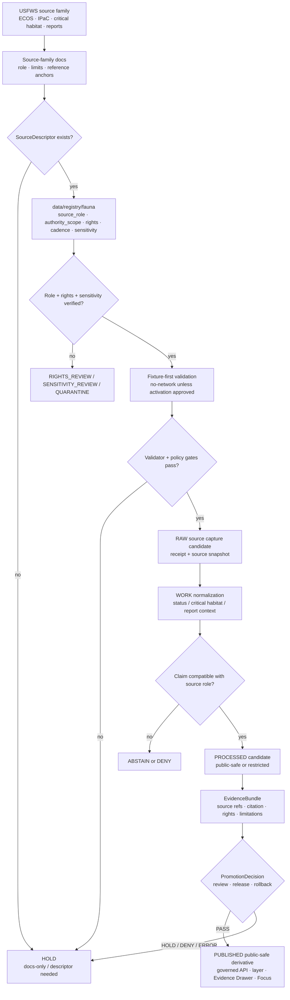

<!-- [KFM_META_BLOCK_V2]
doc_id: kfm://doc/TODO-usfws-source-readme-NEEDS-VERIFICATION
title: USFWS Source README
type: standard
version: v1
status: draft
owners: TODO(fauna-source-stewards|federal-status-stewards)
created: TODO(verify-original-created-date-or-set-on-first-meaningful-commit)
updated: 2026-05-07
policy_label: TODO(public-or-restricted-NEEDS-VERIFICATION)
related: ["../README.md", "../../README.md", "../../SOURCE_ROLES.md", "../../GEOPRIVACY.md", "../../VALIDATION.md", "../../../../../data/registry/fauna/README.md"]
tags: [kfm, fauna, usfws, ecos, ipac, critical-habitat, federal-status, source-readme, geoprivacy]
notes: [Target file existed as a short PROPOSED / NEEDS VERIFICATION placeholder before this revision; doc_id owners created_date and policy_label require registry or steward verification; this README does not activate USFWS ingestion or public release.]
[/KFM_META_BLOCK_V2] -->

<a id="top"></a>

# USFWS Source README

Governed source-family landing page for USFWS, ECOS, IPaC, federal species-status, critical-habitat, and project-planning context in KFM’s fauna domain.

<p>
  
  
  
  
  
  
  
</p>

> [!IMPORTANT]
> **Impact block**
>
> | Field | Value |
> |---|---|
> | Status | `draft` source-family README |
> | Owners | `TODO(fauna-source-stewards\|federal-status-stewards)` |
> | Target path | `docs/domains/fauna/sources/usfws/README.md` |
> | Directory role | Human-facing source-family documentation for USFWS-related fauna inputs |
> | Connector posture | Disabled until source descriptor, rights, sensitivity, fixture validation, release review, and rollback path are verified |
> | Source-role posture | Federal legal/status and critical-habitat context only when the exact USFWS surface supports that role |
> | Public-safety posture | Unknown rights, unknown source role, unresolved sensitivity, or exact sensitive geometry blocks public promotion |
> | Runtime posture | Public clients consume released KFM artifacts through governed APIs only; no browser-to-USFWS live fetch |
> | Quick jumps | [Scope](#scope) · [Repo fit](#repo-fit) · [Accepted inputs](#accepted-inputs) · [Exclusions](#exclusions) · [Directory tree](#directory-tree) · [USFWS source-family map](#usfws-source-family-map) · [Trust flow](#trust-flow) · [Operating rules](#operating-rules) · [Quickstart](#quickstart) · [Usage](#usage) · [Validation gates](#validation-gates) · [Definition of done](#definition-of-done) · [Open verification](#open-verification) · [FAQ](#faq) |

---

## Scope

This directory documents the `usfws` source family for KFM fauna work. It is a source-family documentation surface, not an ingestion switch, source descriptor, runtime endpoint, release decision, or public evidence object.

USFWS-related sources can be highly valuable for:

- federal threatened/endangered species status context;
- ESA-related species reports and recovery or listing documentation;
- designated or proposed critical-habitat context;
- project-planning and consultation context through IPaC-like workflows;
- federal-source references for EvidenceBundles, release manifests, and Focus Mode citations.

They must not be collapsed into general occurrence truth, Kansas state legal status, habitat suitability proof, private-land access authority, population proof, or public exact-location permission.

### This README governs

| Surface | Source-directory responsibility |
|---|---|
| Source-family orientation | Explain what USFWS-related source surfaces can and cannot support inside the fauna lane. |
| Source-role boundaries | Keep federal legal/status, critical-habitat, project-planning, occurrence evidence, habitat context, and derived model support distinct. |
| Public-safety posture | Preserve exact sensitive geometry denial and public-safe release rules. |
| Connector readiness | Make clear that no live connector is active from this README alone. |
| Review navigation | Point contributors toward source registry, source-role, geoprivacy, validation, release, and rollback surfaces. |
| Runtime guardrails | Keep public API, MapLibre, Evidence Drawer, and Focus Mode downstream of released public-safe artifacts and EvidenceBundles. |

### This README does not govern

| Not governed here | Owning surface |
|---|---|
| Fauna-wide source-role taxonomy | [`../../SOURCE_ROLES.md`](../../SOURCE_ROLES.md) |
| Sensitive-location and public-geometry rules | [`../../GEOPRIVACY.md`](../../GEOPRIVACY.md) |
| Fauna-wide validation guidance | [`../../VALIDATION.md`](../../VALIDATION.md) |
| Source descriptors and verification backlog | [`../../../../../data/registry/fauna/README.md`](../../../../../data/registry/fauna/README.md) |
| Machine schemas | Accepted schema home after ADR / repo verification |
| Policy-as-code | `../../../../../policy/fauna/` or repo-confirmed policy home |
| Validator implementation | `../../../../../tools/validators/fauna/` or repo-confirmed validator home |
| Source payloads and lifecycle data | `data/raw/`, `data/work/`, `data/quarantine/`, `data/processed/`, `data/catalog/`, `data/published/`, or repo-confirmed lifecycle homes |
| Release decisions, receipts, proof packs, corrections, rollback | `release/`, `data/receipts/`, `data/proofs/`, or repo-confirmed trust-object homes |

<p align="right"><a href="#top">Back to top ↑</a></p>

---

## Repo fit

`docs/domains/fauna/sources/usfws/README.md` is a README-like source-family document under `docs/`, the human-facing control plane.

```text
docs/domains/fauna/
├── README.md
├── SOURCE_ROLES.md
├── GEOPRIVACY.md
├── VALIDATION.md
└── sources/
    ├── README.md
    ├── ebird/
    │   └── README.md
    ├── gbif/
    │   └── README.md
    └── usfws/
        └── README.md          # this file
```

### Directory Rules basis

This file belongs under `docs/domains/fauna/sources/` because it explains a domain source-family. It must not create a root-level `usfws/`, `ecos/`, `ipac/`, `critical-habitat/`, or `fauna/` folder.

| Concern | Correct responsibility root | USFWS README rule |
|---|---|---|
| Human-facing source docs | `docs/domains/fauna/sources/usfws/` | Explain role, limits, activation blockers, and review posture. |
| Source descriptors | `data/registry/fauna/` or accepted registry home | Store source role, rights, access class, cadence, authority scope, and verification state. |
| RAW source captures | `data/raw/fauna/usfws/` or repo-confirmed lifecycle home | Never store source payloads in docs. |
| Quarantine | `data/quarantine/fauna/` | Unknown rights, malformed shape, ambiguous source role, or sensitivity defects fail closed. |
| Machine schemas | `schemas/` or accepted schema home | Shape validation belongs outside prose. |
| Policy-as-code | `policy/` | Allow, deny, restrict, abstain, and release obligations must be executable and tested. |
| Validators | `tools/validators/`, `packages/`, or repo-native tool home | Validator code emits machine-readable reports. |
| Release and rollback | `release/`, `data/proofs/`, `data/receipts/`, or accepted homes | Release decisions and proof objects stay separate from documentation. |

> [!CAUTION]
> USFWS source material may be authoritative for **federal** species-status or critical-habitat context only when the exact source surface supports that role. It must not be silently reused as Kansas state authority, observed occurrence proof, complete distribution, or public exact-location authorization.

<p align="right"><a href="#top">Back to top ↑</a></p>

---

## Accepted inputs

This directory accepts reviewable documentation and source-family control guidance only.

| Input | Accepted here? | Conditions |
|---|---:|---|
| USFWS source-family overview | ✅ | Must preserve federal-source role limits and cite-or-abstain posture. |
| ECOS / species-report notes | ✅ | Must be scoped to federal status, listing, recovery, taxonomy, or report context actually supported by the source. |
| Critical-habitat notes | ✅ | Must distinguish designated/proposed critical habitat from occurrence, abundance, land ownership, refuge/reserve status, or private-land access. |
| IPaC project-planning notes | ✅ | Must stay project-contextual and not become general distribution or occurrence truth. |
| Source-role compatibility notes | ✅ | Must align with [`../../SOURCE_ROLES.md`](../../SOURCE_ROLES.md). |
| Public-safety and geoprivacy notes | ✅ | Must align with [`../../GEOPRIVACY.md`](../../GEOPRIVACY.md). |
| Fixture-first validation guidance | ✅ | Must not imply live source activation. |
| Negative examples | ✅ | Preferred when they demonstrate `DENY`, `ABSTAIN`, `HOLD`, `QUARANTINE`, or `ERROR`. |
| Official reference links | ✅ | Use as review anchors only; links do not activate connectors. |
| Source activation checklist | ✅ | Must point to registry, rights, sensitivity, validation, release, and rollback requirements. |

### Accepted source maturity states

| State | Meaning | Public release allowed? |
|---|---|---:|
| `DOCS_ONLY` | Human-facing documentation exists. | No |
| `DESCRIPTOR_DRAFT` | Source descriptor is being drafted in the registry. | No |
| `RIGHTS_REVIEW` | Terms, citation, redistribution, or API/license posture are unresolved. | No |
| `SENSITIVITY_REVIEW` | Source may expose protected, precise, or steward-sensitive information. | No |
| `FIXTURE_ONLY` | Synthetic or no-network fixture path exists. | No production release |
| `SOURCE_ACTIVATION_REVIEW` | Connector or download workflow is being reviewed. | No |
| `INTERNAL_RESTRICTED` | Source may support steward/internal review only. | No public release |
| `RELEASE_CANDIDATE` | Public-safe derivative assembled but not promoted. | Not yet |
| `PUBLISHED_PUBLIC_SAFE` | Governed release approved for a specific scope. | Yes, within release scope |
| `SUSPENDED` | Source or derivative paused due to risk, defect, terms change, or data issue. | No new promotion |
| `WITHDRAWN` | Public release withdrawn or superseded. | No |

<p align="right"><a href="#top">Back to top ↑</a></p>

---

## Exclusions

These items must not be committed under `docs/domains/fauna/sources/usfws/`.

| Excluded item | Correct handling | Why |
|---|---|---|
| Raw ECOS, IPaC, species report, or critical-habitat downloads | `data/raw/fauna/usfws/...` after source descriptor and ingest receipt handling | Documentation is not lifecycle storage. |
| Work-stage normalized records | `data/work/fauna/usfws/...` | WORK material is mutable and not public documentation. |
| Quarantined source records | `data/quarantine/fauna/...` | Quarantine may contain unresolved rights, sensitivity, or schema defects. |
| Exact protected occurrence coordinates | Restricted internal store only | Public docs, examples, screenshots, and exports must not leak sensitive locations. |
| API keys, private project tokens, credentials, cookies, private URLs | Secret manager / ignored local environment | Secrets never belong in docs. |
| Machine JSON Schemas | Accepted schema home after ADR / repo verification | Schemas own machine-checkable shape. |
| Policy-as-code | `policy/fauna/...` or repo-confirmed policy home | Policy must be executable and tested. |
| Validator implementation | `tools/validators/fauna/...` or repo-confirmed validator home | Validator code should not live in source-family prose. |
| Generated validation reports | Build artifacts, receipt homes, or proof homes | Generated evidence should be reproducible and separated. |
| Release manifests, proof packs, rollback cards, correction notices | `release/`, `data/proofs/`, `data/receipts/`, or accepted homes | Trust objects are not ordinary documentation. |
| Direct AI answers or model traces | Nowhere as evidence | AI is interpretive; EvidenceBundle and policy outrank generated language. |

<p align="right"><a href="#top">Back to top ↑</a></p>

---

## Directory tree

Current target surface:

```text
docs/domains/fauna/sources/usfws/
└── README.md
```

Recommended future subdivision, only after source descriptors and review posture justify it:

```text
docs/domains/fauna/sources/usfws/
├── README.md
├── ECOS_SPECIES_STATUS.md              # PROPOSED / NEEDS VERIFICATION
├── CRITICAL_HABITAT.md                 # PROPOSED / NEEDS VERIFICATION
├── IPAC_PROJECT_PLANNING.md            # PROPOSED / NEEDS VERIFICATION
├── FEDERAL_REGISTER_AND_REPORTS.md     # PROPOSED / NEEDS VERIFICATION
└── USFWS_VALIDATION_NOTES.md           # PROPOSED / NEEDS VERIFICATION
```

> [!NOTE]
> Add future files only when each file has a distinct source-family responsibility. Do not split the directory merely to mirror USFWS branding, endpoint names, or temporary implementation experiments.

<p align="right"><a href="#top">Back to top ↑</a></p>

---

## USFWS source-family map

USFWS is not one source role. Treat each source surface by what it can actually support.

| Source surface | Default source role | Can support | Must not be used as | Activation status |
|---|---|---|---|---:|
| ECOS / FWS species reports | `federal_legal_status_authority` or `federal_species_documentation` | Federal ESA/listing, species-report, recovery-plan, Federal Register, or related federal documentation context when verified. | Kansas state legal status, observed occurrence, complete distribution, exact-location permission, or habitat suitability proof. | `NEEDS VERIFICATION` |
| ECOS Species Data Explorer / REST-like reports | `federal_species_documentation` | Structured federal species data, taxonomy/listing/report metadata, and EvidenceBundle citations when verified. | Public runtime source of truth without registry, schema, and citation validation. | `NEEDS VERIFICATION` |
| USFWS critical-habitat boundaries / reports | `federal_critical_habitat_context` | Designated/proposed critical-habitat spatial context, federal consultation context, and critical-habitat release support when verified. | Species occurrence point, population proof, private-land access authority, refuge/reserve designation, or land-ownership claim. | `NEEDS VERIFICATION` |
| IPaC / project-planning resources | `project_planning_context` | Project-scoped planning, species-list, consultation-support, or conservation-measure context when tied to a project scope. | General species distribution, observed occurrence, public status layer, or statewide claim outside the project context. | `NEEDS VERIFICATION` |
| USFWS publications / recovery documents | `federal_species_documentation` | Recovery, listing, rulemaking, or planning-document evidence support. | Exact occurrence proof unless the document explicitly supports a reviewed claim and spatial interpretation. | `NEEDS VERIFICATION` |
| USFWS occurrence-like datasets, if admitted later | `occurrence_source` or `monitoring_source` only after descriptor review | Protocol-bound occurrence or monitoring evidence when the specific dataset supports it. | Automatic federal status authority or exact public coordinate permission. | `BLOCKED UNTIL DESCRIPTOR` |

### Canonical language

Use terms like:

- `federal species-status context`;
- `USFWS-reported federal listing context`;
- `designated critical-habitat context`;
- `project-planning context`;
- `federal documentation support`;
- `critical habitat is not occurrence proof`.

Avoid terms like:

- `confirmed occurrence`;
- `known population`;
- `exact location`;
- `complete distribution`;
- `Kansas status` unless a Kansas authority supports it;
- `land is owned or controlled by USFWS` unless a separate compatible source supports that claim.

<p align="right"><a href="#top">Back to top ↑</a></p>

---

## Trust flow

USFWS source documentation is early in the trust path. It documents constraints; it does not publish.



### Flow rules

1. A source-family README is **not** a source activation decision.
2. Source role, rights, access class, cadence, authority scope, and sensitivity must be registry-visible before source use.
3. Federal legal/status context, critical-habitat context, project-planning context, and occurrence evidence must remain distinct.
4. Public derivatives require EvidenceBundle closure, policy decision, release state, correction path, and rollback target.
5. Focus Mode can answer only from released public-safe EvidenceBundles and must return `ABSTAIN` or `DENY` when support or policy is insufficient.

<p align="right"><a href="#top">Back to top ↑</a></p>

---

## Operating rules

### 1. USFWS federal status is not Kansas state status

USFWS sources may support federal ESA/listing context when verified. Kansas state legal status requires a compatible Kansas authority source.

| Claim | USFWS support posture | Default outcome |
|---|---|---|
| “This taxon has federal ESA status X.” | Compatible when the exact USFWS source, status date, taxonomy, and citation resolve. | `ANSWER` only with EvidenceBundle and release state |
| “This taxon has Kansas legal status X.” | Not enough by itself. | `ABSTAIN` or require Kansas authority |
| “This taxon occurs at this exact location.” | Not supported by status source alone. | `ABSTAIN` |
| “This area intersects designated critical habitat.” | Compatible with verified critical-habitat source and geometry release. | `ANSWER` with caveats |
| “This area is occupied by the species.” | Critical habitat is not occurrence proof by itself. | `ABSTAIN` |
| “This private land is now open to public access.” | Not supported by critical-habitat designation. | `DENY` / `ABSTAIN` |

### 2. Critical habitat is legal/contextual support, not an occurrence layer

Critical-habitat products must carry warnings that:

- critical habitat does not prove an observed species occurrence at every location;
- critical habitat does not by itself establish land ownership;
- critical habitat does not by itself create public access;
- critical habitat does not by itself prohibit all development;
- critical habitat is most directly relevant to federal actions, permits, funding, licensing, or consultation contexts;
- public geometry must still pass field allowlist, sensitivity, rights, evidence, release, and rollback gates.

### 3. IPaC outputs are project-planning context

IPaC-like outputs are scoped to a project, location, and planning workflow. They should not be reused as statewide occurrence evidence, legal status truth beyond their source scope, or public layer material without a source descriptor and EvidenceBundle.

### 4. Live fetching is blocked by default

This README does not authorize:

- live ECOS API calls;
- browser-to-USFWS runtime calls;
- public client IPaC calls;
- automatic critical-habitat downloads;
- source-driven publication;
- AI access to live USFWS source responses.

### 5. Public output language must be bounded

Allowed public phrasing:

> “USFWS-sourced federal status evidence supports this federal listing context.”

> “This released KFM layer shows public-safe critical-habitat context from a verified USFWS source.”

> “This project-planning context is scoped to the referenced IPaC/project workflow.”

Disallowed or review-blocking phrasing:

- “USFWS confirms the species occurs here.”
- “Critical habitat proves the species is present.”
- “This is the Kansas legal status.”
- “This is the exact location of protected wildlife.”
- “This designation gives the public access to the land.”
- “This layer is complete species distribution.”

<p align="right"><a href="#top">Back to top ↑</a></p>

---

## Quickstart

Use this sequence after mounting the real repository. These commands are inspection aids; adapt them to repo-native scripts once validator and policy commands are verified.

### 1. Confirm repository and source-directory state

```bash
git status --short
git branch --show-current

find docs/domains/fauna/sources/usfws -maxdepth 2 -type f | sort
```

Expected result: the active branch is visible, and this README is not confused with raw source data or generated output.

### 2. Inspect USFWS-related source-role language

```bash
rg -n --no-heading \
  "USFWS|ECOS|IPaC|critical habitat|federal|source_role|EvidenceBundle|ABSTAIN|DENY|critical-habitat" \
  docs/domains/fauna data/registry/fauna policy schemas tests tools 2>/dev/null
```

Expected result: source-role, rights, geoprivacy, evidence, policy, and release references can be reviewed together.

### 3. Validate source descriptor readiness

```bash
# NEEDS VERIFICATION: replace with the repo's accepted validator entrypoint.
python tools/validators/fauna/validate_sources.py \
  --registry data/registry/fauna \
  --source usfws \
  --reports build/fauna/reports
```

Expected result: unknown source role, missing federal authority scope, unknown rights, missing cadence, missing evidence policy, or unsafe public exact geometry blocks activation.

### 4. Run fixture-first checks before live source use

```bash
# NEEDS VERIFICATION: adapt to repo-native test layout.
pytest -q tests/fauna tests/fixtures/fauna tests/e2e/runtime_proof/fauna
```

Expected result: fixture-only tests prove public-safe source behavior without live source fetching or publication.

> [!WARNING]
> Do not add live source fetches to quickstart commands. Live source work requires source descriptor approval, rights review, sensitivity review, steward review, receipts, validation reports, release gating, and rollback planning.

<p align="right"><a href="#top">Back to top ↑</a></p>

---

## Usage

### Add or revise a USFWS source descriptor

1. Identify the exact USFWS source surface: ECOS species report, Species Data Explorer, critical-habitat boundary/report, IPaC/project-planning output, or other federal documentation.
2. Assign the narrowest compatible `source_role`.
3. Record `authority_scope`, federal jurisdiction, effective date or retrieval date, citation rules, source terms, access class, cadence, and sensitivity posture.
4. Add official reference anchors and a `NEEDS VERIFICATION` item for terms, schema, fields, and update cadence.
5. Add no-network fixtures before enabling any live source workflow.
6. Run source-role, rights, sensitivity, geoprivacy, EvidenceBundle, public payload, and runtime negative tests.
7. Keep live activation blocked until review clears.

### Add federal status support

Use `federal_legal_status_authority` or a repo-confirmed equivalent only when the exact USFWS source supports a federal legal/status assertion.

Required support:

| Required item | Why it matters |
|---|---|
| Federal jurisdiction | Prevents USFWS status from becoming Kansas status. |
| Taxon identifier and taxon concept | Prevents silent synonym or taxonomy drift. |
| Status code / listing class | Keeps the status claim inspectable. |
| Effective or report date | Keeps the claim time-aware. |
| EvidenceBundle reference | Allows user and reviewer inspection. |
| Source citation | Supports cite-or-abstain behavior. |
| Limitations | Prevents occurrence, abundance, and distribution overclaims. |

### Add critical-habitat support

Use `federal_critical_habitat_context` or a repo-confirmed equivalent.

Required support:

| Required item | Why it matters |
|---|---|
| Critical-habitat source artifact or service identity | Binds output to a verifiable source. |
| Designation status | Distinguishes proposed, final, historical, superseded, or withdrawn context. |
| Species/taxon linkage | Prevents orphan habitat geometry. |
| Spatial support and geometry class | Controls public geometry behavior. |
| Federal-nexus limitation text | Prevents private-land and public-access overclaims. |
| EvidenceBundle and ReleaseManifest | Supports inspectability and rollback. |

### Add IPaC / project-planning support

Use `project_planning_context`.

Required support:

| Required item | Why it matters |
|---|---|
| Project or area scope | IPaC-like outputs are scoped, not universal occurrence truth. |
| Retrieval date / package date | Supports stale-state checks. |
| Species list or consultation package reference | Preserves evidence support. |
| Limitations and recommended-use notes | Prevents generalization outside project context. |
| Access and redistribution posture | Blocks public release if terms or scope are unclear. |

<p align="right"><a href="#top">Back to top ↑</a></p>

---

## Validation gates

| Gate | Required check | Blocks when |
|---|---|---|
| Source descriptor gate | USFWS source has `source_id`, source surface, source role, authority scope, rights, cadence, and citation policy. | Missing or unknown role, rights, cadence, or scope. |
| Federal-status gate | Federal status claims are supported by compatible USFWS status/report source. | USFWS status is reused as Kansas status, occurrence proof, or distribution proof. |
| Critical-habitat gate | Critical-habitat products are labeled as federal/contextual support and not occurrence proof. | Public language implies observed presence, land ownership, public access, or complete distribution. |
| IPaC scope gate | Project-planning outputs remain scoped to project/location/workflow context. | IPaC-like output is reused as general occurrence, statewide distribution, or public status layer without support. |
| Rights gate | Terms, license, redistribution, citation, and access posture are explicit. | Rights unknown, incompatible, or not public-safe. |
| Sensitivity gate | Exact sensitive geometry and restricted fields do not reach public docs, APIs, layers, search, graph, exports, screenshots, or Focus context. | Restricted precise geometry or sensitive fields appear in public output. |
| Evidence gate | EvidenceRefs resolve to EvidenceBundles with source refs, limits, and citations. | Evidence missing, stale, unresolved, or mismatched. |
| Runtime gate | API and Focus Mode return finite outcomes: `ANSWER`, `ABSTAIN`, `DENY`, `ERROR`. | Runtime gives uncited, over-scoped, or source-role-incompatible answers. |
| Release gate | Release has validation report, policy decision, proof, review state, ReleaseManifest, correction path, and rollback target. | Artifact cannot be audited, corrected, withdrawn, or rolled back. |

### Minimum negative fixtures

| Fixture idea | Expected outcome |
|---|---|
| USFWS federal status used as Kansas legal status | `DENY` or `ABSTAIN` |
| Critical habitat used as exact occurrence proof | `ABSTAIN` |
| IPaC project list reused as statewide distribution | `DENY` or `ABSTAIN` |
| Unknown USFWS terms promoted to public release | `DENY` |
| Critical-habitat layer missing source/effective date | `HOLD` |
| Public payload includes restricted exact coordinates | `DENY` |
| Public text says critical habitat gives public access | `DENY` |
| Focus Mode reveals restricted geometry or uncited species claim | `DENY` or `ABSTAIN` |
| Release candidate lacks rollback target | `ERROR` |
| Source descriptor omits authority scope | `QUARANTINE` or `HOLD` |

<p align="right"><a href="#top">Back to top ↑</a></p>

---

## Definition of done

This README is ready to merge when:

| Area | Done means |
|---|---|
| Metadata | `doc_id`, owners, created date, updated date, and policy label are resolved or intentionally left as TODO placeholders. |
| Target replacement | The short placeholder source notes are replaced by this complete source-family README. |
| Repo fit | Relative links are correct from `docs/domains/fauna/sources/usfws/`. |
| Source-role clarity | USFWS source surfaces are split into federal status, critical habitat, project-planning, documentation, and possible occurrence/monitoring roles. |
| Public-safety posture | Exact sensitive geometry, source-role overclaims, unknown rights, and direct public source fetches are denied by default. |
| Diagram | Trust flow shows docs → registry → validation → lifecycle → EvidenceBundle → release path. |
| Review checklist | Maintainers can review docs-only changes and source activation changes separately. |
| Unknowns | Remaining unknowns are listed and not hidden in confident prose. |

<p align="right"><a href="#top">Back to top ↑</a></p>

---

## Open verification

| Item | Status | Needed proof |
|---|---:|---|
| Registered `doc_id` | TODO | Document registry entry for this README. |
| Owners | TODO | CODEOWNERS, steward register, source-lane owner assignment, or governance registry. |
| Created date | TODO | Git history or steward-approved first meaningful commit date. |
| Policy label | TODO | Repo policy classification. |
| Source descriptor | NEEDS VERIFICATION | `data/registry/fauna` entry for USFWS source family or each admitted USFWS source surface. |
| Source roles | NEEDS VERIFICATION | Accepted canonical enum values in schemas/validators. |
| USFWS terms / citation posture | NEEDS VERIFICATION | Current official terms, citation guidance, redistribution limits, endpoint documentation, and record/service restrictions. |
| ECOS / Species Data Explorer fields | NEEDS VERIFICATION | Current schema, field meanings, report availability, and stable identifiers. |
| Critical-habitat source identity | NEEDS VERIFICATION | Current authoritative dataset/service/report, effective date, source cadence, and geometry fields. |
| IPaC use class | NEEDS VERIFICATION | Whether/how IPaC outputs may be stored, cited, redistributed, or used in public KFM products. |
| Schema home | NEEDS VERIFICATION | Accepted ADR or repo convention for fauna schemas. |
| Policy runner | NEEDS VERIFICATION | OPA/Conftest/Rego or repo-native policy runner command. |
| Validator commands | NEEDS VERIFICATION | Actual files, package scripts, CI commands, or accepted validator entrypoints. |
| CI enforcement | UNKNOWN | Workflow evidence and check results. |
| Release object conventions | NEEDS VERIFICATION | ReleaseManifest, PromotionDecision, ProofPack, CorrectionNotice, RollbackCard homes and schemas. |
| Public API/UI routes | UNKNOWN | Governed API route tree, MapLibre layer registry, Evidence Drawer payload, and Focus Mode implementation evidence. |
| Live connector status | BLOCKED BY DEFAULT | SourceActivationDecision or equivalent source-run approval. |

<p align="right"><a href="#top">Back to top ↑</a></p>

---

## FAQ

### Does this README activate USFWS, ECOS, IPaC, or critical-habitat ingestion?

No. It is documentation only. Live source activation requires a registry source descriptor, terms review, sensitivity review, fixture validation, source-run receipts, release review, and rollback path.

### Is USFWS a Kansas legal-status authority?

No. USFWS can support federal legal/status context when the exact source surface is verified. Kansas state status requires a compatible Kansas authority source.

### Does critical habitat prove species occurrence?

No. Critical habitat is federal/contextual spatial support. It is not an observed occurrence point, population proof, abundance proof, complete distribution, or habitat suitability model by itself.

### Can public KFM layers show USFWS critical habitat?

Potentially, after source descriptor, rights/citation review, field allowlist, geoprivacy review, EvidenceBundle closure, release approval, and rollback planning. The layer must be labeled as critical-habitat context, not occurrence proof.

### Can Focus Mode answer from USFWS sources?

Only from released, public-safe, EvidenceBundle-backed material. It must return `ABSTAIN` or `DENY` for unsupported, exact-location, source-role-incompatible, or restricted requests.

### What happens when USFWS terms, endpoint fields, or source cadence are unclear?

The source remains `NEEDS VERIFICATION`, `HOLD`, or `QUARANTINE`. Public promotion is blocked.

<p align="right"><a href="#top">Back to top ↑</a></p>

---

## Appendix

<details>
<summary>Official reference anchors to re-check before live source use</summary>

These links are reference anchors only. Re-check them during source descriptor review, connector activation, or publication policy updates.

| Reference | Review use |
|---|---|
| [USFWS IPaC service][usfws-ipac-service] | Project-planning and consultation context. |
| [IPaC application][usfws-ipac-home] | Project-specific species list and planning workflow entry point. |
| [ECOS home][ecos-home] | ECOS species and conservation information entry point. |
| [ECOS species reports][ecos-species-reports] | Species-report and federal documentation discovery. |
| [ECOS data services][ecos-data-services] | Candidate services, data/report surfaces, and service documentation review. |
| [USFWS critical habitat][usfws-critical-habitat] | Critical-habitat overview and public interpretation rules. |
| [ECOS critical habitat report][ecos-critical-habitat-report] | Candidate report surface for critical-habitat review. |

</details>

<details>
<summary>Minimum USFWS source descriptor review packet</summary>

```yaml
source_id: TODO
source_family: usfws
source_surface: TODO(ECOS|IPaC|critical_habitat|species_report|publication|other)
publisher: U.S. Fish and Wildlife Service
source_role: TODO(federal_legal_status_authority|federal_critical_habitat_context|project_planning_context|federal_species_documentation|occurrence_source)
authority_scope:
  can_support:
    - TODO
  cannot_support:
    - TODO
jurisdiction_scope: federal
effective_or_retrieval_date: TODO
rights:
  status: TODO(public|open|restricted|unknown|noassertion)
  redistribution: TODO
  attribution_required: TODO
sensitivity:
  default_class: TODO
  exact_public_allowed: false
  steward_review_required: TODO
evidence_policy:
  evidence_ref_required: true
  evidence_bundle_required_for_public_claims: true
validation:
  last_verified: TODO
  next_review: TODO
  blockers:
    - TODO
```

</details>

<details>
<summary>Public payload denylist seed</summary>

Keep the executable denylist in the repo-native policy or validator home.

```yaml
forbidden_public_fields:
  - restricted_geometry_ref
  - precise_occurrence_geometry
  - exact_sensitive_location
  - private_project_token
  - ipac_project_private_context
  - source_credentials
  - raw_source_payload
  - quarantine_path
  - steward_private_notes

forbidden_public_phrase_patterns:
  - critical habitat proves occurrence
  - confirmed present because of critical habitat
  - known population at exact location
  - Kansas legal status from USFWS
  - public access granted by critical habitat
  - complete species distribution
```

</details>

<details>
<summary>Maintainer update triggers</summary>

Update this README when any of the following changes:

- USFWS source descriptor fields or source-role enum names change;
- ECOS, IPaC, or critical-habitat source docs are added;
- official terms, citation, license, endpoint, or cadence verification changes;
- critical-habitat public-layer behavior changes;
- federal status source handling changes;
- geoprivacy classes, thresholds, or public-geometry rules change;
- Evidence Drawer or Focus Mode changes how federal status or critical habitat is displayed;
- public API payloads add USFWS-derived fields;
- release, correction, withdrawal, or rollback behavior changes;
- a correction identifies USFWS source-role misuse in a released artifact.

</details>

[usfws-ipac-service]: https://www.fws.gov/service/information-planning-and-consultation
[usfws-ipac-home]: https://ipac.ecosphere.fws.gov/
[ecos-home]: https://ecos.fws.gov/ecp/
[ecos-species-reports]: https://ecos.fws.gov/ecp/species-reports
[ecos-data-services]: https://ecos.fws.gov/ecp/services
[usfws-critical-habitat]: https://www.fws.gov/apps/project/critical-habitat
[ecos-critical-habitat-report]: https://ecos.fws.gov/ecp/report/table/critical-habitat.html

<p align="right"><a href="#top">Back to top ↑</a></p>
