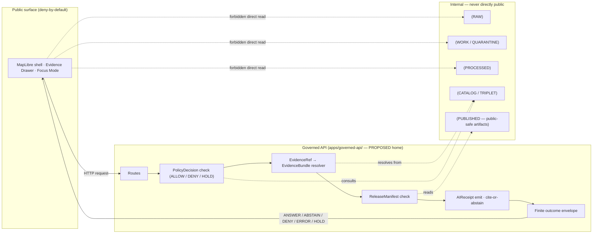

<!-- [KFM_META_BLOCK_V2]
doc_id: kfm://doc/domains/flora/api-contracts
title: Flora — API Contracts
type: standard
version: v1.1
status: draft
owners: <flora-domain-steward + governed-api-owner — placeholder; confirm against CODEOWNERS>
created: 2026-05-16
updated: 2026-06-03
policy_label: public
contract_version: "3.0.0"
related:
  - docs/domains/flora/README.md
  - docs/domains/flora/SOURCES.md
  - docs/domains/flora/SENSITIVITY.md
  - docs/architecture/governed-api.md
  - docs/architecture/trust-membrane.md
  - docs/doctrine/ai-build-operating-contract.md
  - contracts/runtime/decision_envelope.md
  - contracts/runtime/runtime_response_envelope.md
  - contracts/evidence/evidence_bundle.md
  - contracts/domains/flora/
  - schemas/contracts/v1/domains/flora/
  - policy/domains/flora/
  - policy/sensitivity/flora/
  - docs/doctrine/directory-rules.md
tags: [kfm, flora, api, governed-api, contracts, trust-membrane]
notes:
  - CONTRACT_VERSION pinned to 3.0.0 (ai-build-operating-contract.md v3.0).
  - Implementation-layer claims (routes, payload shapes, file paths) are PROPOSED until verified against a mounted repo and ADR-0001.
  - Source-role anti-collapse and the T4 default for sensitive flora locations are CONFIRMED doctrine.
  - Schema-home reconciled to Directory Rules ADR-0001 canonical pattern; Atlas Appendix D `schemas/contracts/v1/flora/` form is treated as lineage/CONFLICTED pending migration.
[/KFM_META_BLOCK_V2] -->

# Flora — API Contracts

> The governed-API surface and finite-outcome contract for the Flora domain. Defines the request shapes, response envelopes, schema homes, and gate semantics through which Flora evidence reaches public, reviewer, and AI surfaces — without bypassing the trust membrane.

[](#)
[](#)
[](#)
[](#)
[](#)
[](#)
[](#)
<!-- TODO: replace with live Shields.io endpoints once docs CI badge contract is established. -->

| Field | Value |
|---|---|
| **Status** | `draft` |
| **Version** | `v1.1` |
| **Owners** | `<flora-domain-steward + governed-api-owner>` *(placeholder — confirm against `CODEOWNERS`)* |
| **Updated** | `2026-06-03` |
| **CONTRACT_VERSION** | `"3.0.0"` *(pinned — `ai-build-operating-contract.md` v3.0)* |
| **Doctrine layer** | CONFIRMED (Atlas v1.1 §24.3, §24.5; ENCY §7.6 / Flora §J; GAI envelopes) |
| **Implementation layer** | PROPOSED / NEEDS VERIFICATION (routes, paths, payload shapes) |

---

## Contents

1. [Scope and boundary](#1-scope-and-boundary)
2. [Trust membrane and authority](#2-trust-membrane-and-authority)
3. [API surfaces (governed)](#3-api-surfaces-governed)
4. [Finite-outcome contract](#4-finite-outcome-contract)
5. [Per-surface contracts](#5-per-surface-contracts)
6. [Object families and schema homes](#6-object-families-and-schema-homes)
7. [Source-role anti-collapse for Flora](#7-source-role-anti-collapse-for-flora)
8. [Sensitivity tiers — Flora defaults](#8-sensitivity-tiers--flora-defaults)
9. [Cross-lane request constraints](#9-cross-lane-request-constraints)
10. [Lifecycle and promotion gates](#10-lifecycle-and-promotion-gates)
11. [Governed AI / Focus Mode behavior](#11-governed-ai--focus-mode-behavior)
12. [Validators, tests, and fixtures](#12-validators-tests-and-fixtures)
13. [Open questions register](#13-open-questions-register)
14. [Open verification backlog](#14-open-verification-backlog)
15. [Changelog](#15-changelog)
16. [Definition of done](#16-definition-of-done)
17. [Related docs](#17-related-docs)

---

## 1. Scope and boundary

This document specifies the **governed-API contract surface** for the Flora domain: how Flora evidence is requested, how the system answers, what the system refuses, and what artifacts every response must carry. It is a **standard doc**, not a runbook and not a schema definition — schemas live under `schemas/contracts/v1/` and policy lives under `policy/`.

**In scope.** Domain feature/detail lookup, layer manifest resolution, Evidence Drawer payloads, Focus Mode requests/responses, evidence resolution, correction submission, and review decisions — as they apply to Flora object families.

**Out of scope.** Internal pipeline contracts (RAW → WORK / QUARANTINE → PROCESSED → CATALOG / TRIPLET), watcher non-publisher contracts, executable JSON Schema definitions, and policy-bundle implementations. Those are anchored elsewhere; this doc references them.

> [!IMPORTANT]
> **Doctrine vs. implementation.** The decision-envelope grammar, finite-outcome set, trust membrane, and sensitivity-tiering rules cited here are **CONFIRMED doctrine** from KFM core sources. Concrete route names, payload field lists, file paths, and CI behavior are **PROPOSED** or **NEEDS VERIFICATION** until checked against a mounted repository and accepted ADRs. Do not read this document as proof of route existence or implementation maturity.

[Back to top](#flora--api-contracts)

---

## 2. Trust membrane and authority

CONFIRMED doctrine: public clients and normal UI surfaces consume **governed APIs** that enforce release state, policy, evidence, rights, and sensitivity before any payload leaves the trust spine. Direct reads from canonical stores, RAW / WORK / QUARANTINE, internal triplets, model runtimes, or unpublished candidates are forbidden by the trust membrane. The governed flow is: released layer → user click → governed API → `EvidenceBundle` → Evidence Drawer → Focus Mode `ANSWER` / `ABSTAIN` / `DENY` / `ERROR`.



> [!NOTE]
> **Co-location does not erase the boundary.** Even if the governed API and the UI ship in the same monorepo, the trust membrane is enforced at the API contract — not at the network seam. The Flora domain inherits this rule with no carve-out. **NEEDS VERIFICATION:** `apps/governed-api/` as the realized governed-API home — Atlas v1.1 §24.13 names it as the PROPOSED trust-membrane responsibility root, but no mounted repo was inspected.

[Back to top](#flora--api-contracts)

---

## 3. API surfaces (governed)

The following surfaces are the **Flora-specific projections** of the cross-cutting governed-API surfaces named in ENCY §J and Atlas v1.1 §24.3.2 / §20.3. Routes are PROPOSED; the precise path strings are subject to backend-framework verification and ADR.

| # | Surface | Method / route (PROPOSED) | Request DTO | Response envelope | Allowed outcomes | Status |
|---|---|---|---|---|---|---|
| F1 | Flora feature/detail lookup | `GET /api/v1/domains/flora/features/{feature_id}` | path + query | **`DomainFeatureEnvelope`** + **`DecisionEnvelope`** | `ANSWER` / `ABSTAIN` / `DENY` / `ERROR` | PROPOSED |
| F2 | Flora layer manifest resolver | `GET /api/v1/layers/{layer_id}/manifest` *(layer_id ∈ `flora.*`)* | path | `LayerManifest` / `LayerDescriptor` | `ANSWER` / `DENY` / `ERROR` | PROPOSED |
| F3 | Flora Evidence Drawer payload | `GET /api/v1/domains/flora/drawer/{feature_id}` *(or composed)* | path + `MapContextEnvelope` | `EvidenceDrawerPayload` (Flora projection) | `ANSWER` / `ABSTAIN` / `DENY` / `ERROR` | PROPOSED |
| F4 | Flora Focus Mode answer | `POST /api/v1/focus` *(domain-scoped)* | `FocusModeRequest` + `MapContextEnvelope` | `RuntimeResponseEnvelope` + `AIReceipt` | `ANSWER` / `ABSTAIN` / `DENY` / `ERROR` | PROPOSED |
| F5 | Flora evidence resolution | `GET /api/v1/evidence/{evidence_ref}` | path | `EvidenceBundle` | `ANSWER` / `ABSTAIN` / `DENY` / `ERROR` | PROPOSED |
| F6 | Flora correction submit | `POST /api/v1/corrections` *(target ∈ flora)* | `CorrectionNotice` candidate | `CorrectionNotice` receipt | `ACCEPTED` / `HOLD` / `DENY` / `ERROR` | PROPOSED |
| F7 | Flora review decision | `POST /api/v1/review/{queue}/{id}/decision` *(steward only)* | `ReviewRecord` candidate | `ReviewRecord` | `ALLOW` / `RESTRICT` / `DENY` / `HOLD` / `ERROR` | PROPOSED |

> [!CAUTION]
> **Routes are PROPOSED.** Atlas v1.1 §J records the Flora feature/detail resolver with status "PROPOSED governed API surface; exact route UNKNOWN." If the mounted repo or an accepted ADR fixes a different shape (e.g., `apps/governed_api` vs. `apps/governed-api`, plural `features` vs. nested `species`), this table updates and a `DRIFT_REGISTER` entry is opened.

> [!NOTE]
> **Envelope naming corrected (v1.1).** The cross-cutting Master API Surface Table (Atlas v1.1 §20.3) pairs domain feature/detail lookup with `DomainFeatureEnvelope` + `DecisionEnvelope`, and Focus Mode with `RuntimeResponseEnvelope` + `AIReceipt`. The Flora §J dossier table names a `FloraDecisionEnvelope`; whether that is a distinct schema or a discriminated projection of the generic `DecisionEnvelope` is **UNKNOWN** (see [Open questions](#13-open-questions-register), `OQ-FLORA-API-03`). This doc uses the cross-cutting names and flags the divergence rather than inventing a Flora-only envelope.

[Back to top](#flora--api-contracts)

---

## 4. Finite-outcome contract

CONFIRMED doctrine (Atlas v1.1 §24.3): every Flora governed-API response returns a **finite outcome** drawn from a known set. Deny, abstain, and error are first-class outcomes — not failure modes. The shape varies by surface, but the outcome enum is constant.

| Outcome | When (CONFIRMED doctrine) | Required artifacts | Flora-specific examples |
|---|---|---|---|
| `ANSWER` | Evidence sufficient, policy permits, release state allows, review state recorded where required. | Resolved `EvidenceBundle`; `PolicyDecision = ALLOW`; applicable `ReleaseManifest`; for AI: `AIReceipt` + passing `CitationValidationReport`. | Released vegetation-community polygon click; generalized public range layer; phenology summary with citation. |
| `ABSTAIN` | Evidence insufficient/incomplete, citation cannot resolve, evidence stale with no released alternative, or AI surface cannot cite. | `AIReceipt` with reason; no claim emitted. | Plant taxon page with unresolved synonymy; Focus Mode question that exceeds released evidence; stale specimen evidence beyond cadence. |
| `DENY` | Policy, rights, sensitivity, or release state forbids the answer. **Sensitive Flora lanes default here.** | `PolicyDecision = DENY` + `reason_code`; for AI: `AIReceipt` records the denial. | Exact rare-plant coordinates; ethnobotanical site location; pre-release candidate; rights-unclear specimen geometry. |
| `ERROR` | Governed API cannot evaluate — missing schema, malformed query, contract violation, infrastructure failure. | Error envelope with diagnostic code; no claim leakage; no silent fall-through to another lane. | Malformed `feature_id`; schema-validation failure on inbound `FocusModeRequest`. |
| `HOLD` | Promotion / release / correction is paused pending steward, rights-holder, or policy review. | `ReviewRecord` pending; `PolicyDecision = HOLD`; surface remains in prior state. | Rare-plant redaction approval awaiting steward; ethnobotanical content awaiting cultural review. |

**Optional runtime extensions (CONFIRMED, `ai-build-operating-contract.md` §8).** `RuntimeResponseEnvelope` MAY additionally carry `NARROWED` (answer issued within a tighter scope than requested due to evidence or policy bounds) and `BOUNDED` (answer issued with explicit confidence/coverage bounds). Freshness state is carried as `SOURCE_STALE` rather than as a top-level outcome.

Validator-class outcomes `PASS` / `FAIL` are internal to admission and promotion gates (Section 10); they do not appear in public response envelopes directly but feed `PolicyDecision` and `PromotionDecision`.

> [!WARNING]
> **Deny is not error.** A Flora response of `DENY` for an exact sensitive location is **operating correctly**. UI surfaces must render the denial reason and offer the non-restricted alternative (e.g., a generalized public range layer) where available. Treating `DENY` as an error condition collapses the sensitivity discipline.

[Back to top](#flora--api-contracts)

---

## 5. Per-surface contracts

This section sketches the **request/response shape** for each Flora surface. Exact field lists are PROPOSED and must be reconciled against the canonical schemas under `schemas/contracts/v1/` (see Section 6).

### 5.1 F1 — Flora feature/detail lookup

PROPOSED behavior: resolves a Flora feature (occurrence, specimen, community, range polygon, rare-plant record) to an evidence-bounded detail payload through the governed-API trust membrane.

<details>
<summary><b>Illustrative envelope sketch — PROPOSED, not normative</b></summary>

```json
{
  "outcome": "ANSWER",
  "domain": "flora",
  "feature": {
    "feature_id": "kfm:flora:occurrence:<id>",
    "object_family": "FloraOccurrence",
    "source_role": "observed",
    "geometry": { "_comment": "public-safe — may be generalized" },
    "valid_time": { "start": "...", "end": "..." },
    "observed_time": "...",
    "release_state": "PUBLISHED"
  },
  "evidence_refs": [
    { "evidence_ref": "kfm:evd:<bundle-id>", "role": "primary" }
  ],
  "policy_decision": {
    "outcome": "ALLOW",
    "reasons": ["public-safe", "rights-resolved"],
    "obligations": [{ "type": "display-citation" }]
  },
  "release_manifest_ref": "kfm:rel:<manifest-id>",
  "freshness": { "state": "fresh" },
  "audit_ref": "kfm:audit:<id>"
}
```

This sketch is illustrative only. The authoritative shape is the `DecisionEnvelope` schema at `schemas/contracts/v1/runtime/decision_envelope.schema.json` (PROPOSED home; the Atlas Pass-32 card pins this same suggested path). Note `policy_decision.outcome` uses the uppercase `ALLOW` value and the structured-obligation form `{type, op, level?}` per the Pass-32 `DecisionEnvelope` card.

</details>

### 5.2 F2 — Flora layer manifest resolver

Returns the released `LayerManifest` for a Flora layer (e.g., generalized occurrence layer, public range layer, vegetation-community layer, invasive-plant layer, phenology/condition layer). PROPOSED behavior: serving a layer that lacks a `ReleaseManifest` is forbidden; WORK and CATALOG layers are never served to public clients.

### 5.3 F3 — Flora Evidence Drawer payload

CONFIRMED doctrine: `EvidenceDrawerPayload` is a **governed projection** of the canonical `EvidenceBundle`, not a parallel evidence store. The projection lets UI evolve without renegotiating canonical evidence shape, and tests MUST verify the projection does not drop citation, policy, review, or release state, and never includes restricted geometry or uncited claim text.

### 5.4 F4 — Flora Focus Mode answer

CONFIRMED doctrine: governed AI is **interpretive, not authoritative**. Focus Mode answers over Flora MUST:

- Operate over a typed `MapContextEnvelope` composed of evidence building blocks (camera, layer IDs, feature IDs, temporal snapshot, release refs, selected evidence refs) — never freeform map text, never RAW or restricted state.
- Resolve every citation through `CitationValidationReport` before emitting `ANSWER`.
- ABSTAIN when evidence is insufficient or stale; DENY when policy, rights, sensitivity, or release state forbids the answer.
- Emit an `AIReceipt` carrying model/provider, prompt scope, evidence IDs, policy decision, outcome, and citation-report ID.

### 5.5 F5 — Flora evidence resolution

Resolves an `EvidenceRef` to the corresponding `EvidenceBundle`. Returns `DENY` if the bundle's release state, rights, or sensitivity forbids public exposure for the requesting role.

### 5.6 F6 / F7 — Correction and review

Correction submission and review-decision posting follow the cross-cutting governed-API contract. Flora-specific behavior: corrections targeting sensitive geometry transit through the same redaction/generalization review path as initial publication, and a correction MAY demote a published Flora `T1` record to `T4` via `CorrectionNotice`.

[Back to top](#flora--api-contracts)

---

## 6. Object families and schema homes

CONFIRMED Flora object families (Atlas v1.1 Appendix C; Flora §E). Identity rule is PROPOSED (`source id + object role + temporal scope + normalized digest`); temporal-distinctness is CONFIRMED doctrine.

| Object family | Purpose in Flora | Canonical home (PROPOSED) | Status |
|---|---|---|---|
| `PlantTaxon` | Plant taxonomic identity, synonymy, authority. | `schemas/contracts/v1/domains/flora/plant_taxon.schema.json` | PROPOSED |
| `FloraTaxonCrosswalk` | Cross-vocabulary alignment (e.g., GBIF / iNat / PLANTS / NatureServe). | `schemas/contracts/v1/domains/flora/` | PROPOSED |
| `FloraOccurrence` | Specimen- or observation-derived occurrence, with uncertainty and geoprivacy. | `schemas/contracts/v1/domains/flora/` | PROPOSED |
| `SpecimenRecord` | Herbarium specimen record. | `schemas/contracts/v1/domains/flora/` | PROPOSED |
| `RarePlantRecord` | Steward-controlled rare/protected record. **T4 default.** | `schemas/contracts/v1/domains/flora/` | PROPOSED |
| `VegetationCommunity` | Community polygon and classification. | `schemas/contracts/v1/domains/flora/` | PROPOSED |
| `InvasivePlantRecord` | Invasive-species record. | `schemas/contracts/v1/domains/flora/` | PROPOSED |
| `PhenologyObservation` | Phenology time-series observation. | `schemas/contracts/v1/domains/flora/` | PROPOSED |
| `RangePolygon` | Distribution/range polygon (generalized public derivative or modeled surface). | `schemas/contracts/v1/domains/flora/` | PROPOSED |
| `HabitatAssociation` | Cross-lane link to habitat (not habitat truth). | `schemas/contracts/v1/domains/flora/` | PROPOSED |
| `BotanicalSurvey` | Survey campaign metadata. | `schemas/contracts/v1/domains/flora/` | PROPOSED |
| `RestorationPlanting` | Restoration planting record. | `schemas/contracts/v1/domains/flora/` | PROPOSED |
| `RedactionReceipt` | Transform receipt for sensitivity redaction/generalization. | `schemas/contracts/v1/policy/` *(cross-cutting)* | PROPOSED |

Cross-cutting envelope and evidence schemas referenced by Flora surfaces (canonical, not Flora-owned):

| Schema | Canonical home (PROPOSED per ADR-0001) | Owning layer |
|---|---|---|
| `DecisionEnvelope` | `schemas/contracts/v1/runtime/decision_envelope.schema.json` | Runtime |
| `RuntimeResponseEnvelope` | `schemas/contracts/v1/runtime/runtime_response_envelope.schema.json` | Runtime |
| `EvidenceDrawerPayload` | `schemas/contracts/v1/ui/evidence_drawer_payload.schema.json` | UI projection |
| `EvidenceBundle` / `EvidenceRef` | `schemas/contracts/v1/evidence/` | Evidence |
| `LayerManifest` / `LayerDescriptor` | `schemas/contracts/v1/layers/` *(or `schemas/contracts/v1/maplibre/`)* | Layer |
| `FocusModeRequest` / `FocusModeResponse` | `schemas/contracts/v1/focus/` *(or `schemas/contracts/v1/ai/`)* | Focus / AI |
| `CitationValidationReport` | `schemas/contracts/v1/evidence/` *(or `schemas/contracts/v1/ai/`)* | Evidence / AI |
| `AIReceipt` | `schemas/contracts/v1/ai/ai_receipt.schema.json` | AI runtime |
| `PolicyDecision` | `schemas/contracts/v1/policy/policy_decision.schema.json` | Policy |
| `SourceDescriptor` | `schemas/contracts/v1/source/source_descriptor.schema.json` | Source |

> [!IMPORTANT]
> **Schema-home conflict (CONFLICTED — routed to ADR-0001).** Atlas v1.1 Appendix D records the Flora schema root as `schemas/contracts/v1/flora/`; Directory Rules ADR-0001 fixes the canonical machine-schema home as `schemas/contracts/v1/...` with the `domains/<domain>/` sub-pattern, and explicitly classifies domain-blueprint forms that diverge as **lineage / CONFLICTED**, to be migrated under ADR-0001 *before any new schema lands*. Directory Rules wins on path questions (authority order). This document follows `schemas/contracts/v1/domains/flora/` and flags the Atlas Appendix D form as a candidate `DRIFT_REGISTER` entry. **MUST NOT** maintain divergent definitions in both locations. **NEEDS VERIFICATION:** actual repo layout against ADR-0001.

[Back to top](#flora--api-contracts)

---

## 7. Source-role anti-collapse for Flora

CONFIRMED doctrine (Atlas v1.1 §24.1, §24.4): `source_role` is a first-class identity attribute on every `SourceDescriptor`. A Flora API response **MUST never** collapse source roles — an observation is not a model, a regulatory designation is not an observation, a community-science aggregate is not a steward-reviewed record. Mismatch between claim type and source role is a **deny condition**, not a quality issue.

PROPOSED Flora role-to-claim matrix:

| Source role | Typical Flora example | Claim it may support | Claim it may **NOT** support |
|---|---|---|---|
| `observed` | KU herbarium specimen; ground botanical survey. | Specimen-level occurrence at observed time. | Regulatory listing status; modeled range. |
| `regulatory` | USFWS ECOS plant listing; state rare-plant designation. | Legal/conservation status. | An observed occurrence event. |
| `modeled` | Distribution suitability surface; restoration suitability model. | Modeled range / suitability with model-run receipt. | A field-confirmed occurrence. |
| `aggregate` | GBIF download / aggregator; county taxa package. | County- or region-level aggregate counts. | A per-place record. |
| `administrative` | Restoration project registry; state stewardship list. | Administrative context. | Independent ecological observation. |
| `candidate` | Pre-review iNaturalist record; PLANTS drift candidate. | Pending steward review only. | Any public claim until promoted. |
| `synthetic` | Reconstructed range from interpretive synthesis. | Surface representation with `RealityBoundaryNote`. | Direct evidence. |

> [!IMPORTANT]
> **Join-induced sensitivity (CONFIRMED).** PLANTS-style county taxa packages and GBIF/iNaturalist aggregates are individually benign but can become sensitive when joined to occurrence sources for rare or culturally significant taxa. Sensitivity is a property of the **resulting product**, not just the inputs — the Flora dossier records that "sensitive joins fail closed." Flora API surfaces MUST treat join-induced sensitivity as a deny condition for the join product.

[Back to top](#flora--api-contracts)

---

## 8. Sensitivity tiers — Flora defaults

CONFIRMED doctrine (Atlas v1.1 §24.5): KFM publishes the safest representation that still answers reasonable steward and public needs. Flora sensitivity defaults extend the cross-cutting tier scheme (`T0` Open → `T1` Generalized → `T2` Reviewer → `T3` Restricted → `T4` Denied).

| Flora class | Default tier | Allowed transforms (PROPOSED) | Required gates |
|---|---|---|---|
| Public, non-listed, non-sensitive taxon | `T0` | None required beyond standard release. | `ReleaseManifest`. |
| Generalized public range / distribution layer | `T0` / `T1` | Aggregation / generalization to coarse cell. | `AggregationReceipt` or `RedactionReceipt`. |
| Generalized occurrence layer (non-sensitive) | `T0` / `T1` | Public-safe generalization where uncertainty is high. | `RedactionReceipt`. |
| Rare or culturally sensitive plant location | **`T4`** | Generalized geometry + steward review → `T2` or `T1`. | `RedactionReceipt` + `ReviewRecord`. |
| Ethnobotanical / culturally sensitive context | **`T4`** | Cultural review required; transforms recorded. | Cultural review + `ReviewRecord` + `PolicyDecision`. |
| Steward-controlled records | **`T4`** | Steward review with named-party agreement → `T3` or `T2`. | `PolicyDecision` + `ReviewRecord`. |
| RAW / WORK / QUARANTINE access via API | **`T4` forever** | None — AI and public surfaces never read pre-release content. | Trust membrane (Section 2). |

Tier transitions follow the cross-cutting motion table (Atlas v1.1 §24.5.3): upgrades toward public require both a transform receipt and a review record (e.g., `T4 → T1` requires `RedactionReceipt` + `ReviewRecord`); downgrades to `T4` are always reversible via `CorrectionNotice`, and a published `T1` record may be demoted to `T4` on correction.

> [!CAUTION]
> **Style-only hiding is not redaction.** Hiding a Flora feature with a MapLibre style filter while serving the underlying tile **is not** an acceptable sensitivity transform. The deny must happen at the API and tile-artifact level (per the Master MapLibre sensitive-geometry-deny standard: "No sensitive geometry hidden only by style"; sensitive geometry is generalized, redacted, delayed, restricted, or denied **before tile generation**). The relevant entry under `policy/sensitivity/flora/` MUST be linked; surface that one is missing if it is.

[Back to top](#flora--api-contracts)

---

## 9. Cross-lane request constraints

Flora API responses MUST preserve cross-lane ownership boundaries. Requests that would relabel a non-Flora object as Flora — or vice versa — are policy violations. Every cross-lane relation must preserve ownership, source role, sensitivity, and `EvidenceBundle` support.

| This domain | Related lane | Relation type | API constraint |
|---|---|---|---|
| Flora | Habitat | Habitat association, vegetation-community context. | Flora API returns habitat **association** only; habitat patches/suitability resolve through the Habitat API. |
| Flora | Fauna | Pollinator, food-web, invasive, biodiversity context. | Flora API does not return fauna occurrences; Fauna sensitivity discipline still applies to any cross-cited surface. |
| Flora | Soil / Hydrology | Substrate, wetland, riparian, drought context. | Flora API may cite Soil/Hydrology evidence but does not own it; canonical truth resolves through those domains. |
| Flora | Hazards | Fire, drought, flood, smoke, vegetation stress. | Flora API may cite hazard context; **KFM is never an alert authority**. |
| Flora | Archaeology | Ethnobotanical context. | Sovereignty / sensitivity review required; deny-default applies to cultural-location detail. |

[Back to top](#flora--api-contracts)

---

## 10. Lifecycle and promotion gates

CONFIRMED doctrine: every Flora object follows `RAW → WORK / QUARANTINE → PROCESSED → CATALOG / TRIPLET → PUBLISHED`. Promotion is a **governed state transition, not a file move**. The governed API surfaces released artifacts only.

| Gate (transition) | Pre-condition | Required artifacts (PROPOSED minimum) | Failure-closed outcome |
|---|---|---|---|
| Admission (— → RAW) | Source identity, rights, role intent established. | `SourceDescriptor` (role, authority, rights, sensitivity, cadence); payload hash. | Source not admitted; logged as candidate awaiting steward. |
| Normalization (RAW → WORK / QUARANTINE) | Schema, geometry, time, identity, evidence, rights, policy runnable. | `TransformReceipt`; `ValidationReport`; `PolicyDecision`; quarantine for failures. | Quarantine with reason; never silent promote. |
| Validation (WORK → PROCESSED) | Validators deterministic; required receipts present. | `ValidationReport` PASS; `RedactionReceipt` if sensitivity applies. | Stay in WORK; structured `FAIL`. |
| Catalog closure (PROCESSED → CATALOG / TRIPLET) | EvidenceRefs resolve; catalog/proof closure passes. | `EvidenceBundle`; graph/triplet projection where applicable. | HOLD at PROCESSED; no public edge. |
| Release (CATALOG → PUBLISHED) | Review state where required; release authority separated where materiality applies. | `ReleaseManifest`; rollback target; correction path; `ReviewRecord`. | HOLD at CATALOG; no public surface change. |
| Correction (PUBLISHED → PUBLISHED′) | Detected error or new evidence; derivatives identified. | `CorrectionNotice`; `RollbackCard` where applicable. | Stale-state badge; original surface preserved during review. |

Surfaces F1–F5 read only from `PUBLISHED`; F6 (correction) and F7 (review) operate on candidate or published artifacts under steward authority.

[Back to top](#flora--api-contracts)

---

## 11. Governed AI / Focus Mode behavior

CONFIRMED doctrine / PROPOSED implementation (GAI; Flora §L):

| AI behavior | Rule (CONFIRMED) |
|---|---|
| **Allowed** | Evidence-bounded summarization over released Flora `EvidenceBundle`s; citation-backed explanation; evidence comparison; steward-review draft notes; anomaly explanation. |
| **Required denial** | DENY direct RAW / WORK / QUARANTINE access; DENY sensitive-location exposure; DENY rights-unclear or steward-controlled record exposure; DENY uncited authoritative claims. |
| **Required abstention** | ABSTAIN when evidence is insufficient, stale without released alternative, or when citation cannot resolve. |
| **Required receipt** | Every Focus Mode answer emits an `AIReceipt` with `outcome ∈ {ANSWER, ABSTAIN, DENY, ERROR}`, `evidence_refs`, `policy_decision`, and `citation_validation` report ID. |

> [!IMPORTANT]
> **AI is interpretive, not authoritative.** A Flora Focus Mode answer is an API outcome, not a sovereign generation. Fluent text never substitutes for `EvidenceBundle`. Where evidence resolution fails, the answer ABSTAINS.

[Back to top](#flora--api-contracts)

---

## 12. Validators, tests, and fixtures

PROPOSED minimum test families for Flora API contracts (Atlas v1.1 §K / Flora §K):

- Schema validation for inbound/outbound DTOs at every Flora surface.
- `SourceDescriptor` validation including `source_role`, rights, sensitivity.
- Rights and sensitivity validators (deny on unresolved rights or sensitivity).
- Evidence closure: every `EvidenceRef` in a Flora `ANSWER` resolves to a released `EvidenceBundle`.
- Temporal logic: source, observed, valid, retrieval, release, and correction times stay distinct where material.
- Geometry validity, including public-safe generalization checks.
- Policy DENY tests — including the **exact sensitive public geometry denial** fixture.
- Taxonomy reconciliation and synonymy tests.
- Citation validation: cite-or-abstain enforced before `ANSWER`.
- Stale-source fixture (cadence drift triggers stale badge or ABSTAIN / `SOURCE_STALE`).
- Release-manifest validation and rollback drill.
- No-network / no-live-source fixture pipeline so contract tests run hermetically.
- Source-role mismatch denial — e.g., aggregate cited as per-place truth fails closed.
- Lifecycle-boundary test — any public-surface reference to RAW / WORK / QUARANTINE / internal store returns `DENY` / `ERROR`.
- Non-regression for prior published lineage where relevant.

> [!TIP]
> **First credible thin-slice (Flora §N).** One common-species occurrence/specimen fixture plus one vegetation-community polygon, both with an `EvidenceBundle`-backed species page and a public-safe map. This is the minimum slice to prove the Flora governed-API contract end-to-end without activating live sources.

[Back to top](#flora--api-contracts)

---

## 13. Open questions register

| ID | Question | Owner role | Resolution path |
|---|---|---|---|
| OQ-FLORA-API-01 | Exact Flora route names and HTTP shape under `apps/governed-api/`. | governed-api-owner | Mounted-repo inspection + accepted backend ADR. |
| OQ-FLORA-API-02 | Schema-home: `schemas/contracts/v1/flora/` (Atlas Appendix D) vs. `schemas/contracts/v1/domains/flora/` (Directory Rules ADR-0001). | docs-steward | ADR-0001 reconciliation + `DRIFT_REGISTER` entry + repo inspection. |
| OQ-FLORA-API-03 | `FloraDecisionEnvelope` vs. generic `DecisionEnvelope` — distinct schema or discriminator on the generic envelope? | governed-api-owner | ADR + schema definition. |
| OQ-FLORA-API-04 | Where Focus Mode schemas live: `schemas/contracts/v1/focus/` or `schemas/contracts/v1/ai/`. | governed-api-owner | Mounted-repo inspection + ADR. |
| OQ-FLORA-API-05 | Exact thresholds for "exact" vs. "generalized" geometry for rare-plant publication (grid-cell size, jitter radius). | flora-domain-steward | Steward policy + `PolicyDecision` implementation. |
| OQ-FLORA-API-06 | KDWP / Kansas Biological Survey / KU herbarium rights and steward roles for live-source activation. | flora-domain-steward | Live-source agreements + `SourceDescriptor` entries. |
| OQ-FLORA-API-07 | PLANTS / GBIF / iNaturalist join-sensitivity policy — exact deny rules and review-queue routing. | flora-domain-steward | Policy bundle + review-queue implementation. |
| OQ-FLORA-API-08 | Layer-manifest resolver: shared cross-domain endpoint or Flora-specific. | governed-api-owner | Mounted-repo inspection + ADR. |
| OQ-FLORA-API-09 | Whether correction-submit and review-decision are governed under domain-scoped policy bundles (`policy/domains/flora/`) or only cross-cutting bundles. | docs-steward | Policy layout under `policy/`. |
| OQ-FLORA-API-10 | `RealityBoundaryNote` requirements for any Flora synthetic surface (e.g., suitability rasters rendered as continuous fields). | flora-domain-steward | Schema + UI doctrine. |

[Back to top](#flora--api-contracts)

---

## 14. Open verification backlog

These items remain `NEEDS VERIFICATION` before promotion from `draft` to `published`:

1. `apps/governed-api/` confirmed as the realized governed-API home (Atlas §24.13 names it PROPOSED).
2. Every Flora schema path under `schemas/contracts/v1/domains/flora/` confirmed against a mounted repo and ADR-0001.
3. `DRIFT_REGISTER` entry opened for the Atlas Appendix D `schemas/contracts/v1/flora/` vs. Directory Rules path conflict.
4. Route strings for F1–F7 confirmed against backend framework and accepted ADR.
5. `FloraDecisionEnvelope` resolved as distinct schema or discriminated `DecisionEnvelope` projection.
6. Flora source rights/steward roles (KDWP, Kansas Biological Survey, KU herbarium, USFWS ECOS, NatureServe, GBIF, iDigBio, iNaturalist) recorded as `SourceDescriptor` entries.
7. `policy/sensitivity/flora/` entry exists and is linked from Section 8.
8. Generalization thresholds for rare-plant geometry fixed in `PolicyDecision` policy.

[Back to top](#flora--api-contracts)

---

## 15. Changelog v1 → v1.1

| Change | Type (per contract §37) | Reason |
|---|---|---|
| Pinned `CONTRACT_VERSION = "3.0.0"` in meta block, badge row, and impact table | housekeeping | Required for doctrine-adjacent docs. |
| Corrected `PolicyDecision` outcome values to uppercase `ALLOW` / `DENY` / `HOLD` | reconciliation | Matches Pass-32 `DecisionEnvelope` card and doctrine synthesis §11. |
| Renamed F1 envelope `FloraDecisionEnvelope` → `DomainFeatureEnvelope` + `DecisionEnvelope`; F4 → `RuntimeResponseEnvelope` + `AIReceipt`; added `OQ-FLORA-API-03` | reconciliation | Aligns with Atlas v1.1 §20.3 Master API Surface Table; flags Flora §J divergence rather than inventing a Flora-only envelope. |
| Added `NARROWED` / `BOUNDED` runtime extensions and `SOURCE_STALE` note to §4 | gap closure | Contract §8 extended runtime-outcome set was missing. |
| F6 correction outcomes corrected to `ACCEPTED` / `HOLD` / `DENY` / `ERROR` | reconciliation | Matches Atlas §20.2 correction/rollback outcome set. |
| Strengthened §6 schema-home callout to cite ADR-0001 lineage/CONFLICTED rule and the "no divergent definitions" MUST NOT | clarification | Directory Rules §6.4 / ADR-0001 explicit migration requirement. |
| Added lifecycle-boundary test to §12; tied stale fixture to `SOURCE_STALE` | gap closure | Atlas §20.4 Master Validator Catalogue lifecycle-boundary row. |
| Replaced narrative "Open questions / verification backlog" with companion-section registers (OQ table, backlog, changelog, DoD) | housekeeping | Doctrine-adjacent doc companion-section pattern. |
| Fixed Mermaid label safety (quoted parenthetical/slash labels) | housekeeping | Mermaid parse-safety rule. |

> **Backward compatibility.** Section anchors §1–§12 are preserved. The former "Open questions and verification backlog" §13 is split into §13 (register) and §14 (backlog); inbound links to `#13-open-questions-and-verification-backlog` will break and should be repointed to `#13-open-questions-register`. KFM terminology is preserved exactly; no object family was renamed (the `FloraTaxon Crosswalk` display form was normalized to the `FloraTaxonCrosswalk` identifier form used in identifiers).

[Back to top](#flora--api-contracts)

---

## 16. Definition of done

This document is done enough to enter the repository when:

- it is placed according to Directory Rules (`docs/domains/flora/api-contracts.md`, PROPOSED);
- a docs steward and the governed-api owner review it;
- it is linked from the Flora domain index and the governed-API doctrine index;
- it does not conflict with accepted ADRs (notably ADR-0001 schema home, ADR-0004 trust membrane);
- the schema-home conflict with Atlas Appendix D is logged in `docs/registers/DRIFT_REGISTER.md`;
- the `GENERATED_RECEIPT.json` planned for this artifact is wired into CI;
- future changes follow the operating contract's §37 lifecycle.

[Back to top](#flora--api-contracts)

---

## 17. Related docs

<!-- Many of these are PROPOSED siblings; placeholder links until repo evidence is confirmed. -->

- [`docs/domains/flora/README.md`](./README.md) — Flora domain landing doc *(PROPOSED)*
- [`docs/domains/flora/SOURCES.md`](./SOURCES.md) — Flora source families and source-role registry *(PROPOSED)*
- [`docs/domains/flora/SENSITIVITY.md`](./SENSITIVITY.md) — Flora sensitivity tiers and redaction policy *(PROPOSED)*
- [`docs/architecture/governed-api.md`](../../architecture/governed-api.md) — Trust membrane and governed-API doctrine *(PROPOSED)*
- [`docs/architecture/trust-membrane.md`](../../architecture/trust-membrane.md) — Trust-membrane reference *(PROPOSED)*
- [`docs/doctrine/directory-rules.md`](../../doctrine/directory-rules.md) — Placement and lifecycle doctrine
- [`docs/doctrine/ai-build-operating-contract.md`](../../doctrine/ai-build-operating-contract.md) — Canonical operating contract (`CONTRACT_VERSION = "3.0.0"`)
- [`docs/standards/PROV.md`](../../standards/PROV.md) — Provenance standards profile *(PROPOSED)*
- [`contracts/runtime/decision_envelope.md`](../../../contracts/runtime/decision_envelope.md) — `DecisionEnvelope` meaning *(PROPOSED)*
- [`contracts/runtime/runtime_response_envelope.md`](../../../contracts/runtime/runtime_response_envelope.md) — `RuntimeResponseEnvelope` meaning *(PROPOSED)*
- [`contracts/evidence/evidence_bundle.md`](../../../contracts/evidence/evidence_bundle.md) — `EvidenceBundle` meaning *(PROPOSED)*
- [`schemas/contracts/v1/domains/flora/`](../../../schemas/contracts/v1/domains/flora/) — Flora JSON Schemas home *(PROPOSED)*
- [`policy/domains/flora/`](../../../policy/domains/flora/) — Flora policy bundle home *(PROPOSED)*
- [`policy/sensitivity/flora/`](../../../policy/sensitivity/flora/) — Flora sensitivity policy *(PROPOSED)*

---

<sub><b>Last updated:</b> 2026-06-03 · <b>Version:</b> v1.1 · <b>Doc status:</b> draft · <b>CONTRACT_VERSION:</b> 3.0.0 · <b>Doctrine basis:</b> CONFIRMED · <b>Implementation basis:</b> PROPOSED / NEEDS VERIFICATION · <a href="#flora--api-contracts">↑ Back to top</a></sub>
