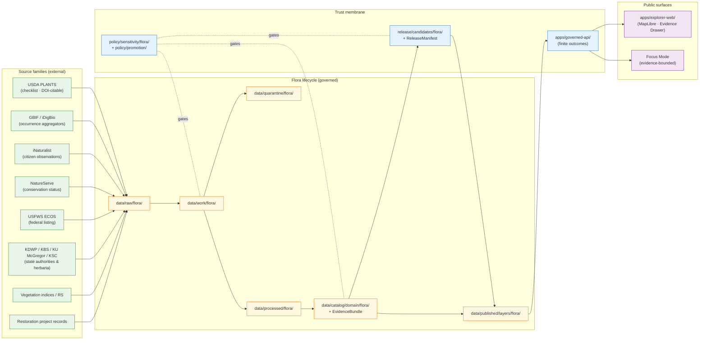
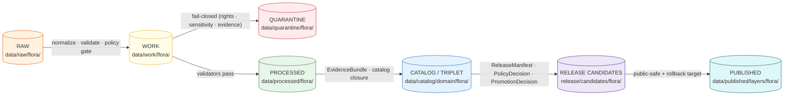
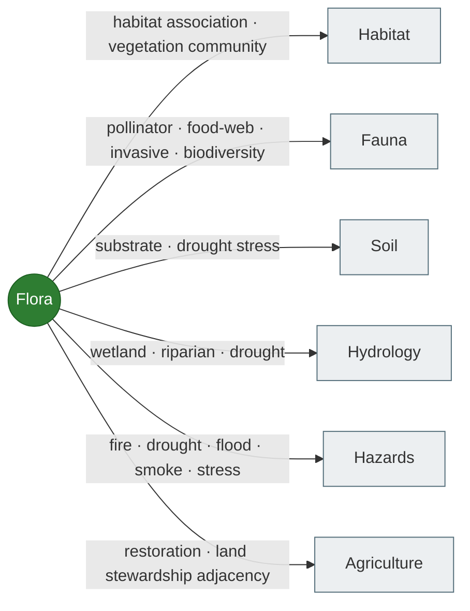
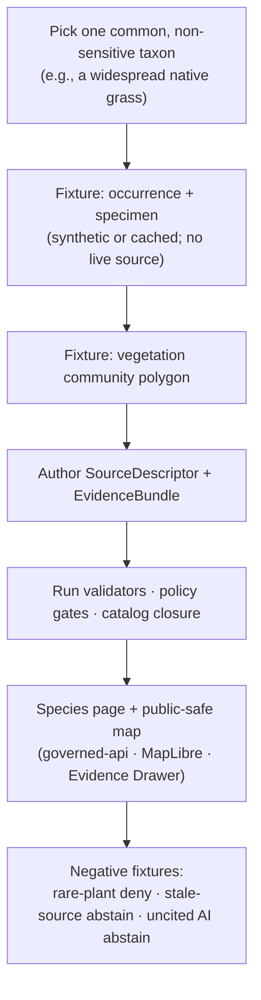

<!-- [KFM_META_BLOCK_V2]
doc_id: kfm://doc/docs.domains.flora.architecture
title: Flora — Domain Architecture
type: standard
version: v1
status: draft
owners: Flora domain steward (TODO assign); Docs steward
created: 2026-05-16
updated: 2026-05-16
policy_label: public
related:
  - docs/domains/README.md
  - docs/doctrine/directory-rules.md
  - docs/doctrine/lifecycle-law.md
  - docs/doctrine/trust-membrane.md
  - docs/doctrine/truth-posture.md
  - docs/architecture/governed-api.md
  - docs/standards/PROV.md
  - schemas/contracts/v1/domains/flora/
  - contracts/domains/flora/
  - policy/sensitivity/flora/
tags: [kfm, domain, flora, biodiversity, governance, architecture]
notes:
  - Source basis: SRC-FLORA, SRC-HAB, EXT-GBIF, EXT-INAT, EXT-NATSERVE, EXT-FWS
  - Implementation paths are PROPOSED until verified against mounted-repo evidence
  - Schema home follows ADR-0001 (schemas/contracts/v1/...)
[/KFM_META_BLOCK_V2] -->

# 🌿 Flora — Domain Architecture

> The Flora lane governs Kansas plant taxonomic identity, specimen and occurrence evidence, vegetation communities, rare and culturally sensitive plant controls, invasive plant records, phenology, restoration context, and public-safe botanical surfaces — all bound to KFM's evidence-first trust membrane.

[](#)
[](#)
[](../../doctrine/lifecycle-law.md)
[](../../../schemas/contracts/v1/domains/flora/)
[-critical)](../../../policy/sensitivity/flora/)
[](../../doctrine/directory-rules.md)
[](#)
[](#)

|  |  |
|---|---|
| **Status** | `draft` — awaiting Flora steward assignment and mounted-repo verification |
| **Owners** | Flora domain steward *(TODO assign)*; Docs steward |
| **Last updated** | 2026-05-16 |
| **Authority of paths quoted** | **PROPOSED** until verified against mounted-repo evidence |
| **Schema home** | `schemas/contracts/v1/domains/flora/` (ADR-0001) |
| **Source dossier** | `DOM-FLORA` (Encyclopedia §7.6; Domains Culmination Atlas §8) |

---

## Contents

1. [Purpose & one-line mission](#1-purpose--one-line-mission)
2. [Scope, boundary, and explicit non-ownership](#2-scope-boundary-and-explicit-non-ownership)
3. [Architectural invariants](#3-architectural-invariants)
4. [Repository fit (lane structure)](#4-repository-fit-lane-structure)
5. [System context diagram](#5-system-context-diagram)
6. [Ubiquitous language](#6-ubiquitous-language)
7. [Canonical object families](#7-canonical-object-families)
8. [Source families and source roles](#8-source-families-and-source-roles)
9. [Spatial and temporal model](#9-spatial-and-temporal-model)
10. [Pipeline shape: `RAW → PUBLISHED`](#10-pipeline-shape-raw--published)
11. [Sensitivity, rights, and publication posture](#11-sensitivity-rights-and-publication-posture)
12. [Cross-lane relations](#12-cross-lane-relations)
13. [API, contract, and schema surfaces](#13-api-contract-and-schema-surfaces)
14. [Governed AI behavior](#14-governed-ai-behavior)
15. [Validators, tests, and fixtures](#15-validators-tests-and-fixtures)
16. [Map and viewing products](#16-map-and-viewing-products)
17. [Publication, correction, and rollback](#17-publication-correction-and-rollback)
18. [Verification backlog and open questions](#18-verification-backlog-and-open-questions)
19. [Related docs](#19-related-docs)
20. [Appendix A — Thin-slice plan](#appendix-a--thin-slice-plan)
21. [Appendix B — Ubiquitous-language glossary](#appendix-b--ubiquitous-language-glossary)

---

## 1. Purpose & one-line mission

**CONFIRMED doctrine / PROPOSED implementation.** Flora governs plant taxonomic identity, specimen and occurrence evidence, rare-plant controls, vegetation communities, invasive plant records, phenology, range and habitat associations, restoration planting context, and public-safe botanical surfaces as **evidence-backed claims** under KFM's trust membrane.

The Flora lane is **not** a parallel publication path. It does not own animal taxa (Fauna), habitat patches (Habitat), crop operations (Agriculture), soil semantics (Soil), or water observations (Hydrology) — it consumes those lanes through governed joins and explicit cross-lane relations (§12).

> [!IMPORTANT]
> **Rare, protected, culturally sensitive, and steward-reviewed flora default to generalized, withheld, staged, or denied public geometry.** Exact rare-plant locations fail closed unless a documented geoprivacy transform and review state allow release. See §11.

[Back to top](#contents)

---

## 2. Scope, boundary, and explicit non-ownership

### 2.1 What Flora owns

**CONFIRMED / PROPOSED.** Flora owns these object families (each one a governed object with source role, evidence, temporal scope, and release state):

- `PlantTaxon`
- `FloraTaxonCrosswalk`
- `FloraOccurrence` (with public/restricted split where sensitivity applies)
- `SpecimenRecord`
- `RarePlantRecord`
- `VegetationCommunity`
- `InvasivePlantRecord`
- `PhenologyObservation`
- `RangePolygon`
- `HabitatAssociation` *(flora-side of the join; Habitat owns habitat patches)*
- `BotanicalSurvey`
- `RestorationPlanting`
- `RedactionReceipt`

### 2.2 What Flora explicitly does **not** own

| Concern | Owning lane | Cross-lane mechanism |
|---|---|---|
| Habitat patches and suitability | Habitat | `HabitatAssociation` join; vegetation-community context |
| Animal taxa, occurrences, sensitive sites | Fauna | Pollinator / food-web / invasive joins |
| Soil map-unit and horizon semantics | Soil | Substrate / wetland context |
| Water observations, flood context | Hydrology | Riparian / wetland context |
| Crop operations, fields, yields | Agriculture | Restoration adjacency only |
| Hazards (fire, drought, flood, smoke) | Hazards | Vegetation-stress and disturbance context |
| Roads, settlements, archaeology, people | (Each owns its lane) | Governed adjacency only |

> [!NOTE]
> Flora **links to** habitat, agriculture, and land stewardship but is **never** the truth path for those domains. Cross-lane joins must preserve ownership, source role, sensitivity classification, and `EvidenceBundle` support of every contributing lane.

[Back to top](#contents)

---

## 3. Architectural invariants

These constraints are inherited from KFM core doctrine and apply to every Flora object, surface, and pipeline. Bending one requires an ADR.

| # | Invariant | Source |
|---|---|---|
| 1 | **Lifecycle law** — `RAW → WORK/QUARANTINE → PROCESSED → CATALOG/TRIPLET → PUBLISHED`. Promotion is a **governed state transition, not a file move**. | `docs/doctrine/lifecycle-law.md` |
| 2 | **Trust membrane** — public clients consume `apps/governed-api/`; never `data/raw\|work\|quarantine\|processed\|catalog\|triplets`. | `docs/doctrine/trust-membrane.md` |
| 3 | **Watcher-as-non-publisher** — workers emit receipts and candidate decisions only; they MUST NOT publish or mutate canonical truth. | `docs/doctrine/directory-rules.md` §13.5 |
| 4 | **Cite-or-abstain** — claims that depend on evidence require `EvidenceBundle` support; missing or stale evidence ⇒ `ABSTAIN`. | `docs/doctrine/truth-posture.md` |
| 5 | **EvidenceBundle outranks generated language** — AI surfaces never become the truth source. | `docs/architecture/governed-api.md` |
| 6 | **Default-deny promotion** — unclear rights, unresolved source role, missing evidence, unresolved sensitivity, or absent release state blocks public promotion. | Encyclopedia §7.6; `policy/promotion/` |
| 7 | **Join-induced sensitivity** — a benign source (e.g. USDA PLANTS county checklist) can become sensitive once joined with GBIF, iNaturalist, or heritage occurrence data. Sensitivity is a property of the **product**, not only the inputs. | `KFM-IDX-POL-003`, `KFM-IDX-POL-005` |
| 8 | **Schema home rule (ADR-0001)** — machine schemas live under `schemas/contracts/v1/...`. `contracts/` retains semantic Markdown only. | Directory Rules §6.4 |
| 9 | **Separation of meaning, shape, admissibility, proof** — `contracts/` (meaning), `schemas/` (shape), `policy/` (admissibility), `tests/fixtures/` (proof) MUST NOT collapse. | Directory Rules §6.3–6.6 |
| 10 | **Watcher state is not public** — watcher outbox / candidate paths are not exposed through governed APIs without further promotion. | `KFM-IDX-SRC-003` |

> [!WARNING]
> Anti-patterns to refuse on review: a connector writing to `data/processed/flora/`; a worker writing to `data/catalog/domain/flora/`; `apps/explorer-web/` reading flora canonical stores directly; divergent schemas in both `schemas/` and `contracts/`; flora becoming a root folder.

[Back to top](#contents)

---

## 4. Repository fit (lane structure)

**PROPOSED — verify against mounted repo.** Flora exists as a lane inside KFM's responsibility roots, never as a root folder of its own (Directory Rules §12 Domain Placement Law).

```text
docs/domains/flora/                          # this doc lives here
  ├── README.md                              # orientation; PROPOSED
  ├── ARCHITECTURE.md                        # this file
  └── (cross-lane notes, decision logs)

contracts/domains/flora/                     # object meaning (Markdown)
schemas/contracts/v1/domains/flora/          # machine shape (JSON Schema) — ADR-0001
policy/domains/flora/                        # flora-specific allow/deny
policy/sensitivity/flora/                    # rare-plant / sensitive-join policy
tests/domains/flora/                         # enforceability proof
fixtures/domains/flora/                      # valid / invalid / golden / synthetic
packages/domains/flora/                      # shared flora libraries
pipelines/domains/flora/                     # executable pipeline logic
pipeline_specs/flora/                        # declarative pipeline configuration

data/raw/flora/                              # immutable source payloads
data/work/flora/                             # normalization work area
data/quarantine/flora/                       # held failures
data/processed/flora/                        # validated normalized objects
data/catalog/domain/flora/                   # catalog records + EvidenceBundles
data/published/layers/flora/                 # released, public-safe artifacts
data/registry/sources/flora/                 # SourceDescriptor home

release/candidates/flora/                    # release decision candidates

connectors/gbif/, connectors/inaturalist/,   # source-specific fetchers (not under flora/)
connectors/usda-plants/, connectors/natureserve/, connectors/kbs/
```

> [!NOTE]
> **Connectors are not domain-scoped.** Per Directory Rules §7.3, connectors are organized by **source** (e.g., `connectors/gbif/`), not by consuming domain. A GBIF connector emits to `data/raw/<domain>/<source_id>/<run_id>/` based on the resolved source role, not based on where its code lives.

[Back to top](#contents)

---

## 5. System context diagram



> [!NOTE]
> Diagram intent is **architectural**, not implementation-accurate. The exact route names, package boundaries, and worker topology are PROPOSED and require mounted-repo verification.

[Back to top](#contents)

---

## 6. Ubiquitous language

**CONFIRMED terms / PROPOSED field realization.** These terms have fixed meaning **within the Flora bounded context**. Their meaning is always constrained by source role, evidence, temporal scope, and release state. Field-level realization (JSON Schema) lands under `schemas/contracts/v1/domains/flora/`.

| Term | Meaning (within Flora) |
|---|---|
| **PlantTaxon** | An identified plant taxonomic concept (typically anchored to ITIS TSN with a GBIF Backbone crosswalk). |
| **FloraTaxonCrosswalk** | The mapping between authorities (USDA PLANTS symbol, ITIS TSN, GBIF Backbone key, NatureServe element code, family / synonym graph). |
| **FloraOccurrence** | A spatially-and-temporally scoped observation or record of a plant taxon, with uncertainty and geoprivacy posture. |
| **SpecimenRecord** | A herbarium-anchored physical-specimen record (Darwin Core-aligned), with catalog number, institution, collector. |
| **RarePlantRecord** | A flora occurrence subject to fail-closed sensitivity treatment (state-listed, federally-listed, culturally sensitive, or steward-controlled). |
| **VegetationCommunity** | A classified plant community polygon (e.g., NVCS-aligned alliance / association). |
| **InvasivePlantRecord** | A taxon-occurrence record under invasive-species status or watch lists (EDDMapS-class data). |
| **PhenologyObservation** | A time-scoped life-stage observation (e.g., bloom, fruit, senescence) tied to taxon, location, and method. |
| **RangePolygon** | A modeled or aggregated distribution surface, distinct from raw occurrences. |
| **HabitatAssociation** | The flora-side of a Flora ↔ Habitat join; preserves Habitat's ownership of patches and suitability. |
| **BotanicalSurvey** | A spatially and temporally bounded survey effort with method, observer, and coverage. |
| **RestorationPlanting** | A documented planting / re-vegetation event with site, mix, source-of-stock, and outcome tracking. |
| **RedactionReceipt** | A transform receipt recording how exact sensitive geometry became a public-safe representation (input class, output class, reason, policy, reviewer, residual risk). |
| **SourceRole** | One of `authority / observation / context / model` — a binding that constrains how a source's claims may be used. |

> [!TIP]
> When in doubt about wording, check Appendix B and the encyclopedia's flora chapter (§7.6). Renaming a flora-specific term is a **breaking** semantic change and requires an ADR.

[Back to top](#contents)

---

## 7. Canonical object families

**PROPOSED deterministic identity basis:** `source_id + object_role + temporal_scope + normalized_digest`.
**CONFIRMED temporal discipline:** source, observed, valid, retrieval, release, and correction times stay distinct where material.

| Object | Cardinality | Public-safe by default? | Notes |
|---|---|---|---|
| `PlantTaxon` | 1:N occurrences | Yes | Identity anchored to ITIS / GBIF Backbone; FloraTaxonCrosswalk required. |
| `FloraTaxonCrosswalk` | 1 per taxon | Yes | Versioned by taxonomy snapshot (e.g., GBIF Backbone DOI). |
| `FloraOccurrence (public)` | N | Yes | Generalized / public-safe geometry only. |
| `FloraOccurrence (restricted)` | N | **No — fail-closed** | Exact geometry; steward-only. |
| `SpecimenRecord` | N | Conditionally yes | Subject to herbarium licensing and rare-plant policy. |
| `RarePlantRecord` | N | **No — fail-closed** | Exact geometry denied publicly; generalization receipt required. |
| `VegetationCommunity` | N polygons | Yes | Subject to source rights and classification crosswalk. |
| `InvasivePlantRecord` | N | Generally yes | May be public to support detection; exact private-land geometry may be restricted. |
| `PhenologyObservation` | N | Yes | Public-safe; supports time-aware vegetation products. |
| `RangePolygon` | 1:N per taxon | Yes | Model-class source role required; provenance must distinguish observed vs. modeled. |
| `HabitatAssociation` | join | Conditional | Inherits sensitivity from both sides of the join. |
| `BotanicalSurvey` | N | Yes | Survey effort metadata; supports completeness scoring. |
| `RestorationPlanting` | N | Conditional | Private-land planting may require steward review. |
| `RedactionReceipt` | 1 per transform | Yes | The proof object for geoprivacy transforms. |

[Back to top](#contents)

---

## 8. Source families and source roles

**`SourceRole` discipline is non-negotiable.** Every source admission MUST declare exactly one of `authority | observation | context | model` and store it in the `SourceDescriptor`. Mixing roles in one record is a quarantine condition.

| Source family | Typical role(s) | Rights / sensitivity | Status |
|---|---|---|---|
| **USDA PLANTS Database** (national checklist) | `authority` (taxonomy, distribution-codes) | Public-domain; **CONFIRMED** as non-copyrighted with citation guidance. | EXTERNAL fact; CONFIRMED from `New Ideas 5-8` packet. |
| **GBIF Backbone Taxonomy** (DOI `10.15468/39omei`) | `authority` (international crosswalk) | Open; CC-BY citation required. Backbone DOI version MUST be captured in `RunReceipt`. | EXTERNAL fact; CONFIRMED. |
| **GBIF Occurrence API** (incl. PLANTS dataset `705922f7-5ba5-49ab-a75d-722e3090e690`) | `observation` (aggregated) | License varies per record; record-level license MUST round-trip. | EXTERNAL fact; CONFIRMED. |
| **iDigBio** (specimen records) | `observation` (specimen-anchored) | License varies; institution-level terms; NEEDS VERIFICATION per-feed. | PROPOSED admission. |
| **iNaturalist-derived observations** | `observation` (citizen-science) | License varies; CC-BY / CC-BY-NC / CC0 / unknown; obscure-flag handling required. | PROPOSED admission. |
| **NatureServe Explorer / Explorer Pro** | `authority` (conservation status) | Free Explorer; **Explorer Pro requires account** for precise occurrences. | EXTERNAL fact; CONFIRMED. |
| **USFWS ECOS** (federal listing) | `authority` (legal status) | Public; current terms NEEDS VERIFICATION. | PROPOSED admission. |
| **KDWP flora / listed-species context** | `authority` (state listing & stewardship) | Steward-controlled; sensitive joins fail-closed. | NEEDS VERIFICATION. |
| **Kansas Biological Survey / KU McGregor Herbarium** | `observation` (specimens) | Often Darwin Core via IPT; ~400,000 vascular specimens; NEEDS VERIFICATION per feed. | PROPOSED admission. |
| **KSU Herbarium (KSC)** | `observation` (specimens) | Reported CC-BY 4.0; NEEDS VERIFICATION current. | PROPOSED admission. |
| **State rare-plant programs** | `authority` (status) | Restricted; steward-controlled. | NEEDS VERIFICATION. |
| **Remote-sensing vegetation indices** (NDVI / EVI, etc.) | `observation` / `model` | License varies by provider; modeled vs. observed distinction MUST be preserved. | PROPOSED admission. |
| **Restoration project records** | `observation` / `context` | May be private-land; steward review for inclusion. | PROPOSED admission. |

> [!CAUTION]
> **Join-induced sensitivity.** USDA PLANTS county checklists are public-domain in isolation, but joining them to GBIF / iNaturalist occurrence streams or to KDWP rare-species lists can produce a sensitive product even when each input is individually safe. Every join that touches `RarePlantRecord` or a state/federal listing list MUST emit a `RedactionReceipt` (or quarantine the result). See `KFM-IDX-POL-003`.

[Back to top](#contents)

---

## 9. Spatial and temporal model

### 9.1 Spatial primitives

- **Occurrence / specimen points** with `coordinateUncertaintyInMeters` and `geoprivacy` posture.
- **Community polygons** for `VegetationCommunity` (NVCS-aligned alliance / association — PROPOSED).
- **Vegetation-index rasters** as observation- or model-class sources.
- **`RangePolygon`** surfaces distinguished by source role (observed aggregation vs. modeled).

> [!IMPORTANT]
> **Exact rare-plant locations fail closed** at every public surface — popups, tiles, search, AI answers, exports. Public surfaces serve generalized, withheld, or denied geometry only. The internal exact record is preserved for governed review.

### 9.2 Projections

- **Analysis CRS:** EPSG:5070 (Albers Equal Area — continental) — PROPOSED default. *(EXTERNAL: matches PLANTS / GBIF analysis recommendations.)*
- **Web tile CRS:** EPSG:3857 (WebMercator) via PMTiles for public layers. PMTiles attestation MUST be present on every published flora tile artifact.

### 9.3 Temporal fields

Time fields are kept **distinct** across the object lifecycle and never collapsed:

| Time field | Meaning |
|---|---|
| `sourceTime` | When the source asserted the value. |
| `observedTime` | When the observation happened in the field. |
| `validTime` | The temporal scope the claim is valid for. |
| `retrievalTime` | When KFM fetched the source. |
| `releaseTime` | When the artifact became public. |
| `correctionTime` | When a correction superseded the prior claim. |

[Back to top](#contents)

---

## 10. Pipeline shape: `RAW → PUBLISHED`

**CONFIRMED doctrine / PROPOSED lane application.** Flora follows KFM's canonical lifecycle. Promotion is a governed state transition; it is never a file move.



| Stage | Handling | Gate (what closes it) | Status |
|---|---|---|---|
| **RAW** | Capture immutable source payload (or reference) with source role, rights, sensitivity, citation, time, and content hash. | `SourceDescriptor` exists; ingest receipt emitted. | PROPOSED |
| **WORK / QUARANTINE** | Normalize schema, geometry, time, identity, evidence, rights, and policy. Hold failures with reason. | Validation and policy gate pass — **or** quarantine reason is recorded. | PROPOSED |
| **PROCESSED** | Emit validated normalized objects, receipts, and public-safe candidates. | `EvidenceRef` resolves; `ValidationReport` pass; content digest closure. | PROPOSED |
| **CATALOG / TRIPLET** | Emit catalog records, `EvidenceBundle`s, graph/triplet projections, and release candidates. | Catalog/proof closure passes; promotion-gate inputs available. | PROPOSED |
| **PUBLISHED** | Serve released public-safe artifacts through governed APIs and manifests. | `ReleaseManifest`, correction path, rollback target, review/policy state exist. | PROPOSED |

> [!WARNING]
> **No lifecycle skips.** A pipeline writing directly from `data/raw/flora/` to `data/published/layers/flora/` is a hard violation. All phases run; promotion is a governed state transition. See Directory Rules §13.5.

[Back to top](#contents)

---

## 11. Sensitivity, rights, and publication posture

### 11.1 Default posture

- **Rare, protected, culturally sensitive, or steward-reviewed flora** → generalized / withheld / staged / denied public geometry, **by default**.
- **Ethnobotanical / Traditional Ecological Knowledge (TEK)** → cultural-sensitivity posture; steward review required; sovereignty considerations preserved.
- **Sensitive joins** (PLANTS × GBIF, PLANTS × KDWP listings, occurrence × heritage layers) → fail-closed unless a transform receipt and reviewer attestation exist.

### 11.2 Geoprivacy transform outcome classes (PROPOSED)

| Outcome | Public geometry served | Receipt |
|---|---|---|
| `exact` | Yes (only for confirmed non-sensitive taxa) | none — sensitivity classification recorded |
| `generalized` | Yes (e.g., HUC12, county, grid cell) | `RedactionReceipt` with input/output class, generalization radius, reason |
| `suppressed` | No geometry (taxon presence only) | `RedactionReceipt` with reason and steward |
| `steward-only` | No public surface | `RedactionReceipt` + access role binding |
| `denied` | No public surface, no derived product | `PolicyDecision` with `reason_code` |

### 11.3 Promotion blockers

A release candidate is **blocked** when any of the following are unresolved:

- Unclear rights or unverified license terms
- Unresolved `SourceRole`
- Missing or unresolvable `EvidenceBundle`
- Unresolved sensitivity classification
- Absent release state, review state where required, or rollback target

> [!CAUTION]
> KFM is **not** an alert authority, an enforcement authority, or a poaching-prevention authority. The flora lane's sensitivity posture is a publication-and-disclosure control. Operational protection of rare plants remains with KDWP, USFWS, and authorized stewards.

[Back to top](#contents)

---

## 12. Cross-lane relations

**CONFIRMED / PROPOSED.** Every cross-lane relation MUST preserve the contributing lanes' ownership, source role, sensitivity classification, and `EvidenceBundle` support.



| This domain | Related lane | Relation type | Constraint |
|---|---|---|---|
| Flora | Habitat | Habitat association; vegetation-community context. | Habitat owns patches & suitability; Flora owns the join's flora side. |
| Flora | Fauna | Pollinator, food-web, invasive, biodiversity context. | Both lanes' sensitivity posture applies; join inherits the stricter side. |
| Flora | Soil / Hydrology | Substrate, wetland, riparian, drought context. | Soil / Hydrology own canonical truth; Flora consumes via governed adjacency. |
| Flora | Hazards | Fire, drought, flood, smoke, vegetation stress. | Hazards are context, **never** alerting authority. |
| Flora | Agriculture | Restoration / land-stewardship adjacency. | Agriculture must not publish private-farm operations through this join. |

[Back to top](#contents)

---

## 13. API, contract, and schema surfaces

**PROPOSED.** Exact route names, DTO field shapes, and runtime behavior are UNKNOWN until verified against mounted-repo evidence.

### 13.1 Governed-API surfaces

| Endpoint / artifact | DTO / schema | Finite outcomes | Status |
|---|---|---|---|
| Flora feature / detail resolver (route TBD) | `FloraDecisionEnvelope` (`schemas/contracts/v1/domains/flora/`) | `ANSWER` / `ABSTAIN` / `DENY` / `ERROR` | PROPOSED |
| Flora layer manifest resolver | `LayerManifest` + flora domain layer descriptor | `ANSWER` / `DENY` / `ERROR` | PROPOSED; public-safe release only |
| Flora Evidence Drawer payload | `EvidenceDrawerPayload` + `EvidenceBundle` projection | `ANSWER` / `ABSTAIN` / `DENY` / `ERROR` | PROPOSED; evidence and policy filtered |
| Flora Focus Mode answer | `RuntimeResponseEnvelope` + `AIReceipt` | `ANSWER` / `ABSTAIN` / `DENY` / `ERROR` | PROPOSED; AI is never root truth |
| Correction submit | `CorrectionNoticeCandidate` | `ACCEPTED` / `DENY` / `ERROR` | PROPOSED |
| Review decision | `ReviewRecord` | `ALLOW` / `RESTRICT` / `DENY` / `ERROR` | PROPOSED |

### 13.2 Finite-outcome semantics

| Outcome | When | Required artifacts |
|---|---|---|
| `ANSWER` | Evidence sufficient, policy permits, release allows. | `EvidenceBundle` resolved; `PolicyDecision = allow`; `ReleaseManifest` applies. |
| `ABSTAIN` | Evidence insufficient, citations cannot validate, or stale with no released alternative. | `AIReceipt` with reason; no claim emitted. |
| `DENY` | Policy / rights / sensitivity / release state forbids. **Rare-plant lane defaults here.** | `PolicyDecision = deny + reason_code`; `AIReceipt` records denial. |
| `ERROR` | Governed API cannot evaluate (schema, infra, contract violation). | Diagnostic-coded error envelope; no claim leakage. |
| `HOLD` | Promotion / release / correction paused pending review. | `ReviewRecord pending`; `PolicyDecision = hold`. |

### 13.3 Schema home

- **Canonical:** `schemas/contracts/v1/domains/flora/` (per ADR-0001).
- **Mirror prohibition:** MUST NOT maintain divergent definitions in both `schemas/` and `contracts/`. `contracts/domains/flora/` retains semantic Markdown only.

[Back to top](#contents)

---

## 14. Governed AI behavior

**CONFIRMED doctrine / PROPOSED implementation.**

| AI behavior | Rule |
|---|---|
| **Allowed** | Evidence-bounded summarization over released Flora `EvidenceBundle`s; citation-backed explanation; evidence comparison; steward drafting; anomaly explanation; schema/validator suggestions. |
| **Required abstention** | `ABSTAIN` when `EvidenceBundle` is missing, citations cannot validate, source roles conflict, temporal scope is insufficient, or the user asks for unsupported inference. |
| **Required denial** | `DENY` direct `RAW`/`WORK`/`QUARANTINE` access; exact sensitive-location exposure (rare plants, steward-controlled records); culturally restricted plant knowledge inference; uncited authoritative claims. |
| **Receipt** | Emit `AIReceipt` and `RuntimeResponseEnvelope` with outcome, `evidence_refs`, `policy_decision`, `citation_validation`. |
| **Boundaries** | AI is **never** the truth source. `EvidenceBundle` outranks generated language. No direct public model-client path. |

[Back to top](#contents)

---

## 15. Validators, tests, and fixtures

**PROPOSED.** All listed here are doctrinal expectations; none are confirmed as currently implemented.

- **Taxonomy reconciliation tests** — ITIS ↔ GBIF Backbone agreement and disagreement fixtures; default ITIS for federal reconciliation, GBIF for international queries; **ADR pending** on tie-breaker policy.
- **Rights / sensitivity validators** — license-presence, license-validity, rare-plant fail-closed, ethnobotanical TEK posture, join-induced sensitivity gates.
- **Exact sensitive public geometry denial** — negative fixtures proving precise rare-plant geometry cannot publish or render publicly.
- **Catalog closure tests** — every published flora artifact has source, schema, validation, policy, review, release, rollback.
- **API finite-outcome fixtures** — `ANSWER` / `ABSTAIN` / `DENY` / `ERROR` exercised on positive and negative paths.
- **No-live-network fixture pipeline** — first slice runs on synthetic / cached fixtures only; no live source activation.
- **Stale-source fixture** — proving stale source headers trigger `ABSTAIN` / `DENY` or stale badge.
- **Redaction-receipt validation** — every transform input → output binding produces a verifiable receipt.
- **PMTiles attestation** — every published flora tile artifact carries a verifiable digest sidecar.

> [!TIP]
> Fixture homes: `tests/domains/flora/` (unit-test-scoped) **and/or** `fixtures/domains/flora/` (cross-cutting golden / synthetic). Do not maintain two competing fixture homes without an explicit README distinction (Directory Rules §6.6).

[Back to top](#contents)

---

## 16. Map and viewing products

**PROPOSED domain viewing products.** Each MUST load through `apps/governed-api/` and originate from a published `LayerManifest`.

- Plant **species page** (taxon-anchored)
- Public generalized **occurrence layer**
- Public **range / distribution layer**
- **Vegetation community layer**
- **Invasive plant** spread layer
- **Phenology / condition** layer
- **Habitat association** summary
- **Review candidate** view (steward-only)
- Public-safe **rare-plant product** (generalized; never exact)

**CONFIRMED cross-cutting viewing products** (apply to every flora layer): Evidence Drawer, time-aware state, trust badges (source role, rights, freshness, sensitivity), sensitivity-redacted view, correction / stale-state view, and governed Focus Mode.

> [!NOTE]
> MapLibre is a **renderer**, not a truth path. Cesium / 3D, where present, consumes the same `EvidenceBundle` and `DecisionEnvelope` as 2D.

[Back to top](#contents)

---

## 17. Publication, correction, and rollback

**CONFIRMED doctrine / PROPOSED implementation.** Every flora release MUST carry:

- `ReleaseManifest` (release decision artifact — `release/manifests/`)
- `EvidenceBundle` closure
- `ValidationReport` pass and `PolicyDecision = allow`
- `ReviewRecord` where review is required (rare plants, ethnobotanical context, sensitive joins)
- A **correction path** — `CorrectionNotice` (`release/correction_notices/`)
- A **stale-state rule** — freshness badge and `ABSTAIN`/`DENY` posture for stale evidence
- A **rollback target** — `RollbackCard` (`release/rollback_cards/`) pointing to the prior release manifest, artifact digests, cache state, and rollback receipt

Rollback drills are part of every flora release readiness check.

[Back to top](#contents)

---

## 18. Verification backlog and open questions

| Item to verify | Evidence that would settle it | Status |
|---|---|---|
| Live source endpoints and current rights for every flora source family | Mounted repo: `data/registry/sources/flora/*` + source descriptors + license records | **NEEDS VERIFICATION** |
| Rare-plant steward policy and access roles | Mounted repo: `policy/sensitivity/flora/` + `policy/domains/flora/` + review-record fixtures | **NEEDS VERIFICATION** |
| Exact / generalized / suppressed public geometry thresholds | Mounted repo: geoprivacy policy bundle; review records | **NEEDS VERIFICATION** |
| Focus Mode and Evidence Drawer behavior for flora surfaces | Mounted repo: route definitions; tests; negative fixtures | **NEEDS VERIFICATION** |
| Taxonomic resolver implementation (ITIS ↔ GBIF tie-breaker) | Mounted repo: resolver package; tests; ADR on tie-breaker policy | **NEEDS VERIFICATION** (ADR pending) |
| Schema home for flora — `schemas/contracts/v1/domains/flora/` vs. atlas-crosswalk `schemas/contracts/v1/flora/` | ADR-0001 application; mounted-repo convention | **CONFIRMED rule** (ADR-0001) / **PROPOSED path** (verify) |
| Restricted vs. public occurrence split mechanism | Schema definitions; policy tests; routing rules | **NEEDS VERIFICATION** |
| Ethnobotanical / TEK posture and sovereignty review path | Policy bundle; review-record schema; steward roles | **NEEDS VERIFICATION** |
| Runbook subfolder convention — `docs/runbooks/flora/*` vs. flat `docs/runbooks/flora_*.md` | Directory Rules clarification or local convention | **OPEN ADR** |

> [!NOTE]
> Items marked `NEEDS VERIFICATION` cannot be settled without mounted-repo evidence. Doctrinal status is asserted; implementation status is bounded.

[Back to top](#contents)

---

## 19. Related docs

<details>
<summary><strong>Doctrine (must read first)</strong></summary>

- [Directory Rules](../../doctrine/directory-rules.md) — `docs/doctrine/directory-rules.md`
- [Lifecycle law](../../doctrine/lifecycle-law.md) — *PROPOSED home*
- [Trust membrane](../../doctrine/trust-membrane.md) — *PROPOSED home*
- [Truth posture (cite-or-abstain)](../../doctrine/truth-posture.md) — *PROPOSED home*
- [Authority ladder](../../doctrine/authority-ladder.md) — *PROPOSED home*

</details>

<details>
<summary><strong>Architecture (cross-cutting)</strong></summary>

- [Domains index](../README.md) — *PROPOSED home*
- [Governed API](../../architecture/governed-api.md) — *PROPOSED home*
- [Map shell](../../architecture/map-shell.md) — *PROPOSED home*
- [Contract / schema / policy split](../../architecture/contract-schema-policy-split.md) — *PROPOSED home*

</details>

<details>
<summary><strong>Standards (external profiles)</strong></summary>

- [`PROV.md`](../../standards/PROV.md) — W3C PROV-O / PAV profile *(naming vs. `PROVENANCE.md` is an open ADR)*
- [`PMTILES.md`](../../standards/PMTILES.md) — PMTiles v3 governance profile
- [`OGC-API-TILES.md`](../../standards/OGC-API-TILES.md) — Tile delivery profile
- [`ISO-19115.md`](../../standards/ISO-19115.md) — Geospatial metadata crosswalk
- [`OAI-PMH.md`](../../standards/OAI-PMH.md) — Harvest profile

</details>

<details>
<summary><strong>Runbooks and adjacent lanes</strong></summary>

- `docs/runbooks/fauna/SOURCE_REFRESH_RUNBOOK.md` — parallel-lane pattern *(NEEDS VERIFICATION in mounted repo)*
- `docs/domains/habitat/` — habitat-side of cross-lane joins *(PROPOSED home)*
- `docs/domains/fauna/` — fauna-side of cross-lane joins *(PROPOSED home)*
- `docs/runbooks/flora_SOURCE_REFRESH.md` **or** `docs/runbooks/flora/SOURCE_REFRESH_RUNBOOK.md` — *NEEDS VERIFICATION; runbook subfolder convention is an open ADR*

</details>

[Back to top](#contents)

---

## Appendix A — Thin-slice plan

**CONFIRMED first credible thin slice (per encyclopedia §7.6):** one common-species occurrence/specimen fixture **and** one vegetation-community polygon with `EvidenceBundle`-backed species page and public-safe map.



PROPOSED first-PR rules (per parallel-lane discipline):

- **Synthetic / cached only.** No live wildlife or biodiversity connector activation.
- **Source registry skeleton** under `data/registry/sources/flora/`.
- **Public-safety validators** wired with negative fixtures.
- **Schema home** lands in `schemas/contracts/v1/domains/flora/`.
- **No live network** in the fixture pipeline.

[Back to top](#contents)

---

## Appendix B — Ubiquitous-language glossary

<details>
<summary><strong>Expand glossary</strong></summary>

- **`spec_hash`** — JCS-canonicalized SHA-256 of a content-addressed governance object; used for reproducible identity of EvidenceBundles, manifests, and proposals.
- **`EvidenceRef`** — A resolvable reference to an `EvidenceBundle`. Unresolved `EvidenceRef` is an `ABSTAIN` condition, not a render condition.
- **`EvidenceBundle`** — JSON-LD content-addressed bundle of graph fragment + run receipts + authority crosswalks; the unit of publication for graph-layer assertions.
- **`SourceDescriptor`** — Source identity, rights, role, sensitivity, citation, freshness, retrieval terms.
- **`RunReceipt`** — Build/run receipt: inputs, config / spec hash, artifact digests, source_head, tool versions, attestations.
- **`PolicyDecision`** — Allow / deny / abstain / hold output with reasons, obligations, sensitivity / rights posture.
- **`PromotionDecision`** — Promotion-gate result with gate IDs, inputs, proofs, release target, rollback target.
- **`ReleaseManifest`** — Release decision artifact tying layer manifest, style manifest, tile artifact manifest, evidence bundle, policy decision, promotion decision, cache invalidation, and rollback target.
- **`CorrectionNotice`** — Public notice of a corrected claim.
- **`RollbackCard`** — Rollback decision artifact.
- **`RuntimeResponseEnvelope`** — Finite-outcome wrapper (`ANSWER` / `ABSTAIN` / `DENY` / `ERROR`) returned by the governed API.
- **`AIReceipt`** — Records provider / model adapter, evidence refs, citation validation, policy result, and response metadata without exposing private chain-of-thought.
- **`CitationValidationReport`** — Pass/fail citation closure object.
- **`MapContextEnvelope`** — Bounded context carrying camera, layer IDs, feature IDs, temporal snapshot, release refs, selected evidence refs.
- **Watcher-as-non-publisher** — Workers emit receipts and candidates only; never publish or mutate canonical records.

</details>

[Back to top](#contents)

---

<div align="center">

**Related:** [Directory Rules](../../doctrine/directory-rules.md) · [Governed API](../../architecture/governed-api.md) · [`PROV.md`](../../standards/PROV.md) · [Domains index](../README.md)

_Last updated: **2026-05-16** · Status: **draft** · Lane: **Flora** · Schema home: `schemas/contracts/v1/domains/flora/`_

[⬆ Back to top](#contents)

</div>
