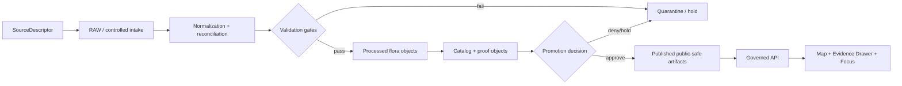

# Flora Domain Architecture

## Purpose
The flora lane turns plant-related evidence into governed, public-safe artifacts for maps and evidence surfaces.

## Architectural boundaries
- **In scope:** taxon identity, occurrence/specimen evidence, source roles, sensitivity transforms, publication decisions, and evidence payloads.
- **Out of scope:** raw source snapshots, secrets, and direct public exposure of restricted precise locations.

## Flow
1. Source descriptors define rights, role, cadence, and sensitivity.
2. Intake enters RAW/controlled staging.
3. Normalization reconciles taxon identity and geometry support.
4. Validation enforces schema, rights, sensitivity, and provenance.
5. Promotion publishes only approved, public-safe derivatives.
6. Governed API serves evidence-resolving payloads for UI surfaces.

## Core invariants
- Source role is part of meaning, not optional metadata.
- Rights and sensitivity checks fail closed.
- Derived layers are rebuildable and never replace canonical evidence.
- Every public claim must resolve to an EvidenceBundle.

## Companion docs
- `CURRENT_STATE.md` for verified repository facts.
- `SOURCE_REGISTRY.md` for source-role and descriptor expectations.
- `DATA_MODEL.md` for domain objects.
- `PIPELINES_AND_LIFECYCLE.md` for run-time lifecycle.
- `PUBLICATION_AND_POLICY.md` for release controls.
- `UI_AND_EVIDENCE_DRAWER.md` for payload contracts and UX boundaries.
