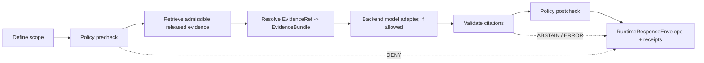

<!-- [KFM_META_BLOCK_V2]
doc_id: kfm://doc/<uuid-flora-architecture>          # TODO assign on first commit
title: Flora Domain — Architecture
type: standard
version: v0.1
status: draft
owners: <flora-domain-steward>                       # TODO assign; PROPOSED per blueprint
created: 2026-05-08
updated: 2026-05-08
policy_label: public
related:
  - docs/domains/flora/README.md
  - docs/domains/flora/DATA_MODEL.md
  - docs/domains/flora/PIPELINES_AND_LIFECYCLE.md
  - docs/domains/flora/PUBLICATION_AND_POLICY.md
  - docs/domains/flora/UI_AND_EVIDENCE_DRAWER.md
  - docs/domains/flora/SOURCE_REGISTRY.md
  - docs/domains/flora/CURRENT_STATE.md
  - docs/domains/flora/VERIFICATION_BACKLOG.md
  - docs/adr/ADR-flora-schema-home.md
  - docs/adr/ADR-flora-source-roles.md
  - docs/adr/ADR-flora-sensitive-location-policy.md
  - docs/adr/ADR-flora-public-layer-strategy.md
tags: [kfm, flora, domain, architecture, governance]
notes:
  - First-pass architecture authored against KFM Flora PDF-only Implementation Blueprint and Directory Rules.
  - All paths and machine artifacts are PROPOSED until repo conventions and ADRs land.
  - public-risk MIXED — low/medium for the architecture doc itself; HIGH for sensitive-flora geometry surfaces it governs.
[/KFM_META_BLOCK_V2] -->

# Flora Domain — Architecture

End-to-end lane architecture and object boundaries for the **Kansas Frontier Matrix Flora lane** — taxonomy, occurrences, specimens, communities, sensitive flora, derived surfaces, and the governance fabric that keeps every consequential outward claim reconstructable to evidence.

<!-- Top-of-file impact block -->

 <!-- TODO link target -->
 <!-- TODO link target -->
 <!-- TODO link target -->
 <!-- TODO link target -->
 <!-- TODO link target -->
 <!-- TODO link target -->

> **Owners** &middot; `<flora-domain-steward>` (TODO assign) &middot; reviewers TODO &middot; release-duty TODO
> **Maturity** &middot; doctrine grounded in attached KFM corpus; implementation paths await repo inspection and ADR resolution.

**Quick jump:**
[Mission](#1-mission-and-boundary) &middot;
[Companion docs](#2-where-this-document-fits) &middot;
[Invariants](#3-architectural-invariants) &middot;
[Object families](#4-scope-and-object-families) &middot;
[Source roles](#5-source-role-discipline) &middot;
[Lifecycle](#6-lifecycle-architecture) &middot;
[Identity](#7-deterministic-identity-and-hashing) &middot;
[Schemas](#8-schema--contract-surface) &middot;
[Validators & policy](#9-validators-and-fail-closed-policy-gates) &middot;
[Sensitivity](#10-sensitivity-and-public-safety) &middot;
[Catalog & proof](#11-catalog-provenance-and-proof-objects) &middot;
[API/UI](#12-api-ui-evidence-drawer-and-focus-mode) &middot;
[AI boundary](#13-ai--focus-mode-boundary) &middot;
[Tests & CI](#14-tests-fixtures-ci-and-promotion) &middot;
[Migration](#15-migration-and-anti-fragmentation) &middot;
[Thin slice](#16-thin-slice-build-order) &middot;
[Rollback](#17-rollback-path) &middot;
[Directory basis](#18-directory-rules-basis) &middot;
[Open questions](#19-open-verification-questions)

> [!IMPORTANT]
> **Truth posture for this document.** Doctrinal claims (lifecycle law, AI boundary, source-role discipline, sensitivity defaults, lifecycle invariants) are **CONFIRMED** against the attached KFM corpus. Every claim about repository state — file presence, schema homes, route names, test results, CI behavior, deployment maturity — is **PROPOSED** or **UNKNOWN** until a mounted repository inspection or ADR confirms it. No row in any matrix below should be cited as "implemented" without verification.

---

## 1. Mission and boundary

**CONFIRMED doctrine / PROPOSED implementation.** The Flora lane is a governed, evidence-first, map-first, time-aware domain lane that ingests, normalizes, validates, catalogs, publishes, explains, reviews, corrects, and rolls back flora information while preserving source roles, rights, sensitivity, time semantics, taxonomic uncertainty, spatial uncertainty, and release state.

The lane must make every consequential outward Flora claim reconstructable to **source descriptors → EvidenceRefs → EvidenceBundles → policy decisions → review state → catalog records → correction lineage**. The public layer is not the truth source.

> [!NOTE]
> **Hard semantic boundaries the architecture refuses to collapse.**
>
> - A model output is **not** an observation.
> - A range map is **not** a specimen.
> - A generalized public polygon is **not** an internal sensitive occurrence point.
> - An AI answer is **not** source evidence.
> - Renderer state (visibility, style, filter) is **not** policy or proof.

The Flora lane **owns** plant taxa, naming and synonymy crosswalks, plant occurrences, specimen/herbarium records, plant communities and vegetation classes, rare/protected/culturally sensitive flora controls, invasive plant records, phenology and condition products, range and habitat-suitability surfaces, restoration planting records, and the review/correction/rollback lineage for all of the above.

The Flora lane **does not own** animal records (Fauna), crop operations (Agriculture), critical-habitat designations as legal artifacts (Habitat/regulatory lane), or person/genealogy/DNA records (People). Habitat covariates and ecosystem associations are joined as **derived support**, not absorbed.

[Back to top ↑](#flora-domain--architecture)

---

## 2. Where this document fits

This file is the **end-to-end architectural reference** for the Flora lane. It is intentionally broad and comparatively shallow per topic; every topic that needs depth lives in a companion doc. **PROPOSED:** the companion docs below sit beside this file under `docs/domains/flora/` (per Directory Rules and the Flora Blueprint §8.1).

| Companion document | Owns | This doc references it for |
|---|---|---|
| [`README.md`](README.md) | Lane entrypoint, status, navigation | First-touch orientation |
| [`CURRENT_STATE.md`](CURRENT_STATE.md) | Living CONFIRMED / PROPOSED / UNKNOWN inventory | Repo-state truth |
| [`SOURCE_REGISTRY.md`](SOURCE_REGISTRY.md) | Human guide to `data/registry/flora/sources.yaml` | Source-role detail |
| [`DATA_MODEL.md`](DATA_MODEL.md) | Object families, IDs, relations, lifecycle fields | Schema/field detail |
| [`PIPELINES_AND_LIFECYCLE.md`](PIPELINES_AND_LIFECYCLE.md) | RAW → PUBLISHED watcher and pipeline detail | Operational behavior |
| [`PUBLICATION_AND_POLICY.md`](PUBLICATION_AND_POLICY.md) | Rights, sensitivity, public-safe rules | Policy execution |
| [`UI_AND_EVIDENCE_DRAWER.md`](UI_AND_EVIDENCE_DRAWER.md) | MapLibre / Drawer / Focus payload contracts | UI runtime detail |
| [`VERIFICATION_BACKLOG.md`](VERIFICATION_BACKLOG.md) | Open checks and evidence gaps | What to chase next |
| [`adr/`](adr/) | Architectural decisions (schema home, source roles, sensitivity, public layer) | Structural commitments |

> [!TIP]
> Read this file for the **shape** of the lane. Read the companion doc for any single topic's **fields, fixtures, and runbooks**.

[Back to top ↑](#flora-domain--architecture)

---

## 3. Architectural invariants

These are **CONFIRMED** in the attached KFM corpus and apply to Flora without amendment. Anything that bends an invariant must be called out as a tradeoff and reviewed.

| # | Invariant | Flora consequence |
|---|---|---|
| I-1 | **Lifecycle law.** RAW → WORK / QUARANTINE → PROCESSED → CATALOG / TRIPLET → PUBLISHED. Promotion is a governed state transition, not a file move. | Flora artifacts only enter the next stage with receipts, validators, and policy outputs that match the stage; no copy-as-promote. |
| I-2 | **Trust membrane.** Public clients use governed APIs and released artifacts only. | Public Flora UI and APIs **never** read `data/raw`, `data/work`, `data/quarantine`, canonical restricted stores, model runtimes, vector indexes, or graph stores directly. |
| I-3 | **Cite-or-abstain.** Consequential answers resolve `EvidenceRef → EvidenceBundle`; otherwise they ABSTAIN. | Flora API responses, Drawer payloads, and Focus Mode output ABSTAIN or DENY when bundles cannot resolve. |
| I-4 | **Fail-closed defaults.** Missing rights, missing sensitivity, missing review, ambiguous taxon, exact sensitive geometry → DENY or QUARANTINE. | Sensitive Flora is the canonical fail-closed case (see [§10](#10-sensitivity-and-public-safety)). |
| I-5 | **Deterministic identity.** Source-native IDs preserved; deterministic fallback IDs use canonical fields and versioned recipes; `spec_hash` is schema/process identity, `content_hash` is artifact identity. | See [§7](#7-deterministic-identity-and-hashing). |
| I-6 | **EvidenceRef → EvidenceBundle.** EvidenceRef must resolve when claims depend on it. | Every Flora claim card carries explicit bundle references. |
| I-7 | **Auditable governance.** Provenance, receipts, reviews, corrections, and rollback targets remain inspectable. | Catalog matrix closure ([§11](#11-catalog-provenance-and-proof-objects)) is the gate for release. |
| I-8 | **AI as interpretive layer.** EvidenceBundle outranks generated language. Outcomes are finite: ANSWER · ABSTAIN · DENY · ERROR. | See [§13](#13-ai--focus-mode-boundary). |
| I-9 | **Renderer downstream of trust.** MapLibre or any renderer is *output*, not *truth*. | Layer descriptors carry trust semantics; style JSON is never the source of truth. |

[Back to top ↑](#flora-domain--architecture)

---

## 4. Scope and object families

**PROPOSED.** The Flora scope spans the families below. The architecture **explicitly forbids collapsing** observed occurrence, institutional/specimen evidence, modeled range/suitability, regulatory/stewardship context, generalized public-safe display layer, and AI explanation payload into a single unified record. Each family stays distinct because each carries different authority, precision, review burden, and publication eligibility.

| Object family | Why it stays distinct | Example object names |
|---|---|---|
| Taxon and naming | Accepted identity, raw name, common names, rank, authority — not observations | `flora_taxon`, `flora_taxon_status` |
| Synonym / common-name / historical-name crosswalks | Time-aware identity bridges, not occurrence evidence | `flora_taxon_crosswalk` |
| Occurrence / observation records | Point or area records with uncertainty, license, sensitivity | `flora_occurrence`, `occurrence_batch`, `occurrence_quality_state` |
| Survey / specimen / herbarium / checklist / plot / photo observations | Different methods carry different authority and precision | `specimen_record`, `herbarium_sheet`, `plot_observation`, `photo_voucher` |
| Plant community / vegetation / ecosystem objects | Assemblage or mapped unit, not individual presence | `plant_community`, `vegetation_class`, `ecosystem_association` |
| Habitat / covariate linkages | Derived support, not plant presence on their own | `flora_habitat_association`, `covariate_sample` |
| Status / policy / review objects | Governance context, not observed truth | `review_record`, `status_assertion`, `policy_decision` |
| Native / introduced / invasive / cultivated distinctions | Interpretive status that varies by jurisdiction and time | `origin_status`, `invasive_status`, `cultivated_flag` |
| Rare / protected / culturally sensitive flora controls | Need exact-vs-public-safe split, review state, redaction lineage | `sensitivity_policy`, `redaction_receipt`, `steward_review_record` |
| Derived / modeled / generalized objects | Must not masquerade as observed truth | `range_map`, `habitat_suitability_surface`, `generalized_public_occurrence` |
| Vegetation index / condition / phenology products | Need masks, windows, uncertainty, source lineage | `phenology_condition_product`, `vegetation_index_product` |
| Review / correction / rollback / supersession | Governance transitions that preserve lineage rather than deleting | `correction_notice`, `rollback_card`, `supersession_link` |

> Field-level definitions live in [`DATA_MODEL.md`](DATA_MODEL.md). This document fixes only the *boundaries between families* and the rule that they do not silently merge.

[Back to top ↑](#flora-domain--architecture)

---

## 5. Source-role discipline

**PROPOSED.** `source_role` is a first-class field on every descriptor and travels into processed records, EvidenceBundles, API envelopes, Evidence Drawer payloads, and layer descriptors. Source role does **not** automatically determine truth; it defines **authority boundary, review burden, publication eligibility, and citation shape**.

| `source_role` | Meaning | Default trust use | Publication default |
|---|---|---|---|
| `official` | Government / legally responsible source for status, regulation, or authoritative spatial layer | Anchors official status claims within authority boundary | Publish only after rights, sensitivity, and review resolve |
| `institutional` | Museum, herbarium, university, research institute, or agency-managed collection | Strong specimen/collection evidence; may have license / precision constraints | Public-safe metadata; exact geometry depends on rights and sensitivity |
| `steward_reviewed` | Curated by responsible flora steward, heritage program, or qualified domain reviewer | Can lift quarantine or allow controlled internal use | Public only with explicit release decision |
| `corroborative` | Useful support but not controlling authority for legal/status claims | Corroborates presence, name, or context; cannot override `official` | Aggregate / generalize; cite limitations |
| `community_observation` | Public/community record (e.g., iNaturalist-class) | Useful with quality labels, reviewer status, license checks | Publish only if license and sensitivity allow; avoid false precision |
| `controlled_access` | Source requiring terms, license, steward approval, or access-controlled use | Informs internal review; cannot leak restricted attributes | DENY public exact publication unless authorization is explicit |
| `derived_model` | Model, index, interpolation, habitat suitability, range, or generalized summary | Contextual / interpretive evidence only — never observation truth | Publish with model card, uncertainty, evidence lineage |
| `generalized_public_surface` | Public-safe geometry/layer derived from internal details | Outward display layer after redaction/generalization | Publishable when transform lineage, sensitivity, and rights resolve |

The required source descriptor fields are documented in [`SOURCE_REGISTRY.md`](SOURCE_REGISTRY.md) and machine-encoded in `data/registry/flora/sources.yaml` (PROPOSED). The role vocabulary and authority boundaries are locked by [`docs/adr/ADR-flora-source-roles.md`](../../adr/ADR-flora-source-roles.md) (PROPOSED).

> [!WARNING]
> **Authority boundary is not transitive.** A `corroborative` source corroborating a `derived_model` does not promote either to `official`. Stacking weak roles never produces a strong claim.

[Back to top ↑](#flora-domain--architecture)

---

## 6. Lifecycle architecture

Flora preserves the KFM truth lifecycle. The diagram below shows stages, the trust membrane, and the governance operations that cross it.

```mermaid
flowchart LR
  E["SOURCE EDGE<br/>descriptor · probe · rights"]
  R["RAW<br/>immutable pulls + checksums"]
  W["WORK / QUARANTINE<br/>normalize · reconcile · flag"]
  P["PROCESSED<br/>schema-valid · deterministic IDs"]
  C["CATALOG / TRIPLET<br/>STAC · DCAT · PROV · matrix"]
  X["PROOF + REVIEW<br/>EvidenceBundle · steward review"]
  M["RELEASE MANIFEST<br/>digest-closed · policy-cleared"]
  Pub["PUBLISHED<br/>public-safe layers · APIs · payloads"]
  UI["MapLibre · Evidence Drawer · Focus Mode"]

  E --> R --> W --> P --> C --> X --> M --> Pub --> UI
  Pub -. correction / rollback .-> X

  classDef internal fill:#fff7ed,stroke:#c2410c,color:#7c2d12
  classDef trust    fill:#eff6ff,stroke:#1d4ed8,color:#1e3a8a
  classDef public   fill:#ecfdf5,stroke:#047857,color:#064e3b
  class E,R,W internal
  class P,C,X,M trust
  class Pub,UI public
```



| Stage | Flora responsibilities | Key artifacts | Fail-closed conditions |
|---|---|---|---|
| **SOURCE EDGE** | Resolve descriptor; probe access; capture rights/sensitivity; record ETag/Last-Modified/checksum | `source_descriptor`, `source_probe_receipt`, source-role registry | Unknown rights; unknown sensitivity for public use; unverified controlled source; missing authority boundary |
| **RAW** | Store immutable raw pulls (or fixture equivalents) with source metadata and checksums; no destructive normalization | `raw artifact`, `raw_manifest`, `run_receipt` | Raw artifact referenced by public payload; missing checksum for release candidate |
| **WORK / QUARANTINE** | Normalize, clean, reconcile taxon, handle CRS/precision, flag duplicates, capture quarantine reason codes | `work_normalized`, `quarantine_record`, `taxon_reconciliation_report` | Rights failure; sensitivity failure; invalid geometry; ambiguous taxon; unresolved precision |
| **PROCESSED** | Validated normalized objects with deterministic IDs, quality state, source/evidence refs, public-safe geometry where allowed | `flora_taxon`, `flora_occurrence`, `plant_community`, `range_map`, `phenology_product` | Schema failure; missing source/evidence refs; missing `spec_hash`; invalid CRS |
| **CATALOG / TRIPLET** | Emit STAC for spatial assets, DCAT for datasets, PROV lineage, catalog-matrix closure, graph projection if supported | `stac_item`, `dcat_dataset`, `prov_activity`, `catalog_matrix`, `graph_delta` | Catalog matrix open; digest mismatch; missing provenance; graph claim untethered from evidence |
| **PROOF + REVIEW + RELEASE** | Bundle evidence, run steward review, finalize release manifest with policy/correction/rollback links | `EvidenceBundle`, `release_manifest`, `review_record`, `proof_pack` | Missing review where required; bundle/manifest digest mismatch; rollback target absent |
| **PUBLISHED** | Expose only public-safe layers, records, APIs, and evidence payloads behind governed interfaces | `layer_descriptor`, `runtime_response`, public PMTiles / GeoJSON / TileJSON | RAW/WORK/QUARANTINE leakage; exact sensitive geometry; unresolved rights; model-as-observation |
| **REVIEW / CORRECTION / ROLLBACK** | Record review, correction notices, rollback cards, supersession links — preserved lineage only | `review_record`, `correction_notice`, `rollback_card`, `supersession_link` | Silent replacement of public outputs; missing correction/rollback linkage after public issue |

> Operational depth — watcher cadence, normalization steps per source, fixture pipeline behavior — lives in [`PIPELINES_AND_LIFECYCLE.md`](PIPELINES_AND_LIFECYCLE.md).

[Back to top ↑](#flora-domain--architecture)

---

## 7. Deterministic identity and hashing

**PROPOSED.** Flora identity must not depend on volatile timestamps. Source-native identifiers are preserved when present; deterministic fallback identifiers use canonicalized fields and versioned recipes. Identifiers for occurrence, taxon, community, layer, source, bundle, manifest, review, and receipt objects remain in distinct namespaces.

| Identifier | Required behavior | Example pattern |
|---|---|---|
| `source_id` | Stable across descriptor revisions; version fields carry changes | `flora.source.kdwp.status.v1` |
| `taxon_id` | Derived from accepted authority identifier when available; otherwise deterministic provisional key | `kfm://flora/taxon/<authority>/<id>` |
| `taxon_crosswalk_id` | Stable hash over authority, raw name, accepted taxon id, validity interval | `kfm://flora/taxon-crosswalk/sha256:<hash>` |
| `occurrence_id` | Preserve source-native id; deterministic fallback from `source_id`, `source_record_id`, event date, normalized geometry, taxon | `kfm://flora/occurrence/sha256:<hash>` |
| `community_id` / `vegetation_class_id` | Classification system + class code + version; never reused for occurrences | `kfm://flora/vegetation-class/nlcd/<code>/<epoch>` |
| `layer_id` | Semantic layer identity, not style filename; references source ids and evidence route | `kfm.layer.flora.occurrence.generalized.public.v1` |
| `bundle_id` | Hash over resolved evidence list, policy state, review state, artifact digests | `kfm://evidence/flora/sha256:<hash>` |
| `manifest_id` | Release manifest identity, distinct from bundle and receipt | `kfm://release/flora/<date>/<spec_hash>` |
| `review_id` / `rollback_id` | Governance-action identity with actor, scope, reason, target release | `kfm://review/flora/<uuid>` · `kfm://rollback/flora/<uuid>` |
| `spec_hash` | Stable hash of schema/spec/process identity; not a timestamp; not policy on its own | sha256 over canonical JSON spec with sorted keys |
| `content_hash` | Hash of source / processed / catalog / proof / published artifacts | `sha256:<64 hex>` |

Helpers live (PROPOSED) in `packages/flora/src/flora/ids.py` and `packages/flora/src/flora/hashing.py`.

[Back to top ↑](#flora-domain--architecture)

---

## 8. Schema / contract surface

**PROPOSED.** Start with a small wave that proves source descriptors, taxon identity, occurrences, rights/sensitivity, receipts, EvidenceBundles, catalog closure, API envelopes, Evidence Drawer, Focus Mode, and release manifests. **Where shared governance objects already exist in the real repo, reuse or extend them rather than duplicating.** Schema-home placement (`contracts/flora/` vs `schemas/contracts/v1/flora/`) is **NEEDS VERIFICATION** until [`docs/adr/ADR-flora-schema-home.md`](../../adr/ADR-flora-schema-home.md) lands.

| Schema | Purpose | Reuse note | Priority |
|---|---|---|---|
| `flora_taxon.schema.json` | Accepted taxon identity, rank, authority, status pointers, naming | Reuse shared `Taxon` if present | P0 |
| `flora_taxon_crosswalk.schema.json` | Raw / accepted / synonym / common / historical-name crosswalk with validity | Reuse shared crosswalk if present | P0 |
| `flora_occurrence.schema.json` | Atomic observed record: taxon, method, geometry, uncertainty, source, rights, sensitivity, review | **Do not merge with range/model schema** | P0 |
| `flora_occurrence_batch.schema.json` | Batch manifest for occurrence loads and fixture groups | Reuse run manifest if present | P0 |
| `flora_source_descriptor.schema.json` | Machine-readable registry entry: rights, sensitivity, cadence, role, ids, formats | Prefer shared `SourceDescriptor` | P0 |
| `flora_run_receipt.schema.json` | Process memory for fetch/normalize/validate runs — **not** release proof | Reuse shared `RunReceipt` | P0 |
| `flora_redaction_receipt.schema.json` | Geoprivacy / generalization / withholding transform receipt | Reuse shared `RedactionReceipt` | P0 |
| `flora_evidence_bundle.schema.json` | Release/runtime bundle resolved from EvidenceRefs | Reuse shared `EvidenceBundle` wherever possible | P0 |
| `flora_decision_envelope.schema.json` | Finite ANSWER / ABSTAIN / DENY / ERROR with reasons, obligations, evidence, policy | Reuse shared `DecisionEnvelope` | P0 |
| `flora_release_manifest.schema.json` | Release artifact list, digests, catalog refs, policy decisions, rollback target | Reuse shared `ReleaseManifest` | P0 |
| `flora_catalog_matrix.schema.json` | Closure across STAC / DCAT / PROV / manifest / proofs / runtime | Reuse shared `CatalogMatrix` | P0 |
| `flora_promotion_candidate.schema.json` | Candidate bundle input for promotion gate before publish | Could conform to shared `PromotionCandidate` | P0 |
| `flora_layer_descriptor.schema.json` | MapLibre-facing layer metadata, evidence route, source role, freshness, policy, review, time semantics | Align with shared layer / source / style governance | P0 |
| `flora_focus_payload.schema.json` | Focus Mode request/response constrained by released evidence and policy | Reuse shared `FocusQuery` / `FocusResponse` | P0 |
| `flora_evidence_drawer_payload.schema.json` | Drawer payload: claim, evidence, provenance, sensitivity, rights, review, correction, freshness | Prefer shared `EvidenceDrawerPayload` | P0 |
| `flora_runtime_response_envelope.schema.json` | Governed API response envelope with finite outcomes and trust fields | Reuse shared `RuntimeResponseEnvelope` | P0 |
| `flora_review_record.schema.json` | Human / steward review, decision, scope, actor, date, obligations | Reuse shared `ReviewRecord` | P1 |
| `flora_plant_community.schema.json` | Plant community object distinct from occurrence and range | May align with habitat / ecosystem schemas | P1 |
| `flora_vegetation_class.schema.json` | Vegetation class / ecosystem code with classification system and epoch | Link to habitat lane if shared | P1 |
| `flora_range_map.schema.json` | Range / distribution surface with source / model / generalization metadata | **Do not present as observed occurrence** | P1 |
| `flora_habitat_association.schema.json` | Association between taxon/occurrence/community and habitat/covariates with method/confidence | Can reuse habitat join schema | P1 |
| `flora_phenology_condition_product.schema.json` | Remote-sensing / index / condition product with windows, masks, uncertainty, source assets | Can reuse remote-sensing product schema | P2 |

[Back to top ↑](#flora-domain--architecture)

---

## 9. Validators and fail-closed policy gates

**PROPOSED.** Validators perform deterministic shape/content checks. Policy gates carry decision logic. CI orchestrates these tools rather than burying policy-significant logic inside workflow YAML. **Missing policy evidence fails closed.**

### 9.1 Validators (homes PROPOSED)

| Validator | Role | Risk |
|---|---|---|
| `tools/validators/flora/validate_source_descriptors.py` | Source registry validity (rights, sensitivity, role, identifiers) | low/medium |
| `tools/validators/flora/validate_schema_fixtures.py` | Schema pass/fail fixture validation | low/medium |
| `tools/validators/flora/validate_catalog_matrix.py` | STAC / DCAT / PROV / release closure | low/medium |
| `tools/validators/flora/validate_evidence_bundle.py` | EvidenceBundle integrity | HIGH |
| `tools/validators/flora/validate_api_payloads.py` | API / runtime envelope shape and trust fields | HIGH |
| `tools/validators/flora/validate_focus_payload.py` | Focus Mode payload, citation validity, denial codes | HIGH |
| `tools/validators/flora/run_all.py` | Aggregate local validation runner | low/medium |

### 9.2 Policy bundles (homes PROPOSED, OPA/Conftest expected)

| Policy file | Decides | Risk |
|---|---|---|
| `policy/flora/publish.rego` | Publication allow/deny | HIGH |
| `policy/flora/sensitivity.rego` | Sensitive geometry & rare flora rules | HIGH |
| `policy/flora/rights.rego` | License / controlled-access rules | HIGH |
| `policy/flora/taxon.rego` | Accepted taxon and ambiguity rules | medium |
| `policy/flora/catalog.rego` | Catalog / proof closure rules | medium |
| `policy/flora/ai.rego` | AI / Focus citation and restricted-disclosure rules | HIGH |
| `policy/flora/promotion.rego` | Promotion-candidate decision rules | HIGH |
| `policy/flora/review.rego` | Steward-review requirements | HIGH |

### 9.3 Canonical deny / quarantine cases

| Case | Reason codes (illustrative) | Outcome |
|---|---|---|
| Missing rights | `missing_rights`, `unknown_rights` | ABSTAIN runtime; DENY promotion if publication requires rights |
| Missing evidence / source refs | `missing_source_id`, `missing_evidence_bundle` | DENY consequential publication |
| Exact public geometry for sensitive rare flora | `precise_sensitive_location_denied`, `geoprivacy_required` | DENY; require redaction/generalization receipt |
| Publication from RAW / WORK / QUARANTINE | `public_payload_exposes_internal_ref` | DENY |
| Unresolved taxonomy where accepted identity is required | `ambiguous_taxon_identity`, `accepted_taxon_required` | DENY or QUARANTINE |
| Modeled output presented as observed truth | `model_as_observation`, `knowledge_character_mismatch` | DENY |
| Missing required review | `review_required`, `steward_review_missing` | DENY |
| Uncited AI flora answer | `ai_missing_evidence_bundle_or_citations` | DENY |
| Catalog matrix open or proof bundle incomplete | `catalog_matrix_not_closed`, `proof_bundle_incomplete` | DENY |
| Public geometry not generalized or invalid | `invalid_geometry`, `public_geometry_not_generalized` | DENY |

[Back to top ↑](#flora-domain--architecture)

---

## 10. Sensitivity and public safety

**CONFIRMED doctrine / PROPOSED implementation.** The default for sensitive flora is **do not expose exact occurrence points**. Prefer generalized geometry, withheld geometry, denied publication, staged access, or delayed publication. Preserve transform lineage in redaction / geoprivacy receipts.

| Sensitivity class (PROPOSED labels) | Meaning | Public geometry behavior |
|---|---|---|
| `public_exact_allowed` | Non-sensitive; rights and source geoprivacy allow exact public geometry | Exact public geometry may publish with evidence and rights |
| `public_generalized` | Publish only at county / grid / watershed / bbox / generalized support | Generalized geometry + redaction receipt |
| `restricted_precise` | Precise coordinates protected by taxon, source, steward, or policy | No public precise geometry; restricted store only |
| `embargoed` | Temporal delay required (collection / monitoring / nesting-equivalent context) | No public record until embargo lifts, or public summary only |
| `steward_review_required` | Human steward review before any release-class decision | HOLD; no public promotion |
| `quarantine` | Rights / sensitivity / taxonomy / geometry / source-role unresolved | QUARANTINE; not public |

Required behaviors (CONFIRMED in corpus):

- **Exact / internal vs public-safe geometry split** — internal precise geometry stays access-controlled; public payloads carry generalized / withheld / obscured geometry only.
- **Redaction / geoprivacy receipts** — record method, precision bucket, grid/region, input digest, output digest, reason code, policy version, actor/run, source refs.
- **Withheld / obscured location logic** — DENY or ABSTAIN when geometry cannot be made safe or rights are unresolved.
- **Review-required flags** — promotion blocked until a `review_record` exists whose scope matches the target release.
- **Public-safe MapLibre layers** — generalized public surfaces only; no exact coordinates, no restricted source ids, no internal refs.
- **Internal-only restrictions** — controlled data stays behind governed API and never enters public layer bundles.

> [!CAUTION]
> The thresholds (which species/statuses qualify for `restricted_precise`, what generalization grid is acceptable, what embargo windows apply) are **NEEDS VERIFICATION** and locked by [`docs/adr/ADR-flora-sensitive-location-policy.md`](../../adr/ADR-flora-sensitive-location-policy.md) (PROPOSED).

Detail and runbooks live in [`PUBLICATION_AND_POLICY.md`](PUBLICATION_AND_POLICY.md).

[Back to top ↑](#flora-domain--architecture)

---

## 11. Catalog, provenance, and proof objects

**PROPOSED.** Catalog and proof objects are not interchangeable, and they are not interchangeable with receipts.

| Artifact family | Role | Storage proposal | Do not confuse with |
|---|---|---|---|
| **STAC items** | Spatial-asset discoverability for PMTiles / COG / GeoJSON / GeoParquet | `data/catalog/stac/flora/` | Release proof or runtime answer |
| **DCAT records** | Dataset / distribution cataloging and public data inventory | `data/catalog/dcat/flora/` | STAC item or PROV lineage |
| **PROV lineage** | Activities, agents, entities, derivations, source-to-output trace | `data/catalog/prov/flora/` | Receipt, proof, or layer style |
| **Catalog matrix** | Machine check that STAC / DCAT / PROV / manifest / proof / published refs close | `data/catalog/flora/catalog_matrix/*.json` | Human README |
| **Run receipts** | Process memory for fetch / normalize / validate / diff operations | `data/receipts/flora/` | Release-grade proof |
| **Proof bundles** | Release-significant evidence with checksums (signatures/attestations where supported), review state | `data/proofs/flora/` | Catalog metadata alone |
| **Release manifests** | Published artifact inventory: digests, policy / review / correction refs, rollback target | `data/published/flora/manifests/` | Source descriptor |
| **EvidenceBundles** | Runtime-resolvable support for claims and Drawer payloads | `data/proofs/flora/evidence_bundles/` | Generated language or model response |
| **Rollback cards** | Reversal plan for published layer / API alias and correction notice | `data/proofs/flora/rollback_cards/` | Deletion or silent replacement |

[Back to top ↑](#flora-domain--architecture)

---

## 12. API, UI, Evidence Drawer, and Focus Mode

**PROPOSED.** Public and ordinary clients use governed API routes and published / released artifacts only — never canonical or internal stores. Flora API responses use the finite outward outcomes ANSWER · ABSTAIN · DENY · ERROR, and every consequential answer exposes freshness, policy, rights, review, source-role, and provenance fields.

### 12.1 Governed API surface

| Route (PROPOSED) | Payload shape | Boundary rule |
|---|---|---|
| `GET /flora/taxa/{taxon_id}` | `flora_taxon` + evidence / authority / status refs | No raw taxon source dumps; unresolved taxonomy → ABSTAIN / ERROR |
| `GET /flora/occurrences` | Public-safe occurrence summaries with generalized geometry and EvidenceBundle refs | Never returns RAW / WORK / QUARANTINE refs or exact sensitive points |
| `GET /flora/layers` | Layer descriptors with source role, freshness, policy, review, rights, evidence route | Style metadata is not the truth source |
| `GET /flora/evidence/{bundle_id}` | Resolved EvidenceBundle, provenance, catalog refs, review/correction state | Must enforce policy and access controls |
| `POST /flora/focus` | Focus request/response with finite outcome, citations, reason codes, obligations, audit ref | AI runs after evidence/policy and cannot reveal restricted exact locations |
| `GET /flora/review/candidates` | Internal/steward review queue (promotion / sensitivity / taxon issues) | Internal-only; ordinary public clients DENY |
| `GET /flora/release/{release_id}` | Release manifest, catalog matrix status, rollback / correction refs | No unpublished candidates exposed |

### 12.2 UI behavior

| Surface | Must show | Must not do |
|---|---|---|
| **MapLibre public flora layer** | Generalized / public-safe geometry, trust badge, freshness, source role, review state | Read RAW / WORK / QUARANTINE; infer truth from renderer state |
| **Evidence Drawer** | Claim summary, evidence refs, resolved bundle, source role, rights, sensitivity transform, catalog/provenance, correction state | Hide negative outcomes; omit policy blocks |
| **Focus Mode** | Scope chips, evidence pool, finite outcome banner, citations, audit ref, denial / obligation codes | Answer without citations; consume unpublished candidate data as public truth |
| **Review surface** | Promotion candidates, sensitivity flags, redaction receipts, taxonomy conflicts, reviewer decision | Bypass policy gates; rewrite source evidence |
| **Layer controls** | Layer visibility with trust-visible state and public-safe geometry indicator | Treat visibility, style, or filters as proof |

### 12.3 Evidence Drawer payload — required sections

```text
claim       : claim_id, label, bounded statement, spatial/temporal scope, knowledge character
decision    : outcome, reason_codes, obligations, audit_ref, policy_label
evidence    : evidence_refs, resolved bundle ids, source ids, source roles, citations, checksums
provenance  : STAC / DCAT / PROV refs, run receipt refs, derivation ids, catalog matrix status
rights      : license / terms, public eligibility, redaction receipt, review_required, generalized_geometry flag
freshness   : as_of, valid_time, retrieved_at, review_state, correction_notice, rollback_ref
```

Field-level shape lives in [`UI_AND_EVIDENCE_DRAWER.md`](UI_AND_EVIDENCE_DRAWER.md).

[Back to top ↑](#flora-domain--architecture)

---

## 13. AI / Focus Mode boundary

**CONFIRMED doctrine.** AI is an interpretive layer — never the root truth source. Flora Focus Mode runs **after** scope definition, evidence retrieval, `EvidenceRef → EvidenceBundle` resolution, policy / sensitivity checks, context assembly, citation validation, and runtime envelope validation. Browsers never call model runtimes, vector stores, graph stores, or canonical/object stores directly.

| AI may | AI must not |
|---|---|
| Summarize admissible **published** Flora evidence tied to an EvidenceBundle | Become source truth or override EvidenceBundle / policy / review |
| Explain taxon / status / range / occurrence context with scope and citations | Reveal restricted exact flora locations or controlled-access source detail |
| Abstain when evidence is insufficient; deny where policy blocks the response | Flatten modeled range, habitat suitability, and observed occurrence into one claim |
| Emit machine-readable runtime envelopes with ANSWER · ABSTAIN · DENY · ERROR | Bypass citation validation or use renderer state as evidence |



[Back to top ↑](#flora-domain--architecture)

---

## 14. Tests, fixtures, CI, and promotion

**PROPOSED.** CI is thin orchestration; validators and policy files carry the policy-significant logic. Promotion is fail-closed and requires schema validation, catalog/provenance closure, rights/sensitivity resolution, proof/release-bundle completeness (per repo conventions), deterministic identity, and an explicit decision output.

| Test family | Purpose | Example fixture / test name |
|---|---|---|
| Valid schema fixtures | At least one passing fixture per schema | `valid/flora_taxon.json`, `valid/flora_occurrence_public_generalized.json`, `valid/flora_evidence_bundle.json` |
| Invalid schema fixtures | Prove validators catch missing fields and bad shapes | `invalid/missing_source_ref.json`, `invalid/missing_rights.json`, `invalid/invalid_geometry.json` |
| Validator unit tests | Geometry, rights, taxonomy, sensitivity, catalog, API payloads | `test_validate_occurrence_geometry.py`, `test_rights_gate.py` |
| Policy parity tests | OPA / Conftest (or repo standard) plus optional Python mirror | `fail_precise_sensitive_public_geometry.json`, `fail_unknown_rights.json` |
| Pipeline thin-slice | No-live-network fixture ingest RAW → processed → public-generalized | `test_fixture_pipeline_no_network.py` |
| Catalog closure | STAC / DCAT / PROV / release / evidence refs close; digests align | `test_catalog_matrix.py` |
| Runtime / API payload | Envelope validates finite outcomes and evidence refs | `test_flora_api_response.py` |
| Evidence Drawer payload | Drawer shows required trust fields and negative states | `test_evidence_drawer_payload.py` |
| Focus payload | Allowed answer and denied sensitive cases validate | `test_focus_payload.py` |
| Sensitivity / public-safe | Exact rare point cannot enter a public artifact | `test_no_sensitive_public_leak.py` |
| Promotion pass/fail | Gate accepts complete release; denies missing proof / catalog / review | `promotion/pass_public_generalized.json`, `promotion/fail_catalog_open.json` |
| Rollback / correction | Rollback card and correction notice reference affected release / layer / API | `test_rollback_card.py` |

| Workflow (PROPOSED) | Trigger | Actions | Must not |
|---|---|---|---|
| `.github/workflows/flora-ci.yml` | Pull request paths under `docs/flora`, `data/registry/flora`, contracts/schemas, `policy/flora`, `tools/validators/flora`, `tests/flora`, `pipelines/flora` | Install repo deps; run schema fixtures, validators, no-network smoke; run policy tests if tooling available; render summary | Fetch live sources or publish artifacts |
| `.github/workflows/flora-promotion.yml` | `workflow_dispatch` or release-candidate PR | Validate promotion candidate, catalog matrix, EvidenceBundle, release manifest, policy, signatures (if supported), rollback card | Promote when any gate is UNKNOWN |
| `.github/workflows/flora-source-probe-manual.yml` | Manual only | Probe source headers / metadata; write report artifact for review | Commit source pulls or sensitive results automatically |

[Back to top ↑](#flora-domain--architecture)

---

## 15. Migration and anti-fragmentation

**PROPOSED rule.** Update canonical homes in place when they exist; never create parallel docs for the same concept. Route unresolved ideas into [`IDEA_INTAKE.md`](IDEA_INTAKE.md), an ADR, or [`VERIFICATION_BACKLOG.md`](VERIFICATION_BACKLOG.md). Preserve prior IDs, receipts, proofs, catalog records, reviews, and rollback lineage.

| Migration concern | Prior state | Target state | Compatibility / rollback |
|---|---|---|---|
| **Schema home** | UNKNOWN; lineage varies between `contracts/flora/` and `schemas/contracts/v1/` | ADR-selected canonical home; aliases only if needed | Do not duplicate; add compatibility pointers; deprecate with migration note |
| **Source registry** | UNKNOWN repo registry; prior lineage had `data/registry/flora/sources.yaml` | Single canonical Flora source registry with roles and sensitivity policies | If existing registry found, extend in place; rollback by reverting registry addition |
| **Policy gates** | UNKNOWN OPA / Conftest availability | Policy files plus repo-standard execution and fixtures | Fail closed; rollback by disabling the new route or layer, never deleting receipts |
| **API routes** | UNKNOWN framework / routes | Governed API route contracts bound to actual framework after verification | Feature-flag flora routes; revert route bindings if needed |
| **UI layer registry** | UNKNOWN MapLibre shell path | Layer descriptor consumed by shell through governed API | Remove / disable layer registry entry; preserve release / correction record |
| **Published artifacts** | No current public Flora release verified | Versioned public-safe artifacts only after promotion | Quarantine public artifact; emit rollback card and correction notice on issue |

[Back to top ↑](#flora-domain--architecture)

---

## 16. Thin-slice build order

**PROPOSED.** The smallest safe first implementation slice is documentation + source registry + core schemas + no-live-network fixtures + validators + policy gates + fixture pipeline + catalog/proof/API/UI payload contracts. **Do not start with live rare-plant data or broad source activation.**

1. Confirm repo conventions and schema home — avoid duplicate authority; ADRs precede paths.
2. Create or extend Flora documentation homes (this file, README, companion docs).
3. Create source registry and sensitivity-policy registry — policy gates need inputs before ingestion.
4. Add core Flora schemas (taxon, occurrence, source descriptor, run receipt, redaction receipt, EvidenceBundle, DecisionEnvelope, ReleaseManifest, CatalogMatrix, layer descriptor, runtime envelope, Focus payload, Drawer payload).
5. Add no-live-network fixtures (valid + invalid + promotion + policy + API + UI).
6. Add validators.
7. Add policy bundles.
8. Add fixture pipeline (`pipelines/flora/fixture_pipeline.py`) — no live network in CI.
9. Add catalog / proof / EvidenceBundle / release-manifest emitters.
10. Add API and UI payload contracts — public surfaces consume governed envelopes only.
11. Add tests and CI workflows — thin orchestration around validators / policies.
12. Generate a PDF snapshot from living files **after** implementation. Documentation follows behavior.

[Back to top ↑](#flora-domain--architecture)

---

## 17. Rollback path

| Layer | Rollback action |
|---|---|
| Schema / docs | Revert PR before published schemas are depended on. If schema has been released, deprecate with a versioned successor — never delete silently. |
| Validator / policy | Revert validator or policy bundle; preserve previously emitted receipts and proofs. |
| Pipeline | Disable pipeline target; quarantine WORK artifacts; do not silently overwrite PROCESSED. |
| API route | Feature-flag off; retain old route entry; emit correction notice if a public answer is affected. |
| UI layer | Remove layer registry entry or hide via feature flag; preserve `layer_id` and release/correction record. |
| Published artifact | Quarantine the artifact; emit `correction_notice` and `rollback_card` referencing affected release / layer / API; never silently replace. |
| Focus / AI | Disable Focus route or client feature flag; Drawer and layer browsing remain intact; mock adapter retained for tests only. |

[Back to top ↑](#flora-domain--architecture)

---

## 18. Directory Rules basis

This document and its companions live under **`docs/domains/flora/`**. The placement choice follows Directory Rules:

- Domain names do **not** become root folders. `flora/` is **not** a top-level repo folder.
- Flora materials are placed under the appropriate **responsibility roots**:
  `docs/domains/flora/`, `schemas/contracts/v1/domains/flora/` (or `contracts/flora/` — ADR-pending), `policy/domains/flora/` (or `policy/flora/`), `tests/domains/flora/`, `fixtures/domains/flora/`, `connectors/<flora-source>/`, `pipeline_specs/domains/flora/`, and `data/{raw,work,quarantine,processed,catalog,triplets,tiles,published}/flora/`.
- `docs/` is the human control plane; this file is canonical doctrine for the Flora lane and is **not** duplicated under any compatibility root (`ui/`, `web/`, `policies/`, `jsonschema/`, `styles/`, `viewer_templates/`, `artifacts/`).
- Schema-home ambiguity (`contracts/` vs `schemas/contracts/v1/`) is resolved by [`docs/adr/ADR-flora-schema-home.md`](../../adr/ADR-flora-schema-home.md) (PROPOSED) before machine files proliferate.

> [!NOTE]
> The Flora directory homes above are **PROPOSED** until repository inspection confirms which canonical roots already exist. If any conflict with current repo conventions, the existing convention wins and this section is updated by PR.

[Back to top ↑](#flora-domain--architecture)

---

## 19. Open verification questions

Tracked in detail in [`VERIFICATION_BACKLOG.md`](VERIFICATION_BACKLOG.md). The headline items:

- **Schema home** — `contracts/flora/` vs `schemas/contracts/v1/flora/`. ADR-pending.
- **Source-role vocabulary** — finalize the eight-role vocabulary above and lock authority boundaries. ADR-pending.
- **Sensitive-location thresholds** — generalization grid sizes, embargo windows, and per-status rules. ADR-pending.
- **Public layer strategy** — generalization-by-default vs species-by-species. ADR-pending.
- **Shared governance objects** — confirm whether shared `EvidenceBundle`, `DecisionEnvelope`, `ReleaseManifest`, `CatalogMatrix`, `RuntimeResponseEnvelope`, `EvidenceDrawerPayload`, `FocusQuery/Response` exist; reuse rather than fork.
- **Policy engine** — OPA / Conftest version pin and CI invocation contract.
- **MapLibre shell home** — `apps/maplibre/` vs `ui/` vs `web/`; shell path drives `flora_layer_descriptor` consumption.
- **Source endpoint verification** — KDWP, USFWS ECOS, GBIF, iNaturalist, NatureServe, herbarium portals — endpoints, rights, cadence, sensitivity flags. NEEDS VERIFICATION.
- **Steward / owner assignment** — `<flora-domain-steward>` is currently a placeholder.
- **Maturity claim** — no Flora release exists; do not assert publication readiness without proof bundles and a closed catalog matrix.

[Back to top ↑](#flora-domain--architecture)

---

## Related docs

<details>
<summary><strong>Lane companions, ADRs, and runbooks (PROPOSED locations)</strong></summary>

- Lane: [`README.md`](README.md) · [`CURRENT_STATE.md`](CURRENT_STATE.md) · [`SOURCE_REGISTRY.md`](SOURCE_REGISTRY.md) · [`DATA_MODEL.md`](DATA_MODEL.md) · [`PIPELINES_AND_LIFECYCLE.md`](PIPELINES_AND_LIFECYCLE.md) · [`PUBLICATION_AND_POLICY.md`](PUBLICATION_AND_POLICY.md) · [`UI_AND_EVIDENCE_DRAWER.md`](UI_AND_EVIDENCE_DRAWER.md) · [`VERIFICATION_BACKLOG.md`](VERIFICATION_BACKLOG.md) · [`CHANGELOG.md`](CHANGELOG.md) · [`ROADMAP.md`](ROADMAP.md) · [`FILE_MANIFEST.md`](FILE_MANIFEST.md) · [`GLOSSARY.md`](GLOSSARY.md) · [`IDEA_INTAKE.md`](IDEA_INTAKE.md)
- ADRs: [`ADR-flora-schema-home.md`](../../adr/ADR-flora-schema-home.md) · [`ADR-flora-source-roles.md`](../../adr/ADR-flora-source-roles.md) · [`ADR-flora-sensitive-location-policy.md`](../../adr/ADR-flora-sensitive-location-policy.md) · [`ADR-flora-public-layer-strategy.md`](../../adr/ADR-flora-public-layer-strategy.md)
- Runbooks: `runbooks/flora-ingest.md` · `runbooks/flora-promotion.md` · `runbooks/flora-rollback.md`
- Cross-domain neighbors: [`../habitat/ARCHITECTURE.md`](../habitat/ARCHITECTURE.md) · [`../fauna/ARCHITECTURE.md`](../fauna/ARCHITECTURE.md) · [`../soil/ARCHITECTURE.md`](../soil/ARCHITECTURE.md) · [`../agriculture/ARCHITECTURE.md`](../agriculture/ARCHITECTURE.md) · [`../atmosphere/ARCHITECTURE.md`](../atmosphere/ARCHITECTURE.md)
- Doctrine roots: [`../../doctrine/`](../../doctrine/) · [`../../architecture/`](../../architecture/) · [`../../adr/`](../../adr/)

</details>

[Back to top ↑](#flora-domain--architecture)
