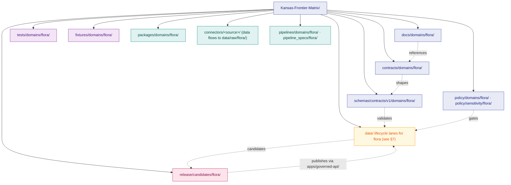

<!-- [KFM_META_BLOCK_V2]
doc_id: kfm://doc/flora-canonical-paths
title: Canonical Paths — Flora Domain
type: standard
version: v1.1
status: draft
owners: [NEEDS VERIFICATION — flora-domain-steward; docs-steward]
created: 2026-05-16
updated: 2026-06-02
policy_label: public
related:
  - docs/doctrine/directory-rules.md
  - docs/doctrine/ai-build-operating-contract.md
  - docs/domains/flora/README.md
  - docs/domains/fauna/CANONICAL_PATHS.md
  - docs/adr/ADR-0001-schema-home.md
  - docs/registers/DRIFT_REGISTER.md
  - docs/registers/VERIFICATION_BACKLOG.md
tags: [kfm, directory-rules, flora, canonical-paths, governance]
notes:
  # All concrete paths PROPOSED until verified against mounted-repo evidence.
  # Lane pattern CONFIRMED by Directory Rules §12 (Domain Placement Law).
  # Rare-plant sensitivity posture CONFIRMED by DOM-FLORA and KFM Encyclopedia §7.6.
  # Schema-home path-segment form is CONFLICTED: Directory Rules §12/§6.4 (domains/<lane>/) vs Atlas §24.13/§24.14 (bare flora/). This doc follows Directory Rules per §2.1 + ADR-0001; routes the Atlas form to DRIFT_REGISTER. See §4.3 and §13 item 16.
  # source_role uses the canonical seven-class enum (Atlas §24.1.1): observed | regulatory | modeled | aggregate | administrative | candidate | synthetic.
  # Doctrine-adjacent doc; CONTRACT_VERSION = "3.0.0" pinned per AI Build Operating Contract v3.0.
[/KFM_META_BLOCK_V2] -->

# Canonical Paths — Flora Domain

> The exhaustive inventory of where the Flora lane is entitled to occupy space across the KFM responsibility roots, with every path explicitly labeled CONFIRMED, PROPOSED, or NEEDS VERIFICATION against current repo evidence.

[](../../doctrine/directory-rules.md)
[](#1-status-and-authority)
[](../../doctrine/directory-rules.md)
[](#5-sensitivity-aware-path-discipline)
[](#7-lifecycle-data-lanes)
[](../../doctrine/ai-build-operating-contract.md)


**Status:** Draft · **Owners:** _NEEDS VERIFICATION (flora-domain-steward + docs-steward; confirm against `CODEOWNERS`)_ · **Last updated:** 2026-06-02 · **`CONTRACT_VERSION = "3.0.0"`**

> [!IMPORTANT]
> The **lane pattern** in this document is CONFIRMED by Directory Rules §12. Every **specific path** quoted below is PROPOSED until verified against current mounted-repo evidence. Do not treat this register as proof of repo state.

---

## Table of Contents

1. [Status and Authority](#1-status-and-authority)
2. [Doctrinal Basis](#2-doctrinal-basis)
3. [Lane Pattern Diagram](#3-lane-pattern-diagram)
4. [Governance and Authority Lanes](#4-governance-and-authority-lanes)
5. [Sensitivity-Aware Path Discipline](#5-sensitivity-aware-path-discipline)
6. [Implementation Lanes](#6-implementation-lanes)
7. [Lifecycle Data Lanes](#7-lifecycle-data-lanes)
8. [Release Lanes](#8-release-lanes)
9. [Validation, Test, and Fixture Lanes](#9-validation-test-and-fixture-lanes)
10. [Connectors and Per-Source Layout](#10-connectors-and-per-source-layout)
11. [Cross-Domain and Multi-Domain Files](#11-cross-domain-and-multi-domain-files)
12. [Anti-Patterns Specific to Flora](#12-anti-patterns-specific-to-flora)
13. [Open Verification Register](#13-open-verification-register)
14. [Changelog and Definition of Done](#14-changelog-and-definition-of-done)
15. [Related Docs](#15-related-docs)
16. [Appendix A — Full Canonical Path Listing](#appendix-a--full-canonical-path-listing)

---

## 1. Status and Authority

| Field | Value |
|---|---|
| **Document type** | Standard — per-domain canonical path register |
| **Authority of the lane pattern** | **CONFIRMED** — Directory Rules §12 applies uniformly to flora. |
| **Authority of specific paths** | **PROPOSED** until verified against current mounted-repo evidence. |
| **Authority order applied** | KFM invariants → accepted ADRs → Directory Rules → per-root README → domain dossiers → repo convention. *(Directory Rules §2.1)* |
| **Schema-home convention** | `schemas/contracts/v1/...` default per **ADR-0001**; path-segment form (`domains/flora/` vs bare `flora/`) is **CONFLICTED** — see §4.3. *(NEEDS VERIFICATION: ADR-0001 file presence.)* |
| **Owners** | Flora domain steward + Docs steward. *(NEEDS VERIFICATION: confirm against `CODEOWNERS`.)* |
| **Conflict handling** | Any repo path conflicting with this register is a drift candidate. Open an entry in `docs/registers/DRIFT_REGISTER.md` — do not silently conform. *(Directory Rules §2.5.)* |
| **`CONTRACT_VERSION`** | `"3.0.0"` (AI Build Operating Contract v3.0). |

> [!NOTE]
> This document is a **per-domain path register**, not a contract, schema, or policy. It does not decide what objects *should* exist (that is `contracts/`, `schemas/`, `policy/`, and ADRs). It decides *where* they go once they do.

[Back to top](#table-of-contents)

---

## 2. Doctrinal Basis

The Flora lane MUST adhere to the **Domain Placement Law** (Directory Rules §12): a domain is **never** a repo-root folder. Flora lives as a **segment inside responsibility roots**, never as `flora/` at the root.

**Confirmed inputs to this register:**

- **CONFIRMED:** The lane pattern applies uniformly to hydrology, soil, fauna, **flora**, habitat, geology, atmosphere, roads-rail-trade, settlements-infrastructure, archaeology, hazards, agriculture, people-dna-land, and any new domain. — Directory Rules §12.
- **CONFIRMED:** Flora ownership and object families — `PlantTaxon`, `SpecimenRecord`, `FloraOccurrence`, `RarePlantRecord`, `VegetationCommunity`, `InvasivePlantRecord`, `PhenologyObservation`, `RangePolygon`, `HabitatAssociation`, `BotanicalSurvey`, `RestorationPlanting`, `RedactionReceipt`, plus `FloraTaxon Crosswalk` — per KFM Encyclopedia §7.6 and Domains Atlas Ch. 8 §C/§E.
- **CONFIRMED:** Sensitivity posture — rare plants, steward-controlled records, exact sensitive occurrence geometry, and culturally sensitive plant knowledge require fail-closed treatment, redaction, generalization, review, or denial. — DOM-FLORA §I / Atlas §20.5 / §24.5.
- **CONFIRMED:** Lifecycle invariant — `RAW → WORK / QUARANTINE → PROCESSED → CATALOG / TRIPLET → PUBLISHED`, with promotion as a **governed state transition**, not a file move. *(Directory Rules §9.1.)*
- **CONFIRMED:** Watcher-as-non-publisher invariant — connectors and watchers emit receipts and candidate decisions only; they MUST NOT publish, mutate canonical records, or bypass review. *(Directory Rules §13.5; §7.3.)*
- **CONFIRMED:** Source role is the canonical **seven-class enum** — `observed | regulatory | modeled | aggregate | administrative | candidate | synthetic` — set at admission, never upgraded by promotion. *(Atlas §24.1.1.)*
- **PROPOSED:** Every concrete path string below is PROPOSED until verified against mounted-repo evidence.

[Back to top](#table-of-contents)

---

## 3. Lane Pattern Diagram

The Flora lane fans across responsibility roots in the canonical pattern. The root stays boring; the lane grows inside.



**Reading the diagram:** every segment is the flora lane *inside* a responsibility root. There is **no** root-level `flora/` folder. Cross-domain files (e.g. a shared geometry validator) live under the **lowest common responsibility root** without a domain segment.

[Back to top](#table-of-contents)

---

## 4. Governance and Authority Lanes

All paths in this section are **PROPOSED**. The **lane pattern** (segment placement under each responsibility root) is **CONFIRMED** by Directory Rules §12.

### 4.1 `docs/domains/flora/` — domain dossier home

| Path | Purpose | Status |
|---|---|---|
| `docs/domains/flora/` | Flora domain landing folder; index + per-topic docs. | PROPOSED |
| `docs/domains/flora/README.md` | Domain dossier landing page (per Directory Rules §15 README contract). | PROPOSED |
| `docs/domains/flora/CANONICAL_PATHS.md` | **This file.** Per-domain canonical path register. | PROPOSED |
| `docs/domains/flora/SENSITIVITY.md` | Flora-specific sensitivity register (rare plants, KNHI restrictions, NatureServe Explorer Pro terms, taxonomy-vs-presence drift). *Optional; may live under `policy/sensitivity/flora/README.md` instead — choose one and document the choice.* | PROPOSED |
| `docs/runbooks/flora/SOURCE_REFRESH_RUNBOOK.md` | Source refresh runbook (mirrors the `docs/runbooks/fauna/` convention; the runbook subfolder-vs-flat-prefix question is an open Directory Rules item — see §13 item 9). | PROPOSED / NEEDS VERIFICATION |
| `docs/runbooks/flora/ROLLBACK_RUNBOOK.md` | Rollback runbook companion. | PROPOSED |

### 4.2 `contracts/domains/flora/` — object-family **meaning** (Markdown)

| Path | Object family | Notes |
|---|---|---|
| `contracts/domains/flora/plant_taxon.md` | `PlantTaxon` | Canonical botanical identity; USDA PLANTS as recommended taxonomic backbone (PROPOSED). |
| `contracts/domains/flora/flora_taxon_crosswalk.md` | `FloraTaxon Crosswalk` | Crosswalk between PLANTS, GBIF backbone, NatureServe, state lists. |
| `contracts/domains/flora/specimen_record.md` | `SpecimenRecord` | Herbaria-sourced vouchered specimen. |
| `contracts/domains/flora/flora_occurrence.md` | `FloraOccurrence` (umbrella) | Abstract base for occurrence-class records. |
| `contracts/domains/flora/occurrence_public.md` | Public-safe occurrence | Generalized / county / grid-binned derivative. |
| `contracts/domains/flora/occurrence_restricted.md` | Internal exact-geometry occurrence | Steward-only access; never the source for `data/published/`. |
| `contracts/domains/flora/rare_plant_record.md` | `RarePlantRecord` | Default-deny public exact geometry; KNHI / NatureServe Explorer Pro provenance. |
| `contracts/domains/flora/vegetation_community.md` | `VegetationCommunity` | Polygonal community classification. |
| `contracts/domains/flora/invasive_plant_record.md` | `InvasivePlantRecord` | EDDMapS-class observations; cross-references fauna for invasive interactions. |
| `contracts/domains/flora/phenology_observation.md` | `PhenologyObservation` | Time-series flowering / leaf-out / senescence. |
| `contracts/domains/flora/range_polygon.md` | `RangePolygon` | Range / distribution polygon (modeled or compiled). |
| `contracts/domains/flora/habitat_association.md` | `HabitatAssociation` | Cross-lane to Habitat; flora owns the association object. |
| `contracts/domains/flora/botanical_survey.md` | `BotanicalSurvey` | Survey episode / completeness metadata. |
| `contracts/domains/flora/restoration_planting.md` | `RestorationPlanting` | Restoration project records. |
| `contracts/domains/flora/redaction_receipt.md` | `RedactionReceipt` | Transform receipt for any redaction / generalization. |

> [!NOTE]
> `contracts/` carries **meaning** (Markdown). Machine validation lives in `schemas/`, admissibility in `policy/`, enforceability proof in `tests/`. *(Directory Rules §6.3.)*

### 4.3 `schemas/contracts/v1/domains/flora/` — machine-checkable **shape**

> [!WARNING]
> **Schema-home path-segment form is CONFLICTED.** This register uses `schemas/contracts/v1/domains/flora/` (the `domains/<lane>/` segment form from Directory Rules §12/§6.4). The Atlas v1.1 §24.13/§24.14 crosswalk records the bare form `schemas/contracts/v1/flora/` (no `domains/` segment). Per Directory Rules **§2.1 authority order** (Directory Rules wins on placement) and **ADR-0001**, this document follows the `domains/flora/` form and treats the Atlas bare form as a standing **`DRIFT_REGISTER`** item (the §12-vs-§24.13 path-segment conflict — see §13 item 16). **NEEDS VERIFICATION:** actual repo layout against ADR-0001.

| Path | Status |
|---|---|
| `schemas/contracts/v1/domains/flora/plant_taxon.schema.json` | PROPOSED |
| `schemas/contracts/v1/domains/flora/flora_taxon_crosswalk.schema.json` | PROPOSED |
| `schemas/contracts/v1/domains/flora/specimen_record.schema.json` | PROPOSED |
| `schemas/contracts/v1/domains/flora/flora_occurrence.schema.json` | PROPOSED |
| `schemas/contracts/v1/domains/flora/occurrence_public.schema.json` | PROPOSED |
| `schemas/contracts/v1/domains/flora/occurrence_restricted.schema.json` | PROPOSED |
| `schemas/contracts/v1/domains/flora/rare_plant_record.schema.json` | PROPOSED |
| `schemas/contracts/v1/domains/flora/vegetation_community.schema.json` | PROPOSED |
| `schemas/contracts/v1/domains/flora/invasive_plant_record.schema.json` | PROPOSED |
| `schemas/contracts/v1/domains/flora/phenology_observation.schema.json` | PROPOSED |
| `schemas/contracts/v1/domains/flora/range_polygon.schema.json` | PROPOSED |
| `schemas/contracts/v1/domains/flora/habitat_association.schema.json` | PROPOSED |
| `schemas/contracts/v1/domains/flora/botanical_survey.schema.json` | PROPOSED |
| `schemas/contracts/v1/domains/flora/restoration_planting.schema.json` | PROPOSED |
| `schemas/contracts/v1/domains/flora/redaction_receipt.schema.json` | PROPOSED *(receipt-class home also subject to ADR-S-03)* |

> [!WARNING]
> **Schema-home rule (ADR-0001 default).** `schemas/contracts/v1/...` is canonical. A schema authored at `contracts/domains/flora/<x>.schema.json` is **lineage / CONFLICTED** under Directory Rules §13.1 and must be migrated. *(NEEDS VERIFICATION: ADR-0001 file presence and exact filename.)*

### 4.4 `policy/` — admissibility and sensitivity

| Path | Purpose | Status |
|---|---|---|
| `policy/domains/flora/` | Flora-scoped admissibility policy (allow / deny / restrict / abstain). | PROPOSED |
| `policy/domains/flora/release_gate.rego` *(or equivalent bundle format)* | Release-gate policy for flora releases. | PROPOSED |
| `policy/domains/flora/promotion_gate.rego` | Promotion-gate policy. | PROPOSED |
| `policy/sensitivity/flora/` | Sensitivity classes and redaction rules specific to flora. | PROPOSED |
| `policy/sensitivity/flora/rare_plant_geoprivacy.md` | Rare-plant geoprivacy doctrine (generalize / suppress / steward-only / delayed). | PROPOSED |
| `policy/sensitivity/flora/plants_join_sensitivity.md` | **Join-induced sensitivity** rules for USDA PLANTS county packages joined with GBIF/iNaturalist/KNHI. | PROPOSED |
| `policy/rights/flora/` | Source-rights enforcement (GBIF licenses, NatureServe Explorer Pro terms, KNHI access, iNaturalist usage limits). | PROPOSED |

> [!IMPORTANT]
> The relationship between `policy/sensitivity/flora/` and `policy/domains/flora/` is **NEEDS VERIFICATION**. They MAY be co-equal sibling registers, or one MAY reference the other. Pick a convention in the per-root README and document it.

[Back to top](#table-of-contents)

---

## 5. Sensitivity-Aware Path Discipline

Flora has **CONFIRMED, doctrine-significant** sensitivity constraints that bend ordinary path discipline. Every placement decision in §6–§8 MUST honor these.

> [!CAUTION]
> **Default-deny for public exact geometry.** Rare plants, steward-controlled records, exact sensitive occurrence geometry, and culturally sensitive plant knowledge **MUST fail closed** unless a documented geoprivacy transform and review state allow release. Disposition routes through the AI Build Operating Contract §23.2 sensitive-domain matrix; this register points to `policy/sensitivity/flora/` and does not restate the geoprivacy parameters. *(DOM-FLORA §I; Atlas §20.5/§24.5; OPCON §23.2.)*

### 5.1 The exact-vs-public split

| Tier | Lane | Path shape | Visibility |
|---|---|---|---|
| **Exact / restricted** | Internal canonical | `data/processed/flora/<dataset_id>/<version>/restricted/` *(PROPOSED — `restricted/` segment convention is a flora/fauna proposal, not yet doctrine.)* | Steward-only behind `apps/governed-api/`; never tiled into `data/published/`. |
| **Public-safe derivative** | Released artifact | `data/published/layers/flora/<layer_id>/...` (PMTiles, GeoParquet, API payloads) | Public, with `RedactionReceipt` attached. |
| **Quarantine** | Failed sensitivity / rights | `data/quarantine/flora/<reason>/<run_id>/` | Held pending steward decision. |

> [!WARNING]
> **Join-induced sensitivity (CONFIRMED doctrine).** USDA PLANTS county packages are individually benign but become sensitive when joined with GBIF, iNaturalist, or KNHI. The **product** is what is sensitive — not just the inputs. Any pipeline producing a join-derived layer MUST route through `policy/sensitivity/flora/plants_join_sensitivity.md` before emission to `data/processed/` or `data/published/`. The cross-lane join policy is ADR-S-14.

### 5.2 The `RedactionReceipt` requirement

Every transform from restricted geometry to public-safe geometry MUST emit a `RedactionReceipt` recording:

- input class (e.g. `exact_point`, `centroid_with_uncertainty`)
- output class (e.g. `generalized_county`, `generalized_huc12`, `suppressed`)
- transform type (`suppress`, `generalize_to_grid`, `generalize_to_county`, `buffer`, `jitter`, `delay_publication`, `steward_only`)
- policy decision reference
- reviewer (where required)
- residual-risk note

`RedactionReceipt` records live under `data/receipts/flora/redaction/` *(PROPOSED — exact path subject to the receipts-class layout ADR-S-03 per the Master Open-ADR Backlog).*

[Back to top](#table-of-contents)

---

## 6. Implementation Lanes

| Root | Lane (PROPOSED) | Purpose |
|---|---|---|
| `packages/` | `packages/domains/flora/` | Flora-specific shared library code (taxonomic resolver, redaction transforms, vegetation-index helpers). Must be **reusable**; one-off steps go to `tools/` or `pipelines/`. *(Directory Rules §7.2.)* |
| `pipelines/` | `pipelines/domains/flora/` | Executable flora pipeline logic (ingest, normalize, validate, catalog, publish, rollback). |
| `pipeline_specs/` | `pipeline_specs/flora/` | Declarative pipeline configuration (what should run; cadence, gates, inputs/outputs). |
| `tools/` | *(no flora-scoped subfolder — validators are typically cross-domain)* | Repo-wide flora-aware validators MUST live under `tools/validators/<topic>/`, not `tools/validators/domains/flora/`. *(Directory Rules §12 — Multi-domain rule.)* |
| `apps/` | *(none — flora is data, not an app)* | The public trust path is `apps/governed-api/`. Flora-specific endpoints surface there, **not** as an `apps/flora/`. |
| `runtime/` | *(none — flora-specific)* | Runtime adapters live behind the governed API and serve all domains. |

> [!NOTE]
> **No `apps/flora/`, no `runtime/flora/`, no `infra/flora/`.** Flora is a domain segment, not a deployable surface. *(Directory Rules §3, root-folder doctrine.)*

[Back to top](#table-of-contents)

---

## 7. Lifecycle Data Lanes

The KFM lifecycle invariant — `RAW → WORK / QUARANTINE → PROCESSED → CATALOG / TRIPLET → PUBLISHED` — is **CONFIRMED**. The specific path strings remain **PROPOSED** until verified.

| Phase | Canonical lane (PROPOSED) | Allowed | MUST NOT |
|---|---|---|---|
| RAW | `data/raw/flora/<source_id>/<run_id>/` | Immutable source-edge capture with `SourceDescriptor`, retrieval metadata, checksums | Public clients, AI context, UI layers, normalized records |
| WORK | `data/work/flora/<run_id>/` | Normalized intermediates, candidate assertions | Public API/UI, release aliases |
| QUARANTINE | `data/quarantine/flora/<reason>/<run_id>/` | Failed validation, unresolved rights, sensitivity holdouts, **over-precise geometry**, schema drift | Promotion candidates without remediation |
| PROCESSED | `data/processed/flora/<dataset_id>/<version>/` | Validated canonical records (split into `restricted/` and `public_safe/` subtrees — PROPOSED) | Assumption of release status |
| CATALOG | `data/catalog/domain/flora/` · `data/catalog/stac/flora/` · `data/catalog/dcat/flora/` · `data/catalog/prov/flora/` | STAC / DCAT / PROV records and domain catalog entries | Uncited claims, unclosed identifiers |
| TRIPLET | `data/triplets/graph_deltas/flora/` · `data/triplets/exports/flora/` | Graph projections / triple exports built from CATALOG | Canonical replacement semantics |
| PUBLISHED | `data/published/layers/flora/<layer_id>/` · `data/published/pmtiles/flora/` · `data/published/geoparquet/flora/` · `data/published/api_payloads/flora/` | Released public-safe artifacts (PMTiles, GeoParquet, API payloads, reports, stories) | Raw, work, quarantine, exact restricted geometry |
| RECEIPTS | `data/receipts/ingest/flora/` · `data/receipts/validation/flora/` · `data/receipts/pipeline/flora/` · `data/receipts/ai/flora/` · `data/receipts/release/flora/` · `data/receipts/redaction/flora/` *(PROPOSED — redaction class subject to ADR-S-03)* | Process memory by class | Standalone proof of release |
| PROOFS | `data/proofs/evidence_bundle/flora/` · `data/proofs/proof_pack/flora/` · `data/proofs/validation_report/flora/` · `data/proofs/citation_validation/flora/` | `EvidenceBundle`, `ProofPack`, integrity bundles | Process-only receipts |
| ROLLBACK | `data/rollback/flora/<release_id>/` | Rollback cards and alias-revert receipts (data plane) | Deleting prior meanings |
| REGISTRY | `data/registry/sources/flora/` · `data/registry/datasets/flora/` · `data/registry/layers/flora/` · `data/registry/sensitivity/flora/` · `data/registry/rights/flora/` *(depth choice is **NEEDS VERIFICATION**: `…/sources/flora/` vs `…/flora/sources/` is unresolved)* | Append-only registry records | Canonical domain truth |

> [!IMPORTANT]
> **Promotion is a governed state transition, not a file move.** A `git mv` from `data/raw/flora/` to `data/processed/flora/` that bypasses validators, policy gates, evidence-bundle creation, catalog closure, and release-decision recording **violates the invariant** regardless of which directory the bytes ended up in. *(Directory Rules §9.1.)*

[Back to top](#table-of-contents)

---

## 8. Release Lanes

Release **decisions** live in `release/`. Released **artifacts** live in `data/published/`. The split is **CONFIRMED** doctrine; mixing them is one of the four core drift patterns (Directory Rules §13.2).

| Path (PROPOSED) | Owns |
|---|---|
| `release/candidates/flora/` | Flora release candidate dossiers (per `release_id`) |
| `release/manifests/` *(no flora segment)* | `ReleaseManifest` files, addressed by `release_id` and referencing flora layers by manifest content |
| `release/promotion_decisions/` *(no flora segment)* | `PromotionDecision` records |
| `release/rollback_cards/` *(no flora segment)* | Rollback decisions (decision-plane companion to `data/rollback/flora/`) |
| `release/correction_notices/` *(no flora segment)* | Public correction notices |
| `release/withdrawal_notices/` *(no flora segment)* | Withdrawal records |
| `release/signatures/` *(no flora segment)* | DSSE / Sigstore artifacts |

> [!NOTE]
> Release **manifests, promotion decisions, rollback cards, and correction notices** are **shared-kernel** objects — they live in a single home keyed by `release_id`, not per-domain. Only `release/candidates/flora/` is domain-segmented because a candidate dossier is genuinely flora-scoped.

[Back to top](#table-of-contents)

---

## 9. Validation, Test, and Fixture Lanes

| Path (PROPOSED) | Purpose |
|---|---|
| `tests/domains/flora/` | Flora-scoped tests: schema validity, source-role mismatch denial, taxonomy reconciliation, exact-geometry deny tests, redaction-receipt closure, evidence-bundle closure, release-manifest validation, no-network fixtures, non-regression. |
| `tests/domains/flora/contracts/` | Contract-meaning tests. |
| `tests/domains/flora/schemas/` | Schema validity tests (valid / invalid fixtures). |
| `tests/domains/flora/policy/` | Policy gate tests (DENY / RESTRICT / ABSTAIN paths). |
| `tests/domains/flora/runtime_proof/` | Finite-outcome and abstain proof tests for flora endpoints. |
| `fixtures/domains/flora/` | Golden / valid / invalid / synthetic flora fixtures. *(Alternative home: `tests/fixtures/domains/flora/` if the repo chose `tests/fixtures/` as canonical — see Directory Rules §6.6.)* |
| `fixtures/domains/flora/valid/` | Public-safe specimen + occurrence + vegetation community fixtures (matches the **CONFIRMED** thin-slice plan: one species occurrence + one vegetation community polygon). |
| `fixtures/domains/flora/invalid/` | Negative fixtures: over-precise rare-plant geometry, missing taxonomic resolution, sensitive-join leakage, source-role mismatch. |
| `fixtures/domains/flora/synthetic/` | Synthetic (non-live-source) fixtures for the schema/fixture/validator-first first slice. |

> [!CAUTION]
> The flora first-slice rule is **CONFIRMED**: the first slice is schema/fixture/validator-first and uses public-safe flora fixtures before any live source activation. No live connector to GBIF, iNaturalist, NatureServe, USFWS ECOS, or KNHI is activated before the synthetic-fixture proof lands.

[Back to top](#table-of-contents)

---

## 10. Connectors and Per-Source Layout

Connectors fetch from external sources and emit **only** to `data/raw/flora/<source_id>/<run_id>/` or `data/quarantine/flora/...`. They MUST NOT publish, mutate canonical truth, or write under `data/processed/`, `data/catalog/`, or `data/published/`. *(Directory Rules §7.3, §13.5.)*

> [!IMPORTANT]
> Whether `connectors/` uses a per-domain segment (`connectors/flora/<source>/`) or a flat per-source layout (`connectors/<source>/`) is **NEEDS VERIFICATION**. Directory Rules §7.3 shows the flat shape; the per-domain segment is **PROPOSED** for flora and fauna where the same source feeds multiple domains under different roles.

| Source family | CONFIRMED source basis | Canonical role(s) (Atlas §24.1.1) | Connector path (PROPOSED) | Sensitivity notes |
|---|---|---|---|---|
| USDA PLANTS (taxonomic backbone) | KFM Encyclopedia §7.6 | `aggregate` / taxonomy anchor | `connectors/usda_plants/` | Taxonomy authority; benign in isolation, **sensitive when joined** (PLANTS join rule). |
| GBIF (occurrence aggregator) | KFM Encyclopedia §7.6 | `observed` (re-served) | `connectors/gbif/` | Licenses, sensitive records, and uncertainty vary by record. |
| iNaturalist | KFM Encyclopedia §7.6 | `observed` (citizen science) | `connectors/inaturalist/` | Usage limits and geoprivacy apply. Not authoritative for legal status. |
| NatureServe Explorer / Explorer Pro | KFM Encyclopedia §7.6 | `regulatory`/`aggregate` (ranks) | `connectors/natureserve/` | Explorer Pro is access-controlled; rare-species precise data requires an account. |
| USFWS ECOS | KFM Encyclopedia §7.6 | `regulatory` (listing) | `connectors/usfws_ecos/` | Threatened/endangered status; public sensitivity policy still required. |
| iDigBio | Domains Atlas Ch. 8 | `observed` (specimen) | `connectors/idigbio/` | Specimen records; license per record. |
| Kansas Biological Survey / KU Herbarium / KNHI | Domains Atlas Ch. 8 | `observed` / steward-controlled | `connectors/kbs/` *(or `connectors/ku_herbarium/`)* | **KNHI rare-plant locations are restricted**; must be redacted/generalized before any publication. |
| KDWP (state listed species) | Domains Atlas Ch. 8 | `regulatory` (status) | `connectors/kdwp/` | State sensitivity rules; coordination with fauna connector likely needed. |
| KDWP Ecological Review Tool | Domains Atlas Ch. 8 | `administrative` / stewardship | `connectors/kdwp_ert/` | Stewardship outputs; rights NEEDS VERIFICATION. |
| EDDMapS (invasives) | Adjacent to fauna; flora invasives | `observed` | `connectors/eddmaps/` | Cross-cuts with fauna; route product through both domains as appropriate. |
| Remote-sensing vegetation indices (NDVI, EVI, MODIS-derived) | KFM Encyclopedia §7.6 | `modeled` / derived | `connectors/<rs_index>/` | Modeled / derived; source-role label `modeled`. |
| Restoration project records | KFM Encyclopedia §7.6 | `administrative` | `connectors/restoration_<program>/` | Rights per program. |

Per-source content shape (CONFIRMED layout per Directory Rules §7.3):

```text
connectors/<source>/
├── README.md                # source descriptor reference; rights; sensitivity; freshness
├── fetch.py                 # or equivalent connector entry (PROPOSED filename)
├── source_descriptor.yaml   # source identity; role; rights; sensitivity; citation
└── tests/                   # synthetic-fixture pipeline; no-live-network
```

[Back to top](#table-of-contents)

---

## 11. Cross-Domain and Multi-Domain Files

When a file legitimately spans flora and another domain, it MUST live under the **lowest common responsibility root** *without* a domain segment. *(Directory Rules §12.)*

| Concern | Wrong placement | Correct placement |
|---|---|---|
| Habitat × Flora vegetation-community validator | `tools/validators/domains/flora/...` (pick-one violation) | `tools/validators/vegetation_community/...` |
| Flora × Fauna pollinator-relation schema | `schemas/contracts/v1/domains/flora/pollinator_*.schema.json` | `schemas/contracts/v1/relations/pollinator/...` (or under a `cross_lane/` topic) |
| Flora × Agriculture invasive-crop overlap | `docs/domains/flora/agriculture_overlap.md` | `docs/architecture/cross-domain-invasives.md` |
| Flora × Habitat × Hydrology riparian-vegetation logic | `pipelines/domains/flora/riparian/...` | `pipelines/cross_lane/riparian_vegetation/...` *(topic name PROPOSED)* |

[Back to top](#table-of-contents)

---

## 12. Anti-Patterns Specific to Flora

These extend Directory Rules §13 with flora-specific concerns observed in the corpus.

| Anti-pattern | Symptom | Fix |
|---|---|---|
| **Domain-root flora** | `flora/` at the repo root with its own `data/`, `schemas/`, `policy/`, `docs/` subtree | Apply Domain Placement Law (§12). Distribute into lanes. *(Directory Rules §13.4.)* |
| **Public exact rare-plant tile** | Rare plant occurrence published in `data/published/layers/flora/...` without `RedactionReceipt` | Move to quarantine; emit transform; re-route through `policy/sensitivity/flora/`. |
| **Join-induced leak** | PLANTS county package joined to GBIF/KNHI emitted to `data/published/...` without join-sensitivity check | Route through `policy/sensitivity/flora/plants_join_sensitivity.md`; treat the **product** as sensitive. |
| **Taxonomy drift mistaken for presence drift** | A PLANTS county package "addition" reflects a name change, not a real new occurrence | Track taxonomy version drift separately from package drift; require a stable taxonomy version before computing drift candidates. |
| **Connector publishes** | A connector writes to `data/processed/flora/` or `data/published/layers/flora/` | Connectors emit to `data/raw/flora/` or `data/quarantine/flora/`. Pipelines promote. *(Directory Rules §13.5.)* |
| **Watcher publishes** | A watcher writes to `data/catalog/domain/flora/` or `data/published/layers/flora/` | Watcher-as-non-publisher. Watchers emit receipts and candidate decisions only. |
| **Schema mirror divergence** | `contracts/domains/flora/*.schema.json` and `schemas/contracts/v1/domains/flora/*.schema.json` both exist and diverge | Per ADR-0001, `schemas/contracts/v1/...` is canonical. Migrate; freeze old paths to mirror. |
| **`restricted/` next to canonical** | Exact-geometry records in `data/published/...` under a `restricted/` subfolder ("hidden" public layer) | `restricted/` belongs under `data/processed/flora/<dataset>/<version>/restricted/`, **never** under `data/published/`. |
| **Direct UI read of canonical** | `apps/explorer-web/` reads `data/processed/flora/` directly | Route through `apps/governed-api/`. Trust membrane. |

[Back to top](#table-of-contents)

---

## 13. Open Verification Register

These items SHOULD be tracked in `docs/registers/VERIFICATION_BACKLOG.md` and resolved via ADR or per-root README. The register here mirrors and extends the parallel fauna register.

<details>
<summary><strong>Click to expand the open-verification register</strong></summary>

| # | Item | Class | Resolves via |
|---|---|---|---|
| 1 | Live presence of every path in this document (per-root `ls`-equivalent inspection) | NEEDS VERIFICATION | Mounted-repo inspection |
| 2 | Whether `connectors/` uses a per-domain segment at all | NEEDS VERIFICATION | Per-root README or ADR |
| 3 | `triplets/` (plural) vs `triplet/` (singular) | OPEN | One-line ADR (Directory Rules §18) |
| 4 | Depth choice: `data/registry/sources/flora/` vs `data/registry/flora/sources/` | NEEDS VERIFICATION | Per-root README or ADR |
| 5 | Receipts / proofs class taxonomy in the live repo (especially `data/receipts/redaction/`) | NEEDS VERIFICATION | ADR-S-03 (Receipt class home) per Master Open-ADR Backlog |
| 6 | Whether `policy/sensitivity/flora/` and `policy/domains/flora/` are co-equal or one references the other | NEEDS VERIFICATION | Per-root README |
| 7 | ADR-0001 file presence and exact filename | NEEDS VERIFICATION | Mounted-repo inspection |
| 8 | Flora domain README filename and KFM-Meta-Block-v2 convention | NEEDS VERIFICATION | Mounted-repo inspection |
| 9 | `docs/runbooks/flora/` subfolder convention (vs flat-prefix) | OPEN | Local README or ADR (parallel to fauna runbook flag) |
| 10 | Whether flora-scoped ADRs live flat under `docs/adr/` or nested under `docs/domains/flora/adr/` | OPEN | ADR or Docs-steward decision *(see flora/adr/README placement finding)* |
| 11 | The `restricted/` subfolder convention within `data/processed/flora/<dataset>/<version>/` | OPEN | ADR or per-root README |
| 12 | Whether `RedactionReceipt` belongs under `data/receipts/redaction/flora/` or a shared-kernel home | OPEN | ADR-S-03 |
| 13 | Cross-domain placement of invasive-plant content (flora-owned vs habitat / fauna shared) | OPEN | Cross-domain doctrine doc; ADR-S-14 |
| 14 | Whether `data/published/layers/flora/...` follows `<layer_id>/` or `<layer_id>/<version>/` shape | NEEDS VERIFICATION | LayerManifest convention |
| 15 | Status of USDA PLANTS as the canonical taxonomic backbone vs GBIF backbone | OPEN | Source-authority register entry |
| 16 | **Schema-home path-segment form:** `schemas/contracts/v1/domains/flora/` (Directory Rules §12/§6.4) vs `schemas/contracts/v1/flora/` (Atlas §24.13/§24.14) | CONFLICTED | DRIFT_REGISTER + ADR-0001 reconciliation |

</details>

[Back to top](#table-of-contents)

---

## 14. Changelog and Definition of Done

### 14.1 Changelog v1 → v1.1

| Change | Type (per contract §37) | Reason |
|---|---|---|
| Pinned `CONTRACT_VERSION = "3.0.0"` (badge, status row, §1, footer, meta block) | housekeeping | Doctrine-adjacent doc requirement |
| Named the schema-home path-segment conflict explicitly (§4.3, §13 item 16): Directory Rules §12/§6.4 `domains/flora/` vs Atlas §24.13/§24.14 bare `flora/` | reconciliation | The `domains/` form was presented as uncontested; the Atlas crosswalk uses the bare form — a standing CONFLICTED DRIFT item |
| Added the canonical seven-class `source_role` enum to §2 and a role column to the §10 connector table | clarification | Atlas §24.1.1; consistency with the Fauna/Flora source docs |
| Numbered §1 "Status and Authority" and aligned TOC anchors; fixed the badge link to `#1-status-and-authority` | housekeeping | TOC/anchor consistency |
| Quoted Mermaid node labels containing `/`, `&lt;`, `()`, `·` and replaced multi-line `<br/>` node bodies with single quoted labels | bugfix | Mermaid parse-safety (unquoted special chars can fail GitHub render) |
| Corrected stale doctrine anchors (`§7.1`→`§13.5`/`§7.3` for watcher; `§§11–12`/`§30.5`→`§I`/`§20.5`/`§24.5` for sensitivity) and removed unverifiable corpus-line citations (`KFM-IDX-POL-005`, "New Ideas 5-15") in favor of doctrine sections | reconciliation | Tighten to verifiable doctrine anchors |
| Routed sensitivity disposition through OPCON §23.2; tied join-sensitivity to ADR-S-14 | clarification | Sensitive-domain handling consistency |
| Converted meta-block `notes:` to `#` inline-annotation form | housekeeping | KFM Meta Block v2 rendering rule |
| Added Changelog + Definition of Done; bumped v1 → v1.1; updated date | housekeeping | Doctrine-doc companion-section pattern; MINOR bump |

> **Backward compatibility.** Section anchors §2–§13 are unchanged; §1 gained a number (its badge link updated). §14 (Changelog/DoD) was inserted before the former §14 Related Docs (now §15) and Appendix A (now item 16 in the TOC). Inbound links to `#14-related-docs` should be re-pointed to `#15-related-docs`. No path string, table row, or anti-pattern was removed.

### 14.2 Definition of done

This register is done enough to enter the repository when:

- it is placed at `docs/domains/flora/CANONICAL_PATHS.md` per Directory Rules §6.1 + §12;
- a flora domain steward and a docs steward review it;
- it is linked from `docs/domains/flora/README.md`;
- the schema-home path-segment conflict (§4.3, §13 item 16) is logged in `docs/registers/DRIFT_REGISTER.md`;
- it does not conflict with accepted ADRs (ADR-0001 schema home; ADR-S-03 receipt home; ADR-S-14 cross-lane joins);
- the `GENERATED_RECEIPT.json` planned for this artifact is wired into CI;
- future changes follow the operating contract's §37 lifecycle.

[Back to top](#table-of-contents)

---

## 15. Related Docs

- [`docs/doctrine/directory-rules.md`](../../doctrine/directory-rules.md) — Governing placement doctrine. **CONFIRMED authority.**
- [`docs/doctrine/ai-build-operating-contract.md`](../../doctrine/ai-build-operating-contract.md) — Operating contract; §23.2 sensitive-domain matrix; `CONTRACT_VERSION = "3.0.0"`.
- [`docs/domains/flora/README.md`](./README.md) — Flora domain dossier landing. *(PROPOSED target.)*
- [`docs/domains/fauna/CANONICAL_PATHS.md`](../fauna/CANONICAL_PATHS.md) — Parallel canonical-paths register for the fauna domain.
- [`docs/runbooks/flora/SOURCE_REFRESH_RUNBOOK.md`](../../runbooks/flora/SOURCE_REFRESH_RUNBOOK.md) — Flora source refresh runbook. *(PROPOSED target.)*
- [`docs/runbooks/flora/ROLLBACK_RUNBOOK.md`](../../runbooks/flora/ROLLBACK_RUNBOOK.md) — Flora rollback runbook. *(PROPOSED target.)*
- [`docs/adr/ADR-0001-schema-home.md`](../../adr/ADR-0001-schema-home.md) — Schema-home rule fixing `schemas/contracts/v1/...` as canonical. **NEEDS VERIFICATION.**
- [`docs/registers/VERIFICATION_BACKLOG.md`](../../registers/VERIFICATION_BACKLOG.md) — Cross-repo verification register.
- [`docs/registers/DRIFT_REGISTER.md`](../../registers/DRIFT_REGISTER.md) — Cross-repo drift register (schema-home conflict logged here).
- [`contracts/domains/flora/`](../../../contracts/domains/flora/) — Flora object-family meaning. *(PROPOSED target.)*
- [`schemas/contracts/v1/domains/flora/`](../../../schemas/contracts/v1/domains/flora/) — Flora machine shape. *(PROPOSED target.)*
- [`policy/sensitivity/flora/`](../../../policy/sensitivity/flora/) — Flora sensitivity classes and redaction rules. *(PROPOSED target.)*

[Back to top](#table-of-contents)

---

## Appendix A — Full Canonical Path Listing

The full canonical path inventory for the Flora lane, expanded. Use this as a copy-paste reference when scaffolding the lane. **All paths are PROPOSED until verified against the live repo**, and the schema-home segment form is **CONFLICTED** (see §4.3).

<details>
<summary><strong>Click to expand the full Flora lane path listing</strong></summary>

```text
# Governance and authority lanes
docs/domains/flora/
docs/domains/flora/README.md
docs/domains/flora/CANONICAL_PATHS.md          # this file
docs/domains/flora/SENSITIVITY.md              # optional flora-scoped sensitivity doc
docs/runbooks/flora/                           # runbook subfolder (parallel to fauna; OPEN §13.9)
docs/runbooks/flora/SOURCE_REFRESH_RUNBOOK.md
docs/runbooks/flora/ROLLBACK_RUNBOOK.md

contracts/domains/flora/
contracts/domains/flora/plant_taxon.md
contracts/domains/flora/flora_taxon_crosswalk.md
contracts/domains/flora/specimen_record.md
contracts/domains/flora/flora_occurrence.md
contracts/domains/flora/occurrence_public.md
contracts/domains/flora/occurrence_restricted.md
contracts/domains/flora/rare_plant_record.md
contracts/domains/flora/vegetation_community.md
contracts/domains/flora/invasive_plant_record.md
contracts/domains/flora/phenology_observation.md
contracts/domains/flora/range_polygon.md
contracts/domains/flora/habitat_association.md
contracts/domains/flora/botanical_survey.md
contracts/domains/flora/restoration_planting.md
contracts/domains/flora/redaction_receipt.md

# Schema home — domains/flora/ form (Directory Rules §12/§6.4).
# CONFLICTED with Atlas §24.13/§24.14 bare flora/ form — see §4.3 and §13.16.
schemas/contracts/v1/domains/flora/
schemas/contracts/v1/domains/flora/plant_taxon.schema.json
schemas/contracts/v1/domains/flora/flora_taxon_crosswalk.schema.json
schemas/contracts/v1/domains/flora/specimen_record.schema.json
schemas/contracts/v1/domains/flora/flora_occurrence.schema.json
schemas/contracts/v1/domains/flora/occurrence_public.schema.json
schemas/contracts/v1/domains/flora/occurrence_restricted.schema.json
schemas/contracts/v1/domains/flora/rare_plant_record.schema.json
schemas/contracts/v1/domains/flora/vegetation_community.schema.json
schemas/contracts/v1/domains/flora/invasive_plant_record.schema.json
schemas/contracts/v1/domains/flora/phenology_observation.schema.json
schemas/contracts/v1/domains/flora/range_polygon.schema.json
schemas/contracts/v1/domains/flora/habitat_association.schema.json
schemas/contracts/v1/domains/flora/botanical_survey.schema.json
schemas/contracts/v1/domains/flora/restoration_planting.schema.json
schemas/contracts/v1/domains/flora/redaction_receipt.schema.json

# Policy lanes
policy/domains/flora/
policy/domains/flora/release_gate.rego         # or equivalent bundle format
policy/domains/flora/promotion_gate.rego
policy/sensitivity/flora/
policy/sensitivity/flora/rare_plant_geoprivacy.md
policy/sensitivity/flora/plants_join_sensitivity.md
policy/rights/flora/
policy/rights/flora/gbif_license.md
policy/rights/flora/natureserve_explorer_pro.md
policy/rights/flora/knhi_access.md
policy/rights/flora/inaturalist_usage.md

# Test and fixture lanes
tests/domains/flora/
tests/domains/flora/contracts/
tests/domains/flora/schemas/
tests/domains/flora/policy/
tests/domains/flora/runtime_proof/
fixtures/domains/flora/
fixtures/domains/flora/valid/
fixtures/domains/flora/invalid/
fixtures/domains/flora/synthetic/
fixtures/domains/flora/golden/

# Implementation lanes
packages/domains/flora/
pipelines/domains/flora/
pipeline_specs/flora/

# Connector lanes (per-source; per-domain segment NEEDS VERIFICATION)
connectors/usda_plants/
connectors/gbif/
connectors/inaturalist/
connectors/natureserve/
connectors/usfws_ecos/
connectors/idigbio/
connectors/kbs/
connectors/kdwp/
connectors/kdwp_ert/
connectors/eddmaps/
# additional remote-sensing and restoration-program connectors as needed

# Data lifecycle lanes
data/raw/flora/<source_id>/<run_id>/
data/work/flora/<run_id>/
data/quarantine/flora/<reason>/<run_id>/
data/processed/flora/<dataset_id>/<version>/
data/processed/flora/<dataset_id>/<version>/restricted/         # exact / steward-only
data/processed/flora/<dataset_id>/<version>/public_safe/        # public-safe derivatives
data/catalog/domain/flora/
data/catalog/stac/flora/
data/catalog/dcat/flora/
data/catalog/prov/flora/
data/triplets/graph_deltas/flora/
data/triplets/exports/flora/
data/receipts/ingest/flora/
data/receipts/validation/flora/
data/receipts/pipeline/flora/
data/receipts/ai/flora/
data/receipts/release/flora/
data/receipts/redaction/flora/                                 # PROPOSED — class layout ADR-S-03
data/proofs/evidence_bundle/flora/
data/proofs/proof_pack/flora/
data/proofs/validation_report/flora/
data/proofs/citation_validation/flora/
data/published/layers/flora/<layer_id>/
data/published/pmtiles/flora/
data/published/geoparquet/flora/
data/published/api_payloads/flora/
data/rollback/flora/<release_id>/
data/registry/sources/flora/
data/registry/datasets/flora/
data/registry/layers/flora/
data/registry/sensitivity/flora/
data/registry/rights/flora/

# Release lanes
release/candidates/flora/
# release/manifests/, release/promotion_decisions/, release/rollback_cards/,
# release/correction_notices/, release/withdrawal_notices/, release/signatures/
# are SHARED-KERNEL (no flora segment); keyed by release_id.
```

</details>

[Back to top](#table-of-contents)

---

> [!NOTE]
> **A note on placeholders.** Every `TODO`, `NEEDS VERIFICATION`, `OPEN`, `CONFLICTED`, and `PROPOSED` marker in this document is intentional. Per Directory Rules §0, the lane *pattern* is CONFIRMED while any *specific path* remains PROPOSED until verified against current mounted-repo evidence. Resolve placeholders by inspection or ADR — do not silently promote them to fact.

---

**Related docs:** [Directory Rules](../../doctrine/directory-rules.md) · [AI Build Operating Contract](../../doctrine/ai-build-operating-contract.md) · [Flora README](./README.md) *(PROPOSED)* · [Fauna CANONICAL_PATHS](../fauna/CANONICAL_PATHS.md) · [VERIFICATION_BACKLOG](../../registers/VERIFICATION_BACKLOG.md) · [DRIFT_REGISTER](../../registers/DRIFT_REGISTER.md)

**Last updated:** 2026-06-02 · **Version:** v1.1 (draft) · **`CONTRACT_VERSION = "3.0.0"`** · [Back to top](#table-of-contents)
