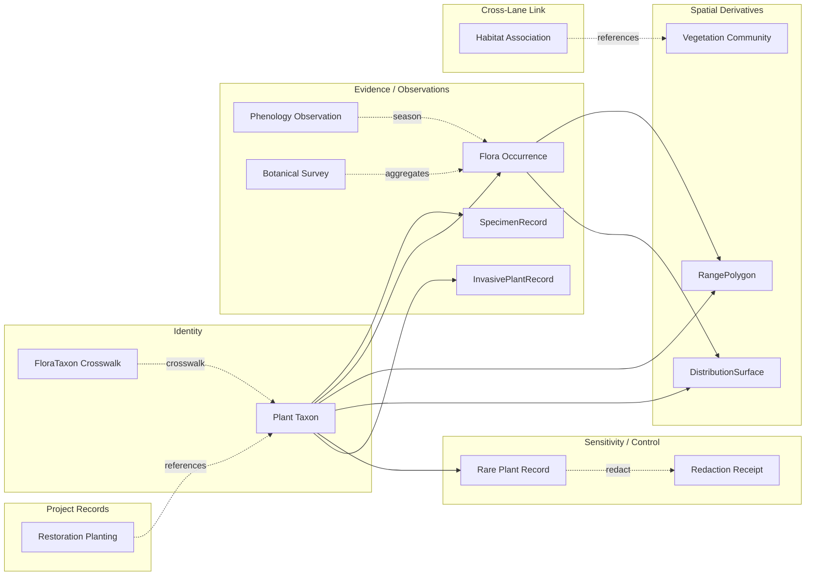
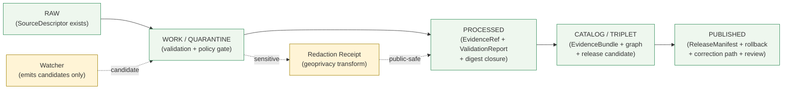

<!-- [KFM_META_BLOCK_V2]
doc_id: kfm://doc/flora-continuity-inventory
title: Flora Domain — Continuity Inventory
type: standard
version: v1.1
status: draft
owners: <flora-domain-steward> (PLACEHOLDER), <docs-steward> (PLACEHOLDER)
created: 2026-05-16
updated: 2026-06-03
policy_label: public
contract_version: 3.0.0
related: [
  "docs/doctrine/directory-rules.md",
  "ai-build-operating-contract.md",
  "docs/domains/README.md",
  "docs/domains/flora/README.md",
  "docs/domains/fauna/CONTINUITY_INVENTORY.md",
  "docs/runbooks/fauna/SOURCE_REFRESH_RUNBOOK.md",
  "docs/sources/SOURCE_DESCRIPTOR_STANDARD.md",
  "docs/standards/PROV.md",
  "docs/registers/VERIFICATION_BACKLOG.md",
  "docs/registers/DRIFT_REGISTER.md"
]
tags: [kfm, domain, flora, continuity, lineage, doctrine]
notes: [
  "CONTRACT_VERSION pinned to 3.0.0 per ai-build-operating-contract.md.",
  "Prior gains carried forward as doctrine, lineage, or proposed design pressure — never as mounted repo implementation without proof.",
  "All non-directory-rules.md repo paths are PROPOSED / NEEDS VERIFICATION until checked against a mounted KFM repo.",
  "v1.1 surfaces the Directory Rules §12 vs Atlas §24.13 path-segment-form conflict as CONFLICTED (DR-FLORA-PATH-01); adds doctrine companion sections.",
  "Companion of docs/domains/fauna/CONTINUITY_INVENTORY.md; the two should evolve in lockstep where lanes intersect."
]
[/KFM_META_BLOCK_V2] -->

# Flora Domain — Continuity Inventory

> Carry-forward register for KFM's Flora lane. Records what prior work earned, how each gain is reclassified for next work, and where each claim still needs repo evidence before it counts as implementation.


| | |
|---|---|
| **Status** | draft |
| **Owners** | `<flora-domain-steward>` (PLACEHOLDER), `<docs-steward>` (PLACEHOLDER) |
| **Last updated** | 2026-06-03 |
| **Contract** | `CONTRACT_VERSION = "3.0.0"` (`ai-build-operating-contract.md`) |
| **Authority** | KFM doctrine; `docs/doctrine/directory-rules.md` (v1.3); flora lineage corpus (DOM-FLORA, ENCY §7.6, UNIFIED §6.5, ATLAS §8, Pass 18 → Pass 20) |
| **Companion** | `docs/domains/fauna/CONTINUITY_INVENTORY.md` (parallel lane) — PROPOSED |

> [!IMPORTANT]
> **Continuity ≠ implementation.** Items appearing in this inventory are carried forward as **doctrine**, **lineage**, or **proposed design pressure**. None are represented as mounted repo implementation without independently checked evidence. Every implementation-shaped claim is labeled `CONFIRMED`, `PROPOSED`, `NEEDS VERIFICATION`, `UNKNOWN`, or `CONFLICTED` per KFM truth posture.

---

## Contents

1. [Purpose & scope](#1-purpose--scope)
2. [Continuity determination](#2-continuity-determination)
3. [Authority order](#3-authority-order)
4. [How to read this inventory](#4-how-to-read-this-inventory)
5. [Prior gains — continuity classification table](#5-prior-gains--continuity-classification-table)
6. [Mission and boundary carry-forward](#6-mission-and-boundary-carry-forward)
7. [Ubiquitous-language carry-forward](#7-ubiquitous-language-carry-forward)
8. [Object-family carry-forward](#8-object-family-carry-forward)
9. [Source-family carry-forward](#9-source-family-carry-forward)
10. [Sensitivity-posture carry-forward](#10-sensitivity-posture-carry-forward)
11. [Pipeline-shape carry-forward](#11-pipeline-shape-carry-forward)
12. [Map and viewing-product carry-forward](#12-map-and-viewing-product-carry-forward)
13. [Cross-lane relations carry-forward](#13-cross-lane-relations-carry-forward)
14. [API, contract, schema-surface carry-forward](#14-api-contract-schema-surface-carry-forward)
15. [Governed-AI / Focus-Mode carry-forward](#15-governed-ai--focus-mode-carry-forward)
16. [Validators, tests, fixtures carry-forward](#16-validators-tests-fixtures-carry-forward)
17. [Publication / correction / rollback carry-forward](#17-publication--correction--rollback-carry-forward)
18. [PLANTS watcher — operational expansion pressure](#18-plants-watcher--operational-expansion-pressure)
19. [File-home and placement notes](#19-file-home-and-placement-notes)
20. [Flora-specific verification backlog](#20-flora-specific-verification-backlog)
21. [Update-propagation matrix](#21-update-propagation-matrix)
22. [Open questions register](#22-open-questions-register)
23. [Changelog](#23-changelog)
24. [Definition of done](#24-definition-of-done)
25. [Related docs](#25-related-docs)

---

## 1. Purpose & scope

This file is the **continuity register** for the Flora lane. Its job is narrow:

- **Preserve** what prior KFM flora work (blueprints, dossiers, encyclopedias, atlases, pass dossiers, ideas packets) earned that should not be silently re-derived.
- **Classify** each prior gain with one of: `KEEP AND EXTEND`, `WRAP WITH ADAPTER`, `KEEP AS LINEAGE`, `DEFER`, `RETIRE — superseded`.
- **Pin** each carried-forward item to its **evidence basis** in the indexed corpus.
- **State the preserved-next-behavior** that downstream PRs, ADRs, schemas, and runbooks should honor.
- **Surface** what cannot yet be claimed as implemented and should be entered on the [verification backlog](#20-flora-specific-verification-backlog).

This file is **not**:

- A flora architecture overview (see the proposed `docs/domains/flora/README.md`).
- An object-family contract (see proposed `contracts/domains/flora/`).
- A source-refresh runbook (see proposed `docs/runbooks/flora/SOURCE_REFRESH_RUNBOOK.md`, parallel to the Fauna runbook).
- An ADR record (see `docs/adr/`).

> [!NOTE]
> **Companion document.** This inventory is the flora parallel of `docs/domains/fauna/CONTINUITY_INVENTORY.md`. The two lanes share many gains (deny-by-default exact-location posture, RedactionReceipt, watcher-as-non-publisher, taxonomy-reconciliation discipline) and should evolve in lockstep where they intersect — particularly on cross-lane joins (Flora × Fauna pollinator and food-web; Flora × Habitat vegetation community).

[Back to top ↑](#contents)

---

## 2. Continuity determination

The doctrinal carry-forward principle for KFM expansions is fixed:

> **Prior gains are not discarded. They are carried forward as doctrine, lineage, or proposed design pressure. None are represented as mounted implementation without repo evidence.**
> — adapted from the Whole-UI + Governed AI Expansion Report §6 "Prior gains and continuity inventory"

For the Flora lane specifically:

- **CONFIRMED doctrine.** Flora governs plant taxonomic identity, flora occurrences, specimens, surveys, vegetation communities, rare / protected / culturally sensitive flora controls, public-safe surfaces, evidence-backed maps, correction, and rollback. [DOM-FLORA] [ENCY §7.6] [ATLAS §8.A]
- **CONFIRMED invariant.** Rare, protected, culturally sensitive, and steward-reviewed flora default to generalized, withheld, staged, or denied public geometry. [DOM-FLORA] [ENCY §20.5 deny-by-default register] [ATLAS §8.I]
- **CONFIRMED non-regression posture.** Prior domain reports and implementation references must be preserved as lineage, not silently overwritten. Domain expansion should include continuity maps, migration notes, alias/deprecation handling where needed, and non-regression tests before replacing prior scaffold semantics. [UNIFIED §5.3]
- **PROPOSED implementation.** All concrete paths, schemas, validators, routes, tests, CI, and policy enforcements relevant to flora remain **PROPOSED** until verified against a mounted KFM repository.

[Back to top ↑](#contents)

---

## 3. Authority order

When this file is updated, conflicts are resolved in this fixed order (mirrors `directory-rules.md` §2.1):

1. **KFM core invariants and doctrine** — lifecycle law (`RAW → WORK/QUARANTINE → PROCESSED → CATALOG/TRIPLET → PUBLISHED`), trust membrane, cite-or-abstain, watcher-as-non-publisher, deny-by-default sensitivity.
2. **Accepted ADRs** that explicitly amend flora doctrine, by ADR number. Superseded ADRs do not count.
3. **`docs/doctrine/directory-rules.md`** (the only file viewed CONFIRMED in this session) and other accepted doctrine docs under `docs/doctrine/`.
4. **This file** and adjacent flora-lane docs (`docs/domains/flora/`).
5. **Indexed flora corpus** — DOM-FLORA blueprint, ENCY §7.6, UNIFIED §6.5, ATLAS §8, Pass 18 / Pass 19 / Pass 20 entries, New Ideas 5-15 (PLANTS drift), Domains Atlas v1.1.
6. **Current mounted repo convention** — if it conflicts with the above, file a row in `docs/registers/DRIFT_REGISTER.md` rather than treating it as new authority.

> [!IMPORTANT]
> **Path-form authority.** On *placement* questions specifically, `directory-rules.md` outranks the Atlas (`directory-rules.md` §2.1; `ai-build-operating-contract.md` directory-and-architecture rule). This resolves the path-segment-form conflict tracked as **DR-FLORA-PATH-01** in [§19](#19-file-home-and-placement-notes) and [§22](#22-open-questions-register).

[Back to top ↑](#contents)

---

## 4. How to read this inventory

Each carry-forward row uses the four-column shape established by the Whole-UI continuity inventory:

| Column | Meaning |
|---|---|
| **Surface or prior gain** | The concept, surface, vocabulary item, contract, or object family being preserved. |
| **Classification** | `KEEP AND EXTEND`, `WRAP WITH ADAPTER`, `KEEP AS LINEAGE`, `DEFER`, or `RETIRE — superseded`. |
| **Evidence basis** | The corpus source(s) that establish the gain. Bracketed `[TAG]` references resolve in [§25 Related docs](#25-related-docs) and in the source ledger. |
| **Preserved next behavior** | What downstream PRs, ADRs, schemas, runbooks, and validators should do with this gain. |

Classification semantics (CONFIRMED; mirrors Whole-UI report and Pass 20 conventions):

| Label | Meaning |
|---|---|
| `KEEP AND EXTEND` | The gain stays as-is in doctrine; downstream work expands its operational artifacts (schemas, validators, fixtures, runbooks, ADRs). |
| `WRAP WITH ADAPTER` | The gain is preserved but accessed through a typed boundary (port/adapter, governed API, transform receipt) — its raw form does **not** become the public path. |
| `KEEP AS LINEAGE` | The gain is preserved as **planning lineage**, not as implementation. It informs naming, structure, and validators but does not by itself prove repo behavior. |
| `DEFER` | The gain is recognized but intentionally excluded from the next slice; a future trigger reactivates it. |
| `RETIRE — superseded` | The gain was replaced by a stronger or clearer formulation; the prior form is archived to `docs/archive/lineage/` (PROPOSED) with a forward link. |

Truth labels used in cell content follow KFM convention: `CONFIRMED`, `INFERRED`, `PROPOSED`, `NEEDS VERIFICATION`, `UNKNOWN`, `CONFLICTED`, `LINEAGE`, `EXPLORATORY`.

[Back to top ↑](#contents)

---

## 5. Prior gains — continuity classification table

> [!NOTE]
> Source tag legend used throughout: **[DOM-FLORA]** Flora architecture blueprint PDF (lineage); **[ENCY]** `kfm_encyclopedia.pdf` (doctrine); **[UNIFIED]** Unified Implementation Architecture Build Manual (doctrine + lineage); **[ATLAS]** Domains Culmination Atlas v1.1 §8 Flora (lineage + doctrine restatement); **[P18]** Pass 18 idea-card baseline; **[P19]** Pass 19 normalized atlas; **[P20]** Pass 20 Part 2 Idea Index / Category Atlas / Expansion Dossier; **[NI-5-15]** New Ideas 5-15-26 (PLANTS / CDL drift packet); **[GAI]** Governed AI doctrine; **[DIRRULES]** `docs/doctrine/directory-rules.md`.

| Surface or prior gain | Classification | Evidence basis | Preserved next behavior |
|---|---|---|---|
| **Lane mission: govern plant taxonomic identity, flora occurrences, specimens, surveys, vegetation communities, rare/protected/culturally sensitive flora controls, public-safe surfaces, evidence-backed maps, correction, and rollback.** | KEEP AND EXTEND | [DOM-FLORA] [ENCY §7.6] [ATLAS §8.A] | Mission statement is doctrine; expansions add schemas, validators, fixtures, runbooks, and ADRs, never new mission language without doctrine review. |
| **Lane boundary — explicit non-ownership** (Habitat owns habitat patches/suitability; Fauna owns animal taxa/occurrences; soil/hydrology/agriculture/hazards/roads/settlements/archaeology/people keep their truth). | KEEP AND EXTEND | [DOM-FLORA] [ATLAS §8.B] [ENCY §7.6] | Cross-lane joins must preserve ownership and route through governed surfaces; downstream work adds explicit cross-lane validators. |
| **Ubiquitous language** — Plant Taxon, FloraTaxon Crosswalk, Flora Occurrence, SpecimenRecord, Rare Plant Record, Vegetation Community, InvasivePlantRecord, Phenology Observation, RangePolygon, DistributionSurface, Habitat Association, SourceRole, Redaction Receipt. | KEEP AND EXTEND | [DOM-FLORA] [ATLAS §8.C] [ENCY §7.6] | Vocabulary is doctrine; new terms require contracts entries and ADR consideration before adoption. Casing and compound-term spelling preserved verbatim. |
| **Canonical object families** — Plant Taxon, FloraTaxon Crosswalk, Flora Occurrence, SpecimenRecord, Rare Plant Record, Vegetation Community, InvasivePlantRecord, Phenology Observation, RangePolygon, Habitat Association, Botanical Survey, Restoration Planting, Redaction Receipt. | KEEP AND EXTEND | [ATLAS §8.B owned-list] [ATLAS §8.E] [ENCY §7.6.C] [DOM-FLORA] [UNIFIED §6.5] | First contracts wave proposed under `contracts/domains/flora/` (PROPOSED, [DIRRULES §12]); schema home `schemas/contracts/v1/domains/flora/` (PROPOSED, [DIRRULES §7.4]). See **DR-FLORA-PATH-01** in §19. |
| **Sensitivity posture** — rare / protected / culturally sensitive plant locations default to **generalized, withheld, staged, or denied** public geometry; Redaction Receipt records transforms. | KEEP AND EXTEND | [DOM-FLORA] [ATLAS §8.I] [ENCY §20.5 deny-by-default register] [P20 KFM-IDX-POL-001] | First operational artifacts: sensitivity policy under `policy/domains/flora/` (PROPOSED; Atlas §24.13 names the sensitive sub-lane `policy/sensitivity/flora/` — see DR-FLORA-PATH-01); negative fixtures proving deny-by-default; transform-receipt validators. |
| **Source-role taxonomy** (authority / observation / context / model) for flora source families. | KEEP AND EXTEND | [DOM-FLORA] [ATLAS §8.D] [ENCY §7.6.B] | Per-source role assignment in source descriptors; source-role authority tests forbidding use outside declared role. |
| **Key source families** — KDWP flora / listed-species context; KDWP Ecological Review Tool / stewardship outputs; Kansas Biological Survey / KU herbarium surfaces; USFWS ECOS plant context; NatureServe Explorer / Explorer Pro; GBIF vascular-plant downloads; iDigBio specimen records; iNaturalist-derived observations. | WRAP WITH ADAPTER | [ATLAS §8.D] [DOM-FLORA] [ENCY §7.6.B] | Live connectors are DEFERRED until source descriptors, rights review, and steward agreements are in place; rights and current terms are NEEDS VERIFICATION across all listed families. Public access flows only through governed API. |
| **USDA PLANTS (county packages)** — sensitivity-prone when joined with GBIF / iNaturalist / heritage datasets. | WRAP WITH ADAPTER | [P20 KFM-IDX-ANA-004] [P20 KFM-IDX-SRC-006] [NI-5-15] | County package = taxa list under recorded taxonomy version; drift via set difference between successive packages; intersect with listed conservation species; wrap as `SourceIntakeRecord` candidate; deny exact public occurrence in joined outputs. See §18. |
| **Pipeline shape** `RAW → WORK/QUARANTINE → PROCESSED → CATALOG/TRIPLET → PUBLISHED` with promotion as governed state transition (not file move). | KEEP AND EXTEND | [DIRRULES §0, §3] [ATLAS §8.H] [ENCY] [UNIFIED §6.5] | Every flora ingest must traverse all stages; pipelines/specs live under `pipelines/domains/flora/` and `pipeline_specs/flora/` (PROPOSED, [DIRRULES §12]). |
| **Watcher-as-non-publisher** — watchers emit observations, receipts, and candidate decisions only; promotion remains governed. | KEEP AND EXTEND | [NI-5-8] [P20 KFM-IDX-REL-005] [DIRRULES §13.5] | PLANTS / heritage / herbarium watchers emit to `RAW` or `WORK_CANDIDATE`; never write to `data/catalog/` or `data/published/`. |
| **Map and viewing products** — public generalized occurrence layer; public range/distribution layer; vegetation community layer; invasive plant layer; phenology / condition layer; habitat-association summary; review candidate view. | KEEP AND EXTEND | [ATLAS §8.G] [DOM-FLORA] | Layer manifests under `data/published/layers/flora/` (PROPOSED); tile field allowlist tests proving no sensitive geometry leak; trust badges visible per layer. |
| **Cross-cutting viewing surfaces** — Evidence Drawer, time-aware state, trust badges, sensitivity-redacted view, correction/stale-state view, governed Focus Mode. | KEEP AND EXTEND | [ATLAS §8.G CONFIRMED doctrine] [Whole-UI report §6] [GAI] | Flora layers consume the shared shell; no flora-specific UI shell. Drawer payloads include EvidenceBundle / EvidenceRef references. |
| **API surfaces (governed, PROPOSED)** — Flora feature/detail resolver; Flora layer manifest resolver; Flora Evidence Drawer payload; Flora Focus Mode answer. | KEEP AS LINEAGE | [ATLAS §8.J] [DOM-FLORA] | Route names, DTO names, and runtime behavior remain PROPOSED / UNKNOWN until repo / generated client inspected. Schema home `schemas/contracts/v1/domains/flora/` per [DIRRULES §7.4] / ADR-0001. |
| **Validator / test posture** — taxonomy reconciliation; rights/sensitivity validators; exact sensitive public geometry denial; catalog closure tests; API finite-outcome fixtures; no-live-network fixture pipeline. | KEEP AND EXTEND | [ATLAS §8.K] [DOM-FLORA] [UNIFIED §5.3 PROPOSED fixture rule] | Fixture rule: every major flora object family ships at least one valid, one invalid, one denied, one abstention, and one rollback/correction fixture; sensitive lanes ship public-safe transformed fixtures (no real exact rare-plant coordinates). |
| **Governed AI behavior** — AI may summarize released Flora EvidenceBundles, compare evidence, explain limitations, and draft steward-review notes; AI must ABSTAIN when evidence is insufficient and DENY where policy, rights, sensitivity, or release state blocks the request. | KEEP AND EXTEND | [GAI] [ATLAS §8.L] [DOM-FLORA] | Focus Mode for flora behind governed API only; no direct model call from browser; finite outcomes `ANSWER / ABSTAIN / DENY / ERROR` rendered as typed states. |
| **Publication / correction / rollback triad** — ReleaseManifest, EvidenceBundle, validation/policy support, review state, correction path, stale-state rule, rollback target. | KEEP AND EXTEND | [ATLAS §8.M] [ENCY Appendix E] [DOM-FLORA] | Every flora release names a rollback target; correction notices propagate to derivative tiles, graph projections, Focus Mode caches per [P20 KFM-IDX-REL-004] propagation rule (still OPEN — see §17). |
| **Redaction Receipt object family** — records geoprivacy transforms, generalization, withholding, and steward review. | KEEP AND EXTEND | [DOM-FLORA] [ATLAS §8.B owned-list] [ATLAS §8.E] [ENCY §7.6.C] | Redaction Receipt is a contract entry; receipts persist with the EvidenceBundle; explainable redaction in Evidence Drawer without leaking the withheld location. |
| **Phenology Observation, Restoration Planting, Botanical Survey** — flora-specific observational / project-record object families. | KEEP AS LINEAGE | [DOM-FLORA] [ATLAS §8.B owned-list] [ENCY §7.6.C] | Object-family meaning is doctrine; contract files and fixtures are PROPOSED. Restoration Planting carries its own correction posture for project-record evolution. |
| **Cross-lane relations** — Flora × Habitat (habitat association / vegetation community); Flora × Fauna (pollinator, food-web, invasive, biodiversity); Flora × Soil/Hydrology (substrate, wetland, riparian, drought); Flora × Hazards (fire, drought, flood, smoke, vegetation stress). | KEEP AND EXTEND | [ATLAS §8.F] [DOM-FLORA] [ENCY §7.6] | Relations must preserve ownership, source role, sensitivity, and EvidenceBundle support; cross-lane validators live in `tools/validators/<topic>/` per [DIRRULES §12], not under one domain. |
| **Domain scaffold reports** (Flora architecture blueprint PDF, Pass 18/19/20 entries, Domains Atlas v1.1 §8). | KEEP AS LINEAGE | [DOM-FLORA] [P18] [P19] [P20] [ATLAS] | Preserve path patterns, fixture ideas, validator ideas, and rollback shape; do not treat scaffold material as repo implementation. Archive originals to `docs/archive/lineage/` (PROPOSED). |
| **3D / MapLibre flora visualization** (vegetation community vertical structure, canopy). | DEFER | [Whole-UI report §12 "Files intentionally deferred"] [P20 PLN] [DIRRULES §0 v1.3 renderer decision] | Add only after 2D evidence continuity, StoryManifest, Evidence Drawer, and sensitivity gates pass; consume the same EvidenceBundle / RuntimeResponseEnvelope as 2D. Renderer is MapLibre (sole browser-side renderer; Cesium retired) per [DIRRULES v1.3]. |
| **Live source connectors for sensitive families** (rare-plant heritage data, exact occurrence portals). | DEFER | [DOM-FLORA §17-19 "schema/fixture/validator-first"] [UNIFIED §6.5] | No live connector activation before source-role registry, rights review, sensitivity policy, public-safe transform receipts, and steward agreements are in place. |
| **Production auth / SSO for steward consoles**. | DEFER | [Whole-UI report §12] | Add after repo / environment inspection and threat model. |

[Back to top ↑](#contents)

---

## 6. Mission and boundary carry-forward

**CONFIRMED doctrine / PROPOSED implementation.** The Flora lane governs:

- Plant **taxonomic identity** (Plant Taxon, FloraTaxon Crosswalk).
- **Specimen and observation evidence** (SpecimenRecord, Flora Occurrence).
- **Rare / protected / culturally sensitive flora controls** with deny-by-default exact public geometry.
- **Vegetation communities** as polygonal community evidence.
- **Invasive plants** as separately classified records (`InvasivePlantRecord`).
- **Phenology observations** as time-series condition evidence.
- **Range and habitat association**, ecological context joins (always preserving ownership).
- **Restoration plantings** as project-record evidence.
- **Public-safe surfaces**, evidence-backed maps, correction, and rollback.
  [DOM-FLORA] [ENCY §7.6] [ATLAS §8.A]

**CONFIRMED explicit non-ownership.** [ATLAS §8.B] [DOM-FLORA] [ENCY §7.6]

| Adjacent lane | What it owns | Constraint |
|---|---|---|
| Habitat | habitat patches and suitability | Flora references via `Habitat Association`; never overwrites |
| Fauna | animal taxa and occurrences | Joined via pollinator / food-web / invasive context only |
| Soil, Hydrology, Agriculture, Hazards, Roads, Settlements, Archaeology, People/Land | their respective truths | Flora links via governed cross-lane relations |

[Back to top ↑](#contents)

---

## 7. Ubiquitous-language carry-forward

> [!IMPORTANT]
> **Terminology preservation is non-negotiable.** Case, spacing, and compound-term spelling are preserved verbatim from the source corpus. PRs that silently rename `Rare Plant Record` to `RarePlant`, or collapse `Phenology Observation` into `Phenology`, MUST be rejected per [DIRRULES §2.1] doctrine and KFM truth posture.

> [!NOTE]
> The Atlas §8.C ubiquitous-language table renders several of these terms with spaces (e.g., `Plant Taxon`, `Rare Plant Record`, `Phenology Observation`, `Habitat Association`) and others without (e.g., `SpecimenRecord`, `InvasivePlantRecord`, `RangePolygon`, `DistributionSurface`). Both spellings are carried verbatim from the corpus; whether the field-level realization normalizes to one casing is **PROPOSED / NEEDS VERIFICATION** pending contract authoring.

| Term | Status | Source |
|---|---|---|
| Plant Taxon | CONFIRMED term / PROPOSED field realization | [DOM-FLORA] [ENCY §7.6] [ATLAS §8.C] |
| FloraTaxon Crosswalk | CONFIRMED term / PROPOSED field realization | [DOM-FLORA] [ATLAS §8.C] |
| Flora Occurrence | CONFIRMED term / PROPOSED field realization | [DOM-FLORA] [ATLAS §8.C] |
| SpecimenRecord | CONFIRMED term / PROPOSED field realization | [DOM-FLORA] [ENCY §7.6] [ATLAS §8.C] |
| Rare Plant Record | CONFIRMED term / PROPOSED field realization | [DOM-FLORA] [ATLAS §8.C] |
| Vegetation Community | CONFIRMED term / PROPOSED field realization | [DOM-FLORA] [ATLAS §8.C] |
| InvasivePlantRecord | CONFIRMED term / PROPOSED field realization | [DOM-FLORA] [ATLAS §8.C] |
| Phenology Observation | CONFIRMED term / PROPOSED field realization | [DOM-FLORA] [ATLAS §8.C] |
| RangePolygon | CONFIRMED term / PROPOSED field realization | [DOM-FLORA] [ATLAS §8.E] |
| DistributionSurface | CONFIRMED term / PROPOSED field realization | [DOM-FLORA] [ATLAS §8.C] |
| Habitat Association | CONFIRMED term / PROPOSED field realization | [DOM-FLORA] [ATLAS §8.C] |
| Botanical Survey | CONFIRMED term / PROPOSED field realization | [DOM-FLORA] [ENCY §7.6.C] [ATLAS §8.B] |
| Restoration Planting | CONFIRMED term / PROPOSED field realization | [DOM-FLORA] [ENCY §7.6.C] [ATLAS §8.B] |
| SourceRole | CONFIRMED term / PROPOSED field realization | [DOM-FLORA] [ATLAS §8.C] |
| Redaction Receipt | CONFIRMED term / PROPOSED field realization | [DOM-FLORA] [ENCY §7.6] [ATLAS §8.C] |

[Back to top ↑](#contents)

---

## 8. Object-family carry-forward



> [!NOTE]
> **Diagram status: ILLUSTRATIVE.** Shape and edges reflect the relationships described in [DOM-FLORA] / [ATLAS §8.E] / [ENCY §7.6.C]. Cardinality, key fields, and exact relation semantics are PROPOSED until contract entries are authored.

**Identity rule (PROPOSED for all object families).** Deterministic basis: `source id + object role + temporal scope + normalized digest`. [ATLAS §8.E]

**Temporal handling (CONFIRMED).** Source, observed, valid, retrieval, release, and correction times stay distinct where material. [ATLAS §8.E]

[Back to top ↑](#contents)

---

## 9. Source-family carry-forward

| Source family | Source role | Rights / sensitivity | Freshness | Status |
|---|---|---|---|---|
| KDWP flora / listed-species context | authority / observation / context / model as descriptor declares | rights and current terms NEEDS VERIFICATION; sensitive joins fail closed | source-vintage or cadence specific | [DOM-FLORA] [ATLAS §8.D] |
| KDWP Ecological Review Tool / stewardship outputs | authority / observation / context / model | rights and current terms NEEDS VERIFICATION; sensitive joins fail closed | source-vintage or cadence specific | [DOM-FLORA] [ATLAS §8.D] |
| Kansas Biological Survey / KU herbarium surfaces | authority / observation / context / model | rights and current terms NEEDS VERIFICATION; sensitive joins fail closed | source-vintage or cadence specific | [DOM-FLORA] [ATLAS §8.D] |
| USFWS ECOS plant context | authority / observation / context / model | rights and current terms NEEDS VERIFICATION; sensitive joins fail closed | source-vintage or cadence specific | [DOM-FLORA] [ATLAS §8.D] |
| NatureServe Explorer / Explorer Pro | authority / observation / context / model | rights and current terms NEEDS VERIFICATION; sensitive joins fail closed | source-vintage or cadence specific | [DOM-FLORA] [ATLAS §8.D] |
| GBIF vascular-plant downloads | authority / observation / context / model | rights and current terms NEEDS VERIFICATION; sensitive joins fail closed | source-vintage or cadence specific | [DOM-FLORA] [ATLAS §8.D] |
| iDigBio specimen records | authority / observation / context / model | rights and current terms NEEDS VERIFICATION; sensitive joins fail closed | source-vintage or cadence specific | [DOM-FLORA] [ATLAS §8.D] |
| iNaturalist-derived observations | authority / observation / context / model | rights and current terms NEEDS VERIFICATION; sensitive joins fail closed | source-vintage or cadence specific | [DOM-FLORA] [ATLAS §8.D] |
| USDA PLANTS county packages | authority / context (taxa list) | benign in isolation; **sensitivity-prone when joined** with GBIF / iNaturalist / heritage occurrence data | per-package cadence | [P20 KFM-IDX-ANA-004] [NI-5-15] |
| Remote-sensing vegetation indices | observation / model | rights vary by product | per-product cadence | [ENCY §7.6.B] |
| Restoration project records | authority / project record | rights and steward agreement required | per-project | [ENCY §7.6.C] |

> [!CAUTION]
> **Rights and current source terms across all flora source families are NEEDS VERIFICATION.** Every live ingest activation requires a current SourceDescriptor with rights, license/terms text or contact reference, sensitivity classification, and a steward sign-off. Activation before that is a doctrine violation.

[Back to top ↑](#contents)

---

## 10. Sensitivity-posture carry-forward

**CONFIRMED doctrine.** Rare, protected, culturally sensitive, and steward-reviewed flora default to **generalized, withheld, staged, or denied** public geometry. [DOM-FLORA] [ATLAS §8.I] [ENCY §20.5]

**Deny-by-default register entry (CONFIRMED).** [ENCY §20.5]

| Domain | Denied by default | Allowed only when |
|---|---|---|
| Flora | exact rare / protected / culturally sensitive plant locations | review + generalized/withheld geometry + Redaction Receipt |

> [!CAUTION]
> **Sensitive-domain handling (operating contract §23.2).** Flora rare-plant exact locations are a sensitive domain. The most restrictive applicable disposition applies: **DENY public exact exposure · GENERALIZE before publication · REDACT when needed · QUARANTINE uncertain source material · REQUIRE steward review · REQUIRE transform receipt (Redaction Receipt) · ABSTAIN when support is inadequate.** No exact coordinates, exact rare-plant identifiers, or restricted-source-derived fields may appear in public flora outputs unless cleared by the flora domain steward and rights-holder representative. If a `policy/sensitivity/flora/` (or `policy/domains/flora/`) entry is missing, that absence is itself a release blocker.

**Cross-lane combinatorial sensitivity (CONFIRMED, [P20 KFM-IDX-ANA-004]).** A benign source can become sensitive in combination. USDA PLANTS county taxa lists are not sensitive in isolation, but joined with GBIF / iNaturalist / heritage occurrence data they can become a poaching map. PLANTS therefore inherits flora geoprivacy discipline whenever any such join occurs.

**Preserved next behavior.**

- Sensitivity policy lives under `policy/domains/flora/` (PROPOSED, [DIRRULES §12]); the Atlas §24.13 crosswalk names the sensitive sub-lane `policy/sensitivity/flora/`. The two forms are reconciled under **DR-FLORA-PATH-01** (§19) — Directory Rules wins on path form.
- Geoprivacy transforms (generalize, withhold, jitter, suppress) are recorded as `Redaction Receipt` entries persisted with the originating EvidenceBundle.
- Negative fixtures MUST prove that exact-precision public requests for sensitive taxa are **denied**, and that generalized derivative requests succeed only with a transform receipt.
- AI surfaces (Focus Mode, Evidence Drawer) MUST explain redaction without leaking the withheld location.
- Cross-lane joins (Flora × Fauna pollinator / food-web; Flora × People-DNA-Land any private-person link) inherit the **stricter** of the two lanes' policies.

[Back to top ↑](#contents)

---

## 11. Pipeline-shape carry-forward



| Stage | Handling | Gate | Status |
|---|---|---|---|
| RAW | Capture immutable source payload or reference with source role, rights, sensitivity, citation, time, and hash. | SourceDescriptor exists. | PROPOSED |
| WORK / QUARANTINE | Normalize schema, geometry, time, identity, evidence, rights, and policy; hold failures. | Validation and policy gate pass, or quarantine reason is recorded. | PROPOSED |
| PROCESSED | Emit validated normalized objects, receipts, and public-safe candidates. | EvidenceRef, ValidationReport, and digest closure exist. | PROPOSED |
| CATALOG / TRIPLET | Emit catalog records, EvidenceBundles, graph/triplet projections, and release candidates. | Catalog / proof closure passes. | PROPOSED |
| PUBLISHED | Serve released public-safe artifacts through governed APIs and manifests. | ReleaseManifest, correction path, rollback target, and review/policy state exist. | PROPOSED |

Source citations: [ATLAS §8.H] [DOM-FLORA] [ENCY] [DIRRULES §0, §3].

[Back to top ↑](#contents)

---

## 12. Map and viewing-product carry-forward

**PROPOSED domain viewing products.** [ATLAS §8.G] [DOM-FLORA]

- Public **generalized occurrence** layer (sensitivity-safe).
- Public **range / distribution** layer.
- **Vegetation community** layer.
- **Invasive plant** layer.
- **Phenology / condition** layer (time-aware).
- **Habitat association** summary.
- **Review candidate** view (restricted, steward-only).

**CONFIRMED cross-cutting viewing surfaces.** [ATLAS §8.G] [Whole-UI report §6 "KEEP AND EXTEND"]

- Evidence Drawer (every consequential claim is one hop from EvidenceBundle / EvidenceRef resolution).
- Time-aware state (viewport time, valid time, observed time, freshness).
- Trust badges per layer.
- Sensitivity-redacted view (explains redaction without leaking the withheld location).
- Correction / stale-state view.
- Governed Focus Mode (bounded synthesis only).

**Preserved next behavior.**

- Flora layer manifests under `data/published/layers/flora/` (PROPOSED, [DIRRULES §12]).
- Tile field allowlist validators per layer (forbidding sensitive geometry leak through unexpected fields).
- Layer manifests carry rollback target, source role(s), and EvidenceBundle reference.
- 3D / MapLibre flora visualization DEFERRED per §5 until 2D evidence continuity is proven (MapLibre is the sole browser-side renderer per [DIRRULES v1.3]; Cesium retired).

[Back to top ↑](#contents)

---

## 13. Cross-lane relations carry-forward

| This lane | Related lane | Relation type | Constraint |
|---|---|---|---|
| Flora | Habitat | habitat association and vegetation community context | CONFIRMED / PROPOSED — must preserve ownership, source role, sensitivity, and EvidenceBundle support |
| Flora | Fauna | pollinator, food-web, invasive, biodiversity context | CONFIRMED / PROPOSED — must preserve ownership, source role, sensitivity, and EvidenceBundle support; **stricter of the two lanes' policies applies** |
| Flora | Soil / Hydrology | substrate, wetland, riparian, drought context | CONFIRMED / PROPOSED — must preserve ownership, source role, sensitivity, and EvidenceBundle support |
| Flora | Hazards | fire, drought, flood, smoke, vegetation stress | CONFIRMED / PROPOSED — must preserve ownership, source role, sensitivity, and EvidenceBundle support; Hazards lane MUST NOT be used as emergency-alert authority [DOM-HAZ] |
| Flora | Agriculture | crop / vegetation index adjacency; conservation practice context | CONFIRMED / PROPOSED — must preserve ownership; PLANTS county packages are a flora-source surface, not an agriculture surface |
| Flora | People / Land | living-person, parcel, and consent context | CONFIRMED / PROPOSED — stricter people/DNA/land policy applies on any join; living-person fields never appear in public flora outputs |

Source citations: [ATLAS §8.F] [DOM-FLORA] [DOM-FAUNA] [DOM-HAB] [DOM-HAZ] [DOM-PEOPLE] [ENCY].

> [!TIP]
> **Cross-lane shared validators** (Flora × Habitat × Fauna join validators, vegetation-community + occurrence consistency checks) belong under `tools/validators/<topic>/` per [DIRRULES §12 "Multi-domain and cross-cutting files"], **not** under a single domain folder.

[Back to top ↑](#contents)

---

## 14. API, contract, schema-surface carry-forward

| Endpoint or artifact | DTO / schema | Outcomes | Status |
|---|---|---|---|
| Flora feature / detail resolver; route TBD | `RuntimeResponseEnvelope` (flora projection) | `ANSWER / ABSTAIN / DENY / ERROR` | PROPOSED governed API surface; exact route UNKNOWN |
| Flora layer manifest resolver | `LayerManifest` / domain layer descriptor | `ANSWER / DENY / ERROR` | PROPOSED; public-safe release only |
| Flora Evidence Drawer payload | `EvidenceDrawerPayload` + EvidenceBundle projection | `ANSWER / ABSTAIN / DENY / ERROR` | PROPOSED; evidence and policy filtered |
| Flora Focus Mode answer | `RuntimeResponseEnvelope` + `AIReceipt` | `ANSWER / ABSTAIN / DENY / ERROR` | PROPOSED; AI never root truth |
| Schema responsibility root | `schemas/contracts/v1/domains/flora/` | finite validator outcomes | PROPOSED; verify with Directory Rules and ADR-0001. [DIRRULES §7.4]. Atlas §24.13 names `schemas/contracts/v1/flora/`; see DR-FLORA-PATH-01 (§19). |
| Contract responsibility root | `contracts/domains/flora/` | semantic Markdown only | PROPOSED. [DIRRULES §7.4, §13.1]. Atlas §24.13 names `contracts/flora/`; see DR-FLORA-PATH-01 (§19). |
| Policy responsibility root | `policy/domains/flora/` | admissibility / release decisions | PROPOSED. [DIRRULES §12]. Atlas §24.13 names `policy/sensitivity/flora/` for the sensitive sub-lane; see DR-FLORA-PATH-01 (§19). |

> [!IMPORTANT]
> **`RuntimeResponseEnvelope` is canonical.** Earlier flora drafts used a bespoke `FloraDecisionEnvelope`; that name is **RETIRED — superseded** in favor of the shared `RuntimeResponseEnvelope` per the operating contract's runtime-outcome doctrine and the cross-domain `DecisionEnvelope → RuntimeResponseEnvelope` migration. Do not reintroduce a domain-specific envelope DTO.

Source citations: [ATLAS §8.J] [DOM-FLORA] [DIRRULES §7, §12] [GAI].

[Back to top ↑](#contents)

---

## 15. Governed-AI / Focus-Mode carry-forward

**CONFIRMED doctrine / PROPOSED implementation.** AI may summarize released Flora EvidenceBundles, compare evidence, explain limitations, and draft steward-review notes. AI MUST `ABSTAIN` when evidence is insufficient, and MUST `DENY` where policy, rights, sensitivity, or release state blocks the request. [GAI] [ATLAS §8.L] [DOM-FLORA]

Preserved next behavior:

- Focus Mode for flora runs behind the governed API; no direct model call from browser.
- Finite outcomes (`ANSWER / ABSTAIN / DENY / ERROR`) rendered as typed states.
- Every AI answer about flora has an `AIReceipt` and reachable citations.
- AI MUST NOT publish exact rare-plant geometry, even by paraphrase.
- AI MUST NOT treat a join between PLANTS county packages and any occurrence source as routine; the join is sensitivity-prone and must route through review (see §18).
- `MockAdapter` first; production model adapter added only after MockAdapter tests and a security review pass. [Whole-UI report §12]

[Back to top ↑](#contents)

---

## 16. Validators, tests, fixtures carry-forward

| Test class | Example assertion | Default status |
|---|---|---|
| Schema test | Required fields and versions are present for every flora object family | PROPOSED |
| Contract test | Object meaning matches vocabulary and lifecycle role | PROPOSED |
| Source-role test | A flora source is not used outside its declared authority | PROPOSED |
| Evidence test | `EvidenceRef` resolves to `EvidenceBundle` or the answer abstains | PROPOSED |
| Policy test | Unknown rights or sensitivity deny release | PROPOSED |
| Taxonomy reconciliation test | `FloraTaxon Crosswalk` resolves the source's name to a stable Plant Taxon | PROPOSED |
| Sensitivity denial test | An exact-precision request for a sensitive taxon is denied | PROPOSED |
| Geoprivacy transform test | A generalized derivative ships only with a valid `Redaction Receipt` | PROPOSED |
| Catalog closure test | Catalog and proof closure pass; rollback target named | PROPOSED |
| Release test | Manifest has proof, correction, rollback | PROPOSED |
| UI trust test | Evidence Drawer shows state and negative outcomes for flora layers | PROPOSED |
| AI boundary test | `MockAdapter` cannot answer without admissible evidence | PROPOSED |
| No-live-network fixture | Fixture-first pipeline produces RAW → PUBLISHED without any live fetch | PROPOSED |

Source citations: [ATLAS §8.K] [DOM-FLORA] [UNIFIED §5.3 PROPOSED fixture rule].

**CONFIRMED fixture rule.** Every major flora object family should ship at least **one valid**, **one invalid**, **one denied**, **one abstention**, and **one rollback or correction** fixture. Sensitive lanes ship **public-safe transformed** fixtures rather than real exact rare-plant coordinates. [UNIFIED §5.3]

[Back to top ↑](#contents)

---

## 17. Publication / correction / rollback carry-forward

**CONFIRMED doctrine / PROPOSED implementation.** Flora publication requires `ReleaseManifest`, `EvidenceBundle`, validation / policy support, review state where required, correction path, stale-state rule, and rollback target. [ATLAS §8.M] [ENCY Appendix E] [DOM-FLORA]

**Defect class → posture (CONFIRMED, generic).** [UNIFIED]

| Defect class | Correction posture | Rollback posture |
|---|---|---|
| Rights defect | DENY public use; quarantine source / artifact | Withdraw affected artifacts |
| Sensitivity leak (rare-plant location, cultural sensitivity) | Redact / generalize and notify stewards | Immediate public disablement |
| Geometry defect | Rebuild derivative layer and evidence payload | Restore previous digest-pinned artifact |
| Temporal defect | Correct valid / source / retrieval / release time | Mark `SOURCE_STALE` until rebuilt |
| Policy defect | Re-run policy and decision envelope | Disable route / layer if gate failed |
| AI answer defect | Invalidate `AIReceipt` and response envelope | Remove answer; preserve EvidenceBundle |
| Catalog defect | Re-emit catalog closure after proof repair | Restore previous catalog state |

> [!NOTE]
> **Stale-state vocabulary.** Per the open `STALE → SOURCE_STALE` reconciliation (ADR-S-10 stale-state propagation), the temporal-defect rollback posture above uses `SOURCE_STALE`. Until that ADR lands, both `STALE` and `SOURCE_STALE` may appear in sibling docs; this is tracked as **OQ-FLORA-04** (§22).

**OPEN question (carried forward).** Rollback propagation surface across tiles, graphs, Focus Mode caches, and Story Nodes for flora layers remains UNKNOWN. [P20 KFM-IDX-REL-004 OPEN]

[Back to top ↑](#contents)

---

## 18. PLANTS watcher — operational expansion pressure

> [!IMPORTANT]
> **CONFIRMED expansion pressure.** Pass 20's most concrete near-term flora operational artifact is a **PLANTS taxa-drift watcher** modeled on the CDL drift pattern, with strict sensitivity handling. [P20 KFM-IDX-ANA-004] [P20 KFM-IDX-SRC-006] [NI-5-15]

**Normalized statement (CONFIRMED).** A USDA PLANTS county package becomes a list of taxa under a recorded taxonomy version, and drift is the set difference between successive packages. Additions and removals are drift candidates **only when**:

1. The taxonomy version is stable (so additions are real, not renames).
2. The intersection with state-listed and federally-listed conservation species is computed for sensitivity policy.
3. The result is wrapped as a `SourceIntakeRecord` candidate with `publication_state: WORK_CANDIDATE` and `promotion_required: true`.

**CONFIRMED sensitivity invariant.** Pass 19/20 explicitly warns: PLANTS becomes sensitive when joined with GBIF, iNaturalist, or heritage datasets — what is a benign county species list in isolation can become a poaching map in combination. PLANTS drift therefore inherits flora and fauna geoprivacy discipline: **deny-by-default for exact public occurrences of rare species**; generalize to county or larger; record the transform in a geoprivacy receipt; route through steward review for any output that intersects sensitive lists. [P20 KFM-IDX-ANA-004]

**CONFIRMED watcher invariant.** PLANTS watchers emit candidate records only; they do not publish layers, mutate canonical truth, or expose `RAW/WORK/QUARANTINE` payloads to public surfaces. Lifecycle: `RAW → WORK_CANDIDATE → (review) → PROCESSED → CATALOG → PUBLISHED`. [P20 KFM-IDX-REL-005] [NI-5-8] [DIRRULES §13.5]

**Preserved next behavior.**

- First slice is **no-network, fixture-first**, with a deliberately mutated PLANTS fixture for one Kansas county exercising candidate emission, an unchanged fixture exercising no-trigger, and a missing-attestation case exercising denial. [P20 EXP-001]
- Threshold values are POLICY choices and route through `policy/domains/flora/` review.
- Watcher outbox placement (e.g., `tools/ingest/plants_watch/`) is **PROPOSED** and needs [DIRRULES] review before adoption. [P20 EXP-001 risk note]
- Watcher output includes a markdown steward summary alongside the machine `DriftSummary`. [P20 KFM-IDX-UIX-003]
- Taxonomy-version drift is tracked **separately** from county-package drift, because taxa changes may reflect renames rather than real presence/absence shifts.

**OPEN questions (carried forward).**

- How should taxa changes intersect legal / conservation status lists from different agencies (KDWP vs USFWS vs NatureServe)?
- Which join patterns require fail-closed denial vs steward review vs generalized release?
- Which Kansas counties and which PLANTS package year should seed the first fixture?

[Back to top ↑](#contents)

---

## 19. File-home and placement notes

> [!NOTE]
> All paths below other than `directory-rules.md` are **PROPOSED / NEEDS VERIFICATION** and follow the lane pattern in [DIRRULES §12 Domain Placement Law]. Their **presence** in the live repo has not been checked in this session.

**Lane pattern for flora (PROPOSED placements derived from [DIRRULES §12]):**

```text
docs/domains/flora/                       # human-facing flora doctrine (this file lives here)
contracts/domains/flora/                  # object-family semantic Markdown
schemas/contracts/v1/domains/flora/       # canonical schema home (ADR-0001)
policy/domains/flora/                     # sensitivity, rights, release policy
tests/domains/flora/                      # contract, schema, source-role, sensitivity tests
fixtures/domains/flora/                   # valid / invalid / denied / abstention / rollback fixtures
packages/domains/flora/                   # shared flora-lane code (if any)
pipelines/domains/flora/                  # flora pipelines (RAW → PUBLISHED)
pipeline_specs/flora/                     # pipeline specifications
data/raw/flora/                           # immutable captures
data/work/flora/                          # normalization work
data/quarantine/flora/                    # held failures
data/processed/flora/                     # validated normalized objects
data/catalog/domain/flora/                # catalog records
data/published/layers/flora/              # public-safe layer manifests
data/registry/sources/flora/              # source descriptors per family
release/candidates/flora/                 # release candidates
docs/runbooks/flora/                      # operational runbooks (parallel to docs/runbooks/fauna/)
```

> [!WARNING]
> **DR-FLORA-PATH-01 — Path-segment-form conflict (CONFLICTED).** `directory-rules.md` §12 places flora artifacts under a `domains/` segment (`schemas/contracts/v1/domains/flora/`, `contracts/domains/flora/`, `policy/domains/flora/`). The Domains Atlas v1.1 **§24.13 crosswalk** places them without that segment (`schemas/contracts/v1/flora/`, `contracts/flora/`, `policy/sensitivity/flora/`). Per the authority order in §3 and `directory-rules.md` §2.1, **Directory Rules wins on placement questions** — this document uses the §12 `domains/`-segment form. The conflict is itself unresolved at the doctrine level and SHOULD be filed in `docs/registers/DRIFT_REGISTER.md` and resolved by ADR (candidate: ADR-S-01 schema-home / §12-vs-§24.13 reconciliation). Until then, all flora placement rows above are **PROPOSED / CONFLICTED**.

<details>
<summary><b>Drift / placement open issues to track</b></summary>

| Issue | Status | Suggested resolution |
|---|---|---|
| **DR-FLORA-PATH-01** — §12 `domains/`-segment form vs Atlas §24.13 segment-free form for flora schema / contract / policy homes | CONFLICTED | Directory Rules wins (§2.1); file DRIFT_REGISTER row; resolve via ADR (ADR-S-01 family) |
| `docs/runbooks/<domain>/` subfolder convention (Pattern A) vs flat `docs/runbooks/<domain>_*.md` prefix (Pattern B) | CONFLICTED (DIRRULES §6.1.b OPEN-DR-02) | Mirror the fauna decision; raise ADR. Pattern A recommended pending ADR per DIRRULES §6.1.b |
| PLANTS watcher outbox path (`tools/ingest/plants_watch/` vs `pipelines/domains/flora/watchers/`) | UNKNOWN | Per [P20 EXP-001 risk note], PROPOSED; resolve via Directory Rules review and ADR before live activation |
| Whether `Restoration Planting` contracts live under `contracts/domains/flora/` or under a cross-lane stewardship root | PROPOSED | Decide via ADR; default home is flora lane |
| `Redaction Receipt` shared vs flora-specific home | PROPOSED | Receipt **shape** is likely shared (`contracts/shared/redaction_receipt.md` or a receipt-class home; see DIRRULES ADR-S-03); flora-specific transform catalog under `policy/domains/flora/` |
| Cross-lane Flora × Fauna pollinator-join validators | PROPOSED | `tools/validators/biodiversity/` (cross-domain), not under a single lane, per [DIRRULES §12] |

</details>

[Back to top ↑](#contents)

---

## 20. Flora-specific verification backlog

These items belong on `docs/registers/VERIFICATION_BACKLOG.md` (PROPOSED). They cannot be resolved without mounted-repo or live-source evidence.

| Item to verify | Evidence that would settle it | Status |
|---|---|---|
| Verify source endpoints and rights for every listed flora source family. | mounted repo files, registry entries, rights documents, source descriptors | NEEDS VERIFICATION |
| Verify rare-plant steward policy and review queue. | mounted repo `policy/domains/flora/`, steward agreements | NEEDS VERIFICATION |
| Verify exact / public geometry thresholds (when sensitive locations may be generalized vs withheld vs denied). | policy fixtures, sensitivity registry | NEEDS VERIFICATION |
| Verify Focus Mode and Evidence Drawer behavior for flora payloads. | mounted UI shell, mock fixtures, governed-API client | NEEDS VERIFICATION |
| Verify taxonomy resolution implementation (KU herbarium ↔ GBIF ↔ iNaturalist ↔ USDA PLANTS crosswalks). | mounted resolver, fixtures, tests | NEEDS VERIFICATION |
| Verify public layer safety and AI no-leak behavior under adversarial prompts. | red-team fixtures, AIReceipt validators | NEEDS VERIFICATION |
| Verify PLANTS watcher outbox placement and lifecycle. | mounted `tools/` or `pipelines/`, fixture run, candidate emissions | NEEDS VERIFICATION |
| Verify cross-lane Flora × Fauna pollinator-join policy. | mounted policy, shared validators, join fixtures | NEEDS VERIFICATION |
| Resolve DR-FLORA-PATH-01 (§12 vs §24.13 placement form) by ADR. | accepted ADR; DRIFT_REGISTER entry; mounted-repo path evidence | CONFLICTED |
| Verify rollback propagation across flora tiles, graph projections, Focus Mode caches. | rollback drill, propagation receipts | UNKNOWN (corpus-level OPEN) |
| Verify whether `docs/runbooks/flora/` subfolder or `docs/runbooks/flora_*.md` flat-prefix is used. | mounted repo `docs/runbooks/` listing; ADR for OPEN-DR-02 | NEEDS VERIFICATION |

Source citations: [ATLAS §8.N] [DOM-FLORA] [P20 KFM-IDX-REL-004 OPEN] [P20 EXP-001 risk note] [DIRRULES §6.1.b, §24.13].

[Back to top ↑](#contents)

---

## 21. Update-propagation matrix

When a flora-relevant claim in this inventory changes, the following docs / artifacts SHOULD update in the same PR or a referenced follow-up.

| Material change | Owning README / doc | Object map / contract | Fixtures / tests | Runbooks | Continuity notes | Rollback notes | Verification backlog |
|---|---|---|---|---|---|---|---|
| Flora mission or boundary | `docs/domains/flora/README.md` (PROPOSED) | `contracts/domains/flora/` (PROPOSED) | — | — | **this file** | — | Add row if scope shifts |
| New object family or rename | `docs/domains/flora/README.md` (PROPOSED) | `contracts/domains/flora/`; `control_plane/object_family_register.yaml` | `fixtures/domains/flora/` | — | **this file (§7, §8)** | `release/rollback_cards/` | Track resolver impact |
| New / changed source family or role | `docs/sources/SOURCE_DESCRIPTOR_STANDARD.md` (PROPOSED) | `data/registry/sources/flora/` | source-role fixtures | `docs/runbooks/flora/SOURCE_REFRESH_RUNBOOK.md` (PROPOSED) | **this file (§9, §18)** | `release/rollback_cards/` | Verify rights, endpoint, cadence |
| Sensitivity / geoprivacy posture change | `policy/domains/flora/` (PROPOSED) | `contracts/domains/flora/redaction_receipt.md` (PROPOSED) | negative + denial fixtures | — | **this file (§10, §18)** | rollback drill | Track receipt schema impact |
| New geoprivacy transform type (generalize / withhold / jitter / suppress) | `policy/domains/flora/` (PROPOSED) | `contracts/domains/flora/` | transform fixtures | refresh runbook | **this file (§10)** | rollback path per transform | Verify residual-risk policy |
| New flora layer | `docs/domains/flora/README.md` | `data/published/layers/flora/` layer manifest | tile field allowlist tests | layer validation runbook | **this file (§12)** | layer rollback | Verify field allowlist |
| Cross-lane relation change (Habitat / Fauna / Hydrology / Hazards / Agriculture / People-Land) | both lane READMEs | shared `OBJECT_MAP.md` | join fixtures | — | **this file (§13)** | release rollback if published | Verify ownership preserved |
| AI behavior / Focus Mode for flora | `docs/architecture/governed-ai/README.md` | `contracts/runtime/` | focus fixtures | governed-AI runbooks | **this file (§15)** | governed-AI rollback | Verify citation validation |
| PLANTS watcher threshold change | `policy/domains/flora/` | `data/registry/sources/flora/usda_plants.yaml` (PROPOSED) | drift fixtures | `docs/runbooks/flora/SOURCE_REFRESH_RUNBOOK.md` | **this file (§18)** | candidate rollback | Track replayability |
| File-home / placement change (incl. DR-FLORA-PATH-01) | `docs/adr/ADR-*.md` | `control_plane/document_registry.yaml` | — | — | **this file (§19)** | migration note | Verify repo convention |

[Back to top ↑](#contents)

---

## 22. Open questions register

| ID | Question | Owner role | Resolution path |
|---|---|---|---|
| OQ-FLORA-01 | Which placement form is canonical for flora schema / contract / policy homes — Directory Rules §12 `domains/`-segment form or Atlas §24.13 segment-free form (DR-FLORA-PATH-01)? | Docs steward + schema steward | ADR (ADR-S-01 family) + DRIFT_REGISTER entry; Directory Rules §2.1 currently governs |
| OQ-FLORA-02 | Is `Redaction Receipt` a shared receipt-class object or a flora-specific one, and where does its schema live (shared receipt home vs `schemas/contracts/v1/domains/flora/`)? | Schema steward | ADR (ADR-S-03 receipt-class home) |
| OQ-FLORA-03 | Which runbook layout (Pattern A subfolder vs Pattern B flat prefix) is canonical for `docs/runbooks/flora/`? | Docs steward | ADR resolving DIRRULES §6.1.b OPEN-DR-02 |
| OQ-FLORA-04 | Does the temporal-defect rollback posture use `STALE` or `SOURCE_STALE`, and how does stale-state propagate across flora derivatives? | Release steward | ADR-S-10 stale-state propagation |
| OQ-FLORA-05 | Where does the PLANTS watcher outbox live (`tools/ingest/plants_watch/` vs `pipelines/domains/flora/watchers/`)? | Pipeline steward + docs steward | Directory Rules review + ADR before live activation |
| OQ-FLORA-06 | Which join patterns (PLANTS × occurrence; Flora × Fauna; Flora × People-Land) require fail-closed denial vs steward review vs generalized release? | Policy steward | ADR-S-14 cross-lane join policy |

[Back to top ↑](#contents)

---

## 23. Changelog

| Change | Type (per contract §37) | Reason |
|---|---|---|
| Surfaced DR-FLORA-PATH-01 (§12 vs §24.13 placement-form conflict) as a `CONFLICTED` row in §19 with a `> [!WARNING]` callout and a §3 path-form authority note | reconciliation | The Atlas §24.13 crosswalk and Directory Rules §12 disagree on the flora schema/contract/policy path-segment form; the prior version used the §12 form silently |
| Added doctrine companion sections: Open questions register (§22), Changelog (§23), Definition of done (§24) | gap closure | Doctrine-adjacent docs ship these per the operating contract and the doctrine-doc companion-section rule |
| Pinned `CONTRACT_VERSION = "3.0.0"` in the meta block, impact line, and a badge | housekeeping | Required for doctrine-adjacent docs |
| Pinned `directory-rules.md` to **v1.3** (current edition); replaced "Cesium" with "MapLibre (sole renderer)" in §5 and §12 3D rows | reconciliation | Directory Rules v1.3 retires Cesium and names MapLibre the sole browser-side renderer |
| Replaced `FloraDecisionEnvelope` / `DecisionEnvelope` with `RuntimeResponseEnvelope` in §14 with an `IMPORTANT` callout | reconciliation | `RuntimeResponseEnvelope` is canonical per the cross-domain migration; bespoke per-domain envelopes are retired |
| Aligned object-family / ubiquitous-term casing to the Atlas §8.B owned-list and §8.C table (e.g., `Plant Taxon`, `Flora Occurrence`, `Rare Plant Record`, `Vegetation Community`, `Phenology Observation`, `Habitat Association`, `Botanical Survey`, `Restoration Planting`, `Redaction Receipt`); added a casing-variance note in §7 | clarification | The Atlas renders these terms with spaces; the prior version compounded several of them, risking silent terminology drift |
| Added operating-contract §23.2 sensitive-domain disposition callout to §10 | gap closure | Sensitive-domain handling is mandatory for rare-plant location content |
| Changed temporal-defect rollback posture from "Mark stale" to "Mark `SOURCE_STALE`" with an OQ-FLORA-04 note in §17 | reconciliation | Aligns with the open `STALE → SOURCE_STALE` reconciliation (ADR-S-10) |
| Added §22 cross-references from §3, §14, §17, §19, §20, §21 | housekeeping | Threads the new open-questions IDs through the body |
| Bumped version v1 → v1.1; updated `updated` date to 2026-06-03 | housekeeping | MINOR bump; no operating-law change, no receipt re-issue required |

> **Backward compatibility.** All v1 section headings and anchors are preserved; three new tail sections (§22–§24) were appended and the Contents list extended. No prior anchor was renamed or removed, so inbound links to §1–§21 remain valid. The Mermaid node labels in §8 were re-cased to match the Atlas; this is a label change only and does not affect anchors.

[Back to top ↑](#contents)

---

## 24. Definition of done

This document is done enough to enter the repository when:

- it is placed according to Directory Rules (`docs/domains/flora/CONTINUITY_INVENTORY.md`, PROPOSED);
- a docs steward and the flora domain steward review it;
- it is linked from `docs/domains/README.md` and the fauna companion inventory;
- it does not conflict with accepted ADRs (and DR-FLORA-PATH-01 is filed in `DRIFT_REGISTER.md` pending ADR resolution);
- any conflict with current repo conventions is logged in `docs/registers/DRIFT_REGISTER.md`;
- the `GENERATED_RECEIPT.json` planned in the authoring notes is wired into CI;
- future changes follow the operating contract's §37 lifecycle.

[Back to top ↑](#contents)

---

## 25. Related docs

> [!NOTE]
> All `docs/` paths below other than `directory-rules.md` are **PROPOSED / NEEDS VERIFICATION**. They reflect the placement rules in [DIRRULES §12]; their **presence** in the live repo has not been checked in this session.

- `docs/doctrine/directory-rules.md` — **CONFIRMED** (viewed this session, v1.3)
- `ai-build-operating-contract.md` — operating contract (`CONTRACT_VERSION = "3.0.0"`) — CONFIRMED (in project)
- `docs/domains/README.md` — domain lane index — PROPOSED
- `docs/domains/flora/README.md` — flora lane README — PROPOSED
- `docs/domains/flora/SENSITIVITY_POSTURE.md` — companion to §10 — PROPOSED
- `docs/domains/flora/SOURCE_ROLES.md` — companion to §9 — PROPOSED
- `docs/domains/fauna/CONTINUITY_INVENTORY.md` — **parallel lane continuity inventory** — PROPOSED
- `docs/runbooks/fauna/SOURCE_REFRESH_RUNBOOK.md` — fauna source-refresh runbook (lineage / pattern reference) — PROPOSED
- `docs/runbooks/flora/SOURCE_REFRESH_RUNBOOK.md` — flora source-refresh runbook — PROPOSED
- `docs/sources/SOURCE_DESCRIPTOR_STANDARD.md` — source-descriptor standard — PROPOSED
- `docs/standards/PROV.md` — provenance standards profile — PROPOSED
- `docs/registers/VERIFICATION_BACKLOG.md`, `docs/registers/DRIFT_REGISTER.md`, `docs/registers/CANONICAL_LINEAGE_EXPLORATORY.md` — PROPOSED
- `docs/archive/lineage/` — archive of dossiers, scaffold reports, and PDF-only outputs (including the Flora architecture blueprint PDF) — PROPOSED
- `docs/adr/ADR-0001-schema-home.md` — schema home — PROPOSED (referenced from [DIRRULES §7.4])

**Source-corpus tag legend** (used throughout this file):

| Tag | Resolves to |
|---|---|
| `[DOM-FLORA]` | Flora Architecture PDF-Only Implementation Blueprint (lineage) |
| `[ENCY]` | `kfm_encyclopedia.pdf` §7.6 Flora; §20.5 deny-by-default register; Appendix E (doctrine) |
| `[UNIFIED]` | KFM Unified Implementation Architecture Build Manual §6.5 Flora; §5.3 fixture rule |
| `[ATLAS]` | Domains Culmination Atlas v1.1 §8 Flora; §24.13 responsibility-root crosswalk |
| `[P18]` | Pass 18 idea-card baseline |
| `[P19]` | Pass 19 normalized atlas |
| `[P20]` | Pass 20 Part 2 Idea Index / Category Atlas / Expansion Dossier |
| `[NI-5-15]` | New Ideas 5-15-26 — CDL / PLANTS source-drift packet |
| `[NI-5-8]` | New Ideas 5-8-26 — environmental probes / run-receipt packet |
| `[GAI]` | KFM governed-AI doctrine (Encyclopedia / Whole-UI report) |
| `[DIRRULES]` | `docs/doctrine/directory-rules.md` (v1.3) |
| `[Whole-UI report]` | KFM Whole-UI + Governed AI Expansion Report |
| `[DOM-FAUNA]` | Fauna architecture blueprint (cross-lane reference) |
| `[DOM-HAB]` | Habitat architecture blueprint (cross-lane reference) |
| `[DOM-HAZ]` | Hazards extended PDF-only blueprint (cross-lane reference) |
| `[DOM-PEOPLE]` | People / DNA / Land architecture blueprint (cross-lane reference) |

---

<sub>
<b>Last reviewed:</b> 2026-06-03 ·
<b>Version:</b> v1.1 (draft) ·
<b>Contract:</b> CONTRACT_VERSION = "3.0.0" ·
<b>Owner:</b> &lt;flora-domain-steward&gt; (PLACEHOLDER) ·
<a href="#flora-domain--continuity-inventory">Back to top ↑</a>
</sub>
