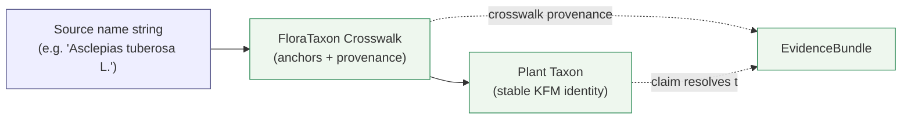

<!-- [KFM_META_BLOCK_V2]
doc_id: kfm://doc/flora-crosswalks
title: Flora Domain — Crosswalks
type: standard
version: v1
status: draft
owners: <flora-domain-steward> (PLACEHOLDER), <docs-steward> (PLACEHOLDER)
created: 2026-06-03
updated: 2026-06-03
policy_label: public
contract_version: 3.0.0
related: [
  "docs/doctrine/directory-rules.md",
  "ai-build-operating-contract.md",
  "docs/domains/flora/README.md",
  "docs/domains/flora/CONTINUITY_INVENTORY.md",
  "docs/domains/fauna/CROSSWALKS.md",
  "docs/sources/SOURCE_DESCRIPTOR_STANDARD.md",
  "docs/standards/PROV.md",
  "docs/registers/VERIFICATION_BACKLOG.md",
  "docs/registers/DRIFT_REGISTER.md",
  "contracts/domains/flora/floraTaxon_crosswalk.md"
]
tags: [kfm, domain, flora, crosswalk, taxonomy, identity, source-role, cross-lane]
notes: [
  "CONTRACT_VERSION pinned to 3.0.0 per ai-build-operating-contract.md.",
  "Three crosswalk dimensions: (1) taxonomic-authority, (2) source-field-to-object, (3) cross-lane relation.",
  "All non-directory-rules.md repo paths are PROPOSED / NEEDS VERIFICATION until checked against a mounted KFM repo.",
  "External authority IRIs (ITIS, GBIF, World Flora Online, IUCN, USDA PLANTS) are doctrine targets, not verified live endpoints; their current terms are NEEDS VERIFICATION.",
  "Companion of docs/domains/fauna/CROSSWALKS.md (Taxon Crosswalk parallel) and docs/domains/flora/CONTINUITY_INVENTORY.md."
]
[/KFM_META_BLOCK_V2] -->

# Flora Domain — Crosswalks

> How KFM reconciles plant identity, source fields, and cross-lane relations into governed, evidence-backed flora objects — and where each mapping still needs proof.


| | |
|---|---|
| **Status** | draft |
| **Owners** | `<flora-domain-steward>` (PLACEHOLDER), `<docs-steward>` (PLACEHOLDER) |
| **Last updated** | 2026-06-03 |
| **Contract** | `CONTRACT_VERSION = "3.0.0"` (`ai-build-operating-contract.md`) |
| **Authority** | KFM doctrine; `docs/doctrine/directory-rules.md` (v1.3); flora corpus (DOM-FLORA, ENCY §7.6, ATLAS §8, §24.1; Pass 10 C7; Pass 15/23/32 biodiversity-crosswalk cards) |
| **Companion** | `docs/domains/fauna/CROSSWALKS.md` (Taxon Crosswalk parallel) — PROPOSED; `docs/domains/flora/CONTINUITY_INVENTORY.md` |

> [!IMPORTANT]
> **Crosswalks are governed mappings, not free joins.** Every crosswalk row in this document is a *claim* that must resolve to an `EvidenceBundle`, carry crosswalk provenance (source IRI + fetch time + confidence), and respect source-role anti-collapse and sensitivity policy. Mappings that cannot be supported **fail closed**. Every implementation-shaped claim is labeled `CONFIRMED`, `PROPOSED`, `NEEDS VERIFICATION`, `UNKNOWN`, or `CONFLICTED` per KFM truth posture.

---

## Contents

1. [Purpose & scope](#1-purpose--scope)
2. [What a crosswalk is in KFM](#2-what-a-crosswalk-is-in-kfm)
3. [The three crosswalk dimensions](#3-the-three-crosswalk-dimensions)
4. [Dimension 1 — Taxonomic-authority crosswalk](#4-dimension-1--taxonomic-authority-crosswalk)
5. [Dimension 2 — Source-field → object-family crosswalk](#5-dimension-2--source-field--object-family-crosswalk)
6. [Dimension 3 — Cross-lane relation crosswalk](#6-dimension-3--cross-lane-relation-crosswalk)
7. [Source-role anti-collapse in crosswalks](#7-source-role-anti-collapse-in-crosswalks)
8. [Crosswalk provenance & identity](#8-crosswalk-provenance--identity)
9. [Sensitivity & fail-closed rules](#9-sensitivity--fail-closed-rules)
10. [Tie-breakers & conflict resolution](#10-tie-breakers--conflict-resolution)
11. [Validators, tests, fixtures](#11-validators-tests-fixtures)
12. [File-home & placement notes](#12-file-home--placement-notes)
13. [Open questions register](#13-open-questions-register)
14. [Verification backlog](#14-verification-backlog)
15. [Changelog](#15-changelog)
16. [Definition of done](#16-definition-of-done)
17. [Related docs](#17-related-docs)

---

## 1. Purpose & scope

This document is the **crosswalk reference** for the Flora lane. It defines, in one place, how the lane maps:

- external **taxonomic authorities** (ITIS, GBIF Backbone, World Flora Online, USDA PLANTS, iNaturalist, Catalogue of Life) to a stable `Plant Taxon`;
- external **source fields** (USDA PLANTS columns, Darwin Core terms) to flora **object families**; and
- flora objects to **adjacent lanes** (Habitat, Fauna, Soil/Hydrology, Hazards, Agriculture, People/Land) through governed relations.

**In scope:** the mapping rules, the authority backbone, the tie-breaker policy, crosswalk provenance, source-role discipline, and the sensitivity gates that apply when crosswalks are joined.

**Out of scope (see neighbors):**

- Object-family *meaning* — `contracts/domains/flora/` (PROPOSED).
- Field-level *shape* — `schemas/contracts/v1/domains/flora/` (PROPOSED).
- Admissibility / release *decisions* — `policy/domains/flora/` (PROPOSED).
- The continuity carry-forward register — `docs/domains/flora/CONTINUITY_INVENTORY.md`.

> [!NOTE]
> **Companion document.** This is the flora parallel of the proposed `docs/domains/fauna/CROSSWALKS.md` (which governs the `Taxon Crosswalk` object family). The two lanes share the taxonomic-authority backbone and the source-role anti-collapse rule, and should evolve in lockstep where they intersect (Flora × Fauna pollinator / food-web / invasive joins).

[Back to top ↑](#contents)

---

## 2. What a crosswalk is in KFM

**CONFIRMED doctrine.** Authority anchoring is a non-negotiable design law: every published entity — person, place, **taxon**, corporate body, event, or controlled-vocabulary concept — must be anchored to one or more durable external authority records, and that anchoring must travel with the artifact as a persistent identifier plus a machine-readable crosswalk. Identifiers without authority anchors decay into local strings that cannot be merged, deduplicated, or audited across institutions. The system **fails closed** when required anchors are missing for in-scope record types. [Pass 10 C7.0] [ENCY]

In the Flora lane the object family carrying this responsibility is **`FloraTaxon Crosswalk`** — "CONFIRMED term / PROPOSED field realization," constrained by source role, evidence, time, and release state. [DOM-FLORA] [ENCY §7.6] [ATLAS §8.C, §8.E]



> [!NOTE]
> **Diagram status: ILLUSTRATIVE.** It reflects the crosswalk → stable-identity relationship described in [Pass 10 C7], [DOM-FLORA], and [ATLAS §8.E]. Field names, cardinality, and exact resolution order are PROPOSED until the contract and schema are authored.

[Back to top ↑](#contents)

---

## 3. The three crosswalk dimensions

| Dimension | Maps | From → To | Governs |
|---|---|---|---|
| **1. Taxonomic-authority** | plant identity | external authority IDs → `Plant Taxon` | dedup, reconciliation, name currency |
| **2. Source-field → object** | record structure | source columns / DwC terms → flora object families | normalization, identity basis, field provenance |
| **3. Cross-lane relation** | ecological context | flora objects → adjacent-lane objects | ownership preservation, source-role and sensitivity inheritance |

All three are **CONFIRMED as doctrinal concepts** and **PROPOSED as implementations**. Each is detailed below.

[Back to top ↑](#contents)

---

## 4. Dimension 1 — Taxonomic-authority crosswalk

**CONFIRMED doctrine.** Biodiversity ingestion should maintain crosswalks among GBIF, Catalogue of Life, ITIS TSNs, USDA PLANTS, provider IDs, and sensitivity policy fields, so taxon reconciliation is auditable across citizen-science and agency sources. [Pass 15/23/32 KFM-P15-PROG-0015] [Pass 10 C7.c]

### 4.1 Authority backbone

| Authority | Anchor identifier | Role in KFM | Status |
|---|---|---|---|
| **ITIS** (Integrated Taxonomic Information System) | Taxonomic Serial Number (`TSN`) | US-canonical taxonomic authority; required anchor where ITIS has coverage | CONFIRMED doctrine [Pass 10 C7-07] |
| **GBIF Backbone Taxonomy** | GBIF `taxonKey` / Backbone DOI `10.15468/39omei` (version-pinned) | International crosswalk; second-line authority when ITIS is absent or stale | CONFIRMED doctrine [Pass 10 C7-08] |
| **World Flora Online** | WFO ID | Plant-specific taxonomic authority (named under C7.c) | CONFIRMED listed [Pass 10 C7.c] |
| **USDA PLANTS** | `plants:symbol` (PROPOSED canonical identifier) | Federal taxonomic backbone + state/county presence scaffold for flora | CONFIRMED source / PROPOSED identifier [P2-PROG-0006] |
| **Catalogue of Life** | CoL ID | Cross-checklist reconciliation | CONFIRMED listed [P15-PROG-0015] |
| **IUCN** | IUCN taxon ID | Conservation-status context anchor (named under C7.c) | CONFIRMED listed [Pass 10 C7.c] |
| **iNaturalist** | provider taxon ID | Citizen-science provider crosswalk; never an authority on its own | CONFIRMED source / PROPOSED [P15-PROG-0015] |

> [!CAUTION]
> **Currency & coverage are NEEDS VERIFICATION.** ITIS lags GBIF on currency and on coverage of many plants; the corpus warns against treating ITIS TSN as the only authority for those clades. Every authority's current endpoint, terms, and version are NEEDS VERIFICATION and must be pinned in a `RunReceipt` (including the GBIF Backbone DOI version) before any crosswalk is treated as fact. [Pass 10 C7-07, C7-08]

### 4.2 Crosswalk row shape (PROPOSED)

A single `FloraTaxon Crosswalk` row anchors one source name to the authority backbone:

```text
FloraTaxonCrosswalk
├── source_name           # verbatim, e.g. "Asclepias tuberosa L."
├── source_id             # provider record id
├── source_role           # authority | observation | context | model   (anti-collapse)
├── anchors[]             # { authority, identifier, version, fetch_time, confidence }
│     ├── itis:tsn
│     ├── gbif:taxonKey (+ backbone DOI version)
│     ├── wfo:id
│     ├── plants:symbol
│     ├── col:id
│     └── inat:taxonId
├── resolved_plant_taxon  # stable KFM Plant Taxon id
├── name_status           # accepted | synonym | misapplied | unresolved
└── evidence_ref          # → EvidenceBundle
```

[Back to top ↑](#contents)

---

## 5. Dimension 2 — Source-field → object-family crosswalk

**CONFIRMED source intake (PROPOSED placement).** USDA PLANTS ingestion normalizes symbol uniqueness, scientific-name-with-author, family, native status, growth habit, wetland status, USPS state codes, and 5-digit FIPS county codes into a canonical KFM dataset. Mandatory mapping fields are `plants:symbol`, `scientificName` (with author), and `family`; strongly expected are `nationalCommonName`, `growthHabit`, `nativeStatus`, and `wetlandStatus`. Distributions are state/county arrays with presence and `first_observed` where available. [P2-PROG-0006]

### 5.1 USDA PLANTS → flora objects (PROPOSED)

| Source field | → Object family | → KFM concept | Notes |
|---|---|---|---|
| `plants:symbol` | `Plant Taxon` / `FloraTaxon Crosswalk` | identity anchor | PROPOSED canonical identifier [P2-PROG-0006] |
| `scientificName` (with author) | `FloraTaxon Crosswalk` | source name string | drives authority anchoring |
| `family` | `Plant Taxon` | classification | mandatory mapping field |
| `nationalCommonName` | `Plant Taxon` | label | strongly expected |
| `growthHabit` (array) | `Plant Taxon` | trait context | strongly expected |
| `nativeStatus` | `Plant Taxon` / `InvasivePlantRecord` | native vs introduced | feeds invasive classification |
| `wetlandStatus` | `Habitat Association` | wetland context | cross-lane link (Hydrology/Habitat) |
| state / county distribution arrays | `RangePolygon` / `DistributionSurface` | presence scaffold | county-grain only; deny exact occurrence when joined with sensitive data |

### 5.2 STAC × Darwin Core hybrid for occurrences (CONFIRMED pattern)

**CONFIRMED.** Biodiversity occurrence records are encoded as STAC Items (Feature with geometry and datetime) whose `properties` include a `taxon` object carrying Darwin Core terms (`scientific_name`, `common_name`, `kbs_id`, `kdwp_status`, `sensitivity_rank`) plus a `redaction_profile` and an evidence block. DwC terms sit **inside** `properties.taxon`, keeping the STAC envelope clean while preserving DwC meaning. Surveys extend the hybrid via Darwin Core Event records (`eventID`, `eventDate`, `samplingProtocol`, `sampleSizeValue`) with linked `MeasurementOrFact` rows. [Pass 10 C4-03]

| Darwin Core / hybrid term | → Flora object | Notes |
|---|---|---|
| `properties.taxon.scientific_name` | `Flora Occurrence` → `FloraTaxon Crosswalk` | reconciled to `Plant Taxon` |
| `properties.taxon.sensitivity_rank` + `redaction_profile` | `Rare Plant Record` / `Redaction Receipt` | drives geoprivacy transform |
| DwC Event (`eventID`, `eventDate`, …) | `Botanical Survey` | survey-level evidence |
| `MeasurementOrFact` | `Phenology Observation` / `Botanical Survey` | counts, effort, seasonal status |

> [!NOTE]
> **CONFLICTED — canonical form.** The corpus is silent on whether KFM round-trips through Darwin Core Archive (DwC-A) or treats STAC × DwC as the canonical form. Tracked as **OQ-FLORAXW-03** (§13). [Pass 10 C4-03]

[Back to top ↑](#contents)

---

## 6. Dimension 3 — Cross-lane relation crosswalk

**CONFIRMED / PROPOSED.** Flora relations to adjacent lanes must preserve ownership, source role, sensitivity, and `EvidenceBundle` support. [ATLAS §8.F] [DOM-FLORA]

| This lane | Related lane | Relation (crosswalk) | Owning lane (never overwritten) | Constraint |
|---|---|---|---|---|
| Flora | Habitat | `Habitat Association` ↔ `Vegetation Community` / `HabitatPatch` | Habitat owns patches & suitability | preserve ownership + EvidenceBundle |
| Flora | Fauna | pollinator / food-web / invasive / biodiversity link | Fauna owns animal taxa & occurrences | **stricter of the two lanes' policies applies** |
| Flora | Soil / Hydrology | substrate / wetland / riparian / drought context | Soil & Hydrology keep their truth | `wetlandStatus` joins here |
| Flora | Hazards | fire / drought / flood / smoke / vegetation stress | Hazards keeps its truth | Hazards is **never** an alert authority [DOM-HAZ] |
| Flora | Agriculture | crop / vegetation-index adjacency; conservation practice | Agriculture keeps its truth | PLANTS packages are a **flora** source, not an ag surface |
| Flora | People / Land | living-person / parcel / consent context | People/DNA/Land keeps its truth | stricter people/DNA/land policy; no living-person fields in public flora output |

> [!TIP]
> **Shared cross-lane validators live cross-root.** Flora × Habitat × Fauna join validators belong under `tools/validators/<topic>/` (e.g. `tools/validators/biodiversity/`) per [DIRRULES §12 "Multi-domain and cross-cutting files"], **not** under a single domain folder.

[Back to top ↑](#contents)

---

## 7. Source-role anti-collapse in crosswalks

**CONFIRMED doctrine.** Source role is a first-class identity attribute. A crosswalk MUST NOT collapse roles: an observed reading is not a modeled estimate; a regulatory determination (e.g., a protected-species listing) is not an observation; an aggregate (e.g., a county taxa total) is not a per-place record. The lifecycle and governed API **fail closed** when roles are conflated. [ATLAS §24.1]

| Role | Flora example | MUST NOT become |
|---|---|---|
| **Observed** | a herbarium specimen; an iNaturalist observation | a regulatory listing or a modeled range |
| **Regulatory** | a state/federal rare-plant listing; designated critical habitat | an observed occurrence |
| **Modeled** | a `DistributionSurface` / suitability raster | an observation |
| **Aggregate** | a USDA PLANTS county taxa total | a per-place occurrence |
| **Administrative** | a stewardship or restoration project roster | an observation or a regulation |

> [!CAUTION]
> The most acute flora anti-collapse risk: **a regulatory listing of a rare plant ≠ a confirmed observed location of it.** Crosswalking a listing into an occurrence layer would manufacture a poaching map. Such a join is denied by default (see §9).

[Back to top ↑](#contents)

---

## 8. Crosswalk provenance & identity

**CONFIRMED doctrine (C7.e).** A record stores not only the authority IRI but the **source, fetch time, and confidence** behind each anchoring decision. [Pass 10 C7.e]

**PROPOSED identity rule (lane-wide).** Deterministic basis for every flora object, including crosswalk rows: `source id + object role + temporal scope + normalized digest`. [ATLAS §8.E]

**CONFIRMED temporal handling.** Source, observed, valid, retrieval, release, and correction times stay distinct where material. [ATLAS §8.E]

**PROPOSED hashing.** Identity uses JCS canonicalization with the retrieval timestamp **excluded** from the `spec_hash` computation, so re-fetching the same content does not change identity. [P2-PROG-0006]

> [!IMPORTANT]
> **Taxonomy renames vs identity (OPEN).** How a taxonomy rename is represented in identity — whether `spec_hash` changes, and how that reconciles with downstream Evidence Drawer attribution — is **NEEDS VERIFICATION**. The corpus does not specify how to handle a `plants:symbol` whose scientific name changed across snapshots. Tracked as **OQ-FLORAXW-04** (§13). [P2-PROG-0006]

[Back to top ↑](#contents)

---

## 9. Sensitivity & fail-closed rules

**CONFIRMED doctrine.** Rare, protected, culturally sensitive, and steward-reviewed flora default to **generalized, withheld, staged, or denied** public geometry; `Redaction Receipt` records the transform. [DOM-FLORA] [ATLAS §8.I] [ENCY §20.5]

> [!CAUTION]
> **Sensitive-domain handling (operating contract §23.2).** Flora rare-plant exact locations are a sensitive domain. The most restrictive applicable disposition applies: **DENY public exact exposure · GENERALIZE before publication · REDACT when needed · QUARANTINE uncertain source material · REQUIRE steward review · REQUIRE transform receipt (Redaction Receipt) · ABSTAIN when support is inadequate.** No exact coordinates or restricted-source-derived fields may appear in public flora crosswalk outputs unless cleared by the flora domain steward and rights-holder representative.

**Combinatorial sensitivity (CONFIRMED).** A benign source can become sensitive in combination. A USDA PLANTS county taxa list is not sensitive in isolation, but crosswalked/joined with GBIF, iNaturalist, or heritage occurrence data it can become a poaching map. Any crosswalk that intersects a sensitive listing therefore inherits flora geoprivacy discipline: deny exact public occurrence, generalize to county or coarser, record the transform, and route through steward review. [P20 KFM-IDX-ANA-004]

**Fail-closed default.** When a required authority anchor is missing, rights are unknown, or a join intersects a sensitive list without a clearance, the crosswalk produces a visible `DENY` / `ABSTAIN`, never a silent best-guess. [Pass 10 C7.0] [GAI]

[Back to top ↑](#contents)

---

## 10. Tie-breakers & conflict resolution

**CONFIRMED tension / PROPOSED policy.** When authorities disagree on the accepted name, the corpus suggests defaulting to **ITIS for federal-data reconciliation** and **GBIF for international biodiversity queries**, but does **not** yet codify this in the policy bundle. [Pass 10 C7-07]

| Conflict | Proposed resolution | Status |
|---|---|---|
| ITIS vs GBIF accepted name | ITIS for federal reconciliation; GBIF for international comparability; record both anchors | PROPOSED — not yet in policy bundle [C7-07] |
| ITIS coverage gap (many plants) | fall to GBIF Backbone / World Flora Online as second-line; catalog records both | CONFIRMED doctrine [C7-07] |
| GBIF Backbone version drift | pin Backbone DOI version in `RunReceipt`; migrate downstream artifacts on version bump | CONFIRMED doctrine [C7-08] |
| Record lacking both anchors | CI check flags it; promotion gate refuses (fail closed) | PROPOSED suggested future work [C7-07] |

> [!IMPORTANT]
> Until the ITIS/GBIF tie-breaker is codified in `policy/domains/flora/` (PROPOSED), crosswalk rows that depend on the tie-break MUST be labeled `NEEDS VERIFICATION` and MUST carry both anchors.

[Back to top ↑](#contents)

---

## 11. Validators, tests, fixtures

| Test class | Example assertion | Default status |
|---|---|---|
| Anchor-presence test | Every in-scope `Plant Taxon` carries at least one required authority anchor, or promotion is refused | PROPOSED |
| Dual-anchor test | Biodiversity records carry **both** an ITIS and a GBIF anchor (or a recorded gap reason) | PROPOSED [C7-07] |
| Crosswalk provenance test | Each anchor carries source, fetch time, and confidence | PROPOSED [C7.e] |
| Source-role test | A crosswalk does not relabel an observation as regulatory/modeled/aggregate | PROPOSED [§24.1] |
| Backbone-version pin test | GBIF-anchored records record the Backbone DOI version in a `RunReceipt` | PROPOSED [C7-08] |
| Sensitivity denial test | A crosswalk join intersecting a rare-plant listing denies exact public geometry | PROPOSED |
| Geoprivacy transform test | A generalized derivative ships only with a valid `Redaction Receipt` | PROPOSED |
| Identity-stability test | Re-fetching identical content (retrieval time excluded) yields the same `spec_hash` | PROPOSED [P2-PROG-0006] |
| No-live-network fixture | Crosswalk resolution runs RAW → PUBLISHED from fixtures with no live fetch | PROPOSED |

**CONFIRMED fixture rule.** Every major flora crosswalk path should ship at least **one valid**, **one invalid**, **one denied**, **one abstention**, and **one rollback/correction** fixture; sensitive lanes ship **public-safe transformed** fixtures rather than real exact rare-plant coordinates. [UNIFIED §5.3]

[Back to top ↑](#contents)

---

## 12. File-home & placement notes

> [!NOTE]
> All paths below other than `directory-rules.md` are **PROPOSED / NEEDS VERIFICATION** and follow the lane pattern in [DIRRULES §12 Domain Placement Law]. Their **presence** in the live repo has not been checked in this session.

```text
docs/domains/flora/CROSSWALKS.md              # this file
contracts/domains/flora/floraTaxon_crosswalk.md   # crosswalk object-family meaning
schemas/contracts/v1/domains/flora/               # crosswalk schema home (ADR-0001)
policy/domains/flora/                             # tie-breaker, anchor-required, sensitivity policy
tools/validators/biodiversity/                    # cross-lane / taxonomy crosswalk validators
fixtures/domains/flora/                            # valid/invalid/denied/abstention/rollback
data/registry/sources/flora/                       # per-source descriptors w/ source role + rights
```

> [!WARNING]
> **DR-FLORA-PATH-01 — Path-segment-form conflict (CONFLICTED).** `directory-rules.md` §12 places flora artifacts under a `domains/` segment (`schemas/contracts/v1/domains/flora/`, `contracts/domains/flora/`, `policy/domains/flora/`). The Domains Atlas v1.1 **§24.13 crosswalk** places them without it (`schemas/contracts/v1/flora/`, `contracts/flora/`, `policy/sensitivity/flora/`). Per the authority order (`directory-rules.md` §2.1), **Directory Rules wins on placement** — this document uses the §12 form. File a `DRIFT_REGISTER.md` row; resolve by ADR (ADR-S-01 family). This is the same conflict tracked in the Flora Continuity Inventory §19.

[Back to top ↑](#contents)

---

## 13. Open questions register

| ID | Question | Owner role | Resolution path |
|---|---|---|---|
| OQ-FLORAXW-01 | Where does the canonical ITIS/GBIF tie-breaker policy live, and what is its exact rule? | Policy steward | ADR + `policy/domains/flora/`; codify [C7-07] |
| OQ-FLORAXW-02 | Which placement form is canonical for flora crosswalk artifacts — §12 `domains/` form vs Atlas §24.13 form (DR-FLORA-PATH-01)? | Docs + schema steward | ADR-S-01 family; Directory Rules §2.1 governs meanwhile |
| OQ-FLORAXW-03 | Is STAC × Darwin Core the canonical occurrence form, or does KFM round-trip through DwC-A? | Schema steward | ADR; fixture set [C4-03] |
| OQ-FLORAXW-04 | How is a taxonomy rename represented in identity (does `spec_hash` change; how is Evidence Drawer attribution reconciled)? | Schema + release steward | ADR; identity profile [P2-PROG-0006] |
| OQ-FLORAXW-05 | When ITIS and GBIF disagree and both are absent/stale, what is the abstention vs second-line-authority rule? | Policy steward | ADR resolving C7-07 tie-breaker |
| OQ-FLORAXW-06 | What is the GBIF Backbone version-rotation cadence, and how are deprecated taxa handled? | Pipeline steward | Backbone-rotation playbook [C7-08] |

[Back to top ↑](#contents)

---

## 14. Verification backlog

These items remain `NEEDS VERIFICATION` before promotion from `draft` to `published`. They belong on `docs/registers/VERIFICATION_BACKLOG.md` (PROPOSED).

1. Verify current endpoints, terms, and version-pinning for ITIS, GBIF Backbone (DOI `10.15468/39omei`), World Flora Online, USDA PLANTS, Catalogue of Life, IUCN, and iNaturalist. — NEEDS VERIFICATION
2. Verify the `FloraTaxon Crosswalk` contract and schema exist and match the row shape in §4.2. — NEEDS VERIFICATION
3. Verify the ITIS/GBIF tie-breaker is codified in `policy/domains/flora/`. — NEEDS VERIFICATION
4. Verify dual-anchor and anchor-presence CI checks exist and fail closed. — NEEDS VERIFICATION
5. Verify the STAC × Darwin Core profile schema and fixtures. — NEEDS VERIFICATION
6. Resolve DR-FLORA-PATH-01 (§12 vs §24.13 placement form) by ADR. — CONFLICTED
7. Verify identity-stability behavior under taxonomy renames (OQ-FLORAXW-04). — NEEDS VERIFICATION
8. Verify cross-lane join policy for Flora × Fauna / People-Land sensitive joins. — NEEDS VERIFICATION

[Back to top ↑](#contents)

---

## 15. Changelog

| Change | Type (per contract §37) | Reason |
|---|---|---|
| Initial draft of the Flora Crosswalks reference | new | The lane needed a single governed home for taxonomic-authority, source-field, and cross-lane crosswalk rules |
| Surfaced DR-FLORA-PATH-01 (§12 vs §24.13 placement form) as CONFLICTED | reconciliation | Consistent with the Flora Continuity Inventory §19 finding |
| Pinned `CONTRACT_VERSION = "3.0.0"` and `directory-rules.md` v1.3 | housekeeping | Required for doctrine-adjacent docs |
| Recorded ITIS/GBIF tie-breaker as PROPOSED-not-yet-in-policy | clarification | The corpus suggests but does not codify the rule [C7-07] |

> **Backward compatibility.** New document; no prior anchors to preserve. Section anchors §1–§17 are stable for inbound links from the Continuity Inventory and the proposed flora README.

[Back to top ↑](#contents)

---

## 16. Definition of done

This document is done enough to enter the repository when:

- it is placed according to Directory Rules (`docs/domains/flora/CROSSWALKS.md`, PROPOSED);
- a docs steward and the flora domain steward review it;
- it is linked from `docs/domains/flora/README.md` and the fauna `CROSSWALKS.md` companion;
- it does not conflict with accepted ADRs (and DR-FLORA-PATH-01 is filed in `DRIFT_REGISTER.md` pending ADR resolution);
- any conflict with current repo conventions is logged in `docs/registers/DRIFT_REGISTER.md`;
- the `GENERATED_RECEIPT.json` planned in Section 2 is wired into CI;
- future changes follow the operating contract's §37 lifecycle.

[Back to top ↑](#contents)

---

## 17. Related docs

> [!NOTE]
> All `docs/` paths below other than `directory-rules.md` are **PROPOSED / NEEDS VERIFICATION**. They reflect [DIRRULES §12]; their **presence** in the live repo has not been checked in this session.

- `docs/doctrine/directory-rules.md` — **CONFIRMED** (viewed this session, v1.3)
- `ai-build-operating-contract.md` — operating contract (`CONTRACT_VERSION = "3.0.0"`) — CONFIRMED (in project)
- `docs/domains/flora/README.md` — flora lane README — PROPOSED
- `docs/domains/flora/CONTINUITY_INVENTORY.md` — flora carry-forward register — PROPOSED
- `docs/domains/fauna/CROSSWALKS.md` — **parallel lane (Taxon Crosswalk)** — PROPOSED
- `contracts/domains/flora/floraTaxon_crosswalk.md` — crosswalk object-family meaning — PROPOSED
- `docs/sources/SOURCE_DESCRIPTOR_STANDARD.md` — source-descriptor standard — PROPOSED
- `docs/standards/PROV.md` — provenance standards profile — PROPOSED
- `docs/registers/VERIFICATION_BACKLOG.md`, `docs/registers/DRIFT_REGISTER.md` — PROPOSED
- `docs/adr/ADR-0001-schema-home.md` — schema home — PROPOSED (referenced from [DIRRULES §7.4])

**Source-corpus tag legend** (used throughout this file):

| Tag | Resolves to |
|---|---|
| `[DOM-FLORA]` | Flora Architecture PDF-Only Implementation Blueprint (lineage) |
| `[ENCY]` | `kfm_encyclopedia.pdf` §7.6 Flora; §20.5 deny-by-default register |
| `[UNIFIED]` | KFM Unified Implementation Architecture Build Manual §5.3 fixture rule |
| `[ATLAS]` | Domains Culmination Atlas v1.1 §8 Flora; §24.1 source-role anti-collapse; §24.13 crosswalk |
| `[Pass 10 C4/C7]` | Components Pass 10 — C4 catalogs/DwC hybrid; C7 authority anchoring & identity crosswalks |
| `[P2-PROG-0006]` | USDA PLANTS ingestion idea card (taxonomy + state/county distribution) |
| `[P15-PROG-0015]` | Biodiversity-crosswalk idea card (GBIF / CoL / ITIS / PLANTS / provider IDs) |
| `[P20 KFM-IDX-ANA-004]` | Pass 20 PLANTS combinatorial-sensitivity entry |
| `[GAI]` | KFM governed-AI doctrine |
| `[DIRRULES]` | `docs/doctrine/directory-rules.md` (v1.3) |
| `[DOM-HAZ]` | Hazards architecture blueprint (cross-lane reference) |

---

<sub>
<b>Last reviewed:</b> 2026-06-03 ·
<b>Version:</b> v1 (draft) ·
<b>Contract:</b> CONTRACT_VERSION = "3.0.0" ·
<b>Owner:</b> &lt;flora-domain-steward&gt; (PLACEHOLDER) ·
<a href="#flora-domain--crosswalks">Back to top ↑</a>
</sub>
