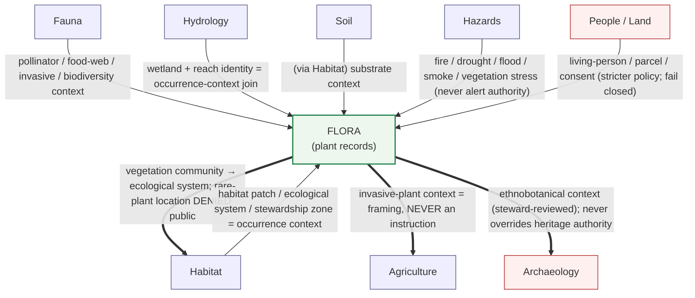

<!-- [KFM_META_BLOCK_V2]
doc_id: kfm://doc/flora-cross-lane-notes
title: Flora Domain — Cross-Lane Notes
type: standard
version: v1
status: draft
owners: <flora-domain-steward> (PLACEHOLDER), <docs-steward> (PLACEHOLDER)
created: 2026-06-03
updated: 2026-06-03
policy_label: public
contract_version: 3.0.0
related: [
  "docs/doctrine/directory-rules.md",
  "ai-build-operating-contract.md",
  "docs/domains/flora/README.md",
  "docs/domains/flora/CROSSWALKS.md",
  "docs/domains/flora/CONTINUITY_INVENTORY.md",
  "docs/domains/fauna/CROSS_LANE_RELATIONS.md",
  "docs/registers/VERIFICATION_BACKLOG.md",
  "docs/registers/DRIFT_REGISTER.md",
  "policy/domains/flora/"
]
tags: [kfm, domain, flora, cross-lane, edges, ownership, source-role, sensitivity]
notes: [
  "CONTRACT_VERSION pinned to 3.0.0 per ai-build-operating-contract.md.",
  "Built on Atlas v1.1 §24.4 'Edges owned by' register — the authoritative directional cross-lane source.",
  "Distinct from CROSSWALKS.md: this is the directional edge-ownership register (who owns each edge, what may flow), not the identity/source-field mapping reference.",
  "All non-directory-rules.md repo paths are PROPOSED / NEEDS VERIFICATION until checked against a mounted KFM repo.",
  "Companion of docs/domains/fauna/CROSS_LANE_RELATIONS.md."
]
[/KFM_META_BLOCK_V2] -->

# Flora Domain — Cross-Lane Notes

> Who owns each edge between Flora and its neighbors, what may flow across it, and what must never flow — governed by the lattice in Atlas v1.1 §24.4.


| | |
|---|---|
| **Status** | draft |
| **Owners** | `<flora-domain-steward>` (PLACEHOLDER), `<docs-steward>` (PLACEHOLDER) |
| **Last updated** | 2026-06-03 |
| **Contract** | `CONTRACT_VERSION = "3.0.0"` (`ai-build-operating-contract.md`) |
| **Authority** | KFM doctrine; `docs/doctrine/directory-rules.md` (v1.3); Atlas v1.1 §8.F (Flora cross-lane), §24.4 (edges-owned-by lattice), §24.1 (source-role anti-collapse) |
| **Companion** | `docs/domains/fauna/CROSS_LANE_RELATIONS.md` (parallel lane) — PROPOSED; `docs/domains/flora/CROSSWALKS.md` |

> [!IMPORTANT]
> **Edges are owned, directional, and governed.** An edge between two lanes has exactly one owner. The owner decides what context may flow and on what terms; the other lane keeps its truth and is never overwritten. Every edge preserves ownership, source role, sensitivity, and `EvidenceBundle` support, or it **fails closed**. Every implementation-shaped claim is labeled `CONFIRMED`, `PROPOSED`, `NEEDS VERIFICATION`, `UNKNOWN`, or `CONFLICTED` per KFM truth posture.

---

## Contents

1. [Purpose & scope](#1-purpose--scope)
2. [How to read an edge](#2-how-to-read-an-edge)
3. [Cross-lane map](#3-cross-lane-map)
4. [Edges owned by Flora (outbound)](#4-edges-owned-by-flora-outbound)
5. [Edges where Flora consumes (inbound)](#5-edges-where-flora-consumes-inbound)
6. [The four invariants every edge preserves](#6-the-four-invariants-every-edge-preserves)
7. [Source-role anti-collapse across edges](#7-source-role-anti-collapse-across-edges)
8. [Sensitivity inheritance & the stricter-policy rule](#8-sensitivity-inheritance--the-stricter-policy-rule)
9. [Ethnobotanical edge — Flora × Archaeology](#9-ethnobotanical-edge--flora--archaeology)
10. [Validators, tests, fixtures](#10-validators-tests-fixtures)
11. [File-home & placement notes](#11-file-home--placement-notes)
12. [Open questions register](#12-open-questions-register)
13. [Verification backlog](#13-verification-backlog)
14. [Changelog](#14-changelog)
15. [Definition of done](#15-definition-of-done)
16. [Related docs](#16-related-docs)

---

## 1. Purpose & scope

This document is the **cross-lane edge register** for the Flora lane. It records, edge by edge, the relationships between Flora and its neighbors as governed by the **"edges owned by" lattice** in Atlas v1.1 §24.4 — where *no row consumes from another row except via this lattice*. [ATLAS §24.4]

**In scope:** the directional edges (who owns, what flows, on what terms), the four invariants each edge preserves, source-role discipline at edges, and the sensitivity inheritance rules that apply when Flora joins another lane.

**Out of scope (see neighbors):**

- Identity / source-field reconciliation — `docs/domains/flora/CROSSWALKS.md` (the *mapping* reference).
- Object-family *meaning* — `contracts/domains/flora/` (PROPOSED).
- Admissibility / release *decisions* — `policy/domains/flora/` (PROPOSED).
- The continuity carry-forward register — `docs/domains/flora/CONTINUITY_INVENTORY.md`.

> [!NOTE]
> **Relationship to `CROSSWALKS.md`.** `CROSSWALKS.md` answers *"how does a source name or field become a flora object?"* — identity, authorities, field mapping. **This document** answers *"once a flora object exists, what may it exchange with another lane, and who controls that exchange?"* — directional ownership and flow rules. They are complementary; this one is the authority on edge direction and ownership.

[Back to top ↑](#contents)

---

## 2. How to read an edge

Each edge in §4–§5 uses the §24.4 lattice shape:

| Column | Meaning |
|---|---|
| **Owner** | The single lane that owns the edge and sets its terms. |
| **Consumes from owner** | The lane that receives context across the edge. |
| **Relation** | What may flow, in the owner's words (CONFIRMED doctrine from §24.4). |
| **Constraint** | The non-negotiable limit on the flow (ownership, source role, sensitivity, never-an-instruction, etc.). |

**Direction matters.** "Flora → Habitat" (Flora owns) is a different edge from "Habitat → Flora" (Habitat owns). The Atlas defines both directions; this document records the Flora-relevant half of each.

[Back to top ↑](#contents)

---

## 3. Cross-lane map



> [!NOTE]
> **Diagram status: CONFIRMED edges / ILLUSTRATIVE layout.** The edges and their constraints are drawn from Atlas §24.4.4–§24.4.6 and §8.F. Bold (`==>`) edges are **Flora-owned**; thin (`-->`) edges are **owned by the other lane** (Flora consumes). Layout is illustrative.

[Back to top ↑](#contents)

---

## 4. Edges owned by Flora (outbound)

**CONFIRMED doctrine.** These edges are owned by Flora; Flora sets the terms. [ATLAS §24.4.6]

| Owner | Consumes from owner | Relation (CONFIRMED) | Constraint |
|---|---|---|---|
| Flora | Habitat | Vegetation community feeds ecological-system mapping | **Rare-plant exact location is DENIED to public consumers** [§24.4.6] |
| Flora | Agriculture | Invasive-plant context informs management framing | **Never an instruction** — context only [§24.4.6] |
| Flora | Archaeology | Ethnobotanical context (steward-reviewed) may bound site interpretation | **Never overrides cultural-heritage authority** [§24.4.6]; see §9 |

> [!CAUTION]
> **The Flora → Habitat edge is the highest-risk outbound edge.** Vegetation-community context legitimately flows to Habitat's ecological-system mapping, but the rare-plant exact location embedded in that community data is **denied to public consumers**. Any released derivative of this edge requires a generalized geometry and a `Redaction Receipt`. [§24.4.6] [ATLAS §8.I]

[Back to top ↑](#contents)

---

## 5. Edges where Flora consumes (inbound)

**CONFIRMED doctrine.** On these edges the **other lane is the owner**; Flora receives context and must preserve the owner's truth. [ATLAS §24.4.2–§24.4.4, §8.F]

| Owner | Flora consumes | Relation (CONFIRMED) | Constraint |
|---|---|---|---|
| Habitat | Flora | Habitat patch, ecological system, and stewardship zone provide the context for occurrence interpretation | Habitat owns patches & suitability; Flora references, never overwrites [§24.4.4] |
| Hydrology | Flora | Wetland and reach identity feeds occurrence-context joins | Hydrology owns reach/wetland identity; advisory to Flora [§24.4.2] |
| Fauna | Flora | Pollinator, food-web, invasive, and biodiversity context | Fauna owns animal taxa & occurrences; **stricter of the two lanes' policies applies** [§8.F] |
| Soil | (via Habitat) Flora | SoilMapUnit / SoilComponent context feeds ecological-system inference, which Flora consumes through Habitat | Soil owns soil truth; soil time caveat carried [§24.4.3] |
| Hazards | Flora | Fire, drought, flood, smoke, vegetation-stress context | Hazards is **never an alert authority** [§8.F] [DOM-HAZ] |
| People / Land | Flora | Living-person, parcel, and consent context (rare joins) | **Stricter people/DNA/land policy applies; living-person fields never appear in public flora output; private joins fail closed** [§8.F] [§24.4.7] |

> [!NOTE]
> **Soil reaches Flora indirectly.** The §24.4 lattice routes soil context to Flora *through* Habitat's ecological-system inference (Soil → Habitat → Flora), not as a direct Soil → Flora edge. Modeling a direct edge would bypass the lattice and is a drift signal. [§24.4.3, §24.4.4]

[Back to top ↑](#contents)

---

## 6. The four invariants every edge preserves

**CONFIRMED doctrine.** Every cross-lane relation — inbound or outbound — must preserve all four of the following, or the join fails closed. [ATLAS §8.F] [DOM-FLORA]

| # | Invariant | What it means at a Flora edge |
|---|---|---|
| 1 | **Ownership** | The owning lane's records are referenced, never rewritten. Flora does not redefine a Habitat patch; Habitat does not redefine a Plant Taxon. |
| 2 | **Source role** | The role (authority / observation / context / model / regulatory / aggregate / administrative) travels with the data and is never relabeled across the edge. See §7. |
| 3 | **Sensitivity** | The stricter lane's sensitivity policy governs the joined output. See §8. |
| 4 | **EvidenceBundle support** | Every consequential cross-lane claim resolves to an `EvidenceBundle`, or the surface abstains. |

[Back to top ↑](#contents)

---

## 7. Source-role anti-collapse across edges

**CONFIRMED doctrine.** Source role is a first-class identity attribute; the lifecycle and governed API fail closed when roles are conflated across an edge. [ATLAS §24.1]

| Edge risk | Wrong collapse | Correct posture |
|---|---|---|
| Flora → Habitat | treating a modeled vegetation surface as an observed community | carry the model identity, run receipt, and bounds across the edge |
| Fauna → Flora | treating a pollinator-association inference as an observed occurrence | label the association as context/model, not observation |
| Hazards → Flora | treating a hazard model (smoke, fire) as an observed plant-stress event | hazard context stays modeled; Hazards is never an alert authority |
| People/Land → Flora | treating an administrative parcel record as observed ground truth about a plant | administrative role preserved; private joins fail closed |

> [!CAUTION]
> **The acute flora collapse: a regulatory rare-plant listing is not an observed location.** Crosswalking a listing into an occurrence layer across the Flora → Habitat edge would manufacture a poaching map. This is denied by default (see §8 and `CROSSWALKS.md` §7). [§24.1]

[Back to top ↑](#contents)

---

## 8. Sensitivity inheritance & the stricter-policy rule

**CONFIRMED doctrine.** Rare, protected, culturally sensitive, and steward-reviewed flora default to generalized, withheld, staged, or denied public geometry; `Redaction Receipt` records the transform. [DOM-FLORA] [ATLAS §8.I] [ENCY §20.5]

> [!CAUTION]
> **Sensitive-domain handling (operating contract §23.2).** When a Flora edge touches rare-plant exact locations, cultural sensitivity, or living-person data, the most restrictive applicable disposition applies: **DENY public exact exposure · GENERALIZE before publication · REDACT when needed · QUARANTINE uncertain source material · REQUIRE steward review · REQUIRE transform receipt (Redaction Receipt) · ABSTAIN when support is inadequate.**

**The stricter-policy rule (CONFIRMED).** When two lanes join, the joined output inherits the **stricter** of the two lanes' policies — never the looser. Concretely:

- **Flora × Fauna** (pollinator / food-web / invasive): if either the plant or the animal is sensitive, the join is sensitive. [§8.F]
- **Flora × People / Land**: people/DNA/land policy is strictly more restrictive; it governs the join; living-person fields never reach public flora output; private person-parcel joins fail closed. [§24.4.7] [§8.F]
- **Flora × Archaeology**: cultural-heritage authority governs; ethnobotanical context is steward-reviewed and never overrides it. See §9. [§24.4.6]

**Combinatorial sensitivity (CONFIRMED).** A benign source can become sensitive in combination — a county taxa list joined with occurrence data can become a poaching map. Any edge that intersects a sensitive listing inherits flora geoprivacy discipline. [P20 KFM-IDX-ANA-004]

[Back to top ↑](#contents)

---

## 9. Ethnobotanical edge — Flora × Archaeology

> [!IMPORTANT]
> **CONFIRMED, and uniquely sensitive.** The Atlas explicitly defines a Flora-owned edge to Archaeology: ethnobotanical context (steward-reviewed) may bound site interpretation, but **never overrides cultural-heritage authority**. [ATLAS §24.4.6]

This edge sits at the intersection of two sensitive domains, so it carries the strictest handling:

- Archaeology owns cultural-heritage authority; Flora supplies ethnobotanical context only, and only after steward review.
- The edge MUST route through both the flora steward and the cultural-heritage / sovereignty review path (archaeology defaults to denied site coordinates). [DOM-ARCH] [operating contract §23.2]
- Indigenous knowledge, treaty, oral-history, and steward-controlled records are sensitive; this edge MUST NOT expose exact archaeological-site coordinates or restricted-source-derived fields.
- AI surfaces MUST NOT synthesize ethnobotanical–site links into public answers without cleared evidence; absent clearance, they **ABSTAIN** or **DENY**.

[Back to top ↑](#contents)

---

## 10. Validators, tests, fixtures

| Test class | Example assertion | Default status |
|---|---|---|
| Edge-ownership test | A Flora derivative does not rewrite an owning lane's records (Habitat patch, reach identity, parcel) | PROPOSED |
| Lattice-conformance test | No Flora edge bypasses the §24.4 lattice (e.g., a direct Soil → Flora edge is flagged) | PROPOSED [§24.4] |
| Source-role test | A role is not relabeled across an edge (model ≠ observation; regulatory ≠ observed) | PROPOSED [§24.1] |
| Stricter-policy test | A Flora × Fauna / Flora × People-Land join inherits the stricter policy | PROPOSED [§8.F] |
| Sensitivity denial test | The Flora → Habitat edge denies rare-plant exact public geometry | PROPOSED [§24.4.6] |
| Never-an-instruction test | The Flora → Agriculture edge produces framing, not management instructions | PROPOSED [§24.4.6] |
| Ethnobotanical review-gate test | The Flora × Archaeology edge requires steward + heritage review and never exposes site coords | PROPOSED [§24.4.6] |
| EvidenceBundle test | Every cross-lane claim resolves to an EvidenceBundle or abstains | PROPOSED |
| No-live-network fixture | Edge joins run RAW → PUBLISHED from fixtures with no live fetch | PROPOSED |

**CONFIRMED fixture rule.** Each major Flora edge should ship at least **one valid**, **one invalid**, **one denied**, **one abstention**, and **one rollback/correction** fixture; sensitive edges ship **public-safe transformed** fixtures rather than real exact rare-plant or site coordinates. [UNIFIED §5.3]

[Back to top ↑](#contents)

---

## 11. File-home & placement notes

> [!NOTE]
> All paths below other than `directory-rules.md` are **PROPOSED / NEEDS VERIFICATION** and follow [DIRRULES §12 Domain Placement Law]. Their **presence** in the live repo has not been checked in this session.

```text
docs/domains/flora/CROSS_LANE_NOTES.md      # this file
docs/domains/flora/CROSSWALKS.md            # identity / source-field mapping reference
policy/domains/flora/                        # stricter-policy, sensitivity, ethnobotanical-review policy
tools/validators/biodiversity/               # cross-lane (Flora × Habitat × Fauna) join validators
fixtures/domains/flora/                       # edge fixtures (valid/invalid/denied/abstention/rollback)
```

> [!TIP]
> **Cross-lane validators live cross-root, not under one lane.** Flora × Habitat × Fauna join validators belong under `tools/validators/<topic>/` (e.g. `tools/validators/biodiversity/`) per [DIRRULES §12 "Multi-domain and cross-cutting files"] — a shared validator must not be filed under a single picked domain.

> [!WARNING]
> **DR-FLORA-PATH-01 (CONFLICTED).** `directory-rules.md` §12 places flora policy under `policy/domains/flora/`; Atlas §24.13 names `policy/sensitivity/flora/` for the sensitive sub-lane. Per the authority order (`directory-rules.md` §2.1), Directory Rules wins on placement; this doc uses the §12 form. File a `DRIFT_REGISTER.md` row; resolve by ADR (ADR-S-01 family). Same conflict tracked in the Flora Continuity Inventory §19 and `CROSSWALKS.md` §12.

[Back to top ↑](#contents)

---

## 12. Open questions register

| ID | Question | Owner role | Resolution path |
|---|---|---|---|
| OQ-FLORAXL-01 | Where is the canonical cross-lane join policy codified, and which joins require steward review vs denial vs generalized release? | Policy steward | ADR-S-14 cross-lane join policy + `policy/domains/flora/` |
| OQ-FLORAXL-02 | What is the exact review path and receipt shape for the Flora × Archaeology ethnobotanical edge (dual flora + heritage steward sign-off)? | Flora + heritage steward | ADR; sovereignty review path [§24.4.6] |
| OQ-FLORAXL-03 | How is the stricter-policy rule mechanically enforced at a join (which gate, which fixture proves it)? | Policy steward | policy fixtures; `policy/domains/flora/` |
| OQ-FLORAXL-04 | Should Soil → Flora ever be a direct edge, or always routed through Habitat per §24.4? | Domain stewards | ADR; lattice-conformance validator |
| OQ-FLORAXL-05 | Which placement form is canonical for flora cross-lane policy (DR-FLORA-PATH-01)? | Docs + schema steward | ADR-S-01 family; Directory Rules §2.1 governs meanwhile |

[Back to top ↑](#contents)

---

## 13. Verification backlog

These items remain `NEEDS VERIFICATION` before promotion from `draft` to `published`. They belong on `docs/registers/VERIFICATION_BACKLOG.md` (PROPOSED).

1. Verify the cross-lane join policy exists in `policy/domains/flora/` and enforces the stricter-policy rule. — NEEDS VERIFICATION
2. Verify the Flora × Archaeology ethnobotanical review gate and its receipt. — NEEDS VERIFICATION
3. Verify lattice-conformance (no direct Soil → Flora edge; all edges trace to §24.4). — NEEDS VERIFICATION
4. Verify the Flora → Habitat edge denies rare-plant exact public geometry in fixtures. — NEEDS VERIFICATION
5. Verify cross-lane join validators live under `tools/validators/biodiversity/` (or equivalent cross-root home). — NEEDS VERIFICATION
6. Resolve DR-FLORA-PATH-01 (§12 vs §24.13 placement form) by ADR. — CONFLICTED
7. Verify that AI surfaces ABSTAIN/DENY on uncleared ethnobotanical–site synthesis. — NEEDS VERIFICATION

[Back to top ↑](#contents)

---

## 14. Changelog

| Change | Type (per contract §37) | Reason |
|---|---|---|
| Initial draft of the Flora Cross-Lane Notes register | new | The lane needed a directional edge-ownership register distinct from the identity/source-field crosswalk reference |
| Built §4–§5 on the Atlas §24.4 "edges owned by" lattice (directional ownership) | gap closure | §8.F gives only an undirected summary; §24.4 gives owned, directional edges with constraints |
| Surfaced the Flora × Archaeology ethnobotanical edge as its own section (§9) | gap closure | §24.4.6 defines it explicitly and it is uniquely sensitive; it was not in the §8.F summary |
| Recorded the Soil → Habitat → Flora indirect routing | clarification | §24.4 routes soil context to Flora through Habitat, not directly |
| Surfaced DR-FLORA-PATH-01 (§12 vs §24.13 placement form) as CONFLICTED | reconciliation | Consistent with Continuity Inventory §19 and CROSSWALKS.md §12 |
| Pinned `CONTRACT_VERSION = "3.0.0"` and `directory-rules.md` v1.3 | housekeeping | Required for doctrine-adjacent docs |

> **Backward compatibility.** New document; no prior anchors to preserve. Section anchors §1–§16 are stable for inbound links from the flora README, `CROSSWALKS.md`, and `CONTINUITY_INVENTORY.md`.

[Back to top ↑](#contents)

---

## 15. Definition of done

This document is done enough to enter the repository when:

- it is placed according to Directory Rules (`docs/domains/flora/CROSS_LANE_NOTES.md`, PROPOSED);
- a docs steward, the flora domain steward, and (for §9) the cultural-heritage steward review it;
- it is linked from `docs/domains/flora/README.md`, `CROSSWALKS.md`, and the fauna `CROSS_LANE_RELATIONS.md` companion;
- it does not conflict with accepted ADRs (and DR-FLORA-PATH-01 is filed in `DRIFT_REGISTER.md` pending ADR resolution);
- any conflict with current repo conventions is logged in `docs/registers/DRIFT_REGISTER.md`;
- the `GENERATED_RECEIPT.json` planned in Section 2 is wired into CI;
- future changes follow the operating contract's §37 lifecycle.

[Back to top ↑](#contents)

---

## 16. Related docs

> [!NOTE]
> All `docs/` paths below other than `directory-rules.md` are **PROPOSED / NEEDS VERIFICATION**. They reflect [DIRRULES §12]; their **presence** in the live repo has not been checked in this session.

- `docs/doctrine/directory-rules.md` — **CONFIRMED** (viewed this session, v1.3)
- `ai-build-operating-contract.md` — operating contract (`CONTRACT_VERSION = "3.0.0"`) — CONFIRMED (in project)
- `docs/domains/flora/README.md` — flora lane README — PROPOSED
- `docs/domains/flora/CROSSWALKS.md` — flora identity / source-field mapping — PROPOSED
- `docs/domains/flora/CONTINUITY_INVENTORY.md` — flora carry-forward register — PROPOSED
- `docs/domains/fauna/CROSS_LANE_RELATIONS.md` — **parallel lane** — PROPOSED
- `policy/domains/flora/` — stricter-policy / sensitivity / ethnobotanical-review policy — PROPOSED
- `docs/registers/VERIFICATION_BACKLOG.md`, `docs/registers/DRIFT_REGISTER.md` — PROPOSED
- `docs/adr/ADR-0001-schema-home.md` — schema home — PROPOSED (referenced from [DIRRULES §7.4])

**Source-corpus tag legend** (used throughout this file):

| Tag | Resolves to |
|---|---|
| `[DOM-FLORA]` | Flora Architecture PDF-Only Implementation Blueprint (lineage) |
| `[ENCY]` | `kfm_encyclopedia.pdf` §7.6 Flora; §20.5 deny-by-default register |
| `[UNIFIED]` | KFM Unified Implementation Architecture Build Manual §5.3 fixture rule |
| `[ATLAS]` | Domains Culmination Atlas v1.1 §8.F (Flora cross-lane); §24.4 edges-owned-by lattice (§24.4.2–§24.4.6); §24.1 source-role anti-collapse; §24.13 crosswalk |
| `[P20 KFM-IDX-ANA-004]` | Pass 20 PLANTS combinatorial-sensitivity entry |
| `[DOM-HAZ]` | Hazards architecture blueprint (cross-lane reference) |
| `[DOM-ARCH]` | Archaeology architecture blueprint (cross-lane reference) |
| `[DOM-PEOPLE]` | People / DNA / Land architecture blueprint (cross-lane reference) |
| `[DIRRULES]` | `docs/doctrine/directory-rules.md` (v1.3) |

---

<sub>
<b>Last reviewed:</b> 2026-06-03 ·
<b>Version:</b> v1 (draft) ·
<b>Contract:</b> CONTRACT_VERSION = "3.0.0" ·
<b>Owner:</b> &lt;flora-domain-steward&gt; (PLACEHOLDER) ·
<a href="#flora-domain--cross-lane-notes">Back to top ↑</a>
</sub>
