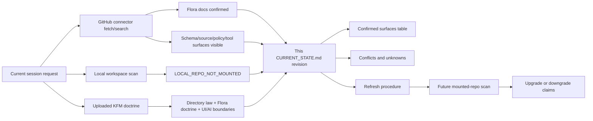

<!-- [KFM_META_BLOCK_V2]
doc_id: kfm://doc/NEEDS-VERIFICATION__docs-domains-flora-current-state
title: Flora Current State
type: standard
version: v1
status: draft
owners: NEEDS-VERIFICATION__flora-steward
created: NEEDS-VERIFICATION__existing-file
updated: 2026-05-07
policy_label: NEEDS-VERIFICATION__public-doc-no-sensitive-source-data
related: [docs/domains/flora/README.md, docs/domains/flora/architecture/ARCHITECTURE.md, docs/domains/flora/architecture/DATA_MODEL.md, docs/domains/flora/tracking/VERIFICATION_BACKLOG.md, docs/domains/flora/usda_plants/USDA_PLANTS_INGESTION.md, contracts/source/kansas_flora/README.md, schemas/flora/README.md, docs/registers/domain_file_index.md, docs/registers/domain_doc_index.md]
tags: [kfm, flora, current-state, repo-evidence, governance]
notes: [doc_id, owners, created date, and policy label require steward verification before publication., This file records connector-visible repository evidence plus local workspace limits; it does not claim runtime behavior, CI enforcement, branch protection, or deployed release state.]
[/KFM_META_BLOCK_V2] -->

<a id="top"></a>

# Flora Current State

Current-state ledger for the KFM Flora lane: verified repository surfaces, known gaps, implementation-adjacent files, conflicts, and next checks.


> [!IMPORTANT]
> **Snapshot date:** 2026-05-07  
> **Target file:** `docs/domains/flora/CURRENT_STATE.md`  
> **Repo evidence mode:** `GITHUB_CONNECTOR_CONFIRMED` for fetched/search-visible files; `LOCAL_REPO_NOT_MOUNTED` for the container workspace.  
> **Current posture:** Flora has meaningful documentation, source-contract, schema, policy, and tool surfaces visible through repository search, but runtime behavior, CI pass/fail state, branch protections, package manager behavior, emitted proof objects, and public release state remain **UNKNOWN** until a real checkout and test run are inspected.

**Quick jumps:** [Scope](#scope) · [Evidence basis](#evidence-basis) · [Executive state](#executive-state) · [Confirmed surfaces](#confirmed-surfaces) · [Conflicts](#conflicts-to-resolve) · [Unknowns](#unknowns) · [Risk posture](#risk-posture) · [Refresh procedure](#refresh-procedure) · [Next checks](#next-checks)

---

## Scope

This document answers a narrow question:

> What can be responsibly said about the **current Flora lane** from evidence inspected in this session?

It is not the Flora architecture, source registry, schema definition, publication policy, roadmap, or release proof. It is the evidence ledger that keeps those documents honest.

### In scope

- Fetched or search-visible repository files related to Flora.
- Local workspace inspection limits.
- Documentation placement and grouping.
- Current known Flora source-contract, schema, policy, and tool surfaces.
- Conflicts between older path expectations and current grouped layout.
- Verification items that must block stronger claims.

### Out of scope

- Claims that routes are live.
- Claims that workflows pass.
- Claims that USDA PLANTS or any Flora source is a live connector.
- Claims that public Flora artifacts are released.
- Claims that sensitive plant records are safe for public precision.
- Claims that schema-home authority is settled.
- Claims that AI, Evidence Drawer, MapLibre, or review-console integrations are implemented unless directly verified in code and tests.

[Back to top](#top)

---

## Evidence basis

| Evidence channel | Status | What it supports | What it does **not** support |
|---|---:|---|---|
| Local container scan | **CONFIRMED** | `/mnt/data` and common local roots did not expose a mounted KFM Git checkout in this session. | Does not prove the repository is absent; only proves it was not locally mounted here. |
| GitHub connector fetch | **CONFIRMED** | Specific files were fetched from `bartytime4life/Kansas-Frontier-Matrix` at `ref=main`. | Does not prove runtime behavior, CI success, deployment state, branch protection, or current unmerged work. |
| GitHub connector search | **CONFIRMED / BOUNDED** | Additional path existence signals for Flora docs, schemas, policy, and tooling. | Search-visible paths still need content inspection before behavior claims. |
| Uploaded KFM doctrine PDFs | **CONFIRMED doctrine / lineage** | Directory law, Flora lane doctrine, public-safe posture, trust membrane, MapLibre/AI boundaries, object-family vocabulary. | Does not override current repository evidence and does not prove implementation. |
| Prior `CURRENT_STATE.md` | **CONFIRMED file existed** | The target file existed and had a compact 2026-04-27-style status inventory. | Its path map needed reconciliation with current grouped Flora docs and connector-visible surfaces. |

> [!NOTE]
> This file intentionally distinguishes **file presence** from **behavioral proof**. A schema file, Rego file, or tool path can exist without proving that CI runs it, that workflows require it, or that a public release has passed it.

---

## Executive state

| Area | Current label | Determination |
|---|---:|---|
| Flora lane exists in repo | **CONFIRMED** | `docs/domains/flora/README.md` and `docs/domains/flora/CURRENT_STATE.md` were fetched, and additional Flora files were found by connector search. |
| Local checkout available | **UNKNOWN / not mounted here** | No local Git checkout was available in `/mnt/data` or common roots during this session. |
| Documentation grouping | **CONFIRMED / CONFLICTED** | Current repo index says Flora docs are grouped under `architecture/`, `governance/`, `operations/`, `registers/`, and `tracking/`; older/root-level companion links still appear in Flora README-style material and should be reconciled. |
| Architecture doc | **CONFIRMED** | `docs/domains/flora/architecture/ARCHITECTURE.md` exists and states Flora flow and invariants. |
| Data-model doc | **CONFIRMED** | `docs/domains/flora/architecture/DATA_MODEL.md` exists and lists Flora object families. |
| Verification backlog | **CONFIRMED** | `docs/domains/flora/tracking/VERIFICATION_BACKLOG.md` exists and still includes high-priority open checks. |
| USDA PLANTS slice | **CONFIRMED / bounded** | `docs/domains/flora/usda_plants/USDA_PLANTS_INGESTION.md` exists and explicitly frames the slice as no-network, fixture-backed, and not a live connector or publication workflow. |
| Source contracts | **CONFIRMED** | `contracts/source/kansas_flora/README.md` exists; `gbif.md`, `ksc_ipt.md`, and `usda_plants.md` are search-visible. |
| Schema surface | **CONFIRMED / NEEDS VERIFICATION** | `schemas/flora/README.md` and several `schemas/flora/*.schema.json` files are visible; schema-home authority remains unresolved. |
| Policy surface | **CONFIRMED / NEEDS VERIFICATION** | `policy/flora/usda_plants_review.rego` is search-visible and was fetched, but CI enforcement is not verified. |
| Tools surface | **CONFIRMED / NEEDS VERIFICATION** | Many Flora USDA PLANTS helper files are search-visible under `tools/`; content and test coverage are not fully audited here. |
| Tests / fixtures | **UNKNOWN** | Connector search did not return `tests/flora` or `tests/fixtures/flora` results from the targeted queries used in this pass. |
| Workflows | **UNKNOWN** | Targeted search for Flora-specific workflow names did not return results. Repo-wide workflow behavior remains unverified. |
| Runtime/API/UI integration | **UNKNOWN** | No route handler, live governed API behavior, MapLibre layer registry integration, Evidence Drawer integration, Focus Mode integration, dashboard, or runtime log was verified. |
| Public release | **UNKNOWN / not claimed** | No published Flora release manifest, proof pack, rollback card, public artifact, or deployment state was verified in this pass. |

[Back to top](#top)

---

## Confirmed surfaces

### Documentation

| Path | Status | Evidence note | Current-state implication |
|---|---:|---|---|
| `docs/domains/flora/CURRENT_STATE.md` | **CONFIRMED** | Existing target file fetched from repository. | This revision should replace the compact scan with a richer current-state ledger. |
| `docs/domains/flora/README.md` | **CONFIRMED** | Fetched from repository; contains KFM meta block, badges, scope, repo fit, and a broad proposed companion-doc map. | Useful as lane entrypoint; some links/path expectations need reconciliation with grouped docs. |
| `docs/domains/flora/architecture/ARCHITECTURE.md` | **CONFIRMED** | Fetched from repository. | Current architecture doc confirms source-descriptor → intake → validation → promotion → governed API → UI flow. |
| `docs/domains/flora/architecture/DATA_MODEL.md` | **CONFIRMED** | Fetched from repository. | Current model doc confirms object families such as `FloraSourceDescriptor`, `FloraTaxon`, `OccurrenceEvidenceObject`, `EvidenceBundle`, `DecisionEnvelope`, and `ReleaseManifest`. |
| `docs/domains/flora/usda_plants/USDA_PLANTS_INGESTION.md` | **CONFIRMED** | Fetched from repository. | Confirms the USDA PLANTS slice is no-network and fixture-backed, not a live connector/publication path. |
| `docs/domains/flora/tracking/VERIFICATION_BACKLOG.md` | **CONFIRMED** | Fetched from repository. | High-priority backlog remains active: schema home, source registry, policy engine, validators, API, and UI integration need verification. |
| `docs/domains/flora/tracking/CHANGELOG.md` | **SEARCH-VISIBLE** | Returned by connector search. | Needs content inspection before claims about history. |
| `docs/domains/flora/tracking/ROADMAP.md` | **SEARCH-VISIBLE** | Returned by connector search. | Needs content inspection before claims about sequence. |
| `docs/domains/flora/IDEA_INTAKE.md` | **SEARCH-VISIBLE** | Returned by connector search. | Supports idea-intake pattern; content not audited here. |
| `docs/registers/domain_file_index.md` | **CONFIRMED** | Fetched from repository. | Confirms grouped domain-doc structure. |
| `docs/registers/domain_doc_index.md` | **CONFIRMED** | Fetched from repository. | Confirms Flora is included in the indexed domain set. |

### Source contracts and source registry posture

| Path | Status | Evidence note | Current-state implication |
|---|---:|---|---|
| `contracts/source/kansas_flora/README.md` | **CONFIRMED** | Fetched from repository. | Confirms a source-admission contract surface for Kansas Flora. |
| `contracts/source/kansas_flora/gbif.md` | **SEARCH-VISIBLE** | Returned by connector search. | Candidate source contract exists; content needs audit before source-role claims. |
| `contracts/source/kansas_flora/ksc_ipt.md` | **SEARCH-VISIBLE** | Returned by connector search. | Candidate source contract exists; content needs audit before source-role claims. |
| `contracts/source/kansas_flora/usda_plants.md` | **SEARCH-VISIBLE** | Returned by connector search. | Candidate USDA PLANTS source contract exists; content needs audit before connector claims. |

### Schemas

| Path | Status | Evidence note | Current-state implication |
|---|---:|---|---|
| `schemas/flora/README.md` | **CONFIRMED** | Fetched from repository. | Confirms schema surface exists but also states schema-home authority needs verification. |
| `schemas/flora/usda_plants_dataset.schema.json` | **CONFIRMED** | Fetched from repository. | Confirms at least one USDA PLANTS dataset schema exists and is shaped as a no-network/processed-record contract. |
| `schemas/flora/flora_evidencebundle.schema.json` | **SEARCH-VISIBLE** | Returned by connector search. | Content needs audit before shared-object compatibility claims. |
| `schemas/flora/usda_plants_catalog.schema.json` | **SEARCH-VISIBLE** | Returned by connector search. | Content needs audit before catalog-closure claims. |
| `schemas/flora/usda_plants_evidence_link.schema.json` | **SEARCH-VISIBLE** | Returned by connector search. | Content needs audit before EvidenceRef/EvidenceBundle claims. |

### Policy

| Path | Status | Evidence note | Current-state implication |
|---|---:|---|---|
| `policy/flora/usda_plants_review.rego` | **CONFIRMED / NEEDS VERIFICATION** | Fetched from repository. | Deny rules exist for publication/promotion claims, auto-merge/auto-PR, non-human approval, missing hashes, coordinate/geometry leakage, bad rights, and published refs. CI enforcement remains unknown. |

### Tools

Connector search returned many Flora-specific tool paths, especially for USDA PLANTS. They are **search-visible**, not fully audited here.

| Tool family | Example paths | Status | Current-state implication |
|---|---|---:|---|
| Source discovery / fetch | `tools/sources/flora/usda_plants_source_discovery.py`, `tools/sources/flora/usda_plants_live_fetcher.py` | **SEARCH-VISIBLE** | Tool presence does not prove live connector activation or safe source terms. |
| Intake / lock / staging | `tools/intake/flora/usda_plants_snapshot_intake.py`, `tools/intake/flora/usda_plants_snapshot_lock_builder.py`, `tools/normalize/flora/usda_plants_stage_raw_snapshot.py` | **SEARCH-VISIBLE** | Need content and test audit before claiming lifecycle coverage. |
| Diff / watcher | `tools/diff/flora/usda_plants_snapshot_diff.py`, `tools/watchers/flora/usda_plants_manual_watcher.py`, `tools/watchers/flora/usda_plants_scheduled_observer.py` | **SEARCH-VISIBLE** | Watcher existence does not prove scheduled automation is enabled. |
| Quality / geometry | `tools/quality/flora/usda_plants_column_contract_builder.py`, `tools/geometry/flora/usda_plants_county_geometry_validator.py`, `tools/geometry/flora/usda_plants_publish_county_presence_geojson.py` | **SEARCH-VISIBLE** | Need validation run and fixture evidence before public geometry claims. |
| Evidence / review | `tools/evidence/flora/usda_plants_evidence_link_builder.py`, `tools/review/flora/usda_plants_review_decision_builder.py`, `tools/review/flora/usda_plants_review_audit_ledger_builder.py` | **SEARCH-VISIBLE** | Suggests governance intent; not proof of complete review workflow. |
| Release / publication / deployment | `tools/release/flora/usda_plants_release_candidate_builder.py`, `tools/publication/flora/usda_plants_publication_request_builder.py`, `tools/deploy/flora/usda_plants_deployment_receipt_builder.py` | **SEARCH-VISIBLE** | Names release/publication concepts; actual release state remains unknown. |
| Archive / tiles | `tools/archive/flora/usda_plants_tile_archive_packaging_plan_builder.py`, `tools/archive/flora/usda_plants_tile_archive_publication_approval_builder.py` | **SEARCH-VISIBLE** | Archive packaging plans are not proof of published tile artifacts. |

[Back to top](#top)

---

## Conflicts to resolve

| Conflict | Evidence | Risk | Recommended action |
|---|---|---|---|
| Root-level Flora companion docs vs grouped docs | Older README-style material lists many docs directly under `docs/domains/flora/`, while current domain index says Flora docs are grouped under subfolders such as `architecture/`, `operations/`, `registers/`, and `tracking/`. | Broken links, duplicate docs, stale current-state claims. | Update README links and this current-state file to match grouped structure; add redirect stubs only if stable anchors require them. |
| Schema-home authority | `schemas/flora/` exists, while doctrine and README text still point to unresolved `contracts/` vs `schemas/contracts/v1/` questions. | Parallel machine schemas, validator drift, contract/schema split confusion. | Add or update ADR for Flora schema home; mark any noncanonical schema paths as compatibility or transitional. |
| Source contract vs machine registry | `contracts/source/kansas_flora/` exists, but machine registry path and activation state were not verified. | Source docs may imply admission without machine descriptor validation. | Verify `data/registry/flora/` or repo-native registry home; keep source contracts semantic and registry records machine-checkable. |
| Tool names imply publication/release | Several tool paths include `publication`, `release`, `deployment`, or `archive`. | Maintainers may infer public release exists. | Treat all such tools as implementation-adjacent until tests, workflows, release manifests, and published artifacts are verified. |
| Policy file exists but enforcement unknown | `policy/flora/usda_plants_review.rego` exists. | Rego presence can be mistaken for CI or runtime enforcement. | Verify policy engine, tests, CI workflow, and required checks before claiming enforcement. |
| USDA PLANTS live-fetch naming vs no-network slice | A live fetcher path is search-visible, while ingestion doc says the current slice is no-network and not a live connector. | Connector activation could be overstated. | Keep documentation language strict: no-network fixture slice is confirmed; live connector state is unknown. |
| Public geometry risk | Flora is high-risk for rare/protected plant precision. | Exact sensitive geometry leakage. | Require sensitivity policy, transform receipts, review records, and deny tests before public geometry publication. |

[Back to top](#top)

---

## Unknowns

These items must remain **UNKNOWN** or **NEEDS VERIFICATION** until directly checked.

| Unknown | Why it matters | Verification method |
|---|---|---|
| Current branch and dirty state in a working checkout | Connector fetch is not a local checkout. | Mount repo; run `git status --short`, `git branch --show-current`, and `git rev-parse HEAD`. |
| Package manager and test runner | Needed for commands, CI, and validator execution. | Inspect `package.json`, `pyproject.toml`, `Makefile`, lockfiles, and workflows. |
| Flora-specific CI workflows | Search did not confirm `flora-ci.yml` or `flora-promotion.yml`. | Inspect `.github/workflows/` and branch-required checks. |
| Repo-wide CI behavior | Required checks may exist under generic workflows. | Inspect workflow YAML and run CI locally where possible. |
| `tests/flora` and `tests/fixtures/flora` | Targeted search did not confirm these paths. | Use repository tree listing and full search. |
| Shared governance objects | Need to avoid Flora-specific forks. | Search/fetch for shared `SourceDescriptor`, `EvidenceBundle`, `DecisionEnvelope`, `ReleaseManifest`, `RunReceipt`, `AIReceipt`, `LayerManifest`, and `PolicyDecision`. |
| Runtime/API route names | Public clients must use governed APIs. | Inspect app routes, OpenAPI, DTOs, middleware, and tests. |
| UI integration path | MapLibre layer registry, Evidence Drawer, and Focus Mode wiring are not verified. | Inspect app/UI source tree and UI tests. |
| Source registry home | Source contract docs exist; machine registry is not verified here. | Inspect `data/registry/`, `control_plane/`, and source registry docs. |
| Source rights and current endpoints | External source facts are version- and terms-sensitive. | Re-check official source terms, API docs, endpoints, and attribution obligations. |
| Steward ownership | Metadata still includes unresolved owner placeholders. | Inspect `CODEOWNERS`, steward registry, project governance docs. |
| Release artifacts | No release manifest/proof pack/public artifact was verified. | Inspect `release/`, `data/proofs/`, `data/published/`, catalog dirs, and generated artifacts. |
| Dashboard/runtime logs | No runtime proof was available. | Inspect deployment/logs/dashboards if available. |
| Branch protections | Not visible through file content. | Inspect repository settings. |

[Back to top](#top)

---

## Risk posture

> [!CAUTION]
> Flora has a higher sensitivity burden than many public environmental layers. Rare plant, protected-location, controlled-access, and steward-reviewed records should fail closed when rights, sensitivity, review state, or public precision are unclear.

| Risk | Current state | Required guard |
|---|---:|---|
| Exact rare-location exposure | **NEEDS VERIFICATION** | Deny exact public geometry unless reviewed and authorized; require transform receipt for generalized public output. |
| Source authority confusion | **NEEDS VERIFICATION** | Preserve `source_role`, `authority_boundary`, and citation posture in every downstream object. |
| Live connector overclaim | **HIGH if unstated** | Keep USDA PLANTS slice language no-network unless live activation is explicitly proven. |
| Schema drift | **ACTIVE** | Resolve schema-home ADR and avoid parallel schema definitions. |
| Tooling drift | **ACTIVE** | Tie tools to tests, CI, and docs; avoid untested helper sprawl. |
| Policy-enforcement overclaim | **ACTIVE** | Treat Rego files as policy assets, not enforcement proof, until CI/runtime use is verified. |
| Model-as-observation collapse | **ACTIVE domain risk** | Keep occurrences/specimens/models/range/habitat/public layers distinct. |
| UI trust leakage | **ACTIVE if public layer added** | Require Evidence Drawer payloads, finite Focus outcomes, public-safe layer manifests, and no raw public path tests. |

---

## Current-state map



---

## Refresh procedure

Run this procedure whenever the Flora lane changes materially.

### 1. Verify local checkout

```bash
pwd
git status --short
git branch --show-current || true
git rev-parse --show-toplevel
git rev-parse HEAD
```

### 2. Inventory Flora docs

```bash
find docs/domains/flora -maxdepth 4 -type f | sort
find docs/registers -maxdepth 2 -type f | sort | grep -E 'domain_(file|doc)_index|flora' || true
```

### 3. Inventory implementation-adjacent surfaces

```bash
find contracts/source/kansas_flora schemas/flora policy/flora tools -maxdepth 5 -type f 2>/dev/null \
  | grep -E 'flora|usda_plants|kansas_flora' \
  | sort

find tests fixtures .github/workflows apps packages data release control_plane -maxdepth 5 -type f 2>/dev/null \
  | grep -E 'flora|usda_plants|kansas_flora|evidencebundle|decision|release|layer' \
  | sort
```

### 4. Check expected negative-path coverage

```bash
grep -RInE \
  'missing_rights|unknown_rights|sensitive|coordinate|geometry|not_published|not_promoted|auto_merge|auto_pr|EvidenceBundle|ABSTAIN|DENY|ERROR' \
  policy tools tests schemas docs/domains/flora 2>/dev/null || true
```

### 5. Run repo-native validators

Replace the commands below with repo-native targets after package manager and tooling are confirmed.

```bash
# PROPOSED examples only.
python -m jsonschema --help >/dev/null 2>&1 || true
pytest -q tests/flora 2>/dev/null || true
conftest test tests/fixtures/flora -p policy/flora 2>/dev/null || true
```

### 6. Update this file

After inspection:

1. Move confirmed paths from **SEARCH-VISIBLE** to **CONFIRMED** only after content is fetched or checked.
2. Move behavior claims from **UNKNOWN** to **CONFIRMED** only after tests, workflows, runtime logs, or emitted artifacts are inspected.
3. Add new conflicts instead of smoothing them over.
4. Keep public-release claims absent until release manifests, policy decisions, proofs, rollback targets, and public-safe artifacts are verified.

[Back to top](#top)

---

## Next checks

### P0 — before stronger implementation claims

- [ ] Mount or inspect a full repo checkout and record commit SHA.
- [ ] Reconcile `docs/domains/flora/README.md` companion links with grouped docs under `architecture/`, `tracking/`, and other subfolders.
- [ ] Verify or create Flora schema-home ADR.
- [ ] Verify `data/registry/flora/` or the repo-native source registry home.
- [ ] Confirm whether `tests/flora` and `tests/fixtures/flora` exist.
- [ ] Confirm whether `policy/flora/usda_plants_review.rego` is wired into CI or runtime.
- [ ] Audit USDA PLANTS tool files for actual network behavior, publication claims, and safe defaults.
- [ ] Confirm no public artifact references `raw/`, `work/`, `quarantine/`, or unpublished candidate paths.

### P1 — before public-safe layer work

- [ ] Verify layer manifest conventions and MapLibre registry path.
- [ ] Verify Evidence Drawer payload schema/fixtures.
- [ ] Verify Focus Mode finite outcomes and citation validation requirements.
- [ ] Add or audit sensitivity transform receipts for public generalized geometry.
- [ ] Add negative tests for precise sensitive coordinates and county geometry leakage.
- [ ] Confirm rollback/correction object home and release manifest conventions.

### P2 — before live source activation

- [ ] Re-check USDA PLANTS current access path, terms, rights, and attribution.
- [ ] Re-check GBIF, KSC/IPT, herbarium, and any state-botanist or steward-reviewed source terms before activation.
- [ ] Record source descriptors with source role, authority boundary, cadence, rights, sensitivity, public eligibility, and stable identifiers.
- [ ] Ensure live fetchers cannot auto-publish, auto-promote, or auto-open PRs without human/steward review where required.

---

## Status ledger

| Claim | Label | Reason |
|---|---:|---|
| Flora has a repository documentation lane. | **CONFIRMED** | Flora README, current-state file, architecture, data model, USDA PLANTS ingestion doc, and tracking backlog are visible through connector evidence. |
| Flora has implementation-adjacent schema assets. | **CONFIRMED / bounded** | `schemas/flora/README.md` and at least one USDA PLANTS schema were fetched; additional schema files are search-visible. |
| Flora has a policy asset for USDA PLANTS review. | **CONFIRMED / bounded** | Rego file is visible and fetched; enforcement is unknown. |
| Flora has source-contract assets. | **CONFIRMED / bounded** | Kansas Flora source-contract README was fetched; source-specific docs are search-visible. |
| Flora has a live source connector. | **UNKNOWN** | Tool names suggest possible fetch/probe code, but no runtime or CI evidence was inspected. |
| Flora has a public release. | **UNKNOWN / not claimed** | No release manifest, proof pack, rollback target, or public artifact was verified. |
| Flora has passing tests. | **UNKNOWN** | No test run occurred and targeted search did not confirm Flora tests. |
| Flora schema home is settled. | **NEEDS VERIFICATION / CONFLICTED** | Schema surface exists but doctrine and README still indicate schema-home ambiguity. |
| Flora UI/Focus/Evidence Drawer are wired. | **UNKNOWN** | No UI route/component/runtime proof was inspected. |
| Exact sensitive Flora geometry is public-safe. | **DENY by default** | Must require explicit authorization, policy, review, and transform receipt. |

---

## Definition of done for this current-state file

- [x] Includes KFM Meta Block v2 with unresolved values clearly marked.
- [x] Distinguishes local workspace evidence from GitHub connector evidence.
- [x] Records confirmed Flora docs and implementation-adjacent surfaces.
- [x] Avoids claiming runtime behavior, CI enforcement, branch protection, deployed state, or public release.
- [x] Marks schema-home and path-layout issues as conflicts rather than smoothing them over.
- [x] Preserves Flora sensitivity posture and fail-closed public geometry handling.
- [x] Provides refresh commands for future maintainers.
- [ ] Replace owner and created-date placeholders after steward/CODEOWNERS verification.
- [ ] Re-run from a mounted checkout and update all **SEARCH-VISIBLE** paths after content audit.
- [ ] Add internal links once grouped Flora docs and README references are reconciled.

[Back to top](#top)
