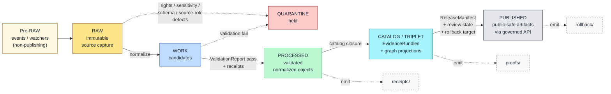
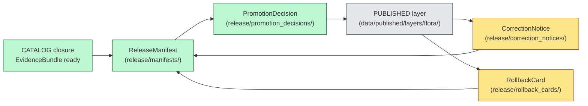

<!-- [KFM_META_BLOCK_V2]
doc_id: kfm://doc/flora-data-lifecycle
title: Flora — Data Lifecycle (RAW → PUBLISHED)
type: standard
version: v1.1
status: draft
owners: <flora-domain-steward> (PLACEHOLDER), <data-lifecycle-steward> (PLACEHOLDER)
created: 2026-05-16
updated: 2026-06-03
policy_label: public
contract_version: 3.0.0
related: [
  "docs/doctrine/directory-rules.md",
  "ai-build-operating-contract.md",
  "docs/domains/flora/README.md",
  "docs/domains/flora/SENSITIVITY.md",
  "docs/domains/flora/CROSSWALKS.md",
  "docs/domains/flora/CROSS_LANE_NOTES.md",
  "docs/domains/flora/CONTINUITY_INVENTORY.md",
  "docs/runbooks/flora/SOURCE_REFRESH_RUNBOOK.md",
  "docs/standards/PROV.md",
  "data/README.md",
  "release/README.md"
]
tags: [kfm, flora, lifecycle, governance, evidence, sensitivity]
notes: [
  "CONTRACT_VERSION pinned to 3.0.0 per ai-build-operating-contract.md.",
  "Lifecycle invariant CONFIRMED; Flora lane application PROPOSED.",
  "Implementation maturity, exact paths, validator IDs, and CI integration NEEDS VERIFICATION.",
  "v1.1: normalized paths to the Directory Rules §12 domains/-segment form and surfaced DR-FLORA-PATH-01; retired FloraDecisionEnvelope in favor of RuntimeResponseEnvelope; mapped quarantine codes to the canonical Atlas §24.6.3 reason codes; added doctrine companion sections.",
  "Replace owner placeholders before review."
]
[/KFM_META_BLOCK_V2] -->

# Flora — Data Lifecycle (RAW → PUBLISHED)

> Governance contract for how Flora source material — plant taxa, specimens, occurrences, vegetation communities, invasive plants, phenology, rare-plant records, and restoration context — moves through the KFM lifecycle without becoming public truth prematurely.

  
  
  
  
  
  
  

**Status:** Draft · **Owners:** `<flora-domain-steward>`, `<data-lifecycle-steward>` (PLACEHOLDER) · **Last updated:** 2026-06-03 · **Contract:** `CONTRACT_VERSION = "3.0.0"` · **Authority:** Directory Rules (lifecycle invariant + Domain Placement Law §12) + Atlas v1.1 §8.H, §24.6; per-domain lane application is PROPOSED.

---

## On this page

- [1. Scope and boundary](#1-scope-and-boundary)
- [2. The Flora lifecycle at a glance](#2-the-flora-lifecycle-at-a-glance)
- [3. Pre-RAW admission edge](#3-pre-raw-admission-edge)
- [4. Stage-by-stage handling and gates](#4-stage-by-stage-handling-and-gates)
- [5. Object families through the lifecycle](#5-object-families-through-the-lifecycle)
- [6. Sensitivity, geoprivacy, and redaction at each stage](#6-sensitivity-geoprivacy-and-redaction-at-each-stage)
- [7. QUARANTINE conditions specific to Flora](#7-quarantine-conditions-specific-to-flora)
- [8. CATALOG / TRIPLET closure](#8-catalog--triplet-closure)
- [9. Publication, correction, and rollback](#9-publication-correction-and-rollback)
- [10. Watchers and the non-publisher invariant](#10-watchers-and-the-non-publisher-invariant)
- [11. Path placement under Directory Rules](#11-path-placement-under-directory-rules)
- [12. Validators, tests, and fixtures](#12-validators-tests-and-fixtures)
- [13. Open questions register](#13-open-questions-register)
- [14. Verification backlog](#14-verification-backlog)
- [15. Changelog](#15-changelog)
- [16. Definition of done](#16-definition-of-done)
- [17. Related docs](#17-related-docs)

---

## 1. Scope and boundary

This document governs **how Flora data moves through KFM lifecycle phases**, not what Flora *means* (see `docs/domains/flora/README.md`) and not what Flora *publishes by default* (see `docs/domains/flora/SENSITIVITY.md`). Its job is to bind the lifecycle invariant to Flora-specific objects, source families, sensitivity controls, and gate artifacts.

**In scope:**

- The `RAW → WORK / QUARANTINE → PROCESSED → CATALOG / TRIPLET → PUBLISHED` chain applied to Flora.
- Pre-RAW admission events (watchers, source-head checks, drift sidecars) feeding Flora intake.
- Per-stage handling, required artifacts, and fail-closed outcomes for Flora.
- How rare-plant, culturally sensitive, and join-sensitive material is held, transformed, or denied at each stage.
- Lifecycle-relevant path placement under `data/<phase>/flora/` and adjacent registries.

**Out of scope:**

- Field-level shape (lives in `schemas/contracts/v1/domains/flora/` — PROPOSED).
- Object meaning (lives in `contracts/domains/flora/` — PROPOSED).
- Identity / source-field reconciliation (lives in `docs/domains/flora/CROSSWALKS.md`).
- Cross-lane edge ownership (lives in `docs/domains/flora/CROSS_LANE_NOTES.md`).
- Policy / sensitivity decision logic (lives in `policy/domains/flora/` — PROPOSED).
- Release decision artifacts themselves (live in `release/` — see §9).
- Domain identity, mission, and the wider Flora overview (see `docs/domains/flora/README.md`).

> [!NOTE]
> Promotion is a **governed state transition, not a file move**. A pipeline that writes Flora bytes from `data/raw/flora/` directly into `data/published/layers/flora/` without passing validators, policy gates, EvidenceBundle creation, catalog closure, and a recorded release decision violates the lifecycle invariant regardless of which directory the bytes ended up in. [ATLAS §24.6.2] [DIRRULES]

[Back to top](#on-this-page)

---

## 2. The Flora lifecycle at a glance

The lifecycle invariant `RAW → WORK / QUARANTINE → PROCESSED → CATALOG / TRIPLET → PUBLISHED` is **CONFIRMED doctrine** (Directory Rules; Atlas v1.1 §24.6 "every domain follows the lifecycle invariant"; Unified Implementation Architecture Build Manual §6/§7). Its application to Flora is **PROPOSED** per Atlas v1.1 §8.H and the Encyclopedia §7.6. Receipts, proofs, registry, and rollback are emitted **alongside** the lifecycle phases — they do not replace them. [ATLAS §24.6] [ENCY §7.6] [UNIFIED]

| Phase | Flora-specific cargo | Status |
|---|---|---|
| **Pre-RAW** | Watcher sidecars for GBIF / iNaturalist / PLANTS / NatureServe; source-head checks; `SourceIntakeRecord` candidates. | PROPOSED |
| **RAW** | Immutable specimen and occurrence payloads under source identity; herbarium DwC-A archives; vegetation-index scenes. | PROPOSED |
| **WORK** | Normalized Plant Taxon / Flora Occurrence / Vegetation Community candidates; pending taxonomic reconciliation. | PROPOSED |
| **QUARANTINE** | Rare-plant exact-geometry exposures, rights-unclear feeds, taxonomy collisions, join-induced sensitivity. | PROPOSED |
| **PROCESSED** | Validated normalized objects + ValidationReport + public-safe candidate transforms. | PROPOSED |
| **CATALOG / TRIPLET** | EvidenceBundles, STAC/DCAT/PROV records, graph projections, Redaction Receipts. | PROPOSED |
| **PUBLISHED** | Released public-safe Flora layers behind `apps/governed-api/`; ReleaseManifest + rollback target. | PROPOSED |

[Back to top](#on-this-page)

---

## 3. Pre-RAW admission edge

CONFIRMED doctrine (Unified Manual §7; Pass-23/32 pre-RAW event family) introduces a **pre-RAW event family** for the admission edge. Its job is to record *attempted intake* before any byte is admitted into RAW, especially where automated watchers, GitOps PR emission, live feeds, source refreshes, or model-assisted candidate generation could otherwise blur the boundary between observed input and accepted source material. Flora has several such admission surfaces.

**PROPOSED Flora admission surfaces:**

- **Source-health watchers** for GBIF occurrence endpoints, iNaturalist exports, NatureServe Explorer Pro releases, USDA PLANTS checklist drops, herbarium IPT instances, and KDWP / Kansas Biological Survey stewarded feeds.
- **Drift watchers** for USDA PLANTS county packages, taxonomic backbones (ITIS / GBIF Backbone), and vegetation-index time-series (MAIAC AOD, NLCD, LANDFIRE).
- **Source-head checks** (HTTP `ETag`, `Last-Modified`, content-length) used as low-cost change detection that fires a `SourceIntakeRecord` with `publication_state: WORK_CANDIDATE`.

> [!IMPORTANT]
> **Pre-RAW outputs are never public truth.** A watcher that observes a PLANTS county-package change emits an `EventEnvelope`, a `prefilter_output`, and an `EventRunReceipt` — it does not write into `data/processed/flora/` or `data/published/`. The watcher-as-non-publisher invariant is non-negotiable (see §10). [DIRRULES §13.5] [ATLAS §24.6.2]

**PROPOSED pre-RAW artifact set per admission event:**

| Artifact | Carries | Status |
|---|---|---|
| `EventEnvelope` | Source id, source role, observed change kind, observed time, retrieval time. | PROPOSED |
| `prefilter_output` | Schema / rights / sensitivity / source-role pre-check result. | PROPOSED |
| `EventRunReceipt` | Watcher run id, inputs hash, tool versions, attestation pointer. | PROPOSED |
| `SourceIntakeRecord` | Candidate envelope with `classmap_version`, geometry hashes, materiality reason, steward-review markdown. | PROPOSED |

[Back to top](#on-this-page)

---

## 4. Stage-by-stage handling and gates

The five lifecycle stages each carry **stage handling** (what is allowed and what shape material takes) and **stage gates** (the required artifacts and conditions for moving on). The five-row baseline below comes from Atlas v1.1 §8.H; gate detail draws from **Atlas v1.1 §24.6.1 Master Pipeline Gate Reference** (CONFIRMED doctrine).

### 4.1 Stage matrix

| Stage | Flora handling (PROPOSED) | Gate (PROPOSED minimum) | Failure-closed outcome |
|---|---|---|---|
| **RAW** | Capture immutable source payload or reference under source identity, with source role, rights, sensitivity, citation, observed/retrieval time, and content hash. | `SourceDescriptor` exists and resolves; payload hash recorded; source-role intent set. | Not admitted; logged as candidate awaiting steward. |
| **WORK / QUARANTINE** | Normalize schema, geometry, time, identity, evidence, rights, and policy; hold any failures in QUARANTINE with structured reason. | Validation and policy gate pass, **or** quarantine reason recorded. | Quarantine with reason; never silently promotes. |
| **PROCESSED** | Emit validated normalized objects (Plant Taxon, Flora Occurrence, Vegetation Community, etc.), per-object receipts, and public-safe candidate transforms. | `EvidenceRef` resolves; `ValidationReport` passes; digest closure exists. | Stay in WORK; structured `FAIL` outcome. |
| **CATALOG / TRIPLET** | Emit catalog records, `EvidenceBundle`s, graph/triplet projections, and release candidates. | `CatalogMatrix` entry exists; EvidenceBundle digest closure passes; PROV/STAC/DCAT projections close. | Hold at PROCESSED; structured `FAIL`; no public edge. |
| **PUBLISHED** | Serve released public-safe artifacts (generalized occurrence/range, vegetation community, invasive layer, phenology calendar, public-safe rare-plant product) through `apps/governed-api/` and a `LayerManifest`. | `ReleaseManifest` exists; rollback target recorded; correction path declared; `ReviewRecord` present where required. | Hold at CATALOG; no public surface change. |

### 4.2 Gate-artifact reference

The lifecycle gates require a minimum artifact set. The table below extracts the Flora-relevant rows from Atlas v1.1 §24.6.1 (CONFIRMED doctrine; gate names and required artifacts verbatim from the source).

| Gate (transition) | Pre-condition | Required artifacts | Failure-closed outcome | Citation |
|---|---|---|---|---|
| Admission (— → RAW) | Source identity + rights minimally established; source-role intent set. | `SourceDescriptor` (role, authority, rights, sensitivity, cadence); payload/reference hash. | Source not admitted; logged as candidate awaiting steward. | §24.6.1 |
| Normalization (RAW → WORK / QUARANTINE) | Schema, geometry, time, identity, evidence, rights, policy rules runnable. | `TransformReceipt`; working-set `ValidationReport`; `PolicyDecision`; QUARANTINE for failures. | Quarantine with reason; never silently promotes. | §24.6.1 |
| Validation (WORK → PROCESSED) | Validators deterministic and tied to fixtures; required receipts present. | `ValidationReport` pass; `Redaction Receipt` if sensitivity applies; `AggregationReceipt` if applies. | Stay in WORK; structured FAIL. | §24.6.1 |
| Catalog closure (PROCESSED → CATALOG / TRIPLET) | `EvidenceRef`s resolve; catalog matrix and digests close. | `CatalogMatrix` entry; `EvidenceBundle`; graph/triplet projections if applicable. | HOLD at PROCESSED; structured FAIL; no public edge. | §24.6.1 |
| Release (CATALOG / TRIPLET → PUBLISHED) | Review state where required; release authority distinct from author when materiality applies. | `ReleaseManifest`; rollback target; correction path; `ReviewRecord` (if required). | HOLD at CATALOG; no public surface change. | §24.6.1 |
| Correction (PUBLISHED → PUBLISHED′) | Detected error or new evidence; downstream derivatives identified. | `CorrectionNotice`; `ReviewRecord`; invalidation list; `ReleaseManifest` update or supersession. | Stale-state announcement; no silent edit. | §24.6.1 |
| Rollback (PUBLISHED → prior release) | Failed release or post-publication failure; targeted prior release identified. | `RollbackCard`; `CorrectionNotice`; `ReleaseManifest` reverts to prior release; derivative invalidation. | Held at current state until rollback validated. | §24.6.1 |

> [!NOTE]
> **Universal closure rule (CONFIRMED, §24.6.2).** A transition is closed only when (i) the required artifacts exist, (ii) every required artifact **resolves** — not merely references — its dependencies (`EvidenceRef → EvidenceBundle`, `source_id → SourceDescriptor`, `model_id → ModelRunReceipt`), and (iii) the policy gate evaluated and recorded its decision. Missing any of these means the transition fails closed and the prior state is preserved.

[Back to top](#on-this-page)

---

## 5. Object families through the lifecycle

Flora's canonical object families (from the Encyclopedia §7.6.C and Atlas v1.1 §8.B / §8.E) each travel through the lifecycle with different sensitivity and review burdens. The identity rule for every Flora object is **PROPOSED**: deterministic basis = `source_id` + `object_role` + `temporal_scope` + normalized digest. Source, observed, valid, retrieval, release, and correction times remain distinct where material — **CONFIRMED**.

> [!NOTE]
> **Casing follows the Atlas §8.B owned-list.** Several families render with spaces (`Plant Taxon`, `Flora Occurrence`, `Rare Plant Record`, `Vegetation Community`, `Phenology Observation`, `Habitat Association`, `Botanical Survey`, `Restoration Planting`, `Redaction Receipt`); others compounded (`SpecimenRecord`, `InvasivePlantRecord`, `RangePolygon`, `DistributionSurface`). Both forms are carried verbatim; field-level casing normalization is PROPOSED.

| Object family | Typical RAW source role | WORK/QUARANTINE risk | PROCESSED public-safe form | PUBLISHED surface |
|---|---|---|---|---|
| **Plant Taxon** | Taxonomic authority (ITIS, USDA PLANTS, GBIF Backbone). | Taxonomy version drift; ITIS-vs-GBIF disagreement. | Reconciled taxon with crosswalk identifiers. | Plant species page. |
| **FloraTaxon Crosswalk** | Aggregator (GBIF, NatureServe). | Stale or superseded mappings. | Versioned crosswalk row. | Crosswalk embedded in species page. |
| **SpecimenRecord** | Authority (herbarium IPT, iDigBio). | License ambiguity; coordinate uncertainty. | Specimen record with rights/license declared. | Linked specimen citation on species page. |
| **Flora Occurrence** | Observation (GBIF, iNaturalist). | Rare-taxon exact coordinate exposure. | Generalized occurrence; uncertainty preserved. | Generalized occurrence layer. |
| **Rare Plant Record** | Steward / regulatory (KDWP, USFWS ECOS, NatureServe Explorer Pro). | Exact site geometry; sensitive join. | **Deny-by-default**; generalized form only with Redaction Receipt + review. | Public-safe rare-plant product or withheld. |
| **Vegetation Community** | Authority / model (vegetation surveys, LANDFIRE). | Polygon precision over private land. | Generalized community polygon. | Vegetation community layer. |
| **InvasivePlantRecord** | Observation / steward (EDDMapS, state programs). | Premature outbreak signal; private-land detail. | Validated record with status badge. | Invasive plant spread layer. |
| **Phenology Observation** | Observation (iNaturalist, ground stations). | Sparse or coarse temporal coverage. | Validated phenology time-series row. | Phenology calendar. |
| **RangePolygon** | Model / authority (NatureServe, USFWS). | Modeled-vs-observed collapse. | Range polygon with source-role badge. | Range/distribution layer. |
| **Habitat Association** | Context (Habitat lane). | Cross-lane sensitivity inheritance. | Association preserving Habitat ownership. | Habitat association summary. |
| **Botanical Survey** | Authority (KU herbarium, surveys). | Survey completeness uncertainty. | Survey with completeness annotation. | Survey-backed map view. |
| **Restoration Planting** | Context (project records). | Site identification on private land. | Generalized restoration site. | Restoration planting layer. |
| **Redaction Receipt** | (Generated, not sourced.) | — | The lineage record itself. | Drawer-visible transform metadata. |

[Back to top](#on-this-page)

---

## 6. Sensitivity, geoprivacy, and redaction at each stage

**CONFIRMED doctrine** (Atlas v1.1 §20.5 / §8.I Deny-by-Default Register): Flora's deny-by-default surface is **exact rare / protected / culturally sensitive plant locations**, allowed publicly only when review + generalized/withheld geometry + Redaction Receipt are all present. The constraint is intentionally pre-publication — sensitivity decisions are made **before** material reaches PUBLISHED.

> [!CAUTION]
> **Sensitive-domain handling (operating contract §23.2).** Flora rare-plant exact locations are a sensitive domain. The most restrictive applicable disposition applies: **DENY public exact exposure · GENERALIZE before publication · REDACT when needed · QUARANTINE uncertain source material · REQUIRE steward review · REQUIRE transform receipt (Redaction Receipt) · ABSTAIN when support is inadequate.** No exact coordinates or restricted-source-derived fields reach PUBLISHED without clearance from the flora domain steward and rights-holder representative.

> [!WARNING]
> **Join-induced sensitivity is real.** Pass 19 / New Ideas 5-15 warns that USDA PLANTS county packages — benign in isolation — can become sensitive when joined to GBIF, iNaturalist, or Kansas Natural Heritage Inventory records. Sensitivity is a property of the **resulting product**, not just of the original source. Treat any Flora join that combines a taxa list with an occurrence source as fail-closed until reviewed. [P20 KFM-IDX-ANA-004]

### 6.1 Where sensitivity acts at each stage

| Stage | Sensitivity action | Required artifact |
|---|---|---|
| **Pre-RAW** | `prefilter_output` flags potentially sensitive sources (rare-plant feeds, joins). | Watcher sidecar. |
| **RAW** | Source-role assignment records `authority / observation / context / model`; rare-plant feeds tagged at intake. | `SourceDescriptor` rights + sensitivity fields. |
| **WORK** | Geoprivacy candidate transforms drafted: suppress, generalize to grid, generalize to watershed/county, buffer/jitter under constraints, delayed publication, steward-only exact access. | Candidate `Redaction Receipt`. |
| **QUARANTINE** | Anything with unresolved rights, unresolved sensitivity, exact-geometry exposure of listed taxa, or unresolved source role. | Quarantine reason record. |
| **PROCESSED** | Public-safe derivative produced with transform receipt; exact retained in non-public store under steward access only. | `Redaction Receipt` finalized. |
| **CATALOG / TRIPLET** | `EvidenceBundle` includes Redaction Receipt; sensitivity class labeled (`public` / `restricted` / `redacted`). | Bundle with sensitivity label. |
| **PUBLISHED** | Only public-safe derivatives released; Evidence Drawer surfaces the transform reason; deny-by-default fixture proves exact rare-plant geometry cannot render. | `ReleaseManifest` + drawer payload. |

### 6.2 Generalization transforms (PROPOSED)

The Master MapLibre Components & Functions reference records these PROPOSED transform shapes for sensitive Flora geometry. Each transform **must** emit a receipt stating input class, output class, reason, policy, reviewer, and residual risk.

| Transform | Input | Output | Receipt required |
|---|---|---|---|
| **Suppress** | Exact occurrence point. | Withheld; metadata only. | Yes |
| **Generalize to grid** | Exact occurrence point. | Grid cell (size policy-defined). | Yes |
| **Generalize to county / watershed / ecoregion** | Exact point or polygon. | Coarser administrative or ecological footprint. | Yes |
| **Buffer / jitter under constraints** | Exact point. | Constrained displacement preserving interpretive value. | Yes |
| **Delayed publication** | Time-sensitive observation. | Same record, released after embargo. | Yes |
| **Steward-only exact access** | Exact point. | Public sees nothing; reviewers see exact. | Yes |

[Back to top](#on-this-page)

---

## 7. QUARANTINE conditions specific to Flora

QUARANTINE is **not a stage to skip past**. It is the structured holding pen where Flora material with rights, sensitivity, schema, source-role, temporal, or evidence defects waits for remediation, denial, or steward decision.

> [!IMPORTANT]
> **Quarantine reasons map to the canonical gate-failure reason codes** in Atlas v1.1 §24.6.3 — KFM does not maintain a parallel reason-code home. The `Q-*` labels below are **mnemonics for this doc only**; the authoritative reason code is the §24.6.3 column, and that is what a `PolicyDecision` or quarantine record carries.

<strong>Quarantine reason taxonomy (PROPOSED mnemonics → CONFIRMED §24.6.3 codes)</strong>

| Mnemonic (this doc) | Trigger | Canonical §24.6.3 code | Path forward |
|---|---|---|---|
| `Q-RIGHTS-UNCLEAR` | Source license / terms not resolvable at intake (NatureServe Explorer Pro precise data, KDWP-stewarded feeds). | `RIGHTS_UNKNOWN` | Rights review; renegotiate access, generalize, or deny. |
| `Q-SENSITIVE-EXACT` | Exact geometry of a rare / protected / culturally sensitive taxon arrived in RAW. | `SENSITIVITY_UNRESOLVED` | Apply Redaction Receipt transform; release only the generalized form. |
| `Q-JOIN-SENSITIVE` | Join of PLANTS county list × GBIF/iNaturalist/heritage occurrence introduces sensitivity not present in inputs. | `SENSITIVITY_UNRESOLVED` | Treat the **join product** as deny-by-default until reviewed. |
| `Q-TAXONOMY-DRIFT` | ITIS / GBIF Backbone / USDA PLANTS disagree on accepted name or hierarchy. | `CONTRACT_DRIFT` | Hold pending tie-breaker policy (see §13). |
| `Q-SOURCE-ROLE-COLLAPSE` | A community-science observation cited as legal-status authority, or a model surface cited as observed evidence. | `ROLE_COLLAPSE` / `ROLE_DOWNCAST_FORBIDDEN` | Restore permitted source role; refuse upcast. |
| `Q-TEMPORAL-DEFECT` | Source / observed / valid / retrieval times collapse or contradict. | `SCHEMA_MISMATCH` | Re-derive times distinctly per Atlas v1.1 §8.E. |
| `Q-EVIDENCE-OPEN` | `EvidenceRef` does not resolve to an `EvidenceBundle`. | `MISSING_EVIDENCE` | Build the bundle or deny the claim. |
| `Q-SCHEMA-FAIL` | Object shape fails `schemas/contracts/v1/domains/flora/` validators. | `SCHEMA_MISMATCH` | Fix or drop the candidate. |

> [!CAUTION]
> Material in QUARANTINE has not been denied — it has been **held with a reason**. A QUARANTINE entry that lingers indefinitely is itself a drift signal. Pair each quarantine reason with a steward queue and a freshness threshold.

[Back to top](#on-this-page)

---

## 8. CATALOG / TRIPLET closure

PROCESSED objects do not become PUBLISHED by accumulating; they pass through **catalog closure**, where `EvidenceRef`s resolve into `EvidenceBundle`s and where PROV/STAC/DCAT projections close. Flora's catalog closure includes a graph/triplet projection so that Flora joins to Habitat, Fauna, Soil/Hydrology, and Hazards (Atlas v1.1 §8.F; see `CROSS_LANE_NOTES.md`) can be inspected without collapsing source-role distinctions.

**PROPOSED Flora catalog closure outputs:**

- `data/catalog/stac/flora/` — STAC items / collections for Flora datasets (vegetation rasters, occurrence packages, community polygons).
- `data/catalog/dcat/flora/` — DCAT dataset records for catalog discovery.
- `data/catalog/prov/flora/` — PROV-O lineage records for each EvidenceBundle (see `docs/standards/PROV.md`).
- `data/catalog/domain/flora/` — Domain catalog rows tying Flora objects to source descriptors and release candidates.
- `data/triplets/graph_deltas/flora/` — Graph projection deltas for Flora ↔ Habitat / Fauna / Soil / Hydrology / Hazards joins.

> [!NOTE]
> **CATALOG records and graph projections are derivative indexes**, not root truth. A graph triple stating `<Flora Occurrence>` `:in_habitat` `<HabitatPatch>` is admissible only when both objects resolve to released or review-authorized evidence. Search, vector retrieval, and graph projections never substitute for `EvidenceBundle` resolution. [ATLAS §24.6.2]

[Back to top](#on-this-page)

---

## 9. Publication, correction, and rollback

CONFIRMED doctrine / PROPOSED implementation: Flora publication requires `ReleaseManifest`, `EvidenceBundle`, validation and policy support, review state where required, correction path, stale-state rule, and rollback target (Atlas v1.1 §8.M; Encyclopedia §7.6 Appendix E).

**Lane separation (Directory Rules; release-duty separation per operating-law invariant 9 / Atlas §24.7):**

- `data/published/layers/flora/` owns the **artifacts** consumers read.
- `release/manifests/` owns the **decision** that authorized the release.
- `release/rollback_cards/` owns the decision-side rollback artifact; `data/rollback/flora/` records alias-revert receipts. (Whether `data/rollback/` is a sibling of lifecycle phases or merges into `release/rollback_cards/` is an open ADR item — see §13.)
- Release authority is **distinct from the original author** when materiality applies (Atlas §24.7 separation-of-duties).

**Correction is the canonical downgrade path.** Per the Atlas §24.6 tier-transition reading note: a tier *upgrade* (toward more public) always needs both a transform receipt and a review record; a tier *downgrade* (toward less public) never needs both — `CorrectionNotice` (+ `ReviewRecord`) is sufficient to remove or restrict. Temporal defects mark the artifact `SOURCE_STALE` until rebuilt.

[Back to top](#on-this-page)

---

## 10. Watchers and the non-publisher invariant

**CONFIRMED invariant** (Directory Rules §13.5; Atlas §24.6.2 trust membrane): **watchers observe and propose, they do not publish.** A Flora watcher that detects a USDA PLANTS county-package change, a NatureServe rank update, an iNaturalist export shift, or a GBIF dataset version bump emits the pre-RAW artifact set in §3 and stops. It never writes into `data/processed/flora/`, `data/catalog/`, or `data/published/`.

| Watcher target | Permitted output | Forbidden output |
|---|---|---|
| GBIF occurrence endpoint | `SourceIntakeRecord`; `EventRunReceipt`. | Direct write to `data/raw/flora/` without descriptor; any write past RAW. |
| iNaturalist export | `SourceIntakeRecord`; `prefilter_output`. | Any PROCESSED or PUBLISHED write. |
| USDA PLANTS county package | `DriftSummary` sidecar; candidate envelope. | Treating the drift as a published occurrence layer. |
| NatureServe Explorer Pro release | `SourceIntakeRecord` with sensitivity flag set high. | Any unredacted public exposure of rare-plant records. |
| Herbarium IPT (e.g., KU McGregor) | `SourceIntakeRecord` with license carried. | Republication ignoring the herbarium's license terms. |
| Vegetation-index time-series (MAIAC AOD, NLCD, LANDFIRE) | EvidenceBundle-bound anomaly candidate. | NDVI-drop → publish; AOD-blind anomaly. |

> [!IMPORTANT]
> "NDVI drop → publish" is the canonical Pass 19 anti-pattern. The strongest path is `Pixel Observation → Temporal Candidate → Multi-Sensor Consensus → Policy Evaluation → RuntimeResponseEnvelope → Promotion Review → Published Ecological Claim`.

[Back to top](#on-this-page)

---

## 11. Path placement under Directory Rules

Flora is a **domain segment inside responsibility roots**, never a root folder (Directory Rules §12 Domain Placement Law). The lifecycle-relevant paths below are CONFIRMED as canonical *shapes* per Directory Rules; the **exact entries** are PROPOSED until verified against mounted repo evidence.

> [!WARNING]
> **DR-FLORA-PATH-01 — Path-segment-form conflict (CONFLICTED).** Directory Rules §12 places flora artifacts under a `domains/` segment (`schemas/contracts/v1/domains/flora/`, `contracts/domains/flora/`, `policy/domains/flora/`). The Domains Atlas v1.1 **§24.13 crosswalk** places them without it (`schemas/contracts/v1/flora/`, `contracts/flora/`, `policy/sensitivity/flora/`). Per the authority order (`directory-rules.md` §2.1), **Directory Rules wins on placement** — this doc uses the §12 form below. File a `DRIFT_REGISTER.md` row; resolve by ADR (ADR-S-01 family). Same conflict tracked in `CONTINUITY_INVENTORY.md` §19, `CROSSWALKS.md` §12, and `CROSS_LANE_NOTES.md` §11.

| Lifecycle concern | Path shape (Directory Rules §12) | Status |
|---|---|---|
| Domain doc home (this file) | `docs/domains/flora/` | CONFIRMED shape; this file PROPOSED |
| Runbooks | `docs/runbooks/flora/` (e.g., `SOURCE_REFRESH_RUNBOOK.md`) | PROPOSED — subfolder vs flat-prefix convention is OPEN (DIRRULES §6.1.b OPEN-DR-02) |
| Object meaning | `contracts/domains/flora/` | PROPOSED |
| Schemas | `schemas/contracts/v1/domains/flora/` | PROPOSED; ADR-0001 governs the schema-home rule. (Atlas §24.13: `schemas/contracts/v1/flora/` — see DR-FLORA-PATH-01) |
| Policy / sensitivity | `policy/domains/flora/` | PROPOSED. (Atlas §24.13: `policy/sensitivity/flora/` for the sensitive sub-lane — see DR-FLORA-PATH-01) |
| Tests / fixtures | `tests/domains/flora/`; `fixtures/domains/flora/` | PROPOSED |
| Pipelines | `pipelines/domains/flora/`; `pipeline_specs/flora/` | PROPOSED |
| RAW | `data/raw/flora/<source_id>/<run_id>/` | PROPOSED |
| WORK | `data/work/flora/<run_id>/` | PROPOSED |
| QUARANTINE | `data/quarantine/flora/<reason>/<run_id>/` | PROPOSED |
| PROCESSED | `data/processed/flora/<dataset_id>/<version>/` | PROPOSED |
| Catalog | `data/catalog/stac/flora/`, `data/catalog/dcat/flora/`, `data/catalog/prov/flora/`, `data/catalog/domain/flora/` | PROPOSED |
| Triplets | `data/triplets/graph_deltas/flora/`; `data/triplets/exports/flora/` | PROPOSED |
| Published | `data/published/layers/flora/`; `data/published/api_payloads/flora/`; `data/published/pmtiles/flora/` | PROPOSED |
| Registry | `data/registry/sources/flora/`; `data/registry/sensitivity/flora/` | PROPOSED |
| Release | `release/candidates/flora/`; `release/manifests/`; `release/rollback_cards/`; `release/correction_notices/` | PROPOSED |

> [!NOTE]
> The runbook subfolder pattern `docs/runbooks/flora/` differs from older flat-prefix runbook names referenced in the Whole-UI + Governed AI Expansion Report. This divergence is an **open ADR item** (DIRRULES §6.1.b OPEN-DR-02) alongside the `PROV.md` vs `PROVENANCE.md` naming question and the `triplets/` vs `triplet/` form.

[Back to top](#on-this-page)

---

## 12. Validators, tests, and fixtures

Atlas v1.1 §8.K records the PROPOSED Flora validator set; each item is verifiable only against mounted repo evidence and is marked PROPOSED here.

- **Taxonomy reconciliation tests** — ITIS / GBIF Backbone / USDA PLANTS cross-check; flag drift candidates per `Q-TAXONOMY-DRIFT` / `CONTRACT_DRIFT`.
- **Rights / sensitivity validators** — Confirm `SourceDescriptor` rights field is resolved and that rare-plant feeds carry a sensitivity classification.
- **Exact sensitive public geometry denial** — Negative fixture proving that an exact rare-plant point cannot publish or render publicly.
- **Catalog closure tests** — `EvidenceBundle` digest closes; PROV/STAC/DCAT projections produced and integrity-validated.
- **API finite-outcome fixtures** — `RuntimeResponseEnvelope` produces only `ANSWER / ABSTAIN / DENY / ERROR`.
- **No-live-network fixture pipeline** — All Flora validators run against fixtures without live source activation.

> [!TIP]
> The first Flora thin slice in the Encyclopedia §7.6 is **one common-species occurrence/specimen fixture + one vegetation-community polygon with an `EvidenceBundle`-backed species page and a public-safe map.** That fixture is the cheapest way to exercise every gate above without negotiating live source rights.

> [!IMPORTANT]
> **`RuntimeResponseEnvelope` is canonical.** Earlier drafts named a bespoke `FloraDecisionEnvelope`; that DTO is **RETIRED — superseded** by the shared `RuntimeResponseEnvelope` per the cross-domain `DecisionEnvelope → RuntimeResponseEnvelope` migration. Do not reintroduce a domain-specific envelope.

[Back to top](#on-this-page)

---

## 13. Open questions register

| ID | Question | Owner role | Resolution path |
|---|---|---|---|
| OQ-FLORALC-01 | Which placement form is canonical for flora lifecycle artifacts — §12 `domains/` form vs Atlas §24.13 form (DR-FLORA-PATH-01)? | Docs + schema steward | ADR-S-01 family; Directory Rules §2.1 governs meanwhile |
| OQ-FLORALC-02 | Tie-breaker policy when ITIS and GBIF Backbone disagree on accepted name. | Policy steward | `policy/domains/flora/` + ADR |
| OQ-FLORALC-03 | Is `data/rollback/flora/` a sibling of lifecycle phases, or does it merge into `release/rollback_cards/`? | Release + docs steward | ADR (DIRRULES open question) |
| OQ-FLORALC-04 | Is `triplets/` (plural) or `triplet/` (singular) the chosen form for Flora graph projections? | Docs steward | one-line ADR |
| OQ-FLORALC-05 | Runbook subfolder (`docs/runbooks/flora/`) vs flat prefix; and `PROV.md` vs `PROVENANCE.md`. | Docs steward | ADR resolving DIRRULES §6.1.b OPEN-DR-02 |
| OQ-FLORALC-06 | Exact `RuntimeResponseEnvelope` route name for flora under `apps/governed-api/`. | API surface steward | mounted-repo inspection |
| OQ-FLORALC-07 | Validator exit-code contract for Flora pipelines. | Domain steward | ADR referenced in standards files |
| OQ-FLORALC-08 | Stale-state term reconciliation (`STALE` → `SOURCE_STALE`) for temporal-defect rollback. | Release steward | ADR-S-10 stale-state propagation |

[Back to top](#on-this-page)

---

## 14. Verification backlog

These items remain `NEEDS VERIFICATION` before promotion from `draft` to `published`. They belong on `docs/registers/VERIFICATION_BACKLOG.md` (PROPOSED).

1. Exact source endpoints, license texts, and rights state for KDWP, Kansas Biological Survey, KU McGregor Herbarium IPT, NatureServe Explorer Pro, USFWS ECOS, GBIF dataset DOIs, iDigBio, iNaturalist exports, and the USDA PLANTS bulk download. — NEEDS VERIFICATION
2. Exact rare-plant generalization thresholds (grid-cell size, county vs watershed, embargo lengths) in `policy/domains/flora/`. — NEEDS VERIFICATION
3. ITIS-vs-GBIF tie-breaker codified in `policy/domains/flora/`. — NEEDS VERIFICATION
4. Resolve DR-FLORA-PATH-01 (§12 vs §24.13 placement form) by ADR. — CONFLICTED
5. Resolve the `data/rollback/` sibling-vs-merge question by ADR. — OPEN
6. Watcher posture for live `iNaturalist` / `GBIF` endpoints (synthetic fixture only vs live, rate-aware admission). — NEEDS VERIFICATION
7. `RuntimeResponseEnvelope` flora route name under `apps/governed-api/`. — UNKNOWN
8. Deny-by-default fixture proving exact rare-plant geometry cannot render publicly. — NEEDS VERIFICATION

[Back to top](#on-this-page)

---

## 15. Changelog

| Change | Type (per contract §37) | Reason |
|---|---|---|
| Normalized all schema/contract/policy paths to the Directory Rules §12 `domains/`-segment form and surfaced DR-FLORA-PATH-01 as CONFLICTED | reconciliation | The v1 doc mixed `schemas/contracts/v1/flora/` (Atlas §24.13) with `contracts/domains/flora/` (§12); Directory Rules §2.1 wins on placement |
| Retired `FloraDecisionEnvelope`; replaced with `RuntimeResponseEnvelope` in §10 and §12, with a retirement callout | reconciliation | `RuntimeResponseEnvelope` is canonical per the cross-domain migration; bespoke per-domain envelopes are retired |
| Mapped the §7 `Q-*` quarantine mnemonics to the canonical Atlas §24.6.3 gate-failure reason codes | gap closure | Avoids a parallel reason-code home; the doctrine forbids parallel registry homes |
| Added the §24.6.2 universal-closure-rule callout to §4 and §8 | gap closure | The "resolves, not references" rule is the operative closure test and was implicit |
| Pinned `CONTRACT_VERSION = "3.0.0"` (meta block, badge, impact line) and `directory-rules.md` v1.3 | housekeeping | Required for doctrine-adjacent docs |
| Aligned object-family casing to the Atlas §8.B owned-list; added a casing-variance note in §5 | clarification | The v1 doc compounded `FloraOccurrence`, `RarePlantRecord`, `PhenologyObservation`, etc.; the Atlas renders them with spaces |
| Changed temporal-defect posture to mark `SOURCE_STALE`; pre-RAW artifacts re-cased to `EventEnvelope` / `EventRunReceipt` | reconciliation | Aligns with the open `STALE → SOURCE_STALE` reconciliation and the corpus object-family casing |
| Added doctrine companion sections (§13 Open questions register, §15 Changelog, §16 Definition of done); split the former combined §13 into a register + backlog | gap closure | Doctrine-adjacent docs ship these per the operating contract |
| Added cross-links to `CROSSWALKS.md` and `CROSS_LANE_NOTES.md`; replaced literal `NEEDS_VERIFICATION` doc_id with `kfm://doc/flora-data-lifecycle` | housekeeping | Sibling flora docs now exist; the doc_id placeholder was malformed |
| Bumped v1 → v1.1; updated date to 2026-06-03 | housekeeping | MINOR bump; no operating-law change, no receipt re-issue required |

> **Backward compatibility.** All v1 section headings §1–§12 keep their anchors; the former combined "Open questions and verification backlog" (§13) split into §13 (register) and §14 (backlog), and §14 "Related docs" moved to §17. Inbound links to §13/§14 from v1 should be re-pointed; flagged in Section 2.

[Back to top](#on-this-page)

---

## 16. Definition of done

This document is done enough to enter the repository when:

- it is placed according to Directory Rules (`docs/domains/flora/CROSS_LANE_NOTES.md` sibling set; this file at `docs/domains/flora/DATA_LIFECYCLE.md`, PROPOSED);
- a docs steward, the flora domain steward, and the data-lifecycle steward review it;
- it is linked from `docs/domains/flora/README.md` and the flora doc set;
- it does not conflict with accepted ADRs (and DR-FLORA-PATH-01 is filed in `DRIFT_REGISTER.md` pending ADR resolution);
- any conflict with current repo conventions is logged in `docs/registers/DRIFT_REGISTER.md`;
- the `GENERATED_RECEIPT.json` planned in Section 2 is wired into CI;
- future changes follow the operating contract's §37 lifecycle.

[Back to top](#on-this-page)

---

## 17. Related docs

> [!NOTE]
> All paths below other than `directory-rules.md` are **PROPOSED / NEEDS VERIFICATION**; their presence in the live repo has not been checked in this session.

- [`docs/doctrine/directory-rules.md`](../../doctrine/directory-rules.md) — **CONFIRMED** (v1.3); authority for lifecycle placement.
- `ai-build-operating-contract.md` — operating contract (`CONTRACT_VERSION = "3.0.0"`) — CONFIRMED (in project).
- [`docs/domains/flora/README.md`](./README.md) — Flora domain identity, mission, overview *(PROPOSED)*.
- [`docs/domains/flora/SENSITIVITY.md`](./SENSITIVITY.md) — Flora sensitivity matrix and deny-by-default register *(PROPOSED)*.
- [`docs/domains/flora/CROSSWALKS.md`](./CROSSWALKS.md) — identity / source-field reconciliation *(PROPOSED)*.
- [`docs/domains/flora/CROSS_LANE_NOTES.md`](./CROSS_LANE_NOTES.md) — cross-lane edge ownership *(PROPOSED)*.
- [`docs/domains/flora/CONTINUITY_INVENTORY.md`](./CONTINUITY_INVENTORY.md) — carry-forward register *(PROPOSED)*.
- [`docs/runbooks/flora/SOURCE_REFRESH_RUNBOOK.md`](../../runbooks/flora/SOURCE_REFRESH_RUNBOOK.md) — Flora source-refresh runbook *(PROPOSED; subfolder convention pending ADR)*.
- [`docs/standards/PROV.md`](../../standards/PROV.md) — W3C PROV-O profile (canonical lineage standard) *(PROPOSED)*.
- [`data/README.md`](../../../data/README.md) — Data root and lifecycle phases *(PROPOSED)*.
- [`release/README.md`](../../../release/README.md) — Release decision root *(PROPOSED)*.

**Source-corpus tag legend:**

| Tag | Resolves to |
|---|---|
| `[ATLAS]` | Domains Culmination Atlas v1.1 §8 Flora; §8.M publication; §20.5 deny-by-default; §24.6 pipeline-gate reference; §24.7 separation-of-duties; §24.13 crosswalk |
| `[ENCY]` | `kfm_encyclopedia.pdf` §7.6 Flora; Appendix E |
| `[UNIFIED]` | KFM Unified Implementation Architecture Build Manual §6/§7 |
| `[DIRRULES]` | `docs/doctrine/directory-rules.md` (v1.3) |
| `[P20 KFM-IDX-ANA-004]` | Pass 20 PLANTS combinatorial-sensitivity entry |
| `[GAI]` | KFM governed-AI doctrine |

---

> **Last reviewed:** 2026-06-03 · **Next review due:** 2026-12-03 · **Contract:** CONTRACT_VERSION = "3.0.0" · [Back to top](#on-this-page)
