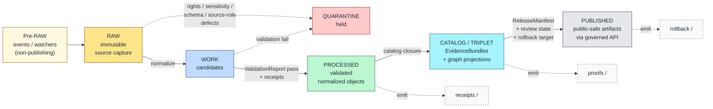
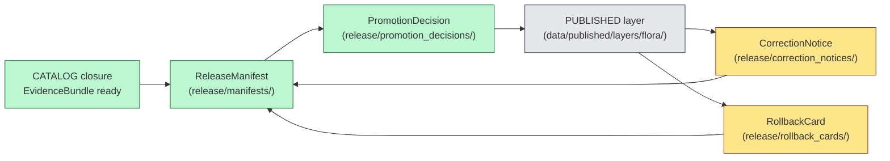

<!-- [KFM_META_BLOCK_V2]
doc_id: kfm://doc/NEEDS_VERIFICATION
title: Flora — Data Lifecycle (RAW → PUBLISHED)
type: standard
version: v1
status: draft
owners: [NEEDS_VERIFICATION — Flora steward + Data lifecycle steward]
created: 2026-05-16
updated: 2026-05-16
policy_label: public
related:
  - docs/domains/flora/README.md
  - docs/domains/flora/SENSITIVITY.md
  - docs/runbooks/flora/SOURCE_REFRESH_RUNBOOK.md
  - directory-rules.md
  - docs/standards/PROV.md
  - data/README.md
  - release/README.md
tags: [kfm, flora, lifecycle, governance, evidence, sensitivity]
notes:
  - Lifecycle invariant CONFIRMED; Flora application PROPOSED.
  - Implementation maturity, exact paths, validator IDs, and CI integration NEEDS VERIFICATION.
  - Replace owners and doc_id placeholders before review.
[/KFM_META_BLOCK_V2] -->

# Flora — Data Lifecycle (RAW → PUBLISHED)

> Governance contract for how Flora source material — plant taxa, specimens, occurrences, vegetation communities, invasive plants, phenology, rare-plant records, and restoration context — moves through the KFM lifecycle without becoming public truth prematurely.

  
  
  
  
  
  

**Status:** Draft · **Owners:** `NEEDS_VERIFICATION` (Flora steward + Data lifecycle steward) · **Last updated:** 2026-05-16 · **Authority:** Directory Rules §4 + §9.1 (lifecycle invariant); per-domain lane application is PROPOSED.

---

## On this page

- [1. Scope and boundary](#1-scope-and-boundary)
- [2. The Flora lifecycle at a glance](#2-the-flora-lifecycle-at-a-glance)
- [3. Pre-RAW admission edge](#3-pre-raw-admission-edge)
- [4. Stage-by-stage handling and gates](#4-stage-by-stage-handling-and-gates)
- [5. Object families through the lifecycle](#5-object-families-through-the-lifecycle)
- [6. Sensitivity, geoprivacy, and redaction at each stage](#6-sensitivity-geoprivacy-and-redaction-at-each-stage)
- [7. QUARANTINE conditions specific to Flora](#7-quarantine-conditions-specific-to-flora)
- [8. CATALOG / TRIPLET closure](#8-catalog--triplet-closure)
- [9. Publication, correction, and rollback](#9-publication-correction-and-rollback)
- [10. Watchers and the non-publisher invariant](#10-watchers-and-the-non-publisher-invariant)
- [11. Path placement under Directory Rules](#11-path-placement-under-directory-rules)
- [12. Validators, tests, and fixtures](#12-validators-tests-and-fixtures)
- [13. Open questions and verification backlog](#13-open-questions-and-verification-backlog)
- [14. Related docs](#14-related-docs)

---

## 1. Scope and boundary

This document governs **how Flora data moves through KFM lifecycle phases**, not what Flora *means* (see `docs/domains/flora/README.md`) and not what Flora *publishes by default* (see `docs/domains/flora/SENSITIVITY.md`). Its job is to bind the lifecycle invariant to Flora-specific objects, source families, sensitivity controls, and gate artifacts.

**In scope:**

- The RAW → WORK / QUARANTINE → PROCESSED → CATALOG / TRIPLET → PUBLISHED chain applied to Flora.
- Pre-RAW admission events (watchers, source-head checks, drift sidecars) feeding Flora intake.
- Per-stage handling, required artifacts, and fail-closed outcomes for Flora.
- How rare-plant, culturally sensitive, and join-sensitive material is held, transformed, or denied at each stage.
- Lifecycle-relevant path placement under `data/<phase>/flora/` and adjacent registries.

**Out of scope:**

- Field-level shape (lives in `schemas/contracts/v1/flora/` — PROPOSED).
- Object meaning (lives in `contracts/domains/flora/` — PROPOSED).
- Policy/sensitivity decision logic (lives in `policy/domains/flora/` and `policy/sensitivity/flora/` — PROPOSED).
- Release decision artifacts themselves (live in `release/` — see §9).
- Domain identity, mission, and the wider Flora overview (see `docs/domains/flora/README.md`).

> [!NOTE]
> Promotion is a **governed state transition, not a file move**. A pipeline that writes Flora bytes from `data/raw/flora/` directly into `data/published/layers/flora/` without passing validators, policy gates, EvidenceBundle creation, catalog closure, and a recorded release decision violates the lifecycle invariant regardless of which directory the bytes ended up in.

[Back to top](#on-this-page)

---

## 2. The Flora lifecycle at a glance

The lifecycle invariant `RAW → WORK / QUARANTINE → PROCESSED → CATALOG / TRIPLET → PUBLISHED` is **CONFIRMED doctrine** from Directory Rules §9.1 and the Unified Implementation Architecture Build Manual §7. Its application to Flora is **PROPOSED** per the KFM Domains Culmination Atlas v1.1 §8.H and the Encyclopedia §7.6. Receipts, proofs, registry, and rollback are emitted **alongside** the lifecycle phases — they do not replace them.

| Phase | Flora-specific cargo | Status |
|---|---|---|
| **Pre-RAW** | Watcher sidecars for GBIF / iNaturalist / PLANTS / NatureServe; source-head checks; `SourceIntakeRecord` candidates. | PROPOSED |
| **RAW** | Immutable specimen and occurrence payloads under source identity; herbarium DwC-A archives; vegetation index scenes. | PROPOSED |
| **WORK** | Normalized PlantTaxon / FloraOccurrence / VegetationCommunity candidates; pending taxonomic reconciliation. | PROPOSED |
| **QUARANTINE** | Rare-plant exact-geometry exposures, rights-unclear feeds, taxonomy collisions, join-induced sensitivity. | PROPOSED |
| **PROCESSED** | Validated normalized objects + ValidationReport + public-safe candidate transforms. | PROPOSED |
| **CATALOG / TRIPLET** | EvidenceBundles, STAC/DCAT/PROV records, graph projections, RedactionReceipts. | PROPOSED |
| **PUBLISHED** | Released public-safe Flora layers behind `apps/governed-api/`; ReleaseManifest + rollback target. | PROPOSED |

[Back to top](#on-this-page)

---

## 3. Pre-RAW admission edge

CONFIRMED doctrine (Unified Manual §7; BLD-GREEN v1.1 Phase 17) introduces a **pre-RAW event family** for the admission edge. Its job is to record *attempted intake* before any byte is admitted into RAW, especially where automated watchers, GitOps PR emission, live feeds, source refreshes, or model-assisted candidate generation could otherwise blur the boundary between observed input and accepted source material. Flora has several such admission surfaces.

**PROPOSED Flora admission surfaces:**

- **Source-health watchers** for GBIF occurrence endpoints, iNaturalist exports, NatureServe Explorer Pro releases, USDA PLANTS checklist drops, herbarium IPT instances, and KDWP/Kansas Biological Survey stewarded feeds.
- **Drift watchers** for USDA PLANTS county packages, taxonomic backbones (ITIS / GBIF Backbone), and vegetation index time-series (MAIAC AOD, NLCD, LANDFIRE).
- **Source-head checks** (HTTP `ETag`, `Last-Modified`, content-length) used as low-cost change detection that fires a `SourceIntakeRecord` with `publication_state: WORK_CANDIDATE`.

> [!IMPORTANT]
> **Pre-RAW outputs are never public truth.** A watcher that observes a PLANTS county-package change emits an `event_envelope`, a `prefilter_output`, and an `event_run_receipt` — it does not write into `data/processed/flora/` or `data/published/`. The watcher-as-non-publisher invariant is non-negotiable (see §10).

**PROPOSED pre-RAW artifact set per admission event:**

| Artifact | Carries | Status |
|---|---|---|
| `event_envelope` | Source id, source role, observed change kind, observed time, retrieval time. | PROPOSED |
| `prefilter_output` | Schema / rights / sensitivity / source-role pre-check result. | PROPOSED |
| `event_run_receipt` | Watcher run id, inputs hash, tool versions, attestation pointer. | PROPOSED |
| `SourceIntakeRecord` | Candidate envelope with `classmap_version`, geometry hashes, materiality reason, steward-review markdown. | PROPOSED |

[Back to top](#on-this-page)

---

## 4. Stage-by-stage handling and gates

The five lifecycle stages each carry **stage handling** (what is allowed and what shape material takes) and **stage gates** (the required artifacts and conditions for moving on). The five-row baseline below comes from KFM Domains Culmination Atlas v1.1 §8.H; gate detail draws from §24.6.1 Master Pipeline Gate Reference.

### 4.1 Stage matrix

| Stage | Flora handling (PROPOSED) | Gate (PROPOSED minimum) | Failure-closed outcome |
|---|---|---|---|
| **RAW** | Capture immutable source payload or reference under source identity, with source role, rights, sensitivity, citation, observed/retrieval time, and content hash. | `SourceDescriptor` exists and resolves; payload hash recorded; source role intent set. | Not admitted; logged as candidate awaiting steward. |
| **WORK / QUARANTINE** | Normalize schema, geometry, time, identity, evidence, rights, and policy; hold any failures in QUARANTINE with structured reason. | Validation and policy gate pass, **or** quarantine reason recorded. | Quarantine with reason; never silently promotes. |
| **PROCESSED** | Emit validated normalized objects (PlantTaxon, FloraOccurrence, VegetationCommunity, etc.), per-object receipts, and public-safe candidate transforms. | `EvidenceRef` resolves; `ValidationReport` passes; digest closure exists. | Stay in WORK; structured `FAIL` outcome. |
| **CATALOG / TRIPLET** | Emit catalog records, `EvidenceBundle`s, graph/triplet projections, and release candidates. | `CatalogMatrix` entry exists; EvidenceBundle digest closure passes; PROV/STAC/DCAT projections close. | Hold at PROCESSED; structured `FAIL`; no public edge. |
| **PUBLISHED** | Serve released public-safe artifacts (generalized occurrence/range, vegetation community, invasive layer, phenology calendar, public-safe rare-plant product) through `apps/governed-api/` and a `LayerManifest`. | `ReleaseManifest` exists; rollback target recorded; correction path declared; `ReviewRecord` present where required. | Hold at CATALOG; no public surface change. |

### 4.2 Gate-artifact reference

The lifecycle gates require a minimum artifact set. The table below extracts the Flora-relevant rows from Atlas v1.1 §24.6.1.

| Gate (transition) | Pre-condition | Required artifacts (PROPOSED) | Citation |
|---|---|---|---|
| Admission (— → RAW) | Source identity + rights minimally established; source-role intent set. | `SourceDescriptor`; payload or reference hash. | Atlas v1.1 §24.6.1 |
| Normalization (RAW → WORK / QUARANTINE) | Schema, geometry, time, identity, evidence, rights, policy rules runnable. | `TransformReceipt`; working-set `ValidationReport`; `PolicyDecision`; quarantine for failures. | Atlas v1.1 §24.6.1 |
| Validation (WORK → PROCESSED) | Validators deterministic and tied to fixtures; required receipts present. | `ValidationReport` pass; `RedactionReceipt` if sensitivity applies; `AggregationReceipt` if applies. | Atlas v1.1 §24.6.1 |
| Catalog closure (PROCESSED → CATALOG / TRIPLET) | `EvidenceRef`s resolve; catalog matrix and digests close. | `CatalogMatrix` entry; `EvidenceBundle`; graph/triplet projections. | Atlas v1.1 §24.6.1 |
| Release (CATALOG / TRIPLET → PUBLISHED) | Review state where required; release authority distinct from author when material. | `ReleaseManifest`; rollback target; correction path; `ReviewRecord`. | Atlas v1.1 §24.6.1 |
| Correction (PUBLISHED → PUBLISHED′) | Detected error or new evidence; downstream derivatives identified. | `CorrectionNotice`; superseding `ReleaseManifest`; `RollbackCard` where applicable. | Atlas v1.1 §24.6.1 |

[Back to top](#on-this-page)

---

## 5. Object families through the lifecycle

Flora's canonical object families (from the Encyclopedia §7.6.C and Atlas v1.1 §8.E) each travel through the lifecycle with different sensitivity and review burdens. The identity rule for every Flora object is **PROPOSED**: deterministic basis = `source_id` + `object_role` + `temporal_scope` + normalized digest. Source, observed, valid, retrieval, release, and correction times remain distinct where material — **CONFIRMED**.

| Object family | Typical RAW source role | WORK/QUARANTINE risk | PROCESSED public-safe form | PUBLISHED surface |
|---|---|---|---|---|
| **PlantTaxon** | Taxonomic authority (ITIS, USDA PLANTS, GBIF Backbone). | Taxonomy version drift; ITIS-vs-GBIF disagreement. | Reconciled taxon with crosswalk identifiers. | Plant species page. |
| **FloraTaxon Crosswalk** | Aggregator (GBIF, NatureServe). | Stale or superseded mappings. | Versioned crosswalk row. | Crosswalk embedded in species page. |
| **SpecimenRecord** | Authority (herbarium IPT, iDigBio). | License ambiguity; coordinate uncertainty. | Specimen record with rights/license declared. | Linked specimen citation on species page. |
| **FloraOccurrence** | Observation (GBIF, iNaturalist). | Rare-taxon exact coordinate exposure. | Generalized occurrence; uncertainty preserved. | Generalized occurrence layer. |
| **RarePlantRecord** | Steward / regulatory (KDWP, USFWS ECOS, NatureServe Explorer Pro). | Exact site geometry; sensitive join. | **Deny-by-default**; generalized form only with RedactionReceipt + review. | Public-safe rare-plant product or withheld. |
| **VegetationCommunity** | Authority / model (vegetation surveys, LANDFIRE). | Polygon precision over private land. | Generalized community polygon. | Vegetation community layer. |
| **InvasivePlantRecord** | Observation / steward (EDDMapS, state programs). | Premature outbreak signal; private-land detail. | Validated record with status badge. | Invasive plant spread layer. |
| **PhenologyObservation** | Observation (iNaturalist, ground stations). | Sparse or coarse temporal coverage. | Validated phenology time-series row. | Phenology calendar. |
| **RangePolygon** | Model / authority (NatureServe, USFWS). | Modeled vs. observed collapse. | Range polygon with source-role badge. | Range/distribution layer. |
| **HabitatAssociation** | Context (Habitat lane). | Cross-lane sensitivity inheritance. | Association preserving Habitat ownership. | Habitat association summary. |
| **BotanicalSurvey** | Authority (KU herbarium, surveys). | Survey completeness uncertainty. | Survey with completeness annotation. | Survey-backed map view. |
| **RestorationPlanting** | Context (project records). | Site identification on private land. | Generalized restoration site. | Restoration planting layer. |
| **RedactionReceipt** | (Generated, not sourced.) | — | The lineage record itself. | Drawer-visible transform metadata. |

[Back to top](#on-this-page)

---

## 6. Sensitivity, geoprivacy, and redaction at each stage

**CONFIRMED doctrine** (Atlas v1.1 §20.5 Deny-by-Default Register): Flora's deny-by-default surface is **exact rare / protected / culturally sensitive plant locations**, allowed publicly only when review + generalized/withheld geometry + RedactionReceipt are all present. The constraint is intentionally pre-publication — sensitivity decisions are made **before** material reaches PUBLISHED.

> [!WARNING]
> **Join-induced sensitivity is real.** Pass 19 / New Ideas 5-15 warns that USDA PLANTS county packages — benign in isolation — can become sensitive when joined to GBIF, iNaturalist, or Kansas Natural Heritage Inventory records. Sensitivity is a property of the **resulting product**, not just of the original source. Treat any Flora join that combines a taxa list with an occurrence source as fail-closed until reviewed.

### 6.1 Where sensitivity acts at each stage

| Stage | Sensitivity action | Required artifact |
|---|---|---|
| **Pre-RAW** | `prefilter_output` flags potentially sensitive sources (rare-plant feeds, joins). | Watcher sidecar. |
| **RAW** | Source-role assignment records `authority / observation / context / model`; rare-plant feeds tagged at intake. | `SourceDescriptor` rights + sensitivity fields. |
| **WORK** | Geoprivacy candidate transforms drafted: suppress, generalize to grid, generalize to watershed/county, buffer/jitter under constraints, delayed publication, steward-only exact access. | Candidate `RedactionReceipt`. |
| **QUARANTINE** | Anything with unresolved rights, unresolved sensitivity, exact-geometry exposure of listed taxa, or unresolved source role. | Quarantine reason record. |
| **PROCESSED** | Public-safe derivative produced with transform receipt; exact retained in non-public store under steward access only. | `RedactionReceipt` finalized. |
| **CATALOG / TRIPLET** | `EvidenceBundle` includes RedactionReceipt; sensitivity class labeled (`public` / `restricted` / `redacted`). | Bundle with sensitivity label. |
| **PUBLISHED** | Only public-safe derivatives released; Evidence Drawer surfaces the transform reason; deny-by-default fixture proves exact rare-plant geometry cannot render. | `ReleaseManifest` + drawer payload. |

### 6.2 Generalization transforms (PROPOSED)

The Master MapLibre Components & Functions reference (ML-Q-074 / Q-075 / Q-076 / Q-077 / Q-078) records these PROPOSED transform shapes for sensitive Flora geometry. Each transform **must** emit a receipt stating input class, output class, reason, policy, reviewer, and residual risk.

| Transform | Input | Output | Receipt required |
|---|---|---|---|
| **Suppress** | Exact occurrence point. | Withheld; metadata only. | Yes |
| **Generalize to grid** | Exact occurrence point. | Grid cell (size policy-defined). | Yes |
| **Generalize to county / watershed / ecoregion** | Exact point or polygon. | Coarser administrative or ecological footprint. | Yes |
| **Buffer / jitter under constraints** | Exact point. | Constrained displacement preserving interpretive value. | Yes |
| **Delayed publication** | Time-sensitive observation. | Same record, released after embargo. | Yes |
| **Steward-only exact access** | Exact point. | Public sees nothing; reviewers see exact. | Yes |

[Back to top](#on-this-page)

---

## 7. QUARANTINE conditions specific to Flora

QUARANTINE is **not a stage to skip past**. It is the structured holding pen where Flora material with rights, sensitivity, schema, source-role, temporal, or evidence defects waits for remediation, denial, or steward decision. The conditions below are PROPOSED but mirror the join-sensitivity, taxonomic-resolution, and rights-resolution warnings called out across the corpus.

<strong>Quarantine reason taxonomy (PROPOSED)</strong>

| Reason code (PROPOSED) | Trigger | Path forward |
|---|---|---|
| `Q-RIGHTS-UNCLEAR` | Source license / terms not resolvable at intake (e.g., NatureServe Explorer Pro precise data, KDWP-stewarded feeds). | Rights review; either renegotiate access, generalize, or deny. |
| `Q-SENSITIVE-EXACT` | Exact geometry of a rare / protected / culturally sensitive taxon arrived in RAW. | Apply RedactionReceipt transform; release only the generalized form. |
| `Q-JOIN-SENSITIVE` | Join of PLANTS county list × GBIF/iNaturalist/heritage occurrence introduces sensitivity not present in inputs. | Treat the **join product** as deny-by-default until reviewed. |
| `Q-TAXONOMY-DRIFT` | ITIS / GBIF Backbone / USDA PLANTS disagree on accepted name or hierarchy. | Hold pending tie-breaker policy (see §13). |
| `Q-SOURCE-ROLE-COLLAPSE` | A community-science observation cited as legal-status authority, or a model surface cited as observed evidence. | Demote to permitted source role or deny. |
| `Q-TEMPORAL-DEFECT` | Source / observed / valid / retrieval times collapse or contradict. | Re-derive times distinctly per Atlas v1.1 §8.E. |
| `Q-EVIDENCE-OPEN` | `EvidenceRef` does not resolve to an `EvidenceBundle`. | Build the bundle or deny the claim. |
| `Q-SCHEMA-FAIL` | Object shape fails `schemas/contracts/v1/flora/` validators. | Fix or drop the candidate. |

> [!CAUTION]
> Material in QUARANTINE has not been denied — it has been **held with a reason**. A QUARANTINE entry that lingers indefinitely is itself a drift signal. Pair each quarantine reason with a steward queue and a freshness threshold.

[Back to top](#on-this-page)

---

## 8. CATALOG / TRIPLET closure

PROCESSED objects do not become PUBLISHED by accumulating; they pass through **catalog closure**, where `EvidenceRef`s resolve into `EvidenceBundle`s and where PROV/STAC/DCAT projections close. Flora's catalog closure includes a graph/triplet projection so that Flora joins to Habitat, Fauna, Soil/Hydrology, and Hazards (Atlas v1.1 §8.F) can be inspected without collapsing source-role distinctions.

**PROPOSED Flora catalog closure outputs:**

- `data/catalog/stac/flora/` — STAC items / collections for Flora datasets (vegetation rasters, occurrence packages, community polygons).
- `data/catalog/dcat/flora/` — DCAT dataset records for catalog discovery.
- `data/catalog/prov/flora/` — PROV-O lineage records for each EvidenceBundle (see `docs/standards/PROV.md`).
- `data/catalog/domain/flora/` — Domain catalog rows tying Flora objects to source descriptors and release candidates.
- `data/triplets/graph_deltas/flora/` — Graph projection deltas for Flora ↔ Habitat / Fauna / Soil / Hydrology / Hazards joins.

> [!NOTE]
> **CATALOG records and graph projections are derivative indexes**, not root truth. A graph triple stating `<FloraOccurrence>` `:in_habitat` `<HabitatPatch>` is admissible only when both objects resolve to released or review-authorized evidence. Search, vector retrieval, and graph projections never substitute for `EvidenceBundle` resolution.

[Back to top](#on-this-page)

---

## 9. Publication, correction, and rollback

CONFIRMED doctrine / PROPOSED implementation: Flora publication requires `ReleaseManifest`, `EvidenceBundle`, validation and policy support, review state where required, correction path, stale-state rule, and rollback target (Atlas v1.1 §8.M; Encyclopedia §7.6 Appendix E).

**Lane separation (Directory Rules §9.2):**

- `data/published/layers/flora/` owns the **artifacts** consumers read.
- `release/manifests/` owns the **decision** that authorized the release.
- `release/rollback_cards/` owns the decision-side rollback artifact; `data/rollback/flora/` records alias-revert receipts. (Whether `data/rollback/` is a sibling of lifecycle phases or merges into `release/rollback_cards/` is an open ADR item — see Directory Rules §18.)

**Correction is the canonical downgrade path.** A tier downgrade (toward less public) never needs both a transform receipt and a review record — `CorrectionNotice` alone is sufficient to remove or restrict (Atlas v1.1 §24.6 reading note).

[Back to top](#on-this-page)

---

## 10. Watchers and the non-publisher invariant

**CONFIRMED invariant** (KFM-IDX-SRC-003; Directory Rules §13.5): **watchers observe and propose, they do not publish.** A Flora watcher that detects a USDA PLANTS county-package change, a NatureServe rank update, an iNaturalist export shift, or a GBIF dataset version bump emits the pre-RAW artifact set in §3 and stops. It never writes into `data/processed/flora/`, `data/catalog/`, or `data/published/`.

| Watcher target | Permitted output | Forbidden output |
|---|---|---|
| GBIF occurrence endpoint | `SourceIntakeRecord`; `event_run_receipt`. | Direct write to `data/raw/flora/` without descriptor; any write past RAW. |
| iNaturalist export | `SourceIntakeRecord`; `prefilter_output`. | Any PROCESSED or PUBLISHED write. |
| USDA PLANTS county package | `DriftSummary` sidecar; candidate envelope. | Treating the drift as a published occurrence layer. |
| NatureServe Explorer Pro release | `SourceIntakeRecord` with sensitivity flag set high. | Any unredacted public exposure of rare-plant records. |
| Herbarium IPT (e.g., KU McGregor) | `SourceIntakeRecord` with license carried. | Republication ignoring the herbarium's license terms. |
| Vegetation index time-series (MAIAC AOD, NLCD, LANDFIRE) | EvidenceBundle-bound anomaly candidate. | NDVI-drop → publish; AOD-blind anomaly. |

> [!IMPORTANT]
> "NDVI drop → publish" is the canonical Pass 19 anti-pattern. The strongest path is `Pixel Observation → Temporal Candidate → Multi-Sensor Consensus → Policy Evaluation → DecisionEnvelope → Promotion Review → Published Ecological Claim`.

[Back to top](#on-this-page)

---

## 11. Path placement under Directory Rules

Flora is a **domain segment inside responsibility roots**, never a root folder (Directory Rules §4 Step 3 and §13.4). The lifecycle-relevant paths below are CONFIRMED as canonical *shapes* per Directory Rules; the **exact entries** are PROPOSED until verified against mounted repo evidence.

| Lifecycle concern | Path shape (Directory Rules) | Status |
|---|---|---|
| Domain doc home (this file) | `docs/domains/flora/` | CONFIRMED shape; this file PROPOSED |
| Runbooks | `docs/runbooks/flora/` (e.g., `SOURCE_REFRESH_RUNBOOK.md`) | PROPOSED — subfolder convention diverges from flat prefixes elsewhere; open ADR item |
| Object meaning | `contracts/domains/flora/` | PROPOSED |
| Schemas | `schemas/contracts/v1/flora/` | PROPOSED; ADR-0001 governs the schema-home rule |
| Policy / sensitivity | `policy/domains/flora/`; `policy/sensitivity/flora/` | PROPOSED |
| Tests / fixtures | `tests/domains/flora/`; `fixtures/domains/flora/` | PROPOSED |
| Pipelines | `pipelines/domains/flora/`; `pipeline_specs/flora/` | PROPOSED |
| RAW | `data/raw/flora/<source_id>/<run_id>/` | PROPOSED |
| WORK | `data/work/flora/<run_id>/` | PROPOSED |
| QUARANTINE | `data/quarantine/flora/<reason>/<run_id>/` | PROPOSED |
| PROCESSED | `data/processed/flora/<dataset_id>/<version>/` | PROPOSED |
| Catalog | `data/catalog/stac/flora/`, `data/catalog/dcat/flora/`, `data/catalog/prov/flora/`, `data/catalog/domain/flora/` | PROPOSED |
| Triplets | `data/triplets/graph_deltas/flora/`; `data/triplets/exports/flora/` | PROPOSED |
| Published | `data/published/layers/flora/`; `data/published/api_payloads/flora/`; `data/published/pmtiles/flora/` | PROPOSED |
| Registry | `data/registry/sources/flora/`; `data/registry/sensitivity/flora/` | PROPOSED |
| Release | `release/candidates/flora/`; `release/manifests/`; `release/rollback_cards/`; `release/correction_notices/` | PROPOSED |

> [!NOTE]
> The runbook subfolder pattern `docs/runbooks/flora/` differs from older flat-prefix runbook names (`docs/runbooks/ui_LOCAL_DEV.md` etc.) referenced in the Whole-UI + Governed AI Expansion Report. This divergence is flagged as an **open ADR item** alongside the `PROV.md` vs. `PROVENANCE.md` naming question.

[Back to top](#on-this-page)

---

## 12. Validators, tests, and fixtures

Atlas v1.1 §8.K records the PROPOSED Flora validator set; each item is verifiable only against mounted repo evidence and is marked PROPOSED here.

- **Taxonomy reconciliation tests** — ITIS / GBIF Backbone / USDA PLANTS cross-check; flag drift candidates per `Q-TAXONOMY-DRIFT`.
- **Rights / sensitivity validators** — Confirm `SourceDescriptor` rights field is resolved and that rare-plant feeds carry a sensitivity classification.
- **Exact sensitive public geometry denial** — Negative fixture proving that an exact rare-plant point cannot publish or render publicly.
- **Catalog closure tests** — `EvidenceBundle` digest closes; PROV/STAC/DCAT projections produced and integrity-validated.
- **API finite-outcome fixtures** — `FloraDecisionEnvelope` produces only `ANSWER / ABSTAIN / DENY / ERROR`.
- **No-live-network fixture pipeline** — All Flora validators run against fixtures without live source activation.

> [!TIP]
> The first Flora thin slice in the Encyclopedia §7.6 is **one common species occurrence/specimen fixture + one vegetation community polygon with `EvidenceBundle`-backed species page and public-safe map.** That fixture is the cheapest way to exercise every gate above without negotiating live source rights.

[Back to top](#on-this-page)

---

## 13. Open questions and verification backlog

| Item | Evidence that would settle it | Status |
|---|---|---|
| Exact source endpoints, license texts, and rights state for KDWP, Kansas Biological Survey, KU McGregor Herbarium IPT, KSC, NatureServe Explorer Pro, USFWS ECOS, GBIF dataset DOIs, iDigBio, iNaturalist exports, USDA PLANTS bulk download. | Mounted repo `data/registry/sources/flora/` + `policy/sensitivity/flora/` + live rights review. | NEEDS VERIFICATION |
| Exact rare-plant generalization thresholds (grid cell size, county vs. watershed, embargo lengths). | `policy/domains/flora/` + ADR. | NEEDS VERIFICATION |
| Tie-breaker policy when ITIS and GBIF Backbone disagree on accepted name. | `policy/domains/flora/taxonomy_tiebreak.*` + ADR. | NEEDS VERIFICATION |
| Whether `data/rollback/flora/` is a sibling of lifecycle phases or merges into `release/rollback_cards/`. | ADR resolving Directory Rules §18 open question. | OPEN |
| Whether `triplets/` (plural) or `triplet/` (singular) is the chosen form for Flora graph projections. | One-line ADR. | OPEN |
| Runbook subfolder convention (`docs/runbooks/flora/`) vs. flat prefix (`docs/runbooks/flora_*`). | ADR + companion `PROV.md` / `PROVENANCE.md` naming decision. | OPEN |
| `FloraDecisionEnvelope` exact route name under `apps/governed-api/`. | Mounted repo `apps/governed-api/` inspection. | UNKNOWN |
| Validator exit-code contract for Flora pipelines. | ADR referenced in Notes & Citations of recent standards files. | OPEN |
| Watcher posture for live `iNaturalist` and `GBIF` endpoints — synthetic fixture only, or live with rate-aware admission. | Mounted repo `connectors/` and `pipelines/domains/flora/`. | NEEDS VERIFICATION |

[Back to top](#on-this-page)

---

## 14. Related docs

- [`docs/domains/flora/README.md`](./README.md) — Flora domain identity, mission, and overview *(TODO)*.
- [`docs/domains/flora/SENSITIVITY.md`](./SENSITIVITY.md) — Flora sensitivity matrix and deny-by-default register *(TODO)*.
- [`docs/runbooks/flora/SOURCE_REFRESH_RUNBOOK.md`](../../runbooks/flora/SOURCE_REFRESH_RUNBOOK.md) — Flora source refresh runbook *(TODO; subfolder convention pending ADR)*.
- [`docs/standards/PROV.md`](../../standards/PROV.md) — W3C PROV-O profile (canonical lineage standard).
- [`docs/standards/PMTILES.md`](../../standards/PMTILES.md) — PMTiles governance profile (tile artifact integrity).
- [`directory-rules.md`](../../../directory-rules.md) — Authority for lifecycle placement.
- [`data/README.md`](../../../data/README.md) — Data root and lifecycle phases *(TODO)*.
- [`release/README.md`](../../../release/README.md) — Release decision root *(TODO)*.

---

> **Last reviewed:** 2026-05-16 · **Next review due:** 2026-11-16 · [Back to top](#on-this-page)
