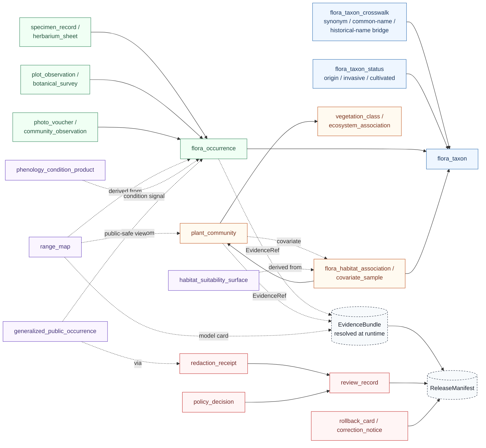

<!-- [KFM_META_BLOCK_V2]
doc_id: kfm://doc/flora-data-model
title: Flora Domain — Data Model
type: standard
version: v0.1-draft
status: draft
owners: flora steward (TODO: confirm GitHub handle / team)
created: 2026-05-08
updated: 2026-05-08
policy_label: public
related:
  - docs/domains/flora/README.md
  - docs/domains/flora/ARCHITECTURE.md
  - docs/domains/flora/SOURCE_REGISTRY.md
  - docs/domains/flora/PIPELINES_AND_LIFECYCLE.md
  - docs/domains/flora/PUBLICATION_AND_POLICY.md
  - docs/domains/flora/UI_AND_EVIDENCE_DRAWER.md
  - docs/domains/flora/VERIFICATION_BACKLOG.md
  - docs/domains/flora/GLOSSARY.md
  - docs/domains/flora/adr/ADR-flora-schema-home.md
  - docs/domains/flora/adr/ADR-flora-source-roles.md
  - docs/domains/flora/adr/ADR-flora-sensitive-location-policy.md
  - contracts/flora/
  - schemas/contracts/v1/domains/flora/
tags: [kfm, domain, flora, data-model, governance]
notes:
  - "Object families, IDs, relations, lifecycle fields. Exact field shapes live in the schemas under contracts/flora or schemas/contracts/v1/domains/flora — this doc references them, it does not duplicate them."
  - "Repository not mounted in the authoring session; all path claims are PROPOSED/NEEDS VERIFICATION until reconciled with the live repo."
[/KFM_META_BLOCK_V2] -->

# Kansas Frontier Matrix · Flora Domain — Data Model

> Object families, identity rules, relationships, and lifecycle fields for the Flora lane. This document is a **map of the model**, not a schema dictionary — exact field shapes live in the per-object JSON Schemas.


> [!IMPORTANT]
> **Truth posture.** Doctrine in this document is grounded in attached KFM design artifacts (Flora Architecture Blueprint, KFM Encyclopedia, Definitive Greenfield Plan, Directory Rules, Build Companion). The **target repository was not mounted** when this document was authored, so all path, schema, validator, fixture, route, and test claims are **PROPOSED / NEEDS VERIFICATION** until reconciled with live repo evidence. See `VERIFICATION_BACKLOG.md`.

**Quick jump:** [Scope](#1--scope-and-ground-rules) · [Object Map](#2--object-family-map) · [Object Catalog](#3--object-family-catalog) · [Identity & Hashing](#4--identity-and-hashing) · [Source Roles](#5--source-role-discipline) · [Sensitivity & Geometry](#6--sensitivity-classes-and-the-publicsafe-geometry-split) · [Lifecycle Fields](#7--lifecycle-fields-on-flora-objects) · [Governance Objects](#8--knowledgesystem-and-governance-objects) · [Schema Home](#9--schema-home-and-contract-index-proposed) · [Relationships](#10--relationship-and-invariant-matrix) · [Out of Scope](#11--what-this-document-deliberately-does-not-define) · [Verification](#12--open-verification-items) · [Related Docs](#13--related-documents)

---

## 1 · Scope and ground rules

The Flora data model governs how botanical evidence is represented inside KFM. Per the Flora Architecture Blueprint and the KFM Encyclopedia §7.6, the lane **owns**:

- plant taxonomic identity, source-specific naming, and synonymy bridges;
- specimen, occurrence, plot, survey, and photo-voucher observation records;
- plant community / vegetation / ecosystem assemblage objects;
- habitat and covariate linkages;
- rare, protected, and culturally sensitive flora controls;
- derived / modeled / generalized surfaces (range, suitability, condition, phenology);
- review, correction, and rollback records that govern publication of the above.

The lane explicitly **does not own** animal records (`fauna`), crop operations (`agriculture`), land cover or habitat-class authority by itself (`habitat`), or the canonical geometry/CRS/projection registry (`spatial foundation`). Those linkages are referenced via published descriptors and EvidenceRefs, not absorbed.

> [!NOTE]
> **Architectural rule the model has to obey.** The Flora Architecture Blueprint forbids collapsing the following into one another: observed occurrence, institutional/specimen evidence, modeled range or suitability, regulatory/stewardship status, the generalized public-safe display layer, and the AI explanation payload. Each is a **separate object family** with its own identity, source role, review burden, and publication eligibility. The data model below preserves that separation.

[Back to top ↑](#kansas-frontier-matrix--flora-domain--data-model)

---

## 2 · Object family map

The diagram below is a responsibility map, not a schema. Edges are "supports / refers to," not foreign keys, and EvidenceRefs (not direct pointers) are the spine that lets every consequential claim resolve to an EvidenceBundle.



**How to read it.**

- **Blue (identity)** — taxonomic identity and the bridges that resolve raw or historical names to accepted identity. Status flags ride on the taxon, not on observations.
- **Green (observation)** — what was actually seen, collected, photographed, or surveyed. Different observation methods (specimen vs plot vs photo) keep distinct shapes because their authority and review burden differ.
- **Orange (assemblage / linkage)** — communities and habitat covariate linkages. **Not** occurrences and not authoritative for "this taxon is here."
- **Purple (derived)** — model and surface outputs. They cite observations but never become observation truth. The generalized public layer is a derived public-safe view of an internal exact occurrence.
- **Red (governance)** — the records that decide whether anything above is allowed to be published, redacted, withheld, or rolled back.
- **Dashed nodes (evidence / release)** — `EvidenceBundle` and `ReleaseManifest` are not flora-only objects; they are shared knowledge-system objects that flora records refer to. See §8.

[Back to top ↑](#kansas-frontier-matrix--flora-domain--data-model)

---

## 3 · Object family catalog

The blueprint's "object families" table, reorganized. **Minimum object examples** below are taken from the Flora Architecture Blueprint §4; they name the conceptual objects, not their final field shapes (those live in §9). Encyclopedia §7.6.C names the canonical family list (`PlantTaxon; SpecimenRecord; FloraOccurrence; RarePlantRecord; VegetationCommunity; InvasivePlantRecord; PhenologyObservation; RangePolygon; HabitatAssociation; BotanicalSurvey; RestorationPlanting; RedactionReceipt`); the blueprint's per-family decomposition is finer-grained.

| # | Family | Why it stays distinct | Minimum object examples | Truth-label |
|---|---|---|---|---|
| F1 | **Taxon and naming** | Accepted identity, raw name text, common names, rank, authority, and synonymy are not observations. | `flora_taxon`, `flora_taxon_crosswalk`, `flora_taxon_status` | PROPOSED |
| F2 | **Synonym / common-name / historical-name crosswalks** | Taxonomic and cultural naming changes are time-aware identity bridges, not occurrence evidence. | `synonym_crosswalk_id`, `source_authority`, `valid_from`, `valid_to` | PROPOSED |
| F3 | **Occurrence and observation records** | Point/area records support claims but may be uncertain, duplicated, licensed, or sensitive. | `flora_occurrence`, `occurrence_batch`, `occurrence_quality_state` | PROPOSED |
| F4 | **Survey / specimen / herbarium / checklist / plot / photo observations** | Different observation methods carry different authority, precision, and review burdens. | `specimen_record`, `herbarium_sheet`, `plot_observation`, `photo_voucher` | PROPOSED |
| F5 | **Plant community / vegetation / ecosystem objects** | Vegetation classes and communities describe assemblages or mapped units, not individual plant occurrences. | `plant_community`, `vegetation_class`, `ecosystem_association` | PROPOSED |
| F6 | **Habitat and covariate linkages** | Habitat context is linked evidence/covariate support, not plant presence by itself. | `flora_habitat_association`, `covariate_sample`, `habitat_join` | PROPOSED |
| F7 | **Status / policy / review objects** | Legal status, conservation rank, internal review, and publication decisions are governance context, not observation. | `review_record`, `status_assertion`, `policy_decision` | PROPOSED |
| F8 | **Native / introduced / invasive / cultivated** | Nativity and invasiveness are interpretive/status properties that may vary by jurisdiction and time. | `origin_status`, `invasive_status`, `cultivated_flag` | PROPOSED |
| F9 | **Rare / protected / culturally sensitive** | Sensitive flora needs an exact-internal vs public-safe geometry split, review state, and redaction lineage. | `sensitivity_policy`, `redaction_receipt`, `steward_review_record` | PROPOSED |
| F10 | **Derived / modeled / generalized surfaces** | Model outputs and generalized surfaces are derived; they must not masquerade as observed truth. | `range_map`, `habitat_suitability_surface`, `generalized_public_occurrence`, `phenology_condition_product` | PROPOSED |

> [!CAUTION]
> **Knowledge-character invariant.** Objects in **F3/F4** (observed) must never be silently merged with **F10** (modeled/generalized). The fail-closed reason code is `model_as_observation` / `knowledge_character_mismatch`. Any record where this distinction is ambiguous belongs in `data/quarantine/flora/` until resolved.

[Back to top ↑](#kansas-frontier-matrix--flora-domain--data-model)

---

## 4 · Identity and hashing

Flora identity does not depend on volatile timestamps. Source-native IDs are preserved where available; deterministic fallback IDs are computed over canonicalized fields with a versioned recipe. `spec_hash` identifies schema/spec/process identity; `content_hash` identifies artifact bytes/content. **IDs for occurrence, taxon, community, layer, source, bundle, manifest, review, and receipt objects remain distinct families** — never reuse one as another.

| ID / hash | Required behavior | Example pattern |
|---|---|---|
| `source_id` | Stable across descriptor revisions; version fields carry changes. | `flora.source.kdwp.status.v1` |
| `taxon_id` | Derived from accepted authority identifier when available; otherwise a deterministic provisional key. | `kfm://flora/taxon/<authority>/<id>` |
| `taxon_crosswalk_id` | Stable hash over authority, raw_name, accepted_taxon_id, validity interval. | `kfm://flora/taxon-crosswalk/sha256:<hash>` |
| `occurrence_id` | Preserve source-native ID; deterministic fallback from `source_id`, `source_record_id`, event date, normalized geometry, and taxon. | `kfm://flora/occurrence/sha256:<hash>` |
| `community_id` / `vegetation_class_id` | Use classification system + class code + version; do **not** reuse occurrence IDs. | `kfm://flora/vegetation-class/nlcd/<code>/<epoch>` |
| `layer_id` | Semantic layer identity, not style file name; references source ids and evidence route. | `kfm.layer.flora.occurrence.generalized.public.v1` |
| `bundle_id` | EvidenceBundle identity; hash over resolved evidence list, policy state, review state, and artifact digests. | `kfm://evidence/flora/sha256:<hash>` |
| `manifest_id` | ReleaseManifest identity, distinct from bundle and receipt. | `kfm://release/flora/<date>/<spec_hash>` |
| `review_id` / `rollback_id` | Governance-action identity carrying actor, scope, reason, and target release. | `kfm://review/flora/<uuid>` · `kfm://rollback/flora/<uuid>` |
| `spec_hash` | Stable hash of schema/spec/process identity; **not** a timestamp and **not** policy by itself. | SHA-256 over canonical JSON spec with sorted keys |
| `content_hash` | Hash of source, processed, catalog, proof, and published artifacts where relevant. | `sha256:<64 hex>` |

> [!NOTE]
> **Hash families are not interchangeable.** The Build Companion §6.1 spells out the discipline: `source_retrieval_hash` ≠ `content_spec_hash` ≠ `run_hash` ≠ `schema_hash` ≠ `policy_hash` ≠ `evidence_bundle_hash` ≠ `release_manifest_hash`. A flora artifact may carry several of these simultaneously; conflating them silently breaks dedupe, lineage, transparency-log inclusion, and rollback targeting.

**Geometry-identity rule.** When a flora object is keyed in part on geometry, the geometry must be canonicalized (CRS, coordinate precision, ring order, topology repair via `ST_MakeValid` or equivalent) before hashing. Record the precision policy on the object so two topologically identical geometries do not produce different hashes from encoding noise.

**Stable identity exclusion rule.** Volatile fields — `ingested_at`, `processing_duration`, CI run URL, local path, ephemeral random UUIDs — must never affect a stable identity hash. They live on receipts, not on the object.

[Back to top ↑](#kansas-frontier-matrix--flora-domain--data-model)

---

## 5 · Source-role discipline

Source role is a **first-class field** on every flora descriptor and travels with every processed record, EvidenceBundle, API envelope, Evidence Drawer payload, and layer descriptor. Source role does not by itself determine truth; it defines authority boundary, review burden, publication eligibility, and how a claim should be cited. The full registry lives in `data/registry/flora/source_roles.yaml` (PROPOSED) and is documented in `SOURCE_REGISTRY.md`.

| Source role | What it means | Default trust use | Publication default |
|---|---|---|---|
| `official` | Government or legally responsible source for status, regulation, or authoritative spatial layer. | Anchors official status claims **within** authority boundary. | Publish only after rights, sensitivity, and review are resolved. |
| `institutional` | Museum, herbarium, university, research institute, or agency-managed collection. | Strong evidence for specimen/collection facts; may carry license/precision constraints. | Publish public-safe metadata; exact geometry depends on rights and sensitivity. |
| `steward_reviewed` | Curated by responsible flora steward, heritage program, or qualified domain reviewer. | Can lift quarantine or allow controlled internal use. | Public only with explicit release decision. |
| `corroborative` | Useful support but not controlling authority for legal/status claims. | Corroborates presence, name, or context; cannot override official source. | Usually aggregate/generalize; cite limitations. |
| `community_observation` | Public/community record (e.g. iNaturalist-like observation or project dataset). | Useful with quality labels, reviewer status, and license checks. | Publish only if license and sensitivity allow; avoid false precision. |
| `controlled_access` | Source requiring terms, license, steward approval, or access-controlled use. | May inform internal review; cannot leak restricted attributes. | Deny public exact publication unless authorization is explicit. |
| `derived_model` | Model, index, interpolation, habitat suitability, range, or generalized summary. | Contextual / interpretive evidence only; **not** observation truth. | Publish with model card, uncertainty, and evidence lineage. |
| `generalized_public_surface` | Public-safe geometry or layer derived from internal details. | Outward display layer after redaction/generalization. | Publishable when transform lineage, sensitivity, and rights are resolved. |

> [!IMPORTANT]
> **Authority-boundary rule.** A `corroborative` GBIF record cannot upgrade an unresolved taxon to "accepted" against an `official`/`institutional` taxonomic authority. A `derived_model` range surface cannot be promoted to an occurrence. The blueprint's reason codes `accepted_taxon_required`, `model_as_observation`, and `knowledge_character_mismatch` exist precisely to enforce this.

[Back to top ↑](#kansas-frontier-matrix--flora-domain--data-model)

---

## 6 · Sensitivity classes and the public-safe geometry split

Rare, protected, and culturally sensitive flora **fail closed** by default: exact occurrence points are not exposed unless rights, policy, and review explicitly allow. Every flora object that carries geometry carries a sensitivity class; controlled records are split into an internal-only exact geometry and a public-safe derivative tied to a `redaction_receipt`.

| Sensitivity class | Meaning | Public geometry behavior |
|---|---|---|
| `public_exact_allowed` | Non-sensitive; rights allow public exact geometry; source geoprivacy allows it. | Exact public geometry may publish with evidence and rights. |
| `public_generalized` | May publish only at county / grid / watershed / bbox / generalized support. | Generalized or aggregated geometry **plus** redaction receipt. |
| `restricted_precise` | Precise coordinates protected by taxon, source, steward, or policy. | No public precise geometry; restricted store only. |
| `embargoed` | Temporal delay required (e.g., active monitoring, recent steward action). | No public record until embargo lifts, or public summary only. |
| `steward_review_required` | Human/steward review required before release-class decision. | HOLD; no public promotion. |
| `quarantine` | Rights, sensitivity, taxonomy, geometry, or source role unresolved. | QUARANTINE; not public. |

> [!WARNING]
> **The fail-closed perimeter.** Restricted precise coordinates do not flow to public layers, public APIs, Focus Mode answers, graph projections, search indexes, screenshots, or thumbnails. A flora object with `sensitivity_class ∈ {restricted_precise, embargoed, steward_review_required, quarantine}` and a public-payload reference is treated as a defect, not a UI optimization.
>
> Sensitivity-class labels in the table above mirror the parallel governance pattern used in the Fauna lane and adapt the Flora Architecture Blueprint §12 controls. Final label wording for Flora is **PROPOSED / NEEDS VERIFICATION** against `data/registry/flora/sensitivity_policies.yaml` once that registry is committed.

**Required redaction receipt fields (conceptual).** A `flora_redaction_receipt` records: source record reference, transform class (centroid, grid-mask, jitter, withhold), parameters, reason code, policy version, actor / run reference, before-hash, after-hash, and the resulting public-safe `geometry_hash`. The receipt is what lets a public layer be both safe and auditable. Exact field shape lives in `contracts/flora/flora_redaction_receipt.schema.json` (PROPOSED).

[Back to top ↑](#kansas-frontier-matrix--flora-domain--data-model)

---

## 7 · Lifecycle fields on flora objects

Every flora processed record carries enough lifecycle metadata for a reviewer to answer five questions without leaving the object: **where did it come from, what was done to it, who said it was OK, can I publish it, and how do I roll it back?**

| Lifecycle stage | Object expectations | Conceptual fields the data model expects |
|---|---|---|
| **SOURCE EDGE** | Descriptor resolved, access probed, rights and sensitivity captured. | `source_id`, `source_role`, `rights_license_terms`, `sensitivity_posture`, `authority_boundary`, `verification_status`. |
| **RAW** | Immutable raw pull or fixture equivalent with metadata + checksums. | `source_retrieval_hash`, `raw_artifact_ref`, `etag` / `last_modified` (if present). |
| **WORK / QUARANTINE** | Normalization, taxon reconciliation, geometry handling, dedup; quarantine reason codes for failures. | `work_state`, `quarantine_reason_code`, `taxon_reconciliation_status`, `precision_policy`. |
| **PROCESSED** | Validated, deterministic-ID record with source_refs, evidence_refs, public-safe geometry where allowed. | `id` (per §4), `source_refs[]`, `evidence_refs[]`, `spec_hash`, `content_hash`, `public_geometry_class`. |
| **CATALOG / TRIPLET** | STAC for spatial assets, DCAT for datasets, PROV lineage; catalog-matrix closure. | `stac_item_ref`, `dcat_distribution_ref`, `prov_activity_ref`, `catalog_matrix_state`. |
| **PUBLISHED** | Public-safe layers, records, APIs, evidence payloads behind governed interfaces only. | `release_manifest_ref`, `bundle_id`, `layer_id`, `release_alias`. |
| **REVIEW / CORRECTION / ROLLBACK** | Review, correction, rollback, supersession links; preserved lineage. | `review_id`, `correction_notice_ref`, `rollback_id`, `supersedes` / `superseded_by`. |

> [!NOTE]
> **Promotion is a governed state transition, not a file move.** A processed flora object becoming "published" requires the closure of evidence, catalog, policy, review, and rollback references — the lifecycle fields above are the visible surface of those gates, not their authority.

**Fail-closed conditions across the lifecycle** (subset most relevant to the data model):

- public payload references a `RAW` / `WORK` / `QUARANTINE` artifact → DENY (`public_payload_exposes_internal_ref`)
- exact public geometry on a sensitive rare-flora record → DENY (`precise_sensitive_location_denied`, `geoprivacy_required`)
- modeled/derived output presented as observation → DENY (`model_as_observation`)
- missing `evidence_refs` or `bundle_id` for a consequential claim → DENY (`missing_evidence_bundle`)
- ambiguous accepted taxon when accepted identity is required → DENY or QUARANTINE (`accepted_taxon_required`)

[Back to top ↑](#kansas-frontier-matrix--flora-domain--data-model)

---

## 8 · Knowledge-system and governance objects

Flora records refer to shared KFM knowledge-system objects rather than redefining them. Per Encyclopedia §7.6.H the relevant shared objects are **`SourceDescriptor`, `EvidenceRef`, `EvidenceBundle`, `DatasetVersion`, `ValidationReport`, `RunReceipt`, `DecisionEnvelope`, `ReleaseManifest`, `LayerManifest`, `CorrectionNotice`, `RollbackCard`, `ReviewRecord`** plus the domain ontology, search index, and graph projection. Search, vector retrieval, and graph projections are derivative indexes built from released or review-authorized evidence — **not** root truth.

| Shared object | Role for flora records | Reuse note |
|---|---|---|
| `SourceDescriptor` | Identity + governance posture for every source family. | One entry per source in `data/registry/flora/sources.yaml` (PROPOSED). |
| `EvidenceRef` → `EvidenceBundle` | Resolves at runtime to the admissible evidence backing a claim. | A flora claim with no resolvable bundle is unciteable → ABSTAIN. |
| `DatasetVersion` | Versioned dataset identity for processed flora outputs. | Pinned by `spec_hash`; freshness chips in UI key off this. |
| `ValidationReport` | Machine-readable validator output (PASS / FAIL / WARN, reason codes). | Blocking defects exit nonzero in CI. |
| `RunReceipt` | Process memory for fetch / normalize / validate / diff operations. | Lives under `data/receipts/flora/` (PROPOSED). |
| `DecisionEnvelope` | Finite outcome wrapper (`ANSWER` / `ABSTAIN` / `DENY` / `ERROR`) with reason codes, obligations, evidence, policy refs. | Used by API runtime and Focus Mode. |
| `ReleaseManifest` | Published artifact inventory + digests + policy/review/correction refs + rollback target. | Lives under `data/published/flora/manifests/` (PROPOSED). |
| `LayerManifest` | MapLibre/PMTiles-facing layer descriptor with source role, freshness, policy, review, rights, evidence route. | Public-eligible layers only. |
| `CorrectionNotice` / `RollbackCard` | Reversal plan + correction lineage for a published artifact. | Preserves receipts and proofs after release. |
| `ReviewRecord` | Human/steward review outcome with actor, scope, reason, and target release. | Required before promotion of `restricted` or `derived_model` flora records. |

> [!TIP]
> **Reuse before redefining.** If a flora-specific object would duplicate a shared knowledge-system object (e.g. a "flora EvidenceBundle"), prefer to reuse the shared schema and apply the flora ontology to its `subject` / `domain` field. Schema-home decisions belong in `docs/domains/flora/adr/ADR-flora-schema-home.md`. The Flora Architecture Blueprint §10 explicitly notes "reuse shared X wherever possible" against EvidenceBundle, DecisionEnvelope, ReleaseManifest, CatalogMatrix, ReviewRecord, PromotionCandidate, FocusQuery/Response, EvidenceDrawerPayload, and RuntimeResponseEnvelope.

[Back to top ↑](#kansas-frontier-matrix--flora-domain--data-model)

---

## 9 · Schema home and contract index (PROPOSED)

> [!IMPORTANT]
> Exact field shapes live in the per-object JSON Schemas, **not** in this document. The table below is a navigation index. Both schema homes shown below appear in flora doctrine — `contracts/flora/*.schema.json` and `schemas/contracts/v1/domains/flora/*.schema.json` — and the binding choice is the subject of `ADR-flora-schema-home.md`. Until that ADR resolves and the repo is inspected, treat the schema home as **PROPOSED**.

| Family | Schema (PROPOSED) | Priority | Notes |
|---|---|---|---|
| Taxon identity | `flora_taxon.schema.json` | P0 | Accepted identity, authority, rank, common names. |
| Taxon bridges | `flora_taxon_crosswalk.schema.json` | P0 | Synonym / common-name / historical-name bridges with validity intervals. |
| Occurrence | `flora_occurrence.schema.json` | P0 | Single-record observation with source/evidence/sensitivity refs. |
| Occurrence batch | `flora_occurrence_batch.schema.json` | P0 | Batch ingest envelope. |
| Source descriptor | `flora_source_descriptor.schema.json` | P0 | Required fields per blueprint §5.1. |
| Run receipt | `flora_run_receipt.schema.json` | P0 | Process memory; not release proof. |
| Redaction receipt | `flora_redaction_receipt.schema.json` | P1 | Geoprivacy / generalization / withholding transform record. Could reuse shared `RedactionReceipt`. |
| Evidence bundle | `flora_evidence_bundle.schema.json` | P0 | Reuse shared `EvidenceBundle` wherever possible. |
| Decision envelope | `flora_decision_envelope.schema.json` | P0 | Finite ANSWER / ABSTAIN / DENY / ERROR; reuse shared `DecisionEnvelope`. |
| Release manifest | `flora_release_manifest.schema.json` | P0 | Reuse shared `ReleaseManifest` if present. |
| Catalog matrix | `flora_catalog_matrix.schema.json` | P0 | Closure across STAC / DCAT / PROV / manifest / proofs / runtime. |
| Review record | `flora_review_record.schema.json` | P1 | May reuse shared `ReviewRecord`. |
| Promotion candidate | `flora_promotion_candidate.schema.json` | P0 | Input to promotion gate. |
| Layer descriptor | `flora_layer_descriptor.schema.json` | P0 | MapLibre-facing metadata + evidence route. |
| Focus payload | `flora_focus_payload.schema.json` | P0 | Reuse shared `FocusQuery` / `Response` if available. |
| Drawer payload | `flora_evidence_drawer_payload.schema.json` | P0 | Prefer shared `EvidenceDrawerPayload`. |
| API envelope | `flora_api_response.schema.json` | P0 | Governed API response envelope. |
| Plant community | `flora_plant_community.schema.json` | P1 | Distinct from occurrence and range. |
| Vegetation class | `flora_vegetation_class.schema.json` | P1 | Classification system + class code + epoch. |
| Range map | `flora_range_map.schema.json` | P1 | Surface; do not present as observed occurrence. |
| Habitat association | `flora_habitat_association.schema.json` | P1 | Method + confidence; can reuse habitat join schema. |
| Phenology / condition | `flora_phenology_condition_product.schema.json` | P2 | Remote-sensing product with windows, masks, uncertainty. |

<details>
<summary><strong>Illustrative ID examples (NOT a normative format)</strong></summary>

The exact ID grammar is settled in contracts and schemas; the examples below are illustrative and parallel the Build Companion §6.2 grammar.

```text
src:flora:kdwp-status:2026-04-21
intake:flora:gbif-vascular-ks:20260421T120000Z:<short_hash>
dsv:flora:occurrences-ks:v2026-04-21:<content_hash>
evref:flora:occurrence:<source_id>:<source_record_id>:<evidence_hash>
evb:flora:species-page-asclepias-meadii:<bundle_hash>
claim:flora:taxon-status:<taxon_id>:<claim_hash>
layer:flora:occurrences-public-generalized:v1
rel:flora:occurrences:2026-04-21:<manifest_hash>
corr:flora:occurrences:2026-05-02:<correction_hash>
```

</details>

[Back to top ↑](#kansas-frontier-matrix--flora-domain--data-model)

---

## 10 · Relationship and invariant matrix

The data model holds together because a small number of relationships are guarded by explicit invariants. The matrix below is the contract every flora processed record is expected to honor before it is even considered for promotion.

| Invariant | What it constrains | Fail-closed reason code |
|---|---|---|
| Every consequential claim resolves to an `EvidenceBundle`. | An `EvidenceRef` on a flora occurrence/community/range must resolve at runtime to admissible evidence with policy and review state. | `missing_evidence_bundle_or_citations` |
| Source role travels end-to-end. | Source role is present on descriptor → record → bundle → API envelope → drawer payload → layer descriptor. | `missing_source_role` |
| Knowledge character is preserved. | Observed (F3/F4) ≠ Modeled/Derived (F10). Range maps and suitability surfaces never become occurrences. | `model_as_observation`, `knowledge_character_mismatch` |
| Authority boundary is honored. | A corroborative source cannot override an official taxonomic or status authority. | `authority_boundary_violation`, `accepted_taxon_required` |
| Public payload contains no internal refs. | Published artifacts never reference `RAW` / `WORK` / `QUARANTINE` or controlled-access fields. | `public_payload_exposes_internal_ref` |
| Sensitive precise geometry never publishes. | Restricted/embargoed/quarantined records publish only generalized geometry tied to a `redaction_receipt`. | `precise_sensitive_location_denied`, `public_geometry_not_generalized` |
| Rights are explicit before publication. | Unknown rights → ABSTAIN at runtime; DENY for promotion if publication requires rights. | `unknown_rights`, `missing_rights` |
| Catalog matrix closes before release. | STAC / DCAT / PROV / manifest / proof / published refs must all resolve. | `catalog_matrix_not_closed` |
| Promotion is a governed transition. | A record moves from `processed` to `published` only via `flora_promotion_candidate` + policy gate + review. | `promotion_gate_unmet` |
| Identity discipline. | Object-family IDs are not interchangeable; geometry is canonicalized before hashing; volatile fields are excluded from `spec_hash`. | `identity_discipline_violation` |

[Back to top ↑](#kansas-frontier-matrix--flora-domain--data-model)

---

## 11 · What this document deliberately does **not** define

To keep authority visible and prevent doc drift, this file intentionally stops short of:

- **Per-field JSON Schemas.** Those live in `contracts/flora/*.schema.json` (or `schemas/contracts/v1/domains/flora/*.schema.json`, pending ADR).
- **Source registry contents.** See `SOURCE_REGISTRY.md` and `data/registry/flora/sources.yaml`.
- **Publication and sensitivity policy text.** See `PUBLICATION_AND_POLICY.md` and `policy/flora/*.rego`.
- **Pipeline / watcher / receipt mechanics.** See `PIPELINES_AND_LIFECYCLE.md` and `pipelines/flora/`.
- **MapLibre layer styling, Evidence Drawer copy, Focus Mode UX.** See `UI_AND_EVIDENCE_DRAWER.md`.
- **Open verification questions.** See `VERIFICATION_BACKLOG.md`.
- **Vocabulary definitions.** See `GLOSSARY.md`.

If you came here looking for "what fields does `flora_occurrence` have?", the answer is **the `flora_occurrence.schema.json` file**, not this document. This document tells you why that schema exists and what it must not be confused with.

[Back to top ↑](#kansas-frontier-matrix--flora-domain--data-model)

---

## 12 · Open verification items

Tracked in full in `VERIFICATION_BACKLOG.md`. The data-model-relevant subset:

- [ ] **Schema home.** Confirm `contracts/flora/` vs `schemas/contracts/v1/domains/flora/` per `ADR-flora-schema-home.md`. **NEEDS VERIFICATION.**
- [ ] **Sensitivity-class wording.** Reconcile §6 labels against `data/registry/flora/sensitivity_policies.yaml` and `ADR-flora-sensitive-location-policy.md`. **NEEDS VERIFICATION.**
- [ ] **Shared vs flora-local schemas.** For each P0 schema in §9, confirm whether the shared knowledge-system schema (e.g. `EvidenceBundle`, `DecisionEnvelope`, `ReleaseManifest`) is reused or specialized. **PROPOSED.**
- [ ] **Taxon authority precedence.** Settle the precedence order across USDA PLANTS / ITIS / WFO / POWO in `data/registry/flora/taxon_authorities.yaml`. **PROPOSED / NEEDS VERIFICATION.**
- [ ] **ID grammar.** Confirm the canonical ID/URN grammar across §4 examples (`kfm://...` vs `urn:kfm:flora:...`) and align with the cross-domain Build Companion §6.2. **NEEDS VERIFICATION.**
- [ ] **Geometry-hashing convention.** Pin canonical geometry encoding (EWKB + precision + topology repair) for flora artifacts in a shared canonicalization document. **PROPOSED.**
- [ ] **Repo path verification.** Re-confirm every PROPOSED path in §9 once the live repository is mounted; collapse any duplicates or conflicts with existing convention. **UNKNOWN until repo mount.**

[Back to top ↑](#kansas-frontier-matrix--flora-domain--data-model)

---

## 13 · Related documents

- **Domain entry point:** [`README.md`](./README.md) · domain status map and quick links.
- **Architecture:** [`ARCHITECTURE.md`](./ARCHITECTURE.md) · full lane architecture, scope, lifecycle.
- **Sources:** [`SOURCE_REGISTRY.md`](./SOURCE_REGISTRY.md) · candidate flora source families and roles.
- **Lifecycle:** [`PIPELINES_AND_LIFECYCLE.md`](./PIPELINES_AND_LIFECYCLE.md) · watcher behavior, RAW → PUBLISHED.
- **Publication:** [`PUBLICATION_AND_POLICY.md`](./PUBLICATION_AND_POLICY.md) · rights, sensitivity, public-safe rules.
- **UI surfaces:** [`UI_AND_EVIDENCE_DRAWER.md`](./UI_AND_EVIDENCE_DRAWER.md) · MapLibre / Evidence Drawer / Focus Mode payloads.
- **Verification log:** [`VERIFICATION_BACKLOG.md`](./VERIFICATION_BACKLOG.md) · open checks and evidence gaps.
- **Glossary:** [`GLOSSARY.md`](./GLOSSARY.md) · domain vocabulary.
- **Decisions:** [`adr/ADR-flora-schema-home.md`](./adr/ADR-flora-schema-home.md) · [`adr/ADR-flora-source-roles.md`](./adr/ADR-flora-source-roles.md) · [`adr/ADR-flora-sensitive-location-policy.md`](./adr/ADR-flora-sensitive-location-policy.md) · [`adr/ADR-flora-public-layer-strategy.md`](./adr/ADR-flora-public-layer-strategy.md).
- **Cross-domain references:**
  - Directory & authority boundaries — `Directory_Rules.pdf` (root governance) → reflected in `docs/architecture/` (PROPOSED).
  - Identity & hashing discipline — `kfm_build_companion.pdf` §6 (cross-lane).
  - Encyclopedia entry — `kfm_encyclopedia.pdf` §7.6 (Flora canonical object families).

---

> [!NOTE]
> **Change discipline.** Material changes to the object families, identity rules, sensitivity classes, or invariant matrix in this document **must** be reflected in (a) the corresponding schemas, (b) `policy/flora/*.rego`, (c) `tests/fixtures/flora/`, and (d) `CHANGELOG.md` for this domain. Documentation does not substitute for validator output, receipts, proofs, or catalog closure.

[Back to top ↑](#kansas-frontier-matrix--flora-domain--data-model)
