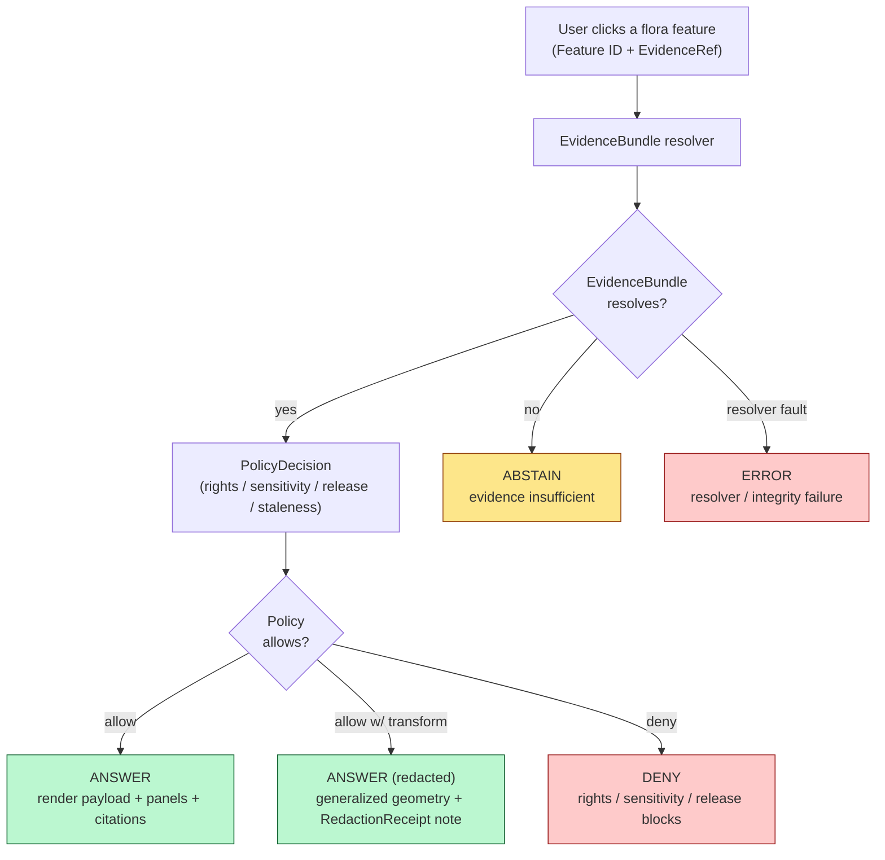

<!-- [KFM_META_BLOCK_V2]
doc_id: kfm://doc/flora-evidence-drawer
title: Flora Domain — Evidence Drawer
type: standard
version: v1
status: draft
owners: <flora-domain-steward> (PLACEHOLDER), <ai-surface-steward> (PLACEHOLDER), <docs-steward> (PLACEHOLDER)
created: 2026-06-03
updated: 2026-06-03
policy_label: public
contract_version: 3.0.0
related: [
  "docs/doctrine/directory-rules.md",
  "ai-build-operating-contract.md",
  "docs/domains/flora/README.md",
  "docs/domains/flora/CROSSWALKS.md",
  "docs/domains/flora/CROSS_LANE_NOTES.md",
  "docs/domains/flora/DATA_LIFECYCLE.md",
  "docs/architecture/governed-ai/README.md",
  "contracts/runtime/evidence_drawer_payload.md",
  "docs/registers/VERIFICATION_BACKLOG.md",
  "docs/registers/DRIFT_REGISTER.md"
]
tags: [kfm, domain, flora, evidence-drawer, ui, trust, governed-ai, sensitivity]
notes: [
  "CONTRACT_VERSION pinned to 3.0.0 per ai-build-operating-contract.md.",
  "The Evidence Drawer is a CONFIRMED cross-cutting surface; Flora consumes the shared shell and supplies a flora EvidenceDrawerPayload projection — there is no flora-specific drawer component.",
  "EvidenceBundle MUST resolve before any drawer output; no rendered-feature-only answer.",
  "All non-directory-rules.md repo paths are PROPOSED / NEEDS VERIFICATION until checked against a mounted KFM repo.",
  "Addresses KFM-P1-FEAT-0065 open question: the minimum fields the drawer exposes per flora artifact family (proposed in §5)."
]
[/KFM_META_BLOCK_V2] -->

# Flora Domain — Evidence Drawer

> What the Evidence Drawer shows when a user clicks a flora feature — and how it proves, redacts, or denies, one hop from the EvidenceBundle.


-2e8b57)


| | |
|---|---|
| **Status** | draft |
| **Owners** | `<flora-domain-steward>`, `<ai-surface-steward>`, `<docs-steward>` (PLACEHOLDER) |
| **Last updated** | 2026-06-03 |
| **Contract** | `CONTRACT_VERSION = "3.0.0"` (`ai-build-operating-contract.md`) |
| **Authority** | KFM doctrine; `docs/doctrine/directory-rules.md` (v1.3); Master MapLibre Components v2.1 §N (Evidence Drawer payloads); Atlas v1.1 §8.G / §8.I; governed-AI doctrine |
| **Surface** | Shared MapLibre shell — Flora supplies a payload projection, not a component |

> [!IMPORTANT]
> **Resolve before you render.** The Evidence Drawer MUST resolve the `EvidenceBundle` **before** producing any output; there is **no rendered-feature-only answer**. A map popup or trust badge is a *cue*, not the drawer — it must resolve to the EvidenceBundle / Evidence Drawer before any consequential claim. Where rights, sensitivity, source authority, stale state, or release proof is missing, the drawer renders `DENY` or `ABSTAIN`, not a guess. Every implementation-shaped claim below is labeled `CONFIRMED`, `PROPOSED`, `NEEDS VERIFICATION`, `UNKNOWN`, or `CONFLICTED`.

---

## Contents

1. [Purpose & scope](#1-purpose--scope)
2. [Where the drawer is mandatory](#2-where-the-drawer-is-mandatory)
3. [Click-to-evidence resolution flow](#3-click-to-evidence-resolution-flow)
4. [The flora EvidenceDrawerPayload](#4-the-flora-evidencedrawerpayload)
5. [Per-artifact minimum fields](#5-per-artifact-minimum-fields)
6. [Drawer panels](#6-drawer-panels)
7. [Trust-visible states](#7-trust-visible-states)
8. [Sensitivity: explain the redaction, never leak the location](#8-sensitivity-explain-the-redaction-never-leak-the-location)
9. [Conflicting evidence](#9-conflicting-evidence)
10. [Negative outcomes — ABSTAIN, DENY, ERROR](#10-negative-outcomes--abstain-deny-error)
11. [Exports & citation preservation](#11-exports--citation-preservation)
12. [Validators, tests, fixtures](#12-validators-tests-fixtures)
13. [File-home & placement notes](#13-file-home--placement-notes)
14. [Open questions register](#14-open-questions-register)
15. [Verification backlog](#15-verification-backlog)
16. [Changelog](#16-changelog)
17. [Definition of done](#17-definition-of-done)
18. [Related docs](#18-related-docs)

---

## 1. Purpose & scope

This document is the **Evidence Drawer payload contract** for the Flora lane. It defines what a flora `EvidenceDrawerPayload` carries, which panels it renders, how it behaves on click, and how it handles sensitivity, conflict, and negative outcomes.

**CONFIRMED framing.** The Evidence Drawer is a **cross-cutting trust surface** shared across all sixteen domain lanes; Flora consumes the shared shell and supplies a payload projection. There is **no flora-specific drawer component**. [ATLAS §8.G "cross-cutting viewing products … identical across all domain chapters"] [MAP-MASTER §N]

**In scope:** the flora payload shape; per-artifact minimum fields; panel layout; trust-visible states; sensitivity behavior; conflict handling; negative-outcome rendering; export preservation.

**Out of scope (see neighbors):**

- Object-family *meaning* — `contracts/domains/flora/` (PROPOSED).
- Field-level *schema* — `schemas/contracts/v1/domains/flora/` (PROPOSED).
- How a claim *gets* its evidence — `docs/domains/flora/DATA_LIFECYCLE.md`.
- Identity / source-field reconciliation — `docs/domains/flora/CROSSWALKS.md`.
- Focus Mode (the AI synthesis surface) — `docs/architecture/governed-ai/README.md`; the drawer and Focus Mode share the same `EvidenceBundle` resolution but are distinct surfaces.

> [!NOTE]
> **The drawer is the cheapest place the trust membrane becomes visible.** A user reads source, version, evidence, policy, stale state, and review state in the drawer **instead of** taking the rendered layer as truth. [MAP-MASTER §N "show source, version, evidence, policy, stale state and review state rather than presenting the rendered layer as truth"]

[Back to top ↑](#contents)

---

## 2. Where the drawer is mandatory

**CONFIRMED doctrine** (KFM-P1-FEAT-0065; Pass 20 Part II): Evidence Drawer or equivalent trust-visible payloads MUST be available wherever users encounter public claims, map features, layer states, or AI summaries.

| Surface | Drawer requirement | Citation |
|---|---|---|
| A clicked flora **map feature** (occurrence point, community polygon, range) | MUST resolve to EvidenceBundle and open the drawer | CONFIRMED [KFM-P1-FEAT-0065] |
| A flora **layer state** (toggle, legend entry) | MUST expose source, status, and policy via the drawer | CONFIRMED [KFM-P1-FEAT-0065] |
| A map **popover / popup** | Is a cue only; MUST resolve to the drawer before any consequential claim | CONFIRMED [MAP-MASTER ML-059-061] |
| A **trust / attestation badge** | Badge click opens proof details; MUST NOT replace the drawer | CONFIRMED [MAP-MASTER ML-061-139] |
| A flora **Focus Mode answer** | Shares the same EvidenceBundle resolution; cites back into drawer evidence | CONFIRMED [MAP-MASTER §N] [GAI] |

> [!CAUTION]
> **A popup is not the drawer.** Rendering a flora occurrence's attributes in a hover popup and treating that as the answer is the canonical anti-pattern. The popup is a cue; the consequential claim only stands once the drawer resolves the EvidenceBundle. [MAP-MASTER ML-059-061]

[Back to top ↑](#contents)

---

## 3. Click-to-evidence resolution flow

**CONFIRMED behavior.** The drawer resolves a clicked feature (`Feature ID`, `EvidenceRef`, `EvidenceBundle`) through the EvidenceBundle resolver and a `PolicyDecision`, then shows citations, source, status, or denial. [MAP-MASTER §N component table]



> [!NOTE]
> **Diagram status: CONFIRMED flow / ILLUSTRATIVE layout.** The resolve-then-policy order and the four finite outcomes are CONFIRMED [MAP-MASTER §N] [GAI]; the branch styling is illustrative. The drawer never reaches RAW, WORK, QUARANTINE, canonical stores, graph internals, or source APIs — only released evidence. [ATLAS §24.6.2 trust membrane]

[Back to top ↑](#contents)

---

## 4. The flora EvidenceDrawerPayload

**CONFIRMED DTO / PROPOSED flora projection.** The shared `EvidenceDrawerPayload` takes `Feature ID`, `EvidenceRef`, and `EvidenceBundle` as inputs and is governed by the EvidenceBundle resolver and `PolicyDecision`. [MAP-MASTER §N]

The flora projection (PROPOSED) carries:

```text
EvidenceDrawerPayload (flora projection)
├── feature_id                 # clicked flora feature
├── outcome                    # ANSWER | ABSTAIN | DENY | ERROR
├── object_family              # Plant Taxon | Flora Occurrence | Rare Plant Record | ...
├── evidence_bundle_ref        # → resolved EvidenceBundle (REQUIRED for ANSWER)
├── citations[]                # resolvable source citations
├── source_role                # authority | observation | context | model (anti-collapse)
├── release_state              # PUBLISHED | review-authorized
├── review_state               # reviewed | pending | n/a
├── freshness                  # current | SOURCE_STALE
├── sensitivity_class          # public | restricted | redacted
├── redaction_receipt_ref?     # → RedactionReceipt when geometry was transformed
├── temporal                   # { source, observed, valid, retrieval, release, correction } (distinct)
├── trust_state                # verified | stale | unknown | failed
└── policy_decision_ref        # → PolicyDecision
```

> [!IMPORTANT]
> **No bundle, no answer.** The `evidence_bundle_ref` MUST resolve for an `ANSWER`. A payload that references an `EvidenceRef` which does not resolve to an `EvidenceBundle` produces `ABSTAIN`, never a rendered-feature-only claim. [MAP-MASTER §N] [ATLAS §24.6.2]

[Back to top ↑](#contents)

---

## 5. Per-artifact minimum fields

> [!NOTE]
> **This section proposes an answer to the CONFIRMED open question** in KFM-P1-FEAT-0065: *"What minimum fields must the Evidence Drawer expose for each artifact family?"* The rows are **PROPOSED** pending contract authoring and a mounted-repo check.

| Flora artifact | Minimum drawer fields (beyond the common payload) | Sensitivity note |
|---|---|---|
| **Plant Taxon** | accepted name, authority anchors (ITIS / GBIF / USDA PLANTS), name status | none |
| **FloraTaxon Crosswalk** | source name, anchors + confidence, resolved Plant Taxon | none |
| **SpecimenRecord** | herbarium/source, license, coordinate uncertainty | license MUST display |
| **Flora Occurrence** | taxon, observed time, generalization level, uncertainty | generalized geometry only |
| **Rare Plant Record** | taxon, conservation status, **generalization reason**, RedactionReceipt ref | **exact geometry never shown**; reason shown |
| **Vegetation Community** | community type, polygon source, generalization level | coarsen over private land |
| **InvasivePlantRecord** | taxon, status badge, source program | private-land detail suppressed |
| **Phenology Observation** | taxon, phenophase, observed time, source | none |
| **RangePolygon** | taxon, **source-role badge (model vs observed)**, method | model-vs-observed never collapsed |
| **Habitat Association** | associated community, owning-lane (Habitat) reference | preserves Habitat ownership |
| **Botanical Survey** | survey id, completeness annotation, source | none |
| **Restoration Planting** | project, generalized site, source | site generalized on private land |
| **Redaction Receipt** | transform type, input/output class, reason, reviewer, residual risk | **the withheld value is never in the receipt payload** |

[Back to top ↑](#contents)

---

## 6. Drawer panels

The drawer renders a fixed panel order so trust is read the same way on every flora feature (PROPOSED layout; panel content CONFIRMED by [MAP-MASTER §N]).

| # | Panel | Shows | Status |
|---|---|---|---|
| 1 | **Header** | object family, accepted name/title, trust-state chip | PROPOSED |
| 2 | **Source & role** | source family, source role (authority/observation/context/model), retrieval time | CONFIRMED content |
| 3 | **Evidence** | resolvable citations from the EvidenceBundle | CONFIRMED content |
| 4 | **Time** | source / observed / valid / release times; freshness (`current` / `SOURCE_STALE`) | CONFIRMED content |
| 5 | **Policy & release** | release state, review state, `PolicyDecision` summary | CONFIRMED content |
| 6 | **Sensitivity** | sensitivity class; redaction reason + RedactionReceipt link **when transformed** | CONFIRMED content |
| 7 | **Conflict** | lingering/conflicting signals when sources disagree (see §9) | CONFIRMED content |
| 8 | **Proof / attestation** | manifest/proof id; badge → proof details (not a drawer substitute) | CONFIRMED [ML-061-139] |

> [!TIP]
> **Metadata panels aid explainability but are not proof alone.** Provenance and lineage panels support AI explainability, but they must still resolve to source evidence and catalog records — the panel is a view onto the EvidenceBundle, not a replacement for it. [MAP-MASTER ML-059-080]

[Back to top ↑](#contents)

---

## 7. Trust-visible states

**CONFIRMED doctrine** (ML-061-140): the badge/trust pattern implies finite trust-visible states that need **distinct visual treatment**.

| Trust state | Meaning | Drawer treatment |
|---|---|---|
| `verified` | Proof/attestation resolves; evidence closed | full ANSWER payload |
| `stale` (`SOURCE_STALE`) | Source past freshness threshold | stale chip; claim shown with caveat |
| `unknown` | Verification state not established | unknown chip; no proof claimed |
| `failed` | Verification or integrity check failed | failed chip; claim withheld pending review |

> [!IMPORTANT]
> **A badge is not evidence.** Trust badges expose state visibly but MUST NOT substitute for the EvidenceBundle; a badge click opens proof details (receipts, attestations) and routes to drawer-level evidence — it is not itself the citation surface. [MAP-MASTER ML-061-138, ML-061-139]

[Back to top ↑](#contents)

---

## 8. Sensitivity: explain the redaction, never leak the location

**CONFIRMED doctrine.** The sensitivity-redacted view explains the redaction **without leaking the withheld location**. [ATLAS §8.G] Rare / protected / culturally sensitive flora locations are deny-by-default; a generalized public form is allowed only with review + transformed geometry + a `RedactionReceipt`. [ATLAS §8.I] [ENCY §20.5]

> [!CAUTION]
> **Sensitive-domain handling (operating contract §23.2).** For a Rare Plant Record, the drawer applies the most restrictive disposition: **DENY public exact exposure · GENERALIZE before publication · REDACT · QUARANTINE uncertain source material · REQUIRE steward review · REQUIRE transform receipt · ABSTAIN when support is inadequate.** The drawer shows the *reason* for generalization and a link to the `RedactionReceipt`; it never shows the exact coordinate, and the receipt payload itself never carries the withheld value.

**What the Sensitivity panel shows for a redacted flora feature:**

- the sensitivity class (`redacted`);
- the transform type (suppress / generalize-to-grid / generalize-to-county-or-watershed / buffer-jitter / delayed-publication / steward-only-exact);
- a plain-language redaction reason;
- a link to the `RedactionReceipt` (transform metadata only);
- **never** the exact geometry, exact identifier, or restricted-source-derived fields.

> [!WARNING]
> AI surfaces consuming this payload MUST NOT reconstruct the exact location by paraphrase, inference, or cross-lane join. Combinatorial sensitivity applies: a generalized occurrence joined with other data must not become a poaching map. [P20 KFM-IDX-ANA-004] [GAI]

[Back to top ↑](#contents)

---

## 9. Conflicting evidence

**CONFIRMED doctrine** (ML-060-027): when sources disagree, **both observations are retained**; trust tier and recency choose canonical status, and the Evidence Drawer **exposes the lingering / conflicting signals**.

For flora this means:

- A taxon whose accepted name differs between ITIS and GBIF shows **both** anchors and the chosen canonical, not a silently picked winner (the tie-breaker is governed by `CROSSWALKS.md` §10).
- An occurrence contested between two sources keeps both records; the drawer's **Conflict panel** surfaces the disagreement and the basis for the canonical choice.
- Source role is preserved across the conflict: an observed record and a modeled surface are never merged into one undifferentiated claim. [ATLAS §24.1]

[Back to top ↑](#contents)

---

## 10. Negative outcomes — ABSTAIN, DENY, ERROR

The drawer renders negative outcomes as **typed states**, never as blank or fabricated content. [MAP-MASTER §N] [GAI]

| Outcome | Trigger | What the drawer renders |
|---|---|---|
| `ANSWER` | EvidenceBundle resolves and policy allows | full payload + panels + citations |
| `ANSWER (redacted)` | allowed only with transform | generalized geometry + redaction reason + RedactionReceipt link |
| `ABSTAIN` | `EvidenceRef` does not resolve to an EvidenceBundle | "insufficient evidence" state; no claim |
| `DENY` | rights unknown, sensitivity unresolved, or not released | "denied" state + reason class (no sensitive detail) |
| `ERROR` | resolver fault or integrity failure | "error" state; no partial claim |

> [!NOTE]
> A `DENY` reason is shown as a **class** (e.g., "rights unresolved", "sensitive location"), never as the underlying sensitive detail that motivated the denial.

[Back to top ↑](#contents)

---

## 11. Exports & citation preservation

**CONFIRMED doctrine** (ML-061-141): any exported map or screenshot using badges MUST preserve the linked **manifest/proof id and verification state**, attached to citations and version.

For flora exports:

- a screenshot of a flora layer carries the manifest id, verification state, and citation references;
- a redacted feature stays redacted in the export — the export never re-exposes a withheld location;
- no uncited flora output is permitted (export citation + version + no-uncited-output tests). [MAP-MASTER §V]

[Back to top ↑](#contents)

---

## 12. Validators, tests, fixtures

| Test class | Example assertion | Default status |
|---|---|---|
| Click-to-drawer test | A clicked flora feature resolves to an EvidenceBundle before any claim renders | PROPOSED [MAP-MASTER §N] |
| Citation-validation test | Every drawer citation resolves; no uncited claim | PROPOSED |
| No-rendered-only test | A feature with an unresolved `EvidenceRef` yields `ABSTAIN`, not a popup answer | PROPOSED |
| Redaction-explained test | A Rare Plant Record drawer shows the redaction reason + receipt link and **no exact geometry** | PROPOSED |
| No-leak test | No sensitive field reaches the payload through any panel or export | PROPOSED |
| Source-role badge test | A RangePolygon shows model-vs-observed and never collapses them | PROPOSED [§24.1] |
| Conflict-panel test | Disagreeing sources both appear; canonical basis shown | PROPOSED [ML-060-027] |
| Trust-state test | verified / stale / unknown / failed each render distinctly | PROPOSED [ML-061-140] |
| Negative-outcome test | ABSTAIN / DENY / ERROR render as typed states | PROPOSED |
| Export-citation test | Exports preserve manifest id + verification state; redaction survives | PROPOSED [ML-061-141] |
| Accessibility test | Keyboard, contrast, badge-state, screen-reader checks pass | PROPOSED [ML-061-140] |

**CONFIRMED fixture rule.** Ship at least **one valid**, **one invalid**, **one denied**, **one abstention**, and **one rollback/correction** drawer fixture per major flora artifact; sensitive artifacts ship **public-safe transformed** fixtures (no real exact rare-plant coordinates). [UNIFIED §5.3]

[Back to top ↑](#contents)

---

## 13. File-home & placement notes

> [!NOTE]
> All paths below other than `directory-rules.md` are **PROPOSED / NEEDS VERIFICATION** per [DIRRULES §12]. The drawer is a shared shell; flora supplies a payload projection, not a component.

```text
docs/domains/flora/EVIDENCE_DRAWER.md         # this file
contracts/runtime/evidence_drawer_payload.md  # shared payload contract (cross-cutting)
schemas/contracts/v1/runtime/                  # shared EvidenceDrawerPayload schema home
contracts/domains/flora/                       # flora object families the payload projects
policy/domains/flora/                          # sensitivity / redaction policy the drawer obeys
fixtures/domains/flora/drawer/                  # flora drawer fixtures
tools/validators/ui/                            # click-to-drawer / citation / no-leak validators (cross-cutting)
```

> [!IMPORTANT]
> **The payload contract is shared, not flora-owned.** `EvidenceDrawerPayload` is a cross-cutting runtime contract under `contracts/runtime/` (PROPOSED); this flora doc governs the **flora projection and field set**, not a parallel payload home. Creating a flora-specific payload DTO would violate the no-parallel-homes rule.

> [!WARNING]
> **DR-FLORA-PATH-01 (CONFLICTED).** Directory Rules §12 places flora policy/contracts under a `domains/` segment; Atlas §24.13 omits it. Directory Rules §2.1 wins on placement; this doc uses the §12 form. File a `DRIFT_REGISTER.md` row; resolve by ADR (ADR-S-01 family). Same conflict tracked in `CONTINUITY_INVENTORY.md` §19, `CROSSWALKS.md` §12, `CROSS_LANE_NOTES.md` §11, and `DATA_LIFECYCLE.md` §11.

[Back to top ↑](#contents)

---

## 14. Open questions register

| ID | Question | Owner role | Resolution path |
|---|---|---|---|
| OQ-FLORAED-01 | Ratify the per-artifact minimum field set in §5 (the KFM-P1-FEAT-0065 open question). | Flora + AI-surface steward | contract authoring + ADR |
| OQ-FLORAED-02 | Where does the shared `EvidenceDrawerPayload` contract live — `contracts/runtime/` vs another shared home? | Schema steward | ADR; confirm against mounted repo |
| OQ-FLORAED-03 | What is the canonical freshness threshold per flora source family that flips a feature to `SOURCE_STALE`? | Release + policy steward | `policy/domains/flora/`; ADR-S-10 stale-state |
| OQ-FLORAED-04 | What is the exact tie-breaker the Conflict panel displays when ITIS and GBIF disagree? | Policy steward | reconcile with `CROSSWALKS.md` §10; ADR |
| OQ-FLORAED-05 | Which placement form is canonical for flora drawer artifacts (DR-FLORA-PATH-01)? | Docs + schema steward | ADR-S-01 family; Directory Rules §2.1 governs meanwhile |

[Back to top ↑](#contents)

---

## 15. Verification backlog

These items remain `NEEDS VERIFICATION` before promotion from `draft` to `published`. They belong on `docs/registers/VERIFICATION_BACKLOG.md` (PROPOSED).

1. Verify the shared `EvidenceDrawerPayload` contract and schema exist and accept the flora projection in §4. — NEEDS VERIFICATION
2. Verify the per-artifact field set (§5) against authored flora contracts. — NEEDS VERIFICATION
3. Verify click-to-drawer, citation-validation, and no-leak validators run against fixtures. — NEEDS VERIFICATION
4. Verify the redaction-explained behavior denies exact rare-plant geometry in a fixture. — NEEDS VERIFICATION
5. Verify trust-state and conflict-panel rendering. — NEEDS VERIFICATION
6. Verify export citation/verification-state preservation and redaction survival. — NEEDS VERIFICATION
7. Resolve DR-FLORA-PATH-01 by ADR. — CONFLICTED
8. Verify freshness thresholds per flora source family (`SOURCE_STALE`). — NEEDS VERIFICATION

[Back to top ↑](#contents)

---

## 16. Changelog

| Change | Type (per contract §37) | Reason |
|---|---|---|
| Initial draft of the Flora Evidence Drawer payload contract | new | The lane needed a governed home for the flora drawer projection, panels, and behavior |
| Proposed an answer to KFM-P1-FEAT-0065 (per-artifact minimum fields, §5) | gap closure | The corpus flags this as an open question; §5 proposes the field set |
| Documented the shared-payload / no-flora-component framing | clarification | The drawer is cross-cutting; a flora-specific component would violate the no-parallel-homes rule |
| Surfaced DR-FLORA-PATH-01 (§12 vs §24.13) as CONFLICTED | reconciliation | Consistent with the four sibling flora docs |
| Used `RuntimeResponseEnvelope`-aligned finite outcomes and `SOURCE_STALE` | reconciliation | Aligns with the cross-domain envelope migration and the open stale-state reconciliation |
| Pinned `CONTRACT_VERSION = "3.0.0"` and `directory-rules.md` v1.3 | housekeeping | Required for doctrine-adjacent docs |

> **Backward compatibility.** New document; no prior anchors to preserve. Section anchors §1–§18 are stable for inbound links from the flora doc set.

[Back to top ↑](#contents)

---

## 17. Definition of done

This document is done enough to enter the repository when:

- it is placed according to Directory Rules (`docs/domains/flora/EVIDENCE_DRAWER.md`, PROPOSED);
- a docs steward, the flora domain steward, and the AI-surface steward review it;
- it is linked from `docs/domains/flora/README.md` and the governed-AI architecture doc;
- it does not conflict with accepted ADRs (and DR-FLORA-PATH-01 is filed in `DRIFT_REGISTER.md` pending ADR resolution);
- the per-artifact field set (§5) is ratified or explicitly left PROPOSED with a tracked open question;
- any conflict with current repo conventions is logged in `docs/registers/DRIFT_REGISTER.md`;
- the `GENERATED_RECEIPT.json` planned in Section 2 is wired into CI;
- future changes follow the operating contract's §37 lifecycle.

[Back to top ↑](#contents)

---

## 18. Related docs

> [!NOTE]
> All paths below other than `directory-rules.md` are **PROPOSED / NEEDS VERIFICATION**; their presence in the live repo has not been checked in this session.

- `docs/doctrine/directory-rules.md` — **CONFIRMED** (v1.3)
- `ai-build-operating-contract.md` — operating contract (`CONTRACT_VERSION = "3.0.0"`) — CONFIRMED (in project)
- `docs/domains/flora/README.md` — flora lane README — PROPOSED
- `docs/domains/flora/CROSSWALKS.md` — identity / source-field reconciliation — PROPOSED
- `docs/domains/flora/CROSS_LANE_NOTES.md` — cross-lane edge ownership — PROPOSED
- `docs/domains/flora/DATA_LIFECYCLE.md` — how a flora claim gets its evidence — PROPOSED
- `docs/architecture/governed-ai/README.md` — Focus Mode / governed-AI surface — PROPOSED
- `contracts/runtime/evidence_drawer_payload.md` — shared payload contract — PROPOSED
- `docs/registers/VERIFICATION_BACKLOG.md`, `docs/registers/DRIFT_REGISTER.md` — PROPOSED

**Source-corpus tag legend:**

| Tag | Resolves to |
|---|---|
| `[MAP-MASTER]` | Master MapLibre Components-Functions-Features v2.1 — §N Evidence Drawer payloads & click resolution; §V exports; trust-visible-state idea cards (ML-059-061, ML-059-080, ML-060-027, ML-061-138/139/140/141) |
| `[ATLAS]` | Domains Culmination Atlas v1.1 §8.G cross-cutting viewing products; §8.I sensitivity; §24.1 source-role anti-collapse; §24.6.2 trust membrane; §24.13 crosswalk |
| `[ENCY]` | `kfm_encyclopedia.pdf` §7.6 Flora; §20.5 deny-by-default register |
| `[UNIFIED]` | KFM Unified Implementation Architecture Build Manual §5.3 fixture rule |
| `[GAI]` | KFM governed-AI doctrine (Focus Mode, cite-or-abstain, finite outcomes) |
| `[KFM-P1-FEAT-0065]` | Pass 23/32 idea card — Evidence Drawer required on layers, popovers, AI answers |
| `[P20 KFM-IDX-ANA-004]` | Pass 20 PLANTS combinatorial-sensitivity entry |
| `[DIRRULES]` | `docs/doctrine/directory-rules.md` (v1.3) |

---

<sub>
<b>Last reviewed:</b> 2026-06-03 ·
<b>Version:</b> v1 (draft) ·
<b>Contract:</b> CONTRACT_VERSION = "3.0.0" ·
<b>Owner:</b> &lt;flora-domain-steward&gt; (PLACEHOLDER) ·
<a href="#flora-domain--evidence-drawer">Back to top ↑</a>
</sub>
