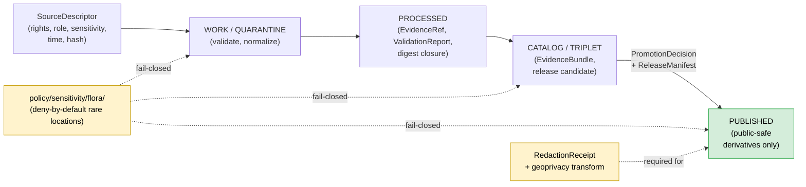
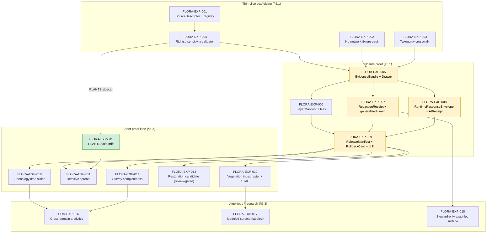

<!-- [KFM_META_BLOCK_V2]
doc_id: kfm://doc/flora-expansion-backlog
title: Flora — Expansion Backlog
type: standard
version: v1
status: draft
owners: <flora-lane steward (TBD); docs steward>
created: 2026-05-16
updated: 2026-05-16
policy_label: public
related:
  - docs/domains/flora/README.md
  - docs/domains/flora/SOURCES.md
  - docs/domains/fauna/EXPANSION_BACKLOG.md
  - docs/registers/VERIFICATION_BACKLOG.md
  - docs/registers/DRIFT_REGISTER.md
  - docs/adr/README.md
  - docs/doctrine/directory-rules.md
  - docs/doctrine/lifecycle-law.md
  - docs/doctrine/truth-posture.md
  - docs/doctrine/trust-membrane.md
tags: [kfm, flora, backlog, expansion, planning, governance, sensitivity]
notes:
  - "All EXP IDs cross-reference Pass 20 Part 2 Expansion Agenda §10."
  - "FLORA-EXP-* IDs are PROPOSED domain-specific items; not yet tied to ADRs."
  - "Implementation-layer claims are PROPOSED until repo evidence is mounted."
[/KFM_META_BLOCK_V2] -->

# Flora — Expansion Backlog

> PROPOSED, thin-slice-shaped work plan for the Flora lane: feature backlog, cross-cutting expansion items that touch Flora, dependencies, risks, ADR-class blocks, and verification backlog — all subordinate to KFM doctrine and governed promotion gates.

<!-- TODO: replace with real CI / coverage / last-build badges once tools/ci targets exist; see ADR-S-09 (badge URL convention). -->

**Status:** `draft` · **Owners:** `<flora-lane steward (TBD); docs steward>` · **Last updated:** `2026-05-16`

> [!IMPORTANT]
> This document is a **planning artifact**, not a release record. Nothing here promotes, publishes, or attests. Promotion is a governed state transition under the [lifecycle law](../../doctrine/lifecycle-law.md) and the [trust membrane](../../doctrine/trust-membrane.md); every item below remains `PROPOSED` until repo evidence (schemas, fixtures, validators, tests, workflows, manifests) confirms it.

---

## Contents

1. [Scope and Posture](#1-scope-and-posture)
2. [Doctrinal Basis](#2-doctrinal-basis)
3. [Standing Constraints (Posture)](#3-standing-constraints-posture)
4. [Cross-Cutting EXP Items Touching Flora](#4-cross-cutting-exp-items-touching-flora)
5. [Domain-Specific Backlog (Flora)](#5-domain-specific-backlog-flora)
6. [Sequencing and Dependencies](#6-sequencing-and-dependencies)
7. [Inputs and External Dependencies](#7-inputs-and-external-dependencies)
8. [Risks Register](#8-risks-register)
9. [ADR-Class Blocks](#9-adr-class-blocks)
10. [Verification Backlog](#10-verification-backlog)
11. [Open Questions](#11-open-questions)
12. [Related Docs](#12-related-docs)

---

## 1. Scope and Posture

This backlog tracks **PROPOSED expansion work** for the Flora lane: governance scaffolding, source admission, evidence and policy fixtures, validators, public-safe products, and review/release tooling. It is the working surface that feeds PR templates, ADR proposals, and steward review queues. It does **not** assert that any item is built, merged, deployed, or operationally enforced — those claims require repo evidence not present in this session.

The Flora lane's mission is **CONFIRMED doctrine** per [DOM-FLORA] / Encyclopedia §7.6: govern plant taxonomy, specimens, occurrences, communities, rare plants, invasives, phenology, range, and habitat associations as evidence-backed botanical claims, with rare/protected/culturally sensitive material defaulting to generalized, withheld, or denied public geometry.

**What this doc IS:**

- A thin-slice-shaped backlog for the Flora lane, prioritized for proof of closure over coverage.
- A crosswalk between **cross-cutting** Pass 20 expansion items (`EXP-001`…`EXP-015`) and **flora-specific** items (`FLORA-EXP-*`).
- A register of ADR-class blocks, verification items, and dependencies.
- A truth-labeled artifact (`CONFIRMED` / `PROPOSED` / `NEEDS VERIFICATION` / `UNKNOWN`).

**What this doc is NOT:**

- Not a release manifest, layer manifest, schema, contract, or policy file.
- Not a steward review record or rights determination.
- Not authority over Habitat, Fauna, Soil, Hydrology, Agriculture, Archaeology, or People/Land lanes.
- Not a substitute for an ADR. ADR-class decisions are flagged here for triage and authored separately under [`docs/adr/`](../../adr/README.md).

[⬆ back to top](#contents)

---

## 2. Doctrinal Basis

The Flora lane and this backlog inherit from the following sources, in source-hierarchy order:

| Source (short) | Role for this doc | Status |
|---|---|---|
| `[DOM-FLORA]` Flora dossier (Encyclopedia §7.6; Domains Atlas Ch. 8; Build Manual §6.5) | Domain identity, scope, sources, objects, pipeline, sensitivity | CONFIRMED doctrine |
| `[ENCY]` KFM Encyclopedia | Operating law, lifecycle, knowledge systems, deny register | CONFIRMED doctrine |
| `[DIRRULES]` Directory Rules | Placement, lifecycle, domain segment rule (§12), ADR triggers (§2.4) | CONFIRMED doctrine |
| `[GAI]` Governed AI dossier | AI behavior, AIReceipt, finite envelopes | CONFIRMED doctrine |
| `[MAP-MASTER]` MapLibre Master | Evidence Drawer, Focus Mode, trust badges, time-aware state | CONFIRMED doctrine |
| `[INDEX-18]` Pass 18 Idea Index | Domain-by-domain lineage | CONFIRMED doctrine (lineage) |
| Pass 20 Part 2 Idea Index + Expansion Agenda §10 / Appendix C | EXP-001…015 backlog with priorities | CONFIRMED doctrine (planning) |
| `[DOM-HAB]`, `[DOM-FAUNA]`, `[DOM-HF]`, `[DOM-AG]`, `[DOM-ARCH]` | Cross-lane joins and shared sensitivity posture | CONFIRMED doctrine |
| New Ideas 5-8 / 5-10 / 5-15 packets (USDA PLANTS, GBIF, herbaria, CDL/PLANTS sidecar) | Candidate source intelligence for live activation | CONFIRMED source notes |

> [!NOTE]
> All `[DOM-…]` / `[ENCY]` claims express **doctrine, not implementation maturity**. Schema homes, route names, validator code, CI workflows, branch state, and connector configuration remain `PROPOSED` / `NEEDS VERIFICATION` until inspected against a mounted repository.

[⬆ back to top](#contents)

---

## 3. Standing Constraints (Posture)

These are not work items — they are non-negotiable rails that every Flora backlog item, slice, and PR must honor.

| Constraint | Source | Status |
|---|---|---|
| RAW → WORK/QUARANTINE → PROCESSED → CATALOG/TRIPLET → PUBLISHED lifecycle, promotion is a **governed state transition, not a file move** | [DIRRULES] · [ENCY] | CONFIRMED |
| Cite-or-abstain truth posture; finite outcomes `ANSWER / ABSTAIN / DENY / ERROR` | [GAI] · [ENCY] | CONFIRMED |
| Deny-by-default for **exact rare / protected / culturally sensitive plant locations**; allowed only with review + generalized/withheld geometry + RedactionReceipt | [DOM-FLORA] Atlas §20.5 deny register | CONFIRMED |
| Sensitivity is a property of **joins**, not just inputs (benign PLANTS county data + GBIF/iNaturalist/heritage joins can become a poaching map) | Pass 20 Part 2 ANA / [POL-003] · New Ideas 5-15 | CONFIRMED |
| Source-role anti-collapse: `authority / observation / context / model` distinguished in registry | [DOM-FLORA] §D · [DIRRULES] | CONFIRMED |
| Ethnobotanical / culturally sensitive plant knowledge requires steward review before exposure | Build Manual §6.5 · Atlas §24.4.6 | CONFIRMED |
| AI is interpretive over released `EvidenceBundle`; never root truth; AIReceipt mandatory | [GAI] · [DOM-FLORA] §L | CONFIRMED |
| No-live-network fixture-first slice before any live connector activation | [DOM-FLORA] §K · KFM-IDX-VAL-001 | CONFIRMED |
| ReleaseManifest + correction path + rollback target required for public release | [DOM-FLORA] §M · ENCY Appendix E | CONFIRMED |

[⬆ back to top](#contents)

---

## 4. Cross-Cutting EXP Items Touching Flora

The Pass 20 Part 2 Expansion Agenda lists 15 expansion items (`EXP-001` … `EXP-015`). Those that **directly touch the Flora lane** are surfaced here with the flora-specific framing. EXP-level scope, priority, and proof-of-closure markers are as defined in Pass 20 Part 2 §10 and Appendix C.

| EXP | Title | Flora touchpoint | Priority | Status |
|---|---|---|---|---|
| `EXP-001` | CDL/PLANTS source drift watcher thin slice | Direct: PLANTS county package sidecar pattern; taxa drift vs. governed species lists; SourceIntakeRecord emission with `publication_state: WORK_CANDIDATE` | **High** | PROPOSED |
| `EXP-003` | Source-watch registry for environmental probes | Indirect: flora source families (USDA PLANTS, GBIF, iNaturalist, NatureServe, USFWS, KDWP, KSC/McGregor herbaria) need cadence/latency/threshold entries | High | PROPOSED |
| `EXP-005` | Evidence Drawer payloads for source drift and artifact integrity | Direct: `EvidenceDrawerPayload` projection for flora taxa, occurrences, vegetation community, rare-plant generalized derivative | Medium | PROPOSED |
| `EXP-006` | STAC profile for CDL and PMTiles artifacts | Indirect: when Flora ships a vegetation index raster or PMTiles vector layer, STAC profile compliance applies | Medium | PROPOSED |
| `EXP-007` | Domain source-role matrices | Direct: Flora matrix labeling every source as `authority / observation / context / model / candidate / aggregator` | Medium | PROPOSED |
| `EXP-008` | Threshold policy registry | Indirect: any flora materiality threshold (phenology change, invasive-spread cadence, taxa-set diff) registered here, not buried in code | Medium | PROPOSED |
| `EXP-009` | Live repo conformance scan | Direct: produces `CONFIRMED / PROPOSED / NEEDS VERIFICATION` for every flora claim in this doc | **High** | PROPOSED |
| `EXP-010` | Publication-deny dry run | Direct: each Flora deny case (rights unclear, sensitive exact geometry, missing EvidenceBundle, stale source) produces a `ValidationReport` and `denied` envelope | Medium | PROPOSED |
| `EXP-011` | Policy fixtures for sensitive exact-location denial | Direct: rare/protected/culturally sensitive plant locations are the canonical case | **High** | PROPOSED |
| `EXP-013` | Temporal-support acceptance criteria | Direct: undated phenology observation, range polygon, or vegetation community polygon must be denied at publication | Medium | PROPOSED |
| `EXP-015` | MapLibre layer registry validator | Direct: flora vector tile layers (generalized occurrence, range, vegetation community, invasive spread, phenology calendar) validated for renderer-binding conformance | **High** | PROPOSED |

> [!NOTE]
> `EXP-002` (PMTiles attestation slice) and `EXP-004` (hash policy ADR) are foundational across all domains and apply transitively to any flora vector tile or raster artifact KFM eventually publishes — they are not flora-specific entries in this table but are dependencies for `FLORA-EXP-005` and `FLORA-EXP-006` below.

[⬆ back to top](#contents)

---

## 5. Domain-Specific Backlog (Flora)

The structure below mirrors the **L. Feature backlog** schema from Encyclopedia §7.6 Flora (Build first / After proof lane / Ambitious / DENY-by-default), expanded with truth labels, evidence requirements, and validation paths. Item IDs use the `FLORA-EXP-NNN` convention; they are PROPOSED until adopted into an ADR or PR. Sequencing is in §6.

### 5.1 Build first (thin-slice gating)

The "first credible thin slice" for Flora per Encyclopedia §7.6 N is: **one common-species occurrence/specimen fixture + one vegetation community polygon, with `EvidenceBundle`-backed species page and a public-safe map** [DOM-FLORA] [ENCY]. The items below produce the scaffolding that proves closure for that slice.

| ID | Item | Actor / action | Evidence needed | Risk if skipped | Validation path | Status |
|---|---|---|---|---|---|---|
| `FLORA-EXP-001` | Flora source registry skeleton + `SourceDescriptor` schema fit | flora steward / dev | `SourceDescriptor` (rights, source-role, sensitivity, time, hash) for ≥1 source | rights/source-role ambiguity surfaces post-publication | schema validation + source-role validator (negative fixtures) | PROPOSED |
| `FLORA-EXP-002` | No-live-network fixture pack (positive, rights-denied, sensitivity-denied, stale, unresolved-EvidenceRef, rollback) | dev | synthetic plant taxon + occurrence + community polygon fixtures | live-source drift hides schema/policy defects | `fixtures/domains/flora/` + validator dry runs (KFM-IDX-VAL-001) | PROPOSED |
| `FLORA-EXP-003` | Taxonomy reconciliation & `FloraTaxon` crosswalk validator (USDA PLANTS ↔ GBIF backbone ↔ NatureServe) | dev / steward | taxa fixture with deliberate naming conflicts | name collisions admitted as identity | crosswalk validator + taxonomy-version pin (KFM-IDX-MOD-004) | PROPOSED |
| `FLORA-EXP-004` | Rights / sensitivity validator for flora source intake | dev / policy | source-role registry; conservation-status list fixture | uncited or rights-unclear data reaches PROCESSED | rights/sensitivity validator + policy deny tests (Atlas §K) | PROPOSED |
| `FLORA-EXP-005` | Flora `EvidenceBundle` closure + `EvidenceDrawer` inspector payload for one common species | public / researcher / steward | one closed `EvidenceBundle` for a public-safe taxon | uncited public claim | evidence closure + citation validation; ties to `EXP-005` | PROPOSED |
| `FLORA-EXP-006` | Flora layer manifest binding for ≥1 vector layer (generalized occurrence **or** vegetation community polygon) | dev | `LayerManifest` + tippecanoe/PMTiles artifact + STAC item | renderer/proof drift | `EXP-015` + `EXP-006` validators | PROPOSED |
| `FLORA-EXP-007` | Public-safe **generalized geometry** transform + `RedactionReceipt` for one rare-plant fixture | steward / dev | exact fixture (internal-only) + generalized public derivative + receipt | sensitive location exposure | `EXP-011` policy fixtures; receipt validator | PROPOSED |
| `FLORA-EXP-008` | Flora `RuntimeResponseEnvelope` + `AIReceipt` negative-case fixtures (`ABSTAIN`, `DENY`, `ERROR`) | dev | Focus Mode prompt fixtures over the species fixture | uncited / unsafe AI output | API finite-outcome fixtures (Atlas §K) | PROPOSED |
| `FLORA-EXP-009` | Flora `ReleaseManifest` + `RollbackCard` + rollback drill on the species fixture | release / steward | release decision + rollback target + drill log | irreversible release | release manifest validation + rollback drill (KFM-IDX-REL-*) | PROPOSED |

### 5.2 After proof lane

These items extend the lane after the thin slice closes; each presupposes §5.1 closure.

| ID | Item | Actor / action | Evidence needed | Risk if rushed | Validation path | Status |
|---|---|---|---|---|---|---|
| `FLORA-EXP-010` | Phenology time-slider + compare-mode binding for one species/region | researcher / steward | versioned phenology observations with `valid_time` distinct from `retrieval_time` and `release_time` | false temporal alignment | temporal logic tests (`EXP-013`) | PROPOSED |
| `FLORA-EXP-011` | Invasive plant spread layer + cross-lane Habitat/Agriculture context | steward | invasive fixture + cross-lane relation respecting Habitat ownership | management instruction misread as advisory | cross-lane relation validator (Atlas §F) | PROPOSED |
| `FLORA-EXP-012` | Vegetation index raster layer (NLCD or comparable) + STAC profile | dev | raster STAC item + provenance + classmap version | hidden classmap drift | `EXP-006` STAC validators | PROPOSED |
| `FLORA-EXP-013` | Restoration planting candidate surface (review-gated) | steward | restoration project records + review state | misread as KFM-prescribed | review-state validator; "advisory, not regulatory" badge | PROPOSED |
| `FLORA-EXP-014` | Botanical survey completeness derivative | researcher / steward | survey records + uncertainty model + EvidenceBundle | derivative becomes truth | graph projection tests | PROPOSED |
| `FLORA-EXP-015` | PLANTS county-package taxa drift candidate emission into review queue | dev / steward | PLANTS sidecar (`package_url`, `etag`, `last_modified`, `species_count`, `listed_species` ids only, `spec_hash`); taxonomy version pin; conservation-list intersection | join-induced sensitivity exposure | ties to `EXP-001`; sidecar schema + intersection validator | PROPOSED |

### 5.3 Ambitious / research

| ID | Item | Actor / action | Evidence needed | Risk | Validation path | Status |
|---|---|---|---|---|---|---|
| `FLORA-EXP-016` | Cross-domain Flora analytics + graph/triplet queries (Flora ↔ Habitat ↔ Soil ↔ Hazards) | researcher / AI assistant | source-backed triples + model receipts + EvidenceBundles | derivative becomes truth | graph projection tests; finite-envelope coverage | PROPOSED |
| `FLORA-EXP-017` | Suitability/distribution **modeled** surface with explicit model-vs-observation labels | researcher / steward | model receipts + source-role labeling + uncertainty surface | modeled treated as observed | source-role anti-collapse tests | PROPOSED |
| `FLORA-EXP-018` | Steward-only exact-location review surface (restricted role; not public) | steward | role-based access; admin-shortcut justification + audit | normal public path drift | `policy/access/flora-steward/` + audit trail | PROPOSED |

### 5.4 Standing deny-by-default (posture, not work items)

| Surface | Denied by default | Allowed only when | Citation |
|---|---|---|---|
| Public exact location for **rare / protected / culturally sensitive** plant taxa | Always | Steward review **and** generalized/withheld geometry **and** `RedactionReceipt` **and** EvidenceBundle | Atlas §20.5 · [DOM-FLORA] |
| Public **join product** of benign PLANTS taxa list with occurrence sources where the join could re-expose sensitive locations | Always | Steward + sensitivity policy + transform receipt | Pass 20 Part 2 ANA-004 · New Ideas 5-15 |
| AI Focus Mode claims about flora without a resolvable `EvidenceRef` to a released `EvidenceBundle` | Always | Cited evidence + policy-safe context + AIReceipt | [GAI] · Atlas §20.5 |
| Direct **RAW / WORK / QUARANTINE** access from public surfaces | Always | Promoted artifact through `apps/governed-api/` with ReleaseManifest | [DIRRULES] · [ENCY] |

[⬆ back to top](#contents)

---

## 6. Sequencing and Dependencies

The graph below shows PROPOSED build order. Boxes with the `gate` style are governance checkpoints that fail closed without their preconditions; boxes with the `target` style are user-visible deliverables.

> [!NOTE]
> The graph reflects **PROPOSED** sequencing derived from Encyclopedia §7.6 N (thin-slice plan), Atlas Ch. 8 H (pipeline shape), and Pass 20 Part 2 KFM-IDX-PLN-003 (thin-slice posture). Actual ordering will adapt to ADR resolution (§9) and to repo evidence not yet inspected in this session.

[⬆ back to top](#contents)

---

## 7. Inputs and External Dependencies

### 7.1 Internal (KFM) dependencies

| Item depends on | Provided by | Status |
|---|---|---|
| `SourceDescriptor` schema | `schemas/contracts/v1/<source-descriptor>/…` (path PROPOSED; see ADR-S-01) | NEEDS VERIFICATION |
| `EvidenceBundle` / `EvidenceRef` schema and resolver | `schemas/contracts/v1/evidence/…` + `packages/evidence-resolver/` | NEEDS VERIFICATION |
| Policy engine for sensitivity / rights / release | `policy/domains/flora/…`, `policy/sensitivity/flora/…` | NEEDS VERIFICATION |
| Sensitivity-tier scheme (T0–T4 or equivalent) | Atlas Open-ADR `ADR-S-05` | UNKNOWN |
| Geoprivacy transform vocabulary (`suppress`, `generalize-to-grid`, `generalize-to-watershed`, `generalize-to-county`, `buffer`, `jitter`, `delayed`, `steward-only`) | KFM-IDX-POL-005; needs ADR | PROPOSED |
| `ReleaseManifest`, `RollbackCard`, `CorrectionNotice` schemas | `release/…` per [DIRRULES] §6 | NEEDS VERIFICATION |
| MapLibre layer registry validator | `EXP-015` deliverable | PROPOSED |
| Watcher outbox path & lifecycle | `tools/ingest/plants_watch/` (path PROPOSED; cf. EXP-001 risk note) | PROPOSED |

### 7.2 External candidate sources

These are **PROPOSED candidates** for live activation. None are activated until rights, source-role, and steward-review obligations are recorded and `FLORA-EXP-001` / `FLORA-EXP-004` validators pass.

| Source | Role (PROPOSED) | Rights / licensing (CONFIRMED source notes) | Notes |
|---|---|---|---|
| **USDA PLANTS Database** (checklist + county distribution) | `authority` (checklist) / `aggregator` (distribution) | Public domain; citation requested; no official REST API as of 2025 packet | Use GBIF mirror DOI `705922f7-5ba5-49ab-a75d-722e3090e690` as taxonomic backbone; community wrappers (R/Python) for programmatic access. [New Ideas 5-8, 5-10] |
| **GBIF Occurrence API** | `aggregator` (occurrences) / `authority` (taxonomic backbone via PLANTS mirror) | Per-dataset license captured in API metadata; Darwin Core | `https://api.gbif.org/v1/occurrence/search`; async `occ_download` for bulk; `pygbif` / `rgbif`. [New Ideas 5-10] |
| **iDigBio specimen records** | `observation` (specimen evidence) | Per-collection licensing; Darwin Core | Aggregator of herbarium specimen data. [DOM-FLORA] |
| **R. L. McGregor Herbarium (KU)** | `observation` (Great Plains flora; ~400k vascular plant specimens) | Per-collection terms; Darwin Core via IPT | Regional priority for Kansas baseline. [New Ideas 5-8] |
| **Kansas State University Herbarium (KSC)** | `observation` | CC BY 4.0 (per packet) — verify currency before use | Great Plains flora focus. [New Ideas 5-8] |
| **NatureServe Explorer / Pro** | `authority` (conservation status) | Rights/licensing NEEDS VERIFICATION (varies by tier) | Drives rare-plant policy intersections. [DOM-FLORA] |
| **USFWS ECOS** (listed plants) | `authority` (federal listing) | Public domain (federal) | Drives federal status flags. [DOM-FLORA] |
| **iNaturalist (research-grade)** | `observation` (citizen science) | License varies per observation; obscured coords for sensitive taxa | Per-record license must be honored; obscured-coord handling required. [DOM-FLORA] |
| **KDWP / Kansas Natural Heritage Inventory** | `authority` / `steward` (state rare plants) | **Restricted** for exact rare-plant locations; permission required | Default fail-closed; steward review path required. [DOM-FLORA] · [New Ideas 5-10] |
| **NLCD / MRLC** | `context` (land cover; vegetation index inputs) | Public domain | Feeds `FLORA-EXP-012`. [New Ideas 5-8] |

> [!WARNING]
> Pass 20 Part 2 ANA-004 explicitly warns: **PLANTS county taxa data becomes sensitive when joined with GBIF, iNaturalist, or heritage datasets** — what is a benign county species list in isolation can become a poaching map in combination. Sensitivity is a property of the **resulting product**, not just of the original source. Every join that intersects a governed conservation list must route through steward review and emit a `RedactionReceipt` for any generalized public derivative.

[⬆ back to top](#contents)

---

## 8. Risks Register

Carried from Encyclopedia §7.6 M with backlog-specific framing.

| # | Risk | Likelihood (PROPOSED) | Impact (PROPOSED) | Mitigation | Backlog item(s) |
|---|---|---|---|---|---|
| R1 | Rights uncertainty (license drift, terms-of-use change, undocumented source role) | Medium | High (public release without rights = withdraw + correction notice) | Block public release until rights + redistribution class recorded in `SourceDescriptor`; rights validator fails closed | `FLORA-EXP-001`, `FLORA-EXP-004` |
| R2 | Sensitive location exposure (rare / protected / culturally sensitive plant) | Medium | **Severe** (real-world harm: poaching, habitat damage, cultural sovereignty) | Default redaction/generalization; restricted views; `RedactionReceipt` for every transform; steward review | `FLORA-EXP-007`, `EXP-011`, `FLORA-EXP-018` |
| R3 | Join-induced sensitivity (benign sources combining into a sensitive product) | Medium | **Severe** | Treat join product as sensitive even when inputs are not; intersection validator against governed lists | `FLORA-EXP-015`, `EXP-011` |
| R4 | False precision (over-stated coordinate accuracy; modeled-as-observed) | Medium | Medium-High | Uncertainty/support badges; scale and source-role badges; abstain on over-precise claims | `FLORA-EXP-005`, `FLORA-EXP-017` |
| R5 | Source authority confusion (`observation` vs `model` vs `aggregator` vs `authority` collapse) | Medium | High | Source-role registry; separate `observation/model/regulatory/legal-status` contexts | `FLORA-EXP-001`, `EXP-007` |
| R6 | Taxonomy drift (renames mistaken for presence/absence changes) | High | Medium | Taxonomy version pin per package; separate taxonomy-drift from presence-drift | `FLORA-EXP-003`, `FLORA-EXP-015` |
| R7 | Model hallucination (AI presents uncited or fabricated taxa/locations) | Low–Medium | High | Citation validation; finite outcomes; no direct model-to-public path; AIReceipt mandatory | `FLORA-EXP-008` |
| R8 | Stale data (cadence drift, source endpoint stale, phenology mis-binding) | High | Medium | Freshness badges; retrieval/source/release time distinct; stale-state policy | `FLORA-EXP-010`, `EXP-013` |
| R9 | Rollback complexity (released tiles, evidence, AI caches, Story Nodes) | Medium | High | `ReleaseManifest` + `RollbackCard` + rollback drill per release; rollback-propagation surface tracked | `FLORA-EXP-009` (and Atlas open question on rollback propagation) |
| R10 | Watcher outbox path divergence from Directory Rules | Medium | Medium | ADR for `tools/ingest/plants_watch/` placement; mirror `tools/ingest/cdl_watch/` decision | ADR-S-08 (see §9) |

[⬆ back to top](#contents)

---

## 9. ADR-Class Blocks

These items are flagged from Atlas §24.12 Master Open-ADR Backlog plus this doc's own placement triggers. Each is a **decision** that, per Directory Rules §2.4, must be recorded as an ADR before the affected schema, policy, source, registry, release, or proof home is treated as canonical. They block flora promotion only insofar as they affect Flora's authority surface; many can be resolved cross-cuttingly.

| # | Decision needed | Why ADR-class | Affected backlog items |
|---|---|---|---|
| `ADR-S-01` | Confirm `schemas/contracts/v1/…` as canonical schema home (or amend ADR-0001) | Directory Rules §2.4(3) | `FLORA-EXP-001`, `FLORA-EXP-002`, `FLORA-EXP-003` |
| `ADR-S-03` | Receipt class home: `schemas/contracts/v1/receipts/` vs. `schemas/contracts/v1/<domain>/receipts/` | Directory Rules §2.4(5) — parallel home risk | `FLORA-EXP-007` (RedactionReceipt) |
| `ADR-S-04` | Source-role enum canonical vocabulary + evolution rule | Source-role anti-collapse | `FLORA-EXP-001`, `EXP-007` |
| `ADR-S-05` | Sensitivity tier scheme (T0–T4 or alternative) | Cross-cuts every sensitive lane | `FLORA-EXP-004`, `FLORA-EXP-007`, `FLORA-EXP-018` |
| `ADR-S-06` | Geoprivacy transform vocabulary (proposed: `suppress / generalize-to-grid / generalize-to-watershed / generalize-to-county / buffer / jitter-constrained / delayed / steward-only`) | Trust-receipt grammar — needs cross-lane agreement (Fauna, Flora, Archaeology, People/Land) | `FLORA-EXP-007`, `EXP-011` |
| `ADR-S-07` | Watcher outbox path (`tools/ingest/plants_watch/` proposed; mirror CDL watcher placement) | Directory Rules placement | `FLORA-EXP-015`, `EXP-001` |
| `ADR-S-08` | Cross-lane join policy (deny-when-sensitive triggers) | Join-induced sensitivity is the strongest emergent risk | `FLORA-EXP-015`, `FLORA-EXP-016` |
| `ADR-S-09` | Standard badge URLs / build attestation surface in docs | Docs polish vs. governance ambiguity | (this doc's badge row) |
| `<flora-specific>` | Ethnobotanical / culturally sensitive plant knowledge — steward registry + review protocol | Cultural sovereignty requires explicit decision, not implicit policy | `FLORA-EXP-018`, deny-register row 1 |

[⬆ back to top](#contents)

---

## 10. Verification Backlog

These items carry forward Atlas Ch. 8 N (Flora) verification questions plus this doc's own implementation-layer questions. All are `NEEDS VERIFICATION` until repo evidence resolves them.

| # | Item to verify | Evidence that would settle it | Status |
|---|---|---|---|
| V1 | Flora source endpoints currently in repo + their rights records | `data/registry/sources/flora/…` entries; license fields in `SourceDescriptor`; CI rights-validator output | NEEDS VERIFICATION |
| V2 | Rare-plant steward review process: queue, roles, decision schema | `policy/sensitivity/flora/…`; `review/queues/flora/…`; reviewer registry | NEEDS VERIFICATION |
| V3 | Exact-vs-public geometry thresholds (county, watershed, grid size) | `policy/geoprivacy/flora/…` thresholds + tests | NEEDS VERIFICATION |
| V4 | Focus Mode + Evidence Drawer behavior for flora prompts (ABSTAIN/DENY paths) | Negative-case fixtures under `fixtures/domains/flora/` + AIReceipt examples | NEEDS VERIFICATION |
| V5 | Whether `schemas/contracts/v1/domains/flora/` exists, and what it contains | Repo inspection (`git ls-tree`) | UNKNOWN |
| V6 | Whether `policy/domains/flora/` and `policy/sensitivity/flora/` exist | Repo inspection | UNKNOWN |
| V7 | Whether `tools/ingest/plants_watch/` (or equivalent) exists | Repo inspection | UNKNOWN |
| V8 | Taxonomy resolver implementation (USDA PLANTS ↔ GBIF backbone ↔ NatureServe) | Code, tests, fixtures | UNKNOWN |
| V9 | MapLibre binding for any flora layer + corresponding `LayerManifest` | Repo inspection of `packages/maplibre/` + manifest registry | UNKNOWN |
| V10 | Whether any flora artifact has been released (status of `release/manifests/flora/…`) | Repo inspection of `release/manifests/` | UNKNOWN |
| V11 | Current external rights/terms for each candidate source (NatureServe tier, iNaturalist obscured-coords, KDWP permissions, KSC license currency) | External source page review at activation time + recorded `SourceDescriptor` rights field | NEEDS VERIFICATION |
| V12 | Cultural / ethnobotanical steward registry status (tribal review protocols, MOUs) | Steward registry + signed agreements | NEEDS VERIFICATION |

> [!CAUTION]
> Items V11 and V12 must be re-verified at every live-source activation. They are **not** one-time checks. A source's rights or a steward's review terms may change without notice; cached evidence does not satisfy active publication gates.

[⬆ back to top](#contents)

---

## 11. Open Questions

<b>Open questions register (12)</b> — seeds ADR drafts, PR conversations, and steward review sessions. <code>(B)</code> = blocking for ≥1 expansion item.

1. **(B)** Which Kansas AOI offers the right combination of evidence richness, sensitivity, and review feasibility for the **Flora thin-slice pilot**? Candidate: one Great Plains county with one common species (non-sensitive) + one vegetation community polygon. *[seeds `FLORA-EXP-005` AOI selection]*
2. **(B)** Which rare/protected plant data may be exposed at **county-level or coarser** generalization without steward review, and which never? *[seeds ADR-S-05, ADR-S-06]*
3. **(B)** What is the **conservation-status intersection list** used by `FLORA-EXP-015` (federal ESA, state KDWP, NatureServe G-rank, S-rank)? Order of precedence on conflict? *[seeds ADR-S-08]*
4. How should **taxonomy version changes** be distinguished from real presence/absence changes in PLANTS sidecar drift detection? *[seeds `FLORA-EXP-003`, `FLORA-EXP-015`]*
5. What is the **default generalization radius** for a `generalize-to-grid` transform on rare-plant occurrences? *[seeds ADR-S-06]*
6. Should iNaturalist **research-grade obscured-coord** records be treated as `observation` with degraded geometry, or refused at intake? *[seeds `FLORA-EXP-004`]*
7. How far does a **rollback propagate** through flora tiles, graphs, Focus Mode caches, and Story Nodes that reference the rolled-back EvidenceBundle? *(Carried from Atlas / KFM-IDX-REL-004)* *[blocks `FLORA-EXP-009` polish]*
8. What is the **freshness contract** for phenology observations vs. range polygons vs. vegetation community polygons? *[seeds `FLORA-EXP-010`, `EXP-013`]*
9. Are **ethnobotanical context** annotations governed by Flora policy, Archaeology policy, or a shared steward review surface? *(Atlas §24.4.6 says Flora consumes Archaeology context.)* *[seeds ADR for ethnobotanical steward registry]*
10. Should the watcher outbox be `tools/ingest/plants_watch/` (mirror of CDL pattern) or live under a different responsibility root? *[seeds ADR-S-07]*
11. Are **modeled** distribution/suitability surfaces published as flora truth, or restricted to context layers labeled as model output? *[seeds `FLORA-EXP-017`]*
12. Does `FLORA-EXP-018` (steward-only exact-location surface) live in `apps/governed-api/` with role-based access, or in a separate restricted app? *[needs Directory Rules §11 review]*

[⬆ back to top](#contents)

---

## 12. Related Docs

- [`docs/domains/flora/README.md`](./README.md) — Flora lane landing (PROPOSED if not yet created)
- [`docs/domains/flora/SOURCES.md`](./SOURCES.md) — Flora source-role matrix and dossiers (PROPOSED)
- [`docs/domains/fauna/EXPANSION_BACKLOG.md`](../fauna/EXPANSION_BACKLOG.md) — sibling pattern; sensitivity posture peer
- [`docs/domains/habitat/`](../habitat/) — Habitat lane (consumes Flora vegetation community context)
- [`docs/runbooks/fauna/SOURCE_REFRESH_RUNBOOK.md`](../../runbooks/fauna/SOURCE_REFRESH_RUNBOOK.md) — pattern for a flora source-refresh runbook (TODO: author `docs/runbooks/flora/SOURCE_REFRESH_RUNBOOK.md`)
- [`docs/registers/VERIFICATION_BACKLOG.md`](../../registers/VERIFICATION_BACKLOG.md) — repo-wide verification register
- [`docs/registers/DRIFT_REGISTER.md`](../../registers/DRIFT_REGISTER.md) — repo-wide drift log
- [`docs/adr/README.md`](../../adr/README.md) — ADR index (target home for ADR-S-* items in §9)
- [`docs/doctrine/directory-rules.md`](../../doctrine/directory-rules.md) — placement and lifecycle authority
- [`docs/doctrine/lifecycle-law.md`](../../doctrine/lifecycle-law.md) — RAW → PUBLISHED invariant
- [`docs/doctrine/truth-posture.md`](../../doctrine/truth-posture.md) — cite-or-abstain
- [`docs/doctrine/trust-membrane.md`](../../doctrine/trust-membrane.md) — `apps/governed-api/` as the public path
- [`docs/standards/PROV.md`](../../standards/PROV.md) — provenance profile (EvidenceBundle ↔ PROV-O)
- [`docs/standards/ISO-19115.md`](../../standards/ISO-19115.md) — geospatial metadata crosswalk
- [`docs/standards/PMTILES.md`](../../standards/PMTILES.md) — vector tile governance (applies to flora layer tiles)
- [`docs/standards/OGC-API-TILES.md`](../../standards/OGC-API-TILES.md) — tile delivery
- [`docs/standards/OAI-PMH.md`](../../standards/OAI-PMH.md) — harvest governance

---

**Last updated:** 2026-05-16 · **Doc version:** v1 (`draft`) · **Doctrine basis:** [DOM-FLORA] · [ENCY] §7.6 · Domains Atlas v1.1 Ch. 8 · Build Manual §6.5 · Pass 20 Part 2 Expansion Agenda §10 / Appendix C · [DIRRULES] · [GAI] · [MAP-MASTER]

[⬆ back to top](#contents)
