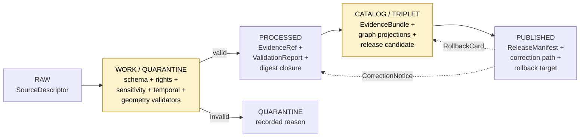
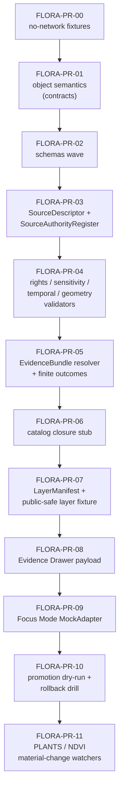

<!-- [KFM_META_BLOCK_V2]
doc_id: kfm://doc/flora-expansion-plan
title: Flora Domain — Expansion Plan
type: standard
version: v1.1
status: draft
owners: <flora-domain-steward> (PLACEHOLDER), <docs-steward> (PLACEHOLDER)
created: 2026-05-16
updated: 2026-06-03
policy_label: public
contract_version: 3.0.0
related: [
  "docs/doctrine/directory-rules.md",
  "ai-build-operating-contract.md",
  "docs/domains/flora/README.md",
  "docs/domains/flora/CONTINUITY_INVENTORY.md",
  "docs/domains/flora/CROSSWALKS.md",
  "docs/domains/flora/CROSS_LANE_NOTES.md",
  "docs/domains/flora/DATA_LIFECYCLE.md",
  "docs/domains/flora/EVIDENCE_DRAWER.md",
  "docs/domains/flora/EXPANSION_BACKLOG.md",
  "docs/registers/VERIFICATION_BACKLOG.md",
  "docs/registers/DRIFT_REGISTER.md"
]
tags: [kfm, flora, expansion, plan, pr-series, governance, sensitivity]
notes: [
  "CONTRACT_VERSION pinned to 3.0.0 per ai-build-operating-contract.md.",
  "Planning artifact — sequences PRs; promotes nothing. Implementation claims default to PROPOSED.",
  "v1.1: added the KFM Meta Block v2 (was absent); pinned CONTRACT_VERSION and directory-rules.md v1.3; surfaced DR-FLORA-PATH-01; recast 'aggregator' source role to 'aggregate' per Atlas §24.1; added the Flora × Archaeology ethnobotanical edge (§24.4.6) to §12; replaced Cesium deferral with MapLibre-sole-renderer framing; added Open Questions register, Changelog, and Definition of Done.",
  "All non-directory-rules.md repo paths are PROPOSED / NEEDS VERIFICATION until checked against a mounted KFM repo."
]
[/KFM_META_BLOCK_V2] -->

# 🌿 Flora Domain — Expansion Plan

> Sequenced, reversible plan to expand the Flora lane from doctrine into evidence-grade, public-safe, governed implementation under the KFM trust membrane.

[](#status)
[](#1--purpose-and-scope)
[](#2--truth-posture-and-evidence-basis)
[](#2--truth-posture-and-evidence-basis)
[](#9--sensitivity-rights-and-publication-posture)
[](#4--pipeline-shape-and-promotion-discipline)

| Field | Value |
|---|---|
| **Path** | `docs/domains/flora/EXPANSION_PLAN.md` |
| **Domain** | Flora |
| **Doc type** | Domain expansion plan (planning artifact, not standards or runbook) |
| **Status** | `draft` — pending review |
| **Contract** | `CONTRACT_VERSION = "3.0.0"` (`ai-build-operating-contract.md`) |
| **Owners** | `<flora-domain-steward>` · `<docs-steward>` *(placeholder — set in PR)* |
| **Last updated** | `2026-06-03` |
| **Related citations** | `[DOM-FLORA]` · `[ENCY §7.6]` · `[DIRRULES]` (v1.3) · `[GAI]` · `[MAP-MASTER]` · `[ATLAS]` |

---

## 📑 Contents

1. [Purpose and scope](#1--purpose-and-scope)
2. [Truth posture and evidence basis](#2--truth-posture-and-evidence-basis)
3. [Domain identity recap and boundary](#3--domain-identity-recap-and-boundary)
4. [Pipeline shape and promotion discipline](#4--pipeline-shape-and-promotion-discipline)
5. [Proposed file homes (responsibility roots)](#5--proposed-file-homes-responsibility-roots)
6. [Sequenced expansion roadmap (PR series)](#6--sequenced-expansion-roadmap-pr-series)
7. [Source intake plan](#7--source-intake-plan)
8. [Schemas, contracts, and policy plan](#8--schemas-contracts-and-policy-plan)
9. [Sensitivity, rights, and publication posture](#9--sensitivity-rights-and-publication-posture)
10. [Validators, fixtures, and tests](#10--validators-fixtures-and-tests)
11. [MapLibre, Evidence Drawer, and Focus Mode plan](#11--maplibre-evidence-drawer-and-focus-mode-plan)
12. [Cross-lane integration plan](#12--cross-lane-integration-plan)
13. [Acceptance and exit criteria](#13--acceptance-and-exit-criteria)
14. [Rollback and correction plan](#14--rollback-and-correction-plan)
15. [Open questions register and verification backlog](#15--open-questions-register-and-verification-backlog)
16. [Changelog](#16--changelog)
17. [Definition of done](#17--definition-of-done)
18. [Related docs](#18--related-docs)

---

## 1 · Purpose and scope

This document plans the **incremental, reversible expansion** of the Flora domain from its current doctrinal state (described in `[DOM-FLORA]` and `[ENCY §7.6]`) into a proof-bearing, fixture-first, governed implementation that satisfies the KFM trust membrane.

It is **not** a standards document, not a contract, not a release manifest, and not a runbook. It sequences and scopes the work other artifacts will carry: schemas, contracts, policy bundles, validators, fixtures, layer manifests, runbooks, ADRs, and proof-bearing PRs.

> [!IMPORTANT]
> **CONFIRMED doctrine / PROPOSED implementation.** Every implementation-layer claim in this plan is **PROPOSED** unless explicitly labeled otherwise. A mounted repository was **not** inspected in the session that produced this draft; current repo state is **UNKNOWN** here. No statement in this document constitutes proof of existence of any file, route, schema, validator, fixture, manifest, CI job, or release artifact.

### 1.1 In scope

- Sequenced PR series for the Flora lane.
- Proposed file homes under KFM responsibility roots, consistent with Directory Rules.
- Source-intake, schema/contract/policy, validator, fixture, and map-layer plans.
- Sensitivity, rights, and publication posture and the deny-by-default register for Flora.
- Cross-lane integration with Habitat, Fauna, Soil/Hydrology, Hazards, Agriculture, and the ethnobotanical edge to Archaeology.
- Acceptance criteria, rollback posture, and open questions.

### 1.2 Out of scope

- Live source connectors that hit network in the first wave (deferred until source descriptors, rights validators, and no-network fixtures land).
- 3D scene authoring for Flora (deferred per `[UIAI]` Section 12 *Files intentionally deferred*; when authored it uses the sole browser-side renderer `packages/maplibre-runtime/` — Cesium is retired per ADR-0007 — and consumes the same `EvidenceBundle` / `RuntimeResponseEnvelope` as 2D).
- Runbook naming reconciliation `docs/runbooks/<domain>/<NAME>.md` vs `docs/runbooks/<domain>_<NAME>.md` (tracked as DIRRULES §6.1.b OPEN-DR-02).
- Live AI model adapters; only the **MockAdapter** path is in scope for the Flora-Focus pilot.

[⬆ Back to top](#-contents)

---

## 2 · Truth posture and evidence basis

### 2.1 Posture

The KFM truth-label convention applies to every row of this plan. Implementation-layer claims (paths, routes, validator behavior, CI, branch state, deployment) **default to PROPOSED** unless verified against a mounted repository.

| Label | Meaning in this document |
|---|---|
| **CONFIRMED** | Stated in attached KFM doctrine (`[DOM-FLORA]`, `[ENCY]`, `[DIRRULES]`, `[GAI]`, `[MAP-MASTER]`, `[ATLAS]`) or in this session's evidence. |
| **PROPOSED** | Design or path not yet verified against a mounted repository. |
| **INFERRED** | Reasonably derivable from visible doctrine but not directly stated. |
| **UNKNOWN** | Not resolvable without more evidence; will not be acted on as fact. |
| **NEEDS VERIFICATION** | Checkable, but not yet checked strongly enough to act as fact. |
| **CONFLICTED** | Sources disagree; held open until an ADR or drift-register entry resolves it. |

### 2.2 Evidence basis used for this plan

| Source | Role here | Truth tag |
|---|---|---|
| `ai-build-operating-contract.md` (`CONTRACT_VERSION = "3.0.0"`) | Canonical operating contract; truth posture, lifecycle, gate doctrine | CONFIRMED doctrine |
| `[DOM-FLORA]` — Flora dossier (Atlas §8) | Mission, boundary, ubiquitous language, source families, object families, pipeline shape, sensitivity posture, validator backlog, open questions | CONFIRMED doctrine |
| `[ENCY §7.6]` — Encyclopedia Flora chapter | Source basis, knowledge systems, AI rules, viewing products, analytical functions | CONFIRMED doctrine |
| `[ENCY §14]` — Implementation Roadmap (Small Reversible PRs) | PR-00 … PR-10 reference series adapted here for Flora | CONFIRMED roadmap shape / PROPOSED Flora application |
| `[DIRRULES]` — Directory Rules (v1.3) | Responsibility roots, domain-as-segment rule (§12), lifecycle invariant, ADR triggers (§2.4) | CONFIRMED placement authority |
| `[GAI]` — Governed AI dossier | Mock adapter, evidence-bounded synthesis, finite outcomes for Focus Mode | CONFIRMED doctrine |
| `[MAP-MASTER]` — MapLibre master v2.1 | LayerManifest, Evidence Drawer, public-safe rendering, sensitive-geometry policy | CONFIRMED doctrine |
| `[ATLAS]` — Domains Culmination Atlas v1.1 Ch. 24 | §24.1 source-role anti-collapse; §24.4.6 Flora edges; §24.5 tier scheme; §24.6 gates; §24.13 crosswalk | CONFIRMED doctrine |
| `[New Ideas 5-15]` — operational delta packet | PLANTS/CDL watcher pattern, material-change thresholds, sidecar discipline | CONFIRMED operational doctrine / PROPOSED Flora adaptation |
| `[New Ideas 5-8]` — operational delta packet | NDVI/MAIAC veg-anomaly recipe, signed STAC+JSON EvidenceBundle, source-health probes | CONFIRMED operational doctrine / PROPOSED Flora adaptation |

> [!NOTE]
> **Repository state is UNKNOWN.** This plan must be re-audited against a mounted repository before any path, route, or test claim is promoted from PROPOSED to CONFIRMED. Atlas Ch. 24 registers are **navigational aids**; `EvidenceBundle` and the governing dossiers remain authoritative.

[⬆ Back to top](#-contents)

---

## 3 · Domain identity recap and boundary

> CONFIRMED doctrine: Govern plant taxonomic identity, flora occurrences, specimens, surveys, vegetation communities, rare/protected/culturally sensitive flora controls, public-safe surfaces, evidence-backed maps, correction, and rollback. — `[DOM-FLORA §A]`, `[ENCY §7.6.A]`, `[ATLAS §8.A]`

### 3.1 What Flora owns

> [!NOTE]
> Casing follows the Atlas §8.B owned-list: spaced forms (`Plant Taxon`, `Flora Occurrence`, `Rare Plant Record`, `Vegetation Community`, `Phenology Observation`, `Habitat Association`, `Botanical Survey`, `Restoration Planting`, `Redaction Receipt`) and compounded forms (`SpecimenRecord`, `InvasivePlantRecord`, `RangePolygon`, `DistributionSurface`) are carried verbatim. Field-level casing normalization is PROPOSED.

| Object family | Status | Notes |
|---|---|---|
| Plant Taxon | CONFIRMED term / PROPOSED field realization | Canonical plant taxon entity inside Flora. |
| FloraTaxon Crosswalk | CONFIRMED term / PROPOSED field realization | Maps to USDA PLANTS, GBIF Backbone, ITIS, NatureServe, KDWP (see `CROSSWALKS.md`). |
| Flora Occurrence | CONFIRMED term / PROPOSED field realization | Point/area observation evidence. |
| SpecimenRecord | CONFIRMED term / PROPOSED field realization | Herbarium / collection specimen evidence. |
| Rare Plant Record | CONFIRMED term / PROPOSED field realization | Deny-by-default for exact geometry. |
| Vegetation Community | CONFIRMED term / PROPOSED field realization | Polygon community evidence. |
| InvasivePlantRecord | CONFIRMED term / PROPOSED field realization | Invasive-plant occurrence and spread. |
| Phenology Observation | CONFIRMED term / PROPOSED field realization | Time-series condition observation. |
| RangePolygon | CONFIRMED term / PROPOSED field realization | Generalized distribution polygon. |
| DistributionSurface | CONFIRMED term / PROPOSED field realization | Raster distribution / suitability surface. |
| Habitat Association | CONFIRMED term / PROPOSED field realization | Cross-lane edge to Habitat. |
| Botanical Survey | CONFIRMED term / PROPOSED field realization | Survey-event evidence. |
| Restoration Planting | CONFIRMED term / PROPOSED field realization | Restoration-project evidence. |
| Redaction Receipt | CONFIRMED object family / PROPOSED record | Provenance for public-safe transforms. |

### 3.2 What Flora explicitly does **not** own

| Concern | Owner |
|---|---|
| Habitat patches, suitability, ecological systems | Habitat |
| Animal taxa and animal occurrences | Fauna |
| Canonical soil map-unit / horizon semantics | Soil |
| Water observations and flood context | Hydrology |
| Crop / yield / agricultural-economy semantics | Agriculture |
| Ownership, parcels, living-person privacy | People / DNA / Land |
| Hazard-event semantics (fire, flood, drought, smoke) | Hazards |
| Cultural-heritage / archaeological-site authority | Archaeology |

> [!NOTE]
> Flora **links** to all of these through governed joins under EvidenceBundle support; it does not republish their canonical truth. The directional edge ownership is governed by Atlas §24.4 and detailed in `CROSS_LANE_NOTES.md`.

[⬆ Back to top](#-contents)

---

## 4 · Pipeline shape and promotion discipline

CONFIRMED doctrine: Flora follows the KFM lifecycle invariant `RAW → WORK / QUARANTINE → PROCESSED → CATALOG / TRIPLET → PUBLISHED`, with promotion as a **governed state transition**, never a file move. — `[DIRRULES]`, `[DOM-FLORA §H]`, `[ATLAS §24.6]`



| Stage | Required gate | Truth tag |
|---|---|---|
| RAW | `SourceDescriptor` exists for every Flora source | PROPOSED |
| WORK / QUARANTINE | Schema + rights + sensitivity + temporal + geometry validators pass, **or** quarantine reason is recorded | PROPOSED |
| PROCESSED | `EvidenceRef` + `ValidationReport` + digest closure | PROPOSED |
| CATALOG / TRIPLET | `EvidenceBundle` + catalog closure + graph/triplet projection | PROPOSED |
| PUBLISHED | `ReleaseManifest` + correction path + rollback target + review/policy state | PROPOSED |

> [!WARNING]
> **Promotion is a governed state transition, not a file move.** Copying bytes from `data/work/flora/` to `data/published/` outside the governed gate sequence is a lifecycle violation regardless of which directory the bytes end up in. — `[DIRRULES]`, `[ATLAS §24.6.2]`

[⬆ Back to top](#-contents)

---

## 5 · Proposed file homes (responsibility roots)

PROPOSED placements, derived from Directory Rules and the **domain-as-segment** rule (§12): domains live as a segment inside each responsibility root, never as a root.

```text
docs/domains/flora/
├── README.md                         (PROPOSED — domain landing)
├── EXPANSION_PLAN.md                 (this file)
├── EXPANSION_BACKLOG.md              (PROPOSED — backlog companion)
├── CONTINUITY_INVENTORY.md           (PROPOSED — carry-forward register)
├── CROSSWALKS.md                     (PROPOSED — identity / source-field)
├── CROSS_LANE_NOTES.md               (PROPOSED — edge ownership)
├── DATA_LIFECYCLE.md                 (PROPOSED — RAW → PUBLISHED)
├── EVIDENCE_DRAWER.md                (PROPOSED — drawer payload contract)
├── OBJECT_FAMILIES.md                (PROPOSED — per-family reference)
├── SOURCES.md                        (PROPOSED — source families register)
├── SENSITIVITY.md                    (PROPOSED — deny-by-default and tier matrix)
└── DECISIONS/                        (PROPOSED — Flora-scoped ADRs)

contracts/domains/flora/              (PROPOSED — object semantics)
schemas/contracts/v1/domains/flora/   (PROPOSED — machine shape per ADR-0001)
policy/domains/flora/                 (PROPOSED — allow/deny/restrict/review)
tests/domains/flora/                  (PROPOSED — validator and contract tests)
fixtures/domains/flora/               (PROPOSED — no-network golden fixtures)
pipelines/domains/flora/              (PROPOSED — executable pipeline logic)
pipeline_specs/flora/                 (PROPOSED — declarative pipeline configs)
data/raw/flora/<source_id>/<run_id>/  (PROPOSED — lifecycle invariant)
data/work/flora/<run_id>/             (PROPOSED)
data/quarantine/flora/<reason>/<run_id>/  (PROPOSED)
data/processed/flora/<dataset_id>/<version>/  (PROPOSED)
data/catalog/domain/flora/            (PROPOSED)
data/published/layers/flora/          (PROPOSED — public-safe layers only)
data/registry/sources/flora/          (PROPOSED — source descriptors)
release/candidates/flora/             (PROPOSED — release decisions)
```

> [!WARNING]
> **DR-FLORA-PATH-01 — Path-segment-form conflict (CONFLICTED).** Directory Rules §12 places flora artifacts under a `domains/` segment (used above). Atlas v1.1 §24.13 omits it (`schemas/contracts/v1/flora/`, `contracts/flora/`, `policy/sensitivity/flora/`). Per the authority order (`directory-rules.md` §2.1), **Directory Rules wins on placement** — this plan uses the §12 form. File a `DRIFT_REGISTER.md` row; resolve by ADR-S-01. Same conflict tracked across the flora doc set (`CONTINUITY_INVENTORY.md` §19, `CROSSWALKS.md` §12, `CROSS_LANE_NOTES.md` §11, `DATA_LIFECYCLE.md` §11, `EVIDENCE_DRAWER.md` §13, `EXPANSION_BACKLOG.md` §7).

> [!IMPORTANT]
> Every path above is **PROPOSED** and **NEEDS VERIFICATION** against the mounted repository. If a target root does not yet exist, the change creating it must also create a per-root `README.md` per `[DIRRULES]` and, where a new canonical or compatibility root is implied, ship with an **ADR**.

### 5.1 Directory-Rules basis (per path)

| Path | Owning root | Why this root | Status |
|---|---|---|---|
| `docs/domains/flora/EXPANSION_PLAN.md` | `docs/` | Human-facing planning artifact; domain is a segment, not a root | CONFIRMED rule / PROPOSED placement |
| `contracts/domains/flora/` | `contracts/` | Object **meaning** for Flora object families | CONFIRMED rule / PROPOSED presence |
| `schemas/contracts/v1/domains/flora/` | `schemas/` | Machine **shape** under ADR-0001 default home | CONFIRMED rule / PROPOSED presence (CONFLICTED form, DR-FLORA-PATH-01) |
| `policy/domains/flora/` | `policy/` | Allow / deny / restrict / abstain / review decisions | CONFIRMED rule / PROPOSED presence (CONFLICTED form) |
| `tests/domains/flora/`, `fixtures/domains/flora/` | `tests/`, `fixtures/` | Proof that doctrine is enforceable | CONFIRMED rule / PROPOSED presence |
| `data/<phase>/flora/…` | `data/` | Lifecycle invariant; phase precedes domain | CONFIRMED rule / PROPOSED presence |
| `release/candidates/flora/` | `release/` | Release **decisions** (distinct from `data/published/`) | CONFIRMED rule / PROPOSED presence |

[⬆ Back to top](#-contents)

---

## 6 · Sequenced expansion roadmap (PR series)

PROPOSED Flora-specific instantiation of the small-reversible-PR pattern from `[ENCY §14]`. Each step is **reversible**, has a **no-network fixture** path, and lands a **proof-of-closure marker** before the next step starts.



### 6.1 PR table — Flora-specific

| ID | Description | Proposed homes | Risk | Acceptance | Rollback |
|---|---|---|---|---|---|
| **FLORA-PR-00** | No-network synthetic fixtures: one common-species `Flora Occurrence` + one `SpecimenRecord` + one `Vegetation Community` polygon + one `Rare Plant Record` *(denied-by-default)* + one `Phenology Observation`. | `fixtures/domains/flora/` + `tests/domains/flora/` | Live source / public data leakage in fixtures | Fixture validation passes; no network access in CI; rare-plant fixture proves deny path | Revert PR |
| **FLORA-PR-01** | Contract definitions for Flora object families (object **meaning**). | `contracts/domains/flora/` | Authority drift versus `contracts/OBJECT_MAP.md` | OBJECT_MAP entries reviewed; ADR-0001 honored | Supersede contract; preserve as lineage |
| **FLORA-PR-02** | Schemas wave (see §8.2). | `schemas/contracts/v1/domains/flora/` | Schema vs contract drift | Each schema has valid + invalid fixtures; validators consume them | Remove schema wave if ADR-0001 fails |
| **FLORA-PR-03** | `SourceDescriptor` + `SourceAuthorityRegister` entries for KDWP, KU McGregor Herbarium, Kansas Biological Survey, USFWS ECOS plant context, NatureServe Explorer/Pro, GBIF vascular-plant downloads, iDigBio, iNaturalist, USDA PLANTS. | `data/registry/sources/flora/` + `control_plane/source_authority_register.yaml` | Unknown rights / source-role ambiguity | Valid/invalid fixtures; rights validator denies unknown-rights cases | Disable descriptor entries |
| **FLORA-PR-04** | Validators: schema, evidence, rights, sensitivity, temporal, geometry, taxonomy reconciliation, no-live-network. | `tools/validators/` + `tests/domains/flora/` | False confidence; missing negative cases | Negative tests fail closed; rare-plant exact geometry denied | Revert validator or pin previous version |
| **FLORA-PR-05** | `EvidenceRef → EvidenceBundle` resolver emitting a `RuntimeResponseEnvelope` with finite outcomes `ANSWER / ABSTAIN / DENY / ERROR` for Flora. | `packages/evidence/` + `apps/governed-api/` *(route names PROPOSED)* | Unresolved evidence resolving to public claim | `ABSTAIN` on missing bundle; `DENY` on policy fail | Disable route |
| **FLORA-PR-06** | Catalog closure stub: `CatalogMatrix`, `DatasetVersion`, `ValidationReport` for one Flora dataset version. | `data/catalog/domain/flora/` + `schemas/` + `tests/` | Orphan artifacts | Closure test rejects incomplete bundle | Delete release candidate |
| **FLORA-PR-07** | `LayerManifest` for public-safe Flora layer (generalized occurrence) + one `Vegetation Community` polygon fixture; renderer reads only released manifest. | `data/published/layers/flora/` + map shell *(`packages/maplibre-runtime/`)* | Renderer bypass; sensitive-data render | Map layer reads only released manifest; sensitive-geometry render denied | Remove layer from registry |
| **FLORA-PR-08** | Evidence Drawer payload: feature click → governed API → `EvidenceDrawerPayload` with `EvidenceBundle` projection (see `EVIDENCE_DRAWER.md`). | UI + governed API *(paths PROPOSED)* | Popup without evidence; uncited public claim | Citation/evidence tests; payload denied if not released | Disable drawer link |
| **FLORA-PR-09** | Focus Mode `MockAdapter` over released Flora `EvidenceBundle`s only. | `runtime/AI/` + `tests/domains/flora/` | Uncited AI claims; restricted prompt leakage | `ANSWER / ABSTAIN / DENY / ERROR` tests pass; citation validator enforced | Disable adapter |
| **FLORA-PR-10** | Promotion dry-run + rollback drill against the dry-run release. | `release/candidates/flora/` + `release/rollback_cards/` + `docs/runbooks/flora/` | Irreversible release | No-public-write test; rollback drill emits receipt | Restore prior release manifest |
| **FLORA-PR-11** | PLANTS material-change watcher *(taxonomy)* + NDVI/MAIAC vegetation-anomaly watcher *(community condition)*. Both **non-publishing**. | `pipeline_specs/flora/watchers/` + `pipelines/domains/flora/` | Watcher promoted to authority | `SourceIntakeRecord` candidates only; no canonical write; mutated fixture triggers, clean fixture does not | Disable watcher lane |

> [!CAUTION]
> **FLORA-PR-11 watchers are watchers, not publishers.** They observe and record proposed work; they do not promote artifacts, decide public truth, expose RAW/WORK/QUARANTINE payloads, or mutate canonical records. — pattern adapted from `[New Ideas 5-15]` *CDL Watch governance boundary*; watcher-as-non-publisher per `[DIRRULES §13.5]`.

### 6.2 Why this order

`FLORA-PR-00 → 04` builds the **trust spine** (fixtures, contracts, schemas, source descriptors, validators) before any evidence resolution. `FLORA-PR-05 → 06` proves **evidence and catalog closure** without touching the public surface. `FLORA-PR-07 → 09` proves **public-safe rendering, evidence drawer, and AI** through governed surfaces only. `FLORA-PR-10` proves **reversibility**. `FLORA-PR-11` introduces **source-change governance** only after every prior boundary is enforceable.

[⬆ Back to top](#-contents)

---

## 7 · Source intake plan

CONFIRMED doctrine: Flora source families are diverse, rights-heterogeneous, and include rare/sensitive material. **Rights and current terms NEEDS VERIFICATION for every source**, and sensitive joins fail closed. — `[DOM-FLORA §D]`

> [!NOTE]
> **Source-role naming follows Atlas §24.1.** The canonical role classes are `Observed / Regulatory / Modeled / Aggregate / Administrative`, layered over the dossier-level `authority / observation / context / model` quad. The `aggregator` label from the prior draft is recast as `aggregate` to avoid a parallel role vocabulary; the exact enum is ADR-S-04.

### 7.1 Source families

| Source family | Proposed source role(s) | Rights / sensitivity posture | Freshness expectation | Status |
|---|---|---|---|---|
| KDWP flora / listed-species context | authority · context | Rights NEEDS VERIFICATION; sensitive joins fail closed | source-vintage specific | CONFIRMED family / PROPOSED descriptor |
| KDWP Ecological Review Tool / stewardship outputs | authority · model | Rights NEEDS VERIFICATION; sensitive joins fail closed | cadence specific | CONFIRMED family / PROPOSED descriptor |
| Kansas Biological Survey / KU McGregor Herbarium | observation · authority *(specimens)* | Rights typically permissive *(license cited in `[New Ideas 5-8]` for KSC)*; **verify per institution** | source-vintage | CONFIRMED family / PROPOSED descriptor |
| USFWS ECOS plant context | authority · regulatory | Federal; rights NEEDS VERIFICATION per dataset | cadence specific | CONFIRMED family / PROPOSED descriptor |
| NatureServe Explorer / Explorer Pro | authority · context *(conservation rank)* | Rights NEEDS VERIFICATION; redistribution constraints likely | cadence specific | CONFIRMED family / PROPOSED descriptor |
| GBIF vascular-plant downloads | aggregate · observation | License per dataset (DOI'd); honor each | weekly–monthly | CONFIRMED family / PROPOSED descriptor |
| iDigBio specimen records | aggregate · observation | License per provider; honor each | source-vintage | CONFIRMED family / PROPOSED descriptor |
| iNaturalist-derived observations | observation *(citizen science)* · candidate | License per observation (CC variants); confidence varies; rare-taxon geoprivacy fail-closed | weekly–daily | CONFIRMED family / PROPOSED descriptor |
| USDA PLANTS Database / NRCS | authority *(checklist)* · aggregate *(county distribution)* | Public-domain plant occurrence data per USDA citation guidance — verify field-by-field | source-vintage | CONFIRMED family / PROPOSED descriptor |
| Remote-sensing vegetation indices *(Landsat C2L2, Sentinel-2 L2A, NLCD, MAIAC AOD context)* | observation · context | Public-domain or open per provider; verify per asset | varies | CONFIRMED family / PROPOSED descriptor |

### 7.2 SourceDescriptor minimum fields *(PROPOSED)*

- `source_id`, `source_name`, `source_role` *(authority · observation · aggregate · model · context · candidate)*
- `provider`, `endpoint_or_locator`, `access_class`, `license_spdx`, `attribution`, `rights_basis`
- `sensitivity_class`, `geoprivacy_default` *(deny exact-rare by default)*
- `temporal_coverage`, `cadence`, `last_observed_change`
- `digest`, `spec_hash`, `signed_log_ref`

### 7.3 Watcher pattern *(PROPOSED, derived from `[New Ideas 5-15]` and `[New Ideas 5-8]`)*

| Watcher | What it watches | Outcome | Boundary |
|---|---|---|---|
| **PLANTS watcher** | USDA PLANTS dataset DOI / county-distribution checklist | `SourceIntakeRecord` candidate emitted on material change | Watcher, not authority. Does **not** publish, promote, or mutate canonical records. |
| **NDVI / vegetation-anomaly watcher** | per-pixel rolling NDVI baseline over Landsat C2L2 / Sentinel-2 L2A with AOD gate and persistence rule | Signed STAC+JSON candidate `EvidenceBundle` → review queue | Watcher, not authority. Public maps remain on released layers only. |
| **iNaturalist / GBIF cadence watcher** | dataset version change against last sidecar | `SourceIntakeRecord` for stewards | Watcher, not authority. Rights/sensitivity re-checked before any promotion. |

> [!WARNING]
> **Join-induced sensitivity (CONFIRMED, Pass 20 ANA-004).** PLANTS county taxa data is benign in isolation but can become a poaching map when joined with GBIF, iNaturalist, or heritage occurrence data. Any join intersecting a governed conservation list routes through steward review and emits a `Redaction Receipt` for any generalized public derivative.

[⬆ Back to top](#-contents)

---

## 8 · Schemas, contracts, and policy plan

CONFIRMED rule: `contracts/` defines **meaning**; `schemas/` defines **machine shape**; `policy/` defines allow/deny/restrict/abstain/review. The three are different layers of the same governance function and must not collapse. — `[DIRRULES]`

### 8.1 Contracts to author *(PROPOSED)*

For each object family in §3.1, ship a `contracts/domains/flora/<family>.md` describing semantics, source-role constraints, temporal fields, identity rule, allowed transforms, and cross-lane edges.

### 8.2 Schemas to author *(PROPOSED, under `schemas/contracts/v1/domains/flora/`)*

```text
flora_occurrence.schema.json
specimen_record.schema.json
rare_plant_record.schema.json
vegetation_community.schema.json
invasive_plant_record.schema.json
phenology_observation.schema.json
range_polygon.schema.json
distribution_surface.schema.json
habitat_association.schema.json
botanical_survey.schema.json
restoration_planting.schema.json
redaction_receipt.flora.schema.json
flora_taxon_crosswalk.schema.json
plant_taxon.schema.json
```

> [!NOTE]
> `redaction_receipt` shape is likely a **shared** receipt class (ADR-S-03 receipt-class home), not flora-specific; the `redaction_receipt.flora.schema.json` name above is PROPOSED pending that ADR.

### 8.3 Policy bundles to author *(PROPOSED, under `policy/domains/flora/`)*

| Policy bundle | Purpose | Default decision |
|---|---|---|
| `rare_plant_exact_geometry.rego` | Deny public exact geometry for any taxon flagged rare/protected/culturally sensitive | **DENY** |
| `rights_unknown.rego` | Deny public release when source rights are NEEDS VERIFICATION | **DENY** |
| `source_role_authority.rego` | Reject claims that label an aggregate/model record as `authority` without override | **DENY** |
| `tile_field_allowlist.rego` | Public PMTiles fields restricted to public-safe allowlist | **DENY** on disallowed field |
| `correction_path.rego` | Require correction-path target before any public release | **HOLD** if absent |

[⬆ Back to top](#-contents)

---

## 9 · Sensitivity, rights, and publication posture

> CONFIRMED doctrine: **Rare, protected, culturally sensitive, and steward-reviewed flora default to generalized, withheld, staged, or denied public geometry.** Unclear rights, unresolved source role, missing evidence, unresolved sensitivity, or absent release state blocks public promotion. — `[DOM-FLORA §I]`, `[ENCY]`, `[DIRRULES]`

> [!CAUTION]
> **Sensitive-domain handling (operating contract §23.2).** Flora rare-plant exact locations are a sensitive domain: **DENY public exact exposure · GENERALIZE before publication · REDACT · QUARANTINE uncertain source material · REQUIRE steward review · REQUIRE transform receipt (Redaction Receipt) · ABSTAIN when support is inadequate.** No exact coordinates or restricted-source-derived fields reach PUBLISHED without clearance from the flora domain steward and rights-holder representative.

### 9.1 Flora deny-by-default register *(extends Atlas §20.5)*

| Object class | Denied by default | Allowed only when | Citation |
|---|---|---|---|
| Exact rare / protected / culturally sensitive plant locations | exact public geometry | review + generalized/withheld geometry + `Redaction Receipt` | `[DOM-FLORA]` · Atlas §20.5/§24.5 |
| Specimen records with collector / locality detail for rare taxa | precise collector and locality fields | steward review + redaction + `Redaction Receipt` | `[DOM-FLORA]` |
| Sensitive vegetation communities *(e.g., associated with steward sites)* | exact polygon | generalized polygon + `Redaction Receipt` | `[DOM-FLORA]` |

### 9.2 Tier matrix for Flora *(applies Atlas §24.5 scheme; T4 default for sensitive flora confirmed in §24.5)*

| Flora object class | Default tier | Allowed transforms *(PROPOSED)* | Required gates |
|---|---|---|---|
| Common-taxon `Flora Occurrence` *(public)* | **T0** | none required | standard release |
| `SpecimenRecord` *(public taxa, public collector permission)* | **T0–T1** | precision fuzz / locality coarsening as steward requires | `Redaction Receipt` if transformed |
| `Rare Plant Record` — exact location | **T4** | geoprivacy generalization + `Redaction Receipt` → **T1** | `ReviewRecord` + `PolicyDecision` + `Redaction Receipt` |
| `Rare Plant Record` — generalized layer | **T1** | aggregate / generalized public-safe layer | `AggregationReceipt` or `Redaction Receipt` |
| `Vegetation Community` — non-sensitive | **T0** | none required | standard release |
| `Vegetation Community` — steward-sensitive | **T2 / T1** | generalized polygon + `Redaction Receipt` | `ReviewRecord` + `PolicyDecision` |
| `InvasivePlantRecord` | **T0–T1** | depends on private-property concerns | per source role |
| `Phenology Observation` | **T0** | none required for non-sensitive taxa | standard release |
| Steward-internal review candidate views | **T2** | restricted authorized surface | named reviewer scope |

> [!WARNING]
> **Style is not a security boundary.** A sensitive feature hidden by `visibility: none` is still in the bundle. Sensitive geometry must be **transformed before rendering** (geoprivacy fuzz, aggregation, or omission), with a `Redaction Receipt` recording the transform. — adapted from `[MAP-MASTER]`

### 9.3 Geoprivacy transforms *(PROPOSED catalogue — FLORA-ADR-01 vocabulary)*

| Transform | Use | Receipt |
|---|---|---|
| Coordinate truncation to N km cell | rare-taxon public occurrence | `RedactionReceipt(method=truncate, cell_km=N)` |
| Convex-hull or county-aggregate | rare-taxon range / distribution | `RedactionReceipt(method=aggregate, unit=county\|huc12)` |
| Random offset within bounded radius | citizen-science geoprivacy compatibility | `RedactionReceipt(method=fuzz, radius_m=R)` |
| Suppression *(record withheld; existence may also be withheld per steward)* | T4 default | `RedactionReceipt(method=suppress)` |

[⬆ Back to top](#-contents)

---

## 10 · Validators, fixtures, and tests

CONFIRMED requirements from `[DOM-FLORA §K]`: taxonomy reconciliation; rights/sensitivity validators; exact-sensitive-public-geometry denial; catalog closure; API finite-outcome fixtures; no-live-network fixture pipeline.

### 10.1 Validator catalogue *(PROPOSED, all under `tools/validators/` + `tests/domains/flora/`)*

| Validator | What it checks | Fail behavior |
|---|---|---|
| `schema_validator` | every Flora object validates against its `schemas/contracts/v1/domains/flora/` schema | **ERROR** |
| `source_descriptor_validator` | every RAW capture has a complete `SourceDescriptor` | **DENY at WORK** |
| `rights_validator` | rights resolution against `SourceAuthorityRegister`; deny unknown | **DENY** |
| `sensitivity_validator` | rare/protected/culturally-sensitive flag resolves; deny exact public | **DENY** |
| `temporal_validator` | source / observed / valid / retrieval / release / correction times distinct where material | **ERROR** |
| `geometry_validator` | geometry valid; CRS recorded; precision within source bounds | **ERROR** |
| `taxonomy_reconcile_validator` | `Plant Taxon ↔ FloraTaxon Crosswalk` resolves to USDA PLANTS / GBIF Backbone / NatureServe; ambiguity recorded | **ABSTAIN** on ambiguity |
| `evidence_closure_validator` | `EvidenceRef → EvidenceBundle` resolves; digest closes | **ABSTAIN / DENY** |
| `citation_validator` *(AI surfaces)* | every AI claim cites a released `EvidenceBundle` | **DENY** |
| `release_manifest_validator` | `ReleaseManifest` complete; correction path + rollback target present | **HOLD** |
| `tile_field_allowlist_validator` | public PMTiles fields restricted to allowlist | **DENY** |
| `no_live_network_validator` | CI fixture pipeline runs with no outbound network | **ERROR on egress** |

### 10.2 Fixture catalogue *(PROPOSED, all under `fixtures/domains/flora/`)*

| Fixture | Content | Negative-case companion |
|---|---|---|
| `common_occurrence/` | one common-species `Flora Occurrence` with full evidence chain | unknown-rights variant → **DENY** |
| `specimen/` | one `SpecimenRecord` with public collector permission | missing-collector variant → **ERROR** |
| `vegetation_community/` | one non-sensitive polygon with valid CRS | invalid-CRS variant → **ERROR** |
| `rare_plant_exact/` | one `Rare Plant Record` with exact location | served as public exact tile → **DENY** + `Redaction Receipt` test |
| `rare_plant_generalized/` | T1 public-safe generalized counterpart | tampered `Redaction Receipt` → **DENY** |
| `invasive/` | one `InvasivePlantRecord` | private-property variant → **HOLD for review** |
| `phenology/` | one `Phenology Observation` time series | misaligned temporal-window variant → **ERROR** |
| `taxonomy_ambiguous/` | one occurrence whose name resolves to two backbone candidates | → **ABSTAIN** with both candidates recorded |
| `evidence_bundle_complete/` + `_incomplete/` | full / broken evidence chain | incomplete → catalog-closure **DENY** |

[⬆ Back to top](#-contents)

---

## 11 · MapLibre, Evidence Drawer, and Focus Mode plan

CONFIRMED doctrine: the MapLibre shell shows **released layer state**, stale/degraded/denied/unverified status, citations, policy posture, and Evidence Drawer resolution; it never exposes raw watcher state, unreleased tile URLs, direct model output, or canonical/internal stores. The sole browser-side renderer is `packages/maplibre-runtime/` (Cesium retired per ADR-0007). — `[MAP-MASTER]`, `[GAI]`

### 11.1 Layer manifest plan *(PROPOSED)*

| Public-safe layer | Source basis | Sensitivity tier | Notes |
|---|---|---|---|
| Flora generalized occurrence | GBIF / iDigBio / iNat / KU McGregor (public-rights subset) | T0 / T1 | rare taxa fail closed |
| Flora range polygon | RangePolygon evidence | T1 | generalized only |
| Vegetation community | NLCD-derived + KBS-curated polygons | T0 / T1 | steward-sensitive polygons → T2 |
| Invasive plant spread | EDDMapS-like + iNaturalist | T0 / T1 | private-property concerns → review |
| Phenology / condition | aggregated phenology + NDVI condition surface | T0 | public-safe summary only |
| Public-safe rare-plant product | redacted/generalized derivative | T1 | derived from T4 source with `Redaction Receipt` |

### 11.2 Evidence Drawer *(PROPOSED payload sketch; full contract in `EVIDENCE_DRAWER.md`)*

```text
EvidenceDrawerPayload {
  feature_id,
  domain: "flora",
  evidence_refs: [...],
  evidence_bundle: { ... },       # released, redaction-aware projection
  source_descriptors: [...],
  policy_decision: { outcome, reason_code, transforms_applied },
  release_state: { release_id, stale_state, correction_path, rollback_target },
  citation_validation: { passed, validators },
  trust_state: verified | stale | unknown | failed,
}
```

### 11.3 Focus Mode *(PROPOSED)*

- **MockAdapter only** in the Flora pilot. No live model adapter promoted to public path.
- Finite outcomes carried in a `RuntimeResponseEnvelope`: `ANSWER / ABSTAIN / DENY / ERROR`.
- `ABSTAIN` when evidence is insufficient; `DENY` where policy, rights, sensitivity, or release state blocks the request. — `[DOM-FLORA §L]`
- Every response emits an `AIReceipt` carrying `evidence_refs`, `policy_decision`, and `citation_validation`.

[⬆ Back to top](#-contents)

---

## 12 · Cross-lane integration plan

CONFIRMED doctrine: every cross-lane relation must preserve **ownership, source role, sensitivity, and EvidenceBundle support**; directional edge ownership is governed by Atlas §24.4 (detailed in `CROSS_LANE_NOTES.md`). — `[DOM-FLORA §F]`, `[ATLAS §24.4]`

| This domain | Related lane | Relation type | Governance constraint |
|---|---|---|---|
| Flora | Habitat | habitat association, vegetation community context | Habitat owns patches/suitability; Flora cites them, does not republish. **Flora-owned edge: rare-plant location denied to public consumers** (§24.4.6) |
| Flora | Fauna | pollinator, food-web, invasive, biodiversity context | Fauna owns animal taxa/occurrences; Flora cites through governed joins; **stricter of the two lanes' policies applies** |
| Flora | Soil / Hydrology | substrate, wetland, riparian, drought context | Soil/Hydrology own their canonical truth; Flora cites with `EvidenceRef` (Soil reaches Flora via Habitat per §24.4) |
| Flora | Hazards | fire, drought, flood, smoke, vegetation stress | Hazards own event semantics; Flora cites as context, **never as alert authority** |
| Flora | Agriculture | cropland-adjacent invasive context, conservation practice context | Agriculture owns crop/yield; **Flora-owned edge: invasive-plant context is framing, never an instruction** (§24.4.6) |
| Flora | Archaeology | ethnobotanical context | **Flora-owned edge: steward-reviewed ethnobotanical context may bound site interpretation; never overrides cultural-heritage authority** (§24.4.6); dual flora + heritage review; no site coordinates |

> [!NOTE]
> Cross-lane relations are **citations under EvidenceBundle**, not data dependencies. A Flora claim may *cite* a Habitat patch; it may not *redefine* it. The Flora × Archaeology ethnobotanical edge sits at the intersection of two sensitive domains and carries the strictest handling.

[⬆ Back to top](#-contents)

---

## 13 · Acceptance and exit criteria

### 13.1 Per-PR exit conditions

A PR in §6.1 is mergeable only when **all** apply:

1. Truth posture honored — no implementation-layer claim above PROPOSED unless verified.
2. Fixture-first — at least one positive fixture and at least one negative fixture per new validator or policy.
3. No-network — CI runs the relevant validator/closure path without outbound network.
4. Reversibility — the rollback in §6.1 is documented and dry-runnable.
5. Trust membrane preserved — no public surface reads RAW / WORK / QUARANTINE / canonical / internal stores.
6. Directory-Rules basis — every new path has a stated owning root and (if a new canonical or compatibility root is implied) an ADR.

### 13.2 Domain-level exit ("Flora readiness milestone")

The Flora lane is **provisionally ready** when all of:

- [ ] FLORA-PR-00 … FLORA-PR-10 merged with green CI on no-network fixtures.
- [ ] At least one public-safe Flora layer published end-to-end through the governed API and Evidence Drawer.
- [ ] At least one `Rare Plant Record` denied via tile and resolver paths in CI.
- [ ] At least one Focus Mode `MockAdapter` answer with a passing `citation_validator`.
- [ ] One promotion dry-run + one rollback drill emitting receipts.
- [ ] `verification_backlog.yaml` for Flora reduced; remaining items have owners.

[⬆ Back to top](#-contents)

---

## 14 · Rollback and correction plan

CONFIRMED doctrine: Flora publication requires `ReleaseManifest`, `EvidenceBundle`, validation/policy support, review state where required, **correction path**, **stale-state rule**, and **rollback target**. — `[DOM-FLORA §M]`, `[ENCY Appendix E]`, `[ATLAS §24.6.1]`

| Failure mode | Detection | Response |
|---|---|---|
| Sensitive geometry leak | `tile_field_allowlist_validator` or external review | Pull layer; emit `CorrectionNotice`; restore prior `ReleaseManifest` via `RollbackCard`; root-cause via `Redaction Receipt` lineage |
| Rights drift on source | `rights_validator` failure on next descriptor refresh | Move affected datasets to WORK/QUARANTINE; mark public layer `SOURCE_STALE`; correction path active |
| Taxonomy reconciliation drift | `taxonomy_reconcile_validator` ambiguity spike | Focus Mode returns ABSTAIN; affected claims demoted to review queue |
| AI citation regression | `citation_validator` failures in `AIReceipt` | Disable adapter; revert to last-good evidence projection; preserve receipts |
| Promotion regression *(unreleased candidate served publicly)* | `no-public-write` CI gate | Block release; preserve candidate; do not delete pre-release artifacts |

> [!IMPORTANT]
> **Rollback restores release state, not history.** History is preserved; the current release pointer moves to the prior known-good `ReleaseManifest`. Correction is governed and recorded. Per Atlas §24.6, a tier downgrade (toward less public) needs only `CorrectionNotice` (+ `ReviewRecord`), not a fresh transform receipt.

[⬆ Back to top](#-contents)

---

## 15 · Open questions register and verification backlog

### 15.1 Open questions register

| ID | Question | Owner role | Resolution path |
|---|---|---|---|
| OQ-FLORAXP-01 | Which Kansas AOI / common species seeds the FLORA-PR-00 thin-slice fixture? | Flora steward | seeds FLORA-PR-00/07 |
| OQ-FLORAXP-02 | iNaturalist rare-taxon obscured coordinates — accept (degraded), generalize further, or refuse at intake? | Policy steward | FLORA-PR-04; FLORA-ADR-01 |
| OQ-FLORAXP-03 | Are ethnobotanical annotations governed by Flora policy, Archaeology policy, or a shared steward surface? (§24.4.6: Flora consumes Archaeology context, never overrides) | Flora + heritage steward | FLORA-ADR-04 |
| OQ-FLORAXP-04 | Is `DistributionSurface`/`RangePolygon` co-owned with Habitat for community-level surfaces? | Domain stewards | contracts + ADR |
| OQ-FLORAXP-05 | Which placement form is canonical (DR-FLORA-PATH-01)? | Docs + schema steward | ADR-S-01; Directory Rules §2.1 governs meanwhile |
| OQ-FLORAXP-06 | Validator exit-code contract (soft-fail / hard-fail / abstain semantics)? | Domain steward | ADR |

### 15.2 Verification backlog

PROPOSED items, all **NEEDS VERIFICATION** against a mounted repository or steward decision before they can be resolved.

<details>
<summary><b>Click to expand verification backlog (12 items)</b></summary>

| # | Item | Evidence that would settle it | Status |
|---:|---|---|---|
| V1 | Confirm exact source endpoints, license terms, and current redistribution class for every source family in §7.1 | mounted repo `data/registry/sources/flora/`, signed source-ledger entries | NEEDS VERIFICATION |
| V2 | Confirm rare-plant steward policy: who has steward authority, what review cadence, what escalation path | mounted policy bundles + governance docs | NEEDS VERIFICATION |
| V3 | Confirm exact / public geometry thresholds for each rare-taxon class *(cell size, fuzz radius, aggregation unit)* | mounted policy registry + `Redaction Receipt` fixtures | NEEDS VERIFICATION |
| V4 | Confirm Focus Mode and Evidence Drawer wire-level payload shapes for Flora | mounted schemas + tests + governed-API contract | NEEDS VERIFICATION |
| V5 | Confirm the canonical schema home: `schemas/contracts/v1/domains/flora/` per ADR-0001, or alternative (DR-FLORA-PATH-01) | mounted ADR-0001 + repo layout | CONFLICTED |
| V6 | Confirm validator exit-code contract *(soft-fail / hard-fail / abstain semantics)* | mounted ADR | NEEDS VERIFICATION |
| V7 | Confirm runbook subfolder convention: `docs/runbooks/flora/<NAME>.md` vs `docs/runbooks/flora_<NAME>.md` | mounted ADR (DIRRULES §6.1.b OPEN-DR-02) + existing runbook layout | NEEDS VERIFICATION |
| V8 | Confirm `LayerManifest` and `TileArtifactManifest` field schemas and PMTiles attestation expectations for Flora layers | mounted schemas + Master MapLibre references | NEEDS VERIFICATION |
| V9 | Confirm cross-lane edge contracts to Habitat, Fauna, and Archaeology (ethnobotanical) | mounted `contracts/OBJECT_MAP.md` + tests | NEEDS VERIFICATION |
| V10 | Confirm iNaturalist geoprivacy handling for rare-taxon obscured coordinates | steward decision + policy bundle | NEEDS VERIFICATION |
| V11 | Confirm USDA PLANTS public-domain status applies per-field at KFM granularity | source-ledger entry + citation guidance | NEEDS VERIFICATION |
| V12 | Confirm whether `DistributionSurface` and `RangePolygon` are co-owned with Habitat for community-level surfaces | mounted contracts + ADR | NEEDS VERIFICATION |

</details>

> [!CAUTION]
> Source-rights and steward-review items must be re-verified at every live-source activation. They are **not** one-time checks; cached evidence does not satisfy active publication gates.

[⬆ Back to top](#-contents)

---

## 16 · Changelog

| Change | Type (per contract §37) | Reason |
|---|---|---|
| Added the KFM Meta Block v2 (was absent in v1) | gap closure | Standard docs require the meta block |
| Pinned `CONTRACT_VERSION = "3.0.0"` (meta block, badge, footer) and `directory-rules.md` v1.3 | housekeeping | Required for doctrine-adjacent docs |
| Surfaced DR-FLORA-PATH-01 (§12 vs §24.13) as CONFLICTED in §5 and V5 | reconciliation | Consistent with the five sibling flora docs; v1 used the §12 form without surfacing the conflict |
| Recast `aggregator` source role to `aggregate` per Atlas §24.1; added a source-role-naming note (§7) | clarification | §24.1 names the canonical class `Aggregate`; avoids a parallel role label |
| Added the Flora × Archaeology ethnobotanical edge (§24.4.6) to §3.2 and §12 | gap closure | §24.4.6 defines this Flora-owned edge; v1 omitted it |
| Replaced the "3D / Cesium" deferral with MapLibre-sole-renderer framing (§1.2, §11) | reconciliation | Cesium retired per ADR-0007; `packages/maplibre-runtime/` is the sole renderer |
| Named `RuntimeResponseEnvelope` at the resolver (FLORA-PR-05) and Focus Mode (§11.3); `SOURCE_STALE` for stale-state | reconciliation | Aligns with the cross-domain envelope migration and the open stale-state reconciliation |
| Promoted §15 into an Open Questions register (§15.1) + verification backlog (§15.2); added Changelog (§16) and Definition of Done (§17) | gap closure | Doctrine-adjacent docs ship these companion sections |
| Cross-linked the flora doc set; stamped dates 2026-06-03 | housekeeping | Sibling flora docs now exist; date placeholders resolved |
| Bumped v1 → v1.1 | housekeeping | MINOR bump; no operating-law change |

> **Backward compatibility.** Section anchors §1–§14 are preserved. The v1 "§15 Open questions and verification backlog" split into §15.1 (register) + §15.2 (backlog); §16 Related docs moved to §18; §16/§17 are new. Inbound v1 links to "§16 Related docs" need re-pointing.

[⬆ Back to top](#-contents)

---

## 17 · Definition of done

This document is done enough to enter the repository when:

- it is placed according to Directory Rules (`docs/domains/flora/EXPANSION_PLAN.md`, PROPOSED);
- a docs steward and the flora domain steward review it;
- it is linked from `docs/domains/flora/README.md` and the flora doc set;
- it does not conflict with accepted ADRs (and DR-FLORA-PATH-01 is filed in `DRIFT_REGISTER.md` pending ADR resolution);
- owner and any remaining placeholders are resolved in the PR;
- any conflict with current repo conventions is logged in `docs/registers/DRIFT_REGISTER.md`;
- the `GENERATED_RECEIPT.json` planned in Section 2 is wired into CI;
- future changes follow the operating contract's §37 lifecycle.

[⬆ Back to top](#-contents)

---

## 18 · Related docs

| Doc | Path | Status |
|---|---|---|
| Directory Rules | `docs/doctrine/directory-rules.md` | **CONFIRMED** (v1.3) |
| Operating contract | `ai-build-operating-contract.md` (`CONTRACT_VERSION = "3.0.0"`) | CONFIRMED (in project) |
| Flora domain README | `docs/domains/flora/README.md` | TODO — landing page |
| Flora continuity inventory | `docs/domains/flora/CONTINUITY_INVENTORY.md` | PROPOSED |
| Flora crosswalks | `docs/domains/flora/CROSSWALKS.md` | PROPOSED |
| Flora cross-lane notes | `docs/domains/flora/CROSS_LANE_NOTES.md` | PROPOSED |
| Flora data lifecycle | `docs/domains/flora/DATA_LIFECYCLE.md` | PROPOSED |
| Flora evidence drawer | `docs/domains/flora/EVIDENCE_DRAWER.md` | PROPOSED |
| Flora expansion backlog | `docs/domains/flora/EXPANSION_BACKLOG.md` | PROPOSED |
| Flora object families reference | `docs/domains/flora/OBJECT_FAMILIES.md` | TODO |
| Flora sources register | `docs/domains/flora/SOURCES.md` | TODO |
| Flora sensitivity matrix | `docs/domains/flora/SENSITIVITY.md` | TODO |
| Source descriptor standard | `docs/sources/SOURCE_DESCRIPTOR_STANDARD.md` | PROPOSED |
| ADR-0001 — schema home | `docs/adr/ADR-0001-schema-home.md` | CONFIRMED rule / PROPOSED presence |
| Source-refresh runbook *(Fauna parallel)* | `docs/runbooks/fauna/SOURCE_REFRESH_RUNBOOK.md` | PROPOSED |
| Flora source-refresh runbook *(this lane)* | `docs/runbooks/flora/SOURCE_REFRESH_RUNBOOK.md` *(path PROPOSED; naming convention OPEN-DR-02)* | TODO |
| Atlas v1.1 — Flora chapter / Ch. 24 | (external doctrine, `[ATLAS §8]` / Ch. 24) | CONFIRMED doctrine |
| Encyclopedia — Flora §7.6 | (external doctrine, `[ENCY]`) | CONFIRMED doctrine |

---

<sub>**Last updated:** `2026-06-03` · **Status:** draft · **Version:** v1.1 · **Contract:** CONTRACT_VERSION = "3.0.0" · **Owners:** `<flora-domain-steward>` · **Truth posture:** doctrine CONFIRMED, implementation PROPOSED · [⬆ Back to top](#-contents)</sub>
