<!-- [KFM_META_BLOCK_V2]
doc_id: kfm://doc/flora-file-manifest
title: Flora Domain — File Manifest
type: standard
version: v0.1
status: draft
owners: <flora-steward TBD>, <docs-steward TBD>
created: <YYYY-MM-DD TBD>
updated: <YYYY-MM-DD TBD>
policy_label: public
related:
  - docs/domains/flora/README.md
  - docs/domains/flora/ARCHITECTURE.md
  - docs/domains/flora/CURRENT_STATE.md
  - docs/domains/flora/ROADMAP.md
  - docs/domains/flora/VERIFICATION_BACKLOG.md
  - docs/adr/ADR-flora-schema-home.md
  - docs/adr/ADR-flora-source-roles.md
  - docs/adr/ADR-flora-sensitive-location-policy.md
  - docs/adr/ADR-flora-public-layer-strategy.md
tags: [kfm, flora, manifest, governance, directory-rules]
notes:
  - All rows PROPOSED until landed and verified against a mounted repository.
  - Schema home (contracts/ vs schemas/contracts/v1/) blocked on ADR-flora-schema-home.
  - Owners and dates are placeholders pending repo evidence.
[/KFM_META_BLOCK_V2] -->

# Flora Domain — File Manifest

> Hand-authored map of every file the Flora lane proposes, lands, deprecates, or supersedes — bound to KFM responsibility roots, evidence flow, and the governed publication path.

<!-- Top-of-file impact block -->

**Status:** experimental · **Lane:** Flora · **Owners:** `<flora-steward TBD>` · `<docs-steward TBD>`


**Quick jump:**
[Scope](#scope) · [Repo fit](#repo-fit) · [Inputs](#inputs) · [Exclusions](#exclusions) · [How to read](#how-to-read-this-manifest) · [Responsibility-root map](#responsibility-root-map) · [Proposed directory tree](#proposed-directory-tree) · [Inventory](#file-inventory) · [Status rollup](#status-rollup) · [Update procedure](#update-procedure) · [Verification backlog](#verification-backlog) · [Related](#related-docs)

---

## Scope

This manifest is the **single hand-authored index** for every file the Flora lane is expected to own, touch, or coordinate with. It exists so a maintainer can:

- See which Flora files are **PROPOSED**, **landed**, **superseded**, or **deprecated**.
- Find the right **responsibility root** for a Flora file before creating it.
- Trace each file to its governing ADR, schema, policy, validator, fixture, or release object.
- Verify that no file silently bypasses the **trust membrane** (`RAW → WORK/QUARANTINE → PROCESSED → CATALOG/TRIPLET → PUBLISHED`).

> [!NOTE]
> This is a **lineage and intent map**, not a repo scan. Until a current repo can be inspected, treat every entry as **PROPOSED** unless its row is explicitly upgraded.

## Repo fit

| Field | Value |
|---|---|
| Path | `docs/domains/flora/FILE_MANIFEST.md` |
| Doc family | Flora domain control-plane docs (`docs/domains/flora/`) |
| Role | Hand-authored map of Flora files across responsibility roots |
| Authority level | Implementation-bearing (orientation), not canonical truth |
| Upstream inputs | Flora ARCHITECTURE, CURRENT_STATE, ROADMAP, ADRs, blueprint corpus |
| Downstream consumers | Maintainers, reviewers, CI summary tools, promotion reviewers |
| Update cadence | On every material PR that adds, moves, renames, deprecates, or supersedes a Flora file |
| Public surface | Public; lists no sensitive coordinates, secrets, or controlled-source detail |

## Inputs

- Flora doctrine — `KFM_Flora_Architecture_PDF_Only_Implementation_Blueprint.pdf` (Sections 8, 9, 10, 11, 13, 17, 20; Appendix B).
- Directory authority — `Directory Rules.pdf` (responsibility roots; domain folders under `docs/domains/`, `schemas/contracts/v1/domains/`, `policy/domains/`, `tests/domains/`, `data/<lifecycle>/<domain>/`).
- Object-family scope — `kfm_encyclopedia.pdf` §7.6 Flora; Appendix C domain object index.
- Cross-lane patterns — sister-domain blueprints (Fauna, Habitat, Soil, Roads/Rail/Trade) for layout precedent.
- ADRs governing Flora placement and policy — see [Related](#related-docs).

## Exclusions

This manifest does **not** include:

- Source data, raw payloads, exact sensitive coordinates, or controlled-access endpoints (those live in registries and processed/published artifacts under governed gates).
- Implementation code internals — only the **path-level** existence and role of each file.
- Cross-domain shared files (e.g., `policy/sources/`, `tools/validators/promotion_gate/`) unless a Flora-specific child file is required.
- Receipts, proofs, release manifests, and other lifecycle-emitted objects — those are emitted by governed transitions, not authored.
- Generated artifacts (catalog matrix outputs, tilesets, evidence bundles). Those are emitted under `data/`, recorded by **PROPOSED** lifecycle, never authored here.

For change history of this manifest, see [`docs/domains/flora/CHANGELOG.md`](./CHANGELOG.md).

---

## How to read this manifest

### Status legend

| Status | Meaning |
|---|---|
| **PROPOSED** | Designed in doctrine; not yet placed in the repository this session can verify. |
| **NEEDS VERIFICATION** | Likely already in the repo, or shape is checkable, but not confirmed in this session. |
| **LANDED** | File present in the verified repo state captured by `CURRENT_STATE.md`. |
| **SUPERSEDED** | Replaced by another row; old path retained for lineage. Link the replacement. |
| **DEPRECATED** | Scheduled for removal under the Continuity Gate; still listed until the gate clears. |
| **UNKNOWN** | Cannot be resolved from current evidence; do not assume presence or absence. |

### Priority legend

| Priority | Meaning |
|---|---|
| **P0** | Blocks first thin slice, schema home, source registry, sensitivity gate, or release. |
| **P1** | Required for end-to-end Flora behavior (pipelines, UI/API surfaces, packages). |
| **P2** | Useful but not lifecycle-blocking (glossary, idea intake, supplementary notes). |

### Authoring mode

| Mode | Meaning |
|---|---|
| Human | Authored or edited by a maintainer. |
| Machine | Emitted by a pipeline, validator, or release transition. Never edited in place. |
| Mixed | Hand-authored shell with machine-validated content (e.g., schemas with fixtures). |

> [!IMPORTANT]
> **Schema home is not yet decided.** Rows under contracts use the form `contracts/flora/…` **OR** `schemas/contracts/v1/flora/…`. The split is blocked on [`docs/adr/ADR-flora-schema-home.md`](../../adr/ADR-flora-schema-home.md). Pick the lane only after the ADR lands; don't fork early.

> [!CAUTION]
> **`apps/governed_api/…`** and **`ui/…`** rows show the blueprint's PROPOSED locations. The repo may use a different shell home (e.g., `apps/explorer-web/`, `packages/ui/`, `web/`). Do not create parallel shells; resolve to the existing home before placing files.

[Back to top ↑](#flora-domain--file-manifest)

---

## Responsibility-root map

This diagram shows how Flora files distribute across KFM responsibility roots. Each box is a root; arrows show **evidence flow**, not import dependencies.

```mermaid
flowchart LR
  subgraph DOCS["docs/ — orientation & doctrine"]
    DD["docs/domains/flora/"]
    ADR["docs/adr/"]
    RB["docs/domains/flora/runbooks/"]
  end

  subgraph TRUTH["contracts/ + schemas/ — truth shapes (ADR-pending)"]
    SCH["contracts/flora/*.schema.json<br/>OR schemas/contracts/v1/flora/*"]
  end

  subgraph POL["policy/ — fail-closed gates"]
    POLF["policy/flora/*.rego"]
  end

  subgraph TOOLS["tools/ — validators & CI helpers"]
    VAL["tools/validators/flora/"]
    DIFF["tools/diff/flora/"]
    CIT["tools/ci/render_flora_summary.py"]
  end

  subgraph PIPES["pipelines/ + packages/ — execution"]
    PIP["pipelines/flora/"]
    PKG["packages/flora/src/flora/"]
  end

  subgraph DATA["data/ — lifecycle & registries"]
    REG["data/registry/flora/"]
    RAW["data/raw/flora/"]
    WORK["data/work · quarantine · processed · catalog · triplet"]
    EM["data/receipts · proofs · published/flora/"]
  end

  subgraph TESTS["tests/ + fixtures/ — proof"]
    TF["tests/fixtures/flora/"]
    TT["tests/flora/"]
  end

  subgraph SHELLS["apps/ + ui/ — governed surfaces"]
    API["apps/governed_api/…/flora.*"]
    UI["ui/maplibre · evidence_drawer · focus · review"]
  end

  subgraph CI[".github/workflows — orchestration"]
    WF["flora-ci.yml · flora-promotion.yml"]
  end

  DOCS --> TRUTH --> POL --> TOOLS --> PIPES --> DATA
  DATA --> TESTS
  TRUTH --> SHELLS
  POL --> SHELLS
  DATA --> SHELLS
  TOOLS --> CI
  TESTS --> CI
```



**Read this as:** doctrine and ADRs constrain schemas; schemas constrain policies and validators; validators run inside pipelines; pipelines move data through the lifecycle; published artifacts feed governed shells; tests and fixtures prove every step. *No box is allowed to skip another* on the public path.

[Back to top ↑](#flora-domain--file-manifest)

---

## Proposed directory tree

> [!NOTE]
> Reproduced from the Flora blueprint, Appendix B. Every line is **PROPOSED** until verified in a mounted repository.

```
docs/
  domains/flora/
    README.md
    ARCHITECTURE.md
    CURRENT_STATE.md
    SOURCE_REGISTRY.md
    DATA_MODEL.md
    PIPELINES_AND_LIFECYCLE.md
    PUBLICATION_AND_POLICY.md
    UI_AND_EVIDENCE_DRAWER.md
    VERIFICATION_BACKLOG.md
    CHANGELOG.md
    ROADMAP.md
    FILE_MANIFEST.md            ← this file
    GLOSSARY.md
    IDEA_INTAKE.md
  adr/
    ADR-flora-schema-home.md
    ADR-flora-source-roles.md
    ADR-flora-sensitive-location-policy.md
    ADR-flora-public-layer-strategy.md
  domains/flora/runbooks/
    flora-ingest.md
    flora-promotion.md
    flora-rollback.md

data/
  registry/flora/
    sources.yaml
    source_roles.yaml
    sensitivity_policies.yaml
    taxon_authorities.yaml
    layer_registry.yaml
    rights_profiles.yaml
  raw/flora/
  work/flora/
  quarantine/flora/
  processed/flora/{taxa,occurrences,communities,range_maps,vegetation_index,habitat_associations}/
  catalog/{stac,dcat,prov}/flora/
  triplet/flora/
  receipts/flora/
  proofs/flora/
  published/flora/{layers,tilejson,geojson,manifests}/

contracts/flora/*.schema.json
  OR  schemas/contracts/v1/flora/*.schema.json     ← ADR-pending

policy/flora/*.rego
tools/validators/flora/*
tools/diff/flora/*
tools/ci/render_flora_summary.py
pipelines/flora/*
packages/flora/src/flora/*
tests/fixtures/flora/{valid,invalid,promotion,policy,api,ui}/
tests/flora/*

apps/governed_api/openapi/flora.v1.yaml
  OR  <repo-equivalent governed API contract location>
apps/governed_api/{routes,services,dtos}/flora.*
  OR  <repo-equivalent shell home>

ui/map/layers/flora_public_layers.json
  OR  <repo-equivalent MapLibre layer descriptor home>
ui/evidence_drawer/fixtures/flora_evidence_drawer_payload.json
ui/focus/fixtures/flora_focus_*.json
ui/review/fixtures/flora_review_record.json

.github/workflows/flora-ci.yml
.github/workflows/flora-promotion.yml

migrations/flora/PROPOSED_001_flora_core_tables.sql
```

[Back to top ↑](#flora-domain--file-manifest)

---

## File inventory

Inventory is grouped by responsibility root. Every row is **PROPOSED** unless `CURRENT_STATE.md` upgrades it. Owner is `<flora-steward TBD>` for every Flora-specific row; cross-cutting rows defer to the responsibility-root steward.

### 1) `docs/domains/flora/` — domain doc home

| Path | Role | Mode | Priority |
|---|---|---|---|
| `docs/domains/flora/README.md` | Lane entrypoint, status map, command map, source links | Human | P0 |
| `docs/domains/flora/ARCHITECTURE.md` | End-to-end lane architecture and trust boundaries | Human | P0 |
| `docs/domains/flora/CURRENT_STATE.md` | Living CONFIRMED / PROPOSED / UNKNOWN inventory of repo facts | Human | P0 |
| `docs/domains/flora/SOURCE_REGISTRY.md` | Human-readable source registry guide; companion to YAML registry | Human | P0 |
| `docs/domains/flora/DATA_MODEL.md` | Object families, IDs, relations, lifecycle fields | Human | P0 |
| `docs/domains/flora/PIPELINES_AND_LIFECYCLE.md` | RAW → PUBLISHED watcher and pipeline guide | Human | P0 |
| `docs/domains/flora/PUBLICATION_AND_POLICY.md` | Rights, sensitivity, public-safe publication rules | Human | P0 |
| `docs/domains/flora/UI_AND_EVIDENCE_DRAWER.md` | MapLibre / Evidence Drawer / Focus payload contract notes | Human | P1 |
| `docs/domains/flora/VERIFICATION_BACKLOG.md` | Open verification queue and evidence gaps | Human | P0 |
| `docs/domains/flora/CHANGELOG.md` | Human change history for Flora docs/contracts | Human | P2 |
| `docs/domains/flora/ROADMAP.md` | Sequenced PR plan and dependency order | Human | P1 |
| `docs/domains/flora/FILE_MANIFEST.md` | **This file** — hand-authored map of proposed/landed files | Human | P1 |
| `docs/domains/flora/GLOSSARY.md` | Flora and KFM governance vocabulary | Human | P2 |
| `docs/domains/flora/IDEA_INTAKE.md` | Parking lot for unpromoted ideas | Human | P1 |

### 2) `docs/adr/` — architecture decision records

| Path | Role | Mode | Priority |
|---|---|---|---|
| `docs/adr/ADR-flora-schema-home.md` | Resolve `contracts/` vs `schemas/contracts/v1/` placement | Human | P0 |
| `docs/adr/ADR-flora-source-roles.md` | Lock source-role vocabulary and authority boundaries | Human | P0 |
| `docs/adr/ADR-flora-sensitive-location-policy.md` | Define exact/internal vs public-safe geometry thresholds | Human | P0 |
| `docs/adr/ADR-flora-public-layer-strategy.md` | Define MapLibre public-layer strategy and generalization | Human | P0 |

> [!IMPORTANT]
> The four P0 ADRs above must precede machine-file proliferation. Schemas, policies, registries, and pipelines created before the ADRs land risk parallel homes that violate the Directory Rule against fragmented authority.

### 3) `docs/domains/flora/runbooks/` — operational procedures

| Path | Role | Mode | Priority |
|---|---|---|---|
| `docs/domains/flora/runbooks/flora-ingest.md` | Source-by-source ingest steps, no-network discipline | Human | P1 |
| `docs/domains/flora/runbooks/flora-promotion.md` | Promotion gate walkthrough and reviewer checklist | Human | P1 |
| `docs/domains/flora/runbooks/flora-rollback.md` | Release rollback drill and correction-notice path | Human | P1 |

### 4) `data/registry/flora/` — source descriptors and policies

| Path | Role | Mode | Priority |
|---|---|---|---|
| `data/registry/flora/sources.yaml` | Machine source descriptor registry | Mixed | P0 |
| `data/registry/flora/source_roles.yaml` | Allowed source roles and definitions | Mixed | P0 |
| `data/registry/flora/sensitivity_policies.yaml` | Rare/protected/cultural sensitivity rules | Mixed | P0 |
| `data/registry/flora/taxon_authorities.yaml` | Accepted taxon authority candidates and precedence | Mixed | P0 |
| `data/registry/flora/layer_registry.yaml` | Map layer ids, public eligibility, evidence routes | Mixed | P0 |
| `data/registry/flora/rights_profiles.yaml` | Reusable license/terms/publication eligibility profiles | Mixed | P0 |

> Fail-closed: if any descriptor is incomplete, downstream validators and pipelines must DENY rather than silently default.

### 5) `data/<lifecycle>/flora/` — governed data lifecycle

These directories *exist as governed lifecycle stages*, not as authoring targets. The manifest lists them so they cannot be silently bypassed; their content is emitted by pipelines and gates.

| Path | Role | Mode | Priority |
|---|---|---|---|
| `data/raw/flora/` | RAW capture from descriptor-driven probes; never mutated | Machine | P1 |
| `data/work/flora/` | Working snapshots between RAW and PROCESSED | Machine | P1 |
| `data/quarantine/flora/` | Suspicious or non-compliant captures pending review | Machine | P1 |
| `data/processed/flora/{taxa,occurrences,communities,range_maps,vegetation_index,habitat_associations}/` | Normalized object-family stores | Machine | P1 |
| `data/catalog/{stac,dcat,prov}/flora/` | Catalog records (STAC items, DCAT distributions, PROV lineage) | Machine | P1 |
| `data/triplet/flora/` | Released triplet projections derived from evidence | Machine | P2 |
| `data/receipts/flora/` | Run receipts for fetch/normalize/validate/diff | Machine | P1 |
| `data/proofs/flora/` | EvidenceBundles, proof packs, rollback cards | Machine | P0 |
| `data/published/flora/{layers,tilejson,geojson,manifests}/` | Public artifacts and release manifests | Machine | P0 |

### 6) `contracts/flora/` **OR** `schemas/contracts/v1/flora/` — schemas (ADR-pending)

| Path (pick one home after ADR) | Role | Risk | Priority |
|---|---|---|---|
| `…/flora/flora_taxon.schema.json` | Accepted taxonomic identity record | low/med | P0 |
| `…/flora/flora_taxon_crosswalk.schema.json` | Synonym / common-name / historical-name crosswalk | low/med | P0 |
| `…/flora/flora_occurrence.schema.json` | Single occurrence/observation record | low/med | P0 |
| `…/flora/flora_occurrence_batch.schema.json` | Batch envelope for bulk ingest | low/med | P0 |
| `…/flora/flora_source_descriptor.schema.json` | Source descriptor shape | low/med | P0 |
| `…/flora/flora_run_receipt.schema.json` | Run-receipt shape for pipeline operations | low/med | P0 |
| `…/flora/flora_evidence_bundle.schema.json` | Evidence bundle for runtime claim support | low/med | P0 |
| `…/flora/flora_decision_envelope.schema.json` | Finite outcomes (ANSWER/ABSTAIN/DENY/ERROR) | low/med | P0 |
| `…/flora/flora_release_manifest.schema.json` | Public release manifest shape | low/med | P0 |
| `…/flora/flora_catalog_matrix.schema.json` | STAC/DCAT/PROV closure assertion | low/med | P0 |
| `…/flora/flora_review_record.schema.json` | Steward review state | low/med | P1 |
| `…/flora/flora_promotion_candidate.schema.json` | Promotion gate input shape | low/med | P1 |
| `…/flora/flora_layer_descriptor.schema.json` | MapLibre layer descriptor | low/med | P1 |
| `…/flora/flora_focus_payload.schema.json` | Focus Mode payload shape | **HIGH** | P0 |
| `…/flora/flora_redaction_receipt.schema.json` | Geoprivacy / generalization transform receipt | low/med | P1 |

### 7) `policy/flora/` — fail-closed Rego gates

| Path | Role | Risk | Priority |
|---|---|---|---|
| `policy/flora/publish.rego` | Public release gate | **HIGH** | P0 |
| `policy/flora/source_role.rego` | Source-role authority gate | **HIGH** | P0 |
| `policy/flora/sensitivity.rego` | Sensitive-location and exact-geometry gate | **HIGH** | P0 |
| `policy/flora/taxon.rego` | Accepted taxon and ambiguity rules | **HIGH** | P0 |
| `policy/flora/catalog.rego` | Catalog/proof closure rules | **HIGH** | P0 |
| `policy/flora/ai.rego` | AI / Focus citation and restricted-disclosure rules | **HIGH** | P0 |
| `policy/flora/promotion.rego` | Promotion candidate decision rules | **HIGH** | P0 |
| `policy/flora/tests/*.rego` | Allow/deny policy fixtures (parity with Python tests) | **HIGH** | P0 |

> [!WARNING]
> Each gate must default to **DENY** when evidence, rights, or review state is missing. There is no Flora policy file whose default is ALLOW. A missing or unloaded policy must fail the build, not skip the gate.

### 8) `tools/validators/flora/` and `tools/` — validators and CI helpers

| Path | Role | Mode | Priority |
|---|---|---|---|
| `tools/validators/flora/validate_schemas.py` | JSON-Schema validator entrypoint for Flora contracts | Machine | P0 |
| `tools/validators/flora/validate_source_registry.py` | Registry shape and authority-coverage validator | Machine | P0 |
| `tools/validators/flora/validate_rights.py` | Rights/license gate (Python parity to `policy/flora`) | Machine | P0 |
| `tools/validators/flora/validate_sensitivity_public_surface.py` | Sensitive-public-leak validator | Machine | P0 |
| `tools/validators/flora/validate_catalog_matrix.py` | STAC/DCAT/PROV closure validator | Machine | P0 |
| `tools/validators/flora/validate_evidence_bundle.py` | EvidenceBundle integrity validator | Machine | P0 |
| `tools/validators/flora/validate_release_manifest.py` | Release manifest validator | Machine | P0 |
| `tools/validators/flora/validate_api_payloads.py` | API/runtime envelope validator | Machine | P0 |
| `tools/validators/flora/validate_focus_payload.py` | Focus payload validator | Machine | P0 |
| `tools/validators/flora/run_all.py` | Aggregate local validation runner (fail-closed) | Machine | P0 |
| `tools/diff/flora/compare_source_snapshots.py` | Source snapshot diff tool | Machine | P0 |
| `tools/ci/render_flora_summary.py` | CI reviewer-summary renderer | Machine | P0 |

### 9) `pipelines/flora/` — RAW → PROCESSED → CATALOG (no live network in CI)

| Path | Role | Mode | Priority |
|---|---|---|---|
| `pipelines/flora/fixture_pipeline.py` | No-live-network RAW → processed → catalog fixture pipeline | Machine | P1 |
| `pipelines/flora/source_probe.py` | Descriptor-driven source probe stub | Machine | P1 |
| `pipelines/flora/normalize_taxa.py` | Taxon normalization job | Machine | P1 |
| `pipelines/flora/normalize_occurrences.py` | Occurrence normalization job | Machine | P1 |
| `pipelines/flora/dedupe_occurrences.py` | Duplicate / conflict candidate job | Machine | P1 |
| `pipelines/flora/generalize_sensitive_geometry.py` | Public-safe geometry transform job | Machine | P1 |
| `pipelines/flora/build_catalog.py` | Catalog / proof / release-object emission | Machine | P1 |

### 10) `packages/flora/` — shared libraries

| Path | Role | Mode | Priority |
|---|---|---|---|
| `packages/flora/src/flora/ids.py` | Deterministic ID helpers | Machine | P1 |
| `packages/flora/src/flora/hashing.py` | Canonical JSON and `spec_hash`/content-hash helpers | Machine | P1 |
| `packages/flora/src/flora/source_registry.py` | Registry loader/resolver | Machine | P1 |
| `packages/flora/src/flora/taxon_reconcile.py` | Taxon reconciliation library | Machine | P1 |
| `packages/flora/src/flora/geoprivacy.py` | Sensitivity and generalization library | Machine | P1 |
| `packages/flora/src/flora/api_payloads.py` | DTO builders for runtime/UI payloads | Machine | P1 |

### 11) `tests/fixtures/flora/` — fixture families

<details>
<summary><b>Click to expand fixture inventory</b> — six families: <code>valid</code>, <code>invalid</code>, <code>promotion</code>, <code>policy</code>, <code>api</code>, <code>ui</code>.</summary>

| Path family | Role | Risk | Priority |
|---|---|---|---|
| `tests/fixtures/flora/valid/flora_taxon.json` | Passing schema fixture (taxon) | low/med | P0 |
| `tests/fixtures/flora/valid/flora_occurrence_public_generalized.json` | Passing public-safe occurrence fixture | low/med | P0 |
| `tests/fixtures/flora/invalid/missing_source_ref.json` | Negative fixture: missing required source ref | low/med | P0 |
| `tests/fixtures/flora/invalid/invalid_geometry.json` | Negative fixture: bad geometry | low/med | P0 |
| `tests/fixtures/flora/invalid/precise_sensitive_public_geometry.json` | Negative fixture: sensitive leak | **HIGH** | P0 |
| `tests/fixtures/flora/invalid/modeled_as_observed.json` | Negative fixture: knowledge-character mismatch | low/med | P0 |
| `tests/fixtures/flora/promotion/pass_public_generalized.json` | Promotion-pass fixture | low/med | P0 |
| `tests/fixtures/flora/promotion/fail_catalog_open.json` | Promotion-fail fixture: catalog not closed | low/med | P0 |
| `tests/fixtures/flora/policy/fail_precise_sensitive_public_geometry.json` | Policy parity fixture | **HIGH** | P0 |
| `tests/fixtures/flora/policy/fail_unknown_rights.json` | Policy parity fixture | **HIGH** | P0 |
| `tests/fixtures/flora/api/*.json` | Runtime envelope fixtures (ANSWER/ABSTAIN/DENY/ERROR) | low/med | P1 |
| `tests/fixtures/flora/ui/*.json` | Drawer / Focus / Review payload fixtures | low/med | P1 |

</details>

### 12) `tests/flora/` — test files

| Path | Role | Mode | Priority |
|---|---|---|---|
| `tests/flora/test_schemas.py` | Schema validation tests | Machine | P0 |
| `tests/flora/test_policy.py` | Policy decision tests | Machine | P0 |
| `tests/flora/test_fixture_pipeline.py` | No-network pipeline test | Machine | P1 |
| `tests/flora/test_catalog_closure.py` | Catalog matrix tests | Machine | P1 |
| `tests/flora/test_flora_api_response.py` | Runtime envelope tests | Machine | P1 |
| `tests/flora/test_no_sensitive_public_leak.py` | Sensitive-leak non-regression tests | Machine | P0 |

### 13) `apps/governed_api/…/flora.*` — governed API surface

> Final shell home is **NEEDS VERIFICATION**. The blueprint lists `apps/governed_api/`; the repo may use `apps/explorer-web/` or another shell. Place files only after confirming.

| Path (or repo-equivalent) | Role | Mode | Priority |
|---|---|---|---|
| `apps/governed_api/openapi/flora.v1.yaml` | OpenAPI for `/flora/taxa`, `/flora/occurrences`, `/flora/layers`, `/flora/evidence/{bundle_id}`, `/flora/focus`, `/flora/review/candidates`, `/flora/release/{release_id}` | Mixed | P1 |
| `apps/governed_api/routes/flora.*` | Route handlers wiring to services and DTOs | Machine | P1 |
| `apps/governed_api/services/flora.*` | Service layer; consumes EvidenceBundles, never RAW | Machine | P1 |
| `apps/governed_api/dtos/flora.*` | DTOs matching the schema wave | Machine | P1 |

### 14) `ui/…` — governed UI surfaces

> Final UI home is **NEEDS VERIFICATION** (e.g., `ui/`, `web/`, `apps/explorer-web/`, `packages/ui/`). Avoid forking shells.

| Path (or repo-equivalent) | Role | Mode | Priority |
|---|---|---|---|
| `ui/map/layers/flora_public_layers.json` | MapLibre public-layer descriptor | Mixed | P1 |
| `ui/evidence_drawer/fixtures/flora_evidence_drawer_payload.json` | Evidence Drawer payload fixture | Machine | P1 |
| `ui/focus/fixtures/flora_focus_answer.json` | Focus Mode ANSWER fixture | Machine | P0 |
| `ui/focus/fixtures/flora_focus_abstain.json` | Focus Mode ABSTAIN fixture | Machine | P0 |
| `ui/focus/fixtures/flora_focus_deny.json` | Focus Mode DENY fixture (sensitive request) | Machine | P0 |
| `ui/review/fixtures/flora_review_record.json` | Review record fixture | Machine | P1 |

### 15) `.github/workflows/` — CI orchestration (thin)

| Path | Role | Mode | Priority |
|---|---|---|---|
| `.github/workflows/flora-ci.yml` | PR-triggered Flora validators, schema fixtures, no-network smoke, policy tests, summary | Mixed | P0 |
| `.github/workflows/flora-promotion.yml` | Promotion-gate workflow; release manifest + proof bundle checks | Mixed | P0 |

> [!WARNING]
> Workflows must **not** fetch live sources or publish artifacts. CI is thin orchestration around validators and policy gates.

### 16) `migrations/flora/` — database migrations (if a relational store is used)

| Path | Role | Mode | Priority |
|---|---|---|---|
| `migrations/flora/PROPOSED_001_flora_core_tables.sql` | Initial Flora tables (if SQL store applies); skip if non-relational | Mixed | P2 |

[Back to top ↑](#flora-domain--file-manifest)

---

## Status rollup

> [!NOTE]
> All counts are derived from this manifest's PROPOSED inventory only. Treat them as expected-shape, not as repo state. `CURRENT_STATE.md` carries the verified counts.

| Group | Files (PROPOSED) | P0 | P1 | P2 |
|---|---:|---:|---:|---:|
| Domain docs (`docs/domains/flora/`) | 14 | 7 | 4 | 3 |
| ADRs (`docs/adr/`) | 4 | 4 | 0 | 0 |
| Runbooks | 3 | 0 | 3 | 0 |
| Registries (`data/registry/flora/`) | 6 | 6 | 0 | 0 |
| Lifecycle directories (`data/<stage>/flora/`) | 9 | 2 | 6 | 1 |
| Schemas (`contracts/` or `schemas/contracts/v1/`) | 15 | 10 | 5 | 0 |
| Policies (`policy/flora/`) | 7 + tests | 7 | 0 | 0 |
| Validators / CI helpers (`tools/`) | 12 | 12 | 0 | 0 |
| Pipelines (`pipelines/flora/`) | 7 | 0 | 7 | 0 |
| Packages (`packages/flora/`) | 6 | 0 | 6 | 0 |
| Tests (`tests/flora/`) | 6 | 3 | 3 | 0 |
| API surface (`apps/governed_api/…`) | 4 | 0 | 4 | 0 |
| UI surfaces (`ui/…`) | 6 | 3 | 3 | 0 |
| CI workflows (`.github/workflows/`) | 2 | 2 | 0 | 0 |
| Migrations (`migrations/flora/`) | 1 | 0 | 0 | 1 |

> Fixture file count is approximate; see the expandable fixture list in [§11](#11-testsfixturesflora--fixture-families).

[Back to top ↑](#flora-domain--file-manifest)

---

## Update procedure

Run this checklist on **every PR** that adds, moves, renames, deprecates, or supersedes a Flora file.

1. **Find the right responsibility root** in [`Directory Rules`](../../../Directory_Rules.pdf). Do not invent a new root for Flora; do not place Flora content at repo root.
2. **Confirm a row already exists** for the file. If not, add it under the correct subsection.
3. **Update Status** (`PROPOSED → LANDED → SUPERSEDED → DEPRECATED`) when state changes.
4. **Mirror the change** in [`CURRENT_STATE.md`](./CURRENT_STATE.md) (verified inventory) and [`CHANGELOG.md`](./CHANGELOG.md) (human history).
5. **Block on the right ADR** when applicable:
   - Schema home → `ADR-flora-schema-home.md`
   - Source roles → `ADR-flora-source-roles.md`
   - Sensitive-location thresholds → `ADR-flora-sensitive-location-policy.md`
   - Public-layer strategy → `ADR-flora-public-layer-strategy.md`
6. **Verify Continuity Gate** before deletion or rename: preservation, mapping, tests, docs, rollback target.
7. **Refuse silent overwrites** of any schema or policy file. Bump the version, supersede, or deprecate explicitly.

> [!CAUTION]
> If a row would publish exact sensitive Flora locations (rare plants, restricted habitats, archaeological-adjacent sites), it must default to **DENY** until reviewed under [`ADR-flora-sensitive-location-policy.md`](../../adr/ADR-flora-sensitive-location-policy.md). No row in this manifest authorizes that release.

[Back to top ↑](#flora-domain--file-manifest)

---

## Verification backlog

These items must be resolved before this manifest's status column can be trusted:

- [ ] Mount the actual KFM repository and run a Phase-0 discovery scan to upgrade rows from PROPOSED to LANDED / NEEDS VERIFICATION.
- [ ] Land [`ADR-flora-schema-home.md`](../../adr/ADR-flora-schema-home.md) and rewrite the `contracts/` vs `schemas/contracts/v1/` columns accordingly.
- [ ] Land [`ADR-flora-source-roles.md`](../../adr/ADR-flora-source-roles.md) and align `data/registry/flora/source_roles.yaml`.
- [ ] Confirm the governed-API shell home (`apps/governed_api/`, `apps/explorer-web/`, or other) and rewrite §13 paths.
- [ ] Confirm the UI shell home (`ui/`, `web/`, `packages/ui/`) and rewrite §14 paths.
- [ ] Confirm OPA / Conftest availability and pin versions before activating `policy/flora/*.rego`.
- [ ] Confirm catalog profiles for STAC, DCAT, and PROV before emitting `data/catalog/{stac,dcat,prov}/flora/`.
- [ ] Confirm release-proof / signature policy before emitting `data/proofs/flora/` and `data/published/flora/manifests/`.
- [ ] Decide whether `migrations/flora/` applies (relational store) or should be removed from the manifest.

Open items live in [`docs/domains/flora/VERIFICATION_BACKLOG.md`](./VERIFICATION_BACKLOG.md). This list is a checkpoint, not a substitute.

[Back to top ↑](#flora-domain--file-manifest)

---

## Related docs

- [`docs/domains/flora/README.md`](./README.md) — lane entrypoint and command map
- [`docs/domains/flora/ARCHITECTURE.md`](./ARCHITECTURE.md) — full lane architecture
- [`docs/domains/flora/CURRENT_STATE.md`](./CURRENT_STATE.md) — verified-vs-proposed inventory
- [`docs/domains/flora/ROADMAP.md`](./ROADMAP.md) — sequenced PR plan
- [`docs/domains/flora/VERIFICATION_BACKLOG.md`](./VERIFICATION_BACKLOG.md) — open verification items
- [`docs/domains/flora/CHANGELOG.md`](./CHANGELOG.md) — human change history
- [`docs/adr/ADR-flora-schema-home.md`](../../adr/ADR-flora-schema-home.md) — schema-home decision
- [`docs/adr/ADR-flora-source-roles.md`](../../adr/ADR-flora-source-roles.md) — source-role vocabulary
- [`docs/adr/ADR-flora-sensitive-location-policy.md`](../../adr/ADR-flora-sensitive-location-policy.md) — sensitive-geometry thresholds
- [`docs/adr/ADR-flora-public-layer-strategy.md`](../../adr/ADR-flora-public-layer-strategy.md) — public-layer strategy

[Back to top ↑](#flora-domain--file-manifest)
