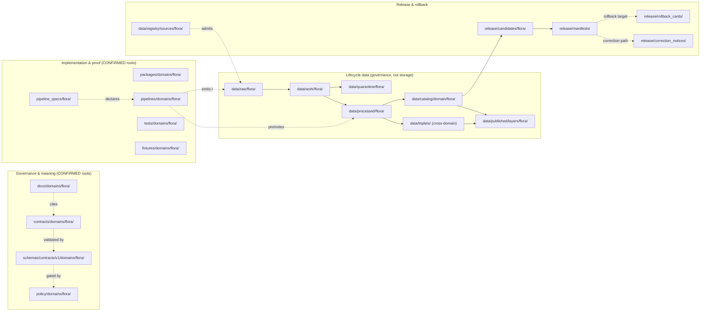

<!-- [KFM_META_BLOCK_V2]
doc_id: kfm://doc/flora-file-system-plan
title: Flora Domain — File System Plan
type: standard
version: v1.1
status: draft
owners: <flora-domain-steward> (PLACEHOLDER), <docs-steward> (PLACEHOLDER)
created: 2026-05-16
updated: 2026-06-03
policy_label: public
contract_version: 3.0.0
related:
  - docs/doctrine/directory-rules.md
  - ai-build-operating-contract.md
  - docs/domains/README.md
  - docs/domains/flora/CONTINUITY_INVENTORY.md
  - docs/domains/flora/CROSSWALKS.md
  - docs/domains/flora/CROSS_LANE_NOTES.md
  - docs/domains/flora/DATA_LIFECYCLE.md
  - docs/domains/flora/EVIDENCE_DRAWER.md
  - docs/domains/flora/EXPANSION_PLAN.md
  - docs/registers/DRIFT_REGISTER.md
  - docs/registers/VERIFICATION_BACKLOG.md
tags: [kfm, flora, directory-rules, file-system, governance, plan]
notes:
  - "CONTRACT_VERSION pinned to 3.0.0 per ai-build-operating-contract.md."
  - "All concrete paths are PROPOSED until verified against a mounted repository."
  - "Domain segment name is `flora` per Domain Placement Law (Directory Rules §12)."
  - "Authoritative precedence: Directory Rules > ADR > this plan > prior lineage."
  - "v1.1: corrected the §2/§10 claim that policy/domains/flora/ and policy/sensitivity/flora/ are 'compatible' — they are the CONFLICTED placement forms of DR-FLORA-PATH-01 (Directory Rules §12 vs Atlas §24.13); Directory Rules wins. Pinned CONTRACT_VERSION + directory-rules.md v1.3; added the Flora × Archaeology ethnobotanical edge; added Changelog and Definition of Done."
[/KFM_META_BLOCK_V2] -->

# 🌱 Flora Domain — File System Plan

> The canonical map of where every flora-domain artifact lives across KFM's
> responsibility roots, derived from Directory Rules §12 Domain Placement Law
> and the flora dossier.


**Status:** Draft · **Owners:** `<flora-domain-steward>`, `<docs-steward>` (PLACEHOLDER) · **Contract:** `CONTRACT_VERSION = "3.0.0"` · **Last updated:** 2026-06-03

---

## Quick jump

- [1. Purpose & scope](#1-purpose--scope)
- [2. Authority & precedence](#2-authority--precedence)
- [3. Repo fit — accepted inputs and exclusions](#3-repo-fit--accepted-inputs-and-exclusions)
- [4. Lane map at a glance](#4-lane-map-at-a-glance)
- [5. Master placement table](#5-master-placement-table)
- [6. Per-root flora layouts](#6-per-root-flora-layouts)
- [7. Lifecycle alignment (`data/`)](#7-lifecycle-alignment-data)
- [8. Sensitivity, rights, and join-induced risk](#8-sensitivity-rights-and-join-induced-risk)
- [9. Watcher and connector placement](#9-watcher-and-connector-placement)
- [10. Cross-lane and cross-cutting files](#10-cross-lane-and-cross-cutting-files)
- [11. Compatibility, drift, and migration notes](#11-compatibility-drift-and-migration-notes)
- [12. Open questions register & verification backlog](#12-open-questions-register--verification-backlog)
- [13. Changelog](#13-changelog)
- [14. Definition of done](#14-definition-of-done)
- [15. Related docs](#15-related-docs)
- [Appendix A — Full PROPOSED path manifest](#appendix-a--full-proposed-path-manifest)

---

## 1. Purpose & scope

The Flora Domain File System Plan declares **where** every flora-related artifact
in KFM is allowed to live, **why** that placement is correct, and **what** has to
exist before files land there. It is a placement contract, not an implementation
status report.

It exists because flora is a high-sensitivity, multi-source botanical domain that
intersects Habitat, Fauna, Soil/Hydrology, Hazards, Agriculture, and Archaeology, and because
rare-plant locations and join-induced sensitivity (e.g., PLANTS × GBIF/iNaturalist)
require deny-by-default placement discipline before a single file is written.

> [!IMPORTANT]
> **Truth posture for this document.** No mounted KFM repository is available
> in this session. Every concrete path below is **PROPOSED** under Directory
> Rules §12 (Domain Placement Law). Promotion of any path to CONFIRMED
> requires repository inspection, an ADR where the rules do not pre-decide,
> and the per-root `README.md` declared in Directory Rules.

**In scope**

- File-home mapping for the flora domain across all canonical responsibility roots.
- Lifecycle phase placement under `data/`.
- Sensitivity, rights, watcher, connector, and cross-lane file placement rules.
- Compatibility-root posture for flora-adjacent legacy or mirror locations.

**Out of scope**

- Implementation status of any specific file.
- Schema bodies, contract bodies, validator code, policy bundles, or pipeline logic.
- Final route names, DTO field lists, or API responses.

[⤴ Back to top](#-flora-domain--file-system-plan)

---

## 2. Authority & precedence

The flora placement decisions in this document derive their authority from a
fixed hierarchy. **Lower layers may operationalize higher layers; they may not
override them silently.**

| Order | Authority | Role for this plan | Status |
|---|---|---|---|
| 1 | **`ai-build-operating-contract.md`** (`CONTRACT_VERSION = "3.0.0"`) | Operating law; truth posture; "don't smooth over conflicts" rule | CONFIRMED doctrine |
| 2 | **Directory Rules** (`docs/doctrine/directory-rules.md`, v1.3) | Placement law, including §2.1 authority order, §12 Domain Placement Law, governance/implementation/compatibility roots, `data/` lifecycle | CONFIRMED doctrine |
| 3 | **Accepted ADRs** (e.g., ADR-0001 schema home) | May refine but not contradict Directory Rules | CONFIRMED rule / PROPOSED instances |
| 4 | **Flora dossier** (encyclopedia §7.6, Atlas chapter 8) | Object families, source families, sensitivity posture, viewing products | CONFIRMED doctrine / PROPOSED implementation |
| 5 | **This file** (`FILE_SYSTEM_PLAN.md`) | Domain-level path map that translates 1–4 into flora-specific paths | PROPOSED |
| 6 | **Prior reports and lineage PDFs** | Source-ledger evidence; never new canon on placement | Lineage only |

> [!WARNING]
> **DR-FLORA-PATH-01 — Path-segment-form conflict (CONFLICTED).** Directory Rules §12 places flora artifacts under a `domains/` segment (`schemas/contracts/v1/domains/flora/`, `contracts/domains/flora/`, `policy/domains/flora/`). The **Domains Culmination Atlas v1.1 §24.13 crosswalk** places the *same* flora artifacts without it (`schemas/contracts/v1/flora/`, `contracts/flora/`, `policy/sensitivity/flora/`). These are **competing forms for the same responsibility, not complementary lanes.** Per the authority order (Directory Rules §2.1), **Directory Rules wins on placement** — this plan uses the §12 form. The conflict is unresolved at the doctrine level and is filed in `docs/registers/DRIFT_REGISTER.md`, pending ADR-S-01. The same conflict is tracked across the flora doc set (`CONTINUITY_INVENTORY.md` §19, `CROSSWALKS.md` §12, `CROSS_LANE_NOTES.md` §11, `DATA_LIFECYCLE.md` §11, `EVIDENCE_DRAWER.md` §13, `EXPANSION_PLAN.md` §5, `EXPANSION_BACKLOG.md` §7).

> [!NOTE]
> **A genuine cross-cutting sensitivity lane may still exist.** Independent of DR-FLORA-PATH-01, a `policy/sensitivity/` root can legitimately hold **multi-domain** sensitivity rules that are not domain-segmented. What this plan does *not* do is treat `policy/sensitivity/flora/` and `policy/domains/flora/` as two settled, co-equal homes for the **flora** policy — that question is the CONFLICTED placement form above, decided in favor of `policy/domains/flora/` until ADR-S-01 lands. See §8 and §10.

[⤴ Back to top](#-flora-domain--file-system-plan)

---

## 3. Repo fit — accepted inputs and exclusions

**Upstream of this file**

- Directory Rules — the source of the lane pattern.
- Flora dossier (encyclopedia §7.6) — the source of object families, sources, sensitivity.
- Domains Culmination Atlas, Flora chapter — operationalized lane-by-lane mapping.

**Downstream of this file**

- `docs/domains/flora/README.md` (PROPOSED) — domain landing page; links here for
  the path map.
- `contracts/domains/flora/`, `schemas/contracts/v1/domains/flora/`,
  `policy/domains/flora/`, `tests/domains/flora/`, `fixtures/domains/flora/`,
  `packages/domains/flora/`, `pipelines/domains/flora/`, `pipeline_specs/flora/`,
  `data/<phase>/flora/`, `release/candidates/flora/` — actual flora content
  files; this plan governs their location.

**Accepted inputs (what belongs in this doc)**

- Flora-specific placement claims with a Directory Rules citation.
- Sensitivity and rights placement notes for flora artifacts.
- Cross-lane placement rules where flora joins another domain.
- Compatibility and migration notes for flora-adjacent legacy roots.

**Exclusions (what does NOT belong here)**

- Schema field lists → `contracts/domains/flora/*.md` (meaning) +
  `schemas/contracts/v1/domains/flora/*.schema.json` (shape).
- Policy bundle logic → `policy/domains/flora/`, `policy/rights/`, `policy/opa/` per ADR.
- Connector code → `connectors/<source_id>/`; flora-domain output lands under
  `data/raw/flora/<source_id>/<run_id>/`.
- Operational procedures → `docs/runbooks/flora/...` (PROPOSED; see §11 on
  runbook subfolder vs. flat-prefix naming).
- Map renderer or style code → `packages/maplibre-runtime/` (the sole browser-side
  renderer; Cesium retired per ADR-0007), `packages/ui/`.

[⤴ Back to top](#-flora-domain--file-system-plan)

---

## 4. Lane map at a glance



> [!NOTE]
> The diagram reflects **PROPOSED** flora-specific placement under Directory
> Rules §12. Solid edges show file-system parent/child or lifecycle promotion.
> Dotted edges show governance references (e.g., a doc citing a contract). The
> flora policy home is shown as `policy/domains/flora/` per DR-FLORA-PATH-01.

[⤴ Back to top](#-flora-domain--file-system-plan)

---

## 5. Master placement table

This table is the single-row-per-responsibility-root authoritative summary. Every
path is PROPOSED until verified against a mounted repo.

> [!NOTE]
> Directory Rules section numbers in the Authority column are this plan's **PROPOSED** references; the mounted v1.3 file confirms §2.1 (authority order), §12 (Domain Placement Law), §13.5 (watcher-as-non-publisher), and §6.1.b (runbook layout, OPEN-DR-02). Other §-numbers are NEEDS VERIFICATION against v1.3.

| Responsibility root | Flora lane | What lives there | Authority | Status |
|---|---|---|---|---|
| `docs/` | `docs/domains/flora/` | Human-facing domain doctrine, this plan, runbooks pointers | Directory Rules §12 | PROPOSED placement |
| `contracts/` | `contracts/domains/flora/` | Object meaning: `PlantTaxon.md`, `FloraOccurrence.md`, `RarePlantRecord.md`, etc. | Directory Rules §12 | PROPOSED |
| `schemas/` | `schemas/contracts/v1/domains/flora/` | Machine schema: `*.schema.json` per object family | Directory Rules §12, ADR-0001 | PROPOSED (CONFLICTED form, DR-FLORA-PATH-01) |
| `policy/` | `policy/domains/flora/` | Allow/deny/restrict/abstain rules scoped to flora — **canonical flora policy home** | Directory Rules §12 | PROPOSED (CONFLICTED form vs Atlas §24.13 `policy/sensitivity/flora/`) |
| `policy/` (cross-cut) | `policy/sensitivity/` (multi-domain rules) | Cross-domain sensitivity rules **not** domain-segmented | Directory Rules §12 multi-domain | PROPOSED |
| `policy/` (cross-cut) | `policy/rights/` (flora entries) | Source-rights enforcement (GBIF, iNat, etc.) | Directory Rules §12 multi-domain | PROPOSED |
| `tests/` | `tests/domains/flora/` | Deterministic enforcement proofs | Directory Rules §12 | PROPOSED |
| `fixtures/` | `fixtures/domains/flora/` | Valid/invalid golden inputs, no-network | Directory Rules §12 | PROPOSED |
| `packages/` | `packages/domains/flora/` | Reusable flora-typed code (resolvers, normalizers) | Directory Rules §12 | PROPOSED |
| `pipelines/` | `pipelines/domains/flora/` | Executable pipeline logic for flora | Directory Rules §12 | PROPOSED |
| `pipeline_specs/` | `pipeline_specs/flora/` | Declarative pipeline configs for flora | Directory Rules §12 | PROPOSED |
| `pipeline_specs/` (watchers) | `pipeline_specs/watchers/<flora-watcher>.yaml` | PLANTS taxa-drift watcher spec | Directory Rules §12; Pass 20 SRC-006 | PROPOSED |
| `connectors/` | `connectors/gbif/`, `connectors/inaturalist/`, `connectors/usfws/`, `connectors/kdwp/` (or equivalents) | Source-specific fetch/admit; flora output → `data/raw/flora/` | Directory Rules §13.5 (connectors write only to RAW/quarantine) | PROPOSED |
| `data/raw/` | `data/raw/flora/<source_id>/<run_id>/` | Immutable admitted source payloads | Directory Rules lifecycle | PROPOSED |
| `data/work/` | `data/work/flora/<run_id>/` | Normalization workspace | Directory Rules lifecycle | PROPOSED |
| `data/quarantine/` | `data/quarantine/flora/<reason>/<run_id>/` | Failed gates, never silently promoted | Directory Rules lifecycle | PROPOSED |
| `data/processed/` | `data/processed/flora/<dataset_id>/<version>/` | Validated normalized objects + receipts | Directory Rules lifecycle | PROPOSED |
| `data/catalog/` | `data/catalog/domain/flora/` | STAC/DCAT/PROV catalog records | Directory Rules lifecycle | PROPOSED |
| `data/triplets/` | `data/triplets/graph_deltas/` (cross-domain, flora-tagged) | Graph projections; not a flora-only root | Directory Rules §12 multi-domain | PROPOSED |
| `data/receipts/` | `data/receipts/{ingest,validation,pipeline,ai,release}/` (flora-tagged) | Phase-tagged process receipts | Directory Rules lifecycle | PROPOSED |
| `data/proofs/` | `data/proofs/evidence_bundle/` (flora-tagged) | `EvidenceBundle`, `ProofPack`, citation validation | Directory Rules lifecycle | PROPOSED |
| `data/published/` | `data/published/layers/flora/`, `data/published/pmtiles/flora/`, `data/published/api_payloads/flora/` | Released, public-safe flora artifacts | Directory Rules lifecycle | PROPOSED |
| `data/registry/` | `data/registry/sources/flora/`, `data/registry/source_descriptors/<flora-source-ids>/` | Admission and authority control | Directory Rules lifecycle | PROPOSED |
| `data/rollback/` | `data/rollback/flora/<release_id>/` | Alias-revert receipts (data plane) | Directory Rules lifecycle (sibling-vs-merge OPEN, §18) | PROPOSED |
| `release/` | `release/candidates/flora/`, `release/manifests/`, `release/rollback_cards/`, `release/correction_notices/` | Release decisions, rollback cards, correction notices | Directory Rules | PROPOSED |

[⤴ Back to top](#-flora-domain--file-system-plan)

---

## 6. Per-root flora layouts

This section drills into each responsibility root that has a flora lane.
All trees are PROPOSED placement; file names are illustrative.

### 6.1 `docs/domains/flora/`

```text
docs/domains/flora/
├── README.md                       # Domain landing page (PROPOSED)
├── FILE_SYSTEM_PLAN.md             # this document
├── CONTINUITY_INVENTORY.md         # PROPOSED: carry-forward register
├── CROSSWALKS.md                   # PROPOSED: identity / source-field
├── CROSS_LANE_NOTES.md             # PROPOSED: Habitat/Fauna/Soil/Hazards/Archaeology joins
├── DATA_LIFECYCLE.md               # PROPOSED: RAW → PUBLISHED
├── EVIDENCE_DRAWER.md              # PROPOSED: drawer payload contract
├── EXPANSION_PLAN.md               # PROPOSED: PR series
├── EXPANSION_BACKLOG.md            # PROPOSED: backlog
├── OBJECT_FAMILIES.md              # PROPOSED: per-object overview
├── SOURCE_FAMILIES.md              # PROPOSED: source-role-aware overview
├── SENSITIVITY_POSTURE.md          # PROPOSED: rare/join-induced rules summary
└── THIN_SLICE_PLAN.md              # PROPOSED: first credible slice spec
```

> [!TIP]
> Operational procedures for flora **do not** belong here. They go under
> `docs/runbooks/...`. See §11 on the subfolder-vs-prefix naming question
> already flagged for fauna (`docs/runbooks/fauna/SOURCE_REFRESH_RUNBOOK.md`).

### 6.2 `contracts/domains/flora/`

Object **meaning** in Markdown. One file per canonical object family from the
flora dossier (encyclopedia §7.6; Atlas §8.B owned-list).

```text
contracts/domains/flora/
├── README.md                       # PROPOSED
├── PlantTaxon.md                   # PROPOSED
├── FloraTaxonCrosswalk.md          # PROPOSED
├── FloraOccurrence.md              # PROPOSED
├── SpecimenRecord.md               # PROPOSED
├── RarePlantRecord.md              # PROPOSED
├── VegetationCommunity.md          # PROPOSED
├── InvasivePlantRecord.md          # PROPOSED
├── PhenologyObservation.md         # PROPOSED
├── RangePolygon.md                 # PROPOSED
├── DistributionSurface.md          # PROPOSED
├── HabitatAssociation.md           # PROPOSED  (cross-lane: flora ↔ habitat)
├── BotanicalSurvey.md              # PROPOSED
├── RestorationPlanting.md          # PROPOSED
└── RedactionReceipt.flora.md       # PROPOSED  (domain-flavored crosswalk to generic)
```

### 6.3 `schemas/contracts/v1/domains/flora/`

Machine **shape**. Authoritative per ADR-0001. One `.schema.json` per object,
plus `tests/valid/` and `tests/invalid/` siblings under the canonical schemas
home.

```text
schemas/contracts/v1/domains/flora/
├── plant_taxon.schema.json                  # PROPOSED
├── flora_taxon_crosswalk.schema.json        # PROPOSED
├── flora_occurrence.schema.json             # PROPOSED
├── specimen_record.schema.json              # PROPOSED
├── rare_plant_record.schema.json            # PROPOSED
├── vegetation_community.schema.json         # PROPOSED
├── invasive_plant_record.schema.json        # PROPOSED
├── phenology_observation.schema.json        # PROPOSED
├── range_polygon.flora.schema.json          # PROPOSED
├── distribution_surface.flora.schema.json   # PROPOSED
├── habitat_association.flora.schema.json    # PROPOSED  (cross-lane shape)
├── botanical_survey.schema.json             # PROPOSED
├── restoration_planting.schema.json         # PROPOSED
└── redaction_receipt.flora.schema.json      # PROPOSED  (see §10 — generic shape is shared)
```

> [!WARNING]
> Per Directory Rules §13.1 and ADR-0001, `contracts/domains/flora/*.schema.json`
> is **drift**, not an alternate home. Schema bodies live only under
> `schemas/contracts/v1/...`. Contracts retain semantic Markdown only.

### 6.4 `policy/domains/flora/` and cross-cutting policy lanes

> [!IMPORTANT]
> **`policy/domains/flora/` is the canonical flora policy home** (DR-FLORA-PATH-01; Directory Rules §12 wins over Atlas §24.13's `policy/sensitivity/flora/`). The `policy/sensitivity/` root below is for **multi-domain** sensitivity rules that are not domain-segmented — it is not a parallel flora home.

```text
policy/domains/flora/                        # CANONICAL flora policy home (DR-FLORA-PATH-01)
├── README.md                                # PROPOSED
├── flora_rights.rego                        # PROPOSED  (or equivalent OPA bundle)
├── flora_source_role.rego                   # PROPOSED
├── flora_taxonomy_resolution.rego           # PROPOSED
├── flora_publication_gate.rego              # PROPOSED
├── rare_plant_geoprivacy.rego               # PROPOSED  (flora-scoped sensitivity)
├── join_induced_sensitivity.rego            # PROPOSED  (PLANTS × GBIF/iNat)
├── exact_geometry_deny.rego                 # PROPOSED
└── cultural_sensitivity.rego                # PROPOSED  (ethnobotanical; see §10)

policy/sensitivity/                          # cross-cut: MULTI-domain sensitivity only
└── (shared rules spanning >1 domain; not a flora home)

policy/rights/                               # cross-cut: source rights
└── flora/                                   # PROPOSED  (GBIF, iNat, USFWS terms)

policy/release/                              # cross-cut: release class
└── flora/                                   # PROPOSED  (public-safe gates)
```

> [!NOTE]
> If a mounted repo turns out to use `policy/sensitivity/flora/` (the Atlas §24.13 form) for flora-scoped rules, that is a DR-FLORA-PATH-01 instance to log in `DRIFT_REGISTER.md`, not a second home to adopt.

### 6.5 `tests/domains/flora/` and `fixtures/domains/flora/`

Tests prove rules are enforceable; fixtures provide valid/invalid inputs. Both
must be **no-network** by default per flora dossier and Pass-19/20 watcher rules.

```text
tests/domains/flora/
├── README.md                                # PROPOSED
├── schema/                                  # schema validation tests
├── source_descriptor/                       # admission gate tests
├── rights/                                  # rights validator tests
├── sensitivity/                             # rare-plant + join-induced deny tests
├── evidence_closure/                        # EvidenceBundle resolution tests
├── temporal/                                # observed/valid/retrieval/release distinct
├── geometry/                                # generalization + redaction transforms
├── policy_deny/                             # exact sensitive geometry deny
├── citation/                                # citation-validation cases
├── release_manifest/                        # ReleaseManifest checks
├── rollback_drill/                          # rollback test harness
└── no_network/                              # no-live-network fixture pipeline

fixtures/domains/flora/
├── README.md                                # PROPOSED
├── valid/                                   # green-path inputs
├── invalid/                                 # negative cases (one per validator)
├── golden/                                  # canonical reference inputs
├── synthetic/                               # synthesized rare-plant cases
└── plants_drift/                            # PLANTS taxa-drift fixtures
```

### 6.6 `packages/domains/flora/`

Reusable flora-typed code (resolvers, normalizers, taxonomy helpers). Anything
that runs once as a workflow step belongs in `tools/` or `pipelines/`, not here.

```text
packages/domains/flora/
├── README.md                                # PROPOSED
├── taxonomy_resolver/                       # PROPOSED  (ITIS/GBIF Backbone; see CROSSWALKS.md)
├── geoprivacy_transformer/                  # PROPOSED  (rare-plant generalization)
├── source_role_resolver/                    # PROPOSED  (per flora source)
└── flora_evidence_projector/                # PROPOSED  (Evidence Drawer payload; see EVIDENCE_DRAWER.md)
```

### 6.7 `pipelines/domains/flora/` and `pipeline_specs/flora/`

```text
pipelines/domains/flora/
├── README.md                                # PROPOSED
├── ingest/                                  # connector → RAW
├── normalize/                               # RAW → WORK
├── validate/                                # WORK → PROCESSED
├── catalog/                                 # PROCESSED → CATALOG/TRIPLET
├── publish/                                 # CATALOG → PUBLISHED  (governed)
└── rollback/                                # release → rollback target

pipeline_specs/flora/
├── README.md                                # PROPOSED
├── gbif_ingest.yaml                         # PROPOSED
├── inaturalist_ingest.yaml                  # PROPOSED
├── usfws_ecos_ingest.yaml                   # PROPOSED
├── plants_drift_watcher.yaml                # PROPOSED  (paired with CDL pattern)
└── flora_publish_dryrun.yaml                # PROPOSED  (release dry-run)
```

### 6.8 `release/` flora entries

```text
release/
├── candidates/flora/<release_candidate_id>/ # PROPOSED
├── manifests/<release_id>.yaml              # PROPOSED  (release-wide)
├── rollback_cards/<release_id>.yaml         # PROPOSED
└── correction_notices/<notice_id>.yaml      # PROPOSED
```

[⤴ Back to top](#-flora-domain--file-system-plan)

---

## 7. Lifecycle alignment (`data/`)

Promotion is a **governed state transition, not a file move** (Directory Rules
lifecycle; KFM Operating Law; Atlas §24.6.2). Flora follows the canonical
lifecycle invariant:

> **RAW → WORK / QUARANTINE → PROCESSED → CATALOG / TRIPLET → PUBLISHED**

| Phase | Flora path | Required artifacts (PROPOSED) | Failure-closed outcome |
|---|---|---|---|
| Admission → RAW | `data/raw/flora/<source_id>/<run_id>/` | `SourceDescriptor` (role, authority, rights, sensitivity, cadence); payload hash | Not admitted; logged as candidate awaiting steward |
| RAW → WORK | `data/work/flora/<run_id>/` | `TransformReceipt`; `ValidationReport` (working); `PolicyDecision` | Routed to `data/quarantine/flora/<reason>/<run_id>/` |
| RAW/WORK → QUARANTINE | `data/quarantine/flora/<reason>/<run_id>/` | Reason record; quarantine receipt | Never silently promoted |
| WORK → PROCESSED | `data/processed/flora/<dataset_id>/<version>/` | `ValidationReport` pass; `Redaction Receipt` if rare/sensitive; `AggregationReceipt` if applicable | Stay in WORK; structured FAIL |
| PROCESSED → CATALOG/TRIPLET | `data/catalog/domain/flora/`, `data/triplets/graph_deltas/` | `EvidenceBundle`; `CatalogMatrix` entry; STAC/DCAT/PROV records | HOLD at PROCESSED; no public edge |
| CATALOG → PUBLISHED | `data/published/layers/flora/`, `data/published/pmtiles/flora/`, `data/published/api_payloads/flora/` | `ReleaseManifest` + `RollbackCard` + correction path + `ReviewRecord` where required | HOLD at CATALOG; no public surface change |

> [!IMPORTANT]
> **Watcher-as-non-publisher invariant** (Directory Rules §13.5) applies to flora unconditionally:
> watchers (e.g., PLANTS taxa-drift, GBIF source-head, iNaturalist polling) emit
> `SourceIntakeRecord` candidates with `publication_state = WORK_CANDIDATE` into
> `data/quarantine/flora/` or `data/work/flora/`. **They MUST NOT write to**
> `data/processed/`, `data/catalog/`, `data/published/`, or `release/`.

[⤴ Back to top](#-flora-domain--file-system-plan)

---

## 8. Sensitivity, rights, and join-induced risk

Flora carries two distinct fail-closed dimensions: **rare-species sensitivity**
(intrinsic to the taxon) and **join-induced sensitivity** (emerges when a benign
source is combined with another). Each has a dedicated placement under the
canonical `policy/domains/flora/` home.

> [!CAUTION]
> **Sensitive-domain handling (operating contract §23.2).** Flora rare-plant exact locations are a sensitive domain: **DENY public exact exposure · GENERALIZE before publication · REDACT · QUARANTINE uncertain source material · REQUIRE steward review · REQUIRE transform receipt (Redaction Receipt) · ABSTAIN when support is inadequate.**

| Sensitivity dimension | Trigger | Placement of rule | Placement of receipt |
|---|---|---|---|
| Rare-plant exact geometry | Federal/state listing, NatureServe S1/S2, KDWP SINC, steward flag | `policy/domains/flora/rare_plant_geoprivacy.rego` (PROPOSED) | `data/proofs/evidence_bundle/.../redaction_receipt/` (PROPOSED) |
| Join-induced (PLANTS × GBIF/iNat) | Cross-source join produces poaching-risk surface | `policy/domains/flora/join_induced_sensitivity.rego` (PROPOSED) | `data/receipts/pipeline/.../join_decision/` (PROPOSED) |
| Culturally sensitive plant knowledge | Steward/tribal review flag; ethnobotanical edge to Archaeology (§24.4.6) | `policy/domains/flora/cultural_sensitivity.rego` (PROPOSED); steward review in `release/candidates/flora/` | `data/proofs/.../review_record/` (PROPOSED) |
| Unclear rights | Missing license, missing redistribution class | `policy/rights/flora/` (PROPOSED) | Quarantine: `data/quarantine/flora/rights_unresolved/` |
| Source-role mismatch | Authority cited as observation, etc. (Atlas §24.1 anti-collapse) | `policy/domains/flora/flora_source_role.rego` (PROPOSED) | `data/quarantine/flora/source_role_mismatch/` (PROPOSED) |

> [!CAUTION]
> **Join-induced sensitivity is not a property of either input alone.** A PLANTS
> county taxa list and a GBIF occurrence dataset can each be public-safe
> individually and become a sensitive rare-plant exposure when joined. Place
> deny rules at the **derived product**, not only at sources, and emit a
> transform receipt in `data/proofs/evidence_bundle/`. [Pass 20 ANA-004]

[⤴ Back to top](#-flora-domain--file-system-plan)

---

## 9. Watcher and connector placement

| Function | Code home | Spec/config home | Output home | Cannot write to |
|---|---|---|---|---|
| GBIF connector | `connectors/gbif/` | per-connector `README.md` + source descriptor | `data/raw/flora/gbif/<run_id>/` or `data/quarantine/flora/` | `data/processed/`, `data/catalog/`, `data/published/`, `release/` |
| iNaturalist connector | `connectors/inaturalist/` | per-connector `README.md` + source descriptor | `data/raw/flora/inaturalist/<run_id>/` | same |
| USFWS ECOS connector | `connectors/usfws/` (PROPOSED) | per-connector `README.md` + source descriptor | `data/raw/flora/usfws_ecos/<run_id>/` | same |
| NatureServe connector | `connectors/natureserve/` (PROPOSED) | per-connector `README.md` + source descriptor | `data/raw/flora/natureserve/<run_id>/` | same |
| KDWP / KBS / KU herbarium connectors | `connectors/kdwp/`, `connectors/kbs/`, `connectors/ku_herbarium/` (PROPOSED) | per-connector `README.md` + source descriptor | `data/raw/flora/<source_id>/<run_id>/` | same |
| PLANTS taxa-drift watcher | `tools/watchers/plants_watch/` (PROPOSED) or `pipelines/watchers/plants/` per ADR | `pipeline_specs/watchers/plants_drift.yaml` (PROPOSED) | `data/work/flora/.../source_intake_record/` (`publication_state = WORK_CANDIDATE`) | `data/published/`, `release/` |
| Watcher-shared tooling | `tools/watchers/` | n/a | n/a | same |

> [!NOTE]
> The PLANTS watcher pattern mirrors the CDL watcher pattern documented in
> Pass-19/20 (sidecars with `spec_hash`, `classmap_version`, ETag,
> Last-Modified, materiality thresholds). Whether watcher code lives under
> `tools/watchers/` or `pipelines/watchers/` is **NEEDS VERIFICATION** — specs go
> under `pipeline_specs/watchers/`, but the executable home for watcher code
> awaits ADR (FLORA-ADR-02 in `EXPANSION_BACKLOG.md`). Connectors writing only to
> `data/raw/` or `data/quarantine/` is CONFIRMED per Directory Rules §13.5.

[⤴ Back to top](#-flora-domain--file-system-plan)

---

## 10. Cross-lane and cross-cutting files

Per Directory Rules §12 (multi-domain and cross-cutting subsection), files that
**legitimately span domains** go under the **lowest common responsibility root
without a domain segment**.

| Cross-lane concern | Correct home | Wrong home |
|---|---|---|
| Habitat × Flora geometry validator | `tools/validators/biodiversity/` (PROPOSED) | `tools/validators/domains/flora/` |
| Flora × Fauna pollinator/food-web join | `schemas/contracts/v1/biodiversity/` (PROPOSED) | `schemas/contracts/v1/domains/flora/` only |
| Flora × Soil substrate context | `contracts/domains/flora/HabitatAssociation.md` if flora-owned; or shared semantic doc under `contracts/biodiversity/` (PROPOSED) | A duplicate file in `contracts/domains/soil/` |
| Flora × Hazards vegetation stress | `pipelines/biodiversity/vegetation_stress/` (PROPOSED) | `pipelines/domains/flora/hazards/` |
| **Flora × Archaeology ethnobotanical context** (§24.4.6) | Flora-owned edge: steward-reviewed context under `policy/domains/flora/cultural_sensitivity.rego` + dual heritage review; **never overrides cultural-heritage authority** | A flora file asserting archaeological-site authority |
| Generic redaction receipt | `schemas/contracts/v1/release/redaction_receipt.schema.json` (shared receipt class; ADR-S-03) | `schemas/contracts/v1/domains/flora/redaction_receipt.schema.json` (flora-flavored crosswalk is OK; do not duplicate the generic) |

> [!IMPORTANT]
> Flora **owns** plant taxa, plant occurrences, vegetation communities,
> invasive plants, phenology, range and habitat associations. Flora **does
> not own** habitat patches (Habitat), animal records (Fauna), crops
> (Agriculture), land tenure (People/Land), or cultural-heritage authority
> (Archaeology). Cross-lane files that touch non-flora-owned objects must be
> placed by ownership, not topic. Directional edge ownership is governed by
> Atlas §24.4 and detailed in `CROSS_LANE_NOTES.md`.

[⤴ Back to top](#-flora-domain--file-system-plan)

---

## 11. Compatibility, drift, and migration notes

Compatibility roots exist for legacy/mirror/external-export/transitional content.
For flora, the relevant ones are:

| Compatibility root | Canonical home | Class | Action for flora content |
|---|---|---|---|
| `contracts/<domain>/<x>.schema.json` if present | `schemas/contracts/v1/domains/flora/` | `legacy` / `CONFLICTED` | Migrate per ADR-0001; do not author new flora schemas under `contracts/` |
| `policies/` if present | `policy/` | `mirror` / `legacy` | New flora policy lands under `policy/` only |
| `jsonschema/` if present | `schemas/` | `mirror` / `legacy` | Flora schemas land under `schemas/contracts/v1/domains/flora/` only |
| `policy/sensitivity/flora/` if present | `policy/domains/flora/` | **CONFLICTED (DR-FLORA-PATH-01)** | Atlas §24.13 form; log in `DRIFT_REGISTER.md`; canonical home is `policy/domains/flora/` pending ADR-S-01 |
| `data/manifests/` | `release/manifests/` | OPEN per Directory Rules §18 | Pending ADR; this plan defers to the eventual resolution |

> [!NOTE]
> **Runbook subfolder vs. flat-prefix naming.** Existing runbook precedent
> diverges: the Whole-UI Governed AI Expansion Report proposes flat-prefix
> names (e.g., `docs/runbooks/ui_LOCAL_DEV.md`), while a published flora-adjacent
> runbook uses a subfolder (`docs/runbooks/fauna/SOURCE_REFRESH_RUNBOOK.md`).
> **Status: OPEN (Directory Rules §6.1.b OPEN-DR-02).** This plan reserves both
> `docs/runbooks/flora_*.md` and `docs/runbooks/flora/*.md` as PROPOSED until
> the convention is locked. Any flora runbook created before the ADR should
> link back here and flag the convention choice in its meta block.

[⤴ Back to top](#-flora-domain--file-system-plan)

---

## 12. Open questions register & verification backlog

### 12.1 Open questions register

| ID | Question | Owner role | Resolution path |
|---|---|---|---|
| OQ-FLORAFS-01 | Which placement form is canonical for flora schema/contract/policy — §12 `domains/` vs Atlas §24.13 (DR-FLORA-PATH-01)? | Docs + schema steward | ADR-S-01; Directory Rules §2.1 governs meanwhile |
| OQ-FLORAFS-02 | PLANTS watcher executable home (`tools/watchers/` vs `pipelines/watchers/`)? | Pipeline + docs steward | FLORA-ADR-02; ADR |
| OQ-FLORAFS-03 | Flora runbook naming (`flora_*.md` flat vs `flora/*.md` subfolder)? | Docs steward | ADR resolving DIRRULES §6.1.b OPEN-DR-02 |
| OQ-FLORAFS-04 | Is `data/rollback/flora/` a sibling of lifecycle phases, or does it merge into `release/rollback_cards/`? | Release steward | ADR (DIRRULES §18 open) |
| OQ-FLORAFS-05 | Is `policy/release/flora/` a separate lane or composed via `policy/release/` only? | Policy steward | Directory Rules + ADR |
| OQ-FLORAFS-06 | Is `data/registry/sources/flora/` or `data/registry/flora/` canonical for flora source descriptors? | Docs steward | mounted `data/registry/` layout + ADR |

### 12.2 Verification backlog

These items belong on `docs/registers/VERIFICATION_BACKLOG.md` (PROPOSED).

| # | Item | Evidence that would settle it | Status |
|---|---|---|---|
| V1 | Existence of `docs/domains/flora/` and surrounding files in the live repo | Mounted-repo directory listing | NEEDS VERIFICATION |
| V2 | Schema home verified under `schemas/contracts/v1/domains/flora/` for at least one object | Mounted file + ADR-0001 reference | CONFLICTED (DR-FLORA-PATH-01) |
| V3 | Whether the mounted repo uses `policy/domains/flora/` or `policy/sensitivity/flora/` for flora-scoped rules | Mounted-repo `policy/` listing + per-root README | CONFLICTED (DR-FLORA-PATH-01) |
| V4 | Flora connector identities for KDWP, KBS, KU herbarium (paths and source IDs) | Source descriptor entries; mounted `connectors/` | NEEDS VERIFICATION |
| V5 | PLANTS watcher executable home (`tools/watchers/` vs `pipelines/watchers/`) | ADR + mounted home | NEEDS VERIFICATION |
| V6 | Flora runbook naming (`flora_*.md` flat vs `flora/*.md` subfolder) | ADR (DIRRULES §6.1.b OPEN-DR-02); existing repo convention | OPEN |
| V7 | Whether `data/manifests/` is a real sibling of `data/proofs/` / `data/receipts/` for flora release artifacts | Directory Rules §18 open question; ADR | OPEN |
| V8 | Exact rare-plant generalization radius and steward review thresholds | Mounted `policy/domains/flora/`; steward decisions | NEEDS VERIFICATION |
| V9 | Whether `policy/release/flora/` is a separate lane or composed via `policy/release/` only | Directory Rules + ADR | NEEDS VERIFICATION |
| V10 | Final list of viewing products published under `data/published/layers/flora/` | Flora thin-slice spec + release manifest fixtures | NEEDS VERIFICATION |
| V11 | Naming continuity with neighboring standard docs (`PROV.md` vs `PROVENANCE.md`) | ADR (already flagged elsewhere) | OPEN |
| V12 | Whether `data/registry/sources/flora/` or `data/registry/flora/` is canonical | Mounted-repo `data/registry/` layout + Directory Rules | NEEDS VERIFICATION |
| V13 | Directory Rules section numbers cited in §5 reconciled against v1.3 | Mounted `directory-rules.md` v1.3 | NEEDS VERIFICATION |

[⤴ Back to top](#-flora-domain--file-system-plan)

---

## 13. Changelog

| Change | Type (per contract §37) | Reason |
|---|---|---|
| Corrected the §2/§10 "policy/domains/flora/ and policy/sensitivity/flora/ are compatible" claim to CONFLICTED (DR-FLORA-PATH-01); named `policy/domains/flora/` the canonical flora policy home | reconciliation | The v1 framing silently resolved a genuine §12-vs-§24.13 placement conflict; the operating contract forbids smoothing over conflicts. `policy/sensitivity/` is retained only for true multi-domain rules |
| Consolidated the flora sensitivity rules under `policy/domains/flora/` (§6.4, §8) | reconciliation | Follows from the DR-FLORA-PATH-01 resolution; avoids a parallel flora policy home |
| Added the Flora × Archaeology ethnobotanical edge (§1, §10) | gap closure | Atlas §24.4.6 defines this Flora-owned edge; v1 omitted it from the cross-lane set |
| Pinned `CONTRACT_VERSION = "3.0.0"` (meta block, badge, footer) and `directory-rules.md` v1.3 | housekeeping | Required for doctrine-adjacent docs |
| Replaced `packages/maplibre/` with `packages/maplibre-runtime/` (sole renderer, ADR-0007) in §3 | reconciliation | MapLibre runtime is the sole browser-side renderer; Cesium retired |
| Marked Directory Rules §-number citations as PROPOSED/NEEDS VERIFICATION against v1.3; reconciled the load-bearing ones (§2.1, §12, §13.5, §6.1.b) | clarification | The v1 §-numbers (§6.1/§6.3/§6.4/§6.5, §7.x, §9.1) don't match the confirmed §12/§24.x scheme |
| Promoted §12 into an Open Questions register (§12.1) + verification backlog (§12.2); added Changelog (§13) and Definition of Done (§14) | gap closure | Doctrine-adjacent docs ship these companion sections |
| `RedactionReceipt` → `Redaction Receipt` in prose; cross-linked the flora doc set; updated §6.1 tree to list the real sibling docs | housekeeping | Casing alignment + sibling docs now exist |
| Bumped v1 → v1.1; updated date to 2026-06-03 | housekeeping | MINOR bump; no operating-law change |

> **Backward compatibility.** Section anchors §1–§11 are preserved. The v1 "§12 Open questions & verification backlog" split into §12.1 (register) + §12.2 (backlog); §13 Related docs moved to §15; §13/§14 are new. Appendix A anchor is unchanged. Inbound v1 links to "§13 Related docs" need re-pointing.

[⤴ Back to top](#-flora-domain--file-system-plan)

---

## 14. Definition of done

This document is done enough to enter the repository when:

- it is placed according to Directory Rules (`docs/domains/flora/FILE_SYSTEM_PLAN.md`, PROPOSED);
- a docs steward and the flora domain steward review it;
- it is linked from `docs/domains/flora/README.md` and the flora doc set;
- it does not conflict with accepted ADRs (and DR-FLORA-PATH-01 is filed in `DRIFT_REGISTER.md` pending ADR-S-01);
- owner placeholders are resolved in the PR;
- the Directory Rules §-number citations are reconciled against v1.3 (V13);
- any conflict with current repo conventions is logged in `docs/registers/DRIFT_REGISTER.md`;
- the `GENERATED_RECEIPT.json` planned in Section 2 is wired into CI;
- future changes follow the operating contract's §37 lifecycle.

[⤴ Back to top](#-flora-domain--file-system-plan)

---

## 15. Related docs

- [`docs/doctrine/directory-rules.md`](../../doctrine/directory-rules.md) — **CONFIRMED** (v1.3); Directory Rules, §12 Domain Placement Law
- `ai-build-operating-contract.md` — operating contract (`CONTRACT_VERSION = "3.0.0"`) — CONFIRMED (in project)
- [`docs/domains/README.md`](../README.md) — Domain lane index (PROPOSED)
- [`docs/domains/flora/CONTINUITY_INVENTORY.md`](./CONTINUITY_INVENTORY.md) — carry-forward register (PROPOSED)
- [`docs/domains/flora/CROSSWALKS.md`](./CROSSWALKS.md) — identity / source-field reconciliation (PROPOSED)
- [`docs/domains/flora/CROSS_LANE_NOTES.md`](./CROSS_LANE_NOTES.md) — cross-lane edge ownership (PROPOSED)
- [`docs/domains/flora/DATA_LIFECYCLE.md`](./DATA_LIFECYCLE.md) — RAW → PUBLISHED lifecycle (PROPOSED)
- [`docs/domains/flora/EVIDENCE_DRAWER.md`](./EVIDENCE_DRAWER.md) — drawer payload contract (PROPOSED)
- [`docs/domains/flora/EXPANSION_PLAN.md`](./EXPANSION_PLAN.md) · [`EXPANSION_BACKLOG.md`](./EXPANSION_BACKLOG.md) — PR series + backlog (PROPOSED)
- [`docs/runbooks/fauna/SOURCE_REFRESH_RUNBOOK.md`](../../runbooks/fauna/SOURCE_REFRESH_RUNBOOK.md) — companion runbook precedent (PROPOSED)
- [`docs/standards/PROV.md`](../../standards/PROV.md) · [`PMTILES.md`](../../standards/PMTILES.md) · [`OGC-API-TILES.md`](../../standards/OGC-API-TILES.md) · [`OAI-PMH.md`](../../standards/OAI-PMH.md) · [`ISO-19115.md`](../../standards/ISO-19115.md) — applicable standards (PROPOSED)
- `docs/adr/ADR-0001-schema-home.md` (PROPOSED reference) — canonical schema home
- `docs/registers/DRIFT_REGISTER.md` · `docs/registers/VERIFICATION_BACKLOG.md` (PROPOSED references)

[⤴ Back to top](#-flora-domain--file-system-plan)

---

## Appendix A — Full PROPOSED path manifest

<details>
<summary>Complete, sorted manifest of every flora-domain path proposed in this plan</summary>

```text
# docs
docs/domains/flora/
docs/domains/flora/README.md
docs/domains/flora/FILE_SYSTEM_PLAN.md           # this document
docs/domains/flora/CONTINUITY_INVENTORY.md
docs/domains/flora/CROSSWALKS.md
docs/domains/flora/CROSS_LANE_NOTES.md
docs/domains/flora/DATA_LIFECYCLE.md
docs/domains/flora/EVIDENCE_DRAWER.md
docs/domains/flora/EXPANSION_PLAN.md
docs/domains/flora/EXPANSION_BACKLOG.md
docs/domains/flora/OBJECT_FAMILIES.md
docs/domains/flora/SOURCE_FAMILIES.md
docs/domains/flora/SENSITIVITY_POSTURE.md
docs/domains/flora/THIN_SLICE_PLAN.md
docs/runbooks/flora_*.md      OR     docs/runbooks/flora/*.md   # OPEN-DR-02 via ADR

# contracts (object meaning)
contracts/domains/flora/README.md
contracts/domains/flora/PlantTaxon.md
contracts/domains/flora/FloraTaxonCrosswalk.md
contracts/domains/flora/FloraOccurrence.md
contracts/domains/flora/SpecimenRecord.md
contracts/domains/flora/RarePlantRecord.md
contracts/domains/flora/VegetationCommunity.md
contracts/domains/flora/InvasivePlantRecord.md
contracts/domains/flora/PhenologyObservation.md
contracts/domains/flora/RangePolygon.md
contracts/domains/flora/DistributionSurface.md
contracts/domains/flora/HabitatAssociation.md
contracts/domains/flora/BotanicalSurvey.md
contracts/domains/flora/RestorationPlanting.md
contracts/domains/flora/RedactionReceipt.flora.md

# schemas (machine shape)
schemas/contracts/v1/domains/flora/plant_taxon.schema.json
schemas/contracts/v1/domains/flora/flora_taxon_crosswalk.schema.json
schemas/contracts/v1/domains/flora/flora_occurrence.schema.json
schemas/contracts/v1/domains/flora/specimen_record.schema.json
schemas/contracts/v1/domains/flora/rare_plant_record.schema.json
schemas/contracts/v1/domains/flora/vegetation_community.schema.json
schemas/contracts/v1/domains/flora/invasive_plant_record.schema.json
schemas/contracts/v1/domains/flora/phenology_observation.schema.json
schemas/contracts/v1/domains/flora/range_polygon.flora.schema.json
schemas/contracts/v1/domains/flora/distribution_surface.flora.schema.json
schemas/contracts/v1/domains/flora/habitat_association.flora.schema.json
schemas/contracts/v1/domains/flora/botanical_survey.schema.json
schemas/contracts/v1/domains/flora/restoration_planting.schema.json
schemas/contracts/v1/domains/flora/redaction_receipt.flora.schema.json

# policy  (CANONICAL flora home is policy/domains/flora/ per DR-FLORA-PATH-01)
policy/domains/flora/README.md
policy/domains/flora/flora_rights.rego
policy/domains/flora/flora_source_role.rego
policy/domains/flora/flora_taxonomy_resolution.rego
policy/domains/flora/flora_publication_gate.rego
policy/domains/flora/rare_plant_geoprivacy.rego
policy/domains/flora/join_induced_sensitivity.rego
policy/domains/flora/exact_geometry_deny.rego
policy/domains/flora/cultural_sensitivity.rego
policy/sensitivity/...                          # MULTI-domain sensitivity only (not a flora home)
policy/rights/flora/...
policy/release/flora/...

# tests
tests/domains/flora/README.md
tests/domains/flora/schema/
tests/domains/flora/source_descriptor/
tests/domains/flora/rights/
tests/domains/flora/sensitivity/
tests/domains/flora/evidence_closure/
tests/domains/flora/temporal/
tests/domains/flora/geometry/
tests/domains/flora/policy_deny/
tests/domains/flora/citation/
tests/domains/flora/release_manifest/
tests/domains/flora/rollback_drill/
tests/domains/flora/no_network/

# fixtures
fixtures/domains/flora/README.md
fixtures/domains/flora/valid/
fixtures/domains/flora/invalid/
fixtures/domains/flora/golden/
fixtures/domains/flora/synthetic/
fixtures/domains/flora/plants_drift/

# packages
packages/domains/flora/README.md
packages/domains/flora/taxonomy_resolver/
packages/domains/flora/geoprivacy_transformer/
packages/domains/flora/source_role_resolver/
packages/domains/flora/flora_evidence_projector/

# pipelines
pipelines/domains/flora/README.md
pipelines/domains/flora/ingest/
pipelines/domains/flora/normalize/
pipelines/domains/flora/validate/
pipelines/domains/flora/catalog/
pipelines/domains/flora/publish/
pipelines/domains/flora/rollback/

# pipeline_specs
pipeline_specs/flora/README.md
pipeline_specs/flora/gbif_ingest.yaml
pipeline_specs/flora/inaturalist_ingest.yaml
pipeline_specs/flora/usfws_ecos_ingest.yaml
pipeline_specs/flora/plants_drift_watcher.yaml
pipeline_specs/flora/flora_publish_dryrun.yaml
pipeline_specs/watchers/plants_drift.yaml

# connectors (source-specific; flora-tagged via source_id)
connectors/gbif/...
connectors/inaturalist/...
connectors/usfws/...
connectors/natureserve/...
connectors/kdwp/...
connectors/kbs/...
connectors/ku_herbarium/...

# data (lifecycle; promotion is a state transition, not a file move)
data/raw/flora/<source_id>/<run_id>/
data/work/flora/<run_id>/
data/quarantine/flora/<reason>/<run_id>/
data/processed/flora/<dataset_id>/<version>/
data/catalog/domain/flora/
data/triplets/graph_deltas/                              # cross-domain, flora-tagged
data/receipts/{ingest,validation,pipeline,ai,release}/   # cross-domain, flora-tagged
data/proofs/{evidence_bundle,proof_pack,validation_report,citation_validation}/
data/published/layers/flora/
data/published/pmtiles/flora/
data/published/api_payloads/flora/
data/registry/sources/flora/
data/registry/source_descriptors/<flora-source-ids>/
data/rollback/flora/<release_id>/

# release
release/candidates/flora/<release_candidate_id>/
release/manifests/<release_id>.yaml
release/rollback_cards/<release_id>.yaml
release/correction_notices/<notice_id>.yaml
```

</details>

[⤴ Back to top](#-flora-domain--file-system-plan)

---

> [!NOTE]
> **Lineage and citations.** This plan is grounded in Directory Rules (placement
> law, §2.1 authority order, §12 Domain Placement Law, §13.5 watcher-as-non-publisher,
> lifecycle), the KFM Encyclopedia §7.6 (Flora dossier), the Domains Culmination
> Atlas v1.1 chapter 8 (Flora) and Ch. 24 (§24.1 anti-collapse, §24.4.6 Flora edges,
> §24.6 gates, §24.13 crosswalk), the Unified Implementation Architecture Build
> Manual §6.5 (Flora lane), Pass 20 dossier (PLANTS/CDL watcher patterns,
> sensitivity discipline), and the Whole-UI Governed AI Expansion Report
> (runbook lineage). Every concrete path is **PROPOSED** until verified against a
> mounted repository. No path here may be cited as repo state. The §12-vs-§24.13
> placement-form conflict is tracked as **DR-FLORA-PATH-01** (CONFLICTED).

---

**Related docs:** [Directory Rules](../../doctrine/directory-rules.md) ·
[Domains README](../README.md) ·
[Flora Cross-Lane Notes](./CROSS_LANE_NOTES.md) ·
[Flora Data Lifecycle](./DATA_LIFECYCLE.md) ·
[Fauna Source Refresh Runbook](../../runbooks/fauna/SOURCE_REFRESH_RUNBOOK.md)

**Last updated:** 2026-06-03 · **Version:** v1.1 · **Contract:** CONTRACT_VERSION = "3.0.0" · [⤴ Back to top](#-flora-domain--file-system-plan)
