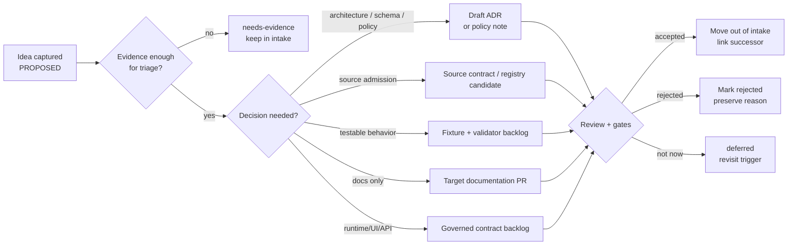

<!-- [KFM_META_BLOCK_V2]
doc_id: kfm://doc/NEEDS-VERIFICATION__docs_domains_flora_idea_intake
title: Flora Idea Intake
type: standard
version: v1
status: draft
owners: NEEDS-VERIFICATION__flora-steward
created: NEEDS-VERIFICATION__YYYY-MM-DD
updated: 2026-05-07
policy_label: NEEDS-VERIFICATION__public-doc
related: [docs/domains/flora/README.md, docs/domains/flora/CURRENT_STATE.md, contracts/source/kansas_flora/README.md]
tags: [kfm, flora, idea-intake, governance, evidence, source-intake]
notes: [doc_id, owner, created date, and policy label require repository/steward verification before merge., This file is an intake and triage surface only; entries here are not implementation claims, accepted architecture, source authorization, or publication approval., Current target file existed in the GitHub repository with a thin template and no active ideas at time of drafting.]
[/KFM_META_BLOCK_V2] -->

<a id="top"></a>

# Flora Idea Intake

Triage lane for unpromoted Flora ideas before they become ADRs, backlog items, schemas, policies, source descriptors, pipelines, UI contracts, or release work.


> [!IMPORTANT]
> **Status:** draft  
> **Owners:** `NEEDS-VERIFICATION__flora-steward`  
> **Path:** `docs/domains/flora/IDEA_INTAKE.md`  
> **Authority class:** idea intake / anti-fragmentation queue  
> **Truth posture:** ideas recorded here are **PROPOSED** until promoted through evidence, review, policy, validation, and repository governance.  
> **Quick jumps:** [Scope](#scope) · [Repo fit](#repo-fit) · [Accepted inputs](#accepted-inputs) · [Exclusions](#exclusions) · [Intake states](#intake-states) · [Intake template](#intake-template) · [Promotion gates](#promotion-gates) · [Active ideas](#active-ideas) · [Review workflow](#review-workflow) · [Checklist](#pre-publish-checklist)

---

## Scope

This file captures Flora-domain ideas without promoting them to implementation claims.

Use it when an idea is real enough to preserve but not ready to become one of the following:

- an ADR
- a source descriptor
- a schema or contract
- a policy rule
- a validator
- a pipeline
- a fixture or test
- a MapLibre layer descriptor
- an Evidence Drawer payload
- a Focus Mode behavior
- a release or publication candidate

> [!WARNING]
> An idea recorded here is not a decision. It is not source authorization. It is not proof that a file exists, a route is implemented, a workflow enforces a gate, a source may be published, or a public layer is safe.

### This file should protect three things

| Protection target | Why it matters | Intake rule |
|---|---|---|
| Flora truth posture | Plant observations, specimens, taxon names, range maps, vegetation products, and AI explanations have different evidence burdens. | Do not collapse source types into one generic “plant data” bucket. |
| Public safety | Rare plants, protected locations, controlled-access records, and culturally sensitive flora context may require withholding or generalization. | Default to review, restriction, generalization, abstention, or denial when sensitivity is unclear. |
| Repo authority | Repeated ideas can accidentally look canonical if they are written as implementation facts. | Every entry must carry status, evidence needed, policy concerns, and promotion criteria. |

[Back to top](#top)

---

## Repo fit

`docs/domains/flora/IDEA_INTAKE.md` is part of the human-facing Flora documentation surface.

It is downstream of KFM doctrine and upstream of work that may later land in ADRs, registries, schemas, policies, validators, fixtures, pipelines, API contracts, UI contracts, release manifests, or verification backlogs.

| Surface | Relationship | Intake posture |
|---|---|---|
| `docs/domains/flora/README.md` | Flora lane entrypoint and navigation surface | Ideas here should not conflict with the lane boundary. |
| `docs/domains/flora/CURRENT_STATE.md` | Repo evidence ledger for confirmed/proposed/unknown current state | Move repo-state discoveries there after verification. |
| `contracts/source/kansas_flora/README.md` | Source-admission contract surface for Kansas Flora sources | Move source-contract decisions there only after review. |
| `docs/adr/` | Decision records | Promote only when an idea changes architecture, policy, source roles, schema homes, or public exposure rules. |
| `data/registry/flora/` | Machine-readable source/layer/rights/sensitivity registry | Promote only after source role, rights, sensitivity, cadence, and authority boundaries are explicit. |
| `schemas/` or `contracts/` | Machine-readable shape and semantic contract homes | Promote only after schema-home authority is resolved. |
| `policy/flora/` | Executable rights, sensitivity, publication, AI, review, and promotion policy | Promote only when policy behavior is testable. |
| `tests/fixtures/flora/` and `tests/flora/` | Valid and invalid proof cases | Promote only with negative-path fixtures, especially sensitive-location and missing-rights cases. |

> [!NOTE]
> If repo evidence later shows a different canonical home for Flora intake, preserve this file’s entries by migration note rather than silently moving or deleting them.

[Back to top](#top)

---

## Accepted inputs

Use this file for early-stage, evidence-aware Flora ideas.

| Accepted input | Required context |
|---|---|
| Candidate source family | Provider, source role hypothesis, rights unknowns, sensitivity concerns, cadence, and authority boundary. |
| Candidate object family | Why the object is distinct from existing taxon, occurrence, specimen, product, release, or evidence objects. |
| Candidate schema or contract | Field intent, upstream/downstream surfaces, shared-object reuse possibility, and schema-home dependency. |
| Candidate policy rule | Risk being controlled, expected outcome, negative fixture, and reviewer/steward burden. |
| Candidate validator | Failure mode, deterministic input, fixture needs, and rollback impact. |
| Candidate pipeline step | Lifecycle stage, inputs, outputs, receipts, no-network fixture strategy, and quarantine behavior. |
| Candidate public layer | Source evidence, generalization/redaction plan, EvidenceBundle path, public-safe attributes, and rollback target. |
| Candidate Evidence Drawer or Focus Mode behavior | Scope, evidence source, finite outcome, citation requirements, denial conditions, and disclosure limits. |
| Candidate documentation improvement | Target file, problem solved, repo evidence needed, and link/update burden. |

[Back to top](#top)

---

## Exclusions

Do not put these here.

| Excluded material | Correct handling |
|---|---|
| Raw plant occurrence, specimen, plot, survey, or vegetation records | Use governed data lifecycle paths after source admission. |
| Exact sensitive plant coordinates | Keep out of public docs; use controlled access, redaction/generalization receipts, or denial paths. |
| API keys, tokens, cookies, passwords, private endpoints, or access instructions | Use approved secret/config handling outside documentation. |
| Claims that a source is official, current, authoritative, or publishable without evidence | Keep as `NEEDS VERIFICATION` until source review is complete. |
| Implemented route names, package names, workflow behavior, or test coverage not verified in the current repo | Move to `CURRENT_STATE.md` only after direct repository evidence. |
| Long design decisions | Promote to ADR after scope and consequences are clear. |
| Accepted backlog work | Move to roadmap, issue tracker, or implementation plan after triage. |
| Policy rules without fixtures | Draft policy idea here, but do not treat as enforceable until tests exist. |
| AI-generated Flora claims | Require EvidenceBundle resolution and citation validation before any runtime use. |

[Back to top](#top)

---

## Intake states

Use a finite state for every idea. Do not leave ideas in ambiguous prose-only status.

| State | Meaning | Allowed next move |
|---|---|---|
| `proposed` | Captured but not reviewed. | Add evidence needs, owner, and triage notes. |
| `reviewing` | Under steward, maintainer, or architecture review. | Accept, reject, defer, or request evidence. |
| `needs-evidence` | Plausible but missing source, repo, policy, rights, sensitivity, or implementation evidence. | Resolve evidence or defer. |
| `needs-adr` | Architecture, schema-home, public exposure, source-role, or policy decision required. | Draft ADR. |
| `needs-fixture` | Cannot be promoted until valid/invalid fixtures exist. | Add fixture plan. |
| `deferred` | Worth preserving but not currently actionable. | Revisit on trigger date or dependency. |
| `accepted` | Approved for downstream work. | Move to ADR, backlog, roadmap, schema, policy, fixture, or implementation issue. |
| `rejected` | Not aligned, unsafe, duplicative, unsupported, or out of scope. | Preserve reason and do not re-open without new evidence. |
| `superseded` | Replaced by stronger idea, ADR, implementation, or policy. | Link successor. |

[Back to top](#top)

---

## Intake template

Copy this template for each new idea.

```markdown
### IDEA-FLORA-YYYY-NNN — <short title>

| Field | Value |
|---|---|
| **State** | `proposed` |
| **Owner** | `NEEDS-VERIFICATION__owner` |
| **Submitted** | `YYYY-MM-DD` |
| **Source** | `human note / repo evidence / attached corpus / issue / PR / external source / other` |
| **Truth label** | `PROPOSED` |
| **Domain impact** | `taxon / occurrence / specimen / source / product / policy / validator / pipeline / API / UI / release / documentation` |
| **Sensitivity posture** | `public / review_required / controlled / restricted / unknown` |
| **Related surfaces** | `paths or docs, if verified; otherwise PROPOSED` |

#### Problem being solved

Describe the gap, risk, ambiguity, or opportunity.

#### Proposed change

Describe the idea without claiming it already exists.

#### Evidence needed

- [ ] Repo evidence
- [ ] Source authority evidence
- [ ] Rights/license evidence
- [ ] Sensitivity/geoprivacy evidence
- [ ] Schema/contract evidence
- [ ] Policy/test evidence
- [ ] Runtime/API/UI evidence
- [ ] Release/rollback evidence

#### Policy or sensitivity concerns

State any rare-plant, protected-location, steward-review, rights, living-person, cultural, private-land, source-term, precision, or public-exposure concerns.

#### Dependencies

List ADRs, schemas, fixtures, source descriptors, validators, policies, pipelines, UI/API contracts, or repo scans required before promotion.

#### Promotion criteria

- [ ] Owner verified
- [ ] Source role explicit
- [ ] Rights posture explicit
- [ ] Sensitivity posture explicit
- [ ] Negative-path fixture planned
- [ ] Rollback/correction path identified
- [ ] Target home verified against Directory Rules and repo evidence
- [ ] Moved to ADR/backlog/roadmap/schema/policy/test as appropriate

#### Triage notes

Record review notes, blockers, successor links, and decision history.
```

[Back to top](#top)

---

## Promotion gates

An idea may leave this file only when it has a clear downstream home and enough evidence to avoid authority drift.



### Minimum promotion criteria

| Promotion target | Required before leaving intake |
|---|---|
| ADR | Decision scope, alternatives, consequences, affected paths, rollback, and evidence basis. |
| Source descriptor | Source role, rights/license terms, cadence, authority boundary, sensitivity posture, stable identifiers, and publication eligibility. |
| Schema/contract | Owning home verified, shared-object reuse checked, valid and invalid fixture plan included. |
| Policy | Deny/allow/restrict/abstain outcome defined, negative fixture included, sensitivity and rights behavior explicit. |
| Validator | Deterministic input/output, failure mode, no-network fixture, and rollback behavior identified. |
| Pipeline | Lifecycle stage, receipts, quarantine behavior, source terms, and no-live-network test path defined. |
| UI/API/Focus | Governed API boundary, EvidenceBundle resolution, finite outcome, public-safe payload, and citation validation defined. |
| Publication/release | Catalog/proof/release separation, review state, correction path, rollback target, and public-safe exposure recorded. |

[Back to top](#top)

---

## Active ideas

_No active Flora ideas are recorded yet._

> [!TIP]
> Preserve this empty state until a real idea is submitted. Do not seed the file with speculative examples that could be mistaken for accepted roadmap work.

[Back to top](#top)

---

## Parking lot

Use this section only for unstructured fragments that are not ready for the formal template. Convert each item into a full intake record or remove it during triage.

_None._

[Back to top](#top)

---

## Review workflow

1. Add a new idea using the template.
2. Assign `State`, `Owner`, `Domain impact`, and `Sensitivity posture`.
3. Identify the likely downstream home, but mark it `PROPOSED` unless verified.
4. Add evidence needs and policy concerns.
5. Review against source-role, rights, sensitivity, and public exposure rules.
6. Decide whether the idea stays here, moves to ADR, moves to backlog, becomes a source descriptor, becomes a fixture/test, or is rejected.
7. Preserve the decision trail in the idea entry.
8. When promoted, replace the entry body with a short successor link and decision note.

### Lightweight triage cadence

| Cadence | Action |
|---|---|
| Per PR touching Flora docs | Check whether new ideas should be recorded here. |
| Before source activation | Review candidate source ideas for rights, sensitivity, and authority boundary. |
| Before schema/policy work | Check intake for duplicate or superseded proposals. |
| Before public layer or Focus work | Verify no idea bypasses EvidenceBundle, release, redaction, or citation gates. |
| After release/correction | Mark intake items superseded if release objects or correction notices resolved them. |

[Back to top](#top)

---

## Pre-publish checklist

Before committing this file or any future update:

- [ ] KFM Meta Block v2 is present and uses reviewable placeholders where values are unverified.
- [ ] No idea is written as implemented behavior unless directly verified.
- [ ] Active ideas have finite states.
- [ ] Owners and dates are explicit or marked `NEEDS VERIFICATION`.
- [ ] No raw data, credentials, exact sensitive locations, or controlled-access details are included.
- [ ] Source roles, rights, sensitivity, evidence needs, and promotion criteria are visible.
- [ ] Directory homes are checked against Directory Rules and actual repo evidence before being treated as current fact.
- [ ] Schema-home or policy-significant ideas are routed to ADRs before implementation.
- [ ] Publication ideas include review, release, correction, and rollback considerations.
- [ ] Promoted ideas link to their successor ADR, issue, PR, fixture, schema, policy, or documentation file.
- [ ] Rejected ideas keep a short reason so the same unsafe path is not reintroduced later.

[Back to top](#top)
