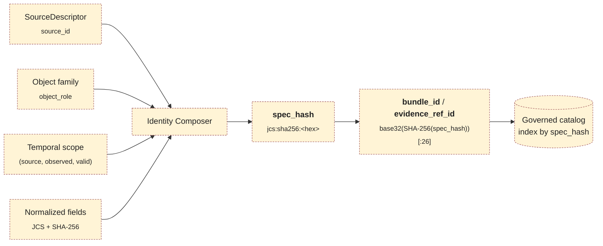
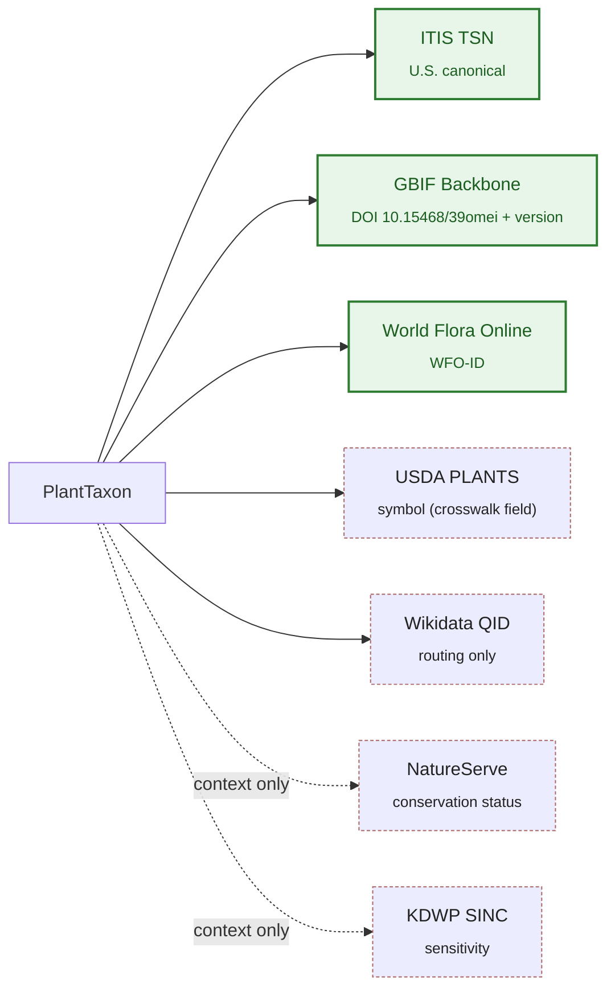

<!-- [KFM_META_BLOCK_V2]
doc_id: kfm://doc/<uuid-placeholder>
title: Flora Identity Model
type: standard
version: v1.1
status: draft
owners: <flora domain steward> · <data architecture lead>
created: 2026-05-16
updated: 2026-06-03
policy_label: public
related:
  - ai-build-operating-contract.md           # CONFIRMED canonical operating contract (CONTRACT_VERSION 3.0.0)
  - directory-rules.md                        # CONFIRMED path authority (§7.4 schema home, §12 Domain Placement Law)
  - docs/standards/PROV.md                    # NEEDS VERIFICATION (mounted-repo presence)
  - docs/standards/ISO-19115.md               # NEEDS VERIFICATION
  - docs/standards/CANONICALIZATION.md        # PROPOSED home for JCS vs URDNA2015 policy (C1-02 / C8-05)
  - docs/domains/fauna/IDENTITY_MODEL.md      # NEEDS VERIFICATION (parallel charter)
  - contracts/flora/                          # PROPOSED semantic-contract home (Markdown meaning)
  - schemas/contracts/v1/flora/               # PROPOSED canonical machine-schema home (ADR-0001)
  - policy/sensitivity/flora/                 # CONFIRMED sensitivity-policy home (Encyclopedia §7.6 / Atlas Ch.24.13)
tags: [kfm, flora, identity, evidence, spec_hash, deterministic-identity, taxonomy]
notes:
  # CONTRACT_VERSION pin: this doc is doctrine-adjacent; it tracks ai-build-operating-contract.md v3.0.0.
  # Identity composition (source_id + object_role + temporal_scope + normalized_digest) is CONFIRMED KFM doctrine and PROPOSED at the Flora field realization.
  # JCS + SHA-256 spec_hash basis is CONFIRMED at the cross-cutting evidence layer (C1-02); Flora field-set selection is PROPOSED.
  # Machine-schema-home paths under schemas/contracts/v1/... are CONFIRMED-by-rule (ADR-0001 / Directory Rules §7.4); the specific flora/ leaf is PROPOSED and NEEDS VERIFICATION against mounted repo.
  # A prose normalization spec is a SEMANTIC contract: it lives under contracts/ or docs/standards/, never under schemas/ (.schema.json only). Corrected in v1.1.
  # Runtime shape aligned to RuntimeResponseEnvelope (contract §8 / Directory Rules glossary); bespoke FloraDecisionEnvelope flagged CONFLICTED, migration-tracked.
[/KFM_META_BLOCK_V2] -->

# 🌿 Flora Identity Model

> Deterministic, evidence-bound identity rules for the KFM Flora domain — how plant-domain objects acquire, preserve, and resolve their identity across the `RAW → WORK / QUARANTINE → PROCESSED → CATALOG / TRIPLET → PUBLISHED` lifecycle.

[](#)
[](#)
[](#)
[](#6--canonicalization-and-spec_hash)
[](#)
[](#)
[](#)

| Status | Owners | Contract | Last updated |
|---|---|---|---|
| draft · doctrine-tracking | `<flora domain steward>` · `<data architecture lead>` | `CONTRACT_VERSION = "3.0.0"` | 2026-06-03 |

> [!IMPORTANT]
> This document governs **identity** for Flora-domain objects — what makes a Plant Taxon, a Flora Occurrence, or a Rare Plant Record *the same thing* across runs, lanes, and corrections. It does **not** govern taxonomic truth, conservation status, public release, or geometry — those flow through `SourceDescriptor`, `EvidenceBundle`, `PolicyDecision`, and `ReleaseManifest`. Identity is upstream of truth and downstream of canonicalization.

---

## Contents

- [1 · Scope and boundaries](#1--scope-and-boundaries)
- [2 · The identity formula](#2--the-identity-formula)
- [3 · Flora object families and identity rule](#3--flora-object-families-and-identity-rule)
- [4 · Taxonomic authority anchoring](#4--taxonomic-authority-anchoring)
- [5 · Temporal scope semantics](#5--temporal-scope-semantics)
- [6 · Canonicalization and `spec_hash`](#6--canonicalization-and-spec_hash)
- [7 · Sensitivity-aware identity](#7--sensitivity-aware-identity)
- [8 · Resolution path: EvidenceRef → EvidenceBundle](#8--resolution-path-evidenceref--evidencebundle)
- [9 · Failure modes and required behavior](#9--failure-modes-and-required-behavior)
- [10 · Cross-lane identity preservation](#10--cross-lane-identity-preservation)
- [11 · Open questions register](#11--open-questions-register)
- [12 · Open verification backlog](#12--open-verification-backlog)
- [13 · Changelog](#13--changelog)
- [14 · Definition of done](#14--definition-of-done)
- [15 · Related docs](#15--related-docs)

---

## 1 · Scope and boundaries

This document is the **identity charter** for the Flora domain. Its job is narrow and load-bearing: it specifies how an object instance inside the Flora bounded context acquires a stable, deterministic identifier that survives reformatting, re-fetching, re-promotion, and rollback — without ever standing in for the evidence that justifies the object's claims.

> [!NOTE]
> **Identity is not truth.** A `PlantTaxon` with a stable identity may still be wrong, withdrawn, superseded, or restricted. Identity tells the system "this is the same object I saw before"; the `EvidenceBundle` tells it whether the object's claims are admissible. This is the DDD *Entity* rule — distinguish by identity, not by attributes — operationalized through a deterministic digest.

**This document owns:**

- The deterministic identity formula for Flora objects.
- The canonicalization basis (`spec_hash`) and the derivation of `bundle_id` / `evidence_ref_id`.
- The fields that participate in identity vs. fields that are deliberately excluded.
- The temporal model that keeps identity stable across observed / valid / retrieval / release / correction time.
- The crosswalk anchoring rule for plant taxonomic authorities (ITIS, GBIF Backbone, World Flora Online, NatureServe, USDA PLANTS).
- The interaction between identity and sensitivity (rare, protected, culturally sensitive plant locations).

**This document does NOT own:**

| Out of scope | Owned by |
|---|---|
| Whether a `PlantTaxon` claim is currently accepted | `SourceDescriptor` + steward review |
| Whether a `FloraOccurrence` may be published | `PolicyDecision` + `ReleaseManifest` |
| Where the canonical machine schema lives in the repo | ADR-0001 / Directory Rules §7.4 (**CONFIRMED rule**: `schemas/contracts/v1/...`); the `flora/` leaf is **PROPOSED / NEEDS VERIFICATION** |
| Habitat patch identity, fauna identity | `docs/domains/habitat/` · `docs/domains/fauna/` |
| Generic JCS / SHA-256 canonicalization rules | `docs/standards/` (cross-cutting standard) |
| The exact serialization-library pin per language | Hash-policy ADR (PROPOSED — see [§11](#11--open-questions-register)) |

[⬆ Back to top](#contents)

---

## 2 · The identity formula

KFM applies a single deterministic composition rule across every domain. The Flora realization of that rule is shown below.

```text
flora_object_identity  =  source_id  +  object_role  +  temporal_scope  +  normalized_digest
```

- **`source_id`** — the `SourceDescriptor` identifier (e.g., the herbarium portal, GBIF download, KDWP listed-species table). It anchors *where* the claim originated.
- **`object_role`** — the canonical Flora object family (e.g., `PlantTaxon`, `FloraOccurrence`, `RarePlantRecord`). It anchors *what kind of thing* the identifier names.
- **`temporal_scope`** — the time interval the object's evidentiary meaning is bound to. See [§5](#5--temporal-scope-semantics).
- **`normalized_digest`** — the JCS-canonicalized, SHA-256 fingerprint of the meaning-bearing fields. See [§6](#6--canonicalization-and-spec_hash).

> [!IMPORTANT]
> **Status.** The four-part composition is **PROPOSED** at the field-realization layer for every KFM domain, including Flora — the Domains Atlas records the identity rule for each Flora object family as `PROPOSED deterministic basis: source id + object role + temporal scope + normalized digest`. The distinctness of the six temporal facets is **CONFIRMED** doctrine. JCS + SHA-256 as the canonicalization basis is **CONFIRMED** at the cross-cutting evidence layer (C1-02); the Flora-specific *field-selection* for normalization is **PROPOSED** and gated by a future hash-policy ADR.



> [!NOTE]
> The dashed styling marks the diagram as **PROPOSED** end-to-end. No claim is made here that this composer exists as a runnable component in the current repo.

[⬆ Back to top](#contents)

---

## 3 · Flora object families and identity rule

Every Flora object family inherits the identity formula in [§2](#2--the-identity-formula). The table below enumerates the families confirmed by the Flora dossier and Domains Atlas, with each row marked for identity status. Field-level realization remains PROPOSED until the schema home is verified.

> [!NOTE]
> **Object-family spine is CONFIRMED.** The Domains Culmination Atlas v1.1 (§8 Flora) and the KFM Encyclopedia (§7.6) list the Flora object families. The identity *rule* applied to each is `PROPOSED` for field realization; the temporal distinctness is `CONFIRMED` doctrine.

| Object family | Identity rule | Temporal distinctness | Sensitivity default | Status |
|---|---|---|---|---|
| `PlantTaxon` | source_id + role + temporal_scope + normalized_digest | source / valid / retrieval / release / correction | low | rule: **PROPOSED** |
| `FloraTaxon Crosswalk` | same | same | low | **PROPOSED** |
| `FloraOccurrence` | same | source / observed / valid / retrieval / release / correction | varies by taxon sensitivity | **PROPOSED** |
| `SpecimenRecord` | same | same, plus collection / accession dates | low–medium | **PROPOSED** |
| `RarePlantRecord` | same | same | **HIGH — deny-by-default exact geometry** | **PROPOSED** |
| `VegetationCommunity` | same | same | low–medium | **PROPOSED** |
| `InvasivePlantRecord` | same | same | low (with conservation-context handling) | **PROPOSED** |
| `PhenologyObservation` | same | source / observed / valid / retrieval | low | **PROPOSED** |
| `RangePolygon` | same | source / valid / release | low (public derivative); high for restricted underlay | **PROPOSED** |
| `HabitatAssociation` | same | source / valid / release | follows linked record's tier | **PROPOSED** |
| `BotanicalSurvey` | same | source / observed / valid | medium | **PROPOSED** |
| `RestorationPlanting` | same | source / observed / valid / release | low–medium | **PROPOSED** |
| `RedactionReceipt` | same | retrieval / release / correction | structural — records a transform, not a claim | **PROPOSED** |

> [!CAUTION]
> The atlas Flora object inventory is **CONFIRMED**; this charter's `DistributionSurface` row from a prior draft has been folded into `RangePolygon` because the atlas object list names `RangePolygon` (not a separate distribution-surface family) for Flora. The identity *rule* applied to each row is **PROPOSED** for field realization. Do **not** treat any cell as evidence of a mounted schema file.

### What goes into `normalized_digest`, and what does not

Identity must move with evidentiary meaning, not with transport, runtime, or storage incidentals. The discipline below mirrors the cross-cutting `EvidenceBundle` identity rule (C1-02; C8-04 Evidence-Bundle JSON-LD with content addressing) and is **PROPOSED** for Flora-specific realization.

<details>
<summary><b>Included (PROPOSED) — fields that rotate the digest when changed</b></summary>

- `object_type` (e.g., `FloraOccurrence`)
- `schema_version`
- `source_refs` (resolved `SourceDescriptor` references)
- `dataset_refs`, `evidence_refs`
- Taxonomic anchor set — see [§4](#4--taxonomic-authority-anchoring) (incl. the **GBIF Backbone snapshot version**)
- `policy_label`, `rights_status`, `sensitivity`
- `temporal_scope` (the bounded interval governing the claim)
- Domain-specific identity fields — for example: geometry-class token (point vs. generalized polygon), uncertainty class, generalization-method token for redacted derivatives
- Any field whose alteration would change the evidentiary meaning of the row

> The corpus's PROPOSED Flora `EvidenceBundle` field set (KFM-P27-PROG-0003) names `bundle_id, domain, policy_label, rights_status, sensitivity, source_refs, spec_hash`, and a provenance snapshot — consistent with the included set above.

</details>

<details>
<summary><b>Excluded (PROPOSED) — fields that must not affect identity</b></summary>

- Transport- and storage-layer URLs
- Timestamps that are runtime artifacts (fetch wall-clock, retry counters)
- Signatures, nonces, attestation envelope wrappers
- Whitespace, key order, number-formatting variance (handled by JCS)
- Tool / runner / container identifiers — these belong in the `RunReceipt`, not in identity

</details>

> [!WARNING]
> Promoting a transport field into the digest is a doctrine-significant change and requires an ADR. The hash-policy ADR (PROPOSED — see [§11](#11--open-questions-register)) is the right venue.

[⬆ Back to top](#contents)

---

## 4 · Taxonomic authority anchoring

Flora identity is meaningless if a `PlantTaxon` cannot be reconciled to durable external authorities. KFM doctrine (Category C7 — Authority Anchoring; subcategory C7.c Taxonomic Authorities) requires every in-scope plant record to carry authority anchors and a crosswalk-provenance record. The doctrine is explicit: *every entity carries one or more authority IRIs, with provenance for each crosswalk, and the system fails closed when those IRIs are missing for in-scope record types.*

| Authority | Role for Flora | Status |
|---|---|---|
| **ITIS TSN** (itis.gov) | US-canonical anchor; required where coverage exists | **CONFIRMED** doctrine (C7-07) |
| **GBIF Backbone Taxonomy** (DOI `10.15468/39omei`) | International crosswalk; second-line when ITIS lags or is absent (common for many plants) | **CONFIRMED** doctrine (C7-08) |
| **World Flora Online (WFO)** | Plant-specific authority covering taxa where ITIS is incomplete or out of date | **CONFIRMED** in C7.c; Flora-specific binding (required / optional / fallback) **PROPOSED** |
| **USDA PLANTS** | Federal context, county-distribution layer; symbol carried in the taxon crosswalk | **CONFIRMED** as a crosswalk field (KFM-P13-PROG-0025); identity role **NEEDS VERIFICATION** |
| **NatureServe / Explorer Pro** | Conservation-status context and sensitivity input (S1/S2 drives redaction); not an identity authority | **CONFIRMED** as a source family; status-context only |
| **Wikidata QID** | Universal crosswalk *router*, never a sole-source-of-truth | **CONFIRMED** doctrine (C7-01); routing-only role |
| **KDWP listed-species / SINC context** | State-level rare/protected status; sensitivity input, not an identity authority | **CONFIRMED** as a source family |

### Crosswalk-provenance discipline

Per C7.e (Crosswalk Provenance), every `FloraTaxon Crosswalk` row should carry — alongside the authority IRI — the **source, the fetch time, and the confidence** of the anchoring decision. The corpus's PROPOSED crosswalk shape (KFM-P13-PROG-0025) links *ITIS TSN, GBIF taxonKey, USDA symbols, scientific names, ranks, authorship, hierarchy, license, and source-opinion provenance*. The `GBIF Backbone` snapshot version is part of the anchor's evidentiary meaning and is therefore **included** in the digest (reproducibility: a record anchored to Backbone version A may resolve differently against version B).



> [!NOTE]
> **OPEN policy.** When ITIS and GBIF disagree on the accepted name for a plant, the policy is **unsettled** in current doctrine. The Pass-10 corpus records the default *"ITIS for federal-data reconciliation, GBIF for international biodiversity queries"* but explicitly states this is **not yet codified** in the policy bundle. Until codified, the `FloraTaxon Crosswalk` should record both anchors and **label the disagreement** rather than picking silently. See [OQ-FLORA-ID-03](#11--open-questions-register).

[⬆ Back to top](#contents)

---

## 5 · Temporal scope semantics

KFM keeps six temporal facets explicitly separate. This is **CONFIRMED** doctrine across every domain — the Domains Atlas records, for every Flora object family, that *source, observed, valid, retrieval, release, and correction times stay distinct where material*. Conflating them is a known anti-pattern and a frequent cause of identity drift.

| Facet | What it represents | Identity role |
|---|---|---|
| **source time** | Time the upstream source asserts for its own state | Affects identity when material |
| **observed time** | When the field event occurred (collection, sighting, survey, phenophase) | Affects identity for occurrence-class rows |
| **valid time** | Period the modeled fact is true in the world | Affects identity for time-bounded claims |
| **retrieval time** | When KFM fetched the source | **Excluded** from identity (belongs in `RunReceipt`) |
| **release time** | When KFM published the artifact | **Excluded** from identity |
| **correction time** | When a correction was recorded | **Excluded** from identity; produces a *new* identity with `previous_spec_hash` linkage |

> [!IMPORTANT]
> **Corrections do not mutate identity.** A `CorrectionNotice` produces a new identity. The prior identity is preserved with a `superseded` state and a `superseded_by` link (`SupersessionRecord`). This rule preserves rollback targets and audit lineage.

### Worked illustrative example (PROPOSED)

A herbarium specimen collected in 1923, digitized in 2018, harvested by KFM in 2026, and corrected for a misidentification in 2027 yields:

- **One** logical specimen (`SpecimenRecord` identity v1) covering collection through harvest.
- **A second** identity (`SpecimenRecord` identity v2) issued at correction time, linked via `previous_spec_hash`.
- A `RedactionReceipt` is **not** required here (no sensitivity transform); a `CorrectionNotice` is.
- The original identity is **not** deleted. It remains addressable for replay and rollback.

> [!CAUTION]
> The example is illustrative. No claim is made that a 1923 specimen exists in the mounted repo.

[⬆ Back to top](#contents)

---

## 6 · Canonicalization and `spec_hash`

### Algorithm

| Step | Choice | Status |
|---|---|---|
| Canonicalize JSON | **RFC 8785 JCS** (sorted keys, normalized whitespace, normalized numbers) | **CONFIRMED** cross-cutting default (C1-02) |
| Hash | **SHA-256** over the canonical bytes | **CONFIRMED** v1 default (C1-02) |
| Record | `spec_hash` formatted as `jcs:sha256:<hex>` | **CONFIRMED** convention (C1-02) |
| Derive `bundle_id` | `"eb-" + base32(lowercase(SHA-256(spec_hash)))[:26]` | **PROPOSED** |
| Derive `evidence_ref_id` | `"er-" + base32(lowercase(SHA-256(target_bundle_spec_hash)))[:26]` | **PROPOSED** |
| Alternative for RDF graphs | **W3C URDNA2015** then SHA-256 — reserved for cases where RDF-semantic equivalence is the relevant invariant | **CONFIRMED** doctrine (C8-05); Flora binding **NEEDS VERIFICATION** |

> [!NOTE]
> BLAKE3 for streaming artifact roots (PMTiles, COG, etc.) is recommended in the corpus and is **distinct** from identity hashing. Flora identity uses JCS + SHA-256; downstream artifact bytes may carry BLAKE3 digests for streaming/range verification. The hash-policy ADR (PROPOSED) will lock this distinction.

### Why JCS first, then SHA-256

The canonicalization step does the load-bearing work. The corpus is explicit that hashing developer-formatted JSON is **not** acceptable: trivial reformatting produces a different hash, breaks re-runs and audits, and silently rotates identities. JCS imposes deterministic key ordering, removes whitespace variance, and normalizes number representation before SHA-256 sees the bytes.

### Where the normalization spec lives

The exact normalization rules — included fields, excluded fields, ordering, number representation — have **two homes** with distinct authority, and conflating them is a Directory Rules §13.1 violation:

| Artifact | Home | Authority | Status |
|---|---|---|---|
| **Prose normalization spec** (the rules, worked examples, JCS-vs-URDNA2015 policy) | `docs/standards/CANONICALIZATION.md` (cross-cutting) and/or `contracts/evidence/` (semantic Markdown) | semantic contract / standard | **PROPOSED** path |
| **Machine schema** for `EvidenceBundle` / `EvidenceRef` / normalization config | `schemas/contracts/v1/...` (`.schema.json` only) | canonical machine-schema home (ADR-0001 / Directory Rules §7.4) | **CONFIRMED rule**; the leaf path **NEEDS VERIFICATION** |

> [!WARNING]
> **Corrected in v1.1.** A prior draft placed a `spec_normalization.md` file under `schemas/contracts/v1/evidence/`. That is a **§13.1 contracts-vs-schemas drift**: `schemas/` holds `.schema.json` files **only** — semantic Markdown belongs under `contracts/` or `docs/standards/` (Directory Rules §6.4, §13.1). The prose spec therefore lives under `docs/standards/CANONICALIZATION.md` (or `contracts/evidence/`); the machine schemas live under `schemas/contracts/v1/...`. If the mounted repo places either elsewhere, this document yields to mounted reality and to an accepted ADR.

[⬆ Back to top](#contents)

---

## 7 · Sensitivity-aware identity

Flora's deny-by-default tier register (T0–T4) attaches to the *object*, not to the identifier. But identity has to **carry** the sensitivity posture so that downstream code cannot accidentally collapse a restricted exact-geometry record into a public-safe derivative simply because their other fields happen to match.

> [!NOTE]
> **Tier-scheme status.** The T0–T4 sensitivity tier scheme is referenced as canonical in Atlas v1.1 Ch. 24.5, and Flora's deny-default for rare/sensitive taxa is **CONFIRMED** there. Adoption of the tier scheme *as canonical* is itself an ADR-class decision (**ADR-S-05**, PROPOSED / NEEDS VERIFICATION). Flora's sensitivity policy home is `policy/sensitivity/flora/` (**CONFIRMED** per Encyclopedia §7.6 / Atlas Ch. 24.13 crosswalk).

### Rule of thumb

> [!IMPORTANT]
> **A restricted object and its public-safe derivative are different identities.** They share lineage; they do not share `spec_hash`.

| Pair | Identity relationship | Required artifacts |
|---|---|---|
| `FloraOccurrence` (exact, restricted) | distinct identity, T4 by default | `EvidenceBundle` + `PolicyDecision` |
| `FloraOccurrence` (generalized, public-safe) | distinct identity; lineage link to restricted record | `RedactionReceipt` + `ReviewRecord` |
| `RarePlantRecord` (exact location) | T4 — deny-by-default exact public geometry | `RedactionReceipt` + `ReviewRecord` + `PolicyDecision` |
| `RangePolygon` (public-safe aggregate) | aggregate-class identity, never substitutable for exact occurrence identity | `AggregationReceipt` or generalized-geometry `RedactionReceipt` |
| Culturally sensitive / ethnobotanical plant location | T4; identity preserved internally, no public geometry release | Sovereignty / steward review + `RedactionReceipt` |

> [!CAUTION]
> **Sensitive-domain disposition (operating contract §23.2).** Flora rare-species occurrence maps to the §23.2 row *"Rare species (occurrence) → `DENY` exact coordinates; generalize to public-safe grid; wildlife steward; `RedactionReceipt` + `LayerManifest` (sensitive-flag)."* Culturally sensitive / ethnobotanical material routes through the Indigenous/cultural-records row (`DENY` unless steward-approved; cultural reviewer). The **most restrictive applicable row applies** until stewards ratify the matrix. This document MUST NOT carry exact coordinates, exact identifiers, or restricted-source-derived fields.

### Identity-leak failure modes to refuse at validator time

1. **Hash crossover.** A public-safe derivative whose `spec_hash` accidentally equals the restricted source's `spec_hash` (meaning meaning-bearing fields are leaking into the public-safe record). → DENY.
2. **Generalization without receipt.** A public-safe geometry record without a `RedactionReceipt` reference. → DENY.
3. **Direct restricted reference from public surface.** A public layer's `LayerManifest` resolving an `EvidenceRef` to a restricted `EvidenceBundle`. → DENY.
4. **Identity reuse across tiers.** A `RarePlantRecord` and its lower-tier public derivative carrying the same `bundle_id`. → DENY.

> [!CAUTION]
> Identity is not a publication control on its own — `PolicyDecision` decides what is releasable. Identity discipline exists so that policy decisions, evidence bundles, and rollback targets remain stable even when sensitive transforms intervene. Without it, the trust membrane has nothing to grip.

[⬆ Back to top](#contents)

---

## 8 · Resolution path: `EvidenceRef` → `EvidenceBundle`

The resolution path is identical to the cross-cutting rule and is reproduced here for Flora consumers. Every governed Flora surface returns a finite outcome carried by a `RuntimeResponseEnvelope` (`ANSWER` / `ABSTAIN` / `DENY` / `ERROR`, plus optional `NARROWED` / `BOUNDED`).


> [!NOTE]
> The catalog index keys **first** by `spec_hash`, **second** by `bundle_id`. Keying by mutable paths is forbidden. **PROPOSED** for Flora field realization. The `RuntimeResponseEnvelope` schema home is `schemas/contracts/v1/runtime/` (**CONFIRMED** per Directory Rules glossary).

> [!WARNING]
> **Envelope naming — CONFLICTED / migration-tracked.** The Domains Atlas v1.1 §8.J Flora table currently names a bespoke `FloraDecisionEnvelope` for the feature/detail resolver while naming `RuntimeResponseEnvelope` for the Flora Focus Mode answer. The operating contract (§8) and Directory Rules glossary make `RuntimeResponseEnvelope` the **canonical** finite-outcome shape. This charter aligns to `RuntimeResponseEnvelope` throughout and flags the bespoke `*DecisionEnvelope` family as a per-domain naming variant to be reconciled by the `DecisionEnvelope → RuntimeResponseEnvelope` migration (mirrors the Archaeology lane, which already adopted `RuntimeResponseEnvelope`). See [OQ-FLORA-ID-08](#11--open-questions-register).

[⬆ Back to top](#contents)

---

## 9 · Failure modes and required behavior

The failure-mode table below is the Flora binding of the cross-cutting identity contract.

| # | Failure mode | Required outcome | Reason code (PROPOSED) |
|---|---|---|---|
| 1 | `EvidenceRef` resolves to no bundle | ABSTAIN (validator) → DENY (publication) | `ResolutionError.missing_bundle` |
| 2 | `evidence_ref.spec_hash` ≠ `bundle.spec_hash` | DENY | `ResolutionError.hash_mismatch` |
| 3 | Same logical spec, different canonical bytes across runners | ERROR | `NormalizationError.nondeterministic_serialization` |
| 4 | Meaning-bearing field present but excluded from normalization set | DENY | `NormalizationError.field_exclusion_violation` |
| 5 | Hash algorithm tag is not `sha256` (and no migration window declared) | DENY | `HashAlgoUnsupported` |
| 6 | Public-safe derivative shares `spec_hash` with restricted source | DENY | `IdentityError.tier_crossover` |
| 7 | Generalized geometry record lacks `RedactionReceipt` linkage | DENY | `IdentityError.missing_redaction_receipt` |
| 8 | `FloraTaxon Crosswalk` lacks at least one required authority anchor | ABSTAIN → DENY at publication | `IdentityError.missing_taxonomic_anchor` |

> [!WARNING]
> Reason codes above are **PROPOSED** strings. The canonical reason-code vocabulary belongs in the policy schema (source-role / reason-code vocabulary, ADR-S-04 candidate) and is **NEEDS VERIFICATION**.

[⬆ Back to top](#contents)

---

## 10 · Cross-lane identity preservation

Flora joins several adjacent domains. Joins must preserve each side's identity, ownership, sensitivity, and source-role discipline. A join never creates a new domain-of-truth; it creates a *relation* that must itself carry evidence and identity. The Domains Atlas records each relation as `CONFIRMED / PROPOSED` with the constraint that it *must preserve ownership, source role, sensitivity, and EvidenceBundle support*.

| Flora ↔ neighbor | Relation shape | Identity rule |
|---|---|---|
| Flora ↔ Habitat | `HabitatAssociation` and vegetation-community context | Flora owns its `HabitatAssociation` identity; Habitat owns patch/suitability identity. No identity merging. |
| Flora ↔ Fauna | Pollinator, food-web, invasive, biodiversity context | Each side keeps its taxon identity; relation carried by a typed edge with its own `EvidenceBundle`. |
| Flora ↔ Soil / Hydrology | Substrate, wetland, riparian, drought context | No identity merging; cross-lane edges only. |
| Flora ↔ Hazards | Fire, drought, flood, smoke, vegetation stress | Hazards remain context only; never event-evidence joins without explicit source-role flags. |
| Flora ↔ Agriculture / Land Stewardship | Restoration planting, land-cover context | Aggregation receipts required for any aggregate-cell join. |

> [!IMPORTANT]
> **Anti-pattern.** A cross-lane "super-record" that fuses Flora and Habitat fields under one identity collapses two ownerships into a fictitious third. Reject at validator time. Use typed edges and per-side identity instead. Cross-lane join policy is itself ADR-class (**ADR-S-14**).

[⬆ Back to top](#contents)

---

## 11 · Open questions register

| ID | Question | Owner role | Resolution path |
|---|---|---|---|
| OQ-FLORA-ID-01 | Canonical home of the prose normalization spec (`docs/standards/CANONICALIZATION.md` vs `contracts/evidence/`) and the machine-schema leaf (`schemas/contracts/v1/flora/` vs `.../domains/flora/`) | data architecture lead | Mounted-repo inspection vs. ADR-0001 / Directory Rules §7.4 |
| OQ-FLORA-ID-02 | Field-set selection for Flora `normalized_digest` | data architecture lead | Hash-policy ADR; accepted Flora schema fixtures |
| OQ-FLORA-ID-03 | ITIS vs. GBIF tie-breaker for accepted plant names | flora domain steward | Codified policy in `policy/domains/flora/` (path PROPOSED); ITIS/GBIF tie-breaker ADR |
| OQ-FLORA-ID-04 | World Flora Online binding for `PlantTaxon` (required, optional, or fallback only) | flora domain steward | Steward decision + ADR or per-domain policy |
| OQ-FLORA-ID-05 | Hash policy for streaming artifacts vs. specs (BLAKE3 vs. SHA-256) | data architecture lead | Hash-policy ADR (C1-02 / C8-05) |
| OQ-FLORA-ID-06 | `bundle_id` / `evidence_ref_id` derivation rule (base32 prefix length, character set) | data architecture lead | Identity schema in mounted repo |
| OQ-FLORA-ID-07 | `PROV.md` vs `PROVENANCE.md` standard naming | docs steward | Naming ADR; mounted `docs/standards/` listing |
| OQ-FLORA-ID-08 | Reconcile bespoke `FloraDecisionEnvelope` to canonical `RuntimeResponseEnvelope` | data architecture lead | `DecisionEnvelope → RuntimeResponseEnvelope` migration ADR (Archaeology precedent) |
| OQ-FLORA-ID-09 | Connector cadence and quarantine-recovery rules for herbarium / GBIF / iNaturalist / iDigBio sources | flora domain steward | Mounted connector configs; source registry entries (ADR-S-12) |
| OQ-FLORA-ID-10 | Whether `RedactionReceipt` identity participates in catalog indexing alongside the redacted derivative | data architecture lead | Catalog-index / receipt-layout ADR (ADR-S-03 candidate) |
| OQ-FLORA-ID-11 | Sensitivity tier scheme (T0–T4) adoption as canonical | flora domain steward + policy steward | ADR-S-05 ratification |

[⬆ Back to top](#contents)

---

## 12 · Open verification backlog

These items remain `NEEDS VERIFICATION` before promotion from `draft` to `published`:

1. Machine-schema leaf path for Flora (`schemas/contracts/v1/flora/` vs `schemas/contracts/v1/domains/flora/`) confirmed against the mounted repo.
2. Presence of `docs/standards/PROV.md`, `docs/standards/ISO-19115.md`, and `docs/standards/CANONICALIZATION.md` in the mounted repo.
3. `EvidenceBundle` / `EvidenceRef` schema shape and field set under `schemas/contracts/v1/...`.
4. `RuntimeResponseEnvelope` schema present at `schemas/contracts/v1/runtime/`.
5. `policy/sensitivity/flora/` present and wired to the rare-plant deny lane.
6. Canonical reason-code vocabulary (the `ResolutionError.*` / `IdentityError.*` / `NormalizationError.*` strings).
7. Parallel `docs/domains/fauna/IDENTITY_MODEL.md` exists and matches this charter's shape.

[⬆ Back to top](#contents)

---

## 13 · Changelog

| Change | Type (per contract §37) | Reason |
|---|---|---|
| Pinned `CONTRACT_VERSION = "3.0.0"`; added contract + Directory Rules to `related`; added Contract badge and table column | housekeeping | Doc is doctrine-adjacent; contract requires the pin |
| Corrected normalization-spec home: prose spec moved out of `schemas/` to `docs/standards/CANONICALIZATION.md` / `contracts/evidence/`; machine schemas stay under `schemas/contracts/v1/...` | reconciliation | Directory Rules §6.4 / §13.1: `schemas/` holds `.schema.json` only |
| Aligned runtime shape to `RuntimeResponseEnvelope`; flagged bespoke `FloraDecisionEnvelope` as CONFLICTED / migration-tracked | reconciliation | Contract §8 + Directory Rules glossary make `RuntimeResponseEnvelope` canonical |
| Folded `DistributionSurface` row into `RangePolygon` to match the CONFIRMED atlas Flora object list | clarification | Atlas §8 names `RangePolygon`, not a separate distribution-surface family, for Flora |
| Added USDA PLANTS to the taxonomic-anchor table and crosswalk diagram | gap closure | KFM-P13-PROG-0025 names USDA symbols in the taxon crosswalk |
| Upgraded schema-home language from "PROPOSED" to "CONFIRMED rule / leaf NEEDS VERIFICATION" | clarification | ADR-0001 / Directory Rules §7.4 confirm the *rule*; only the leaf is unverified |
| Added §23.2 sensitive-domain disposition callout (rare-species + cultural rows) | gap closure | Operating contract §23.2 routing required for sensitive domains |
| Restructured tail into doctrine-doc companion sections (Open Questions register, Verification backlog, Changelog, Definition of done) | housekeeping | Contract companion-section pattern for doctrine-adjacent docs |

> **Backward compatibility.** Section anchors `#1`–`#10` are unchanged. The former combined "Open questions and verification backlog" (old §11) is split into §11 (register) and §12 (backlog); the former "Related docs" (old §12) moves to §15. Inbound links to `#11--open-questions-and-verification-backlog` and `#12--related-docs` will break — update them to `#11--open-questions-register` / `#12--open-verification-backlog` / `#15--related-docs`. Truth labels are preserved or narrowed, never loosened.

[⬆ Back to top](#contents)

---

## 14 · Definition of done

This document is done enough to enter the repository when:

- it is placed according to Directory Rules (likely `docs/domains/flora/IDENTITY_MODEL.md`; **PROPOSED**, NEEDS VERIFICATION);
- a docs steward and the flora domain steward review it;
- it is linked from the Flora domain README and a docs / doctrine index;
- it does not conflict with accepted ADRs (ADR-0001 schema home; the `DecisionEnvelope → RuntimeResponseEnvelope` migration ADR; ADR-S-05 tier scheme);
- any conflict with current repo conventions is logged in `docs/registers/DRIFT_REGISTER.md` (notably the bespoke-envelope naming and the schema-leaf path);
- the `GENERATED_RECEIPT.json` planned in the PR is wired into CI;
- future changes follow the operating contract's §37 lifecycle.

[⬆ Back to top](#contents)

---

## 15 · Related docs

> Links are repo-relative. Targets marked **TODO** are placeholders pending verification of the mounted layout.

- [`ai-build-operating-contract.md`](../../../ai-build-operating-contract.md) — canonical operating contract, `CONTRACT_VERSION = "3.0.0"` *(authored)*
- [`directory-rules.md`](../../../directory-rules.md) — path authority (§7.4 schema home, §12 Domain Placement Law, §13.1 contracts-vs-schemas drift) *(authored)*
- [`docs/standards/PROV.md`](../../standards/PROV.md) — W3C PROV-O + PAV provenance profile *(NEEDS VERIFICATION)*
- [`docs/standards/ISO-19115.md`](../../standards/ISO-19115.md) — ISO 19115 crosswalk and conformance profile *(NEEDS VERIFICATION)*
- `docs/standards/CANONICALIZATION.md` — **TODO**; JCS vs URDNA2015 policy with worked examples (C1-02 / C8-05)
- `docs/architecture/source-roles.md` — **TODO** path; source-role vocabulary (ADR-S-04 candidate)
- `docs/architecture/sensitivity-tiers.md` — **TODO** path; T0–T4 tier scheme (ADR-S-05 candidate)
- `docs/domains/fauna/IDENTITY_MODEL.md` — **TODO**; parallel identity charter for Fauna (mirrors this document's shape)
- `docs/domains/flora/README.md` — **TODO**; Flora domain landing page
- `contracts/flora/` — **PROPOSED** semantic-contract home (Markdown meaning) for Flora object families
- `schemas/contracts/v1/flora/` — **PROPOSED** canonical machine-schema leaf for Flora object schemas (ADR-0001)
- `policy/sensitivity/flora/` — **CONFIRMED** sensitivity-policy home (Encyclopedia §7.6 / Atlas Ch. 24.13)

---

<sub>Last updated: 2026-06-03 · Version: v1.1 · Status: draft · `CONTRACT_VERSION = "3.0.0"` · Doctrine sources: KFM Domains Culmination Atlas v1.1 (§8 Flora; Ch. 24.3 outcome envelope; Ch. 24.5 tiers; Ch. 24.13 responsibility-root crosswalk); KFM Domain and Capability Encyclopedia (§7.6 Flora); KFM Pass 10 Idea Index (C1-02, C7-01, C7-07, C7-08, C7.c/e, C8-04, C8-05); Pass 23/32 consolidated atlas (KFM-P13-PROG-0025, KFM-P27-PROG-0003); `ai-build-operating-contract.md` v3.0 (§8, §23.2); `directory-rules.md` v1.3 (§6.4, §7.4, §12, §13.1, glossary).</sub>

[⬆ Back to top](#contents)
