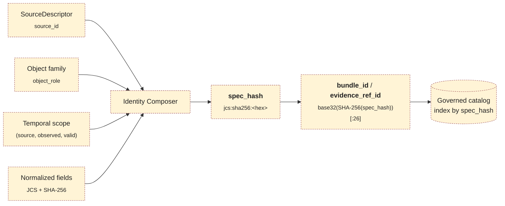
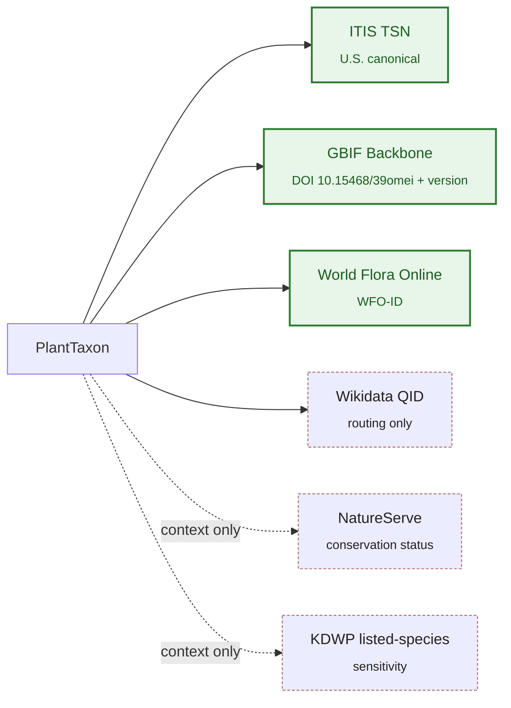
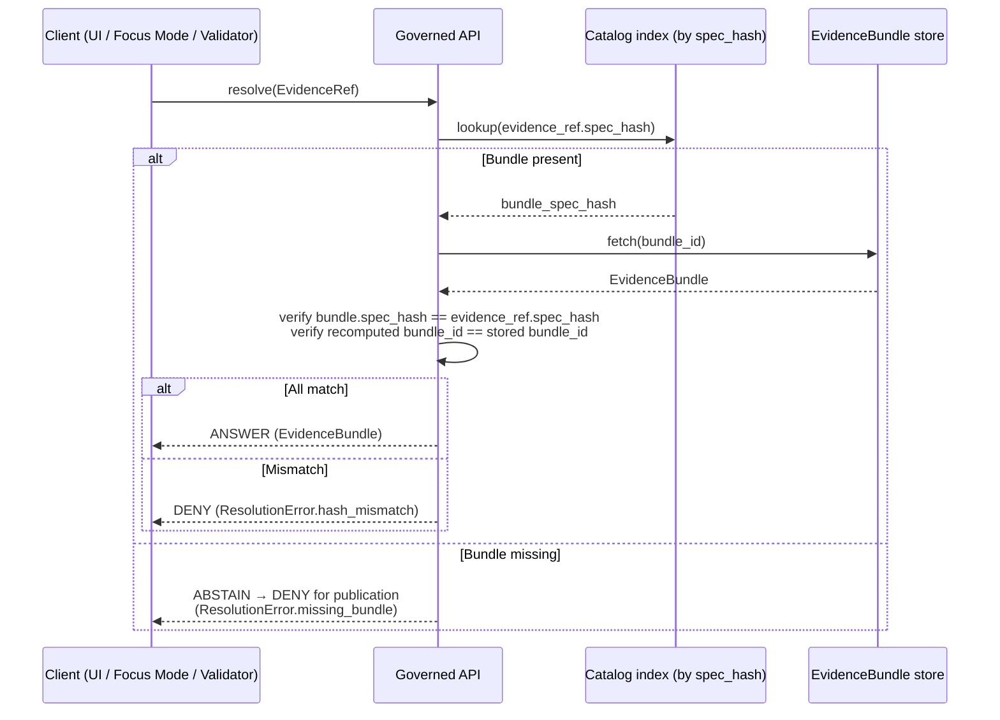

<!-- [KFM_META_BLOCK_V2]
doc_id: kfm://doc/<uuid-placeholder>
title: Flora Identity Model
type: standard
version: v1
status: draft
owners: <flora domain steward> · <data architecture lead>
created: 2026-05-16
updated: 2026-05-16
policy_label: public
related:
  - docs/standards/PROV.md
  - docs/standards/ISO-19115.md
  - docs/architecture/source-roles.md  # NEEDS VERIFICATION
  - docs/domains/fauna/IDENTITY_MODEL.md  # NEEDS VERIFICATION
  - schemas/contracts/v1/evidence/  # PROPOSED canonical home
tags: [kfm, flora, identity, evidence, spec_hash, deterministic-identity, taxonomy]
notes:
  - Identity composition (source_id + object_role + temporal_scope + normalized_digest) is CONFIRMED KFM doctrine and PROPOSED at the Flora field realization.
  - JCS + SHA-256 spec_hash basis is CONFIRMED at the cross-cutting evidence layer (C1-02); Flora field-set selection is PROPOSED.
  - Schema-home paths under schemas/contracts/v1/... are PROPOSED per ADR-0001 default; NEEDS VERIFICATION against mounted repo.
[/KFM_META_BLOCK_V2] -->

# 🌿 Flora Identity Model

> Deterministic, evidence-bound identity rules for the KFM Flora domain — how plant-domain objects acquire, preserve, and resolve their identity across the RAW → WORK/QUARANTINE → PROCESSED → CATALOG/TRIPLET → PUBLISHED lifecycle.

[](#)
[](#)
[](#)
[](#6--canonicalization-and-spec_hash)
[](#)
[](#)

| Status | Owners | Last updated |
|---|---|---|
| draft · doctrine-tracking | `<flora domain steward>` · `<data architecture lead>` | 2026-05-16 |

> [!IMPORTANT]
> This document governs **identity** for Flora-domain objects — what makes a Plant Taxon, a Flora Occurrence, or a Rare Plant Record *the same thing* across runs, lanes, and corrections. It does **not** govern taxonomic truth, conservation status, public release, or geometry — those flow through `SourceDescriptor`, `EvidenceBundle`, `PolicyDecision`, and `ReleaseManifest`. Identity is upstream of truth and downstream of canonicalization.

---

## Contents

- [1 · Scope and boundaries](#1--scope-and-boundaries)
- [2 · The identity formula](#2--the-identity-formula)
- [3 · Flora object families and identity rule](#3--flora-object-families-and-identity-rule)
- [4 · Taxonomic authority anchoring](#4--taxonomic-authority-anchoring)
- [5 · Temporal scope semantics](#5--temporal-scope-semantics)
- [6 · Canonicalization and `spec_hash`](#6--canonicalization-and-spec_hash)
- [7 · Sensitivity-aware identity](#7--sensitivity-aware-identity)
- [8 · Resolution path: EvidenceRef → EvidenceBundle](#8--resolution-path-evidenceref--evidencebundle)
- [9 · Failure modes and required behavior](#9--failure-modes-and-required-behavior)
- [10 · Cross-lane identity preservation](#10--cross-lane-identity-preservation)
- [11 · Open questions and verification backlog](#11--open-questions-and-verification-backlog)
- [12 · Related docs](#12--related-docs)

---

## 1 · Scope and boundaries

This document is the **identity charter** for the Flora domain. Its job is narrow and load-bearing: it specifies how an object instance inside the Flora bounded context acquires a stable, deterministic identifier that survives reformatting, re-fetching, re-promotion, and rollback — without ever standing in for the evidence that justifies the object's claims.

> [!NOTE]
> **Identity is not truth.** A `Plant Taxon` with a stable identity may still be wrong, withdrawn, superseded, or restricted. Identity tells the system "this is the same object I saw before"; the `EvidenceBundle` tells it whether the object's claims are admissible.

**This document owns:**

- The deterministic identity formula for Flora objects.
- The canonicalization basis (`spec_hash`) and the derivation of `bundle_id` / `evidence_ref_id`.
- The fields that participate in identity vs. fields that are deliberately excluded.
- The temporal model that keeps identity stable across observed/valid/retrieval/release/correction time.
- The crosswalk anchoring rule for plant taxonomic authorities (ITIS, GBIF Backbone, World Flora Online, NatureServe).
- The interaction between identity and sensitivity (rare, protected, culturally sensitive plant locations).

**This document does NOT own:**

| Out of scope | Owned by |
|---|---|
| Whether a `Plant Taxon` claim is currently accepted | `SourceDescriptor` + steward review |
| Whether a `Flora Occurrence` may be published | `PolicyDecision` + `ReleaseManifest` |
| Where the canonical schema lives in the repo | ADR-0001 (PROPOSED canonical: `schemas/contracts/v1/...`) — **NEEDS VERIFICATION** |
| Habitat patch identity, fauna identity | `docs/domains/habitat/` · `docs/domains/fauna/` |
| Generic JCS/SHA-256 canonicalization rules | `docs/standards/` (cross-cutting standard) |
| The exact serialization-library pin per language | Hash-policy ADR (PROPOSED — see §11) |

[⬆ Back to top](#contents)

---

## 2 · The identity formula

KFM applies a single deterministic composition rule across every domain. The Flora realization of that rule is shown below.

```text
flora_object_identity  =  source_id  +  object_role  +  temporal_scope  +  normalized_digest
```

- **`source_id`** — the `SourceDescriptor` identifier (e.g., the herbarium portal, GBIF download, KDWP listed-species table). It anchors *where* the claim originated.
- **`object_role`** — the canonical Flora object family (e.g., `PlantTaxon`, `FloraOccurrence`, `RarePlantRecord`). It anchors *what kind of thing* the identifier names.
- **`temporal_scope`** — the time interval the object's evidentiary meaning is bound to. See [§5](#5--temporal-scope-semantics).
- **`normalized_digest`** — the JCS-canonicalized, SHA-256 fingerprint of the meaning-bearing fields. See [§6](#6--canonicalization-and-spec_hash).

> [!IMPORTANT]
> **Status:** the four-part composition is **PROPOSED** at the field-realization layer for every KFM domain, including Flora. The distinctness of the six temporal facets is **CONFIRMED** doctrine. JCS + SHA-256 as the canonicalization basis is **CONFIRMED** at the cross-cutting evidence layer; the Flora-specific *field-selection* for normalization is **PROPOSED** and gated by a future hash-policy ADR.



> [!NOTE]
> The dashed yellow styling marks the diagram as **PROPOSED** end-to-end. No claim is made here that this composer exists as a runnable component in the current repo.

[⬆ Back to top](#contents)

---

## 3 · Flora object families and identity rule

Every Flora object family inherits the identity formula in §2. The table below enumerates the families confirmed by the Flora dossier and atlas, with each row marked for identity status. Field-level realization remains PROPOSED until the schema home is verified.

| Object family | Identity rule | Temporal distinctness | Sensitivity default | Status |
|---|---|---|---|---|
| `PlantTaxon` | source_id + role + temporal_scope + normalized_digest | source / valid / retrieval / release / correction | low | identity rule: **PROPOSED** |
| `FloraTaxon Crosswalk` | same | same | low | **PROPOSED** |
| `FloraOccurrence` | same | source / observed / valid / retrieval / release / correction | varies by taxon sensitivity | **PROPOSED** |
| `SpecimenRecord` | same | same, plus collection / accession dates | low–medium | **PROPOSED** |
| `RarePlantRecord` | same | same | **HIGH — deny-by-default exact geometry** | **PROPOSED** |
| `VegetationCommunity` | same | same | low–medium | **PROPOSED** |
| `InvasivePlantRecord` | same | same | low (with conservation-context handling) | **PROPOSED** |
| `PhenologyObservation` | same | source / observed / valid / retrieval | low | **PROPOSED** |
| `RangePolygon` | same | source / valid / release | low (public derivative); high for restricted underlay | **PROPOSED** |
| `DistributionSurface` | same | source / valid / release | low for public-safe; high for restricted | **PROPOSED** |
| `HabitatAssociation` | same | source / valid / release | follows linked record's tier | **PROPOSED** |
| `BotanicalSurvey` | same | source / observed / valid | medium | **PROPOSED** |
| `RestorationPlanting` | same | source / observed / valid / release | low–medium | **PROPOSED** |
| `RedactionReceipt` | same | retrieval / release / correction | structural — records a transform, not a claim | **PROPOSED** |

> [!CAUTION]
> The rows above are derived from the **CONFIRMED** Flora object inventory in the KFM Domain Encyclopedia and Domains Culmination Atlas. The identity *rule* applied to each row is **PROPOSED** for field realization. Do **not** treat any cell as evidence of a mounted schema file.

### What goes into `normalized_digest`, and what does not

Identity must move with evidentiary meaning, not with transport, runtime, or storage incidentals. The discipline below mirrors the cross-cutting `EvidenceBundle` identity rule (C1-02 / new-ideas 5-8-26) and is **PROPOSED** for Flora-specific realization.

<details>
<summary><b>Included (PROPOSED) — fields that rotate the digest when changed</b></summary>

- `object_type` (e.g., `FloraOccurrence`)
- `schema_version`
- `source_refs` (resolved `SourceDescriptor` references)
- `dataset_refs`, `evidence_refs`
- Taxonomic anchor set — see [§4](#4--taxonomic-authority-anchoring)
- `policy_label`, `rights_status`, `sensitivity`
- `temporal_scope` (the bounded interval governing the claim)
- Domain-specific identity fields — for example: geometry-class token (point vs. generalized polygon), uncertainty class, generalization method token for redacted derivatives
- Any field whose alteration would change the evidentiary meaning of the row

</details>

<details>
<summary><b>Excluded (PROPOSED) — fields that must not affect identity</b></summary>

- Transport- and storage-layer URLs
- Timestamps that are runtime artifacts (fetch wall-clock, retry counters)
- Signatures, nonces, attestation envelope wrappers
- Whitespace, key order, number-formatting variance (handled by JCS)
- Tool/runner/container identifiers — these belong in the `RunReceipt`, not in identity

</details>

> [!WARNING]
> Promoting a transport field into the digest is a doctrine-significant change and requires an ADR. The hash-policy ADR (PROPOSED — see [§11](#11--open-questions-and-verification-backlog)) is the right venue.

[⬆ Back to top](#contents)

---

## 4 · Taxonomic authority anchoring

Flora identity is meaningless if a `PlantTaxon` cannot be reconciled to durable external authorities. KFM doctrine (Category C7.c) requires every in-scope plant record to carry authority anchors and a crosswalk-provenance record.

| Authority | Role for Flora | Status |
|---|---|---|
| **ITIS TSN** (itis.gov) | US-canonical anchor; required where coverage exists | **CONFIRMED** doctrine |
| **GBIF Backbone Taxonomy** (DOI `10.15468/39omei`) | International crosswalk; second-line when ITIS lags or is absent (common for many plants) | **CONFIRMED** doctrine |
| **World Flora Online (WFO)** | Plant-specific authority covering taxa where ITIS is incomplete or out of date | **CONFIRMED** doctrine (C7.c); Flora-specific binding **PROPOSED** |
| **NatureServe / Explorer Pro** | Conservation-status context (not an identity authority on its own) | **CONFIRMED** as a source family; status-claim context only |
| **Wikidata QID** | Universal crosswalk *router*, never a sole-source-of-truth | **CONFIRMED** doctrine; routing-only role |
| **USDA PLANTS** | Federal context, county-distribution layer | **CONFIRMED** as a source family; identity role **NEEDS VERIFICATION** |
| **KDWP listed-species context** | State-level rare/protected status; sensitivity input, not an identity authority | **CONFIRMED** as a source family |

### Crosswalk-provenance discipline

Every `FloraTaxon Crosswalk` row should carry, alongside the authority IRI, the source, the fetch time, and the confidence of the anchoring decision. The `GBIF Backbone` snapshot version is part of the anchor's evidentiary meaning and is therefore **included** in the digest.



> [!NOTE]
> When ITIS and GBIF disagree on the accepted name for a plant, **the policy is unsettled** in current doctrine. The Pass-10 corpus suggests "ITIS for federal-data reconciliation, GBIF for international biodiversity queries" as the default, but flags it as an open policy item. Until codified, the `FloraTaxon Crosswalk` should record both anchors and label the disagreement rather than picking silently. **OPEN.**

[⬆ Back to top](#contents)

---

## 5 · Temporal scope semantics

KFM keeps six temporal facets explicitly separate. This is **CONFIRMED** doctrine across every domain and applies to every Flora object family. Conflating them is a known anti-pattern and a frequent cause of identity drift.

| Facet | What it represents | Identity role |
|---|---|---|
| **source time** | Time the upstream source asserts for its own state | Affects identity when material |
| **observed time** | When the field event occurred (collection, sighting, survey, phenophase) | Affects identity for occurrence-class rows |
| **valid time** | Period the modeled fact is true in the world | Affects identity for time-bounded claims |
| **retrieval time** | When KFM fetched the source | **Excluded** from identity (belongs in RunReceipt) |
| **release time** | When KFM published the artifact | **Excluded** from identity |
| **correction time** | When a correction was recorded | **Excluded** from identity; produces a new identity with `previous_spec_hash` linkage |

> [!IMPORTANT]
> **Corrections do not mutate identity.** A `CorrectionNotice` produces a new identity. The prior identity is preserved with `superseded` state and a `superseded_by` link. This rule preserves rollback targets and audit lineage.

### Worked illustrative example (PROPOSED)

A herbarium specimen collected in 1923, digitized in 2018, harvested by KFM in 2026, and corrected for a misidentification in 2027 yields:

- **One** logical specimen (`SpecimenRecord` identity v1) covering collection through harvest.
- **A second** identity (`SpecimenRecord` identity v2) issued at correction time, linked via `previous_spec_hash`.
- A `RedactionReceipt` is **not** required here (no sensitivity transform); a `CorrectionNotice` is.
- The original identity is **not** deleted. It remains addressable for replay and rollback.

> [!CAUTION]
> The example is illustrative. No claim is made that a 1923 specimen exists in the mounted repo.

[⬆ Back to top](#contents)

---

## 6 · Canonicalization and `spec_hash`

### Algorithm

| Step | Choice | Status |
|---|---|---|
| Canonicalize JSON | **RFC 8785 JCS** (sorted keys, normalized whitespace, normalized numbers) | **CONFIRMED** cross-cutting default |
| Hash | **SHA-256** over the canonical bytes | **CONFIRMED** v1 default |
| Record | `spec_hash` formatted as `jcs:sha256:<hex>` | **CONFIRMED** convention |
| Derive `bundle_id` | `"eb-" + base32(lowercase(SHA-256(spec_hash)))[:26]` | **PROPOSED** |
| Derive `evidence_ref_id` | `"er-" + base32(lowercase(SHA-256(target_bundle_spec_hash)))[:26]` | **PROPOSED** |
| Alternative for RDF graphs | **W3C URDNA2015** then SHA-256 — reserved for cases where RDF-semantic equivalence is the relevant invariant | **CONFIRMED** doctrine; Flora binding **NEEDS VERIFICATION** |

> [!NOTE]
> The choice of BLAKE3 for streaming artifact roots (PMTiles, COG, etc.) is recommended in the corpus and is **distinct** from identity hashing. Flora identity uses JCS + SHA-256; downstream artifact bytes may carry BLAKE3 digests for streaming/range verification. The hash-policy ADR (PROPOSED) will lock this distinction.

### Why JCS first, then SHA-256

The canonicalization step does the load-bearing work. Hashing a developer-formatted JSON document is not acceptable — trivial reformatting produces a different hash, breaks re-runs, and silently rotates identities. JCS removes that variance before SHA-256 sees the bytes.

### Where the normalization spec lives

The exact normalization rules — included fields, excluded fields, ordering, number representation — belong in a normalization spec under the canonical schema home.

> [!WARNING]
> **PROPOSED canonical home:** `schemas/contracts/v1/evidence/spec_normalization.md` per ADR-0001 default. **NEEDS VERIFICATION** against the mounted repository. If the mounted repo places this elsewhere (or has not placed it yet), this document yields to the mounted reality and to an accepted ADR.

[⬆ Back to top](#contents)

---

## 7 · Sensitivity-aware identity

Flora's deny-by-default tier register (T0–T4) attaches to the *object*, not to the identifier. But identity has to **carry** the sensitivity posture so that downstream code cannot accidentally collapse a restricted exact-geometry record into a public-safe derivative simply because their other fields happen to match.

### Rule of thumb

> [!IMPORTANT]
> **A restricted object and its public-safe derivative are different identities.** They share lineage; they do not share `spec_hash`.

| Pair | Identity relationship | Required artifacts |
|---|---|---|
| `FloraOccurrence` (exact, restricted) | distinct identity, T4 by default | `EvidenceBundle` + `PolicyDecision` |
| `FloraOccurrence` (generalized, public-safe) | distinct identity; lineage link to restricted record | `RedactionReceipt` + `ReviewRecord` |
| `RarePlantRecord` (exact location) | T4 — deny-by-default exact public geometry | `RedactionReceipt` + `ReviewRecord` + `PolicyDecision` |
| `RangePolygon` / `DistributionSurface` (public-safe) | aggregate-class identity, never substitutable for exact occurrence identity | `AggregationReceipt` or generalized-geometry receipt |
| Culturally sensitive plant location | T4; identity preserved internally, no public geometry release | Sovereignty review + `RedactionReceipt` |

### Identity-leak failure modes to refuse at validator time

1. **Hash crossover.** A public-safe derivative whose `spec_hash` accidentally equals the restricted source's `spec_hash` (means meaning-bearing fields are leaking into the public-safe record). → DENY.
2. **Generalization without receipt.** A public-safe geometry record without a `RedactionReceipt` reference. → DENY.
3. **Direct restricted reference from public surface.** A public layer's `LayerManifest` resolving an `EvidenceRef` to a restricted `EvidenceBundle`. → DENY.
4. **Identity reuse across tiers.** A `RarePlantRecord` and its T1 public derivative carrying the same `bundle_id`. → DENY.

> [!CAUTION]
> Identity is not a publication control on its own — `PolicyDecision` decides what is releasable. Identity discipline exists so that policy decisions, evidence bundles, and rollback targets remain stable even when sensitive transforms intervene. Without it, the trust membrane has nothing to grip.

[⬆ Back to top](#contents)

---

## 8 · Resolution path: `EvidenceRef` → `EvidenceBundle`

The resolution path is identical to the cross-cutting rule and is reproduced here for Flora consumers.



> [!NOTE]
> The catalog index keys **first** by `spec_hash`, **second** by `bundle_id`. Keying by mutable paths is forbidden. **PROPOSED** for Flora field realization.

[⬆ Back to top](#contents)

---

## 9 · Failure modes and required behavior

The failure-mode table below is the Flora binding of the cross-cutting identity contract.

| # | Failure mode | Required outcome | Reason code |
|---|---|---|---|
| 1 | `EvidenceRef` resolves to no bundle | ABSTAIN (validator) → DENY (publication) | `ResolutionError.missing_bundle` |
| 2 | `evidence_ref.spec_hash` ≠ `bundle.spec_hash` | DENY | `ResolutionError.hash_mismatch` |
| 3 | Same logical spec, different canonical bytes across runners | ERROR | `NormalizationError.nondeterministic_serialization` |
| 4 | Meaning-bearing field present but excluded from normalization set | DENY | `NormalizationError.field_exclusion_violation` |
| 5 | Hash algorithm tag is not `sha256` (and no migration window declared) | DENY | `HashAlgoUnsupported` |
| 6 | Public-safe derivative shares `spec_hash` with restricted source | DENY | `IdentityError.tier_crossover` |
| 7 | Generalized geometry record lacks `RedactionReceipt` linkage | DENY | `IdentityError.missing_redaction_receipt` |
| 8 | `FloraTaxon Crosswalk` lacks at least one required authority anchor | ABSTAIN → DENY at publication | `IdentityError.missing_taxonomic_anchor` |

> [!WARNING]
> Reason codes above are **PROPOSED** strings. The canonical reason-code vocabulary belongs in the policy schema and is **NEEDS VERIFICATION**.

[⬆ Back to top](#contents)

---

## 10 · Cross-lane identity preservation

Flora joins several adjacent domains. Joins must preserve each side's identity, ownership, sensitivity, and source-role discipline. A join never creates a new domain-of-truth; it creates a *relation* that must itself carry evidence and identity.

| Flora ↔ neighbor | Relation shape | Identity rule |
|---|---|---|
| Flora ↔ Habitat | `HabitatAssociation` and vegetation-community context | Flora owns its `HabitatAssociation` identity; Habitat owns patch/suitability identity. No identity merging. |
| Flora ↔ Fauna | Pollinator, food-web, invasive, biodiversity context | Each side keeps its taxon identity; relation carried by a typed edge with its own `EvidenceBundle`. |
| Flora ↔ Soil / Hydrology | Substrate, wetland, riparian, drought context | No identity merging; cross-lane edges only. |
| Flora ↔ Hazards | Fire, drought, flood, smoke, vegetation stress | Hazards remain context only; never event-evidence joins without explicit source-role flags. |
| Flora ↔ Agriculture / Land Stewardship | Restoration planting, land-cover context | Aggregation receipts required for any aggregate-cell join. |

> [!IMPORTANT]
> **Anti-pattern:** A cross-lane "super-record" that fuses Flora and Habitat fields under one identity collapses two ownerships into a fictitious third. Reject at validator time. Use typed edges and per-side identity instead.

[⬆ Back to top](#contents)

---

## 11 · Open questions and verification backlog

| # | Item | Status | Evidence that would settle it |
|---|---|---|---|
| OQ-1 | Canonical home of `spec_normalization.md` | **NEEDS VERIFICATION** | Mounted repo inspection vs. ADR-0001 default `schemas/contracts/v1/evidence/` |
| OQ-2 | Field-set selection for Flora `normalized_digest` | **PROPOSED** | Hash-policy ADR (EXP-004 candidate); accepted Flora schema fixtures |
| OQ-3 | ITIS vs. GBIF tie-breaker for accepted plant names | **OPEN** | Codified policy in `policy/domains/flora/` (path **PROPOSED**) |
| OQ-4 | World Flora Online binding for `PlantTaxon` (required, optional, or fallback only) | **PROPOSED** | Steward decision + ADR or per-domain policy |
| OQ-5 | Hash policy for streaming artifacts vs. specs (BLAKE3 vs. SHA-256) | **OPEN** | Hash-policy ADR (EXP-004 candidate) |
| OQ-6 | `bundle_id` / `evidence_ref_id` derivation rule (base32 prefix length, character set) | **PROPOSED** | Identity schema in mounted repo |
| OQ-7 | `PROV.md` vs. `PROVENANCE.md` naming | **OPEN** | Naming ADR; mounted `docs/standards/` listing |
| OQ-8 | Validator exit-code contract for Flora identity tests | **OPEN** | Validator contract ADR |
| OQ-9 | Connector cadence and quarantine-recovery rules for herbarium/GBIF/iNaturalist sources | **NEEDS VERIFICATION** | Mounted connector configs, source registry entries |
| OQ-10 | Whether `RedactionReceipt` identity participates in catalog indexing alongside the redacted derivative | **PROPOSED** | Catalog-index ADR (S-03 candidate) |

[⬆ Back to top](#contents)

---

## 12 · Related docs

> Links are repo-relative. Targets marked **TODO** are placeholders pending verification of the mounted layout.

- [`docs/standards/PROV.md`](../../standards/PROV.md) — W3C PROV-O + PAV provenance profile *(authored)*
- [`docs/standards/ISO-19115.md`](../../standards/ISO-19115.md) — ISO 19115 crosswalk and conformance profile *(authored)*
- [`docs/standards/PMTILES.md`](../../standards/PMTILES.md) — PMTiles v3 governance *(authored; relevant for public-safe Flora tile artifacts)*
- [`docs/standards/OGC-API-TILES.md`](../../standards/OGC-API-TILES.md) — OGC API Tiles delivery integration *(authored)*
- [`docs/standards/OAI-PMH.md`](../../standards/OAI-PMH.md) — OAI-PMH 2.0 harvest governance *(authored)*
- `docs/standards/CANONICALIZATION.md` — **TODO**; JCS vs. URDNA2015 policy with worked examples
- `docs/architecture/source-roles.md` — **TODO** path; source-role vocabulary (ADR-S-04 candidate)
- `docs/architecture/sensitivity-tiers.md` — **TODO** path; T0–T4 tier scheme (ADR-S-05 candidate)
- `docs/domains/fauna/IDENTITY_MODEL.md` — **TODO**; parallel identity charter for Fauna (mirrors this document's shape)
- `docs/domains/flora/README.md` — **TODO**; Flora domain landing page
- `schemas/contracts/v1/evidence/` — **PROPOSED** canonical home for `EvidenceBundle`, `EvidenceRef`, normalization spec
- `schemas/contracts/v1/domains/flora/` — **PROPOSED** canonical home for Flora object schemas

---

<sub>Last updated: 2026-05-16 · Version: v1 · Status: draft · Doctrine sources: KFM Domains Culmination Atlas v1.1 (§8 Flora); KFM Domain and Capability Encyclopedia (§7.6 Flora); KFM Pass 10 Idea Index (C1-02, C7.c, C8-03, C8-04, C8-05, C15); KFM Pass 20 Part 2 (KFM-IDX-EVD-005); Directory Rules §§3–4, §12; New Ideas 5-8-26 (Identity & Resolution).</sub>

[⬆ Back to top](#contents)
