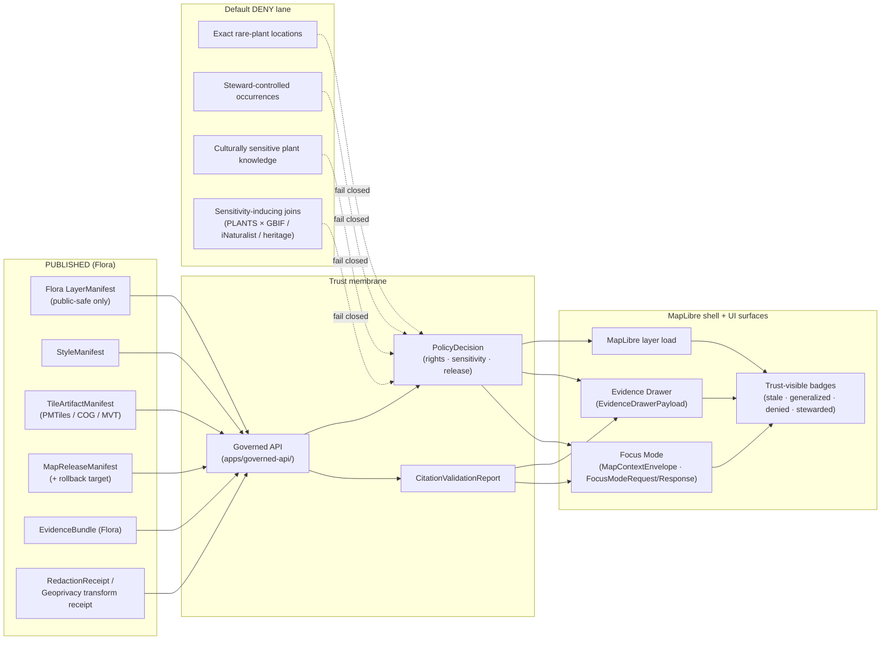

<!-- [KFM_META_BLOCK_V2]
doc_id: kfm://doc/flora-map-ui-contracts
title: Flora · Map UI Contracts
type: standard
version: v1
status: draft
owners: TODO — Flora steward + UI/AI steward
created: 2026-05-16
updated: 2026-05-16
policy_label: public
related:
  - docs/domains/flora/README.md
  - docs/architecture/trust-membrane.md
  - docs/doctrine/directory-rules.md
  - docs/standards/PROV.md
  - docs/standards/PMTILES.md
  - schemas/contracts/v1/domains/flora/
  - policy/domains/flora/
tags: [kfm, flora, map, ui, contracts, governed-ai, evidence-drawer, focus-mode]
notes:
  - All path and route claims are PROPOSED until verified against a mounted repo.
  - Conformance status of every contract is PROPOSED unless an ADR + mounted schema confirms it.
[/KFM_META_BLOCK_V2] -->

# Flora · Map UI Contracts

> How the **Flora** lane binds its released, public-safe objects to MapLibre, the Evidence Drawer, Focus Mode, and the rest of the trust membrane — without ever publishing exact sensitive plant locations or unsupported claims.


**Status:** Draft — Flora doctrine CONFIRMED; map binding implementation PROPOSED.
**Owners:** Flora steward · UI / AI steward (TODO names).
**Last updated:** 2026-05-16.

---

## 🧭 Quick jump

- [1. Scope and audience](#1-scope-and-audience)
- [2. Authority, status, and source basis](#2-authority-status-and-source-basis)
- [3. The Flora map surface at a glance](#3-the-flora-map-surface-at-a-glance)
- [4. Object families bound at the map surface](#4-object-families-bound-at-the-map-surface)
- [5. Sensitivity tiers and public-safe transforms](#5-sensitivity-tiers-and-public-safe-transforms)
- [6. Flora layer contracts (per viewing product)](#6-flora-layer-contracts-per-viewing-product)
- [7. `EvidenceDrawerPayload` — Flora projection](#7-evidencedrawerpayload--flora-projection)
- [8. `MapContextEnvelope` — Flora binding](#8-mapcontextenvelope--flora-binding)
- [9. `FocusModeRequest` / `FocusModeResponse` — Flora behavior](#9-focusmoderequest--focusmoderesponse--flora-behavior)
- [10. `FloraDecisionEnvelope` outcome grammar](#10-floradecisionenvelope-outcome-grammar)
- [11. Trust-visible UI states](#11-trust-visible-ui-states)
- [12. Cross-lane join handling at the map surface](#12-cross-lane-join-handling-at-the-map-surface)
- [13. Anti-patterns (Flora-specific)](#13-anti-patterns-flora-specific)
- [14. Validation, fixtures, and test requirements](#14-validation-fixtures-and-test-requirements)
- [15. Open questions and verification backlog](#15-open-questions-and-verification-backlog)
- [16. Related docs](#16-related-docs)

---

## 1. Scope and audience

**What this document is.** A *contract surface* spec — not an implementation — describing how Flora-domain release artifacts must reach the public map UI through the KFM trust membrane. It pins down:

- which Flora release objects are eligible for map binding,
- the shape and obligations of the four governed UI contracts MapLibre depends on (`LayerManifest`, `EvidenceDrawerPayload`, `MapContextEnvelope`, `FocusMode*`),
- how Flora sensitivity, rights, and review state filter what each of those contracts is allowed to expose,
- which finite outcomes (`ANSWER` / `ABSTAIN` / `DENY` / `ERROR`) Flora map surfaces must support, and
- the validators, fixtures, and rollback hooks every Flora map surface must satisfy before public release.

**Audience.** Domain stewards (Flora, Habitat, Fauna), governed-API and UI engineers, policy reviewers, and any developer wiring a Flora layer into the MapLibre shell, Evidence Drawer, or Focus Mode.

**What this document is *not*.** It is not a schema (those live in `schemas/contracts/v1/...`), not a policy file (`policy/domains/flora/...`), not a route inventory (the governed-API ADR owns that), and not a renderer-level styling spec (`StyleManifest` and `packages/maplibre/` own that).

> [!NOTE]
> Per the KFM **lifecycle invariant** — `RAW → WORK / QUARANTINE → PROCESSED → CATALOG / TRIPLET → PUBLISHED` — the map UI is a **`PUBLISHED`-only consumer**. Nothing on this page authorizes the map shell to read `RAW`, `WORK`, `QUARANTINE`, processed candidates, or canonical/internal stores.

[Back to top ↑](#-quick-jump)

---

## 2. Authority, status, and source basis

| Item | Value |
|---|---|
| **Authority of this doc** | Specifies how Flora binds to KFM map UI contracts. Subordinate to: Directory Rules, the Encyclopedia (`ENCY`), the Flora domain dossier (`DOM-FLORA`), the MapLibre Master (`MAP-MASTER`), and the Governed AI dossier (`GAI`). |
| **Status of doctrine herein** | **CONFIRMED** for all contract grammar, finite outcomes, sensitivity defaults, and trust-membrane invariants. |
| **Status of named paths, routes, schemas, tests** | **PROPOSED / NEEDS VERIFICATION** until inspected against the mounted repo. |
| **Lifecycle invariant** | `RAW → WORK / QUARANTINE → PROCESSED → CATALOG / TRIPLET → PUBLISHED` — promotion is a governed state transition, not a file move. |
| **Truth posture** | Cite-or-abstain. EvidenceBundle outranks tiles, popups, badges, screenshots, and AI text. |
| **Scope split** | Flora **owns** plant taxa, specimens, occurrences, communities, rare plants, invasives, phenology, ranges, and habitat associations. Flora **does not own** animal records, crop operations, soil canonical semantics, hydrology, or land ownership. |

**Source basis used to write this doc** (project knowledge only):

- KFM Encyclopedia §7.6 (Flora — mission, objects, viewing modes, AI rules).
- KFM Domains Culmination Atlas v1.1 — Flora chapter (sections C–N) and §20–§24 (cross-domain reference tables, decision-envelope grammar).
- KFM Unified Implementation Architecture Build Manual §6.5 (Flora lane scope, sensitivity posture, publication gates, verification backlog).
- KFM Whole-UI Governed AI Expansion Report (core schemas list and finite-outcome rendering rules).
- Master MapLibre Components, Functions, Features (`MAP-MASTER`) — `LayerManifest`, `EvidenceDrawerPayload`, `MapContextEnvelope`, `FocusModeRequest/Response`, `AIReceipt`, anti-patterns, trust-visible states, test plan.
- Directory Rules — §3 (deeper rule), §12 (Domain Placement Law), §13 (anti-patterns).
- KFM Pass-20 Idea Index — `KFM-IDX-POL-005` (rare-species geoprivacy + transform receipts), `KFM-IDX-API-002` (finite governed envelopes).

**External sources consulted:** none.

[Back to top ↑](#-quick-jump)

---

## 3. The Flora map surface at a glance

The Flora map binding is a **strict downstream consumer** of released artifacts. Every public claim resolves through `EvidenceBundle` before it can render as a consequential statement.



> [!IMPORTANT]
> **Map UI is not a truth surface.** It is an **alternate renderer of governed evidence**. Per Directory Rules §11, even Cesium / 3D consumes the same `EvidenceBundle` and `DecisionEnvelope` as 2D MapLibre — never a parallel truth path.

[Back to top ↑](#-quick-jump)

---

## 4. Object families bound at the map surface

The Flora lane consumes a small, well-known set of cross-cutting KFM object families. None of these are Flora-specific by definition; what is Flora-specific is **which lane's policy, sensitivity defaults, and EvidenceBundle composition** they carry.

| Family | Role at map surface | Owner / status | Cite |
|---|---|---|---|
| `SourceDescriptor` | Identifies source, role (observation / model / regulatory / aggregator / steward), rights, sensitivity, cadence. Flora-relevant sources include herbaria/specimen portals, GBIF, iNaturalist, NatureServe, USFWS, state rare-plant programs, vegetation surveys, RS vegetation indices, restoration project records. | Cross-cutting; CONFIRMED doctrine / PROPOSED schema. | ENCY §7.6.B; MAP-MASTER §11 |
| `LayerManifest` | Released layer metadata, IDs, source refs, style refs, evidence refs, policy labels, temporal scope, review state, release state. **Public-safe Flora release only.** | CONFIRMED doctrine / PROPOSED implementation. | MAP-MASTER §11; ENCY Appendix G |
| `StyleManifest` | Style JSON version, source/layer references, sprite/glyph refs, visual regression target. **Style filters MUST NOT be the only barrier to sensitive geometry.** | CONFIRMED doctrine / PROPOSED implementation. | MAP-MASTER §11; ML-062-035 |
| `TileArtifactManifest` | PMTiles / COG / MVT / MLT artifact digest, source digests, release state, cache invalidation, signature/attestation refs. | CONFIRMED doctrine / PROPOSED implementation. | MAP-MASTER §11 |
| `MapReleaseManifest` | Bundles `LayerManifest` + `StyleManifest` + `TileArtifactManifest` with `PolicyDecision`, attestations, correction lineage, and rollback target. | CONFIRMED doctrine / PROPOSED implementation. | MAP-MASTER §11 |
| `EvidenceBundle` | **Canonical**. Resolves from `EvidenceRef`; outranks tiles, popups, badges, screenshots, and AI text. | CONFIRMED doctrine / PROPOSED schema. | ENCY; MAP-MASTER §11 |
| `EvidenceDrawerPayload` | **Governed UI projection** of `EvidenceBundle` with citations, policy / review / release state, stale state, correction links. *Drawer is not canonical.* | CONFIRMED doctrine / PROPOSED schema. | ML-056-015; MAP-MASTER §11 |
| `MapContextEnvelope` | Bounded context to Focus Mode: camera, layer IDs, feature IDs, temporal snapshot, release refs, selected evidence refs, policy posture. | CONFIRMED doctrine / PROPOSED schema. | MAP-MASTER §11 |
| `FocusModeRequest` / `FocusModeResponse` | Evidence-bounded request / response with finite outcomes; no direct model client from the map shell. | CONFIRMED doctrine / PROPOSED schema. | MAP-MASTER §11; ML-056-018 |
| `AIReceipt` | Records model adapter, prompt/context envelope ids, evidence refs, policy checks, citation validation, finite outcome. **No raw chain-of-thought.** | CONFIRMED doctrine / PROPOSED schema. | MAP-MASTER §11; GAI |
| `CitationValidationReport` | Pass/fail closure object for Focus Mode answers, drawer rendering, and exports. | CONFIRMED doctrine / PROPOSED schema. | MAP-MASTER §11 |
| `PolicyDecision` | Allow / deny / abstain / error with reasons, obligations, sensitivity/rights posture. Required pre-render and pre-answer. | CONFIRMED doctrine / PROPOSED schema. | MAP-MASTER §11 |
| `PromotionDecision` | Gate results binding `MapReleaseManifest` to release eligibility and a rollback target. **Map serving must use it.** | CONFIRMED doctrine / PROPOSED schema. | MAP-MASTER §11 |
| `RedactionReceipt` / Geoprivacy transform receipt | Records public-safe geometry/attribute transform: input class, output class, method, reason, policy, reviewer, residual risk. | CONFIRMED doctrine (Flora) / PROPOSED implementation. | ATLAS §C; KFM-IDX-POL-005 |
| `RollbackCard` + cache invalidation record | Pointer to prior release manifest, root hash, tile checksum set; mandatory before public release. | CONFIRMED doctrine / PROPOSED implementation. | MAP-MASTER §11; ENCY Appendix E |

### Flora-specific object payloads visible at the map surface

These are the canonical Flora object families that *populate* `EvidenceBundle` instances bound to map features. The map surface never renders them directly — only their public-safe `EvidenceDrawerPayload` projections.

`PlantTaxon` · `SpecimenRecord` · `FloraOccurrence` · `RarePlantRecord` · `VegetationCommunity` · `InvasivePlantRecord` · `PhenologyObservation` · `RangePolygon` · `HabitatAssociation` · `BotanicalSurvey` · `RestorationPlanting` · `DistributionSurface` · `FloraTaxon Crosswalk` · `SourceRole` · `RedactionReceipt`.

> [!NOTE]
> Every Flora object listed above is **CONFIRMED** as doctrine in ENCY §7.6.C and ATLAS §8.C-E. Field-level realization (the schema instance) is **PROPOSED** until verified in `schemas/contracts/v1/domains/flora/` against a mounted repo.

[Back to top ↑](#-quick-jump)

---

## 5. Sensitivity tiers and public-safe transforms

The Flora lane's defining sensitivity rule is unconditional: **exact rare-plant, steward-controlled, and culturally sensitive plant locations fail closed unless a documented geoprivacy transform, review state, and `RedactionReceipt` permit release** (ENCY §7.6; DOM-FLORA §§11-12; KFM-IDX-POL-005).

### 5.1 Sensitivity tiers (PROPOSED tier names; CONFIRMED behavior)

| Tier | Examples (CONFIRMED domain) | Default public exposure | Required to publish |
|---|---|---|---|
| **T0 — Open** | Common species occurrence; published vegetation community polygons from federal/state surveys; phenology aggregates; restoration project records with public license. | `ANSWER` permitted with normal evidence, policy, release support. | Standard `EvidenceBundle` + `MapReleaseManifest`. |
| **T1 — Generalized** | Range polygons; county/HUC summaries; vegetation index rasters; public-safe rare-plant range product. | `ANSWER` permitted *only* through generalized derivative; never exact source geometry. | `RedactionReceipt` recording the transform; review state where required. |
| **T2 — Stewarded** | Steward-controlled occurrences; precision-restricted survey detail; review-pending invasive records. | `ABSTAIN` for public callers; restricted-tier exposure to authorized callers only. | `ReviewRecord` + access role + steward sign-off. |
| **T3 — Deny by default** | Exact rare-plant locations; exact culturally sensitive plant knowledge; PLANTS × GBIF / iNaturalist / heritage joins that induce sensitivity; restricted-rights aggregator records pending review. | `DENY` to public surface; deny reason returned; no exact coordinates leak through Evidence Drawer or Focus Mode. | Either denied indefinitely, or transformed into a T1 derivative with a `RedactionReceipt` + review approval. |

> [!WARNING]
> **Join-induced sensitivity is a `DENY` condition for the *product*, even when each input is individually safe.** A benign PLANTS taxon page joined to GBIF or iNaturalist occurrence rows or a heritage dataset can produce a sensitive derivative; the resulting layer, popup, drawer payload, and Focus Mode answer all inherit the deny posture until the derivative itself is reviewed and transformed.

### 5.2 Geoprivacy transform menu (PROPOSED catalog)

Every public-facing Flora geometry traceable to a sensitive input MUST pass through one of the following transforms and emit a `RedactionReceipt`. Style-only hiding (`paint`/`filter` only) is **not** an acceptable transform — generalization happens **before** tile build.

| Transform | Method | Example use | Receipt content |
|---|---|---|---|
| `suppress` | Drop feature entirely. | Steward-flagged rare-plant occurrence with no public-safe derivative. | input class, reason code, policy ref, reviewer. |
| `generalize_to_grid` | Snap to coarse grid (e.g., H3 ring or quad). | Rare plant centroid → coarse cell; cell area large enough to defeat re-identification. | grid spec, residual locational risk. |
| `generalize_to_watershed` | Snap to HUC (12/10/8) boundary. | Riparian rare-plant occurrence → HUC summary. | HUC level, count of contributing observations. |
| `generalize_to_county` | Snap to county polygon. | Public-safe rare-plant range product. | county FIPS, observation count, source mix. |
| `buffer` | Replace point with a buffer disk of radius *r*. | Sensitive specimen point → reviewer-set buffer. | radius, units, policy ref. |
| `jitter_with_constraints` | Randomize within a bounded envelope. | Used **only** with review and explicit policy ref; not a default. | seed, max distance, policy ref, reviewer. |
| `delayed_publication` | Embargo publication for *n* days/seasons. | Phenology / occurrence data with seasonal sensitivity. | embargo expiry, justification. |
| `steward_only_exact` | Exact value retained for stewarded view; no public derivative emitted. | Critically endangered taxon. | access role, review record id. |

> [!IMPORTANT]
> Each transform MUST emit a `RedactionReceipt` capturing **input class, output class, method, parameters, policy ref, reviewer, residual risk**. The receipt is referenced by `EvidenceBundle.transform_refs` and by the `MapReleaseManifest`. Generalization without a receipt is treated as **unreviewed redaction** and blocks promotion.

[Back to top ↑](#-quick-jump)

---

## 6. Flora layer contracts (per viewing product)

The Atlas §G and Encyclopedia §7.6.E enumerate the Flora viewing products. The table below pins each to a contract envelope and a sensitivity-tier requirement.

| Viewing product | Primary geometry | Sensitivity tier | Required transform | `LayerManifest` requirements | Drawer click → resolves to |
|---|---|---|---|---|---|
| Plant species page (canonical taxon entry) | n/a (entity surface) | T0 | none | `LayerManifest.entity_kind = PlantTaxon`; release_state = `PUBLISHED`. | `EvidenceBundle` for that `PlantTaxon`. |
| Generalized occurrence layer | Point or generalized cell | T0–T1 | `generalize_to_grid` / `generalize_to_county` if any contributing record is sensitive | source role(s) recorded; observation counts; transform refs if T1. | `EvidenceBundle` with `FloraOccurrence` refs (public-safe). |
| Public range / distribution layer | Polygon (range) or raster (DistributionSurface) | T0–T1 | derivative only — never raw exact points | uncertainty surface; derivation receipts; provenance. | `EvidenceBundle` with `RangePolygon` / `DistributionSurface` refs. |
| Vegetation community layer | Polygon | T0 | none (federal/state surveys are typically T0) | source role = observation / aggregator; community classification scheme cited. | `EvidenceBundle` with `VegetationCommunity` refs. |
| Invasive plant layer | Point / polygon | T0–T2 | `suppress` for review-pending; `generalize_to_*` if join-induced sensitivity | invasive status, observation cadence, source role discipline. | `EvidenceBundle` with `InvasivePlantRecord` refs. |
| Phenology / condition layer | Time-series at site or raster vegetation index | T0–T1 | `delayed_publication` where seasonal sensitivity applies | temporal scope, valid/source/release time distinct. | `EvidenceBundle` with `PhenologyObservation` refs. |
| Habitat association summary | Polygon (joined to Habitat lane) | T0 | none; cross-lane join preserves Habitat ownership | `LayerManifest.related_lanes = [habitat]`; ownership and `EvidenceBundle` of habitat patch preserved. | `EvidenceBundle` including `HabitatAssociation` ref + Habitat lane refs. |
| Public-safe rare-plant product | Generalized polygon or cell | T1 (always) | `generalize_to_watershed` or `generalize_to_county` | mandatory `RedactionReceipt` ref; review record id; rationale citation. | `EvidenceBundle` projected through redaction; **never** the underlying exact geometry. |
| Restoration planting layer | Point or polygon | T0–T2 | by source license; suppress where rights ambiguous | rights / license recorded per feature; project consent metadata. | `EvidenceBundle` with `RestorationPlanting` refs. |
| Review-candidate view | varies | n/a (internal) | n/a — **NOT public** | access role gated; `release_state != PUBLISHED`. | reviewer-only payload; does not appear on public surface. |

> [!NOTE]
> Every row is **CONFIRMED** as a doctrinal viewing product. Every named field on `LayerManifest` is **PROPOSED**; specific repo field names and types require schema verification.

<details>
<summary><strong>Reference: minimal Flora <code>LayerManifest</code> shape (PROPOSED, illustrative)</strong></summary>

```json
{
  "layer_id": "flora.range.<taxon_id>.v1",
  "domain": "flora",
  "entity_kind": "RangePolygon",
  "release_state": "PUBLISHED",
  "policy_label": "public",
  "sensitivity_tier": "T1",
  "source_refs": ["src://flora/<source_id>@<source_head>"],
  "style_ref": "style://flora/<style_id>@<style_digest>",
  "tile_refs": ["tile://flora/<artifact_id>@<root_hash>"],
  "evidence_refs": ["evidence://flora/<bundle_id>"],
  "transform_refs": ["receipt://redaction/<receipt_id>"],
  "review_state": "approved",
  "temporal": {
    "source_time": "<iso8601>",
    "valid_time": {"start": "...", "end": "..."},
    "retrieval_time": "<iso8601>",
    "release_time": "<iso8601>"
  },
  "rollback_target": "release://flora/<prior_release_id>",
  "correction_lineage": [],
  "promotion_decision_ref": "decision://promotion/<id>"
}
```

This shape is illustrative only. The authoritative schema home is `schemas/contracts/v1/...` per Directory Rules §7.4; the Flora-specific home is **PROPOSED** as `schemas/contracts/v1/domains/flora/` pending mounted-repo verification.

</details>

[Back to top ↑](#-quick-jump)

---

## 7. `EvidenceDrawerPayload` — Flora projection

The drawer is a **governed UI projection** of `EvidenceBundle`. The Flora projection has three Flora-specific obligations on top of the generic schema:

1. **Sensitivity filtering before projection.** No exact rare-plant coordinates, no steward-only attributes, no culturally sensitive descriptors. If a contributing record is T3, the drawer payload either projects a generalized derivative (with `RedactionReceipt` visible) or returns `DENY`.
2. **Source-role disclosure is mandatory.** Flora aggregator sources (GBIF, iNaturalist) MUST be tagged as aggregator-of-observations, not as primary observation authorities. Specimen portals MUST be tagged as specimen sources. NatureServe / USFWS / state rare-plant programs MUST be tagged as legal/conservation-status sources where applicable.
3. **Transform receipts are first-class.** When a feature is generalized, the drawer projection MUST surface the `RedactionReceipt` — input class, output class, method, residual risk — in a way the user can inspect.

### Outcomes returned by the Flora drawer

| Outcome | When | What the drawer renders |
|---|---|---|
| `ANSWER` | `EvidenceBundle` resolved; `PolicyDecision = allow`; release state `PUBLISHED`; review state recorded where required. | Citations, source roles, temporal scope, policy label, review state, release state, correction links, transform receipts if any. |
| `ABSTAIN` | `EvidenceBundle` missing or insufficient; or evidence stale and no released alternative; or AI cannot cite. | Non-substantive note with reason; no claim emitted; offers correction / "request review" path where applicable. |
| `DENY` | Policy, rights, sensitivity (T3), or release state blocks the answer. | Returns deny reason + alternative non-restricted surface where one exists (e.g., "a generalized range layer exists"); never reveals the blocked geometry or attribute. |
| `ERROR` | Schema malformed, evidence ref unresolvable, infrastructure failure. | Finite, actionable error; never silent fallback to a different lane. |

> [!CAUTION]
> **Popups MAY summarize. The drawer MUST resolve.** A MapLibre popup is a UI cue, not an evidence surface. Any consequential Flora claim (range, rarity, conservation status, invasive flag, phenology trend) MUST be backed by an `EvidenceDrawerPayload` resolution — the popup alone is not allowed to carry the claim (MAP-MASTER §N; ML-061-061).

[Back to top ↑](#-quick-jump)

---

## 8. `MapContextEnvelope` — Flora binding

The `MapContextEnvelope` is the bounded, typed context passed from the map shell into Focus Mode. It carries map camera, layer IDs, feature IDs, temporal snapshot, release refs, and evidence refs — **never** raw features, RAW/WORK store paths, model-input PII, or unreleased candidate data.

### Flora-specific envelope obligations

- `layer_ids` MUST come from a `MapReleaseManifest` currently in `PUBLISHED` state.
- `feature_ids` MUST be stable, deterministic identifiers from the released layer (e.g., `promoteId` bound in `LayerManifest`).
- `evidence_refs` MUST resolve to `EvidenceBundle` instances in the Flora `CATALOG / TRIPLET` projection.
- `temporal.snapshot` MUST distinguish source / valid / retrieval / release time; collapsing these is a validation failure (MAP-MASTER P; ML-061-092).
- `policy_posture` MUST carry the strictest sensitivity tier across the included layers — Focus Mode reasons over the policy posture; it does not re-derive policy itself.

<details>
<summary><strong>Reference: minimal Flora <code>MapContextEnvelope</code> (PROPOSED, illustrative)</strong></summary>

```json
{
  "envelope_id": "ctx-<uuid>",
  "domain": "flora",
  "camera": {"center": [-98.5, 38.5], "zoom": 7, "bearing": 0, "pitch": 0},
  "layer_ids": [
    "flora.range.asclepias-meadii.v1",
    "flora.vegetation-community.tallgrass.v3"
  ],
  "feature_ids": ["flora.range.asclepias-meadii.v1::feat-0042"],
  "temporal": {
    "snapshot_time": "2026-05-16T00:00:00Z",
    "source_time": "2025-09-01T00:00:00Z",
    "valid_time": {"start": "2025-01-01", "end": "2025-12-31"},
    "retrieval_time": "2025-10-04T00:00:00Z",
    "release_time": "2026-04-22T00:00:00Z"
  },
  "release_refs": ["release://flora/<id>"],
  "evidence_refs": ["evidence://flora/<bundle_id>"],
  "policy_posture": {
    "label": "public",
    "max_sensitivity_tier": "T1",
    "rights_posture": "public_safe_derivative"
  }
}
```

</details>

[Back to top ↑](#-quick-jump)

---

## 9. `FocusModeRequest` / `FocusModeResponse` — Flora behavior

Flora Focus Mode is an **evidence-bounded synthesis surface** over a `MapContextEnvelope` plus resolved `EvidenceBundle` references. It composes typed building blocks rather than free-form map text (ML-056-016 / ML-056-017).

### Allowed AI behavior (CONFIRMED doctrine; PROPOSED implementation)

- Evidence-bounded **summarization** over released Flora `EvidenceBundle` instances.
- **Citation-backed explanation** of taxonomy, conservation status, ecological context, source-role distinctions.
- **Evidence comparison** across aggregators (e.g., NatureServe status vs. state rare-plant program status).
- **Drafting steward-review notes**.
- **Anomaly and limitation explanation** (e.g., "this is a generalized derivative; the underlying record is steward-restricted").

### Required denials

- **DENY** direct `RAW` / `WORK` / `QUARANTINE` access.
- **DENY** sensitive-location exposure (T3) — including reverse inference from generalized derivatives.
- **DENY** uncited authoritative claims.
- **DENY** rendered-feature-only answers — features are candidates; `EvidenceBundle` carries truth support.
- **DENY** any path that would substitute Focus Mode output for a release decision.

### Finite outcomes

`FocusModeResponse.outcome ∈ { ANSWER, ABSTAIN, DENY, ERROR }`. Each outcome MUST be paired with an `AIReceipt` recording: model adapter, prompt/context envelope id, evidence refs, citation validation report, policy result, output digest, finite outcome. **No raw chain-of-thought is persisted as truth.**

> [!IMPORTANT]
> **No direct model client from the map shell.** Focus Mode calls go through `apps/governed-api/` (or equivalent governed-AI route), behind evidence resolution and policy checks. The browser cannot reach the model runtime directly. (MAP-MASTER §12; PROPOSED route.)

[Back to top ↑](#-quick-jump)

---

## 10. `FloraDecisionEnvelope` outcome grammar

The Atlas §J introduces a per-domain `FloraDecisionEnvelope` as a **PROPOSED** finite-outcome envelope for Flora feature/detail resolution at the governed-API surface. It inherits the master `DecisionEnvelope` grammar from §24.3.

| Field | Required | Notes |
|---|---|---|
| `decision_id` | yes | Stable identifier; enables audit and rollback drill. |
| `outcome` | yes | One of `ANSWER`, `ABSTAIN`, `DENY`, `ERROR` (plus validator outcomes `PASS`/`FAIL`/`HOLD` where the envelope is used internally). |
| `domain` | yes | `flora`. |
| `policy_family` | yes | e.g., `flora.public_release`, `flora.sensitivity`, `flora.rights`. |
| `reasons` | yes when not `ANSWER` | Reason codes (e.g., `missing_evidence`, `unresolved_evidence_ref`, `restricted_exact_geometry`, `unknown_rights`, `stale_evidence`, `review_pending`). |
| `obligations` | yes when `ANSWER` or `HOLD` | E.g., `hold:steward_review`, `generalize:to_county`, `redact:attribute`. |
| `evidence_refs` | yes when `ANSWER` | Resolved `EvidenceRef` set. |
| `policy_decision_ref` | yes | Pointer to the `PolicyDecision`. |
| `citation_validation_ref` | yes when `ANSWER` is publicly emitted | Pointer to `CitationValidationReport`. |
| `release_state` | yes | `PUBLISHED` is the only valid value for public callers. |
| `evaluated_at` | yes | ISO 8601 timestamp. |
| `rollback_target` | yes | Pointer to prior release manifest / root hash. |

> [!NOTE]
> The Atlas marks `FloraDecisionEnvelope` and its exact route **PROPOSED governed API surface; exact route UNKNOWN**. The shape above synthesizes the master `DecisionEnvelope` grammar with Flora-specific reason codes. Route, field names, and JSON Schema home are subject to ADR-S-15-class review.

[Back to top ↑](#-quick-jump)

---

## 11. Trust-visible UI states

Trust badges are **trust-visible state**, not proof. They tell the user something is verified, stale, generalized, restricted, or denied — and link out to the receipts that *do* carry proof. **Badges MUST NOT substitute for the Evidence Drawer** (MAP-MASTER §S; ML-061-090, ML-061-139, ML-061-140).

| State | Trigger | Public UI rendering | Drawer behavior |
|---|---|---|---|
| **Verified** | Release manifest validates; signature / attestation OK; `CitationValidationReport` passes. | Standard layer rendering; verified badge optional. | `ANSWER` with full citations. |
| **Stale** | Source cadence exceeded; `If-None-Match` / `Last-Modified` indicates source has not refreshed; release time older than freshness threshold. | Stale badge with timestamp; layer remains visible. | `ANSWER` (with stale caveat) or `ABSTAIN`, depending on policy. |
| **Generalized** | A `RedactionReceipt` is attached; geometry/attribute was transformed before tile build. | "Generalized" chip; drawer surfaces transform method and residual risk. | `ANSWER` with receipt visible. |
| **Stewarded / Restricted** | T2 or T3 with approved restricted-tier access. | Restricted-tier chip for authorized callers; **invisible** to anonymous public callers. | `ANSWER` for authorized callers; `DENY` (with non-restricted alternative) for public. |
| **Unknown / Failed verification** | Signature / digest / EvidenceRef does not resolve. | Distinct visual treatment (not "verified"); layer may degrade to cached/stale fallback per policy. | `ERROR` or `ABSTAIN`. |
| **Denied** | `PolicyDecision = deny`; rights, sensitivity, or release state blocks the answer. | Layer not rendered; deny reason surfaced. | `DENY` with reason code and alternative surface where one exists. |
| **Decommissioned / Offline** | Source registry marks source as decommissioned. | Inactive / decommissioned chip; layer in archival state. | `ABSTAIN` with archival note. |

### Accessibility obligations (CONFIRMED doctrine)

- Trust badges MUST pass **keyboard**, **contrast**, **badge-state**, and **screen-reader** checks.
- Drawer image cards (e.g., specimen images) MUST carry **alt text** and **captions** drawn from source metadata; missing alt text triggers an accessibility regression check (ML-064-091).
- Sensitive symbols and locality-restricted UI elements MUST follow the cultural-symbol standards (ML-059-058, ML-059-068).

[Back to top ↑](#-quick-jump)

---

## 12. Cross-lane join handling at the map surface

Flora touches Habitat, Fauna, Soil/Hydrology, Agriculture, Hazards, and Land Stewardship through governed joins. The **ownership** of the joined claim never crosses lanes (Flora owns plant records; Habitat owns habitat patches; Fauna owns animal records; and so on).

| Flora ↔ lane | Relation | Map UI obligation |
|---|---|---|
| Flora ↔ **Habitat** | Habitat association / vegetation community context. | Map join preserves Habitat-lane `EvidenceBundle`; vegetation community polygons cite Habitat ownership; sensitivity inherited from the strictest contributing tier. |
| Flora ↔ **Fauna** | Pollinator, food-web, invasive, biodiversity context. | Joined map products inherit Fauna-lane sensitivity defaults for nests/dens/roosts/hibernacula/spawning sites — even if the Flora component is T0. |
| Flora ↔ **Soil / Hydrology** | Substrate, wetland, riparian, drought context. | Soil and Hydrology canonical semantics are preserved; Flora map products that join SSURGO or HUC layers carry the joined ownership through to the drawer. |
| Flora ↔ **Hazards** | Fire, drought, flood, smoke, vegetation stress. | KFM is **never an alert authority** (DOM-HAZ doctrine); joined Flora ↔ Hazards layers carry operational disclaimer posture. |
| Flora ↔ **Agriculture** | Crop / cultivar / restoration context. | Aggregation receipts central; private-join denial defaults preserved from Agriculture lane. |
| Flora ↔ **People / Land** | Ethnobotanical context; traditional plant knowledge. | Living-person, DNA, and person-parcel lanes deny-default; ethnobotanical context governance is sensitivity-laden — DENY public exposure unless reviewed. |

> [!WARNING]
> **Join-induced sensitivity (revisited).** Even a T0 Flora layer joined to T2/T3 records in another lane produces a T2/T3 derivative. The map UI MUST inherit the strictest sensitivity tier of any contributing lane — silently relaxing sensitivity to "the Flora layer's" tier is a publication-blocking anti-pattern.

[Back to top ↑](#-quick-jump)

---

## 13. Anti-patterns (Flora-specific)

The map UI surface for Flora amplifies any leak. The list below is the Flora projection of MAP-MASTER §X anti-patterns plus the Pass-20 sensitivity discipline.

| Anti-pattern | Why it fails | Required posture |
|---|---|---|
| Hiding exact rare-plant geometry with style filters only. | The exact geometry still sits in the published tile; only the symbology is hidden. Re-styling, exports, or downloaders defeat the filter. | Generalize / suppress **before** tile build; emit `RedactionReceipt`; use restricted-tier publication for exact data. |
| Popups as Evidence Drawer. | Popup text is a UI cue, not an audit surface; it cannot carry citation, policy, review, or release state. | Popup MAY summarize; drawer MUST resolve every consequential claim. |
| Aggregator records used as observation authority. | GBIF / iNaturalist are aggregator-of-observations, not the primary authority for a specific source role. | Tag source roles correctly in `LayerManifest` and `EvidenceBundle`; preserve specimen-portal / aggregator / model / regulatory distinctions. |
| Treating the rendered tile as truth. | Tiles are derived artifacts; truth lives in `EvidenceBundle`. | Click → drawer → bundle; no exports or screenshots without preserved citation context. |
| Focus Mode answer from rendered features alone. | Rendered features are candidates; only `EvidenceBundle` carries support. | Focus Mode MUST resolve `EvidenceBundle` and pass `CitationValidationReport`; otherwise `ABSTAIN`. |
| Public release without `RedactionReceipt` for generalized data. | The transform is invisible to reviewers and consumers; correction lineage is broken. | Every generalized derivative carries a `RedactionReceipt`; the drawer surfaces it. |
| Silently relaxing sensitivity on cross-lane joins. | Sensitivity of the *product* must be the strictest of the inputs. | Inherit strictest tier across all contributing lanes; emit join-receipt where material. |
| Treating verification badges as policy decisions. | Badges are trust-visible state, not authority. | `PromotionDecision` + `PolicyDecision` + `MapReleaseManifest` carry release authority; badges only render that state. |
| Direct model client from the map shell. | Bypasses evidence, policy, and audit. | Focus Mode goes through the governed API; the map shell never reaches the model runtime directly. |
| Uncited export or screenshot. | Detaches a claim from its evidence and release context. | Exports preserve citations, manifest IDs, and verification state; otherwise the export is denied. |

[Back to top ↑](#-quick-jump)

---

## 14. Validation, fixtures, and test requirements

Each item below is **PROPOSED** at the implementation layer; the **doctrinal requirement** is CONFIRMED.

### 14.1 Schema and contract validation

- `LayerManifest`, `StyleManifest`, `TileArtifactManifest`, `MapReleaseManifest`, `EvidenceBundle`, `EvidenceDrawerPayload`, `MapContextEnvelope`, `FocusModeRequest`, `FocusModeResponse`, `AIReceipt`, `PolicyDecision`, `PromotionDecision`, `RunReceipt`, `RedactionReceipt` — schema-validated against `schemas/contracts/v1/...` (PROPOSED Flora home: `schemas/contracts/v1/domains/flora/`).
- Citation closure: every public Flora `ANSWER` paired with a passing `CitationValidationReport`.

### 14.2 Source-role and rights validation

- Every Flora source has a stable `source_id`, role, rights/license, sensitivity class, and cadence in the source registry.
- Aggregator-as-authority test: aggregator sources cannot be used as the primary observation authority for source-role-specific claims.

### 14.3 Sensitivity and geoprivacy validation

- **Exact sensitive geometry deny fixture**: an exact rare-plant point cannot publish or render publicly; style-only hiding fails the test.
- **Join-induced sensitivity fixture**: PLANTS × GBIF / iNaturalist / heritage join produces a sensitive derivative; the derivative is denied or generalized.
- **Generalization receipt presence**: every T1 release carries a resolvable `RedactionReceipt`.
- **CARE / locality-restriction deny fixture**: locality-restricted records deny exact public exposure; restricted-tier or generalized paths required.

### 14.4 Lifecycle and route validation

- **No public RAW path**: the browser cannot load `RAW` / `WORK` / `QUARANTINE` / candidate / canonical-store data.
- **No unreleased tile load**: PMTiles / COG / MVT load only when `release_state`, policy, rights, sensitivity, evidence refs, hashes, and rollback target are all valid.
- **No direct model client**: the map shell cannot reach the model runtime directly; Focus Mode goes through the governed API.
- **No uncited export**: exports and screenshots preserve citation, manifest id, and verification state, or are denied.

### 14.5 Temporal validation

- Time slider / version-lock fixture distinguishes source / valid / retrieval / release time.
- Stale-source fixture: stale headers trigger stale badge, `ABSTAIN`, or `DENY` per policy.
- Ambiguous-timestamp fixture: malformed timestamps fail validation or enter quarantine.

### 14.6 Accessibility regressions

- Keyboard, contrast, badge-state, and screen-reader checks for trust-visible badges.
- Missing-alt-text deny/warn for drawer image cards (specimen photos, vegetation imagery).

### 14.7 Rollback and correction

- Rollback drill: every public Flora release has a `RollbackCard` and reachable prior release; cache invalidation record present.
- Correction-lineage fixture: a `CorrectionNotice` propagates to dependent derivatives, releases, and tiles.

> [!NOTE]
> No claim is made here that any of these validators / fixtures **currently exist** in the repo. The doctrinal requirement is CONFIRMED; presence in `tests/domains/flora/` and `fixtures/domains/flora/` is **NEEDS VERIFICATION**.

[Back to top ↑](#-quick-jump)

---

## 15. Open questions and verification backlog

| Item | Status | Evidence that would settle it |
|---|---|---|
| Exact `FloraDecisionEnvelope` JSON Schema and field names. | PROPOSED | Mounted `schemas/contracts/v1/domains/flora/` schemas + ADR confirming the envelope shape. |
| Governed-API route names for Flora feature/detail, Flora layer manifest, Flora Evidence Drawer payload, Flora Focus Mode answer. | UNKNOWN | Route inventory ADR (per `KFM-IDX-API-001` recommendation); `apps/governed-api/` router config. |
| Exact geoprivacy thresholds (cell size for `generalize_to_grid`; buffer radius for sensitive-point buffering; HUC level for watershed generalization). | NEEDS VERIFICATION | Mounted `policy/domains/flora/` rule set with steward sign-off; KFM-IDX-POL-005 EXP-011 work. |
| Steward review process and review queue for rare-plant promotion. | NEEDS VERIFICATION | Mounted `policy/review/` config + `ReviewRecord` schemas + a steward roster. |
| Cesium / 3D parity for Flora layers. | UNKNOWN | Scene admission policy + parity tests showing identical `EvidenceBundle` / `DecisionEnvelope` consumption in 2D and 3D. |
| `RedactionReceipt` exact schema home and field set. | PROPOSED | Mounted schema; ADR fixing receipt fields (input class, output class, method, params, policy ref, reviewer, residual risk). |
| Cross-lane join-receipt object family (does it exist? Or is it a property of `EvidenceBundle`?). | UNKNOWN | ADR or schema indicating where join-induced sensitivity is recorded. |
| PLANTS × GBIF / iNaturalist / heritage join policy. | NEEDS VERIFICATION | Mounted policy + fixture proving the join is denied or transformed before public release. |
| AI adapter inventory and AIReceipt fields. | NEEDS VERIFICATION | Mounted `apps/governed-api/` adapter list; AIReceipt schema. |
| Trust-visible badge taxonomy (exact state enum, icons, accessibility metadata). | PROPOSED | Mounted UI components in `packages/ui/` + visual regression suite. |
| Mapping from Flora `RarePlantRecord` / `RedactionReceipt` to the public-safe rare-plant product layer. | PROPOSED | Mounted pipeline spec (`pipeline_specs/flora/`) and an end-to-end fixture. |
| `PROV.md` vs `PROVENANCE.md` naming. | NEEDS VERIFICATION | ADR resolution (open elsewhere in KFM corpus). |

[Back to top ↑](#-quick-jump)

---

## 16. Related docs

- [`docs/domains/flora/README.md`](./README.md) — Flora domain README and orientation (TODO link).
- [`docs/domains/flora/SOURCE_INTAKE.md`](./SOURCE_INTAKE.md) — Flora source intake and source-role discipline (TODO link).
- [`docs/domains/flora/SENSITIVITY_POLICY.md`](./SENSITIVITY_POLICY.md) — Flora sensitivity tiers and review process (TODO link).
- [`docs/runbooks/flora/SOURCE_REFRESH_RUNBOOK.md`](../../runbooks/flora/SOURCE_REFRESH_RUNBOOK.md) — Flora source-refresh runbook (TODO link).
- [`docs/architecture/trust-membrane.md`](../../architecture/trust-membrane.md) — KFM trust membrane and governed-API doctrine.
- [`docs/doctrine/directory-rules.md`](../../doctrine/directory-rules.md) — Directory Rules (placement authority).
- [`docs/doctrine/lifecycle-law.md`](../../doctrine/lifecycle-law.md) — `RAW → PUBLISHED` lifecycle law.
- [`docs/standards/PROV.md`](../../standards/PROV.md) — W3C PROV-O / PAV provenance profile.
- [`docs/standards/PMTILES.md`](../../standards/PMTILES.md) — PMTiles v3 governance and conformance.
- [`docs/standards/OGC-API-TILES.md`](../../standards/OGC-API-TILES.md) — OGC API — Tiles delivery standard.
- [`docs/atlases/maplibre-master.md`](../../atlases/maplibre-master.md) — MapLibre Master atlas (TODO link).

---

<sub>Last updated: 2026-05-16 · Doc id: `kfm://doc/flora-map-ui-contracts` · Status: draft · [Back to top ↑](#-quick-jump)</sub>
