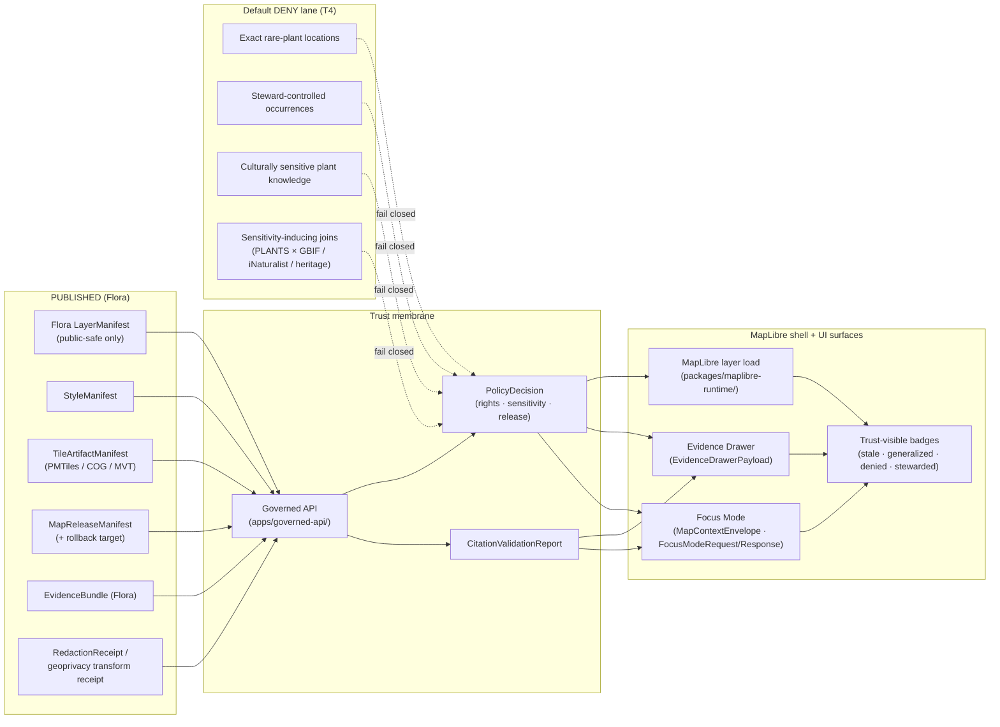

<!-- [KFM_META_BLOCK_V2]
doc_id: kfm://doc/flora-map-ui-contracts
title: Flora · Map UI Contracts
type: standard
version: v1.1
status: draft
owners: <flora domain steward> · <UI/AI steward>
created: 2026-05-16
updated: 2026-06-03
policy_label: public
related:
  - ai-build-operating-contract.md                 # CONFIRMED canonical operating contract (CONTRACT_VERSION 3.0.0)
  - directory-rules.md                             # CONFIRMED path authority (§6.4, §7.4, §11 v1.3 sole-renderer, §12, §13)
  - docs/domains/flora/README.md                   # NEEDS VERIFICATION
  - docs/domains/flora/IDENTITY_MODEL.md           # companion identity charter (mirrors envelope + object-family decisions)
  - docs/architecture/trust-membrane.md            # NEEDS VERIFICATION
  - docs/architecture/maplibre-3d.md               # CONFIRMED authored; sole-renderer doctrine (renderer-decision ADR PROPOSED)
  - docs/standards/PROV.md                         # NEEDS VERIFICATION
  - docs/standards/PMTILES.md                      # NEEDS VERIFICATION
  - schemas/contracts/v1/map/                       # PROPOSED cross-cutting map-contract home (LayerManifest, StyleManifest, …)
  - schemas/contracts/v1/ui/                        # PROPOSED cross-cutting UI-contract home (EvidenceDrawerPayload, MapContextEnvelope)
  - schemas/contracts/v1/flora/                      # PROPOSED Flora object-family schema home (Encyclopedia §7.6)
  - policy/sensitivity/flora/                        # CONFIRMED Flora sensitivity-policy home (Encyclopedia §7.6 / Atlas Ch. 24.13)
tags: [kfm, flora, map, ui, contracts, governed-ai, evidence-drawer, focus-mode]
notes:
  # CONTRACT_VERSION pin: this doc is doctrine-adjacent; it tracks ai-build-operating-contract.md v3.0.0.
  # Sensitivity scheme corrected to the canonical FIVE-tier T0–T4 register (Atlas Ch. 24.5.1); the prior four-tier T0–T3 form put DENY at the wrong tier.
  # Map UI contracts are CROSS-CUTTING (map/, ui/, evidence/, release/, proofs/), not Flora-domain-local; schema homes corrected per MapLibre Master v2.1.
  # Renderer doctrine corrected to v1.3 sole-renderer (MapLibre via packages/maplibre-runtime/); Cesium is removed doctrine. Renderer-decision ADR is PROPOSED (number pending; OPEN-DR-10).
  # Runtime shape aligned to RuntimeResponseEnvelope (contract §8); bespoke FloraDecisionEnvelope flagged CONFLICTED / migration-tracked.
  # All path and route claims are PROPOSED / NEEDS VERIFICATION until verified against a mounted repo.
[/KFM_META_BLOCK_V2] -->

# 🌿 Flora · Map UI Contracts

> How the **Flora** lane binds its released, public-safe objects to MapLibre, the Evidence Drawer, Focus Mode, and the rest of the trust membrane — without ever publishing exact sensitive plant locations or unsupported claims.

[](#)
[](#)
[](#)
[](#)
[](#)
[](#)
[](#)
[](#)

| Status | Owners | Contract | Last updated |
|---|---|---|---|
| Draft — Flora doctrine CONFIRMED; map binding PROPOSED | `<flora domain steward>` · `<UI/AI steward>` | `CONTRACT_VERSION = "3.0.0"` | 2026-06-03 |

---

## 🧭 Quick jump

- [1. Scope and audience](#1-scope-and-audience)
- [2. Authority, status, and source basis](#2-authority-status-and-source-basis)
- [3. The Flora map surface at a glance](#3-the-flora-map-surface-at-a-glance)
- [4. Object families bound at the map surface](#4-object-families-bound-at-the-map-surface)
- [5. Sensitivity tiers and public-safe transforms](#5-sensitivity-tiers-and-public-safe-transforms)
- [6. Flora layer contracts (per viewing product)](#6-flora-layer-contracts-per-viewing-product)
- [7. `EvidenceDrawerPayload` — Flora projection](#7-evidencedrawerpayload--flora-projection)
- [8. `MapContextEnvelope` — Flora binding](#8-mapcontextenvelope--flora-binding)
- [9. `FocusModeRequest` / `FocusModeResponse` — Flora behavior](#9-focusmoderequest--focusmoderesponse--flora-behavior)
- [10. `RuntimeResponseEnvelope` outcome grammar (Flora)](#10-runtimeresponseenvelope-outcome-grammar-flora)
- [11. Trust-visible UI states](#11-trust-visible-ui-states)
- [12. Cross-lane join handling at the map surface](#12-cross-lane-join-handling-at-the-map-surface)
- [13. Anti-patterns (Flora-specific)](#13-anti-patterns-flora-specific)
- [14. Validation, fixtures, and test requirements](#14-validation-fixtures-and-test-requirements)
- [15. Open questions register](#15-open-questions-register)
- [16. Open verification backlog](#16-open-verification-backlog)
- [17. Changelog](#17-changelog)
- [18. Definition of done](#18-definition-of-done)
- [19. Related docs](#19-related-docs)

---

## 1. Scope and audience

**What this document is.** A *contract surface* spec — not an implementation — describing how Flora-domain release artifacts must reach the public map UI through the KFM trust membrane. It pins down:

- which Flora release objects are eligible for map binding,
- the shape and obligations of the governed UI contracts MapLibre depends on (`LayerManifest`, `StyleManifest`, `TileArtifactManifest`, `MapReleaseManifest`, `EvidenceDrawerPayload`, `MapContextEnvelope`, `FocusMode*`),
- how Flora sensitivity, rights, and review state filter what each of those contracts is allowed to expose,
- which finite outcomes (`ANSWER` / `ABSTAIN` / `DENY` / `ERROR`) Flora map surfaces must support, and
- the validators, fixtures, and rollback hooks every Flora map surface must satisfy before public release.

**Audience.** Domain stewards (Flora, Habitat, Fauna), governed-API and UI engineers, policy reviewers, and any developer wiring a Flora layer into the MapLibre shell, Evidence Drawer, or Focus Mode.

**What this document is *not*.** It is not a schema (machine schemas live under `schemas/contracts/v1/...`), not a policy file (`policy/sensitivity/flora/...`), not a route inventory (the governed-API ADR owns that), and not a renderer-level styling spec (`StyleManifest` and `packages/maplibre-runtime/` own that).

> [!NOTE]
> Per the KFM **lifecycle invariant** — `RAW → WORK / QUARANTINE → PROCESSED → CATALOG / TRIPLET → PUBLISHED` — the map UI is a **`PUBLISHED`-only consumer**. Nothing on this page authorizes the map shell to read `RAW`, `WORK`, `QUARANTINE`, processed candidates, or canonical/internal stores. Promotion is a governed state transition, not a file move.

[Back to top ↑](#-quick-jump)

---

## 2. Authority, status, and source basis

| Item | Value |
|---|---|
| **Authority of this doc** | Specifies how Flora binds to KFM map UI contracts. Subordinate to: `ai-build-operating-contract.md` (canonical), `directory-rules.md`, the Encyclopedia (`ENCY`), the Flora dossier (`DOM-FLORA`), the MapLibre Master (`MAP-MASTER`), and the Governed AI dossier (`GAI`). |
| **Status of doctrine herein** | **CONFIRMED** for all contract grammar, finite outcomes, sensitivity defaults, and trust-membrane invariants. |
| **Status of named paths, routes, schemas, tests** | **PROPOSED / NEEDS VERIFICATION** until inspected against the mounted repo. |
| **Lifecycle invariant** | `RAW → WORK / QUARANTINE → PROCESSED → CATALOG / TRIPLET → PUBLISHED` — promotion is a governed state transition, not a file move. |
| **Truth posture** | Cite-or-abstain. `EvidenceBundle` outranks tiles, popups, badges, screenshots, and AI text. |
| **Scope split** | Flora **owns** plant taxa, specimens, occurrences, communities, rare plants, invasives, phenology, ranges, and habitat associations. Flora **does not own** animal records, crop operations, soil canonical semantics, hydrology, or land ownership. |

**Source basis used to write this doc** (project knowledge only):

- KFM Encyclopedia §7.6 (Flora — mission, objects, viewing modes, AI rules).
- KFM Domains Culmination Atlas v1.1 — Flora chapter (§8.C–N) and Ch. 24 (24.3 outcome envelope; 24.5 tier reference; 24.13 responsibility-root crosswalk).
- Master MapLibre Components, Functions, Features v2.1 (`MAP-MASTER`) — `LayerManifest`, `StyleManifest`, `TileArtifactManifest`, `MapReleaseManifest`, `EvidenceDrawerPayload`, `MapContextEnvelope`, `FocusModeRequest/Response`, `AIReceipt`, anti-patterns, trust-visible states, test plan, and the PROPOSED schema-home table.
- `ai-build-operating-contract.md` v3.0 (§8 finite outcomes / `RuntimeResponseEnvelope`; §23.2 sensitive-domain matrix).
- `directory-rules.md` v1.3 (§6.4/§7.4 schema home; §11 sole-renderer doctrine; §12 Domain Placement Law; §13 anti-patterns).
- `docs/architecture/maplibre-3d.md` (sole-renderer recommendation; renderer-decision ADR PROPOSED).
- KFM Pass-10 / Pass-20 idea index — rare-species geoprivacy + transform receipts; finite governed envelopes.

**External sources consulted:** none.

[Back to top ↑](#-quick-jump)

---

## 3. The Flora map surface at a glance

The Flora map binding is a **strict downstream consumer** of released artifacts. Every public claim resolves through `EvidenceBundle` before it can render as a consequential statement.



> [!IMPORTANT]
> **Map UI is not a truth surface.** It is an **alternate renderer of governed evidence**. Per Directory Rules **v1.3 (§11)**, MapLibre GL JS (via `packages/maplibre-runtime/`) is KFM's **sole browser-side renderer**; **3D is a rendering mode within that single renderer, not a parallel truth path**, and every 3D layer consumes the same `EvidenceBundle` and `RuntimeResponseEnvelope` as 2D. The previously assumed Cesium dependency is **removed doctrine** — reintroducing a parallel renderer is a §13.5 anti-pattern.

> [!NOTE]
> **Renderer-decision ADR — status.** The sole-renderer / retire-Cesium decision is recommended in `docs/architecture/maplibre-3d.md` (Appendix B) and adopted by Directory Rules v1.3, but the formal ADR is **PROPOSED / not yet filed** (number pending; Directory Rules §18.e OPEN-DR-10). Some prior notes refer to this as "ADR-0007"; the mounted `maplibre-3d.md` marks the number **NEEDS VERIFICATION** against the live ADR set. The freeze rule (no new `cesium*` code/schemas/policies/tests) is in effect regardless.

[Back to top ↑](#-quick-jump)

---

## 4. Object families bound at the map surface

The Flora lane consumes a small, well-known set of **cross-cutting** KFM object families. None of these are Flora-specific by definition; what is Flora-specific is **which lane's policy, sensitivity defaults, and `EvidenceBundle` composition** they carry.

> [!IMPORTANT]
> **Schema-home correction (v1.1).** These map/UI contract envelopes are **cross-cutting**, not Flora-local. Their PROPOSED homes (per MapLibre Master v2.1) are under `schemas/contracts/v1/map/`, `.../ui/`, `.../evidence/`, `.../release/`, and `.../proofs/` — **not** `schemas/contracts/v1/domains/flora/`. Only the **Flora object families** (§4 second table) live under the Flora schema home. Routing a cross-cutting envelope into a domain folder is a Directory Rules §12 (Domain Placement Law) violation.

| Family | Role at map surface | PROPOSED schema home (MAP-MASTER v2.1) | Owner / status |
|---|---|---|---|
| `SourceDescriptor` | Identifies source, role (observation / model / regulatory / aggregator / steward), rights, sensitivity, cadence. Flora-relevant sources: herbaria/specimen portals, GBIF, iNaturalist, NatureServe, USFWS, state rare-plant programs, vegetation surveys, RS vegetation indices, restoration records. | `schemas/contracts/v1/sources/source_descriptor.schema.json` | Cross-cutting; CONFIRMED doctrine / PROPOSED schema |
| `LayerManifest` | Released layer metadata, IDs, source/style/evidence refs, policy labels, temporal scope, review state, release state. **Public-safe Flora release only.** | `schemas/contracts/v1/map/layer_manifest.schema.json` | CONFIRMED doctrine / PROPOSED |
| `StyleManifest` | Style JSON digest, source/layer refs, sprite/glyph refs, visual-regression target. **Style filters MUST NOT be the only barrier to sensitive geometry.** | `schemas/contracts/v1/map/style_manifest.schema.json` | CONFIRMED doctrine / PROPOSED |
| `TileArtifactManifest` | PMTiles / COG / MVT / MLT artifact digest, source digests, release state, cache invalidation, attestation refs. | `schemas/contracts/v1/map/tile_artifact_manifest.schema.json` | CONFIRMED doctrine / PROPOSED |
| `MapReleaseManifest` | Bundles `LayerManifest` + `StyleManifest` + `TileArtifactManifest` with `PolicyDecision`, attestations, correction lineage, and rollback target. | `schemas/contracts/v1/map/map_release_manifest.schema.json` | CONFIRMED doctrine / PROPOSED |
| `EvidenceBundle` | **Canonical.** Resolves from `EvidenceRef`; outranks tiles, popups, badges, screenshots, and AI text. | `schemas/contracts/v1/evidence/evidence_bundle.schema.json` | CONFIRMED doctrine / PROPOSED schema |
| `EvidenceDrawerPayload` | **Governed UI projection** of `EvidenceBundle` with citations, policy / review / release state, stale state, correction links. *Drawer is not canonical.* | `schemas/contracts/v1/ui/evidence_drawer_payload.schema.json` | CONFIRMED doctrine / PROPOSED schema |
| `MapContextEnvelope` | Bounded context to Focus Mode: camera, layer IDs, feature IDs, temporal snapshot, release refs, selected evidence refs, policy posture. | `schemas/contracts/v1/ui/map_context_envelope.schema.json` | CONFIRMED doctrine / PROPOSED schema |
| `FocusModeRequest` / `FocusModeResponse` | Evidence-bounded request / response with finite outcomes; no direct model client from the map shell. | `schemas/contracts/v1/ui/` (PROPOSED; leaf NEEDS VERIFICATION) | CONFIRMED doctrine / PROPOSED schema |
| `AIReceipt` | Records model adapter, prompt/context envelope ids, evidence refs, policy checks, citation validation, finite outcome. **No raw chain-of-thought.** | `schemas/contracts/v1/proofs/` (PROPOSED) | CONFIRMED doctrine / PROPOSED schema |
| `CitationValidationReport` | Pass/fail closure object for Focus Mode answers, drawer rendering, and exports. | `schemas/contracts/v1/proofs/` (PROPOSED) | CONFIRMED doctrine / PROPOSED schema |
| `PolicyDecision` | Allow / deny / abstain / error with reasons, obligations, sensitivity/rights posture. Required pre-render and pre-answer. | `schemas/contracts/v1/policy/` (PROPOSED) | CONFIRMED doctrine / PROPOSED schema |
| `PromotionDecision` | Gate results binding `MapReleaseManifest` to release eligibility and a rollback target. **Map serving must use it.** | `schemas/contracts/v1/release/` (PROPOSED) | CONFIRMED doctrine / PROPOSED schema |
| `RunReceipt` | Process memory: inputs, outputs, `spec_hash`, tool versions, actor, timestamps, signatures. | `schemas/contracts/v1/proofs/run_receipt.schema.json` | CONFIRMED doctrine / PROPOSED schema |
| `RedactionReceipt` / geoprivacy transform receipt | Records public-safe geometry/attribute transform: input class, output class, method, reason, policy, reviewer, residual risk. | `schemas/contracts/v1/...` (PROPOSED; receipt-layout ADR-S-03) | CONFIRMED doctrine (Flora) / PROPOSED |
| `RollbackCard` / rollback target + cache invalidation record | Pointer to prior release manifest, root hash, tile checksum set; mandatory before public release. | `schemas/contracts/v1/release/rollback_target.schema.json` | CONFIRMED doctrine / PROPOSED |

### Flora-specific object payloads visible at the map surface

These canonical Flora object families *populate* `EvidenceBundle` instances bound to map features. The map surface never renders them directly — only their public-safe `EvidenceDrawerPayload` projections. Their schema home is the Flora leaf: **`schemas/contracts/v1/flora/`** (per Encyclopedia §7.6; the `flora/` vs `domains/flora/` leaf form is unresolved — see [§15](#15-open-questions-register)).

`PlantTaxon` · `FloraTaxon Crosswalk` · `FloraOccurrence` · `SpecimenRecord` · `RarePlantRecord` · `VegetationCommunity` · `InvasivePlantRecord` · `PhenologyObservation` · `RangePolygon` · `HabitatAssociation` · `BotanicalSurvey` · `RestorationPlanting` · `RedactionReceipt`.

> [!NOTE]
> Every Flora object listed is **CONFIRMED** as doctrine in ENCY §7.6 and Atlas §8.E. A prior draft also listed `DistributionSurface`; the CONFIRMED atlas Flora object list names `RangePolygon` (range product), not a separate distribution-surface family, so it has been folded into `RangePolygon` for consistency with the Flora Identity Model. Field-level realization is **PROPOSED** until verified against a mounted repo.

[Back to top ↑](#-quick-jump)

---

## 5. Sensitivity tiers and public-safe transforms

The Flora lane's defining sensitivity rule is unconditional: **exact rare-plant, steward-controlled, and culturally sensitive plant locations fail closed unless a documented geoprivacy transform, review state, and `RedactionReceipt` permit release** (ENCY §7.6; DOM-FLORA; Atlas Ch. 24.5).

> [!CAUTION]
> **Corrected in v1.1 — canonical five-tier scheme.** A prior draft used a non-canonical four-tier `T0–T3` scheme that placed "deny by default" at **T3**. The canonical KFM register is **five tiers, `T0–T4`** (Atlas Ch. 24.5.1), where **`T4` = Denied** and **`T3` = Restricted (named-agreement release)**. The canonical Flora row is explicit: *rare or culturally sensitive plant location → **`T4`** → generalized geometry + steward review → `T2` or `T1`.* This document now follows the canonical scheme.

### 5.1 Sensitivity tiers (CONFIRMED scheme; Atlas Ch. 24.5.1)

| Tier | Name | Definition | Default audience | Flora examples |
|---|---|---|---|---|
| **T0** | Open | Public-safe with no transformation; standard release gating only. | Any public client via governed API. | Common-species occurrence; published vegetation-community polygons from federal/state surveys; phenology aggregates; public-licensed restoration records. |
| **T1** | Generalized | Public-safe **only after** generalization, fuzzing, aggregation, or redaction; transform reviewed and recorded. | Any public client via governed API. | Range polygons; county/HUC occurrence summaries; vegetation-index rasters; public-safe rare-plant range product. |
| **T2** | Reviewer | Released only to authenticated reviewers / domain stewards; policy-bounded; correction path active. | Stewards, reviewers, named research collaborators. | Steward-controlled occurrences; precision-restricted survey detail; review-pending invasive records. |
| **T3** | Restricted | Released only under a named agreement (rights, sovereignty, or consent) and recorded. | Named authorized parties only. | Restricted-rights aggregator records released under named terms; precise locality shared under a research agreement. |
| **T4** | Denied | Not released to any audience; the *existence* of a record may be surfaced only as steward review permits. | — | Exact rare-plant locations; exact culturally sensitive / ethnobotanical plant knowledge; PLANTS × GBIF / iNaturalist / heritage joins that induce sensitivity, pending review. |

> [!IMPORTANT]
> **Tier transitions are governed and reversible.** Moving **`T4 → T1`** requires a `RedactionReceipt` **and** a `ReviewRecord` (steward), plus standard Promotion Gates. A tier *upgrade* (toward more public) always needs both a transform receipt and a review record; a tier *downgrade* (toward less public) needs only a `CorrectionNotice` + `ReviewRecord`, and **always precedes derivative invalidation** (Atlas Ch. 24.5.3).

> [!WARNING]
> **Join-induced sensitivity is a `DENY` condition for the *product*, even when each input is individually safe.** A benign PLANTS taxon page joined to GBIF / iNaturalist occurrence rows or a heritage dataset can produce a sensitive derivative; the resulting layer, popup, drawer payload, and Focus Mode answer all inherit the strictest tier until the derivative itself is reviewed and transformed.

### 5.2 Geoprivacy transform menu (PROPOSED catalog)

Every public-facing Flora geometry traceable to a sensitive input MUST pass through one of the following transforms and emit a `RedactionReceipt`. Style-only hiding (`paint` / `filter` only) is **not** an acceptable transform — generalization happens **before** tile build.

| Transform | Method | Example use | Receipt content |
|---|---|---|---|
| `suppress` | Drop feature entirely. | Steward-flagged rare-plant occurrence with no public-safe derivative. | input class, reason code, policy ref, reviewer. |
| `generalize_to_grid` | Snap to coarse grid (e.g., H3 ring or quad). | Rare-plant centroid → coarse cell large enough to defeat re-identification. | grid spec, residual locational risk. |
| `generalize_to_watershed` | Snap to HUC (12 / 10 / 8) boundary. | Riparian rare-plant occurrence → HUC summary. | HUC level, count of contributing observations. |
| `generalize_to_county` | Snap to county polygon. | Public-safe rare-plant range product. | county FIPS, observation count, source mix. |
| `buffer` | Replace point with a buffer disk of radius *r*. | Sensitive specimen point → reviewer-set buffer. | radius, units, policy ref. |
| `jitter_with_constraints` | Randomize within a bounded envelope. | **Only** with review and explicit policy ref; not a default. | seed, max distance, policy ref, reviewer. |
| `delayed_publication` | Embargo publication for *n* days/seasons. | Phenology / occurrence data with seasonal sensitivity. | embargo expiry, justification. |
| `steward_only_exact` | Exact value retained for stewarded view (T2/T3); no public derivative emitted. | Critically endangered taxon. | access role, review record id. |

> [!IMPORTANT]
> Each transform MUST emit a `RedactionReceipt` capturing **input class, output class, method, parameters, policy ref, reviewer, residual risk**. The receipt is referenced by `EvidenceBundle.transform_refs` and by the `MapReleaseManifest`. Generalization without a receipt is **unreviewed redaction** and blocks promotion.

[Back to top ↑](#-quick-jump)

---

## 6. Flora layer contracts (per viewing product)

The Atlas §8.G and Encyclopedia §7.6 enumerate the Flora viewing products. The table below pins each to a contract envelope and a sensitivity-tier requirement.

| Viewing product | Primary geometry | Sensitivity tier | Required transform | `LayerManifest` requirements | Drawer click → resolves to |
|---|---|---|---|---|---|
| Plant species page (canonical taxon entry) | n/a (entity surface) | T0 | none | `entity_kind = PlantTaxon`; `release_state = PUBLISHED`. | `EvidenceBundle` for that `PlantTaxon`. |
| Generalized occurrence layer | Point or generalized cell | T0–T1 | `generalize_to_grid` / `generalize_to_county` if any contributing record is sensitive | source role(s) recorded; observation counts; transform refs if T1. | `EvidenceBundle` with public-safe `FloraOccurrence` refs. |
| Public range / distribution layer | Polygon (range) or raster | T0–T1 | derivative only — never raw exact points | uncertainty surface; derivation receipts; provenance. | `EvidenceBundle` with `RangePolygon` refs. |
| Vegetation community layer | Polygon | T0 | none (federal/state surveys are typically T0) | source role = observation / aggregator; classification scheme cited. | `EvidenceBundle` with `VegetationCommunity` refs. |
| Invasive plant layer | Point / polygon | T0–T2 | `suppress` for review-pending; `generalize_to_*` if join-induced sensitivity | invasive status, observation cadence, source-role discipline. | `EvidenceBundle` with `InvasivePlantRecord` refs. |
| Phenology / condition layer | Time-series at site or raster vegetation index | T0–T1 | `delayed_publication` where seasonal sensitivity applies | temporal scope; valid/source/release time distinct. | `EvidenceBundle` with `PhenologyObservation` refs. |
| Habitat association summary | Polygon (joined to Habitat lane) | T0 (strictest of contributing tiers) | none; cross-lane join preserves Habitat ownership | `related_lanes = [habitat]`; habitat-patch ownership + `EvidenceBundle` preserved. | `EvidenceBundle` including `HabitatAssociation` ref + Habitat-lane refs. |
| Public-safe rare-plant product | Generalized polygon or cell | **T1 (always; underlying record is T4)** | `generalize_to_watershed` or `generalize_to_county` | mandatory `RedactionReceipt` ref; review record id; rationale citation. | `EvidenceBundle` projected through redaction; **never** the underlying exact geometry. |
| Restoration planting layer | Point or polygon | T0–T2 | by source license; `suppress` where rights ambiguous | rights/license per feature; project consent metadata. | `EvidenceBundle` with `RestorationPlanting` refs. |
| Review-candidate view | varies | n/a (internal; T2+) | n/a — **NOT public** | access role gated; `release_state != PUBLISHED`. | reviewer-only payload; not on public surface. |

> [!NOTE]
> Every row is **CONFIRMED** as a doctrinal viewing product. Every named field on `LayerManifest` is **PROPOSED**; specific repo field names and types require schema verification.

<details>
<summary><strong>Reference: minimal Flora <code>LayerManifest</code> shape (PROPOSED, illustrative)</strong></summary>

```json
{
  "layer_id": "flora.range.<taxon_id>.v1",
  "domain": "flora",
  "entity_kind": "RangePolygon",
  "release_state": "PUBLISHED",
  "policy_label": "public",
  "sensitivity_tier": "T1",
  "source_refs": ["src://flora/<source_id>@<source_head>"],
  "style_ref": "style://flora/<style_id>@<style_digest>",
  "tile_refs": ["tile://flora/<artifact_id>@<root_hash>"],
  "evidence_refs": ["evidence://flora/<bundle_id>"],
  "transform_refs": ["receipt://redaction/<receipt_id>"],
  "review_state": "approved",
  "temporal": {
    "source_time": "<iso8601>",
    "valid_time": {"start": "...", "end": "..."},
    "retrieval_time": "<iso8601>",
    "release_time": "<iso8601>"
  },
  "rollback_target": "release://flora/<prior_release_id>",
  "correction_lineage": [],
  "promotion_decision_ref": "decision://promotion/<id>"
}
```

Illustrative only. The authoritative machine-schema home is `schemas/contracts/v1/map/layer_manifest.schema.json` (cross-cutting, per MAP-MASTER v2.1); the leaf is **PROPOSED** pending mounted-repo verification.

</details>

[Back to top ↑](#-quick-jump)

---

## 7. `EvidenceDrawerPayload` — Flora projection

The drawer is a **governed UI projection** of `EvidenceBundle`. The Flora projection has three Flora-specific obligations on top of the generic schema:

1. **Sensitivity filtering before projection.** No exact rare-plant coordinates, no steward-only attributes, no culturally sensitive descriptors. If a contributing record is `T4`, the drawer payload either projects a generalized derivative (with `RedactionReceipt` visible) or returns `DENY`.
2. **Source-role disclosure is mandatory.** Flora aggregator sources (GBIF, iNaturalist) MUST be tagged as aggregator-of-observations, not primary observation authorities. Specimen portals MUST be tagged as specimen sources. NatureServe / USFWS / state rare-plant programs MUST be tagged as conservation-status sources where applicable.
3. **Transform receipts are first-class.** When a feature is generalized, the projection MUST surface the `RedactionReceipt` — input class, output class, method, residual risk — in an inspectable way.

### Outcomes returned by the Flora drawer

| Outcome | When | What the drawer renders |
|---|---|---|
| `ANSWER` | `EvidenceBundle` resolved; `PolicyDecision = allow`; release state `PUBLISHED`; review state recorded where required. | Citations, source roles, temporal scope, policy label, review state, release state, correction links, transform receipts if any. |
| `ABSTAIN` | `EvidenceBundle` missing or insufficient; or evidence stale and no released alternative; or AI cannot cite. | Non-substantive note with reason; no claim emitted; offers correction / "request review" path where applicable. |
| `DENY` | Policy, rights, sensitivity (`T4`), or release state blocks the answer. | Deny reason + alternative non-restricted surface where one exists (e.g., "a generalized range layer exists"); never reveals the blocked geometry or attribute. |
| `ERROR` | Schema malformed, evidence ref unresolvable, infrastructure failure. | Finite, actionable error; never silent fallback to a different lane. |

> [!CAUTION]
> **Popups MAY summarize. The drawer MUST resolve.** A MapLibre popup is a UI cue, not an evidence surface. Any consequential Flora claim (range, rarity, conservation status, invasive flag, phenology trend) MUST be backed by an `EvidenceDrawerPayload` resolution — the popup alone is not allowed to carry the claim (MAP-MASTER).

[Back to top ↑](#-quick-jump)

---

## 8. `MapContextEnvelope` — Flora binding

The `MapContextEnvelope` is the bounded, typed context passed from the map shell into Focus Mode. It carries map camera, layer IDs, feature IDs, temporal snapshot, release refs, and evidence refs — **never** raw features, RAW/WORK store paths, model-input PII, or unreleased candidate data.

### Flora-specific envelope obligations

- `layer_ids` MUST come from a `MapReleaseManifest` currently in `PUBLISHED` state.
- `feature_ids` MUST be stable, deterministic identifiers from the released layer (e.g., `promoteId` bound in `LayerManifest`).
- `evidence_refs` MUST resolve to `EvidenceBundle` instances in the Flora `CATALOG / TRIPLET` projection.
- `temporal.snapshot` MUST distinguish source / valid / retrieval / release time; collapsing these is a validation failure (MAP-MASTER).
- `policy_posture` MUST carry the **strictest** sensitivity tier across the included layers — Focus Mode reasons over the policy posture; it does not re-derive policy itself.

<details>
<summary><strong>Reference: minimal Flora <code>MapContextEnvelope</code> (PROPOSED, illustrative)</strong></summary>

```json
{
  "envelope_id": "ctx-<uuid>",
  "domain": "flora",
  "camera": {"center": [-98.5, 38.5], "zoom": 7, "bearing": 0, "pitch": 0},
  "layer_ids": [
    "flora.range.<taxon_id>.v1",
    "flora.vegetation-community.tallgrass.v3"
  ],
  "feature_ids": ["flora.range.<taxon_id>.v1::feat-0042"],
  "temporal": {
    "snapshot_time": "2026-05-16T00:00:00Z",
    "source_time": "2025-09-01T00:00:00Z",
    "valid_time": {"start": "2025-01-01", "end": "2025-12-31"},
    "retrieval_time": "2025-10-04T00:00:00Z",
    "release_time": "2026-04-22T00:00:00Z"
  },
  "release_refs": ["release://flora/<id>"],
  "evidence_refs": ["evidence://flora/<bundle_id>"],
  "policy_posture": {
    "label": "public",
    "max_sensitivity_tier": "T1",
    "rights_posture": "public_safe_derivative"
  }
}
```

</details>

[Back to top ↑](#-quick-jump)

---

## 9. `FocusModeRequest` / `FocusModeResponse` — Flora behavior

Flora Focus Mode is an **evidence-bounded synthesis surface** over a `MapContextEnvelope` plus resolved `EvidenceBundle` references. It composes typed building blocks rather than free-form map text (MAP-MASTER).

### Allowed AI behavior (CONFIRMED doctrine; PROPOSED implementation)

- Evidence-bounded **summarization** over released Flora `EvidenceBundle` instances.
- **Citation-backed explanation** of taxonomy, conservation status, ecological context, source-role distinctions.
- **Evidence comparison** across aggregators (e.g., NatureServe status vs. state rare-plant program status).
- **Drafting steward-review notes.**
- **Anomaly and limitation explanation** (e.g., "this is a generalized derivative; the underlying record is steward-restricted").

### Required denials

- **DENY** direct `RAW` / `WORK` / `QUARANTINE` access.
- **DENY** sensitive-location exposure (`T4`) — including reverse inference from generalized derivatives.
- **DENY** uncited authoritative claims.
- **DENY** rendered-feature-only answers — features are candidates; `EvidenceBundle` carries truth support.
- **DENY** any path that would substitute Focus Mode output for a release decision.

### Finite outcomes

`FocusModeResponse.outcome ∈ { ANSWER, ABSTAIN, DENY, ERROR }`. Each outcome MUST be paired with an `AIReceipt` recording: model adapter, prompt/context envelope id, evidence refs, citation validation report, policy result, output digest, finite outcome. **No raw chain-of-thought is persisted as truth.**

> [!IMPORTANT]
> **No direct model client from the map shell.** Focus Mode calls go through `apps/governed-api/` (the sole public trust membrane), behind evidence resolution and policy checks. The browser cannot reach the model runtime directly. (MAP-MASTER; PROPOSED route.)

[Back to top ↑](#-quick-jump)

---

## 10. `RuntimeResponseEnvelope` outcome grammar (Flora)

Every governed Flora surface (feature/detail resolver, layer-manifest resolver, Evidence Drawer payload, Focus Mode answer) returns a finite outcome carried by the canonical **`RuntimeResponseEnvelope`** (`ANSWER` / `ABSTAIN` / `DENY` / `ERROR`, plus optional `NARROWED` / `BOUNDED`; validator-class `PASS` / `FAIL` / `HOLD` where used internally). Schema home: `schemas/contracts/v1/runtime/` (CONFIRMED per Directory Rules glossary).

> [!WARNING]
> **Envelope naming — CONFLICTED / migration-tracked.** The Atlas §8.J Flora table names a bespoke `FloraDecisionEnvelope` for the feature/detail resolver (and the MapLibre Master test plan refers generically to a `DecisionEnvelope`), while naming `RuntimeResponseEnvelope` for the Flora Focus Mode answer. The operating contract (§8) and Directory Rules glossary make **`RuntimeResponseEnvelope` canonical**. This document aligns to `RuntimeResponseEnvelope` and flags the bespoke `*DecisionEnvelope` family for the `DecisionEnvelope → RuntimeResponseEnvelope` migration (mirrors the Archaeology lane and the Flora Identity Model). See [§15](#15-open-questions-register).

| Field | Required | Notes |
|---|---|---|
| `decision_id` | yes | Stable identifier; enables audit and rollback drill. |
| `outcome` | yes | One of `ANSWER`, `ABSTAIN`, `DENY`, `ERROR` (optional `NARROWED` / `BOUNDED`; validator-class `PASS` / `FAIL` / `HOLD` internally). |
| `domain` | yes | `flora`. |
| `policy_family` | yes | e.g., `promotion`, `access`, `render`, `sensitivity` (the contract's short-string tags). |
| `reasons[]` | yes when not `ANSWER` | Reason codes (e.g., `missing_evidence`, `unresolved_evidence_ref`, `restricted_exact_geometry`, `unknown_rights`, `stale_evidence`, `review_pending`) — **PROPOSED** strings pending the reason-code vocabulary ADR. |
| `obligations[]` | yes when `ANSWER` or `HOLD` | Structured form, e.g., `{type:"redact", op:"generalize_geometry", level:"coarse"}`, `{type:"hold", op:"steward_review"}`. |
| `evidence_refs[]` | yes when `ANSWER` | Resolved `EvidenceRef` set. |
| `policy_decision_ref` | yes | Pointer to the `PolicyDecision`. |
| `citation_validation_ref` | yes when `ANSWER` is publicly emitted | Pointer to `CitationValidationReport`. |
| `release_state` | yes | `PUBLISHED` is the only valid value for public callers. |
| `evaluated_at` | yes | ISO 8601 timestamp. |
| `rollback_target` | yes | Pointer to prior release manifest / root hash. |

> [!NOTE]
> The Atlas marks the Flora governed-API surface and its exact route **PROPOSED; exact route UNKNOWN**. The shape above synthesizes the master envelope grammar with Flora-specific reason codes. Route, field names, and JSON Schema home are subject to ADR review.

[Back to top ↑](#-quick-jump)

---

## 11. Trust-visible UI states

Trust badges are **trust-visible state**, not proof. They tell the user something is verified, stale, generalized, restricted, or denied — and link out to the receipts that *do* carry proof. **Badges MUST NOT substitute for the Evidence Drawer** (MAP-MASTER).

| State | Trigger | Public UI rendering | Drawer behavior |
|---|---|---|---|
| **Verified** | Release manifest validates; signature/attestation OK; `CitationValidationReport` passes. | Standard rendering; verified badge optional. | `ANSWER` with full citations. |
| **Stale** | Source cadence exceeded; conditional-GET indicates no refresh; release older than freshness threshold. | Stale badge with timestamp; layer remains visible. | `ANSWER` (with stale caveat) or `ABSTAIN`, per policy (`SOURCE_STALE`). |
| **Generalized** | A `RedactionReceipt` is attached; geometry/attribute transformed before tile build. | "Generalized" chip; drawer surfaces transform method + residual risk. | `ANSWER` with receipt visible. |
| **Stewarded / Restricted** | `T2`/`T3` with approved restricted-tier access. | Restricted-tier chip for authorized callers; **invisible** to anonymous public callers. | `ANSWER` for authorized callers; `DENY` (with non-restricted alternative) for public. |
| **Unknown / Failed verification** | Signature / digest / `EvidenceRef` does not resolve. | Distinct treatment (not "verified"); layer may degrade to cached/stale fallback per policy. | `ERROR` or `ABSTAIN`. |
| **Denied** | `PolicyDecision = deny`; rights, sensitivity (`T4`), or release state blocks the answer. | Layer not rendered; deny reason surfaced. | `DENY` with reason code + alternative surface where one exists. |
| **Decommissioned / Offline** | Source registry marks source decommissioned. | Inactive / decommissioned chip; layer in archival state. | `ABSTAIN` with archival note. |

### Accessibility obligations (CONFIRMED doctrine)

- Trust badges MUST pass **keyboard**, **contrast**, **badge-state**, and **screen-reader** checks.
- Drawer image cards (e.g., specimen images) MUST carry **alt text** and **captions** drawn from source metadata; missing alt text triggers an accessibility regression check.
- Sensitive symbols and locality-restricted UI elements MUST follow the cultural-symbol standards.

[Back to top ↑](#-quick-jump)

---

## 12. Cross-lane join handling at the map surface

Flora touches Habitat, Fauna, Soil/Hydrology, Agriculture, Hazards, and People/Land through governed joins. The **ownership** of the joined claim never crosses lanes (Flora owns plant records; Habitat owns habitat patches; Fauna owns animal records; and so on).

| Flora ↔ lane | Relation | Map UI obligation |
|---|---|---|
| Flora ↔ **Habitat** | Habitat association / vegetation-community context. | Join preserves Habitat-lane `EvidenceBundle`; vegetation polygons cite Habitat ownership; sensitivity inherited from the strictest contributing tier. |
| Flora ↔ **Fauna** | Pollinator, food-web, invasive, biodiversity context. | Joined products inherit Fauna-lane sensitivity defaults for nests/dens/roosts/hibernacula/spawning sites (T4) — even if the Flora component is T0. |
| Flora ↔ **Soil / Hydrology** | Substrate, wetland, riparian, drought context. | Soil/Hydrology canonical semantics preserved; SSURGO / HUC joins carry the joined ownership through to the drawer. |
| Flora ↔ **Hazards** | Fire, drought, flood, smoke, vegetation stress. | KFM is **never an alert authority** (DOM-HAZ); joined Flora ↔ Hazards layers carry operational-disclaimer posture. |
| Flora ↔ **Agriculture** | Crop / cultivar / restoration context. | Aggregation receipts central; private-join denial defaults preserved from the Agriculture lane. |
| Flora ↔ **People / Land** | Ethnobotanical context; traditional plant knowledge. | Living-person, DNA, and person-parcel lanes deny-default (T4); ethnobotanical context is sensitivity-laden — `DENY` public exposure unless reviewed. |

> [!WARNING]
> **Join-induced sensitivity (revisited).** Even a T0 Flora layer joined to T2/T3/T4 records in another lane produces a T2/T3/T4 derivative. The map UI MUST inherit the **strictest** sensitivity tier of any contributing lane — silently relaxing sensitivity to "the Flora layer's" tier is a publication-blocking anti-pattern. Cross-lane join policy is itself ADR-class (ADR-S-14).

[Back to top ↑](#-quick-jump)

---

## 13. Anti-patterns (Flora-specific)

The map UI surface for Flora amplifies any leak. The list below is the Flora projection of MAP-MASTER anti-patterns plus the Pass-10/20 sensitivity discipline.

| Anti-pattern | Why it fails | Required posture |
|---|---|---|
| Hiding exact rare-plant geometry with style filters only. | The exact geometry still sits in the published tile; only symbology is hidden. Re-styling, exports, or downloaders defeat the filter. | Generalize / suppress **before** tile build; emit `RedactionReceipt`; use restricted-tier (T2/T3) publication for exact data. |
| Popups as Evidence Drawer. | Popup text is a UI cue, not an audit surface; it cannot carry citation, policy, review, or release state. | Popup MAY summarize; drawer MUST resolve every consequential claim. |
| Aggregator records used as observation authority. | GBIF / iNaturalist are aggregator-of-observations, not the primary authority for a specific source role. | Tag source roles correctly in `LayerManifest` and `EvidenceBundle`; preserve specimen-portal / aggregator / model / regulatory distinctions. |
| Treating the rendered tile as truth. | Tiles are derived artifacts; truth lives in `EvidenceBundle`. | Click → drawer → bundle; no exports/screenshots without preserved citation context. |
| Focus Mode answer from rendered features alone. | Rendered features are candidates; only `EvidenceBundle` carries support. | Focus Mode MUST resolve `EvidenceBundle` and pass `CitationValidationReport`; otherwise `ABSTAIN`. |
| Public release without `RedactionReceipt` for generalized data. | The transform is invisible to reviewers and consumers; correction lineage is broken. | Every generalized derivative carries a `RedactionReceipt`; the drawer surfaces it. |
| Silently relaxing sensitivity on cross-lane joins. | Sensitivity of the *product* must be the strictest of the inputs. | Inherit strictest tier across all contributing lanes; emit join-receipt where material. |
| Treating verification badges as policy decisions. | Badges are trust-visible state, not authority. | `PromotionDecision` + `PolicyDecision` + `MapReleaseManifest` carry release authority; badges only render that state. |
| Direct model client from the map shell. | Bypasses evidence, policy, and audit. | Focus Mode goes through the governed API; the shell never reaches the model runtime directly. |
| Reintroducing a parallel browser renderer (e.g., Cesium). | Per Directory Rules v1.3 §11, MapLibre is the sole renderer; a second renderer is a parallel truth path. | All rendering — 2D and 3D — goes through `packages/maplibre-runtime/`; 3D is a mode, not an alternate truth path. |
| Uncited export or screenshot. | Detaches a claim from its evidence and release context. | Exports preserve citations, manifest IDs, and verification state; otherwise the export is denied. |

[Back to top ↑](#-quick-jump)

---

## 14. Validation, fixtures, and test requirements

Each item below is **PROPOSED** at the implementation layer; the **doctrinal requirement** is CONFIRMED. PROPOSED fixture home: `tests/fixtures/map/` and `tests/domains/flora/` (MAP-MASTER names `tests/fixtures/map/...`).

### 14.1 Schema and contract validation

- `SourceDescriptor`, `LayerManifest`, `StyleManifest`, `TileArtifactManifest`, `MapReleaseManifest`, `EvidenceBundle`, `EvidenceDrawerPayload`, `MapContextEnvelope`, `FocusModeRequest`, `FocusModeResponse`, `AIReceipt`, `PolicyDecision`, `PromotionDecision`, `RunReceipt`, `RedactionReceipt` — schema-validated against their **cross-cutting** homes (`schemas/contracts/v1/{map,ui,evidence,release,proofs,sources}/`); Flora object-family payloads validated against `schemas/contracts/v1/flora/`.
- Citation closure: every public Flora `ANSWER` paired with a passing `CitationValidationReport`.

### 14.2 Source-role and rights validation

- Every Flora source resolves to a ledgered `SourceDescriptor` with `source_id`, role, rights/license, sensitivity class, and cadence.
- Aggregator-as-authority test: aggregator sources cannot be used as the primary observation authority for source-role-specific claims.

### 14.3 Sensitivity and geoprivacy validation

- **Exact sensitive-geometry deny fixture** (`tests/fixtures/map/sensitive_geometry_deny_fixture.json`): an exact rare-plant point cannot publish or render publicly; style-only hiding fails the test.
- **Join-induced sensitivity fixture**: PLANTS × GBIF / iNaturalist / heritage join produces a sensitive derivative; the derivative is denied or generalized.
- **Generalization-receipt presence**: every T1 release carries a resolvable `RedactionReceipt`.
- **CARE / locality-restriction deny fixture**: locality-restricted records deny exact public exposure; restricted-tier or generalized paths required.

### 14.4 Lifecycle and route validation

- **No public RAW path**: the browser cannot load `RAW` / `WORK` / `QUARANTINE` / candidate / canonical-store data.
- **No unreleased tile load**: PMTiles / COG / MVT load only when `release_state`, policy, rights, sensitivity, evidence refs, hashes, and rollback target are all valid.
- **No direct model client**: the shell cannot reach the model runtime directly; Focus Mode goes through the governed API.
- **No uncited export**: exports/screenshots preserve citation, manifest id, and verification state, or are denied.

### 14.5 Temporal validation

- Time-slider / version-lock fixture distinguishes source / valid / retrieval / release time.
- Stale-source fixture (`tests/fixtures/map/stale_source_fixture.json`): stale headers trigger stale badge, `ABSTAIN`, or `DENY` per policy.
- Ambiguous-timestamp fixture: malformed timestamps fail validation or enter quarantine.

### 14.6 Accessibility regressions

- Keyboard, contrast, badge-state, and screen-reader checks for trust-visible badges.
- Missing-alt-text deny/warn for drawer image cards (specimen photos, vegetation imagery).

### 14.7 Rollback and correction

- Rollback drill: every public Flora release has a `RollbackCard` and reachable prior release; cache invalidation record present.
- Correction-lineage fixture: a `CorrectionNotice` propagates to dependent derivatives, releases, and tiles.

### 14.8 Renderer-boundary validation (v1.1)

- **Sole-renderer fixture**: all map rendering (2D and 3D) goes through `packages/maplibre-runtime/`; no second renderer adapter and no direct `maplibre-gl` / `three` / `deck.gl` imports from feature code.
- **3D-as-mode fixture**: a 3D Flora layer consumes the same `EvidenceBundle` + `RuntimeResponseEnvelope` as its 2D counterpart, and passes the 3D Admission Decision before any terrain/globe/plugin construction.

> [!NOTE]
> No claim is made that any of these validators/fixtures **currently exist** in the repo. The doctrinal requirement is CONFIRMED; presence under `tests/fixtures/map/`, `tests/domains/flora/`, and `fixtures/domains/flora/` is **NEEDS VERIFICATION**.

[Back to top ↑](#-quick-jump)

---

## 15. Open questions register

| ID | Question | Owner role | Resolution path |
|---|---|---|---|
| OQ-FLORA-MUI-01 | Reconcile bespoke `FloraDecisionEnvelope` / `DecisionEnvelope` to canonical `RuntimeResponseEnvelope` | UI/AI steward | `DecisionEnvelope → RuntimeResponseEnvelope` migration ADR (Archaeology precedent) |
| OQ-FLORA-MUI-02 | Governed-API route names for Flora feature/detail, layer-manifest, Evidence Drawer payload, Focus Mode answer | governed-API engineer | Route-inventory ADR; `apps/governed-api/` router config |
| OQ-FLORA-MUI-03 | Exact geoprivacy thresholds (grid cell size; buffer radius; HUC level) | flora domain steward | Mounted `policy/sensitivity/flora/` rule set with steward sign-off |
| OQ-FLORA-MUI-04 | Steward review process and review queue for rare-plant promotion | flora domain steward | Mounted `policy/review/` config + `ReviewRecord` schema + steward roster |
| OQ-FLORA-MUI-05 | 3D parity for Flora layers under the sole-renderer architecture | UI/AI steward | 3D Admission policy + parity tests showing identical `EvidenceBundle` / `RuntimeResponseEnvelope` consumption in 2D and 3D |
| OQ-FLORA-MUI-06 | `RedactionReceipt` exact schema home and field set | data architecture lead | Receipt-layout ADR (ADR-S-03); mounted schema |
| OQ-FLORA-MUI-07 | Cross-lane join-receipt: own object family, or a property of `EvidenceBundle`? | data architecture lead | ADR-S-14 (cross-lane join policy) or schema |
| OQ-FLORA-MUI-08 | PLANTS × GBIF / iNaturalist / heritage join policy | flora domain steward | Mounted policy + fixture proving deny/transform before public release |
| OQ-FLORA-MUI-09 | Schema-leaf form: `schemas/contracts/v1/flora/` vs `schemas/contracts/v1/domains/flora/` | data architecture lead | Mounted repo vs Encyclopedia (`flora/`) vs Directory Rules (`domains/<domain>/`) |
| OQ-FLORA-MUI-10 | Trust-visible badge taxonomy (state enum, icons, a11y metadata) | UI/AI steward | Mounted UI components in `packages/ui/` + visual-regression suite |
| OQ-FLORA-MUI-11 | Renderer-decision ADR number (notes say "ADR-0007"; mounted docs say number pending) | architecture steward | File the ADR; reconcile against the live ADR set (Directory Rules §18.e OPEN-DR-10) |
| OQ-FLORA-MUI-12 | Sensitivity tier scheme (T0–T4) adoption as canonical | flora + policy steward | ADR-S-05 ratification |

[Back to top ↑](#-quick-jump)

---

## 16. Open verification backlog

These items remain `NEEDS VERIFICATION` before promotion from `draft` to `published`:

1. Cross-cutting contract schema homes (`schemas/contracts/v1/{map,ui,evidence,release,proofs,sources}/`) present in the mounted repo.
2. Flora object-family schema leaf (`schemas/contracts/v1/flora/` vs `.../domains/flora/`) confirmed.
3. `RuntimeResponseEnvelope` schema present at `schemas/contracts/v1/runtime/`; bespoke `FloraDecisionEnvelope` reconciled or migrated.
4. `policy/sensitivity/flora/` present and wired to the rare-plant T4 deny lane.
5. Renderer-decision ADR filed with a definitive number; no `cesium*` artifacts remain (Directory Rules §18.e OPEN-DR-11).
6. Map fixtures present under `tests/fixtures/map/` and Flora fixtures under `tests/domains/flora/` / `fixtures/domains/flora/`.
7. Canonical reason-code vocabulary for the `RuntimeResponseEnvelope.reasons[]` strings.

[Back to top ↑](#-quick-jump)

---

## 17. Changelog

| Change | Type (per contract §37) | Reason |
|---|---|---|
| Corrected sensitivity scheme to the canonical five-tier `T0–T4` register; mapped Flora exact rare/cultural locations to `T4` (was `T3` "deny" in a non-canonical four-tier scheme); added governed tier-transition rule | reconciliation | Atlas Ch. 24.5.1 is CONFIRMED doctrine; the prior scheme contradicted it |
| Corrected schema homes: map/UI contracts routed to cross-cutting `schemas/contracts/v1/{map,ui,evidence,release,proofs}/`, not `domains/flora/`; Flora object families to `schemas/contracts/v1/flora/` | reconciliation | MapLibre Master v2.1 PROPOSED homes; Directory Rules §12 Domain Placement Law |
| Replaced stale "even Cesium / 3D" renderer language with v1.3 sole-renderer doctrine (`packages/maplibre-runtime/`); added renderer-boundary anti-pattern + fixtures; flagged ADR-number ambiguity | reconciliation | Directory Rules v1.3 §11; `maplibre-3d.md` (Cesium removed doctrine) |
| Renamed §10 to `RuntimeResponseEnvelope` and aligned the grammar; flagged bespoke `FloraDecisionEnvelope` as CONFLICTED / migration-tracked | reconciliation | Contract §8 + Directory Rules glossary make `RuntimeResponseEnvelope` canonical |
| Folded `DistributionSurface` into `RangePolygon` | clarification | CONFIRMED atlas Flora object list names `RangePolygon`, not a distribution-surface family |
| Pinned `CONTRACT_VERSION = "3.0.0"`; added contract + Directory Rules to `related`; added Contract badge/column | housekeeping | Doctrine-adjacent doc; contract requires the pin |
| Corrected `directory-rules.md` link from `docs/doctrine/directory-rules.md` to repo-root `directory-rules.md` | housekeeping | Mounted path is repo-root |
| Restructured tail into doctrine companion sections (Open Questions register, Verification backlog, Changelog, Definition of done) | housekeeping | Contract companion-section pattern |

> **Backward compatibility.** Anchors `#1`–`#9`, `#11`–`#14` are unchanged. Old `#10-floradecisionenvelope-outcome-grammar` → new `#10-runtimeresponseenvelope-outcome-grammar-flora`; old `#15-open-questions-and-verification-backlog` → split into `#15-open-questions-register` and `#16-open-verification-backlog`; old `#16-related-docs` → `#19-related-docs`. Update inbound links accordingly. Truth labels preserved or narrowed, never loosened.

[Back to top ↑](#-quick-jump)

---

## 18. Definition of done

This document is done enough to enter the repository when:

- it is placed according to Directory Rules (likely `docs/domains/flora/MAP_UI_CONTRACTS.md`; **PROPOSED**, NEEDS VERIFICATION);
- a docs steward, the flora domain steward, and the UI/AI steward review it;
- it is linked from the Flora domain README, the trust-membrane doc, and a docs/doctrine index;
- it does not conflict with accepted ADRs (ADR-0001 schema home; the renderer-decision ADR; the `DecisionEnvelope → RuntimeResponseEnvelope` migration ADR; ADR-S-05 tier scheme);
- any conflict with current repo conventions is logged in `docs/registers/DRIFT_REGISTER.md` (notably the bespoke-envelope naming, the schema-leaf form, and the renderer-ADR number);
- the `GENERATED_RECEIPT.json` planned in the PR is wired into CI;
- future changes follow the operating contract's §37 lifecycle.

[Back to top ↑](#-quick-jump)

---

## 19. Related docs

> Links are repo-relative. Targets marked **TODO** / **NEEDS VERIFICATION** are placeholders pending verification of the mounted layout.

- [`ai-build-operating-contract.md`](../../../ai-build-operating-contract.md) — canonical operating contract, `CONTRACT_VERSION = "3.0.0"` *(authored)*
- [`directory-rules.md`](../../../directory-rules.md) — placement authority (§6.4/§7.4 schema home, §11 sole-renderer, §12 Domain Placement Law, §13 anti-patterns) *(authored)*
- [`docs/architecture/maplibre-3d.md`](../../architecture/maplibre-3d.md) — sole-renderer doctrine; renderer-decision ADR text *(authored; ADR PROPOSED)*
- [`docs/domains/flora/README.md`](./README.md) — Flora domain README *(NEEDS VERIFICATION)*
- [`docs/domains/flora/IDENTITY_MODEL.md`](./IDENTITY_MODEL.md) — Flora identity charter (envelope + object-family decisions mirror this doc)
- `docs/domains/flora/SENSITIVITY_POLICY.md` — **TODO**; Flora sensitivity tiers and review process
- [`docs/architecture/trust-membrane.md`](../../architecture/trust-membrane.md) — KFM trust membrane and governed-API doctrine *(NEEDS VERIFICATION)*
- [`docs/standards/PROV.md`](../../standards/PROV.md) — W3C PROV-O / PAV provenance profile *(NEEDS VERIFICATION)*
- [`docs/standards/PMTILES.md`](../../standards/PMTILES.md) — PMTiles v3 governance and conformance *(NEEDS VERIFICATION)*
- `docs/standards/OGC-API-TILES.md` — **TODO**; OGC API — Tiles delivery standard
- `docs/atlases/maplibre-master.md` — **TODO**; MapLibre Master atlas extract
- `policy/sensitivity/flora/` — **CONFIRMED** Flora sensitivity-policy home (Encyclopedia §7.6 / Atlas Ch. 24.13)
- `schemas/contracts/v1/map/`, `schemas/contracts/v1/ui/`, `schemas/contracts/v1/flora/` — **PROPOSED** schema homes (cross-cutting + Flora leaf)

---

<sub>Last updated: 2026-06-03 · Doc id: `kfm://doc/flora-map-ui-contracts` · Version: v1.1 · Status: draft · `CONTRACT_VERSION = "3.0.0"` · Doctrine sources: Atlas v1.1 (§8 Flora; Ch. 24.3 outcome envelope; Ch. 24.5 tier reference; Ch. 24.13 crosswalk); Encyclopedia §7.6; MapLibre Master v2.1 (contract grammar + PROPOSED schema homes); `ai-build-operating-contract.md` v3.0 (§8, §23.2); `directory-rules.md` v1.3 (§6.4, §7.4, §11, §12, §13); `maplibre-3d.md` (sole-renderer). · [Back to top ↑](#-quick-jump)</sub>
