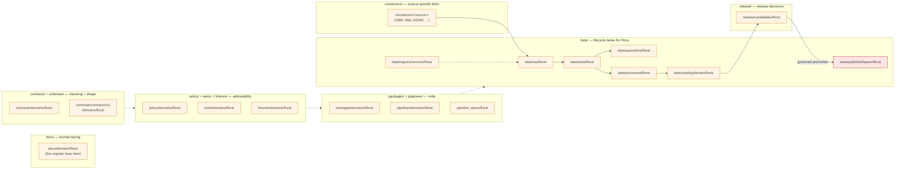

<!-- [KFM_META_BLOCK_V2]
doc_id: kfm://doc/flora-missing-or-planned-files
title: Flora — Missing or Planned Files Register
type: register
version: v1
status: draft
owners: TODO-flora-domain-steward, TODO-docs-steward
created: 2026-05-16
updated: 2026-05-16
policy_label: public
related:
  - docs/domains/flora/README.md
  - docs/doctrine/directory-rules.md
  - docs/registers/VERIFICATION_BACKLOG.md
  - docs/adr/ADR-0001-schema-home.md
tags: [kfm, domains, flora, register, planning, verification-backlog]
notes:
  - All paths in this register are PROPOSED until verified against a mounted repository.
  - This register implements the Domain Placement Law (Directory Rules §12) for the Flora lane.
  - Rare-plant locations remain deny-by-default per the Sensitivity Matrix.
[/KFM_META_BLOCK_V2] -->

# 🌿 Flora — Missing or Planned Files Register

> Per-lane inventory of files the Flora domain is expected to carry across the KFM
> responsibility-root pattern, with truth-labeled status for each. Implementation
> presence is **not** asserted by this document; this is a planning and verification
> backlog grounded in the Flora dossier and Directory Rules §12.

[](#status)
[](#scope)
[](#sensitivity-controls-rare-plant-defaults)
[](README.md)
[](#status)
[](#sensitivity-controls-rare-plant-defaults)
[](#open-questions-and-needs-verification)
[](#document-footer)

**Status:** `draft` · **Owners:** `TODO-flora-domain-steward`, `TODO-docs-steward`
· **Last updated:** `2026-05-16`

---

## Quick jump

- [1. Scope and intent](#1-scope-and-intent)
- [2. How to read this register](#2-how-to-read-this-register)
- [3. Flora lane pattern](#3-flora-lane-pattern)
- [4. Lane status overview](#4-lane-status-overview)
- [5. Per-lane file inventory](#5-per-lane-file-inventory)
  - [5.1 `docs/domains/flora/`](#51-docsdomainsflora)
  - [5.2 `contracts/domains/flora/`](#52-contractsdomainsflora)
  - [5.3 `schemas/contracts/v1/domains/flora/`](#53-schemascontractsv1domainsflora)
  - [5.4 `policy/domains/flora/`](#54-policydomainsflora)
  - [5.5 `tests/domains/flora/`](#55-testsdomainsflora)
  - [5.6 `fixtures/domains/flora/`](#56-fixturesdomainsflora)
  - [5.7 `packages/domains/flora/`](#57-packagesdomainsflora)
  - [5.8 `pipelines/domains/flora/` and `pipeline_specs/flora/`](#58-pipelinesdomainsflora-and-pipeline_specsflora)
  - [5.9 `connectors/` — Flora source connectors](#59-connectors--flora-source-connectors)
  - [5.10 `data/` — lifecycle lanes for Flora](#510-data--lifecycle-lanes-for-flora)
  - [5.11 `release/candidates/flora/`](#511-releasecandidatesflora)
  - [5.12 `control_plane/` — Flora register entries](#512-control_plane--flora-register-entries)
- [6. Per-object-family artifact checklist](#6-per-object-family-artifact-checklist)
- [7. Validators, tests, and fixtures backlog](#7-validators-tests-and-fixtures-backlog)
- [8. Sensitivity controls (rare-plant defaults)](#8-sensitivity-controls-rare-plant-defaults)
- [9. Cross-lane handoffs](#9-cross-lane-handoffs)
- [10. Open questions and NEEDS VERIFICATION](#10-open-questions-and-needs-verification)
- [11. Related docs](#11-related-docs)

---

## 1. Scope and intent

This register enumerates the **files the Flora domain is expected to carry** across the
KFM responsibility-root pattern, together with each file's planning status. It is the
domain-level companion to `docs/registers/VERIFICATION_BACKLOG.md` and the per-domain
landing page at `docs/domains/flora/README.md` (PROPOSED).

> [!IMPORTANT]
> **This document does not assert that any file exists.** No mounted KFM repository
> is visible in the session that produced this register. Every "expected" path below
> is **PROPOSED** under Directory Rules §12 Domain Placement Law and remains
> **NEEDS VERIFICATION** until a `git ls-tree`-equivalent inspection confirms it.
> No file or schema or policy or test is described as present, enforced, integrated,
> or covered.

**This register covers:**

- Files expected under each responsibility root for the Flora domain.
- Owned object families (Plant Taxon, SpecimenRecord, Flora Occurrence, Rare Plant
  Record, Vegetation Community, InvasivePlantRecord, Phenology Observation,
  RangePolygon, Habitat Association, Botanical Survey, Restoration Planting,
  Redaction Receipt) and the artifacts each implies.
- Validator, fixture, and policy-test backlog drawn from the Flora dossier.
- Sensitivity defaults and deny-by-default surfaces.

**This register does NOT cover:**

- Field-level shape of contracts or schemas — see `contracts/domains/flora/` (PROPOSED)
  and `schemas/contracts/v1/domains/flora/` (PROPOSED) once present.
- Object meaning — see the Flora dossier and `docs/domains/flora/README.md` (PROPOSED).
- Live source endpoints or rights determinations — see
  `data/registry/sources/flora/` (PROPOSED) and the Source Authority Register.
- Release decisions — those live under `release/candidates/flora/` (PROPOSED) and
  `release/manifests/` once an approved candidate exists.

[Back to top](#-flora--missing-or-planned-files-register)

---

## 2. How to read this register

Each row in the per-lane tables below carries a **status** drawn from the KFM truth
labels:

| Label | Meaning in this register |
|---|---|
| **CONFIRMED** | Verified in this session from attached project docs (doctrine only). No file presence is ever CONFIRMED here without a mounted repository. |
| **PROPOSED** | Path placement derived from Directory Rules §12 and the Flora dossier. Not verified in implementation. |
| **NEEDS VERIFICATION** | Checkable against a mounted repo; not yet checked in this session. |
| **UNKNOWN** | Cannot be resolved without more evidence (e.g., live source rights, current implementation maturity). |
| **DENY (by default)** | Sensitive surface — explicit governed approval required before any artifact lands. |

> [!NOTE]
> Placeholders such as `TODO-flora-domain-steward` are deliberate. The register
> prefers a clearly reviewable placeholder over a fabricated owner, badge target,
> CI URL, or ADR reference.

[Back to top](#-flora--missing-or-planned-files-register)

---

## 3. Flora lane pattern

Per Directory Rules §12, the Flora domain must appear as a **segment** under each
applicable responsibility root, never as a root folder. The lane pattern below is
PROPOSED for Flora and mirrors the canonical pattern shared by all KFM domains.



> [!WARNING]
> The diagram is **structural**, not an assertion of current implementation. Arrows
> represent governed lifecycle transitions; no transition is automated, scheduled,
> or guaranteed without a verified pipeline and policy gate.

[Back to top](#-flora--missing-or-planned-files-register)

---

## 4. Lane status overview

| Lane | Expected segment | Implementation status | Sensitivity posture |
|---|---|---|---|
| Docs | `docs/domains/flora/` | PROPOSED / NEEDS VERIFICATION | public |
| Contracts (meaning) | `contracts/domains/flora/` | PROPOSED / NEEDS VERIFICATION | public |
| Schemas (shape) | `schemas/contracts/v1/domains/flora/` | PROPOSED / NEEDS VERIFICATION; ADR-0001 governs home | public |
| Policy (admissibility) | `policy/domains/flora/` | PROPOSED / NEEDS VERIFICATION | deny-by-default for sensitive geometry |
| Tests | `tests/domains/flora/` | PROPOSED / NEEDS VERIFICATION | n/a (test code) |
| Fixtures | `fixtures/domains/flora/` | PROPOSED / NEEDS VERIFICATION; no-network only | synthetic, no live PII |
| Packages | `packages/domains/flora/` | PROPOSED / NEEDS VERIFICATION | n/a (library code) |
| Pipelines (exec) | `pipelines/domains/flora/` | PROPOSED / NEEDS VERIFICATION | watcher-as-non-publisher |
| Pipeline specs | `pipeline_specs/flora/` | PROPOSED / NEEDS VERIFICATION | declarative only |
| Connectors | `connectors/<source>/` (per source) | PROPOSED / NEEDS VERIFICATION; rights TODO per source | source-rights gated |
| Data — raw | `data/raw/flora/` | PROPOSED / NEEDS VERIFICATION | internal; never public |
| Data — work / quarantine | `data/work/flora/`, `data/quarantine/flora/` | PROPOSED / NEEDS VERIFICATION | internal; never public |
| Data — processed | `data/processed/flora/` | PROPOSED / NEEDS VERIFICATION | review-gated |
| Data — catalog | `data/catalog/domain/flora/` | PROPOSED / NEEDS VERIFICATION | review-gated |
| Data — published | `data/published/layers/flora/` | PROPOSED / NEEDS VERIFICATION | public-safe derivatives only |
| Data — registry | `data/registry/sources/flora/` | PROPOSED / NEEDS VERIFICATION | source-rights gated |
| Release candidates | `release/candidates/flora/` | PROPOSED / NEEDS VERIFICATION | governed promotion only |
| Control-plane entries | `control_plane/*.yaml` | PROPOSED / NEEDS VERIFICATION | machine-readable registry |

[Back to top](#-flora--missing-or-planned-files-register)

---

## 5. Per-lane file inventory

Each subsection below lists the **expected** files in that lane. Every path is
PROPOSED unless a mounted repo verifies otherwise. The "Driver" column references
the doctrinal source or invariant that calls for the file.

### 5.1 `docs/domains/flora/`

Human-facing landing and supporting documentation for the Flora bounded context.

| Expected path | Purpose | Status | Driver |
|---|---|---|---|
| `docs/domains/flora/README.md` | Domain landing page; bounded-context purpose, scope, non-ownership, terminology. | PROPOSED / NEEDS VERIFICATION | Atlas §8.A–C; Encyclopedia §7.6 |
| `docs/domains/flora/MISSING_OR_PLANNED_FILES.md` | **This document.** | PROPOSED (draft v1) | Domain Placement Law (Directory Rules §12) |
| `docs/domains/flora/SOURCE_REFRESH_RUNBOOK.md` | Per-source admission / refresh / quarantine procedure for Flora connectors. | PROPOSED / NEEDS VERIFICATION | mirrors Fauna runbook precedent |
| `docs/domains/flora/SENSITIVITY_POSTURE.md` | Rare-plant generalization / withholding / Redaction-Receipt rules. | PROPOSED / NEEDS VERIFICATION | Atlas §20.5; Flora §I |
| `docs/domains/flora/EVIDENCE_DRAWER.md` | Evidence Drawer payload shape and citation rules for Flora features. | PROPOSED / NEEDS VERIFICATION | Atlas §8.J; Encyclopedia §7.6.H |
| `docs/domains/flora/OBJECT_FAMILIES.md` | Per-object family reference: identity, temporal handling, evidence rules. | PROPOSED / NEEDS VERIFICATION | Atlas §8.C, §8.E |
| `docs/domains/flora/CROSSWALKS.md` | FloraTaxon Crosswalk and external-taxonomy reconciliation (USDA PLANTS, GBIF, NatureServe). | PROPOSED / NEEDS VERIFICATION | Encyclopedia §7.6.C; Atlas §8.C |
| `docs/domains/flora/PUBLICATION_AND_ROLLBACK.md` | Publication gate, correction path, rollback target rules for Flora. | PROPOSED / NEEDS VERIFICATION | Atlas §8.M |

### 5.2 `contracts/domains/flora/`

Semantic (Markdown) definitions of Flora object families. Field-level shape lives in
`schemas/`, not here, per the canonical split (Directory Rules §6.3 / §6.4).

| Expected path | Purpose | Status | Driver |
|---|---|---|---|
| `contracts/domains/flora/README.md` | Per-root README declaring class and contents. | PROPOSED / NEEDS VERIFICATION | Required README contract (Directory Rules §15) |
| `contracts/domains/flora/plant_taxon.md` | Plant Taxon meaning, invariants, identity basis. | PROPOSED / NEEDS VERIFICATION | Atlas §8.C, §8.E |
| `contracts/domains/flora/flora_taxon_crosswalk.md` | FloraTaxon Crosswalk between external taxonomies. | PROPOSED / NEEDS VERIFICATION | Atlas §8.C |
| `contracts/domains/flora/specimen_record.md` | SpecimenRecord meaning (herbarium / collection origin). | PROPOSED / NEEDS VERIFICATION | Atlas §8.B–C |
| `contracts/domains/flora/flora_occurrence.md` | Flora Occurrence meaning (point observation with uncertainty / geoprivacy). | PROPOSED / NEEDS VERIFICATION | Atlas §8.B–C |
| `contracts/domains/flora/rare_plant_record.md` | Rare Plant Record — sensitive-by-default object. | PROPOSED / NEEDS VERIFICATION | Atlas §8.I; §20.5 |
| `contracts/domains/flora/vegetation_community.md` | Vegetation Community polygons / classification. | PROPOSED / NEEDS VERIFICATION | Atlas §8.B–C |
| `contracts/domains/flora/invasive_plant_record.md` | InvasivePlantRecord. | PROPOSED / NEEDS VERIFICATION | Atlas §8.B–C |
| `contracts/domains/flora/phenology_observation.md` | Phenology Observation / time-series semantics. | PROPOSED / NEEDS VERIFICATION | Atlas §8.B–C |
| `contracts/domains/flora/range_polygon.md` | RangePolygon (vs DistributionSurface). | PROPOSED / NEEDS VERIFICATION | Atlas §8.C, §8.E |
| `contracts/domains/flora/habitat_association.md` | Habitat Association (relation to Habitat lane). | PROPOSED / NEEDS VERIFICATION | Atlas §8.C, §8.F |
| `contracts/domains/flora/botanical_survey.md` | Botanical Survey object. | PROPOSED / NEEDS VERIFICATION | Atlas §8.B |
| `contracts/domains/flora/restoration_planting.md` | Restoration Planting object. | PROPOSED / NEEDS VERIFICATION | Atlas §8.B |
| `contracts/domains/flora/redaction_receipt.md` | Domain-flavored Redaction Receipt (shared kernel reference). | PROPOSED / NEEDS VERIFICATION | Atlas §8.C; shared kernel |

> [!NOTE]
> `contracts/` retains semantic Markdown only. Per **ADR-0001**, machine-checkable
> JSON Schemas live under `schemas/contracts/v1/...` and never alongside the
> Markdown contracts. Any pre-existing `contracts/domains/flora/*.schema.json` is a
> drift candidate.

### 5.3 `schemas/contracts/v1/domains/flora/`

Machine-checkable JSON Schemas. Canonical home per **ADR-0001** (NEEDS VERIFICATION
that the ADR is accepted in the current repo).

| Expected path | Purpose | Status | Driver |
|---|---|---|---|
| `schemas/contracts/v1/domains/flora/README.md` | Per-root README, class declaration. | PROPOSED / NEEDS VERIFICATION | Directory Rules §15 |
| `schemas/contracts/v1/domains/flora/plant_taxon.schema.json` | JSON Schema for Plant Taxon. | PROPOSED / NEEDS VERIFICATION | ADR-0001; Atlas §8.J |
| `schemas/contracts/v1/domains/flora/flora_taxon_crosswalk.schema.json` | Crosswalk schema. | PROPOSED / NEEDS VERIFICATION | ADR-0001 |
| `schemas/contracts/v1/domains/flora/specimen_record.schema.json` | Specimen schema. | PROPOSED / NEEDS VERIFICATION | ADR-0001 |
| `schemas/contracts/v1/domains/flora/flora_occurrence.schema.json` | Public-vs-restricted occurrence shape. | PROPOSED / NEEDS VERIFICATION | ADR-0001; Atlas §8.I |
| `schemas/contracts/v1/domains/flora/rare_plant_record.schema.json` | Sensitive-by-default schema. | PROPOSED / NEEDS VERIFICATION | ADR-0001; §20.5 |
| `schemas/contracts/v1/domains/flora/vegetation_community.schema.json` | Community polygon schema. | PROPOSED / NEEDS VERIFICATION | ADR-0001 |
| `schemas/contracts/v1/domains/flora/invasive_plant_record.schema.json` | Invasive observation schema. | PROPOSED / NEEDS VERIFICATION | ADR-0001 |
| `schemas/contracts/v1/domains/flora/phenology_observation.schema.json` | Phenology time-series schema. | PROPOSED / NEEDS VERIFICATION | ADR-0001 |
| `schemas/contracts/v1/domains/flora/range_polygon.schema.json` | Range schema. | PROPOSED / NEEDS VERIFICATION | ADR-0001 |
| `schemas/contracts/v1/domains/flora/habitat_association.schema.json` | Cross-lane relation schema. | PROPOSED / NEEDS VERIFICATION | ADR-0001 |
| `schemas/contracts/v1/domains/flora/botanical_survey.schema.json` | Survey schema. | PROPOSED / NEEDS VERIFICATION | ADR-0001 |
| `schemas/contracts/v1/domains/flora/restoration_planting.schema.json` | Restoration planting schema. | PROPOSED / NEEDS VERIFICATION | ADR-0001 |
| `schemas/contracts/v1/domains/flora/flora_decision_envelope.schema.json` | Finite-outcome envelope for Flora API surfaces. | PROPOSED / NEEDS VERIFICATION | Atlas §8.J |
| `schemas/tests/valid/domains/flora/*.json` | Golden valid fixtures per object family. | PROPOSED / NEEDS VERIFICATION | Directory Rules §6.4 |
| `schemas/tests/invalid/domains/flora/*.json` | Negative fixtures per object family. | PROPOSED / NEEDS VERIFICATION | Directory Rules §6.4 |

### 5.4 `policy/domains/flora/`

Admissibility, sensitivity, rights, and release policy specific to Flora.

| Expected path | Purpose | Status | Driver |
|---|---|---|---|
| `policy/domains/flora/README.md` | Per-root README. | PROPOSED / NEEDS VERIFICATION | Directory Rules §15 |
| `policy/domains/flora/sensitivity.rego` | Rare/protected/culturally-sensitive deny rules. | PROPOSED / NEEDS VERIFICATION | Atlas §8.I; §20.5 |
| `policy/domains/flora/rights.rego` | Source-role and license enforcement for Flora connectors. | PROPOSED / NEEDS VERIFICATION | Atlas §8.D |
| `policy/domains/flora/redaction.rego` | Geoprivacy / generalization / withholding decisions; emits Redaction Receipt. | PROPOSED / NEEDS VERIFICATION | Atlas §8.I, §8.C |
| `policy/domains/flora/promotion.rego` | Per-domain promotion-gate composition. | PROPOSED / NEEDS VERIFICATION | Atlas §8.M; Encyclopedia §12 |
| `policy/domains/flora/citation.rego` | Cite-or-abstain enforcement for Flora Focus Mode answers. | PROPOSED / NEEDS VERIFICATION | Atlas §8.L; [GAI] |
| `policy/domains/flora/source_role.rego` | Authority / observation / context / model role discipline. | PROPOSED / NEEDS VERIFICATION | Atlas §8.D |
| `policy/domains/flora/fixtures/` | Policy fixtures distinct from `tests/fixtures/`. | PROPOSED / NEEDS VERIFICATION | Directory Rules §6.5 |
| `policy/domains/flora/tests/` | Policy unit tests. | PROPOSED / NEEDS VERIFICATION | Directory Rules §6.5 |

> [!CAUTION]
> Sensitive locations of rare, protected, or culturally sensitive flora are
> **DENY by default**. Any policy change loosening this default requires steward
> review **and** a Redaction Receipt path — see §8 below.

### 5.5 `tests/domains/flora/`

Proof that Flora rules are enforceable. Tests must be no-network and fixture-backed.

| Expected path | Purpose | Status | Driver |
|---|---|---|---|
| `tests/domains/flora/README.md` | Per-root README; lists validators covered. | PROPOSED / NEEDS VERIFICATION | Directory Rules §15 |
| `tests/domains/flora/test_schema_validation.py` (or equivalent) | All Flora object-family schemas accept valid / reject invalid fixtures. | PROPOSED / NEEDS VERIFICATION | Atlas §8.K |
| `tests/domains/flora/test_taxonomy_reconciliation.py` | FloraTaxon Crosswalk closure / non-collision tests. | PROPOSED / NEEDS VERIFICATION | Atlas §8.K (taxonomy reconciliation) |
| `tests/domains/flora/test_rights_validators.py` | Source-rights and source-role gates. | PROPOSED / NEEDS VERIFICATION | Atlas §8.K (rights/sensitivity validators) |
| `tests/domains/flora/test_sensitivity_denial.py` | Exact sensitive public-geometry DENY. | PROPOSED / NEEDS VERIFICATION | Atlas §8.K |
| `tests/domains/flora/test_redaction_receipts.py` | Redaction Receipt lineage / closure. | PROPOSED / NEEDS VERIFICATION | Atlas §8.C, §8.I |
| `tests/domains/flora/test_catalog_closure.py` | Catalog/EvidenceBundle closure for Flora records. | PROPOSED / NEEDS VERIFICATION | Atlas §8.K (catalog closure tests) |
| `tests/domains/flora/test_api_envelopes.py` | API finite-outcome (ANSWER / ABSTAIN / DENY / ERROR) fixtures. | PROPOSED / NEEDS VERIFICATION | Atlas §8.K (API finite-outcome fixtures) |
| `tests/domains/flora/test_no_live_network.py` | Assert the Flora test corpus runs without live-network calls. | PROPOSED / NEEDS VERIFICATION | Atlas §8.K (no-live-network fixture pipeline) |
| `tests/domains/flora/test_temporal_logic.py` | source / observed / valid / retrieval / release / correction time distinctions. | PROPOSED / NEEDS VERIFICATION | Atlas §8.E |
| `tests/domains/flora/test_geometry_validity.py` | Geometry validity + generalization invariants. | PROPOSED / NEEDS VERIFICATION | Encyclopedia §7.6.K |
| `tests/domains/flora/test_release_manifest.py` | ReleaseManifest validation and rollback chain. | PROPOSED / NEEDS VERIFICATION | Atlas §8.M |

### 5.6 `fixtures/domains/flora/`

Golden, valid, and invalid sample data backing Flora tests. **No live data, no live
network.**

| Expected path | Purpose | Status | Driver |
|---|---|---|---|
| `fixtures/domains/flora/README.md` | Per-root README. | PROPOSED / NEEDS VERIFICATION | Directory Rules §15 |
| `fixtures/domains/flora/source_descriptors/` | One SourceDescriptor per Flora source family. | PROPOSED / NEEDS VERIFICATION | Encyclopedia §7.6.L; Atlas §8.D |
| `fixtures/domains/flora/plant_taxon/` | Valid / invalid taxon fixtures. | PROPOSED / NEEDS VERIFICATION | Atlas §8.K |
| `fixtures/domains/flora/flora_occurrence/` | Public-safe and sensitive occurrence fixtures (sensitive ones must never publish). | PROPOSED / NEEDS VERIFICATION | Atlas §8.K; §20.5 |
| `fixtures/domains/flora/rare_plant_record/` | Synthetic rare-plant fixtures with generalized geometry; **no real rare-plant locations**. | PROPOSED / NEEDS VERIFICATION | Atlas §20.5 |
| `fixtures/domains/flora/vegetation_community/` | Community polygon fixtures. | PROPOSED / NEEDS VERIFICATION | Atlas §8.K |
| `fixtures/domains/flora/invasive_plant_record/` | Invasive observation fixtures. | PROPOSED / NEEDS VERIFICATION | Atlas §8.K |
| `fixtures/domains/flora/phenology_observation/` | Time-series fixtures. | PROPOSED / NEEDS VERIFICATION | Atlas §8.K |
| `fixtures/domains/flora/evidence_bundles/` | EvidenceBundle fixtures for catalog closure. | PROPOSED / NEEDS VERIFICATION | Atlas §8.K |
| `fixtures/domains/flora/decision_envelopes/` | ANSWER / ABSTAIN / DENY / ERROR fixtures. | PROPOSED / NEEDS VERIFICATION | Atlas §8.J |

> [!IMPORTANT]
> Rare-plant fixtures **must** use synthetic or generalized geometry. Real
> precise rare-plant locations must not be checked into the repo at any lifecycle
> phase — Atlas §20.5 / Flora §I.

### 5.7 `packages/domains/flora/`

Reusable library code specific to the Flora bounded context. One-off scripts belong
in `scripts/` until they earn library status (Directory Rules §7.5).

| Expected path | Purpose | Status | Driver |
|---|---|---|---|
| `packages/domains/flora/README.md` | Per-root README. | PROPOSED / NEEDS VERIFICATION | Directory Rules §15 |
| `packages/domains/flora/taxonomy/` | FloraTaxon resolution / crosswalk reconciliation. | PROPOSED / NEEDS VERIFICATION | Atlas §8.K; Encyclopedia §7.6 |
| `packages/domains/flora/geoprivacy/` | Generalization, withholding, Redaction-Receipt emission helpers. | PROPOSED / NEEDS VERIFICATION | Atlas §8.I |
| `packages/domains/flora/normalizers/` | Per-source normalizers (GBIF DwC, iNaturalist, USDA PLANTS, NatureServe). | PROPOSED / NEEDS VERIFICATION | Encyclopedia §7.6.B |
| `packages/domains/flora/evidence/` | EvidenceBundle assemblers for Flora records. | PROPOSED / NEEDS VERIFICATION | Atlas §8.M |
| `packages/domains/flora/layer_manifests/` | LayerManifest builders for Flora public surfaces. | PROPOSED / NEEDS VERIFICATION | Atlas §8.J |

### 5.8 `pipelines/domains/flora/` and `pipeline_specs/flora/`

Executable pipeline logic (`pipelines/`) and its declarative spec (`pipeline_specs/`).

| Expected path | Purpose | Status | Driver |
|---|---|---|---|
| `pipelines/domains/flora/README.md` | Per-root README. | PROPOSED / NEEDS VERIFICATION | Directory Rules §15 |
| `pipelines/domains/flora/ingest/` | Connector → RAW admission for Flora sources. | PROPOSED / NEEDS VERIFICATION | Directory Rules §7.4 |
| `pipelines/domains/flora/normalize/` | RAW → WORK normalization. | PROPOSED / NEEDS VERIFICATION | Atlas §8.H |
| `pipelines/domains/flora/validate/` | Schema / rights / sensitivity / geometry validation. | PROPOSED / NEEDS VERIFICATION | Atlas §8.K |
| `pipelines/domains/flora/catalog/` | PROCESSED → CATALOG and EvidenceBundle assembly. | PROPOSED / NEEDS VERIFICATION | Atlas §8.H |
| `pipelines/domains/flora/redact/` | Redaction Receipt emission for sensitive records. | PROPOSED / NEEDS VERIFICATION | Atlas §8.I |
| `pipeline_specs/flora/README.md` | Declarative spec README. | PROPOSED / NEEDS VERIFICATION | Directory Rules §15 |
| `pipeline_specs/flora/*.yaml` | Per-source / per-product specs (one per Flora source family). | PROPOSED / NEEDS VERIFICATION | Directory Rules §7.4 |

### 5.9 `connectors/` — Flora source connectors

Source-specific fetchers and admitters. Connector output goes to
`data/raw/flora/<source_id>/<run_id>/` or `data/quarantine/...`; connectors **MUST
NOT** publish (Directory Rules §7.3).

| Source family (from Flora dossier) | Expected connector path | Status | Rights / sensitivity |
|---|---|---|---|
| KDWP flora / listed-species context | `connectors/kansas/kdwp_flora/` | PROPOSED / NEEDS VERIFICATION | rights TODO; sensitive joins fail closed |
| KDWP Ecological Review Tool / stewardship outputs | `connectors/kansas/kdwp_ert/` | PROPOSED / NEEDS VERIFICATION | rights TODO; stewardship gating |
| Kansas Biological Survey / KU herbarium (McGregor) | `connectors/kansas/kbs_herbarium/` | PROPOSED / NEEDS VERIFICATION | rights TODO; per-collection terms |
| USFWS ECOS (plant context) | `connectors/usfws/ecos_plants/` | PROPOSED / NEEDS VERIFICATION | public; verify terms |
| NatureServe Explorer / Explorer Pro | `connectors/natureserve/explorer/` | PROPOSED / NEEDS VERIFICATION | account / license required; sensitive |
| GBIF vascular-plant downloads | `connectors/gbif/plants/` | PROPOSED / NEEDS VERIFICATION | citation + DOI obligations |
| iDigBio specimen records | `connectors/idigbio/specimens/` | PROPOSED / NEEDS VERIFICATION | per-collection license |
| iNaturalist-derived observations | `connectors/inaturalist/observations/` | PROPOSED / NEEDS VERIFICATION | per-record license; obscured locations |
| USDA PLANTS (vascular checklists / distributions) | `connectors/usda/plants/` | PROPOSED / NEEDS VERIFICATION | public domain per source; cite per guidance |

> [!NOTE]
> The USDA PLANTS, GBIF, iNaturalist, and NatureServe entries above reflect the
> source families named in the Flora dossier and supplementary New-Ideas packets.
> Concrete rights, current API surfaces, and per-source terms are
> **NEEDS VERIFICATION** and must be resolved before any connector is admitted.

### 5.10 `data/` — lifecycle lanes for Flora

Lifecycle directories under `data/`. The phase is the **governance invariant**; a
file's lifecycle phase MUST be explicit (Directory Rules §9.1).

```text
data/
├── raw/flora/<source_id>/<run_id>/
├── work/flora/<run_id>/
├── quarantine/flora/<reason>/<run_id>/
├── processed/flora/<dataset_id>/<version>/
├── catalog/domain/flora/
├── triplets/                # cross-domain; flora deltas live here, not in a flora/ root
├── published/layers/flora/
├── registry/sources/flora/
├── receipts/                # ingest/validation/pipeline/ai/release — cross-domain
├── proofs/                  # evidence_bundle/proof_pack/... — cross-domain
└── rollback/flora/<release_id>/
```

| Lane | Purpose | Status | Driver |
|---|---|---|---|
| `data/raw/flora/` | Immutable source payloads with SourceDescriptor + hash. | PROPOSED / NEEDS VERIFICATION | Atlas §8.H (RAW) |
| `data/work/flora/` | Normalization scratch. | PROPOSED / NEEDS VERIFICATION | Atlas §8.H (WORK) |
| `data/quarantine/flora/` | Records held on validation/policy failure with quarantine reason. | PROPOSED / NEEDS VERIFICATION | Atlas §8.H (QUARANTINE) |
| `data/processed/flora/` | Validated, normalized objects + receipts. | PROPOSED / NEEDS VERIFICATION | Atlas §8.H (PROCESSED) |
| `data/catalog/domain/flora/` | Catalog records + EvidenceBundles + triplet projections. | PROPOSED / NEEDS VERIFICATION | Atlas §8.H (CATALOG) |
| `data/published/layers/flora/` | Public-safe released layers (generalized occurrence, vegetation community, phenology, etc.). | PROPOSED / NEEDS VERIFICATION | Atlas §8.G, §8.H (PUBLISHED) |
| `data/registry/sources/flora/` | Per-source registry entries (SourceDescriptor IDs, rights, freshness). | PROPOSED / NEEDS VERIFICATION | Directory Rules §9.1 |
| `data/rollback/flora/<release_id>/` | Rollback targets for prior Flora releases. | PROPOSED / NEEDS VERIFICATION | Atlas §8.M |

> [!WARNING]
> Public clients **MUST NOT** read directly from `data/raw/`, `data/work/`,
> `data/quarantine/`, `data/processed/`, or `data/catalog/`. All public reads go
> through the governed API (`apps/governed-api/` — PROPOSED). Direct reads of
> canonical stores by `apps/explorer-web/` or any other shell are a trust-membrane
> violation (Directory Rules §13).

### 5.11 `release/candidates/flora/`

Release decisions and candidates for Flora. Release **decisions** live here; released
**artifacts** live under `data/published/layers/flora/` — the two are deliberately
distinct (Directory Rules §5).

| Expected path | Purpose | Status | Driver |
|---|---|---|---|
| `release/candidates/flora/README.md` | Per-root README. | PROPOSED / NEEDS VERIFICATION | Directory Rules §15 |
| `release/candidates/flora/<candidate_id>/manifest.yaml` | Candidate ReleaseManifest. | PROPOSED / NEEDS VERIFICATION | Atlas §8.M |
| `release/candidates/flora/<candidate_id>/evidence_bundle.json` | Evidence basis for the candidate. | PROPOSED / NEEDS VERIFICATION | Atlas §8.M |
| `release/candidates/flora/<candidate_id>/policy_decision.json` | Captured PolicyDecision. | PROPOSED / NEEDS VERIFICATION | Atlas §8.M |
| `release/candidates/flora/<candidate_id>/rollback_card.json` | Rollback target. | PROPOSED / NEEDS VERIFICATION | Atlas §8.M |
| `release/correction_notices/flora/` (shared root) | Public correction notices touching Flora releases. | PROPOSED / NEEDS VERIFICATION | Atlas §8.M |

### 5.12 `control_plane/` — Flora register entries

The control plane is the **machine-readable** "what governs what" layer. Flora entries
appear in shared registers, not in a Flora-specific subtree (Directory Rules §6.2).

| Expected entry | Where | Status |
|---|---|---|
| Flora source families | `control_plane/source_authority_register.yaml` (Flora section) | PROPOSED / NEEDS VERIFICATION |
| Flora object families | `control_plane/object_family_register.yaml` (Flora section) | PROPOSED / NEEDS VERIFICATION |
| Flora domain lane definition | `control_plane/domain_lane_register.yaml` (Flora entry) | PROPOSED / NEEDS VERIFICATION |
| Flora policy gates | `control_plane/policy_gate_register.yaml` (Flora-tagged gates) | PROPOSED / NEEDS VERIFICATION |
| Flora release states | `control_plane/release_state_register.yaml` (Flora entries) | PROPOSED / NEEDS VERIFICATION |
| Flora verification backlog items | `control_plane/verification_backlog.yaml` (Flora-tagged) | PROPOSED / NEEDS VERIFICATION |

[Back to top](#-flora--missing-or-planned-files-register)

---

## 6. Per-object-family artifact checklist

For each owned Flora object family, the lane pattern implies a consistent set of
artifacts. The matrix below is the per-object completeness check. No row is
CONFIRMED; every cell is PROPOSED / NEEDS VERIFICATION until a mounted repo
inspection lands.

<details>
<summary><strong>Object-family artifact matrix (click to expand)</strong></summary>

| Object family | Contract (`contracts/.../<name>.md`) | Schema (`schemas/.../<name>.schema.json`) | Valid fixture | Invalid fixture | Policy hooks | Normalizer | Catalog projection | Sensitivity default |
|---|---|---|---|---|---|---|---|---|
| Plant Taxon | PROPOSED | PROPOSED | PROPOSED | PROPOSED | rights, citation | PROPOSED | PROPOSED | public |
| FloraTaxon Crosswalk | PROPOSED | PROPOSED | PROPOSED | PROPOSED | rights, citation | PROPOSED | PROPOSED | public |
| SpecimenRecord | PROPOSED | PROPOSED | PROPOSED | PROPOSED | rights | PROPOSED | PROPOSED | per-collection terms |
| Flora Occurrence | PROPOSED | PROPOSED | PROPOSED | PROPOSED | rights, sensitivity | PROPOSED | PROPOSED | generalize if uncertain |
| Rare Plant Record | PROPOSED | PROPOSED | PROPOSED (synthetic) | PROPOSED | sensitivity (DENY default), redaction | PROPOSED | PROPOSED | **DENY by default** |
| Vegetation Community | PROPOSED | PROPOSED | PROPOSED | PROPOSED | rights, citation | PROPOSED | PROPOSED | public |
| InvasivePlantRecord | PROPOSED | PROPOSED | PROPOSED | PROPOSED | rights, citation | PROPOSED | PROPOSED | public |
| Phenology Observation | PROPOSED | PROPOSED | PROPOSED | PROPOSED | rights, temporal | PROPOSED | PROPOSED | public |
| RangePolygon | PROPOSED | PROPOSED | PROPOSED | PROPOSED | rights, sensitivity | PROPOSED | PROPOSED | generalized for rare taxa |
| Habitat Association | PROPOSED | PROPOSED | PROPOSED | PROPOSED | cross-lane integrity | PROPOSED | PROPOSED | derived; mirrors source |
| Botanical Survey | PROPOSED | PROPOSED | PROPOSED | PROPOSED | rights, completeness | PROPOSED | PROPOSED | public |
| Restoration Planting | PROPOSED | PROPOSED | PROPOSED | PROPOSED | rights, sensitivity | PROPOSED | PROPOSED | per-project terms |
| Redaction Receipt | PROPOSED | PROPOSED (shared kernel) | PROPOSED | PROPOSED | emitted by `redact/` | n/a | PROPOSED | public (the receipt is public) |

</details>

[Back to top](#-flora--missing-or-planned-files-register)

---

## 7. Validators, tests, and fixtures backlog

The Flora dossier names the following PROPOSED validator and test surfaces.
Implementation presence is **NEEDS VERIFICATION** for every row.

| Validator / test | Surface | Status | Source |
|---|---|---|---|
| Taxonomy reconciliation tests | crosswalks; FloraTaxon resolution | PROPOSED | Atlas §8.K |
| Rights / sensitivity validators | source-rights, sensitivity tags | PROPOSED | Atlas §8.K |
| Exact-sensitive public-geometry denial | rare-plant DENY | PROPOSED | Atlas §8.K; §20.5 |
| Catalog closure tests | EvidenceBundle / digest closure | PROPOSED | Atlas §8.K |
| API finite-outcome fixtures | ANSWER / ABSTAIN / DENY / ERROR | PROPOSED | Atlas §8.K |
| No-live-network fixture pipeline | all Flora tests | PROPOSED | Atlas §8.K |
| Source-descriptor validation | per-source admission | PROPOSED | Encyclopedia §7.6.K |
| Temporal logic tests | source/observed/valid/retrieval/release/correction times | PROPOSED | Atlas §8.E |
| Geometry validity tests | OGC validity + generalization invariants | PROPOSED | Encyclopedia §7.6.K |
| Citation validation | cite-or-abstain enforcement | PROPOSED | Atlas §8.L; [GAI] |
| ReleaseManifest validation | promotion / rollback chain | PROPOSED | Atlas §8.M |
| Rollback drill | exercise rollback target | PROPOSED | Atlas §8.M |

[Back to top](#-flora--missing-or-planned-files-register)

---

## 8. Sensitivity controls (rare-plant defaults)

The Sensitivity Matrix (Atlas §20.5) names Flora as a deny-by-default surface for
**exact rare, protected, or culturally sensitive plant locations**. The Flora dossier
reinforces that "rare, protected, culturally sensitive, and steward-reviewed flora
default to generalized, withheld, staged, or denied public geometry"
(Atlas §8.I).

> [!CAUTION]
> **Deny-by-default surfaces for Flora:**
>
> - Exact precise locations of rare or protected plant taxa.
> - Exact precise locations of culturally sensitive taxa (where steward review
>   identifies them).
> - Records joined to sensitive habitat, archaeology, or land assertions where
>   the join itself elevates exposure.
>
> Public release is permitted only with: explicit steward / cultural review,
> generalized or withheld geometry, an emitted Redaction Receipt, and an approved
> ReleaseManifest pointing at a public-safe derivative. (Atlas §20.5)

| Sensitive surface | Public-safe path | Receipt required |
|---|---|---|
| Rare Plant Record (exact location) | Generalized RangePolygon / withheld geometry | Redaction Receipt |
| Sensitive collection joins (herbarium ↔ rare taxa) | Aggregated / generalized join surface | Redaction Receipt |
| Culturally sensitive taxa | Steward-reviewed surface only | Redaction Receipt + ReviewRecord |
| iNaturalist-obscured locations | Use source-obscured geometry only | per-source citation |

[Back to top](#-flora--missing-or-planned-files-register)

---

## 9. Cross-lane handoffs

Flora is a bounded context. Cross-lane handoffs MUST preserve ownership, source
role, sensitivity, and EvidenceBundle support (Atlas §8.F).

| From | To | Relation | Files implicated |
|---|---|---|---|
| Flora | Habitat | Habitat Association; Vegetation Community context | `contracts/domains/flora/habitat_association.md`; cross-domain validator in `tools/validators/<topic>/` (not in either domain's folder) |
| Flora | Fauna | Pollinator, food-web, invasive context | shared kernel; no flora-rooted fauna artifacts |
| Flora | Soil / Hydrology | Substrate, wetland, riparian, drought context | derived joins; cross-domain validator |
| Flora | Hazards | Fire, drought, flood, smoke, vegetation stress context | derived joins; cross-domain validator |

> [!NOTE]
> Per Directory Rules §12, cross-lane files belong under the **lowest common
> responsibility root** (e.g., `tools/validators/<topic>/`,
> `schemas/contracts/v1/<topic>/`), **not** under one domain's lane.

[Back to top](#-flora--missing-or-planned-files-register)

---

## 10. Open questions and NEEDS VERIFICATION

The following items are explicitly unresolved by this register and should be tracked
in `docs/registers/VERIFICATION_BACKLOG.md` (PROPOSED entry) or addressed via ADR.

- **NEEDS VERIFICATION:** Does the mounted repo actually contain a
  `docs/domains/flora/` directory, and if so, which of the files in §5.1 already
  exist?
- **NEEDS VERIFICATION:** Is ADR-0001 (canonical schema home at
  `schemas/contracts/v1/...`) accepted in the current repo? If not, schema paths
  in §5.3 are subject to revision.
- **NEEDS VERIFICATION:** Are any `contracts/domains/flora/*.schema.json` files
  present? If so, they are drift candidates per Directory Rules §13.1.
- **NEEDS VERIFICATION:** Source rights, license terms, and current API surfaces
  for KDWP, KU/KBS herbaria, USFWS ECOS, NatureServe, GBIF, iDigBio,
  iNaturalist, and USDA PLANTS — none are confirmed for current use in this
  session.
- **NEEDS VERIFICATION:** Steward roles and approval authority for sensitive
  Flora promotions (per Atlas §24.7, separation-of-duties matrix).
- **NEEDS VERIFICATION:** Current state of `data/registry/sources/flora/` (or
  any equivalent) and the form of SourceDescriptor records actually used in the
  repo.
- **NEEDS VERIFICATION:** Whether the canonical pipeline framework expects YAML
  pipeline specs, JSON, or something else under `pipeline_specs/flora/`.
- **NEEDS VERIFICATION:** Whether `release/correction_notices/` is per-domain or
  cross-domain in the current repo layout.
- **OPEN:** Whether Flora should carry its own `EVIDENCE_DRAWER.md` or reference
  a shared `docs/architecture/evidence-drawer.md`.
- **OPEN:** Subfolder conventions inside `docs/domains/flora/` — flat versus
  organized into `runbooks/`, `references/`, etc. (mirrors the open
  question raised for the fauna runbook subfolder).
- **OPEN:** Whether the FloraTaxon Crosswalk should live under
  `contracts/domains/flora/` or be promoted to a shared crosswalk subtree at
  `contracts/crosswalks/taxonomy/`.

[Back to top](#-flora--missing-or-planned-files-register)

---

## 11. Related docs

| Document | Path | Purpose |
|---|---|---|
| Flora landing README (PROPOSED) | `docs/domains/flora/README.md` | Domain landing / scope / non-ownership. |
| Directory Rules | `docs/doctrine/directory-rules.md` | Canonical placement and lifecycle doctrine. |
| ADR-0001 (schema home) | `docs/adr/ADR-0001-schema-home.md` | Default schema authority is `schemas/contracts/v1/...`. |
| Verification Backlog | `docs/registers/VERIFICATION_BACKLOG.md` | Repo-wide verification items. |
| Drift Register | `docs/registers/DRIFT_REGISTER.md` | Conflicts between doctrine and repo state. |
| Sensitivity Posture (PROPOSED) | `docs/domains/flora/SENSITIVITY_POSTURE.md` | Rare-plant generalization / withholding rules. |
| Fauna analogue | `docs/domains/fauna/SOURCE_REFRESH_RUNBOOK.md` | Precedent for per-domain runbooks. |
| Atlas v1.1 §8 Flora | `[DOM-FLORA]` / Domains Culmination Atlas | Doctrinal basis for this register. |
| Encyclopedia §7.6 Flora | `kfm_encyclopedia.pdf` | Domain capability summary. |

[Back to top](#-flora--missing-or-planned-files-register)

---

## Document footer

> [!NOTE]
> **Document status:** `draft v1` · **Coverage:** Flora bounded context only ·
> **Implementation maturity:** UNKNOWN (no mounted repository inspected in
> this session). Every file path in this register is **PROPOSED** under
> Directory Rules §12 and remains **NEEDS VERIFICATION** until a `git
> ls-tree`-equivalent inspection confirms it.

**Last reviewed:** 2026-05-16 · **Owners:** `TODO-flora-domain-steward`,
`TODO-docs-steward` · **Change discipline:** see Directory Rules §17.

[Back to top](#-flora--missing-or-planned-files-register)
