<!-- [KFM_META_BLOCK_V2]
doc_id: kfm://doc/domain/flora/pipelines-and-lifecycle
title: Flora — Pipelines and Lifecycle
type: standard
version: v0.1
status: draft
owners: <flora-steward> (TODO: assign)
created: 2026-05-08
updated: 2026-05-08
policy_label: public
related:
  - docs/domains/flora/README.md
  - docs/domains/flora/SOURCE_REGISTRY.md
  - docs/domains/flora/DATA_MODEL.md
  - docs/domains/flora/PUBLICATION_AND_POLICY.md
  - docs/domains/flora/UI_AND_EVIDENCE_DRAWER.md
  - docs/domains/flora/VERIFICATION_BACKLOG.md
  - docs/adr/ADR-flora-schema-home.md
  - docs/adr/ADR-flora-source-roles.md
  - docs/adr/ADR-flora-sensitive-location-policy.md
  - docs/adr/ADR-flora-public-layer-strategy.md
tags: [kfm, flora, lifecycle, pipelines, governance, no-live-network]
notes:
  - "Doctrine (RAW -> WORK/QUARANTINE -> PROCESSED -> CATALOG/TRIPLET -> PUBLISHED) is CONFIRMED across the KFM corpus."
  - "Flora-specific paths, modules, and CI workflows are PROPOSED until repo conventions are verified."
  - "Live network is forbidden in CI for this lane until source rights, sensitivity, and steward approval are recorded."
[/KFM_META_BLOCK_V2] -->

# Flora — Pipelines and Lifecycle

Governed, evidence-first, no-live-network movement of plant data from source edge to public-safe release.

> [!IMPORTANT]
> The KFM lifecycle (`RAW -> WORK / QUARANTINE -> PROCESSED -> CATALOG / TRIPLET -> PUBLISHED`) is **CONFIRMED doctrine**. All flora-specific paths, modules, workflow names, and validators below are **PROPOSED** and depend on repo-convention verification (see [§ 12 Verification Gaps](#12--verification-gaps)). Promotion is a governed state transition — never a file move.

<!-- BADGES: targets are placeholders until the repo is verified. Replace `<owner>/<repo>` and workflow names. -->


-red)
<!-- TODO(repo-verify): replace with real shields once `flora-ci.yml` / `flora-promotion.yml` exist. -->
<!--  -->
<!--  -->

**Owners:** `<flora-steward>` *(TODO: assign in `CODEOWNERS`)* · **Status:** `draft` · **Audience:** flora maintainers, KFM reviewers, release stewards.

**Quick jump:**
[Scope](#1--scope) ·
[Repo fit](#2--repo-fit) ·
[Inputs / Exclusions](#3--inputs--exclusions) ·
[Lifecycle](#4--lifecycle-doctrine) ·
[Stages](#5--per-stage-responsibilities) ·
[Pipeline modules](#6--pipeline-modules-and-helpers-proposed) ·
[Watcher behavior](#7--watcher-behavior-by-source-family) ·
[Lifecycle directories](#8--lifecycle-directories) ·
[Validators & gates](#9--validators-and-promotion-gates) ·
[Receipts & proofs](#10--receipts-proofs-and-release-objects) ·
[CI](#11--ci-and-no-live-network-discipline) ·
[Rollback](#12--review-correction-and-rollback) ·
[Verification gaps](#13--verification-gaps) ·
[Glossary](#14--glossary-flora-specific) ·
[Changelog](#15--changelog)

---

## 1 · Scope

This document is the **human control-plane reference** for how flora data moves through the KFM lifecycle. It explains:

- The lifecycle stages and **what each stage is allowed to contain**.
- The **proposed pipeline modules** that perform stage transitions and the **helpers** they share.
- **Watcher behavior** for each source family (cadence, change detection, validation thresholds).
- The **promotion gates** and **fail-closed policy decisions** that govern movement between stages.
- The **receipts, proofs, catalog, and release artifacts** emitted at each stage.
- The **CI posture** (no live network) and the **rollback / correction** discipline.

This document is **not** a schema, not a contract, and not a runtime implementation. Schemas live under `schemas/contracts/v1/domains/flora/` (see [`ADR-flora-schema-home.md`](../../adr/ADR-flora-schema-home.md)). Source descriptors live under `data/registry/flora/`. Policy lives under `policy/domains/flora/`. *(All paths PROPOSED until repo conventions are verified.)*

> [!NOTE]
> This document is **descriptive** of the flora lane's **intended operational shape**. It does not assert that any pipeline, validator, workflow, route, or release exists in the repository today. Status of each component is labeled inline.

[Back to top](#flora--pipelines-and-lifecycle)

---

## 2 · Repo fit

**Path (PROPOSED):** `docs/domains/flora/PIPELINES_AND_LIFECYCLE.md`

**Directory Rules basis.** Per the KFM responsibility-root model, domain documentation belongs under `docs/domains/<domain>/`, not as a root-level `flora/` folder. This file's location matches that rule. Schemas, contracts, policy, tests, fixtures, connectors, pipelines, and data lifecycle directories each have their own responsibility roots; this document **references** them but does not duplicate their authority.

**Upstream context (where this fits in):**

- [`docs/domains/flora/README.md`](./README.md) — landing page for the flora lane.
- [`docs/domains/flora/SOURCE_REGISTRY.md`](./SOURCE_REGISTRY.md) — human guide to flora source descriptors.
- [`docs/domains/flora/DATA_MODEL.md`](./DATA_MODEL.md) — object families and identity rules.
- [`docs/domains/flora/PUBLICATION_AND_POLICY.md`](./PUBLICATION_AND_POLICY.md) — rights, sensitivity, public-safe rules.

**Downstream consumers:**

- [`docs/domains/flora/UI_AND_EVIDENCE_DRAWER.md`](./UI_AND_EVIDENCE_DRAWER.md) — what the UI receives **after** the lifecycle has done its work.
- [`docs/domains/flora/VERIFICATION_BACKLOG.md`](./VERIFICATION_BACKLOG.md) — open evidence gaps tracked from this doc.
- [`docs/domains/flora/ROADMAP.md`](./ROADMAP.md) — sequenced PR plan that lands the modules this doc proposes.

**Related machine artifacts (PROPOSED homes):**

- `pipelines/domains/flora/*` — stage-transition jobs.
- `packages/domains/flora/src/flora/*` — shared helpers (ids, hashing, geoprivacy, taxon_reconcile, source_registry, api_payloads).
- `data/{raw,work,quarantine,processed,catalog,triplets,receipts,proofs,published}/flora/` — lifecycle storage.
- `tools/validators/flora/*` — fail-closed validators referenced by promotion gates.
- `policy/domains/flora/*.rego` — Rego rules referenced by gates.
- `.github/workflows/flora-ci.yml`, `.github/workflows/flora-promotion.yml`, `.github/workflows/flora-source-probe-manual.yml`.

[Back to top](#flora--pipelines-and-lifecycle)

---

## 3 · Inputs / Exclusions

### Accepts

- Pipeline source code references and stage descriptions.
- Receipt and proof object **shapes** (not values).
- Watcher cadence and change-detection notes.
- Validator and gate behavior summaries.
- Lifecycle directory contracts.

### Does **not** accept

- **Live endpoint URLs with secrets, tokens, or credentials.** Source descriptors hold non-secret access metadata; secrets live outside this repo.
- **Sensitive coordinates, restricted-taxon point geometry, controlled-access internal refs.** Public-safe redacted shapes only — and only as illustrative placeholders, never as real data.
- **Schema field definitions.** Those live in `schemas/contracts/v1/domains/flora/` and are referenced here, not duplicated.
- **Policy rules.** Those live in `policy/domains/flora/*.rego` and are referenced here, not redefined.
- **Release records.** Those live under `data/published/flora/manifests/` and `data/proofs/flora/` and are referenced here, not embedded.

[Back to top](#flora--pipelines-and-lifecycle)

---

## 4 · Lifecycle doctrine

**CONFIRMED across the KFM corpus.** Flora preserves the truth lifecycle:

```text
SOURCE EDGE -> RAW -> WORK / QUARANTINE -> PROCESSED -> CATALOG / TRIPLET -> PUBLISHED
                                                                             |
                                                                             v
                                                       REVIEW / CORRECTION / ROLLBACK
```

Three doctrinal rules govern every transition:

1. **Promotion is a governed state transition, not a file move.** A copy from `data/processed/flora/...` to `data/published/flora/...` without a passing promotion gate, a `ReleaseManifest`, an `EvidenceBundle`, a `CatalogMatrix` closure, and a rollback target is **not** a release.
2. **Public clients use governed APIs, never canonical/internal stores.** No public route, tile service, AI/Focus answer, or UI layer reads from `data/raw/flora/`, `data/work/flora/`, or `data/quarantine/flora/`.
3. **Cite-or-abstain is the default truth posture.** A flora claim without a resolvable `EvidenceRef` returns `ABSTAIN` at runtime and is **denied** at promotion.

```mermaid
flowchart LR
    SE[SOURCE EDGE<br/>descriptor probe<br/>rights / sensitivity capture]
    RAW[RAW<br/>immutable source bytes<br/>checksum + retrieval metadata]
    WORK[WORK<br/>normalize taxon + geometry<br/>reconcile precision]
    QUAR[QUARANTINE<br/>reason-coded failures<br/>steward review queue]
    PROC[PROCESSED<br/>validated canonical records<br/>spec_hash + evidence_refs]
    CAT[CATALOG / TRIPLET<br/>STAC / DCAT / PROV<br/>graph projections]
    PROOF[PROOF / RELEASE<br/>EvidenceBundle<br/>ReleaseManifest<br/>CatalogMatrix closure]
    PUB[PUBLISHED<br/>public-safe layers / API<br/>generalized geometry only]
    REV[REVIEW / CORRECTION / ROLLBACK<br/>review_record<br/>correction_notice<br/>rollback_card]

    SE --> RAW --> WORK
    WORK --> PROC
    WORK --> QUAR
    QUAR -. remediated .-> WORK
    PROC --> CAT
    CAT --> PROOF
    PROOF -- promotion gate --> PUB
    PUB --> REV
    REV -. correction .-> PROC
    REV -. rollback .-> PUB

    classDef internal fill:#fef3c7,stroke:#b45309,color:#000;
    classDef governed fill:#dbeafe,stroke:#1e40af,color:#000;
    classDef public fill:#dcfce7,stroke:#166534,color:#000;
    classDef gov fill:#fae8ff,stroke:#7c3aed,color:#000;
    class SE,RAW,WORK,QUAR internal;
    class PROC,CAT,PROOF governed;
    class PUB public;
    class REV gov;
```



> [!CAUTION]
> Public surfaces (`PUBLISHED`) are colored separately for a reason. Anything reachable by a public client must have left the lifecycle through the **promotion gate**. RAW, WORK, and QUARANTINE are **steward-only** and never directly visible to ordinary clients, AI/Focus context, or tile services.

[Back to top](#flora--pipelines-and-lifecycle)

---

## 5 · Per-stage responsibilities

**CONFIRMED doctrine / PROPOSED implementation** — fields and exact validators are confirmed by the corpus; the flora pipeline that performs them is proposed pending repo verification.

| Stage | Flora responsibilities | Objects / artifacts emitted | Fail-closed conditions |
| :--- | :--- | :--- | :--- |
| **SOURCE EDGE** | Resolve descriptor; probe access; capture rights, sensitivity, ETag/Last-Modified/checksum where available; record `source_role` and authority boundary. | `source_descriptor`, `source_probe_receipt`, `source_role` registry entry. | Unknown rights, unknown sensitivity for public use, unverified controlled source, missing authority boundary. |
| **RAW** | Store immutable raw pulls (or fixture equivalents in CI) with source metadata and checksums; **no destructive normalization**. | `raw_artifact`, `raw_manifest`, `run_receipt`. | Raw artifact referenced by public payload; missing checksum for a release candidate. |
| **WORK / QUARANTINE** | Normalize, clean, reconcile taxon, handle CRS/precision, flag duplicates; record quarantine reason codes for failures. | `work_normalized` records, `quarantine_record`, `taxon_reconciliation_report`. | Rights failure, sensitivity failure, invalid geometry, ambiguous taxon, unresolved precision. |
| **PROCESSED** | Validated normalized objects with deterministic IDs, quality state, `source_refs`, `evidence_refs`, public-safe geometry **only where allowed**. | `flora_taxon`, `flora_occurrence`, `plant_community`, `range_map`, `phenology_product`. | Schema failure, missing `source_refs` / `evidence_refs` / `spec_hash`, invalid CRS. |
| **CATALOG / TRIPLET** | Emit STAC for spatial assets, DCAT for datasets/distributions, PROV lineage; close `CatalogMatrix`; emit graph/triplet projections where supported. | `stac_item`, `dcat_dataset`, `prov_activity`, `catalog_matrix`, `graph_delta`. | Catalog matrix open; digest mismatch; missing provenance; graph claim not tied to evidence. |
| **PUBLISHED** | Expose only public-safe layers, records, APIs, and evidence payloads through governed interfaces. | `release_manifest`, `EvidenceBundle`, `layer_descriptor`, `runtime_response`, public PMTiles / GeoJSON / TileJSON. | RAW/WORK/QUARANTINE leakage, exact sensitive geometry, unresolved rights, model-output presented as observation. |
| **REVIEW / CORRECTION / ROLLBACK** | Record review decisions, correction notices, rollback cards, supersession links; preserve lineage. | `review_record`, `correction_notice`, `rollback_card`, `supersession_link`. | Attempt to silently replace public outputs; missing correction/rollback linkage after a public issue. |

> [!TIP]
> A flora record that **enters** any stage but does not **leave** it (either to the next stage, to QUARANTINE with a reason code, to a duplicate-with-reference, or to an explicit denied/unresolved report) is a **release blocker**. The no-silent-drop rule is a CI gate.

[Back to top](#flora--pipelines-and-lifecycle)

---

## 6 · Pipeline modules and helpers (PROPOSED)

> [!IMPORTANT]
> All paths in this section are **PROPOSED**. The Flora Architecture Blueprint lists these modules as P0/P1 with `Status: PROPOSED`, owner `UNKNOWN`, gate posture `No live network in CI`, rollback `disable pipeline target / revert PR`. Path placement follows Directory Rules (`pipelines/domains/<domain>/`, `packages/domains/<domain>/src/<domain>/`) and is **NEEDS VERIFICATION** until the repo is mounted.

### 6.1 Stage-transition jobs

| Module (PROPOSED path) | Lifecycle role | Public-risk | Priority |
| :--- | :--- | :--- | :--- |
| `pipelines/domains/flora/source_probe.py` | Descriptor-driven source probe stub. Records `source_probe_receipt`. | low/medium | P1 |
| `pipelines/domains/flora/normalize_taxa.py` | Taxon normalization job (raw text -> accepted taxon, reconciliation report). | low/medium | P1 |
| `pipelines/domains/flora/normalize_occurrences.py` | Occurrence normalization (Darwin Core terms -> canonical KFM record, EPSG:4326). | **HIGH** | P1 |
| `pipelines/domains/flora/dedupe_occurrences.py` | Duplicate / conflict candidate job (cross-source dedupe; specimen-backed primacy). | **HIGH** | P1 |
| `pipelines/domains/flora/generalize_sensitive_geometry.py` | Public-safe geometry transform (centroid, grid-mask, jitter with declared uncertainty) for sensitive taxa. | low/medium | P1 |
| `pipelines/domains/flora/build_catalog.py` | Catalog / proof / release object emission (STAC, DCAT, PROV, CatalogMatrix). | low/medium | P1 |
| `pipelines/domains/flora/fixture_pipeline.py` | **No-live-network** RAW → WORK → PROCESSED → CATALOG fixture pipeline. Required for CI. | low/medium | P1 |

### 6.2 Shared helpers

| Module (PROPOSED path) | Purpose |
| :--- | :--- |
| `packages/domains/flora/src/flora/ids.py` | Deterministic ID helpers (`occurrence_id`, `taxon_id`, `community_id`, `bundle_id`, `manifest_id`). |
| `packages/domains/flora/src/flora/hashing.py` | Canonical JSON (RFC 8785 / JCS) and `spec_hash` / `content_hash` helpers. Retrieval timestamp **never** affects `spec_hash`. |
| `packages/domains/flora/src/flora/source_registry.py` | Loader / resolver for `data/registry/flora/sources.yaml` and companion registries. |
| `packages/domains/flora/src/flora/taxon_reconcile.py` | Taxon reconciliation library; preserves raw taxon text alongside accepted name. |
| `packages/domains/flora/src/flora/geoprivacy.py` | Sensitivity classification + generalization library. Emits `redaction_receipt`. |
| `packages/domains/flora/src/flora/api_payloads.py` | DTO builders for runtime / UI payloads. **Public-risk: HIGH.** |

> [!NOTE]
> Cross-source dedupe primacy (PROPOSED): **KANU > KSC > iDigBio > GBIF crowd**. The corpus directs that specimen-backed sources outrank crowd observations on tie-breaks; the explicit ordering across all source pairings remains an open ADR (see [VERIFICATION_BACKLOG.md](./VERIFICATION_BACKLOG.md)).

[Back to top](#flora--pipelines-and-lifecycle)

---

## 7 · Watcher behavior by source family

**PROPOSED:** Flora ingest is watcher-first and receipt-bearing. CI runs only against no-live-network fixtures. Real-network watchers stay disabled until **endpoints, rights, sensitivity, update cadence, and steward approval** are verified.

| Source family | Fetch / probe role | Change detection | Normalization output | Controlled failure modes |
| :--- | :--- | :--- | :--- | :--- |
| **KANU IPT** *(KU R.L. McGregor Herbarium)* | DwC-A pull; specimen-backed primary. | `ETag` / `Last-Modified`. | Specimen-backed occurrence with `institutionCode`, `catalogNumber`, `eventDate`, license, rightsHolder, datasetID. | Missing license / coordinates / `eventDate`; sensitive species precision; ambiguous taxon. |
| **KSC IPT** *(K-State Herbarium)* | DwC-A pull; specimen-backed. | `ETag` / `Last-Modified`. | Specimen-backed occurrence (same canonical shape as KANU). | Same as KANU. |
| **GBIF** | Aggregator; coverage and validation source. Crowd observation tier. | `modified-since` query; citable downloads carry DOI. | Occurrence with `datasetKey`, `basisOfRecord`, license. | Missing license; absent `coordinateUncertaintyInMeters`; cross-source duplicates; sensitive-species precision. |
| **iDigBio** | Digitized natural-history collections; supplements KANU/KSC for non-Kansas reference material. | Source-specific. | Specimen-tagged occurrence. | Schema drift across providers; nomenclature divergence. |
| **USDA PLANTS** | Taxonomic backbone + state/county presence. **US federal public domain.** | Version timestamp / snapshot. | `flora_taxon` baseline (symbol uniqueness, scientific name with author, family, native status, growth habit, wetland status). | Symbol semantics evolve; taxonomy renames not yet policy-resolved. |
| **State flora status / range context** | Probe official status / range descriptors; capture version / last-modified / checksum if available. | Version-stamped or page-modified. | `status_assertions`, public range layer descriptors, source receipts. | Unknown rights / cadence; exact sensitive geometry; ambiguous authority boundary. |
| **Rare-species controlled data** | **No live fetch without steward authorization.** Offline controlled intake only. | Manual / steward-driven. | Internal occurrence candidates, `redaction_receipt`, `review_record`. | Default deny public exact geometry; QUARANTINE missing steward approval. |
| **USFWS ECOS flora context** | Federal status / critical habitat; probe after verification. | Source-specific. | `federal_status_context`, `critical_habitat_covariate` refs. | Schema drift; federal/state status boundary mismatch. |

### Required ingest-time fields (validation rejects archives missing any of these)

`scientificName` · `decimalLatitude` / `decimalLongitude` · `eventDate` · `license` · `rightsHolder` · `datasetID`

### Cross-source dedupe primary key

```
institutionCode | catalogNumber | eventDate
```

Fallback when any of the above are missing: **rounded coordinate + date + accepted taxon**, with specimen-backed sources winning ties (KANU > KSC > iDigBio > GBIF crowd).

[Back to top](#flora--pipelines-and-lifecycle)

---

## 8 · Lifecycle directories

**PROPOSED storage layout** *(per Flora Architecture Blueprint Appendix B; final placement requires repo-convention verification)*:

```text
data/
├── registry/flora/
│   ├── sources.yaml
│   ├── source_roles.yaml
│   ├── sensitivity_policies.yaml
│   ├── taxon_authorities.yaml
│   ├── layer_registry.yaml
│   └── rights_profiles.yaml
├── raw/flora/<source>/<timestamp>/                  # immutable; steward-only
├── work/flora/<run_id>/                              # may contain unresolved rights/sensitivity; steward-only
├── quarantine/flora/<run_id>/                        # reason-coded failures; steward-only
├── processed/flora/
│   ├── taxa/
│   ├── occurrences/
│   ├── communities/
│   ├── range_maps/
│   ├── vegetation_index/
│   └── habitat_associations/
├── catalog/
│   ├── stac/flora/
│   ├── dcat/flora/
│   └── prov/flora/
├── triplet/flora/                                    # graph projections / deltas
├── receipts/flora/                                   # run / probe / validation receipts
├── proofs/flora/                                     # EvidenceBundles, proof packs, rollback cards
└── published/flora/{layers,tilejson,geojson,manifests}/   # public-safe only
```

| Lifecycle area | Allowed contents | Blocked contents |
| :--- | :--- | :--- |
| `data/raw/flora/` | Immutable source captures with retrieval metadata. | Public clients, AI context, UI layers. |
| `data/work/flora/` | Normalized intermediates, taxon reconciliation work, steward/exact geometry. | Public API/UI, release aliases. |
| `data/quarantine/flora/` | Failed validation, unresolved rights/sensitivity, schema drift, overprecise sensitive geometry. | Promotion candidates unless remediated. |
| `data/processed/flora/` | Validated canonical records not yet public. | Assumption of release / public status. |
| `data/catalog/{stac,dcat,prov}/flora/` | Catalog records with digest / source / release mapping. | Uncited claims or unclosed identifiers. |
| `data/triplet/flora/` | Relationship projections and graph-compatible triples. | Canonical-replacement semantics. |
| `data/published/flora/` | Released public-safe artifacts only. | RAW / WORK / QUARANTINE / exact restricted geometries. |
| `data/receipts/flora/` | `run_receipt`, `ai_receipt`, transform receipt, validation run memory. | Proof by itself. |
| `data/proofs/flora/` | `EvidenceBundle`, proof pack, integrity bundle. | Process-only receipts without release context. |

[Back to top](#flora--pipelines-and-lifecycle)

---

## 9 · Validators and promotion gates

Validators provide deterministic checks. Policy gates provide decision logic. **Missing policy evidence fails closed.**

### 9.1 Validators (PROPOSED, under `tools/validators/flora/`)

| Validator | Required check | Failure posture |
| :--- | :--- | :--- |
| schema validity | All flora JSON / YAML / GeoJSON validates against the current schema and version. | `ERROR` or `DENY` promotion. |
| provenance / source refs | `source_refs` and `evidence_refs` exist and resolve to descriptors / bundles. | `DENY` publication; `ABSTAIN` runtime if evidence insufficient. |
| geometry validity | Valid GeoJSON, bbox, CRS declared / normalized, no invalid rings. | `QUARANTINE` or `DENY`. |
| CRS normalization | Internal canonical CRS declared; transformations recorded; public layers state display CRS. | `DENY` if CRS / transform missing for release. |
| coordinate precision / uncertainty | `coordinate_uncertainty_m`, georeference protocol, precision bucket, public precision claims. | `DENY` exact-public sensitive cases; `ABSTAIN` if precision insufficient. |
| taxon normalization integrity | Raw taxon text preserved; accepted taxon present when required; ambiguous reconciliation recorded. | `DENY` when accepted identity is required but unresolved. |
| duplicate / conflicting identities | Source-native IDs, deterministic keys, duplicate candidates reconciled or quarantined. | `QUARANTINE` conflicts; `DENY` promotion if unresolved. |
| rights / license state | License / terms / publication eligibility explicit; controlled-access obligations enforced. | `ABSTAIN` unknown rights; `DENY` prohibited rights. |
| public-surface sensitivity leakage | No exact coordinates, restricted IDs, internal refs, or protected attributes leak into public payloads. | `DENY`; emit `redaction_receipt` or `QUARANTINE`. |
| catalog closure integrity | STAC / DCAT / PROV / manifest / proof / runtime refs close and digests align. | `DENY` promotion. |
| EvidenceBundle integrity | Bundle IDs, evidence entries, checksums, sources, policy, review, and claims are coherent. | `DENY` / `ERROR`. |
| release / promotion bundle integrity | Promotion candidate has schema, catalog, policy, review, rights, sensitivity, proofs, rollback. | `DENY` promotion. |
| API / runtime envelope validity | Finite outcome, reason codes, obligations, evidence, freshness, review, rights, policy fields present. | `ERROR` in API tests; `DENY` release. |
| Evidence Drawer payload validity | Claim summary, evidence refs, resolved bundle, source roles, sensitivity, freshness, corrections. | `ERROR` / `ABSTAIN`; do not render hidden trust state. |
| Focus Mode payload validity | Answer cites a released `EvidenceBundle`; `DENY` sensitive coordinate disclosure; `ABSTAIN` insufficient evidence. | `ANSWER` / `ABSTAIN` / `DENY` / `ERROR` only. |

### 9.2 Policy gates (PROPOSED, under `policy/domains/flora/*.rego`)

| Policy | Scope | Posture |
| :--- | :--- | :--- |
| `publish.rego` | Publication allow / deny rules. | Fail closed. |
| `sensitivity.rego` | Sensitive geometry and rare-flora rules. | Fail closed. |
| `rights.rego` | Rights / license / controlled-access rules. | Fail closed. |
| `taxon.rego` | Accepted taxon and ambiguity rules. | Fail closed. |
| `catalog.rego` | Catalog / proof closure rules. | Fail closed. |
| `ai.rego` | AI / Focus citation and restricted-disclosure rules. | Fail closed. |
| `promotion.rego` | Promotion candidate decision rules. | Fail closed. |
| `review.rego` | Steward review requirements. | Fail closed. |

### 9.3 Reason-code vocabulary for denial

`precise_sensitive_location_denied` · `controlled_access_publication_denied` · `unknown_rights` · `review_required` · `public_geometry_not_generalized` · `missing_source_id` · `missing_evidence_bundle` · `modeled_as_observation` · `catalog_matrix_open` · `digest_mismatch`

### 9.4 Promotion gates A–G (must all pass for any flora release)

1. **Schema valid** — all candidate records validate against current contracts.
2. **License compliant** — every record carries a known, fail-closed-mapped license token.
3. **Provenance complete** — source descriptor, run receipts, and PROV activities resolve.
4. **Spatial integrity verified** — geometry, CRS, precision, public-safety transform recorded.
5. **Temporal consistency** — `as_of`, `valid_time`, `retrieved_at`, `published_time` populated coherently.
6. **Deduplication across sources** — primary + fallback dedupe ran; specimen primacy applied.
7. **Evidence Drawer renders correctly** — drawer fixture passes against the released bundle.

[Back to top](#flora--pipelines-and-lifecycle)

---

## 10 · Receipts, proofs, and release objects

| Object family | Role | Storage (PROPOSED) | Do **not** confuse with |
| :--- | :--- | :--- | :--- |
| `source_probe_receipt` | Probe outcome: headers, ETag, checksum, rights snapshot. | `data/receipts/flora/` | Source descriptor. |
| `run_receipt` | Process memory: what ran, inputs / outputs, validation status, warnings. | `data/receipts/flora/` | Release proof. |
| `validation_report` | Per-run validator pass/fail set with reason codes. | `data/receipts/flora/` | Promotion decision. |
| `quarantine_record` | Reason-coded failure with steward review obligation. | `data/quarantine/flora/<run_id>/` | Promotion candidate. |
| `redaction_receipt` | Geoprivacy / generalization / withholding transform receipt. | `data/proofs/flora/` | Source record. |
| `EvidenceBundle` | Release-significant evidence: bundle ID, evidence entries, checksums, sources, policy, review state. | `data/proofs/flora/evidence_bundles/` | Generated language or model response. |
| `STAC item` / `DCAT dataset` / `PROV activity` | Catalog / provenance closure. Aid discovery and lineage. | `data/catalog/{stac,dcat,prov}/flora/` | Source truth or release proof. |
| `CatalogMatrix` | Machine check that STAC / DCAT / PROV / manifest / proof / runtime refs close. | `data/catalog/flora/catalog_matrix/*.json` | Human README. |
| `ReleaseManifest` | Promotion artifact linking proof, catalog, artifacts, review state, corrections. | `data/published/flora/manifests/` | Source descriptor. |
| `rollback_card` | Reversal plan for published layer / API alias and correction notice. | `data/proofs/flora/rollback_cards/` | Deletion or silent replacement. |
| `correction_notice` | Public-facing record that a prior claim was superseded; preserves prior bundle ref. | `data/proofs/flora/` | Silent overwrite. |

> [!IMPORTANT]
> **Receipt ≠ proof.** A `run_receipt` records that a process ran. An `EvidenceBundle` carries the release-significant evidence. Promoting on receipt alone is a release-blocking violation.

[Back to top](#flora--pipelines-and-lifecycle)

---

## 11 · CI and no-live-network discipline

**PROPOSED workflows under `.github/workflows/`:**

| Workflow | Trigger | Actions | Must not |
| :--- | :--- | :--- | :--- |
| `flora-ci.yml` | `pull_request` paths under `docs/domains/flora/`, `data/registry/flora/`, contracts/schemas/flora, `policy/domains/flora/`, `tools/validators/flora/`, `tests/flora/`, `pipelines/domains/flora/`. | Install repo deps; run schema fixtures; run validators; run no-network smoke; run policy tests if tooling available; render reviewer summary. | **Fetch live sources or publish artifacts.** |
| `flora-promotion.yml` | `workflow_dispatch` or release-candidate PR. | Validate promotion candidate, `CatalogMatrix`, `EvidenceBundle`, `ReleaseManifest`, policy, signatures (where supported), rollback card. | **Promote when any gate is `UNKNOWN`.** |
| `flora-source-probe-manual.yml` | Manual only. | Probe source headers / metadata; write report artifact for steward review. | **Commit source pulls or sensitive results automatically.** |

### CI test families (PROPOSED, under `tests/flora/`)

| Test family | Purpose | Example fixture / test names |
| :--- | :--- | :--- |
| Valid schema fixtures | At least one passing fixture per schema. | `valid/flora_taxon.json`, `valid/flora_occurrence_public_generalized.json` |
| Invalid schema fixtures | Validators catch missing fields and bad shapes. | `invalid/missing_source_ref.json`, `invalid/invalid_geometry.json` |
| Validator unit tests | Geometry, rights, taxonomy, sensitivity, catalog, API payloads. | `test_validate_occurrence_geometry.py`, `test_rights_gate.py` |
| Policy parity tests | Rego / Conftest plus Python mirror where needed. | `fail_precise_sensitive_public_geometry.json`, `fail_unknown_rights.json` |
| Pipeline thin-slice tests | No-live-network fixture ingest from RAW fixture to PROCESSED + public-generalized output. | `test_fixture_pipeline_no_network.py` |
| Catalog closure tests | STAC / DCAT / PROV / release / evidence refs close and digests align. | `test_catalog_matrix.py` |
| Runtime / API payload tests | Envelope validates finite outcomes and evidence refs. | `test_flora_api_response.py` |
| Evidence Drawer payload tests | Drawer shows required trust fields and negative states. | `test_evidence_drawer_payload.py` |
| Focus Mode payload tests | Allowed answer **and** denied sensitive cases validate. | `test_focus_payload.py` |
| Sensitivity / public-safe tests | Exact rare point cannot enter public artifact. | `test_no_sensitive_public_leak.py` |
| Promotion pass/fail fixtures | Promotion gate accepts complete release; denies missing proof / catalog / review. | `promotion/pass_public_generalized.json`, `promotion/fail_catalog_open.json` |
| Rollback / correction checks | Rollback card and correction notice reference affected release / layer / API. | `test_rollback_card.py` |

> [!CAUTION]
> **No live network in CI.** The `fixture_pipeline.py` exists specifically so that schemas, validators, policy, and catalog closure can be exercised end-to-end without contacting KANU, KSC, GBIF, iDigBio, or USDA PLANTS. Live-network jobs require steward authorization and never run on PRs.

[Back to top](#flora--pipelines-and-lifecycle)

---

## 12 · Review, correction, and rollback

Review, correction, and rollback are **explicit governance operations** — not failures, not exceptions, not edge cases. They are first-class artifacts in the lifecycle.

<details>
<summary><strong>Click to expand: governance operation contracts (PROPOSED)</strong></summary>

### `review_record`
Required fields *(shape from blueprint; bound by `flora_review_record.schema.json` once landed)*:

- `review_id` — `kfm://review/flora/<uuid>`
- `actor` — reviewer identity (steward role).
- `scope` — what is being reviewed (release ID, taxon, occurrence batch, layer descriptor).
- `decision` — `approve` / `deny` / `defer` / `request_changes`.
- `reason_codes` — drawn from the denial vocabulary in § 9.3.
- `obligations` — follow-up items (e.g., redaction, taxon resolution, ADR).
- `target_release_ref` — the release this review applies to.

### `correction_notice`
- `notice_id` — stable identity, referenced from public release.
- `superseded_release_ref` — what is being replaced.
- `replacement_release_ref` — what supersedes it.
- `reason` — public-facing summary of why the correction was issued.
- `evidence_refs` — bundle(s) supporting the correction.
- `effective_at` — when the correction takes effect publicly.

### `rollback_card`
- `rollback_id` — `kfm://rollback/flora/<uuid>`
- `target_release_ref` — release being rolled back.
- `prior_release_ref` — release the alias should revert to.
- `alias_revert_receipt` — receipt of the alias swap (CAS / If-Match where supported).
- `corrections_emitted` — pointers to the correction notice(s).
- `actor` — who authorized the rollback.

### Rule
**Silent replacement is forbidden.** Every public change to a flora release leaves an auditable trail of `review_record` → (optional) `correction_notice` → `rollback_card`, with all prior receipts and proofs preserved.

</details>

[Back to top](#flora--pipelines-and-lifecycle)

---

## 13 · Verification gaps

These items are tracked here and mirrored in [`VERIFICATION_BACKLOG.md`](./VERIFICATION_BACKLOG.md). Each is **NEEDS VERIFICATION** until repo evidence resolves it.

- [ ] **Schema home.** `contracts/domains/flora/` vs `schemas/contracts/v1/domains/flora/`. Awaiting [`ADR-flora-schema-home.md`](../../adr/ADR-flora-schema-home.md).
- [ ] **Source-role vocabulary.** Final list (`official` / `institutional` / `steward_reviewed` / `corroborative` / `community_observation` / `controlled_access` / `derived_model` / `generalized_public_surface`) is PROPOSED. Awaiting [`ADR-flora-source-roles.md`](../../adr/ADR-flora-source-roles.md).
- [ ] **Sensitive-location threshold.** Exact / internal vs public-safe geometry generalization rules (centroid, grid mask, jitter with declared uncertainty). Awaiting [`ADR-flora-sensitive-location-policy.md`](../../adr/ADR-flora-sensitive-location-policy.md).
- [ ] **Cross-source dedupe tie-breaker.** Specimen-backed primacy is doctrinal; the explicit ordering across **all** source pairings is unspecified. Tracked as A.2.2 expansion in the corpus.
- [ ] **Late-arriving observation policy.** A GBIF record dated three years ago that appears in this week's pull — does it amend an existing release or produce a new one? Tracked as W2 in the corpus.
- [ ] **Taxonomy-rename / identifier-migration policy.** When a herbarium reissues an accession or GBIF re-splits a species, does identity update (breaks hash continuity) or alias-resolve (keeps it)? Tracked as W3.
- [ ] **License-token registry consolidation.** Per-source license maps risk drift; a canonical registry has not been authored. Tracked as W4.
- [ ] **NatureServe / subscription-source distribution control.** Embargo, attribution, and redistribution constraints not specified. Tracked as Gap 9.3.
- [ ] **OPA policy performance at scale.** Whether Rego evaluation scales to Kansas-statewide multi-decade catalogs without becoming the build bottleneck is **UNKNOWN**.
- [ ] **CI workflow names and paths.** Final names (`flora-ci.yml`, `flora-promotion.yml`, `flora-source-probe-manual.yml`) are PROPOSED until the repo is mounted.
- [ ] **Pipeline / package directory placement.** `pipelines/domains/flora/` vs `pipelines/flora/`; `packages/domains/flora/` vs `packages/flora/`. Directory Rules favors the former; Flora Blueprint Appendix B uses the latter as PROPOSED-only.

[Back to top](#flora--pipelines-and-lifecycle)

---

## 14 · Glossary (flora-specific)

> Cross-references the full domain glossary in [`GLOSSARY.md`](./GLOSSARY.md). Only terms specific to **pipelines and lifecycle** are listed here.

| Term | Meaning in the flora lane |
| :--- | :--- |
| **Source edge** | The boundary where a source descriptor meets a real probe. The first place rights and sensitivity must be captured. |
| **Specimen-backed primacy** | KANU and KSC herbarium records outrank crowd observations on dedupe ties. |
| **Public-safe geometry** | Geometry that has passed `generalize_sensitive_geometry` and the sensitivity policy gate; safe to expose through governed APIs. |
| **`spec_hash`** | SHA-256 over canonical (RFC 8785 / JCS) JSON of an artifact's content with transient fields excluded. **Retrieval timestamp never affects `spec_hash`.** |
| **`content_hash`** | SHA-256 over the artifact bytes themselves (e.g., a PMTiles file, a Parquet file). Distinct from `spec_hash`. |
| **No-silent-drop** | Every input record must end in `processed`, `quarantine`, `duplicate-with-reference`, or an explicit denied/unresolved report. Dropped rows without a receipt are a release blocker. |
| **Promotion** | Governed state transition into `PUBLISHED`; requires `ReleaseManifest`, `EvidenceBundle`, `CatalogMatrix` closure, review state, and rollback target. **Not a file move.** |
| **Cite-or-abstain** | Default truth posture: a flora claim with no resolvable evidence returns `ABSTAIN` at runtime and is denied at promotion. |

[Back to top](#flora--pipelines-and-lifecycle)

---

## 15 · Changelog

This document's history is mirrored in [`CHANGELOG.md`](./CHANGELOG.md).

| Date | Author | Change |
| :--- | :--- | :--- |
| 2026-05-08 | `<flora-steward>` *(TODO)* | Initial draft from Flora Architecture PDF-Only Implementation Blueprint. All paths PROPOSED pending repo verification. |

> [!NOTE]
> Update this document **whenever pipeline behavior changes materially**. Documentation is part of the working system. If pipeline behavior changes and this file does not, that mismatch is a release blocker. If a change deliberately does not touch this file, record the rationale here.

[Back to top](#flora--pipelines-and-lifecycle)
