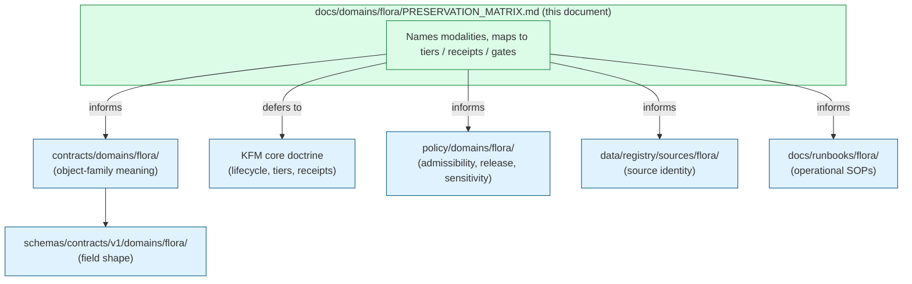
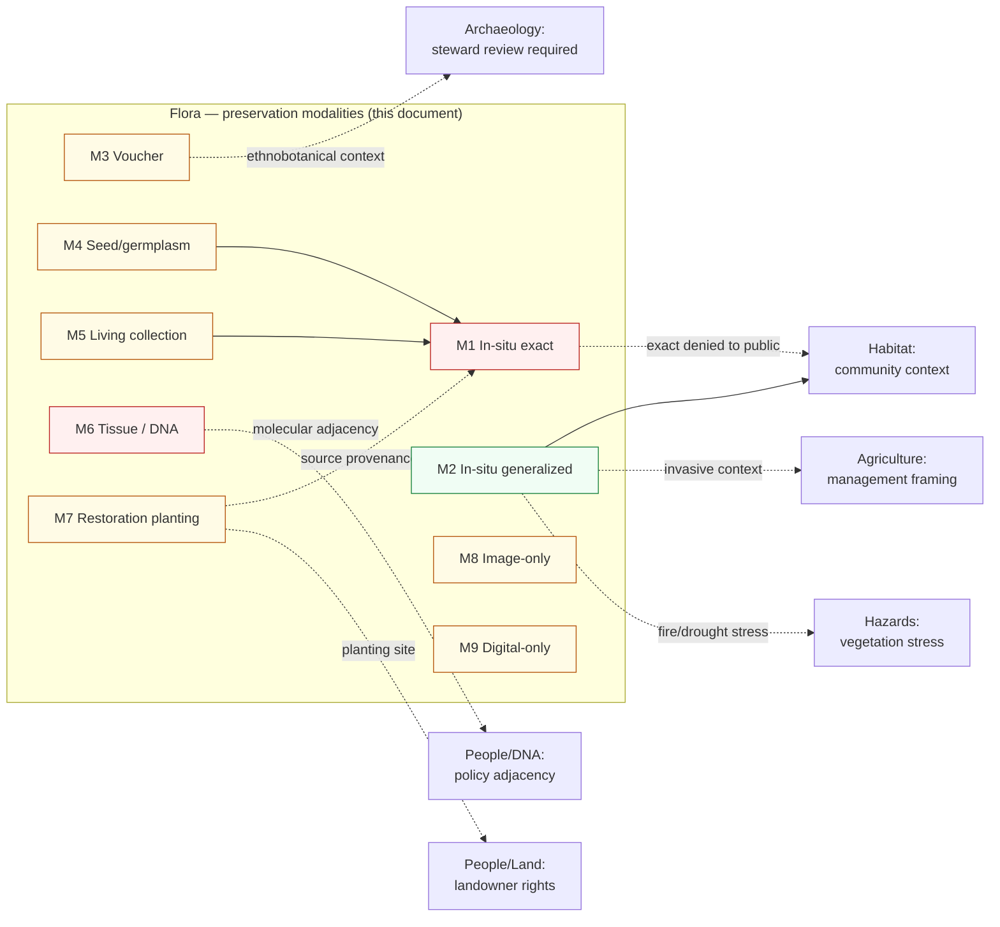

<!-- [KFM_META_BLOCK_V2]
doc_id: kfm://doc/flora-preservation-matrix
title: Flora Preservation Matrix
type: standard
version: v0.2
status: draft
owners: <flora-steward> · <docs-steward>
created: 2026-05-16
updated: 2026-06-03
policy_label: public
related:
  - ai-build-operating-contract.md                 # CONFIRMED canonical operating contract (CONTRACT_VERSION 3.0.0)
  - directory-rules.md                             # CONFIRMED placement authority (§12 Domain Placement Law, §13.1 contracts-vs-schemas)
  - docs/doctrine/lifecycle-law.md
  - docs/doctrine/truth-posture.md
  - docs/doctrine/trust-membrane.md
  - docs/domains/flora/README.md
  - docs/domains/flora/OBJECT_FAMILIES.md           # companion: per-family reference
  - docs/domains/flora/IDENTITY_MODEL.md            # companion: deterministic identity charter
  - docs/domains/flora/MISSING_OR_PLANNED_FILES.md  # companion: per-lane file register
tags: [kfm, flora, preservation, sensitivity, governance]
notes:
  # CONTRACT_VERSION pin: doctrine-adjacent; tracks ai-build-operating-contract.md v3.0.0.
  # Modality taxonomy (M1–M9) and per-modality tier assignments are PROPOSED; the tier scheme, receipt catalog, and lifecycle gates they map onto are CONFIRMED (Atlas Ch. 24.2/24.5/24.6).
  # Sensitivity follows the canonical five-tier T0–T4 register (Atlas Ch. 24.5.1); tier-scheme adoption-as-canonical is ADR-S-05 (PROPOSED).
  # Schema leaf uses schemas/contracts/v1/domains/flora/ (Directory Rules §12); companion Identity Model / Map UI docs use the bare flora/ form — CONFLICTED, see §13.
  # Pass-20 index IDs KFM-IDX-POL-003 / -005: the join-sensitivity and geoprivacy PRINCIPLES are CONFIRMED doctrine; the exact index-ID strings are NEEDS VERIFICATION.
  # Forward references to paths, schemas, policies, runbooks are NEEDS VERIFICATION until a mounted-repo pass.
[/KFM_META_BLOCK_V2] -->

# 🌿 Flora Preservation Matrix

> A doctrinal crosswalk that maps plant **preservation modalities** — in-situ, herbarium voucher, seed/germplasm, living collection, tissue/DNA, restoration planting, image-only, and digital-only — onto KFM's sensitivity tiers, evidence requirements, receipts, lifecycle gates, and cross-lane interfaces.

[](#0-meta-and-authority)
[](#0-meta-and-authority)
[](#10-lifecycle-integration-raw--published)
[](#5-the-matrix)
[](#)
[](#)
[](#13-open-questions-and-verification-backlog)
[](#)
<!-- ci-validators badge — TODO once a flora preservation validator workflow is wired -->

| Status | Owners | Contract | Last updated |
|---|---|---|---|
| `draft` (v0.2) | `<flora-steward>` · `<docs-steward>` | `CONTRACT_VERSION = "3.0.0"` | 2026-06-03 |

---

> [!IMPORTANT]
> This document is **doctrine**, not implementation. The lifecycle invariant, sensitivity tier scheme, receipt catalog, and lifecycle gates cited here are **CONFIRMED** in the KFM corpus. The nine-modality taxonomy, per-modality default tiers, and recommended receipt combinations are **PROPOSED** until ADRs and schema PRs land. All forward references to paths, schemas, policies, and runbooks are **NEEDS VERIFICATION** without a mounted repository.

---

## Mini Table of Contents

- [0. Meta and Authority](#0-meta-and-authority)
- [1. Purpose, Scope, and Non-Scope](#1-purpose-scope-and-non-scope)
- [2. Definitions](#2-definitions)
- [3. Boundary Against Neighboring Artifacts](#3-boundary-against-neighboring-artifacts)
- [4. The Preservation Modality Taxonomy](#4-the-preservation-modality-taxonomy)
- [5. The Matrix](#5-the-matrix)
- [6. Per-Modality Detail](#6-per-modality-detail)
- [7. Chain of Custody and Provenance Discipline](#7-chain-of-custody-and-provenance-discipline)
- [8. Receipts and Gates](#8-receipts-and-gates)
- [9. Cross-Lane Preservation Interfaces](#9-cross-lane-preservation-interfaces)
- [10. Lifecycle Integration (RAW → PUBLISHED)](#10-lifecycle-integration-raw--published)
- [11. Governed AI Behavior](#11-governed-ai-behavior)
- [12. Anti-Patterns](#12-anti-patterns)
- [13. Open Questions and Verification Backlog](#13-open-questions-and-verification-backlog)
- [14. Definition of Done](#14-definition-of-done)
- [15. Related Docs and Change Log](#15-related-docs-and-change-log)

---

## 0. Meta and Authority

| Field | Value |
|---|---|
| **Document type** | Domain doctrine (Flora) — preservation crosswalk |
| **Path** | `docs/domains/flora/PRESERVATION_MATRIX.md` *(PROPOSED; Directory Rules §12)* |
| **Owner** | `<flora-steward>` *(placeholder until assigned in `CODEOWNERS`)* |
| **Reviewers required for change** | Flora steward + Docs steward + Policy steward (sensitivity) |
| **`CONTRACT_VERSION`** | `"3.0.0"` (this doc is doctrine-adjacent) |
| **Authority of the matrix structure** | **PROPOSED** |
| **Authority of cited KFM constructs** *(tiers, receipts, lifecycle, deny-by-default register)* | **CONFIRMED** per `[ATLAS] §24`, `[ENCY] §7.6, §13`, `[UNIFIED] §6.5`, `[DIRRULES] §12` |
| **Authority of per-modality tier assignments** | **PROPOSED** — see §5, §6 |
| **Supersedes** | None. First doctrinal content; v0.2 is a polish/reconciliation revision of v0.1. |
| **Lifecycle invariant** | RAW → WORK / QUARANTINE → PROCESSED → CATALOG / TRIPLET → PUBLISHED *(CONFIRMED, `[DIRRULES] §0`)* |
| **Promotion posture** | **Default-deny.** A preservation record is not public until its modality, sensitivity, rights, and review state resolve to a permitted public surface. |

### 0.1 Authority order (CONFIRMED)

When sources disagree, resolve in this order:

1. **KFM core invariants and doctrine** — lifecycle law; cite-or-abstain; trust-membrane; watcher-as-non-publisher; default-deny promotion; sensitivity tier transition rules.
2. **Domain doctrine** — `[ENCY] §7.6`, `[ATLAS] §24.5`, `[UNIFIED] §6.5`.
3. **Accepted ADRs** that explicitly amend this matrix. *(Class CONFIRMED; specific ADR numbers NEEDS VERIFICATION.)*
4. **This document.**
5. **Per-modality README files** under `docs/domains/flora/modalities/` *(PROPOSED)*.
6. **Per-source descriptors** under `data/registry/sources/flora/` *(PROPOSED)*.

> [!NOTE]
> On a **path** question, `[DIRRULES]` outranks the Atlas (Directory Rules §2.1 authority order). The schema-leaf choice in this document (`schemas/contracts/v1/domains/flora/`) follows Directory Rules §12; see the cross-doc CONFLICTED note in [§13](#13-open-questions-and-verification-backlog).

### 0.2 Conformance language

- **MUST / MUST NOT** — non-negotiable. PRs that violate MUST are not merged absent an approved ADR.
- **SHOULD / SHOULD NOT** — strong default; deviation requires brief justification.
- **MAY** — permitted; consistency within a modality is still expected.

[back to top](#mini-table-of-contents)

---

## 1. Purpose, Scope, and Non-Scope

### 1.1 Purpose

Plant evidence enters KFM through many doors: a 19th-century pressed specimen in a herbarium; a seed accession at a national repository; a recent iNaturalist photograph; a vegetation polygon digitized from a state survey; an unpublished rare-plant point in a steward's notebook. These are **all preservation acts**, each with its own provenance chain, sensitivity profile, rights posture, and allowable public surface.

This document does three things:

1. **Names** the preservation modalities Flora must handle. *(§4)*
2. **Maps** each modality onto KFM's existing architecture — sensitivity tier, default object family, allowed transforms, required receipts, required gates, permitted public surface, cross-lane constraints. *(§5, §6)*
3. **Encodes** the chain-of-custody and join-sensitivity rules that determine whether a preservation record can move toward `PUBLISHED`. *(§7, §8, §10)*

### 1.2 In scope

- Plant evidence preservation as a *governance act* — what receipts and gates apply.
- The sensitivity inheritance rules from in-situ source to ex-situ derivative.
- Cross-lane constraints when preservation evidence touches Habitat, Archaeology (ethnobotany), People/Land (landowner-restricted material), and Geology (paleobotany at the boundary).
- Tier defaults per modality, allowed tier transitions, and the receipts each transition requires.

### 1.3 Out of scope

- **Object-family meaning** → `contracts/domains/flora/` and [`OBJECT_FAMILIES.md`](./OBJECT_FAMILIES.md) *(companion).*
- **Field-level shape** → `schemas/contracts/v1/domains/flora/` *(PROPOSED).*
- **Admissibility / release decisions** → `policy/domains/flora/` and `release/` *(PROPOSED).*
- **Source identity, rights, licensing** → `data/registry/sources/flora/` and `policy/sensitivity/flora/` *(PROPOSED).*
- **Operational procedures** → `docs/runbooks/flora/` *(PROPOSED; pattern mirrors existing `docs/runbooks/fauna/`).*
- **AI prompt design or Focus Mode templates** → `docs/governed-ai/` *(PROPOSED).*

> [!TIP]
> **Reviewer's check.** Does the change in flight modify *doctrine*, or modify a *schema / policy / runbook*? If the latter, this file should not be the place of change.

[back to top](#mini-table-of-contents)

---

## 2. Definitions

> [!NOTE]
> Definitions are **PROPOSED** unless explicitly labeled CONFIRMED with a citation. KFM-specific compound terms (`EvidenceBundle`, `EvidenceRef`, `SourceDescriptor`, `RedactionReceipt`, …) keep their casing exactly as the corpus uses them.

| Term | Definition | Status |
|---|---|---|
| **Preservation modality** | The form in which plant evidence is held: living in place; pressed and curated; cryopreserved as seed/tissue; propagated in cultivation; recorded as image; recorded as data only. The modality determines provenance chain and sensitivity inheritance. | **PROPOSED** |
| **In-situ preservation** | The living organism, population, or community at its naturally occurring location. The location *is* the record. | **PROPOSED** |
| **Ex-situ preservation** | The organism, propagule, tissue, or specimen held outside its natural location: herbarium voucher, seed bank, living collection, tissue/DNA repository. The provenance points back to an originating in-situ context. | **PROPOSED** |
| **Provenance chain** | The recorded sequence of acts (collection, accession, curation, transfer, deaccession, derivative production) that connects an ex-situ artifact to its in-situ origin. Each act is a transformation that should emit a receipt. | **PROPOSED** |
| **Sensitivity inheritance** | An ex-situ derivative's sensitivity is bounded below by the sensitivity of its in-situ source. A common-species voucher is not made sensitive by ex-situ status; a rare-species voucher does **not** lose its in-situ location sensitivity simply because the plant is now pressed. | **INFERRED** from `[DOM-FLORA]` geoprivacy posture + the CONFIRMED join-induced-sensitivity principle *(Pass-20 index ID NEEDS VERIFICATION)* |
| **Public surface** | What a public client sees through the governed API: feature, layer, attribute fields, Evidence Drawer payload, Focus Mode response. A preservation record may exist internally at exact tier yet appear publicly only as a generalized derivative. | **CONFIRMED** doctrine, applied to preservation here |
| **Preservation act** | A consequential operation on preservation evidence: collection, accession, generalization, redaction, deaccession, digitization, derivative emission, publication. Each is governed and should emit a receipt. | **PROPOSED** |
| **Modality drift** | The *recorded* modality of an artifact diverges from its physical reality — e.g., a "voucher specimen" record exists but the physical sheet was lost; a "living collection" accession is no longer alive. A known failure mode requiring correction. | **PROPOSED** |

[back to top](#mini-table-of-contents)

---

## 3. Boundary Against Neighboring Artifacts



This matrix **MUST NOT** contain:

- Object-field shapes (those belong in `schemas/`).
- Specific rule bodies (those belong in `policy/`).
- Source endpoints, ETags, or rights terms (those belong in `data/registry/sources/flora/`).
- Step-by-step operator procedures (those belong in `docs/runbooks/flora/`).

If a reader needs any of the above, this document **MUST** point them to the correct location, not duplicate it.

[back to top](#mini-table-of-contents)

---

## 4. The Preservation Modality Taxonomy

> [!WARNING]
> **Status of this taxonomy: PROPOSED.** The modalities below are not enumerated verbatim in the cited KFM corpus; this document proposes them as the operational categorization Flora uses to apply tier and receipt rules consistently. The underlying object families (`PlantTaxon`, `SpecimenRecord`, `FloraOccurrence`, `RarePlantRecord`, `VegetationCommunity`, `InvasivePlantRecord`, `PhenologyObservation`, `RangePolygon`, `HabitatAssociation`, `BotanicalSurvey`, `RestorationPlanting`, `RedactionReceipt`) are **CONFIRMED** per `[ENCY] §7.6` / `[ATLAS] §8.B`. See [`OBJECT_FAMILIES.md`](./OBJECT_FAMILIES.md).

### 4.1 The nine modalities

| # | Modality | Short form | Typical physical artifact | Typical KFM object family |
|---|---|---|---|---|
| **M1** | In-situ population, exact | `IN-SITU-EXACT` | The living plant(s) at the recorded coordinate | `FloraOccurrence`, `RarePlantRecord` |
| **M2** | In-situ population, generalized | `IN-SITU-GEN` | The living population represented at coarsened geometry | `RangePolygon`, generalized `FloraOccurrence` derivative |
| **M3** | Ex-situ herbarium voucher | `EX-SITU-VOUCHER` | Pressed/mounted/curated specimen sheet | `SpecimenRecord` |
| **M4** | Ex-situ seed / germplasm accession | `EX-SITU-SEED` | Sealed seed lot at controlled storage | `SpecimenRecord` *(subtype: accession — PROPOSED)* |
| **M5** | Ex-situ living collection | `EX-SITU-LIVING` | Living plant in botanical garden, arboretum, or restoration nursery | `SpecimenRecord` *(subtype: living — PROPOSED)* |
| **M6** | Ex-situ tissue / DNA / cryopreserved | `EX-SITU-TISSUE` | Tissue culture, DNA extract, cryo-preserved material | `SpecimenRecord` *(subtype: molecular — PROPOSED)* |
| **M7** | Restoration planting (re-introduced) | `RESTORE-PLANTING` | Intentional planting of propagated material at a chosen site | `RestorationPlanting` |
| **M8** | Image-only record | `IMAGE-ONLY` | Photograph or herbarium image with no separable physical specimen in KFM scope | `FloraOccurrence` with image evidence reference |
| **M9** | Digital-only record | `DIGITAL-ONLY` | Written observation with no specimen and no image (e.g., a 19th-century survey notebook entry) | `FloraOccurrence` with reduced evidence support |

> [!NOTE]
> M4 / M5 / M6 are flagged as **PROPOSED subtypes** of `SpecimenRecord` because `[ENCY] §7.6` / `[ATLAS] §8.B` enumerate `SpecimenRecord` as a single class. Whether to split this class into subtypes, or to carry modality as a field, is an **open ADR question** — see §13.

### 4.2 What makes a modality distinct

A modality is distinct in this matrix when **at least one** of the following differs from another:

1. **Provenance chain length.** In-situ has length 1 (the location). A seed-bank accession may have length 4+ (population → collection event → accession → derivative offspring).
2. **Sensitivity inheritance behavior.** Image-only records may carry geolocation EXIF that leaks an exact rare-plant site even when the plant is not visible at exact coordinate.
3. **Default rights posture.** Herbarium digitization rights often differ from observation-data rights.
4. **Public-surface options.** A seed-bank accession can be published *as an accession identifier* without exposing the originating wild population's exact location.
5. **Failure modes.** A living collection can die; a seed lot can lose viability; an image can be misidentified; a digital-only record cannot be re-checked.

[back to top](#mini-table-of-contents)

---

## 5. The Matrix

### 5.1 How to read this table

Each row is a modality. The columns are governance dimensions. **Default tier** follows the tier scheme in `[ATLAS] §24.5.1` (`T0` = Open, `T1` = Generalized, `T2` = Reviewer, `T3` = Restricted, `T4` = Denied — five tiers, **PROPOSED** as canonical pending ADR-S-05). For Flora, the cited default for "rare or culturally sensitive plant location" is `T4` (`[ATLAS] §24.5.2`); the modalities below extend that default to non-rare-plant cases.

> [!IMPORTANT]
> **Reading rule (CONFIRMED, `[ATLAS] §24.5.3`).** A tier *upgrade* (toward public) always needs both a transform receipt and a review record. A tier *downgrade* (toward less public) never needs both — `CorrectionNotice` alone suffices, and it precedes derivative invalidation.

### 5.2 The matrix proper

| Modality | Default tier *(COMMON / non-sensitive species)* | Default tier *(RARE / steward-listed / culturally sensitive species)* | Permitted public surface *(see §6)* | Required receipts to publish anything | Required gates | Cross-lane risk |
|---|---|---|---|---|---|---|
| **M1 IN-SITU-EXACT** | **T1** *(public-safe needs generalization or aggregation; an exact common-species point is allowable T0 only if no sensitive join risk — see §7.4)* | **T4** | None — exact in-situ tier never publishes; only its M2 derivative does | `TransformReceipt`, `RedactionReceipt`, `ReviewRecord`, `EvidenceBundle`, `ReleaseManifest` | Validation; sensitivity-redaction; review; release | Habitat (community membership); Archaeology (ethnobotany); People/Land (landowner restriction) |
| **M2 IN-SITU-GEN** | **T0** | **T1** | Generalized polygon / county / grid presence | `AggregationReceipt` *or* `RedactionReceipt`, `EvidenceBundle`, `ReleaseManifest` | Validation; aggregation/redaction; release | Join-induced sensitivity (§7.4) |
| **M3 EX-SITU-VOUCHER** | **T0** *(record + label data; image MAY be T0)* | **T2 or T1** *(label data may locate the in-situ source; coordinates often need generalization)* | Specimen record (label data minus precise coords) + image where rights permit | `RedactionReceipt` *(for coordinate generalization)*, `EvidenceBundle`, `ReleaseManifest` | Validation; rights review; coordinate-handling review; release | Original collector / herbarium rights; in-situ source sensitivity inherited |
| **M4 EX-SITU-SEED** | **T0** *(accession identifier, taxon)* | **T2 or T1** *(provenance polygon must be generalized; collector identity may be restricted)* | Accession identifier; taxonomic identity; coarse provenance polygon | `RedactionReceipt` *(provenance generalization)*, `EvidenceBundle`, `ReleaseManifest` | Validation; rights review *(repository terms)*; provenance-handling review; release | Originating wild-population sensitivity inherited; repository terms |
| **M5 EX-SITU-LIVING** | **T0** *(accession identifier, taxon, garden/site)* | **T2** *(garden may itself be public; provenance must be generalized; sensitive accessions held but not advertised)* | Accession identifier; taxon; garden display location | `RedactionReceipt` *(provenance)*, `EvidenceBundle`, `ReleaseManifest`; `CorrectionNotice` if accession dies *(modality drift)* | Validation; living-collection rights; provenance handling | Inherited in-situ sensitivity; theft risk for rare accessions |
| **M6 EX-SITU-TISSUE** | **T2** *(default reviewer-only; molecular material is not a normal public surface)* | **T4 → T3 only under named agreement** | Aggregate descriptors only (count of accessions, taxon, repository) | `PolicyDecision`, `ReviewRecord`, `EvidenceBundle`, named-agreement for any T3 release | Validation; rights review; named-agreement review; release | DNA/genomic policy adjacency (`[DOM-PEOPLE]`); never public exact unless agreement |
| **M7 RESTORE-PLANTING** | **T0** *(planting site, taxon, year, project)* | **T1 or T2** *(if planting uses material from a sensitive wild population, source location is inherited)* | Planting site, taxon, year, project sponsor *(label data only)* | `EvidenceBundle`, `ReleaseManifest`; `RedactionReceipt` if source provenance is sensitive | Validation; source-provenance review; planting-rights review; release | Source provenance may be sensitive; ownership of planting site |
| **M8 IMAGE-ONLY** | **T0** *(image + observation + generalized location)* | **T1** *(geolocation must be generalized or stripped from EXIF; image content may still reveal site)* | Image (rights-permitted), taxon, generalized location, observation time | `RedactionReceipt` *(EXIF stripping + coordinate generalization)*, `EvidenceBundle`, `ReleaseManifest` | Validation; image-rights review; EXIF redaction; release | Image content can leak site features; photographer rights |
| **M9 DIGITAL-ONLY** | **T0** *(low confidence)* | **T1** | Observation record with explicit "no physical specimen, no image" flag and confidence floor | `EvidenceBundle` *(must record reduced evidence support)*, `ReleaseManifest` | Validation; confidence floor enforcement; release | Cannot be re-verified; downgraded confidence affects Evidence Drawer |

> [!CAUTION]
> **Sensitivity is a property of the published product, not the originating modality.** *(CONFIRMED principle, `[DOM-FLORA]` + the join-induced-sensitivity rule; exact Pass-20 index ID NEEDS VERIFICATION.)* A modality default does not override species-level sensitivity, nor does it override join-induced sensitivity. A common-species voucher (M3, default `T0`) becomes sensitive if its locality joins a state-listed species inventory. A M2 generalized polygon becomes sensitive if its centroid plus a known rare-population radius identifies the source.

[back to top](#mini-table-of-contents)

---

## 6. Per-Modality Detail

> [!NOTE]
> Each subsection names the modality, its provenance chain shape, the evidence it minimally needs, the public surface it can support, the receipts it must emit on tier upgrade, and known failure modes. Flora-specific behavior derives from `[ENCY] §7.6` and `[ATLAS] §24.5`; modality-level application is **PROPOSED**.

<details>
<summary><strong>M1 — IN-SITU-EXACT</strong> (the living plant at its recorded coordinate)</summary>

- **Provenance chain.** Length 1: observation event captures the in-situ location.
- **Minimum evidence (PROPOSED).** Observer identity (or anonymized observer class), date, coordinate, coordinate uncertainty, taxon identification basis, source role per `SourceDescriptor`.
- **Public surface (PROPOSED).** **None at this tier.** Public clients see the M2 derivative. Stewards see M1 at `T2`/`T3` per their role.
- **Required receipts to derive M2.** `TransformReceipt` (generalization), `RedactionReceipt` (sensitive cases), `ReviewRecord`.
- **Failure modes.**
  - Coordinate precision exceeds source's true accuracy (false precision).
  - EXIF or upstream metadata reveals the exact point even after textual redaction.
  - Join with a rare-species inventory exposes a "common" record's true sensitivity.
- **Default-deny posture (CONFIRMED).** Exact in-situ records of rare or culturally sensitive plants `MUST NOT` reach a public surface. (`[ENCY] §13`; `[ATLAS] §24.5.2` Flora row = `T4`.)

</details>

<details>
<summary><strong>M2 — IN-SITU-GEN</strong> (generalized public-safe derivative of M1)</summary>

- **Provenance chain.** Length 2: M1 → generalization transform → M2.
- **Minimum evidence.** Reference to the source M1 (as an `EvidenceRef` resolving to `EvidenceBundle`); generalization parameters; receipts.
- **Public surface (PROPOSED).** Coarse polygon, county presence, HUC presence, or coarse grid cell, depending on species sensitivity and chosen generalization rule.
- **Required receipts.** `AggregationReceipt` *or* `RedactionReceipt`, with explicit `geometry_transform` (a CONFIRMED `RedactionReceipt` field per `[ATLAS] §24.2.1`).
- **Failure modes.**
  - Generalization parameter is too small relative to the rare-species protection radius.
  - Multiple M2 derivatives of the same M1 are released under different generalization radii, allowing intersection to localize the M1.
- **Coordinate generalization options (PROPOSED).** Suppress, generalize-to-grid, generalize-to-watershed, generalize-to-county, buffer, delayed publication, steward-only exact *(geoprivacy menu; Pass-20 index ID NEEDS VERIFICATION)*.

</details>

<details>
<summary><strong>M3 — EX-SITU-VOUCHER</strong> (pressed/mounted herbarium specimen)</summary>

- **Provenance chain.** Length 2–N: collection event (M1-like) → preservation act → accession → curation acts → digitization → public record.
- **Minimum evidence.** Herbarium / institution code, accession number, collector, collection date, locality text, taxonomic determination history (`ReviewRecord` per redetermination), digitization receipt where applicable.
- **Public surface (PROPOSED).** Specimen record with label data; coordinate fields generalized for sensitive species; image where rights permit. *Darwin Core Archive ingestion is described for USDA PLANTS / herbarium portals in `[NEWIDEAS-5-8]` (and the Pass-23 USDA PLANTS ingest card, KFM-P2-PROG-0006).*
- **Required receipts to upgrade tier.** `RedactionReceipt` for coordinate generalization; `ReviewRecord` for rare-plant cases; `EvidenceBundle` closure before publication.
- **Failure modes.**
  - Historical labels carry exact localities for species that have *since* become rare or extirpated — historic data inherits modern sensitivity.
  - Original-collector restrictions or institutional rights are unresolved.
  - Modality drift: the catalog says "voucher exists" but the physical sheet was lost; correction is required.

> [!IMPORTANT]
> **Historic sensitivity escalation (INFERRED).** A voucher collected in 1880 of a then-common plant that is now state-listed becomes sensitive *retroactively*. The locality text remains in the historical record; the public surface is governed by current sensitivity. See §7.3.

</details>

<details>
<summary><strong>M4 — EX-SITU-SEED</strong> (germplasm / seed bank accession)</summary>

- **Provenance chain.** Often long: source population → collection event → cleaning/curing → accession at primary repository → possibly transfer to a backup repository → derivative grow-out → re-collection → new accession.
- **Minimum evidence.** Repository code, accession number, taxon, provenance polygon (generalized), accession date, viability test history, repository terms.
- **Public surface (PROPOSED).** Accession identifier, taxon, coarse provenance polygon, repository identifier. The *exact* wild-population location is sensitive when the species is rare; the *fact* of the accession typically is not.
- **Required receipts.** `RedactionReceipt` for provenance generalization; `EvidenceBundle`; `ReleaseManifest`. Cross-reference to the repository's own terms (`SourceDescriptor`).
- **Failure modes.**
  - Provenance polygon, even when "generalized", carries an area small enough to identify the wild source.
  - Viability has dropped below a useful threshold but the catalog still claims the accession as a recovery resource (modality drift).
  - Repository terms change (re-licensing, restricted-access transitions); the catalog must follow.

</details>

<details>
<summary><strong>M5 — EX-SITU-LIVING</strong> (botanical garden, arboretum, nursery accession)</summary>

- **Provenance chain.** Source population → collection or propagule transfer → accession at garden → curation acts → possible display, possible propagation → derivative accessions.
- **Minimum evidence.** Garden / institution identifier, accession number, taxon, accession date, source provenance (generalized), current status (alive / dormant / dead).
- **Public surface (PROPOSED).** Garden often publishes the accession; KFM should still apply provenance generalization for sensitive source populations.
- **Required receipts.** `RedactionReceipt` for provenance; `CorrectionNotice` when an accession dies and its status field would otherwise become misleading (modality drift).
- **Failure modes.**
  - Garden's public display reveals the garden's holding; the wild-source provenance is still inheritable, even from a public garden display.
  - Theft risk for rare accessions: precise location-within-garden may itself be sensitive even if the garden is public.
  - Accession ID re-use across institutions causes identity collisions.

</details>

<details>
<summary><strong>M6 — EX-SITU-TISSUE</strong> (tissue culture, DNA, cryopreserved material)</summary>

- **Provenance chain.** Source individual → collection → tissue or DNA extraction → cryopreservation → possible derivative culture → possible sequencing → published sequence reference.
- **Minimum evidence.** Repository identifier, voucher cross-reference (to M3 when available), taxon, source individual identity (often coded for restricted-access), extraction date, storage location class.
- **Public surface (PROPOSED).** Aggregate descriptors only by default — e.g., *"the repository holds N accessions of taxon T from K collection events"*. Public release of individual-level molecular records requires a named agreement and falls under `T3`.
- **Required receipts.** `PolicyDecision` against repository terms; `ReviewRecord` per release; potentially `AIReceipt` for any AI-mediated analysis surface.
- **Failure modes.**
  - DNA/genomic adjacency: this modality borders the `[DOM-PEOPLE]` DNA posture; cross-domain joins (e.g., human ethnobotanical use → plant tissue → plant DNA) must be reviewed under both lanes.
  - Sample identity is often a small-N space, making "de-identified" individuals re-identifiable in practice.
  - Repository terms are highly variable; a single change can affect publication eligibility.

</details>

<details>
<summary><strong>M7 — RESTORE-PLANTING</strong> (intentional re-introduction or restoration planting)</summary>

- **Provenance chain.** Source population → collection / propagation → planting event at chosen site → monitoring observations.
- **Minimum evidence.** Project identifier, planting site, taxon, year, source population provenance (generalized when source is sensitive), monitoring history.
- **Public surface (PROPOSED).** Planting site, taxon, year, project sponsor. The *source* of propagated material may be sensitive even when the planting itself is celebrated publicly.
- **Required receipts.** `RedactionReceipt` if source provenance is sensitive; `EvidenceBundle` linking back to source population.
- **Failure modes.**
  - Restoration plantings become "occurrence-like" records over time; downstream consumers may treat them as natural populations. `RestorationPlanting` and `FloraOccurrence` `MUST` remain distinguishable.
  - Source population details leak through project documentation, press releases, or sponsor reports outside KFM's control.

</details>

<details>
<summary><strong>M8 — IMAGE-ONLY</strong> (photographic record, no physical specimen)</summary>

- **Provenance chain.** Length 2: observation event → image capture → upload to source.
- **Minimum evidence.** Image reference, photographer identity (or anonymized), taxon determination basis, date, generalized location, EXIF redaction receipt.
- **Public surface (PROPOSED).** Image (rights-permitting), taxon, generalized location, date. **Image content** can reveal the site (e.g., a distinctive rock formation in the background); this is a known failure mode requiring image review for rare-plant cases.
- **Required receipts.** `RedactionReceipt` capturing EXIF stripping and coordinate generalization; image-rights review under `SourceDescriptor` terms.
- **Failure modes.**
  - EXIF GPS not stripped; image carries exact coordinate even when the catalog has it generalized.
  - Image background reveals a distinctive landmark (cliff face, mile marker) that localizes a rare-plant site.
  - Aggregation of many M8 records from the same observer with the same general timestamp localizes a population.

</details>

<details>
<summary><strong>M9 — DIGITAL-ONLY</strong> (observation with no specimen and no image)</summary>

- **Provenance chain.** Length 1, with reduced evidence: a textual claim, often historic.
- **Minimum evidence.** Observer (where known), date, locality text, taxon name as recorded, explicit `evidence_class = "digital-only"` flag, explicit confidence floor.
- **Public surface (PROPOSED).** The record is published only when its confidence floor passes the validator threshold and the Evidence Drawer can present its reduced support without misleading the reader.
- **Required receipts.** `EvidenceBundle` `MUST` record the reduced-evidence flag; the public surface `MUST` carry a trust-state badge consistent with reduced support (`BOUNDED` where the contract's optional outcome applies).
- **Failure modes.**
  - Historic typo, misidentification, or taxonomic name churn collapses into a misleading modern claim.
  - Locality text is ambiguous ("near the river") and cannot be re-verified.
  - Downstream consumers treat M9 records as equivalent to M1/M2 records and propagate weak claims.

</details>

[back to top](#mini-table-of-contents)

---

## 7. Chain of Custody and Provenance Discipline

### 7.1 The chain rule (PROPOSED)

> [!IMPORTANT]
> Every ex-situ artifact `MUST` carry a resolvable chain back to its in-situ origin context, even when that origin is generalized or unknown. Where the origin is unknown, the chain `MUST` record *unknown*, not *omit it*.

### 7.2 Sensitivity inheritance (INFERRED from CONFIRMED doctrine)

For any modality M(N), where N ∈ {3, 4, 5, 6, 7}:

```text
tier(M_N) = max(
  default_tier_for_modality(M_N),
  inherited_tier_from_source_in_situ(M_N),
  inherited_tier_from_repository_terms(M_N)
)
```

This rule prevents an ex-situ artifact from "laundering" a sensitive source through the act of preservation. It operationalizes the CONFIRMED principle that *sensitivity is a property of the published product, not just of the originating source* *(Pass-20 join-sensitivity card; exact index ID NEEDS VERIFICATION)*.

### 7.3 The acquisition-date rule (INFERRED)

A historic voucher of a then-common plant that is *now* state-listed inherits **current** sensitivity, not the sensitivity that applied at collection time. The historic record remains in the internal evidence base; the public surface follows current policy. This follows from the same product-property principle as §7.2.

### 7.4 Join sensitivity (CONFIRMED principle, modality-specific application)

The principle that *a benign source can become sensitive through join* — and that **sensitive joins fail closed** (CONFIRMED across the corpus; the PLANTS-plus-occurrence warning is in `[NEWIDEAS-5-15]`) — applies in this domain as follows:

| Join | Modality of left input | Modality of right input | Effect |
|---|---|---|---|
| Specimen voucher × state rare-plant list | M3 | catalog | M3 inherits state-list sensitivity for any matched taxon |
| Common-species image record × historic locality gazetteer | M8 | catalog | Image-content reveals exact site even when coordinate was generalized |
| Restoration planting × source population provenance | M7 | M1 / M2 | Restoration site documentation can localize a sensitive source |
| County PLANTS list × GBIF occurrences | aggregate | M8 / M3 mix | PLANTS county presence → GBIF locality matching can identify exact occurrences (`[NEWIDEAS-5-15]`) |

> [!WARNING]
> **Default-deny stance.** When a join's right-hand-side is sensitive and the left-hand-side public, the *output* `MUST` be treated at the higher tier until review explicitly clears it. A non-reviewed join `MUST` fail closed.

### 7.5 Provenance fields (PROPOSED minimum)

For each ex-situ modality, the following fields `SHOULD` exist somewhere in the provenance chain, even if not all on a single object:

- `source_in_situ_ref` — `EvidenceRef` to an M1 record where one exists; an unknown-source marker where it does not.
- `collection_event_id`
- `collection_date`
- `collector_id` *(anonymized when policy requires)*
- `accession_path` — ordered list of repository transfers
- `preservation_acts[]` — ordered list of consequential acts, each with its receipt reference
- `current_status` — for living modalities; updated by `CorrectionNotice` on change
- `rights_terms_ref` — `EvidenceRef` to current repository terms

> [!NOTE]
> This is **PROPOSED shape only**. Authoritative field shapes belong in `schemas/contracts/v1/domains/flora/` *(PROPOSED location; leaf form CONFLICTED — see §13)*.

[back to top](#mini-table-of-contents)

---

## 8. Receipts and Gates

### 8.1 Receipts used by this matrix (CONFIRMED catalog)

The receipts below are CONFIRMED in `[ATLAS] §24.2.1` ("Master Receipt Catalog"). This section names which receipt applies to which preservation act; it does not redefine the receipts. **PROPOSED schema home for receipt classes: `schemas/contracts/v1/receipts/`** (per `[ATLAS] §24.2`, pending ADR-S-03; NEEDS VERIFICATION).

| Receipt | When it applies to preservation | Citation |
|---|---|---|
| **`SourceDescriptor`** | At admission of any preservation source (herbarium portal, seed bank manifest, citizen-science feed). | `[ATLAS] §24.2.1`, `[DIRRULES]` |
| **`TransformReceipt`** | When a geometry is reprojected, simplified, or otherwise transformed (e.g., generalizing an M1 coordinate to an M2 polygon). | `[ATLAS] §24.2.1` |
| **`RedactionReceipt`** | When sensitive content is masked, fuzzed, withheld, or geometry-generalized for sensitivity, rights, or policy reasons. CONFIRMED for Flora. | `[ATLAS] §24.2.1`, `[DOM-FLORA]` |
| **`AggregationReceipt`** | When points are rolled up to a polygon, county, watershed, or grid cell as a public-safe derivative. | `[ATLAS] §24.2.1` |
| **`ReviewRecord`** | When a steward, rights-holder, or policy reviewer approves or denies a transition (admission, redaction, promotion, release). | `[ATLAS] §24.2.1` |
| **`PolicyDecision`** | When a policy rule evaluates an object: rights / sensitivity / release checks. | `[ATLAS] §24.2.1` |
| **`ValidationReport`** | When a validator runs against a target (e.g., specimen-record schema). | `[ATLAS] §24.2.1` |
| **`EvidenceBundle`** | Closure object referenced by `EvidenceRef`; required for any claim that depends on evidence. | `[ENCY]` |
| **`ReleaseManifest`** | At the `PUBLISHED` transition; lists contents, digests, evidence refs, rollback target. | `[ATLAS] §24.2.1` |
| **`CorrectionNotice`** | Post-publication correction. Used for modality drift (M5 accession death, M4 viability loss). | `[ATLAS] §24.2.1` |
| **`RollbackCard`** | Companion to `ReleaseManifest`; identifies the rollback target. | `[ATLAS] §24.2.1` |
| **`AIReceipt`** | When AI is used to summarize, draft, or interpret preservation evidence; AI never the root truth. | `[ATLAS] §24.2.1`, `[GAI]` |

### 8.2 Lifecycle gates this matrix relies on (CONFIRMED)

Per `[ATLAS] §24.6.1` ("Lifecycle gates"):

| Gate | Pre-condition | Required artifacts |
|---|---|---|
| Admission (— → RAW) | Source identity and rights minimally established; source-role intent set | `SourceDescriptor`, payload hash |
| Normalization (RAW → WORK / QUARANTINE) | Schema, geometry, time, identity, evidence, rights, policy rules runnable | `TransformReceipt`, `ValidationReport`, `PolicyDecision`, QUARANTINE for failures |
| Validation (WORK → PROCESSED) | Validators deterministic, fixtures present | `ValidationReport` pass; `RedactionReceipt` / `AggregationReceipt` where applicable |
| Catalog closure (PROCESSED → CATALOG / TRIPLET) | `EvidenceRef`s resolve; digests close | `CatalogMatrix` entry, `EvidenceBundle`, graph/triplet projections |
| Release (CATALOG → PUBLISHED) | Review state where required; release authority distinct from author when materiality applies | `ReleaseManifest`, rollback target, correction path, `ReviewRecord` |
| Correction (PUBLISHED → PUBLISHED') | Detected error or new evidence; downstream identified | `CorrectionNotice` |

### 8.3 Per-modality minimum receipt set (INFERRED from CONFIRMED gates)

| Modality | At admission | At normalization | At validation | At catalog closure | At release | Special |
|---|---|---|---|---|---|---|
| M1 | `SourceDescriptor` | `TransformReceipt` (CRS), `PolicyDecision` (sensitivity) | `ValidationReport`, `RedactionReceipt` (if T2+) | `EvidenceBundle` | **Not released directly** — only M2 derivatives | M1 stays at steward tier; correction supported |
| M2 | inherits from M1 | `TransformReceipt` (generalization) | `ValidationReport`, `AggregationReceipt` or `RedactionReceipt` | `EvidenceBundle` | `ReleaseManifest`, `RollbackCard` | Generalization parameters logged |
| M3 | `SourceDescriptor` (herbarium portal) | `TransformReceipt`, `PolicyDecision` | `ValidationReport`, `RedactionReceipt` (coords) | `EvidenceBundle` | `ReleaseManifest`, `ReviewRecord` (rare cases) | Determination history retained |
| M4 | `SourceDescriptor` (repository) | `TransformReceipt` (provenance), `PolicyDecision` (terms) | `ValidationReport`, `RedactionReceipt` (provenance) | `EvidenceBundle` | `ReleaseManifest`, `ReviewRecord` (rare cases) | Viability history retained |
| M5 | `SourceDescriptor` (garden) | `TransformReceipt`, `PolicyDecision` | `ValidationReport` | `EvidenceBundle` | `ReleaseManifest` | `CorrectionNotice` on accession death |
| M6 | `SourceDescriptor` (repository, restricted) | `TransformReceipt`, `PolicyDecision`, `ReviewRecord` | `ValidationReport` | `EvidenceBundle` | **Aggregate-only public release**; individual records require named agreement | Cross-checked against `[DOM-PEOPLE]` |
| M7 | `SourceDescriptor` (project) | `TransformReceipt`, `PolicyDecision` (source-provenance) | `ValidationReport`, `RedactionReceipt` (source if sensitive) | `EvidenceBundle` | `ReleaseManifest` | `RestorationPlanting` `MUST` stay distinguishable from `FloraOccurrence` |
| M8 | `SourceDescriptor` (citizen-science / image portal) | `TransformReceipt`, `PolicyDecision`, image-rights review | `ValidationReport`, `RedactionReceipt` (EXIF + coord) | `EvidenceBundle` | `ReleaseManifest` | Image-content review for rare-plant cases |
| M9 | `SourceDescriptor` | `TransformReceipt`, `PolicyDecision` | `ValidationReport`, evidence-class flag | `EvidenceBundle` (reduced-evidence) | `ReleaseManifest` | Trust-state badge `MUST` reflect reduced support |

> [!NOTE]
> The receipts named are CONFIRMED; the per-modality combination is **INFERRED** from the CONFIRMED gate requirements in `[ATLAS] §24.6.1`. The receipt ↔ lifecycle-phase mapping in `[ATLAS] §24.2.2` confirms which receipts are emitted/referenced at each phase.

[back to top](#mini-table-of-contents)

---

## 9. Cross-Lane Preservation Interfaces

Flora preservation evidence does not live in isolation. The relations below derive from `[ATLAS] §24.4.6` ("Edges owned by Flora"). The Atlas names three CONFIRMED Flora-owned edges — **Habitat, Agriculture, Archaeology**; the Hazards, People/Land, and Geology rows below are **PROPOSED extensions** drawn from Flora §8.F context relations and adjacent-lane posture. Modality-level application is **PROPOSED** throughout.



### 9.1 Flora ↔ Habitat *(CONFIRMED edge, `[ATLAS] §24.4.6`)*

| Relation | Modality side | Constraint |
|---|---|---|
| Vegetation community evidence feeds ecological-system mapping | M2 primarily; M3 historic context where useful | M1 exact rare-plant locations `MUST NOT` cross. (CONFIRMED.) |

### 9.2 Flora ↔ Archaeology (ethnobotany) *(CONFIRMED edge, `[ATLAS] §24.4.6`)*

| Relation | Modality side | Constraint |
|---|---|---|
| Ethnobotanical context may bound archaeological-site interpretation | M3 vouchers with culturally relevant taxa | Steward / cultural review `MUST` precede any public surface. Flora `MUST NOT` override `[DOM-ARCH]` cultural authority. (CONFIRMED.) |

### 9.3 Flora ↔ Agriculture *(CONFIRMED edge, `[ATLAS] §24.4.6`)*

| Relation | Modality side | Constraint |
|---|---|---|
| Invasive-plant context informs management framing | M2 invasive-plant generalized surface | This `MUST` remain *framing*, never an instruction. (CONFIRMED.) |

### 9.4 Flora ↔ Hazards *(PROPOSED extension; Flora §8.F context relation)*

| Relation | Modality side | Constraint |
|---|---|---|
| Fire, drought, flood, smoke, vegetation stress | M2 vegetation-index / community state | Flora outputs `MUST NOT` become emergency instructions; KFM is never an alert authority. (`[DOM-HAZ]`.) |

### 9.5 Flora ↔ People/Land *(PROPOSED extension)*

| Relation | Modality side | Constraint |
|---|---|---|
| Restoration plantings on private land; herbarium vouchers from private land | M7, M3 | Landowner rights MAY restrict location detail; private person-parcel joins fail closed by default. (`[DOM-PEOPLE]` posture, applied to Flora — **PROPOSED** extension.) |

### 9.6 Flora ↔ Geology (paleobotany boundary) *(PROPOSED)*

| Relation | Modality side | Constraint |
|---|---|---|
| Paleobotanical fossil material lives at the Flora ↔ Geology boundary | M3-like preserved material with geological context | This matrix proposes that paleobotanical material be governed by `[DOM-GEOL]` as primary, with Flora providing taxonomic identity only — pending ADR. **NEEDS VERIFICATION.** |

[back to top](#mini-table-of-contents)

---

## 10. Lifecycle Integration (RAW → PUBLISHED)

```mermaid
flowchart TD
    A[Source admitted<br/>SourceDescriptor present<br/>RAW] --> B{Schema, geometry,<br/>time, identity,<br/>evidence, rights,<br/>policy runnable?}
    B -->|No| Q[QUARANTINE<br/>reason recorded]
    B -->|Yes| C[WORK<br/>TransformReceipt<br/>PolicyDecision]
    C --> D{Validators pass?<br/>Receipts present?}
    D -->|No| C
    D -->|Yes| E[PROCESSED<br/>ValidationReport<br/>RedactionReceipt or<br/>AggregationReceipt<br/>where applicable]
    E --> F{EvidenceRefs resolve?<br/>Digests close?}
    F -->|No| H[HOLD at PROCESSED]
    F -->|Yes| G[CATALOG / TRIPLET<br/>EvidenceBundle<br/>graph/triplet projection]
    G --> R{Modality + sensitivity<br/>review state?}
    R -->|Sensitive + no review| H2[HOLD at CATALOG<br/>fail closed]
    R -->|Cleared| P[PUBLISHED<br/>ReleaseManifest<br/>RollbackCard<br/>correction path]
    P -.correction.-> P2[PUBLISHED'<br/>CorrectionNotice]
    P -.modality drift<br/>e.g. M5 accession dies.-> P2

    classDef gate fill:#fef3c7,stroke:#b45309
    classDef state fill:#e0f2fe,stroke:#075985
    classDef fail fill:#fee2e2,stroke:#b91c1c
    classDef ok fill:#dcfce7,stroke:#15803d
    class B,D,F,R gate
    class A,C,E,G state
    class Q,H,H2 fail
    class P,P2 ok
```

### 10.1 Application notes

- **Promotion is a governed state transition, not a file move.** (CONFIRMED, `[DIRRULES] §0`.) Preservation evidence often moves between systems — herbarium IPT → KFM RAW → public KFM API — and each step is a governed transition.
- **Watcher-as-non-publisher.** Source watchers (herbarium portal pollers, citizen-science feed watchers) `MUST NOT` write directly to `data/processed/` or `data/published/`; they write only to `data/raw/` or `data/quarantine/` and emit receipts and candidate decisions. (CONFIRMED invariant, `[DIRRULES] §7.3`.)
- **Default-deny at the catalog gate.** A preservation candidate `MUST NOT` cross to `CATALOG` until its modality, sensitivity, and review state resolve. Sensitive modalities lacking review `HOLD` at `PROCESSED`.
- **Finite outcomes.** Every governed surface that touches a preservation record returns a `RuntimeResponseEnvelope` (`ANSWER` / `ABSTAIN` / `DENY` / `ERROR`, optional `NARROWED` / `BOUNDED`).

[back to top](#mini-table-of-contents)

---

## 11. Governed AI Behavior

> [!NOTE]
> **CONFIRMED doctrine** (`[ENCY] §7.6`, `[GAI]`). AI may summarize released Flora `EvidenceBundle`s, compare evidence, explain limitations, and draft steward-review notes. AI `MUST` `ABSTAIN` when evidence is insufficient and `DENY` where policy, rights, sensitivity, or release state blocks the request. Every AI answer emits an `AIReceipt` and returns through the `RuntimeResponseEnvelope`.

### 11.1 Preservation-specific AI rules (PROPOSED extensions)

| Behavior | Rule |
|---|---|
| Summarize a voucher's label and determination history | **ALLOWED** when the voucher is released; cite the `EvidenceBundle`; emit `AIReceipt` |
| Infer a wild-source location from a generalized provenance polygon | **DENY** — this is exactly the inference geoprivacy is designed to prevent |
| Aggregate seed-bank holdings across taxa | **ALLOWED** at aggregate level with `AIReceipt` |
| Predict the exact location of a rare plant from partial observations | **DENY** — inference of sensitive geometry is a deny condition |
| Draft a restoration project summary | **ALLOWED** when project records are released; source-provenance sensitivity `MUST` be respected |
| Explain why a record was `RedactionReceipt`-generalized | **ALLOWED** — the rationale is itself part of the trust posture |
| Re-determine a taxon based on text alone | **ABSTAIN** — taxonomic redetermination requires steward review, not AI |

### 11.2 Citation requirement (CONFIRMED cite-or-abstain)

Any AI answer that touches a preservation record `MUST` cite the `EvidenceBundle` and the modality. An answer that names a specific accession or locality without an `EvidenceRef` is uncited and `MUST` be denied.

[back to top](#mini-table-of-contents)

---

## 12. Anti-Patterns

| # | Anti-pattern | Symptom | Fix |
|---|---|---|---|
| 12.1 | **Modality laundering** | An exact in-situ coordinate is republished as "a voucher locality" without redaction, on the theory that "the voucher is in a museum, so the locality is historical". | Apply §7.3 acquisition-date rule. Current sensitivity governs the public surface regardless of collection date. |
| 12.2 | **Generalization shopping** | Multiple M2 derivatives of the same M1 are emitted at different generalization radii (county, HUC, 10 km grid), and their intersection localizes the M1. | Pin a single canonical generalization per release; record the rule in `RedactionReceipt`. Forbid emitting overlapping derivatives without review. |
| 12.3 | **Image-content leak** | EXIF is stripped; coordinate is generalized; but the image content shows a distinctive landmark that localizes the site. | Image-content review for rare-plant cases is part of release; mark as a gate failure, not a curiosity. |
| 12.4 | **Modality drift unrecorded** | A M5 accession dies; the record still claims "alive" in the public surface. | Living modalities `MUST` carry a `current_status` field; status changes emit `CorrectionNotice`; downstream derivatives invalidate. |
| 12.5 | **Restoration / occurrence collision** | Downstream consumers treat M7 as M1/M2 (natural occurrence), inflating apparent range. | `RestorationPlanting` and `FloraOccurrence` `MUST` remain distinguishable in the catalog; layer manifests `MUST NOT` blend them silently. |
| 12.6 | **Source-watcher publishes** | A herbarium polling worker writes directly into `data/published/` to "save a step". | Watcher-as-non-publisher invariant: workers write only to `data/raw/` or `data/quarantine/` and emit receipts and candidate decisions. (CONFIRMED, `[DIRRULES] §7.3`.) |
| 12.7 | **Implicit join sensitivity** | A common-species occurrence feed is joined to a state-listed plant inventory in a derivative product without review; the derivative is treated as having the lower input's sensitivity. | Join output inherits the higher tier; non-reviewed joins fail closed. (CONFIRMED principle.) |
| 12.8 | **Schema/contract parallel home** | A modality-specific schema appears in `contracts/domains/flora/` and a different version appears in `schemas/contracts/v1/domains/flora/`. | Canonical home is `schemas/contracts/v1/...` per ADR-0001; `contracts/` retains semantic Markdown only. (CONFIRMED principle, `[DIRRULES] §13.1`; ADR number NEEDS VERIFICATION.) |
| 12.9 | **AI substitutes for steward** | An AI surface claims a re-determination ("this voucher is now considered X") without a `ReviewRecord`. | Re-determination requires steward review; AI `ABSTAIN` (§11.1). |
| 12.10 | **Documentation as substitute for verification** | This file's claims are quoted as repo behavior. | Doctrine is not implementation. Mark implementation claims `PROPOSED` or `NEEDS VERIFICATION` until verified against a mounted repo. |

[back to top](#mini-table-of-contents)

---

## 13. Open Questions and Verification Backlog

> [!NOTE]
> Each item below is intended to migrate to `docs/registers/VERIFICATION_BACKLOG.md` as separate entries on the next pass.

| # | Item | Evidence that would settle it | Status |
|---|---|---|---|
| 13.1 | Should M4 / M5 / M6 be separate object families, or a single `SpecimenRecord` class with a `modality` field? | An ADR + a schema PR under `schemas/contracts/v1/domains/flora/`. Cited doctrine names `SpecimenRecord` as a single class (`[ENCY] §7.6` / `[ATLAS] §8.B`). | **Open ADR question** |
| 13.2 | Is `RestorationPlanting` mature enough to be a distinct catalog projection, or does it ride on `FloraOccurrence` with a flag? | An ADR + fixtures showing distinguishability under §12.5. Cited doctrine names `RestorationPlanting` as a class. | **Open ADR question** |
| 13.3 | What is the canonical generalization rule per sensitivity class? Watershed? County? Grid cell? | A `policy/sensitivity/flora/` *(or `policy/domains/flora/geoprivacy.rego`)* rule set plus a `RedactionReceipt` fixture set. | **NEEDS VERIFICATION** |
| 13.4 | Where does paleobotanical material live — Flora or Geology? | An ADR; pending repo evidence. See §9.6. | **NEEDS VERIFICATION** |
| 13.5 | Where do M6 (tissue/DNA) policy boundaries align with `[DOM-PEOPLE]` DNA policy? | Cross-domain policy review record; an ADR if needed. | **Open cross-lane question** |
| 13.6 | Canonical home for per-modality README detail? `docs/domains/flora/modalities/M3-VOUCHER.md` or sections within this file? | An ADR + a docs-stewardship decision. | **Open documentation question** |
| 13.7 | Does `docs/runbooks/flora/` exist? The fauna runbook establishes the pattern; the flora analog is **PROPOSED**. | A mounted-repo check. | **NEEDS VERIFICATION** |
| 13.8 | Validator exit-code contract for Flora preservation validators. | The validator exit-code ADR (project-wide; Directory Rules OPEN-DR-03/07). | **Pending ADR (project-wide)** |
| 13.9 | EXIF-redaction validator behavior on uploads with no EXIF metadata at all (M8). | Fixtures + validator behavior in a mounted repo. | **NEEDS VERIFICATION** |
| 13.10 | Is the herbarium-data ingest flow Darwin Core Archive based (per `[NEWIDEAS-5-8]` / KFM-P2-PROG-0006), and where is the connector? | A `connectors/` or `pipelines/` reference. | **NEEDS VERIFICATION** |
| 13.11 | Policy joins that should fail closed even when both inputs appear public: PLANTS × GBIF for any state-listed taxon. | A `policy/domains/flora/joins.rego` *(PROPOSED path)* with explicit deny rules. | **Open policy question** |
| 13.12 | Exact Pass-20 index IDs for join-sensitivity and geoprivacy (cited descriptively as `KFM-IDX-POL-003` / `-005`). | Mounted Pass-20 index. The *principles* are CONFIRMED; the ID strings are **NEEDS VERIFICATION**. | **NEEDS VERIFICATION** |
| 13.13 | Schema-leaf form: `schemas/contracts/v1/domains/flora/` (Directory Rules §12, used here) vs `schemas/contracts/v1/flora/` (companion Identity Model / Map UI docs). | One-line reconciliation; DRIFT_REGISTER entry; §2.1 favors `domains/flora/`. | **CONFLICTED** |
| 13.14 | `PROV.md` ↔ `PROVENANCE.md` naming (project-wide). This doc references "provenance chain" descriptively. | The project-wide naming ADR. | **Project-wide ADR pending** |

[back to top](#mini-table-of-contents)

---

## 14. Definition of Done

This document is done enough to enter the repository when:

- it is placed at `docs/domains/flora/PRESERVATION_MATRIX.md` per Directory Rules §12 (PROPOSED; NEEDS VERIFICATION);
- the flora steward, docs steward, and policy (sensitivity) steward review it;
- it is linked from the Flora domain README and the companion Object-Families / Identity-Model / Missing-or-Planned-Files docs;
- the schema-leaf and Pass-20-index-ID items (13.12, 13.13) are logged in `docs/registers/DRIFT_REGISTER.md` / `VERIFICATION_BACKLOG.md`;
- it does not conflict with accepted ADRs (ADR-0001 schema home; ADR-S-05 tier scheme; the `SpecimenRecord` subtype ADR if filed);
- the `GENERATED_RECEIPT.json` planned in the PR is wired into CI;
- future changes follow the operating contract's §37 lifecycle.

[back to top](#mini-table-of-contents)

---

## 15. Related Docs and Change Log

### 15.1 Related docs *(forward references — PROPOSED until mounted-repo pass)*

- [`docs/domains/flora/README.md`](./README.md)
- [`docs/domains/flora/OBJECT_FAMILIES.md`](./OBJECT_FAMILIES.md) — per-family reference *(companion)*
- [`docs/domains/flora/IDENTITY_MODEL.md`](./IDENTITY_MODEL.md) — deterministic identity charter *(companion)*
- [`docs/domains/flora/MISSING_OR_PLANNED_FILES.md`](./MISSING_OR_PLANNED_FILES.md) — per-lane file register *(companion)*
- `docs/domains/flora/RIGHTS_AND_SENSITIVITY.md` *(PROPOSED)*
- `docs/domains/flora/modalities/` *(if §13.6 resolves toward per-modality READMEs)*
- `contracts/domains/flora/`
- `schemas/contracts/v1/domains/flora/`
- `policy/sensitivity/flora/` · `policy/domains/flora/`
- `data/registry/sources/flora/`
- `docs/runbooks/flora/SOURCE_REFRESH_RUNBOOK.md` *(parallel to existing fauna runbook)*

### 15.2 Sources cited

| Citation key | Document | Sections relied upon |
|---|---|---|
| `[DOM-FLORA]` | KFM Domain and Capability Encyclopedia | §7.6 (Flora — mission, sources, object families, lifecycle, sensitivity posture) |
| `[ENCY]` | KFM Domain and Capability Encyclopedia | §13 (Sensitive / Deny-by-Default Register) |
| `[ATLAS]` | KFM Domains Culmination Atlas v1.1 | §8.B (Flora object families); §24.2 / §24.2.1 (Master Receipt Catalog); §24.2.2 (receipt ↔ phase map); §24.4.6 (Edges owned by Flora); §24.5 (tier scheme, per-domain matrix, transitions); §24.6.1 (lifecycle gates) |
| `[UNIFIED]` | KFM Unified Implementation Architecture Build Manual | §6.5 (Flora — scope, sensitivity posture, objects, pipelines, publication gates) |
| `[DIRRULES]` | `directory-rules.md` v1.3 | §7.3 (connectors / watcher-as-non-publisher); §12 (Domain Placement Law); §13.1 (contracts-vs-schemas drift); §2.4 (ADR-requiring changes) |
| `[GAI]` | KFM Whole-UI Governed AI Expansion Report | Governed AI rules; `AIReceipt`; finite outcomes |
| `[NEWIDEAS-5-8]` | New Ideas 5-8-26 | USDA PLANTS / herbarium / Darwin Core ingest patterns *(see also Pass-23 card KFM-P2-PROG-0006)* |
| `[NEWIDEAS-5-15]` | New Ideas 5-15-26 | PLANTS + GBIF/iNaturalist join-sensitivity warning |

> [!NOTE]
> Pass-20 index IDs `KFM-IDX-POL-003` (join-induced sensitivity) and `KFM-IDX-POL-005` (geoprivacy / transform receipts) are cited descriptively in prior drafts. The underlying **principles are CONFIRMED** doctrine; the **exact index-ID strings are NEEDS VERIFICATION** against the mounted Pass-20 index (see §13.12).

### 15.3 Change log

| Version | Date | Author | Change |
|---|---|---|---|
| v0.1 | 2026-05-16 | `<flora-steward>` *(placeholder)* | First edition: modality taxonomy, matrix, per-modality detail, chain-of-custody, receipts-and-gates, cross-lane interfaces, lifecycle integration, governed-AI rules, anti-patterns, open questions. |
| v0.2 | 2026-06-03 | `<flora-steward>` *(placeholder)* | Pinned `CONTRACT_VERSION = "3.0.0"`; added Definition of Done; cross-linked the Flora doc suite (Object Families, Identity Model, Missing-or-Planned-Files). Marked the five-tier scheme as PROPOSED-canonical (ADR-S-05). Marked Flora↔Hazards / People/Land cross-lane rows as PROPOSED extensions (only Habitat/Agriculture/Archaeology are CONFIRMED §24.4.6 edges). Relabeled Pass-20 index IDs: principle CONFIRMED, ID string NEEDS VERIFICATION. Added receipt schema-home (`schemas/contracts/v1/receipts/`, PROPOSED). Added the schema-leaf CONFLICTED note. Tightened the watcher-as-non-publisher rule to §7.3 (`data/raw`/`quarantine` only). Referenced `RuntimeResponseEnvelope` for finite outcomes. |

### 15.4 Reviewer checklist for changes to this file

- [ ] Does the change preserve the CONFIRMED tier scheme and receipt catalog? *(If altering, requires ADR.)*
- [ ] Does the change preserve sensitivity inheritance and join-sensitivity rules? *(If altering, requires ADR + Policy steward.)*
- [ ] Does the change introduce new modalities or merge existing ones? *(If yes, update §4 and §5 atomically.)*
- [ ] Are PROPOSED / INFERRED labels still accurate after the change? *(Drift down rather than up; verification raises confidence.)*
- [ ] Does the change require updates in `contracts/`, `schemas/`, `policy/`, or `docs/runbooks/`? *(Documentation alone is not enforcement.)*
- [ ] Are forward references in §15.1 still PROPOSED, or have any moved to CONFIRMED with mounted-repo evidence?

---

**Last updated:** 2026-06-03 · **Version:** v0.2 · `CONTRACT_VERSION = "3.0.0"` · [back to top](#mini-table-of-contents)
