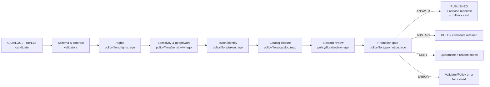

<!-- [KFM_META_BLOCK_V2]
doc_id: kfm://doc/flora/publication-and-policy
title: Flora Publication and Policy
type: standard
version: v0.1
status: draft
owners: flora-steward (TBD — see VERIFICATION_BACKLOG.md)
created: 2026-05-08
updated: 2026-05-08
policy_label: public
related:
  - docs/domains/flora/README.md
  - docs/domains/flora/ARCHITECTURE.md
  - docs/domains/flora/PIPELINES_AND_LIFECYCLE.md
  - docs/domains/flora/SOURCE_REGISTRY.md
  - docs/domains/flora/UI_AND_EVIDENCE_DRAWER.md
  - docs/domains/flora/VERIFICATION_BACKLOG.md
  - docs/adr/ADR-flora-schema-home.md
  - docs/adr/ADR-flora-source-roles.md
  - docs/adr/ADR-flora-sensitive-location-policy.md
  - docs/adr/ADR-flora-public-layer-strategy.md
  - policy/flora/publish.rego
  - policy/flora/sensitivity.rego
  - policy/flora/rights.rego
  - policy/flora/promotion.rego
  - policy/flora/review.rego
  - policy/flora/catalog.rego
  - policy/flora/ai.rego
  - data/registry/flora/sensitivity_policies.yaml
  - data/registry/flora/rights_profiles.yaml
  - data/registry/flora/layer_registry.yaml
tags: [kfm, flora, publication, policy, governance, sensitivity, rights]
notes:
  - "All paths PROPOSED until verified against mounted repo evidence."
  - "Owner identity NEEDS VERIFICATION."
  - "Schema-home placement awaits ADR-flora-schema-home.md."
[/KFM_META_BLOCK_V2] -->

# Flora Publication and Policy

> Rights, sensitivity, and public-safe publication rules for the **Flora** domain lane of the Kansas Frontier Matrix (KFM). Authoritative for *what* may be published, *under what conditions*, and *with what evidence and receipts attached*.

<p>
  <a href="#open-verification-items"></a>
  <a href="#scope-and-exclusions"></a>
  
  
  
  
</p>

> [!IMPORTANT]
> **Repository state.** The KFM repository is not mounted in this session. Every path, rule binding, registry name, schema location, and policy file referenced below is **PROPOSED** until verified against current repo evidence. This document describes doctrine and the *intended* publication regime for Flora; it does not assert that any of the named files yet exist in their stated form.

---

## Quick jumps

- [Scope and exclusions](#scope-and-exclusions)
- [Doctrinal invariants](#doctrinal-invariants)
- [Source-role publication matrix](#source-role-publication-matrix)
- [Rights discipline](#rights-discipline)
- [Sensitivity and geoprivacy](#sensitivity-and-geoprivacy)
- [Public-safe geometry rules](#public-safe-geometry-rules)
- [Promotion gate](#promotion-gate)
- [Catalog closure and release manifests](#catalog-closure-and-release-manifests)
- [Deny / quarantine catalog](#deny--quarantine-catalog)
- [Reason codes](#reason-codes)
- [Finite outcomes for runtime, API, UI](#finite-outcomes-for-runtime-api-ui)
- [Receipts and proofs](#receipts-and-proofs)
- [Corrections and rollback](#corrections-and-rollback)
- [Pre-publish checklist](#pre-publish-checklist)
- [Open verification items](#open-verification-items)
- [Related docs](#related-docs)

---

## Scope and exclusions

### Repo fit

This document lives at:

```
docs/
└── domains/
    └── flora/
        ├── README.md
        ├── ARCHITECTURE.md
        ├── PIPELINES_AND_LIFECYCLE.md
        ├── PUBLICATION_AND_POLICY.md   ← you are here
        ├── SOURCE_REGISTRY.md
        ├── UI_AND_EVIDENCE_DRAWER.md
        ├── DATA_MODEL.md
        ├── VERIFICATION_BACKLOG.md
        └── …
```

> **Directory Rules basis.** Domain docs sit under the `docs/` responsibility root in the `domains/<domain>/` subtree, not at repo root. Policy logic itself lives under `policy/` (`policy/flora/*.rego`); registry inputs under `data/registry/flora/`; release artifacts under `data/published/flora/`. This file is the *human-readable* statement of those rules.

### What this doc is

- The single normative source for **what Flora may publish, under what conditions, and what receipts must accompany the act of publication**.
- The contract behind `policy/flora/publish.rego`, `policy/flora/sensitivity.rego`, `policy/flora/rights.rego`, `policy/flora/promotion.rego`, `policy/flora/review.rego`, `policy/flora/catalog.rego`, and `policy/flora/ai.rego` (all PROPOSED).
- The reviewer reference for any Flora promotion candidate, release manifest, or correction notice.

### What this doc is *not*

| ❌ Not this doc | ✅ Goes here instead |
|---|---|
| Field-level schema definitions | `contracts/flora/*.schema.json` (or `schemas/contracts/v1/flora/` — see `ADR-flora-schema-home.md`) |
| Lifecycle stage mechanics (RAW → PUBLISHED) | `docs/domains/flora/PIPELINES_AND_LIFECYCLE.md` |
| Per-source descriptors and roles | `docs/domains/flora/SOURCE_REGISTRY.md` · `data/registry/flora/sources.yaml` |
| MapLibre / Drawer / Focus payload contracts | `docs/domains/flora/UI_AND_EVIDENCE_DRAWER.md` |
| Executable Rego rules | `policy/flora/*.rego` (this doc is the spec they implement) |
| Open verification queue | `docs/domains/flora/VERIFICATION_BACKLOG.md` |

[Back to top](#flora-publication-and-policy)

---

## Doctrinal invariants

These are **non-negotiable** for the Flora lane. They restate KFM core invariants in flora-specific terms.

1. **Lifecycle law.** `SOURCE EDGE → RAW → WORK / QUARANTINE → PROCESSED → CATALOG / TRIPLET → PUBLISHED`. Public surfaces read **only** from `PUBLISHED`. RAW, WORK, and QUARANTINE are never reachable through the governed API, MapLibre layers, exports, search, Focus Mode, or any other normal public path.
2. **Promotion is a state transition, not a file move.** Copying bytes into `data/published/flora/` does not constitute publication. Publication requires a passing promotion-gate decision recorded in a release manifest.
3. **Cite-or-abstain.** Consequential public claims must resolve to a released `EvidenceBundle`. Missing evidence yields `ABSTAIN` at runtime and `DENY` at promotion.
4. **Trust membrane.** Generated language never substitutes for evidence, policy, review state, source authority, or release state. Focus Mode runs *after* evidence and policy resolution.
5. **Deny-by-default for sensitive exposure.** Exact occurrence points for rare, protected, or culturally sensitive flora are denied unless rights, policy, *and* steward review explicitly allow them.
6. **Reversibility.** Every release ships with a rollback target. Withdrawal is a first-class operation, not a deletion.

[Back to top](#flora-publication-and-policy)

---

## Source-role publication matrix

Source role is a **first-class field** on every flora source descriptor and travels with every record into processed data, EvidenceBundles, API envelopes, Drawer payloads, and layer descriptors. Role does not determine truth; it sets **authority boundary, review burden, and publication eligibility**.

| Source role | Default trust use | Publication default |
|---|---|---|
| `official` | Anchors official status / regulatory / authoritative spatial claims within authority boundary. | Publishable **only** after rights, sensitivity, and review are resolved. |
| `institutional` | Strong evidence for specimen / collection facts; may carry license or precision constraints. | Publish public-safe metadata; exact geometry depends on rights and sensitivity. |
| `steward_reviewed` | Curated by responsible flora steward, heritage program, or qualified reviewer. | Public only with explicit release decision. |
| `corroborative` | Supports — does not control — legal or status claims. | Aggregate or generalize; cite limitations. |
| `community_observation` | Useful with quality grade, reviewer status, and license filters. | Publish only if license and sensitivity allow; avoid false precision. |
| `controlled_access` | Terms-, license-, or steward-gated source. | **Deny** public exact publication unless authorization is explicit. |
| `derived_model` | Range maps, suitability, indices, interpolations, generalized summaries. | Publish with model card, uncertainty, and lineage; never as observation. |
| `generalized_public_surface` | Public-safe geometry derived from internal detail. | Publishable when transform lineage, sensitivity, and rights are resolved. |

> [!NOTE]
> **Authority does not stack across roles.** A `corroborative` GBIF aggregator cannot promote a record into an `official` legal-status claim. A `derived_model` range map cannot be presented as observed presence.

### Publication eligibility values

Every flora source descriptor must carry exactly one `public_publication_eligibility` value:

`public_ok` · `public_generalized_only` · `controlled_only` · `deny` · `unknown`

`unknown` **fails closed** — no public publication, no Focus Mode citation, no MapLibre exposure.

[Back to top](#flora-publication-and-policy)

---

## Rights discipline

Rights are evaluated **before** sensitivity and **before** promotion. Unknown rights block public release.

| Rights state | Runtime posture | Promotion posture |
|---|---|---|
| Known public, attribution required | `ANSWER` (with attribution carried in evidence) | Allowed if other gates pass |
| License known but constrains derivatives | Restrict per terms | Promotion only for permitted derivatives |
| Controlled / no-redistribution | `ABSTAIN` or `DENY` for public path | Public **deny**; controlled internal use only |
| Unknown | `ABSTAIN` | **Deny** |
| `noassertion` | `ABSTAIN` with reason | **Deny** until terms resolved |

### Required rights surface

Every consequential flora response (API envelope, Drawer payload, Focus answer, layer descriptor) must surface:

- License or terms identifier (or `noassertion` with reason)
- Attribution string when required
- Redistribution / derivative posture
- Source role and authority boundary
- Source `verification_status` — one of `unverified`, `probed`, `fixture_validated`, `steward_reviewed`, `release_approved`

> Rights profiles are reusable. Define them once in `data/registry/flora/rights_profiles.yaml` (PROPOSED) and reference by id from each source descriptor.

[Back to top](#flora-publication-and-policy)

---

## Sensitivity and geoprivacy

> [!CAUTION]
> **Default for rare, protected, and culturally sensitive flora: deny exact public geometry.** Override requires (a) explicit rights, (b) policy allowance, *and* (c) steward review — all three. Any one missing fails the gate.

### Sensitivity classes (proposed)

These align with the cross-domain sensitivity escalation matrix and are codified in `data/registry/flora/sensitivity_policies.yaml` (PROPOSED).

| Class | Meaning | Public geometry posture |
|---|---|---|
| `public_exact_allowed` | Non-sensitive, rights allow public exact geometry, source geoprivacy permits it. | Exact public geometry may publish with evidence and rights. |
| `public_generalized` | May publish only at county / grid / watershed / bbox / generalized support. | Generalized geometry **plus** redaction receipt. |
| `restricted_precise` | Precise coordinates protected by taxon, source, steward, or policy. | No public precise geometry; restricted store only. |
| `embargoed` | Temporal delay required (phenology, monitoring window, agreement). | No public record until embargo lifts; public summary only. |
| `steward_review_required` | Steward decision required before any release-class assignment. | **Hold**; no public promotion. |
| `quarantine` | Rights, sensitivity, taxonomy, geometry, or source role unresolved. | **Quarantine**; not public. |

### Inputs that determine class

Classification combines: taxon legal / conservation status, source-declared geoprivacy, occurrence context (pollination, seed-source, propagule sites for rare flora), coordinate uncertainty, life-stage / season window, steward overrides, and rights posture. No single input — including a taxon's name — determines class on its own.

[Back to top](#flora-publication-and-policy)

---

## Public-safe geometry rules

Internal precise geometry may exist where policy permits and only in **access-controlled** stores. Public payloads carry **only** generalized, withheld, or obscured geometry. Every transform emits a redaction / generalization receipt.

| Object / location type | Internal precise allowed? | Public default | Required artifact |
|---|---|---|---|
| Common species occurrence (non-sensitive) | Yes | Public exact (where rights allow) | EvidenceBundle; source role; uncertainty |
| Rare / protected species occurrence | Yes, restricted | Generalized or withheld | Redaction receipt; steward review record |
| Specimen with georeference | Yes, depending on institution terms | Public-safe metadata; geometry per rights | Institution rights; georeference protocol |
| Vegetation community polygon | Yes | Public with classification system, epoch, source | Method & uncertainty; release manifest |
| Range map (derived) | Yes | Public with model card, uncertainty | Model card; lineage; "model not observation" label |
| Habitat-association edge | Yes | Public if join is non-disclosing | Method, confidence, sensitive-leak validator |
| Phenology / condition product | Yes | Public with windows, masks, uncertainty | Asset list; mask metadata; uncertainty |

### Required redaction-receipt fields

Every generalization, withholding, or obscuring transform produces a record (PROPOSED schema: `flora_redaction_receipt.schema.json` — may reuse a shared `RedactionReceipt`):

- `transform_class` — `generalize` · `withhold` · `obscure` · `aggregate` · `embargo`
- `method` — e.g. snap-to-grid, county-bucket, watershed-bucket, jitter, suppress
- `precision_bucket` or `aggregation_unit`
- `input_geometry_hash`, `output_geometry_hash`
- `policy_version`, `reason_code`
- `source_refs`, `actor`, `run_ref`
- Timestamps and obligations

> [!WARNING]
> **Silent stripping is a violation.** Removing a sensitive field without recording the transform reason is treated as a publication violation. Validators must fail closed.

[Back to top](#flora-publication-and-policy)

---

## Promotion gate

Promotion from `CATALOG / TRIPLET` to `PUBLISHED` is a **decision**, not a file move. The gate consumes a normalized policy input bundle and emits a `flora_decision_envelope` with one of: `ANSWER` (allow) · `ABSTAIN` · `DENY` · `ERROR`.



### Required inputs to the promotion gate

| Field group | Required content |
|---|---|
| `subject_ref` | Promotion candidate id; references to processed records, evidence, catalog. |
| `requested_action` | `publish`, `serve_api`, `render_layer`, `focus_answer`, `export`. |
| `access_role` | `public`, `registered`, `steward`, `domain_reviewer`, `admin`, `system`. |
| `source_posture` | `source_role`, `rights_status`, `activation_status`, `attribution_required`. |
| `sensitivity_posture` | One of: `none`, `generalized`, `exact_location_sensitive`, `living_person`, `DNA`, `archaeology`, `critical_infrastructure`, `rare_species`. |
| `review_state` | `draft`, `reviewed`, `approved`, `blocked`, `needs_steward`, `withdrawn`. |
| `release_state` | `unreleased`, `candidate`, `published`, `stale`, `corrected`, `withdrawn`. |
| `evidence_posture` | `resolved`, `unresolved`, `conflicted`, `weak_support`, `source_role_mismatch`. |
| `time_posture` | `fresh`, `stale`, `expired`, `unknown`. |

### Decision envelope shape (illustrative)

```json
{
  "decision_id": "...",
  "subject_ref": "flora_promotion_candidate://...",
  "requested_action": "publish",
  "access_role": "public",
  "result": "deny",
  "reason_codes": ["sensitivity.exact_location", "review_required"],
  "obligations": ["generalize_geometry", "steward_review"],
  "evidence_refs": ["evidence_bundle://..."],
  "policy_bundle_ref": "policy/flora@<spec_hash>",
  "policy_hash": "sha256:...",
  "valid_until": "...",
  "created_time": "..."
}
```

> *Field names above are illustrative.* The authoritative shape lives in `contracts/flora/flora_decision_envelope.schema.json` (PROPOSED) and should reuse the shared `DecisionEnvelope` if available.

[Back to top](#flora-publication-and-policy)

---

## Catalog closure and release manifests

Receipts, proofs, and catalog records are **not interchangeable**. A release is not a release until closure proves it.

| Artifact family | Role | Proposed home |
|---|---|---|
| STAC records | Spatial asset discoverability for PMTiles / COG / GeoJSON / GeoParquet. | `data/catalog/stac/flora/` |
| DCAT records | Dataset / distribution cataloging for public inventory. | `data/catalog/dcat/flora/` |
| PROV lineage | Activities, agents, entities, derivations, source-to-output trace. | `data/catalog/prov/flora/` |
| Catalog matrix | Machine check that STAC / DCAT / PROV / manifest / proof / runtime refs close. | `data/catalog/flora/catalog_matrix/*.json` |
| Run receipts | Process memory for fetch / normalize / validate / diff. | `data/receipts/flora/` |
| Proof bundles | Release-grade evidence with checksums and review state. | `data/proofs/flora/` |
| EvidenceBundles | Runtime-resolvable support for claims and Drawer payloads. | `data/proofs/flora/evidence_bundles/` |
| Release manifests | Published artifact inventory, digests, policy / review / correction refs, rollback target. | `data/published/flora/manifests/` |
| Rollback cards | Reversal plan for published layer / API alias and correction notice. | `data/proofs/flora/rollback_cards/` |

### Closure requirements

A flora release manifest is valid only if the catalog matrix proves:

1. STAC item ids and asset checksums align with the manifest digest.
2. DCAT distribution checksums align with STAC and manifest.
3. PROV-O graph identifies source descriptor, run, and output entity.
4. Every cited `EvidenceBundle` resolves and references only `PUBLISHED` evidence.
5. Policy decision refs and steward review refs are present.
6. A rollback target is set.

Missing closure → **DENY**.

[Back to top](#flora-publication-and-policy)

---

## Deny / quarantine catalog

| Case | Example reason codes | Outcome |
|---|---|---|
| Missing rights | `missing_rights`, `unknown_rights` | `ABSTAIN` runtime; **DENY** promotion if publication requires rights. |
| Missing evidence / source refs | `missing_source_id`, `missing_evidence_bundle` | **DENY** consequential publication. |
| Exact public geometry for sensitive rare flora | `precise_sensitive_location_denied`, `geoprivacy_required` | **DENY**; require redaction / generalization receipt. |
| Publication from RAW / WORK / QUARANTINE refs | `public_payload_exposes_internal_ref` | **DENY**. |
| Unresolved taxonomy when accepted identity required | `ambiguous_taxon_identity`, `accepted_taxon_required` | **DENY** or **QUARANTINE**. |
| Modeled output presented as observed truth | `model_as_observation`, `knowledge_character_mismatch` | **DENY**. |
| Missing required review | `review_required`, `steward_review_missing` | **DENY**. |
| Uncited AI flora answers | `ai_missing_evidence_bundle_or_citations` | **DENY**. |
| Incomplete catalog matrix or proof bundle | `catalog_matrix_not_closed`, `proof_bundle_incomplete` | **DENY**. |
| Invalid or insufficiently generalized public geometry | `invalid_geometry`, `public_geometry_not_generalized` | **DENY**. |
| Controlled-access source asked to publish | `controlled_access_publication_denied` | **DENY**. |

[Back to top](#flora-publication-and-policy)

---

## Reason codes

Reason codes are stable, machine-readable strings emitted by policy decisions, validators, and runtime envelopes. Naming uses dotted families. The list below is **PROPOSED** and tracked in `data/registry/flora/sensitivity_policies.yaml` and the relevant Rego policy rules.

<details>
<summary><strong>Reason-code families</strong> (click to expand)</summary>

- **rights.** — `rights.unknown`, `rights.controlled`, `rights.noassertion`, `rights.attribution_missing`
- **sensitivity.** — `sensitivity.exact_location`, `sensitivity.rare_species`, `sensitivity.steward_review_required`, `sensitivity.embargoed`
- **evidence.** — `evidence.unresolved`, `evidence.weak_support`, `evidence.bundle_missing`, `evidence.source_role_mismatch`
- **taxon.** — `taxon.ambiguous`, `taxon.accepted_required`, `taxon.authority_unknown`
- **catalog.** — `catalog.matrix_not_closed`, `catalog.stac_drift`, `catalog.dcat_drift`, `catalog.prov_missing`
- **review.** — `review.required`, `review.steward_missing`, `review.scope_mismatch`
- **release.** — `release.unreleased_ref`, `release.stale`, `release.withdrawn`, `release.rollback_target_missing`
- **payload.** — `payload.exposes_internal_ref`, `payload.public_geometry_not_generalized`, `payload.ai_missing_citations`
- **integrity.** — `integrity.invalid_geometry`, `integrity.crs_undeclared`, `integrity.precision_insufficient`

</details>

[Back to top](#flora-publication-and-policy)

---

## Finite outcomes for runtime, API, UI

Every governed surface returns exactly one of:

| Outcome | Meaning | Required attachments |
|---|---|---|
| `ANSWER` | Evidence and policy resolved; answer permitted within scope. | EvidenceBundle refs, source roles, freshness, policy / review state. |
| `ABSTAIN` | Insufficient evidence, unknown rights, or precision insufficient. | Reason codes; suggested next step where helpful. |
| `DENY` | Policy denial (rights, sensitivity, review, integrity). | Reason codes; obligations; audit ref. |
| `ERROR` | Validator or policy error. | Error class; safe fallback; **never** fluent prose substituting for evidence. |

### Surface-by-surface rules

| Surface | Must show | Must not |
|---|---|---|
| **MapLibre public flora layer** | Generalized / public-safe geometry, trust badge, freshness, source role, review state. | Read RAW / WORK / QUARANTINE; treat style as truth source. |
| **Evidence Drawer** | Claim summary, evidence refs, resolved bundle, source role, rights, sensitivity transform, catalog ref, correction state. | Hide negative outcomes; omit policy block. |
| **Focus Mode** | Scope chips, evidence pool, finite-outcome banner, citations, audit ref, denial / obligation codes. | Answer without citations; consume unpublished candidate data; reveal restricted exact locations. |
| **Governed API** | Finite-outcome envelope; freshness, policy, rights, review, source-role, provenance fields. | Return raw RAW / WORK / QUARANTINE refs; expose unpublished candidates. |
| **Review surface** | Promotion candidates, sensitivity flags, redaction receipts, taxonomy conflicts, reviewer decisions. | Bypass policy gates; rewrite source evidence. |

[Back to top](#flora-publication-and-policy)

---

## Receipts and proofs

> [!NOTE]
> **Receipt ≠ proof ≠ catalog ≠ publication.** A receipt records process memory. A proof is release-grade trust evidence. A catalog makes artifacts discoverable and cross-linked. Publication is a governed state transition that may reference all three.

| Concept | What it is | What it is *not* |
|---|---|---|
| Run receipt | Process memory: fetch / normalize / validate / diff with input/output digests, validators, timing, actor. | Not release proof. Not catalog metadata. |
| Redaction receipt | Transform record (generalize / withhold / obscure / aggregate / embargo) with input/output hashes and policy version. | Not a substitute for a steward review record. |
| Review record | Human or steward decision, scope, actor, date, obligations. | Not a policy bypass. |
| Proof bundle | Release-grade evidence assembled at promotion time. | Not a runtime answer. |
| EvidenceBundle | Runtime-resolvable claim support. | Not generated language; never authored by AI. |
| Release manifest | Inventory of published artifacts, digests, policy / review / correction refs, rollback target. | Not a source descriptor. |
| Rollback card | Reversal plan for a release, with correction-notice scaffold. | Not a deletion or silent replacement. |

[Back to top](#flora-publication-and-policy)

---

## Corrections and rollback

Every flora release ships with a rollback target. Withdrawal preserves receipts and proofs; it does **not** delete history.

1. **Correction notice** — public statement of what changed, why, and what evidence supports the change. Linked from the affected release manifest.
2. **Supersession** — new release `spec_hash` issued; previous manifest marked superseded but retained.
3. **Rollback** — signed alias is moved to a prior `spec_hash`. Artifacts and receipts are not deleted.
4. **Drill** — rollback rehearsal is required before depending on the path in production. *(NEEDS VERIFICATION until the rehearsal harness is confirmed in the repo.)*

[Back to top](#flora-publication-and-policy)

---

## Pre-publish checklist

Reviewers use this list before approving a flora promotion candidate. A failed item is a **DENY** unless explicitly addressed and re-approved.

- [ ] Source descriptor present, complete, and `verification_status` ≥ `fixture_validated`.
- [ ] `source_role` and `authority_boundary` declared and consistent with claim language.
- [ ] Rights / license known, attribution carried, derivative posture clear (or `ABSTAIN` / `DENY` selected).
- [ ] Sensitivity class assigned; redaction receipt present where required.
- [ ] No exact public geometry for `restricted_precise`, `steward_review_required`, or `quarantine` records.
- [ ] Accepted taxon identity present (or `ambiguous_taxon_identity` recorded with abstain rationale).
- [ ] CRS declared and normalized; coordinate uncertainty present; precision bucket appropriate to public surface.
- [ ] EvidenceBundle resolves; cites only `PUBLISHED` evidence.
- [ ] Catalog matrix closes (STAC / DCAT / PROV / manifest / proof / runtime).
- [ ] Steward review record exists with matching scope.
- [ ] Release manifest includes rollback target.
- [ ] Finite-outcome envelope is well-formed for every governed surface that will serve this release.
- [ ] No public payload references RAW / WORK / QUARANTINE.
- [ ] AI / Focus answers (if any) are evidence-backed and cite released bundles.
- [ ] Correction path documented.

[Back to top](#flora-publication-and-policy)

---

## Open verification items

| # | Item | Status | Why it matters |
|---|---|---|---|
| 1 | Schema home: `contracts/flora/` vs `schemas/contracts/v1/flora/`. | NEEDS VERIFICATION | Drives where validators and OpenAPI references resolve. Awaits `ADR-flora-schema-home.md`. |
| 2 | Public-safe generalization thresholds (precision buckets, aggregation units). | NEEDS VERIFICATION | Awaits `ADR-flora-sensitive-location-policy.md`. |
| 3 | MapLibre public-layer strategy (which layers, which generalization). | NEEDS VERIFICATION | Awaits `ADR-flora-public-layer-strategy.md`. |
| 4 | Source-role vocabulary lock. | NEEDS VERIFICATION | Awaits `ADR-flora-source-roles.md`. |
| 5 | Taxon authority precedence (USDA PLANTS / ITIS / WFO / POWO). | NEEDS VERIFICATION | Drives accepted-identity resolution. |
| 6 | Reuse of shared `EvidenceBundle`, `DecisionEnvelope`, `ReleaseManifest`, `CatalogMatrix`. | NEEDS VERIFICATION | Avoids parallel governance objects. |
| 7 | OPA / Conftest harness presence and CI invocation. | UNKNOWN | Required for executable policy gates. |
| 8 | Signing / proof harness for release artifacts. | UNKNOWN | Required for proof-grade releases. |
| 9 | Steward identity for `flora-steward` placeholder. | UNKNOWN | Required for review records. |

Tracked alongside this doc in `docs/domains/flora/VERIFICATION_BACKLOG.md`.

[Back to top](#flora-publication-and-policy)

---

## Related docs

- [`docs/domains/flora/README.md`](./README.md) — lane entrypoint.
- [`docs/domains/flora/ARCHITECTURE.md`](./ARCHITECTURE.md) — end-to-end flora architecture.
- [`docs/domains/flora/PIPELINES_AND_LIFECYCLE.md`](./PIPELINES_AND_LIFECYCLE.md) — RAW → PUBLISHED stage rules.
- [`docs/domains/flora/SOURCE_REGISTRY.md`](./SOURCE_REGISTRY.md) — source descriptors and roles.
- [`docs/domains/flora/UI_AND_EVIDENCE_DRAWER.md`](./UI_AND_EVIDENCE_DRAWER.md) — Drawer / Focus payload contracts.
- [`docs/domains/flora/VERIFICATION_BACKLOG.md`](./VERIFICATION_BACKLOG.md) — outstanding checks.
- [`docs/adr/ADR-flora-source-roles.md`](../../adr/ADR-flora-source-roles.md) — source-role lock.
- [`docs/adr/ADR-flora-sensitive-location-policy.md`](../../adr/ADR-flora-sensitive-location-policy.md) — geometry thresholds.
- [`docs/adr/ADR-flora-public-layer-strategy.md`](../../adr/ADR-flora-public-layer-strategy.md) — MapLibre strategy.
- [`docs/adr/ADR-flora-schema-home.md`](../../adr/ADR-flora-schema-home.md) — schema placement.

> All paths above are PROPOSED and resolve relative to the repo root once the file structure is verified.

[Back to top](#flora-publication-and-policy)
