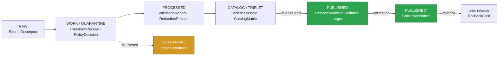
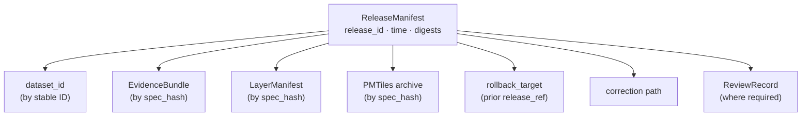
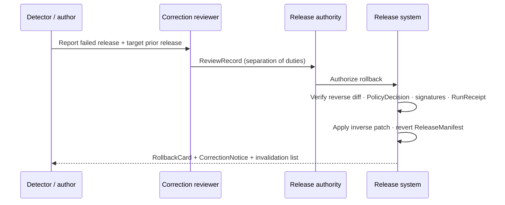

<!-- [KFM_META_BLOCK_V2]
doc_id: kfm://doc/flora-publication-and-rollback
title: Flora — Publication & Rollback
type: standard
version: v1
status: draft
owners: Domain steward (Flora); Release authority; Docs steward
created: 2026-06-03
updated: 2026-06-03
policy_label: public
related: [docs/doctrine/ai-build-operating-contract.md, docs/doctrine/directory-rules.md, docs/domains/flora/CANONICAL_PATHS.md, docs/domains/flora/CROSS_LANE_RELATIONS.md, policy/sensitivity/flora/, release/]
tags: [kfm]
notes: [Doctrine-adjacent; pins CONTRACT_VERSION = "3.0.0". Flora-lane publication, correction, stale-state, and rollback contract. All repo-state claims PROPOSED until mounted-repo verification.]
[/KFM_META_BLOCK_V2] -->

# 🌿 Flora — Publication & Rollback

> The governed path by which a Flora claim becomes **PUBLISHED**, how it is **corrected**, when it goes **stale**, and how it is **rolled back** — without ever silently deleting history.

<a id="top"></a>


| Field | Value |
|---|---|
| **Status** | `draft` |
| **Owners** | Domain steward (Flora) · Release authority · Docs steward |
| **Last updated** | 2026-06-03 |
| **Contract** | `CONTRACT_VERSION = "3.0.0"` |
| **Responsibility root** | `docs/` (explains); decisions live in `policy/`, `release/`, `schemas/`, `contracts/`, ADRs |
| **Repo home (PROPOSED)** | `docs/domains/flora/PUBLICATION_AND_ROLLBACK.md` |

> [!NOTE]
> This document **explains and navigates** the Flora publication and rollback path. It is **not** the source of canonical decisions. Canonical truth lives in `schemas/contracts/v1/...`, `contracts/flora/`, `policy/`, `release/`, and accepted ADRs. Where this doc and implementation disagree, implementation evidence wins and the conflict is logged to `docs/registers/DRIFT_REGISTER.md`.

---

## Quick jump

- [1. Scope](#1-scope)
- [2. Repo fit](#2-repo-fit)
- [3. Where publication sits in the lifecycle](#3-where-publication-sits-in-the-lifecycle)
- [4. The release gate (CATALOG → PUBLISHED)](#4-the-release-gate-catalog--published)
- [5. What a Flora release pins](#5-what-a-flora-release-pins)
- [6. Sensitivity gate (rare / protected / culturally sensitive flora)](#6-sensitivity-gate-rare--protected--culturally-sensitive-flora)
- [7. Stale state — "old" is not "wrong"](#7-stale-state--old-is-not-wrong)
- [8. Correction (PUBLISHED → PUBLISHED′)](#8-correction-published--published)
- [9. Rollback (PUBLISHED → prior release)](#9-rollback-published--prior-release)
- [10. Separation of duties](#10-separation-of-duties)
- [11. Failure reason codes](#11-failure-reason-codes)
- [12. Negative states surfaced to users](#12-negative-states-surfaced-to-users)
- [13. Verification & validation](#13-verification--validation)
- [Open questions register](#open-questions-register)
- [Open verification backlog](#open-verification-backlog)
- [Changelog v0 → v1](#changelog-v0--v1)
- [Definition of done](#definition-of-done)
- [Related docs](#related-docs)

---

## 1. Scope

This document defines the **publication, correction, stale-state, and rollback contract** for the Flora domain lane: rare and common plant taxa, occurrences, specimen records, vegetation communities, invasive-plant records, phenology observations, distribution surfaces, and habitat associations.

**In scope:**
- How a validated Flora claim crosses the **release gate** into `PUBLISHED`.
- What artifacts a Flora release must pin (`ReleaseManifest`, rollback target, correction path).
- How **rare / protected / culturally sensitive** plant locations are handled before any public surface exists.
- How `PUBLISHED` claims are marked **stale**, **corrected**, **superseded**, or **withdrawn**.
- How a release is **rolled back** to a prior release without erasing lineage.

**Out of scope** (owned elsewhere; cite, do not restate):
- Flora object semantics and identity → `docs/domains/flora/OBJECTS*` *(PROPOSED home)*, `contracts/flora/`.
- Source admission and freshness cadence → `SourceDescriptor` doctrine, `data/registry/flora/` *(PROPOSED)*.
- The generic operating law → `docs/doctrine/ai-build-operating-contract.md` (`CONTRACT_VERSION = "3.0.0"`).
- Cross-lane joins (Habitat, Fauna, Soil/Hydrology, Hazards) → `docs/domains/flora/CROSS_LANE_RELATIONS.md`.

> [!IMPORTANT]
> **Promotion is a governed state transition, not a file move and not a UI action.** Copying a file into a `published/` folder does **not** publish it. A Flora claim is published only when the release gate evaluates, records its decision, and emits a `ReleaseManifest` with a resolvable rollback target. *(CONFIRMED doctrine — Directory Rules §0 lifecycle invariant; Atlas §24.6.)*

[↑ Back to top](#top)

---

## 2. Repo fit

This doc is a **lane segment inside the `docs/` responsibility root**, not a root-level "flora" folder. Per Directory Rules §4 (placement protocol), a domain appears as a **segment** (`docs/domains/<domain>/`), never as a root itself.

```text
docs/
└── domains/
    └── flora/
        ├── PUBLICATION_AND_ROLLBACK.md   ← this doc (PROPOSED home)
        ├── CANONICAL_PATHS.md            (PROPOSED)
        ├── CROSS_LANE_RELATIONS.md       (PROPOSED)
        └── OBJECTS / OBJECT_FAMILIES     (PROPOSED)
```

**Where the decisions this doc describes actually live** *(PROPOSED responsibility roots; Atlas §24.13, Directory Rules §4 quick-check)*:

| Responsibility | Root / location family | Flora-lane segment (PROPOSED) |
|---|---|---|
| Object meaning | `contracts/` | `contracts/flora/` |
| Object shape | `schemas/` | `schemas/contracts/v1/flora/` |
| Allow / deny / restrict / abstain | `policy/` | `policy/sensitivity/flora/` |
| Release decision, manifest, rollback, correction | `release/` | `release/candidates/flora/` |
| Lifecycle artifacts | `data/<phase>/<domain>/` | `data/published/layers/flora/`, `data/registry/flora/` |
| Proof of enforceability | `tests/` + `fixtures/` | `tests/domains/flora/`, `fixtures/domains/flora/` |

> [!WARNING]
> Every Flora-lane path in this table is **PROPOSED** until verified against a mounted repository. The **rules** (which responsibility root owns which concern) are CONFIRMED doctrine; the **presence** of any specific path is not. Do not treat this tree as the current repo. *(Directory Rules §0 — "Authority of any specific path quoted here: Mixed … PROPOSED until verified.")*

[↑ Back to top](#top)

---

## 3. Where publication sits in the lifecycle

Flora follows the universal lifecycle invariant. Each arrow is a **gate** that fails closed: if the required artifacts are missing or do not resolve, the prior state is preserved and a structured negative outcome is emitted.



> [!NOTE]
> The lifecycle stages (`RAW → WORK / QUARANTINE → PROCESSED → CATALOG / TRIPLET → PUBLISHED`) are **CONFIRMED doctrine**. Their **per-stage status for the Flora lane specifically is PROPOSED** — the Atlas pipeline table marks each Flora stage `PROPOSED` pending repo verification. *(Atlas, Flora §H.)*

[↑ Back to top](#top)

---

## 4. The release gate (CATALOG → PUBLISHED)

The release gate is the **only** route a Flora claim takes to reach a public surface. It is one of the universal lifecycle gates. *(CONFIRMED doctrine — Atlas §24.6.1.)*

| Property | Requirement |
|---|---|
| **Pre-condition** | Review state present where required; **release authority distinct from the original author when materiality applies**. |
| **Required artifacts** | `ReleaseManifest` · rollback target · correction path · `ReviewRecord` (where required). |
| **Failure-closed outcome** | `HOLD` at `CATALOG`; **no public surface change**. |

**A transition is closed only when all three hold** *(CONFIRMED doctrine — Atlas §24.6.2)*:

1. the required artifacts exist;
2. every required artifact **resolves** — not merely references — its dependencies (`EvidenceRef → EvidenceBundle`, `source_id → SourceDescriptor`, `model_id → ModelRunReceipt`);
3. the policy gate **evaluated and recorded** its decision.

> [!CAUTION]
> **Unclear rights, unresolved source role, missing evidence, unresolved sensitivity, or absent release state blocks public promotion for Flora.** This is a fail-closed default, not a warning. *(CONFIRMED doctrine — Atlas, Flora §I.)*

**The trust membrane** forbids any public client, normal UI surface, or released AI surface from reaching `RAW`, `WORK`, `QUARANTINE`, canonical/internal stores, graph internals, vector indexes, source APIs, or direct model runtimes. The release gate is the only path to `PUBLISHED`, and `PUBLISHED` is the only state from which the governed API may emit `ANSWER`. *(CONFIRMED doctrine — Atlas §24.6.2.)*

[↑ Back to top](#top)

---

## 5. What a Flora release pins

When the gate allows promotion, it emits a **`ReleaseManifest`**: a single, signed, hashable JSON object listing every dataset, bundle, and tile archive in the release. Consumers (web client, catalog harvester, downstream pipelines) bind to the `ReleaseManifest` **by content hash**, never to a floating "latest" pointer. *(CONFIRMED — `KFM-P7-PROG-0003`, ReleaseManifest as the publishable artifact.)*



**Minimum manifest content** *(PROPOSED field set — `ReleaseManifest` object family, Atlas §24.2.1)*:

| Field | Purpose |
|---|---|
| `release_id` | Identity of this release. |
| `contents[]` | Every included dataset / bundle / tile archive. |
| `digests` | Content hashes per included artifact. |
| `evidence_refs[]` | Resolvable references to `EvidenceBundle`s. |
| `rollback_target` | The prior release this release can revert to. |
| `time` | Release timestamp. |

> [!TIP]
> For map products, the binding artifact is the **`MapReleaseManifest`**, which binds PMTiles to `EvidenceBundle`s, policy, sensitivity, receipts, rollback, and correction. *(PROPOSED implementation — `ML-058-031`; verify the MapReleaseManifest ↔ ReleaseManifest relationship against repo evidence.)*

<details>
<summary><strong>Why content-addressing matters (release ⇒ evidence binding)</strong></summary>

Without a release artifact, "published" is an undated, unsigned event. With a `ReleaseManifest`, every release is itself an `EvidenceBundle` in spirit: signable, gateable, citable. Any consumer that records the manifest's `spec_hash` is recording **exactly which evidence it observed**. *(CONFIRMED — `KFM-P7-PROG-0003` detailed explanation; PROPOSED: the relationship between a `ReleaseManifest` and a per-product `delta_manifest` is not fully resolved in the corpus — see Open Questions.)*

</details>

[↑ Back to top](#top)

---

## 6. Sensitivity gate (rare / protected / culturally sensitive flora)

Flora is a **sensitive lane**. Rare, protected, culturally sensitive, and steward-reviewed plant locations default to **generalized, withheld, staged, or denied** public geometry. *(CONFIRMED / PROPOSED — Atlas, Flora §I; `KFM-P19-PROG-0013`, rare-species exact-location redaction policy.)*

> [!CAUTION]
> **Exact rare / protected / culturally sensitive plant locations are DENIED by default.** They are allowed in a public release **only when** a steward review, generalized or withheld geometry, **and** a `RedactionReceipt` are all present. This routes through the operating contract's §23.2 sensitive-domain decision matrix — disposition is **not** re-derived here. *(CONFIRMED doctrine — Atlas §20.5 Deny-by-Default Register, Flora row.)*

**Default disposition when no §23.2 row clearly matches** *(operating contract §23.2; restated, not overridden)*:

```text
DENY public exact exposure
GENERALIZE before publication
REDACT when needed
QUARANTINE uncertain source material
REQUIRE steward review
REQUIRE transform receipt (RedactionReceipt)
ABSTAIN when support is inadequate
```

**Sensitivity tier transitions toward public always need both a transform receipt and a review record; downgrades toward less-public need only a correction.** *(CONFIRMED doctrine — Atlas §sensitivity-tier transitions.)*

| Transition | Required artifacts | Authority | Reversibility |
|---|---|---|---|
| `T1 → T0` (publish) | `ReleaseManifest` + `ReviewRecord` | Steward + release authority | Reversible via `RollbackCard`. |
| `Any tier → T4` (downgrade) | `CorrectionNotice` + `ReviewRecord` | Steward + rights-holder where applicable | Always permitted; precedes derivative invalidation. |

If the relevant `policy/sensitivity/flora/` entry is missing, this doc surfaces that gap rather than assuming coverage — see [Open verification backlog](#open-verification-backlog).

[↑ Back to top](#top)

---

## 7. Stale state — "old" is not "wrong"

KFM separates **stale** from **wrong**. A *stale* claim is one whose evidence, source freshness, dependent data, or context has aged past its declared tolerance. A *wrong* claim is one whose substance is incorrect. Both have **visible markers** and **traceable lifecycles**; neither is silently refreshed. *(CONFIRMED doctrine — Atlas §24.8.)*

| Marker | Triggered by | UI signal | Required action |
|---|---|---|---|
| Source freshness expired | `SourceDescriptor` cadence passed without a new admission | Stale-source badge in Evidence Drawer | Re-admit or supersede; else mark dependent Flora claims stale. |
| Schema version drift | Flora object schema upgraded past the published claim's version | Schema-drift badge; show migration ADR | Migrate, re-validate, re-release; or mark stale. |
| Geography version drift | `GeographyVersion` replaced; claim still bound to prior version | Geography-version banner | Rebind, re-release; or mark stale. |
| Time-scope outside support | Claim's temporal scope falls outside current support window | Time-out-of-support indicator | Mark stale; **do not refresh silently**. |
| Review aged out | `ReviewRecord` older than the sensitive-lane review tolerance | Review-aged badge | Trigger steward review; potentially downgrade tier. |
| Rights status changed | Rights change in `SourceDescriptor` or rights-holder communication | Rights-changed badge | Re-evaluate tier; downgrade; emit `CorrectionNotice` if needed. |

> [!NOTE]
> The negative state surfaced to users for staleness is `SOURCE_STALE`, shown on the layer badge, in the Evidence Drawer, in Focus Mode, and in the review queue. *(CONFIRMED — Unified Doctrine Synthesis §19 negative-state vocabulary.)*

[↑ Back to top](#top)

---

## 8. Correction (PUBLISHED → PUBLISHED′)

A correction is a **governed forward transition**, not a silent edit. *(CONFIRMED doctrine — Atlas §24.6.1, Correction row.)*

| Property | Requirement |
|---|---|
| **Pre-condition** | Detected error or new evidence; downstream derivatives identified. |
| **Required artifacts** | `CorrectionNotice` · `ReviewRecord` · invalidation list · `ReleaseManifest` update **or** supersession. |
| **Failure-closed outcome** | Stale-state / withdrawn announcement; **no silent edit**. |

A **`CorrectionNotice`** records that a published Flora claim was corrected: what changed, why, and what derivatives were invalidated. *(CONFIRMED — `CorrectionNotice` object family, Atlas §24.2.1. PROPOSED fields: `claim_ref`, `prior_release_ref`, `change_summary`, `invalidates[]`, `review_ref`, `time`.)*

**Supersession (not deletion).** When an `EvidenceBundle` or `SourceDescriptor` is corrected, the old artifact is **retained for audit** with a `superseded_by` link. A `ReleaseManifest` superseded by the next release keeps its rollback target valid. *(CONFIRMED doctrine — Atlas §24.8.2 supersession lineage.)*

[↑ Back to top](#top)

---

## 9. Rollback (PUBLISHED → prior release)

Rollback is modeled as an **authenticated, receipt-backed operation** — not an ad-hoc manual recovery step, and not a silent file deletion. *(PROPOSED — `KFM-P16-IDEA-0005`, authenticated rollback as a publish-and-release primitive.)*

| Property | Requirement |
|---|---|
| **Pre-condition** | Failed release or post-publication failure; targeted prior release identified. |
| **Required artifacts** | `RollbackCard` · `CorrectionNotice` · `ReleaseManifest` reverts to prior release · downstream derivative invalidation. |
| **Failure-closed outcome** | Held at current state **until rollback is validated**. |

A **`RollbackCard`** records the rollback decision and the targeted prior release. *(CONFIRMED — `RollbackCard` object family, Atlas §24.2.1. PROPOSED fields: `release_id`, `rollback_to`, `reason`, `invalidates[]`, `review_ref`, `time`.)*



> [!IMPORTANT]
> **Rollback does not silently delete history.** It reverts the `ReleaseManifest` to a prior release, emits a `RollbackCard` and `CorrectionNotice`, and invalidates downstream derivatives — the prior release remains a valid, queryable target. *(CONFIRMED doctrine — Atlas §24.6.1, Rollback row; ENCY Appendix E.)*

> [!CAUTION]
> A release system that **cannot prove rollback cannot credibly publish sensitive map artifacts.** For the Flora sensitive lane, a resolvable rollback target is a **release pre-condition**, not an afterthought. *(PROPOSED — `KFM-P16-IDEA-0005` rationale.)*

<details>
<summary><strong>Rollback gate detail (inverse-patch verification)</strong></summary>

Rollback workflows should fetch and **verify** reverse diffs, policy decisions, signatures, and run receipts **before** applying inverse patches. For graph projections, emit rollback Cypher, mutation logs, pre-state checksums, and deterministic ID maps as part of the migration receipt. *(PROPOSED — `KFM-P16-PROG-0021`; `KFM-P30-PROG-0011`. NEEDS VERIFICATION: where rollback manifests live under Directory Rules after repo verification — `release/` is the PROPOSED root.)*

</details>

[↑ Back to top](#top)

---

## 10. Separation of duties

Separation is **maturity-dependent**: early low-materiality work may be authored and approved by the same actor; as the public trust surface expands, separation must be enforced by tooling, not custom. *(CONFIRMED doctrine — Atlas §24.7.2 maturity note; Directory Rules §2.)*

| Action | May author also approve? | Required separation (PROPOSED) |
|---|---|---|
| Release to `PUBLISHED` | **No** when materiality applies | Author ≠ release authority; rights-holder rep where applicable. |
| **Sensitive-lane release (Flora rare/protected)** | **No** | Author + sensitivity reviewer + release authority + rights-holder rep. |
| Correction / rollback | **No** when steward-significant | Author / detector + correction reviewer + release authority. |

[↑ Back to top](#top)

---

## 11. Failure reason codes

When a gate fails closed, it emits a structured reason code. *(PROPOSED catalog — Atlas §24.6.3.)*

| Failure family | Reason code (PROPOSED) | Fires at | Recovery path |
|---|---|---|---|
| Missing required artifact | `MISSING_RECEIPT`, `MISSING_EVIDENCE`, `MISSING_REVIEW` | Validation / Catalog / Release | Re-emit receipt; re-run review; re-validate. |
| Rights / sensitivity unresolved | `RIGHTS_UNKNOWN`, `SENSITIVITY_UNRESOLVED` | Admission / Validation / Catalog / Release | Steward review; rights resolution; tier reassignment. |
| Review state inadequate | `REVIEW_NEEDED`, `REVIEW_INSUFFICIENT`, `REVIEW_REJECTED` | Catalog / Release | Run required review; supply `ReviewRecord`. |
| Release infrastructure error | `RELEASE_MANIFEST_INVALID`, `ROLLBACK_TARGET_MISSING` | Release | Fix manifest; supply rollback target. |

[↑ Back to top](#top)

---

## 12. Negative states surfaced to users

Negative states are **visible, not hidden**, so users can tell "we don't know" from "we know but cannot show" from "this surface is broken." *(CONFIRMED — Unified Doctrine Synthesis §19.)*

| Negative state | Meaning for Flora |
|---|---|
| `MISSING_EVIDENCE` | No `EvidenceBundle` resolves for the Flora claim. |
| `SOURCE_STALE` | Source last-update exceeds freshness threshold. |
| `DENIED_BY_POLICY` | Rights / sensitivity / release blocks display (e.g., rare-plant location). |
| `GENERALIZED_GEOMETRY` | Geometry transformed for public safety (links to `RedactionReceipt`). |
| `RELEASE_WITHDRAWN` | Previous release withdrawn; `CorrectionNotice` exists. |
| `REVIEW_PENDING` | `HOLD` state; review in progress. |

[↑ Back to top](#top)

---

## 13. Verification & validation

These Flora-lane checks are **PROPOSED** until proven against fixtures and a mounted repo. *(Atlas, Flora §K.)*

- [ ] Rights / sensitivity validators (PROPOSED).
- [ ] Exact sensitive public-geometry **denial** test (PROPOSED).
- [ ] Catalog closure tests — `EvidenceRef → EvidenceBundle` resolves (PROPOSED).
- [ ] API finite-outcome fixtures (`ANSWER` / `ABSTAIN` / `DENY` / `ERROR`) (PROPOSED).
- [ ] No-live-network fixture pipeline (PROPOSED).
- [ ] `ReleaseManifest` schema + `rollback_target` presence test (PROPOSED).
- [ ] Rollback replay test (revert `ReleaseManifest`, verify inverse patch) (PROPOSED).

> [!NOTE]
> **Rollback / failure posture for any Flora release:** default to `DENY` on the sensitive lane; per-domain rollback available; disable the layer if a leak is detected. *(CONFIRMED roadmap posture — Atlas §21 roadmap, sensitive-lane row; PROPOSED implementation.)*

[↑ Back to top](#top)

---

## Open questions register

| ID | Question | Owner role | Resolution path |
|---|---|---|---|
| OQ-FLORA-PUB-01 | Where do Flora rollback manifests live under Directory Rules — `release/candidates/flora/` or `data/.../rollback/`? | Docs steward + release authority | Directory Rules check + ADR / repo inspection |
| OQ-FLORA-PUB-02 | What is the `ReleaseManifest` ↔ per-product `delta_manifest` relationship for Flora map layers? | Release authority | ADR (corpus notes overlap; `KFM-P7-PROG-0003`) |
| OQ-FLORA-PUB-03 | What review cadence ages out a Flora sensitive-lane `ReviewRecord`? | Domain steward (Flora) | Sensitivity-tier ratification ADR |
| OQ-FLORA-PUB-04 | Is the Flora map binding artifact `MapReleaseManifest`, `ReleaseManifest`, or both? | Release authority | Repo inspection + `ML-058-031` reconciliation |

## Open verification backlog

These items remain `NEEDS VERIFICATION` before promotion from `draft` to `published`:

1. The `docs/domains/flora/PUBLICATION_AND_ROLLBACK.md` home and all sibling paths in §2 (mounted-repo verification).
2. Presence and contents of `policy/sensitivity/flora/` entries referenced by §6.
3. `ReleaseManifest` / `MapReleaseManifest` schema homes under `schemas/contracts/v1/flora/` or a shared release schema.
4. Existence of the Flora release/rollback fixtures listed in §13.
5. Per-stage Flora pipeline status (Atlas marks each `PROPOSED`).
6. Whether the Flora feature/detail resolver uses `FloraDecisionEnvelope` or the canonical `RuntimeResponseEnvelope`.

## Changelog v0 → v1

| Change | Type (per contract §37) | Reason |
|---|---|---|
| Initial Flora publication & rollback contract | new | First lane-specific publication/correction/stale/rollback doc for Flora. |
| Pinned `CONTRACT_VERSION = "3.0.0"` | housekeeping | Doctrine-adjacent doc requirement. |
| Restated §23.2 disposition without re-deriving it | clarification | Defer sensitivity disposition to the operating contract matrix. |

> **Backward compatibility.** This is a new doc; no prior anchors exist to break. Section anchors (`#release-gate`, `#rollback-published--prior-release`, etc.) are intended to be stable. Future changes follow the operating contract §37 lifecycle (default MINOR bump for non-operating-law edits).

## Definition of done

This document is done enough to enter the repository when:

- it is placed according to Directory Rules (`docs/domains/flora/`);
- a docs steward and the Flora domain steward review it;
- it is linked from the Flora domain index and a doctrine/release index;
- it does not conflict with accepted ADRs (schema home, envelope migration, sensitivity-tier ratification);
- any conflict with current repo conventions is logged in `docs/registers/DRIFT_REGISTER.md`;
- the `GENERATED_RECEIPT.json` planned in the authoring notes is wired into CI;
- future changes follow the operating contract §37 lifecycle.

---

## Related docs

- [`docs/doctrine/ai-build-operating-contract.md`](../../doctrine/ai-build-operating-contract.md) — operating law (`CONTRACT_VERSION = "3.0.0"`)
- [`docs/doctrine/directory-rules.md`](../../doctrine/directory-rules.md) — placement authority
- [`docs/domains/flora/CROSS_LANE_RELATIONS.md`](./CROSS_LANE_RELATIONS.md) — Flora cross-lane joins *(PROPOSED)*
- [`docs/domains/flora/CANONICAL_PATHS.md`](./CANONICAL_PATHS.md) — Flora path inventory *(PROPOSED)*
- `policy/sensitivity/flora/` — Flora sensitivity policy entries *(PROPOSED / TODO)*
- `release/` — release decisions, manifests, rollback cards *(PROPOSED)*

_Last updated: 2026-06-03 · `CONTRACT_VERSION = "3.0.0"`_

[↑ Back to top](#top)
